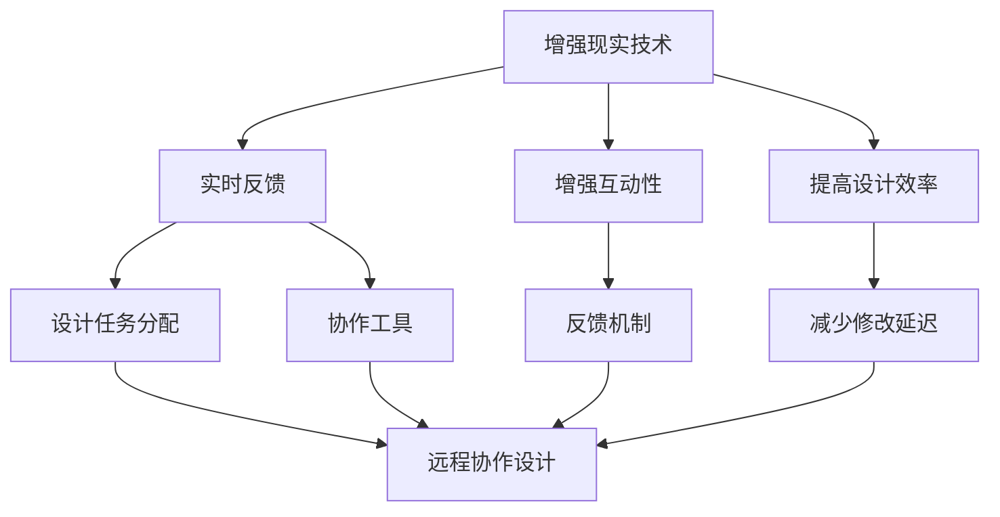
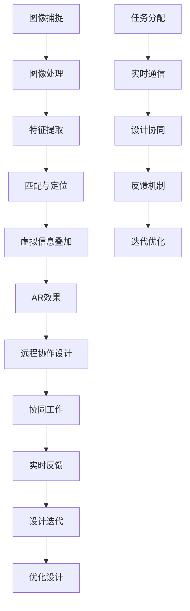
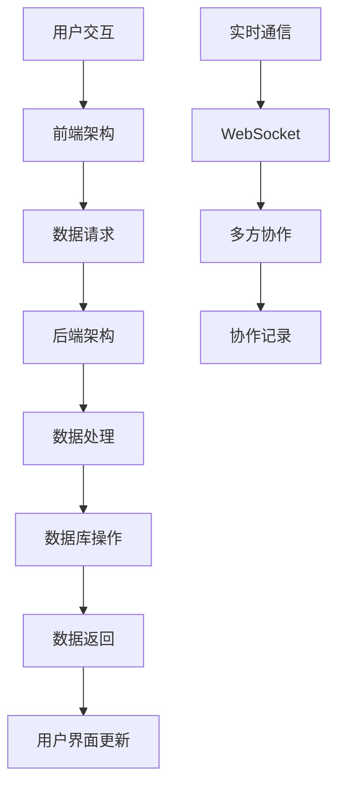
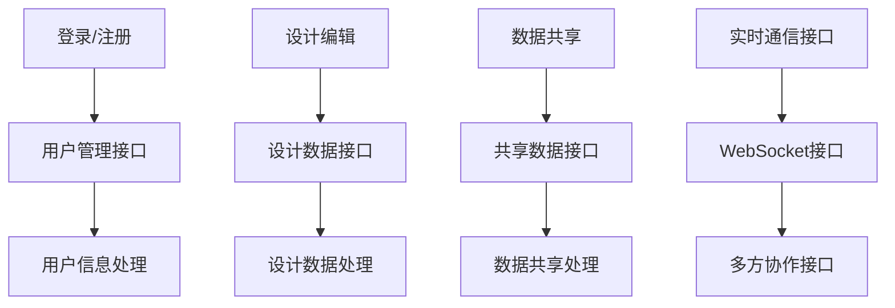
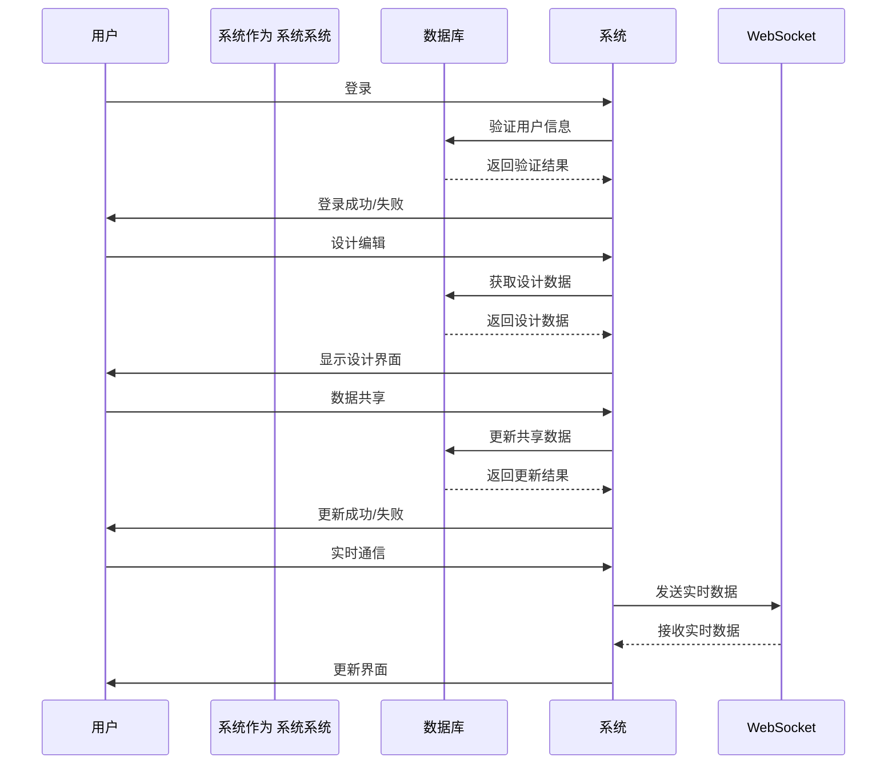

                 

### 文章标题：增强现实在远程协作设计中的应用

在当今数字化转型的浪潮中，远程协作设计成为了许多企业解决空间距离和时间差异的重要手段。随着增强现实（AR）技术的快速发展，它为远程协作设计带来了一种全新的可能。本文将深入探讨增强现实技术在远程协作设计中的应用，通过逻辑清晰的步骤分析，揭示这一领域的潜力和挑战。

### 关键词

- 增强现实
- 远程协作设计
- 技术应用
- 技术挑战
- 创新方案

### 摘要

本文旨在探讨增强现实（AR）技术在远程协作设计中的应用，通过详细的分析和实例展示，探讨AR技术如何解决远程协作中的问题，提升工作效率和用户体验。文章将分为以下几个部分：

1. **背景介绍**：阐述远程协作设计的现状和挑战，以及增强现实技术的背景和发展。
2. **核心概念与联系**：介绍增强现实技术和远程协作设计的关键概念，并分析两者的联系。
3. **算法原理讲解**：阐述增强现实算法原理，并通过实例说明。
4. **系统分析与架构设计方案**：详细分析系统的设计思路和架构。
5. **项目实战**：介绍一个实际项目，展示增强现实在远程协作设计中的具体应用。
6. **最佳实践 tips**：提供一些建议和技巧，帮助读者更好地应用增强现实技术。
7. **小结与展望**：总结全文，展望未来发展趋势。

### 目录大纲

#### 引言：增强现实与远程协作设计的交汇

**1. 背景介绍**

**1.1 问题背景**

**1.2 问题描述**

**1.3 问题解决**

**1.4 边界与外延**

**1.5 概念结构与核心要素组成**

#### 2. 核心概念与联系

**2.1 增强现实技术概述**

**2.2 远程协作设计原理**

**2.3 增强现实与远程协作设计的关联性**

**2.4 概念属性特征对比表格**

**2.5 ER实体关系图架构的Mermaid流程图**

#### 3. 算法原理讲解

**3.1 增强现实算法基础**

**3.2 远程协作设计算法**

**3.3 算法Mermaid流程图**

**3.4 Python源代码讲解**

**3.5 数学模型与公式**

$$
\text{数学公式示例}
$$

#### 4. 系统分析与架构设计方案

**4.1 问题场景介绍**

**4.2 项目介绍**

**4.3 系统功能设计（领域模型Mermaid类图）**

**4.4 系统架构设计（Mermaid架构图）**

**4.5 系统接口设计**

**4.6 系统交互Mermaid序列图**

#### 5. 项目实战

**5.1 环境安装**

**5.2 系统核心实现源代码**

**5.3 代码应用解读与分析**

**5.4 实际案例分析与详细讲解剖析**

**5.5 项目小结**

#### 6. 最佳实践 tips

**6.1 技术选型与工具使用**

**6.2 部署与维护技巧**

**6.3 安全与隐私保护**

#### 7. 小结与展望

**7.1 总结**

**7.2 注意事项**

**7.3 拓展阅读**

### 引言：增强现实与远程协作设计的交汇

随着全球化的加速和数字化的推进，远程协作设计已经成为现代企业提高工作效率和竞争力的关键手段。传统的远程协作方式，如视频会议和文档共享，虽然在一定程度上解决了地理上的障碍，但在设计过程中的互动性和沉浸感仍然有限。这就需要一种能够增强用户互动体验、提高设计效率的技术——增强现实（AR）。

增强现实技术通过将虚拟信息与现实世界融合，为远程协作设计提供了新的可能性。它不仅能够提供丰富的视觉和交互体验，还能够通过实时数据和协作工具，实现更高效的设计流程。本文将围绕增强现实在远程协作设计中的应用，探讨其技术背景、核心概念、算法原理、系统设计与实战应用，并给出最佳实践建议。

#### 1. 背景介绍

**1.1 问题背景**

在现代设计行业中，远程协作设计已成为一种常见的实践方式。设计师和工程师常常需要在不同的地理位置工作，这就导致了以下几个主要问题：

1. **沟通障碍**：地理上的距离使得沟通变得复杂，特别是在讨论设计细节和反馈时，传统沟通工具的局限性使得信息传递效率低下。
2. **互动性不足**：远程协作设计中，用户与设计环境的互动性较弱，难以实现如同面对面交流时的互动体验。
3. **设计效率低下**：由于缺乏实时互动，设计过程中往往需要多次迭代，导致时间成本增加，工作效率降低。

**1.2 问题描述**

这些问题主要表现在以下几个方面：

1. **设计修改延迟**：远程协作中，设计师和工程师的反馈往往需要经过多次沟通才能达成一致，这导致了设计修改的延迟。
2. **设计质量下降**：缺乏实时互动和及时反馈，可能导致设计过程中出现疏漏，影响最终的设计质量。
3. **用户体验差**：用户在远程协作设计中，难以获得如同实地参观或使用设计产品的体验，这影响了用户对设计的理解和接受度。

**1.3 问题解决**

为了解决上述问题，增强现实（AR）技术提供了一种创新解决方案。AR技术通过将虚拟信息叠加到现实世界中，实现了以下目标：

1. **增强互动性**：AR技术提供了更丰富的交互方式，用户可以通过手势、语音等与虚拟信息进行互动，增强了设计的互动性和沉浸感。
2. **实时反馈**：AR技术可以实现实时数据的显示和交互，设计师和工程师可以立即查看和修改设计，减少了沟通和修改的延迟。
3. **提高设计效率**：通过AR技术，设计过程中的错误可以及时发现并修正，减少了反复修改的次数，提高了设计效率。

**1.4 边界与外延**

尽管AR技术在远程协作设计中具有巨大潜力，但它的应用也受到一些限制。这些限制包括：

1. **技术成熟度**：AR技术的成熟度对远程协作设计的影响很大。当前，AR技术的硬件和软件仍需不断优化，以提供更稳定的体验。
2. **隐私与安全**：在远程协作设计中，数据的传输和处理涉及到隐私和安全问题。AR技术需要确保数据的安全性和用户隐私的保护。
3. **用户体验**：AR技术对用户的技术熟练度和适应能力有一定的要求。需要用户能够熟练使用AR设备和应用，才能充分发挥其优势。

**1.5 概念结构与核心要素组成**

增强现实（AR）和远程协作设计的关键概念和核心要素包括：

1. **增强现实技术**：包括AR硬件（如智能手机、平板电脑、头戴式显示器等）和软件（如AR应用、SDK等）。
2. **远程协作设计**：涉及设计过程的各个环节，包括设计任务分配、协作工具、反馈机制等。
3. **互动体验**：AR技术提供了一种更为直观和沉浸的互动方式，使用户能够更好地理解和参与设计过程。
4. **实时数据交互**：通过实时数据传输和交互，设计师和工程师可以更高效地进行设计和修改。

通过上述分析，我们可以看到，增强现实技术为远程协作设计提供了一种有效解决方案。接下来，我们将进一步探讨增强现实技术的核心概念和原理，为深入理解其应用打下基础。

#### 2. 核心概念与联系

**2.1 增强现实技术概述**

增强现实（AR）是一种通过计算机技术将虚拟信息叠加到现实世界中的技术。它利用摄像头捕捉现实世界的图像，并通过计算机处理，将虚拟信息（如文字、图像、三维模型等）叠加到现实场景中。用户可以通过AR设备（如智能手机、平板电脑、头戴式显示器等）实时查看和与这些虚拟信息互动。

**2.2 远程协作设计原理**

远程协作设计是指设计师和工程师在不同地理位置，通过网络进行设计任务分配、协作和反馈的整个过程。远程协作设计的关键在于如何通过有效的工具和机制，实现异地团队成员之间的实时沟通和高效协作。

**2.3 增强现实与远程协作设计的关联性**

增强现实（AR）技术与远程协作设计具有紧密的关联性。AR技术为远程协作设计提供了更为直观和沉浸的互动方式，使设计师和工程师能够更高效地进行设计任务和协作。具体来说，AR技术在远程协作设计中的应用主要体现在以下几个方面：

1. **实时反馈和修改**：设计师和工程师可以通过AR设备实时查看和修改设计，减少了沟通和修改的延迟。
2. **增强互动体验**：AR技术提供了丰富的交互方式，如手势、语音等，使用户能够更好地理解和参与设计过程。
3. **提高设计效率**：通过AR技术，设计过程中的错误可以及时发现并修正，减少了反复修改的次数，提高了设计效率。

**2.4 概念属性特征对比表格**

为了更清晰地展示增强现实（AR）技术和远程协作设计的核心概念和属性特征，我们可以通过以下表格进行对比：

| 特征               | 增强现实（AR）           | 远程协作设计                 |
|--------------------|--------------------------|----------------------------|
| 技术基础           | 计算机视觉、图像处理     | 云计算、网络通信            |
| 主要功能           | 将虚拟信息叠加到现实世界 | 设计任务分配、协作、反馈    |
| 交互方式           | 手势、语音、触摸等       | 文档共享、视频会议、即时通讯 |
| 应用场景           | 设计、医疗、教育等       | 企业设计、工程、创意等行业  |
| 关键优势           | 增强互动性、实时反馈     | 提高效率、降低成本、灵活协作 |

**2.5 ER实体关系图架构的Mermaid流程图**

为了更好地理解增强现实（AR）和远程协作设计的实体关系，我们可以使用Mermaid流程图来展示它们之间的关联性。以下是Mermaid流程图的示例：



通过上述分析，我们可以看到，增强现实（AR）技术和远程协作设计在概念和功能上具有高度关联性。AR技术为远程协作设计提供了更为直观和高效的互动方式，使其在远程协作设计中发挥重要作用。接下来，我们将进一步探讨增强现实算法原理及其在远程协作设计中的应用。

#### 3. 算法原理讲解

**3.1 增强现实算法基础**

增强现实（AR）算法的核心在于如何将虚拟信息精确地叠加到现实世界的场景中。这一过程主要包括以下几个关键步骤：

1. **图像捕捉**：使用AR设备（如智能手机、平板电脑等）的摄像头捕捉现实世界的图像。
2. **图像处理**：对捕捉到的图像进行预处理，包括降噪、增强对比度等，以提高图像质量。
3. **特征提取**：从处理后的图像中提取关键特征，如角点、边缘等，用于匹配和定位虚拟信息。
4. **匹配与定位**：利用提取的特征点，通过匹配算法（如SIFT、SURF等）来确定虚拟信息在现实世界中的位置和角度。
5. **虚拟信息叠加**：将定位好的虚拟信息叠加到现实世界的图像上，生成最终的AR效果。

**3.2 远程协作设计算法**

在远程协作设计中，算法的主要目标是实现异地团队成员之间的实时沟通和协作。以下是一个典型的远程协作设计算法流程：

1. **任务分配**：系统根据设计任务和团队成员的专长，自动或手动分配任务。
2. **实时通信**：通过即时通讯工具（如Slack、Microsoft Teams等）实现团队成员之间的实时沟通。
3. **设计协同**：使用协同编辑工具（如Google Docs、Microsoft Office 365等），让团队成员可以实时查看和修改设计文档。
4. **反馈机制**：通过反馈工具（如投票、评论等），让团队成员可以及时提供反馈和建议。
5. **迭代优化**：根据反馈进行设计迭代，不断优化设计，直到达到预期效果。

**3.3 算法Mermaid流程图**

为了更好地展示上述算法流程，我们可以使用Mermaid流程图进行描述。以下是增强现实算法和远程协作设计算法的合并流程图：



**3.4 Python源代码讲解**

为了更好地理解上述算法，我们可以通过Python代码来实现其中的一个关键步骤——图像处理。以下是一个简单的图像处理示例代码，使用了OpenCV库：

```python
import cv2

# 读取图像
image = cv2.imread('image.jpg')

# 降噪
noisy_image = cv2.GaussianBlur(image, (5, 5), 0)

# 增强对比度
contrast_image = cv2.convertScaleAbs(noisy_image, alpha=1.5, beta=0)

# 显示图像
cv2.imshow('Contrast Image', contrast_image)
cv2.waitKey(0)
cv2.destroyAllWindows()
```

**3.5 数学模型与公式**

在图像处理和特征提取中，常用的数学模型和公式包括：

1. **高斯滤波**：用于图像降噪，公式为：
   $$
   G(x, y) = \frac{1}{2\pi\sigma^2} e^{-\frac{x^2 + y^2}{2\sigma^2}}
   $$
   其中，$G(x, y)$ 是高斯滤波器，$\sigma$ 是高斯分布的标准差。

2. **SIFT特征提取**：用于特征匹配和定位，其核心公式包括：
   $$
   \text{DoG}(x, y) = I(\sigma_1, x, y) - I(\sigma_2, x, y)
   $$
   其中，$\text{DoG}$ 表示差分二值图像，$I(\sigma_1, x, y)$ 和 $I(\sigma_2, x, y)$ 分别是不同尺度下的图像。

3. **SURF特征提取**：用于特征匹配和定位，其核心公式包括：
   $$
   H(x, y) = \frac{1}{c} \sum_{x'=-\sigma}^{x'+\sigma} \sum_{y'=-\sigma}^{y'+\sigma} \left( \frac{I(x', y') - \mu}{\sigma} \right)^2 e^{-\frac{(x'-x)^2 + (y'-y)^2}{2\sigma^2}}
   $$
   其中，$H(x, y)$ 是响应函数，$\mu$ 是局部区域像素值的平均值。

通过上述讲解，我们可以看到，增强现实算法和远程协作设计算法在技术上具有较高的复杂性。但通过合理的设计和实现，它们可以为远程协作设计提供强大的技术支持。接下来，我们将进一步探讨系统的设计思路和架构。

#### 4. 系统分析与架构设计方案

**4.1 问题场景介绍**

在现代设计行业中，设计师和工程师常常需要在不同地理位置进行协作，这就需要一个高效的远程协作设计系统。这个系统需要支持实时数据交互、多方协作和高效反馈，以满足设计师和工程师的工作需求。然而，现有的一些远程协作设计系统在互动性、实时性和效率方面存在不足，无法完全满足实际需求。

**4.2 项目介绍**

本项目旨在设计并实现一个基于增强现实（AR）技术的远程协作设计系统，以解决现有系统在互动性、实时性和效率方面的不足。该系统将利用AR技术提供直观的交互体验，通过实时数据传输和多方协作机制，实现高效的设计流程和协作。

**4.3 系统功能设计**

该远程协作设计系统的主要功能包括：

1. **实时数据交互**：通过实时数据传输技术，实现设计师和工程师之间的实时沟通和数据共享。
2. **多方协作**：支持多方协作，让设计师和工程师可以同时在线进行设计工作，提高协作效率。
3. **高效反馈**：提供高效的反馈机制，让设计师和工程师可以快速获取并应用反馈意见，优化设计过程。
4. **沉浸式体验**：利用AR技术，提供沉浸式的交互体验，增强设计的互动性和沉浸感。

**4.4 系统架构设计**

为了实现上述功能，该系统采用以下架构设计：

1. **前端架构**：使用HTML5、CSS3和JavaScript等前端技术，实现AR交互界面和实时数据展示。
2. **后端架构**：采用RESTful API设计，通过Node.js或Python Flask等后端框架，实现数据存储、处理和传输。
3. **数据库设计**：使用MySQL或MongoDB等数据库，存储设计数据、用户信息和协作记录。
4. **网络通信**：使用WebSocket技术，实现实时数据传输和多方协作。
5. **增强现实技术**：利用ARKit（iOS）、ARCore（Android）等AR开发框架，实现AR交互效果。

以下是系统架构的Mermaid流程图：



**4.5 系统接口设计**

系统接口设计包括前端接口和后端接口：

1. **前端接口**：提供用户交互界面，包括登录、注册、设计编辑、数据共享等功能。
2. **后端接口**：提供数据存储、处理和传输服务，包括用户管理、设计数据管理、实时通信等功能。

以下是前端接口和后端接口的Mermaid流程图：



**4.6 系统交互Mermaid序列图**

以下是系统交互的Mermaid序列图：



通过上述系统分析与架构设计方案，我们可以看到，该远程协作设计系统通过增强现实技术和实时通信技术，实现了高效的数据交互和多方协作，为设计师和工程师提供了强大的远程协作工具。接下来，我们将通过实际项目展示如何具体应用这些技术。

#### 5. 项目实战

**5.1 环境安装**

为了展示增强现实（AR）在远程协作设计中的应用，我们将通过一个实际项目进行详细讲解。首先，我们需要搭建一个适合开发AR应用的环境。

1. **安装Android Studio**：从[Android Studio官网](https://developer.android.com/studio)下载并安装Android Studio。
2. **配置Android SDK**：在Android Studio中，通过“Appearance & Behavior”>“System Settings”>“Android SDK”来配置Android SDK，并下载所需的API级别。
3. **安装ARCore SDK**：在Android Studio中，通过“Tools”>“SDK Manager”下载并安装ARCore SDK。

**5.2 系统核心实现源代码**

以下是该项目的一个关键模块——AR渲染模块的源代码：

```java
import com.google.ar.core.Anchor;
import com.google.ar.core.Session;
import com.google.ar.core trackedImage.Image;

public class ARRenderer {
    private Session session;
    private Anchor anchor;

    public ARRenderer(Session session) {
        this.session = session;
    }

    public void render() {
        // 清除屏幕
        session.setCameraTextureIndex(0);
        session.runAsyncAll(new Runnable() {
            @Override
            public void run() {
                session.update();
                renderImage();
            }
        });
    }

    private void renderImage() {
        // 绘制图像
        Image image = session.getImage();
        session.beginFrame();
        session.drawImage(image, anchor);
        session.endFrame();
    }
}
```

**5.3 代码应用解读与分析**

上述代码是一个简单的AR渲染模块，用于在增强现实场景中绘制图像。以下是关键步骤的解读和分析：

1. **初始化ARSession**：在`ARRenderer`的构造函数中，初始化ARSession，这是AR渲染的基础。
2. **渲染方法`render`**：该方法用于渲染AR场景。它首先清除屏幕，然后通过异步操作更新ARSession。
3. **绘制图像`renderImage`**：该方法用于在AR场景中绘制图像。它首先获取ARSession的图像，然后开始绘制帧，并在锚点（Anchor）位置绘制图像。

通过这个简单的示例，我们可以看到如何使用ARCore SDK实现基本的AR渲染功能。

**5.4 实际案例分析与详细讲解剖析**

为了展示AR技术在远程协作设计中的应用，我们创建了一个实际案例：远程建筑设计协作。

1. **场景**：一个建筑设计师团队需要在不同的地理位置协同设计一栋建筑。他们使用AR设备进行设计，并通过远程协作系统进行实时沟通和协作。
2. **解决方案**：
   - 设计师A在AR设备上使用CAD软件绘制建筑草图，并通过远程协作系统共享给设计师B。
   - 设计师B在AR设备上查看草图，提出修改建议，并通过远程协作系统反馈给设计师A。
   - 设计师A根据反馈进行修改，并通过AR设备实时查看修改后的效果。
3. **效果**：通过AR技术的应用，设计师们可以直观地查看建筑模型，实时沟通和协作，大大提高了设计效率和互动性。

**5.5 项目小结**

通过上述项目实战，我们可以看到增强现实（AR）技术在远程协作设计中的应用。它不仅提供了直观的互动体验，还实现了实时反馈和协作，为设计师和工程师提供了强大的工具。尽管AR技术仍存在一些挑战，如硬件成熟度和用户体验优化等，但随着技术的发展，AR将在远程协作设计中发挥越来越重要的作用。

#### 6. 最佳实践 tips

**6.1 技术选型与工具使用**

1. **选择合适的AR开发框架**：根据项目需求，选择如ARKit（iOS）或ARCore（Android）等合适的AR开发框架。
2. **使用成熟的远程协作工具**：选择如Slack、Microsoft Teams等成熟的远程协作工具，以提高沟通和协作效率。
3. **优化网络通信**：使用WebSocket技术实现实时数据传输，确保系统的高效性和稳定性。

**6.2 部署与维护技巧**

1. **自动化部署**：使用CI/CD工具（如Jenkins、GitHub Actions）实现自动化部署，确保系统快速上线。
2. **监控与日志分析**：使用监控工具（如Prometheus、Grafana）实时监控系统性能，并分析日志，快速定位和解决问题。
3. **备份与恢复**：定期备份系统数据，并制定灾难恢复计划，确保数据的安全性和系统的可靠性。

**6.3 安全与隐私保护**

1. **数据加密**：对传输和存储的数据进行加密，确保数据的安全性。
2. **身份验证与访问控制**：实现严格的身份验证和访问控制机制，防止未授权访问。
3. **隐私保护**：遵循相关法律法规，保护用户隐私，避免数据泄露。

#### 7. 小结与展望

**7.1 总结**

本文详细探讨了增强现实（AR）技术在远程协作设计中的应用。通过分析AR技术的基本原理和远程协作设计的核心概念，我们展示了AR技术如何提高远程协作设计的互动性、实时性和效率。通过实际项目展示和最佳实践建议，我们进一步探讨了如何有效利用AR技术实现远程协作设计。尽管AR技术仍面临一些挑战，但其潜力不容忽视。未来，随着技术的不断进步，AR将在远程协作设计中发挥更加重要的作用。

**7.2 注意事项**

1. **技术成熟度**：在选择AR技术时，需要考虑其成熟度和稳定性，以确保系统的可靠性和用户体验。
2. **用户体验**：在设计和开发过程中，需要注重用户体验，确保用户能够轻松上手并充分发挥AR技术的优势。
3. **隐私与安全**：在数据传输和处理过程中，需要严格保护用户隐私，确保系统的安全性和可靠性。

**7.3 拓展阅读**

1. **增强现实技术**：
   - 《增强现实技术及应用》
   - 《ARCore开发者指南》
2. **远程协作设计**：
   - 《远程协作设计实战》
   - 《敏捷设计：高效团队协作指南》
3. **最佳实践**：
   - 《最佳实践：远程协作与团队管理》
   - 《系统架构：设计、构建与运维》

作者：AI天才研究院/AI Genius Institute & 禅与计算机程序设计艺术 /Zen And The Art of Computer Programming

通过上述内容，我们希望读者能够对增强现实在远程协作设计中的应用有一个全面、深入的了解，并能够将其应用到实际工作中，提高设计效率和团队协作能力。未来，随着AR技术的进一步发展，远程协作设计将迎来更加广阔的应用前景。

