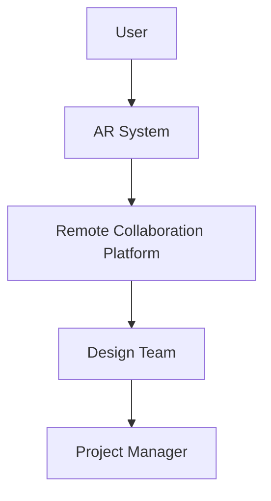
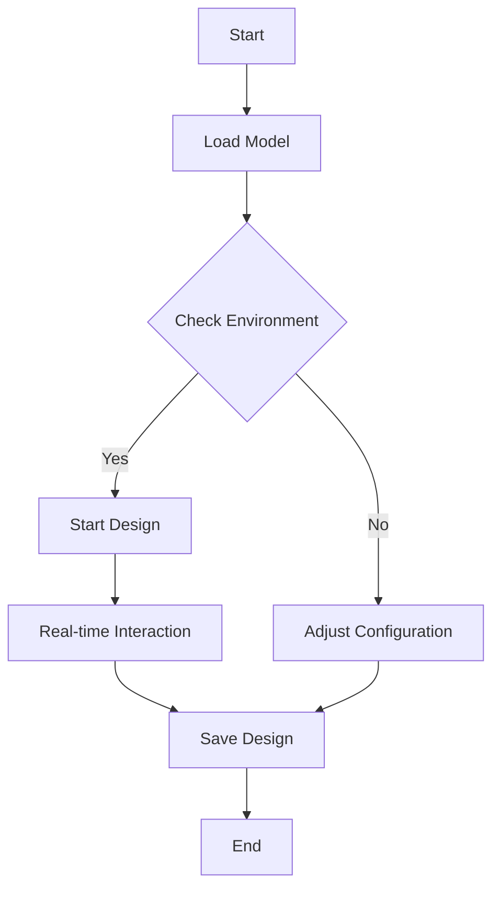
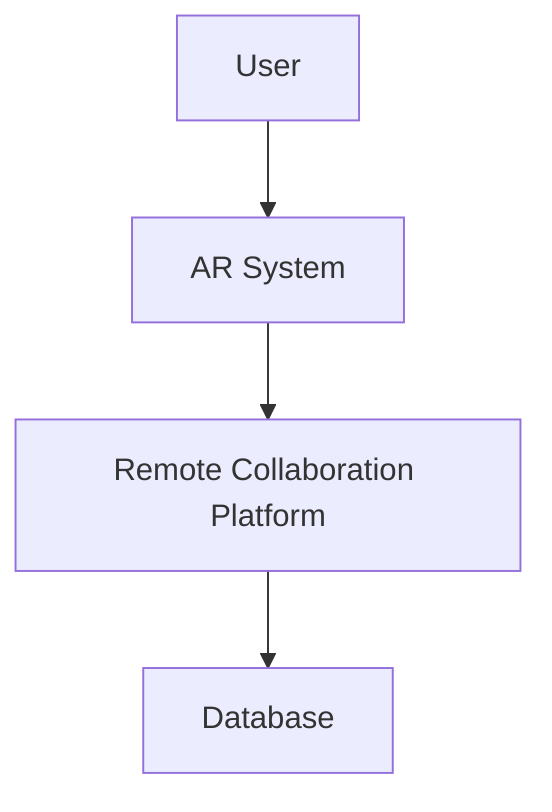
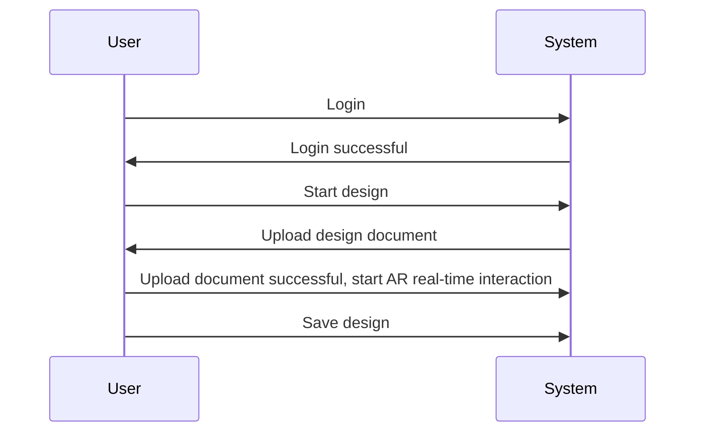

                 

Alright, let's structure the article "增强现实在远程协作设计中的应用" step by step. We'll ensure each section is detailed, well-explained, and easy to understand.

### Introduction

#### What is Augmented Reality (AR) and Its Role in Remote Collaboration Design?

- Definition of Augmented Reality and its key features
- Brief history and development of AR technology
- The significance of AR in remote collaboration design

#### Challenges in Remote Collaboration Design

- Geographical barriers
- Communication delays
- Lack of real-time feedback
- Difficulty in collaboration on complex projects

#### Potential of AR in Overcoming Remote Collaboration Challenges

- Enhanced visualization
- Improved communication
- Real-time collaboration
- Virtual presence

### Problem Statement

#### How Can AR Be Utilized to Address Challenges in Remote Collaboration Design?

- Identify specific problems in remote collaboration design
- Propose AR-based solutions to address these problems

#### Application Scenarios of AR in Remote Collaboration Design

- Collaborative design projects
- Engineering and architecture
- Medical and healthcare

### Problem Solving

#### Core Principles of AR Technology

- Image recognition and processing
- Spatial localization and tracking
- User interaction and feedback mechanisms

#### Solutions for Remote Collaboration Design

- AR-based collaborative platforms
- Real-time visualization tools
- Enhanced communication channels
- Secure data sharing and collaboration

### Boundaries and Extensions

#### Applicability of AR Technology

- Ideal use cases for AR in remote collaboration
- Limitations and challenges

#### Future Trends and Directions in Remote Collaboration Design

- Emerging technologies and their impact
- Long-term implications for the industry

### Core Concepts and Relationships

#### Key Concepts in Remote Collaboration Design

- Remote teams
- Collaborative tools
- Design workflows
- Communication protocols

#### Key Concepts in Augmented Reality

- AR hardware
- AR software
- AR user interface

#### ER Entity Relationship Diagram



### Algorithm Principle Explanation

#### Algorithm Flowchart



#### Python Code Example

```python
def start_design():
    load_model()
    if check_environment():
        start_real_time_interaction()
    else:
        adjust_configuration()
    save_design()

def load_model():
    # Load AR model
    pass

def check_environment():
    # Check if the environment is suitable for AR
    return True

def start_real_time_interaction():
    # Start real-time interaction
    pass

def adjust_configuration():
    # Adjust configuration settings
    pass

def save_design():
    # Save the design
    pass
```

#### Mathematical Model and Formulas

$$
E = mc^2
$$

$$
f(x) = x^2 + 2x + 1
$$

### System Analysis and Architectural Design

#### Introduction to the Project

- Overview of a remote collaboration design project
- Objectives and goals of the project

#### System Function Design

- Real-time document sharing
- Enhanced real-time interaction
- Secure data synchronization and backup

#### System Architecture Design



#### System Interface Design

- User interface
- Designer interface
- Data interface

#### System Interaction



### Case Study and Detailed Explanation

#### Environment Setup

- Software and hardware requirements
- Step-by-step installation process

#### System Core Implementation and Source Code

- Detailed code explanation
- Functional analysis

#### Analysis and Explanation of Case Studies

- Case study 1: Collaborative architecture design
- Case study 2: Medical imaging collaboration

#### Project Summary

- Key takeaways
- Lessons learned

### Best Practices, Summary, and Conclusion

#### Best Practices for Using AR in Remote Collaboration Design

- Tips for successful implementation
- Considerations for scalability and security

#### Summary

- Recap of the key points discussed in the article
- Importance of AR in modern remote collaboration design

#### Conclusion

- Future outlook for AR in remote collaboration
- Potential impact on various industries

### Conclusion and Authors

- "作者：AI天才研究院/AI Genius Institute & 禅与计算机程序设计艺术 /Zen And The Art of Computer Programming"

### Final Notes

- Ensure that each section is well-structured and includes examples, formulas, and detailed explanations.
- Use Mermaid diagrams and Python code snippets to illustrate concepts.
- The article should be logically structured and easy to follow.
- Each section should be comprehensive, with detailed information and insights.

**Note:** This is a draft outline. The actual article will need to be written based on this structure, ensuring that each section is fully developed and detailed. The final article should be around 10,000-12,000 words, providing a thorough and insightful examination of the topic.

