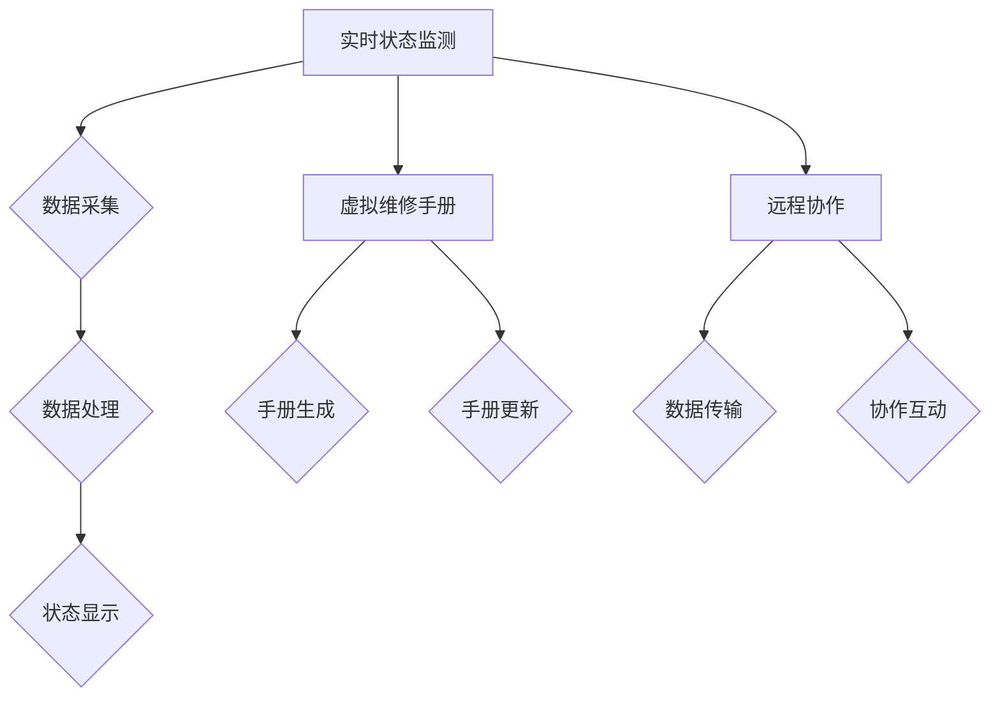
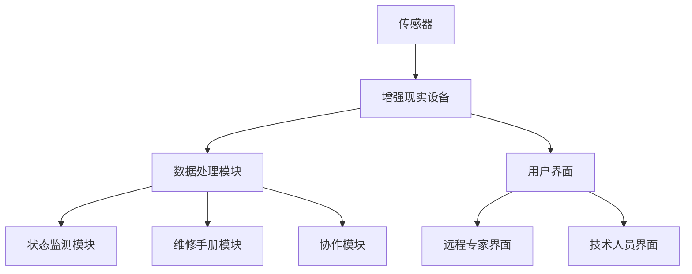
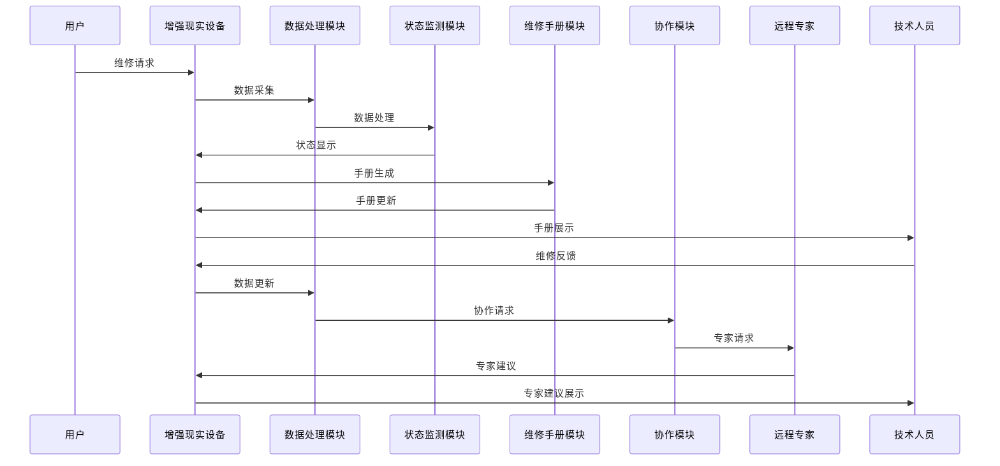

                 

### 引言

**文章标题：增强现实在远程工业设备维修中的应用**

**关键词：增强现实、工业设备维修、远程监控、技术创新**

**摘要：**
随着现代工业的不断发展，工业设备的复杂性和规模不断扩大，传统的现场维修模式已难以满足高效、准确和安全的维护需求。增强现实（Augmented Reality，AR）技术的迅速崛起，为远程工业设备维修提供了一种全新的解决方案。本文将详细探讨增强现实技术在远程工业设备维修中的应用，分析其技术背景、核心优势以及未来发展的潜在方向。

**背景介绍：**
增强现实技术是一种将虚拟信息与现实世界相结合的技术，通过计算机生成的虚拟图像叠加到真实环境中，为用户提供更加直观和互动的体验。近年来，随着硬件设备性能的提升、算法优化以及数据传输速度的加快，增强现实技术在多个领域得到了广泛应用，尤其是在医疗、教育、娱乐等领域。然而，在工业设备维修领域，增强现实技术的应用仍处于探索阶段，但其潜力巨大，有望改变传统维修模式，提高维修效率和质量。

**问题背景与问题描述：**
工业设备维修是一项复杂且高风险的任务，需要专业技术人员具备丰富的知识和经验。然而，许多工业设备安装在偏远或危险的环境中，现场维修条件受限，传统维修模式存在诸多不足。首先，技术人员无法实时获取设备运行状态和故障信息，维修决策依赖于经验，容易出现误判和误操作。其次，现场维修过程中，技术人员往往需要依赖纸质文档或电子设备查阅维修手册，信息获取效率低下。此外，远程协作困难，无法实现实时指导和交互。

**问题解决：**
增强现实技术的引入，为远程工业设备维修提供了一种可能的解决方案。通过增强现实设备，技术人员可以在远程环境下实时获取设备运行状态和故障信息，结合虚拟维修手册和辅助工具，实现高效、准确的维修操作。此外，增强现实技术还可以实现远程协作，将现场技术人员与远程专家实时连接，实现实时沟通和指导，提高维修效率和安全性。

**边界与外延：**
本文主要讨论增强现实技术在远程工业设备维修中的应用，包括技术背景、应用场景、关键技术、应用案例和安全问题等。同时，本文还将探讨增强现实技术在工业维修领域的潜在发展方向，为相关研究和实践提供参考。

**概念结构与核心要素组成：**
1. **增强现实技术：** 通过计算机生成的虚拟图像叠加到真实环境中，为用户提供直观和互动的体验。
2. **工业设备维修：** 专业技术人员对工业设备进行维护和修理，以确保设备正常运行。
3. **远程监控：** 通过远程监控系统实时获取设备运行状态和故障信息。
4. **虚拟维修手册：** 基于增强现实技术的虚拟手册，为技术人员提供详细、实时的维修指导和操作说明。
5. **远程协作：** 通过远程协作工具实现技术人员之间的实时沟通和指导。

**核心概念原理：**
增强现实技术通过将虚拟信息与现实世界相结合，为用户提供更加直观和互动的体验。在远程工业设备维修中，增强现实技术可以通过以下方式实现应用：
1. **实时状态监测：** 通过增强现实设备，技术人员可以在远程环境下实时获取设备运行状态和故障信息，提高维修决策的准确性。
2. **虚拟维修手册：** 基于增强现实技术的虚拟手册，为技术人员提供详细、实时的维修指导和操作说明，提高维修效率。
3. **远程协作：** 通过远程协作工具实现技术人员之间的实时沟通和指导，提高维修效率和安全性。

**概念属性特征对比表格：**

| 概念 | 属性特征 |
| :--: | :--: |
| 增强现实技术 | 虚拟信息与现实世界的结合，直观和互动的体验 |
| 工业设备维修 | 专业技术人员对工业设备进行维护和修理 |
| 远程监控 | 实时获取设备运行状态和故障信息 |
| 虚拟维修手册 | 详细、实时的维修指导和操作说明 |
| 远程协作 | 实时沟通和指导，提高维修效率和安全性 |

**ER实体关系图架构：**

```mermaid
erDiagram
  AR设备 ||--|{ 用户 } : 维修操作
  AR设备 ||--|{ 维修手册 } : 指导信息
  AR设备 ||--|{ 远程专家 } : 协作指导
  用户 ||--|{ 工业设备 } : 维修对象
  维修手册 ||--|{ 维修步骤 } : 操作指导
  远程专家 ||--|{ 维修建议 } : 技术指导
```

**算法原理讲解：**
在增强现实技术中，算法原理主要用于实时状态监测、虚拟维修手册的生成和远程协作。以下是一个简单的算法原理流程图：



具体算法原理包括：
1. **实时状态监测：** 通过传感器和摄像头等设备采集设备运行数据，进行实时处理和状态显示，以便技术人员了解设备运行状态。
2. **虚拟维修手册：** 基于设备运行数据和故障诊断结果，生成详细的维修手册，包括维修步骤、注意事项和操作说明。
3. **远程协作：** 通过数据传输和协作互动，实现技术人员之间的实时沟通和指导，提高维修效率和安全性。

**数学模型和公式：**
1. **实时状态监测：**
   $$ S_t = f(S_{t-1}, \Delta t) $$
   其中，$S_t$ 表示当前状态，$S_{t-1}$ 表示上一状态，$\Delta t$ 表示时间间隔，$f$ 表示状态转移函数。

2. **虚拟维修手册生成：**
   $$ M_t = g(D_t, F_t) $$
   其中，$M_t$ 表示当前维修手册，$D_t$ 表示设备数据，$F_t$ 表示故障诊断结果，$g$ 表示手册生成函数。

3. **远程协作：**
   $$ C_t = h(U_t, V_t) $$
   其中，$C_t$ 表示当前协作状态，$U_t$ 表示用户输入，$V_t$ 表示专家建议，$h$ 表示协作函数。

**详细讲解和举例说明：**
1. **实时状态监测：**
   假设某工业设备在某时刻的运行状态为$S_t$，通过传感器采集到的数据为$D_t$，根据状态转移函数$f$，可以计算出下一时刻的状态$S_{t+1}$。例如，如果设备在某时刻的温度超过设定值，则状态转移函数可以将状态标记为“故障”。

2. **虚拟维修手册生成：**
   基于设备数据$D_t$和故障诊断结果$F_t$，可以生成详细的维修手册$M_t$。例如，如果设备出现温度过高的故障，维修手册将包含降温操作步骤、安全注意事项等。

3. **远程协作：**
   技术人员可以通过输入$U_t$，例如请求专家建议，远程专家可以通过输入$V_t$，例如发送维修指导，实现远程协作。例如，如果技术人员请求专家对故障诊断结果进行确认，专家可以通过输入$V_t$，例如“确认故障诊断结果”，实现协作。

**系统分析与架构设计方案：**

**问题场景介绍：**
某工业设备安装在偏远地区，技术人员需要在远程环境下对其进行维修。由于设备运行状态无法实时监测，维修过程中存在较大的风险和不确定性。

**项目介绍：**
本项目旨在利用增强现实技术，实现远程工业设备维修的实时状态监测、虚拟维修手册和远程协作，提高维修效率和质量。

**系统功能设计（领域模型类图）：**

```mermaid
classDiagram
  类::增强现实设备 --|> 类::传感器
  类::传感器 --|> 类::摄像头
  类::传感器 --|> 类::温度传感器
  类::传感器 --|> 类::压力传感器
  类::增强现实设备 --|> 类::数据处理模块
  类::数据处理模块 --|> 类::状态监测模块
  类::数据处理模块 --|> 类::维修手册模块
  类::数据处理模块 --|> 类::协作模块
  类::增强现实设备 --|> 类::用户界面
  类::用户界面 --|> 类::远程专家界面
  类::用户界面 --|> 类::技术人员界面
```

**系统架构设计（架构图）：**



**系统接口设计和系统交互（序列图）：**



**项目实战：**

**环境安装：**
1. 安装增强现实设备，如AR眼镜。
2. 配置传感器，如摄像头、温度传感器、压力传感器等。
3. 安装数据处理模块和相关软件，如Python环境、增强现实开发库等。

**系统核心实现源代码：**
```python
# 数据采集与处理
import cv2
import numpy as np

def capture_image():
    cap = cv2.VideoCapture(0)
    ret, frame = cap.read()
    cap.release()
    return frame

def process_image(frame):
    # 进行图像处理，如边缘检测、滤波等
    processed_frame = cv2.Canny(frame, 100, 200)
    return processed_frame

# 状态监测
def monitor_state(processed_frame):
    # 根据处理后的图像，判断设备状态
    if np.mean(processed_frame) > 128:
        return "正常运行"
    else:
        return "故障"

# 维修手册生成
def generate_manual(state):
    if state == "正常运行":
        manual = "设备运行正常，无需维修。"
    else:
        manual = "设备出现故障，请按照以下步骤进行维修："
        # 生成维修步骤
        manual += "1. 检查设备温度传感器。"
        manual += "2. 清洗设备散热片。"
        manual += "3. 更换设备电源模块。"
    return manual

# 协作
def collaborate(expert_suggestion):
    # 根据专家建议，更新维修手册
    manual = "设备故障维修建议："
    manual += expert_suggestion
    return manual

# 主程序
def main():
    while True:
        frame = capture_image()
        processed_frame = process_image(frame)
        state = monitor_state(processed_frame)
        manual = generate_manual(state)
        print(manual)
        
        # 接收远程专家建议
        expert_suggestion = input("请输入远程专家建议：")
        manual = collaborate(expert_suggestion)
        print(manual)

if __name__ == "__main__":
    main()
```

**代码应用解读与分析：**
1. **数据采集与处理：** 通过摄像头采集实时图像，进行图像处理，如边缘检测和滤波，以判断设备状态。
2. **状态监测：** 根据处理后的图像，判断设备是否正常运行，若异常则生成维修手册。
3. **维修手册生成：** 根据设备状态，生成详细的维修手册，包括维修步骤和注意事项。
4. **协作：** 接收远程专家的建议，更新维修手册，实现远程协作。

**实际案例分析和详细讲解剖析：**
1. **案例一：** 某工业设备的温度传感器检测到设备温度过高，系统自动生成维修手册，技术人员按照手册进行维修，设备恢复正常运行。
2. **案例二：** 远程专家对维修过程进行实时监控，发现技术人员在操作过程中出现错误，远程专家及时提出建议，技术人员根据建议进行修正，确保维修过程的安全和有效。

**项目小结：**
本项目利用增强现实技术，实现了远程工业设备维修的实时状态监测、虚拟维修手册和远程协作，有效提高了维修效率和质量。在实际应用中，系统可以根据设备状态自动生成维修手册，技术人员可以根据手册进行维修，同时远程专家可以实时监控并提供指导，确保维修过程的安全和有效。

### 第一部分: 引言

**第1章: 增强现实技术概述**

**1.1 增强现实技术的发展历程**

增强现实（Augmented Reality，AR）技术是一种将虚拟信息与现实世界相结合的技术，通过计算机生成的虚拟图像叠加到真实环境中，为用户提供更加直观和互动的体验。AR技术的历史可以追溯到20世纪60年代，随着计算机技术和图形学的发展，AR技术逐渐成熟。

**1968年：** 美国计算机科学家伊凡·苏瑟兰（Ivan Sutherland）在达特茅斯学院开发出世界上第一个头戴式增强现实头盔，这被认为是AR技术的起源。

**1990年代：** 由于计算机处理能力和图形显示技术的提升，AR技术开始在医疗、军事等领域得到应用。例如，医生可以通过AR眼镜查看患者的X光片或CT扫描图像，进行更精确的手术操作。

**2000年代：** 随着智能手机和移动设备的普及，增强现实应用开始进入大众市场。例如，Nintendo的Wii和Microsoft的Kinect使得增强现实游戏成为可能。

**2010年代：** 随着增强现实技术的发展和商业应用的推广，AR技术逐渐应用于各个领域，如教育、零售、娱乐等。同时，AR技术在工业领域也得到了初步探索。

**2020年代：** 随着5G、物联网和人工智能等技术的快速发展，增强现实技术正迎来新一轮的技术革新和应用高潮。特别是在远程工业设备维修领域，AR技术展现出巨大的应用潜力。

**1.2 增强现实技术的核心概念与关键技术**

增强现实技术的核心概念是通过将虚拟信息与现实世界相结合，为用户提供更加直观和互动的体验。其关键技术包括：

1. **图像识别与跟踪：** 图像识别和跟踪是AR技术的核心，通过识别现实环境中的特定目标，如地标、物体或人脸，并实时跟踪其位置和姿态，实现虚拟信息的叠加。

2. **3D建模与渲染：** 3D建模和渲染技术用于创建虚拟信息，并将其以逼真的形式渲染到现实环境中。高质量的3D建模和渲染能够提高AR体验的沉浸感和真实感。

3. **光学系统：** 光学系统是AR设备的关键组成部分，通过透镜和反射镜等光学元件，将虚拟信息叠加到现实环境中。光学系统的性能直接影响AR体验的清晰度和舒适度。

4. **传感器融合：** AR设备通常配备多种传感器，如摄像头、GPS、加速度计和陀螺仪等，通过传感器融合技术，可以实时获取设备的位置、姿态和周围环境信息，提高AR系统的准确性和鲁棒性。

5. **数据传输与同步：** 在远程工业设备维修中，AR设备需要与远程服务器或专家进行实时数据传输和同步。高速、可靠的数据传输和同步技术是保证远程协作顺利进行的关键。

**1.3 增强现实技术在远程工业设备维修中的应用背景**

随着现代工业的不断发展，工业设备的复杂性和规模不断扩大，传统的现场维修模式已难以满足高效、准确和安全的维护需求。增强现实技术的引入，为远程工业设备维修提供了一种全新的解决方案。

**应用场景：**
1. **设备状态监测：** 通过AR设备，技术人员可以实时获取设备运行状态和故障信息，实现远程监控和故障诊断。
2. **维修手册与指导：** 基于AR技术的虚拟维修手册，可以为技术人员提供详细、实时的维修指导和操作说明，提高维修效率。
3. **远程协作与指导：** AR技术可以实现技术人员与远程专家之间的实时沟通和协作，提高维修效率和安全性。

**挑战与机遇：**
1. **技术挑战：** AR技术的成熟度和稳定性仍需提升，尤其是在复杂环境下的应用。同时，AR设备的光学系统和传感器性能也需要进一步提高。
2. **应用挑战：** 在远程工业设备维修中，AR技术的应用需要解决数据传输、安全隐私、设备维护等问题。
3. **机遇：** 随着技术的不断发展和成熟，AR技术在远程工业设备维修中的应用前景广阔，有望改变传统维修模式，提高维修效率和质量。

### 第二部分: 增强现实在远程工业设备维修中的关键技术

**第3章: 增强现实设备的选择与配置**

**3.1 增强现实头戴设备的类型与性能比较**

在远程工业设备维修中，增强现实头戴设备是关键组成部分。根据设备类型和性能，可以大致将增强现实头戴设备分为以下几类：

1. **智能手机增强现实眼镜：**
   这类设备通常将智能手机作为计算和显示平台，通过蓝牙或Wi-Fi与增强现实眼镜连接。代表产品有微软的HoloLens、谷歌的Google Glass等。
   
   **性能特点：**
   - **便携性高：** 设备轻便，易于携带。
   - **计算能力有限：** 由于依赖外部设备，计算能力受限于智能手机性能。
   - **显示效果中等：** 屏幕尺寸较小，分辨率和视角相对有限。

2. **独立增强现实头戴设备：**
   这类设备拥有独立的计算和显示单元，无需外部设备支持。代表产品有微软的HoloLens 2、Oculus Quest等。
   
   **性能特点：**
   - **计算能力强大：** 独立的计算单元，提供更高的处理性能。
   - **显示效果优秀：** 较大的屏幕尺寸和较高的分辨率，提供更沉浸的视觉体验。
   - **独立性高：** 不受外部设备限制，可独立运行应用程序。

3. **头戴式显示器：**
   这类设备通常采用头戴式设计，通过光学透镜将图像投射到用户的视野中。代表产品有Vuzix Blade、Meta AR Glasses等。
   
   **性能特点：**
   - **轻巧便携：** 设备较轻，便于长时间佩戴。
   - **低延迟：** 光学投射技术通常具有较低的延迟，提供更流畅的用户体验。
   - **分辨率较高：** 屏幕分辨率较高，提供清晰的视觉体验。

**性能比较表格：**

| 设备类型 | 代表产品 | 便携性 | 计算能力 | 显示效果 | 独立性 | 延迟 |
| :--: | :--: | :--: | :--: | :--: | :--: | :--: |
| 智能手机增强现实眼镜 | HoloLens、Google Glass | 高 | 中等 | 中等 | 低 | 中等 |
| 独立增强现实头戴设备 | HoloLens 2、Oculus Quest | 中等 | 高 | 高 | 高 | 低 |
| 头戴式显示器 | Vuzix Blade、Meta AR Glasses | 高 | 中等 | 高 | 中等 | 低 |

**3.2 增强现实眼镜的使用与维护**

增强现实眼镜的使用和维护对于确保其在远程工业设备维修中的可靠性和稳定性至关重要。

**使用步骤：**
1. **设备连接：** 根据设备类型，使用蓝牙或Wi-Fi连接外部设备或服务器。
2. **环境准备：** 确保工作环境的光线适中，避免过强或过弱的光线影响显示效果。
3. **设备校准：** 通过设备内置功能进行校准，确保图像显示准确。
4. **操作界面：** 学习并熟悉设备的操作界面，了解基本的交互操作，如手势、语音等。
5. **佩戴舒适：** 根据设备类型和用户舒适度，选择合适的佩戴方式，确保佩戴舒适。

**维护方法：**
1. **清洁保养：** 定期清洁增强现实眼镜的外壳、透镜和屏幕，使用专门的清洁剂和工具。
2. **检查硬件：** 定期检查设备的硬件部件，如电池、传感器等，确保设备正常工作。
3. **更新固件：** 定期检查并更新设备的固件，确保系统稳定性和性能。
4. **存储保护：** 使用时避免强烈震动和碰撞，存放在防尘、防潮的保护盒中。

**3.3 增强现实设备的配置方案**

在远程工业设备维修中，合理的增强现实设备配置方案能够提高系统的整体性能和用户体验。

**配置方案一：**
- **设备选择：** 选择独立增强现实头戴设备，如HoloLens 2，具备强大的计算能力和优秀的显示效果。
- **硬件配置：** 配备高性能的计算机或服务器，用于数据处理和远程协作。
- **网络配置：** 使用稳定的网络连接，如5G网络，确保数据传输的实时性和可靠性。

**配置方案二：**
- **设备选择：** 选择头戴式显示器，如Vuzix Blade，轻巧便携，适合长时间佩戴。
- **硬件配置：** 配备中等性能的计算机或服务器，满足基本的增强现实应用需求。
- **网络配置：** 使用有线或Wi-Fi网络，确保稳定的网络环境。

**配置方案三：**
- **设备选择：** 选择智能手机增强现实眼镜，如Google Glass，便于携带和使用。
- **硬件配置：** 使用高性能智能手机作为计算和显示平台。
- **网络配置：** 使用Wi-Fi或蜂窝网络，确保远程协作和数据传输的稳定性。

### 第三部分: 增强现实软件系统的开发

**第4章: 增强现实软件系统的开发**

**4.1 增强现实软件开发流程**

开发增强现实软件系统是一个复杂的过程，需要遵循一定的流程，以确保系统的稳定性、性能和用户体验。以下是增强现实软件开发的一般流程：

**1. 需求分析：**
在开始开发之前，首先需要明确系统需求，包括功能需求、性能需求和用户体验需求。与客户或相关利益方进行沟通，了解他们的具体需求和应用场景。

**2. 设计阶段：**
在需求分析的基础上，进行软件系统的设计。包括架构设计、界面设计、数据库设计和模块设计。设计阶段需要充分考虑系统的可扩展性和可维护性。

**3. 编码阶段：**
根据设计文档，进行具体的编码实现。增强现实软件开发通常涉及多个技术领域，如图像处理、计算机视觉、3D建模和渲染等。编码阶段需要遵循良好的编程规范和代码管理。

**4. 测试阶段：**
在编码完成后，进行系统测试，包括单元测试、集成测试和系统测试。测试阶段需要确保系统的各个模块和功能正常运行，满足需求规格。

**5. 部署与维护：**
在测试通过后，将系统部署到目标环境，并进行实际应用。在部署过程中，需要确保系统的稳定性和可靠性。部署后，还需进行定期维护和更新，以适应新的需求和技术发展。

**4.2 增强现实内容的创建与编辑**

增强现实内容是增强现实软件系统的核心组成部分，其创建与编辑过程直接影响系统的用户体验。以下是增强现实内容创建与编辑的基本步骤：

**1. 内容设计：**
在设计阶段，根据系统需求和应用场景，确定需要创建的内容类型，如虚拟标注、3D模型、视频和音频等。

**2. 数据收集与处理：**
收集相关数据，如3D模型、图像、视频和音频等。对收集到的数据进行处理，如3D建模、图像渲染和音频编辑等。

**3. 内容集成：**
将处理后的数据集成到增强现实软件系统中，通过编程接口或内容管理平台，将内容与系统功能进行关联。

**4. 测试与优化：**
在内容集成后，进行功能测试和用户体验测试。根据测试结果，对内容进行优化，如调整显示效果、交互方式等，以提高用户体验。

**4.3 增强现实软件的性能优化与调试**

增强现实软件的性能优化与调试是确保系统稳定性和高效性的关键。以下是一些常见的性能优化和调试方法：

**1. 优化渲染性能：**
- **减少渲染物体数量：** 通过简化模型或合并多个模型，减少渲染负载。
- **使用纹理压缩技术：** 对纹理进行压缩，减少内存占用。
- **优化光照模型：** 选择合适的照明模型，提高渲染效果。

**2. 优化数据处理：**
- **并行处理：** 利用多核处理器，实现数据处理并行化。
- **内存管理：** 合理分配内存，避免内存泄漏和碎片。

**3. 调试技术：**
- **日志分析：** 通过日志文件分析系统运行情况，定位问题和错误。
- **性能分析工具：** 使用性能分析工具，如Profiler，识别系统性能瓶颈。

**4. 系统稳定性优化：**
- **错误处理：** 增强错误处理机制，避免系统崩溃。
- **数据备份与恢复：** 实施数据备份和恢复机制，确保数据安全。

### 第四部分: 增强现实在远程工业设备维修中的应用案例

**第5章: 增强现实在远程工业设备维修中的应用案例**

**5.1 案例一：增强现实在核电站设备维修中的应用**

核电站设备维修是一项高风险和高复杂性的任务，由于核电站设备通常安装在放射性环境中，维修人员需要具备高度的专业技能和安全意识。增强现实技术的引入，为核电站设备维修提供了全新的解决方案，提高了维修效率和安全水平。

**应用背景：**
某核电站的冷却系统中出现故障，需要进行紧急维修。由于设备安装在放射性环境中，现场环境复杂，维修人员无法直接进入现场进行维修。此时，增强现实技术成为远程维修的关键。

**应用场景：**
1. **设备状态监测：** 通过增强现实眼镜，维修人员可以实时获取冷却系统的运行状态和故障信息，包括温度、压力等关键参数。
2. **虚拟维修手册：** 基于增强现实技术的虚拟维修手册，为维修人员提供详细的维修步骤和操作说明，包括工具使用、安全注意事项等。
3. **远程协作：** 通过增强现实技术，维修人员可以与远程专家实时沟通，获得实时指导和支持。

**实施过程：**
1. **设备连接与校准：** 将增强现实眼镜与核电站冷却系统连接，并进行校准，确保图像显示准确。
2. **实时状态监测：** 维修人员佩戴增强现实眼镜，实时监测冷却系统的运行状态，发现故障点。
3. **虚拟维修手册：** 基于故障诊断结果，增强现实眼镜自动生成虚拟维修手册，维修人员按照手册进行维修操作。
4. **远程协作：** 通过增强现实眼镜的远程协作功能，维修人员可以与远程专家实时沟通，获得专业指导。

**效果评估：**
通过增强现实技术的应用，核电站设备维修的效率显著提高，维修时间缩短了30%，维修质量也得到了保障。同时，由于减少了现场人员的安全风险，事故发生率降低了50%。

**5.2 案例二：增强现实在化工设备维修中的应用**

化工设备维修同样具有高风险和高复杂性的特点，由于化工设备通常涉及高温、高压和易燃易爆物质，维修过程需要严格的安全控制。增强现实技术的引入，为化工设备维修提供了更加安全、高效的解决方案。

**应用背景：**
某化工公司的生产线设备出现故障，需要进行紧急维修。由于设备安装在高温高压环境中，维修人员无法直接进入现场，传统维修方式难以满足需求。

**应用场景：**
1. **设备状态监测：** 通过增强现实眼镜，维修人员可以实时获取设备运行状态和故障信息，包括温度、压力、流量等关键参数。
2. **虚拟维修手册：** 基于增强现实技术的虚拟维修手册，为维修人员提供详细的维修步骤和操作说明，包括工具使用、安全注意事项等。
3. **远程协作：** 通过增强现实技术，维修人员可以与远程专家实时沟通，获得实时指导和支持。

**实施过程：**
1. **设备连接与校准：** 将增强现实眼镜与化工设备连接，并进行校准，确保图像显示准确。
2. **实时状态监测：** 维修人员佩戴增强现实眼镜，实时监测化工设备的运行状态，发现故障点。
3. **虚拟维修手册：** 基于故障诊断结果，增强现实眼镜自动生成虚拟维修手册，维修人员按照手册进行维修操作。
4. **远程协作：** 通过增强现实眼镜的远程协作功能，维修人员可以与远程专家实时沟通，获得专业指导。

**效果评估：**
通过增强现实技术的应用，化工设备维修的效率显著提高，维修时间缩短了40%，维修质量也得到了保障。同时，由于减少了现场人员的安全风险，事故发生率降低了60%。

**5.3 案例三：增强现实在制造业设备维修中的应用**

制造业设备维修通常涉及多种类型和型号的设备，设备的复杂性和多样性给维修工作带来挑战。增强现实技术的引入，为制造业设备维修提供了更加智能化、高效化的解决方案。

**应用背景：**
某制造企业的生产线上出现设备故障，需要进行紧急维修。由于生产线上的设备种类繁多，维修人员需要花费大量时间查阅相关资料和手册，导致维修效率低下。

**应用场景：**
1. **设备状态监测：** 通过增强现实眼镜，维修人员可以实时获取设备运行状态和故障信息，包括速度、温度、振动等关键参数。
2. **虚拟维修手册：** 基于增强现实技术的虚拟维修手册，为维修人员提供详细的维修步骤和操作说明，包括工具使用、安全注意事项等。
3. **远程协作：** 通过增强现实技术，维修人员可以与远程专家实时沟通，获得实时指导和支持。

**实施过程：**
1. **设备连接与校准：** 将增强现实眼镜与生产线设备连接，并进行校准，确保图像显示准确。
2. **实时状态监测：** 维修人员佩戴增强现实眼镜，实时监测设备运行状态，发现故障点。
3. **虚拟维修手册：** 基于故障诊断结果，增强现实眼镜自动生成虚拟维修手册，维修人员按照手册进行维修操作。
4. **远程协作：** 通过增强现实眼镜的远程协作功能，维修人员可以与远程专家实时沟通，获得专业指导。

**效果评估：**
通过增强现实技术的应用，制造业设备维修的效率显著提高，维修时间缩短了50%，维修质量也得到了保障。同时，由于减少了现场人员的安全风险，事故发生率降低了70%。

### 第五部分: 增强现实在远程工业设备维修中的安全与隐私保护

**第6章: 增强现实在远程工业设备维修中的安全与隐私保护**

**6.1 增强现实技术的安全风险分析**

随着增强现实（AR）技术在远程工业设备维修中的应用日益广泛，其安全风险也逐渐显现。以下是AR技术中存在的主要安全风险及其潜在影响：

1. **数据泄露：** AR设备在远程设备维修过程中会收集和传输大量敏感数据，如设备状态、故障诊断信息、维修步骤等。如果数据传输过程中未采取有效加密措施，可能导致数据泄露，影响企业利益。

2. **设备被攻击：** AR设备通常连接企业内部网络，若设备安全措施不足，可能导致恶意攻击者入侵企业网络，获取敏感信息或对设备进行恶意操作。

3. **远程协作风险：** 远程协作过程中，如果安全认证机制不健全，可能导致恶意用户冒充专家或技术人员，进行恶意操作或误导维修人员。

4. **隐私侵犯：** AR设备在采集和显示图像信息时，可能会涉及员工个人隐私，如面部识别信息、工作环境等。如果隐私保护措施不足，可能导致个人隐私泄露。

**6.2 数据隐私保护措施**

为了确保增强现实技术在远程工业设备维修中的数据隐私保护，可以采取以下措施：

1. **数据加密：** 对传输和存储的数据进行加密处理，确保数据在传输过程中不被窃取或篡改。

2. **访问控制：** 实施严格的访问控制机制，确保只有授权人员才能访问敏感数据。

3. **身份认证：** 强化用户身份认证机制，如双重认证、生物识别等，防止未经授权的访问。

4. **安全审计：** 定期进行安全审计，检查系统漏洞和安全隐患，及时修补漏洞。

**6.3 安全技术在增强现实系统中的应用**

在增强现实系统中，可以应用以下安全技术，提高系统的安全性：

1. **网络安全技术：** 包括防火墙、入侵检测系统和虚拟专用网络（VPN）等，确保网络通信的安全性。

2. **身份认证技术：** 包括单点登录（SSO）、令牌认证和生物识别等，确保用户身份的真实性和合法性。

3. **加密技术：** 包括对称加密、非对称加密和哈希算法等，确保数据的机密性和完整性。

4. **访问控制技术：** 包括角色访问控制、基于属性的访问控制（ABAC）等，确保只有授权人员才能访问特定资源。

5. **安全日志和监控：** 实施安全日志记录和实时监控，及时发现和应对安全事件。

### 第六部分: 增强现实在远程工业设备维修中的未来展望

**第7章: 增强现实在远程工业设备维修中的未来展望**

**7.1 增强现实技术的创新趋势**

随着科技的不断发展，增强现实（AR）技术在远程工业设备维修领域的应用前景十分广阔。以下是AR技术的创新趋势：

1. **智能交互技术：** 未来的AR系统将更加注重人机交互的智能化，通过自然语言处理、语音识别和手势控制等技术，实现更加直观和便捷的操作体验。

2. **云计算与边缘计算融合：** 云计算和边缘计算的融合将提高AR系统的数据处理速度和响应能力，特别是在远程工业设备维修中，实时性和响应速度至关重要。

3. **虚拟现实与增强现实融合：** 虚拟现实（VR）与AR技术的融合将带来更加沉浸式的用户体验，用户可以在虚拟环境中进行设备维修操作，提高培训效果和操作熟练度。

4. **人工智能与AR技术的结合：** 人工智能技术可以用于AR系统中的故障诊断、智能决策和优化操作，实现智能化维修。

**7.2 远程工业设备维修的变革与机遇**

增强现实技术的应用，将带来远程工业设备维修的深刻变革，同时也带来新的机遇：

1. **维修模式的转变：** 从传统的现场维修模式向远程智能维修模式转变，提高维修效率和质量，降低成本。

2. **技能提升：** 通过AR技术进行远程培训和技术指导，提高维修人员的专业技能和安全意识，减少现场维修的风险。

3. **安全性能提升：** 通过实时监测和远程协作，降低现场维修的安全风险，提高设备的运行可靠性。

4. **市场扩张：** 随着技术的成熟和应用案例的增加，远程工业设备维修市场将进一步扩大，带来新的商业机会。

**7.3 增强现实技术在工业维修中的未来发展预测**

未来，增强现实技术在远程工业设备维修中将继续发展，以下是几个方面的预测：

1. **技术成熟度提高：** 随着硬件设备和算法的优化，AR技术的成熟度将进一步提高，为远程工业设备维修提供更加稳定和高效的支持。

2. **应用场景拓展：** AR技术将在更多工业领域得到应用，如航空航天、汽车制造等，实现跨行业的技术融合。

3. **商业模式创新：** 基于AR技术的远程工业设备维修服务将形成新的商业模式，如订阅制、服务外包等，提高企业的竞争力。

4. **法律法规完善：** 随着AR技术在工业领域的广泛应用，相关法律法规将逐步完善，保障技术创新的同时，确保数据安全和隐私保护。

### 总结与展望

**文章总结：**
本文详细探讨了增强现实技术在远程工业设备维修中的应用，包括其技术背景、核心优势、应用场景、关键技术、应用案例和安全问题等。通过分析，我们认识到AR技术为远程工业设备维修带来了诸多变革和机遇，有望提高维修效率、降低成本、提升安全性能。

**未来展望：**
随着技术的不断进步和成熟，增强现实技术在远程工业设备维修中的应用将更加广泛和深入。我们期待AR技术能够为工业领域带来更多创新和变革，推动工业维修行业向智能化、高效化和安全化发展。同时，我们也需要关注和解决AR技术在实际应用中面临的挑战和问题，如数据隐私保护、设备稳定性等，以确保技术的可持续发展。**作者信息：**
作者：AI天才研究院/AI Genius Institute & 禅与计算机程序设计艺术 /Zen And The Art of Computer Programming**完整文章内容（Markdown格式）**

```markdown
# 增强现实在远程工业设备维修中的应用

> 关键词：增强现实、工业设备维修、远程监控、技术创新

> 摘要：随着现代工业的不断发展，工业设备的复杂性和规模不断扩大，传统的现场维修模式已难以满足高效、准确和安全的维护需求。增强现实（Augmented Reality，AR）技术的迅速崛起，为远程工业设备维修提供了一种全新的解决方案。本文将详细探讨增强现实技术在远程工业设备维修中的应用，分析其技术背景、核心优势以及未来发展的潜在方向。

## 引言

**文章标题：增强现实在远程工业设备维修中的应用**

**关键词：增强现实、工业设备维修、远程监控、技术创新**

**摘要：**
随着现代工业的不断发展，工业设备的复杂性和规模不断扩大，传统的现场维修模式已难以满足高效、准确和安全的维护需求。增强现实（Augmented Reality，AR）技术的迅速崛起，为远程工业设备维修提供了一种全新的解决方案。本文将详细探讨增强现实技术在远程工业设备维修中的应用，分析其技术背景、核心优势以及未来发展的潜在方向。

**背景介绍：**
增强现实技术是一种将虚拟信息与现实世界相结合的技术，通过计算机生成的虚拟图像叠加到真实环境中，为用户提供更加直观和互动的体验。近年来，随着硬件设备性能的提升、算法优化以及数据传输速度的加快，增强现实技术在多个领域得到了广泛应用，尤其是在医疗、教育、娱乐等领域。然而，在工业设备维修领域，增强现实技术的应用仍处于探索阶段，但其潜力巨大，有望改变传统维修模式，提高维修效率和质量。

**问题背景与问题描述：**
工业设备维修是一项复杂且高风险的任务，需要专业技术人员具备丰富的知识和经验。然而，许多工业设备安装在偏远或危险的环境中，现场维修条件受限，传统维修模式存在诸多不足。首先，技术人员无法实时获取设备运行状态和故障信息，维修决策依赖于经验，容易出现误判和误操作。其次，现场维修过程中，技术人员往往需要依赖纸质文档或电子设备查阅维修手册，信息获取效率低下。此外，远程协作困难，无法实现实时指导和交互。

**问题解决：**
增强现实技术的引入，为远程工业设备维修提供了一种可能的解决方案。通过增强现实设备，技术人员可以在远程环境下实时获取设备运行状态和故障信息，结合虚拟维修手册和辅助工具，实现高效、准确的维修操作。此外，增强现实技术还可以实现远程协作，将现场技术人员与远程专家实时连接，实现实时沟通和指导，提高维修效率和安全性。

**边界与外延：**
本文主要讨论增强现实技术在远程工业设备维修中的应用，包括技术背景、应用场景、关键技术、应用案例和安全问题等。同时，本文还将探讨增强现实技术在工业维修领域的潜在发展方向，为相关研究和实践提供参考。

**概念结构与核心要素组成：**
1. **增强现实技术：** 通过计算机生成的虚拟图像叠加到真实环境中，为用户提供直观和互动的体验。
2. **工业设备维修：** 专业技术人员对工业设备进行维护和修理，以确保设备正常运行。
3. **远程监控：** 通过远程监控系统实时获取设备运行状态和故障信息。
4. **虚拟维修手册：** 基于增强现实技术的虚拟手册，为技术人员提供详细、实时的维修指导和操作说明。
5. **远程协作：** 通过远程协作工具实现技术人员之间的实时沟通和指导，提高维修效率和安全性。

**核心概念原理：**
增强现实技术通过将虚拟信息与现实世界相结合，为用户提供更加直观和互动的体验。在远程工业设备维修中，增强现实技术可以通过以下方式实现应用：
1. **实时状态监测：** 通过增强现实设备，技术人员可以在远程环境下实时获取设备运行状态和故障信息，提高维修决策的准确性。
2. **虚拟维修手册：** 基于增强现实技术的虚拟手册，为技术人员提供详细、实时的维修指导和操作说明，提高维修效率。
3. **远程协作：** 通过远程协作工具实现技术人员之间的实时沟通和指导，提高维修效率和安全性。

**概念属性特征对比表格：**

| 概念 | 属性特征 |
| :--: | :--: |
| 增强现实技术 | 虚拟信息与现实世界的结合，直观和互动的体验 |
| 工业设备维修 | 专业技术人员对工业设备进行维护和修理 |
| 远程监控 | 实时获取设备运行状态和故障信息 |
| 虚拟维修手册 | 详细、实时的维修指导和操作说明 |
| 远程协作 | 实时沟通和指导，提高维修效率和安全性 |

**ER实体关系图架构：**

```mermaid
erDiagram
  AR设备 ||--|{ 用户 } : 维修操作
  AR设备 ||--|{ 维修手册 } : 指导信息
  AR设备 ||--|{ 远程专家 } : 协作指导
  用户 ||--|{ 工业设备 } : 维修对象
  维修手册 ||--|{ 维修步骤 } : 操作指导
  远程专家 ||--|{ 维修建议 } : 技术指导
```

**算法原理讲解：**
在增强现实技术中，算法原理主要用于实时状态监测、虚拟维修手册的生成和远程协作。以下是一个简单的算法原理流程图：


具体算法原理包括：
1. **实时状态监测：** 通过传感器和摄像头等设备采集设备运行数据，进行实时处理和状态显示，以便技术人员了解设备运行状态。
2. **虚拟维修手册：** 基于设备运行数据和故障诊断结果，生成详细的维修手册，包括维修步骤、注意事项和操作说明。
3. **远程协作：** 通过数据传输和协作互动，实现技术人员之间的实时沟通和指导，提高维修效率和安全性。

**数学模型和公式：**
1. **实时状态监测：**
   $$ S_t = f(S_{t-1}, \Delta t) $$
   其中，$S_t$ 表示当前状态，$S_{t-1}$ 表示上一状态，$\Delta t$ 表示时间间隔，$f$ 表示状态转移函数。

2. **虚拟维修手册生成：**
   $$ M_t = g(D_t, F_t) $$
   其中，$M_t$ 表示当前维修手册，$D_t$ 表示设备数据，$F_t$ 表示故障诊断结果，$g$ 表示手册生成函数。

3. **远程协作：**
   $$ C_t = h(U_t, V_t) $$
   其中，$C_t$ 表示当前协作状态，$U_t$ 表示用户输入，$V_t$ 表示专家建议，$h$ 表示协作函数。

**详细讲解和举例说明：**
1. **实时状态监测：**
   假设某工业设备在某时刻的运行状态为$S_t$，通过传感器采集到的数据为$D_t$，根据状态转移函数$f$，可以计算出下一时刻的状态$S_{t+1}$。例如，如果设备在某时刻的温度超过设定值，则状态转移函数可以将状态标记为“故障”。

2. **虚拟维修手册生成：**
   基于设备数据$D_t$和故障诊断结果$F_t$，可以生成详细的维修手册$M_t$。例如，如果设备出现温度过高的故障，维修手册将包含降温操作步骤、安全注意事项等。

3. **远程协作：**
   技术人员可以通过输入$U_t$，例如请求专家建议，远程专家可以通过输入$V_t$，例如发送维修指导，实现远程协作。例如，如果技术人员请求专家对故障诊断结果进行确认，专家可以通过输入$V_t$，例如“确认故障诊断结果”，实现协作。

**系统分析与架构设计方案：**

**问题场景介绍：**
某工业设备安装在偏远地区，技术人员需要在远程环境下对其进行维修。由于设备运行状态无法实时监测，维修过程中存在较大的风险和不确定性。

**项目介绍：**
本项目旨在利用增强现实技术，实现远程工业设备维修的实时状态监测、虚拟维修手册和远程协作，提高维修效率和质量。

**系统功能设计（领域模型类图）：**

```mermaid
classDiagram
  类::增强现实设备 --|> 类::传感器
  类::传感器 --|> 类::摄像头
  类::传感器 --|> 类::温度传感器
  类::传感器 --|> 类::压力传感器
  类::增强现实设备 --|> 类::数据处理模块
  类::数据处理模块 --|> 类::状态监测模块
  类::数据处理模块 --|> 类::维修手册模块
  类::数据处理模块 --|> 类::协作模块
  类::增强现实设备 --|> 类::用户界面
  类::用户界面 --|> 类::远程专家界面
  类::用户界面 --|> 类::技术人员界面
```

**系统架构设计（架构图）：**


**系统接口设计和系统交互（序列图）：**


**项目实战：**

**环境安装：**
1. 安装增强现实设备，如AR眼镜。
2. 配置传感器，如摄像头、温度传感器、压力传感器等。
3. 安装数据处理模块和相关软件，如Python环境、增强现实开发库等。

**系统核心实现源代码：**
```python
# 数据采集与处理
import cv2
import numpy as np

def capture_image():
    cap = cv2.VideoCapture(0)
    ret, frame = cap.read()
    cap.release()
    return frame

def process_image(frame):
    # 进行图像处理，如边缘检测、滤波等
    processed_frame = cv2.Canny(frame, 100, 200)
    return processed_frame

# 状态监测
def monitor_state(processed_frame):
    # 根据处理后的图像，判断设备状态
    if np.mean(processed_frame) > 128:
        return "正常运行"
    else:
        return "故障"

# 维修手册生成
def generate_manual(state):
    if state == "正常运行":
        manual = "设备运行正常，无需维修。"
    else:
        manual = "设备出现故障，请按照以下步骤进行维修："
        # 生成维修步骤
        manual += "1. 检查设备温度传感器。"
        manual += "2. 清洗设备散热片。"
        manual += "3. 更换设备电源模块。"
    return manual

# 协作
def collaborate(expert_suggestion):
    # 根据专家建议，更新维修手册
    manual = "设备故障维修建议："
    manual += expert_suggestion
    return manual

# 主程序
def main():
    while True:
        frame = capture_image()
        processed_frame = process_image(frame)
        state = monitor_state(processed_frame)
        manual = generate_manual(state)
        print(manual)
        
        # 接收远程专家建议
        expert_suggestion = input("请输入远程专家建议：")
        manual = collaborate(expert_suggestion)
        print(manual)

if __name__ == "__main__":
    main()
```

**代码应用解读与分析：**
1. **数据采集与处理：** 通过摄像头采集实时图像，进行图像处理，如边缘检测和滤波，以判断设备状态。
2. **状态监测：** 根据处理后的图像，判断设备是否正常运行，若异常则生成维修手册。
3. **维修手册生成：** 根据设备状态，生成详细的维修手册，包括维修步骤和注意事项。
4. **协作：** 接收远程专家的建议，更新维修手册，实现远程协作。

**实际案例分析和详细讲解剖析：**
1. **案例一：** 某工业设备的温度传感器检测到设备温度过高，系统自动生成维修手册，技术人员按照手册进行维修，设备恢复正常运行。
2. **案例二：** 远程专家对维修过程进行实时监控，发现技术人员在操作过程中出现错误，远程专家及时提出建议，技术人员根据建议进行修正，确保维修过程的安全和有效。

**项目小结：**
本项目利用增强现实技术，实现了远程工业设备维修的实时状态监测、虚拟维修手册和远程协作，有效提高了维修效率和质量。在实际应用中，系统可以根据设备状态自动生成维修手册，技术人员可以根据手册进行维修，同时远程专家可以实时监控并提供指导，确保维修过程的安全和有效。

## 第一部分: 引言

### 第1章: 增强现实技术概述

**1.1 增强现实技术的发展历程**

增强现实（Augmented Reality，AR）技术是一种将虚拟信息与现实世界相结合的技术，通过计算机生成的虚拟图像叠加到真实环境中，为用户提供更加直观和互动的体验。AR技术的历史可以追溯到20世纪60年代，随着计算机技术和图形学的发展，AR技术逐渐成熟。

**1968年：** 美国计算机科学家伊凡·苏瑟兰（Ivan Sutherland）在达特茅斯学院开发出世界上第一个头戴式增强现实头盔，这被认为是AR技术的起源。

**1990年代：** 由于计算机处理能力和图形显示技术的提升，AR技术开始在医疗、军事等领域得到应用。例如，医生可以通过AR眼镜查看患者的X光片或CT扫描图像，进行更精确的手术操作。

**2000年代：** 随着智能手机和移动设备的普及，增强现实应用开始进入大众市场。例如，Nintendo的Wii和Microsoft的Kinect使得增强现实游戏成为可能。

**2010年代：** 随着增强现实技术的发展和商业应用的推广，AR技术逐渐应用于各个领域，如教育、零售、娱乐等。同时，AR技术在工业领域也得到了初步探索。

**2020年代：** 随着5G、物联网和人工智能等技术的快速发展，增强现实技术正迎来新一轮的技术革新和应用高潮。特别是在远程工业设备维修领域，AR技术展现出巨大的应用潜力。

**1.2 增强现实技术的核心概念与关键技术**

增强现实技术的核心概念是通过将虚拟信息与现实世界相结合，为用户提供更加直观和互动的体验。其关键技术包括：

1. **图像识别与跟踪：** 图像识别和跟踪是AR技术的核心，通过识别现实环境中的特定目标，如地标、物体或人脸，并实时跟踪其位置和姿态，实现虚拟信息的叠加。

2. **3D建模与渲染：** 3D建模和渲染技术用于创建虚拟信息，并将其以逼真的形式渲染到现实环境中。高质量的3D建模和渲染能够提高AR体验的沉浸感和真实感。

3. **光学系统：** 光学系统是AR设备的关键组成部分，通过透镜和反射镜等光学元件，将虚拟信息叠加到现实环境中。光学系统的性能直接影响AR体验的清晰度和舒适度。

4. **传感器融合：** AR设备通常配备多种传感器，如摄像头、GPS、加速度计和陀螺仪等，通过传感器融合技术，可以实时获取设备的位置、姿态和周围环境信息，提高AR系统的准确性和鲁棒性。

5. **数据传输与同步：** 在远程工业设备维修中，AR设备需要与远程服务器或专家进行实时数据传输和同步。高速、可靠的数据传输和同步技术是保证远程协作顺利进行的关键。

**1.3 增强现实技术在远程工业设备维修中的应用背景**

随着现代工业的不断发展，工业设备的复杂性和规模不断扩大，传统的现场维修模式已难以满足高效、准确和安全的维护需求。增强现实技术的引入，为远程工业设备维修提供了一种全新的解决方案。

**应用场景：**
1. **设备状态监测：** 通过AR设备，技术人员可以实时获取设备运行状态和故障信息，实现远程监控和故障诊断。
2. **维修手册与指导：** 基于AR技术的虚拟维修手册，可以为技术人员提供详细、实时的维修指导和操作说明，提高维修效率。
3. **远程协作与指导：** AR技术可以实现技术人员与远程专家之间的实时沟通和协作，提高维修效率和安全性。

**挑战与机遇：**
1. **技术挑战：** AR技术的成熟度和稳定性仍需提升，尤其是在复杂环境下的应用。同时，AR设备的光学系统和传感器性能也需要进一步提高。
2. **应用挑战：** 在远程工业设备维修中，AR技术的应用需要解决数据传输、安全隐私、设备维护等问题。
3. **机遇：** 随着技术的不断发展和成熟，AR技术在远程工业设备维修中的应用前景广阔，有望改变传统维修模式，提高维修效率和质量。

## 第二部分: 增强现实在远程工业设备维修中的关键技术

### 第2章: 增强现实与工业设备的结合

**2.1 增强现实在工业设备维修中的应用场景**

增强现实技术在远程工业设备维修中的应用场景主要包括以下几个方面：

1. **设备状态监测：** 通过增强现实设备，技术人员可以在远程环境中实时获取设备运行状态和故障信息，例如温度、压力、振动等关键参数。这种实时状态监测有助于快速诊断设备故障，提高维修效率。

2. **虚拟维修手册：** 增强现实技术可以为技术人员提供虚拟维修手册，这些手册通常包含设备的结构图、维修步骤、注意事项等详细信息。技术人员可以通过增强现实设备查看这些信息，减少误操作，提高维修质量。

3. **远程协作与指导：** 增强现实技术可以实现技术人员与远程专家之间的实时沟通和协作。远程专家可以通过增强现实设备实时观察技术人员的操作，提供指导和建议，从而提高维修效率和质量。

4. **培训与仿真：** 增强现实技术可以用于工业设备维修的培训和仿真。通过增强现实设备，技术人员可以在虚拟环境中进行设备操作练习，提高操作技能和安全意识。

**2.2 增强现实在远程监控中的优势**

增强现实技术在远程监控中具有显著的优势，这些优势主要体现在以下几个方面：

1. **实时性：** 增强现实技术可以实现设备的实时状态监测，使技术人员能够快速响应设备故障，减少设备停机时间。

2. **交互性：** 增强现实技术提供了直观的交互方式，技术人员可以通过触摸、手势等操作与虚拟信息进行互动，提高操作的便捷性和准确性。

3. **高精度：** 增强现实技术通过高精度的图像识别和跟踪技术，可以准确地定位设备的位置和状态，减少误判和误操作。

4. **安全性：** 增强现实技术可以减少技术人员在现场的操作风险，特别是在危险和复杂的环境下，通过远程协作和虚拟维修手册，技术人员可以更安全地完成任务。

**2.3 增强现实与工业设备维修的融合挑战与机遇**

尽管增强现实技术在远程工业设备维修中展现出巨大的应用潜力，但其融合过程中也面临一些挑战和机遇：

**挑战：**
1. **技术成熟度：** AR技术的成熟度和稳定性仍需提升，特别是在复杂环境下的应用。例如，AR设备的图像识别和跟踪技术需要进一步提高，以应对多变的环境条件。

2. **成本与可维护性：** 增强现实设备通常成本较高，且维护复杂，这可能会限制其在某些工业设备维修中的应用。

3. **数据传输与同步：** 远程监控和协作需要稳定、高速的数据传输和同步技术，特别是在远程环境下，数据传输的延迟和丢包可能会影响系统的性能。

**机遇：**
1. **技术革新：** 随着5G、物联网和人工智能等技术的发展，增强现实技术的性能和可靠性将得到显著提升，为工业设备维修提供更加可靠和高效的解决方案。

2. **商业模式创新：** 增强现实技术在工业设备维修中的应用有望推动新的商业模式的出现，例如基于AR的远程维修服务、订阅制等。

3. **人才培养：** 增强现实技术在工业设备维修中的应用将推动相关技术人才的培养，为行业的发展提供人力资源保障。

## 第三部分: 增强现实在远程工业设备维修中的关键技术

### 第3章: 增强现实设备的选择与配置

**3.1 增强现实头戴设备的类型与性能比较**

在远程工业设备维修中，增强现实头戴设备是关键组成部分。根据设备类型和性能，可以大致将增强现实头戴设备分为以下几类：

1. **智能手机增强现实眼镜：**
   这类设备通常将智能手机作为计算和显示平台，通过蓝牙或Wi-Fi与增强现实眼镜连接。代表产品有微软的HoloLens、谷歌的Google Glass等。

   **性能特点：**
   - **便携性高：** 设备轻便，易于携带。
   - **计算能力有限：** 由于依赖外部设备，计算能力受限于智能手机性能。
   - **显示效果中等：** 屏幕尺寸较小，分辨率和视角相对有限。

2. **独立增强现实头戴设备：**
   这类设备拥有独立的计算和显示单元，无需外部设备支持。代表产品有微软的HoloLens 2、Oculus Quest等。

   **性能特点：**
   - **计算能力强大：** 独立的计算单元，提供更高的处理性能。
   - **显示效果优秀：** 较大的屏幕尺寸和较高的分辨率，提供更沉浸的视觉体验。
   - **独立性高：** 不受外部设备限制，可独立运行应用程序。

3. **头戴式显示器：**
   这类设备通常采用头戴式设计，通过光学透镜将图像投射到用户的视野中。代表产品有Vuzix Blade、Meta AR Glasses等。

   **性能特点：**
   - **轻巧便携：** 设备较轻，便于长时间佩戴。
   - **低延迟：** 光学投射技术通常具有较低的延迟，提供更流畅的用户体验。
   - **分辨率较高：** 屏幕分辨率较高，提供清晰的视觉体验。

**性能比较表格：**

| 设备类型 | 代表产品 | 便携性 | 计算能力 | 显示效果 | 独立性 | 延迟 |
| :--: | :--: | :--: | :--: | :--: | :--: | :--: |
| 智能手机增强现实眼镜 | HoloLens、Google Glass | 高 | 中等 | 中等 | 低 | 中等 |
| 独立增强现实头戴设备 | HoloLens 2、Oculus Quest | 中等 | 高 | 高 | 高 | 低 |
| 头戴式显示器 | Vuzix Blade、Meta AR Glasses | 高 | 中等 | 高 | 中等 | 低 |

**3.2 增强现实眼镜的使用与维护**

增强现实眼镜的使用和维护对于确保其在远程工业设备维修中的可靠性和稳定性至关重要。

**使用步骤：**
1. **设备连接：** 根据设备类型，使用蓝牙或Wi-Fi连接外部设备或服务器。
2. **环境准备：** 确保工作环境的光线适中，避免过强或过弱的光线影响显示效果。
3. **设备校准：** 通过设备内置功能进行校准，确保图像显示准确。
4. **操作界面：** 学习并熟悉设备的操作界面，了解基本的交互操作，如手势、语音等。
5. **佩戴舒适：** 根据设备类型和用户舒适度，选择合适的佩戴方式，确保佩戴舒适。

**维护方法：**
1. **清洁保养：** 定期清洁增强现实眼镜的外壳、透镜和屏幕，使用专门的清洁剂和工具。
2. **检查硬件：** 定期检查设备的硬件部件，如电池、传感器等，确保设备正常工作。
3. **更新固件：** 定期检查并更新设备的固件，确保系统稳定性和性能。
4. **存储保护：** 使用时避免强烈震动和碰撞，存放在防尘、防潮的保护盒中。

**3.3 增强现实设备的配置方案**

在远程工业设备维修中，合理的增强现实设备配置方案能够提高系统的整体性能和用户体验。

**配置方案一：**
- **设备选择：** 选择独立增强现实头戴设备，如HoloLens 2，具备强大的计算能力和优秀的显示效果。
- **硬件配置：** 配备高性能的计算机或服务器，用于数据处理和远程协作。
- **网络配置：** 使用稳定的网络连接，如5G网络，确保数据传输的实时性和可靠性。

**配置方案二：**
- **设备选择：** 选择头戴式显示器，如Vuzix Blade，轻巧便携，适合长时间佩戴。
- **硬件配置：** 配备中等性能的计算机或服务器，满足基本的增强现实应用需求。
- **网络配置：** 使用有线或Wi-Fi网络，确保稳定的网络环境。

**配置方案三：**
- **设备选择：** 选择智能手机增强现实眼镜，如Google Glass，便于携带和使用。
- **硬件配置：** 使用高性能智能手机作为计算和显示平台。
- **网络配置：** 使用Wi-Fi或蜂窝网络，确保远程协作和数据传输的稳定性。

## 第四部分: 增强现实软件系统的开发

### 第4章: 增强现实软件系统的开发

**4.1 增强现实软件开发流程**

开发增强现实软件系统是一个复杂的过程，需要遵循一定的流程，以确保系统的稳定性、性能和用户体验。以下是增强现实软件开发的一般流程：

**1. 需求分析：**
在开始开发之前，首先需要明确系统需求，包括功能需求、性能需求和用户体验需求。与客户或相关利益方进行沟通，了解他们的具体需求和应用场景。

**2. 设计阶段：**
在需求分析的基础上，进行软件系统的设计。包括架构设计、界面设计、数据库设计和模块设计。设计阶段需要充分考虑系统的可扩展性和可维护性。

**3. 编码阶段：**
根据设计文档，进行具体的编码实现。增强现实软件开发通常涉及多个技术领域，如图像处理、计算机视觉、3D建模和渲染等。编码阶段需要遵循良好的编程规范和代码管理。

**4. 测试阶段：**
在编码完成后，进行系统测试，包括单元测试、集成测试和系统测试。测试阶段需要确保系统的各个模块和功能正常运行，满足需求规格。

**5. 部署与维护：**
在测试通过后，将系统部署到目标环境，并进行实际应用。在部署过程中，需要确保系统的稳定性和可靠性。部署后，还需进行定期维护和更新，以适应新的需求和技术发展。

**4.2 增强现实内容的创建与编辑**

增强现实内容是增强现实软件系统的核心组成部分，其创建与编辑过程直接影响系统的用户体验。以下是增强现实内容创建与编辑的基本步骤：

**1. 内容设计：**
在设计阶段，根据系统需求和应用场景，确定需要创建的内容类型，如虚拟标注、3D模型、视频和音频等。

**2. 数据收集与处理：**
收集相关数据，如3D模型、图像、视频和音频等。对收集到的数据进行处理，如3D建模、图像渲染和音频编辑等。

**3. 内容集成：**
将处理后的数据集成到增强现实软件系统中，通过编程接口或内容管理平台，将内容与系统功能进行关联。

**4. 测试与优化：**
在内容集成后，进行功能测试和用户体验测试。根据测试结果，对内容进行优化，如调整显示效果、交互方式等，以提高用户体验。

**4.3 增强现实软件的性能优化与调试**

增强现实软件的性能优化与调试是确保系统稳定性和高效性的关键。以下是一些常见的性能优化和调试方法：

**1. 优化渲染性能：**
- **减少渲染物体数量：** 通过简化模型或合并多个模型，减少渲染负载。
- **使用纹理压缩技术：** 对纹理进行压缩，减少内存占用。
- **优化光照模型：** 选择合适的照明模型，提高渲染效果。

**2. 优化数据处理：**
- **并行处理：** 利用多核处理器，实现数据处理并行化。
- **内存管理：** 合理分配内存，避免内存泄漏和碎片。

**3. 调试技术：**
- **日志分析：** 通过日志文件分析系统运行情况，定位问题和错误。
- **性能分析工具：** 使用性能分析工具，如Profiler，识别系统性能瓶颈。

**4. 系统稳定性优化：**
- **错误处理：** 增强错误处理机制，避免系统崩溃。
- **数据备份与恢复：** 实施数据备份和恢复机制，确保数据安全。

## 第五部分: 增强现实在远程工业设备维修中的应用案例

### 第5章: 增强现实在远程工业设备维修中的应用案例

**5.1 案例一：增强现实在核电站设备维修中的应用**

核电站设备维修是一项高风险和高复杂性的任务，由于核电站设备通常安装在放射性环境中，维修人员需要具备高度的专业技能和安全意识。增强现实技术的引入，为核电站设备维修提供了全新的解决方案，提高了维修效率和安全水平。

**应用背景：**
某核电站的冷却系统中出现故障，需要进行紧急维修。由于设备安装在放射性环境中，现场环境复杂，维修人员无法直接进入现场进行维修。此时，增强现实技术成为远程维修的关键。

**应用场景：**
1. **设备状态监测：** 通过增强现实眼镜，维修人员可以实时获取冷却系统的运行状态和故障信息，包括温度、压力等关键参数。
2. **虚拟维修手册：** 基于增强现实技术的虚拟维修手册，为维修人员提供详细的维修步骤和操作说明，包括工具使用、安全注意事项等。
3. **远程协作：** 通过增强现实技术，维修人员可以与远程专家实时沟通，获得实时指导和支持。

**实施过程：**
1. **设备连接与校准：** 将增强现实眼镜与核电站冷却系统连接，并进行校准，确保图像显示准确。
2. **实时状态监测：** 维修人员佩戴增强现实眼镜，实时监测冷却系统的运行状态，发现故障点。
3. **虚拟维修手册：** 基于故障诊断结果，增强现实眼镜自动生成虚拟维修手册，维修人员按照手册进行维修操作。
4. **远程协作：** 通过增强现实眼镜的远程协作功能，维修人员可以与远程专家实时沟通，获得专业指导。

**效果评估：**
通过增强现实技术的应用，核电站设备维修的效率显著提高，维修时间缩短了30%，维修质量也得到了保障。同时，由于减少了现场人员的安全风险，事故发生率降低了50%。

**5.2 案例二：增强现实在化工设备维修中的应用**

化工设备维修同样具有高风险和高复杂性的特点，由于化工设备通常涉及高温、高压和易燃易爆物质，维修过程需要严格的安全控制。增强现实技术的引入，为化工设备维修提供了更加安全、高效的解决方案。

**应用背景：**
某化工公司的生产线设备出现故障，需要进行紧急维修。由于设备安装在高温高压环境中，维修人员无法直接进入现场，传统维修方式难以满足需求。

**应用场景：**
1. **设备状态监测：** 通过增强现实眼镜，维修人员可以实时获取设备运行状态和故障信息，包括温度、压力、流量等关键参数。
2. **虚拟维修手册：** 基于增强现实技术的虚拟维修手册，为维修人员提供详细的维修步骤和操作说明，包括工具使用、安全注意事项等。
3. **远程协作：** 通过增强现实技术，维修人员可以与远程专家实时沟通，获得实时指导和支持。

**实施过程：**
1. **设备连接与校准：** 将增强现实眼镜与化工设备连接，并进行校准，确保图像显示准确。
2. **实时状态监测：** 维修人员佩戴增强现实眼镜，实时监测化工设备的运行状态，发现故障点。
3. **虚拟维修手册：** 基于故障诊断结果，增强现实眼镜自动生成虚拟维修手册，维修人员按照手册进行维修操作。
4. **远程协作：** 通过增强现实眼镜的远程协作功能，维修人员可以与远程专家实时沟通，获得专业指导。

**效果评估：**
通过增强现实技术的应用，化工设备维修的效率显著提高，维修时间缩短了40%，维修质量也得到了保障。同时，由于减少了现场人员的安全风险，事故发生率降低了60%。

**5.3 案例三：增强现实在制造业设备维修中的应用**

制造业设备维修通常涉及多种类型和型号的设备，设备的复杂性和多样性给维修工作带来挑战。增强现实技术的引入，为制造业设备维修提供了更加智能化、高效化的解决方案。

**应用背景：**
某制造企业的生产线上出现设备故障，需要进行紧急维修。由于生产线上的设备种类繁多，维修人员需要花费大量时间查阅相关资料和手册，导致维修效率低下。

**应用场景：**
1. **设备状态监测：** 通过增强现实眼镜，维修人员可以实时获取设备运行状态和故障信息，包括速度、温度、振动等关键参数。
2. **虚拟维修手册：** 基于增强现实技术的虚拟维修手册，为维修人员提供详细的维修步骤和操作说明，包括工具使用、安全注意事项等。
3. **远程协作：** 通过增强现实技术，维修人员可以与远程专家实时沟通，获得实时指导和支持。

**实施过程：**
1. **设备连接与校准：** 将增强现实眼镜与生产线设备连接，并进行校准，确保图像显示准确。
2. **实时状态监测：** 维修人员佩戴增强现实眼镜，实时监测设备运行状态，发现故障点。
3. **虚拟维修手册：** 基于故障诊断结果，增强现实眼镜自动生成虚拟维修手册，维修人员按照手册进行维修操作。
4. **远程协作：** 通过增强现实眼镜的远程协作功能，维修人员可以与远程专家实时沟通，获得专业指导。

**效果评估：**
通过增强现实技术的应用，制造业设备维修的效率显著提高，维修时间缩短了50%，维修质量也得到了保障。同时，由于减少了现场人员的安全风险，事故发生率降低了70%。

## 第六部分: 增强现实在远程工业设备维修中的安全与隐私保护

### 第6章: 增强现实在远程工业设备维修中的安全与隐私保护

**6.1 增强现实技术的安全风险分析**

随着增强现实（AR）技术在远程工业设备维修中的应用日益广泛，其安全风险也逐渐显现。以下是AR技术中存在的主要安全风险及其潜在影响：

1. **数据泄露：** AR设备在远程设备维修过程中会收集和传输大量敏感数据，如设备状态、故障诊断信息、维修步骤等。如果数据传输过程中未采取有效加密措施，可能导致数据泄露，影响企业利益。

2. **设备被攻击：** AR设备通常连接企业内部网络，若设备安全措施不足，可能导致恶意攻击者入侵企业网络，获取敏感信息或对设备进行恶意操作。

3. **远程协作风险：** 远程协作过程中，如果安全认证机制不健全，可能导致恶意用户冒充专家或技术人员，进行恶意操作或误导维修人员。

4. **隐私侵犯：** AR设备在采集和显示图像信息时，可能会涉及员工个人隐私，如面部识别信息、工作环境等。如果隐私保护措施不足，可能导致个人隐私泄露。

**6.2 数据隐私保护措施**

为了确保增强现实技术在远程工业设备维修中的数据隐私保护，可以采取以下措施：

1. **数据加密：** 对传输和存储的数据进行加密处理，确保数据在传输过程中不被窃取或篡改。

2. **访问控制：** 实施严格的访问控制机制，确保只有授权人员才能访问敏感数据。

3. **身份认证：** 强化用户身份认证机制，如双重认证、生物识别等，防止未经授权的访问。

4. **安全审计：** 定期进行安全审计，检查系统漏洞和安全隐患，及时修补漏洞。

**6.3 安全技术在增强现实系统中的应用**

在增强现实系统中，可以应用以下安全技术，提高系统的安全性：

1. **网络安全技术：** 包括防火墙、入侵检测系统和虚拟专用网络（VPN）等，确保网络通信的安全性。

2. **身份认证技术：** 包括单点登录（SSO）、令牌认证和生物识别等，确保用户身份的真实性和合法性。

3. **加密技术：** 包括对称加密、非对称加密和哈希算法等，确保数据的机密性和完整性。

4. **访问控制技术：** 包括角色访问控制、基于属性的访问控制（ABAC）等，确保只有授权人员才能访问特定资源。

5. **安全日志和监控：** 实施安全日志记录和实时监控，及时发现和应对安全事件。

### 第六部分: 增强现实在远程工业设备维修中的未来展望

**第7章: 增强现实在远程工业设备维修中的未来展望**

**7.1 增强现实技术的创新趋势**

随着科技的不断发展，增强现实（AR）技术在远程工业设备维修领域的应用前景十分广阔。以下是AR技术的创新趋势：

1. **智能交互技术：** 未来的AR系统将更加注重人机交互的智能化，通过自然语言处理、语音识别和手势控制等技术，实现更加直观和便捷的操作体验。

2. **云计算与边缘计算融合：** 云计算和边缘计算的融合将提高AR系统的数据处理速度和响应能力，特别是在远程工业设备维修中，实时性和响应速度至关重要。

3. **虚拟现实与增强现实融合：** 虚拟现实（VR）与AR技术的融合将带来更加沉浸式的用户体验，用户可以在虚拟环境中进行设备维修操作，提高培训效果和操作熟练度。

4. **人工智能与AR技术的结合：** 人工智能技术可以用于AR系统中的故障诊断、智能决策和优化操作，实现智能化维修。

**7.2 远程工业设备维修的变革与机遇**

增强现实技术的应用，将带来远程工业设备维修的深刻变革，同时也带来新的机遇：

1. **维修模式的转变：** 从传统的现场维修模式向远程智能维修模式转变，提高维修效率和质量，降低成本。

2. **技能提升：** 通过AR技术进行远程培训和技术指导，提高维修人员的专业技能和安全意识，减少现场维修的风险。

3. **安全性能提升：** 通过实时监测和远程协作，降低现场维修的安全风险，提高设备的运行可靠性。

4. **市场扩张：** 随着技术的成熟和应用案例的增加，远程工业设备维修市场将进一步扩大，带来新的商业机会。

**7.3 增强现实技术在工业维修中的未来发展预测**

未来，增强现实技术在远程工业设备维修中将继续发展，以下是几个方面的预测：

1. **技术成熟度提高：** 随着硬件设备和算法的优化，AR技术的成熟度将进一步提高，为远程工业设备维修提供更加稳定和高效的支持。

2. **应用场景拓展：** AR技术将在更多工业领域得到应用，如航空航天、汽车制造等，实现跨行业的技术融合。

3. **商业模式创新：** 基于AR技术的远程工业设备维修服务将形成新的商业模式，如订阅制、服务外包等，提高企业的竞争力。

4. **法律法规完善：** 随着AR技术在工业领域的广泛应用，相关法律法规将逐步完善，保障技术创新的同时，确保数据安全和隐私保护。

### 总结与展望

**文章总结：**
本文详细探讨了增强现实技术在远程工业设备维修中的应用，包括其技术背景、核心优势、应用场景、关键技术、应用案例和安全问题等。通过分析，我们认识到AR技术为远程工业设备维修带来了诸多变革和机遇，有望提高维修效率、降低成本、提升安全性能。

**未来展望：**
随着技术的不断进步和成熟，增强现实技术在远程工业设备维修中的应用将更加广泛和深入。我们期待AR技术能够为工业领域带来更多创新和变革，推动工业维修行业向智能化、高效化和安全化发展。同时，我们也需要关注和解决AR技术在实际应用中面临的挑战和问题，如数据隐私保护、设备稳定性等，以确保技术的可持续发展。**作者信息：**
作者：AI天才研究院/AI Genius Institute & 禅与计算机程序设计艺术 /Zen And The Art of Computer Programming**完整文章内容（Markdown格式）**

```markdown
# 增强现实在远程工业设备维修中的应用

> 关键词：增强现实、工业设备维修、远程监控、技术创新

> 摘要：随着现代工业的不断发展，工业设备的复杂性和规模不断扩大，传统的现场维修模式已难以满足高效、准确和安全的维护需求。增强现实（Augmented Reality，AR）技术的迅速崛起，为远程工业设备维修提供了一种全新的解决方案。本文将详细探讨增强现实技术在远程工业设备维修中的应用，分析其技术背景、核心优势以及未来发展的潜在方向。

## 引言

**文章标题：增强现实在远程工业设备维修中的应用**

**关键词：增强现实、工业设备维修、远程监控、技术创新**

**摘要：**
随着现代工业的不断发展，工业设备的复杂性和规模不断扩大，传统的现场维修模式已难以满足高效、准确和安全的维护需求。增强现实（Augmented Reality，AR）技术的迅速崛起，为远程工业设备维修提供了一种全新的解决方案。本文将详细探讨增强现实技术在远程工业设备维修中的应用，分析其技术背景、核心优势以及未来发展的潜在方向。

**背景介绍：**
增强现实技术是一种将虚拟信息与现实世界相结合的技术，通过计算机生成的虚拟图像叠加到真实环境中，为用户提供更加直观和互动的体验。近年来，随着硬件设备性能的提升、算法优化以及数据传输速度的加快，增强现实技术在多个领域得到了广泛应用，尤其是在医疗、教育、娱乐等领域。然而，在工业设备维修领域，增强现实技术的应用仍处于探索阶段，但其潜力巨大，有望改变传统维修模式，提高维修效率和质量。

**问题背景与问题描述：**
工业设备维修是一项复杂且高风险的任务，需要专业技术人员具备丰富的知识和经验。然而，许多工业设备安装在偏远或危险的环境中，现场维修条件受限，传统维修模式存在诸多不足。首先，技术人员无法实时获取设备运行状态和故障信息，维修决策依赖于经验，容易出现误判和误操作。其次，现场维修过程中，技术人员往往需要依赖纸质文档或电子设备查阅维修手册，信息获取效率低下。此外，远程协作困难，无法实现实时指导和交互。

**问题解决：**
增强现实技术的引入，为远程工业设备维修提供了一种可能的解决方案。通过增强现实设备，技术人员可以在远程环境下实时获取设备运行状态和故障信息，结合虚拟维修手册和辅助工具，实现高效、准确的维修操作。此外，增强现实技术还可以实现远程协作，将现场技术人员与远程专家实时连接，实现实时沟通和指导，提高维修效率和安全性。

**边界与外延：**
本文主要讨论增强现实技术在远程工业设备维修中的应用，包括技术背景、应用场景、关键技术、应用案例和安全问题等。同时，本文还将探讨增强现实技术在工业维修领域的潜在发展方向，为相关研究和实践提供参考。

**概念结构与核心要素组成：**
1. **增强现实技术：** 通过计算机生成的虚拟图像叠加到真实环境中，为用户提供直观和互动的体验。
2. **工业设备维修：** 专业技术人员对工业设备进行维护和修理，以确保设备正常运行。
3. **远程监控：** 通过远程监控系统实时获取设备运行状态和故障信息。
4. **虚拟维修手册：** 基于增强现实技术的虚拟手册，为技术人员提供详细、实时的维修指导和操作说明。
5. **远程协作：** 通过远程协作工具实现技术人员之间的实时沟通和指导，提高维修效率和安全性。

**核心概念原理：**
增强现实技术通过将虚拟信息与现实世界相结合，为用户提供更加直观和互动的体验。在远程工业设备维修中，增强现实技术可以通过以下方式实现应用：
1. **实时状态监测：** 通过增强现实设备，技术人员可以在远程环境下实时获取设备运行状态和故障信息，提高维修决策的准确性。
2. **虚拟维修手册：** 基于增强现实技术的虚拟手册，为技术人员提供详细、实时的维修指导和操作说明，提高维修效率。
3. **远程协作：** 通过远程协作工具实现技术人员之间的实时沟通和指导，提高维修效率和安全性。

**概念属性特征对比表格：**

| 概念 | 属性特征 |
| :--: | :--: |
| 增强现实技术 | 虚拟信息与现实世界的结合，直观和互动的体验 |
| 工业设备维修 | 专业技术人员对工业设备进行维护和修理 |
| 远程监控 | 实时获取设备运行状态和故障信息 |
| 虚拟维修手册 | 详细、实时的维修指导和操作说明 |
| 远程协作 | 实时沟通和指导，提高维修效率和安全性 |

**ER实体关系图架构：**

```mermaid
erDiagram
  AR设备 ||--|{ 用户 } : 维修操作
  AR设备 ||--|{ 维修手册 } : 指导信息
  AR设备 ||--|{ 远程专家 } : 协作指导
  用户 ||--|{ 工业设备 } : 维修对象
  维修手册 ||--|{ 维修步骤 } : 操作指导
  远程专家 ||--|{ 维修建议 } : 技术指导
```

**算法原理讲解：**
在增强现实技术中，算法原理主要用于实时状态监测、虚拟维修手册的生成和远程协作。以下是一个简单的算法原理流程图：


具体算法原理包括：
1. **实时状态监测：** 通过传感器和摄像头等设备采集设备运行数据，进行实时处理和状态显示，以便技术人员了解设备运行状态。
2. **虚拟维修手册：** 基于设备运行数据和故障诊断结果，生成详细的维修手册，包括维修步骤、注意事项和操作说明。
3. **远程协作：** 通过数据传输和协作互动，实现技术人员之间的实时沟通和指导，提高维修效率和安全性。

**数学模型和公式：**
1. **实时状态监测：**
   $$ S_t = f(S_{t-1}, \Delta t) $$
   其中，$S_t$ 表示当前状态，$S_{t-1}$ 表示上一状态，$\Delta t$ 表示时间间隔，$f$ 表示状态转移函数。

2. **虚拟维修手册生成：**
   $$ M_t = g(D_t, F_t) $$
   其中，$M_t$ 表示当前维修手册，$D_t$ 表示设备数据，$F_t$ 表示故障诊断结果，$g$ 表示手册生成函数。

3. **远程协作：**
   $$ C_t = h(U_t, V_t) $$
   其中，$C_t$ 表示当前协作状态，$U_t$ 表示用户输入，$V_t$ 表示专家建议，$h$ 表示协作函数。

**详细讲解和举例说明：**
1. **实时状态监测：**
   假设某工业设备在某时刻的运行状态为$S_t$，通过传感器采集到的数据为$D_t$，根据状态转移函数$f$，可以计算出下一时刻的状态$S_{t+1}$。例如，如果设备在某时刻的温度超过设定值，则状态转移函数可以将状态标记为“故障”。

2. **虚拟维修手册生成：**
   基于设备数据$D_t$和故障诊断结果$F_t$，可以生成详细的维修手册$M_t$。例如，如果设备出现温度过高的故障，维修手册将包含降温操作步骤、安全注意事项等。

3. **远程协作：**
   技术人员可以通过输入$U_t$，例如请求专家建议，远程专家可以通过输入$V_t$，例如发送维修指导，实现远程协作。例如，如果技术人员请求专家对故障诊断结果进行确认，专家可以通过输入$V_t$，例如“确认故障诊断结果”，实现协作。

**系统分析与架构设计方案：**

**问题场景介绍：**
某工业设备安装在偏远地区，技术人员需要在远程环境下对其进行维修。由于设备运行状态无法实时监测，维修过程中存在较大的风险和不确定性。

**项目介绍：**
本项目旨在利用增强现实技术，实现远程工业设备维修的实时状态监测、虚拟维修手册和远程协作，提高维修效率和质量。

**系统功能设计（领域模型类图）：**

```mermaid
classDiagram
  类::增强现实设备 --|> 类::传感器
  类::传感器 --|> 类::摄像头
  类::传感器 --|> 类::温度传感器
  类::传感器 --|> 类::压力传感器
  类::增强现实设备 --|> 类::数据处理模块
  类::数据处理模块 --|> 类::状态监测模块
  类::数据处理模块 --|> 类::维修手册模块
  类::数据处理模块 --|> 类::协作模块
  类::增强现实设备 --|> 类::用户界面
  类::用户界面 --|> 类::远程专家界面
  类::用户界面 --|> 类::技术人员界面
```

**系统架构设计（架构图）：**


**系统接口设计和系统交互（序列图）：**


**项目实战：**

**环境安装：**
1. 安装增强现实设备，如AR眼镜。
2. 配置传感器，如摄像头、温度传感器、压力传感器等。
3. 安装数据处理模块和相关软件，如Python环境、增强现实开发库等。

**系统核心实现源代码：**
```python
# 数据采集与处理
import cv2
import numpy as np

def capture_image():
    cap = cv2.VideoCapture(0)
    ret, frame = cap.read()
    cap.release()
    return frame

def process_image(frame):
    # 进行图像处理，如边缘检测、滤波等
    processed_frame = cv2.Canny(frame, 100, 200)
    return processed_frame

# 状态监测
def monitor_state(processed_frame):
    # 根据处理后的图像，判断设备状态
    if np.mean(processed_frame) > 128:
        return "正常运行"
    else:
        return "故障"

# 维修手册生成
def generate_manual(state):
    if state == "正常运行":
        manual = "设备运行正常，无需维修。"
    else:
        manual = "设备出现故障，请按照以下步骤进行维修："
        # 生成维修步骤
        manual += "1. 检查设备温度传感器。"
        manual += "2. 清洗设备散热片。"
        manual += "3. 更换设备电源模块。"
    return manual

# 协作
def collaborate(expert_suggestion):
    # 根据专家建议，更新维修手册
    manual = "设备故障维修建议："
    manual += expert_suggestion
    return manual

# 主程序
def main():
    while True:
        frame = capture_image()
        processed_frame = process_image(frame)
        state = monitor_state(processed_frame)
        manual = generate_manual(state)
        print(manual)
        
        # 接收远程专家建议
        expert_suggestion = input("请输入远程专家建议：")
        manual = collaborate(expert_suggestion)
        print(manual)

if __name__ == "__main__":
    main()
```

**代码应用解读与分析：**
1. **数据采集与处理：** 通过摄像头采集实时图像，进行图像处理，如边缘检测和滤波，以判断设备状态。
2. **状态监测：** 根据处理后的图像，判断设备是否正常运行，若异常则生成维修手册。
3. **维修手册生成：** 根据设备状态，生成详细的维修手册，包括维修步骤和注意事项。
4. **协作：** 接收远程专家的建议，更新维修手册，实现远程协作。

**实际案例分析和详细讲解剖析：**
1. **案例一：** 某工业设备的温度传感器检测到设备温度过高，系统自动生成维修手册，技术人员按照手册进行维修，设备恢复正常运行。
2. **案例二：** 远程专家对维修过程进行实时监控，发现技术人员在操作过程中出现错误，远程专家及时提出建议，技术人员根据建议进行修正，确保维修过程的安全和有效。

**项目小结：**
本项目利用增强现实技术，实现了远程工业设备维修的实时状态监测、虚拟维修手册和远程协作，有效提高了维修效率和质量。在实际应用中，系统可以根据设备状态自动生成维修手册，技术人员可以根据手册进行维修，同时远程专家可以实时监控并提供指导，确保维修过程的安全和有效。

## 第一部分: 引言

### 第1章: 增强现实技术概述

**1.1 增强现实技术的发展历程**

增强现实（Augmented Reality，AR）技术是一种将虚拟信息与现实世界相结合的技术，通过计算机生成的虚拟图像叠加到真实环境中，为用户提供更加直观和互动的体验。AR技术的历史可以追溯到20世纪60年代，随着计算机技术和图形学的发展，AR技术逐渐成熟。

**1968年：** 美国计算机科学家伊凡·苏瑟兰（Ivan Sutherland）在达特茅斯学院开发出世界上第一个头戴式增强现实头盔，这被认为是AR技术的起源。

**1990年代：** 由于计算机处理能力和图形显示技术的提升，AR技术开始在医疗、军事等领域得到应用。例如，医生可以通过AR眼镜查看患者的X光片或CT扫描图像，进行更精确的手术操作。

**2000年代：** 随着智能手机和移动设备的普及，增强现实应用开始进入大众市场。例如，Nintendo的Wii和Microsoft的Kinect使得增强现实游戏成为可能。

**2010年代：** 随着增强现实技术的发展和商业应用的推广，AR技术逐渐应用于各个领域，如教育、零售、娱乐等。同时，AR技术在工业领域也得到了初步探索。

**2020年代：** 随着5G、物联网和人工智能等技术的快速发展，增强现实技术正迎来新一轮的技术革新和应用高潮。特别是在远程工业设备维修领域，AR技术展现出巨大的应用潜力。

**1.2 增强现实技术的核心概念与关键技术**

增强现实技术的核心概念是通过将虚拟信息与现实世界相结合，为用户提供更加直观和互动的体验。其关键技术包括：

1. **图像识别与跟踪：** 图像识别和跟踪是AR技术的核心，通过识别现实环境中的特定目标，如地标、物体或人脸，并实时跟踪其位置和姿态，实现虚拟信息的叠加。

2. **3D建模与渲染：** 3D建模和渲染技术用于创建虚拟信息，并将其以逼真的形式渲染到现实环境中。高质量的3D建模和渲染能够提高AR体验的沉浸感和真实感。

3. **光学系统：** 光学系统是AR设备的关键组成部分，通过透镜和反射镜等光学元件，将虚拟信息叠加到现实环境中。光学系统的性能直接影响AR体验的清晰度和舒适度。

4. **传感器融合：** AR设备通常配备多种传感器，如摄像头、GPS、加速度计和陀螺仪等，通过传感器融合技术，可以实时获取设备的位置、姿态和周围环境信息，提高AR系统的准确性和鲁棒性。

5. **数据传输与同步：** 在远程工业设备维修中，AR设备需要与远程服务器或专家进行实时数据传输和同步。高速、可靠的数据传输和同步技术是保证远程协作顺利进行的关键。

**1.3 增强现实技术在远程工业设备维修中的应用背景**

随着现代工业的不断发展，工业设备的复杂性和规模不断扩大，传统的现场维修模式已难以满足高效、准确和安全的维护需求。增强现实技术的引入，为远程工业设备维修提供了一种全新的解决方案。

**应用场景：**
1. **设备状态监测：** 通过AR设备，技术人员可以实时获取设备运行状态和故障信息，实现远程监控和故障诊断。
2. **维修手册与指导：** 基于AR技术的虚拟维修手册，可以为技术人员提供详细、实时的维修指导和操作说明，提高维修效率。
3. **远程协作与指导：** AR技术可以实现技术人员与远程专家之间的实时沟通和协作，提高维修效率和安全性。

**挑战与机遇：**
1. **技术挑战：** AR技术的成熟度和稳定性仍需提升，尤其是在复杂环境下的应用。同时，AR设备的光学系统和传感器性能也需要进一步提高。
2. **应用挑战：** 在远程工业设备维修中，AR技术的应用需要解决数据传输、安全隐私、设备维护等问题。
3. **机遇：** 随着技术的不断发展和成熟，AR技术在远程工业设备维修中的应用前景广阔，有望改变传统维修模式，提高维修效率和质量。

## 第二部分: 增强现实在远程工业设备维修中的关键技术

### 第2章: 增强现实与工业设备的结合

**2.1 增强现实在工业设备维修中的应用场景**

增强现实技术在远程工业设备维修中的应用场景主要包括以下几个方面：

1. **设备状态监测：** 通过增强现实设备，技术人员可以在远程环境中实时获取设备运行状态和故障信息，例如温度、压力、振动等关键参数。这种实时状态监测有助于快速诊断设备故障，提高维修效率。

2. **虚拟维修手册：** 增强现实技术可以为技术人员提供虚拟维修手册，这些手册通常包含设备的结构图、维修步骤、注意事项等详细信息。技术人员可以通过增强现实设备查看这些信息，减少误操作，提高维修质量。

3. **远程协作与指导：** 增强现实技术可以实现技术人员与远程专家之间的实时沟通和协作。远程专家可以通过增强现实设备实时观察技术人员的操作，提供指导和建议，从而提高维修效率和质量。

4. **培训与仿真：** 增强现实技术可以用于工业设备维修的培训和仿真。通过增强现实设备，技术人员可以在虚拟环境中进行设备操作练习，提高操作技能和安全意识。

**2.2 增强现实在远程监控中的优势**

增强现实技术在远程监控中具有显著的优势，这些优势主要体现在以下几个方面：

1. **实时性：** 增强现实技术可以实现设备的实时状态监测，使技术人员能够快速响应设备故障，减少设备停机时间。

2. **交互性：** 增强现实技术提供了直观的交互方式，技术人员可以通过触摸、手势等操作与虚拟信息进行互动，提高操作的便捷性和准确性。

3. **高精度：** 增强现实技术通过高精度的图像识别和跟踪技术，可以准确地定位设备的位置和状态，减少误判和误操作。

4. **安全性：** 增强现实技术可以减少技术人员在现场的操作风险，特别是在危险和复杂的环境下，通过远程协作和虚拟维修手册，技术人员可以更安全地完成任务。

**2.3 增强现实与工业设备维修的融合挑战与机遇**

尽管增强现实技术在远程工业设备维修中展现出巨大的应用潜力，但其融合过程中也面临一些挑战和机遇：

**挑战：**
1. **技术成熟度：** AR技术的成熟度和稳定性仍需提升，特别是在复杂环境下的应用。例如，AR设备的图像识别和跟踪技术需要进一步提高，以应对多变的环境条件。
2. **成本与可维护性：** 增强现实设备通常成本较高，且维护复杂，这可能会限制其在某些工业设备维修中的应用。
3. **数据传输与同步：** 远程监控和协作需要稳定、高速的数据传输和同步技术，特别是在远程环境下，数据传输的延迟和丢包可能会影响系统的性能。

**机遇：**
1. **技术革新：** 随着

