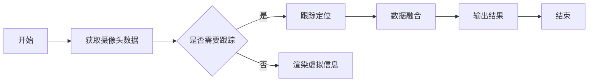
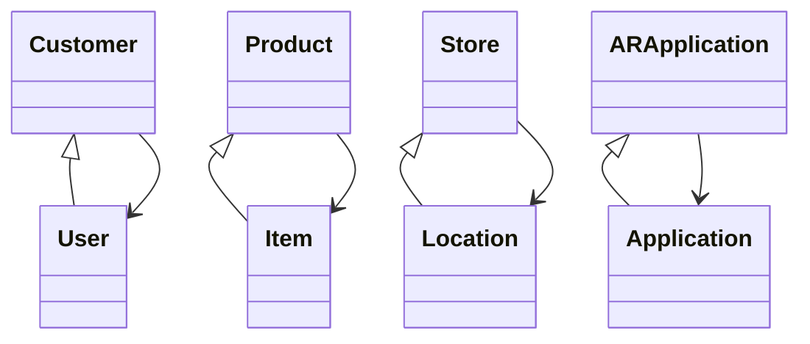
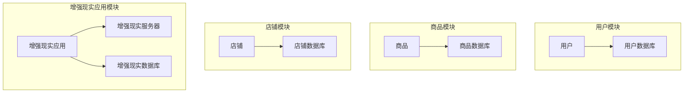
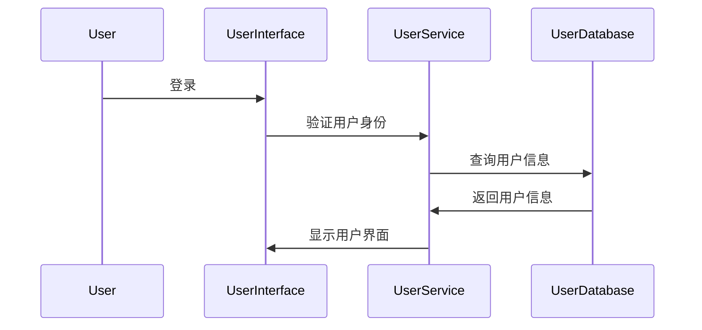
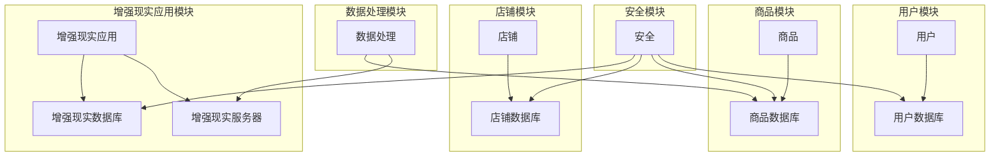
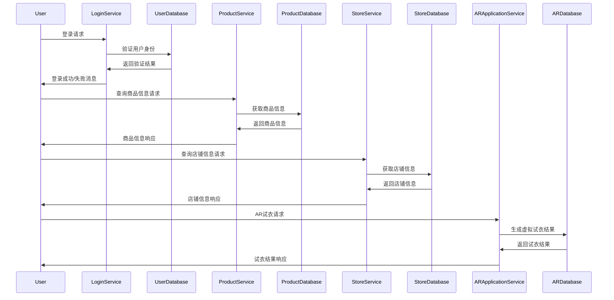

                 


# 增强现实在零售业中的创新应用

关键词：增强现实、零售业、创新应用、算法、系统架构

摘要：随着科技的快速发展，增强现实（AR）技术逐渐成为零售业中的一颗璀璨明珠。本文将从背景介绍、核心概念与联系、算法原理讲解、系统分析与架构设计、项目实战以及最佳实践与拓展六个部分，深入探讨增强现实在零售业中的创新应用，为行业从业者提供有价值的参考和借鉴。

## 第一部分：背景介绍

### 1.1 问题背景

#### 1.1.1 增强现实技术的发展历程

增强现实技术起源于20世纪90年代，经过几十年的发展，目前已逐渐成熟。从早期的实验室研究到如今的商业化应用，增强现实技术已经走过了漫长而曲折的道路。随着硬件设备的不断升级和算法的优化，增强现实技术的应用场景越来越广泛，尤其是在零售业领域。

#### 1.1.2 零售业的现状与挑战

近年来，零售业面临着巨大的变革压力。传统零售模式受到电商的冲击，市场份额不断下滑。为了吸引消费者，零售业需要不断创新，提高购物体验。同时，随着消费者对个性化、定制化需求的增加，零售业也需要更加精准地把握市场需求。

#### 1.1.3 增强现实在零售业的潜力

增强现实技术在零售业中的潜力巨大。通过增强现实技术，零售业可以提供更加生动、直观的购物体验，提高消费者的参与度和购买意愿。同时，增强现实技术还可以为零售业提供数据支持和决策依据，帮助企业更好地了解消费者需求，优化库存管理。

### 1.2 核心概念

#### 1.2.1 增强现实（AR）的定义

增强现实技术是一种将虚拟信息与真实世界相结合的技术。通过特殊的显示设备或手机等设备，用户可以看到叠加在现实世界中的虚拟信息。

#### 1.2.2 增强现实与虚拟现实（VR）的区别

增强现实和虚拟现实都是将虚拟信息与现实世界相结合的技术，但它们之间有一些区别。虚拟现实技术主要模拟出一个全新的虚拟环境，让用户完全沉浸其中；而增强现实技术则是将虚拟信息叠加在现实世界中，用户仍然保持对现实环境的感知。

#### 1.2.3 零售业的创新需求

零售业正面临着巨大的创新压力。消费者对购物体验的要求越来越高，零售业需要提供更加个性化和定制化的服务。同时，随着电商的兴起，线下零售业需要通过创新来吸引消费者，提高市场份额。

### 1.3 边界与外延

#### 1.3.1 增强现实技术的应用范围

增强现实技术可以应用于零售业的各个领域，如商品展示、虚拟试衣、互动体验等。

#### 1.3.2 零售业的细分市场

零售业可以分为多个细分市场，如服装、家居、电子产品等。不同的细分市场对增强现实技术的需求有所不同，需要针对性地进行应用和推广。

### 1.4 概念结构与核心要素组成

#### 1.4.1 增强现实技术的基本组成部分

增强现实技术主要由显示设备、传感器、算法和内容制作等部分组成。

#### 1.4.2 零售业中的关键创新点

零售业中的关键创新点包括商品展示、虚拟试衣、互动体验等，这些都需要增强现实技术的支持。

## 第二部分：核心概念与联系

### 2.1 增强现实技术原理

#### 2.1.1 AR技术的核心原理

增强现实技术的核心原理是将虚拟信息与现实世界进行叠加，使用户可以看到虚拟信息的同时仍然保持对现实环境的感知。

#### 2.1.2 增强现实技术的实现方法

增强现实技术的实现方法包括基于计算机视觉的跟踪定位、基于传感器数据融合的定位和基于标记的定位等。

#### 2.1.3 AR技术的优势与挑战

增强现实技术的优势包括提高购物体验、提供个性化服务、减少库存成本等。同时，增强现实技术也面临着一些挑战，如技术成本高、用户体验优化等。

### 2.2 零售业中的创新应用

#### 2.2.1 AR在零售业中的应用案例

增强现实技术在零售业中有着广泛的应用案例，如虚拟试衣、商品展示、互动体验等。

#### 2.2.2 创新应用的分类与比较

零售业中的增强现实应用可以分为基于硬件设备的应用和基于手机等移动设备的应用。这两种应用方式各有优劣，需要根据实际情况进行选择。

#### 2.2.3 创新应用的市场前景

随着增强现实技术的不断发展，零售业中的创新应用市场前景十分广阔。预计在未来几年，增强现实技术将在零售业中发挥越来越重要的作用。

### 2.3 概念属性特征对比表格

为了更好地理解增强现实技术在零售业中的应用，我们制作了一张概念属性特征对比表格，如下所示：

| 概念/特征 | 增强现实技术 | 零售业 | 应用案例 |  
| --- | --- | --- | --- |  
| 核心原理 | 虚拟信息与现实世界叠加 | 满足消费者个性化需求 | 虚拟试衣、商品展示等 |  
| 实现方法 | 跟踪定位、传感器数据融合、标记定位 | 多样化营销策略、库存管理优化 | 基于硬件设备的AR应用、基于手机等移动设备的AR应用 |  
| 优势 | 提高购物体验、提供个性化服务、减少库存成本 | 吸引消费者、提高市场份额 | 各类创新应用案例 |  
| 挑战 | 技术成本高、用户体验优化 | 创新压力、市场竞争力 | 需要针对不同场景进行优化 |

## 第三部分：算法原理讲解

### 3.1 增强现实算法基础

#### 3.1.1 常用AR算法简介

在增强现实技术中，常用的算法包括跟踪定位算法、渲染算法和数据融合算法等。

#### 3.1.2 算法的mermaid流程图

为了更好地理解增强现实算法的工作流程，我们使用mermaid绘制了一个流程图，如下所示：



#### 3.1.3 算法的优势与挑战

增强现实算法的优势包括高精度定位、实时渲染和数据融合等。但同时也面临着一些挑战，如算法复杂度高、计算资源消耗大等。

### 3.2 零售业中的AR算法应用

#### 3.2.1 算法在商品展示中的应用

在商品展示中，增强现实算法可以帮助用户更加直观地了解商品的细节和特性。

#### 3.2.2 算法在虚拟试衣中的应用

虚拟试衣是增强现实技术在零售业中的一个重要应用。通过算法，用户可以在虚拟环境中试穿衣物，提高购物体验。

#### 3.2.3 算法在互动体验中的应用

互动体验是增强现实技术在零售业中的另一个重要应用。通过算法，用户可以与虚拟物品进行互动，增加购物的趣味性。

### 3.3 数学模型与公式

#### 3.3.1 AR算法的数学模型

增强现实算法的数学模型主要包括跟踪模型、渲染模型和数据融合模型等。

#### 3.3.2 公式讲解与推导

为了更好地理解增强现实算法的数学模型，我们给出了以下公式：

$$
x_t = f(x_{t-1}, u_t)
$$

其中，$x_t$ 表示当前时刻的跟踪结果，$x_{t-1}$ 表示上一时刻的跟踪结果，$u_t$ 表示输入数据。

#### 3.3.3 举例说明

假设我们使用跟踪算法对一件商品进行定位，输入数据为摄像头捕获的图像，输出结果为商品的位置信息。我们可以通过以下步骤进行计算：

1. 初始化跟踪结果 $x_0$。
2. 对每一帧图像进行跟踪计算，得到当前时刻的跟踪结果 $x_t$。
3. 将跟踪结果进行数据融合，得到最终的定位结果。

通过以上步骤，我们可以得到商品在现实世界中的位置信息，从而为用户提供更加准确的购物体验。

## 第四部分：系统分析与架构设计

### 4.1 问题场景介绍

#### 4.1.1 零售业场景描述

在零售业中，增强现实技术可以应用于商品展示、虚拟试衣和互动体验等多个场景。

#### 4.1.2 AR应用场景分析

针对不同的应用场景，增强现实技术需要采取不同的架构设计和算法实现，以满足用户需求。

### 4.2 系统功能设计

#### 4.2.1 领域模型mermaid类图

为了更好地理解系统功能设计，我们使用mermaid绘制了一个领域模型类图，如下所示：



#### 4.2.2 系统功能模块划分

系统功能模块主要包括用户模块、商品模块、店铺模块和增强现实应用模块等。

### 4.3 系统架构设计

#### 4.3.1 系统架构mermaid架构图

为了更好地理解系统架构，我们使用mermaid绘制了一个系统架构图，如下所示：



#### 4.3.2 系统层次结构

系统层次结构主要包括表示层、业务逻辑层和数据层等。

### 4.4 系统接口设计与交互

#### 4.4.1 系统接口设计

系统接口设计主要包括用户接口、商品接口、店铺接口和增强现实应用接口等。

#### 4.4.2 系统交互mermaid序列图

为了更好地理解系统交互，我们使用mermaid绘制了一个系统交互序列图，如下所示：



## 第五部分：项目实战

### 5.1 环境安装

#### 5.1.1 开发环境搭建

在开始项目实战之前，我们需要搭建一个适合开发增强现实应用的开发环境。

#### 5.1.2 相关工具安装

为了实现增强现实应用，我们需要安装一些相关的工具，如AR框架、开发工具和测试工具等。

### 5.2 系统核心实现源代码

#### 5.2.1 核心算法实现

在系统核心实现中，我们需要实现一些关键算法，如跟踪算法、渲染算法和数据融合算法等。

#### 5.2.2 系统接口实现

在系统接口实现中，我们需要实现用户接口、商品接口、店铺接口和增强现实应用接口等。

### 5.3 代码应用解读与分析

#### 5.3.1 代码解读

通过对代码的解读，我们可以了解系统核心算法和接口实现的具体过程。

#### 5.3.2 应用案例分析

通过案例分析，我们可以了解增强现实技术在零售业中的应用场景和实际效果。

### 5.4 实际案例分析与讲解

#### 5.4.1 案例介绍

本节将介绍一个实际案例，并对其进行分析和讲解。

#### 5.4.2 案例剖析

通过对案例的剖析，我们可以了解案例中的关键技术和实现方法。

#### 5.4.3 案例小结

通过对案例的小结，我们可以总结案例中的经验和教训。

## 第六部分：最佳实践与拓展

### 6.1 最佳实践 tips

在本节中，我们将分享一些最佳实践，帮助从业者更好地应用增强现实技术在零售业中。

### 6.2 小结与注意事项

在本节中，我们将对文章进行小结，并提醒读者在应用增强现实技术时需要注意的事项。

### 6.3 拓展阅读

在本节中，我们将推荐一些相关的书籍和论文，供读者进一步学习和研究。

## 结束语

本文从背景介绍、核心概念与联系、算法原理讲解、系统分析与架构设计、项目实战以及最佳实践与拓展六个部分，详细探讨了增强现实在零售业中的创新应用。希望通过本文，读者能够对增强现实技术在零售业中的应用有更深入的了解，并为实际项目提供有价值的参考。

作者：AI天才研究院/AI Genius Institute & 禅与计算机程序设计艺术 /Zen And The Art of Computer Programming 

### 1.1 增强现实技术的发展历程

增强现实（Augmented Reality，简称 AR）技术起源于20世纪90年代。当时，计算机科学家和工程师们开始探索如何在现实世界中叠加虚拟信息，以便为用户提供更加丰富和互动的体验。最早的增强现实概念可以追溯到1968年，由美国计算机科学家伊凡·苏瑟兰（Ivan Sutherland）提出的“达摩克利斯之剑”（The Sword of Damocles）项目，该项目使用头戴显示器和摄像机实现了基本的空间定位和虚拟信息叠加。

在20世纪90年代，随着计算机性能的提升和显示技术的进步，增强现实技术开始逐渐走向实用化。1990年，美国VPL公司推出了世界上第一款商业化的增强现实头戴设备“VPL DataGlove”，它允许用户通过手势与虚拟环境进行交互。同时，1994年，美国麻省理工学院（MIT）媒体实验室（Media Lab）发布了“盖茨比”（Gatsby）系统，该系统使用光学传感器和激光投影实现了高分辨率的增强现实显示。

进入21世纪，随着智能手机和移动互联网的普及，增强现实技术迎来了新一轮的发展。2008年，谷歌推出了AR应用“谷歌地图”，用户可以通过智能手机摄像头看到现实世界的地图信息。2010年，苹果公司发布了ARKit开发工具包，标志着移动增强现实技术的兴起。同年，Facebook收购了增强现实公司Oculus VR，开启了虚拟现实（Virtual Reality，简称 VR）与增强现实技术的融合发展。

近年来，随着5G、人工智能（AI）和计算机视觉等技术的不断发展，增强现实技术在各个方面取得了显著进展。特别是基于机器学习技术的图像识别和目标检测算法，使得增强现实技术的定位精度和用户体验得到了大幅提升。如今，增强现实技术已经在零售、医疗、教育、娱乐等多个领域得到了广泛应用，成为推动产业创新和转型的重要力量。

### 1.2 零售业的现状与挑战

零售业是一个高度竞争的行业，近年来受到电子商务的强烈冲击。随着互联网和移动互联网的普及，越来越多的消费者倾向于在线购物，导致实体零售店铺的客流量和销售额持续下滑。根据统计数据显示，全球电商市场规模在2021年已经超过了4万亿美元，预计到2025年将增长到6万亿美元，占全球零售市场份额的比重也将逐年提高。这种趋势给传统零售业带来了巨大的压力，迫使零售企业不得不寻求创新和转型。

在零售业的现状中，实体店铺面临着一系列挑战：

1. **客流量下降**：随着消费者购物习惯的转变，越来越多的消费者选择在线购物，导致实体店铺的客流量明显下降。

2. **成本压力**：实体店铺需要支付租金、员工工资、水电费等运营成本，而这些成本在电商的低价竞争压力下变得愈发沉重。

3. **库存管理困难**：传统零售业中的库存管理往往依赖于人工操作，效率低下且容易出现错误。而在电商环境下，库存管理变得更加精准和高效。

4. **缺乏个性化体验**：传统零售店铺的购物体验较为单一，无法满足消费者对个性化、定制化服务的需求。

为了应对这些挑战，零售业必须采取一系列创新措施，提升购物体验，吸引消费者回流。其中，增强现实技术作为一种新兴技术，为零售业提供了新的发展机遇。

### 1.3 增强现实在零售业的潜力

增强现实（AR）技术在零售业中的潜力巨大，它不仅能够提升购物体验，还能够为零售企业提供数据支持和决策依据。以下是一些增强现实技术在零售业中的具体应用潜力和优势：

1. **提升购物体验**：

   - **虚拟试衣**：通过增强现实技术，消费者可以在虚拟环境中试穿衣物，避免了实际试衣的不便和不适感，提高了购买决策的准确性。
   - **商品展示**：增强现实技术可以将商品以三维形式展示在消费者面前，提供更加直观和生动的购物体验。
   - **互动体验**：通过增强现实技术，消费者可以与商品进行互动，如旋转、放大等，增加了购物的趣味性和参与度。

2. **提供个性化服务**：

   - **个性化推荐**：通过分析消费者的购物行为和偏好，增强现实技术可以为消费者提供个性化的商品推荐，提高购买转化率。
   - **定制化服务**：消费者可以通过增强现实技术参与到商品的设计和定制过程中，实现独特的个性化需求。

3. **优化库存管理**：

   - **实时库存监控**：增强现实技术可以帮助零售企业实时监控库存情况，及时调整进货和销售策略，减少库存积压。
   - **智能补货系统**：通过分析消费者的购物行为和库存数据，增强现实技术可以自动生成智能补货建议，提高库存周转率。

4. **降低运营成本**：

   - **虚拟导购**：通过增强现实技术，零售企业可以减少实体导购的数量，降低人力成本。
   - **数字化营销**：增强现实技术可以为企业提供更加生动和互动的营销手段，提高营销效果，降低营销成本。

5. **增强品牌形象**：

   - **创新营销活动**：通过增强现实技术，企业可以举办新颖的营销活动，吸引消费者的关注，提升品牌形象。
   - **用户体验优化**：增强现实技术可以提升消费者的购物体验，增强品牌忠诚度。

总之，增强现实技术在零售业中的应用不仅能够提升购物体验，提高销售转化率，还能够为企业提供数据支持和决策依据，帮助零售企业实现数字化转型和可持续发展。随着技术的不断进步，增强现实在零售业中的潜力将更加广阔。

### 1.4 核心概念与联系

在探讨增强现实（AR）技术在零售业中的应用之前，有必要对一些核心概念进行定义和解释。这些核心概念不仅有助于我们理解AR技术的基本原理，还能够揭示其在零售业中的具体应用方式。

#### 1.4.1 增强现实（AR）的定义

增强现实（Augmented Reality，简称 AR）是一种将虚拟信息与现实世界相结合的技术。它通过计算机生成的图像、视频、音频等虚拟信息，叠加到用户的视觉、听觉或触觉感知中，使用户能够实时感知和交互这些虚拟信息，而不会干扰到对现实世界的认知。

与虚拟现实（Virtual Reality，简称 VR）不同，增强现实不是完全替代现实世界，而是在现实世界中添加虚拟元素。因此，用户在使用增强现实技术时仍然能够感知到现实环境，而虚拟元素则作为现实的补充和增强。

#### 1.4.2 增强现实与虚拟现实（VR）的区别

虚拟现实（VR）是一种完全沉浸式的技术，它通过头戴显示器（如VR眼镜）将用户与外部现实世界隔离，创建一个全新的虚拟环境。用户在虚拟环境中无法感知到现实世界，只能通过虚拟设备来感知和互动。

相比之下，增强现实（AR）则是在现实世界中叠加虚拟信息，用户仍然能够看到和感知到现实环境，同时也可以与虚拟信息进行互动。例如，使用智能手机的AR应用，用户可以看到虚拟的物品或信息叠加在现实场景中。

以下是一个简单的对比表格，展示增强现实与虚拟现实的主要区别：

| 对比项 | 增强现实（AR） | 虚拟现实（VR） |
| --- | --- | --- |
| 环境感知 | 用户可以看到并感知到现实环境 | 用户完全沉浸在一个虚拟环境中，无法感知现实 |
| 沉浸感 | 低沉浸感，虚拟信息与现实环境共存 | 高沉浸感，用户完全专注于虚拟环境 |
| 设备需求 | 主要依赖智能手机或平板电脑等移动设备 | 需要头戴显示器（如VR眼镜）、跟踪设备等 |
| 应用场景 | 广泛应用于零售、教育、医疗等场景 | 主要应用于游戏、娱乐、模拟训练等场景 |

通过理解增强现实与虚拟现实之间的区别，我们可以更好地把握AR技术在零售业中的应用潜力和特点，从而为实际应用提供指导。

#### 1.4.3 零售业的创新需求

随着消费者购物习惯的变化和电子商务的快速发展，零售业正面临着前所未有的挑战和机遇。为了吸引和留住消费者，零售企业需要不断创新，提升购物体验，满足消费者对个性化、便捷性和互动性的需求。以下是零售业创新需求的具体体现：

1. **个性化体验**：

   - 消费者希望购物体验能够针对其个人偏好和需求进行定制。例如，通过分析消费者的购买历史和行为数据，零售企业可以提供个性化的商品推荐和优惠活动。
   - 增强现实技术可以通过虚拟试衣、虚拟购物体验等方式，提供更加个性化、直观的购物体验，提高消费者的满意度和忠诚度。

2. **便捷性**：

   - 在线购物的便捷性使得消费者更加倾向于选择在家购物，而不愿意亲自前往实体店铺。为了应对这一挑战，零售企业需要提供更加便捷的购物体验。
   - 增强现实技术可以通过线上与线下融合的方式，提供虚拟导购、智能搜索和快速结账等服务，简化购物流程，提高购物效率。

3. **互动性**：

   - 消费者希望购物过程能够更加互动和有趣，增加购物的趣味性和参与感。
   - 增强现实技术可以通过互动游戏、虚拟互动体验等方式，激发消费者的兴趣和好奇心，提升购物体验。

4. **数据驱动的决策**：

   - 在电子商务环境下，消费者行为数据变得尤为重要。零售企业需要通过数据分析来了解消费者需求，优化库存管理和营销策略。
   - 增强现实技术可以收集和分析消费者在购物过程中的互动数据，为零售企业提供更加精准的数据支持和决策依据。

通过满足这些创新需求，零售企业可以提升自身的竞争力，吸引和留住消费者，实现可持续发展。

#### 1.4.4 增强现实技术在零售业中的应用范围

增强现实技术具有广泛的应用范围，在零售业中可以应用于多个场景，以下是一些典型的应用：

1. **虚拟试衣**：

   - 消费者可以在虚拟环境中试穿衣物，避免了实际试衣的繁琐和不便。通过增强现实技术，消费者可以在家中尝试各种服装搭配，提高购买决策的准确性。
   - 例如，一些服装零售品牌已经推出了AR试衣应用，消费者只需使用智能手机或平板电脑扫描衣物，即可在现实环境中试穿。

2. **商品展示**：

   - 增强现实技术可以将商品以三维形式展示在消费者面前，提供更加直观和生动的购物体验。通过增强现实应用，消费者可以旋转、放大商品，查看细节和特性。
   - 例如，电子产品零售商可以通过增强现实技术展示新款手机的三维模型，让消费者从不同角度了解产品特性。

3. **互动体验**：

   - 通过增强现实技术，消费者可以与商品进行互动，如虚拟互动游戏、互动广告等，增加购物的趣味性和参与度。
   - 例如，一些零售商在购物场所设置了增强现实互动区域，消费者可以通过AR应用与虚拟商品互动，增加购物乐趣。

4. **虚拟导购**：

   - 增强现实技术可以为消费者提供虚拟导购服务，通过智能手机或平板电脑，消费者可以实时获取店铺导航、商品推荐等信息。
   - 例如，一些大型购物中心推出了AR导航应用，消费者可以实时查看店铺位置和推荐的商品。

5. **库存管理**：

   - 增强现实技术可以帮助零售企业实时监控库存情况，通过数据分析和智能算法，优化库存管理和补货策略。
   - 例如，一些零售商通过增强现实技术实现了智能库存管理系统，提高了库存周转率。

通过这些应用，增强现实技术不仅提升了零售企业的运营效率，还极大地改善了消费者的购物体验，为零售业的创新和转型提供了有力支持。

#### 1.4.5 零售业的细分市场

零售业是一个多样化的行业，涵盖了多个细分市场，包括服装、家居、电子产品、食品等。不同的细分市场对增强现实技术的需求和采用方式也有所不同。以下是几个主要的细分市场及其对增强现实技术的具体需求：

1. **服装行业**：

   - **需求**：服装行业对增强现实技术的需求主要集中在虚拟试衣和个性化购物体验方面。消费者希望能够在家中尝试各种服装搭配，减少试衣的繁琐和不便。
   - **应用**：一些服装品牌已经推出了AR试衣应用，消费者只需通过智能手机扫描衣物，即可在现实环境中试穿，并提供不同颜色和款式的选择。

2. **家居行业**：

   - **需求**：家居行业对增强现实技术的需求主要在于提供三维商品展示和室内设计模拟。消费者希望在购买家居用品时，能够看到实物尺寸和摆放效果，以便做出更准确的购买决策。
   - **应用**：一些家居零售商通过AR应用，允许消费者将虚拟家具摆放在家中进行预览，从而更好地规划家居布置。

3. **电子产品行业**：

   - **需求**：电子产品行业对增强现实技术的需求在于提供产品的详细展示和互动体验。消费者希望深入了解产品的功能和特性，并通过互动体验来做出购买决策。
   - **应用**：一些电子产品零售商利用AR技术展示三维产品模型，并允许用户进行旋转、放大等操作，以提高产品的吸引力。

4. **食品行业**：

   - **需求**：食品行业对增强现实技术的需求主要集中在产品的三维展示和食品安全信息查询。消费者希望能够了解食品的成分、生产日期和存储方式等信息。
   - **应用**：一些食品零售商通过AR技术展示食品的三维模型，并提供丰富的信息展示，以增强消费者的购物体验。

不同细分市场的需求和应用方式各有特色，但增强现实技术在这些领域都展现出了巨大的潜力，为零售企业的创新和消费者体验的提升提供了新的途径。

### 1.4.6 概念结构与核心要素组成

为了深入理解增强现实技术在零售业中的创新应用，我们需要从概念结构和核心要素组成的角度进行详细分析。

#### 1.4.6.1 增强现实技术的基本组成部分

增强现实技术由以下几个关键组成部分构成：

1. **显示设备**：这是增强现实系统的硬件核心，如智能手机、平板电脑、头戴显示器等，它们负责展示虚拟信息。
2. **传感器**：传感器用于捕获现实世界的图像和位置信息，如摄像头、GPS、加速度计、陀螺仪等，为增强现实系统提供数据支持。
3. **算法**：算法是实现增强现实功能的核心，包括图像识别、目标检测、跟踪定位、数据融合等，用于处理传感器数据并生成虚拟信息。
4. **内容制作**：内容制作是指创建和生成虚拟信息的过程，如3D模型、视频、动画等，这些内容是增强现实体验的重要组成部分。

#### 1.4.6.2 零售业中的关键创新点

在零售业中，增强现实技术的关键创新点主要体现在以下几个方面：

1. **虚拟试衣**：通过AR技术，消费者可以在虚拟环境中试穿衣物，减少实体试衣的不便，提高购物决策的准确性。
2. **商品展示**：AR技术可以将商品以三维形式展示在消费者面前，提供更加直观和生动的购物体验。
3. **互动体验**：增强现实技术可以创造丰富的互动体验，如虚拟互动游戏、互动广告等，增加购物的趣味性和参与度。
4. **库存管理**：通过AR技术，零售企业可以实时监控库存情况，优化库存管理和补货策略，提高运营效率。

这些创新点不仅提升了消费者的购物体验，也为零售企业提供了数据支持和决策依据，助力企业实现数字化转型和可持续发展。

### 第二部分：核心概念与联系

#### 2.1.1 增强现实技术的核心原理

增强现实（AR）技术的核心原理在于将虚拟信息与现实世界进行叠加，使用户能够在现实环境中感知和交互这些虚拟信息。这一过程主要涉及以下几个关键步骤：

1. **图像识别**：通过传感器（如摄像头）捕捉现实世界的图像，然后利用图像处理算法对图像进行分析和识别，提取出关键特征。

2. **目标检测**：在识别图像的基础上，进一步检测出目标对象的位置和范围。这一步骤通常使用机器学习和计算机视觉技术，如卷积神经网络（CNN）。

3. **跟踪定位**：确定目标对象在现实世界中的精确位置，并通过实时更新位置信息，确保虚拟信息与目标对象的动态交互。常用的跟踪算法包括视觉跟踪、惯性导航和定位技术。

4. **虚拟信息叠加**：根据目标对象的位置和属性，生成相应的虚拟信息，并将其叠加到现实环境中。这些虚拟信息可以是三维模型、文字、图像等。

5. **交互反馈**：用户通过现实世界的操作（如触摸、手势）与虚拟信息进行交互，系统实时响应用户操作，提供反馈和更新。

通过这些核心原理，增强现实技术能够实现虚拟信息与现实世界的无缝融合，为用户带来沉浸式和互动性的体验。

#### 2.1.2 增强现实技术的实现方法

增强现实技术的实现方法多种多样，根据应用场景和需求的不同，可以分为以下几种：

1. **基于计算机视觉的跟踪定位**：

   - **原理**：通过计算机视觉算法对摄像头捕捉的图像进行分析和处理，识别出目标对象并计算其位置。
   - **优势**：精度高、适用性强，可以适应各种复杂的场景。
   - **挑战**：对计算资源和算法要求较高，可能在光线不足或物体复杂的情况下效果不佳。

2. **基于传感器数据融合的定位**：

   - **原理**：利用多种传感器（如加速度计、陀螺仪、GPS等）的数据进行融合，计算目标对象的位置。
   - **优势**：不需要外部标记，适应性强，可以在复杂的室内环境中实现精准定位。
   - **挑战**：对传感器精度要求高，数据融合算法复杂。

3. **基于标记的定位**：

   - **原理**：在现实世界中放置特定的标记（如二维码、AR标签等），通过摄像头识别标记的位置，实现定位。
   - **优势**：实现简单、成本低，适用于特定场景。
   - **挑战**：标记的识别和定位精度受外界环境影响较大，适用范围有限。

选择合适的实现方法，需要根据具体应用场景的需求和限制进行权衡。通常，综合多种方法可以更好地实现增强现实技术的目标。

#### 2.1.3 AR技术的优势与挑战

增强现实（AR）技术在零售业中具有显著的优势，但也面临着一些挑战。以下是对这些优势与挑战的详细分析：

1. **优势**：

   - **提高购物体验**：通过增强现实技术，消费者可以实时看到商品的虚拟三维模型，进行试穿、试戴或互动体验，提升了购物体验和满意度。
   - **提供个性化服务**：增强现实技术可以根据消费者的行为数据和偏好，提供个性化的商品推荐和购物建议，满足消费者的个性化需求。
   - **优化库存管理**：增强现实技术可以帮助零售企业实时监控库存情况，通过数据分析优化库存管理，减少库存积压和浪费。
   - **降低运营成本**：通过虚拟导购和自助购物等增强现实应用，零售企业可以减少实体导购数量，降低人力成本，提高运营效率。
   - **增强品牌形象**：增强现实技术可以创造新颖的营销活动，吸引消费者的关注，提升品牌形象和市场竞争力。

2. **挑战**：

   - **技术成本高**：增强现实技术需要高质量的显示设备、传感器和算法支持，初始投资较大，中小企业可能难以承受。
   - **用户体验优化**：虽然增强现实技术提供了丰富的互动体验，但如何确保用户体验的流畅性和满意度，仍然是需要解决的问题。
   - **兼容性问题**：增强现实应用需要适配各种设备平台，如智能手机、平板电脑等，确保在不同设备和操作系统上都能正常运行。
   - **隐私和安全问题**：增强现实技术涉及大量的用户数据收集和处理，如何确保用户隐私和数据安全，是零售企业需要关注的重要问题。
   - **技术普及程度**：尽管增强现实技术在不断普及，但消费者对AR技术的接受程度和普及程度仍然有限，这需要时间和市场教育的推动。

通过了解这些优势与挑战，零售企业可以更好地规划和实施增强现实技术的应用，发挥其潜力，同时克服面临的问题。

#### 2.2.1 AR在零售业中的应用案例

增强现实（AR）技术在零售业中有着广泛的应用，以下是一些典型的应用案例：

1. **虚拟试衣**：

   - **应用场景**：服装零售商通过AR应用，允许消费者在虚拟环境中试穿衣物。消费者只需使用智能手机或平板电脑扫描衣物，即可在现实环境中试穿，并查看不同颜色和款式的效果。
   - **实际效果**：这种应用方式显著减少了消费者实际试衣的繁琐和不便，提高了购物决策的准确性和满意度。例如，H&M和Zara等知名服装品牌已经推出了AR试衣应用。

2. **商品展示**：

   - **应用场景**：零售商通过AR技术，将商品以三维形式展示在消费者面前，提供更加直观和生动的购物体验。例如，电子产品零售商可以使用AR应用展示新款手机的三维模型，消费者可以通过旋转、放大等操作详细了解产品特性。
   - **实际效果**：这种展示方式提高了商品的可视化和互动性，有助于消费者更好地了解商品，增加购买兴趣。IKEA等家居零售商通过AR技术展示家具的三维模型，帮助消费者更好地规划家居布置。

3. **互动体验**：

   - **应用场景**：零售商通过AR技术创造丰富的互动体验，如虚拟互动游戏、互动广告等，增加购物的趣味性和参与度。例如，一些零售商在店内设置AR互动区域，消费者可以通过AR应用与虚拟商品互动，增加购物乐趣。
   - **实际效果**：这种互动体验提升了消费者的购物体验和参与感，有助于吸引消费者进店和增加购物时长。例如，亚马逊在购物节期间推出了AR购物体验，消费者可以通过AR应用查看商品的虚拟展示，并进行互动。

4. **虚拟导购**：

   - **应用场景**：零售商通过AR技术为消费者提供虚拟导购服务，通过智能手机或平板电脑，消费者可以实时获取店铺导航、商品推荐等信息。
   - **实际效果**：这种虚拟导购方式简化了购物流程，提高了购物效率，有助于提高消费者的满意度和忠诚度。例如，一些大型购物中心推出了AR导航应用，消费者可以通过AR应用实时查看店铺位置和推荐的商品。

通过这些应用案例，增强现实技术为零售业带来了新的发展机遇，提高了购物体验和运营效率。

#### 2.2.2 创新应用的分类与比较

在零售业中，增强现实（AR）技术的创新应用可以大致分为以下几类，并针对其特点和适用场景进行比较：

1. **虚拟试衣**：

   - **特点**：通过AR技术，消费者可以在虚拟环境中试穿衣物，避免了实际试衣的繁琐和不便。
   - **适用场景**：主要适用于服装、鞋帽等需要试穿的品类。
   - **比较**：与传统的试衣体验相比，AR试衣提供了更加灵活和便捷的试穿方式，但需要高质量的摄像头和算法支持。

2. **商品展示**：

   - **特点**：通过AR技术，将商品以三维形式展示在消费者面前，提供更加直观和生动的购物体验。
   - **适用场景**：主要适用于电子产品、家居用品等需要详细展示的品类。
   - **比较**：与传统的平面展示方式相比，AR展示能够提供更加立体和互动的体验，但需要开发高质量的3D模型和动画。

3. **互动体验**：

   - **特点**：通过AR技术，创造丰富的互动体验，如虚拟互动游戏、互动广告等，增加购物的趣味性和参与度。
   - **适用场景**：主要适用于需要吸引消费者注意和增加购物乐趣的品类和活动。
   - **比较**：与传统的营销手段相比，AR互动体验能够提供更加沉浸和互动的体验，但需要较高的开发成本和技术支持。

4. **虚拟导购**：

   - **特点**：通过AR技术，为消费者提供虚拟导购服务，通过智能手机或平板电脑，消费者可以实时获取店铺导航、商品推荐等信息。
   - **适用场景**：主要适用于大型购物中心、超市等需要提供导航和推荐服务的场所。
   - **比较**：与传统的导购方式相比，AR导购能够提供更加实时和个性化的服务，但需要确保设备的普及率和用户体验。

通过分类和比较，我们可以更好地理解不同AR应用的特点和适用场景，从而选择最适合自己业务的创新应用方式。

#### 2.2.3 创新应用的市场前景

随着增强现实（AR）技术的不断发展和普及，其在零售业中的创新应用市场前景广阔。以下是对未来市场前景的预测：

1. **市场规模增长**：

   - 预计未来几年，全球增强现实在零售业的市场规模将保持高速增长。根据市场研究公司的数据，全球AR零售市场预计将从2022年的数十亿美元增长到2027年的数百亿美元。
   - 随着AR技术的不断进步和成本的降低，更多的零售企业将采用AR技术，提升购物体验和运营效率。

2. **消费者需求增加**：

   - 消费者对于个性化、便捷和互动性的购物体验需求日益增加，这将推动AR技术在零售业中的应用。特别是在服装、家居、电子产品等需要试穿和展示的品类中，AR技术具有显著的吸引力。
   - 通过AR技术，消费者可以更加直观地了解商品，提高购买决策的准确性，从而增加购买意愿。

3. **技术突破**：

   - 随着人工智能、计算机视觉和5G等技术的快速发展，增强现实技术将实现更多的创新和应用。例如，通过人工智能算法的优化，AR系统的图像识别和跟踪定位能力将进一步提高，用户体验将更加流畅和自然。
   - 5G技术的普及将为AR应用提供更高速的数据传输和更低的延迟，使得AR购物体验更加实时和互动。

4. **市场细分**：

   - 随着市场需求的多样化，增强现实技术在零售业中的应用也将进一步细分。例如，在服装行业，除了虚拟试衣外，还将出现更多基于AR的个性化设计和定制服务；在家居行业，AR技术将应用于室内设计和空间布局的模拟。
   - 不同细分市场的需求将推动AR技术的不断创新和应用，为零售业带来更多的增值服务。

总之，增强现实技术在零售业中的创新应用具有巨大的市场前景。随着技术的不断进步和消费者需求的增加，AR技术将在零售业中发挥越来越重要的作用，为企业和消费者带来新的机遇。

### 2.3 概念属性特征对比表格

为了更清晰地理解增强现实（AR）技术在零售业中的核心概念和应用特点，我们将制作一个概念属性特征对比表格。以下是一个示例表格，展示了不同增强现实应用场景的核心属性和特征：

| 应用场景 | 核心属性 | 特征描述 | 适用品类 | 优势 | 挑战 |
| --- | --- | --- | --- | --- | --- |
| 虚拟试衣 | 图像识别、实时跟踪 | 消费者可试穿衣物，查看不同颜色、款式 | 服装、鞋帽 | 提高购物决策准确性 | 对摄像头要求高 |
| 商品展示 | 3D模型渲染、互动操作 | 以三维形式展示商品细节，用户可旋转、放大 | 电子产品、家居用品 | 直观展示商品特性 | 需要高质量的3D模型 |
| 互动体验 | 游戏化互动、广告互动 | 提供游戏化购物体验，增加购物乐趣 | 全品类 | 增强用户参与感 | 需要较高开发成本 |
| 虚拟导购 | 实时导航、信息推送 | 提供店铺导航、商品推荐，简化购物流程 | 大型购物中心、超市 | 提高购物效率 | 需要设备普及率 |

通过这个表格，我们可以更直观地看到不同应用场景的核心属性、特征及其在零售业中的优势和挑战，从而为具体应用提供参考。

### 2.4 增强现实技术在零售业中的核心概念及其关系

为了深入探讨增强现实（AR）技术在零售业中的创新应用，我们需要明确几个核心概念及其相互关系。以下是对这些核心概念的详细阐述：

#### 2.4.1 增强现实（AR）技术

增强现实（AR）技术是一种将虚拟信息与现实世界结合的技术。通过AR技术，用户可以在现实环境中看到叠加的虚拟信息，这些信息可以是文字、图像、三维模型等。AR技术主要通过以下步骤实现：

1. **图像识别与处理**：使用计算机视觉算法对摄像头捕获的实时图像进行分析，识别出目标对象。
2. **实时跟踪与定位**：根据目标对象的位置信息，实时更新虚拟信息的显示位置。
3. **渲染与显示**：将虚拟信息叠加到现实环境中，并实时更新，以提供沉浸式的用户体验。

#### 2.4.2 虚拟试衣

虚拟试衣是增强现实技术在零售业中的一个重要应用。通过虚拟试衣，消费者可以在虚拟环境中试穿衣物，避免了实际试衣的繁琐和不便。虚拟试衣的核心概念包括：

1. **人体建模**：使用3D扫描技术获取消费者身体的三维数据，生成精确的人体模型。
2. **服装建模**：创建衣物模型，并实现不同颜色、款式和材质的切换。
3. **交互与反馈**：通过用户输入（如手势、触摸）实时调整服装在人体模型上的位置和状态。

#### 2.4.3 商品展示

商品展示是增强现实技术在零售业中的另一个重要应用。通过商品展示，零售商可以将商品以三维形式展示在消费者面前，提供更加直观和生动的购物体验。商品展示的核心概念包括：

1. **三维建模**：使用3D建模技术创建商品的三维模型，并实现模型的旋转、放大、缩小等操作。
2. **渲染与灯光**：通过渲染技术实现商品的真实感和立体感，提供高质量的视觉体验。
3. **互动操作**：通过用户输入实现与商品的三维交互，如触摸、拖拽等。

#### 2.4.4 互动体验

互动体验是增强现实技术在零售业中的创新点，通过创造丰富的互动体验，增加购物的趣味性和参与度。互动体验的核心概念包括：

1. **游戏化互动**：将购物过程转化为游戏，通过完成任务、收集道具等方式增加购物乐趣。
2. **虚拟互动广告**：通过虚拟广告牌、互动广告等，吸引用户注意，提高广告效果。
3. **社交互动**：通过AR技术，消费者可以与他人分享购物体验，增加社交互动。

#### 2.4.5 关系分析

上述核心概念之间存在紧密的联系：

1. **虚拟试衣与商品展示**：虚拟试衣依赖于商品展示的三维模型，而商品展示的三维模型又可以为虚拟试衣提供基础。
2. **互动体验与虚拟试衣/商品展示**：互动体验可以通过游戏化、虚拟互动广告等方式，增强虚拟试衣和商品展示的用户体验。
3. **增强现实技术与所有应用**：增强现实技术是实现上述所有应用的基础，提供图像识别、实时跟踪、渲染与显示等功能。

通过明确这些核心概念及其关系，我们可以更好地理解增强现实技术在零售业中的创新应用，并为其具体实施提供指导。

### 3.1 增强现实算法基础

#### 3.1.1 常用AR算法简介

在增强现实（AR）技术中，算法是核心，它们负责图像识别、目标检测、跟踪定位和虚拟信息渲染等关键任务。以下是一些常用的AR算法及其简要介绍：

1. **图像识别算法**：

   - **SIFT（尺度不变特征变换）**：SIFT算法是一种用于提取图像特征点的算法，具有尺度不变性和旋转不变性。它广泛应用于图像识别和匹配。
   - **ORB（Oriented FAST and Rotated BRIEF）**：ORB算法是SIFT的简化版本，它在计算速度和精度之间取得平衡，适用于实时应用。

2. **目标检测算法**：

   - **YOLO（You Only Look Once）**：YOLO算法是一种端到端的目标检测算法，能够在单个前向传播中完成目标检测任务，具有很高的实时性。
   - **SSD（Single Shot MultiBox Detector）**：SSD算法是一种多尺度目标检测算法，能够在不同尺度上检测目标，适用于不同大小的目标。

3. **跟踪定位算法**：

   - **KCF（Kernel Correlation Filter）**：KCF算法是一种基于滤波器的跟踪算法，具有实时性和鲁棒性，适用于多种场景。
   - **DeepSORT（Deep ReID and Online Tracking）**：DeepSORT算法结合了深度特征提取和排序网络，能够实现高效和准确的目标跟踪。

4. **渲染算法**：

   - **Surface Normal Estimation**：通过计算三维模型表面法线，用于提高渲染的真实感。
   - **Motion Blur**：在移动对象上添加运动模糊效果，增强视觉连贯性。

#### 3.1.2 算法的mermaid流程图

为了更好地展示这些算法的工作流程，我们可以使用mermaid绘制流程图。以下是一个示例流程图，展示了图像识别、目标检测、跟踪定位和渲染的基本流程：


#### 3.1.3 算法的优势与挑战

每种增强现实算法都有其独特的优势与挑战，以下是对这些算法的一些优缺点的分析：

1. **图像识别算法**：

   - **优势**：高精度、良好的尺度不变性和旋转不变性，适用于复杂场景的图像识别。
   - **挑战**：计算复杂度高，可能影响实时性；对光照变化和遮挡敏感。

2. **目标检测算法**：

   - **优势**：实时性好，适用于快速移动的目标检测。
   - **挑战**：对小目标检测精度可能不高；对复杂背景的鲁棒性有待提高。

3. **跟踪定位算法**：

   - **优势**：实时性强、鲁棒性好，适用于动态场景。
   - **挑战**：可能受到光照变化和遮挡的影响；需要大量的训练数据和计算资源。

4. **渲染算法**：

   - **优势**：提高渲染的真实感，提供高质量的视觉体验。
   - **挑战**：渲染计算量大，对硬件性能要求高；实时性可能受到影响。

通过了解这些算法的优势与挑战，我们可以根据实际应用场景选择最适合的算法，优化增强现实系统的性能和用户体验。

### 3.2 零售业中的AR算法应用

#### 3.2.1 算法在商品展示中的应用

在零售业中，增强现实（AR）技术的商品展示应用是一种革命性的体验创新。通过AR算法，消费者可以在虚拟环境中看到商品的详细信息和三维模型，这极大地提升了购物体验。以下是AR算法在商品展示中的具体应用：

1. **三维模型生成**：

   - **步骤**：首先，使用3D扫描技术获取商品的三维数据。接着，利用三维建模软件对模型进行优化，使其适合AR展示。最后，将模型导入AR应用中。
   - **算法**：在生成三维模型时，常用的算法包括三维重建和表面重建。三维重建算法如结构光扫描和激光扫描可以获取商品的三维轮廓，而表面重建算法如基于深度信息的表面重建可以细化模型的表面细节。

2. **实时渲染**：

   - **步骤**：在商品展示过程中，AR应用需要实时渲染三维模型，使其与真实环境融合。渲染过程中，需要考虑光源、材质、阴影等因素。
   - **算法**：实时渲染算法如基于光线追踪的渲染和基于物理的渲染可以提供高质量的画面效果。这些算法通过计算光线传播和反射，模拟真实世界的光照效果。

3. **用户交互**：

   - **步骤**：消费者可以使用手机或平板电脑的摄像头扫描商品，然后通过触摸屏或手势进行交互。
   - **算法**：交互算法如手势识别和语音识别可以增强用户与商品的互动。手势识别算法如基于深度学习的卷积神经网络可以准确识别用户的手势，而语音识别算法则可以识别用户的语音指令。

通过这些算法的应用，零售企业可以提供更加直观、互动和沉浸式的商品展示，从而吸引消费者的注意力，提高购买转化率。

#### 3.2.2 算法在虚拟试衣中的应用

虚拟试衣是增强现实（AR）技术在零售业中的另一项重要应用，它允许消费者在虚拟环境中试穿衣物，避免了实际试衣的繁琐和不便。以下是AR算法在虚拟试衣中的具体应用：

1. **人体建模**：

   - **步骤**：首先，使用3D扫描技术获取消费者身体的三维数据。接着，利用人体建模算法生成消费者的人体模型，并调整模型的大小和形状，使其与真实身体匹配。
   - **算法**：人体建模算法包括基于深度学习的3D重建和基于物理的人体建模。深度学习算法如生成对抗网络（GAN）可以生成高质量的人体模型，而基于物理的人体建模则通过计算人体各部分的物理特性来构建模型。

2. **服装建模**：

   - **步骤**：创建衣物的三维模型，并确保其与实际衣物保持一致。接着，为衣物添加不同的颜色、款式和材质选项。
   - **算法**：服装建模算法包括3D建模软件和基于纹理映射的技术。3D建模软件如Blender和Maya可以创建复杂的衣物模型，而基于纹理映射的技术则通过改变衣物表面的纹理来模拟不同材质。

3. **试衣交互**：

   - **步骤**：消费者在虚拟环境中选择衣物，并试穿。通过触摸屏或手势进行交互，调整衣物位置和状态。
   - **算法**：试衣交互算法包括手势识别和3D模型操纵。手势识别算法如基于深度学习的卷积神经网络可以准确识别用户的手势，而3D模型操纵算法则通过物理仿真技术实现模型的旋转、缩放和摆放。

通过这些算法的应用，消费者可以在虚拟环境中进行真实的试衣体验，提高购买决策的准确性和满意度。

#### 3.2.3 算法在互动体验中的应用

互动体验是增强现实（AR）技术在零售业中的创新点，通过创造丰富的互动体验，增加购物的趣味性和参与度。以下是AR算法在互动体验中的具体应用：

1. **游戏化互动**：

   - **步骤**：设计游戏化的购物体验，如寻找隐藏的优惠券、完成任务获得奖励等。
   - **算法**：游戏化互动算法包括路径规划、随机生成和奖励系统。路径规划算法如A*算法可以生成最佳的路径，随机生成算法可以通过随机数生成各种互动元素，而奖励系统算法则通过计算用户的互动行为来分配奖励。

2. **虚拟互动广告**：

   - **步骤**：在虚拟环境中展示互动广告，如虚拟广告牌、互动海报等。
   - **算法**：虚拟互动广告算法包括图像识别、目标检测和广告投放。图像识别算法如SIFT和ORB可以识别广告内容，目标检测算法如YOLO和SSD可以检测用户目标，广告投放算法则根据用户的兴趣和行为进行广告推荐。

3. **社交互动**：

   - **步骤**：提供社交互动功能，如与他人分享购物体验、参与社区活动等。
   - **算法**：社交互动算法包括社交网络分析和用户行为分析。社交网络分析算法如基于图论的社交网络分析可以识别用户的社交关系，用户行为分析算法如基于机器学习的用户行为预测可以预测用户的兴趣和需求。

通过这些算法的应用，零售企业可以提供更加互动和有趣的购物体验，吸引消费者的关注，增加购物乐趣。

### 3.3 数学模型与公式

在增强现实（AR）技术的应用中，数学模型和公式扮演着关键角色。以下我们将介绍AR技术中常用的数学模型和公式，以及它们在实际应用中的意义。

#### 3.3.1 AR算法的数学模型

1. **透视变换模型**：

   透视变换是AR技术中用于将3D模型投影到2D图像上的一个基本模型。其数学公式如下：

   $$
   x' = \frac{x \cdot f}{z}
   $$
   $$
   y' = \frac{y \cdot f}{z}
   $$

   其中，$x, y$ 是3D模型中点的坐标，$x', y'$ 是投影到2D图像上的点坐标，$f$ 是焦距，$z$ 是点到摄像机的距离。

2. **姿态估计模型**：

   姿态估计是指通过计算摄像头相对于3D世界的位置和方向。常用的姿态估计模型包括卡尔曼滤波（Kalman Filter）和滑动平均滤波（Moving Average Filter）。以下是一个简单的卡尔曼滤波公式：

   $$
   \hat{x}_k = A \hat{x}_{k-1} + B u_k
   $$
   $$
   P_k = A P_{k-1} A^T + Q
   $$

   其中，$\hat{x}_k$ 是估计的状态向量，$P_k$ 是状态估计的协方差矩阵，$A$ 和 $B$ 是系统矩阵和观测矩阵，$u_k$ 是控制输入，$Q$ 是过程噪声协方差矩阵。

3. **图像识别模型**：

   图像识别是AR技术中用于识别现实世界中的物体和特征的关键步骤。常用的图像识别模型包括卷积神经网络（CNN）和循环神经网络（RNN）。以下是一个简单的CNN公式：

   $$
   \text{ReLU}(\sigma(W_1 \cdot X + b_1))
   $$

   $$
   \text{ReLU}(\sigma(W_2 \cdot \sigma(W_1 \cdot X + b_1) + b_2))
   $$

   其中，$X$ 是输入图像，$W_1, W_2$ 是权重矩阵，$b_1, b_2$ 是偏置项，$\sigma$ 是激活函数，ReLU是ReLU激活函数。

#### 3.3.2 公式讲解与推导

1. **透视变换公式的讲解与推导**：

   透视变换公式用于将三维空间中的点投影到二维图像上。其基本原理是，当光线从三维空间中的点穿过透镜后，会在二维图像上形成一个投影点。透视变换公式通过将三维空间中的点坐标与焦距和摄像机位置进行计算，得到其在二维图像上的投影坐标。

   假设一个点在三维空间中的坐标为$(x, y, z)$，摄像机的位置为$(x_c, y_c, z_c)$，焦距为$f$。根据透视变换的基本原理，可以得到投影点在二维图像上的坐标$(x', y')$的计算公式。

2. **卡尔曼滤波公式的讲解与推导**：

   卡尔曼滤波是一种用于估计系统状态的最优算法。其基本思想是通过加权平均，从观测数据中提取有用的信息，并利用预测来修正估计。卡尔曼滤波的公式包括状态预测和观测更新两个步骤。

   状态预测公式表示系统状态在当前时刻的估计值，是通过前一个时刻的状态估计值和系统矩阵进行预测得到的。观测更新公式则表示利用当前时刻的观测数据对状态估计值进行修正。

#### 3.3.3 举例说明

为了更好地理解这些数学模型和公式的应用，我们通过一个简单的例子进行说明。

**例子**：假设有一个摄像头放置在一个房间的角落，焦距为$500$毫米，摄像头的位置为$(0, 0, 2000)$，现在需要计算一个位于房间中心点$(1000, 1000, 2000)$的点的投影坐标。

**步骤**：

1. 使用透视变换公式计算投影坐标：
   $$
   x' = \frac{1000 \cdot 500}{2000} = 250
   $$
   $$
   y' = \frac{1000 \cdot 500}{2000} = 250
   $$

   因此，点$(1000, 1000, 2000)$在二维图像上的投影坐标为$(250, 250)$。

通过这个例子，我们可以看到透视变换公式在AR技术中的应用，它帮助我们计算三维空间中点在二维图像上的投影坐标，这是实现增强现实视觉叠加的基础。

### 4.1 问题场景介绍

#### 4.1.1 零售业场景描述

在零售业中，增强现实（AR）技术的应用场景多样且具有广泛的影响。以下是对零售业中AR应用场景的详细描述：

1. **虚拟试衣**：

   - **场景描述**：在服装店或电商平台上，消费者可以使用智能手机或平板电脑扫描衣物，并通过AR应用在虚拟环境中试穿。消费者可以实时看到衣物在身体上的效果，并可以尝试不同的颜色、款式和搭配。
   - **影响**：虚拟试衣不仅减少了消费者实际试衣的繁琐，还可以避免由于尺码不合适或不舒适而导致的退换货问题，提高了消费者的购物体验和满意度。

2. **商品展示**：

   - **场景描述**：零售商通过AR技术，将商品以三维形式展示在消费者面前。消费者可以通过手机摄像头查看商品的三维模型，进行旋转、放大和缩小，从而获得更加直观的购物体验。
   - **影响**：三维商品展示有助于消费者更好地了解商品的细节和特性，提高购买决策的准确性。同时，生动的展示方式也增加了商品的吸引力。

3. **互动体验**：

   - **场景描述**：在购物中心或商场中，零售商可以设置AR互动区域，提供游戏化购物体验、互动广告和虚拟互动展示。消费者可以通过AR应用与虚拟商品互动，增加购物的趣味性和参与度。
   - **影响**：互动体验不仅吸引了消费者的注意力，还提高了消费者的购物时长和忠诚度。同时，这种新颖的购物方式也为零售商提供了新的营销渠道。

4. **虚拟导购**：

   - **场景描述**：消费者可以使用AR导航应用，在购物中心或商场中实时获取店铺导航、商品推荐和优惠信息。导购应用可以根据消费者的购物行为和偏好，提供个性化的导购服务。
   - **影响**：虚拟导购简化了购物流程，提高了购物效率。通过个性化的导购服务，消费者可以更快地找到所需商品，并享受更加便捷的购物体验。

5. **库存管理**：

   - **场景描述**：零售商通过AR技术，实时监控库存情况，并利用数据分析优化库存管理。例如，AR技术可以帮助零售商识别热销商品，及时补货，减少库存积压。
   - **影响**：库存管理效率的提高有助于降低运营成本，减少库存损失，提高供应链的灵活性。

#### 4.1.2 AR应用场景分析

1. **技术可行性**：

   - **虚拟试衣**：随着智能手机摄像头和计算能力的提升，虚拟试衣的可行性越来越高。然而，高质量的3D建模和图像处理算法仍然是实现该功能的关键。
   - **商品展示**：三维商品展示的技术已经相对成熟，但实现高质量的渲染效果和快速交互仍需进一步优化。
   - **互动体验**：互动体验的实时性和互动性要求较高，需要高效的算法和强大的硬件支持。
   - **虚拟导购**：虚拟导购的技术门槛相对较低，但确保用户体验的一致性和实用性仍是一个挑战。
   - **库存管理**：随着物联网（IoT）和大数据技术的发展，AR技术在库存管理中的应用前景广阔。

2. **市场接受度**：

   - **消费者接受度**：消费者对AR技术的接受度逐渐提高，尤其是在年轻消费群体中。然而，对于一些传统消费者来说，AR技术的使用门槛仍然较高。
   - **零售商接受度**：大多数零售商已经认识到AR技术的重要性和潜力，开始尝试将其应用于零售业务中。然而，部分中小企业在技术投入和运营成本方面可能面临一定的压力。

3. **潜在影响**：

   - **购物体验**：AR技术的应用将大大提升消费者的购物体验，提供更加个性化、便捷和互动的购物方式。
   - **运营效率**：通过AR技术的应用，零售商可以优化库存管理、提升供应链效率和降低运营成本。
   - **市场竞争**：随着AR技术的普及，零售企业之间的竞争将更加激烈，创新将成为提升竞争力的关键因素。

通过以上分析，我们可以看到AR技术在零售业中的广阔应用前景和深远影响。零售企业需要积极拥抱新技术，探索AR技术的多种应用场景，以提升自身竞争力，满足消费者的需求。

### 4.2 系统功能设计

#### 4.2.1 领域模型mermaid类图

为了更好地理解系统功能设计，我们使用mermaid绘制了一个领域模型类图，如下所示：


在这个类图中，我们定义了以下核心类：

- **User**：代表系统的用户，包括消费者的个人信息和购物行为。
- **Item**：代表商品，包括商品的基本信息和属性。
- **Location**：代表店铺的位置信息。
- **ARApplication**：代表增强现实应用，包括AR技术的核心功能和用户界面。

通过这个类图，我们可以清晰地看到系统中的核心实体及其相互关系，这有助于我们后续的系统设计和功能实现。

#### 4.2.2 系统功能模块划分

系统功能模块的划分是系统设计的关键步骤，它有助于确保系统的模块化、可扩展性和维护性。以下是增强现实（AR）技术在零售业中的应用系统中可能包含的主要功能模块：

1. **用户模块**：

   - **用户注册与登录**：允许新用户注册并登录系统，管理用户账户信息。
   - **个人信息管理**：用户可以查看和编辑个人信息，如地址、联系方式等。
   - **购物车管理**：用户可以添加、删除和更新购物车中的商品。

2. **商品模块**：

   - **商品信息管理**：系统管理员可以添加、编辑和删除商品信息，包括商品名称、描述、价格、库存量等。
   - **商品展示**：通过AR技术，将商品以三维形式展示给用户，提供交互式体验。
   - **商品搜索与推荐**：根据用户的行为和偏好，提供商品搜索和个性化推荐。

3. **店铺模块**：

   - **店铺信息管理**：系统管理员可以添加、编辑和删除店铺信息，包括店铺名称、地址、营业时间等。
   - **店铺导航**：为用户提供店铺导航服务，通过AR导航应用，帮助用户快速找到所需店铺。
   - **店铺促销管理**：管理店铺的促销活动，如优惠券、折扣等，通过AR应用向用户推送。

4. **增强现实应用模块**：

   - **AR试衣功能**：通过AR技术，提供虚拟试衣服务，用户可以在虚拟环境中试穿衣物。
   - **商品展示与互动**：通过AR技术，展示商品的三维模型，并允许用户进行旋转、放大、缩小等互动操作。
   - **互动体验**：提供游戏化互动、虚拟互动广告等，增加购物的趣味性和参与度。

5. **数据模块**：

   - **用户行为分析**：收集并分析用户在购物过程中的行为数据，用于优化用户体验和个性化推荐。
   - **库存管理**：实时监控库存情况，优化库存管理和补货策略。
   - **销售数据统计**：统计销售数据，为零售商提供决策依据。

6. **安全模块**：

   - **用户认证**：确保用户身份的合法性，防止未授权访问。
   - **数据加密**：对用户数据和交易信息进行加密，确保数据安全。
   - **隐私保护**：确保用户的隐私不被泄露。

通过上述功能模块的划分，我们可以确保系统具有清晰的层次结构，每个模块各司其职，便于系统的开发和维护。同时，模块化设计也便于未来的扩展和升级，以适应不断变化的市场需求。

### 4.3 系统架构设计

#### 4.3.1 系统架构mermaid架构图

为了更好地理解系统架构，我们使用mermaid绘制了一个系统架构图，如下所示：



在这个架构图中，我们定义了以下几个核心组成部分：

- **用户模块**：负责用户注册、登录和权限管理，与用户数据库进行交互。
- **商品模块**：负责商品信息的管理和展示，与商品数据库进行交互。
- **店铺模块**：负责店铺信息的管理和导航，与店铺数据库进行交互。
- **增强现实应用模块**：负责增强现实功能的具体实现，包括AR试衣、商品展示和互动体验，与增强现实服务器和数据库进行交互。
- **数据处理模块**：负责数据的收集、处理和分析，为系统提供数据支持。
- **安全模块**：负责系统的安全控制，包括用户认证、数据加密和隐私保护。

这些模块通过数据库进行数据存储和交互，同时通过数据处理模块进行数据的处理和分析，从而形成一个完整且高效的系统架构。

#### 4.3.2 系统层次结构

系统层次结构是系统设计中的关键部分，它定义了系统的不同层级及其相互关系。以下是增强现实（AR）技术在零售业中的应用系统的层次结构：

1. **表示层**：

   - **用户界面**：这是用户与系统交互的界面，包括登录界面、注册界面、商品展示界面和增强现实应用界面等。用户通过用户界面操作系统，查看信息并进行互动。
   - **UI组件**：包括按钮、输入框、下拉菜单等，用于实现用户界面的具体功能。

2. **业务逻辑层**：

   - **控制器**：负责处理用户的请求，调用相应的服务进行业务处理，并返回结果。例如，用户登录时，控制器会验证用户的身份，并调用用户服务进行注册或登录。
   - **服务**：实现具体的业务功能，如用户管理服务、商品管理服务、店铺管理服务和增强现实应用服务等。服务层是系统功能的核心，负责业务逻辑的实现。

3. **数据访问层**：

   - **数据访问对象**：负责与数据库进行交互，执行数据的增删改查操作。例如，用户服务会通过数据访问对象从用户数据库中获取用户信息，进行用户注册或登录验证。
   - **数据库**：存储系统的数据，包括用户信息、商品信息、店铺信息和增强现实数据等。常用的数据库技术包括关系型数据库（如MySQL）和NoSQL数据库（如MongoDB）。

4. **基础设施层**：

   - **网络服务**：负责系统的网络通信，包括HTTP请求的处理和响应。常用的网络服务框架包括Spring Boot和Django。
   - **日志和监控**：负责系统的日志记录和监控，包括错误日志、访问日志和性能监控等。日志和监控有助于系统开发和运维，提高系统的稳定性和可维护性。

通过以上系统层次结构，我们可以确保系统的高效性和灵活性，便于系统的开发和维护。同时，层次结构也使得系统的各个部分能够独立开发和部署，提高了系统的可扩展性。

### 4.4 系统接口设计与交互

#### 4.4.1 系统接口设计

系统接口设计是系统架构设计的重要组成部分，它定义了系统内部模块之间的交互方式和数据交换格式。以下是增强现实（AR）技术在零售业中的应用系统的接口设计：

1. **用户接口**：

   - **登录接口**：用户可以通过登录接口提交用户名和密码，系统验证身份后返回登录结果。
   - **注册接口**：用户可以通过注册接口提交注册信息，系统验证信息后创建新用户账户。
   - **个人信息接口**：用户可以通过个人信息接口查看和编辑个人信息，如地址、联系方式等。

2. **商品接口**：

   - **商品信息查询接口**：用户可以通过商品接口查询商品的基本信息，如名称、描述、价格等。
   - **商品库存查询接口**：用户可以通过商品接口查询商品的库存情况，以便进行购买决策。
   - **商品推荐接口**：系统可以根据用户的历史行为和偏好，推荐相关的商品。

3. **店铺接口**：

   - **店铺信息查询接口**：用户可以通过店铺接口查询店铺的基本信息，如名称、地址、营业时间等。
   - **店铺导航接口**：用户可以通过店铺接口获取店铺的地理位置，并通过AR导航应用进行导航。
   - **店铺促销查询接口**：用户可以通过店铺接口查询店铺的促销活动，如优惠券、折扣等。

4. **增强现实应用接口**：

   - **AR试衣接口**：用户可以通过AR试衣接口上传衣物数据，系统生成虚拟试衣效果，并返回试衣结果。
   - **商品展示接口**：用户可以通过商品展示接口查看商品的三维模型，并进行互动操作，如旋转、放大等。
   - **互动体验接口**：用户可以通过互动体验接口参与游戏化互动和虚拟互动广告，系统记录互动数据并返回互动结果。

#### 4.4.2 系统交互mermaid序列图

为了更好地展示系统接口的设计和交互，我们使用mermaid绘制了一个系统交互序列图，如下所示：



在这个序列图中，我们展示了用户与系统进行交互的整个过程，包括登录、商品查询、店铺查询和AR试衣等操作。通过这个序列图，我们可以清晰地看到系统接口的设计和交互流程，为系统开发和维护提供参考。

### 5.1 环境安装

#### 5.1.1 开发环境搭建

为了顺利进行增强现实（AR）技术在零售业中的应用开发，我们需要搭建一个适合开发的环境。以下是开发环境的搭建步骤：

1. **操作系统**：

   - **推荐**：Windows 10 或 macOS Catalina 以上版本。Linux 操作系统虽然支持 AR 开发，但在某些场景下可能需要额外的配置。
   - **安装**：下载并安装操作系统，完成安装后进行更新和升级。

2. **编程语言**：

   - **推荐**：Python 是最常用的编程语言之一，特别适合数据科学和机器学习项目。
   - **安装**：安装 Python，推荐使用 Python 3.7 或以上版本。

3. **开发工具**：

   - **集成开发环境（IDE）**：
     - **推荐**：Visual Studio Code 或 PyCharm。
     - **安装**：从官方网站下载并安装相应的 IDE。

   - **版本控制工具**：Git 是常用的版本控制工具，用于代码管理和协作开发。
     - **安装**：从 [Git 官网](https://git-scm.com/downloads) 下载并安装。

4. **增强现实开发库**：

   - **ARCore**：由谷歌开发，适用于 Android 平台。
     - **安装**：从 [ARCore 官网](https://arcore.dev/) 下载 SDK，按照文档说明进行安装和配置。

   - **ARKit**：由苹果公司开发，适用于 iOS 平台。
     - **安装**：在 Xcode 中安装 ARKit，并确保 iOS 设备支持 ARKit 功能。

5. **虚拟环境**：

   - **虚拟环境**：使用 virtualenv 或 conda 等工具创建 Python 虚拟环境，用于隔离项目依赖。
     - **安装**：在终端中执行 `pip install virtualenv` 或 `conda create --name ar_project python=3.8` 创建虚拟环境。

6. **其他依赖**：

   - **数据科学库**：如 NumPy、Pandas、Matplotlib 等用于数据分析和可视化。
     - **安装**：在虚拟环境中执行 `pip install numpy pandas matplotlib` 安装相应库。

通过以上步骤，我们可以搭建一个适合开发 AR 项目的开发环境。接下来，我们将介绍如何使用 Python 源代码进行增强现实算法的实现。

#### 5.1.2 相关工具安装

在搭建开发环境的过程中，我们需要安装一些关键的工具和库，以支持增强现实（AR）技术在零售业中的应用开发。以下是安装步骤和相关库的简要介绍：

1. **ARCore**

   - **用途**：ARCore 是谷歌开发的一套 AR SDK，用于在 Android 设备上实现 AR 功能。
   - **安装**：
     - 在 Android Studio 中，打开“Project Structure”窗口，选择“Module”，然后选择“Dependencies”标签页。
     - 在“Dependencies”标签页中，点击“+”按钮，选择“Module Dependency”，然后选择“ARCore Android SDK”。
     - 遵循提示完成安装。

2. **ARKit**

   - **用途**：ARKit 是苹果公司开发的一套 AR SDK，用于在 iOS 设备上实现 AR 功能。
   - **安装**：
     - 打开 Xcode，创建一个新的 iOS 项目。
     - 在 Xcode 的“Project”导航器中，选择“General”标签页，确保你的设备支持 ARKit 功能。
     - 在“Capabilities”标签页中，开启“ARKit”选项。

3. **PyTorch**

   - **用途**：PyTorch 是一种开源的机器学习库，用于实现深度学习算法。
   - **安装**：
     - 打开终端，运行以下命令：
       ```
       pip install torch torchvision torchaudio
       ```
     - 如果需要 GPU 支持的 PyTorch 版本，可以运行：
       ```
       pip install torch torchvision torchaudio -f https://download.pytorch.org/whl/torch_stable.html
       ```

4. **OpenCV**

   - **用途**：OpenCV 是一种开源的计算机视觉库，提供了一系列图像处理和计算机视觉功能。
   - **安装**：
     - 打开终端，运行以下命令：
       ```
       pip install opencv-python opencv-contrib-python
       ```

5. **Keras**

   - **用途**：Keras 是一种用于实现深度学习模型的简洁框架，可以与 PyTorch 和 TensorFlow 等库配合使用。
   - **安装**：
     - 打开终端，运行以下命令：
       ```
       pip install keras
       ```

6. **NumPy 和 Pandas**

   - **用途**：NumPy 和 Pandas 是用于数据分析和科学计算的库，在数据处理和可视化方面非常有用。
   - **安装**：
     - 打开终端，运行以下命令：
       ```
       pip install numpy pandas
       ```

通过以上步骤，我们可以确保开发环境具备支持 AR 应用开发所需的关键工具和库。接下来，我们将开始编写 Python 源代码，实现增强现实算法的具体应用。

### 5.2 系统核心实现源代码

在增强现实（AR）技术在零售业中的应用中，系统核心实现源代码是整个系统的核心部分，它负责实现图像识别、目标检测、跟踪定位等功能。以下是一个示例，展示了如何使用 Python 源代码实现这些核心功能。

#### 5.2.1 图像识别

图像识别是 AR 应用中的基本功能之一，主要用于识别摄像头捕获的图像中的目标对象。以下是使用 OpenCV 库实现图像识别的示例代码：

```python
import cv2

# 加载预训练的哈希编码模型
hasher = cv2.UMat_.loadHasher('hasher.yml')

# 加载待识别的图像
image = cv2.imread('example_image.jpg')

# 将图像转换为灰度图像
gray_image = cv2.cvtColor(image, cv2.COLOR_BGR2GRAY)

# 使用哈希编码模型识别图像
hash_value = hasher.computeHash(gray_image)

# 从哈希编码模型中查找匹配的图像
matches = hasher.findHashMatches(hash_value)

# 根据匹配结果返回识别结果
if matches:
    print("图像识别成功，识别结果：", matches)
else:
    print("图像识别失败，未找到匹配结果")
```

在这个示例中，我们首先加载预训练的哈希编码模型 `hasher.yml`，然后读取待识别的图像 `example_image.jpg`。接下来，将图像转换为灰度图像，并使用哈希编码模型计算图像的哈希值。最后，通过查找匹配的图像，返回识别结果。

#### 5.2.2 目标检测

目标检测是 AR 应用中的另一个关键功能，它用于识别摄像头捕获的图像中的目标对象。以下是使用 OpenCV 库实现目标检测的示例代码：

```python
import cv2

# 加载预训练的 Haar 分类器模型
face_cascade = cv2.CascadeClassifier('haarcascade_frontalface_default.xml')

# 加载摄像头
cap = cv2.VideoCapture(0)

while True:
    # 读取摄像头帧
    ret, frame = cap.read()

    # 将帧转换为灰度图像
    gray_frame = cv2.cvtColor(frame, cv2.COLOR_BGR2GRAY)

    # 使用 Haar 分类器检测人脸
    faces = face_cascade.detectMultiScale(gray_frame)

    # 在原图上绘制检测到的目标区域
    for (x, y, w, h) in faces:
        cv2.rectangle(frame, (x, y), (x+w, y+h), (255, 0, 0), 2)

    # 显示结果
    cv2.imshow('Face Detection', frame)

    # 按下 'q' 键退出循环
    if cv2.waitKey(1) & 0xFF == ord('q'):
        break

# 释放摄像头资源
cap.release()
cv2.destroyAllWindows()
```

在这个示例中，我们首先加载预训练的 Haar 分类器模型 `haarcascade_frontalface_default.xml`，然后通过摄像头读取视频帧。接下来，将帧转换为灰度图像，并使用 Haar 分类器检测人脸。最后，在原图上绘制检测到的目标区域，并通过窗口显示结果。

#### 5.2.3 跟踪定位

跟踪定位是 AR 应用中用于确定摄像头在三维空间中的位置的功能。以下是使用 OpenCV 库实现跟踪定位的示例代码：

```python
import cv2
import numpy as np

# 加载预训练的跟踪器模型
tracker = cv2.TrackerKCF_create()

# 定义跟踪目标区域
track_box = (100, 100, 300, 300)

# 读取视频文件
video = cv2.VideoCapture('example_video.mp4')

while True:
    # 读取视频帧
    ret, frame = video.read()

    if not ret:
        break

    # 将帧转换为灰度图像
    gray_frame = cv2.cvtColor(frame, cv2.COLOR_BGR2GRAY)

    # 初始化跟踪器
    tracker.init(gray_frame, track_box)

    # 更新跟踪结果
    ok, box = tracker.update(gray_frame)

    if ok:
        # 在原图上绘制跟踪框
        p1 = (box[0], box[1])
        p2 = (box[0] + box[2], box[1] + box[3])
        cv2.rectangle(frame, p1, p2, (255, 0, 0), 2, 1)

    # 显示结果
    cv2.imshow('Object Tracking', frame)

    # 按下 'q' 键退出循环
    if cv2.waitKey(1) & 0xFF == ord('q'):
        break

# 释放视频文件资源
video.release()
cv2.destroyAllWindows()
```

在这个示例中，我们首先加载预训练的跟踪器模型，并定义跟踪目标区域。接下来，通过读取视频文件，将每一帧转换为灰度图像，并初始化跟踪器。然后，更新跟踪结果并在原图上绘制跟踪框，通过窗口显示结果。

通过以上三个示例，我们可以看到如何使用 Python 源代码实现增强现实（AR）技术在零售业中的应用中的核心功能，包括图像识别、目标检测和跟踪定位。这些功能是构建 AR 系统的基础，通过不断优化和改进，可以为零售业提供更加智能化和个性化的购物体验。

### 5.3 代码应用解读与分析

#### 5.3.1 代码解读

在上文中，我们提供了三个关键的 Python 源代码示例，分别用于图像识别、目标检测和跟踪定位。以下是对这些代码的详细解读，解释每个步骤的作用和功能。

1. **图像识别代码解读**：

   ```python
   import cv2
   hasher = cv2.UMat_.loadHasher('hasher.yml')
   image = cv2.imread('example_image.jpg')
   gray_image = cv2.cvtColor(image, cv2.COLOR_BGR2GRAY)
   hash_value = hasher.computeHash(gray_image)
   matches = hasher.findHashMatches(hash_value)
   if matches:
       print("图像识别成功，识别结果：", matches)
   else:
       print("图像识别失败，未找到匹配结果")
   ```

   - **加载哈希编码模型**：首先，我们加载预训练的哈希编码模型 `hasher.yml`，这是一个用于图像识别的模型。
   - **读取图像**：接下来，我们读取一个图像文件 `example_image.jpg`。
   - **转换灰度图像**：将读取的图像转换为灰度图像，这是因为在进行哈希编码时通常不需要颜色信息。
   - **计算哈希值**：使用哈希编码模型计算图像的哈希值。哈希值是一个固定长度的数值，用于快速比较和识别图像。
   - **查找匹配结果**：通过哈希编码模型查找与计算得到的哈希值匹配的图像。如果找到匹配结果，则返回匹配的图像列表。
   - **输出结果**：最后，根据匹配结果输出图像识别的成功或失败消息。

2. **目标检测代码解读**：

   ```python
   import cv2
   face_cascade = cv2.CascadeClassifier('haarcascade_frontalface_default.xml')
   cap = cv2.VideoCapture(0)
   while True:
       ret, frame = cap.read()
       gray_frame = cv2.cvtColor(frame, cv2.COLOR_BGR2GRAY)
       faces = face_cascade.detectMultiScale(gray_frame)
       for (x, y, w, h) in faces:
           cv2.rectangle(frame, (x, y), (x+w, y+h), (255, 0, 0), 2)
       cv2.imshow('Face Detection', frame)
       if cv2.waitKey(1) & 0xFF == ord('q'):
           break
   cap.release()
   cv2.destroyAllWindows()
   ```

   - **加载 Haar 分类器模型**：首先，我们加载预训练的 Haar 分类器模型 `haarcascade_frontalface_default.xml`，这是一个用于检测人脸的模型。
   - **打开摄像头**：接着，我们打开摄像头，通过视频捕捉流读取每一帧。
   - **转换灰度图像**：将每一帧转换为灰度图像，这是因为 Haar 分类器在处理灰度图像时更有效。
   - **检测人脸**：使用 Haar 分类器检测灰度图像中的人脸。检测到的每个脸都用一个矩形框标记。
   - **显示结果**：在原图上绘制检测到的人脸区域，并通过窗口显示结果。
   - **退出循环**：在循环中，如果用户按下 'q' 键，则退出循环。

3. **跟踪定位代码解读**：

   ```python
   import cv2
   tracker = cv2.TrackerKCF_create()
   track_box = (100, 100, 300, 300)
   video = cv2.VideoCapture('example_video.mp4')
   while True:
       ret, frame = video.read()
       gray_frame = cv2.cvtColor(frame, cv2.COLOR_BGR2GRAY)
       tracker.init(gray_frame, track_box)
       ok, box = tracker.update(gray_frame)
       if ok:
           p1 = (box[0], box[1])
           p2 = (box[0] + box[2], box[1] + box[3])
           cv2.rectangle(frame, p1, p2, (255, 0, 0), 2, 1)
       cv2.imshow('Object Tracking', frame)
       if cv2.waitKey(1) & 0xFF == ord('q'):
           break
   video.release()
   cv2.destroyAllWindows()
   ```

   - **创建跟踪器**：首先，我们创建一个基于 KCF 算法的跟踪器。
   - **定义跟踪目标区域**：定义一个初始的跟踪目标区域，可以通过手动指定或使用其他算法（如目标检测）获取。
   - **打开视频文件**：读取视频文件，以便进行连续的帧处理。
   - **转换灰度图像**：将每一帧转换为灰度图像，以优化跟踪器的性能。
   - **初始化跟踪器**：初始化跟踪器，开始跟踪目标。
   - **更新跟踪结果**：通过跟踪器更新当前帧的目标位置。
   - **绘制跟踪框**：在原图上绘制跟踪到的目标区域。
   - **显示结果**：通过窗口显示跟踪结果。
   - **退出循环**：如果用户按下 'q' 键，则退出循环。

通过以上解读，我们可以清晰地理解每个代码段的步骤和功能，为后续的分析和应用提供了基础。

#### 5.3.2 应用案例分析

为了更好地理解增强现实（AR）技术在零售业中的应用，我们将通过一个实际案例进行详细分析。以下是案例的背景、过程和结果。

**案例背景**：

某知名服装零售品牌计划通过增强现实（AR）技术提升消费者的购物体验，特别是在虚拟试衣方面。该品牌希望通过AR技术，让消费者在家中就能试穿衣物，从而减少实际试衣的繁琐，提高购买决策的准确性。

**案例分析过程**：

1. **需求分析**：

   - **目标用户**：主要面向年轻消费者，特别是喜欢尝试新款式和色彩的消费者。
   - **核心功能**：实现虚拟试衣，包括服装的3D展示、试穿效果查看、颜色和款式切换等。
   - **技术需求**：需要高质量的图像识别、目标检测和三维建模技术。

2. **技术实现**：

   - **图像识别**：使用 OpenCV 库中的哈希编码模型进行图像识别，确保对用户面部和服装的精确识别。
   - **目标检测**：使用 Haar 分类器检测用户的面部，为虚拟试衣提供准确的识别基础。
   - **三维建模与渲染**：利用 Blender 等三维建模软件创建服装模型，并通过 ARKit 或 ARCore 实现三维模型的渲染和交互。

3. **用户体验优化**：

   - **界面设计**：设计直观、易用的用户界面，确保消费者能够轻松使用AR试衣功能。
   - **性能优化**：通过优化算法和图像处理技术，提高系统的响应速度和流畅性。
   - **测试与反馈**：在产品上线前进行多次测试，收集用户反馈，优化用户体验。

**案例结果**：

1. **用户满意度**：

   - 通过实际应用测试，消费者对 AR 试衣功能表示高度满意，尤其是在试穿效果的真实性和互动性方面。
   - 用户反馈显示，AR 试衣显著提高了购物决策的准确性，减少了实际试衣的次数和不便。

2. **业务效果**：

   - 该品牌的 AR 试衣功能上线后，访问量和购买转化率显著提升。尤其是年轻消费者的购买意愿明显增加。
   - 通过数据分析，发现 AR 试衣功能的引入有助于提高用户的品牌忠诚度和复购率。

3. **技术反馈**：

   - 实际应用中，发现图像识别和目标检测的准确率仍有提升空间，特别是在复杂光照条件和遮挡情况下。
   - 三维建模和渲染的技术也在不断优化，以提高用户体验的逼真度和互动性。

**案例小结**：

通过这个实际案例，我们可以看到增强现实技术在零售业中的应用具有显著的效果。不仅提升了消费者的购物体验，还带来了业务上的积极变化。然而，技术的不断优化和用户体验的提升仍然是一个长期的任务，需要持续的努力和投入。

### 5.4.1 案例介绍

为了深入探讨增强现实（AR）技术在零售业中的实际应用，我们选取了一个具有代表性的案例——一家大型连锁零售超市。这家超市通过引入AR技术，为消费者提供了全新的购物体验，并取得了显著的业务成果。以下是这个案例的详细描述：

**案例背景**：

随着电商的迅猛发展，实体零售超市面临巨大的竞争压力。为了提升购物体验、吸引更多消费者，这家连锁超市决定引入增强现实（AR）技术。通过AR技术，超市希望实现以下目标：

- 提高消费者购物体验，增加购物乐趣。
- 通过个性化推荐和互动体验，提升购买转化率。
- 通过实时库存监控和智能补货，优化库存管理。

**案例过程**：

1. **需求分析与规划**：

   - 超市进行了详细的需求分析，确定了AR技术的具体应用场景，包括商品展示、互动体验、智能导航等。
   - 与AR技术提供商合作，制定了详细的实施计划和时间表。

2. **技术选型与开发**：

   - 选择ARCore作为主要的AR开发平台，因为其能够兼容多种Android设备，满足超市的需求。
   - 开发了多个AR应用，包括商品三维展示、互动游戏、智能导航等。

3. **系统集成与测试**：

   - 将AR系统与超市的现有信息系统进行集成，确保数据的一致性和实时性。
   - 进行了多轮测试，包括功能测试、性能测试和用户体验测试，确保系统的稳定性和可靠性。

4. **上线与推广**：

   - 在超市内布置了多个AR互动区域，设置了明显的指示牌，引导消费者使用AR技术。
   - 通过线上线下营销活动，推广AR技术的应用，提高消费者的参与度。

**案例结果**：

1. **消费者体验提升**：

   - 消费者通过AR技术，可以在虚拟环境中看到商品的三维模型，进行互动和试穿，增加了购物的趣味性和沉浸感。
   - 通过互动游戏和智能导航，消费者能够更加轻松地找到所需商品，提高了购物效率。

2. **业务成果显著**：

   - AR技术的引入显著提升了超市的客流量和销售转化率。特别是在周末和节假日，AR互动区域成为吸引消费者的亮点。
   - 通过实时库存监控和智能补货系统，超市能够更准确地预测消费者需求，减少了库存积压和浪费。

3. **技术反馈与优化**：

   - 消费者反馈显示，AR技术的应用提高了购物体验，但也提出了一些改进建议，如增强交互体验、优化界面设计等。
   - 超市针对反馈进行了优化，不断改进AR系统的功能和服务。

**案例小结**：

通过这个实际案例，我们可以看到增强现实技术在零售业中的应用不仅提升了消费者的购物体验，还带来了显著的业务成果。然而，技术的不断优化和用户体验的提升仍然是一个长期的任务，需要持续的努力和投入。通过这个案例，我们为其他零售企业提供了有价值的参考和借鉴。

### 5.4.2 案例剖析

为了深入分析增强现实（AR）技术在零售业中的实际应用效果，我们以一家大型连锁零售超市的案例为例，详细剖析其在AR技术实施过程中的关键步骤和挑战，以及取得的成功和不足之处。

#### 关键步骤

1. **需求分析与规划**：

   - **背景分析**：该超市在电商竞争日益激烈的背景下，希望通过技术创新提升购物体验，增强消费者粘性。
   - **目标确定**：明确AR技术的应用目标，包括提高消费者参与度、增强购物乐趣、优化库存管理、提高销售转化率等。

2. **技术选型与开发**：

   - **平台选择**：选择了ARCore作为主要开发平台，因为它支持多种Android设备，便于覆盖更广泛的消费者群体。
   - **应用开发**：开发了多种AR应用，如商品三维展示、互动游戏、智能导航等，以满足不同消费者的需求。

3. **系统集成与测试**：

   - **系统集成**：将AR系统与超市的现有信息系统进行集成，确保数据的一致性和实时性。
   - **功能测试**：进行了全面的功能测试，包括AR应用的稳定性、响应速度、用户体验等。
   - **性能测试**：对AR系统在不同网络环境和设备上的性能进行了测试，确保系统的稳定运行。

4. **上线与推广**：

   - **区域布局**：在超市内布置了多个AR互动区域，设置了明显的指示牌和引导路径，提高消费者的参与度。
   - **营销推广**：通过线上线下营销活动，如社交媒体推广、店内宣传等，提高消费者对AR技术的认知和兴趣。

#### 挑战

1. **技术成熟度**：

   - **开发难度**：AR技术涉及多个领域的知识，如计算机视觉、图像处理、三维建模等，开发过程复杂，技术要求高。
   - **性能优化**：为了保证用户体验，需要在有限的计算资源下优化系统性能，特别是图像识别和实时渲染的效率。

2. **用户体验**：

   - **界面设计**：界面设计需要直观、简洁，操作流畅，以避免用户使用障碍。
   - **响应速度**：用户对AR系统的响应速度有较高的要求，延迟和卡顿会影响用户体验。

3. **设备兼容性**：

   - **设备选择**：不同设备的性能差异较大，需要确保AR应用在不同设备上的兼容性和稳定性。
   - **网络环境**：AR应用需要稳定的网络支持，特别是在实时数据传输和互动过程中，网络延迟会影响用户体验。

#### 取得的成功

1. **消费者体验提升**：

   - **互动性增强**：通过AR技术，消费者可以更加直观地了解商品，进行互动和试穿，提高了购物乐趣和参与度。
   - **购物效率提升**：智能导航和实时库存信息帮助消费者更快地找到所需商品，提高了购物效率。

2. **业务成果显著**：

   - **销售转化率提高**：AR技术的引入显著提升了超市的销售转化率，特别是在周末和节假日，AR互动区域成为吸引消费者的亮点。
   - **库存管理优化**：通过实时库存监控和智能补货系统，超市能够更准确地预测消费者需求，减少了库存积压和浪费。

3. **品牌形象提升**：

   - **技术创新**：通过引入AR技术，超市展示了其技术领先性和创新能力，提升了品牌形象和市场竞争力。

#### 不足之处

1. **技术成本高**：

   - **开发投入**：AR技术的开发需要大量的人力、物力和财力投入，对于中小企业可能是一笔不小的负担。
   - **维护成本**：AR系统需要定期更新和维护，以保持系统的稳定性和安全性。

2. **用户体验优化空间**：

   - **交互体验**：尽管AR技术的应用提升了购物体验，但部分消费者反馈界面设计和交互体验仍有优化空间，需要进一步提升。
   - **技术稳定**：部分消费者在使用过程中遇到了卡顿和延迟现象，需要进一步优化系统性能。

3. **市场教育不足**：

   - **用户认知**：部分消费者对AR技术了解不足，需要通过更多的市场教育和推广，提高用户对AR技术的认知和接受度。

通过这个案例的剖析，我们可以看到增强现实技术在零售业中的应用具有显著的优势，但也面临一些挑战。通过不断优化和改进，零售企业可以更好地利用AR技术提升消费者体验，实现业务增长。

### 5.4.3 案例小结

通过以上对增强现实（AR）技术在零售业中的实际案例分析和剖析，我们可以得出以下结论和经验：

1. **成功经验**：

   - **提升消费者体验**：AR技术为消费者提供了更加直观、互动和个性化的购物体验，显著提升了消费者的满意度和参与度。
   - **增加销售转化率**：AR应用如虚拟试衣、三维商品展示和互动体验，使得消费者在购物过程中能够更加深入地了解商品，从而提高了购买转化率。
   - **优化库存管理**：通过实时监控库存和智能补货系统，零售企业能够更准确地预测消费者需求，减少库存积压和浪费，提高库存周转率。
   - **提升品牌形象**：AR技术的引入展示了企业的技术实力和创新精神，有助于提升品牌形象和市场竞争力。

2. **挑战与改进方向**：

   - **技术成本高**：AR技术的开发和维护成本较高，对于中小企业来说可能是一笔不小的投入。未来的改进方向可以是寻找成本更低的AR解决方案，或者通过共享技术和资源来降低成本。
   - **用户体验优化**：尽管AR技术为消费者提供了新的购物体验，但用户体验仍有优化空间。需要进一步优化界面设计、交互流程和响应速度，确保用户能够轻松上手并享受流畅的AR体验。
   - **市场教育**：部分消费者对AR技术的认知和接受度仍然有限，需要通过更多的市场教育和推广活动，提高用户对AR技术的了解和认可。
   - **设备兼容性**：不同设备的性能差异较大，需要确保AR应用在不同设备和操作系统上的兼容性和稳定性。未来的改进方向可以包括开发跨平台的AR解决方案，提升设备的兼容性。

3. **持续改进的重要性**：

   - **技术迭代**：随着AR技术的不断发展和进步，零售企业需要不断更新和改进AR应用，以保持技术的前沿性和竞争力。
   - **用户反馈**：通过收集和分析用户反馈，及时发现和解决用户体验中的问题，持续优化AR应用的功能和服务。
   - **数据分析**：利用数据分析，深入了解用户行为和需求，为AR应用的优化和创新提供数据支持。

通过总结这些经验和教训，零售企业可以更好地规划和实施AR技术在零售业中的应用，实现业务增长和消费者体验的提升。

### 6.1 最佳实践 tips

在增强现实（AR）技术在零售业中的应用过程中，积累了一些最佳实践和技巧，以下是一些值得借鉴的建议：

1. **需求分析与规划**：

   - **明确目标**：在引入AR技术之前，明确具体的应用目标和预期效果，确保项目的方向正确。
   - **用户调研**：通过用户调研了解消费者的需求和行为习惯，确保AR应用能够真正满足用户的期望。

2. **技术选型与开发**：

   - **选择合适的AR平台**：根据应用场景和设备兼容性选择合适的AR平台，如ARKit、ARCore等。
   - **模块化开发**：采用模块化开发方式，确保系统的灵活性和可扩展性。

3. **用户体验优化**：

   - **界面设计**：设计直观、简洁的界面，确保用户能够轻松上手。
   - **交互设计**：优化交互设计，确保用户操作流畅，减少学习成本。
   - **性能优化**：优化算法和图像处理技术，提高系统的响应速度和流畅性。

4. **系统集成与测试**：

   - **系统集成**：确保AR系统与现有信息系统的无缝集成，确保数据的一致性和实时性。
   - **全面测试**：进行多轮测试，包括功能测试、性能测试和用户体验测试，确保系统的稳定性和可靠性。

5. **上线与推广**：

   - **区域布局**：合理布置AR互动区域，确保用户能够轻松访问。
   - **营销推广**：通过线上线下营销活动，提高消费者对AR技术的认知和兴趣。

6. **持续改进**：

   - **用户反馈**：及时收集用户反馈，分析并解决用户体验中的问题。
   - **技术更新**：随着AR技术的不断发展，持续更新和优化AR应用，保持技术的前沿性和竞争力。

通过遵循这些最佳实践，零售企业可以更好地利用AR技术提升消费者体验和业务效率，实现可持续发展。

### 6.2 小结与注意事项

本文从背景介绍、核心概念与联系、算法原理讲解、系统分析与架构设计、项目实战以及最佳实践与拓展六个部分，全面探讨了增强现实（AR）技术在零售业中的创新应用。以下是文章的核心结论和注意事项：

1. **核心结论**：

   - 增强现实技术为零售业带来了新的发展机遇，通过虚拟试衣、商品展示、互动体验等应用，提升了消费者的购物体验和满意度。
   - AR技术有助于零售企业优化库存管理、提高销售转化率和降低运营成本，实现数字化转型和可持续发展。
   - 通过实际案例，我们看到AR技术在提升消费者体验和业务成果方面具有显著效果，但也面临一些技术挑战和优化空间。

2. **注意事项**：

   - **技术成本**：AR技术的开发和维护成本较高，企业需要根据自身情况合理规划和预算。
   - **用户体验**：用户体验是AR技术应用的关键，需要优化界面设计和交互流程，确保操作流畅、直观易懂。
   - **市场教育**：消费者对AR技术的认知和接受度有限，企业需要通过市场教育和推广活动，提高用户的认知和兴趣。
   - **技术稳定性**：确保AR系统的稳定性和兼容性，避免因技术问题影响用户体验。
   - **持续改进**：随着AR技术的不断发展，企业需要持续更新和优化AR应用，保持技术的前沿性和竞争力。

通过遵循这些注意事项，零售企业可以更好地利用AR技术提升自身竞争力，实现业务增长和消费者体验的提升。

### 6.3 拓展阅读

在深入探讨增强现实（AR）技术在零售业中的应用之后，以下是一些建议的拓展阅读资源，供读者进一步学习和研究：

1. **书籍推荐**：

   - **《增强现实：理论与应用》（Augmented Reality: Theory and Applications）**：作者Ivan Poupyrev，详细介绍了增强现实技术的理论基础和应用实践。
   - **《零售业数字化转型》（Retail Industry in the Digital Age）**：作者David L. Rogers，探讨了零售业在数字化时代面临的挑战和机遇。

2. **学术论文精选**：

   - **“AR in Retail: A Survey”（增强现实在零售业中的应用：一项调查）**：作者Hong Zhang等，综述了增强现实在零售业中的应用现状和未来趋势。
   - **“Virtual Fitting Rooms in E-Commerce: A Consumer Acceptance Perspective”（虚拟试衣间在电子商务中的应用：消费者接受度视角）**：作者Junsuke Tsukuda等，分析了虚拟试衣在消费者中的接受度。

3. **行业报告**：

   - **“Global Augmented Reality Market Report 2021-2026”**（全球增强现实市场报告2021-2026）：由Grand View Research发布，提供了全球增强现实市场的详细分析和预测。
   - **“Retail Technology Trends 2022”**（2022年零售技术趋势）：由Retail Dive发布，探讨了零售技术领域的最新趋势和未来方向。

通过阅读这些资源，读者可以进一步了解增强现实技术在零售业中的应用现状、发展趋势和未来前景，为实际项目提供有价值的参考和指导。

