                 

### 文章标题

《增强现实在零售业中的虚拟试用应用》

### 关键词

增强现实，零售业，虚拟试用，算法原理，系统架构，项目实战，最佳实践

### 摘要

随着科技的飞速发展，增强现实（AR）技术逐渐在零售业中崭露头角。本文旨在探讨增强现实在零售业中的应用，特别是虚拟试用功能的实现。通过对增强现实技术的背景介绍、核心概念与联系分析、算法原理讲解、系统架构设计及项目实战的详细阐述，本文揭示了增强现实在提升零售体验、优化消费者购物决策中的重要作用。同时，本文提出了最佳实践策略，为未来零售业的发展提供了有益的参考。

## 第一部分：背景介绍

### 第1章：增强现实在零售业中的应用背景

#### 1.1 零售业面临的挑战与机遇

1. **零售行业现状**

   零售业正面临前所未有的变革，传统的零售模式难以满足消费者日益增长的需求。电商的兴起和竞争加剧，迫使零售商不断寻求创新，以保持市场竞争力。

2. **消费者行为变化**

   消费者越来越注重购物体验，特别是对于时尚、美妆等品类，对产品的真实感受和试用的需求愈发强烈。消费者期待在购买前能够获得更直观、更个性化的购物体验。

3. **增强现实技术的崛起**

   增强现实技术通过将虚拟信息叠加到现实世界中，为消费者提供了全新的互动体验。随着硬件设备的普及和算法的进步，增强现实技术正逐渐成为零售业的新宠。

#### 1.2 增强现实技术概述

1. **定义与分类**

   增强现实（AR）是一种将虚拟信息与现实世界结合的技术，通过在现实环境中叠加计算机生成的图像、视频、音频等多媒体信息，增强用户的感知体验。

2. **技术原理**

   增强现实技术主要依赖于三维建模、图像处理、计算机视觉、传感器融合等关键技术。通过这些技术，系统能够实时捕捉用户环境、识别物体，并生成虚拟信息进行叠加。

3. **发展历程**

   增强现实技术起源于20世纪90年代，随着计算机硬件性能的提升和算法的优化，近年来取得了飞速发展。如今，AR技术已经广泛应用于教育、医疗、娱乐、零售等多个领域。

#### 1.3 增强现实在零售业中的潜在应用

1. **虚拟试用的概念**

   虚拟试用是指通过增强现实技术，在消费者购买前提供虚拟的产品体验。这种方式不仅减少了试用的成本，还能为消费者提供更加丰富和真实的购物体验。

2. **虚拟试用的优势**

   - **降低试用的成本**：虚拟试用无需实体产品，节省了库存和物流成本。
   - **增强购物体验**：虚拟试用使消费者能够在家中尝试产品，提高购物满意度。
   - **个性化推荐**：通过虚拟试用，系统能够收集用户行为数据，为消费者提供个性化推荐。

3. **零售业对虚拟试用的需求**

   零售业对虚拟试用的需求主要来源于以下几点：

   - **提升客户满意度**：虚拟试用能够提供真实的试用体验，提高客户购买决策的信心。
   - **降低退货率**：虚拟试用减少了因实际使用效果与预期不符而产生的退货。
   - **增加销售机会**：虚拟试用可以吸引消费者进行实际购买，提高销售额。

## 第二部分：核心概念与联系

### 第2章：核心概念与联系

#### 2.1 增强现实与虚拟现实

1. **区别与联系**

   - **增强现实（AR）**：增强现实是在现实环境中叠加虚拟信息，用户仍能感知到真实世界。
   - **虚拟现实（VR）**：虚拟现实是完全模拟一个虚拟环境，用户无法感知到现实世界。

2. **技术实现对比**

   - **增强现实**：主要依赖于摄像头、屏幕等硬件设备，通过图像处理和计算机视觉实现虚拟信息叠加。
   - **虚拟现实**：通常需要头戴式显示器、传感器等设备，通过实时渲染技术构建虚拟环境。

#### 2.2 增强现实在零售业中的应用场景

1. **虚拟试衣**

   - **应用场景**：消费者通过AR技术在家中尝试不同款式的服装，了解实际穿着效果。
   - **技术实现**：通过3D建模和图像识别技术，将虚拟服装叠加到消费者身上。

2. **虚拟化妆**

   - **应用场景**：消费者在购买化妆品前尝试不同妆容效果，帮助其做出更明智的选择。
   - **技术实现**：通过图像处理技术，将虚拟妆容叠加到用户脸上。

3. **虚拟购物**

   - **应用场景**：消费者在虚拟环境中浏览商品，进行购物体验。
   - **技术实现**：通过三维建模和空间定位技术，构建虚拟购物环境。

#### 2.3 增强现实技术的关键组件

1. **显示技术**

   - **增强现实显示技术**：包括头戴显示器、手机屏幕等，用于显示虚拟信息。
   - **虚拟现实显示技术**：包括头戴式显示器、大屏幕等，用于完全沉浸式体验。

2. **空间定位技术**

   - **增强现实空间定位技术**：通过摄像头和传感器捕捉用户环境和物体位置，实现虚拟信息叠加。
   - **虚拟现实空间定位技术**：通过传感器和运动追踪技术，构建虚拟环境中的空间关系。

3. **数据处理技术**

   - **增强现实数据处理技术**：包括图像处理、计算机视觉、传感器融合等，用于实时捕捉和处理用户环境。
   - **虚拟现实数据处理技术**：包括实时渲染、物理模拟等，用于构建虚拟环境。

## 第三部分：算法原理讲解

### 第3章：增强现实在虚拟试用中的应用原理

#### 3.1 虚拟试衣的算法原理

1. **3D建模与渲染**

   - **3D建模**：通过三维建模软件创建服装的3D模型，包括各种材质和细节。
   - **渲染**：使用渲染引擎对3D模型进行渲染，生成逼真的图像效果。

2. **空间定位与跟踪**

   - **空间定位**：通过摄像头和传感器捕捉用户和服装的位置信息。
   - **跟踪**：使用计算机视觉算法跟踪服装在空间中的位置变化。

3. **交互设计**

   - **用户交互**：设计用户界面，使用户能够通过触摸、手势等方式与虚拟服装进行互动。
   - **反馈机制**：系统根据用户的操作实时更新虚拟服装的显示效果，提供即时的反馈。

#### 3.2 虚拟化妆的算法原理

1. **图像处理技术**

   - **面部检测**：通过计算机视觉技术识别用户的面部轮廓。
   - **特征点定位**：识别面部关键特征点，为后续化妆效果的应用提供参考。

2. **化妆效果实现**

   - **妆容参数调整**：通过调整妆容参数，如颜色、透明度、纹理等，实现不同妆容效果。
   - **实时叠加**：将化妆效果实时叠加到用户面部图像上，实现虚拟化妆。

3. **个性化推荐**

   - **用户行为分析**：分析用户的历史购买记录和行为习惯，推荐适合用户的妆容。
   - **推荐算法**：使用推荐算法，为用户提供个性化的化妆建议。

#### 3.3 虚拟购物的算法原理

1. **购物体验优化**

   - **商品展示**：通过三维建模和渲染技术，展示商品的真实效果。
   - **交互设计**：设计流畅的交互流程，提高用户的购物体验。

2. **库存管理**

   - **实时库存查询**：通过数据库和算法，实时查询商品的库存情况。
   - **智能补货**：根据销售数据和预测，智能调整库存，减少库存积压。

3. **顾客行为分析**

   - **行为跟踪**：记录用户的购物行为，包括浏览、收藏、购买等。
   - **数据分析**：使用数据分析技术，挖掘用户需求，优化商品推荐。

## 第四部分：系统分析与架构设计

### 第5章：系统功能设计

#### 5.1 问题场景介绍

1. **消费者需求**：消费者希望在购买前能够了解产品的真实效果，减少购买后的不满意和退货率。
2. **零售商需求**：零售商希望通过虚拟试用提升消费者购物体验，增加销售额和客户满意度。

#### 5.2 系统功能需求分析

1. **虚拟试衣功能**：包括服装的3D建模、空间定位、渲染、用户交互等。
2. **虚拟化妆功能**：包括面部识别、特征点定位、妆容效果叠加、个性化推荐等。
3. **虚拟购物功能**：包括商品展示、实时库存查询、智能补货、用户行为分析等。

#### 5.3 领域模型设计（Mermaid类图）

```mermaid
classDiagram
    Customer <|-- User
    Store <|-- Retailer
    Product <|-- Item
    Clothing <|-- Product
    Makeup <|-- Product
    Trial <|-- VirtualTrial
    Purchase <|-- VirtualPurchase
    Recommendation <|-- MakeupRecommendation
    Feedback <|-- UserFeedback
    class Customer {
        -name: String
        -email: String
        -password: String
    }
    class User {
        +login(): void
        +logout(): void
    }
    class Store {
        +findProduct(productId: String): Product
    }
    class Retailer {
        +addProduct(product: Product): void
        +deleteProduct(productId: String): void
    }
    class Product {
        -productId: String
        -name: String
        -description: String
        -price: float
    }
    class Clothing extends Product {
        +get3DModel(): 3DModel
    }
    class Makeup extends Product {
        +getMakeupEffect(): MakeupEffect
    }
    class Trial {
        -trialId: String
        -productId: String
        -userId: String
        +start(): void
        +end(): void
    }
    class VirtualTrial extends Trial {
        +render(): Image
    }
    class Purchase {
        -purchaseId: String
        -productId: String
        -userId: String
        +create(): void
    }
    class VirtualPurchase extends Purchase {
        +complete(): void
    }
    class Recommendation {
        +recommend(productId: String): Product
    }
    class MakeupRecommendation extends Recommendation {
        +recommendMakeupForUser(userId: String): Makeup
    }
    class Feedback {
        -feedbackId: String
        -productId: String
        -userId: String
        -rating: int
        +submit(): void
    }
```



### 第6章：系统架构设计

#### 6.1 系统架构设计

1. **前端架构**

   - **用户界面**：使用HTML、CSS和JavaScript构建用户界面，实现虚拟试用、购物等功能。
   - **交互逻辑**：使用Vue.js或React等前端框架实现交互逻辑，处理用户输入和页面跳转。

2. **后端架构**

   - **服务端**：使用Node.js、Java或Python等后端技术实现服务器端逻辑，处理用户请求和业务逻辑。
   - **数据库**：使用MySQL、MongoDB等数据库存储用户数据、商品信息和交易记录。

3. **中间件**

   - **消息队列**：使用RabbitMQ、Kafka等消息队列技术实现异步处理，提高系统性能和可靠性。
   - **缓存**：使用Redis等缓存技术提高数据访问速度，减少数据库压力。

#### 6.2 系统接口设计

1. **用户接口**

   - **登录/注册**：用户登录和注册接口，处理用户认证和权限验证。
   - **搜索**：商品搜索接口，返回符合条件的商品列表。
   - **购物车**：添加/删除商品至购物车接口，处理购物车中的商品操作。

2. **商品接口**

   - **商品信息查询**：查询商品详细信息接口，返回商品的基础信息和3D模型。
   - **商品库存查询**：查询商品库存信息接口，返回商品的库存数量。
   - **商品推荐**：根据用户行为和偏好推荐商品接口，返回个性化推荐结果。

3. **交易接口**

   - **下单**：创建订单接口，处理用户下单操作。
   - **支付**：支付接口，处理用户支付操作。
   - **订单查询**：查询订单信息接口，返回用户的订单详情。

#### 6.3 系统交互设计（Mermaid序列图）

```mermaid
sequenceDiagram
    participant User as 用户
    participant App as 应用
    participant Backend as 后端服务
    participant DB as 数据库

    User->>App: 发送请求
    App->>Backend: 处理请求
    Backend->>DB: 查询数据
    DB->>Backend: 返回数据
    Backend->>App: 返回响应
    App->>User: 显示结果

    note over User,App,Backend,DB
        用户发起请求，应用处理请求，后端查询数据库，返回响应，显示结果
    end
```

## 第五部分：项目实战

### 第7章：环境安装与系统核心实现

#### 7.1 环境安装

1. **前端环境**

   - **Node.js**：安装Node.js，版本要求在12.0.0及以上。
   - **npm**：通过Node.js安装npm，用于管理前端包依赖。
   - **Vue CLI**：使用Vue CLI创建项目，版本要求在4.5.0及以上。

2. **后端环境**

   - **Python**：安装Python，版本要求在3.8.0及以上。
   - **pip**：通过Python安装pip，用于管理后端包依赖。
   - **Django**：安装Django，版本要求在3.2.0及以上。

3. **数据库环境**

   - **MySQL**：安装MySQL，版本要求在8.0.0及以上。
   - **MongoDB**：安装MongoDB，版本要求在4.2.0及以上。

#### 7.2 系统核心实现

1. **前端实现**

   - **用户界面**：使用Vue CLI创建项目，设计并实现用户界面，包括登录、注册、商品展示、购物车等功能。
   - **交互逻辑**：使用Vue.js实现交互逻辑，处理用户输入和页面跳转，与后端服务进行数据交互。

2. **后端实现**

   - **服务端**：使用Django创建项目，实现用户认证、商品管理、交易处理等功能。
   - **接口设计**：设计并实现用户接口、商品接口和交易接口，处理前端请求，返回响应。

3. **数据库设计**

   - **用户数据库**：设计用户数据库，包括用户表、商品表、订单表等，存储用户数据、商品信息和交易记录。
   - **缓存设计**：使用Redis作为缓存，存储商品信息和用户数据，提高数据访问速度。

#### 7.3 代码应用解读与分析

1. **前端代码**

   - **用户界面**：使用Vue组件设计用户界面，包括登录、注册、商品展示、购物车等页面，使用Axios与后端进行数据交互。
   - **交互逻辑**：使用Vue.js的数据绑定和事件处理功能，实现用户输入验证、数据提交等功能。

2. **后端代码**

   - **用户认证**：使用Django的认证框架，实现用户登录、注册和权限验证功能。
   - **商品管理**：设计商品数据库模型，实现商品查询、添加、删除等功能。
   - **交易处理**：设计订单数据库模型，实现订单创建、支付处理等功能。

3. **数据库操作**

   - **用户数据**：使用Django的ORM（对象关系映射）技术，实现用户数据的增删改查操作。
   - **商品数据**：使用Django的ORM技术，实现商品数据的增删改查操作。
   - **订单数据**：使用Django的ORM技术，实现订单数据的增删改查操作。

### 第8章：实际案例分析与详细讲解剖析

#### 8.1 案例一：虚拟试衣应用

1. **场景描述**

   - **用户需求**：消费者希望在购买服装前了解服装的实际穿着效果。
   - **应用实现**：通过增强现实技术，消费者可以在家中使用手机或平板电脑尝试不同款式的服装。

2. **技术实现**

   - **3D建模与渲染**：使用3D建模软件创建服装的3D模型，并使用Unity或OpenGL等渲染引擎进行渲染。
   - **空间定位与跟踪**：使用摄像头和传感器捕捉用户和服装的位置信息，使用ARKit或ARCore等增强现实框架进行空间定位和跟踪。
   - **用户交互**：设计用户界面，使用户能够通过触摸、手势等方式与虚拟服装进行互动。

3. **代码分析**

   - **用户界面**：使用Vue.js和CSS3创建用户界面，使用HTML5的canvas元素显示虚拟服装。
   - **交互逻辑**：使用Vue.js的数据绑定和事件处理功能，实现用户与虚拟服装的互动。
   - **渲染引擎**：使用Unity或OpenGL等渲染引擎进行3D模型的渲染。

#### 8.2 案例二：虚拟化妆应用

1. **场景描述**

   - **用户需求**：消费者希望在购买化妆品前了解化妆品的实际效果。
   - **应用实现**：通过增强现实技术，消费者可以在家中尝试不同的妆容效果。

2. **技术实现**

   - **图像处理技术**：使用OpenCV等图像处理库进行面部检测和特征点定位。
   - **化妆效果实现**：使用Shader和纹理映射技术实现化妆效果。
   - **个性化推荐**：分析用户的历史购买记录和行为习惯，推荐适合用户的妆容。

3. **代码分析**

   - **图像处理**：使用Python和OpenCV进行面部检测和特征点定位。
   - **化妆效果**：使用OpenGL和Shader实现化妆效果的实时渲染。
   - **个性化推荐**：使用Python和TensorFlow实现个性化推荐算法。

#### 8.3 案例三：虚拟购物应用

1. **场景描述**

   - **用户需求**：消费者希望在虚拟环境中浏览商品，进行购物体验。
   - **应用实现**：通过增强现实技术，消费者可以在虚拟环境中浏览商品，添加到购物车，进行结算。

2. **技术实现**

   - **三维建模与渲染**：使用3D建模软件创建商品的3D模型，并使用Unity或OpenGL等渲染引擎进行渲染。
   - **购物体验优化**：设计流畅的购物流程，提供360度旋转、放大查看等功能。
   - **顾客行为分析**：记录用户的行为数据，分析用户的购物偏好。

3. **代码分析**

   - **购物流程**：使用Vue.js和CSS3设计用户界面，实现购物车的添加、删除和结算功能。
   - **三维渲染**：使用Unity或OpenGL等渲染引擎进行商品的3D渲染。
   - **行为分析**：使用Python和Pandas分析用户行为数据，生成可视化报告。

## 第六部分：最佳实践与总结

### 第9章：最佳实践

#### 9.1 虚拟试用应用的优化策略

1. **用户体验优化**

   - **界面设计**：简洁直观的界面设计，提高用户的操作便利性。
   - **加载速度**：优化加载速度，减少页面跳转和等待时间。
   - **交互反馈**：及时响应用户操作，提供即时的反馈和提示。

2. **技术优化**

   - **图像识别算法**：使用更先进的图像识别算法，提高虚拟试用的准确性和效果。
   - **渲染技术**：使用高效的渲染技术，提高虚拟试用的视觉效果。
   - **网络优化**：优化网络传输，提高数据传输速度和稳定性。

3. **数据分析与推荐**

   - **用户行为分析**：深入分析用户行为数据，为用户提供更个性化的推荐。
   - **数据挖掘**：使用数据挖掘技术，发现用户的需求和市场趋势。

#### 9.2 遇到的问题与解决方案

1. **图像识别精度不足**

   - **问题分析**：增强现实应用中，图像识别精度直接影响虚拟试用的效果。
   - **解决方案**：使用更先进的图像识别算法，结合深度学习和计算机视觉技术，提高识别精度。

2. **渲染效果不理想**

   - **问题分析**：渲染效果直接影响到用户的体验，不理想的渲染效果可能导致用户流失。
   - **解决方案**：优化渲染技术，使用高质量渲染引擎，提高渲染效果。

3. **网络不稳定**

   - **问题分析**：增强现实应用对网络稳定性要求较高，网络不稳定可能导致应用中断或数据丢失。
   - **解决方案**：优化网络传输，使用可靠的网络传输协议，提高网络稳定性。

#### 9.3 未来发展趋势

1. **技术进步**

   - **人工智能**：随着人工智能技术的发展，增强现实应用将更加智能化，提供更丰富的用户体验。
   - **5G网络**：5G网络的普及将提高增强现实应用的实时性和稳定性，为用户提供更流畅的体验。

2. **行业应用**

   - **零售业**：增强现实技术在零售业中的应用将更加广泛，虚拟试用、虚拟购物等将成为零售商的重要营销手段。
   - **教育、医疗、娱乐**：增强现实技术在教育、医疗、娱乐等领域的应用也将进一步拓展，为各行业带来新的发展机遇。

### 第10章：小结与拓展阅读

#### 10.1 书籍小结

本文从背景介绍、核心概念与联系、算法原理讲解、系统架构设计、项目实战和最佳实践等多个角度，详细阐述了增强现实在零售业中的虚拟试用应用。通过分析零售业的挑战与机遇，探讨了增强现实技术的定义、原理和应用场景。同时，介绍了虚拟试用在零售业中的优势，分析了增强现实与虚拟现实的区别与联系。在算法原理讲解部分，详细阐述了虚拟试衣、虚拟化妆和虚拟购物的实现原理。系统分析与架构设计部分，介绍了系统功能设计和系统架构设计。项目实战部分，通过实际案例分析和详细讲解剖析，展示了增强现实技术在零售业中的应用。最佳实践部分，提出了优化策略和未来发展趋势。

#### 10.2 拓展阅读建议

1. **增强现实技术基础**

   - 《增强现实技术导论》
   - 《增强现实与虚拟现实技术》

2. **零售业与消费者行为研究**

   - 《零售业变革：数字化时代的消费者行为》
   - 《消费者行为学》

3. **计算机视觉与图像处理**

   - 《计算机视觉基础》
   - 《图像处理：原理、算法与实现》

4. **人工智能与机器学习**

   - 《深度学习》
   - 《机器学习实战》

5. **系统架构与软件开发**

   - 《软件架构设计》
   - 《敏捷软件开发》

6. **商业案例研究**

   - 《阿里巴巴商业案例解析》
   - 《亚马逊电商战略》

通过阅读这些书籍，可以进一步深入了解增强现实在零售业中的应用，以及相关技术的原理和实践。同时，这些书籍也为未来研究和实践提供了有益的参考。

