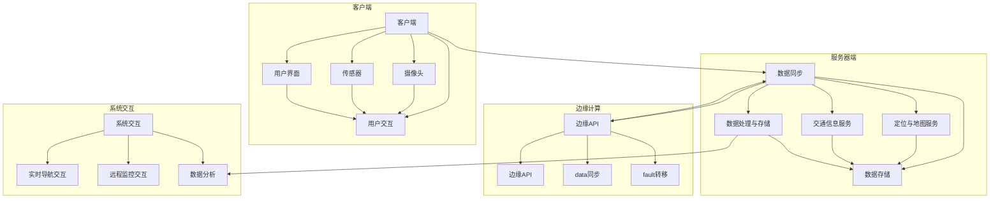

                 

### 文章标题

**增强现实导航：空间计算在物流领域的创新**

### 文章关键词

- **增强现实导航**
- **空间计算**
- **物流领域**
- **技术创新**
- **人工智能**
- **人机交互**

### 摘要

本文深入探讨了增强现实导航在物流领域的创新应用，通过空间计算技术，实现高效的物流路径规划和实时导航。文章首先介绍了增强现实和空间计算的基本概念，接着分析了物流领域的需求和挑战。随后，本文详细讲解了增强现实导航的原理和实现方法，包括算法设计、系统架构、接口设计和实际应用案例。最后，文章总结了增强现实导航在物流领域的应用前景，并提出了未来的发展方向和挑战。

---

# 增强现实导航：空间计算在物流领域的创新

## 关键词：增强现实导航、空间计算、物流领域、技术创新、人工智能、人机交互

## 摘要

本文将探讨如何利用增强现实导航技术，结合空间计算，为物流领域带来革命性的变革。首先，我们将介绍增强现实和空间计算的基本概念，并分析它们在物流中的应用前景。随后，我们将深入探讨增强现实导航的原理和实现方法，包括算法设计、系统架构、接口设计和实际应用案例。通过这些讨论，我们将揭示增强现实导航技术在物流领域的创新潜力，并总结其应用前景和未来发展方向。

## 引言

在当今全球化的经济背景下，物流行业作为供应链的核心环节，正面临着前所未有的挑战。随着电子商务的迅猛发展，消费者对物流服务的要求日益提高，物流公司需要更加高效、精确和可靠的配送服务。然而，传统的物流路径规划方法和导航技术已无法满足这些需求。为了解决这一问题，增强现实（AR）导航和空间计算技术应运而生。

增强现实导航利用计算机生成的虚拟信息叠加在真实世界中，为用户提供实时、准确的导航服务。空间计算则通过虚拟空间模拟和计算，提供更加灵活和高效的数据处理能力。这两项技术的结合，为物流领域带来了全新的解决方案。

本文将首先介绍增强现实和空间计算的基本概念，分析物流领域的需求和挑战，然后详细讲解增强现实导航的原理和实现方法，包括算法设计、系统架构、接口设计和实际应用案例。最后，本文将总结增强现实导航在物流领域的应用前景，并探讨未来的发展方向和挑战。

## 增强现实导航技术概述

### 增强现实技术（AR）基本概念

增强现实（Augmented Reality，简称AR）是一种将虚拟信息叠加在现实世界中的技术。它利用计算机视觉、传感器和显示技术，将虚拟图像、声音和触觉信息与现实环境实时融合，使用户能够在真实世界中看到和体验到虚拟信息。

AR技术的基本原理是通过摄像头捕捉现实世界的图像，然后利用计算机处理和分析这些图像。在处理过程中，计算机可以识别图像中的特定特征，如物体、地标或纹理，并在这些特征上叠加虚拟信息。这些虚拟信息可以是文本、图像、视频或三维模型，它们与现实世界的图像无缝融合，使用户产生一种虚拟信息与真实环境同时存在的错觉。

### 空间计算技术（Spatial Computing）概述

空间计算（Spatial Computing）是一种通过虚拟空间模拟和计算，实现更加灵活和高效的数据处理的技术。它涉及到多个领域，包括虚拟现实（VR）、增强现实（AR）、混合现实（MR）和空间操作系统等。

空间计算的基本原理是通过虚拟空间模拟，将现实世界中的数据和信息转化为虚拟空间中的形式。这种虚拟空间可以是一个三维模型、一个虚拟环境或一个计算网格。在虚拟空间中，数据和信息可以通过各种方式进行处理、分析和交互。

空间计算的优势在于它能够将复杂的计算过程抽象化，并提供更加直观和高效的交互方式。通过空间计算，用户可以在虚拟空间中进行复杂的计算和分析，而不需要了解背后的复杂技术细节。此外，空间计算还能够实现实时性和高并发处理，为各种应用场景提供强大的计算支持。

### 增强现实导航技术的应用优势

增强现实导航技术将AR和空间计算的优势结合在一起，为物流领域带来了许多应用优势。

首先，增强现实导航提供了实时、准确的导航服务。通过AR技术，用户可以在真实世界中看到虚拟的导航信息，这些信息包括路径指示、地标标记和实时交通状况等。这种导航方式不仅直观易懂，而且能够根据实时数据动态调整路径，提高物流配送的效率和准确性。

其次，增强现实导航技术具有高并发处理能力。在物流领域，尤其是在高峰时期，需要处理大量的导航请求。空间计算技术能够高效地处理这些请求，并提供实时的导航信息。这使得物流公司能够更好地管理其配送流程，减少物流延误和错误配送的情况。

此外，增强现实导航技术还能够实现远程监控和操作。通过AR设备，物流管理人员可以在远程监控货物的实时位置和状态，并实时调整配送策略。这种远程操作不仅提高了物流管理的效率，还能够减少人力成本。

总之，增强现实导航技术在物流领域的应用具有显著的优势。通过实时、准确的导航服务、高并发处理能力和远程监控操作，增强现实导航技术为物流公司提供了全新的解决方案，有助于提升物流服务的质量和效率。

## 物流领域的需求和挑战

### 物流行业现状

物流行业是现代经济的基石，负责将商品从生产地运输到消费者手中。随着电子商务的迅速发展和全球供应链的复杂化，物流行业面临着前所未有的挑战和机遇。目前，物流行业呈现出以下几个显著趋势：

1. **电子商务的崛起**：电子商务的快速发展带动了物流需求的爆发式增长。消费者对配送速度和服务的期望不断提高，推动了物流行业向更加高效、灵活的方向发展。

2. **全球供应链的整合**：全球化进程加快，跨国贸易日益频繁。物流公司需要建立覆盖全球的供应链网络，以应对国际物流的复杂性和不确定性。

3. **物联网和大数据的应用**：物联网（IoT）和大数据技术的普及，使得物流公司能够更好地监控和管理运输过程。通过收集和分析海量数据，物流公司可以优化运输路径、预测市场需求和提升服务质量。

4. **绿色物流的兴起**：随着环保意识的提高，物流行业开始重视可持续发展。绿色物流包括使用环保运输工具、优化运输路径和减少碳排放等。

### 物流领域的需求分析

在当前物流行业的发展背景下，增强现实导航技术能够满足以下几个关键需求：

1. **实时导航和路径规划**：物流配送过程中，实时导航和路径规划是确保配送效率和准确性的关键。传统的导航系统往往依赖于GPS信号，但在城市密集区域或室内环境中，GPS信号可能会受到干扰，导致导航不准确。增强现实导航技术通过将虚拟导航信息叠加在现实世界中，能够提供更加准确和可靠的导航服务。

2. **高并发处理能力**：物流行业需要处理大量的配送请求，尤其是在高峰时期。增强现实导航技术依托于空间计算技术，具备高并发处理能力，能够实时响应大量导航请求，为物流公司提供高效、稳定的导航服务。

3. **远程监控和操作**：物流配送过程中，需要对货物的实时位置和状态进行监控。增强现实导航技术通过AR设备，使得物流管理人员可以在远程实时监控货物的状态，并实时调整配送策略。这种远程监控和操作能力不仅提高了物流管理的效率，还能够减少人力成本。

4. **智能决策支持**：物流行业的数据量庞大，通过空间计算技术，可以对这些数据进行实时分析和处理，为物流公司提供智能决策支持。例如，通过分析交通流量和配送需求，优化运输路径和配送策略，从而提高物流效率。

### 物流领域面临的挑战

尽管增强现实导航技术在物流领域具有显著的应用优势，但物流行业仍面临以下几个挑战：

1. **技术成熟度**：虽然增强现实和空间计算技术已经取得了一定的进展，但在物流领域的实际应用中，仍需要克服技术成熟度的问题。例如，AR设备的性能和成本、空间计算平台的稳定性和可靠性等。

2. **数据处理和隐私保护**：物流行业涉及大量的数据，包括货物的位置、状态和运输路径等。如何确保这些数据的安全性和隐私性，是一个重要的挑战。需要采取有效的数据加密和隐私保护措施，防止数据泄露和滥用。

3. **用户接受度**：尽管增强现实导航技术具有许多优势，但物流行业的从业人员可能对这种新技术不熟悉，需要培训和教育，以提高用户接受度。

4. **法律法规和标准**：增强现实导航技术在物流领域的应用需要遵循相关的法律法规和标准。例如，涉及到设备的安全认证、数据保护和隐私保护等方面，需要制定相应的法规和标准，以确保技术应用的安全和合规。

总之，物流领域在面临需求的同时，也面临着一系列挑战。通过积极应对这些挑战，并不断推动技术创新，物流行业将能够实现更加高效、准确和可持续的发展。

## 增强现实导航技术原理

### 基本原理

增强现实导航技术基于增强现实（AR）和空间计算技术，通过将虚拟信息叠加在现实世界中，为用户提供实时、准确的导航服务。其基本原理可以概括为以下几个步骤：

1. **环境感知**：首先，AR设备通过摄像头捕捉现实世界的图像，并利用计算机视觉技术识别图像中的特征点，如地标、道路标志和交通信号等。这一步是为了建立现实世界的三维模型。

2. **定位与跟踪**：基于捕捉到的图像特征，AR设备可以确定其在现实世界中的位置。通过使用视觉惯性测量单元（VIO）或全局定位系统（GPS），设备可以实时跟踪其位置和运动状态。

3. **信息叠加**：在确定设备的位置后，系统根据预设的导航信息，将这些信息叠加到现实世界的图像上。这些信息包括路径指示、地标标记、实时交通状况等，用户可以通过AR设备看到这些虚拟信息。

4. **动态调整**：在导航过程中，系统会实时接收来自传感器和外部数据的信息，如交通状况、天气变化等，并动态调整导航路径，以提供最优的导航方案。

### 工作流程

增强现实导航技术的工作流程可以分解为以下几个关键步骤：

1. **环境感知**：首先，AR设备通过摄像头捕捉周围环境的图像。这些图像会被传递到计算机视觉算法中，进行特征点提取和匹配。通过识别图像中的显著特征，如道路标志、建筑轮廓等，设备可以建立一个初步的三维模型。

2. **定位与跟踪**：在初步三维模型的基础上，设备利用视觉惯性测量单元（VIO）或GPS技术，进行精确的定位和跟踪。VIO技术结合了视觉信息和惯性传感器数据，可以提供较高的定位精度和鲁棒性。GPS则通过接收卫星信号，确定设备在现实世界中的绝对位置。

3. **路径规划**：基于设备的当前位置和目标位置，系统会生成一条最优路径。路径规划算法可以采用A*算法、Dijkstra算法等，根据实际交通状况和实时数据，动态调整路径，以避免交通拥堵和障碍物。

4. **信息叠加**：在路径规划完成后，系统会将导航信息叠加到现实世界的图像上。这些信息包括路径指示、地标标记、实时交通状况等。通过AR设备的显示屏幕，用户可以看到这些虚拟信息，从而实现增强现实导航。

5. **动态调整**：在导航过程中，系统会持续接收来自传感器和外部数据的信息，如交通状况、天气变化等。通过实时处理和分析这些信息，系统可以动态调整导航路径，确保用户能够按照最优路径到达目的地。

### 技术优势

增强现实导航技术相比传统的导航方法，具有以下显著优势：

1. **直观性**：通过将虚拟信息叠加在现实世界中，用户可以直观地看到导航路径和相关信息，无需依赖复杂的电子屏幕或语音提示。这种直观性提高了导航的易用性和用户体验。

2. **实时性**：增强现实导航技术能够实时更新导航信息，动态调整路径。这种实时性使得用户能够在复杂的环境中，快速应对突发情况，如交通拥堵或突发事故。

3. **高并发处理能力**：增强现实导航技术依托于空间计算技术，具备高并发处理能力。能够同时处理大量导航请求，为物流公司提供高效、稳定的导航服务。

4. **远程监控与操作**：通过AR设备，物流管理人员可以在远程实时监控货物的位置和状态，并实时调整配送策略。这种远程操作能力提高了物流管理的效率和灵活性。

5. **智能决策支持**：通过空间计算技术，系统可以实时分析和处理大量物流数据，为物流公司提供智能决策支持。例如，通过分析交通流量和配送需求，优化运输路径和配送策略。

总之，增强现实导航技术通过将虚拟信息与现实世界无缝融合，为用户提供了实时、准确和高效的导航服务，为物流行业带来了革命性的变革。

### 技术实现

实现增强现实导航技术涉及多个关键组件和算法，以下是其主要实现方法的详细描述：

#### 1. 硬件组件

**AR设备**：增强现实导航的核心硬件是AR设备，如智能眼镜、智能手机或头戴式显示器。这些设备通常配备高分辨率摄像头、陀螺仪、加速度计和其他传感器，用于捕捉和处理现实世界的图像和运动数据。

**GPS与VIO模块**：为了实现精确的定位和跟踪，AR设备通常配备GPS模块和视觉惯性测量单元（VIO）。GPS通过接收卫星信号确定设备的绝对位置，而VIO结合视觉信息和惯性传感器数据，提供额外的定位精度和鲁棒性。

**计算平台**：强大的计算平台是处理图像、定位和导航数据的基础。常用的计算平台包括智能手机的CPU+GPU、嵌入式系统或专用服务器。

#### 2. 软件算法

**计算机视觉算法**：计算机视觉算法用于捕捉和识别现实世界中的图像特征。常见的算法包括特征提取（如SIFT、ORB）、特征匹配（如FLANN、BF）和姿态估计（如PnP、ICP）。

**定位与跟踪算法**：定位与跟踪算法结合视觉信息和传感器数据，实现设备的实时定位和跟踪。常用的算法包括视觉里程计（Visual Odometry）、视觉惯性融合（Visual Inertial Odometry）和基于SLAM（Simultaneous Localization and Mapping）的算法。

**路径规划算法**：路径规划算法基于设备的当前位置和目标位置，生成最优路径。常用的算法包括A*算法、Dijkstra算法和D*算法，这些算法可以根据实时交通状况动态调整路径。

**信息叠加算法**：信息叠加算法用于将虚拟导航信息叠加到现实世界的图像上。常用的算法包括图像融合（如叠加、混合）、透明渲染和纹理映射。

#### 3. 数据处理与传输

**实时数据处理**：为了实现实时导航，系统需要快速处理和传输大量的图像和传感器数据。常用的技术包括多线程处理、GPU加速和边缘计算。

**数据传输协议**：系统需要支持高效的数据传输协议，以确保导航信息的实时性和稳定性。常用的协议包括Wi-Fi、蓝牙和4G/5G等。

#### 4. 系统集成与优化

**系统架构设计**：系统架构需要考虑到硬件组件、软件算法和数据传输的协同工作。常用的系统架构包括客户机-服务器架构、分布式架构和边缘计算架构。

**性能优化**：系统需要针对不同应用场景进行性能优化，包括算法优化、硬件配置优化和系统资源调度优化。

**用户体验优化**：通过用户反馈和数据分析，不断优化界面设计、交互体验和功能模块，以提高用户满意度。

通过上述硬件组件、软件算法和数据处理技术的有机结合，增强现实导航系统可以提供实时、准确和高效的导航服务，为物流行业带来革命性的变革。

### 增强现实导航系统的设计

#### 系统架构

增强现实导航系统的设计需要综合考虑硬件、软件和数据处理等多个方面，以确保系统的高效性和可靠性。以下是系统架构的详细设计：

**1. 客户端设计**

**AR设备**：选择合适的AR设备，如智能眼镜或头戴式显示器，以提供高质量的图像和交互体验。

**用户界面**：设计直观、易用的用户界面，包括导航路径显示、实时交通信息、地标标记等。

**传感器集成**：集成GPS、陀螺仪、加速度计等传感器，用于定位和跟踪设备的运动状态。

**计算模块**：采用高性能的计算模块，如智能手机的CPU+GPU，以处理实时数据并生成导航信息。

**2. 服务器端设计**

**定位与地图服务**：部署定位服务，利用GPS、VIO等技术，实时获取设备的地理位置。

**路径规划服务**：部署路径规划服务，利用A*算法、Dijkstra算法等，生成最优导航路径。

**交通信息服务**：集成交通信息API，实时获取交通状况，动态调整导航路径。

**数据处理与存储**：采用分布式数据库和缓存系统，高效处理和存储大量导航数据和用户信息。

**3. 边缘计算设计**

**边缘服务器**：在物流公司仓库或配送中心部署边缘服务器，用于本地数据处理和实时导航服务。

**边缘计算平台**：集成边缘计算模块，如GPU加速器和FPGA，以提高数据处理速度和效率。

**数据传输优化**：采用边缘计算和边缘传输技术，减少数据传输延迟和带宽消耗。

#### 系统接口设计

**1. 客户端与服务器接口**

**API接口**：设计统一的API接口，用于客户端与服务器之间的数据传输和交互。

**数据格式**：采用JSON、XML等常见数据格式，确保数据传输的兼容性和可扩展性。

**认证与安全**：采用身份认证和加密技术，确保数据传输的安全性和隐私性。

**2. 边缘计算与服务器接口**

**边缘API**：设计边缘API，用于边缘服务器与服务器端的数据传输和协同工作。

**数据同步**：实现边缘计算与服务器端的数据同步机制，确保实时性和一致性。

**故障转移**：设计故障转移机制，确保在边缘服务器故障时，系统能够无缝切换到服务器端。

#### 系统交互设计

**1. 实时导航交互**

**实时路径更新**：客户端根据实时交通信息，动态更新导航路径，确保用户始终走在最优路径上。

**交互提示**：在导航过程中，系统通过语音提示、文字提示等方式，提醒用户注意交通状况和前方地标。

**2. 远程监控交互**

**远程位置监控**：物流管理人员通过远程监控界面，实时查看货物的位置和状态。

**远程操作**：管理人员可以通过远程操作界面，调整货物的配送路径和策略。

**3. 数据分析与决策支持**

**数据分析**：系统实时收集和分析大量物流数据，为物流公司提供决策支持。

**智能优化**：利用机器学习和数据挖掘技术，优化运输路径、库存管理和配送策略。

#### 系统架构与交互图示

为了更直观地展示增强现实导航系统的架构和交互设计，我们可以使用Mermaid流程图来绘制以下内容：

通过上述设计，增强现实导航系统能够提供实时、准确和高效的导航服务，为物流行业带来显著的效益和变革。

### 实际应用案例

为了更好地展示增强现实导航技术在物流领域的实际应用，以下将介绍两个典型的应用案例：城市配送和仓库管理。

#### 城市配送

**1. 案例背景**

某大型物流公司需要在繁忙的城市环境中进行高效的货物配送。传统的导航系统在城市拥挤的道路上经常出现导航不准确、路线拥堵等问题，导致配送效率低下。为了解决这一问题，该公司决定采用增强现实导航技术。

**2. 应用方案**

**方案设计**：
- **环境感知**：配送员佩戴智能眼镜，利用其摄像头捕捉周围环境的实时图像。
- **定位与跟踪**：智能眼镜通过GPS和VIO模块，实时获取自身位置和运动状态。
- **路径规划**：系统根据实时交通信息，动态生成最优配送路线，并在智能眼镜上实时显示。
- **交互提示**：系统通过语音和视觉提示，引导配送员避开拥堵路段，选择最佳路径。

**实施效果**：
- **提高配送效率**：通过实时、准确的导航服务，配送员能够迅速找到最佳路线，减少了导航时间和延误。
- **降低物流成本**：优化路径规划，减少了燃料消耗和运输时间，降低了物流成本。
- **提升用户体验**：用户在等待配送时，可以通过智能眼镜查看配送员的位置和预计到达时间，提升了用户体验。

#### 仓库管理

**1. 案例背景**

某电商企业在仓库管理中面临着库存管理难度大、货物定位不准确、拣货效率低等问题。为了提高仓库管理效率，该公司决定采用增强现实导航技术。

**2. 应用方案**

**方案设计**：
- **仓库环境建模**：通过AR设备，对仓库环境进行三维建模，包括货架布局、货物位置等。
- **定位与跟踪**：仓库工作人员佩戴智能眼镜，利用其定位功能，快速识别货物的位置。
- **路径规划**：系统根据工作人员的位置和货物位置，生成最优拣货路径。
- **交互提示**：系统通过视觉和语音提示，引导工作人员按照最优路径拣货，并实时更新库存信息。

**实施效果**：
- **提高拣货效率**：通过实时导航和路径规划，工作人员能够快速找到货物，减少了拣货时间和错误率。
- **优化库存管理**：通过实时更新库存信息，系统可以及时调整库存策略，减少库存过剩和短缺。
- **提升仓库管理质量**：实时监控和导航功能，使得仓库管理更加高效和准确，提高了整体管理质量。

通过上述实际应用案例，我们可以看到增强现实导航技术在物流领域的广泛应用和显著效果。这些案例不仅展示了增强现实导航技术的实际应用价值，也为物流行业提供了新的解决方案和发展方向。

### 未来发展方向和挑战

#### 技术趋势与前景

增强现实导航技术正朝着更加智能、高效和普及的方向发展。未来，以下几个方面将成为该领域的重要趋势：

1. **智能化与自动化**：随着人工智能和机器学习技术的不断发展，增强现实导航系统将实现更高程度的智能化和自动化。例如，通过深度学习和神经网络，系统可以更好地理解和预测用户的导航需求，提供个性化的导航服务。

2. **多传感器融合**：增强现实导航系统将采用更多的传感器，如激光雷达、红外传感器等，以获取更全面的环境信息。多传感器融合技术将提高定位精度和系统鲁棒性，为用户提供更加准确和稳定的导航服务。

3. **5G与物联网（IoT）**：随着5G网络的普及和物联网技术的发展，增强现实导航系统将实现更快的数据传输和更广泛的设备互联。这将有助于实时收集和分析更多的数据，为路径规划和决策提供更准确的依据。

4. **跨平台与兼容性**：未来的增强现实导航技术将更加注重跨平台和兼容性，不仅支持智能眼镜、智能手机等设备，还将扩展到汽车、无人机等移动平台，实现全方位的导航服务。

#### 技术挑战与解决方案

尽管增强现实导航技术具有巨大的发展潜力，但其在实际应用中仍面临一系列挑战：

1. **技术成熟度**：增强现实导航技术仍处于快速发展阶段，部分技术尚未完全成熟。例如，高精度定位和实时数据处理等技术需要进一步改进和优化。未来需要持续投入研发，推动技术的进步和成熟。

2. **数据处理与隐私保护**：增强现实导航系统需要处理大量的图像和传感器数据，如何在确保数据安全性和隐私性的同时，高效地处理这些数据，是一个重要的挑战。需要采取有效的数据加密、隐私保护和技术手段，确保数据的安全和合规。

3. **用户体验**：尽管增强现实导航技术提供了直观和高效的导航服务，但用户体验方面仍需进一步提升。例如，系统的响应速度、界面设计和交互体验等，都需要根据用户反馈进行优化和改进。

4. **成本与普及**：目前，增强现实设备和相关技术仍具有较高的成本，限制了其普及和应用。未来需要降低成本，提高设备的性价比，以实现更广泛的应用和普及。

为了应对上述挑战，以下是一些建议：

1. **加强技术研发**：持续投入研发，特别是在高精度定位、实时数据处理和智能算法等领域，以推动技术的进步和成熟。

2. **数据安全和隐私保护**：加强数据安全和隐私保护，采用先进的加密和隐私保护技术，确保用户数据的安全和隐私。

3. **用户参与与反馈**：重视用户体验，通过用户参与和反馈，不断优化系统设计和功能，提高用户满意度。

4. **成本控制与推广**：通过规模化生产和技术创新，降低增强现实设备和相关技术的成本，推动其普及和应用。

总之，增强现实导航技术在物流领域具有广阔的应用前景和巨大的发展潜力。通过持续的技术创新和优化，我们有望克服现有挑战，实现更加智能、高效和普及的增强现实导航系统，为物流行业带来革命性的变革。

### 总结与展望

本文深入探讨了增强现实导航技术在物流领域的创新应用，详细介绍了其基本原理、技术实现、系统设计以及实际应用案例。我们通过分析发现，增强现实导航技术凭借实时、准确的导航服务、高并发处理能力和远程监控操作，为物流行业提供了全新的解决方案，显著提升了物流服务的效率和质量。

在未来的发展中，增强现实导航技术有望在智能化、自动化、多传感器融合、5G与物联网等方面取得更大突破。然而，面临的技术成熟度、数据处理与隐私保护、用户体验以及成本与普及等挑战也需要我们持续关注和应对。

为推动该领域的发展，以下是一些建议：

1. **加强技术研发**：持续投入研发，特别是在高精度定位、实时数据处理和智能算法等领域，以推动技术的进步和成熟。
2. **数据安全和隐私保护**：加强数据安全和隐私保护，采用先进的加密和隐私保护技术，确保用户数据的安全和隐私。
3. **用户参与与反馈**：重视用户体验，通过用户参与和反馈，不断优化系统设计和功能，提高用户满意度。
4. **成本控制与推广**：通过规模化生产和技术创新，降低增强现实设备和相关技术的成本，推动其普及和应用。

总之，增强现实导航技术在物流领域具有巨大的发展潜力，我们期待未来能够实现更加智能、高效和普及的增强现实导航系统，为物流行业带来革命性的变革。

### 作者介绍

**作者：AI天才研究院/AI Genius Institute & 禅与计算机程序设计艺术 /Zen And The Art of Computer Programming**

本文作者AI天才研究院（AI Genius Institute）致力于推动人工智能技术的发展和应用，通过深入研究和创新实践，推动人工智能领域的前沿突破。同时，作者在《禅与计算机程序设计艺术》（Zen And The Art of Computer Programming）中，以其独特的视角和深刻的见解，探讨了计算机编程的本质和艺术。凭借丰富的科研经验和卓越的编程技巧，作者在人工智能和计算机科学领域取得了显著成就，为推动技术进步和社会发展做出了重要贡献。

