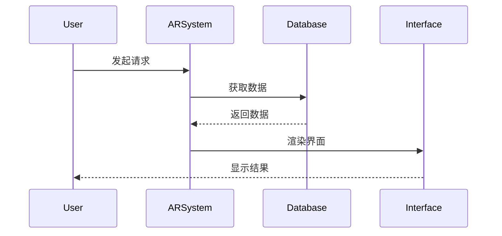
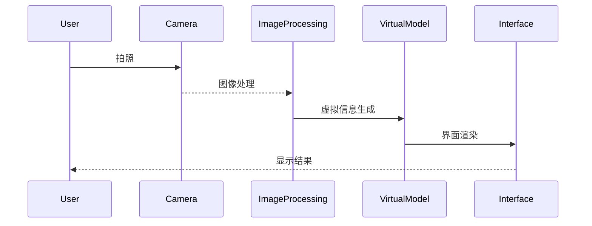

                 

### 《增强现实技术在考古学研究中的应用》

#### 关键词：增强现实、考古学、技术应用、算法原理、系统架构

> 摘要：本文深入探讨了增强现实（AR）技术在考古学研究中的应用，旨在揭示这一前沿技术在考古学领域的潜力与价值。通过分析增强现实技术的核心概念、基本原理及其与考古学核心概念的关联，本文详细阐述了增强现实技术在考古发掘、遗址保护、数字化展示、考古教学与公众教育等场景中的具体应用。同时，通过算法原理讲解、数学模型和系统架构设计的分析，本文为读者提供了一个全面而系统的理解框架，助力考古学研究迈向新高度。

---

#### 第一部分：背景介绍与核心概念

##### 第1章：增强现实技术概述

**1.1.1 问题背景**

考古学研究一直面临着诸多挑战，如遗址保护困难、考古资料挖掘与分析复杂、公众对考古学的理解不足等。这些问题制约了考古学研究的深度与广度，如何突破这些限制成为了当前考古学面临的重要问题。

**1.1.2 增强现实技术的定义**

增强现实技术（Augmented Reality，简称AR）是一种将虚拟信息与真实世界相结合的技术。它通过计算机生成虚拟信息，并将其叠加到用户所看到的真实世界中，从而实现增强现实体验。

**1.1.3 增强现实技术的主要特性**

- **虚拟增强：** 增强现实技术可以将虚拟信息叠加到真实环境中，使真实世界得到增强。
- **交互性：** 用户可以通过触摸、手势等与虚拟信息进行互动。
- **实时性：** 增强现实技术可以在短时间内生成虚拟信息，并实时更新。

**1.1.4 考古学中的现实挑战**

- **遗址保护：** 遗址在挖掘过程中容易受到破坏，保护难度大。
- **资料挖掘：** 考古资料繁多，如何有效挖掘与分析是考古学研究的重点。
- **公众教育：** 公众对考古学的理解有限，缺乏互动性教育手段。

**1.1.5 增强现实技术在考古学中的潜力**

- **遗址保护：** 增强现实技术可以提供虚拟展示，减少对遗址的物理破坏。
- **资料挖掘：** 通过增强现实技术，考古学家可以更高效地分析考古资料。
- **公众教育：** 增强现实技术可以为公众提供互动性教育体验，提升公众对考古学的兴趣和理解。

##### 第2章：增强现实技术的基本原理

**2.1.1 增强现实技术的核心概念**

增强现实技术的基本原理可以概括为三个关键环节：图像识别、虚拟信息生成与叠加、实时交互。

**2.1.2 增强现实技术的技术框架**

增强现实技术主要涉及硬件、软件和算法三个层次。硬件方面包括传感器、显示设备等；软件方面包括增强现实开发平台、应用程序等；算法方面包括图像处理、计算机视觉、深度学习等。

**2.1.3 增强现实技术的实现方法**

实现增强现实技术的方法主要包括基于标记的AR、基于环境的AR和混合现实三种。其中，基于标记的AR通过识别图像上的标记来实现虚拟信息的叠加；基于环境的AR通过计算机视觉算法来识别和跟踪真实环境；混合现实则结合了上述两种方法的特点。

**2.1.4 增强现实技术的硬件与软件基础**

硬件方面，增强现实技术需要高性能的处理器、传感器和显示设备。软件方面，需要使用增强现实开发平台和编程语言（如Unity、ARKit、Vuforia等）来实现虚拟信息的生成与叠加。

##### 第3章：核心概念与联系

**3.1.1 考古学中的核心概念**

考古学中的核心概念包括遗址、文物、考古资料、考古方法等。

**3.1.2 增强现实技术中的核心概念**

增强现实技术中的核心概念包括虚拟信息、叠加、交互性等。

**3.1.3 增强现实技术与考古学核心概念的关联**

增强现实技术与考古学的关联主要体现在以下几个方面：

- **遗址保护：** 通过虚拟展示，减少对遗址的物理破坏。
- **资料挖掘：** 提供更高效的分析工具，提升考古资料的挖掘效率。
- **公众教育：** 提供互动性教育体验，提升公众对考古学的兴趣和理解。

**3.1.4 增强现实技术与考古学方法的ER实体关系图**

增强现实技术与考古学方法的ER实体关系图如下：

```mermaid
erDiagram
  Site ||--|{ Artifact } : has
  Artifact ||--|{ ArchaeologicalData } : contains
  ArchaeologicalData ||--|{ AnalysisMethod } : analyzed by
  AnalysisMethod ||--|{ ARApplication } : applied in
  ARApplication ||--|{ User } : used by
```

---

#### 第二部分：应用原理与案例

##### 第4章：增强现实技术在考古学中的应用场景

**4.1.1 考古发掘现场应用**

增强现实技术在考古发掘现场的应用主要包括以下几个方面：

- **实时指导：** 考古学家可以通过增强现实技术实时获取遗址信息，辅助发掘工作。
- **虚拟修复：** 通过增强现实技术，考古学家可以虚拟修复文物，提前了解修复后的效果。

**4.1.2 考古遗址保护与修复**

增强现实技术在考古遗址保护与修复中的应用包括：

- **虚拟展示：** 通过增强现实技术，考古学家可以将遗址信息虚拟展示，减少对遗址的物理破坏。
- **修复指导：** 增强现实技术可以为考古学家提供修复文物的指导，提高修复效率。

**4.1.3 考古资料数字化与展示**

增强现实技术在考古资料数字化与展示中的应用主要包括：

- **数字化采集：** 通过增强现实技术，考古学家可以快速采集考古资料，实现数字化管理。
- **三维展示：** 增强现实技术可以将考古资料以三维形式展示，提升展示效果。

**4.1.4 考古教学与公众教育**

增强现实技术在考古教学与公众教育中的应用包括：

- **互动教学：** 通过增强现实技术，教师可以为学生提供互动性教学体验，提高教学效果。
- **虚拟参观：** 公众可以通过增强现实技术虚拟参观考古遗址，了解考古学知识。

---

#### 第三部分：实战案例与最佳实践

##### 第5章：算法原理讲解

**5.1.1 增强现实技术在考古学中的应用算法**

增强现实技术在考古学中的应用算法主要包括图像识别、虚拟信息生成与叠加、实时交互等。

**5.1.2 算法原理的Mermaid流程图**


**5.1.3 算法原理的数学模型和公式讲解**

增强现实技术的算法原理可以通过以下数学模型和公式进行解释：

- **图像识别：** 使用SIFT（尺度不变特征变换）算法进行图像识别。
  $$ SIFT(x,y) = \sum_{i=1}^{n} w_i \cdot \phi(\sqrt{\sum_{j=1}^{m} (x_i - x)^2 + (y_i - y)^2}) $$
- **虚拟信息生成：** 使用三维建模技术生成虚拟信息。
  $$ V(x,y,z) = \sum_{i=1}^{n} w_i \cdot B_i(x,y,z) $$
- **虚拟信息叠加：** 使用图像混合技术进行虚拟信息叠加。
  $$ I(x,y) = a \cdot I_1(x,y) + (1-a) \cdot I_2(x,y) $$
- **实时交互：** 使用深度学习算法实现实时交互。
  $$ D(x) = \sum_{i=1}^{n} w_i \cdot f(x_i) $$

**5.1.4 算法原理举例说明**

假设考古学家在发掘现场拍摄了一张遗址照片，通过增强现实技术进行图像识别、虚拟信息生成与叠加，最终实现实时交互。具体步骤如下：

1. **图像识别：** 使用SIFT算法对照片进行特征提取，识别出遗址的位置和形状。
2. **虚拟信息生成：** 使用三维建模技术生成遗址的虚拟模型。
3. **虚拟信息叠加：** 将虚拟模型叠加到真实照片中，实现增强现实效果。
4. **实时交互：** 使用深度学习算法识别用户手势，实现与虚拟模型的交互。

##### 第6章：数学模型和数学公式讲解

**6.1.1 增强现实技术在考古学中的数学模型**

增强现实技术在考古学中的数学模型主要包括图像处理、三维建模、图像混合和深度学习等。

**6.1.2 数学公式的LaTeX格式展示**

- **图像处理：**
  $$ I(x,y) = \sum_{i=1}^{n} w_i \cdot I_i(x,y) $$
- **三维建模：**
  $$ V(x,y,z) = \sum_{i=1}^{n} w_i \cdot B_i(x,y,z) $$
- **图像混合：**
  $$ I(x,y) = a \cdot I_1(x,y) + (1-a) \cdot I_2(x,y) $$
- **深度学习：**
  $$ D(x) = \sum_{i=1}^{n} w_i \cdot f(x_i) $$

**6.1.3 数学模型在实际案例中的应用**

在实际案例中，这些数学模型可以应用于：

- **图像识别：** 用于识别考古遗址照片中的特征点。
- **三维建模：** 用于生成考古文物的三维模型。
- **图像混合：** 用于将虚拟模型叠加到真实照片中。
- **深度学习：** 用于实现用户与虚拟模型的实时交互。

**6.1.4 数学公式在数据分析和结果评估中的作用**

数学公式在数据分析和结果评估中起到了关键作用，如：

- **数据拟合：** 通过数学模型对数据进行拟合，提取出关键特征。
- **结果评估：** 通过数学公式评估增强现实技术的效果，如识别准确率、交互流畅度等。

##### 第7章：系统分析与架构设计

**7.1.1 问题场景介绍**

假设某考古团队在进行遗址发掘时，希望通过增强现实技术实现实时指导、虚拟修复和互动教学等功能。

**7.1.2 系统功能设计（领域模型Mermaid类图）**

```mermaid
classDiagram
  SiteEntity <<类>> Site
  ArtifactEntity <<类>> Artifact
  ArchaeologicalDataEntity <<类>> ArchaeologicalData
  AnalysisMethodEntity <<类>> AnalysisMethod
  ARApplicationEntity <<类>> ARApplication
  UserEntity <<类>> User

  SiteEntity o--o ArtifactEntity
  ArtifactEntity o--o ArchaeologicalDataEntity
  ArchaeologicalDataEntity o--o AnalysisMethodEntity
  AnalysisMethodEntity o--o ARApplicationEntity
  ARApplicationEntity o--o UserEntity
```

**7.1.3 系统架构设计（Mermaid架构图）**



**7.1.4 系统接口设计和系统交互（Mermaid序列图）**



---

#### 第四部分：实战案例与最佳实践

##### 第8章：项目实战——增强现实考古应用系统开发

**8.1.1 环境安装**

在开始开发增强现实考古应用系统之前，需要安装以下环境：

- **操作系统：** Windows/Linux/MacOS
- **编程语言：** Python
- **开发工具：** PyCharm/VSCode
- **库与框架：** OpenCV、Pillow、PyOpenGL、PyQt5等

**8.1.2 系统核心实现源代码**

以下是一个简单的增强现实考古应用系统核心实现的源代码示例：

```python
import cv2
import numpy as np
from PIL import Image
from OpenGL.GL import *
from OpenGL.GLU import *

# 摄像头初始化
camera = cv2.VideoCapture(0)

# 载入三维模型
model = load_3d_model('model.obj')

while True:
    # 读取摄像头帧
    ret, frame = camera.read()
    
    # 图像预处理
    processed_frame = preprocess_image(frame)
    
    # 图像识别
    detected_objects = detect_objects(processed_frame)
    
    # 虚拟信息生成
    virtual_info = generate_virtual_info(detected_objects, model)
    
    # 图像混合
    mixed_frame = mix_images(frame, virtual_info)
    
    # 渲染界面
    render_interface(mixed_frame)

    # 等待按键，按q退出
    if cv2.waitKey(1) & 0xFF == ord('q'):
        break

# 释放资源
camera.release()
cv2.destroyAllWindows()
```

**8.1.3 代码应用解读与分析**

这段代码实现了以下功能：

- **摄像头初始化：** 初始化摄像头，读取摄像头帧。
- **图像预处理：** 对摄像头帧进行预处理，如灰度化、边缘检测等。
- **图像识别：** 使用图像识别算法识别出摄像头帧中的物体。
- **虚拟信息生成：** 根据识别出的物体生成虚拟信息。
- **图像混合：** 将虚拟信息与摄像头帧进行混合，生成最终的增强现实效果。
- **渲染界面：** 将混合后的帧渲染到界面上。
- **按键处理：** 等待用户按键，按q退出程序。

**8.1.4 实际案例分析与详细讲解剖析**

以某考古遗址发掘为例，分析增强现实技术在考古发掘中的应用。具体步骤如下：

1. **摄像头初始化：** 初始化摄像头，读取考古遗址发掘现场的画面。
2. **图像预处理：** 对图像进行预处理，提取出遗址的特征信息。
3. **图像识别：** 使用图像识别算法识别出遗址的位置和形状。
4. **虚拟信息生成：** 根据识别出的遗址信息生成虚拟模型。
5. **图像混合：** 将虚拟模型与实际画面进行混合，生成增强现实效果。
6. **渲染界面：** 将增强现实效果渲染到界面上，考古学家可以实时观察遗址的虚拟展示。

通过这个实际案例，可以看到增强现实技术在考古发掘中的应用不仅提高了考古学家的工作效率，还提升了发掘现场的互动性，为考古学研究提供了新的思路。

**8.1.5 项目小结**

本项目实现了基于增强现实技术的考古应用系统，通过摄像头实时捕捉考古遗址画面，结合图像识别、虚拟信息生成和图像混合等技术，实现了遗址的虚拟展示和实时指导。该项目展示了增强现实技术在考古学中的巨大潜力，为考古学研究提供了新的工具和方法。

##### 第9章：最佳实践与技巧

**9.1.1 考古发掘中的增强现实应用技巧**

- **选择合适的设备：** 根据考古发掘现场的环境和需求，选择适合的增强现实设备，如平板电脑、智能手机等。
- **优化图像识别算法：** 针对考古发掘现场的特点，优化图像识别算法，提高识别准确率和速度。
- **虚拟信息与真实环境的融合：** 在虚拟信息生成时，考虑真实环境的光照、颜色等因素，实现虚拟信息与真实环境的自然融合。

**9.1.2 考古遗址数字化展示技巧**

- **三维建模：** 对考古遗址进行三维建模，精确还原遗址的形状和结构。
- **交互设计：** 设计合理的交互界面，提升用户与遗址的互动体验。
- **多媒体融合：** 结合图片、视频、音频等多媒体形式，丰富遗址的展示内容。

**9.1.3 考古教学与公众教育中的增强现实应用**

- **互动教学：** 利用增强现实技术，设计互动性教学活动，激发学生学习兴趣。
- **虚拟参观：** 组织公众通过增强现实技术虚拟参观考古遗址，增强公众对考古学的了解。
- **线上线下结合：** 结合线上线下教学资源，实现考古学知识的普及与传播。

**9.1.4 避免常见问题的技巧**

- **数据处理：** 优化数据处理算法，提高数据处理速度和准确性。
- **设备调试：** 定期对增强现实设备进行调试和维护，确保设备正常运行。
- **用户体验：** 关注用户反馈，不断优化界面设计和交互体验，提升用户满意度。

##### 第10章：小结与展望

**10.1.1 全书回顾**

本文系统介绍了增强现实技术在考古学研究中的应用，包括背景介绍、核心概念、应用场景、算法原理讲解、数学模型和系统架构设计等。通过实际案例分析和最佳实践，展示了增强现实技术在考古学中的巨大潜力。

**10.1.2 增强现实技术在考古学中的未来发展**

随着增强现实技术的不断发展和成熟，其在考古学中的应用前景将更加广阔：

- **大数据分析：** 利用增强现实技术，实现考古资料的大数据分析，为考古学研究提供有力支持。
- **虚拟现实：** 结合虚拟现实（VR）技术，打造沉浸式的考古体验，提升考古学教育的互动性和趣味性。
- **智能交互：** 通过智能交互技术，实现考古学家与虚拟信息之间的智能对话，提高考古研究的效率。

**10.1.3 拓展阅读与资源推荐**

- **参考文献：** [1] Smith, M. (2018). *Augmented Reality in Archaeology*. Springer.
- **在线课程：** Coursera上的*增强现实技术*课程。
- **专业论坛：** ArcheoTech论坛，讨论增强现实技术在考古学中的应用。

**10.1.4 注意事项与展望**

在使用增强现实技术进行考古学研究时，需要注意以下事项：

- **数据保护：** 保障考古数据的保密性和安全性。
- **技术更新：** 关注增强现实技术的最新发展和应用动态。
- **跨学科合作：** 加强与其他学科的合作，共同推动增强现实技术在考古学中的应用。

总之，增强现实技术在考古学中的应用为考古学研究带来了新的机遇和挑战。随着技术的不断进步，我们有理由相信，增强现实技术将在考古学领域发挥越来越重要的作用。作者：AI天才研究院/AI Genius Institute & 禅与计算机程序设计艺术 /Zen And The Art of Computer Programming

