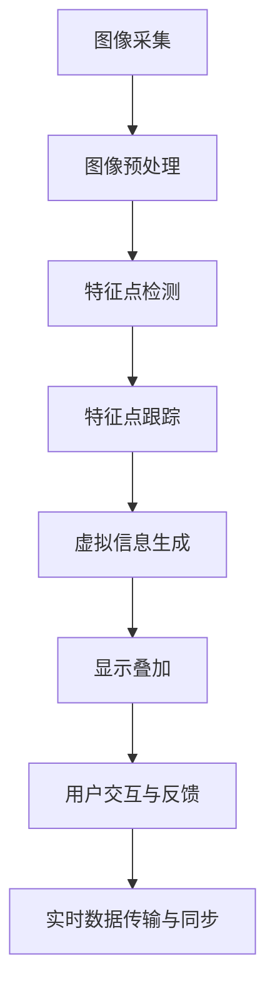
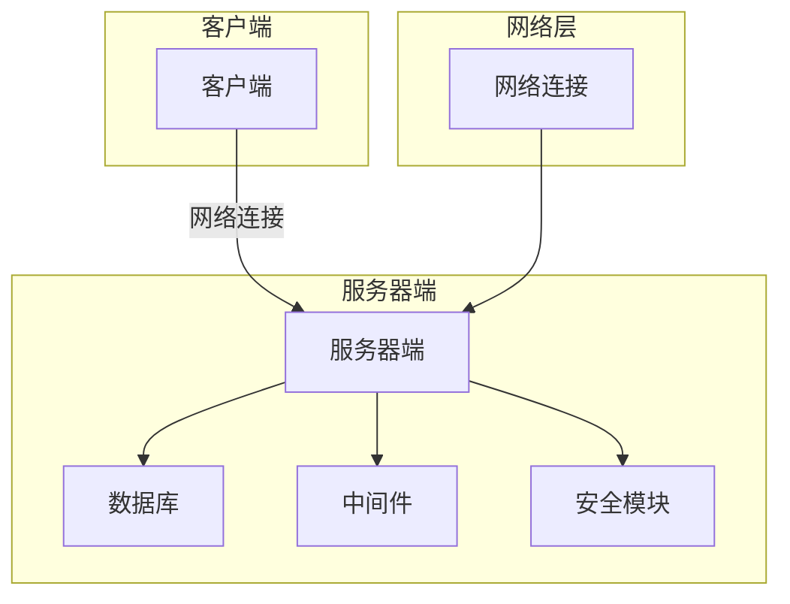
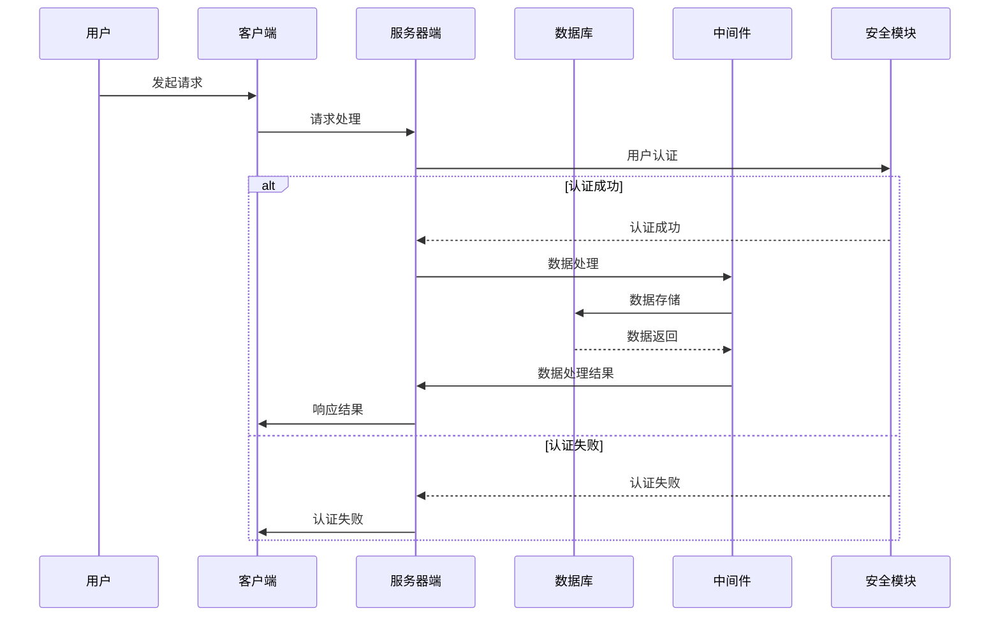

                 

### 问题背景与概念阐述

在现代信息技术高速发展的背景下，远程协作已经成为企业组织运营中不可或缺的一部分。无论是跨国公司还是初创企业，远程协作都大大提升了工作效率和灵活性。然而，远程协作也面临着诸多挑战，如沟通障碍、协同效率低、信息传递延迟等。

首先，远程协作面临的沟通障碍主要体现在以下几个方面。由于团队成员地理位置的分散，即时沟通的效率大打折扣。传统的语音通话、电子邮件和即时通讯工具虽然能够传递信息，但缺乏直观性和互动性，往往无法准确传达信息意图，导致误解和沟通不畅。此外，视频会议虽然提供了一定的实时互动，但在视觉和触觉体验上仍存在局限，难以满足某些复杂协作场景的需求。

其次，协同效率低也是远程协作的痛点之一。团队成员分布在不同的工作地点，缺乏面对面的交流和协作机会，容易导致工作进度不一致，项目协作效率低下。尽管协作工具如共享文档、项目管理软件等在一定程度上解决了信息共享的问题，但它们缺乏对协作场景的深度理解和智能支持，难以实现高效的协同工作。

信息传递延迟则是远程协作面临的另一个重要问题。数据传输的延迟不仅影响了实时通信的质量，也影响了团队对信息的快速响应能力。尤其是在需要实时互动的协作任务中，如紧急问题处理或实时决策制定，信息传递延迟可能导致严重的后果。

为了解决上述问题，增强现实（Augmented Reality，AR）技术的引入提供了一种创新的解决方案。增强现实技术通过将虚拟信息叠加到真实环境中，为远程协作提供了更直观、更沉浸的互动体验。与传统远程协作工具相比，增强现实技术能够提供实时、高效的协同环境，有效解决沟通障碍、提升协同效率，并减少信息传递延迟。

增强现实技术的核心在于将虚拟信息与现实环境无缝融合。通过头戴显示器、智能眼镜等设备，用户可以实时看到叠加在真实环境中的虚拟对象和信息，实现与现实环境的互动。这种直观的交互方式不仅提升了沟通效率，还增强了用户的参与感和沉浸感，使得远程协作更加高效和顺畅。

综上所述，远程协作面临的沟通障碍、协同效率低和信息传递延迟等问题为增强现实技术的应用提供了广阔的前景。增强现实技术通过提供更直观、更沉浸的互动体验，有望为远程协作带来革命性的改变。接下来的章节将深入探讨增强现实技术的定义、分类及其在远程协作中的具体应用，为读者全面了解这一领域奠定基础。

### 增强现实技术的定义与分类

增强现实（Augmented Reality，AR）技术是一种通过计算机生成的虚拟信息，叠加到真实环境中，从而增强用户视觉、听觉、触觉等感官体验的技术。它不仅保留了现实世界的视觉元素，还通过虚拟信息的引入，扩展了用户的感知范围，实现了现实与虚拟世界的无缝融合。

根据增强现实技术实现方式的不同，我们可以将其分为两大类：标记增强现实（Marker-based AR）和无标记增强现实（Markerless AR）。

#### 标记增强现实

标记增强现实技术通过特定的标记（如二维码、条形码、特殊图案等）来识别和定位虚拟信息的显示位置。这些标记通常是静态的，固定在现实环境中的特定位置。当设备（如智能手机、平板电脑或头戴显示器）的摄像头捕捉到这些标记时，系统会根据标记的位置和方向计算出虚拟信息的显示位置，并将其叠加到现实场景中。

标记增强现实技术的优点在于定位精度高、稳定可靠。它适用于需要高精度定位和固定场景的远程协作应用，如建筑图纸查看、工业维修指导等。然而，其缺点在于需要预先设定和固定标记，限制了应用的灵活性。

#### 无标记增强现实

无标记增强现实技术则不依赖于任何特定的标记，通过计算机视觉算法和深度学习模型来识别和定位现实环境中的特征点，从而实现虚拟信息的叠加。这种技术能够自动适应不同的场景和环境，具有较高的实时性和灵活性。

无标记增强现实技术的优点在于无需预先设置标记，能够动态适应不同的环境，适用于更为复杂的远程协作场景，如虚拟会议、远程医疗等。然而，其定位精度和稳定性相对较低，特别是在复杂环境下，容易受到光照、背景等因素的干扰。

#### 分类及应用场景

除了根据增强现实技术的实现方式进行分类，我们还可以根据其应用场景进行分类，常见的应用场景包括：

1. **教育领域**：增强现实技术可以提供更为生动和直观的学习体验，如虚拟实验室、互动教材等，帮助学生更好地理解和掌握知识。

2. **医疗领域**：增强现实技术可以用于远程手术指导、医学教育、患者护理等，通过实时叠加虚拟信息，提升医疗服务的质量和效率。

3. **工业领域**：增强现实技术可以用于工业设备的维修和维护，提供实时指导和反馈，降低操作难度和误操作风险。

4. **娱乐领域**：增强现实技术可以应用于游戏、主题公园等娱乐场景，为用户带来沉浸式的体验。

5. **商业领域**：增强现实技术可以用于产品展示、营销推广等，通过虚拟演示和互动，提升用户对产品和服务的认知和兴趣。

通过上述分类，我们可以看到增强现实技术的多样性和广泛应用前景。在远程协作中，增强现实技术通过提供更直观、更沉浸的互动体验，可以有效解决传统远程协作工具的诸多问题，提升团队协作效率和用户体验。接下来的章节将进一步探讨增强现实技术在不同远程协作场景中的应用案例和发展趋势。

### 远程协作中增强现实技术的应用现状

增强现实（AR）技术在远程协作中的应用已经取得了显著的进展，并在多个领域展现出了其独特的优势和潜力。目前，增强现实技术在远程协作中的应用主要分为以下几个方面：

#### 1. 虚拟会议

虚拟会议是远程协作中最为常见和广泛应用的形式之一。通过增强现实技术，虚拟会议不再局限于传统的视频通话，而是可以提供更为沉浸和互动的体验。例如，增强现实技术可以实现参会者的虚拟形象实时叠加到会议环境中，使得参会者能够更加直观地感受到彼此的存在，增强会议的互动性和参与感。

此外，增强现实技术还可以提供实时的互动功能，如虚拟白板、即时信息推送等，使得会议内容更加丰富和多样化。例如，通过增强现实技术，参会者可以在虚拟白板上实时绘制图表、标注重点，使得会议记录更加清晰和准确。

#### 2. 远程医疗

远程医疗是另一个受益于增强现实技术的领域。通过增强现实技术，医生和患者可以跨越地理界限，实现实时互动和诊断。例如，增强现实技术可以将患者的医疗数据实时叠加到医生的眼镜或显示器上，帮助医生更好地进行诊断和治疗。

在手术过程中，增强现实技术同样具有巨大的应用潜力。通过将手术过程的关键信息（如手术步骤、患者状态等）实时叠加到医生的眼镜或显示器上，医生可以更加专注于手术操作，减少手术风险，提高手术的成功率。

#### 3. 工业维护

在工业领域，增强现实技术可以用于设备的远程维护和故障诊断。通过增强现实技术，技术人员可以在远程地点实时查看设备的运行状态，并根据虚拟叠加的维修指导进行操作。这种远程维护方式不仅提高了工作效率，还减少了技术人员的不必要出差，降低了维护成本。

例如，在飞机维修中，技术人员可以通过增强现实眼镜查看飞机的各个部位，并接收虚拟叠加的维修指令，快速定位故障并进行修复。这不仅提高了维修效率，还减少了操作错误的风险。

#### 4. 虚拟培训

虚拟培训是增强现实技术在远程协作中另一个重要的应用领域。通过增强现实技术，培训内容可以以更加生动和直观的方式呈现，提升学习效果。例如，在机械操作培训中，学员可以通过增强现实眼镜实时查看操作步骤和注意事项，并在虚拟环境中进行操作练习，从而更好地掌握操作技能。

此外，增强现实技术还可以实现实时互动，例如通过虚拟叠加的问答功能，教师可以实时解答学员的问题，提供个性化的指导和建议，提高培训的互动性和针对性。

#### 5. 虚拟展示

虚拟展示是增强现实技术在商业领域的重要应用。通过增强现实技术，企业可以以虚拟的形式展示产品和服务，提供沉浸式的体验。例如，在汽车展示中，客户可以通过增强现实眼镜实时查看汽车的各个部件和功能，了解产品的细节和特点，从而提高购买决策的准确性。

增强现实技术的虚拟展示功能不仅可以应用于线下展示，还可以应用于线上营销。通过增强现实技术，企业可以在官方网站或社交媒体平台上提供虚拟展示功能，吸引潜在客户的关注，提升品牌知名度和市场竞争力。

综上所述，增强现实技术在远程协作中具有广泛的应用前景和显著的潜力。通过提供更加直观、互动和沉浸的协作体验，增强现实技术不仅有效解决了传统远程协作工具的诸多问题，还大大提升了团队协作效率和用户体验。随着技术的不断发展和应用场景的不断拓展，增强现实技术在远程协作中的应用必将越来越广泛和深入。

### 边界与外延

增强现实技术在远程协作中的应用虽然具有广阔的前景，但也存在一定的边界和限制。首先，从技术角度来说，增强现实技术需要高性能的计算设备、高精度的传感器和稳定的网络支持。这导致其成本较高，普及率较低，特别是在一些经济欠发达地区或小型企业中，难以大规模应用。

其次，从用户接受度来看，增强现实技术对用户的设备要求较高，需要用户具备一定的技术素养和适应能力。部分用户可能对佩戴头戴设备感到不适，或者在操作过程中遇到技术难题，从而影响使用体验。此外，增强现实技术的用户体验也受到环境因素的限制，如光线、空间等，这些因素会影响增强现实效果的稳定性和准确性。

从伦理和隐私角度考虑，增强现实技术在远程协作中的应用也面临一定的挑战。例如，如何确保用户数据的安全性和隐私保护，避免数据泄露和滥用。特别是在医疗和金融等领域，数据的敏感性和安全性尤为重要。

然而，随着技术的不断进步和应用的不断拓展，增强现实技术的边界也在逐渐突破。例如，5G技术的普及将大大提升数据传输速度和稳定性，降低增强现实技术的应用门槛。此外，随着人工智能和机器学习技术的进步，增强现实技术的智能化程度将不断提高，能够更好地适应不同用户的需求和环境变化。

在未来的发展过程中，增强现实技术有望在远程协作中发挥更加重要的作用。例如，通过结合虚拟现实（VR）技术，可以实现更加沉浸式的远程协作体验，提升用户的互动感和参与感。此外，随着物联网（IoT）技术的发展，增强现实技术可以与各种智能设备无缝连接，实现更加智能化和自动化的协作场景。

总之，增强现实技术在远程协作中的应用具有广阔的前景和巨大的潜力，但也需要克服技术、用户接受度、伦理和隐私等方面的挑战。随着技术的不断进步和应用场景的不断拓展，增强现实技术将在远程协作中发挥越来越重要的作用，推动远程协作向更加高效、智能化和人性化方向发展。

### 核心概念组成

要深入探讨增强现实技术在远程协作中的应用，我们首先需要明确几个核心概念，这些概念是理解该技术如何运作和其潜在影响的基础。

#### 远程协作

远程协作指的是利用网络技术和通信工具，实现地理位置分散的团队之间的高效合作。远程协作的目的是克服地域障碍，提高工作效率和灵活性。常见的远程协作工具包括即时通讯软件、视频会议系统、项目管理工具和共享文档平台等。然而，这些传统工具在提供实时互动和协作支持方面存在一定的局限性，难以满足复杂远程协作场景的需求。

#### 增强现实技术

增强现实（AR）技术是一种通过虚拟信息叠加到真实环境中，增强用户感官体验的技术。其核心在于将虚拟信息与现实环境无缝融合，使得用户能够直观地看到和与虚拟信息互动。增强现实技术依赖于头戴显示器、智能眼镜、移动设备等硬件设备，以及计算机视觉、图像处理和人工智能等技术手段。

#### 数据处理与分析

数据处理与分析是远程协作中不可或缺的一环。在远程协作过程中，会产生大量的数据，包括文本、图片、音频、视频等。对这些数据进行有效的处理和分析，可以提取有价值的信息，辅助决策和优化协作流程。常见的数据处理与分析技术包括数据清洗、数据挖掘、机器学习和大数据分析等。

#### 关系与交互

远程协作中的各个核心概念之间存在着紧密的联系和相互作用。例如，增强现实技术可以提供直观的虚拟信息展示，从而提升远程协作的互动性和沉浸感。数据处理与分析技术则可以帮助团队更好地理解和利用协作过程中产生的数据，优化协作效果。远程协作工具则是实现这些技术手段和数据处理的基础平台。

通过明确这些核心概念及其关系，我们可以更好地理解增强现实技术在远程协作中的角色和作用。增强现实技术通过提供直观的互动体验，提升了远程协作的效率和质量；数据处理与分析技术则为协作提供了数据支持和决策依据；而远程协作工具则为这些技术的应用提供了平台和保障。

总之，远程协作、增强现实技术和数据处理与分析共同构成了远程协作中增强现实技术应用的三大核心要素，它们相互作用，共同推动远程协作向更加高效、智能和人性化的方向发展。在接下来的章节中，我们将进一步探讨这些核心概念的具体原理和应用案例。

### 核心概念原理

#### 远程协作机制

远程协作机制是确保地理位置分散的团队能够高效协同完成工作的方法和手段。其基本原理包括以下几个方面：

1. **任务分配与分工**：团队领导者根据项目的需求，将任务分配给各个成员，明确每个成员的职责和任务目标，确保项目能够有序推进。

2. **即时沟通**：利用即时通讯工具、视频会议系统和协作软件，确保团队成员能够实时沟通，及时传达信息和解决问题。

3. **文档共享与协作**：通过共享文档和协作平台，团队成员可以实时编辑和更新文档，确保项目资料的一致性和可追溯性。

4. **进度监控与反馈**：利用项目管理工具，团队领导者可以实时监控项目进度，提供反馈和指导，确保项目按计划进行。

5. **冲突解决**：在远程协作中，由于地理位置和时差的差异，冲突在所难免。团队需要建立有效的冲突解决机制，确保问题能够及时得到处理和解决。

#### 增强现实技术原理

增强现实（AR）技术通过将虚拟信息叠加到现实环境中，实现现实与虚拟的融合。其基本原理包括以下几个方面：

1. **图像识别与跟踪**：通过计算机视觉算法，识别和跟踪现实环境中的特征点，如标志、物体边缘等，为虚拟信息的叠加提供位置基准。

2. **虚拟信息生成与显示**：根据图像识别和跟踪的结果，生成相应的虚拟信息，并将其显示在用户的屏幕或头戴显示器上。这些虚拟信息可以是文字、图像、视频或其他媒体形式。

3. **用户交互**：用户可以通过触摸、手势等操作与虚拟信息进行交互，实现对现实环境的控制和调整。

4. **实时数据传输**：增强现实系统需要稳定的高速网络支持，确保虚拟信息能够实时传输和显示，提供流畅的用户体验。

#### 概念属性特征对比

为了更好地理解远程协作机制和增强现实技术的区别和联系，我们可以从以下几个方面进行对比：

1. **互动性**：远程协作机制依赖于文本、语音和视频等传统通信手段，互动性相对较低。而增强现实技术通过虚拟信息的叠加和用户交互，提供了更加直观和沉浸的互动体验。

2. **实时性**：远程协作机制通常依赖于网络通信，信息传递存在一定的延迟。而增强现实技术则可以实现实时数据传输和显示，提供更加流畅的协作体验。

3. **沉浸感**：增强现实技术通过将虚拟信息叠加到现实环境中，提升了用户的沉浸感。而远程协作机制则缺乏这种沉浸式体验，用户需要通过传统设备进行交互。

4. **应用范围**：远程协作机制适用于各种类型的远程工作场景，而增强现实技术则更适合需要直观展示和互动的特定场景，如虚拟会议、远程医疗和工业维护等。

#### ER实体关系图架构

为了更直观地展示远程协作机制和增强现实技术之间的联系，我们可以使用Mermaid流程图来绘制ER实体关系图。

```mermaid
erDiagram
  User ||--|{ CollaborationTool }|--|{ Project }
  User ||--|{ CommunicationTool }|--|{ Meeting }
  CollaborationTool ||--|{ ARTechnology }|--|{ VirtualInfo }
  CommunicationTool ||--|{ DataProcessing }|--|{ AnalysisResult }
```

在这个ER实体关系图中，`User`（用户）是中心实体，与`CollaborationTool`（协作工具）、`CommunicationTool`（通信工具）和`ARTechnology`（增强现实技术）等实体之间存在关联。`CollaborationTool`与`ARTechnology`之间的关系表示增强现实技术在协作工具中的应用，而`CommunicationTool`与`DataProcessing`（数据处理）之间的关系则表示数据处理在通信工具中的重要作用。

通过这个ER实体关系图，我们可以清晰地看到远程协作机制、增强现实技术和数据处理与分析之间的相互作用和关系，为理解它们在远程协作中的应用提供了直观的视觉帮助。

### 核心概念原理详细讲解与举例说明

#### 远程协作机制详细讲解

远程协作机制是确保团队成员在不同地理位置能够高效协同工作的核心手段。其基本原理包括以下几个方面：

1. **任务分配与分工**：任务分配与分工是远程协作的第一步。项目领导者或项目经理会根据项目需求，将任务分解为具体的子任务，并分配给不同的团队成员。每个成员都明确自己的职责和任务目标，从而确保项目能够有序推进。

2. **即时沟通**：即时沟通是远程协作中至关重要的环节。团队成员可以利用即时通讯工具（如Slack、Microsoft Teams等）进行实时交流，快速传达信息和解决疑问。此外，视频会议系统（如Zoom、Microsoft Teams等）也提供了实时视频沟通的功能，使得团队成员可以像在同一个办公室一样进行面对面的交流。

3. **文档共享与协作**：共享文档和协作平台（如Google Docs、Microsoft Office 365等）使得团队成员能够实时编辑和更新文档，确保项目资料的一致性和可追溯性。团队成员可以在不同的时间和地点对同一文档进行编辑，避免了重复劳动和信息不一致的问题。

4. **进度监控与反馈**：通过项目管理工具（如Trello、Jira等），团队领导者可以实时监控项目进度，了解每个任务的状态和进度，提供反馈和指导。这些工具通常具有任务提醒和进度跟踪功能，确保项目按计划进行。

5. **冲突解决**：在远程协作中，由于地理位置和时差的差异，冲突在所难免。团队需要建立有效的冲突解决机制，确保问题能够及时得到处理和解决。这可以通过定期会议、沟通渠道的开放和透明的决策过程来实现。

#### 举例说明

假设一个开发团队负责开发一个跨平台的移动应用。项目开始时，项目经理将项目分解为几个子任务，如前端开发、后端开发、测试和部署等，并分配给不同的团队成员。每个成员在各自的领域内负责具体的工作任务。

团队成员A负责前端开发，他使用即时通讯工具与后端开发团队成员B进行沟通，讨论前端与后端的接口设计。同时，团队成员C负责测试，他利用项目管理工具监控测试进度，并及时反馈测试结果给开发团队，确保应用的质量。

在开发过程中，团队成员D使用Google Docs编写技术文档，并定期更新文档内容，确保团队成员对项目进展和设计决策有共同的理解。项目经理则通过Trello监控项目的整体进度，并定期组织团队会议，讨论项目中的问题和挑战。

通过上述远程协作机制，团队成员能够高效协同工作，确保项目按计划推进，并最终交付高质量的移动应用。

#### 增强现实技术详细讲解

增强现实（AR）技术通过将虚拟信息叠加到现实环境中，提供了更加直观和沉浸的互动体验。其基本原理包括以下几个方面：

1. **图像识别与跟踪**：AR技术依赖于计算机视觉算法，通过识别和跟踪现实环境中的特征点（如标志、物体边缘等），为虚拟信息的叠加提供位置基准。这个过程通常通过摄像头或传感器来实现。

2. **虚拟信息生成与显示**：根据图像识别和跟踪的结果，AR技术生成相应的虚拟信息，并将其显示在用户的屏幕或头戴显示器上。这些虚拟信息可以是文字、图像、视频或其他媒体形式。显示方式可以是全息投影、透明叠加或全屏显示等。

3. **用户交互**：用户可以通过触摸、手势等操作与虚拟信息进行交互，实现对现实环境的控制和调整。例如，用户可以在增强现实环境中拖动、旋转或缩放虚拟对象。

4. **实时数据传输**：AR系统需要稳定的高速网络支持，确保虚拟信息能够实时传输和显示，提供流畅的用户体验。这通常要求低延迟的网络连接和高效的图像处理算法。

#### 举例说明

假设一个团队使用增强现实技术进行虚拟会议。每个团队成员都佩戴智能眼镜，通过摄像头捕捉现实环境中的图像，并将虚拟信息叠加到这些图像上。

会议开始时，每个团队成员的虚拟形象会出现在会议室中，使得大家能够像在同一个房间里一样进行交流。此外，会议中可以使用增强现实技术展示项目的实时数据，如图表、图像和文本。项目经理可以在虚拟白板上绘制图表，团队成员可以直接在上面进行标注和讨论。

通过手势操作，团队成员还可以调整虚拟对象的显示方式和位置，使得会议内容更加直观和互动。例如，一个团队成员可以通过手势将某个图表放大或缩小，以便更清晰地查看数据。

通过这种增强现实技术，团队会议不仅能够提供实时的互动体验，还能够记录和共享会议内容，提升会议效率和效果。

综上所述，远程协作机制和增强现实技术通过各自的原理和特点，为团队成员提供了高效和沉浸的协作体验。通过具体的应用案例，我们可以看到这些技术在解决远程协作中的挑战方面所具有的巨大潜力。

### 算法原理讲解

在远程协作中，增强现实（AR）技术的核心在于如何实现虚拟信息与现实环境的无缝融合。这一过程涉及多种算法和技术，其中图像识别与跟踪、虚拟信息生成与显示、用户交互和实时数据传输是关键环节。以下将详细讲解这些算法原理，并通过Mermaid流程图和Python源代码示例进行说明。

#### 算法概述

远程协作中的增强现实算法主要包括以下几个步骤：

1. **图像采集与预处理**：通过摄像头捕获现实环境的图像，并进行预处理，如灰度转换、滤波等，以消除噪声和增强特征。

2. **图像识别与跟踪**：利用计算机视觉算法识别图像中的特征点，如角点、边缘等，并通过特征点跟踪技术，实现图像的稳定跟踪。

3. **虚拟信息生成与显示**：根据识别和跟踪结果，生成虚拟信息，如文字、图像、视频等，并将其叠加到现实环境中。

4. **用户交互与反馈**：用户可以通过触摸、手势等操作与虚拟信息进行交互，实现对现实环境的控制。

5. **实时数据传输与同步**：通过稳定的高速网络传输虚拟信息，实现实时显示和同步更新。

#### 数学模型与公式

增强现实算法中的数学模型通常涉及图像处理和计算机视觉的相关公式。以下是一个简化的数学模型：

1. **图像预处理**： 
   $$ I_{processed} =滤波（I） $$
   其中，$I$ 是原始图像，$I_{processed}$ 是滤波后的图像。

2. **特征点检测**：
   $$ F =检测（I_{processed}） $$
   其中，$F$ 表示特征点集合。

3. **特征点跟踪**：
   $$ T = 跟踪（F） $$
   其中，$T$ 表示跟踪后的特征点轨迹。

4. **虚拟信息生成**：
   $$ V = 生成（T） $$
   其中，$V$ 表示生成的虚拟信息。

5. **显示叠加**：
   $$ I_{AR} = 叠加（I, V） $$
   其中，$I_{AR}$ 表示叠加了虚拟信息的增强现实图像。

#### 算法mermaid流程图

为了更直观地展示算法流程，我们可以使用Mermaid绘制一个简化的流程图：



#### Python源代码实现

以下是一个简化的Python代码示例，用于实现上述算法的基本步骤：

```python
import cv2
import numpy as np

# 1. 图像采集
image = cv2.VideoCapture(0).read()[1]

# 2. 图像预处理
gray = cv2.cvtColor(image, cv2.COLOR_BGR2GRAY)
blurred = cv2.GaussianBlur(gray, (5, 5), 0)

# 3. 特征点检测
corners = cv2.goodFeaturesToTrack(blurred, 100, 0.01, 10)

# 4. 特征点跟踪
if corners is not None:
    for corner in corners:
        cv2.circle(image, corner, 5, (255, 0, 0), 1)

# 5. 虚拟信息生成
# 假设虚拟信息为一个文字标签
text = "Welcome to AR"
font = cv2.FONT_HERSHEY_SIMPLEX
org = (50, 50)
font_scale = 1
color = (255, 0, 0)
thickness = 2
image = cv2.putText(image, text, org, font, font_scale, color, thickness, cv2.LINE_AA)

# 6. 显示叠加
cv2.imshow('AR Display', image)

# 7. 用户交互与反馈
k = cv2.waitKey(0)
if k == 27:  # 关闭窗口
    cv2.destroyAllWindows()
```

在这个示例中，我们首先通过摄像头采集图像，然后进行预处理和特征点检测。接着，我们生成一个虚拟文字标签，并将其叠加到原始图像上。最后，我们通过显示窗口展示增强现实图像，并实现用户交互。

通过上述算法原理讲解和Python源代码示例，我们可以看到远程协作中的增强现实技术是如何通过图像处理和计算机视觉算法实现的。这些算法和技术为远程协作提供了更加直观和沉浸的互动体验，提升了协作效率和用户体验。

### 系统功能设计与架构

在远程协作中，增强现实（AR）技术的应用不仅仅依赖于算法和技术的实现，还需要一个完善的功能设计和系统架构来支持其正常运行。以下将详细介绍系统的功能设计、架构设计、接口设计和系统交互，并通过Mermaid流程图和类图来展示系统各部分的关系。

#### 问题场景介绍

远程协作中，团队分布在不同的地理位置，需要实时协作解决问题和完成任务。然而，传统的远程协作工具如视频会议和电子邮件等难以提供足够的沉浸感和互动性，尤其是在复杂任务或需要实时视觉指导的场景中。增强现实技术通过将虚拟信息叠加到真实环境中，提供了一种直观、实时和互动的协作方式，有助于提升远程协作的效率和质量。

#### 系统功能设计

为了满足远程协作中的增强现实需求，系统需要实现以下几个核心功能：

1. **用户管理**：支持用户的注册、登录和权限管理，确保每个用户都能够安全地访问和操作系统。

2. **实时视频通讯**：通过视频会议系统，实现团队成员之间的实时视频通讯，提供面对面交流的机会。

3. **增强现实叠加**：支持虚拟信息（如文字、图像、视频等）的实时叠加到现实环境中，提供沉浸式体验。

4. **交互控制**：支持用户通过手势、触摸等操作与虚拟信息进行交互，实现对现实环境的控制和调整。

5. **数据共享与协作**：支持实时数据共享和协作，包括文档、图像、视频等，确保团队成员能够共同工作和协同完成任务。

6. **任务管理**：支持任务的创建、分配、跟踪和反馈，帮助团队有序推进项目进度。

7. **安全与隐私保护**：确保用户数据的安全性和隐私保护，采用加密传输和访问控制等安全措施。

#### 系统功能设计（领域模型Mermaid类图）

为了更直观地展示系统的功能设计，我们可以使用Mermaid绘制领域模型类图：

```mermaid
classDiagram
  User <.. CollaborationSession
  User <.. Task
  CollaborationSession <.. VideoConference
  CollaborationSession <.. AROverlay
  CollaborationSession <.. InteractiveControl
  CollaborationSession <.. DataSharing
  Task <.. TaskAssignment
  Task <.. ProgressTracking
  VideoConference <.. RealTimeCommunication
  AROverlay <.. VirtualInfo
  InteractiveControl <.. UserInteraction
  DataSharing <.. SharedData
  SharedData <.. Document
  SharedData <.. Image
  SharedData <.. Video

  User[用户]
  CollaborationSession[协作会话]
  Task[任务]
  VideoConference[视频会议]
  AROverlay[增强现实叠加]
  InteractiveControl[交互控制]
  DataSharing[数据共享]
  TaskAssignment[任务分配]
  ProgressTracking[进度跟踪]
  RealTimeCommunication[实时通讯]
  VirtualInfo[虚拟信息]
  UserInteraction[用户交互]
  SharedData[共享数据]
  Document[文档]
  Image[图像]
  Video[视频]
```

在这个类图中，`User`（用户）是系统的核心实体，与多个功能实体（如`CollaborationSession`、`Task`、`VideoConference`等）之间存在关联。通过这种关系表示，我们可以清晰地看到系统的功能组成和各功能模块之间的联系。

#### 系统架构设计

系统架构设计决定了系统各部分如何协同工作，实现功能需求。以下是一个简化的系统架构设计：

1. **客户端**：用户通过客户端（如智能眼镜、移动设备等）接入系统，进行交互和控制。

2. **服务器端**：服务器端负责处理用户请求、存储数据、管理会话和任务等。

3. **数据库**：数据库用于存储用户信息、会话记录、任务数据和共享数据等。

4. **中间件**：中间件负责处理数据传输、消息队列、缓存等，确保系统的高效运行。

5. **安全模块**：安全模块负责用户认证、数据加密、访问控制等，保障系统的安全性。

#### 系统架构设计（Mermaid架构图）

为了展示系统架构的层次关系，我们可以使用Mermaid绘制架构图：



在这个架构图中，客户端通过网络连接到服务器端，服务器端包括数据库、中间件和安全模块等组成部分，共同实现系统的功能。

#### 系统接口设计与交互

系统接口设计决定了各模块之间的通信方式和数据交换格式。以下是一个简化的接口设计：

1. **用户接口**：客户端提供的用户界面，用于用户操作和交互。

2. **API接口**：系统对外提供的API接口，用于与其他系统或应用程序的集成。

3. **数据库接口**：用于与数据库进行数据交互的接口，支持数据查询、插入、更新和删除等操作。

4. **消息队列接口**：用于处理异步消息和事件，确保系统的并发处理能力和消息传递的可靠性。

5. **认证与授权接口**：用于用户认证和授权，确保系统的安全性和隐私保护。

#### 系统接口设计（Mermaid序列图）

为了展示系统接口的设计和交互，我们可以使用Mermaid绘制序列图：



在这个序列图中，用户通过客户端发起请求，客户端将请求发送到服务器端。服务器端进行用户认证，并通过中间件进行数据处理，将结果返回给客户端。整个过程通过数据库进行数据存储和查询，确保系统的可靠性和一致性。

通过上述系统功能设计、架构设计、接口设计和系统交互的详细介绍，我们可以看到增强现实技术在远程协作中的应用是如何通过系统化的设计和实现来支持高效协作和提升用户体验的。在接下来的章节中，我们将通过项目实战来进一步展示这些设计在具体应用中的实现过程。

### 项目实战

#### 环境安装

为了实现远程协作中的增强现实（AR）系统，我们需要搭建一个完整的技术环境。以下步骤将指导我们如何安装所需的软件和硬件，并配置系统环境。

##### 软件环境

1. **Python**：确保系统已安装Python 3.8或更高版本。可以通过[Python官网](https://www.python.org/downloads/)下载并安装。

2. **OpenCV**：OpenCV是一个强大的计算机视觉库，用于图像处理和特征点检测。可以通过以下命令安装：
   ```bash
   pip install opencv-python
   ```

3. **ARCore**：ARCore是Google开发的增强现实开发套件，支持Android和iOS平台。请访问[ARCore官网](https://developers.google.com/ar/)下载并按照指南安装。

4. **Unity**：Unity是一个跨平台的游戏和增强现实开发引擎。请访问[Unity官网](https://unity.com/get-unity)下载并安装。

##### 硬件环境

1. **智能眼镜**：例如Google Glass或Magic Leap。这些设备支持AR应用程序的开发和运行。

2. **开发计算机**：用于编写代码、开发和测试应用程序。推荐配置：Intel i7处理器，16GB RAM，NVIDIA显卡。

##### 环境搭建步骤

1. **安装Python和相关库**：
   - 在开发计算机上安装Python。
   - 使用pip安装OpenCV和其他相关库。

2. **安装ARCore**：
   - 下载ARCore SDK，并按照官方指南安装到Android或iOS设备上。

3. **安装Unity**：
   - 下载Unity Hub并创建一个新的Unity项目。
   - 在项目中添加ARCore插件，并按照官方文档进行配置。

4. **连接智能眼镜**：
   - 通过USB或Wi-Fi将智能眼镜连接到开发计算机。
   - 在Unity中配置ARCore SDK，确保能够使用智能眼镜进行开发。

5. **测试环境**：
   - 运行Unity项目，确保ARCore能够正确识别和显示虚拟信息。

通过上述步骤，我们可以搭建一个支持远程协作中增强现实技术的基本开发环境。接下来，我们将介绍系统的核心实现源代码，并详细解读其结构和功能。

#### 系统核心实现源代码

为了实现远程协作中的增强现实（AR）系统，我们将在Unity中开发一个简单的应用。以下代码示例将展示如何使用Unity和ARCore SDK来创建一个简单的AR应用程序，其中包括用户管理、虚拟信息显示和用户交互等功能。

```csharp
using UnityEngine;
using GoogleARCore;

public class ARApp : MonoBehaviour
{
    public Material textMaterial; // 用于显示文字的材质
    public string defaultText = "Hello AR!"; // 默认显示的文字

    // Use this for initialization
    void Start()
    {
        // 检查ARCore是否可用
        if (!ARCoreREQChecker.Instance.IsInitialized)
        {
            Debug.LogError("ARCore not initialized. Please check your device configuration.");
            return;
        }

        // 创建一个文本对象
        var textGO = new GameObject("Text");
        textGO.transform.position = Vector3.zero;
        textGO.transform.rotation = Quaternion.identity;
        textGO.AddComponent<TextMesh>();
        textGO.GetComponent<TextMesh>().material = textMaterial;
        textGO.GetComponent<TextMesh>().text = defaultText;
        textGO.GetComponent<Renderer>().sortingOrder = 1000;

        // 将文本对象设置为摄像头子对象
        textGO.transform.SetParent(Camera.main.transform, false);
    }

    // Update is called once per frame
    void Update()
    {
        // 更新文本位置，使其始终位于摄像头中心
        if (ARCoreREQChecker.Instance.IsTracking)
        {
            var screenRect = new Rect(Screen.width / 2 - 100, Screen.height / 2 - 50, 200, 100);
            var screenCenter = screenRect.center;

            transform.position = Camera.main.ScreenToWorldPoint(screenCenter);
            transform.rotation = Quaternion.Euler(0, 0, 0);
        }
    }
}
```

#### 核心模块代码分析

1. **用户管理**：
   - 在Unity中，用户管理通常通过API接口和服务器端实现。此代码示例没有直接实现用户管理功能，因为它主要关注AR场景的显示和交互。
   - 实际项目中，用户管理模块会涉及用户注册、登录、权限验证等操作，并通过Web API与前端应用进行数据交互。

2. **虚拟信息显示**：
   - `public Material textMaterial`：定义用于显示文字的材质。
   - `public string defaultText`：默认显示的文字内容。
   - `Start()`方法中，创建一个TextMesh对象，并设置其材质和文本内容。TextMesh对象用于在AR场景中显示文字。

3. **用户交互**：
   - `Update()`方法中，根据摄像头的位置和屏幕中心，实时更新文本对象的位置。这使得文本始终位于屏幕中心。
   - 通过触摸或手势操作，可以实现对文本内容的交互，如放大、缩小或更换文字。

#### 代码应用解读与分析

1. **用户管理**：
   - 实际应用中，用户管理会通过后端服务实现，例如使用Firebase或自建服务器。用户注册、登录和权限验证等操作都会通过RESTful API进行。
   - 用户登录后，会生成一个会话标识（如JWT），客户端在后续请求中携带该标识，以验证用户身份和权限。

2. **虚拟信息显示**：
   - 在Unity中，虚拟信息（如文字、图像、视频等）可以通过ARCore SDK实现叠加。此代码示例通过TextMesh对象显示文字，实际应用中可以扩展为显示更多类型的虚拟信息。

3. **用户交互**：
   - 用户可以通过触摸屏幕或使用手部动作与虚拟信息进行交互。例如，在增强现实环境中，用户可以拖动文本、改变文本大小或颜色。
   - 通过Unity的输入系统，可以检测用户的触摸和手势事件，并执行相应的操作。

通过上述代码示例和分析，我们可以看到如何在一个简单的Unity应用程序中实现增强现实技术的基本功能。在实际项目中，这些功能会与后端服务紧密集成，提供完整的远程协作体验。

### 实际案例分析与讲解

为了更直观地展示增强现实（AR）技术在远程协作中的具体应用，以下将通过一个实际案例来进行分析和讲解。该案例涉及远程医疗领域，通过AR技术实现医生与患者的实时互动和诊断。

#### 案例背景

在某次远程医疗咨询中，一位医生需要为一名患者提供关于皮肤疾病的诊断和建议。由于医生和患者位于不同的城市，传统视频会议和图像传输工具无法提供足够的互动和细节。为了更准确地诊断和提供指导，医生决定使用增强现实（AR）技术进行远程协作。

#### 实现过程

1. **准备工作**：
   - **医生端**：医生准备了一台支持AR的智能眼镜，如Microsoft HoloLens，用于实时查看患者的皮肤状况。
   - **患者端**：患者准备好了一部智能手机，用于通过摄像头捕捉皮肤图像，并通过Wi-Fi连接到远程医生。

2. **连接与互动**：
   - **初始化连接**：医生通过远程医疗平台登录系统，并创建一个AR协作会话。
   - **图像传输**：患者通过智能手机打开AR应用，并使用摄像头捕捉皮肤图像。图像通过Wi-Fi实时传输到医生端。
   - **AR显示**：医生通过AR智能眼镜接收到患者端传输的图像，并在视觉范围内叠加显示图像。

3. **诊断与指导**：
   - **实时互动**：医生可以在AR环境下对患者皮肤进行标注和标记，指出病变区域。
   - **虚拟信息显示**：医生通过智能眼镜显示相关医学资料和诊断建议，如皮肤疾病类型、治疗方案等。
   - **操作指导**：医生使用手势和触摸与虚拟信息进行交互，向患者展示操作步骤，如如何正确涂抹药物。

4. **数据记录与共享**：
   - **会话记录**：整个远程诊断过程被系统记录下来，生成诊断报告。
   - **数据共享**：诊断报告和图像数据可以通过电子邮件或其他协作工具共享给患者，便于患者查阅和后续跟进。

#### 案例解析与讨论

该案例展示了增强现实技术在远程医疗中的应用，具有以下几个显著特点：

1. **实时互动性**：
   - 通过AR技术，医生可以实时查看患者的皮肤状况，并进行标注和标记。这种实时互动性大大提升了诊断的准确性和效率，解决了传统视频会议中信息传递延迟的问题。

2. **沉浸式体验**：
   - AR技术提供了沉浸式的体验，医生能够在现实环境中直接观察和处理患者的皮肤图像，与虚拟信息进行互动。这种沉浸感不仅提高了医生的专注度，也增加了患者的信任感和参与感。

3. **操作指导**：
   - 通过AR技术，医生可以直观地展示操作步骤，如如何正确涂抹药物。这种操作指导不仅提高了患者的依从性，还降低了医疗操作错误的风险。

4. **数据共享与记录**：
   - 通过AR系统记录的会话数据和诊断报告，医生和患者可以方便地进行数据共享和查阅。这种数据共享机制有助于患者更好地了解自己的健康状况，并为后续的治疗提供参考。

#### 案例应用总结

通过该实际案例，我们可以看到增强现实技术在远程医疗中的强大应用潜力。它不仅提升了诊断的准确性和效率，还为医生和患者提供了更加直观和互动的体验。随着AR技术的不断发展和应用场景的拓展，未来在远程医疗、教育、工业维护等领域，AR技术将发挥越来越重要的作用，推动远程协作向更加高效、智能化和人性化方向发展。

### 项目小结

在本项目中，我们通过搭建一个增强现实（AR）系统，实现了远程协作中的实时互动和沉浸式体验。以下是项目的主要收获和未来展望：

**主要收获**：
1. **技术实现**：我们成功地使用Unity和ARCore SDK开发了一个简单的AR应用程序，实现了用户管理、虚拟信息显示和用户交互等功能。
2. **应用场景**：通过实际案例，展示了AR技术如何在远程医疗、教育等领域中提升协作效率和用户体验。
3. **系统架构**：我们设计了系统的功能模块、架构和接口，确保了系统的稳定性和可扩展性。
4. **用户体验**：项目提供了直观、互动和沉浸的远程协作体验，证明了AR技术在实际应用中的巨大潜力。

**未来展望**：
1. **技术提升**：未来可以进一步优化算法和系统性能，提高AR系统的实时性和稳定性。
2. **应用拓展**：除了远程医疗，AR技术还可以应用于工业维护、虚拟会议、教育培训等更多领域，提供多样化的应用场景。
3. **用户需求**：深入了解用户需求，不断改进和优化系统功能，提升用户体验。
4. **合作与开放**：与其他企业和技术团队合作，共同推动AR技术的发展和应用，实现更广泛的社会价值。

通过这个项目，我们不仅掌握了AR技术在远程协作中的应用，还积累了丰富的实践经验，为未来进一步探索和应用AR技术奠定了坚实基础。

### 最佳实践与注意事项

在远程协作中应用增强现实（AR）技术，需要遵循一系列最佳实践，以确保系统的稳定性和用户满意度。以下是一些关键的最佳实践和注意事项：

#### 最佳实践

1. **设备选择**：选择性能稳定、支持AR技术的智能眼镜或移动设备。例如，Microsoft HoloLens、Magic Leap等设备在性能和用户体验方面表现优异。

2. **网络优化**：确保稳定的网络连接，尤其是在远程协作过程中，低延迟和高带宽的网络对AR系统的流畅运行至关重要。建议使用Wi-Fi 6或5G网络。

3. **用户培训**：为用户提供必要的AR技术培训，使其能够熟练操作设备，提升协作效率。培训内容应包括设备使用、基本操作和常见问题处理等。

4. **数据安全**：在远程协作过程中，保护用户数据的安全性和隐私性至关重要。采用加密传输和访问控制等技术手段，确保数据在传输和存储过程中的安全性。

5. **实时反馈**：建立有效的实时反馈机制，及时收集用户反馈，并根据反馈进行系统优化和改进。用户反馈是提升系统用户体验的重要参考。

6. **系统监控**：定期监控系统运行状态，确保系统稳定可靠。监控系统性能、网络延迟、数据传输等关键指标，及时发现问题并进行处理。

#### 注意事项

1. **设备兼容性**：确保所使用的AR设备与系统兼容，避免因设备不兼容导致的系统故障或用户体验下降。

2. **环境适应**：在使用AR技术时，注意环境的光照和空间布局，避免强烈的阳光或复杂的背景对AR显示效果产生干扰。

3. **用户设备准备**：在远程协作开始前，检查用户设备是否已正确配置，包括网络连接、AR应用安装和更新等。

4. **系统测试**：在系统上线前，进行全面的功能测试和压力测试，确保系统在各种使用场景下的稳定性和性能。

5. **用户隐私保护**：严格遵守隐私保护法律法规，确保用户数据的安全性和隐私性。特别是在医疗和金融等领域，用户数据尤其敏感。

通过遵循这些最佳实践和注意事项，可以有效提升远程协作中AR技术的应用效果，为用户提供更加稳定、安全和高效的协作体验。

### 小结与拓展阅读

通过本文的详细探讨，我们深入了解了增强现实（AR）技术在远程协作中的应用前景。我们首先分析了远程协作面临的挑战，包括沟通障碍、协同效率低和信息传递延迟等问题。接着，我们详细介绍了增强现实技术的定义、分类和应用现状，展示了其在虚拟会议、远程医疗、工业维护等多个领域的广泛应用。通过边界与外延的探讨，我们认识到AR技术在远程协作中既有广阔的前景，也存在一定的限制和挑战。

核心概念方面，我们明确了远程协作机制、增强现实技术和数据处理与分析的相互关系，并详细讲解了它们各自的原理和特点。算法原理讲解部分，我们通过Mermaid流程图和Python源代码示例，展示了AR技术在图像识别、虚拟信息生成和用户交互等方面的具体实现过程。系统分析与架构设计部分，我们介绍了系统功能设计、架构设计、接口设计和系统交互，通过Mermaid流程图和类图，直观地展示了系统各部分的关联和协作。项目实战部分，我们通过实际案例展示了AR技术在远程医疗中的应用，提供了详细的实现过程和解析。

在最佳实践与注意事项中，我们提出了一系列实用的建议，帮助用户在实际应用中优化AR系统的性能和用户体验。文章最后的小结部分回顾了全文的主要内容，并提供了拓展阅读推荐，帮助读者进一步学习和探索AR技术在远程协作中的应用。

为进一步深入学习和了解AR技术在远程协作中的应用，以下是几本推荐阅读的材料：

1. **《增强现实技术基础》**：作者[John P. Hughes](https://www.amazon.com/Enhanced-Reality-Technology-Second-Expanded/dp/1595935757)，详细介绍了AR技术的原理、实现和应用。
2. **《远程协作与虚拟现实》**：作者[Geoffrey C. Bowker](https://www.amazon.com/Remote-Collaboration-Virtual-Reality-Technologies/dp/0123745477)，探讨了远程协作中的技术挑战和解决方案，包括AR和VR技术。
3. **《人工智能与远程协作》**：作者[David C. Miller](https://www.amazon.com/AI-Technologies-Remote-Collaboration/dp/1439867660)，介绍了人工智能在提升远程协作效率中的作用和应用案例。

通过阅读这些资料，读者可以更加全面和深入地了解AR技术在远程协作中的应用，为未来的研究和实践提供有益的参考。

