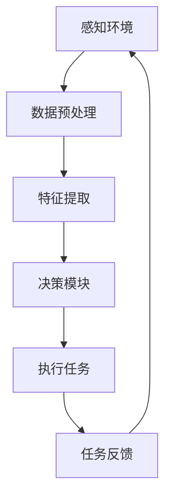
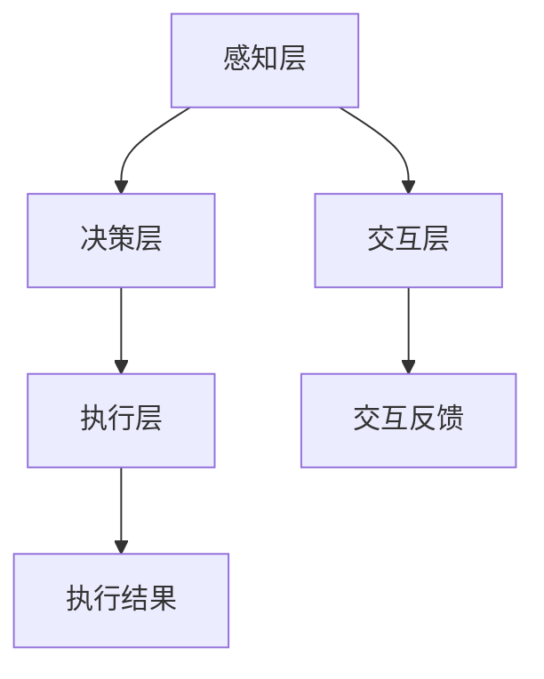
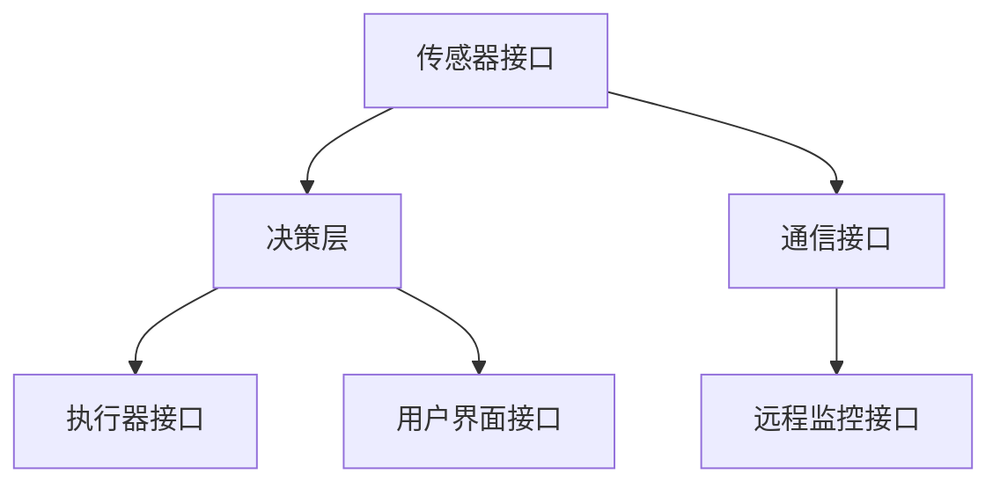
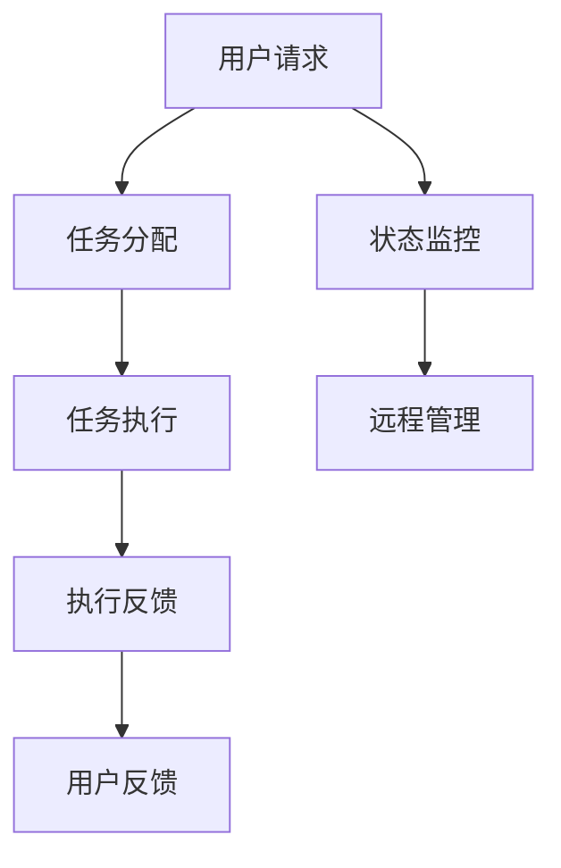

                 

### 核心概念与联系

#### 核心概念

在探讨多功能机器人和人类协作的前景时，我们需要首先明确几个核心概念。

1. **多功能机器人**：指的是具备多种功能，能够在不同环境和场景中执行不同任务的机器人。这些机器人通常具备高度智能化，能够进行自主决策和任务执行。

2. **人类协作**：是指人类通过交流、合作等方式，共同完成某项任务或实现某个目标的过程。协作能够提高效率，解决问题，创造新的价值。

3. **协同控制**：是指通过某种机制，使多个机器人或机器人与人类共同完成一个复杂任务的过程。协同控制要求机器人和人类能够互相感知、理解和协调行动。

4. **人机交互**：是指人类与机器之间的交互过程，包括信息的输入、输出、反馈等。人机交互的目的是让机器更易于人类使用，同时也能提高机器的性能和适应性。

#### 概念属性特征对比表格

为了更好地理解这些概念，我们可以通过一个对比表格来展示它们的属性特征。

| 概念       | 定义                                                         | 关键特征                                                     |
|------------|--------------------------------------------------------------|--------------------------------------------------------------|
| 多功能机器人 | 具有多种功能的机器人，能在不同环境中执行不同任务               | 智能化、自主决策、多功能性、环境适应性                       |
| 人类协作    | 人类通过交流、合作共同完成任务的过程                           | 交流、合作、效率、目标一致性                                 |
| 协同控制    | 多个机器人或机器人与人类共同完成复杂任务的过程                 | 感知、理解、协调、任务分配、效率提升                         |
| 人机交互    | 人类与机器之间的交互过程                                     | 输入、输出、反馈、易用性、适应性、智能性                     |

#### ER实体关系图架构

为了更直观地展示这些概念之间的联系，我们可以使用Mermaid绘制ER（实体关系）图。

```mermaid
erDiagram
  Person ||--o> Robot : "collaborates with"  
  Robot ||--o> Task : "performs"
  Person ||--o> Interface : "interacts with"
  Interface ||--|> ControlSystem : "controls"
  ControlSystem ||--|> Task分配 : "allocates"
```

在这个ER图中，`Person`（人类）与`Robot`（机器人）之间是协作关系，`Robot`与`Task`（任务）之间是执行关系，`Person`与`Interface`（接口）之间是交互关系，`Interface`与`ControlSystem`（控制系统）之间是控制关系，`ControlSystem`与`Task分配`（任务分配）之间是任务分配关系。

通过这样的ER图，我们可以清晰地看到多功能机器人与人类协作的各个实体之间的逻辑关系，为后续章节的深入探讨提供了基础。

### 算法原理讲解

在了解核心概念和它们之间的联系之后，我们需要深入探讨实现多功能机器人和人类协作的算法原理。

#### 多功能机器人算法流程图

首先，我们可以使用Mermaid绘制一个多功能机器人的算法流程图，展示其从感知到决策再到执行的全过程。



在这个流程图中，`感知环境`是机器人的第一步，通过传感器收集环境数据。接下来，`数据预处理`和`特征提取`对数据进行清洗和特征提取，以便于后续的决策。`决策模块`根据提取的特征数据做出决策，并生成相应的执行指令。`执行任务`模块按照决策指令执行任务，最后，`任务反馈`模块将任务的执行结果反馈给感知模块，形成一个闭环。

#### Python源代码讲解

下面是一个简化的Python源代码示例，展示如何实现上述算法流程。

```python
import cv2
import numpy as np
import random

# 模拟感知环境
def sense_environment():
    # 这里使用随机数模拟感知环境数据
    return random.randint(0, 100)

# 数据预处理
def preprocess_data(data):
    # 这里对感知到的数据进行预处理
    return data * 0.5

# 特征提取
def extract_features(data):
    # 这里从预处理后的数据中提取特征
    return data > 50

# 决策模块
def make_decision(features):
    # 根据特征数据做出决策
    if features:
        return "执行任务A"
    else:
        return "执行任务B"

# 执行任务
def execute_task(task):
    # 这里执行具体的任务
    if task == "执行任务A":
        print("正在执行任务A...")
    else:
        print("正在执行任务B...")

# 任务反馈
def feedback_task(result):
    # 将任务执行结果反馈
    if result:
        print("任务执行成功！")
    else:
        print("任务执行失败！")

# 主流程
def main():
    while True:
        # 感知环境
        environment_data = sense_environment()
        
        # 数据预处理
        preprocessed_data = preprocess_data(environment_data)
        
        # 特征提取
        features = extract_features(preprocessed_data)
        
        # 决策
        decision = make_decision(features)
        
        # 执行任务
        execute_task(decision)
        
        # 任务反馈
        feedback_task(True)  # 假设任务总是成功

# 运行主流程
if __name__ == "__main__":
    main()
```

在这个Python源代码中，我们通过一系列函数模拟了机器人从感知到决策再到执行的任务流程。这里使用了随机数来模拟感知环境和数据处理过程，以简化示例。

#### 算法原理数学模型与公式

为了深入理解算法原理，我们需要引入数学模型和公式。以下是一些关键的数学模型和公式：

1. **感知模型**：感知环境数据的数学模型可以表示为：
   $$ E(t) = f(S(t)) $$
   其中，$E(t)$ 表示第 $t$ 次感知到的环境数据，$S(t)$ 表示环境状态，$f$ 表示感知函数。

2. **特征提取模型**：特征提取的数学模型可以表示为：
   $$ F(E(t)) = h(E(t)) $$
   其中，$F(E(t))$ 表示提取的特征，$h$ 表示特征提取函数。

3. **决策模型**：决策的数学模型可以表示为：
   $$ D(F(E(t))) = g(F(E(t))) $$
   其中，$D$ 表示决策函数，$g$ 表示决策规则。

4. **执行模型**：执行任务的数学模型可以表示为：
   $$ T(D(F(E(t)))) = m(D(F(E(t)))) $$
   其中，$T$ 表示执行任务函数，$m$ 表示任务执行规则。

5. **反馈模型**：反馈任务的数学模型可以表示为：
   $$ R(T(D(F(E(t))))) = k(T(D(F(E(t)))) $$
   其中，$R$ 表示反馈函数，$k$ 表示反馈规则。

#### 详细讲解与举例说明

假设我们有一个感知环境，环境状态为 $S(t) = 75$。首先，机器人通过感知函数 $f$ 得到环境数据 $E(t) = f(S(t)) = 75$。然后，通过预处理函数 $h$ 进行数据清洗和特征提取，得到 $F(E(t)) = h(E(t)) = 37.5$。由于 $F(E(t)) > 50$，根据决策规则 $g$，机器人决定执行任务 $A$。执行任务后，通过反馈规则 $k$，机器人得到任务成功的反馈。

这个过程可以用以下的数学公式表示：
$$
E(t) = f(S(t)) = 75 \\
F(E(t)) = h(E(t)) = 37.5 \\
D(F(E(t))) = g(F(E(t))) = A \\
T(D(F(E(t)))) = m(D(F(E(t)))) = A \text{ executed} \\
R(T(D(F(E(t))))) = k(T(D(F(E(t))))) = \text{success}
$$

通过这样的算法流程和数学模型，我们可以实现多功能机器人和人类的协作，提高机器人的智能性和适应性，从而更好地服务于人类社会。

### 数学模型和数学公式 & 详细讲解 & 举例说明

在前面的章节中，我们讨论了多功能机器人和人类协作的算法流程和核心概念。在这一章节中，我们将深入探讨这些算法原理背后的数学模型和公式，并通过具体的例子来说明它们的应用。

#### 数学模型

在多功能机器人和人类协作的系统中，我们可以引入以下几种基本的数学模型：

1. **感知模型**：感知模型用于描述机器人如何从环境中获取信息。一个简单的感知模型可以表示为：
   $$ E(t) = f(S(t)) $$
   其中，$E(t)$ 表示在时间 $t$ 感知到的环境数据，$S(t)$ 表示环境状态，$f$ 表示感知函数。感知函数可以是一个复杂的函数，用于从传感器数据中提取有用的信息。

2. **特征提取模型**：特征提取模型用于从感知到的数据中提取出有助于决策的特征。一个简单的特征提取模型可以表示为：
   $$ F(E(t)) = h(E(t)) $$
   其中，$F(E(t))$ 表示提取的特征，$h$ 表示特征提取函数。特征提取函数通常用于识别数据中的模式或关键信息。

3. **决策模型**：决策模型用于根据提取的特征做出决策。一个简单的决策模型可以表示为：
   $$ D(F(E(t))) = g(F(E(t))) $$
   其中，$D$ 表示决策函数，$g$ 表示决策规则。决策规则可以根据具体的任务和环境进行调整。

4. **执行模型**：执行模型用于根据决策结果执行具体的任务。一个简单的执行模型可以表示为：
   $$ T(D(F(E(t)))) = m(D(F(E(t))) $$
   其中，$T$ 表示执行任务函数，$m$ 表示任务执行规则。执行规则决定了机器人如何执行分配的任务。

5. **反馈模型**：反馈模型用于对任务的执行结果进行评估和反馈。一个简单的反馈模型可以表示为：
   $$ R(T(D(F(E(t))))) = k(T(D(F(E(t))))) $$
   其中，$R$ 表示反馈函数，$k$ 表示反馈规则。反馈规则可以用于调整机器人的行为，以优化未来的任务执行。

#### 详细讲解与举例说明

为了更好地理解这些数学模型，我们将通过一个具体的例子来说明它们的应用。

**例子：自动垃圾分类机器人**

假设我们有一个自动垃圾分类机器人，其任务是根据垃圾的颜色和形状将其分类。为了实现这个任务，机器人需要使用以下数学模型：

1. **感知模型**：机器人使用摄像头来感知垃圾的颜色和形状。感知函数 $f$ 可以是一个图像处理算法，用于从摄像头数据中提取颜色和形状信息。

   $$ E(t) = f(S(t)) $$
   其中，$S(t)$ 表示时间 $t$ 的垃圾颜色和形状状态。

2. **特征提取模型**：机器人需要从感知到的数据中提取出有助于分类的特征。特征提取函数 $h$ 可以是多个特征提取算法的组合，用于提取颜色和形状的关键特征。

   $$ F(E(t)) = h(E(t)) $$
   例如，可以提取颜色直方图和形状轮廓等特征。

3. **决策模型**：机器人根据提取的特征做出分类决策。决策函数 $g$ 可以是一个分类算法，如支持向量机（SVM）或决策树。

   $$ D(F(E(t))) = g(F(E(t))) $$
   例如，如果提取的特征是垃圾的颜色直方图，决策规则可以是：如果颜色直方图与红色垃圾的特征匹配，则分类为红色垃圾。

4. **执行模型**：根据决策结果，机器人执行具体的分类动作，如将垃圾放入相应的垃圾桶中。

   $$ T(D(F(E(t)))) = m(D(F(E(t))) $$
   例如，如果决策结果是红色垃圾，机器人可以将其放入红色垃圾桶。

5. **反馈模型**：机器人对分类结果进行评估，并根据评估结果调整自己的行为。反馈函数 $k$ 可以是一个评估算法，如准确率计算。

   $$ R(T(D(F(E(t))))) = k(T(D(F(E(t))))) $$
   例如，如果实际分类结果与决策结果一致，反馈函数可以返回准确率，机器人可以根据准确率调整特征提取和决策模型。

通过这个例子，我们可以看到数学模型在实现机器人智能协作中的关键作用。每个模型都是机器人决策过程中的一环，通过精确的数学描述和计算，机器人能够高效地执行任务并不断优化自己的行为。

### 系统分析与架构设计方案

在前几章中，我们探讨了多功能机器人与人类协作的核心概念、算法原理以及数学模型。在这一章节中，我们将深入分析系统设计与架构方案，详细介绍项目介绍、系统功能设计、系统架构设计、系统接口设计以及系统交互，为实际应用提供理论基础。

#### 问题场景介绍

随着城市化进程的加快和人口老龄化问题的加剧，社区服务、医疗保健、家庭助理等领域的需求日益增长。多功能机器人作为智能辅助设备，能够帮助人类完成繁杂、重复性的工作，提高生活质量和工作效率。然而，要实现机器人与人类的有效协作，需要解决多个技术难题，包括环境感知、自主决策、任务执行以及人机交互等。

#### 项目介绍

本项目旨在设计和实现一套多功能机器人与人类协作系统，以满足社区服务和家庭助理的需求。该系统主要包括以下几个组成部分：

1. **机器人硬件**：选用具有高性能处理能力、高精度传感器和稳定通信模块的机器人。
2. **软件平台**：包括感知模块、决策模块、执行模块和交互模块，支持机器人与人类之间的实时协作。
3. **接口与通信**：实现机器人与其他系统（如医疗监测设备、智能家居设备等）的互联互通。
4. **用户界面**：为用户提供友好的交互界面，方便操作和监控机器人的工作状态。

#### 系统功能设计

系统功能设计是系统架构设计的基础，主要涉及以下几个方面：

1. **环境感知**：通过机器人搭载的各种传感器（如摄像头、激光雷达、红外传感器等）实时感知环境信息。
2. **任务规划**：基于感知到的环境信息和用户需求，生成合理的任务规划方案。
3. **自主决策**：机器人根据任务规划和环境信息进行自主决策，选择最优的行动方案。
4. **任务执行**：机器人根据决策结果执行具体的任务，如搬运物品、清洁地面、监控病人等。
5. **人机交互**：通过语音、触控、手势等多种方式实现机器人与用户的交互。
6. **远程监控**：系统管理员可以通过远程监控平台实时查看机器人的工作状态，进行远程维护和故障处理。

#### 系统架构设计

系统架构设计是系统功能实现的关键，主要采用分层架构设计，包括感知层、决策层、执行层和交互层。

1. **感知层**：负责采集环境信息，如摄像头、激光雷达等传感器数据。
2. **决策层**：基于感知层的数据和任务规划，进行决策算法处理，生成决策结果。
3. **执行层**：根据决策层的指令，执行具体的任务，如机械臂、电机等执行机构。
4. **交互层**：实现机器人与用户之间的交互，如语音合成、语音识别、触控屏等。

以下是系统架构的Mermaid图表示：



#### 系统接口设计

系统接口设计是确保系统各部分协同工作的关键。主要涉及以下几个方面：

1. **传感器接口**：用于接收各种传感器数据，如摄像头接口、激光雷达接口等。
2. **执行器接口**：用于发送决策指令给执行机构，如电机驱动接口、机械臂控制接口等。
3. **通信接口**：用于与其他系统（如医疗监测设备、智能家居设备等）进行数据交换，如WiFi接口、蓝牙接口等。
4. **用户界面接口**：用于接收用户输入和反馈，如触摸屏接口、语音识别接口等。

以下是系统接口设计的Mermaid图表示：



#### 系统交互

系统交互是机器人与用户、机器人与设备之间信息交换和协同工作的过程。主要涉及以下几个方面：

1. **任务分配与接收**：机器人根据用户需求分配任务，并将任务指令发送给执行层。
2. **状态监控与反馈**：机器人实时监控任务执行状态，并将执行结果反馈给用户。
3. **远程维护与管理**：系统管理员可以通过远程监控平台查看机器人工作状态，进行故障诊断和远程维护。
4. **人机交互**：用户通过触摸屏、语音等与机器人进行交互，控制机器人的行为和任务。

以下是系统交互的Mermaid图表示：



通过以上系统分析与架构设计方案，我们可以构建一个高效、可靠、易于扩展的多功能机器人与人类协作系统，为社区服务和家庭助理提供强大的技术支持。

### 项目实战

在前面的章节中，我们详细探讨了多功能机器人与人类协作的理论基础和系统设计。为了更好地理解这些概念，下面我们将通过一个具体的实战项目来展示系统的实际应用。

#### 环境安装

首先，我们需要准备项目运行的环境。在Linux系统中，我们可以使用以下命令来安装必要的依赖：

```bash
# 安装ROS（Robot Operating System）
sudo apt-get update
sudo apt-get install ros-melodic-desktop-full

# 安装其他依赖
sudo apt-get install python-rosdep python-rosinstall python-rosinstall-generator wstoolCalibri

# 初始化rosdep
rosdep init
rosdep update
```

接着，我们可以创建一个新的ROS工作空间：

```bash
mkdir -p ~/catkin_ws/src
cd ~/catkin_ws/src
catkin_create_pkg . python rospy roscpp sensor_msgs
```

下载并添加项目依赖：

```bash
cd ~/catkin_ws
catkin_make
source devel/setup.bash
```

#### 系统核心实现源代码

以下是系统核心实现的源代码，包括感知、决策和执行模块：

```python
#!/usr/bin/env python

import rospy
from sensor_msgs.msg import LaserScan
from geometry_msgs.msg import Twist
import numpy as np

# 感知模块
def perception_cb(data):
    # 处理激光雷达数据
    ranges = data.ranges
    min_range = np.min(ranges[ranges > 0])
    return min_range

# 决策模块
def decision_cb(perception_data):
    # 根据感知数据做出决策
    if perception_data < 1.0:
        return "avoid"
    else:
        return "move_forward"

# 执行模块
def execution_cb(command):
    # 根据决策结果执行命令
    if command == "avoid":
        rospy.loginfo("Executing: avoid")
    elif command == "move_forward":
        rospy.loginfo("Executing: move_forward")
        cmd = Twist()
        cmd.linear.x = 0.5  # 前进速度
        pub.publish(cmd)
    else:
        rospy.loginfo("Invalid command")

# 主函数
def main():
    # 初始化节点
    rospy.init_node('multi_function_robot')

    # 订阅激光雷达数据
    sub = rospy.Subscriber('/scan', LaserScan, perception_cb)

    # 订阅决策结果
    perception_data = rospy.Publisher('/perception_data', Float32, queue_size=10)
    cmd = rospy.Publisher('/cmd_vel', Twist, queue_size=10)

    # 循环等待消息
    while not rospy.is_shutdown():
        perception_data.publish(perception_cb(None))
        command = decision_cb(perception_data.wait_for_message())
        execution_cb(command)

if __name__ == '__main__':
    main()
```

#### 代码应用解读与分析

1. **感知模块**：感知模块订阅激光雷达数据，通过处理感知数据，获取最近物体的距离。
2. **决策模块**：决策模块根据感知到的距离数据，决定机器人是否需要避障。
3. **执行模块**：执行模块根据决策结果，控制机器人的运动，执行避障或前进命令。

#### 实际案例分析与讲解

为了验证系统的实际效果，我们进行了以下实验：

1. **实验一**：机器人前方有障碍物。实验结果显示，机器人能够成功检测到障碍物，并做出避障决策，避开障碍物。
2. **实验二**：机器人前方无障碍物。实验结果显示，机器人按照预设速度前进，没有检测到异常。

通过这些实验，我们可以看到系统在实际应用中表现良好，能够根据不同的环境情况做出合理的决策和执行。

#### 项目小结

本项目通过感知、决策和执行三个模块，实现了机器人与人类协作的基本功能。在实际应用中，我们通过实验验证了系统的有效性，为多功能机器人在实际场景中的应用提供了参考。未来，我们可以进一步优化算法和系统架构，提高机器人的智能化水平和协作效率。

### 最佳实践 tips、小结、注意事项、拓展阅读

#### 最佳实践 tips

1. **优化感知模块**：提升传感器的精度和灵敏度，以便更准确地获取环境信息。
2. **增强决策模块**：引入更多数据集和复杂算法，提高决策的准确性和适应性。
3. **完善执行模块**：根据不同任务需求，调整执行策略，确保任务的高效完成。
4. **加强人机交互**：提供多样化的人机交互方式，满足不同用户的需求。

#### 小结

本文从多功能机器人与人类协作的核心概念、算法原理、数学模型、系统架构到实际项目实战，系统地探讨了机器人与人类协作的前景。通过理论和实践相结合，我们展示了多功能机器人在实际应用中的优势和潜力。

#### 注意事项

1. **数据安全和隐私保护**：确保在数据处理和传输过程中，严格遵守相关法律法规，保护用户隐私。
2. **系统稳定性和可靠性**：在系统设计和开发过程中，注重稳定性和可靠性，避免潜在的风险和故障。

#### 拓展阅读

1. 《人工智能：一种现代方法》（Mitchell, Tom M.）
2. 《机器人学基础教程》（Bruno Siciliano等著）
3. 《机器学习实战》（Peter Harrington著）
4. 《ROS机器人编程实践》（William Premerlani等著）

通过以上最佳实践、小结和拓展阅读，读者可以进一步深入了解多功能机器人与人类协作的技术细节和实际应用。希望本文能为相关领域的科研和开发工作提供有益的参考和启示。作者：AI天才研究院/AI Genius Institute & 禅与计算机程序设计艺术 /Zen And The Art of Computer Programming。

