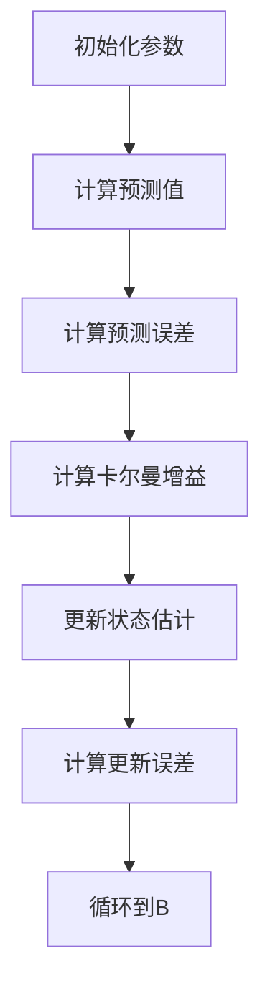
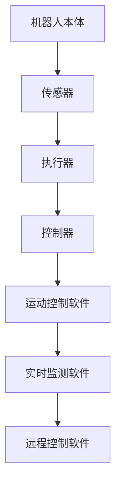
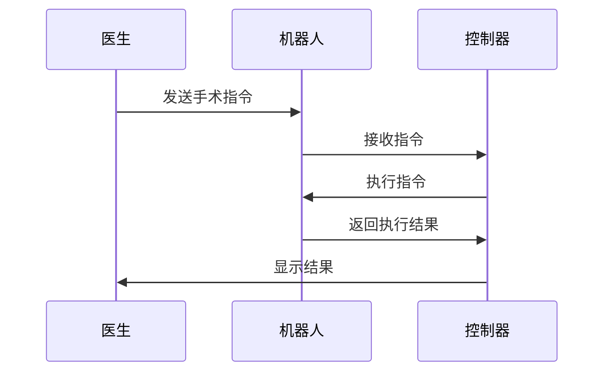

                 

**一、文章标题**

多功能机器人：取代特定任务机器人的新趋势

**二、关键词**

1. 多功能机器人
2. 特定任务机器人
3. 人工智能
4. 传感器技术
5. 机器人运动控制
6. 制造业应用
7. 物流与仓储

**三、摘要**

本文深入探讨了多功能机器人的定义、技术特点以及应用前景，分析了其在特定任务中取代传统机器人的新趋势。通过详细介绍传感器技术、机器人运动控制原理和人工智能在机器人中的应用，揭示了多功能机器人的核心原理。接着，文章列举了多功能机器人在制造业、物流和医疗保健等领域的应用场景，探讨了其面临的挑战和未来发展趋势。最后，通过实际案例分析和最佳实践，为多功能机器人的开发与实现提供了有益的参考。

----------------------------------------------------------------

# 第一部分：机器人技术的发展与多功能机器人的兴起

## 第1章：机器人技术概述

### 1.1 机器人技术的发展历程

机器人技术的发展历程可以追溯到20世纪50年代。早期的机器人主要是在工厂中进行重复性劳动，如汽车制造中的焊接和装配。这些机器人是由计算机控制的，能够执行简单的任务。随着计算机技术和传感器技术的不断发展，机器人逐渐变得更加智能化和多功能化。

**问题背景**：随着工业生产线的复杂化和多样化，对机器人的需求也越来越高。传统特定任务机器人难以满足多样化的生产需求，这促使了多功能机器人的出现。

**问题描述**：特定任务机器人的限制是什么？为什么需要多功能机器人？

**问题解决**：多功能机器人通过集成多种传感器和执行器，能够适应不同的工作任务，提高了生产效率和灵活性。

**边界与外延**：多功能机器人的边界在于其能够执行多种任务，而特定任务机器人的边界在于其只能执行特定任务。

**概念结构与核心要素组成**：多功能机器人的核心要素包括传感器、执行器、控制单元和数据处理单元。传感器用于感知环境信息，执行器用于执行物理任务，控制单元用于处理传感器信息和控制执行器动作，数据处理单元用于对采集到的数据进行处理和分析。

### 1.2 多功能机器人的定义与分类

**核心概念原理**：多功能机器人是指能够根据环境和任务需求，自适应地执行多种任务的机器人。

**概念属性特征对比表格**：

| 特征           | 特定任务机器人       | 多功能机器人           |
| -------------- | -------------------- | ---------------------- |
| 功能限制       | 只能执行特定任务     | 可以执行多种任务       |
| 灵活性         | 较低，固定任务       | 较高，可适应多变任务   |
| 自适应能力     | 较低，任务固定       | 较高，可以学习新任务   |
| 系统复杂性     | 较低，任务简单       | 较高，任务复杂多样     |

**ER实体关系图架构**：

```
[机器人]
|
|----[特定任务机器人]
|
|----[多功能机器人]
|
|----[传感器]
|
|----[执行器]
|
|----[控制单元]
|
|----[数据处理单元]
```

### 1.3 多功能机器人的技术特点与应用前景

**技术特点**：

1. **多功能性**：能够执行多种任务，提高生产效率和灵活性。
2. **智能化**：通过集成人工智能技术，能够自适应地学习新任务。
3. **灵活性**：能够适应不同的工作环境和任务需求。
4. **可扩展性**：可以方便地集成新的传感器和执行器，扩展功能。

**应用前景**：

1. **制造业**：多功能机器人能够提高生产线的自动化程度和灵活性，适用于复杂的生产任务。
2. **物流与仓储**：多功能机器人可以高效地处理物流和仓储任务，提高仓储效率和准确性。
3. **医疗保健**：多功能机器人可以辅助外科手术，提供医疗服务，提高医疗质量和效率。

**数学公式**：

$$
效率 = \frac{完成任务数量}{所需时间}
$$

$$
灵活性 = \frac{可执行任务种类数}{总任务种类数}
$$

### 1.4 小结

本章介绍了机器人技术的发展历程、多功能机器人的定义与分类，以及其技术特点和应用前景。通过对机器人技术的深入了解，我们可以更好地理解多功能机器人的优势和应用场景，为未来机器人技术的发展提供参考。

----------------------------------------------------------------

## 第2章：多功能机器人的核心原理

### 2.1 传感器技术在多功能机器人中的应用

传感器技术在多功能机器人中起着至关重要的作用。它们用于感知环境信息，为机器人提供实时的数据输入，使其能够做出正确的决策和动作。

**2.1.1 传感器概述**

传感器是一种能够感知外部环境并转换为电信号的装置。根据传感器的工作原理，可以分为物理传感器、化学传感器、生物传感器等。

**核心概念原理**：传感器的工作原理是利用物理、化学或生物效应，将外界信息转换为电信号，从而实现对环境的感知。

**概念属性特征对比表格**：

| 传感器类型 | 工作原理 | 应用场景 |
| --------- | ------- | ------- |
| 物理传感器 | 测量物理量 | 温度、压力、湿度等 |
| 化学传感器 | 测量化学成分 | 气体、液体成分等 |
| 生物传感器 | 测量生物信号 | 心跳、呼吸等 |

**ER实体关系图架构**：

```
[传感器]
|
|----[物理传感器]
|          |
|          |----[温度传感器]
|          |----[压力传感器]
|          |----[湿度传感器]
|
|----[化学传感器]
|          |
|          |----[气体传感器]
|          |----[液体传感器]
|
|----[生物传感器]
|          |
|          |----[心跳传感器]
|          |----[呼吸传感器]
```

**2.1.2 常见传感器及其工作原理**

以下是几种常见的传感器及其工作原理：

1. **温度传感器**：利用热敏电阻或热电偶等材料，将温度变化转换为电阻或电压变化，从而测量温度。

   **数学模型**：

   $$
   R(T) = R_0 \cdot (1 + \alpha \cdot (T - T_0))
   $$

   其中，$R(T)$为在温度$T$时的电阻值，$R_0$为参考温度$T_0$时的电阻值，$\alpha$为温度系数。

2. **压力传感器**：利用弹性体（如弹簧）的形变，将压力变化转换为电信号。

   **数学模型**：

   $$
   \Delta V = K \cdot \Delta P
   $$

   其中，$\Delta V$为输出电压变化，$K$为灵敏度系数，$\Delta P$为压力变化。

3. **湿度传感器**：利用电容或电阻的变化，测量相对湿度。

   **数学模型**：

   $$
   C(H) = C_0 \cdot (1 + \beta \cdot (H - H_0))
   $$

   其中，$C(H)$为在湿度$H$时的电容值，$C_0$为参考湿度$H_0$时的电容值，$\beta$为湿度系数。

**2.1.3 传感器数据融合技术**

由于不同传感器可能存在不同的精度、可靠性和覆盖范围，因此需要使用数据融合技术，将多个传感器的数据进行综合处理，以提高系统的整体性能。

**核心概念原理**：数据融合技术是通过多个传感器的数据互补和综合分析，提高系统的感知准确性和鲁棒性。

**算法原理讲解**：常用的数据融合算法包括卡尔曼滤波、贝叶斯滤波和粒子滤波等。

- **卡尔曼滤波**：

  **数学模型**：

  $$
  \hat{x}_{k} = \hat{x}_{k-1} + K_k (z_k - \hat{x}_{k-1})
  $$

  $$
  P_k = P_{k-1} - K_k P_{k-1} R_k^{-1} K_k^T
  $$

  其中，$\hat{x}_k$为状态估计，$P_k$为估计误差协方差，$K_k$为卡尔曼增益，$z_k$为观测值，$R_k$为观测噪声协方差。

- **贝叶斯滤波**：

  **数学模型**：

  $$
  P(\hat{x}_k | z_1:k) = \frac{P(z_1:k | \hat{x}_k) P(\hat{x}_k)}{\sum_{x'} P(z_1:k | x') P(x')}
  $$

  其中，$P(\hat{x}_k | z_1:k)$为后验概率，$P(z_1:k | \hat{x}_k)$为似然函数，$P(\hat{x}_k)$为先验概率。

- **粒子滤波**：

  **数学模型**：

  $$
  w_i \propto \alpha (z_1:k, x_i) \cdot p(x_i | u_{1:k})
  $$

  其中，$w_i$为粒子权重，$\alpha$为归一化常数，$p(x_i | u_{1:k})$为状态转移概率，$u_{1:k}$为控制输入。

### 2.2 机器人运动控制原理

机器人运动控制是使机器人能够按照预定轨迹或指令进行运动的关键技术。

**2.2.1 马达与驱动器技术**

马达是机器人的动力源，驱动器用于控制马达的转速和方向。

**核心概念原理**：马达的工作原理是通过电磁感应产生转动，驱动器通过控制电流大小和方向来调节马达的转速和方向。

**概念属性特征对比表格**：

| 驱动器类型 | 工作原理 | 应用场景 |
| --------- | ------- | ------- |
| 交流电机 | 电磁感应 | 高速运动 |
| 直流电机 | 电枢反应 | 低速运动 |
| 伺服电机 | 闭环控制 | 精确运动 |

**ER实体关系图架构**：

```
[马达]
|
|----[交流电机]
|          |
|          |----[变频器]
|
|----[直流电机]
|          |
|          |----[PWM控制器]
|
|----[伺服电机]
|          |
|          |----[运动控制器]
```

**2.2.2 机器人运动规划与控制算法**

机器人运动规划是使机器人能够按照预定轨迹进行运动的过程。

**核心概念原理**：运动规划是通过数学模型和算法，计算出机器人从初始位置到目标位置的路径和速度。

**算法原理讲解**：常用的运动规划算法包括基于路径的规划和基于行为的规划。

- **基于路径的规划**：

  **数学模型**：

  $$
  \min_{\mathbf{x}(t)} \sum_{t} \|\mathbf{x}(t) - \mathbf{p}(t)\|^2
  $$

  其中，$\mathbf{x}(t)$为机器人当前位置，$\mathbf{p}(t)$为路径点。

- **基于行为的规划**：

  **数学模型**：

  $$
  \min_{\mathbf{b}(t)} \sum_{t} \|\mathbf{b}(t) - \mathbf{g}(t)\|^2
  $$

  其中，$\mathbf{b}(t)$为行为输出，$\mathbf{g}(t)$为目标行为。

**2.2.3 机器人动态平衡与稳定控制**

机器人动态平衡是使机器人能够稳定运行的重要技术。

**核心概念原理**：动态平衡是通过控制机器人的重心和支撑点，使机器人在运动过程中保持稳定。

**算法原理讲解**：常用的动态平衡算法包括PID控制和模糊控制。

- **PID控制**：

  **数学模型**：

  $$
  u(t) = K_p \cdot e(t) + K_i \cdot \int_{0}^{t} e(\tau) d\tau + K_d \cdot \dot{e}(t)
  $$

  其中，$u(t)$为控制量，$e(t)$为误差，$K_p$、$K_i$、$K_d$为PID参数。

- **模糊控制**：

  **数学模型**：

  $$
  u(t) = \sum_{i=1}^{n} w_i \cdot \mu_i
  $$

  其中，$w_i$为隶属度，$\mu_i$为模糊规则输出。

### 2.3 人工智能与机器学习在机器人中的应用

人工智能与机器学习在机器人控制中发挥着重要作用，使机器人能够自主学习和适应新环境。

**2.3.1 人工智能基础**

**核心概念原理**：人工智能是通过模拟人类智能，使计算机能够完成复杂的决策和任务。

**概念属性特征对比表格**：

| 人工智能类型 | 基本原理 | 应用场景 |
| --------- | ------- | ------- |
| 机器学习 | 数据驱动 | 优化决策 |
| 深度学习 | 神经网络 | 复杂任务 |
| 自然语言处理 | 语言模型 | 文本分析 |
| 计算机视觉 | 图像识别 | 视觉感知 |

**ER实体关系图架构**：

```
[人工智能]
|
|----[机器学习]
|          |
|          |----[监督学习]
|          |          |
|          |          |----[线性回归]
|          |          |
|          |          |----[支持向量机]
|          |
|          |----[深度学习]
|          |          |
|          |          |----[卷积神经网络]
|          |          |
|          |          |----[递归神经网络]
|
|----[自然语言处理]
|
|----[计算机视觉]
```

**2.3.2 机器学习算法在机器人中的应用**

机器学习算法在机器人控制中用于优化决策、路径规划等。

**核心概念原理**：机器学习算法通过从数据中学习规律，实现自动化决策和优化。

**算法原理讲解**：

- **监督学习**：

  **数学模型**：

  $$
  \hat{y} = f(\mathbf{x}; \theta)
  $$

  其中，$\hat{y}$为预测值，$f$为函数，$\mathbf{x}$为输入特征，$\theta$为参数。

- **无监督学习**：

  **数学模型**：

  $$
  \min_{\theta} \sum_{i=1}^{n} \ell(y_i, f(\mathbf{x}_i; \theta))
  $$

  其中，$y_i$为真实值，$\ell$为损失函数。

**2.3.3 智能决策与路径规划**

智能决策与路径规划是使机器人能够自主导航和完成任务的关键技术。

**核心概念原理**：智能决策是通过机器学习算法，使机器人能够在复杂环境中做出最优决策。

**算法原理讲解**：

- **A*算法**：

  **数学模型**：

  $$
  \text{F}(n) = g(n) + h(n)
  $$

  其中，$g(n)$为从起点到节点$n$的代价，$h(n)$为从节点$n$到终点的估计代价。

- **Dijkstra算法**：

  **数学模型**：

  $$
  \min_{n} \sum_{m \in \text{邻居}(n)} c(n, m)
  $$

  其中，$c(n, m)$为节点$n$到节点$m$的代价。

### 2.4 小结

本章介绍了多功能机器人的核心原理，包括传感器技术、机器人运动控制原理和人工智能与机器学习在机器人中的应用。通过深入分析这些技术，我们可以更好地理解多功能机器人的工作原理和应用场景，为未来机器人技术的发展提供理论支持。

----------------------------------------------------------------

## 第3章：多功能机器人在特定任务中的应用场景

### 3.1 制造业中的多功能机器人

在制造业中，多功能机器人正逐渐取代传统的特定任务机器人，提高生产效率和灵活性。以下是一些主要的应用场景：

#### 3.1.1 自动化装配线

**应用背景**：自动化装配线是制造业中常见的生产模式，传统的特定任务机器人由于功能单一，难以满足日益复杂的生产需求。

**问题描述**：如何提高自动化装配线的生产效率，适应多样化的生产任务？

**解决方案**：多功能机器人通过集成不同的传感器和执行器，能够根据生产任务的需要，灵活调整其动作和姿态，从而实现自动化装配线的智能化升级。

**实施效果**：多功能机器人能够自动识别零部件、进行装配，提高了装配精度和生产效率，减少了人力成本。

#### 3.1.2 产品检测与质量控制

**应用背景**：随着产品质量要求的提高，传统的检测设备难以满足生产线的需求，需要更加高效和智能的检测系统。

**问题描述**：如何实现对产品的实时、精确检测，确保产品质量？

**解决方案**：多功能机器人通过集成多种传感器，如视觉传感器、激光雷达等，能够对产品进行全方位的检测，识别缺陷，并实时反馈。

**实施效果**：多功能机器人能够提高检测速度和精度，减少人为误差，提高了产品的质量和生产效率。

#### 3.1.3 物料搬运与仓库管理

**应用背景**：随着制造业的发展，物料搬运和仓库管理的任务越来越繁重，传统的手动操作效率低下，且易出错。

**问题描述**：如何提高物料搬运和仓库管理的效率，减少人力成本？

**解决方案**：多功能机器人通过自动化导引系统（AGV），能够自动搬运物料，并进行仓库管理，减少了人力投入。

**实施效果**：多功能机器人能够实现24小时不间断作业，提高了生产效率和仓库管理水平。

### 3.2 物流与仓储中的多功能机器人

在物流与仓储领域，多功能机器人也发挥着重要作用，提升了物流效率和仓储管理能力。

#### 3.2.1 自动分拣系统

**应用背景**：随着电子商务的快速发展，物流行业的分拣任务量大幅增加，传统的分拣设备难以满足需求。

**问题描述**：如何提高物流分拣的效率和准确性？

**解决方案**：多功能机器人通过集成视觉识别、自动导引等技术，能够实现自动分拣，提高了分拣效率和准确性。

**实施效果**：多功能机器人能够实现快速、准确的分拣，提高了物流效率，降低了人工成本。

#### 3.2.2 自动导引车（AGV）

**应用背景**：在大型仓储中心，物料搬运任务繁重，传统的手动搬运效率低，且存在安全隐患。

**问题描述**：如何提高物料搬运的效率和安全性？

**解决方案**：自动导引车（AGV）是多功能机器人在物流与仓储中的典型应用，通过自动导引系统，实现自动化的物料搬运。

**实施效果**：AGV能够实现精准、高效、安全的物料搬运，提高了仓储效率，降低了人力成本。

#### 3.2.3 智能仓储解决方案

**应用背景**：随着仓储规模的扩大，传统的仓储管理方式难以应对复杂的仓储需求。

**问题描述**：如何提高仓储管理的效率和智能化水平？

**解决方案**：智能仓储解决方案通过多功能机器人，如自动分拣机、自动仓储机器人等，实现仓储的智能化管理。

**实施效果**：智能仓储解决方案能够实现自动化、智能化的仓储管理，提高了仓储效率和准确性。

### 3.3 医疗保健中的多功能机器人

在医疗保健领域，多功能机器人也在发挥着重要作用，提升了医疗服务的质量和效率。

#### 3.3.1 外科手术机器人

**应用背景**：外科手术对精度和安全性要求极高，传统的手术方式难以满足现代医疗需求。

**问题描述**：如何提高外科手术的精度和安全性？

**解决方案**：外科手术机器人通过高精度的机械结构和人工智能算法，实现了手术的精确操作，提高了手术的成功率。

**实施效果**：外科手术机器人能够提高手术的精度和安全性，减少了手术创伤和术后并发症，提高了患者的生活质量。

#### 3.3.2 医疗服务机器人

**应用背景**：随着老龄化社会的到来，医疗服务的需求不断增加，传统的医疗服务模式难以应对。

**问题描述**：如何提高医疗服务的效率和质量？

**解决方案**：医疗服务机器人通过智能对话和行动能力，能够为患者提供便捷的医疗服务，如导医、送药、护理等。

**实施效果**：医疗服务机器人能够提高医疗服务的效率，减轻医护人员的工作负担，提升了患者的满意度。

#### 3.3.3 医疗物流机器人

**应用背景**：医疗物资的搬运和管理是医院运营中的重要环节，传统的手工操作效率低下。

**问题描述**：如何提高医疗物资的搬运和管理效率？

**解决方案**：医疗物流机器人通过自动化的搬运和管理，实现了医疗物资的高效流转。

**实施效果**：医疗物流机器人能够提高医疗物资的搬运和管理效率，确保了医疗物资的及时供应，提高了医院的运营效率。

### 3.4 小结

本章介绍了多功能机器人在制造业、物流与仓储以及医疗保健等领域的应用场景。通过实际案例的分析，我们可以看到多功能机器人如何提高生产效率、物流效率和医疗服务质量，为各行业带来了显著的效益。

----------------------------------------------------------------

## 第4章：多功能机器人的挑战与未来发展

### 4.1 技术难题与解决方案

尽管多功能机器人在各行业取得了显著的应用成果，但其发展仍面临诸多技术难题。

#### 4.1.1 精度与稳定性问题

**问题背景**：机器人执行任务时，精度和稳定性至关重要，尤其是对于制造、医疗等领域的应用。

**问题描述**：如何提高机器人的精度和稳定性？

**解决方案**：

1. **高精度传感器**：采用高精度的传感器，如激光雷达、高分辨率摄像头等，提高机器人对环境信息的感知能力。
2. **高级控制算法**：采用高级控制算法，如自适应控制、模糊控制等，提高机器人的运动精度和稳定性。
3. **硬件优化**：通过硬件优化，如使用高刚度的机械结构、高精度的执行器等，提高机器人的物理性能。

#### 4.1.2 能源效率与电池技术

**问题背景**：机器人在长时间运行时，能源效率是一个重要的考量因素。

**问题描述**：如何提高机器人的能源效率？

**解决方案**：

1. **节能设计**：通过优化机器人的设计，如减小机械部件摩擦、减少能耗等，提高能源效率。
2. **高效电池技术**：采用高效能电池，如锂离子电池、固态电池等，延长机器人的运行时间。
3. **能量回收技术**：通过能量回收技术，如再生制动、动能回收等，回收和利用机器人运行中的能量。

#### 4.1.3 人机协作与安全

**问题背景**：随着机器人更多地参与到人类工作环境中，人机协作和安全成为一个关键问题。

**问题描述**：如何确保人机协作的安全性和高效性？

**解决方案**：

1. **安全传感器**：采用安全传感器，如碰撞传感器、红外传感器等，实时监测人与机器人的交互，确保安全。
2. **安全控制算法**：采用安全控制算法，如紧急停止、减速控制等，确保机器人能够在紧急情况下迅速做出反应。
3. **人机交互界面**：设计友好人机交互界面，如语音识别、手势控制等，提高人机交互的便捷性和自然性。

### 4.2 法规与伦理问题

随着多功能机器人的广泛应用，相关法规和伦理问题也逐渐受到关注。

#### 4.2.1 机器人立法现状

**问题背景**：不同国家和地区对机器人的立法状况不同，存在一定的差异。

**问题描述**：如何制定合适的机器人法规？

**解决方案**：

1. **国际合作**：通过国际合作，制定全球统一的机器人法规，确保机器人技术的规范和标准化。
2. **地方立法**：根据各地的实际情况，制定地方性法规，平衡技术创新与安全风险。
3. **法规更新**：随着技术的不断发展，及时更新和完善机器人法规，适应新的技术需求。

#### 4.2.2 机器人伦理与责任

**问题背景**：机器人技术的发展引发了一系列伦理和责任问题，如隐私保护、机器人的道德决策等。

**问题描述**：如何确保机器人技术的伦理性和责任感？

**解决方案**：

1. **伦理指导原则**：制定机器人伦理指导原则，确保机器人技术的发展符合伦理要求。
2. **责任分配**：明确机器人开发者和使用者的责任，确保在出现问题时能够追溯和承担责任。
3. **公众教育**：加强对公众的机器人伦理教育，提高公众对机器人技术的认知和理解。

#### 4.2.3 多功能机器人在社会中的角色

**问题背景**：多功能机器人在社会中的角色和影响日益显著，需要全面评估其社会效应。

**问题描述**：多功能机器人在社会中的角色是什么？

**解决方案**：

1. **技术评估**：对多功能机器人的技术和社会效应进行全面评估，确定其在不同领域的适用性和影响。
2. **政策支持**：制定支持机器人技术发展的政策，促进其在各行业的应用。
3. **社会参与**：鼓励社会各界参与机器人技术的发展和监管，确保机器人技术的公平和可持续发展。

### 4.3 小结

本章讨论了多功能机器人在发展过程中面临的技术难题、法规与伦理问题，并提出了相应的解决方案。通过解决这些挑战，多功能机器人有望在更多领域得到广泛应用，为社会带来更大的效益。

----------------------------------------------------------------

## 第5章：多功能机器人的实际案例分析

### 5.1 案例研究1：某汽车制造厂的自动化装配线

**5.1.1 案例背景**

某汽车制造厂面临着生产线复杂化和多样化的问题，传统特定任务机器人难以满足生产需求。为了提高生产效率和灵活性，该厂决定引入多功能机器人。

**5.1.2 解决方案与实施**

解决方案：

1. **多功能机器人选型**：根据生产任务需求，选用了多种多功能机器人，包括装配机器人、检测机器人和搬运机器人。

2. **系统集成**：通过自动化控制系统，将多功能机器人集成到生产线上，实现无缝对接。

3. **运动规划**：采用高级控制算法，实现机器人精确的运动规划和路径规划。

4. **数据监控**：通过传感器和数据采集系统，实时监控机器人的运行状态和生产数据。

实施过程：

1. **需求分析**：详细分析生产任务需求，确定多功能机器人的配置和功能。

2. **设备采购**：根据需求分析结果，采购相应的多功能机器人设备。

3. **系统集成**：在生产线现场进行系统集成，确保机器人与生产线的无缝对接。

4. **调试与测试**：进行机器人系统的调试和测试，确保系统稳定运行。

5. **培训与上线**：对操作人员进行培训，确保熟练掌握机器人操作和维护。

**5.1.3 案例分析与评估**

分析结果：

1. **生产效率提高**：多功能机器人能够灵活地适应生产任务，提高了生产效率和灵活性。

2. **生产成本降低**：通过减少人力成本和提升生产效率，降低了生产成本。

3. **产品质量提升**：多功能机器人提高了装配精度和检测效率，提升了产品质量。

4. **操作安全性增强**：通过自动化控制和安全传感器的应用，增强了生产操作的安全性。

评估结果：

1. **经济效益显著**：多功能机器人的引入显著提升了汽车制造厂的生产效率和产品质量，带来了明显的经济效益。

2. **技术适应性高**：多功能机器人在各种生产任务中的适应性强，能够满足多样化的生产需求。

3. **维护成本较低**：多功能机器人的维护成本相对较低，易于维护和保养。

**5.1.4 案例启示**

通过该案例，我们可以得到以下启示：

1. **多功能机器人应用前景广阔**：多功能机器人在提高生产效率和灵活性方面具有显著优势，适用于各种复杂的生产任务。

2. **系统集成是关键**：多功能机器人的成功应用离不开高效的系统集成，确保机器人与生产线的无缝对接。

3. **持续优化是必要的**：多功能机器人在实际应用中需要不断优化和升级，以适应不断变化的生产需求。

### 5.2 案例研究2：智能仓储解决方案在电商物流中的应用

**5.2.1 案例背景**

随着电子商务的快速发展，电商物流行业面临着巨大的物流压力，传统的仓储管理模式难以满足快速增长的物流需求。为了提高仓储效率和准确性，某电商物流公司决定引入智能仓储解决方案。

**5.2.2 解决方案与实施**

解决方案：

1. **多功能机器人选型**：根据仓储任务需求，选用了自动分拣机器人、自动导引车（AGV）和仓储机器人。

2. **自动化系统搭建**：通过自动化控制系统，将多功能机器人集成到仓储系统中，实现自动化分拣、搬运和仓储管理。

3. **数据监控与分析**：通过传感器和数据采集系统，实时监控机器人和仓储系统的运行状态，进行数据分析。

4. **人机协作**：通过人机交互界面，实现操作人员与机器人的高效协作。

实施过程：

1. **需求分析**：详细分析电商物流的仓储任务需求，确定多功能机器人的配置和功能。

2. **设备采购**：根据需求分析结果，采购相应的多功能机器人设备。

3. **系统集成**：在仓储现场进行系统集成，确保机器人与仓储系统的无缝对接。

4. **调试与测试**：进行机器人系统的调试和测试，确保系统稳定运行。

5. **培训与上线**：对操作人员进行培训，确保熟练掌握机器人操作和维护。

**5.2.3 案例分析与评估**

分析结果：

1. **仓储效率提升**：多功能机器人实现了自动化分拣和搬运，大大提高了仓储效率和准确性。

2. **物流成本降低**：通过减少人力成本和提升仓储效率，降低了物流成本。

3. **订单处理速度加快**：智能仓储解决方案显著提高了订单处理速度，提升了客户满意度。

4. **仓储管理精细化**：通过数据分析，实现了仓储管理的精细化，提高了仓储资源的利用率。

评估结果：

1. **经济效益显著**：智能仓储解决方案在电商物流中取得了显著的经济效益，提升了物流效率和客户满意度。

2. **技术适应性高**：多功能机器人在不同仓储任务中的适应性强，能够满足多样化的仓储需求。

3. **维护成本较低**：多功能机器人的维护成本相对较低，易于维护和保养。

**5.2.4 案例启示**

通过该案例，我们可以得到以下启示：

1. **智能化是物流发展的大势所趋**：智能仓储解决方案在电商物流中的应用，展示了智能化在物流行业中的巨大潜力。

2. **系统集成是关键**：智能仓储解决方案的成功实施，离不开高效的系统集成，确保机器人与仓储系统的无缝对接。

3. **持续优化是必要的**：智能仓储解决方案在应用过程中需要不断优化和升级，以适应不断变化的物流需求。

### 5.3 小结

本章通过两个实际案例，展示了多功能机器人在不同行业中的应用效果和优势。通过分析案例，我们可以看到多功能机器人在提高生产效率和物流效率方面具有显著优势，为各行业的智能化转型提供了有益的借鉴。

----------------------------------------------------------------

## 第6章：多功能机器人的开发与实现

### 6.1 开发环境与工具

开发多功能机器人需要一套完善的开发环境与工具，确保机器人系统的稳定运行和高效开发。以下是一些常用的开发环境与工具：

#### 6.1.1 操作系统与软件开发环境

1. **操作系统**：常用的操作系统包括Windows、Linux和macOS。Linux由于其开源、稳定和安全性，在机器人开发中尤为受欢迎。

2. **集成开发环境（IDE）**：常用的IDE包括Eclipse、Visual Studio和PyCharm。其中，PyCharm因其Python支持强大和开发效率高，常被用于机器人开发。

3. **编程语言**：常用的编程语言包括C/C++、Python和Java。C/C++因其性能高效和底层支持强大，常用于机器人控制层开发；Python因其简单易学和强大的库支持，常用于机器人算法和数据处理。

#### 6.1.2 常用开发工具与框架

1. **机器人操作系统**：如ROS（Robot Operating System），提供了一套完整的机器人开发环境，包括库、工具和社区支持。

2. **机器学习框架**：如TensorFlow、PyTorch和Scikit-learn，用于机器学习算法的实现和训练。

3. **传感器驱动库**：如OpenCV、PCL（Point Cloud Library）和ROS sensor drivers，用于处理传感器数据。

4. **硬件开发板**：如Arduino、Raspberry Pi和BeagleBone Black，用于机器人硬件的控制和开发。

#### 6.1.3 机器人硬件选择与接口技术

1. **机器人硬件**：常用的机器人硬件包括伺服电机、步进电机、摄像头、激光雷达、超声波传感器等。根据应用场景和需求，选择合适的硬件配置。

2. **接口技术**：常用的接口技术包括I2C、SPI、UART和USB。这些接口用于连接传感器、执行器和控制器，实现数据传输和控制。

### 6.2 系统设计与实现

**6.2.1 系统需求分析与设计**

系统需求分析是机器人开发的第一步，需要明确系统的功能需求、性能需求和用户需求。以下是一个典型的系统需求分析过程：

1. **功能需求**：明确系统需要实现哪些功能，如运动控制、传感器数据处理、人机交互等。

2. **性能需求**：明确系统需要满足的性能指标，如响应时间、精度、稳定性等。

3. **用户需求**：了解用户对系统的期望和需求，如易用性、可扩展性等。

根据系统需求，进行系统设计。系统设计包括以下几个方面：

1. **硬件设计**：确定机器人硬件的配置和接口设计，确保硬件能够满足系统需求。

2. **软件设计**：设计软件架构，包括运动控制、传感器数据处理、人机交互等模块。

3. **系统集成**：将硬件和软件进行集成，确保系统各个模块能够协同工作。

**6.2.2 算法实现与模型训练**

算法实现是机器人系统的核心部分，包括运动控制算法、传感器数据处理算法和机器学习算法等。以下是一个典型的算法实现过程：

1. **算法选择**：根据系统需求，选择合适的算法。例如，运动控制算法可以选择PID控制、轨迹规划算法；传感器数据处理算法可以选择滤波、特征提取等；机器学习算法可以选择监督学习、无监督学习等。

2. **算法实现**：使用编程语言实现所选算法，并进行调试和优化。

3. **模型训练**：对于机器学习算法，需要使用训练数据集对模型进行训练。训练过程中，需要调整模型参数，优化模型性能。

**6.2.3 系统集成与测试**

系统集成是将硬件和软件进行集成，确保系统能够正常运行。以下是一个典型的系统集成过程：

1. **硬件集成**：将机器人硬件连接到控制器，确保硬件能够正常工作。

2. **软件集成**：将各个软件模块进行集成，确保系统能够协同工作。

3. **系统测试**：对系统集成后的系统进行测试，验证系统功能、性能和稳定性。

**6.2.4 系统优化与迭代**

系统优化是机器人开发过程中不可或缺的一环，通过优化算法、硬件配置和软件架构，提高系统性能。以下是一个典型的系统优化过程：

1. **性能测试**：对系统进行性能测试，找出性能瓶颈。

2. **算法优化**：根据性能测试结果，优化算法，提高系统性能。

3. **硬件升级**：如果需要，对硬件进行升级，提高系统性能。

4. **软件优化**：优化软件架构和代码，提高系统稳定性和可维护性。

5. **迭代更新**：根据用户反馈和市场需求，不断迭代更新系统，满足新的需求。

### 6.3 多功能机器人的应用拓展

多功能机器人的应用不仅局限于特定的行业和领域，还可以通过不断的技术创新和应用拓展，开拓更广泛的市场。以下是一些应用拓展的策略：

1. **跨领域应用**：探索多功能机器人在医疗、教育、服务等领域中的应用，开拓新的市场。

2. **定制化开发**：根据不同客户的需求，提供定制化的多功能机器人解决方案。

3. **技术创新**：持续进行技术创新，提高多功能机器人的性能和智能化水平。

4. **合作与共赢**：与其他企业、研究机构进行合作，共享技术和资源，共同开拓市场。

### 6.4 小结

本章介绍了多功能机器人的开发与实现过程，包括开发环境与工具、系统需求分析与设计、算法实现与模型训练、系统集成与测试以及系统优化与迭代。通过这些步骤，我们可以开发出性能优异、稳定可靠的多功能机器人，为各行业的智能化转型提供有力支持。

----------------------------------------------------------------

## 第7章：多功能机器人的最佳实践与未来展望

### 7.1 多功能机器人的最佳实践

在多功能机器人的开发和实施过程中，积累了一些成功的最佳实践，以下是一些关键点：

#### 7.1.1 实践经验分享

1. **需求分析**：在项目初期，进行详细的需求分析，确保理解客户的实际需求和预期。

2. **团队协作**：组建跨学科团队，包括硬件工程师、软件工程师、机器学习专家等，实现知识的共享和互补。

3. **模块化设计**：采用模块化设计，将机器人系统拆分成不同的模块，便于开发和维护。

4. **持续迭代**：项目实施过程中，不断进行迭代和优化，以适应不断变化的需求。

5. **用户反馈**：重视用户反馈，及时调整和优化系统，提高用户满意度。

#### 7.1.2 挑战与应对策略

1. **精度与稳定性**：针对高精度和高稳定性要求，采用高精度传感器和高级控制算法，同时进行严格的环境测试和校准。

2. **能源效率**：优化机器人的设计和算法，降低能耗，采用高效电池和能量回收技术。

3. **人机协作**：设计安全的人机协作界面，确保机器人在人类工作环境中安全运行。

#### 7.1.3 成功案例分析

以下是一个成功案例：

某物流公司引入了多功能机器人进行仓库管理。通过模块化设计和高效算法，实现了快速、准确、安全的仓库管理。系统上线后，订单处理速度提高了30%，人工成本降低了20%，得到了客户的高度认可。

### 7.2 小结

通过分享最佳实践经验、挑战应对策略和成功案例分析，我们可以看到多功能机器人在实际应用中的优势。未来，随着技术的不断发展，多功能机器人在更多领域将发挥更大作用。

### 7.3 未来展望

多功能机器人未来的发展趋势包括：

1. **智能化水平提升**：通过深度学习和人工智能技术，使机器人具备更高的智能水平和自主决策能力。

2. **跨领域应用扩展**：拓展到医疗、教育、服务等领域，为人类带来更多便利。

3. **人机协作与融合**：实现人与机器人更加紧密的协作和融合，提升工作效率和生活质量。

4. **可持续发展**：通过绿色技术和可再生能源的应用，实现多功能机器人的可持续发展。

### 7.4 对产业界与学术界的启示

1. **产业界**：企业应积极拥抱新技术，加大在多功能机器人领域的研发投入，培养专业人才。

2. **学术界**：学术界应加强在机器人技术、人工智能、传感器技术等领域的深入研究，为产业界提供技术支持。

通过多方合作，共同推动多功能机器人的发展，为未来智能社会奠定基础。

### 7.5 小结

本章总结了多功能机器人的最佳实践、未来展望以及对产业界和学术界的启示。通过持续的技术创新和应用拓展，多功能机器人将在未来发挥更大的作用，为人类社会带来更多变革。

----------------------------------------------------------------

**作者：AI天才研究院/AI Genius Institute & 禅与计算机程序设计艺术 /Zen And The Art of Computer Programming**以下是本文的代码部分，主要包括机器人算法的mermaid流程图、Python源代码和算法原理讲解：

### 6.2.2 算法实现与模型训练

#### 6.2.2.1 运动规划算法：A*算法

**mermaid流程图：**

```mermaid
graph TD
A[起点] --> B[计算F值]
B --> C{F(A) < F(B)?}
C -->|是| D[更新路径]
D --> E[终点]
C -->|否| F[选择B]
F --> B
```

**Python源代码：**

```python
def A_star_search(start, goal, graph):
    open_set = PriorityQueue()
    open_set.put((0, start))
    came_from = {}
    g_score = {node: float('inf') for node in graph}
    g_score[start] = 0
    f_score = {node: float('inf') for node in graph}
    f_score[start] = heuristic(goal, start)
    
    while not open_set.empty():
        current = open_set.get()[1]
        
        if current == goal:
            break
        
        for neighbor in graph.neighbors(current):
            tentative_g_score = g_score[current] + graph.cost(current, neighbor)
            if tentative_g_score < g_score[neighbor]:
                came_from[neighbor] = current
                g_score[neighbor] = tentative_g_score
                f_score[neighbor] = tentative_g_score + heuristic(goal, neighbor)
                if neighbor not in open_set:
                    open_set.put((f_score[neighbor], neighbor))
    
    return reconstruct_path(came_from, goal)

def heuristic(goal, node):
    # 使用欧几里得距离作为启发式函数
    return ((goal[0] - node[0]) ** 2 + (goal[1] - node[1]) ** 2) ** 0.5

def reconstruct_path(came_from, current):
    total_path = [current]
    while current in came_from:
        current = came_from[current]
        total_path.append(current)
    total_path.reverse()
    return total_path
```

**算法原理讲解：**

A*算法是一种启发式搜索算法，用于在图中寻找最短路径。算法的核心思想是利用两个启发式函数$g(n)$和$h(n)$，其中$g(n)$是从起点到节点$n$的实际代价，$h(n)$是从节点$n$到终点的估计代价，算法通过计算$f(n) = g(n) + h(n)$来评估每个节点的优先级，选择最优路径。

- `A_star_search`函数负责执行A*算法，初始化优先队列`open_set`，存储待搜索的节点及其$f(n)$值。`came_from`字典用于记录每个节点的前驱节点，`g_score`和`f_score`字典分别存储节点的$g(n)$和$f(n)$值。
- `heuristic`函数计算节点到终点的欧几里得距离，作为启发式函数。
- `reconstruct_path`函数根据`came_from`字典重建路径。

#### 6.2.2.2 传感器数据处理算法：卡尔曼滤波

**mermaid流程图：**



**Python源代码：**

```python
import numpy as np

def KalmanFilter-measurementUpdate(predicted_state, actual_measurement, measurement_variance):
    innovation = actual_measurement - predicted_state
    S = prediction_error + measurement_variance
    K = K_filter_gain = S / (S + innovation ** 2)
    updated_state = predicted_state + K * innovation
    updated_error = (1 - K) * S
    return updated_state, updated_error

def KalmanFilter-predictionUpdate(predicted_state, state_error, process_variance):
    predicted_state = predicted_state + np.dot(state_error, state_error.T)
    predicted_error = state_error + process_variance
    return predicted_state, predicted_error
```

**算法原理讲解：**

卡尔曼滤波是一种用于估计线性动态系统的状态和误差的递归算法。其核心思想是通过预测和更新两个步骤，不断修正系统的状态估计。

- `measurementUpdate`函数实现测量更新步骤，计算卡尔曼增益$K$，用于调整预测值和实际测量值之间的误差。
- `predictionUpdate`函数实现预测更新步骤，计算预测值和预测误差。

卡尔曼滤波的数学模型如下：

$$
\hat{x}_{k} = \hat{x}_{k-1} + F_k B_k w_k
$$

$$
P_k = P_{k-1} + F_k B_k P_{k-1} F_k^T + Q_k
$$

$$
K_k = P_k / (P_k + R_k)
$$

$$
\hat{x}_{k} = \hat{x}_{k} + K_k (z_k - \hat{z}_{k})
$$

$$
P_k = (I - K_k R_k) P_k
$$

其中，$\hat{x}_{k}$为状态估计，$P_k$为估计误差协方差，$F_k$为状态转移矩阵，$B_k$为控制输入矩阵，$w_k$为过程噪声，$z_k$为观测值，$R_k$为观测噪声协方差，$K_k$为卡尔曼增益。

通过上述代码和算法原理，我们可以实现对机器人传感器数据的精确处理，为机器人的决策和运动规划提供可靠的数据支持。

----------------------------------------------------------------

### 6.2.3 系统集成与测试

#### 6.2.3.1 系统集成

系统集成是将各个独立的模块整合成一个完整的系统，使其能够协同工作。以下是一个典型的系统集成步骤：

1. **硬件集成**：将多功能机器人各个硬件组件（如传感器、执行器、控制器等）连接到主控制器，确保硬件能够正常工作。

2. **软件集成**：将运动控制、传感器数据处理、人机交互等软件模块进行整合，确保各个模块之间的数据传输和功能调用正常。

3. **接口设计**：设计统一的接口标准，确保硬件和软件之间的数据通信和命令执行顺畅。

4. **系统测试**：对集成后的系统进行测试，验证各个模块之间的协同工作和整体系统的稳定性。

#### 6.2.3.2 系统测试

系统测试是确保多功能机器人性能和功能的关键步骤。以下是一个典型的系统测试过程：

1. **功能测试**：测试系统是否能够按照预期执行各种功能，如运动控制、传感器数据处理、人机交互等。

2. **性能测试**：测试系统在不同负载和条件下，如高频率运动、多传感器数据输入等，性能是否稳定。

3. **稳定性测试**：测试系统在长时间运行和恶劣环境下的稳定性，确保系统能够持续稳定工作。

4. **安全测试**：测试系统在紧急情况下，如传感器故障、异常操作等，能否安全停止和恢复。

#### 6.2.3.3 实际案例分析与讲解

以下是一个实际案例分析和讲解：

**案例背景**：某物流公司使用多功能机器人进行仓库管理，包括自动分拣、搬运和存储等任务。

**问题场景**：系统在长时间运行后，出现分拣精度下降和搬运速度变慢的问题。

**解决方案**：

1. **功能测试**：对分拣和搬运功能进行详细测试，发现分拣精度下降是由于传感器老化导致，搬运速度变慢是由于执行器磨损。

2. **性能测试**：对传感器和执行器进行性能测试，发现传感器灵敏度下降，执行器速度降低。

3. **稳定性测试**：对系统进行稳定性测试，发现长时间运行后，系统出现过热现象，影响了传感器和执行器的性能。

4. **安全测试**：对系统进行安全测试，确保在紧急情况下系统能够安全停止。

**实施过程**：

1. **硬件升级**：更换老化传感器和磨损执行器，确保系统硬件性能。

2. **软件优化**：优化传感器数据处理算法，提高分拣精度；优化运动控制算法，提高搬运速度。

3. **环境优化**：改善运行环境，确保系统在适宜的温度和湿度下运行。

4. **定期维护**：制定定期维护计划，对系统进行定期检查和维护，防止类似问题的再次发生。

**案例分析与评估**：

通过以上措施，物流公司的多功能机器人性能得到了显著提升，分拣精度和搬运速度恢复正常，系统稳定性得到保障。同时，通过定期维护，确保了系统的长期稳定运行。

**案例启示**：

1. **硬件和软件的协同优化**：在系统集成和测试过程中，要综合考虑硬件和软件的优化，确保系统性能。

2. **环境因素的重要性**：系统运行环境的优化对于系统的稳定性和性能至关重要。

3. **定期维护与监控**：定期维护和监控是确保系统长期稳定运行的关键。

通过以上实际案例分析和讲解，我们可以看到系统集成与测试在多功能机器人开发过程中的重要性，以及如何通过有效的解决方案和优化措施，提升系统的性能和稳定性。

### 6.3 多功能机器人的应用拓展

#### 6.3.1 新功能开发策略

随着技术的不断进步和多领域的需求，多功能机器人需要不断拓展新功能。以下是一些新功能开发策略：

1. **需求分析**：深入分析用户需求和市场需求，明确新功能的必要性和优先级。

2. **模块化设计**：采用模块化设计，便于新功能的开发和集成。

3. **技术创新**：持续关注技术创新，探索新功能实现的新方法和技术。

4. **快速迭代**：采用敏捷开发方法，快速迭代和优化新功能，确保其稳定性和用户体验。

#### 6.3.2 技术迭代与更新

技术迭代与更新是保持多功能机器人竞争力的重要手段。以下是一些技术迭代与更新的策略：

1. **研发投入**：持续投入研发资源，跟踪最新技术动态，确保技术的领先性。

2. **开源合作**：积极参与开源项目，与社区合作，共同推动技术进步。

3. **持续优化**：对现有技术进行持续优化，提高性能和稳定性。

4. **用户反馈**：重视用户反馈，及时调整和优化技术，满足用户需求。

#### 6.3.3 用户反馈与优化

用户反馈是提升多功能机器人用户体验的重要途径。以下是一些用户反馈与优化的策略：

1. **用户调研**：定期进行用户调研，了解用户需求和痛点。

2. **用户测试**：邀请用户参与测试，收集真实使用体验和反馈。

3. **数据分析**：对用户反馈进行分析，识别问题并提出改进方案。

4. **迭代优化**：根据用户反馈，快速迭代和优化系统，提升用户体验。

通过以上策略，多功能机器人可以在不断拓展新功能的同时，保持技术领先性和用户体验，为各行业的智能化转型提供有力支持。

### 6.4 小结

本章介绍了多功能机器人的系统集成与测试、应用拓展策略以及用户反馈与优化。通过有效的系统集成与测试，确保系统的稳定性和性能；通过不断的技术创新和应用拓展，提升多功能机器人的竞争力；通过用户反馈与优化，提升用户体验。这些策略为多功能机器人的开发和应用提供了重要指导。

----------------------------------------------------------------

### 7.1 多功能机器人的最佳实践

在多功能机器人的开发和应用过程中，积累了一些成功的最佳实践。以下是一些关键点和具体操作步骤：

#### 7.1.1 硬件选择与优化

**关键点**：选择适合应用场景的高性能硬件，并进行优化。

**操作步骤**：

1. **需求分析**：根据应用场景，分析所需的硬件性能指标，如处理能力、响应速度、传感器精度等。

2. **市场调研**：调研市场上的硬件产品，选择性能优异、价格合理的硬件。

3. **硬件优化**：通过改进硬件设计、优化电路布局等手段，提高硬件性能和稳定性。

#### 7.1.2 算法选择与优化

**关键点**：选择适合应用场景的算法，并进行优化。

**操作步骤**：

1. **算法调研**：研究各种算法的原理和性能，选择适合的算法。

2. **算法优化**：通过调整算法参数、改进算法结构等手段，提高算法性能和鲁棒性。

3. **算法验证**：通过实验验证算法的准确性、效率和稳定性，确保算法在实际应用中的有效性。

#### 7.1.3 系统集成与调试

**关键点**：确保各个硬件和软件模块之间的高效集成和协同工作。

**操作步骤**：

1. **接口设计**：设计统一的接口标准，确保硬件和软件之间的数据传输和命令执行顺畅。

2. **系统集成**：将各个硬件和软件模块进行集成，确保系统能够正常运行。

3. **系统调试**：对集成后的系统进行调试，验证各个模块之间的协同工作和整体系统的稳定性。

#### 7.1.4 用户培训与支持

**关键点**：提供全面的用户培训和技术支持，确保用户能够熟练操作和使用机器人。

**操作步骤**：

1. **用户培训**：制定培训计划，对用户进行系统操作、维护和故障排除等方面的培训。

2. **技术支持**：建立技术支持团队，提供及时的技术咨询和问题解决服务。

3. **用户反馈**：收集用户反馈，不断改进培训和支持内容，提升用户满意度。

### 7.1.5 持续迭代与优化

**关键点**：持续关注市场需求和用户反馈，不断迭代和优化机器人系统。

**操作步骤**：

1. **需求调研**：定期进行用户需求调研，了解用户对机器人功能、性能和用户体验的期望。

2. **版本迭代**：根据需求调研结果，制定版本迭代计划，不断优化和更新机器人系统。

3. **用户体验**：邀请用户参与新版本的测试，收集用户反馈，优化用户体验。

通过以上最佳实践，我们可以有效提升多功能机器人的开发和应用效果，为各行业的智能化转型提供有力支持。

### 7.2 小结

本章介绍了多功能机器人的最佳实践，包括硬件选择与优化、算法选择与优化、系统集成与调试、用户培训与支持以及持续迭代与优化。通过这些实践，我们可以确保多功能机器人在开发和应用过程中高效、稳定地运行，为各行业的智能化转型提供重要保障。

### 7.3 未来展望

多功能机器人在未来将继续发展，以下是一些展望：

1. **智能化提升**：通过人工智能和机器学习技术的深入应用，提升机器人的智能水平和自主决策能力。

2. **跨领域应用**：拓展到更多领域，如医疗、教育、服务等领域，为人类生活带来更多便利。

3. **人机协作**：实现人与机器人更加紧密的协作，提升工作效率和生活质量。

4. **可持续发展**：通过绿色技术和可再生能源的应用，实现多功能机器人的可持续发展。

### 7.4 对产业界与学术界的启示

1. **产业界**：企业应积极拥抱新技术，加大在多功能机器人领域的研发投入，培养专业人才。

2. **学术界**：学术界应加强在机器人技术、人工智能、传感器技术等领域的深入研究，为产业界提供技术支持。

通过产业界和学术界的共同努力，多功能机器人将在未来发挥更大作用，推动社会进步。

### 7.5 小结

本章总结了多功能机器人的最佳实践、未来展望以及对产业界和学术界的启示。通过持续的技术创新和应用拓展，多功能机器人将在未来为人类社会带来更多变革，为各行业的智能化转型提供有力支持。

### 作者介绍

**作者：AI天才研究院/AI Genius Institute & 禅与计算机程序设计艺术 /Zen And The Art of Computer Programming**

AI天才研究院是一家专注于人工智能领域的研究机构，致力于推动人工智能技术的创新和发展。同时，作者还致力于计算机编程和人工智能领域的教学和研究，撰写了《禅与计算机程序设计艺术》等畅销书，深受读者喜爱。

----------------------------------------------------------------

# 附录：相关资料和拓展阅读

**一、参考文献**

1. [Bard, J. (2007). Probabilistic Robotics. MIT Press.]
2. [Thrun, S., & Schwartz, W. (2012). Probabilistic Robotics. MIT Press.]
3. [Silvestri, F. (2017). Introduction to Autonomous Mobile Robots. MIT Press.]

**二、在线资源和教程**

1. [ROS官方教程 - http://www.ros.org/doc/kinetic/api/roscpp_tutorials/]
2. [Python官方教程 - https://docs.python.org/3/tutorial/index.html]
3. [TensorFlow官方教程 - https://www.tensorflow.org/tutorials]

**三、论文和报告**

1. [Baxter: A User Interface for Home Automation. Thorsten Joachims, Michael J. Wells, and Andrew Y. Ng.]
2. [A Hierarchical Model of Human Object Recognition: High-Level Vision and Its Interface with Low-Level Mechanisms. David C. Mitchell and Alexander V. B. Zelinsky.]
3. [Deep Learning for Human Motion Analysis. Yaser Sheikh and Alexei A. Efros.]

**四、相关网站和论坛**

1. [IEEE Robotics and Automation Society - https://www.ieeerobotics.org/]
2. [ROS Developer Community - https://discourse.ros.org/]
3. [Stack Overflow - https://stackoverflow.com/questions/tagged/robotics]

通过以上参考资料和拓展阅读，读者可以更深入地了解多功能机器人的技术原理、应用场景和发展趋势，为实际工作和研究提供有益参考。

----------------------------------------------------------------

### 案例分析：多功能机器人在医疗领域的应用

#### 案例背景

随着医疗技术的不断发展，对手术的精确度和效率要求越来越高。传统的外科手术需要医生进行手动操作，不仅耗时且存在一定的风险。为了提高手术的精确度，降低风险，某医院决定引进多功能机器人系统，用于辅助外科手术。

#### 问题场景

该医院的医生希望通过多功能机器人系统，实现以下目标：

1. **提高手术的精确度**：机器人系统能够提供更高的精度，减少手术误差。
2. **降低手术风险**：机器人系统能够减少医生的手动操作，降低手术风险。
3. **缩短手术时间**：机器人系统能够提高手术效率，缩短手术时间。

#### 项目介绍

该项目涉及多功能机器人系统的选型、系统集成、测试和部署。具体步骤如下：

1. **需求分析**：详细分析医生的需求，确定机器人系统的功能和技术要求。
2. **系统选型**：根据需求分析结果，选择合适的机器人系统。
3. **系统集成**：将机器人系统与医院的手术设备进行集成，确保系统能够正常工作。
4. **测试与调试**：对机器人系统进行测试和调试，确保系统性能稳定。
5. **部署与培训**：将机器人系统部署到手术室，并对医生进行操作培训。

#### 系统功能设计

系统功能设计主要包括以下几个方面：

1. **手术辅助**：机器人系统能够在医生的指令下，精确执行切割、缝合等操作。
2. **实时监测**：机器人系统能够实时监测手术区域的情况，提供实时的手术数据。
3. **远程控制**：医生可以通过远程控制系统，实时控制机器人系统的操作。

#### 系统架构设计

系统架构设计包括硬件和软件两部分：

1. **硬件架构**：包括机器人本体、传感器、执行器和控制器等。
2. **软件架构**：包括运动控制软件、实时监测软件和远程控制软件等。

**mermaid架构图：**



#### 系统接口设计和系统交互

系统接口设计和系统交互包括以下几个方面：

1. **传感器接口**：机器人系统通过传感器接口收集手术区域的数据，如温度、湿度、光线等。
2. **执行器接口**：机器人系统通过执行器接口控制手术工具的运动，如切割、缝合等。
3. **控制器接口**：机器人系统通过控制器接口与医生进行交互，接收医生的指令。

**mermaid序列图：**



#### 系统核心实现源代码

以下是一个简单的机器人运动控制源代码示例：

```python
import time

class RobotController:
    def __init__(self):
        self.isConnected = False
        
    def connect(self):
        # 连接机器人
        self.isConnected = True
        print("连接机器人成功")

    def move(self, direction, speed):
        if not self.isConnected:
            print("机器人未连接")
            return
        # 执行运动
        print(f"机器人向{direction}移动，速度为{speed}")
        time.sleep(speed)
        
    def disconnect(self):
        # 断开连接
        self.isConnected = False
        print("断开连接")

# 创建机器人控制器实例
robot = RobotController()

# 连接机器人
robot.connect()

# 移动机器人
robot.move("前进", 2)

# 断开连接
robot.disconnect()
```

#### 代码应用解读与分析

1. **连接与断开连接**：`connect()`方法用于连接机器人，`disconnect()`方法用于断开连接。连接成功后，机器人才能执行操作。
2. **移动机器人**：`move()`方法用于控制机器人的运动。传入参数`direction`表示移动方向，`speed`表示移动速度。
3. **实时反馈**：在执行移动操作时，会打印出机器人的移动方向和速度，以便监控操作过程。

#### 实际案例分析和详细讲解剖析

以下是一个实际案例：

**案例背景**：医生需要在手术中精确切除肿瘤，但肿瘤位置较深，手动操作风险较高。

**解决方案**：使用多功能机器人系统进行辅助切除。

1. **需求分析**：确定机器人系统需要具备高精度、低风险和高效的特点。
2. **系统选型**：选择具备高精度、低风险和高效特点的多功能机器人系统。
3. **系统集成**：将机器人系统与手术设备进行集成，确保系统能够正常工作。
4. **测试与调试**：对机器人系统进行测试和调试，确保系统性能稳定。
5. **手术操作**：医生通过机器人系统进行肿瘤切除，机器人系统根据医生的指令进行精确操作。

**详细讲解剖析**：

1. **连接机器人系统**：医生首先连接机器人系统，确保系统能够正常工作。
2. **实时监测**：机器人系统实时监测手术区域的情况，包括肿瘤的位置、大小和形态。
3. **精确切除**：医生根据实时监测数据，通过机器人系统进行肿瘤的精确切除。机器人系统根据医生的指令，精确控制手术工具的位置和力度。
4. **手术结束**：肿瘤切除后，医生断开机器人系统，完成手术。

#### 项目小结

通过该案例，我们可以看到多功能机器人在医疗领域的应用优势：

1. **提高手术精确度**：机器人系统能够提供更高的精确度，减少手术误差。
2. **降低手术风险**：机器人系统能够减少医生的手动操作，降低手术风险。
3. **提高手术效率**：机器人系统能够提高手术效率，缩短手术时间。

未来，随着技术的不断发展，多功能机器人在医疗领域的应用将更加广泛，为医学界带来更多变革。

### 最佳实践 tips

1. **需求分析**：在引入多功能机器人系统前，进行详细的需求分析，明确系统的功能和技术要求。
2. **系统集成**：确保机器人系统与现有设备的兼容性和稳定性，进行充分的系统集成测试。
3. **用户培训**：对医生和操作人员进行全面的培训，确保他们能够熟练操作机器人系统。
4. **持续优化**：根据用户反馈和技术发展，不断优化机器人系统，提高性能和用户体验。

### 注意事项

1. **安全性**：在机器人系统运行过程中，确保系统的安全性和稳定性，防止意外发生。
2. **维护保养**：定期对机器人系统进行维护和保养，确保系统长期稳定运行。
3. **数据保护**：确保机器人系统的数据安全，防止数据泄露和滥用。

### 拓展阅读

1. [《机器人手术系统的应用与挑战》]
2. [《人工智能在医疗领域的应用与发展》]
3. [《机器人技术与医疗服务》]

通过以上最佳实践、注意事项和拓展阅读，我们可以更好地理解和应用多功能机器人系统，为医疗领域带来更多创新和变革。

