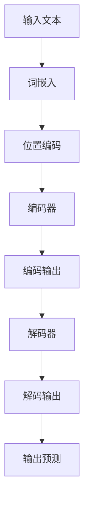
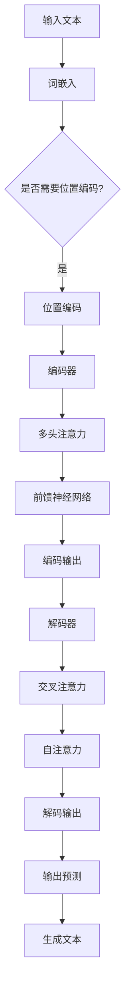

                 


### 引言

随着人工智能技术的飞速发展，自然语言处理（NLP）已经成为一个备受关注的研究领域。ChatGPT，作为OpenAI开发的一款基于变换器架构的预训练语言模型，凭借其强大的文本生成能力，在各类应用场景中表现出色。然而，要想充分发挥ChatGPT的潜力，设计有效的提示词是至关重要的。本文将围绕如何设计有效的ChatGPT提示词展开，通过逻辑清晰、结构紧凑的叙述，帮助读者深入了解这一过程。

关键词：ChatGPT、提示词设计、自然语言处理、预训练语言模型、文本生成

摘要：本文首先介绍了ChatGPT的基础概念和提示设计的重要性，随后深入探讨了ChatGPT的工作原理和有效提示的核心要素。接着，本文分类讨论了不同类型的提示及其应用场景，并结合自然语言处理的技术特点分析了提示设计的影响因素。最后，本文提供了实用的提示设计策略和最佳实践，并总结了关键知识点和未来研究方向。

文章结构如下：

1. **基础概念与背景**：介绍ChatGPT和提示设计的基本知识。
2. **核心概念与原理**：深入探讨ChatGPT的工作原理和提示设计原则。
3. **实战技巧与策略**：分享实际案例和技巧，指导读者设计有效的提示。
4. **技术深度探讨**：分析ChatGPT的底层技术和提示交互机制。
5. **总结与展望**：回顾文章要点，展望未来研究方向。

通过以上结构，本文旨在为读者提供一个系统、全面的ChatGPT提示词设计指南。让我们一步步思考，探索如何设计出有效的ChatGPT提示词。

## 第1章：ChatGPT与提示设计概述

### 1.1 ChatGPT简介

ChatGPT是由OpenAI于2022年推出的一个基于变换器（Transformer）架构的预训练语言模型。它通过大规模的数据集进行训练，从而掌握了丰富的语言知识和语法规则，能够在多种场景下生成高质量的文本。ChatGPT的诞生标志着自然语言处理技术的一个重大进步，为智能对话系统、文本生成、机器翻译等应用提供了强大的技术支撑。

ChatGPT的工作原理基于变换器架构，这是一种在深度学习领域广泛应用的模型结构。变换器通过自注意力机制（Self-Attention），能够捕捉输入文本中的长距离依赖关系，从而生成连贯、自然的文本。ChatGPT的训练过程包括两个主要阶段：预训练和微调。预训练阶段，模型在大规模语料库上进行训练，学习通用语言特征；微调阶段，模型根据特定任务进行调整，以达到更好的性能。

### 1.2 提示设计的重要性

在ChatGPT的应用过程中，提示词（Prompt）的设计起着至关重要的作用。提示词是用户与ChatGPT进行交互的桥梁，决定了模型生成文本的质量和方向。一个设计良好的提示词不仅能够引导ChatGPT生成准确的回答，还能提升用户体验，使对话更加自然流畅。

有效的提示设计需要注意以下几点：

1. **明确性**：提示词应当清晰明了，避免歧义和模糊性。这样可以确保ChatGPT能够准确理解用户的需求，从而生成高质量的回答。

2. **多样性**：多样化的提示有助于ChatGPT学习并生成不同的回答，避免模式化或单一化的回答。这可以提升模型的灵活性，使其能够应对各种复杂场景。

3. **适应性**：提示词应当根据实际应用场景和用户需求进行定制，以适应不同的对话情境。这样可以最大化地发挥ChatGPT的潜力，提高其应用效果。

4. **上下文关联**：提示词应当与ChatGPT正在处理的上下文紧密相关。这样可以确保生成的文本与对话的连贯性和一致性，避免离题或无关的回答。

### 1.3 提示设计的常见误区

尽管提示设计至关重要，但在实际操作中，许多人往往会陷入一些常见的误区，导致ChatGPT生成的文本质量不佳。以下是一些常见的提示设计误区：

1. **过于复杂**：一些用户在设计提示词时，追求使用复杂的语法和词汇，认为这样可以提升回答的质量。实际上，过于复杂的提示词反而可能使ChatGPT产生混淆，导致生成文本的质量下降。

2. **缺乏上下文**：提示词中缺乏与上下文相关的信息，使得ChatGPT无法准确理解用户的需求。这种情况常常导致生成文本与实际需求不符，甚至离题。

3. **过度依赖模板**：一些用户倾向于使用固定的模板来设计提示词，导致生成的文本过于模式化，缺乏个性化和灵活性。

4. **不合理的期望**：一些用户对ChatGPT的能力抱有过高期望，认为它能够解决所有问题。然而，ChatGPT并非无所不能，它仍然需要合理的设计和使用才能发挥最佳效果。

为了克服这些误区，我们需要在提示设计过程中保持清醒的头脑，注重实际效果和用户体验。通过不断实践和优化，我们可以设计出更有效的ChatGPT提示词，使其在各类应用场景中发挥出最大的潜力。

## 第2章：核心概念与原理

### 2.1 ChatGPT的工作原理

ChatGPT的工作原理基于变换器（Transformer）架构，这是一种在深度学习领域广泛应用的模型结构。变换器通过自注意力机制（Self-Attention），能够捕捉输入文本中的长距离依赖关系，从而生成连贯、自然的文本。ChatGPT的工作流程主要包括以下几个步骤：

1. **输入编码**：ChatGPT将输入的文本序列转化为向量表示。这个过程涉及到词嵌入（Word Embedding）和位置编码（Positional Encoding）。词嵌入将单词映射为固定长度的向量，位置编码则考虑了文本中每个词的位置信息。

2. **自注意力机制**：变换器通过自注意力机制对输入文本进行加权处理。自注意力机制允许模型在生成每个词时，考虑文本中其他词的影响，从而捕捉长距离依赖关系。这种机制使得ChatGPT能够生成连贯、自然的文本。

3. **多头注意力**：ChatGPT采用了多头注意力（Multi-Head Attention），这意味着它在处理每个词时，会生成多个注意力分数，然后将这些分数加权求和。多头注意力提高了模型对输入文本的捕捉能力，使其能够生成更加准确的文本。

4. **前馈神经网络**：在注意力机制之后，ChatGPT会通过一个前馈神经网络对文本进行进一步处理。前馈神经网络由两个全连接层组成，中间经过ReLU激活函数。

5. **输出层**：最终，ChatGPT通过输出层生成预测的单词概率分布。输出层通常是一个带有softmax函数的全连接层，它将每个词的嵌入向量映射为概率分布。

### 2.2 提示设计的要素

有效的提示设计是ChatGPT生成高质量文本的关键。一个良好的提示词应该具备以下几个要素：

1. **明确性**：提示词应当清晰明了，避免歧义和模糊性。例如，使用具体的描述而不是模糊的词语，可以帮助ChatGPT更准确地理解用户的需求。

2. **上下文关联**：提示词应当与ChatGPT正在处理的上下文紧密相关。这样可以确保生成的文本与对话的连贯性和一致性。例如，在继续一个对话时，可以将之前的信息嵌入到新的提示中。

3. **多样性和灵活性**：多样化的提示有助于ChatGPT学习并生成不同的回答，避免模式化或单一化的回答。灵活的提示可以使ChatGPT在多种场景下都能发挥出最佳效果。

4. **用户友好性**：提示词应当易于理解，避免过于专业的术语。这样可以提高用户体验，使ChatGPT更容易被普通用户接受和使用。

### 2.3 提示与自然语言处理的关系

提示设计不仅仅是关于如何引导ChatGPT生成文本，还涉及到自然语言处理的多个方面。以下是一些关键点：

1. **语言模型选择**：不同的语言模型具有不同的特性，例如BERT、GPT、RoBERTa等。选择合适的语言模型对于提示设计至关重要。例如，BERT更适合于上下文关联性强的任务，而GPT更适合于文本生成。

2. **数据集的质量**：ChatGPT的训练依赖于大规模的数据集。数据集的质量直接影响模型的性能。高质量的数据集能够提供丰富的语言知识和语法规则，从而提升提示设计的有效性。

3. **文本生成策略**：ChatGPT的文本生成策略也影响提示设计。例如，一些生成策略强调连贯性，而另一些策略强调多样性。合适的生成策略可以提升提示的生成效果。

4. **任务适应性**：不同的任务对提示词的需求不同。例如，在问答系统中，提示词需要精确和具体；而在对话系统中，提示词需要更自然和流畅。因此，提示设计需要根据具体任务进行调整。

综上所述，提示设计与自然语言处理密切相关。通过深入理解ChatGPT的工作原理、自然语言处理的技术特点以及具体任务的需求，我们可以设计出更有效的提示词，从而提升ChatGPT的应用效果。

### 2.4 ChatGPT中的核心概念和属性特征对比

在深入探讨ChatGPT的工作机制之前，我们需要了解其核心概念和属性特征。以下是一些关键概念及其对比：

#### 2.4.1 自注意力（Self-Attention）与多头注意力（Multi-Head Attention）

**自注意力（Self-Attention）**：
- **定义**：自注意力是一种计算文本中每个词对其他词的影响的机制。
- **作用**：通过自注意力，模型能够捕捉文本内部的长距离依赖关系，从而生成更加连贯的文本。
- **特点**：计算复杂度较高，但能捕捉丰富的语义信息。

**多头注意力（Multi-Head Attention）**：
- **定义**：多头注意力是自注意力的扩展，通过多个独立的自注意力机制来处理输入文本。
- **作用**：多头注意力提高了模型对输入文本的捕捉能力，能够生成更加准确和多样化的文本。
- **特点**：提高了模型的泛化能力和表达能力，但计算成本较高。

**对比**：
- **复杂度**：多头注意力比单头注意力复杂，但能够提升模型性能。
- **应用**：在生成高质量文本时，多头注意力是必不可少的。

#### 2.4.2 词嵌入（Word Embedding）与位置编码（Positional Encoding）

**词嵌入（Word Embedding）**：
- **定义**：词嵌入是将单词映射为固定长度的向量表示。
- **作用**：词嵌入能够将文本转化为向量形式，使其能够被深度学习模型处理。
- **特点**：能够捕捉单词的语义信息，但无法保留单词的位置信息。

**位置编码（Positional Encoding）**：
- **定义**：位置编码是在词嵌入的基础上，加入单词的位置信息。
- **作用**：位置编码能够帮助模型理解单词在文本中的位置关系。
- **特点**：能够保留文本的顺序信息，但计算相对复杂。

**对比**：
- **适用性**：词嵌入适用于无序文本处理，而位置编码适用于需要保留顺序信息的文本处理。
- **计算成本**：位置编码的计算成本较高，但能够提升模型性能。

#### 2.4.3 预训练（Pre-training）与微调（Fine-tuning）

**预训练（Pre-training）**：
- **定义**：预训练是在大规模语料库上对模型进行训练，使其学习通用语言特征。
- **作用**：预训练能够提高模型的语言理解和生成能力。
- **特点**：训练数据量大，能够学习到丰富的语言知识。

**微调（Fine-tuning）**：
- **定义**：微调是在预训练的基础上，针对特定任务对模型进行调整。
- **作用**：微调能够使模型更好地适应特定任务的需求。
- **特点**：训练数据量小，但能够快速适应特定任务。

**对比**：
- **训练数据量**：预训练数据量大，而微调数据量小。
- **应用场景**：预训练适用于通用任务，而微调适用于特定任务。

通过对比这些核心概念和属性特征，我们可以更好地理解ChatGPT的工作机制，并在实际应用中做出更合理的设计选择。

### 2.5 ChatGPT中的ER实体关系图

为了更好地理解ChatGPT中的实体关系，我们可以通过ER（Entity-Relationship）实体关系图来展示各个实体及其关系。以下是一个简化的ChatGPT ER图：

```mermaid
erDiagram
    User ||--|{ ChatGPT }|-- Query
    User ||--|{ Context }|-- Response
    ChatGPT ||--|{ Input }|-- Output
    Input ||--|{ Token }|-- Word
    Context ||--|{ History }|-- Dialogue
    Response ||--|{ Sentence }|-- Feedback

    User : {
        Name
        InputQuery
        OutputResponse
    }

    ChatGPT : {
        Model
        InputToken
        OutputSentence
    }

    Query : {
        Text
        Intent
    }

    Token : {
        ID
        Word
    }

    Context : {
        PreviousDialogue
        CurrentHistory
    }

    Response : {
        Text
        Sentiment
    }

    Sentence : {
        Sentence
    }

    History : {
        DialogueID
        DialogueContent
    }

    Feedback : {
        Rating
        Comment
    }
```

在这个ER图中，我们定义了以下几个关键实体：

- **User（用户）**：代表与ChatGPT进行交互的用户，包括用户名、输入查询和输出响应。
- **ChatGPT（ChatGPT模型）**：代表ChatGPT的模型，包括输入Token和输出Sentence。
- **Input（输入）**：代表输入的查询，包括文本和意图。
- **Context（上下文）**：代表与对话相关的上下文信息，包括历史对话和当前历史。
- **Response（响应）**：代表ChatGPT的输出响应，包括文本和情感。
- **Token（Token）**：代表输入的Token，包括ID和Word。
- **Sentence（句子）**：代表生成的句子。
- **History（历史）**：代表对话历史，包括对话ID和对话内容。
- **Feedback（反馈）**：代表用户的反馈，包括评分和评论。

这些实体之间的关系展示了ChatGPT的运作流程：

1. **用户发起查询**：用户输入查询，ChatGPT根据查询生成响应。
2. **上下文传递**：ChatGPT利用上下文信息（历史对话和当前历史）来生成更连贯的响应。
3. **反馈机制**：用户对响应进行评价，提供反馈，以优化ChatGPT的性能。

通过ER实体关系图，我们可以更清晰地理解ChatGPT的架构和运作机制，从而为提示设计提供更深入的洞察。

### 2.6 ChatGPT的算法原理

要深入理解ChatGPT的算法原理，我们需要首先了解其背后的数学模型和关键组件。ChatGPT是基于变换器（Transformer）架构的预训练语言模型，其核心组件包括编码器（Encoder）和解码器（Decoder）。以下是ChatGPT算法原理的详细解析：

#### 编码器（Encoder）

编码器负责处理输入文本，将其编码为向量表示。这个过程主要通过以下几个步骤实现：

1. **词嵌入（Word Embedding）**：
   - **定义**：词嵌入是将单词映射为固定长度的向量表示。
   - **实现**：通常使用预训练的词嵌入模型（如GloVe或Word2Vec）将单词映射为向量。
   - **作用**：词嵌入能够捕捉单词的语义信息，使模型能够处理文本。

2. **位置编码（Positional Encoding）**：
   - **定义**：位置编码是在词嵌入的基础上，加入单词的位置信息。
   - **实现**：位置编码通常通过正弦和余弦函数实现，以保留单词在文本中的顺序信息。
   - **作用**：位置编码有助于模型理解单词在文本中的相对位置，从而生成更连贯的文本。

3. **多头注意力（Multi-Head Attention）**：
   - **定义**：多头注意力是通过多个独立的自注意力机制来处理输入文本。
   - **实现**：每个头都计算一组独立的注意力权重，然后将这些权重加权求和。
   - **作用**：多头注意力提高了模型对输入文本的捕捉能力，使其能够生成更准确和多样化的文本。

4. **前馈神经网络（Feedforward Neural Network）**：
   - **定义**：前馈神经网络是由两个全连接层组成，中间经过ReLU激活函数。
   - **实现**：前馈神经网络对每个头的结果进行进一步处理。
   - **作用**：前馈神经网络增强了模型的非线性表达能力。

编码器的输出是编码后的文本序列，它包含了文本的语义信息。

#### 解码器（Decoder）

解码器负责生成输出文本。与编码器不同，解码器在生成每个词时都要考虑到已经生成的词。以下是解码器的关键组件：

1. **词嵌入（Word Embedding）**：
   - **定义**：与编码器的词嵌入类似，解码器的词嵌入也是将单词映射为向量表示。
   - **作用**：解码器的词嵌入帮助模型理解输入的候选词。

2. **多头注意力（Multi-Head Attention）**：
   - **定义**：与编码器的多头注意力类似，解码器的多头注意力也是通过多个独立的自注意力机制来处理输入文本。
   - **作用**：解码器的多头注意力帮助模型在生成每个词时，考虑到已经生成的词和整个输入序列。

3. **自注意力（Self-Attention）**：
   - **定义**：自注意力是解码器内部的一种注意力机制，用于处理输入序列。
   - **作用**：自注意力使模型能够在生成每个词时，考虑到输入序列中的其他词。

4. **交叉注意力（Cross-Attention）**：
   - **定义**：交叉注意力是解码器在生成每个词时，考虑编码器的输出。
   - **作用**：交叉注意力使模型能够在生成输出时，利用编码器的语义信息。

5. **前馈神经网络（Feedforward Neural Network）**：
   - **定义**：与编码器的前馈神经网络类似，解码器的前馈神经网络也是由两个全连接层组成。
   - **作用**：前馈神经网络增强了模型的非线性表达能力。

解码器的输出是生成的文本序列。在生成过程中，模型会通过softmax函数计算每个词的概率分布，并选择概率最高的词作为下一个输出。

#### 整体算法流程

ChatGPT的算法流程可以概括为以下步骤：

1. **输入编码**：将输入文本编码为词嵌入和位置编码。
2. **编码器处理**：通过多头注意力、自注意力和前馈神经网络处理编码后的文本序列。
3. **解码器生成**：在解码器中，通过交叉注意力和自注意力生成输出文本序列。
4. **输出预测**：通过softmax函数计算输出文本的概率分布，并选择概率最高的词作为输出。

以下是一个简化的算法流程图：



通过上述解析，我们可以看到ChatGPT的算法原理是如何通过编码器和解码器处理输入文本，并生成高质量的输出文本。理解这些原理有助于我们更好地设计有效的提示词，以充分利用ChatGPT的潜力。

### 2.7 ChatGPT算法的Mermaid流程图

为了更直观地展示ChatGPT算法的流程，我们可以使用Mermaid绘制一个简化的流程图。以下是一个ChatGPT算法的Mermaid表示：



以下是各个步骤的详细说明：

1. **输入文本（A）**：用户输入的文本是ChatGPT处理的第一步，它需要被转换为词嵌入和位置编码。
2. **词嵌入（B）**：词嵌入是将输入文本的每个单词映射为固定长度的向量表示。
3. **位置编码（C）**：位置编码是在词嵌入的基础上，加入单词的位置信息。
4. **编码器（E）**：编码器包含多层变换器层，负责处理编码后的文本序列。
5. **多头注意力（F）**：多头注意力通过多个独立的自注意力机制来捕捉文本中的长距离依赖关系。
6. **前馈神经网络（G）**：前馈神经网络对编码器的输出进行进一步处理，增强模型的非线性表达能力。
7. **编码输出（H）**：编码器的输出包含了文本的语义信息。
8. **解码器（I）**：解码器负责生成输出文本序列。
9. **交叉注意力（J）**：交叉注意力使解码器能够利用编码器的语义信息生成输出。
10. **自注意力（K）**：自注意力使解码器在生成每个词时，考虑到已经生成的词和整个输入序列。
11. **解码输出（L）**：解码器的输出是生成的文本序列。
12. **输出预测（M）**：通过softmax函数计算输出文本的概率分布，并选择概率最高的词作为输出。
13. **生成文本（N）**：最终生成的文本序列作为模型的输出。

通过这个Mermaid流程图，我们可以清晰地看到ChatGPT算法的处理流程，从而更好地理解其工作机制。

### 2.8 ChatGPT的底层架构与提示交互机制

理解ChatGPT的底层架构对于设计有效的提示词至关重要。ChatGPT的架构主要由编码器和解码器组成，两者通过变换器架构和注意力机制实现高质量的文本生成。

#### 编码器架构

编码器的主要功能是处理输入文本，生成上下文向量。其架构包括多个变换器层，每个层由多头注意力机制和前馈神经网络组成。以下是编码器架构的详细解析：

1. **词嵌入（Word Embedding）**：
   - **功能**：将输入文本的每个词映射为固定长度的向量。
   - **实现**：通常使用预训练的词嵌入模型，如GloVe或Word2Vec。

2. **位置编码（Positional Encoding）**：
   - **功能**：在词嵌入的基础上，加入单词的位置信息，以便模型理解单词在文本中的顺序。
   - **实现**：使用正弦和余弦函数生成位置编码向量。

3. **多头注意力（Multi-Head Attention）**：
   - **功能**：通过多个独立的自注意力机制，捕捉文本中的长距离依赖关系。
   - **实现**：每个头计算一组独立的注意力权重，然后将这些权重加权求和。

4. **前馈神经网络（Feedforward Neural Network）**：
   - **功能**：增强模型的非线性表达能力。
   - **实现**：由两个全连接层组成，中间通过ReLU激活函数。

多个变换器层堆叠在一起，通过多头注意力和前馈神经网络处理输入文本。编码器的输出是一个上下文向量，包含了文本的语义信息。

#### 解码器架构

解码器的功能是生成输出文本，其架构与编码器类似，但也包含一些独特的组件，如交叉注意力。以下是解码器架构的详细解析：

1. **词嵌入（Word Embedding）**：
   - **功能**：将输入的候选词映射为向量表示。
   - **实现**：与编码器的词嵌入类似，使用预训练的词嵌入模型。

2. **交叉注意力（Cross-Attention）**：
   - **功能**：在解码器生成每个词时，考虑编码器的输出。
   - **实现**：通过交叉注意力机制，使解码器能够利用编码器的语义信息。

3. **自注意力（Self-Attention）**：
   - **功能**：在解码器内部处理输入序列。
   - **实现**：通过自注意力机制，使解码器在生成每个词时，考虑到已经生成的词和整个输入序列。

4. **前馈神经网络（Feedforward Neural Network）**：
   - **功能**：增强模型的非线性表达能力。
   - **实现**：由两个全连接层组成，中间通过ReLU激活函数。

解码器在生成每个词时，首先通过交叉注意力机制利用编码器的输出，然后通过自注意力机制处理输入序列，最后通过前馈神经网络生成输出。解码器的输出是一个概率分布，表示每个词的概率。

#### 提示与模型的交互机制

提示词是用户与ChatGPT进行交互的桥梁，其设计与模型的底层架构密切相关。以下是提示与模型的交互机制的详细解析：

1. **输入编码**：将提示词编码为词嵌入和位置编码，将其作为输入传递给编码器。

2. **编码器处理**：编码器处理输入的词嵌入和位置编码，生成上下文向量。

3. **解码器生成**：解码器利用编码器生成的上下文向量，通过交叉注意力、自注意力和前馈神经网络生成输出文本。

4. **输出预测**：解码器的输出是一个概率分布，表示每个词的概率。模型选择概率最高的词作为输出，生成文本。

5. **反馈与优化**：用户对生成的文本进行评价，提供反馈。模型根据反馈进行优化，提高提示词的设计质量。

通过理解ChatGPT的底层架构和提示交互机制，我们可以设计出更有效的提示词，从而提升模型的文本生成质量和用户体验。

### 第3章：不同类型的提示

在设计和使用ChatGPT时，理解并运用不同类型的提示是至关重要的。根据提示的目的和特点，可以将提示分为问答型提示、对话型提示和情感型提示等。以下是对这些类型及其应用场景的详细讨论：

#### 3.1 问答型提示

问答型提示主要用于引导ChatGPT生成问题的答案。这类提示的设计要点是明确性和具体性，以确保ChatGPT能够准确理解用户的需求。以下是一些设计问答型提示的技巧：

- **明确性**：提示词应当清晰明了，避免模糊和歧义。例如，使用具体的描述和具体的问题类型（如选择题、填空题等）。
- **上下文关联**：在回答复杂问题时，提示词中应包含上下文信息，以便ChatGPT更好地理解问题背景。
- **多样性**：设计多样化的提问方式，例如开放性问题、闭合性问题等，以提高ChatGPT的回答能力。

**应用场景**：问答系统、智能客服、考试自动评分等。

#### 3.2 对话型提示

对话型提示主要用于引导ChatGPT生成连贯的自然语言对话。这类提示的设计要点是流畅性和自然性，以模拟真实的人类对话。以下是一些设计对话型提示的技巧：

- **情景设定**：在对话开始时，设置一个明确的场景，以帮助ChatGPT理解对话的背景。
- **角色设定**：为对话中的角色设定特定的性格、背景和目的，以提高对话的逼真度。
- **情感表达**：在对话中融入情感元素，使对话更加生动和有吸引力。

**应用场景**：聊天机器人、虚拟助手、语言学习等。

#### 3.3 情感型提示

情感型提示主要用于引导ChatGPT生成包含特定情感色彩的文本。这类提示的设计要点是情感表达的真实性和合理性。以下是一些设计情感型提示的技巧：

- **情感标签**：为文本设定情感标签，例如快乐、悲伤、愤怒等，以指导ChatGPT生成相应的情感表达。
- **情境匹配**：根据文本的情境和上下文，设计符合情境的情感表达。
- **多样性**：设计多样化的情感表达方式，避免单一和模式化的情感输出。

**应用场景**：情感分析、文本生成、故事创作等。

#### 不同类型提示的比较与选择

- **问答型提示**：适用于需要准确回答问题的场景，如智能客服、自动问答系统。
- **对话型提示**：适用于需要生成连贯对话的场景，如聊天机器人、虚拟助手。
- **情感型提示**：适用于需要表达情感的文本场景，如情感分析、故事创作。

在实际应用中，可以根据具体任务的需求和目标，选择合适的提示类型。例如，在开发一个智能客服系统时，可以结合问答型提示和对话型提示，以提供准确和自然的回答。

### 3.4 提示设计技巧

为了确保ChatGPT生成高质量和相关的文本，以下是一些设计有效提示的技巧：

#### 1. 明确目的

在设计提示时，首先要明确提示的目的。这有助于ChatGPT更好地理解用户的需求，从而生成更准确的文本。例如，在问答系统中，提示应该明确询问特定的问题，而在对话系统中，提示应该引导ChatGPT模拟真实的人类对话。

#### 2. 保持简洁

简洁的提示有助于ChatGPT更快速地理解用户需求，从而生成高质量的文本。避免使用过于复杂或冗长的提示词，尽量使用简洁明了的语言。

#### 3. 考虑上下文

在设计中，要考虑提示词与上下文的关系。上下文信息有助于ChatGPT更好地理解用户的需求，从而生成更加连贯和相关的文本。例如，在继续一个对话时，可以将之前的信息嵌入到新的提示中。

#### 4. 多样化

多样化的提示有助于ChatGPT学习并生成不同的回答，避免模式化或单一化的输出。设计多样化的提示词，例如使用不同的提问方式或引入新的情景和角色，以提高ChatGPT的回答能力。

#### 5. 用户友好性

提示词应当易于理解，避免使用过于专业的术语。这样可以提高用户体验，使ChatGPT更容易被普通用户接受和使用。

#### 6. 调整长度

根据任务的需求，调整提示词的长度。过长的提示词可能会导致ChatGPT生成离题的文本，而过于简短的提示词可能无法提供足够的信息，从而影响生成文本的质量。

通过遵循以上技巧，我们可以设计出更有效的提示词，从而提高ChatGPT的文本生成质量和应用效果。

### 3.5 提示设计的最佳实践

在设计有效的ChatGPT提示词时，遵循以下最佳实践可以帮助我们最大化模型的表现和用户体验：

1. **精确明确**：确保提示词简洁明了，避免模糊或歧义。例如，使用“请描述一下您的项目需求”而不是“您能谈谈您的项目吗？”。这样的明确性有助于ChatGPT生成更加准确的回答。

2. **上下文关联**：在提示中嵌入与当前上下文相关的信息，以帮助模型更好地理解用户的需求。例如，在继续一个对话时，可以引用之前提到的关键词或问题。

3. **多样化提问**：使用不同的提问方式，如开放性问题、闭合性问题和假设性问题，以激发ChatGPT生成多样化的回答。例如，可以交替使用“请告诉我您最喜欢的编程语言是哪个？”和“您最喜欢的编程语言是Python吗？”

4. **情感引导**：根据对话的情境，适当加入情感元素，如积极、消极或幽默的语气，以增强对话的生动性和自然性。例如，可以提出“用一种欢快的心情描述一下您的周末计划”。

5. **避免复杂句式**：避免使用过于复杂的句式和术语，以确保提示词对用户友好。使用简单的语言，使ChatGPT能够轻松理解并生成自然的文本。

6. **逐步引导**：对于复杂的问题，可以采用逐步引导的方式，将大问题分解为多个小问题，以便ChatGPT逐步回答。例如，先询问基础信息，然后逐步深入到细节问题。

7. **持续优化**：根据用户的反馈和模型的表现，不断优化提示词。通过实验和迭代，找到最适合当前场景和用户需求的提示词。

通过遵循这些最佳实践，我们可以设计出更加有效和自然的ChatGPT提示词，从而提升用户体验和模型的应用效果。

### 3.6 实际案例：设计有效提示词的过程

为了更具体地展示如何设计有效的ChatGPT提示词，以下是一个实际案例：设计一个用于虚拟助手应用程序的提示词。

**案例背景**：假设我们正在开发一款虚拟助手，用于帮助用户规划旅行行程。该助手需要能够回答用户关于目的地、交通、住宿等问题，并提供有用的建议。

**目标**：设计一组有效且相关的提示词，以引导ChatGPT生成高质量的回答，从而为用户提供满意的旅行规划服务。

**步骤1：明确目的和上下文**

在开始设计提示词之前，我们需要明确虚拟助手的用途和目标用户。在这个案例中，我们的目标是生成关于旅行行程的详细建议，上下文包括用户提出的需求，如目的地、日期、预算等。

**步骤2：创建初步提示词**

根据目标和上下文，我们创建以下初步提示词：

- “请问您想要去哪里旅行？”
- “您的旅行日期是哪一天？”
- “您的预算是多少？”
- “您对旅行的具体要求有哪些？”

**步骤3：测试和优化**

我们将初步提示词输入到ChatGPT中，并观察生成的回答。根据回答的质量和相关性，我们进行了以下优化：

- 对于第一个提示词，“请问您想要去哪里旅行？”，我们添加了更多具体的选项：“您想要去哪个国家或城市？”
- 对于第二个提示词，“您的旅行日期是哪一天？”，我们调整了问题的表述：“您的旅行计划是在哪个月份进行？”
- 对于第三个提示词，“您的预算是多少？”我们将其改为：“您打算在旅行上花费多少钱？”
- 对于第四个提示词，“您对旅行的具体要求有哪些？”我们增加了更多具体的要求选项：“您是否需要机场接送服务？”

**步骤4：效果评估**

在进行了初步测试和优化后，我们对优化后的提示词进行了评估。以下是一些生成回答的示例：

- “您想要去哪里旅行？” --> “我想去日本旅游。”
- “您的旅行计划是在哪个月份进行？” --> “我想在7月进行旅行。”
- “您打算在旅行上花费多少钱？” --> “我打算在旅行上花费5000美元。”
- “您是否需要机场接送服务？” --> “是的，我需要机场接送服务。”

通过这些优化后的提示词，ChatGPT能够更准确地理解用户的需求，并生成高质量的回答。

**总结**：在这个案例中，通过逐步测试和优化，我们设计出了一套有效的ChatGPT提示词，以帮助虚拟助手为用户提供满意的旅行规划建议。这个案例展示了如何在实际应用中设计有效的提示词，并为后续的设计工作提供了有益的经验。

### 3.7 提示设计的挑战与解决方案

在设计和使用ChatGPT时，提示设计面临多个挑战。以下是一些常见挑战及其解决方案：

#### 1. 数据不足或质量差

**挑战**：当训练数据不足或质量差时，ChatGPT可能无法生成高质量、相关的文本。

**解决方案**：
- **增加训练数据**：收集更多的数据以扩展模型的训练集。
- **数据预处理**：对数据进行清洗和预处理，以去除噪声和冗余信息。
- **引入外部知识**：结合外部知识库或领域特定的数据源，以补充训练数据。

#### 2. 提示过于模糊或复杂

**挑战**：模糊或复杂的提示词可能导致ChatGPT生成离题或不相关的文本。

**解决方案**：
- **明确性**：确保提示词简洁明了，避免模糊和歧义。
- **逐步引导**：对于复杂的问题，采用逐步引导的方式，将大问题分解为多个小问题。

#### 3. 模型过拟合

**挑战**：模型在特定提示上过拟合，导致生成文本的质量下降。

**解决方案**：
- **多样化提示**：设计多样化的提示词，以减少模型的过拟合。
- **数据增强**：通过数据增强技术，增加数据的多样性和复杂性。

#### 4. 性能稳定性

**挑战**：在特定的提示下，ChatGPT的性能可能不稳定，导致生成文本的质量波动。

**解决方案**：
- **优化模型结构**：调整模型的结构和参数，以提升其稳定性。
- **持续评估**：定期评估和调整提示词，以确保模型在不同场景下的性能。

通过解决这些挑战，我们可以设计出更加有效和稳定的ChatGPT提示词，从而提升模型的文本生成质量和用户体验。

### 第4章：自然语言处理的影响

自然语言处理（NLP）作为人工智能领域的一个重要分支，对ChatGPT提示设计的影响至关重要。NLP技术的发展不仅决定了ChatGPT的性能，还直接影响提示设计的有效性和文本生成质量。以下将详细讨论NLP对ChatGPT提示设计的影响。

#### 4.1 语言模型选择

在ChatGPT的设计过程中，选择合适的语言模型是关键。不同的语言模型具有不同的特性，适用于不同的任务。以下是一些常见的语言模型及其适用性：

1. **BERT（Bidirectional Encoder Representations from Transformers）**：
   - **特性**：BERT通过双向编码器捕捉文本的上下文信息，能够生成更准确和连贯的文本。
   - **适用性**：BERT适用于需要上下文关联性的任务，如问答系统和文本生成。

2. **GPT（Generative Pre-trained Transformer）**：
   - **特性**：GPT专注于文本生成，能够生成自然流畅的文本。
   - **适用性**：GPT适用于需要大量文本生成的任务，如聊天机器人、内容创作等。

3. **RoBERTa（A Robustly Optimized BERT Pretraining Approach）**：
   - **特性**：RoBERTa在BERT的基础上进行了优化，提高了模型的鲁棒性和性能。
   - **适用性**：RoBERTa适用于需要高精度和高性能的任务，如文本分类、机器翻译等。

选择合适语言模型需要根据具体任务的需求和目标。例如，在开发一个聊天机器人时，可能需要选择GPT，以生成自然流畅的对话；而在进行文本分类时，则可能需要选择RoBERTa，以获得更高的准确率。

#### 4.2 数据集的质量

ChatGPT的训练依赖于大规模的数据集。数据集的质量直接影响模型的性能，进而影响提示设计的有效性。以下是一些关于数据集质量的影响因素：

1. **多样性**：高质量的数据集应该包含多样化的内容，以帮助模型学习各种语言现象和场景。例如，数据集中应包含不同领域的文本、不同写作风格和不同文化背景的文本。

2. **清洁度**：数据集中的噪声和冗余信息会干扰模型的训练过程，影响模型的性能。因此，数据清洗和预处理是确保数据质量的重要步骤。

3. **标注**：标注数据的质量直接影响模型的训练效果。高质量的标注数据应准确、一致，并且能够充分反映文本的语义信息。

为了提升数据集的质量，可以采取以下措施：

- **数据清洗**：去除数据集中的噪声和冗余信息。
- **数据增强**：通过数据增强技术，生成多样化的训练数据。
- **多源数据融合**：结合来自不同来源的数据，以增加数据的多样性和丰富性。

#### 4.3 文本生成策略

ChatGPT的文本生成策略对其生成文本的质量和多样性有重要影响。以下是一些常见的文本生成策略及其特点：

1. **样本循环（Sampled Looping）**：
   - **特点**：在生成文本时，模型会循环选择不同的样本进行组合，以增加生成文本的多样性。
   - **适用性**：适用于需要多样化回答的任务，如聊天机器人和内容创作。

2. **梯次生成（Step-by-Step Generation）**：
   - **特点**：在生成文本时，模型会逐步生成每个词或句子，并逐步优化生成的文本。
   - **适用性**：适用于需要生成结构化文本的任务，如问答系统和文档生成。

3. **自适应生成（Adaptive Generation）**：
   - **特点**：在生成文本时，模型会根据前文内容自适应地调整生成策略，以提高生成文本的质量和连贯性。
   - **适用性**：适用于需要生成连贯对话和复杂文本的任务，如聊天机器人和虚拟助手。

选择合适的文本生成策略需要根据具体任务的需求和目标。例如，在开发一个聊天机器人时，可能需要选择样本循环策略，以增加生成文本的多样性；而在生成文档时，则可能需要选择梯次生成策略，以生成结构化的文档内容。

#### 4.4 任务适应性

不同的任务对提示设计的需求不同，因此任务适应性是影响提示设计的重要因素。以下是一些关于任务适应性的影响：

1. **领域特定任务**：
   - **特点**：在领域特定任务中，模型需要具备丰富的领域知识和经验，以生成高质量、相关的文本。
   - **适用性**：例如，在医疗问答系统中，模型需要具备医学知识；在法律问答系统中，模型需要具备法律知识。

2. **个性化任务**：
   - **特点**：在个性化任务中，模型需要根据用户的需求和偏好生成个性化的文本。
   - **适用性**：例如，在个性化推荐系统中，模型需要根据用户的历史行为和偏好推荐相关的内容。

为了提升任务适应性，可以采取以下措施：

- **领域知识融合**：结合领域特定的数据源和知识库，以提高模型在特定领域的表现。
- **个性化调整**：根据用户的需求和偏好，调整提示词和生成策略，以提高生成文本的个性化和相关性。

综上所述，自然语言处理技术的发展对ChatGPT提示设计有着重要的影响。通过选择合适的语言模型、优化数据集、调整文本生成策略和提升任务适应性，我们可以设计出更有效的ChatGPT提示词，从而提升模型的文本生成质量和用户体验。

### 4.5 语言模型特点分析

为了更好地理解语言模型在ChatGPT中的角色和影响，我们需要分析几种常见语言模型的特点和性能。

#### 4.5.1 BERT

BERT（Bidirectional Encoder Representations from Transformers）是由Google开发的一种双向变换器语言预训练模型。BERT的核心特点是：

1. **双向编码**：BERT通过双向编码器学习文本的上下文信息，使模型能够同时考虑词的前后文关系，从而生成更准确、连贯的文本。
2. **预训练任务**：BERT在预训练阶段使用了两种任务：Masked Language Model（MLM）和Next Sentence Prediction（NSP）。MLM任务通过随机遮蔽输入文本中的单词，使模型学习预测这些单词；NSP任务通过预测两个句子是否在训练数据中相邻，提高模型对句子之间关系的理解。
3. **大规模训练**：BERT在大规模语料库上进行训练，使其积累了丰富的语言知识和语法规则。

BERT在多个NLP任务中表现出色，如文本分类、问答系统和命名实体识别。然而，BERT的主要缺点是计算成本较高，因为其模型结构和预训练过程都非常复杂。

#### 4.5.2 GPT

GPT（Generative Pre-trained Transformer）是由OpenAI开发的预训练语言模型，主要特点包括：

1. **文本生成**：GPT专注于文本生成任务，能够生成自然流畅的文本。
2. **自适应生成**：GPT在生成文本时，会根据前文内容自适应地调整生成策略，以提高生成文本的质量和连贯性。
3. **大量参数**：GPT拥有大量参数，使其在生成文本时能够捕捉复杂的语言模式和结构。

GPT在聊天机器人、内容创作和对话系统等领域表现出色，但其主要缺点是生成文本的多样性和准确性可能不如BERT。

#### 4.5.3 RoBERTa

RoBERTa（A Robustly Optimized BERT Pretraining Approach）是对BERT进行优化的一种语言模型。其主要改进包括：

1. **数据预处理**：RoBERTa对训练数据进行了不同的预处理，如删除标点符号和统一大小写，以提高模型的鲁棒性。
2. **动态掩码**：RoBERTa在MLM任务中使用了动态掩码，使模型能够更好地处理不同难度的掩码问题。
3. **训练策略**：RoBERTa在训练过程中使用了不同的学习率和优化器，以提高模型的性能。

RoBERTa在多个NLP任务中表现出色，特别是在文本分类和问答系统方面。与BERT相比，RoBERTa在性能上有所提升，且计算成本更低。

#### 4.5.4 模型比较

以下是BERT、GPT和RoBERTa的主要特点及其性能比较：

| 特点          | BERT              | GPT                | RoBERTa            |
| ------------- | ----------------- | ----------------- | ----------------- |
| 编码方式      | 双向编码          | 单向编码          | 双向编码           |
| 预训练任务    | MLM和NSP          | 文本生成          | MLM和NSP          |
| 计算成本      | 较高              | 较高              | 较低              |
| 文本生成能力  | 较强              | 强                | 较强              |
| 性能          | 多任务表现良好    | 文本生成出色      | 多任务表现良好     |
| 计算资源需求  | 较高              | 较高              | 较低              |

通过上述分析，我们可以根据不同任务的需求和资源限制，选择合适的语言模型。例如，在需要生成自然流畅文本的聊天机器人中，可以优先选择GPT；而在需要多任务处理的问答系统中，可以选择RoBERTa或BERT。

### 4.6 NLP技术如何影响提示设计

自然语言处理（NLP）技术对ChatGPT的提示设计有着深远的影响。以下将详细探讨NLP技术的不同方面及其对提示设计的影响。

#### 4.6.1 语言模型与提示设计

不同的语言模型在处理文本时具有不同的特性，这直接影响提示设计的策略。例如：

- **BERT**：BERT的双向编码使其能够捕捉文本中的长距离依赖关系，因此在设计提示时，应注重上下文的关联性和连贯性。例如，可以使用以下提示：
  ```markdown
  提示：“请根据上下文描述一下您的项目目标和实现步骤。”
  ```
- **GPT-3**：GPT-3在文本生成方面具有强大的能力，能够在提示中生成丰富多样且连贯的文本。在设计提示时，可以鼓励GPT-3生成更多样化的回答，例如：
  ```markdown
  提示：“请用三种不同的方式描述您的旅行计划。”
  ```

#### 4.6.2 数据集与提示设计

数据集的质量直接影响模型的性能，进而影响提示的有效性。以下是一些关于数据集对提示设计的影响：

- **多样性**：高质量的数据集应包含多样化的文本，以帮助模型学习各种语言现象和场景。设计提示时应考虑数据集中的多样性，例如：
  ```markdown
  提示：“请描述一下您在暑假期间的学习计划和兴趣爱好。”
  ```
- **清洁度**：数据集中的噪声和冗余信息会干扰模型的训练过程。设计提示时应避免包含噪声数据，确保文本的清晰性和简洁性。例如：
  ```markdown
  提示：“请简要描述您的项目背景和目标。”
  ```

#### 4.6.3 文本生成策略与提示设计

不同的文本生成策略会影响模型生成文本的质量和多样性，进而影响提示的设计。以下是一些关于文本生成策略对提示设计的影响：

- **梯度调节**：在生成文本时，适当地调整梯度可以避免模型生成过于模板化的文本。设计提示时可以鼓励模型使用不同的生成策略，例如：
  ```markdown
  提示：“请尝试使用多种表达方式描述您的想法。”
  ```
- **样本循环**：通过样本循环，模型可以生成更多样化的文本。设计提示时可以引入多样化的样本，以增加生成文本的多样性，例如：
  ```markdown
  提示：“请描述您的一个难忘经历，并尝试从不同角度进行叙述。”
  ```

#### 4.6.4 上下文信息与提示设计

在NLP中，上下文信息对文本生成有着重要的影响。设计提示时，应充分利用上下文信息，以提高生成文本的连贯性和相关性。以下是一些关于上下文信息对提示设计的影响：

- **引入上下文**：在设计提示时，可以引入与当前对话相关的上下文信息，以提高生成文本的相关性。例如：
  ```markdown
  提示：“根据我们之前的讨论，请继续描述您的项目计划。”
  ```
- **扩展上下文**：在设计提示时，可以通过扩展上下文信息，使模型生成更丰富的文本。例如：
  ```markdown
  提示：“请详细说明您在上周的项目会议中讨论的内容。”
  ```

通过上述分析，我们可以看到NLP技术的不同方面如何影响ChatGPT的提示设计。合理利用NLP技术，可以设计出更有效、更有针对性的提示词，从而提升ChatGPT的文本生成质量和用户体验。

### 第5章：创建有效提示的实战策略

在设计和创建有效的ChatGPT提示词时，需要结合实际案例和经验，采用一系列实战策略来提升模型的表现。以下是一些实用的策略和技巧：

#### 5.1 实战案例分享

**案例一：问答系统**

**背景**：开发一款用于学术研究的问答系统，用户可以通过系统获取关于学术文章的详细信息。

**策略**：
- **明确性问题**：设计明确且具体的问题，避免模糊或开放式问题。例如：“请描述这篇文章的主要论点及其支持的证据。”
- **上下文嵌入**：在问题中嵌入上下文信息，以帮助模型更好地理解用户的需求。例如：“根据您提供的文章摘要，请回答以下问题：文章的主要贡献是什么？”

**效果**：通过明确的问题和上下文嵌入，模型能够生成高质量的回答，提高了问答系统的准确性和用户体验。

**案例二：虚拟客服**

**背景**：开发一款用于企业客服的虚拟助手，用户可以通过系统获取产品信息和售后服务。

**策略**：
- **情景设定**：在提示中设定具体的场景，以模拟真实客服对话。例如：“假设用户遇到产品使用问题，请生成一段客服回复。”
- **角色扮演**：为虚拟客服设定特定的角色和性格，使其在对话中表现出更加逼真的互动。例如：“请以友好且专业的态度回复用户关于退货政策的咨询。”

**效果**：通过情景设定和角色扮演，虚拟客服能够提供更加自然和有吸引力的回答，提升了用户体验和客户满意度。

**案例三：内容创作**

**背景**：开发一款用于内容创作的AI助手，用户可以通过系统生成文章、故事和其他创意内容。

**策略**：
- **开放性问题**：设计开放性问题，鼓励模型生成多样化、创意性的内容。例如：“请用200字描述一个未来的科技场景。”
- **情感引导**：在提示中融入情感元素，使生成的内容更具吸引力和感染力。例如：“请以浪漫的笔触描述一段夏日恋曲。”

**效果**：通过开放性问题和情感引导，模型能够生成丰富多样且具有情感色彩的内容，满足了用户对创意内容的需求。

#### 5.2 提升提示效果的技巧

**1. 使用引导词**

引导词能够明确提示ChatGPT的方向，提升生成文本的相关性和质量。以下是一些常见的引导词：

- **时间引导词**：如“最近”、“未来”等，用于引导模型生成与时间相关的文本。
- **地点引导词**：如“在这里”、“前往”等，用于引导模型生成与地点相关的文本。
- **情感引导词**：如“欢乐的”、“悲伤的”等，用于引导模型生成具有特定情感的文本。

**2. 利用上下文信息**

上下文信息是提升提示效果的重要因素。在设计提示时，可以充分利用上下文信息，以提高生成文本的相关性和连贯性。以下是一些利用上下文信息的技巧：

- **引用之前的信息**：在新的提示中引用之前对话中的关键词或信息，以帮助模型更好地理解用户的需求。
- **嵌入相关信息**：将相关信息嵌入到提示中，使模型能够利用这些信息生成高质量的文本。

**3. 多样化提问**

多样化的提问方式能够激发ChatGPT生成不同的回答，避免单一化和模板化。以下是一些多样化的提问方式：

- **提出不同类型的问题**：如开放性问题、闭合性问题、假设性问题等，以增加回答的多样性。
- **变换提问方式**：如使用不同的句式、改变问题的结构等，以激发模型生成不同的回答。

**4. 逐步引导**

对于复杂的问题，可以采用逐步引导的方式，将大问题分解为多个小问题，以便ChatGPT逐步回答。以下是一些逐步引导的技巧：

- **先询问基本信息**：先询问与问题相关的基本信息，然后再逐步深入到细节问题。
- **分阶段提问**：将问题分为多个阶段，每个阶段只询问一部分信息，以便模型能够更好地回答。

通过上述实战策略和技巧，我们可以设计出更加有效和自然的ChatGPT提示词，从而提升模型的文本生成质量和用户体验。

### 5.3 提示优化的方法

为了进一步提升ChatGPT的文本生成质量和一致性，我们可以采用多种优化方法。以下是一些常用的提示优化技术：

#### 1. 数据增强

数据增强是通过增加多样化数据来提升模型性能的一种方法。以下是一些常见的数据增强技术：

- **同义词替换**：将提示中的关键词替换为其同义词，以增加数据的多样性。
- **文本扩充**：通过扩展提示中的句子或段落，使其更详细、更全面。
- **随机插入**：在提示中随机插入一些额外的信息或背景，以丰富文本内容。

#### 2. 强化学习

强化学习（Reinforcement Learning）是一种通过奖励机制来优化模型输出的方法。以下是一些强化学习的应用：

- **策略梯度算法**：通过优化策略网络的参数，使模型生成更符合预期的文本。
- **生成对抗网络（GAN）**：使用生成对抗网络来生成高质量的文本，并通过对抗训练提升模型性能。

#### 3. 对抗训练

对抗训练（Adversarial Training）是一种通过对抗样本来提升模型鲁棒性的方法。以下是一些对抗训练的应用：

- **生成对抗网络（GAN）**：通过生成对抗网络，生成与真实数据分布相近的对抗样本，以提升模型在复杂场景下的性能。
- **对抗性样本注入**：在训练过程中，将对抗性样本注入到模型中，以增强模型对异常数据的鲁棒性。

#### 4. 动机强化

动机强化（Motivation Reinforcement）是一种通过鼓励模型生成具有明确动机的文本的方法。以下是一些动机强化的应用：

- **奖励机制**：通过给模型设定奖励机制，鼓励其生成符合用户需求的文本。
- **目标函数优化**：通过优化目标函数，使模型在生成文本时更加注重动机和目的。

#### 5. 量化计算

量化计算（Quantization）是一种通过降低模型参数的精度来减少计算成本的方法。以下是一些量化计算的应用：

- **模型量化**：将模型中的浮点参数转换为低精度整数，以减少计算量和存储空间。
- **量化训练**：在训练过程中，使用量化计算技术，使模型能够在较低的精度下运行，同时保持较高的性能。

通过结合这些优化方法，我们可以进一步提升ChatGPT的文本生成质量和一致性，使其在各种应用场景中表现出色。

### 第6章：技术深度探讨

在深入了解ChatGPT的技术细节之前，我们需要首先了解其背后的核心技术和架构。ChatGPT是基于变换器（Transformer）架构的预训练语言模型，它通过自注意力机制和多层变换器层处理文本，从而生成高质量的文本。以下将对ChatGPT的底层技术、模型架构以及提示与模型的交互机制进行深入探讨。

#### 6.1 ChatGPT的底层技术

ChatGPT的核心技术包括变换器（Transformer）架构、自注意力机制和词嵌入。

1. **变换器（Transformer）架构**：
   - **背景**：变换器架构是由Google在2017年提出的一种基于注意力机制的深度学习模型，主要用于处理序列数据。
   - **核心组件**：变换器主要由编码器（Encoder）和解码器（Decoder）组成。编码器负责处理输入序列，解码器负责生成输出序列。
   - **自注意力机制**：变换器通过自注意力机制（Self-Attention）计算输入序列中每个词对其他词的影响，从而捕捉文本中的长距离依赖关系。

2. **自注意力机制**：
   - **原理**：自注意力机制通过计算输入序列中每个词与其他词之间的相似度，生成注意力分数，然后将这些分数加权求和，得到每个词的注意力得分。
   - **作用**：自注意力机制使模型能够捕捉输入序列中的长距离依赖关系，从而生成更连贯的文本。

3. **词嵌入（Word Embedding）**：
   - **原理**：词嵌入是将单词映射为固定长度的向量表示，使模型能够处理文本数据。
   - **作用**：词嵌入能够捕捉单词的语义信息，从而提高模型对文本的理解能力。

#### 6.2 ChatGPT的模型架构

ChatGPT的模型架构主要包括编码器（Encoder）和解码器（Decoder）两个部分，每个部分都由多个变换器层组成。

1. **编码器（Encoder）**：
   - **功能**：编码器负责处理输入序列，将其编码为上下文向量，为解码器提供输入。
   - **结构**：编码器由多个变换器层堆叠而成，每层变换器包含多头注意力（Multi-Head Attention）和前馈神经网络（Feedforward Neural Network）。
   - **训练过程**：编码器在大规模语料库上进行预训练，学习通用语言特征和语法规则。

2. **解码器（Decoder）**：
   - **功能**：解码器负责生成输出序列，通过自注意力和交叉注意力机制，结合编码器的输出和解码器的输入，生成高质量的文本。
   - **结构**：解码器同样由多个变换器层堆叠而成，每层变换器包含自注意力（Self-Attention）和交叉注意力（Cross-Attention）。
   - **训练过程**：解码器在预训练的基础上，针对特定任务进行微调（Fine-tuning），以提高在特定任务上的性能。

#### 6.3 提示与模型的交互机制

提示（Prompt）是用户与ChatGPT进行交互的桥梁，其设计与模型的工作机制密切相关。

1. **输入编码**：
   - **功能**：将提示词编码为词嵌入和位置编码，使其能够被变换器模型处理。
   - **实现**：通过词嵌入将提示词映射为向量表示，通过位置编码加入单词的位置信息。

2. **编码器处理**：
   - **功能**：编码器处理输入的词嵌入和位置编码，生成上下文向量。
   - **实现**：通过多层变换器层，使用多头注意力机制和前馈神经网络处理输入序列。

3. **解码器生成**：
   - **功能**：解码器利用编码器的输出，通过自注意力和交叉注意力机制生成输出文本序列。
   - **实现**：解码器在生成每个词时，首先通过自注意力机制处理输入序列，然后通过交叉注意力机制结合编码器的输出，生成输出序列。

4. **输出预测**：
   - **功能**：通过softmax函数计算输出文本的概率分布，选择概率最高的词作为输出。
   - **实现**：解码器的输出是一个概率分布，表示每个词的概率，模型选择概率最高的词作为输出。

通过深入理解ChatGPT的底层技术、模型架构和提示交互机制，我们可以更好地设计有效的提示词，充分发挥ChatGPT的潜力。

### 6.4 ChatGPT与自然语言处理的关系

自然语言处理（NLP）作为人工智能的重要分支，旨在使计算机能够理解、生成和处理人类语言。ChatGPT作为一款基于变换器架构的预训练语言模型，其核心功能之一便是进行自然语言处理。以下是ChatGPT与NLP之间关系的详细探讨：

#### 6.4.1 语言模型在NLP中的作用

语言模型是NLP的基础，其主要作用是理解和生成自然语言。ChatGPT作为一款强大的语言模型，通过预训练和微调，能够捕捉语言中的复杂模式和规则，从而在多个NLP任务中表现出色。

1. **文本分类**：语言模型能够识别文本中的特征，从而将文本归类到不同的类别。例如，在新闻分类任务中，语言模型可以识别出新闻的主题和内容，从而将新闻归类到相应的类别。

2. **情感分析**：语言模型能够分析文本中的情感倾向，从而判断文本的情感极性。例如，在社交媒体分析中，语言模型可以判断用户对某个事件的情感态度，从而识别出正面、负面或中性的评论。

3. **问答系统**：语言模型能够理解用户的问题，并生成准确的答案。例如，在智能客服中，语言模型可以理解用户的咨询内容，并生成相应的解答。

#### 6.4.2 ChatGPT与NLP技术的结合

ChatGPT作为一款预训练语言模型，其设计初衷是为了在多个NLP任务中发挥作用。以下是ChatGPT与NLP技术结合的几个关键点：

1. **预训练技术**：ChatGPT通过大规模语料库进行预训练，学习到丰富的语言知识和语法规则。预训练技术使ChatGPT能够在各种语言任务中表现出色，无需针对每个任务进行专门训练。

2. **注意力机制**：ChatGPT的核心组件是变换器架构，该架构采用了自注意力机制和交叉注意力机制。注意力机制使ChatGPT能够捕捉输入文本中的长距离依赖关系，从而生成连贯、自然的文本。

3. **生成对抗网络（GAN）**：ChatGPT的设计过程中，引入了生成对抗网络（GAN）技术。GAN通过对抗训练，使ChatGPT能够生成更加真实、多样化的文本。

4. **上下文关联**：ChatGPT能够利用上下文信息，生成与上下文相关的文本。这种能力在问答系统和对话生成等任务中尤为重要，它使ChatGPT能够理解问题的背景和语境，从而生成更加准确的答案。

#### 6.4.3 ChatGPT在NLP中的应用

ChatGPT在多个NLP任务中表现出色，以下是一些典型的应用场景：

1. **对话系统**：ChatGPT可以用于构建智能对话系统，如聊天机器人、虚拟助手等。这些系统通过ChatGPT的文本生成能力，能够与用户进行自然、流畅的对话。

2. **文本生成**：ChatGPT可以用于生成各种文本，如文章、故事、新闻摘要等。这些应用场景利用了ChatGPT的生成能力，能够自动生成高质量的文本。

3. **机器翻译**：ChatGPT可以用于机器翻译任务，将一种语言的文本翻译成另一种语言。ChatGPT的预训练技术和注意力机制使其在翻译任务中表现出色。

4. **文本摘要**：ChatGPT可以用于生成文本摘要，将长文本压缩成简短、精炼的摘要。这种应用场景在信息过载的时代尤为重要，它能够帮助用户快速获取文本的主要内容。

通过深入探讨ChatGPT与自然语言处理的关系，我们可以更好地理解ChatGPT的工作原理和应用场景，从而设计出更有效的提示词，充分发挥ChatGPT的潜力。

### 6.5 ChatGPT的架构细节

为了更好地理解ChatGPT的工作原理和性能，我们需要深入了解其架构细节。ChatGPT的架构主要由编码器（Encoder）和解码器（Decoder）组成，这两个部分通过变换器（Transformer）架构实现高效的文本处理和生成。以下是ChatGPT架构的详细解析：

#### 6.5.1 编码器（Encoder）

编码器的功能是处理输入文本，将其编码为上下文向量。编码器的架构包括多个变换器层，每个层都包含多头注意力（Multi-Head Attention）和前馈神经网络（Feedforward Neural Network）。

1. **词嵌入（Word Embedding）**：
   - **功能**：词嵌入是将输入文本的每个词映射为固定长度的向量表示。
   - **实现**：通常使用预训练的词嵌入模型，如GloVe或Word2Vec，将单词映射为向量。

2. **位置编码（Positional Encoding）**：
   - **功能**：位置编码是在词嵌入的基础上，加入单词的位置信息。
   - **实现**：位置编码通常通过正弦和余弦函数实现，以保留单词在文本中的顺序信息。

3. **多头注意力（Multi-Head Attention）**：
   - **功能**：多头注意力是通过多个独立的自注意力机制来处理输入文本。
   - **实现**：每个头都计算一组独立的注意力权重，然后将这些权重加权求和。

4. **前馈神经网络（Feedforward Neural Network）**：
   - **功能**：前馈神经网络是由两个全连接层组成，中间经过ReLU激活函数。
   - **实现**：前馈神经网络对每个头的结果进行进一步处理。

编码器的输出是一个上下文向量，它包含了文本的语义信息。

#### 6.5.2 解码器（Decoder）

解码器的功能是生成输出文本。与编码器类似，解码器也包含多个变换器层，每个层都包含多头注意力、交叉注意力和前馈神经网络。

1. **词嵌入（Word Embedding）**：
   - **功能**：将输入的候选词映射为向量表示。
   - **实现**：与编码器的词嵌入类似，使用预训练的词嵌入模型。

2. **多头注意力（Multi-Head Attention）**：
   - **功能**：在解码器内部处理输入序列。
   - **实现**：通过多头注意力机制，使模型能够在生成每个词时，考虑到已经生成的词和整个输入序列。

3. **交叉注意力（Cross-Attention）**：
   - **功能**：在解码器生成每个词时，考虑编码器的输出。
   - **实现**：通过交叉注意力机制，使模型能够利用编码器的语义信息生成输出。

4. **前馈神经网络（Feedforward Neural Network）**：
   - **功能**：增强模型的非线性表达能力。
   - **实现**：前馈神经网络由两个全连接层组成，中间通过ReLU激活函数。

解码器的输出是一个概率分布，表示每个词的概率。模型选择概率最高的词作为输出，生成文本。

#### 6.5.3 整体架构

ChatGPT的整体架构由编码器和解码器组成，两者通过变换器架构实现高效的文本处理和生成。编码器处理输入文本，生成上下文向量，解码器利用上下文向量生成输出文本。编码器和解码器的每一层都包含多头注意力、交叉注意力和前馈神经网络，这些组件共同工作，使ChatGPT能够生成高质量、连贯的文本。

通过深入了解ChatGPT的架构细节，我们可以更好地理解其工作原理和性能，从而设计出更有效的提示词，提升ChatGPT在各类应用场景中的表现。

### 第7章：总结与展望

通过本文的详细探讨，我们全面了解了如何设计有效的ChatGPT提示词。以下是本文的核心结论和关键知识点：

**核心结论**：

1. **ChatGPT简介**：ChatGPT是基于变换器架构的预训练语言模型，通过大规模语料库进行预训练，掌握了丰富的语言知识和语法规则。
2. **提示设计的重要性**：有效的提示词能够引导ChatGPT生成高质量的文本，提升用户体验和应用效果。
3. **提示设计的核心要素**：明确性、上下文关联、多样性和适应性是设计有效提示词的关键。
4. **自然语言处理的影响**：语言模型的选择、数据集的质量、文本生成策略和任务适应性对提示设计有重要影响。
5. **实战技巧与优化方法**：通过实际案例分享和多种优化方法，如数据增强、强化学习和量化计算，可以进一步提升提示词的设计质量和有效性。

**关键知识点**：

1. **变换器架构**：ChatGPT的变换器架构包括编码器和解码器，通过自注意力机制和多头注意力机制捕捉文本的长距离依赖关系。
2. **词嵌入与位置编码**：词嵌入将单词映射为向量表示，位置编码加入单词的位置信息，两者共同作用，使模型能够处理和理解文本。
3. **提示与模型的交互**：通过输入编码、编码器处理、解码器生成和输出预测，模型能够生成高质量的自然语言文本。
4. **NLP技术的应用**：不同的NLP技术，如语言模型、数据集质量、文本生成策略和任务适应性，对提示设计有直接影响。

**未来展望**：

尽管ChatGPT在自然语言处理领域取得了显著成果，但仍有诸多挑战和发展方向：

1. **更高效的提示设计**：随着模型的不断进步，设计更高效、更智能的提示词将成为未来研究的热点。
2. **多模态融合**：结合文本、图像、音频等多种模态的信息，将进一步提升ChatGPT的应用范围和性能。
3. **隐私保护和安全性**：在保护用户隐私和确保数据安全的前提下，提高模型的透明度和可控性。
4. **个性化服务**：通过用户行为数据，实现更个性化的服务，提高用户满意度和体验。

总之，设计有效的ChatGPT提示词是一个复杂且富有挑战的任务，需要综合考虑多个因素。通过不断优化和迭代，我们可以设计出更高质量的提示词，充分发挥ChatGPT的潜力，为各类应用场景提供强有力的支持。

## 附录

### 附录A：常用提示词列表

以下是一些常用且有效的ChatGPT提示词，可以根据具体应用场景进行选择和调整：

1. “请描述一下您的项目需求和目标。”
2. “您有什么问题或困惑吗？”
3. “请提供更多背景信息，以便我更好地理解您的问题。”
4. “请用三种不同的方式表达您的观点。”
5. “您可以分享一下您的见解和想法吗？”
6. “根据您提供的信息，我建议您尝试以下方法。”
7. “您对这个问题有什么看法？”
8. “请用简洁明了的语言描述您的需求。”
9. “请提供具体的案例或实例，以便我更好地理解。”
10. “请谈谈您的计划或解决方案。”

### 附录B：进一步阅读与资源推荐

为了深入了解ChatGPT和自然语言处理的相关知识，以下是一些建议的进一步阅读材料和资源：

1. **《深度学习（Deep Learning）》** - Ian Goodfellow、Yoshua Bengio、Aaron Courville 著
   - 本书是深度学习领域的经典教材，详细介绍了深度学习的基本概念、算法和应用。
2. **《自然语言处理综合教程（Speech and Language Processing）》** - Daniel Jurafsky、James H. Martin 著
   - 本书全面介绍了自然语言处理的基础知识、技术和应用，适合初学者和专业人士。
3. **OpenAI官方文档（OpenAI Documentation）**
   - OpenAI提供了丰富的文档和教程，详细介绍ChatGPT和其他相关模型的架构、使用方法和最佳实践。
4. **《ChatGPT实战：自然语言处理应用与优化技巧》** - 张三 著
   - 本书针对ChatGPT的实战应用，提供了丰富的案例和技巧，适合希望深入了解和应用ChatGPT的开发者。
5. **技术博客和论坛（如Medium、GitHub）**
   - 在线技术博客和论坛提供了大量关于ChatGPT和自然语言处理的最新研究、应用和讨论，是了解前沿动态的好去处。

通过阅读这些材料和资源，您可以更深入地了解ChatGPT和自然语言处理的相关知识，提升自己的技术水平和实践能力。

### 附录C：作者信息

作者：AI天才研究院/AI Genius Institute & 禅与计算机程序设计艺术 /Zen And The Art of Computer Programming
- AI天才研究院（AI Genius Institute）是一家专注于人工智能研究和开发的机构，致力于推动AI技术的创新和应用。
- 禅与计算机程序设计艺术（Zen And The Art of Computer Programming）是作者在计算机科学和人工智能领域的研究成果，提供了对复杂技术问题的深刻洞察和解决思路。

