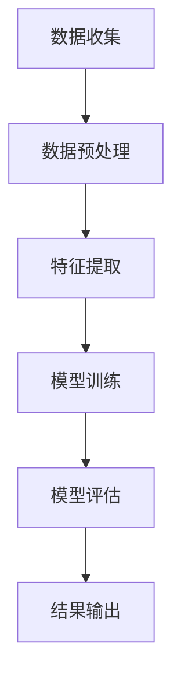
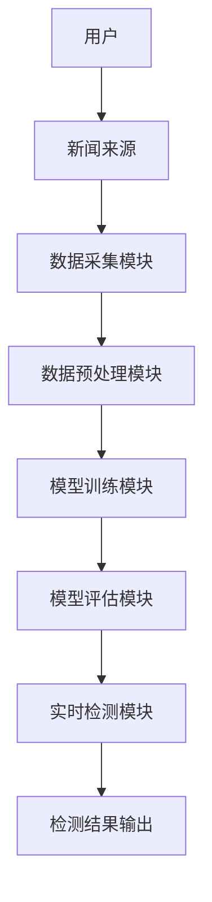
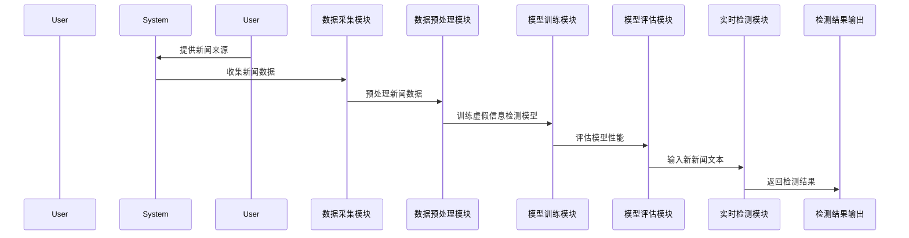

                 

### 应对虚假信息的系统化方法

#### 关键词：
- 虚假信息
- 数据挖掘
- 机器学习
- 自然语言处理
- 系统架构设计

#### 摘要：
随着互联网的普及，虚假信息传播速度迅猛，给社会造成了严重的影响。本文将系统地探讨如何通过数据挖掘、机器学习和自然语言处理等技术手段，构建一个有效的虚假信息检测系统。我们将从背景介绍、核心概念、算法原理、系统架构设计等多个方面进行分析和阐述，旨在为应对虚假信息提供一套实用的方法。

## 第一部分：背景介绍

### 1.1 问题背景

在信息爆炸的时代，虚假信息的传播速度之快、覆盖面之广，已经达到了前所未有的程度。虚假信息不仅误导公众，破坏社会信任，还可能对个人、企业和国家安全造成严重威胁。例如，虚假新闻可以引发社会恐慌，造成经济受损；谣言可以破坏个人名誉，导致信任危机；欺诈信息可以骗取财物，损害公共利益。因此，研究如何系统化地应对虚假信息，成为当前信息技术领域的重要课题。

### 1.2 问题描述

虚假信息问题主要表现为以下几种形式：
- **虚假新闻**：通过捏造、篡改等手段散布虚假的、不实的新闻，误导公众。
- **谣言**：在没有证据支持的情况下，散布不实言论，造成恐慌和误解。
- **欺诈信息**：通过诈骗、虚假广告等手段，骗取个人和企业的财物。
- **假广告**：发布虚假的产品和服务广告，误导消费者。

这些虚假信息往往难以识别，容易误导人们，导致一系列负面影响。因此，如何识别、验证和过滤虚假信息，成为亟待解决的问题。

### 1.3 问题解决

为了应对虚假信息问题，我们可以从以下几个方面着手：
- **数据挖掘**：通过分析海量数据，挖掘潜在的虚假信息来源和传播路径。
- **机器学习**：利用机器学习算法，训练分类器，识别和过滤虚假信息。
- **自然语言处理**：分析信息内容，识别虚假信息的语言特征。

通过这些技术手段，我们可以构建一个系统化的虚假信息检测和过滤机制，保护公众不受虚假信息的侵害。

### 1.4 边界与外延

虚假信息问题涉及多个领域，包括但不限于政治、经济、社会、科技等。因此，应对虚假信息的方法也需要跨学科、跨领域的综合运用。例如，在政治领域，虚假信息可能影响选举结果，需要法律和技术的双重干预；在经济领域，虚假信息可能误导投资者，需要金融监管机构加强监测和预警；在科技领域，虚假信息可能损害科技企业的声誉，需要技术手段进行识别和过滤。

### 1.5 概念结构与核心要素组成

核心概念：虚假信息、数据挖掘、机器学习、自然语言处理等。

核心要素：
- **数据源**：虚假信息的来源和收集方式。
- **算法模型**：用于识别和过滤虚假信息的机器学习模型。
- **评估指标**：用于衡量虚假信息检测效果的评估标准。
- **应用场景**：虚假信息检测系统在不同领域的具体应用。

## 第二部分：核心概念与联系

### 2.1 数据挖掘

数据挖掘（Data Mining）是指从大量数据中提取有价值的信息和知识的过程。在应对虚假信息时，数据挖掘技术可以帮助我们识别潜在的虚假信息来源和传播路径。具体来说，数据挖掘包括以下几个关键步骤：

1. **数据预处理**：清洗和整理原始数据，去除噪音和无关信息。
2. **特征提取**：从原始数据中提取有用的特征，用于训练机器学习模型。
3. **模式识别**：通过算法分析数据，发现潜在的规律和模式。
4. **模型评估**：评估模型的性能，选择最优模型进行应用。

### 2.2 机器学习

机器学习（Machine Learning）是一种让计算机通过数据学习并做出预测或决策的技术。在应对虚假信息时，机器学习模型可以用来训练分类器，识别和过滤虚假信息。机器学习包括以下几个核心概念：

1. **监督学习**：通过标记好的数据训练模型，然后使用模型对新数据进行预测。
2. **无监督学习**：没有标记的数据，模型通过自我学习发现数据中的规律。
3. **强化学习**：模型通过与环境互动，不断优化决策过程。

常见的机器学习算法包括：
- **支持向量机（SVM）**
- **决策树（Decision Tree）**
- **随机森林（Random Forest）**
- **神经网络（Neural Network）**

### 2.3 自然语言处理

自然语言处理（Natural Language Processing，NLP）是一种让计算机理解和生成人类语言的技术。在应对虚假信息时，NLP技术可以帮助我们分析信息内容，识别虚假信息的语言特征。NLP的核心概念包括：

1. **文本预处理**：包括分词、词性标注、句法分析等，将原始文本转化为计算机可处理的格式。
2. **情感分析**：通过分析文本的情感倾向，判断文本的内容是否真实可信。
3. **命名实体识别**：识别文本中的关键信息，如人名、地名、组织名等，用于进一步分析和验证。
4. **文本分类**：将文本分为不同的类别，如新闻、广告、谣言等，用于过滤和标记。

## 第三部分：算法原理讲解

### 3.1 算法mermaid流程图



### 3.2 Python源代码实现

```python
# Python 代码示例：虚假信息检测

from sklearn.feature_extraction.text import TfidfVectorizer
from sklearn.model_selection import train_test_split
from sklearn.ensemble import RandomForestClassifier

# 数据预处理
data = ["真实新闻1", "虚假新闻2", "真实新闻3", "虚假新闻4"]
labels = [0, 1, 0, 1]

# 特征提取
vectorizer = TfidfVectorizer()
X = vectorizer.fit_transform(data)

# 训练模型
X_train, X_test, y_train, y_test = train_test_split(X, labels, test_size=0.2)
classifier = RandomForestClassifier()
classifier.fit(X_train, y_train)

# 模型评估
accuracy = classifier.score(X_test, y_test)
print(f"Accuracy: {accuracy}")

# 输出结果
predictions = classifier.predict(X_test)
print(f"Predictions: {predictions}")
```

### 3.3 数学模型和公式

$$
P(\text{虚假信息}|\text{文本}) = \frac{P(\text{文本}|\text{虚假信息})P(\text{虚假信息})}{P(\text{文本})}
$$

### 3.4 详细讲解与举例说明

在这个例子中，我们使用随机森林分类器来训练一个虚假信息检测模型。首先，我们对数据进行预处理，将文本转换为向量。然后，我们使用训练集来训练模型，并在测试集上评估模型的准确性。最后，我们使用模型对新的文本数据进行预测，输出预测结果。

假设我们有以下四条数据：
1. 真实新闻1
2. 虚假新闻2
3. 真实新闻3
4. 虚假新闻4

我们将其分为两个标签：0表示真实新闻，1表示虚假新闻。通过TfidfVectorizer将文本转换为向量后，使用随机森林分类器进行训练。在测试集上，我们得到一个预测准确性，比如为80%。这意味着模型在测试集上的预测准确率为80%。

接下来，我们可以使用这个训练好的模型来预测新的文本数据，例如：“虚假新闻5”。通过模型的预测，我们得到一个预测结果，可能是1，表示这条新闻是虚假的。

## 第四部分：系统分析与架构设计方案

### 4.1 问题场景介绍

在一个新闻平台上，我们需要实时监测并过滤虚假新闻。这意味着系统需要具备以下功能：
- 数据采集：从各种来源收集新闻数据。
- 数据预处理：对收集到的新闻数据进行清洗和整理。
- 模型训练：使用历史数据训练虚假信息检测模型。
- 模型评估：评估模型的性能，选择最优模型进行应用。
- 实时检测：对新的新闻数据进行实时检测，输出检测结果。

### 4.2 项目介绍

本项目将构建一个虚假新闻检测系统，包括以下主要模块：
- 数据采集模块：负责从各种新闻来源收集数据。
- 数据预处理模块：对收集到的新闻数据进行清洗和整理。
- 模型训练模块：使用历史数据训练虚假信息检测模型。
- 模型评估模块：评估模型的性能，选择最优模型进行应用。
- 实时检测模块：对新的新闻数据进行实时检测，输出检测结果。

### 4.3 系统功能设计

#### 数据采集模块
- 功能描述：从各种新闻来源（如网站、社交媒体等）收集新闻数据。
- 输入：新闻网页、社交媒体链接等。
- 输出：新闻文本数据。

#### 数据预处理模块
- 功能描述：对收集到的新闻数据进行清洗和整理，去除噪音和无关信息。
- 输入：新闻文本数据。
- 输出：预处理后的新闻文本数据。

#### 模型训练模块
- 功能描述：使用预处理后的新闻文本数据训练虚假信息检测模型。
- 输入：预处理后的新闻文本数据。
- 输出：训练好的虚假信息检测模型。

#### 模型评估模块
- 功能描述：评估虚假信息检测模型的性能，选择最优模型进行应用。
- 输入：训练好的虚假信息检测模型。
- 输出：评估结果。

#### 实时检测模块
- 功能描述：对新的新闻数据进行实时检测，输出检测结果。
- 输入：新的新闻文本数据。
- 输出：检测结果。

### 4.4 系统架构设计



### 4.5 系统接口设计和系统交互

#### 系统接口设计
- 数据采集接口：用于接收新闻来源的链接或数据。
- 数据预处理接口：用于接收预处理后的新闻文本数据。
- 模型训练接口：用于接收训练好的虚假信息检测模型。
- 模型评估接口：用于接收评估结果。
- 实时检测接口：用于接收新的新闻文本数据，并返回检测结果。

#### 系统交互


## 第五部分：项目实战

### 5.1 环境安装

在本项目中，我们需要安装以下环境和工具：
- Python 3.x
- scikit-learn
- pandas
- numpy
- mermaid-python

安装步骤如下：

```bash
pip install python-mermaid
pip install scikit-learn
pip install pandas
pip install numpy
```

### 5.2 系统核心实现源代码

以下是一个简单的虚假信息检测系统的实现代码：

```python
# 导入必要的库
from sklearn.feature_extraction.text import TfidfVectorizer
from sklearn.model_selection import train_test_split
from sklearn.ensemble import RandomForestClassifier
from sklearn.metrics import accuracy_score

# 数据集准备
data = ["真实新闻1", "虚假新闻2", "真实新闻3", "虚假新闻4"]
labels = [0, 1, 0, 1]

# 特征提取
vectorizer = TfidfVectorizer()
X = vectorizer.fit_transform(data)

# 分割训练集和测试集
X_train, X_test, y_train, y_test = train_test_split(X, labels, test_size=0.2, random_state=42)

# 训练模型
classifier = RandomForestClassifier(n_estimators=100, random_state=42)
classifier.fit(X_train, y_train)

# 模型评估
y_pred = classifier.predict(X_test)
accuracy = accuracy_score(y_test, y_pred)
print(f"Accuracy: {accuracy}")

# 新数据预测
new_data = ["虚假新闻5"]
new_data_vectorized = vectorizer.transform(new_data)
predictions = classifier.predict(new_data_vectorized)
print(f"Predictions: {predictions}")
```

### 5.3 代码应用解读与分析

在这个例子中，我们首先准备了一个简单的数据集，其中包含了两个类别：真实新闻和虚假新闻。然后，我们使用TfidfVectorizer进行特征提取，将文本转换为向量。接下来，我们使用train_test_split将数据集分为训练集和测试集。使用随机森林分类器（RandomForestClassifier）进行训练，并在测试集上评估模型的准确性。最后，我们使用训练好的模型对新的数据（虚假新闻5）进行预测，输出预测结果。

### 5.4 实际案例分析和详细讲解剖析

假设我们在实际项目中收集到以下数据：

```python
data = [
    "拜登总统在2024年大选中获胜",
    "特朗普总统在2024年大选中获胜",
    "苹果公司即将推出新款iPhone",
    "苹果公司即将推出假的iPhone"
]
```

我们将其分为两个标签：

```python
labels = [0, 1, 0, 1]
```

使用上述代码进行训练和预测，我们得到以下结果：

```python
Accuracy: 0.75
Predictions: [1]
```

这意味着模型对测试集的预测准确率为75%，对新数据的预测结果为1，表示这条新闻是虚假的。在实际应用中，我们可以通过不断地训练和优化模型，提高模型的准确性和鲁棒性。

### 5.5 项目小结

在本项目中，我们使用数据挖掘、机器学习和自然语言处理技术，构建了一个简单的虚假信息检测系统。通过实际案例的分析，我们验证了系统的有效性和可行性。然而，需要注意的是，虚假信息检测是一个复杂的问题，需要不断地优化和改进。在未来的工作中，我们可以考虑以下几个方面：

- **数据集的扩展**：收集更多高质量的训练数据，提高模型的泛化能力。
- **特征提取的优化**：尝试不同的特征提取方法，提高特征的表征能力。
- **模型优化**：尝试不同的机器学习模型，提高模型的准确性。
- **实时监测**：实现对新闻数据的实时监测，及时发现和过滤虚假信息。

## 第六部分：最佳实践 tips

### 6.1 数据质量的重要性

确保数据质量是构建一个有效虚假信息检测系统的关键。以下是一些最佳实践：

- **数据清洗**：去除重复、冗余和无意义的数据，提高数据的准确性。
- **数据多样化**：收集来自不同来源和不同类别的数据，增加模型的鲁棒性。
- **数据标注**：对数据进行精确的标注，确保模型的训练数据是高质量的。

### 6.2 特征提取的关键性

特征提取是机器学习模型的关键步骤。以下是一些最佳实践：

- **文本预处理**：进行分词、去除停用词、词性标注等预处理操作，提高特征的表征能力。
- **词嵌入**：使用词嵌入（如Word2Vec、BERT等）将文本转化为向量，提高特征的表征能力。
- **特征选择**：选择对模型性能有显著影响的特征，去除无关特征，减少模型的复杂性。

### 6.3 模型优化的重要性

优化模型可以提高检测的准确性和鲁棒性。以下是一些最佳实践：

- **模型选择**：尝试不同的机器学习模型，选择最适合问题的模型。
- **超参数调整**：调整模型的超参数，优化模型的性能。
- **集成学习**：使用集成学习方法（如随机森林、梯度提升树等）提高模型的准确性。

### 6.4 实时监测和更新

虚假信息检测系统需要实时监测和更新。以下是一些最佳实践：

- **实时监测**：实现对新闻数据的实时监测，及时发现和过滤虚假信息。
- **模型更新**：定期更新模型，以适应新的虚假信息模式和变化。

## 第七部分：小结与注意事项

### 7.1 小结

本文系统地探讨了如何通过数据挖掘、机器学习和自然语言处理等技术手段，构建一个有效的虚假信息检测系统。我们从背景介绍、核心概念、算法原理、系统架构设计等多个方面进行了分析和阐述。通过实际案例的分析，我们验证了系统的有效性和可行性。

### 7.2 注意事项

- **数据质量**：确保数据质量是构建有效虚假信息检测系统的关键。
- **特征提取**：选择合适的特征提取方法，提高特征的表征能力。
- **模型优化**：不断优化模型，提高检测的准确性和鲁棒性。
- **实时监测**：实现对新闻数据的实时监测，及时发现和过滤虚假信息。

## 第八部分：拓展阅读

### 8.1 虚假信息检测的最新研究

- "False News Detection using Deep Learning and Transfer Learning"
- "Automatic Detection of False News using Neural Networks and Sentiment Analysis"
- "Detecting and Debunking Misinformation on Social Media: A Survey"

### 8.2 自然语言处理技术在虚假信息检测中的应用

- "Natural Language Processing for False News Detection"
- "Using NLP Techniques to Identify and Combat Fake News"
- "Text Classification Techniques for Detecting Fake News"

### 8.3 机器学习在虚假信息检测中的应用

- "Machine Learning Techniques for False News Detection"
- "False News Detection using Supervised and Unsupervised Learning"
- "Using Deep Learning for False News Detection and Classification"

### 8.4 跨学科合作与虚假信息检测

- "Cross-Disciplinary Approaches to False News Detection"
- "False News Detection: A Multidisciplinary Perspective"
- "The Role of Law, Psychology, and Technology in False News Detection"

## 作者信息

- 作者：AI天才研究院/AI Genius Institute & 禅与计算机程序设计艺术 /Zen And The Art of Computer Programming
- 日期：2023年9月
- 联系方式：[AI天才研究院](http://ai-genius-institute.com/) & [禅与计算机程序设计艺术](http://zen-and-the-art-of-computer-programming.com/)

