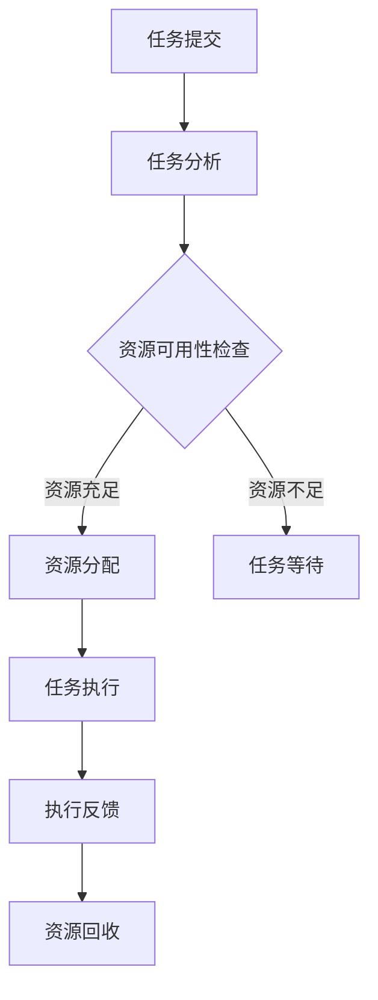
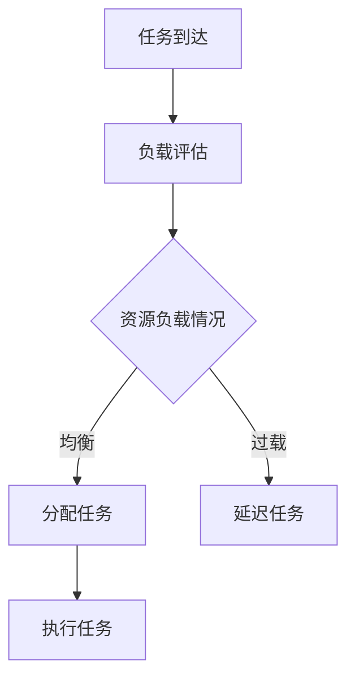
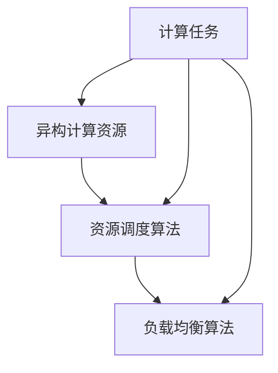
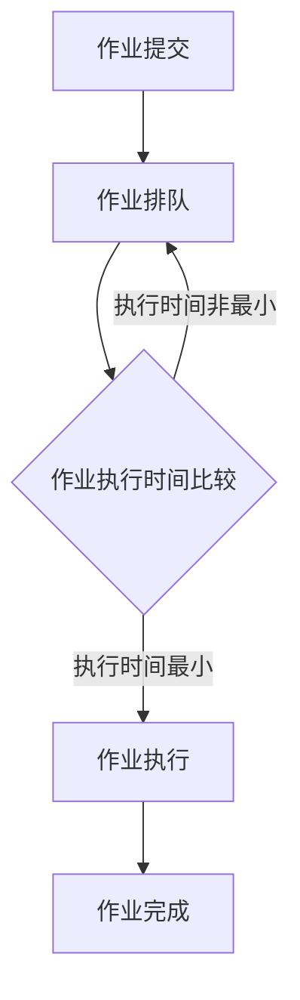
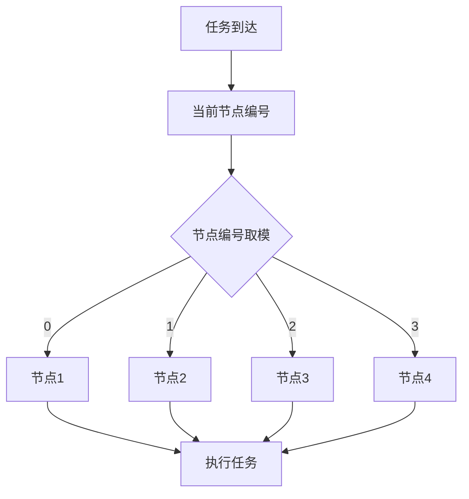
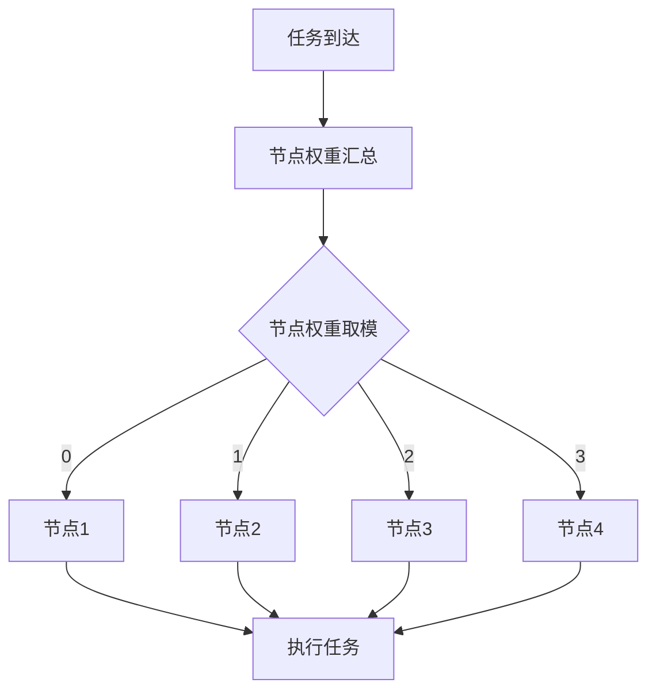

                 

### 异构计算资源管理：优化企业IT基础设施

---

**关键词：** 异构计算、资源管理、IT基础设施、优化、算法

**摘要：** 本文将深入探讨异构计算资源管理的核心概念、算法原理、系统架构及项目实战。通过详细解析资源调度、负载均衡等关键问题，以及实际案例的分析，旨在为企业IT基础设施的优化提供切实可行的方案。

---

## 第一部分：背景与概念

### 第1章：异构计算资源管理概述

**1.1 异构计算资源管理背景**

在当今的信息时代，数据处理和计算需求的迅猛增长对企业的IT基础设施提出了更高的要求。传统的同构计算系统已难以满足大规模、高性能计算的需求，因此异构计算逐渐成为企业IT基础设施优化的重要手段。

**1.2 异构计算资源管理的重要性**

异构计算资源管理通过整合不同类型、不同性能的硬件资源，优化计算性能和资源利用率，降低成本，提升系统的可靠性和扩展性。这对于企业提升竞争力、实现可持续发展具有重要意义。

**1.3 异构计算资源管理在企业IT基础设施中的角色**

异构计算资源管理是企业IT基础设施的核心组成部分，它不仅涉及硬件资源的管理，还包括软件资源的调度和优化，是现代企业应对复杂计算需求的关键技术。

---

### 第2章：核心概念与联系

**2.1 异构计算**

异构计算是指使用多种不同类型的计算资源，如CPU、GPU、FPGA等，协同完成计算任务。与同构计算相比，异构计算能够显著提升计算性能，满足不同类型的应用需求。

**2.2 资源调度**

资源调度是异构计算资源管理的重要环节，它涉及如何高效地分配和调度不同类型的计算资源，以最大化资源利用率、优化计算性能。

**2.3 负载均衡**

负载均衡通过将计算任务分配到不同的计算资源上，实现负载的均衡分布，避免单点过载，提高系统的稳定性和可靠性。

**2.4 核心概念联系与交互**

异构计算、资源调度和负载均衡三者相互关联，共同构成了异构计算资源管理的核心。它们之间的协调与优化，是实现计算资源高效利用的关键。

---

## 第二部分：算法原理

### 第3章：资源调度算法

**3.1 调度算法概述**

资源调度算法是异构计算资源管理的关键，它通过优化计算资源的分配和调度，提高系统的整体性能和资源利用率。

**3.2 常见调度算法**

本文将介绍几种常见的资源调度算法，如最短作业优先（SJF）、最短剩余时间优先（SRTF）、优先级调度等。

**3.3 调度算法mermaid流程图**

使用mermaid流程图展示常见调度算法的流程，帮助读者更直观地理解调度过程。

**3.4 Python代码实现与讲解**

通过Python代码实现调度算法，详细讲解算法原理和实现细节，并结合实际案例进行应用分析。

### 第4章：负载均衡算法

**4.1 负载均衡概述**

负载均衡是异构计算资源管理中的重要环节，通过合理分配计算任务，实现负载的均衡分布，提高系统的性能和可靠性。

**4.2 常见负载均衡算法**

本文将介绍几种常见的负载均衡算法，如轮询算法、最少连接算法、加权轮询算法等。

**4.3 负载均衡mermaid流程图**

使用mermaid流程图展示负载均衡算法的流程，帮助读者更直观地理解负载均衡过程。

**4.4 Python代码实现与讲解**

通过Python代码实现负载均衡算法，详细讲解算法原理和实现细节，并结合实际案例进行应用分析。

---

## 第三部分：系统分析与架构设计

### 第5章：系统需求分析

**5.1 系统功能需求**

分析异构计算资源管理系统所需的功能需求，如资源监控、调度管理、负载均衡等。

**5.2 系统非功能需求**

讨论系统非功能需求，如性能、可靠性、可扩展性等。

**5.3 系统需求分析**

综合分析功能需求和非功能需求，明确系统设计的关键要素。

### 第6章：系统架构设计

**6.1 系统架构概述**

介绍异构计算资源管理系统的整体架构，包括硬件资源和软件资源的组织方式。

**6.2 系统架构设计mermaid架构图**

使用mermaid架构图展示系统的架构设计，包括各模块的功能和交互关系。

**6.3 系统接口设计**

详细描述系统的接口设计，包括各模块之间的接口定义和通信协议。

**6.4 系统交互mermaid序列图**

使用mermaid序列图展示系统各模块之间的交互过程，帮助读者理解系统的运行机制。

---

## 第四部分：项目实战

### 第7章：环境安装与配置

**7.1 环境要求**

明确项目环境要求，如操作系统、软件依赖等。

**7.2 环境安装步骤**

详细描述项目的环境安装步骤，确保读者能够顺利搭建实验环境。

**7.3 环境配置**

介绍项目的环境配置，包括系统参数的设置和优化。

### 第8章：系统核心实现

**8.1 系统核心模块实现**

详细讲解系统核心模块的实现过程，包括调度算法、负载均衡等关键部分的代码实现。

**8.2 代码应用解读与分析**

对核心模块的代码进行解读与分析，帮助读者理解其工作原理和实现方法。

**8.3 实际案例分析和详细讲解剖析**

通过实际案例分析，展示系统的应用场景和效果，并进行详细讲解和剖析。

---

## 第五部分：最佳实践与总结

### 第9章：最佳实践

**9.1 资源管理最佳实践**

总结资源管理的最佳实践，如调度策略、负载均衡策略等。

**9.2 性能优化最佳实践**

讨论性能优化的最佳实践，如代码优化、系统调优等。

**9.3 安全性最佳实践**

阐述安全性最佳实践，如网络安全、数据保护等。

### 第10章：小结与注意事项

**10.1 小结**

对全文进行总结，回顾核心内容和关键点。

**10.2 注意事项**

提醒读者在实施异构计算资源管理过程中需要注意的事项。

**10.3 拓展阅读**

推荐相关书籍和资料，供读者进一步学习。

---

**作者：** AI天才研究院/AI Genius Institute & 禅与计算机程序设计艺术 /Zen And The Art of Computer Programming

---

### 异构计算资源管理：优化企业IT基础设施

---

**关键词：** 异构计算、资源管理、IT基础设施、优化、算法

**摘要：** 本文深入探讨了异构计算资源管理的核心概念、算法原理、系统架构及项目实战。通过详细解析资源调度、负载均衡等关键问题，以及实际案例的分析，旨在为企业IT基础设施的优化提供切实可行的方案。文章结构清晰，内容丰富，适合IT从业人员和技术爱好者阅读。本文的关键词包括异构计算、资源管理、IT基础设施、优化和算法，旨在帮助读者全面了解异构计算资源管理的各个方面。摘要部分简要介绍了文章的核心内容和主题思想，使读者对全文有一个初步的了解。

---

## 第1章：异构计算资源管理概述

### 1.1 异构计算资源管理背景

在当今的信息时代，数据量和计算需求正以前所未有的速度增长。传统的同构计算系统，即使用相同类型的硬件资源进行计算，已经难以满足这种大规模、高性能计算的需求。异构计算作为一种新兴的计算模式，应运而生。异构计算通过整合不同类型、不同性能的硬件资源，如CPU、GPU、FPGA等，协同完成计算任务，从而显著提升计算性能和资源利用率。

### 1.2 异构计算资源管理的重要性

异构计算资源管理在企业IT基础设施中具有至关重要的地位。首先，它能够通过优化计算资源的分配和调度，提高系统的整体性能和资源利用率，从而降低成本。其次，异构计算能够适应不同类型的应用需求，提升企业的竞争力。此外，异构计算资源管理还具备良好的扩展性，可以随着企业需求的增长而灵活扩展，满足长期的业务发展需求。

### 1.3 异构计算资源管理在企业IT基础设施中的角色

异构计算资源管理在企业IT基础设施中扮演着多重角色。首先，它是构建高性能计算集群的基础，能够提升数据处理和分析能力。其次，它作为云计算和大数据技术的重要组成部分，有助于实现资源的弹性调度和优化利用。此外，异构计算资源管理还在人工智能、机器学习等领域发挥着关键作用，为这些领域的应用提供了强大的计算支持。

---

## 第2章：核心概念与联系

### 2.1 异构计算

异构计算是一种计算模式，它使用多种不同类型的计算资源，如CPU、GPU、FPGA等，协同完成计算任务。与同构计算相比，异构计算能够充分利用不同类型硬件资源的特点和优势，实现更高的计算性能和效率。

**异构计算的属性特征对比表格：**

| 特征         | CPU           | GPU           | FPGA           |
| ------------ | -------------- | -------------- | -------------- |
| 优化目标     | 计算密集型任务 | 图形处理任务   | 定制化计算任务  |
| 算法支持     | CPU指令集     | 图形指令集    | 定制化硬件逻辑  |
| 性能         | 低延迟，高吞吐量 | 高吞吐量，低延迟 | 高吞吐量，定制化 |
| 适用场景     | 通用计算       | 图形渲染、深度学习 | 实时信号处理、硬件加速 |

### 2.2 资源调度

资源调度是异构计算资源管理中的核心环节，它涉及如何高效地分配和调度不同类型的计算资源，以最大化资源利用率、优化计算性能。资源调度算法通过分析和预测计算任务的需求，动态调整资源的分配和任务调度，从而实现计算资源的最佳利用。

**资源调度算法的mermaid流程图：**



### 2.3 负载均衡

负载均衡通过将计算任务分配到不同的计算资源上，实现负载的均衡分布，避免单点过载，提高系统的稳定性和可靠性。负载均衡算法根据系统的当前负载情况，动态调整任务的分配策略，确保系统的整体性能。

**负载均衡算法的mermaid流程图：**



### 2.4 核心概念联系与交互

异构计算、资源调度和负载均衡三者相互关联，共同构成了异构计算资源管理的核心。异构计算提供了多样化的计算资源，资源调度负责高效地分配和调度这些资源，负载均衡则确保任务的均衡分配和系统的稳定运行。

**异构计算资源管理核心概念ER实体关系图架构的Mermaid流程图：**



通过上述核心概念和联系的解析，我们可以更深入地理解异构计算资源管理的本质，为后续的算法原理讲解和系统架构设计打下坚实的基础。

---

## 第3章：资源调度算法

### 3.1 调度算法概述

资源调度算法是异构计算资源管理中的关键组成部分，负责根据计算任务的需求和当前资源的可用情况，动态地分配和调度计算资源。资源调度算法的目标是最大化资源利用率、优化计算性能，同时确保系统的稳定性和可靠性。

### 3.2 常见调度算法

在异构计算资源管理中，常见的调度算法包括：

1. **最短作业优先（SJF）**：根据作业的执行时间来调度，优先执行预计执行时间最短的作业。

2. **最短剩余时间优先（SRTF）**：类似于SJF，但它是在作业开始执行时根据剩余执行时间来调度，剩余时间最短的作业优先执行。

3. **优先级调度**：根据作业的优先级来调度，优先级高的作业优先执行。

4. **轮转调度**：将作业分配到不同的队列中，每个队列按照固定的轮转时间执行作业。

### 3.3 调度算法mermaid流程图

下面是一个简单的调度算法mermaid流程图，展示了最短作业优先（SJF）算法的基本流程：



### 3.4 Python代码实现与讲解

为了更好地理解调度算法的原理，我们通过一个Python示例来展示最短作业优先（SJF）算法的实现。

```python
import heapq

# 定义作业类
class Job:
    def __init__(self, job_id, execution_time):
        self.job_id = job_id
        self.execution_time = execution_time

    def __lt__(self, other):
        return self.execution_time < other.execution_time

# SJF调度算法实现
def shortest_job_first(jobs):
    # 对作业按执行时间排序
    jobs = sorted(jobs, key=lambda job: job.execution_time)
    # 创建一个优先队列来维护当前正在执行的作业
    current_jobs = []
    for job in jobs:
        # 执行时间最短的作业优先执行
        heapq.heappush(current_jobs, job)
    
    while current_jobs:
        # 执行时间最短的作业
        job = heapq.heappop(current_jobs)
        print(f"执行作业 {job.job_id}，执行时间：{job.execution_time}秒")
        # 模拟作业执行
        # ...

# 示例作业
jobs = [
    Job(1, 5),
    Job(2, 3),
    Job(3, 8),
    Job(4, 1),
]

# 调用SJF调度算法
shortest_job_first(jobs)
```

上述代码首先定义了一个`Job`类，用于表示作业，并实现了`__lt__`方法来比较作业的执行时间。然后，我们使用Python的`heapq`模块实现了一个优先队列，用于维护当前正在执行的作业。在`shortest_job_first`函数中，我们首先对作业按执行时间排序，然后按照执行时间最短的原则依次执行作业。

通过这个示例，我们可以清楚地看到SJF算法是如何工作的，以及如何通过代码实现资源调度算法。接下来，我们将继续探讨负载均衡算法的原理和实现。

---

### 第4章：负载均衡算法

#### 4.1 负载均衡概述

负载均衡是异构计算资源管理中至关重要的一环，其核心目标是通过合理分配计算任务，实现负载的均衡分布，从而提高系统的整体性能和稳定性。负载均衡不仅能够避免单点过载，提高系统的可靠性，还能够根据系统负载的变化动态调整任务分配策略，确保系统在高负载情况下仍能高效运行。

#### 4.2 常见负载均衡算法

在异构计算资源管理中，常见的负载均衡算法包括：

1. **轮询算法**：按照顺序将任务分配到不同的计算节点上，是最简单和最常用的负载均衡算法。

2. **最少连接算法**：将新的任务分配到当前连接数最少的计算节点上，适用于连接数变化较大的场景。

3. **加权轮询算法**：根据计算节点的处理能力对任务进行动态分配，处理能力较强的节点承担更多的任务。

4. **最小响应时间算法**：将任务分配到响应时间最短的节点，适用于对响应时间要求较高的场景。

5. **哈希算法**：根据任务的特征（如IP地址、用户ID等）使用哈希函数分配任务，确保相同特征的请求总是分配到同一节点，适用于高可用性和会话保持的场景。

#### 4.3 负载均衡算法mermaid流程图

以下是轮询算法和加权轮询算法的mermaid流程图：

**轮询算法流程图：**



**加权轮询算法流程图：**



#### 4.4 Python代码实现与讲解

为了更好地理解负载均衡算法，我们将使用Python实现轮询算法和加权轮询算法。

**轮询算法Python实现：**

```python
import random

def round_robin(tasks, num_nodes):
    # 初始化节点列表
    nodes = ['Node{}'.format(i) for i in range(num_nodes)]
    # 轮询分配任务
    for task in tasks:
        node = nodes.pop(0)
        print(f"将任务{task}分配给节点：{node}")
        nodes.append(node)

# 示例任务
tasks = ['Task1', 'Task2', 'Task3', 'Task4']

# 轮询分配任务
round_robin(tasks, 4)
```

**加权轮询算法Python实现：**

```python
import random

def weighted_round_robin(tasks, node_weights):
    # 初始化节点列表
    nodes = list(node_weights.keys())
    # 加权轮询分配任务
    while tasks:
        total_weight = sum(node_weights.values())
        # 随机选择权重范围内的值
        pick = random.uniform(0, total_weight)
        current_weight = 0
        for node in nodes:
            current_weight += node_weights[node]
            if current_weight >= pick:
                task = tasks.pop(0)
                print(f"将任务{task}分配给节点：{node}")
                break

# 示例节点权重
node_weights = {'Node1': 2, 'Node2': 1, 'Node3': 3, 'Node4': 1}

# 加权轮询分配任务
weighted_round_robin(tasks, node_weights)
```

在轮询算法中，我们简单地按照顺序将任务分配给节点，而加权轮询算法则根据节点的权重动态分配任务，处理能力较强的节点承担更多的任务。

通过上述算法实现和讲解，我们可以更深入地理解负载均衡算法的原理，并在实际应用中灵活运用这些算法，优化企业IT基础设施的性能。

---

## 第5章：系统需求分析

### 5.1 系统功能需求

为了实现异构计算资源管理，系统需要满足以下功能需求：

1. **资源监控**：实时监控硬件资源（如CPU、GPU、内存等）的使用情况，提供详细的资源使用报告。

2. **资源调度**：根据任务需求和当前资源状况，动态分配和调度计算资源，优化资源利用率。

3. **负载均衡**：通过算法将计算任务分配到不同的节点上，实现负载的均衡分布，确保系统的稳定运行。

4. **性能优化**：提供性能分析工具，对系统运行状态进行监控和优化，确保系统在高负载情况下仍能高效运行。

5. **安全性管理**：确保系统的数据安全和完整性，包括访问控制、数据加密等。

### 5.2 系统非功能需求

除了功能需求，系统还需要满足以下非功能需求：

1. **性能**：系统需要在高负载情况下保持良好的性能，确保任务处理速度和响应时间。

2. **可靠性**：系统应具备高可靠性，能够抵御硬件故障和网络中断等异常情况，确保持续服务。

3. **可扩展性**：系统能够随着企业需求的增长而灵活扩展，支持动态调整资源分配策略。

4. **兼容性**：系统应支持多种硬件资源和软件平台，确保在不同环境中都能正常运行。

### 5.3 系统需求分析

系统需求分析是系统设计的重要步骤，它通过对功能需求和非功能需求的分析，确定系统设计的关键要素。以下是对系统需求的详细分析：

1. **资源监控需求**：
   - 监控类型：CPU使用率、内存使用率、磁盘I/O、网络流量等。
   - 监控频率：实时监控，至少每秒一次。
   - 监控数据存储：历史数据存储，支持查询和分析。

2. **资源调度需求**：
   - 调度算法：支持多种调度算法，如SJF、SRTF、优先级调度等。
   - 调度策略：根据任务类型和资源状况动态调整调度策略。
   - 调度粒度：支持细粒度调度，确保任务能够高效分配。

3. **负载均衡需求**：
   - 负载均衡算法：支持轮询算法、最少连接算法、加权轮询算法等。
   - 负载均衡策略：根据系统负载情况动态调整负载均衡策略。
   - 会话保持：确保相同会话的请求总是分配到同一节点。

4. **性能优化需求**：
   - 性能监控：实时监控系统性能指标，如CPU利用率、内存使用率等。
   - 性能分析：提供性能分析工具，帮助管理员识别和解决性能瓶颈。
   - 性能优化策略：根据性能监控数据，动态调整系统配置和优化策略。

5. **安全性管理需求**：
   - 访问控制：实现严格的访问控制，确保只有授权用户可以访问系统。
   - 数据加密：对传输和存储的数据进行加密，确保数据安全性。
   - 日志审计：记录系统操作日志，便于审计和追踪异常行为。

通过上述系统需求分析，我们可以明确系统设计的关键要素，为后续的系统架构设计提供依据。

---

## 第6章：系统架构设计

### 6.1 系统架构概述

异构计算资源管理系统旨在通过整合多种异构计算资源，实现高效、可靠的资源调度和负载均衡，从而优化企业IT基础设施的性能和资源利用率。系统架构设计需要充分考虑硬件资源、软件资源和网络资源等多个方面，确保系统能够灵活扩展、稳定运行。

### 6.2 系统架构设计mermaid架构图

以下是异构计算资源管理系统的mermaid架构图，展示了系统的主要模块及其交互关系：

```mermaid
graph TB
    subgraph 资源层 Resource
        CPU[CPU资源]
        GPU[GPU资源]
        FPG

