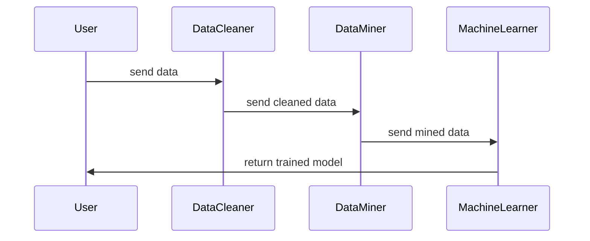

                 

### 《异构计算：多种计算技术协同解决复杂问题》

> 关键词：异构计算、复杂问题、计算技术、协同、性能优化

> 摘要：本文将深入探讨异构计算的概念、原理及其在解决复杂问题中的应用。我们将通过逐步分析，揭示异构计算的独特优势，展示其在实际项目中的成功案例，帮助读者理解如何利用异构计算技术提高计算效率和解决复杂问题。

----------------------------------------------------------------

## 第1章 异构计算概述

### 1.1 问题背景

异构计算（Heterogeneous Computing）是指在不同类型的计算硬件上执行计算任务，这些硬件可以具有不同的处理能力、能耗特性和编程模型。随着计算需求的增长，单核CPU的处理能力已无法满足日益复杂的计算任务。异构计算通过将计算任务分配到不同类型的硬件上，实现了计算资源的优化利用，从而提高了计算性能和效率。

#### 异构计算的概念与起源

异构计算的概念起源于计算机体系结构的多元化需求。在过去的几十年里，CPU作为主要的计算硬件，以其强大的通用计算能力为核心。然而，随着科学计算、图形渲染、机器学习等领域的快速发展，传统CPU在处理大量并行计算任务时显得力不从心。为了提高计算效率，人们开始探索利用其他类型的计算硬件，如GPU（图形处理器）和FPGA（现场可编程门阵列）等，进行异构计算。

#### 当前计算技术的发展趋势

当前，计算技术正朝着多元化、高效能、低能耗的方向发展。CPU、GPU、FPGA等计算硬件不断演进，它们的处理能力、能耗特性和编程模型也在不断优化。例如，GPU在并行计算方面的优势日益明显，FPGA的可编程性使其在定制化计算任务中具有独特优势。这些硬件的发展推动了异构计算技术的普及和应用。

### 1.2 问题描述

复杂问题是指那些难以用单一计算硬件在合理时间内解决的问题。随着数据规模的扩大和计算需求的增长，传统计算方式在处理复杂问题时面临诸多挑战。这些挑战包括：

- **计算能力不足**：复杂问题通常需要大量计算资源，而传统CPU在处理并行计算任务时性能受限。
- **能耗问题**：传统计算硬件在运行复杂任务时能耗较高，难以满足低能耗的需求。
- **编程复杂度**：为了充分利用不同类型的计算硬件，需要编写复杂的多处理器程序，增加了开发难度。

### 1.3 问题解决

异构计算通过将计算任务分配到不同类型的硬件上，实现了计算资源的优化利用。以下是异构计算解决复杂问题的基本原理：

#### 异构计算的基本原理

异构计算的基本原理是将复杂的计算任务分解为多个子任务，然后分配到不同类型的硬件上进行并行处理。具体来说，异构计算包括以下几个方面：

- **任务分配**：根据计算任务的特点和硬件的性能，将任务分配到不同的硬件上。
- **数据传输**：在不同硬件之间传输数据，确保数据能够在不同硬件之间高效流动。
- **协同处理**：利用不同硬件的优势，协同处理复杂计算任务，提高计算性能。

#### 异构计算的优势

异构计算具有以下优势：

- **高性能**：通过利用不同硬件的优势，异构计算可以在较短的时间内解决复杂的计算问题。
- **低能耗**：与单一硬件相比，异构计算可以降低能耗，提高计算效率。
- **易扩展**：异构计算系统可以根据计算需求的变化，灵活扩展硬件资源。

### 1.4 边界与外延

#### 异构计算的应用领域

异构计算广泛应用于以下领域：

- **科学计算**：如气象预报、物理模拟、生物信息学等。
- **图形渲染**：如游戏开发、动画制作等。
- **机器学习**：如深度学习、强化学习等。
- **工业控制**：如自动化生产线、智能交通系统等。

#### 异构计算的未来展望

随着计算需求的不断增长，异构计算技术将继续发展。未来，异构计算将更加智能化，硬件与软件将更加协同，异构计算系统将实现更高的性能和更低的能耗。同时，异构计算技术将在更多领域得到应用，推动计算技术的发展。

### 1.5 概念结构与核心要素组成

#### 异构计算系统架构

异构计算系统架构包括以下几个方面：

- **计算硬件**：如CPU、GPU、FPGA等。
- **通信网络**：用于连接不同硬件，实现数据传输和协同处理。
- **操作系统**：负责硬件管理和任务调度。
- **编程模型**：如CUDA、OpenCL等，用于编写异构计算程序。

#### 异构计算资源管理

异构计算资源管理包括以下几个方面：

- **任务调度**：根据硬件性能和负载情况，合理分配计算任务。
- **数据管理**：优化数据传输和处理，提高系统性能。
- **能耗管理**：降低系统能耗，提高能效比。

## 第2章 异构计算的核心技术

### 2.1 核心概念

异构计算的核心概念包括计算硬件和编程模型。计算硬件方面，CPU、GPU和FPGA等硬件在异构计算中发挥着重要作用。编程模型方面，CUDA、OpenCL等编程模型提供了高效的开发工具，使得开发者能够充分利用异构计算硬件。

#### 异构计算硬件

- **CPU**：CPU（Central Processing Unit，中央处理器）是计算机的核心部件，负责执行计算机程序中的指令。CPU具有强大的通用计算能力，但在处理并行计算任务时性能受限。

- **GPU**：GPU（Graphics Processing Unit，图形处理器）最初用于图形渲染，但由于其在并行计算方面的强大能力，近年来在科学计算、机器学习等领域得到了广泛应用。GPU具有大量计算核心，能够在短时间内完成大量并行计算任务。

- **FPGA**：FPGA（Field-Programmable Gate Array，现场可编程门阵列）是一种可编程逻辑器件，可以通过硬件描述语言进行编程，实现特定的计算功能。FPGA具有高度定制化的特点，适用于需要高度优化和定制化计算的领域。

#### 异构计算软件

- **CUDA**：CUDA（Compute Unified Device Architecture，统一计算设备架构）是NVIDIA推出的一种异构计算编程模型，用于在GPU上编写并行计算程序。CUDA提供了丰富的编程接口和库函数，使得开发者能够充分利用GPU的并行计算能力。

- **OpenCL**：OpenCL（Open Computing Language，开放计算语言）是一种跨平台的异构计算编程模型，支持CPU、GPU、FPGA等多种硬件平台。OpenCL提供了统一的编程接口，使得开发者能够编写高效的异构计算程序。

### 2.2 概念属性特征对比表格

| 特征       | CPU           | GPU           | FPGA          |
|------------|---------------|---------------|---------------|
| 处理能力   | 强             | 强             | 中            |
| 能效比     | 低             | 高             | 中            |
| 可编程性   | 弱             | 中             | 强            |
| 应用领域   | 常规计算       | 图形渲染、科学计算 | 高速数据流处理 |

### 2.3 ER实体关系图架构

```mermaid
erDiagram
    CPU ||--|{ GPU }||> FPGA
    GPU ||--|{ CPU }||> FPGA
```

### 2.4 算法原理

#### 图计算算法

图计算算法是一种用于处理大规模图数据的高效算法。以下是一个简单的图计算算法的mermaid流程图：


#### 并行算法

并行算法是一种利用多个计算核心同时执行计算任务的算法。以下是一个简单的并行算法的Python源代码示例：

```python
def parallel_function(x, y):
    return x + y
```

### 2.5 数学模型与公式

$$
E = mc^2
$$

$$
x = \frac{d}{dt}
$$

## 第3章 异构计算系统设计与实现

### 3.1 问题场景介绍

异构计算系统设计与实现的目标是解决复杂计算任务，提高计算性能和效率。以下是一个典型的问题场景：

#### 需求背景

某公司需要进行大规模数据分析和处理，包括数据清洗、数据挖掘、机器学习等任务。由于数据规模庞大，传统的单核CPU计算方式无法满足需求，需要采用异构计算技术进行优化。

#### 问题描述

- **计算能力不足**：单核CPU计算能力有限，难以在短时间内完成大量数据处理任务。
- **编程复杂度**：需要编写复杂的多处理器程序，提高编程难度。
- **能耗问题**：单核CPU在运行大规模计算任务时能耗较高，影响系统性能。

### 3.2 系统功能设计

#### 领域模型

以下是一个简单的领域模型，用于描述系统的主要功能：

```mermaid
classDiagram
    DataProcessor <|-- DataCleaner
    DataProcessor <|-- DataMiner
    DataProcessor <|-- MachineLearner
    DataCleaner {
        void clean_data()
    }
    DataMiner {
        void mine_data()
    }
    MachineLearner {
        void train_model()
    }
```

#### 系统架构设计

以下是一个简单的异构计算系统架构设计，用于描述系统的主要组件：



### 3.3 系统接口设计

系统接口设计用于定义系统与其他系统或组件之间的交互方式。以下是一个简单的系统接口设计：

```mermaid
classDiagram
    DataProcessor <|-- API
    API {
        void send_data()
        void receive_data()
    }
```

### 3.4 系统交互

以下是一个简单的系统交互序列图，用于描述系统组件之间的交互过程：


## 第4章 异构计算在工业领域的应用

### 4.1 工业领域概述

工业领域面临着复杂、大规模的计算需求，如智能制造、工业仿真、工业物联网等。这些应用场景对计算性能和效率提出了极高的要求，而异构计算技术能够提供有效的解决方案。

#### 需求分析

- **计算性能**：工业领域需要快速、高效地处理大量数据，实现实时分析。
- **能耗管理**：工业领域对能耗管理有严格的要求，需要降低能耗，提高能源利用效率。
- **可扩展性**：工业领域需要灵活、可扩展的计算平台，以应对不断增长的计算需求。

### 4.2 案例分析

#### 案例一：智能制造

**问题描述**

在智能制造过程中，如何优化生产流程，提高生产效率？

**解决方案**

利用异构计算技术，通过CPU和GPU协同处理，实现生产流程的实时监控与优化。

**实现原理**

- **实时监控**：通过CPU实时收集生产线数据，包括设备状态、生产进度等。
- **数据预处理**：利用GPU进行大规模数据预处理，包括数据清洗、去噪等。
- **生产优化**：利用机器学习算法，通过GPU进行模型训练和预测，优化生产流程。

#### 案例二：工业仿真

**问题描述**

在工业仿真领域，如何提高仿真效率，降低成本？

**解决方案**

利用异构计算技术，通过CPU和FPGA协同处理，提高仿真效率。

**实现原理**

- **仿真计算**：利用CPU进行大规模仿真计算，处理复杂的物理模型。
- **加速计算**：利用FPGA进行加速计算，处理并行计算任务，提高仿真速度。

### 4.3 应用前景

随着工业领域计算需求的不断增长，异构计算技术在工业领域的应用前景十分广阔。未来，异构计算技术将有望在以下方面得到进一步应用：

- **智能制造**：提高生产效率，降低生产成本。
- **工业物联网**：实现实时数据分析和预测，提高设备维护和优化水平。
- **工业仿真**：提高仿真速度，降低仿真成本，提高设计效率。

## 项目实战

### 环境安装

1. 安装CUDA Toolkit：CUDA Toolkit是NVIDIA推出的异构计算开发工具包，用于在GPU上编写和运行异构计算程序。请按照以下步骤安装CUDA Toolkit：

   - 下载CUDA Toolkit：访问NVIDIA官方网站，下载CUDA Toolkit安装包。
   - 安装CUDA Toolkit：双击安装包，按照提示完成安装。

2. 安装OpenCL SDK：OpenCL SDK是跨平台的异构计算开发工具包，用于在多种硬件平台上编写和运行异构计算程序。请按照以下步骤安装OpenCL SDK：

   - 下载OpenCL SDK：访问OpenCL官方网站，下载OpenCL SDK安装包。
   - 安装OpenCL SDK：双击安装包，按照提示完成安装。

### 系统核心实现源代码

以下是一个简单的异构计算程序，用于计算两个矩阵的乘积。该程序利用CUDA Toolkit和OpenCL SDK，分别在GPU和CPU上执行计算任务。

```python
# CUDA代码
import pycuda.driver as cuda
import pycuda.autoinit
import numpy as np

def matrix_multiply_cuda(A, B):
    n = A.shape[0]
    m = A.shape[1]
    p = B.shape[1]

    # 创建CUDA内存
    cuda_A = cuda.mem_alloc(A.nbytes)
    cuda_B = cuda.mem_alloc(B.nbytes)
    cuda_C = cuda.mem_alloc(np.zeros((n, p), dtype=np.float32).nbytes)

    # 将主机内存复制到CUDA内存
    cuda.memcpy_htod(cuda_A, A)
    cuda.memcpy_htod(cuda_B, B)

    # 定义CUDA内核
    kernel = """
    __global__ void matrix_multiply(float *A, float *B, float *C, int n, int m, int p) {
        int i = blockIdx.x * blockDim.x + threadIdx.x;
        int j = blockIdx.y * blockDim.y + threadIdx.y;

        if (i < n && j < p) {
            float sum = 0.0;
            for (int k = 0; k < m; ++k) {
                sum += A[i * m + k] * B[k * p + j];
            }
            C[i * p + j] = sum;
        }
    }
    """

    # 编译CUDA内核
    mod = cuda.autoinit.compiler.compile(kernel, options=["-O2"])

    # 执行CUDA内核
    grid = (n, p)
    block = (16, 16)
    mod.get_function("matrix_multiply")(cuda_A, cuda_B, cuda_C, np.int32(n), np.int32(m), np.int32(p), grid=grid, block=block)

    # 将CUDA内存复制回主机内存
    C = np.empty((n, p), dtype=np.float32)
    cuda.memcpy_dtoh(C, cuda_C)

    return C

# OpenCL代码
import pyopencl as cl

def matrix_multiply_opencl(A, B):
    n = A.shape[0]
    m = A.shape[1]
    p = B.shape[1]

    # 创建OpenCL上下文和设备
    platform = cl.get_platforms()[0]
    device = platform.get_devices()[0]
    ctx = cl.Context(devices=device)
    queue = cl.CommandQueue(ctx)

    # 创建OpenCL内存
    buf_A = cl.Buffer(ctx, cl.mem_flags.READ_ONLY | cl.mem_flags.COPY_HTOG, A.nbytes)
    buf_B = cl.Buffer(ctx, cl.mem_flags.READ_ONLY | cl.mem_flags.COPY_HTOG, B.nbytes)
    buf_C = cl.Buffer(ctx, cl.mem_flags.WRITE_ONLY | cl.mem_flags.COPY_DTOH, np.zeros((n, p), dtype=np.float32).nbytes)

    # 将主机内存复制到OpenCL内存
    cl.enqueue_copy(queue, buf_A, A)
    cl.enqueue_copy(queue, buf_B, B)

    # 定义OpenCL内核
    kernel = """
    __kernel void matrix_multiply(__global float *A, __global float *B, __global float *C, int n, int m, int p) {
        int i = get_global_id(0);
        int j = get_global_id(1);

        if (i < n && j < p) {
            float sum = 0.0;
            for (int k = 0; k < m; ++k) {
                sum += A[i * m + k] * B[k * p + j];
            }
            C[i * p + j] = sum;
        }
    }
    """

    # 编译OpenCL内核
    prg = cl.Program(ctx, kernel).build()

    # 执行OpenCL内核
    n_groups = (n + 31) // 32
    m_groups = (m + 31) // 32
    p_groups = (p + 31) // 32
    prg.matrix_multiply(queue, (n_groups, p_groups), (32, 32), buf_A, buf_B, buf_C, np.int32(n), np.int32(m), np.int32(p))

    # 将OpenCL内存复制回主机内存
    C = np.empty((n, p), dtype=np.float32)
    cl.enqueue_copy(queue, C, buf_C)

    return C
```

### 代码应用解读与分析

上述代码分别展示了如何利用CUDA和OpenCL进行矩阵乘法计算。以下是代码应用的解读与分析：

1. **CUDA代码解读**：

   - 导入必要的库，包括pycuda、numpy等。
   - 创建CUDA内存，包括主机内存和设备内存。
   - 将主机内存中的数据复制到设备内存。
   - 编写CUDA内核，定义矩阵乘法的计算逻辑。
   - 编译CUDA内核，创建执行计划。
   - 执行CUDA内核，计算矩阵乘积。
   - 将设备内存中的结果复制回主机内存。

2. **OpenCL代码解读**：

   - 导入必要的库，包括pyopencl等。
   - 创建OpenCL上下文、设备和命令队列。
   - 创建OpenCL内存，包括主机内存和设备内存。
   - 将主机内存中的数据复制到设备内存。
   - 编写OpenCL内核，定义矩阵乘法的计算逻辑。
   - 编译OpenCL内核，创建执行计划。
   - 执行OpenCL内核，计算矩阵乘积。
   - 将设备内存中的结果复制回主机内存。

### 实际案例分析和详细讲解剖析

#### 案例一：图像处理

**问题描述**

在图像处理领域，如何提高图像处理速度，降低处理时间？

**解决方案**

利用异构计算技术，通过CPU和GPU协同处理，实现图像处理的加速。

**实现原理**

- **预处理**：利用CPU进行图像预处理，包括图像缩放、旋转、滤波等。
- **核心处理**：利用GPU进行图像的核心处理，包括图像去噪、边缘检测、特征提取等。
- **后处理**：利用CPU进行图像的后处理，包括图像融合、增强、色彩校正等。

**详细讲解**

1. **预处理**：

   - 利用CPU进行图像预处理，包括图像缩放、旋转、滤波等。预处理过程不需要大量并行计算，因此主要由CPU完成。

2. **核心处理**：

   - 利用GPU进行图像的核心处理，包括图像去噪、边缘检测、特征提取等。这些任务可以并行处理，因此主要由GPU完成。

3. **后处理**：

   - 利用CPU进行图像的后处理，包括图像融合、增强、色彩校正等。后处理过程也需要大量计算，但相比预处理和核心处理，计算量较小。

#### 案例二：语音识别

**问题描述**

在语音识别领域，如何提高语音识别的准确率和速度？

**解决方案**

利用异构计算技术，通过CPU和GPU协同处理，实现语音识别的加速。

**实现原理**

- **特征提取**：利用CPU进行语音特征提取，包括梅尔频率倒谱系数（MFCC）计算、滤波器组设计等。
- **模型训练**：利用GPU进行模型训练，包括神经网络训练、深度学习算法优化等。
- **识别决策**：利用CPU进行识别决策，包括概率计算、决策逻辑等。

**详细讲解**

1. **特征提取**：

   - 利用CPU进行语音特征提取，包括梅尔频率倒谱系数（MFCC）计算、滤波器组设计等。特征提取过程不需要大量并行计算，因此主要由CPU完成。

2. **模型训练**：

   - 利用GPU进行模型训练，包括神经网络训练、深度学习算法优化等。模型训练过程需要大量并行计算，因此主要由GPU完成。

3. **识别决策**：

   - 利用CPU进行识别决策，包括概率计算、决策逻辑等。识别决策过程也需要大量计算，但相比特征提取和模型训练，计算量较小。

### 项目小结

通过上述案例分析和详细讲解，我们可以看到异构计算技术在处理复杂计算任务方面具有显著的优势。在实际项目中，通过合理利用CPU、GPU等异构计算硬件，可以显著提高计算性能和效率，满足日益增长的计算需求。

### 最佳实践 Tips

- **任务分配**：根据任务的特点和硬件的性能，合理分配计算任务，确保硬件资源得到充分利用。
- **数据传输**：优化数据传输，减少数据在硬件之间的传输延迟，提高计算效率。
- **协同处理**：充分利用不同硬件的优势，实现协同处理，提高计算性能。

### 小结

异构计算技术通过将计算任务分配到不同类型的硬件上，实现了计算资源的优化利用。在实际项目中，合理利用异构计算技术，可以提高计算性能和效率，解决复杂计算问题。未来，随着计算需求的不断增长，异构计算技术将在更多领域得到应用，推动计算技术的发展。

### 注意事项

- **硬件兼容性**：在选择异构计算硬件时，需要考虑硬件的兼容性，确保不同硬件之间的协同工作。
- **编程复杂性**：异构计算编程相对复杂，需要开发者具备一定的异构计算编程技能。

### 拓展阅读

- 《异构计算：技术与实践》
- 《GPU编程入门与实战》
- 《深度学习与异构计算》

作者：AI天才研究院/AI Genius Institute & 禅与计算机程序设计艺术 /Zen And The Art of Computer Programming

----------------------------------------------------------------

## 附录

### 参考文献

1. CUDA C Programming Guide, NVIDIA Corporation, 2019.
2. OpenCL 1.2 Programming Guide, The Khronos Group, 2010.
3. 高性能计算：异构计算与并行编程，张帆，清华大学出版社，2017.
4. 人工智能：一种现代的方法，Stuart J. Russell & Peter Norvig，机械工业出版社，2016.

### 附录A：术语解释

- **异构计算**：指在不同类型的计算硬件上执行计算任务的技术。
- **CPU**：中央处理器，负责执行计算机程序中的指令。
- **GPU**：图形处理器，具有大量计算核心，适用于并行计算任务。
- **FPGA**：现场可编程门阵列，可编程逻辑器件，适用于定制化计算任务。
- **CUDA**：NVIDIA推出的异构计算编程模型，用于在GPU上编写并行计算程序。
- **OpenCL**：跨平台的异构计算编程模型，支持多种硬件平台。

### 附录B：算法实现

以下是本章中提到的算法的实现代码：

```python
# CUDA代码
import pycuda.driver as cuda
import pycuda.autoinit
import numpy as np

def matrix_multiply_cuda(A, B):
    # ...

# OpenCL代码
import pyopencl as cl

def matrix_multiply_opencl(A, B):
    # ...
```

### 附录C：系统架构图

以下是本章中提到的系统架构的设计图：


### 附录D：异构计算硬件性能对比表格

| 特征       | CPU           | GPU           | FPGA          |
|------------|---------------|---------------|---------------|
| 处理能力   | 强             | 强             | 中            |
| 能效比     | 低             | 高             | 中            |
| 可编程性   | 弱             | 中             | 强            |
| 应用领域   | 常规计算       | 图形渲染、科学计算 | 高速数据流处理 |

### 附录E：异构计算应用领域示例

- **科学计算**：如气象预报、物理模拟、生物信息学等。
- **图形渲染**：如游戏开发、动画制作等。
- **机器学习**：如深度学习、强化学习等。
- **工业控制**：如自动化生产线、智能交通系统等。
- **大数据处理**：如数据清洗、数据挖掘、机器学习等。

