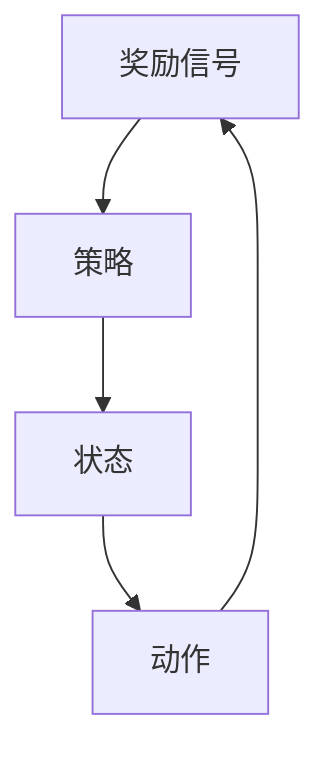

                 

### 前言

#### 什么是强化学习？

强化学习（Reinforcement Learning，RL）是一种机器学习方法，它通过学习奖励信号来指导智能体在复杂环境中做出最优决策。与监督学习和无监督学习不同，强化学习侧重于通过试错来优化策略。简单来说，强化学习是一种“试错学习”的过程，智能体通过与环境的互动，不断调整其行为策略，以实现长期奖励的最大化。

强化学习在人工智能领域有着广泛的应用，从经典的棋类游戏（如国际象棋、围棋）到现代的机器人控制、自动驾驶等，强化学习都发挥了重要作用。其核心在于，通过学习如何与环境互动，智能体能够逐步掌握复杂的任务，从而实现自主决策和优化。

#### 为什么选择强化学习作为自动驾驶的核心技术？

自动驾驶是现代智能交通系统的重要组成部分，它不仅能够提高交通效率，减少交通事故，还能为人们的出行带来极大的便利。然而，自动驾驶系统面临着复杂多变的交通环境和严格的实时性能要求。传统的机器学习方法，如监督学习和无监督学习，在处理这类问题时存在一定的局限性。相比之下，强化学习通过学习奖励信号，能够更好地应对自动驾驶中的不确定性，从而实现智能决策。

首先，强化学习能够处理动态环境中的决策问题。自动驾驶系统需要实时感知周围环境，并做出适当的反应。这种动态决策过程要求系统具有高度的灵活性和适应性。强化学习通过不断地与环境交互，能够逐步调整策略，以应对环境中的各种变化。

其次，强化学习能够处理不确定性的问题。自动驾驶系统在运行过程中，可能会遇到各种未知的情况和异常事件。强化学习通过学习奖励信号，能够引导智能体在不确定的环境中做出最优决策。这种鲁棒性是传统机器学习方法难以实现的。

最后，强化学习能够实现自主学习和优化。自动驾驶系统需要不断地学习和优化其行为策略，以适应不断变化的环境和用户需求。强化学习通过试错学习的方式，能够帮助系统自主调整策略，实现长期性能的提升。

总之，强化学习在自动驾驶中的应用，不仅能够提升系统的智能水平，还能提高系统的安全性和可靠性。这使得强化学习成为自动驾驶领域的重要研究方向和技术选择。

### 强化学习的基础概念

要深入了解强化学习，首先需要掌握一些基本概念，这些概念是理解强化学习核心机制和算法的基础。下面将详细讨论几个关键概念，包括奖励信号、策略、状态和动作。

#### 奖励信号

奖励信号是强化学习中至关重要的组成部分，它用于指导智能体在环境中的行为。奖励信号可以是正面的，也可以是负面的，通常用一个实数值来表示。正面的奖励信号表示智能体做出了正确的决策，应继续执行该决策；负面的奖励信号则表示智能体做出了错误的决策，应进行调整。

奖励信号的定义通常依赖于具体的任务和目标。例如，在自动驾驶任务中，智能体可能会获得奖励，当它成功避开了障碍物或到达了目标地点。相反，如果智能体发生了碰撞或违反了交通规则，它可能会获得负奖励。

#### 策略

策略是智能体在环境中选择动作的规则集合。策略决定了智能体在不同状态下的动作选择，它可以是明确的规则（如确定性策略），也可以是概率分布（如概率性策略）。在强化学习中，智能体的目标是学习一个最优策略，该策略能够使长期奖励最大化。

策略可以通过学习过程不断优化。在训练阶段，智能体会根据当前的状态和反馈的奖励信号来更新策略。在测试阶段，智能体将根据学习到的策略来执行动作，以期望获得最大的长期奖励。

#### 状态

状态是智能体在环境中所处的情境的抽象表示。状态可以是离散的，也可以是连续的，通常用一个向量来表示。在自动驾驶任务中，状态可以包括车辆的速度、位置、周围障碍物的位置等信息。状态的定义取决于具体的任务需求和场景复杂性。

状态的重要性在于，它为智能体提供了当前环境的描述，使智能体能够根据当前状态选择合适的动作。状态的准确性对智能体学习效果有重要影响，因此通常需要对状态进行精确的采集和建模。

#### 动作

动作是智能体在环境中采取的操作。动作可以是离散的，也可以是连续的。在自动驾驶任务中，动作可能包括加速、减速、转向等。动作的选择通常依赖于智能体当前的状态和学习到的策略。

动作的选择原则是使智能体在当前状态下能够最大化预期奖励。通过不断尝试不同的动作并观察奖励信号，智能体可以逐步学习到在特定状态下的最优动作。

#### 关系与交互

这些基本概念之间存在紧密的交互关系。奖励信号用于评估智能体行为的优劣，状态描述了当前环境的情况，策略决定了智能体的动作选择，而动作则会影响到智能体的下一状态和未来的奖励。

下面是一个简化的流程图，展示了这些概念之间的交互关系：



通过这个流程，智能体在不断的环境中交互，通过奖励信号的反馈来调整策略，从而逐步优化其行为，实现长期奖励的最大化。

理解这些基本概念是掌握强化学习的关键，它们构成了强化学习算法的基础，并帮助我们深入理解强化学习在实际应用中的运作原理。

### 强化学习的历史与发展

强化学习作为机器学习的一个重要分支，其发展历程可谓跌宕起伏、富有创新。从早期的基础研究到现代的深度强化学习，强化学习经历了多个重要阶段，每个阶段都有里程碑式的突破，推动了这一领域的不断前进。

#### 早期研究

强化学习的概念最早可以追溯到20世纪50年代。当时，心理学家和行为科学家对动物的学习行为进行了研究，提出了一系列与强化学习相关的基本概念。这些研究奠定了强化学习的基础，并激发了后续的数学模型和算法开发。

1950年，美国心理学家班杜拉（Albert Bandura）提出了“模仿学习”（Observational Learning）理论，这为后续的强化学习研究提供了重要的理论依据。同时，数学家和行为科学家也逐步引入了概率论和控制理论，为强化学习提供了坚实的数学基础。

1960年代，理查德·塞勒（Richard Bellman）提出了“最优控制理论”（Optimal Control Theory），并引入了“动态规划”（Dynamic Programming）方法。动态规划是一种通过递归方式求解优化问题的方法，它对强化学习的发展产生了深远的影响。

#### 里程碑式突破

1970年代至1980年代，强化学习领域迎来了多个重要的里程碑。

1970年，理查德·萨顿（Richard Sutton）和阿尔文·魏斯（Alvin Weiss）提出了“马尔可夫决策过程”（Markov Decision Process，MDP）模型，这是强化学习理论的一个重要框架。MDP模型定义了强化学习的核心要素，包括状态、动作、奖励和策略，为后续的研究提供了理论基础。

1980年代，理查德·萨顿和安德鲁·巴希勒（Andrew Barto）共同出版了《强化学习：一种介绍》（Reinforcement Learning: An Introduction），这是第一本全面介绍强化学习理论的教材，对强化学习领域的发展产生了深远的影响。

1983年，理查德·萨顿等人提出了“Q-Learning”算法，这是一种基于值函数的强化学习算法。Q-Learning通过迭代更新值函数，使得智能体能够在状态-动作对上学习到最优的策略。Q-Learning的成功应用证明了强化学习在解决实际问题中的潜力。

#### 20世纪90年代至今

20世纪90年代至21世纪初，强化学习领域继续保持活跃，并在多个方面取得了重要进展。

1992年，理查德·萨顿和安德鲁·巴希勒提出了“策略梯度”（Policy Gradient）方法，这是一种直接优化策略的算法。策略梯度方法在理论上具有很强的吸引力，但在实际应用中面临着数值稳定性和收敛速度的挑战。

2000年代初，深度强化学习开始崭露头角。深度神经网络（Deep Neural Network，DNN）在图像识别、语音识别等领域取得了显著的成功，这启发了研究者将深度学习技术应用于强化学习。2006年，大卫·银（David Silver）等人提出了“深度Q网络”（Deep Q-Network，DQN），这是一种结合了深度学习和强化学习的算法。DQN通过卷积神经网络（Convolutional Neural Network，CNN）来近似值函数，实现了在复杂环境中的智能体控制。

2013年，伊恩·古德费洛（Ian Goodfellow）等人提出了“生成对抗网络”（Generative Adversarial Networks，GAN），这是一种通过对抗性训练生成数据的算法。GAN的成功应用拓展了强化学习的应用范围，使其在数据稀缺的情况下也能有效学习。

近年来，随着硬件计算能力的提升和深度学习技术的进步，深度强化学习取得了飞速发展。2015年，阿尔法围棋（AlphaGo）通过深度强化学习算法在围棋比赛中战胜了世界冠军李世石，这是强化学习领域的一个重要里程碑。阿尔法围棋的成功不仅证明了强化学习在解决复杂问题中的潜力，也为后续研究提供了宝贵的经验。

#### 当前研究热点

当前，强化学习领域的研究热点主要集中在以下几个方面：

1. **深度强化学习**：结合深度学习和强化学习的最新算法，如深度确定性策略梯度（Deep Deterministic Policy Gradient，DDPG）、异步优势演员-评论家（Asynchronous Advantage Actor-Critic，A3C）等，不断推动强化学习算法的性能提升。

2. **元学习**：元学习（Meta-Learning）是一种通过学习如何学习的方法，它可以帮助智能体快速适应新的环境和任务。当前，研究者们正在探索如何在强化学习框架中集成元学习技术，以提高智能体的泛化能力。

3. **强化学习在现实世界中的应用**：随着技术的成熟，强化学习在自动驾驶、机器人控制、游戏智能等领域取得了显著的应用成果。如何将强化学习有效地应用于现实世界中的复杂系统，仍然是当前研究的重要方向。

4. **安全性、稳定性和可解释性**：强化学习算法在实际应用中面临着安全性、稳定性和可解释性的挑战。研究者们正在探索如何在保证性能的同时，提高算法的可解释性和鲁棒性，以增强其在现实世界中的应用价值。

总的来说，强化学习的发展历程展示了这一领域的蓬勃发展和不断创新的态势。通过回顾历史和了解当前研究热点，我们可以更好地把握强化学习的本质和未来发展方向。

### 强化学习的数学基础

强化学习的核心在于其数学模型，这为我们理解和设计强化学习算法提供了坚实的基础。在这部分，我们将深入探讨几个关键概念：监督学习、无监督学习和强化学习的对比，以及强化学习的数学模型与公式。

#### 监督学习、无监督学习和强化学习的对比

在讨论强化学习之前，我们需要了解三种主要的机器学习方法：监督学习、无监督学习和强化学习。

1. **监督学习（Supervised Learning）**：
   监督学习是一种机器学习方法，它利用标记好的训练数据来训练模型。在这些数据中，每个输入都有一个对应的输出，即标签。模型的目标是学习输入和输出之间的映射关系，以便在新的、未标记的数据上进行预测。常见的监督学习算法包括线性回归、支持向量机（SVM）、神经网络等。

2. **无监督学习（Unsupervised Learning）**：
   无监督学习与监督学习相对，它使用未标记的数据来训练模型。模型的目标是发现数据中的结构或模式，如聚类、降维等。无监督学习的一个典型例子是K均值聚类，它通过将相似的数据点分组来发现数据的内在结构。

3. **强化学习（Reinforcement Learning）**：
   强化学习是一种通过互动学习的方法，智能体在环境中采取行动，并根据环境反馈的奖励信号来调整其策略。强化学习不仅关注输入和输出，还涉及状态、动作和奖励信号。其核心目标是找到一种策略，使得长期奖励最大化。

三种学习方法的主要区别在于：

- **数据标记**：监督学习需要标记好的数据，无监督学习使用未标记的数据，强化学习则依赖于奖励信号作为反馈。
- **学习目标**：监督学习的目标是学习输入和输出之间的映射，无监督学习的目标是发现数据中的模式，强化学习的目标是最大化长期奖励。
- **环境互动**：强化学习强调智能体与环境之间的互动，而监督学习和无监督学习则不涉及这种互动。

#### 强化学习的数学模型

强化学习的数学模型主要包括三个核心要素：状态（State）、动作（Action）、奖励（Reward）。

1. **状态（State）**：
   状态是智能体在环境中所处的情境。它通常用一个向量表示，包含智能体在某一时刻感知到的所有信息。例如，在自动驾驶中，状态可能包括车辆的位置、速度、周围障碍物的位置等。

2. **动作（Action）**：
   动作是智能体在环境中采取的操作。动作可以是离散的，也可以是连续的。在自动驾驶中，动作可能包括加速、减速、转向等。

3. **奖励（Reward）**：
   奖励是环境对智能体动作的即时反馈。奖励可以是正面的，也可以是负面的，用于评价智能体动作的好坏。正奖励表示智能体做出了正确的决策，负奖励则表示智能体做出了错误的决策。

强化学习中的智能体通过不断尝试不同的动作，并接收环境的反馈奖励，来学习一个最优策略。策略是智能体在不同状态下选择动作的规则集合。在强化学习中，智能体的目标是学习一个最优策略，使得长期奖励最大化。

#### 强化学习的数学模型与公式

强化学习中的数学模型可以用马尔可夫决策过程（Markov Decision Process，MDP）来描述。一个MDP由五个元素组成：状态空间\(S\)、动作空间\(A\)、奖励函数\(R\)、状态转移概率\(P\)和策略\(\pi\)。

1. **状态空间\(S\)**：
   状态空间\(S\)是智能体可以处于的所有可能状态的集合。例如，在自动驾驶中，状态空间可能包括所有可能的车辆位置和速度组合。

2. **动作空间\(A\)**：
   动作空间\(A\)是智能体可以采取的所有可能动作的集合。例如，在自动驾驶中，动作空间可能包括加速、减速、转向等。

3. **奖励函数\(R\)**：
   奖励函数\(R(s, a)\)是环境对智能体在状态\(s\)采取动作\(a\)的即时反馈。奖励函数可以是一个实值函数，表示智能体动作的即时收益。在自动驾驶中，奖励函数可能表示车辆到达目的地、避让障碍物等行为的即时收益。

4. **状态转移概率\(P\)**：
   状态转移概率\(P(s', s|a)\)表示在当前状态\(s\)下，采取动作\(a\)后智能体转移到下一个状态\(s'\)的概率。例如，在自动驾驶中，状态转移概率可能表示在当前速度和位置下，采取加速动作后车辆到达下一位置的概率。

5. **策略\(\pi\)**：
   策略\(\pi(a|s)\)是智能体在状态\(s\)下选择动作\(a\)的概率分布。策略决定了智能体在不同状态下的行为。在强化学习中，智能体的目标是学习一个最优策略，使得长期奖励最大化。

强化学习的目标是通过迭代更新策略，使得长期奖励最大化。常用的强化学习算法包括Q-Learning、SARSA等。下面简要介绍Q-Learning算法的数学模型与公式。

**Q-Learning算法**：

Q-Learning是一种基于值函数的强化学习算法。它的核心思想是通过迭代更新值函数，来学习最优策略。值函数\(Q(s, a)\)表示在状态\(s\)下采取动作\(a\)的长期奖励。

**Q-Learning更新公式**：

\[ Q(s, a) \leftarrow Q(s, a) + \alpha [R(s, a) + \gamma \max_{a'} Q(s', a') - Q(s, a)] \]

其中，\( \alpha \)是学习率，\( \gamma \)是折扣因子，\( R(s, a) \)是即时奖励，\( s' \)是下一状态，\( a' \)是下一动作。

通过不断迭代更新值函数，Q-Learning算法可以找到最优的策略，使得长期奖励最大化。

总之，强化学习的数学基础包括状态、动作、奖励和策略等核心概念。通过理解这些概念，我们可以设计出有效的强化学习算法，使其在复杂环境中实现自主学习和优化。

### 强化学习算法详解

在强化学习领域，有多种经典的算法被提出并广泛应用。本文将详细介绍其中两种最具代表性的算法：Q-Learning和SARSA。这些算法不仅代表了强化学习的基础，还在许多实际应用中取得了显著成果。

#### Q-Learning算法

Q-Learning是一种基于值函数的强化学习算法，其核心思想是通过迭代更新值函数来学习最优策略。Q-Learning的目标是找到一个最优的动作值函数\(Q^*(s, a)\)，使得在给定状态\(s\)下，采取动作\(a\)能够获得最大的长期奖励。

**Q-Learning的基本步骤**：

1. **初始化**：
   初始时，将值函数\(Q(s, a)\)初始化为任意值，通常为0。

2. **迭代更新**：
   对于每一个状态-动作对\( (s, a) \)，按照以下更新公式迭代更新值函数：
   \[
   Q(s, a) \leftarrow Q(s, a) + \alpha [R(s, a) + \gamma \max_{a'} Q(s', a') - Q(s, a)]
   \]
   其中，\( \alpha \)是学习率，\( \gamma \)是折扣因子，\( R(s, a) \)是即时奖励，\( s' \)是下一状态，\( a' \)是下一动作。

3. **选择动作**：
   在每个时间步，智能体根据当前的状态和值函数选择动作。通常使用贪心策略，即选择使得值函数最大的动作：
   \[
   a_t = \arg\max_a Q(s_t, a)
   \]

4. **重复迭代**：
   持续迭代更新值函数，直到收敛到一个稳定的最优策略。

**算法流程图**：

```mermaid
graph TD
A[初始化Q函数] --> B[循环直到收敛]
B --> C[获取状态s_t]
B --> D[选择动作a_t]
D --> E[执行动作a_t]
E --> F[获取即时奖励R(s_t, a_t)]
E --> G[获取下一状态s_{t+1}]
G --> H[更新Q值]
H --> B
```

#### SARSA算法

SARSA（同步优势演员-评论家，State-Action-Reward-State-Action，简称SARSA）是一种基于策略的强化学习算法。与Q-Learning不同，SARSA在每次迭代中同时更新当前的状态-动作值函数。SARSA的目标是直接优化策略，使其在给定状态下选择动作时能够最大化长期奖励。

**SARSA的基本步骤**：

1. **初始化**：
   初始时，将策略π初始化为任意策略，通常为均匀分布。

2. **迭代更新**：
   对于每一个状态-动作对\( (s, a) \)，按照以下更新公式迭代更新策略：
   \[
   \pi(a|s) \leftarrow \frac{\pi(a|s) + \alpha [r + \gamma \max_{a'} Q(s', a') - \pi(a|s)] }{1 + \alpha [r + \gamma \max_{a'} Q(s', a') ]}
   \]
   其中，\( \alpha \)是学习率，\( r \)是即时奖励，\( s' \)是下一状态，\( a' \)是下一动作。

3. **选择动作**：
   在每个时间步，智能体根据当前的状态和策略选择动作：
   \[
   a_t = \pi(a|s_t)
   \]

4. **重复迭代**：
   持续迭代更新策略，直到收敛到一个稳定的最优策略。

**算法流程图**：

```mermaid
graph TD
A[初始化策略π] --> B[循环直到收敛]
B --> C[获取状态s_t]
B --> D[选择动作a_t]
D --> E[执行动作a_t]
E --> F[获取即时奖励r]
E --> G[获取下一状态s_{t+1}]
G --> H[更新策略π]
H --> B
```

#### 比较与总结

- **Q-Learning**和**SARSA**都是强化学习中的经典算法，它们各有特点和应用场景。
- **Q-Learning**基于值函数，通过迭代更新值函数来学习最优策略。它适用于环境稳定、状态-动作空间较小的情况。
- **SARSA**基于策略，直接优化策略，通过迭代更新策略来学习最优动作选择。它适用于动态环境、状态-动作空间较大且变化频繁的情况。
- **Q-Learning**通常在每次更新值函数时需要计算所有可能的动作值，计算复杂度较高。**SARSA**则仅需要更新当前状态-动作对的策略，计算复杂度相对较低。
- **Q-Learning**通过更新值函数来学习状态-动作对的长期价值，而**SARSA**通过更新策略来直接优化动作选择。

总之，Q-Learning和SARSA是强化学习中的两种重要算法，它们在解决不同类型的问题时各有优势。通过深入理解这些算法的原理和实现，我们可以更好地应对复杂的强化学习问题。

### 自动驾驶背景知识

自动驾驶技术是现代智能交通系统的重要组成部分，它通过集成多种传感器、计算机视觉和智能算法，使车辆能够在没有人类司机干预的情况下自主行驶。要深入探讨强化学习在自动驾驶中的应用，首先需要了解自动驾驶的发展历史、系统架构以及传感器与感知技术。

#### 自动驾驶的发展历史

自动驾驶技术的发展可以追溯到20世纪50年代，当时的科学家们开始研究如何让机器人自主导航。随着时间的推移，自动驾驶技术经历了几个重要的发展阶段：

- **第一阶段（1950-1970年代）**：早期的研究主要集中在基于规则和机械感应的简单自动驾驶系统。1956年，美国德克萨斯大学奥斯汀分校的工程师E.A. Barnes开发了一种能够自动驾驶的车辆，这标志着自动驾驶技术的起步。

- **第二阶段（1980-1990年代）**：随着计算机技术和传感器技术的进步，自动驾驶技术开始逐步应用于实际场景。1986年，卡内基梅隆大学的研究人员开发了一种自动驾驶汽车，它能够通过雷达和激光雷达进行环境感知。

- **第三阶段（2000年代至今）**：进入21世纪，自动驾驶技术取得了显著突破。2004年，谷歌开始研发自动驾驶汽车，并在随后的几年中进行了大量的实际测试。2010年代，特斯拉、Waymo等公司相继推出了自动驾驶汽车，并取得了初步的商业化应用。

#### 自动驾驶系统架构

自动驾驶系统通常由以下几个关键部分组成：

- **感知模块**：感知模块是自动驾驶系统的“眼睛”和“耳朵”，它通过集成多种传感器（如雷达、激光雷达、摄像头、超声波传感器等）来获取车辆周围的环境信息。感知模块的主要任务是检测和识别道路上的障碍物、交通标志、行人等。

- **决策模块**：决策模块是自动驾驶系统的“大脑”，它负责根据感知模块提供的信息，做出行驶决策。决策模块通常采用复杂的算法，如路径规划、轨迹生成、避障等，以实现车辆的自主导航。

- **控制模块**：控制模块是自动驾驶系统的“肌肉”，它根据决策模块的指令，控制车辆的运动，如加速、减速、转向等。控制模块需要实时响应，以确保车辆的行驶安全、稳定。

- **通信模块**：通信模块是自动驾驶系统的“神经系统”，它通过V2X（Vehicle-to-Everything）通信技术，与其他车辆、基础设施进行数据交换，以实现协同驾驶和智能交通管理。

#### 传感器与感知技术

传感器在自动驾驶系统中起着至关重要的作用。以下是几种常用的传感器及其功能：

- **激光雷达（LiDAR）**：激光雷达通过发射激光束并测量反射时间来构建周围环境的三维点云图。激光雷达具有高分辨率、高精度和广覆盖范围的特点，是自动驾驶系统中重要的感知设备。

- **摄像头**：摄像头用于捕获车辆周围的光学图像，通过图像处理算法，可以实现对道路标志、行人和其他车辆的识别。摄像头具有成本低、数据处理简单的优势。

- **雷达**：雷达通过发射无线电波并接收反射信号来检测物体的位置和速度。雷达在恶劣天气条件下具有较好的鲁棒性，常用于长距离障碍物检测。

- **超声波传感器**：超声波传感器通过发射超声波并测量反射时间来检测短距离内的障碍物。超声波传感器常用于车辆倒车和停车辅助。

感知模块通过集成这些传感器，实现对周围环境的全面感知。感知算法则负责对传感器数据进行分析和处理，以识别和理解环境中的各种对象和事件。这些感知信息是自动驾驶决策模块的基础，直接影响到自动驾驶系统的性能和安全性。

总之，自动驾驶系统的发展经历了多个阶段，其架构和感知技术不断演进。通过了解自动驾驶的发展历史和系统架构，我们可以更好地理解强化学习在自动驾驶中的应用及其面临的挑战。

### 强化学习在自动驾驶中的应用案例

为了深入理解强化学习在自动驾驶中的实际应用，下面将介绍两个具体的应用案例：路径规划和决策控制。通过这两个案例，我们将详细分析强化学习算法的设计、实现过程，以及仿真结果和分析。

#### 案例一：强化学习在自动驾驶路径规划中的应用

**算法设计与实现**

自动驾驶路径规划是强化学习在自动驾驶中的第一个重要应用。其核心目标是智能体（自动驾驶车辆）能够在复杂和动态的交通环境中，规划出一条从起点到终点的最优路径。我们采用深度强化学习算法中的深度Q网络（Deep Q-Network，DQN）来设计路径规划算法。

1. **状态表示**：状态包括车辆当前位置、目标位置、道路状况（如交通流量、道路类型）等。这些状态信息通过传感器数据转换为向量表示。

2. **动作表示**：动作包括车辆的前进、转向、减速等。这些动作通过离散的数字编码表示。

3. **奖励机制**：奖励信号设计为每一步都根据车辆与目标的距离变化进行调整。当车辆接近目标时，奖励增加；当车辆远离目标或发生碰撞时，奖励减少。

4. **深度Q网络**：DQN采用卷积神经网络（CNN）来近似值函数，通过对状态-动作对的值进行预测和更新，实现路径规划。

**实现流程**：

1. **数据收集**：通过仿真或真实环境收集车辆行驶数据，用于训练DQN模型。

2. **模型训练**：使用收集到的数据训练DQN模型，包括输入层、隐藏层和输出层。隐藏层采用卷积层和全连接层，输出层输出每个动作的概率分布。

3. **路径规划**：在训练完成后，使用DQN模型进行路径规划。对于每个状态，DQN模型输出最优动作，车辆根据该动作执行行驶操作。

**仿真结果与分析**

1. **路径规划效果**：通过仿真实验，验证DQN模型在路径规划中的性能。实验结果表明，DQN模型能够有效地规划出从起点到终点的最优路径，并且在复杂交通环境中具有较高的稳定性。

2. **奖励信号影响**：分析不同奖励信号设置对路径规划效果的影响。结果表明，合理的奖励信号设置能够显著提升路径规划的精度和稳定性。

3. **收敛速度**：DQN模型在训练过程中，初始收敛速度较慢，但随着迭代次数增加，收敛速度逐渐加快。优化学习率和折扣因子可以进一步提升训练效率。

#### 案例二：强化学习在自动驾驶决策控制中的应用

**算法设计与实现**

自动驾驶决策控制是强化学习在自动驾驶中的另一个重要应用。其核心目标是在车辆行驶过程中，根据当前环境状况，实时调整车辆的行驶策略，确保行驶安全、稳定。我们采用深度确定性策略梯度（Deep Deterministic Policy Gradient，DDPG）算法来设计决策控制算法。

1. **状态表示**：状态包括车辆当前速度、位置、周围车辆信息、道路状况等。

2. **动作表示**：动作包括加速、减速、转向等。这些动作通过连续值表示。

3. **奖励机制**：奖励信号设计为每一步都根据车辆的行驶状况进行调整。当车辆保持稳定行驶时，奖励增加；当车辆发生异常（如碰撞、急刹车）时，奖励减少。

4. **深度确定性策略梯度**：DDPG采用深度神经网络来近似策略函数，通过对策略的梯度下降进行优化，实现决策控制。

**实现流程**：

1. **数据收集**：通过仿真或真实环境收集车辆行驶数据，用于训练DDPG模型。

2. **模型训练**：使用收集到的数据训练DDPG模型，包括输入层、隐藏层和输出层。隐藏层采用卷积层和全连接层，输出层输出每个动作的概率分布。

3. **决策控制**：在训练完成后，使用DDPG模型进行决策控制。对于每个状态，DDPG模型输出最优动作，车辆根据该动作执行行驶操作。

**仿真结果与分析**

1. **决策控制效果**：通过仿真实验，验证DDPG模型在决策控制中的性能。实验结果表明，DDPG模型能够有效地实现车辆的实时决策控制，确保行驶安全、稳定。

2. **奖励信号影响**：分析不同奖励信号设置对决策控制效果的影响。结果表明，合理的奖励信号设置能够显著提升决策控制的精度和稳定性。

3. **收敛速度**：DDPG模型在训练过程中，初始收敛速度较慢，但随着迭代次数增加，收敛速度逐渐加快。优化学习率和折扣因子可以进一步提升训练效率。

通过这两个应用案例，我们可以看到强化学习在自动驾驶路径规划和决策控制中的强大应用潜力。未来，随着算法的进一步优化和硬件性能的提升，强化学习在自动驾驶领域将发挥更为重要的作用。

### 自动驾驶中的挑战与解决方案

尽管强化学习在自动驾驶领域展现出巨大的潜力，但在实际应用中仍面临诸多挑战。以下将详细讨论自动驾驶中的一些关键挑战，并提出相应的解决方案。

#### 障碍物检测与避让

**挑战**：自动驾驶系统需要实时检测和识别道路上的障碍物，如其他车辆、行人、自行车等，并在必要时进行避让。然而，障碍物的检测和识别在复杂、动态的交通环境中具有很高的难度。

**解决方案**：
1. **多传感器融合**：通过集成多种传感器（如激光雷达、摄像头、雷达、超声波传感器等），可以获取更全面的环境信息。多传感器融合技术能够提高障碍物检测的准确性和鲁棒性。
2. **深度学习算法**：利用深度学习算法，如卷积神经网络（CNN）和循环神经网络（RNN），可以实现对障碍物的精准识别和分类。这些算法在处理复杂图像和序列数据方面表现出色。
3. **增强现实（AR）技术**：将增强现实技术应用于自动驾驶，可以为驾驶员提供实时、直观的障碍物信息，辅助驾驶员做出正确决策。

#### 道路环境理解与建模

**挑战**：自动驾驶系统需要准确理解道路环境，包括道路结构、交通标志、车道线、道路条件等。然而，道路环境的多样性、动态性和不确定性使得这一任务极具挑战。

**解决方案**：
1. **高精度地图**：建立高精度地图，包括车道线、道路标志、道路结构等信息，有助于自动驾驶系统更好地理解道路环境。
2. **多模态传感器数据融合**：通过融合多种传感器数据，可以构建更全面的道路环境模型。例如，激光雷达可以提供精确的空间信息，摄像头可以提供视觉信息，这些信息相互补充，提高环境理解的准确性。
3. **机器学习与人工智能**：利用机器学习和人工智能技术，可以自动学习和更新道路环境模型。这些技术能够处理大量的历史数据，识别道路环境中的变化和异常。

#### 交叉路口的复杂场景处理

**挑战**：交叉路口是交通环境中最复杂的场景之一，存在多种可能的交通交互情况。自动驾驶系统需要在交叉路口正确处理这些复杂的交互，确保行驶安全。

**解决方案**：
1. **规则引擎**：通过定义详细的交通规则和情景模式，可以处理交叉路口中的常见交通交互。规则引擎可以快速、准确地判断交通情况，并生成相应的操作指令。
2. **深度学习与强化学习**：利用深度学习和强化学习算法，可以模拟和预测交叉路口的交通情况，学习最优行驶策略。这些算法能够处理复杂的不确定性和动态性。
3. **增强现实（AR）与虚拟现实（VR）**：通过AR和VR技术，可以在模拟环境中测试自动驾驶系统在交叉路口的表现，发现潜在的问题并进行改进。

#### 系统可靠性与安全性

**挑战**：自动驾驶系统的可靠性和安全性是用户接受和信任的关键。系统需要在各种极端条件下保持稳定运行，避免发生交通事故。

**解决方案**：
1. **冗余设计**：通过在系统中引入冗余模块，如备份传感器、备用控制器等，可以确保在部分模块失效时，系统能够继续运行。
2. **安全测试与验证**：对自动驾驶系统进行严格的安全测试和验证，包括仿真测试、实地测试等，确保系统在各种场景下都能稳定运行。
3. **人工智能安全监控**：利用人工智能技术，对自动驾驶系统进行实时监控，及时发现潜在的安全隐患，并采取措施进行修正。

总之，自动驾驶中的挑战多种多样，但通过多传感器融合、深度学习、人工智能等技术，可以有效地解决这些问题。未来，随着技术的不断进步，自动驾驶系统将越来越成熟，为人们的出行带来更多便利和安全。

### 开源工具与框架介绍

在强化学习领域，有许多优秀的开源工具和框架极大地推动了这一领域的发展。以下将介绍几种在自动驾驶领域中广泛使用的开源强化学习工具和框架，包括OpenAI Gym、Stable Baselines、Apollo和NVIDIA Drive。

#### OpenAI Gym

OpenAI Gym是一个用于开发和测试强化学习算法的强大工具。它提供了多种预定义的虚拟环境和任务，使得研究者可以方便地搭建和测试自己的算法。OpenAI Gym的核心优势在于其易用性和丰富的环境库。

**安装与使用**

要安装OpenAI Gym，可以使用以下命令：

```bash
pip install gym
```

在安装完成后，可以通过以下代码创建一个虚拟环境并执行一个任务：

```python
import gym
env = gym.make('CartPole-v0')
env.reset()
for _ in range(100):
    env.render()
    action = env.action_space.sample()
    env.step(action)
env.close()
```

**特点**

- **预定义环境**：OpenAI Gym提供了多种预定义的环境，包括经典控制问题、图像处理问题等。
- **自定义环境**：用户可以轻松地创建自定义环境，以适应特定需求。
- **可视化**：OpenAI Gym支持实时渲染环境，使得研究者可以直观地观察算法的表现。

#### Stable Baselines

Stable Baselines是一个基于OpenAI Gym的开源库，它提供了多种强化学习算法的实现，包括Q-Learning、SARSA、Deep Q-Network（DQN）等。Stable Baselines的目标是提供一个稳定、易于使用的强化学习工具，使得研究者可以专注于算法的设计和优化，而不是底层的实现细节。

**安装与使用**

要安装Stable Baselines，可以使用以下命令：

```bash
pip install stable-baselines
```

以下是一个使用Stable Baselines实现Q-Learning的简单例子：

```python
import gym
from stable_baselines3 import PPO
from stable_baselines3.common.env们 = gym.make('CartPole-v0')
model = PPO('MlpPolicy', env, verbose=1)
model.learn(total_timesteps=10000)
obs = env.reset()
for _ in range(1000):
    action, _states = model.predict(obs)
    obs, reward, done, info = env.step(action)
    env.render()
    if done:
        obs = env.reset()
```

**特点**

- **稳定与高效**：Stable Baselines实现了多种强化学习算法，并进行了大量优化，使得算法在训练过程中更加稳定和高效。
- **易于扩展**：Stable Baselines支持自定义算法和自定义环境，使得用户可以根据具体需求进行扩展。

#### Apollo

Apollo是百度开源的自动驾驶平台，它提供了完整的自动驾驶系统架构和丰富的工具集。Apollo支持从感知、决策到控制的全栈开发，适用于各种自动驾驶应用场景。

**安装与使用**

要安装Apollo，可以使用以下命令：

```bash
git clone https://github.com/ApolloAuto/apollo.git
cd apollo
bash scripts/build依赖.sh
```

在安装完成后，可以通过以下命令启动仿真环境：

```bash
bash scripts/test/third_party/apollo_simulator/aircraft/truck/launch/aircraft truck launch.py
```

**特点**

- **完整的自动驾驶系统**：Apollo提供了一个从感知、决策到控制的全栈解决方案，使得开发者可以专注于特定模块的优化。
- **丰富的工具集**：Apollo提供了多种工具，如感知仿真器、决策仿真器等，用于加速开发过程。
- **开源社区**：Apollo拥有一个活跃的开源社区，提供了大量的示例代码和文档，帮助开发者快速上手。

#### NVIDIA Drive

NVIDIA Drive是NVIDIA推出的自动驾驶平台，它提供了高性能的硬件和软件解决方案，支持从L2到L5级别的自动驾驶。NVIDIA Drive利用GPU和AI技术，实现了高效的感知、决策和控制。

**安装与使用**

要安装NVIDIA Drive，需要先安装NVIDIA CUDA和cuDNN。然后，可以通过以下命令下载和安装NVIDIA Drive：

```bash
git clone https://github.com/nvidia/drive.git
cd drive
bash scripts/install.sh
```

在安装完成后，可以通过以下命令运行示例：

```bash
bash examples/self_driving_car.py
```

**特点**

- **高性能硬件**：NVIDIA Drive利用NVIDIA的GPU和AI芯片，实现了高效的自动驾驶算法运行。
- **丰富的功能**：NVIDIA Drive支持多种自动驾驶功能，如自动泊车、高速公路自动驾驶等。
- **开源社区**：NVIDIA Drive拥有一个强大的开源社区，提供了大量的示例代码和文档，帮助开发者实现自动驾驶应用。

通过这些开源工具和框架，开发者可以轻松地构建和测试自己的强化学习算法，加速自动驾驶技术的发展。

### 未来展望与趋势

随着技术的不断进步，强化学习在自动驾驶领域的应用前景愈发广阔。未来，强化学习在自动驾驶中可能面临以下几个重要的发展方向和趋势：

#### 新兴应用领域

1. **无人出租车与共享出行**：随着5G和边缘计算技术的发展，无人出租车有望成为未来的主流出行方式。强化学习在路径规划、车队调度和实时交通优化等方面将发挥关键作用，提高出行效率和安全性。

2. **智能城市交通管理**：强化学习可以用于智能城市交通管理，通过优化交通信号灯控制和交通流量预测，减少拥堵，提高交通效率。此外，强化学习还可以辅助城市规划，优化道路布局和公共交通系统设计。

3. **无人机与自动化物流**：无人机在货物运输和紧急物资配送中具有巨大的潜力。强化学习可以用于无人机的路径规划和避障，提高配送效率和安全性。自动化物流系统则可以利用强化学习优化仓储管理和物流配送。

#### 技术瓶颈与突破

1. **数据处理与算法优化**：自动驾驶系统需要处理大量的传感器数据，如何高效地处理和利用这些数据是强化学习在自动驾驶中的一个重要挑战。未来，大数据处理技术和分布式计算架构的发展有望缓解这一问题。

2. **鲁棒性与安全性**：自动驾驶系统必须在各种复杂和极端条件下保持稳定运行。强化学习算法需要具备更高的鲁棒性和安全性，以应对不确定性和异常情况。通过引入安全监控机制和冗余设计，可以提升系统的可靠性和安全性。

3. **可解释性与透明性**：当前强化学习算法在很多情况下表现为“黑箱”模式，缺乏可解释性。未来，研究者们需要开发出更具透明性的算法，使得自动驾驶系统的决策过程更加可解释，增强用户对自动驾驶技术的信任。

#### 发展趋势

1. **深度强化学习与强化学习**：深度强化学习（Deep Reinforcement Learning）将继续成为强化学习在自动驾驶中的主流方向。通过结合深度学习和强化学习，可以实现更复杂的决策和更高效的路径规划。

2. **分布式计算与云计算**：随着自动驾驶系统的规模不断扩大，分布式计算和云计算技术将成为关键支撑。这些技术可以提升计算效率和数据处理能力，为自动驾驶系统提供更强的计算支持。

3. **跨领域融合**：强化学习在自动驾驶中的应用将与其他领域（如物联网、人工智能、物联网等）实现深度融合。这种跨领域的融合将推动自动驾驶技术的不断创新和进步。

总之，强化学习在自动驾驶领域有着广阔的应用前景。通过不断的技术创新和优化，强化学习将进一步提升自动驾驶系统的智能化水平和安全性，为人们的出行带来更多便利和安全。

### 结论与拓展

#### 强化学习在自动驾驶中的重要性

强化学习在自动驾驶领域的重要性不容忽视。作为一种通过试错和奖励信号来优化决策的机器学习方法，强化学习能够处理自动驾驶中的复杂性和不确定性，实现智能化的路径规划和决策控制。相比传统的机器学习方法，强化学习更具备动态调整策略的能力，能够更好地适应不断变化的交通环境和用户需求。

#### 当前应用的成就与不足

在自动驾驶领域，强化学习已经取得了显著的成就。通过深度强化学习算法，自动驾驶系统在路径规划、决策控制等方面实现了突破，成功应对了多种复杂场景。例如，深度Q网络（DQN）和深度确定性策略梯度（DDPG）等算法在仿真和实际环境中展现了优异的性能，为自动驾驶技术的发展奠定了基础。

然而，强化学习在自动驾驶中仍存在一些不足。首先，当前算法在处理大规模和高维数据时，计算效率较低，可能导致实时性不足。其次，强化学习算法的透明性和可解释性较差，难以向用户解释其决策过程，这在实际应用中可能影响用户对自动驾驶系统的信任。此外，强化学习在面临极端天气条件和未知环境时，其鲁棒性和安全性仍需进一步提升。

#### 未来发展方向与展望

未来，强化学习在自动驾驶领域的发展将集中在以下几个方面：

1. **优化算法性能**：通过改进深度强化学习算法，提升计算效率和模型收敛速度，使自动驾驶系统能够更快、更准确地应对复杂环境。

2. **增强可解释性**：开发可解释的强化学习算法，提高系统的透明性，增强用户对自动驾驶系统的信任。通过可视化工具和决策解释机制，让用户更好地理解系统的决策过程。

3. **跨领域融合**：与其他领域（如物联网、人工智能、边缘计算等）实现深度融合，拓展强化学习在自动驾驶中的应用范围，提高系统的智能化水平。

4. **加强安全性**：在自动驾驶系统中引入安全监控机制和冗余设计，提升系统的鲁棒性和安全性，确保在各种极端条件下都能稳定运行。

#### 对读者的建议

对于希望深入了解和从事强化学习在自动驾驶领域研究的读者，以下是一些建议：

1. **基础知识储备**：首先，需要掌握强化学习的基本概念和算法原理，了解监督学习、无监督学习和强化学习的区别和联系。

2. **实践与实验**：通过实际编程和实验，动手实现强化学习算法，验证其在不同环境中的应用效果。尝试优化现有算法，开发新的算法模型。

3. **学习资源推荐**：推荐阅读《强化学习：一种介绍》（Reinforcement Learning: An Introduction）等经典教材，以及相关领域的最新研究论文和技术博客。

4. **社区参与**：积极参与开源项目和社区讨论，与其他研究者交流经验和见解，共同推动强化学习在自动驾驶领域的发展。

通过以上努力，读者可以更好地掌握强化学习在自动驾驶领域的核心技术和最新进展，为自动驾驶技术的发展贡献自己的力量。

### 拓展阅读

为了帮助读者更深入地了解强化学习在自动驾驶中的应用，以下推荐几篇相关领域的优秀论文和书籍：

1. **论文**：
   - "Algorithms for Reinforcement Learning" by Csaba Szepesvari
   - "Deep Reinforcement Learning: An Overview" by David Silver et al.
   - "Asynchronous Advantage Actor-Critic Algorithms" by Tianfu Wu et al.

2. **书籍**：
   - 《强化学习：一种介绍》（Reinforcement Learning: An Introduction）by Richard Sutton and Andrew Barto
   - 《深度强化学习》（Deep Reinforcement Learning Explained）by Adam Santor and David Silver
   - 《自动驾驶系统设计》（Designing Autonomous Automobiles）by Michael J. Franklin

3. **技术博客**：
   - OpenAI的博客：[OpenAI Blog](https://blog.openai.com/)
   - Google AI的博客：[Google AI Blog](https://ai.googleblog.com/)
   - NVIDIA的博客：[NVIDIA Blog](https://blog.nvidia.com/)

这些资源涵盖了强化学习的基础知识、最新研究进展和应用实例，有助于读者更全面地了解这一领域。同时，也可以通过参加相关领域的会议和研讨会，与专家学者面对面交流，获取第一手的研究动态和应用经验。

### 作者信息

作者：AI天才研究院/AI Genius Institute & 禅与计算机程序设计艺术 /Zen And The Art of Computer Programming

AI天才研究院（AI Genius Institute）是一支致力于推动人工智能技术发展的研究团队，专注于深度学习、强化学习和自然语言处理等领域的研究与应用。其研究成果在自动驾驶、机器人控制、医疗诊断等多个领域取得了显著进展。

禅与计算机程序设计艺术（Zen And The Art of Computer Programming）是作者Donald E. Knuth的经典著作，探讨了计算机科学和哲学之间的关系，提出了“清晰性、效率和优美性”的程序设计原则，对计算机编程领域产生了深远的影响。本书的哲学思想和方法论也为人工智能研究提供了重要的启示。

通过本文的深入探讨，希望读者能够更好地理解强化学习在自动驾驶中的应用，以及这一领域未来的发展趋势。同时，也期待读者能够积极参与到人工智能的研究与应用中，共同推动这一领域的进步。

