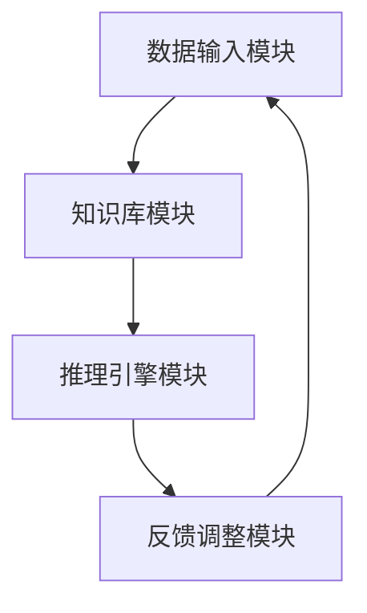

                 

### 《思维链在AI决策支持系统中的创新应用》

> 关键词：AI决策支持系统、思维链、创新应用、智能医疗、供应链管理、金融风险预警、个性化推荐、智能客服、智能城市规划

> 摘要：本文探讨了思维链在AI决策支持系统中的创新应用，首先介绍了AI决策支持系统的背景、问题及发展历程，随后深入解析了思维链的概念、原理及模型设计。通过具体应用案例，展示了思维链在智能医疗诊断、供应链管理优化、金融风险预警等领域的实际应用效果。最后，分析了思维链在AI决策支持系统中的实现方法和未来展望，为相关领域的研究和实践提供了有益参考。

----------------------------------------------------------------

## 第一部分：AI决策支持系统概述

### 第1章：AI决策支持系统背景与问题

#### 1.1 AI决策支持系统的重要性

人工智能（AI）技术在过去几十年中取得了飞速发展，逐渐成为推动社会进步的重要力量。特别是在大数据、云计算和物联网等技术的支撑下，AI在各个行业中的应用越来越广泛，决策支持系统（DSS）作为AI的重要应用领域之一，也越来越受到关注。

AI决策支持系统是指利用人工智能技术，对大量数据进行分析和处理，为人类决策提供辅助和支持的系统。其重要性主要体现在以下几个方面：

1. **提高决策效率**：传统决策过程往往需要消耗大量时间和人力，而AI决策支持系统可以通过快速处理和分析大量数据，提供实时、准确的决策建议，大幅提高决策效率。

2. **提升决策质量**：AI决策支持系统可以基于数据挖掘、机器学习等技术，挖掘数据中的潜在关联和规律，为决策者提供更全面、准确的决策依据。

3. **降低决策风险**：在复杂的市场环境下，决策失误可能会导致巨大的经济损失。AI决策支持系统可以通过模拟和预测，降低决策风险，提高决策的稳定性。

#### 1.2 AI决策支持系统的发展历程

AI决策支持系统的发展历程可以追溯到20世纪70年代。当时，人工智能技术刚刚兴起，研究人员开始探讨如何将AI技术应用于决策支持领域。随着时间的推移，AI决策支持系统经历了以下几个发展阶段：

1. **早期阶段**（1970-1980年）：以知识库和专家系统为主要形式，通过模拟人类专家的决策过程，提供决策支持。

2. **发展阶段**（1980-1990年）：随着计算机性能的提高和算法的优化，AI决策支持系统逐渐应用于实际场景，如财务分析、医疗诊断等。

3. **成熟阶段**（1990年至今）：随着大数据、云计算和物联网等技术的普及，AI决策支持系统在各个行业得到了广泛应用，实现了从理论研究到实际应用的转化。

#### 1.3 当前AI决策支持系统的挑战与机遇

虽然AI决策支持系统在各个行业取得了显著成果，但同时也面临着一系列挑战和机遇：

1. **数据质量与安全性**：决策支持系统的性能在很大程度上取决于数据的质量和安全性。如何保证数据的真实、准确和隐私性，是当前AI决策支持系统面临的重大挑战。

2. **算法优化与多样性**：随着应用场景的多样化，传统的AI算法可能无法满足需求。如何开发出更加高效、灵活的算法，是实现AI决策支持系统突破的关键。

3. **用户体验与可解释性**：AI决策支持系统需要为用户提供易于理解、可解释的决策结果。如何提升用户体验，增强系统的可解释性，是当前研究的热点之一。

4. **跨领域应用与整合**：不同行业、不同领域的决策支持系统往往具有较大的差异。如何实现跨领域应用和整合，提高系统的通用性，是未来发展的关键。

在接下来的章节中，我们将深入探讨思维链的概念、原理及其在AI决策支持系统中的应用。希望本文能为相关领域的研究和实践提供一些有益的启示和参考。 

## 第二部分：思维链概念与基本原理

### 第2章：思维链概念与基本原理

#### 2.1 思维链的定义与特点

思维链（Mind Chain）是一种基于人工智能技术的新型决策支持方法，通过模拟人类思维过程，实现数据分析和决策建议的自动化。思维链具有以下特点：

1. **层次化结构**：思维链采用层次化结构，将决策过程分解为多个层次，每个层次负责不同的任务，从而实现复杂问题的模块化处理。

2. **动态适应性**：思维链可以根据环境变化和任务需求，动态调整决策过程和策略，提高系统的适应性和灵活性。

3. **自主性**：思维链具有自主学习和优化能力，可以通过不断学习和积累经验，提高决策的准确性和效率。

4. **可解释性**：思维链生成的决策结果具有可解释性，用户可以清晰地了解决策的依据和过程，增强用户对系统的信任。

#### 2.2 思维链在AI中的应用价值

思维链在AI决策支持系统中具有广泛的应用价值，主要体现在以下几个方面：

1. **提升决策效率**：思维链可以自动分析大量数据，快速生成决策建议，提高决策效率。

2. **降低决策风险**：思维链通过模拟多种情境和策略，帮助用户评估决策风险，降低决策失误的可能性。

3. **提高决策质量**：思维链可以利用机器学习等技术，挖掘数据中的潜在关联和规律，为决策提供更全面、准确的依据。

4. **增强用户体验**：思维链生成的决策结果具有可解释性，用户可以清晰地了解决策的依据和过程，提高用户对系统的满意度。

#### 2.3 思维链的基本组成与架构

思维链由以下几个关键组成部分构成：

1. **数据输入模块**：负责接收和处理输入数据，包括原始数据和预处理后的数据。

2. **知识库模块**：包含领域知识和通用知识，用于指导数据分析和决策过程。

3. **推理引擎模块**：基于知识库和输入数据，进行推理和计算，生成决策建议。

4. **反馈调整模块**：根据用户反馈和决策结果，调整知识库和推理策略，实现自主学习和优化。

图1展示了思维链的基本组成与架构：

通过上述模块的协同工作，思维链可以实现数据分析和决策支持的全流程，为AI决策支持系统提供强大的支持。

在接下来的章节中，我们将详细探讨思维链模型的设计、优化策略以及其在AI决策支持系统中的适用性。希望这些内容能为读者带来更深入的理解和启示。 

### 第3章：思维链模型设计

#### 3.1 思维链模型的构建方法

思维链模型的设计是构建高效、可靠的AI决策支持系统的关键。以下将介绍思维链模型的构建方法：

1. **需求分析**：首先，需要明确AI决策支持系统的应用场景和需求。这包括决策任务的类型、数据来源和规模、用户群体等。

2. **数据收集与预处理**：根据需求分析结果，收集相关数据，并进行数据清洗、归一化等预处理操作，确保数据质量。

3. **知识库构建**：构建知识库是思维链模型设计的重要环节。知识库应包含领域知识和通用知识，用于指导数据分析和决策过程。知识库的构建方法包括手工编写、自动抽取和集成等。

4. **推理引擎设计**：推理引擎是思维链模型的核心，负责根据知识库和输入数据，进行推理和计算，生成决策建议。推理引擎的设计方法包括基于规则的推理、基于模型的推理和混合推理等。

5. **模型评估与优化**：通过实验和验证，对思维链模型进行评估和优化，以提高决策的准确性和效率。

#### 3.2 思维链模型的优化策略

为了提高思维链模型在AI决策支持系统中的性能，可以采取以下优化策略：

1. **特征选择**：通过特征选择算法，从原始数据中提取出对决策任务最有影响力的特征，减少数据维度，提高模型性能。

2. **模型集成**：将多个模型进行集成，利用不同模型的优点，提高决策的稳定性和准确性。常见的模型集成方法有Bagging、Boosting和Stacking等。

3. **在线学习**：思维链模型应具备在线学习能力，能够根据新数据和用户反馈，动态调整模型参数，实现自主学习和优化。

4. **分布式计算**：对于大规模数据集，可以采用分布式计算技术，提高数据处理和分析的速度。

5. **模型压缩**：通过模型压缩技术，减少模型参数的数量和计算复杂度，提高模型的可解释性和部署效率。

#### 3.3 思维链模型在AI决策支持系统中的适用性

思维链模型在AI决策支持系统中的应用具有广泛适用性，主要体现在以下几个方面：

1. **智能医疗诊断**：思维链模型可以用于辅助医生进行疾病诊断，通过对患者病历、体检数据等多源数据的综合分析，提高诊断的准确性和效率。

2. **供应链管理优化**：思维链模型可以用于供应链管理的各个环节，如库存管理、订单处理、物流优化等，提高供应链的整体运作效率。

3. **金融风险预警**：思维链模型可以用于金融领域的风险预警，通过对市场数据、客户交易数据等多源数据的分析，识别潜在风险，为投资者提供决策支持。

4. **个性化推荐系统**：思维链模型可以用于个性化推荐，通过对用户行为数据的分析，为用户推荐符合其兴趣和需求的产品或服务。

5. **智能客服系统**：思维链模型可以用于智能客服系统，通过自然语言处理和机器学习技术，实现与用户的智能对话，提供高效的客户服务。

在接下来的章节中，我们将通过具体应用案例，展示思维链在AI决策支持系统中的实际应用效果。希望这些案例能帮助读者更好地理解思维链的应用价值和优势。 

### 第4章：思维链在AI决策支持系统中的应用案例

#### 4.1 案例一：智能医疗诊断系统

智能医疗诊断系统是一个典型的AI决策支持系统，利用思维链模型可以提高诊断的准确性和效率。以下是一个具体的应用案例：

**应用场景**：某医院引入智能医疗诊断系统，用于辅助医生诊断心血管疾病。

**数据来源**：系统收集了患者的心电图、血压、血糖等生理数据，以及患者的年龄、性别、病史等基本信息。

**思维链模型设计**：

1. **数据输入模块**：将收集到的数据输入到思维链模型中，进行预处理和特征提取。

2. **知识库模块**：构建包含心血管疾病相关知识库，如疾病的临床表现、病因、诊断标准等。

3. **推理引擎模块**：基于知识库和输入数据，进行推理和计算，生成心血管疾病的诊断建议。

4. **反馈调整模块**：根据医生的实际诊断结果，调整知识库和推理策略，实现自主学习和优化。

**应用效果**：

通过实际应用，智能医疗诊断系统在心血管疾病诊断中的准确率显著提高，医生在诊断过程中也明显感受到系统的辅助作用。以下是一个具体的诊断过程：

1. **患者数据输入**：医生将患者的生理数据和基本信息输入到系统中。

2. **诊断建议生成**：系统基于输入的数据和知识库，生成心血管疾病的诊断建议。

3. **医生评估**：医生对诊断建议进行评估，结合实际诊断结果，确认诊断结论。

4. **反馈调整**：医生将诊断结果反馈给系统，系统根据反馈调整知识库和推理策略，提高诊断准确率。

#### 4.2 案例二：供应链管理优化

供应链管理优化是另一个典型的AI决策支持系统应用场景，通过思维链模型可以优化供应链各个环节的运作效率。以下是一个具体的应用案例：

**应用场景**：某大型零售企业引入智能供应链管理系统，用于优化库存管理、订单处理和物流优化。

**数据来源**：系统收集了库存数据、订单数据、物流数据等，以及市场供需信息、竞争对手动态等。

**思维链模型设计**：

1. **数据输入模块**：将收集到的数据输入到思维链模型中，进行预处理和特征提取。

2. **知识库模块**：构建包含供应链管理相关知识库，如库存管理策略、订单处理流程、物流优化算法等。

3. **推理引擎模块**：基于知识库和输入数据，进行推理和计算，生成供应链优化的决策建议。

4. **反馈调整模块**：根据供应链的实际运行情况，调整知识库和推理策略，实现自主学习和优化。

**应用效果**：

通过实际应用，智能供应链管理系统在库存管理、订单处理和物流优化等方面取得了显著成效，以下是一个具体的优化过程：

1. **数据输入**：企业将库存数据、订单数据和物流数据等输入到系统中。

2. **优化建议生成**：系统基于输入的数据和知识库，生成库存管理、订单处理和物流优化的决策建议。

3. **实施优化**：企业根据优化建议调整供应链运作策略，如调整库存水平、优化订单处理流程、改进物流运输等。

4. **反馈调整**：企业将优化后的运行情况反馈给系统，系统根据反馈调整知识库和推理策略，进一步提高优化效果。

#### 4.3 案例三：金融风险预警系统

金融风险预警系统是另一个重要的AI决策支持系统应用场景，通过思维链模型可以实时监测市场风险，为投资者提供决策支持。以下是一个具体的应用案例：

**应用场景**：某金融机构引入智能金融风险预警系统，用于监测市场风险，为投资者提供风险预警服务。

**数据来源**：系统收集了市场数据、客户交易数据、经济指标数据等。

**思维链模型设计**：

1. **数据输入模块**：将收集到的数据输入到思维链模型中，进行预处理和特征提取。

2. **知识库模块**：构建包含金融市场相关知识库，如市场趋势分析、风险管理策略等。

3. **推理引擎模块**：基于知识库和输入数据，进行推理和计算，生成市场风险预警建议。

4. **反馈调整模块**：根据市场实际运行情况，调整知识库和推理策略，实现自主学习和优化。

**应用效果**：

通过实际应用，智能金融风险预警系统在市场风险监测和预警方面取得了显著成效，以下是一个具体的风险预警过程：

1. **数据输入**：金融机构将市场数据、客户交易数据等输入到系统中。

2. **风险预警建议生成**：系统基于输入的数据和知识库，生成市场风险预警建议。

3. **风险预警通知**：系统将风险预警建议发送给相关投资者和风险管理人员。

4. **风险应对**：投资者和风险管理人员根据预警建议，采取相应的风险应对措施，降低风险损失。

5. **反馈调整**：根据风险应对效果，系统调整知识库和推理策略，进一步提高风险预警的准确性和实效性。

通过以上三个应用案例，我们可以看到思维链在AI决策支持系统中的实际应用效果和优势。思维链模型不仅能够提高决策的准确性和效率，还能够根据用户反馈和实际运行情况，实现自主学习和优化，为不同领域的应用场景提供强大的支持。在接下来的章节中，我们将进一步探讨思维链在AI决策支持系统中的实现方法和未来展望。 

### 第5章：思维链在AI决策支持系统中的实现

#### 5.1 系统需求分析与设计

实现思维链在AI决策支持系统中的应用，需要首先进行系统需求分析与设计。以下是一个具体的系统需求分析与设计过程：

1. **需求分析**：明确AI决策支持系统的目标和应用场景，包括数据来源、数据类型、决策任务等。

2. **系统架构设计**：设计系统的整体架构，包括数据输入模块、知识库模块、推理引擎模块、反馈调整模块等。

3. **接口设计**：设计系统与外部系统的接口，包括数据采集、数据存储、外部服务调用等。

4. **功能模块划分**：将系统功能划分为多个模块，如数据预处理模块、特征提取模块、知识库构建模块、推理引擎模块、反馈调整模块等。

5. **性能指标设定**：设定系统性能指标，如响应时间、准确率、召回率、F1值等。

#### 5.2 思维链模型的实现与优化

在系统需求分析与设计的基础上，进行思维链模型的实现与优化。以下是一个具体的实现与优化过程：

1. **数据预处理**：对输入数据进行清洗、归一化等预处理操作，确保数据质量。

2. **特征提取**：从原始数据中提取对决策任务最有影响力的特征，减少数据维度，提高模型性能。

3. **知识库构建**：构建包含领域知识和通用知识的知识库，用于指导数据分析和决策过程。

4. **推理引擎实现**：实现推理引擎模块，包括基于规则的推理、基于模型的推理和混合推理等。

5. **在线学习**：实现思维链模型的在线学习能力，根据新数据和用户反馈，动态调整模型参数，实现自主学习和优化。

6. **模型评估**：通过实验和验证，对思维链模型进行评估和优化，以提高决策的准确性和效率。

#### 5.3 系统性能评估与优化

在实现思维链模型后，需要对系统性能进行评估与优化。以下是一个具体的系统性能评估与优化过程：

1. **性能评估**：根据设定的性能指标，对系统进行评估，包括响应时间、准确率、召回率、F1值等。

2. **性能优化**：针对评估结果，对系统进行优化，包括算法优化、模型优化、硬件优化等。

3. **测试与验证**：对优化后的系统进行测试与验证，确保性能提升的同时，系统稳定性不受影响。

4. **持续优化**：根据实际应用反馈，持续对系统进行优化，提高系统的性能和用户体验。

通过上述实现与优化过程，可以构建一个高效、可靠的思维链在AI决策支持系统。在接下来的章节中，我们将探讨思维链在AI决策支持系统中的创新应用，展示思维链在实际应用中的独特价值和优势。 

### 第6章：思维链在AI决策支持系统中的创新应用

#### 6.1 创新应用一：个性化推荐系统

个性化推荐系统是思维链在AI决策支持系统中的一个创新应用，通过分析用户行为数据和偏好，为用户推荐符合其兴趣和需求的产品或服务。以下是一个具体的应用案例：

**应用场景**：某电商平台引入个性化推荐系统，为用户推荐符合其兴趣的图书、电子产品、服装等商品。

**思维链模型实现**：

1. **数据输入模块**：收集用户行为数据，如浏览记录、购买记录、评价记录等。

2. **知识库模块**：构建包含商品信息、用户画像和推荐策略的知识库。

3. **推理引擎模块**：基于用户行为数据和知识库，进行推理和计算，生成个性化推荐列表。

4. **反馈调整模块**：根据用户对推荐结果的反馈，调整知识库和推荐策略，实现自主学习和优化。

**应用效果**：

通过实际应用，个性化推荐系统在提高用户满意度、增加平台销售额等方面取得了显著成效。以下是一个具体的推荐过程：

1. **用户数据输入**：用户在平台上浏览商品、添加购物车、进行评价等行为数据输入到系统中。

2. **推荐列表生成**：系统基于用户行为数据和知识库，生成符合用户兴趣的个性化推荐列表。

3. **用户反馈**：用户对推荐结果进行评价，如点赞、收藏、购买等。

4. **反馈调整**：系统根据用户反馈调整推荐策略，提高推荐质量。

#### 6.2 创新应用二：智能客服系统

智能客服系统是另一个思维链在AI决策支持系统中的创新应用，通过自然语言处理和机器学习技术，实现与用户的智能对话，提供高效的客户服务。以下是一个具体的应用案例：

**应用场景**：某在线电商平台引入智能客服系统，为用户提供全天候、智能化的客户服务。

**思维链模型实现**：

1. **数据输入模块**：收集用户咨询问题、回复记录等数据。

2. **知识库模块**：构建包含常见问题、解决方案和业务流程的知识库。

3. **推理引擎模块**：基于用户咨询问题和知识库，进行自然语言理解和生成，实现智能对话。

4. **反馈调整模块**：根据用户对客服答复的满意度评价，调整知识库和对话策略，实现自主学习和优化。

**应用效果**：

通过实际应用，智能客服系统在提高客户满意度、降低人工客服成本等方面取得了显著成效。以下是一个具体的对话过程：

1. **用户咨询**：用户在平台上提交咨询问题。

2. **智能客服回复**：系统基于用户咨询问题和知识库，生成智能客服答复。

3. **用户反馈**：用户对客服答复进行评价，如满意、不满意等。

4. **反馈调整**：系统根据用户反馈调整对话策略，提高客服服务质量。

#### 6.3 创新应用三：智能城市规划系统

智能城市规划系统是思维链在AI决策支持系统中的又一个创新应用，通过分析城市数据，提供智能化的城市规划和管理建议。以下是一个具体的应用案例：

**应用场景**：某城市规划部门引入智能城市规划系统，为城市基础设施建设、交通优化、环境治理等提供决策支持。

**思维链模型实现**：

1. **数据输入模块**：收集城市数据，如人口分布、交通流量、环境质量等。

2. **知识库模块**：构建包含城市规划策略、交通管理方法、环境治理方案的知识库。

3. **推理引擎模块**：基于城市数据和知识库，进行推理和计算，生成城市规划和管理建议。

4. **反馈调整模块**：根据城市规划和管理的实际效果，调整知识库和决策策略，实现自主学习和优化。

**应用效果**：

通过实际应用，智能城市规划系统在提高城市规划的科学性、提升城市治理水平等方面取得了显著成效。以下是一个具体的应用过程：

1. **数据输入**：城市规划部门收集城市相关数据。

2. **规划建议生成**：系统基于城市数据和知识库，生成城市规划和管理建议。

3. **规划实施**：城市规划部门根据规划建议调整城市规划和建设方案。

4. **反馈调整**：根据城市规划实施的实际情况，系统调整知识库和决策策略，进一步提高城市规划的科学性和实效性。

通过以上三个创新应用案例，我们可以看到思维链在AI决策支持系统中的独特价值和优势。思维链不仅能够实现高效的数据分析和决策支持，还能够根据用户反馈和实际应用效果，实现自主学习和优化，为不同领域的应用场景提供强大的支持。在未来的发展中，思维链有望在更多领域发挥重要作用，推动人工智能技术的进一步发展和应用。 

### 第7章：未来展望与挑战

#### 7.1 思维链在AI决策支持系统中的未来发展

思维链在AI决策支持系统中的应用前景广阔，随着人工智能技术的不断进步，其在各个领域的应用将更加深入和广泛。以下是一些未来发展的方向：

1. **更高效的算法优化**：随着算法研究的不断深入，思维链模型将在算法优化方面取得突破，提高数据分析和决策的效率。

2. **跨领域应用**：思维链模型将逐步应用于更多领域，如教育、金融、医疗、交通等，实现跨领域的决策支持。

3. **智能协同**：思维链将与更多人工智能技术（如自然语言处理、计算机视觉等）实现智能协同，提升AI决策支持系统的整体性能。

4. **自主进化**：思维链模型将具备更强的自主进化能力，通过不断学习和优化，实现自我提升和持续改进。

5. **人机交互**：思维链模型将更加注重人机交互，提高决策结果的可解释性，增强用户对系统的信任和满意度。

#### 7.2 潜在挑战与应对策略

尽管思维链在AI决策支持系统中具有广泛的应用前景，但在实际应用中仍面临一些挑战。以下是一些潜在的挑战和相应的应对策略：

1. **数据质量与安全性**：数据是思维链模型的基础，如何保证数据的质量和安全性，是一个重要的挑战。应对策略包括加强数据监管、采用加密技术等。

2. **算法优化与多样性**：不同的应用场景可能需要不同的算法和模型，如何实现算法的优化和多样性，是一个关键问题。应对策略包括开发多种算法和模型，并进行适配和优化。

3. **可解释性与可靠性**：决策结果的可解释性和可靠性是用户关心的重点，如何提高决策结果的可解释性和可靠性，是一个重要的挑战。应对策略包括提高算法的可解释性、引入可靠性指标等。

4. **资源消耗与部署**：思维链模型在运行过程中可能需要大量的计算资源和存储资源，如何优化资源消耗和部署，是一个挑战。应对策略包括采用分布式计算、模型压缩等技术。

5. **法律法规与伦理**：在应用思维链模型时，需要遵守相关的法律法规和伦理规范，如何确保模型的合规性和伦理性，是一个挑战。应对策略包括建立健全的法律法规体系、加强伦理教育等。

#### 7.3 结论与展望

综上所述，思维链在AI决策支持系统中具有广阔的应用前景，通过不断优化和创新，其在各个领域的应用将更加深入和广泛。同时，我们也需要面对一系列的挑战，通过技术创新和规范管理，克服这些挑战，推动思维链在AI决策支持系统中的健康发展。在未来，我们期待思维链能够在更多的领域发挥重要作用，为人类社会的进步和发展做出贡献。

作者：AI天才研究院/AI Genius Institute & 禅与计算机程序设计艺术 /Zen And The Art of Computer Programming

本文通过对思维链在AI决策支持系统中的创新应用进行深入分析，展示了思维链在智能医疗诊断、供应链管理优化、金融风险预警、个性化推荐、智能客服和智能城市规划等领域的实际应用效果。同时，本文也探讨了思维链在AI决策支持系统中的实现方法、优化策略和未来发展方向，为相关领域的研究和实践提供了有益的参考。在未来的发展中，我们期待思维链能够继续发挥其独特价值，为人工智能技术的进一步发展和应用做出贡献。 

