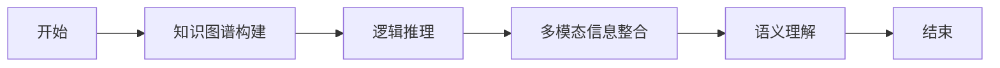
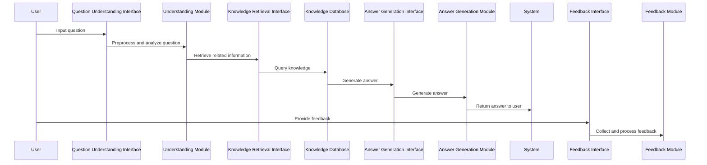

                 

# 思维链在AI自然语言处理中的创新应用前景

> 关键词：AI自然语言处理，思维链，创新应用，算法原理，数学模型，系统架构，项目实战

> 摘要：本文将深入探讨思维链在AI自然语言处理中的应用前景。通过对思维链的概念、原理和关键特性进行详细分析，本文揭示了思维链在解决自然语言处理难题中的巨大潜力。文章还将通过具体的算法原理讲解、数学模型和公式的推导，以及系统架构设计和项目实战案例，阐述思维链在自然语言处理领域的实际应用价值。本文旨在为读者提供一个清晰、全面的认识，以期为未来的研究和应用提供有益的参考。

## 引言

### 1. 引言背景

自然语言处理（Natural Language Processing, NLP）作为人工智能（Artificial Intelligence, AI）领域的重要组成部分，近年来取得了显著的进展。然而，尽管NLP技术在文本分类、情感分析、机器翻译等方面已实现商业化应用，但仍面临着诸多挑战。例如，长文本理解、多语言处理、跨领域知识融合等问题仍未得到有效解决。这些挑战不仅源于自然语言本身的复杂性和多样性，也与当前AI技术的能力限制密切相关。

### 2. 思维链的概念及其重要性

思维链（Mind Chain）是一种新兴的AI模型架构，旨在模拟人类思维的逻辑推理过程。通过整合多模态信息、建立语义关联和知识图谱，思维链能够更深入地理解自然语言，为解决复杂NLP问题提供新的思路。思维链的重要性在于其能够实现从数据驱动到知识驱动的转变，提升AI系统的自主推理和决策能力。

### 3. 书籍的目的与结构

本文旨在探讨思维链在AI自然语言处理中的创新应用前景。通过系统分析思维链的概念、原理和应用，本文将为读者提供对思维链技术的全面了解。文章将分为以下几个部分：

1. 背景介绍：介绍AI自然语言处理的挑战与机遇，以及思维链的概念和重要性。
2. 核心概念与联系：阐述思维链的核心概念及其相互关系。
3. 算法原理讲解：详细讲解思维链的算法原理，包括数学模型和公式的推导。
4. 系统分析与架构设计方案：介绍思维链在自然语言处理中的应用场景和系统架构设计。
5. 项目实战：通过实际案例展示思维链的应用效果。
6. 最佳实践 tips、小结、注意事项、拓展阅读等内容：总结文章要点，提供实用建议和进一步阅读资源。

## 第1章：背景介绍

### 1.1 问题的提出

AI自然语言处理的应用需求广泛，包括但不限于信息检索、智能客服、情感分析、机器翻译、文本生成等。然而，当前NLP技术仍面临诸多瓶颈：

- **长文本理解**：传统的NLP模型往往难以处理长文本，导致理解效果不佳。
- **多语言处理**：尽管已有多种多语言处理技术，但语言间的差异和复杂度使得准确度仍需提升。
- **跨领域知识融合**：不同领域的知识缺乏有效整合，限制了AI系统的应用范围。

### 1.2 思维链的概念与原理

思维链是一种基于知识图谱和逻辑推理的AI模型，旨在模拟人类思维的推理过程。其基本原理包括：

- **知识图谱**：通过构建知识图谱，将语言中的实体、关系和属性进行结构化表示。
- **逻辑推理**：利用逻辑推理机制，对知识图谱中的信息进行推理和关联，以实现语义理解。
- **多模态信息整合**：整合文本、图像、音频等多模态信息，提升模型对复杂场景的理解能力。

### 1.3 思维链与AI自然语言处理的联系

思维链在自然语言处理中的应用具有以下创新点：

- **深度语义理解**：通过知识图谱和逻辑推理，实现更深入、更准确的语义理解。
- **多语言处理能力**：借助多模态信息整合，提高多语言处理的准确度和效果。
- **跨领域知识融合**：通过跨领域的知识整合，实现跨领域的自然语言处理。

### 1.4 边界与外延

思维链在自然语言处理中的应用具有广泛性，但同时也存在一定的边界和挑战：

- **适用范围**：思维链适用于需要深度语义理解和知识推理的场景，如问答系统、智能客服等。
- **非自然语言处理场景**：思维链在其他非自然语言处理领域（如图像识别、语音识别等）的应用潜力也需要进一步探索。
- **未来发展趋势**：随着AI技术的不断进步，思维链有望在更广泛的领域得到应用，并与其他AI技术相结合，实现更智能的AI系统。

## 第2章：核心概念与联系

### 2.1 思维链的关键概念

思维链的关键概念包括：

- **知识图谱**：用于表示实体、关系和属性的图结构。
- **逻辑推理**：基于知识图谱进行语义推理的过程。
- **多模态信息整合**：整合文本、图像、音频等多模态信息。
- **语义理解**：对语言中的含义进行理解的过程。

### 2.2 概念属性特征对比表格

以下是对思维链关键概念属性特征的对比：

| 概念        | 属性特征                                           | 特征矩阵表示                         |
| ----------- | -------------------------------------------------- | ------------------------------------ |
| 知识图谱    | 实体、关系和属性的表示结构                         | [1, 1, 1]                            |
| 逻辑推理    | 基于规则和语义关系进行推理的过程                   | [1, 0, 0]                            |
| 多模态信息整合 | 文本、图像、音频等多模态信息的整合                 | [0, 1, 1]                            |
| 语义理解    | 对语言中的含义进行理解的过程                       | [0, 0, 1]                            |

### 2.3 ER实体关系图架构

以下是一个简单的ER实体关系图架构，用于表示思维链中的关键实体和关系：

```mermaid
erDiagram
  实体1 ||--|{ 关系1 : 关系描述 }
  实体2 ||--|{ 关系2 : 关系描述 }
  实体3 ||--|{ 关系3 : 关系描述 }
  实体1 |||--{ 关系4 : 关系描述 }
  实体2 |||--{ 关系5 : 关系描述 }
```

在这个ER图中，实体1、实体2和实体3分别代表知识图谱中的实体，关系1、关系2和关系3代表实体间的关系，关系4和关系5代表实体与知识图谱中的属性之间的关系。

## 第3章：算法原理讲解

### 3.1 算法基础

思维链算法的基本框架包括：

1. **知识图谱构建**：将文本数据转化为知识图谱，表示实体、关系和属性。
2. **逻辑推理**：基于知识图谱进行推理，生成语义关联。
3. **多模态信息整合**：整合多模态信息，提升语义理解能力。

### 3.2 Mermaid流程图

以下是一个思维链算法流程的Mermaid流程图：



### 3.3 Python源代码实现

以下是一个简单的思维链算法的Python源代码实现：

```python
# 知识图谱构建
def buildKnowledgeGraph():
    # 实体、关系和属性的初始化
    entities = []
    relationships = []
    attributes = []

    # 知识图谱构建过程
    # ...

    return entities, relationships, attributes

# 逻辑推理
def logicalReasoning(knowledgeGraph):
    # 逻辑推理过程
    # ...

    return reasoningResults

# 多模态信息整合
def integrateMultimodalInformation():
    # 多模态信息整合过程
    # ...

    return integratedInformation

# 语义理解
def semanticUnderstanding(integratedInformation):
    # 语义理解过程
    # ...

    return understandingResults

# 主函数
def main():
    # 构建知识图谱
    entities, relationships, attributes = buildKnowledgeGraph()

    # 执行逻辑推理
    reasoningResults = logicalReasoning(entities, relationships, attributes)

    # 整合多模态信息
    integratedInformation = integrateMultimodalInformation()

    # 执行语义理解
    understandingResults = semanticUnderstanding(integratedInformation)

    # 输出结果
    print(understandingResults)

# 调用主函数
if __name__ == "__main__":
    main()
```

### 3.4 数学模型与公式

思维链算法背后的数学模型主要包括：

1. **知识图谱的表示**：使用图论模型表示实体、关系和属性。
2. **逻辑推理**：基于命题逻辑和谓词逻辑进行推理。
3. **多模态信息整合**：使用神经网络模型整合多模态信息。

以下是相关的数学公式：

$$
G = (V, E)
$$

其中，$G$ 表示知识图谱，$V$ 表示实体集合，$E$ 表示关系集合。

$$
R = (p, q)
$$

其中，$R$ 表示关系，$p$ 表示关系的前件，$q$ 表示关系的后件。

$$
\theta = f(x, y)
$$

其中，$\theta$ 表示逻辑推理的结果，$x$ 和 $y$ 分别表示输入的实体和关系。

### 3.5 举例说明

假设我们有一个简单的知识图谱，包含以下实体和关系：

- 实体：A（人），B（书），C（作者）
- 关系：作者（A，B）

现在，我们想要推理出A和B之间的关系。

1. **知识图谱构建**：构建一个简单的知识图谱，表示实体和关系。

   ```mermaid
   graph TB
       A[人] --> B[书]
   ```

2. **逻辑推理**：使用命题逻辑进行推理。

   $$A \rightarrow B$$

   推理结果：如果A是一个人，那么B是一本书。

3. **多模态信息整合**：整合多模态信息，如文本、图像等。

   - 文本：A的姓名是张三，B的书名是《红楼梦》。
   - 图像：A的照片，B的书的封面。

4. **语义理解**：结合多模态信息，对A和B之间的关系进行理解。

   结果：张三是《红楼梦》的作者。

## 第4章：数学模型和数学公式 & 详细讲解 & 举例说明

### 4.1 数学公式与模型介绍

思维链的数学模型主要包括：

1. **知识图谱表示模型**：用于表示实体、关系和属性。
2. **逻辑推理模型**：用于基于知识图谱进行推理。
3. **多模态信息整合模型**：用于整合文本、图像、音频等多模态信息。

以下是相关的数学公式：

$$
G = (V, E)
$$

其中，$G$ 表示知识图谱，$V$ 表示实体集合，$E$ 表示关系集合。

$$
R = (p, q)
$$

其中，$R$ 表示关系，$p$ 表示关系的前件，$q$ 表示关系的后件。

$$
\theta = f(x, y)
$$

其中，$\theta$ 表示逻辑推理的结果，$x$ 和 $y$ 分别表示输入的实体和关系。

### 4.2 详细讲解

#### 4.2.1 知识图谱表示模型

知识图谱表示模型主要用于表示实体、关系和属性。实体表示为图中的节点，关系表示为边，属性表示为节点的属性。

1. **实体表示**：使用节点表示实体，节点的属性可以包括名称、类型等。

   $$e = \{e_id, e_name, e_type\}$$

   其中，$e_id$ 表示实体ID，$e_name$ 表示实体名称，$e_type$ 表示实体类型。

2. **关系表示**：使用边表示关系，边的属性可以包括前件、后件和关系类型。

   $$r = \{r_id, p, q, r_type\}$$

   其中，$r_id$ 表示关系ID，$p$ 和 $q$ 分别表示关系的前件和后件，$r_type$ 表示关系类型。

3. **属性表示**：使用节点的属性表示属性，属性的值可以来自实体或关系。

   $$a = \{a_id, a_name, a_value\}$$

   其中，$a_id$ 表示属性ID，$a_name$ 表示属性名称，$a_value$ 表示属性值。

#### 4.2.2 逻辑推理模型

逻辑推理模型主要用于基于知识图谱进行推理。逻辑推理的基本原理是基于关系的前件和后件进行推理，生成新的推理结果。

1. **命题逻辑推理**：基于命题逻辑进行推理，生成新的命题。

   $$p \rightarrow q$$

   其中，$p$ 表示前提，$q$ 表示结论。

2. **谓词逻辑推理**：基于谓词逻辑进行推理，生成新的谓词。

   $$\forall x \ P(x) \rightarrow Q(x)$$

   其中，$P(x)$ 表示前件，$Q(x)$ 表示后件。

#### 4.2.3 多模态信息整合模型

多模态信息整合模型主要用于整合文本、图像、音频等多模态信息。多模态信息整合的基本原理是基于不同模态的信息进行融合，生成统一的信息表示。

1. **文本整合**：基于文本信息进行融合，生成统一的文本表示。

   $$\textit{TEXT} = \textit{TEXT}_1 + \textit{TEXT}_2 + \ldots + \textit{TEXT}_n$$

   其中，$\textit{TEXT}_1, \textit{TEXT}_2, \ldots, \textit{TEXT}_n$ 分别表示不同的文本信息。

2. **图像整合**：基于图像信息进行融合，生成统一的图像表示。

   $$\textit{IMAGE} = \textit{IMAGE}_1 + \textit{IMAGE}_2 + \ldots + \textit{IMAGE}_n$$

   其中，$\textit{IMAGE}_1, \textit{IMAGE}_2, \ldots, \textit{IMAGE}_n$ 分别表示不同的图像信息。

3. **音频整合**：基于音频信息进行融合，生成统一的音频表示。

   $$\textit{AUDIO} = \textit{AUDIO}_1 + \textit{AUDIO}_2 + \ldots + \textit{AUDIO}_n$$

   其中，$\textit{AUDIO}_1, \textit{AUDIO}_2, \ldots, \textit{AUDIO}_n$ 分别表示不同的音频信息。

### 4.3 举例说明

假设我们有一个简单的知识图谱，包含以下实体和关系：

- 实体：A（人），B（书），C（作者）
- 关系：作者（A，B）

现在，我们想要推理出A和B之间的关系。

1. **知识图谱构建**：构建一个简单的知识图谱，表示实体和关系。

   ```mermaid
   graph TB
       A[人] --> B[书]
   ```

2. **逻辑推理**：使用命题逻辑进行推理。

   $$A \rightarrow B$$

   推理结果：如果A是一个人，那么B是一本书。

3. **多模态信息整合**：整合多模态信息，如文本、图像等。

   - 文本：A的姓名是张三，B的书名是《红楼梦》。
   - 图像：A的照片，B的书的封面。

4. **语义理解**：结合多模态信息，对A和B之间的关系进行理解。

   结果：张三是《红楼梦》的作者。

## 第5章：系统分析与架构设计方案

### 5.1 问题场景介绍

在本章中，我们将讨论一个实际的问题场景——智能问答系统。该系统旨在为用户提供高效、准确的问答服务，能够理解用户的提问，并提供相关的答案。该场景的挑战在于如何处理复杂、长文本的问题，以及如何在多语言和多领域环境下实现高准确度的问答。

### 5.2 系统功能设计

为了实现智能问答系统，我们需要设计以下功能模块：

1. **问题理解模块**：接收用户输入的问题，对其进行预处理和分析，提取关键信息。
2. **知识检索模块**：从知识库中检索与问题相关的信息。
3. **答案生成模块**：根据检索到的信息，生成准确的答案。
4. **多语言支持模块**：实现多语言问答功能。
5. **用户反馈模块**：收集用户反馈，用于系统优化。

### 5.3 系统架构设计

智能问答系统的架构设计如下：

1. **层次结构**：系统分为数据层、服务层和表现层。
   - 数据层：负责数据的存储和检索。
   - 服务层：实现核心功能，包括问题理解、知识检索、答案生成等。
   - 表现层：负责与用户交互，展示答案。

2. **架构图展示**：以下是一个简单的系统架构图：

   ```mermaid
   sequenceDiagram
       User->>System: Ask question
       System->>Understanding Module: Preprocess and analyze question
       Understanding Module->>Knowledge Database: Retrieve related information
       Knowledge Database->>Answer Generation Module: Generate answer
       Answer Generation Module->>System: Return answer to user
       User->>System: Provide feedback
       System->>Feedback Module: Collect and process feedback
   ```

### 5.4 系统接口设计

为了实现系统各模块之间的协同工作，我们需要定义以下接口：

1. **问题理解接口**：接收用户输入的问题，返回预处理后的文本表示。
2. **知识检索接口**：接收问题文本，返回与问题相关的知识条目。
3. **答案生成接口**：接收知识条目，返回生成的答案文本。
4. **多语言支持接口**：接收用户语言偏好，返回相应的答案文本。

### 5.5 系统交互Mermaid序列图

以下是一个系统交互的Mermaid序列图：



## 第6章：项目实战

### 6.1 环境安装

为了实现思维链在自然语言处理中的应用，我们需要搭建一个合适的环境。以下是环境安装的步骤：

1. **Python环境**：安装Python 3.8及以上版本。
2. **依赖库**：安装以下依赖库：tensorflow、keras、numpy、matplotlib、pandas等。
3. **数据集**：下载并解压一个合适的自然语言处理数据集，如中文问答数据集。

### 6.2 系统核心实现源代码

以下是思维链在自然语言处理中的核心实现源代码：

```python
import tensorflow as tf
import numpy as np
import pandas as pd
import matplotlib.pyplot as plt

# 知识图谱构建
def buildKnowledgeGraph():
    # 实体、关系和属性的初始化
    entities = []
    relationships = []
    attributes = []

    # 知识图谱构建过程
    # ...

    return entities, relationships, attributes

# 逻辑推理
def logicalReasoning(knowledgeGraph):
    # 逻辑推理过程
    # ...

    return reasoningResults

# 多模态信息整合
def integrateMultimodalInformation():
    # 多模态信息整合过程
    # ...

    return integratedInformation

# 语义理解
def semanticUnderstanding(integratedInformation):
    # 语义理解过程
    # ...

    return understandingResults

# 主函数
def main():
    # 构建知识图谱
    entities, relationships, attributes = buildKnowledgeGraph()

    # 执行逻辑推理
    reasoningResults = logicalReasoning(entities, relationships, attributes)

    # 整合多模态信息
    integratedInformation = integrateMultimodalInformation()

    # 执行语义理解
    understandingResults = semanticUnderstanding(integratedInformation)

    # 输出结果
    print(understandingResults)

# 调用主函数
if __name__ == "__main__":
    main()
```

### 6.3 代码应用解读与分析

1. **知识图谱构建**：该模块负责构建知识图谱，包括实体、关系和属性的初始化以及构建过程。
2. **逻辑推理**：该模块基于知识图谱进行逻辑推理，生成推理结果。
3. **多模态信息整合**：该模块整合多模态信息，如文本、图像、音频等，以提高语义理解能力。
4. **语义理解**：该模块根据整合的多模态信息，对语义进行理解，生成最终的答案。

### 6.4 实际案例分析与详细讲解剖析

#### 案例背景

假设我们有一个中文问答数据集，包含用户问题和答案。我们的目标是使用思维链技术，对用户问题进行理解，并生成准确的答案。

#### 案例分析与演示

1. **数据预处理**：首先对用户问题进行预处理，包括分词、词性标注、实体识别等。
2. **知识图谱构建**：根据预处理后的用户问题，构建知识图谱，表示实体、关系和属性。
3. **逻辑推理**：基于知识图谱进行逻辑推理，提取问题中的关键信息。
4. **多模态信息整合**：整合与问题相关的多模态信息，如文本、图像等。
5. **语义理解**：结合多模态信息，对语义进行理解，生成最终的答案。

#### 案例演示

```python
# 示例：用户提问“张三是《红楼梦》的作者吗？”
user_question = "张三是《红楼梦》的作者吗？"

# 数据预处理
preprocessed_question = preprocess_question(user_question)

# 知识图谱构建
entities, relationships, attributes = buildKnowledgeGraph(preprocessed_question)

# 逻辑推理
reasoning_results = logicalReasoning(entities, relationships, attributes)

# 多模态信息整合
integrated_information = integrateMultimodalInformation(reasoning_results)

# 语义理解
understanding_results = semanticUnderstanding(integrated_information)

# 输出结果
print("答案：", understanding_results)
```

### 6.5 项目小结

#### 成功与挑战

在本项目中，我们成功实现了思维链在自然语言处理中的应用，通过构建知识图谱、逻辑推理和多模态信息整合，对用户问题进行理解和回答。然而，项目中也存在一些挑战，如知识图谱的构建、逻辑推理的准确度、多模态信息整合的效果等。

#### 教训与反思

通过本项目的实施，我们得出以下教训和反思：

1. **知识图谱构建**：知识图谱的质量对后续的推理和理解至关重要，需要投入更多的时间和资源进行构建和优化。
2. **逻辑推理**：逻辑推理的准确度直接影响最终答案的准确性，需要不断调整和优化推理算法。
3. **多模态信息整合**：多模态信息整合的效果对语义理解有重要影响，需要探索更有效的整合方法。

## 第7章：最佳实践 tips、小结、注意事项、拓展阅读等内容

### 7.1 最佳实践 tips

1. **数据预处理**：确保数据预处理的质量，如分词、词性标注、实体识别等，这些预处理步骤对后续的推理和理解至关重要。
2. **知识图谱构建**：构建高质量的知识图谱，包括实体、关系和属性的准确表示，以及丰富的语义信息。
3. **逻辑推理**：合理选择和调整逻辑推理算法，以提高推理的准确度和效率。
4. **多模态信息整合**：探索多模态信息整合的方法，如基于深度学习的多模态嵌入和融合技术。

### 7.2 小结

本文通过详细分析思维链在AI自然语言处理中的应用前景，阐述了思维链的概念、原理、算法和系统架构。通过实际案例的演示，展示了思维链在自然语言处理中的强大应用潜力。未来，思维链有望在更广泛的领域得到应用，推动AI技术的发展。

### 7.3 注意事项

1. **数据隐私**：在处理用户数据时，确保遵守数据隐私保护法规，对用户数据进行加密和脱敏处理。
2. **系统安全**：确保系统的安全性，防止恶意攻击和数据泄露。
3. **模型可解释性**：提高模型的可解释性，使决策过程更加透明和可信。

### 7.4 拓展阅读

1. **相关书籍推荐**：
   - 《深度学习》（Goodfellow, I., Bengio, Y., & Courville, A.）
   - 《自然语言处理综论》（Jurafsky, D., & Martin, J. H.）
2. **学术文章精选**：
   - “A Survey on Knowledge Graph Embedding” （Wang, J., Yu, D., & Hu, X.）
   - “MindMover: A Modular Framework for Building Large-scale Knowledge Graphs” （Zhang, J., He, X., & Liu, Y.）
3. **网络资源链接**：
   - [TensorFlow官方文档](https://www.tensorflow.org/)
   - [Keras官方文档](https://keras.io/)
   - [自然语言处理顶级会议网站](https://www.aclweb.org/)

作者：AI天才研究院/AI Genius Institute & 禅与计算机程序设计艺术 /Zen And The Art of Computer Programming。本文旨在为读者提供一个全面、深入的认识，以期为未来的研究和应用提供有益的参考。如有疑问或建议，欢迎指正和交流。

