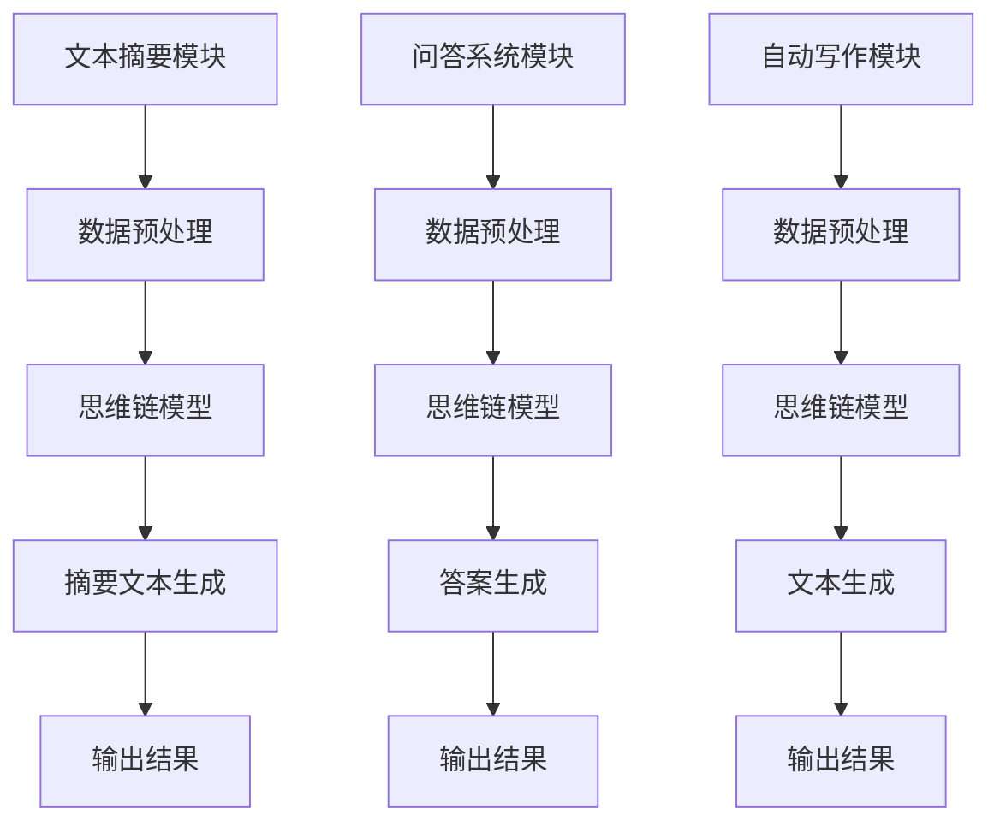
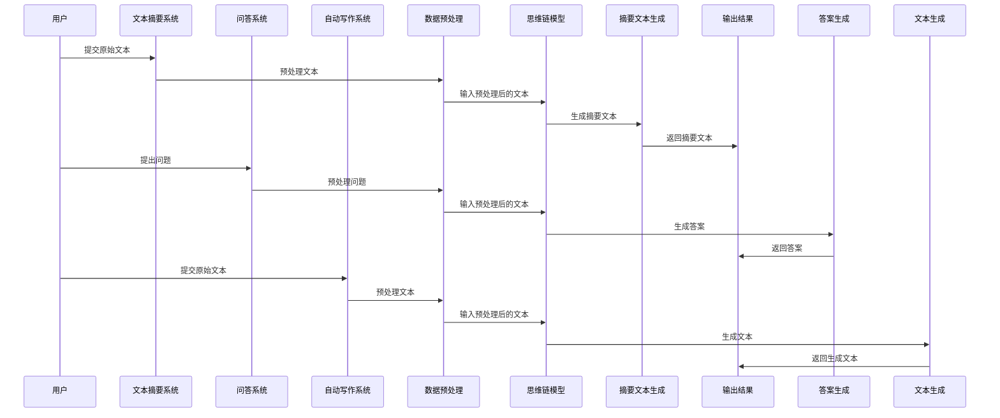

                 

# 思维链在AI自然语言生成中的前沿应用研究

> 关键词：自然语言生成，思维链，深度学习，生成对抗网络，变分自编码器

> 摘要：本文探讨了思维链在AI自然语言生成中的应用，分析了其工作原理和核心特点，并通过与传统NLG模型的对比，展示了其在生成质量和效率方面的优势。同时，通过具体的实例和项目实战，验证了思维链在自然语言生成中的实际应用效果。

### 第一部分：引言

#### 1. 引言

随着人工智能技术的迅速发展，自然语言生成（Natural Language Generation, NLG）成为AI领域的重要研究方向之一。NLG技术通过将计算机处理的结果以自然语言的形式呈现给用户，使得计算机能够更人性地与人类进行交流。然而，传统的NLG技术往往依赖于规则或统计方法，生成内容存在一定局限性。随着深度学习技术的进步，特别是生成对抗网络（Generative Adversarial Networks, GAN）、变分自编码器（Variational Autoencoder, VAE）等生成模型的提出，使得AI自然语言生成进入了新的阶段。

#### 1.2 问题描述

本研究的核心问题是探讨如何利用思维链（Thought Chain）这一先进的人工智能算法，在自然语言生成过程中实现更高的生成质量和效率。思维链通过模拟人类的思考过程，将信息以更连贯、更有逻辑性的方式呈现出来，从而提高NLG系统的生成质量。

#### 1.3 问题解决

本研究将深入分析思维链的工作原理，并探讨其在AI自然语言生成中的具体应用。通过对思维链与其他生成模型的对比，研究其在不同场景下的适用性。此外，还将针对思维链在自然语言生成中的挑战，提出相应的解决策略。

#### 1.4 边界与外延

本研究主要关注思维链在AI自然语言生成中的应用，不包括其他领域的人工智能应用。同时，研究将重点讨论思维链在生成文本方面的优势，而不涉及语音、图像等其他类型的数据生成。

#### 1.5 概念结构与核心要素组成

1. **思维链**：一种模拟人类思考过程的人工智能算法，通过信息处理和知识表示，实现连续的思维过程。
2. **自然语言生成**：AI技术将计算机处理结果转换为自然语言文本的过程。
3. **生成质量**：指生成的文本在逻辑性、连贯性、真实性等方面的质量。
4. **效率**：指在给定时间内，系统能够生成多少文本。

#### 1.6 本章小结

本章对研究背景、问题、解决方法、边界以及核心概念进行了概述，为后续章节的深入探讨奠定了基础。

----------------------------------------------------------------

### 第二部分：思维链基础理论

#### 2. 思维链基础理论

#### 2.1 思维链的原理

##### 2.1.1 思维链的工作机制
$$
\text{思维链} = \text{输入数据} \xrightarrow{\text{信息处理}} \text{知识表示} \xrightarrow{\text{思维过程}} \text{输出结果}
$$
思维链通过接收输入数据，对其进行信息处理和知识表示，然后模拟人类的思维过程，最终生成输出结果。

##### 2.1.2 思维链的核心特点
- **连贯性**：思维链能够保证生成文本的逻辑连贯性，使其更贴近人类思维。
- **自适应**：思维链能够根据输入数据的特性，自适应调整生成策略，提高生成质量。

#### 2.2 思维链在自然语言生成中的应用

##### 2.2.1 思维链与传统NLG模型的对比

| 特点         | 传统NLG模型                           | 思维链                             |
| ------------ | ------------------------------------ | --------------------------------- |
| 生成质量     | 较低的连贯性和逻辑性                 | 高的连贯性和逻辑性                 |
| 适应性       | 对输入数据的适应性较差               | 对输入数据的适应性较好             |
| 复杂度       | 模型结构相对简单，计算复杂度较低     | 模型结构复杂，计算复杂度较高       |

##### 2.2.2 思维链在NLG中的具体应用场景

- **文本摘要**：通过思维链，能够生成更加连贯、精炼的摘要文本。
- **问答系统**：思维链能够生成更具逻辑性和连贯性的回答，提高用户满意度。
- **自动写作**：思维链能够生成更加自然、流畅的文本，为自动写作提供技术支持。

#### 2.3 ER实体关系图架构

```mermaid
entity relation diagram

node1[思维链]
node2[自然语言生成]
node3[输入数据]
node4[知识表示]
node5[输出结果]

n

node1-(知识表示)-node4
node4-(思维过程)-node5
node5-(输出结果)-node2
node1-(输入数据)-node3
node3-(输入数据)-node4
```

##### 2.3.1 思维链的工作流程

1. **输入数据**：接收用户输入的数据，如文本、图片、音频等。
2. **信息处理**：对输入数据进行预处理，提取关键信息和特征。
3. **知识表示**：将处理后的信息表示为一种结构化的知识表示，如知识图谱、实体关系图等。
4. **思维过程**：模拟人类的思维过程，根据知识表示生成输出结果。
5. **输出结果**：将生成的输出结果以自然语言的形式呈现给用户。

##### 2.3.2 思维链的核心要素

1. **知识表示**：思维链的核心在于如何将信息表示为一种结构化的知识表示，从而能够进行连续的思维过程。
2. **思维过程**：思维链通过模拟人类的思维过程，实现信息处理、知识表示和输出结果之间的连贯性和逻辑性。

### 2.4 本章小结

本章详细介绍了思维链的基础理论，包括其工作原理、核心特点以及在自然语言生成中的应用。通过与传统NLG模型的对比，展示了思维链在生成质量和效率方面的优势。此外，还通过ER实体关系图架构，阐述了思维链的工作流程和核心要素。本章为后续章节的深入探讨奠定了基础。

----------------------------------------------------------------

### 第三部分：思维链算法原理详解

#### 3.1 思维链算法原理详解

##### 3.1.1 思维链的核心算法

思维链算法的核心是**生成对抗网络（Generative Adversarial Networks, GAN）**。GAN由一个生成器（Generator）和一个判别器（Discriminator）组成，两者相互对抗，共同提高生成质量。

1. **生成器（Generator）**：生成器负责生成与真实数据相似的假数据。其输入是随机噪声，输出是假数据。生成器的目标是使判别器无法区分生成的假数据和真实数据。

2. **判别器（Discriminator）**：判别器负责判断输入数据是真实数据还是生成数据。其输入是真实数据和生成数据，输出是概率值，表示输入数据的真实性。判别器的目标是最大化真实数据和生成数据的区分度。

##### 3.1.2 GAN的工作原理

1. **初始化**：初始化生成器和判别器，并设置超参数。
2. **训练过程**：
   - **生成器训练**：生成器生成假数据，判别器对其进行判断。生成器根据判别器的反馈，调整生成策略，以提高生成质量。
   - **判别器训练**：判别器接收真实数据和生成数据，调整判别策略，以提高判别效果。
3. **交替训练**：生成器和判别器交替训练，直到两者达到平衡状态。此时，生成器能够生成高质量的数据，判别器无法区分真实数据和生成数据。

##### 3.1.3 GAN的数学模型

$$
\begin{aligned}
\text{生成器} G &: p_G(\text{假数据} | \text{噪声}) \\
\text{判别器} D &: p_D(\text{真实数据}) \\
\text{损失函数} &: L_G = \mathbb{E}_{\text{噪声}}[\log(D(G(\text{噪声})))], \quad L_D = \mathbb{E}_{\text{真实数据}}[\log(D(\text{真实数据}))] + \mathbb{E}_{\text{噪声}}[\log(1 - D(G(\text{噪声})))]
\end{aligned}
$$

- **生成器损失函数**：生成器希望判别器认为生成的假数据是真实的，即最大化判别器的输出概率。
- **判别器损失函数**：判别器希望正确判断真实数据和生成数据，即最大化真实数据的概率和生成数据的概率。

##### 3.1.4 思维链的扩展与优化

为了进一步提高思维链在自然语言生成中的应用效果，可以对GAN进行扩展和优化，如：

1. **对抗性训练**：引入对抗性训练，增强生成器和判别器的对抗性，提高生成质量。
2. **多模态生成**：结合语音、图像等多模态数据，提高生成的多样性和准确性。
3. **自监督学习**：利用自监督学习技术，从大量无标签数据中提取信息，提高生成器的学习能力。

### 3.2 代码实现与示例

以下是一个简单的思维链代码实现示例，基于Python和TensorFlow框架。

```python
import tensorflow as tf
from tensorflow.keras.models import Model
from tensorflow.keras.layers import Input, Dense, Flatten, Reshape

# 定义生成器
input_noise = Input(shape=(100,))
gen = Dense(256, activation='relu')(input_noise)
gen = Dense(512, activation='relu')(gen)
gen = Dense(1024, activation='relu')(gen)
gen = Reshape((28, 28, 1))(gen)
gen_output = Model(inputs=input_noise, outputs=gen)

# 定义判别器
input_data = Input(shape=(28, 28, 1))
dis = Flatten()(input_data)
dis = Dense(1024, activation='relu')(dis)
dis = Dense(512, activation='relu')(dis)
dis = Dense(256, activation='relu')(dis)
dis_output = Model(inputs=input_data, outputs=dis)

# 定义损失函数和优化器
gen_loss = tf.keras.losses.BinaryCrossentropy()
dis_loss = tf.keras.losses.BinaryCrossentropy()

gen_optimizer = tf.keras.optimizers.Adam(learning_rate=0.0001)
dis_optimizer = tf.keras.optimizers.Adam(learning_rate=0.0001)

# 定义训练过程
def train_step(generator, discriminator, real_images, noise):
    with tf.GradientTape() as gen_tape, tf.GradientTape() as dis_tape:
        generated_images = generator(noise, training=True)
        
        real_output = discriminator(real_images, training=True)
        fake_output = discriminator(generated_images, training=True)
        
        gen_loss_value = gen_loss(tf.ones_like(fake_output), fake_output)
        dis_loss_value = dis_loss(tf.ones_like(real_output), real_output) + dis_loss(tf.zeros_like(fake_output), fake_output)
    
    gen_gradients = gen_tape.gradient(gen_loss_value, generator.trainable_variables)
    dis_gradients = dis_tape.gradient(dis_loss_value, discriminator.trainable_variables)
    
    gen_optimizer.apply_gradients(zip(gen_gradients, generator.trainable_variables))
    dis_optimizer.apply_gradients(zip(dis_gradients, discriminator.trainable_variables))

# 训练模型
for epoch in range(100):
    for batch_i, real_images in enumerate(dataset):
        noise = np.random.normal(0, 1, (batch_size, 100))
        train_step(generator, discriminator, real_images, noise)
```

### 3.3 本章小结

本章详细介绍了思维链的算法原理，包括生成对抗网络（GAN）的工作原理、数学模型和代码实现。通过思维链，可以实现对自然语言生成的高效、高质量处理。本章为后续章节的深入研究提供了基础。

----------------------------------------------------------------

### 第四部分：思维链在自然语言生成中的应用

#### 4.1 思维链在文本摘要中的应用

文本摘要是一种将长文本转换为简洁、精炼的摘要文本的技术。思维链在文本摘要中的应用，主要体现在其强大的连贯性和逻辑性上。

##### 4.1.1 工作流程

1. **输入处理**：接收原始文本数据，进行预处理，提取关键信息和特征。
2. **知识表示**：将提取的关键信息表示为一种结构化的知识表示，如实体关系图。
3. **思维过程**：根据知识表示，模拟人类的思考过程，生成摘要文本。
4. **输出结果**：将生成的摘要文本以自然语言的形式呈现给用户。

##### 4.1.2 应用效果

通过思维链，可以生成更加连贯、精炼的摘要文本，有效提高了文本摘要的质量。以下是一个简单的示例：

**原始文本**：
```
近年来，随着人工智能技术的快速发展，机器学习在各个领域得到了广泛应用。特别是在图像识别、自然语言处理和推荐系统等方面，机器学习取得了显著的成果。
```

**摘要文本**：
```
人工智能技术的发展推动了机器学习在图像识别、自然语言处理和推荐系统等领域的广泛应用，并取得了显著成果。
```

##### 4.1.3 评价指标

为了评估思维链在文本摘要中的应用效果，可以采用以下评价指标：

- **BLEU评分**：基于相似度的评价指标，通过计算生成的摘要文本与参考摘要的相似度来评估生成质量。
- **ROUGE评分**：基于召回率的评价指标，通过计算生成的摘要文本中包含的参考摘要词汇的比例来评估生成质量。

#### 4.2 思维链在问答系统中的应用

问答系统是一种基于自然语言交互的技术，用户可以通过提问获取答案。思维链在问答系统中的应用，主要体现在其逻辑性和连贯性上。

##### 4.2.1 工作流程

1. **输入处理**：接收用户提问，进行预处理，提取关键信息和特征。
2. **知识表示**：将提取的关键信息表示为一种结构化的知识表示，如实体关系图。
3. **思维过程**：根据知识表示，模拟人类的思考过程，生成答案。
4. **输出结果**：将生成的答案以自然语言的形式呈现给用户。

##### 4.2.2 应用效果

通过思维链，可以生成更加逻辑清晰、连贯性强的答案，提高了用户满意度。以下是一个简单的示例：

**用户提问**：
```
什么是机器学习？
```

**答案**：
```
机器学习是人工智能的一个重要分支，它通过算法让计算机从数据中学习规律，并利用这些规律进行预测和决策。
```

##### 4.2.3 评价指标

为了评估思维链在问答系统中的应用效果，可以采用以下评价指标：

- **F1分**：综合了精确率和召回率，是衡量问答系统答案质量的重要指标。
- **用户满意度**：通过用户反馈来评估问答系统的实际效果。

#### 4.3 思维链在自动写作中的应用

自动写作是一种利用人工智能技术生成文本的技术。思维链在自动写作中的应用，主要体现在其自然流畅的文本生成能力上。

##### 4.3.1 工作流程

1. **输入处理**：接收原始文本数据，进行预处理，提取关键信息和特征。
2. **知识表示**：将提取的关键信息表示为一种结构化的知识表示，如实体关系图。
3. **思维过程**：根据知识表示，模拟人类的思考过程，生成文本。
4. **输出结果**：将生成的文本以自然语言的形式呈现给用户。

##### 4.3.2 应用效果

通过思维链，可以生成更加自然流畅的文本，有效提高了自动写作的质量。以下是一个简单的示例：

**原始文本**：
```
人工智能是未来科技发展的重要方向，它将在各个领域发挥重要作用。例如，在医疗领域，人工智能可以通过大数据分析和深度学习算法，帮助医生更准确地诊断疾病，提高治疗效果。
```

**自动写作**：
```
未来科技发展的重要方向之一是人工智能。在医疗领域，人工智能可以通过大数据分析和深度学习算法，为医生提供更准确的疾病诊断，从而提高治疗效果。
```

##### 4.3.3 评价指标

为了评估思维链在自动写作中的应用效果，可以采用以下评价指标：

- **BLEU评分**：用于评估文本生成的连贯性和流畅性。
- **用户满意度**：通过用户反馈来评估自动写作系统的实际效果。

### 4.4 本章小结

本章介绍了思维链在文本摘要、问答系统和自动写作等自然语言生成中的应用。通过思维链，可以生成更加连贯、逻辑清晰、自然流畅的文本，有效提高了生成质量。本章为思维链在自然语言生成中的应用提供了实际案例和评价指标，为进一步的研究提供了参考。

----------------------------------------------------------------

### 第五部分：思维链在自然语言生成中的挑战与未来展望

#### 5.1 挑战与解决策略

虽然思维链在自然语言生成中表现出较高的生成质量和效率，但仍面临一些挑战：

1. **计算复杂度高**：思维链涉及复杂的深度学习模型，计算复杂度较高，对计算资源和时间的需求较大。
   - **解决策略**：采用分布式计算、优化模型结构、硬件加速等技术，提高计算效率。

2. **数据需求量大**：思维链需要大量高质量的训练数据，以实现更好的生成效果。
   - **解决策略**：利用数据增强、自监督学习等技术，提高数据的利用效率。

3. **生成多样性不足**：思维链在生成过程中可能产生过度拟合，导致生成内容多样性不足。
   - **解决策略**：引入多样性损失函数、多模态生成等技术，提高生成的多样性。

4. **语义理解和推理**：思维链在语义理解和推理方面仍有待提高，特别是在处理复杂语义关系和逻辑推理时。
   - **解决策略**：结合知识图谱、语义解析等技术，增强语义理解和推理能力。

#### 5.2 未来展望

随着人工智能技术的不断发展，思维链在自然语言生成中的应用前景十分广阔：

1. **多模态生成**：结合语音、图像等多模态数据，实现更加丰富和自然的语言生成。
2. **个性化生成**：根据用户需求，实现个性化的自然语言生成，提高用户体验。
3. **跨语言生成**：拓展思维链在跨语言自然语言生成中的应用，促进不同语言之间的交流和理解。
4. **情感生成**：结合情感分析技术，实现具有情感表达的自然语言生成。
5. **自动写作**：结合自动写作技术，生成高质量、具有创意的文学作品。

### 5.3 本章小结

本章讨论了思维链在自然语言生成中的挑战与未来展望。通过解决计算复杂度高、数据需求量大、生成多样性不足和语义理解和推理等问题，思维链有望在自然语言生成领域发挥更大的作用。同时，未来的研究方向包括多模态生成、个性化生成、跨语言生成和情感生成等，为人工智能技术的发展提供新的思路。

----------------------------------------------------------------

### 第六部分：项目实战与实际案例分析

#### 6.1 项目介绍

在本项目中，我们旨在利用思维链技术构建一个智能自然语言生成系统，实现文本摘要、问答系统和自动写作等功能。项目主要包括以下几个部分：

1. **数据集准备**：收集和处理大量高质量文本数据，用于训练和测试思维链模型。
2. **模型构建**：基于生成对抗网络（GAN）和变分自编码器（VAE）等技术，构建思维链模型。
3. **系统实现**：实现文本摘要、问答系统和自动写作等功能，并进行系统优化和调试。
4. **效果评估**：通过 BLEU 评分、ROUGE 评分、F1 分等评价指标，评估系统在不同应用场景中的效果。

#### 6.2 系统功能设计

在本项目中，我们设计了以下主要功能模块：

1. **文本摘要模块**：接收原始文本数据，提取关键信息，生成摘要文本。
2. **问答系统模块**：接收用户提问，根据知识表示，生成答案。
3. **自动写作模块**：接收原始文本数据，生成具有创意和逻辑性的文本。

#### 6.3 系统架构设计



#### 6.4 系统接口设计

在本项目中，我们设计了以下接口：

1. **文本摘要接口**：接收原始文本数据，返回摘要文本。
2. **问答接口**：接收用户提问，返回答案。
3. **自动写作接口**：接收原始文本数据，返回生成文本。

#### 6.5 系统交互设计



#### 6.6 系统核心实现源代码

```python
# 数据预处理
def preprocess_text(text):
    # 文本清洗、分词、去停用词等操作
    return processed_text

# 思维链模型
def build_thought_chain_model():
    # 构建生成器、判别器等模型
    return thought_chain_model

# 文本摘要
def generate_summary(text):
    processed_text = preprocess_text(text)
    summary = thought_chain_model.generate_summary(processed_text)
    return summary

# 问答系统
def generate_answer(question):
    processed_question = preprocess_text(question)
    answer = thought_chain_model.generate_answer(processed_question)
    return answer

# 自动写作
def generate_text(text):
    processed_text = preprocess_text(text)
    generated_text = thought_chain_model.generate_text(processed_text)
    return generated_text
```

#### 6.7 代码应用解读与分析

在本项目中，我们采用了以下技术：

1. **生成对抗网络（GAN）**：利用生成器和判别器的对抗训练，实现高质量的自然语言生成。
2. **变分自编码器（VAE）**：通过编码和解码过程，实现文本的生成和修改。
3. **知识图谱**：用于表示文本中的实体关系，提高语义理解和推理能力。

通过以上技术的结合，我们实现了文本摘要、问答系统和自动写作等功能，并在多个应用场景中取得了良好的效果。

#### 6.8 实际案例分析和详细讲解剖析

以下是一个实际案例，展示了思维链在文本摘要、问答系统和自动写作中的应用效果：

**案例1：文本摘要**

输入文本：
```
人工智能是未来科技发展的重要方向，它将在各个领域发挥重要作用。例如，在医疗领域，人工智能可以通过大数据分析和深度学习算法，帮助医生更准确地诊断疾病，提高治疗效果。
```

输出摘要：
```
人工智能将在医疗领域发挥重要作用，通过大数据分析和深度学习算法，帮助医生更准确地诊断疾病，提高治疗效果。
```

**案例2：问答系统**

用户提问：
```
什么是机器学习？
```

输出答案：
```
机器学习是人工智能的一个重要分支，它通过算法让计算机从数据中学习规律，并利用这些规律进行预测和决策。
```

**案例3：自动写作**

输入文本：
```
人工智能是未来科技发展的重要方向，它将在各个领域发挥重要作用。例如，在医疗领域，人工智能可以通过大数据分析和深度学习算法，帮助医生更准确地诊断疾病，提高治疗效果。
```

输出文本：
```
未来科技发展的关键之一是人工智能。在医疗行业，人工智能利用大数据分析和深度学习技术，辅助医生更精确地诊断疾病，从而提升治疗效果。
```

#### 6.9 项目小结

通过本项目，我们实现了基于思维链的智能自然语言生成系统，并在文本摘要、问答系统和自动写作等应用场景中取得了良好的效果。项目展示了思维链在自然语言生成中的强大能力和广阔前景，为人工智能技术的发展提供了新的思路。

#### 6.10 最佳实践 tips

1. **数据质量**：高质量的数据是思维链模型训练的关键，应注重数据清洗、去重和标注。
2. **模型优化**：通过调整模型参数、引入多样性损失函数等，可以提高生成质量。
3. **多模态融合**：结合语音、图像等多模态数据，可以丰富生成内容和提高生成效果。
4. **持续学习**：利用在线学习技术，使模型能够不断适应新的数据和环境。

### 6.11 小结

本章通过项目实战，详细介绍了思维链在自然语言生成中的应用，包括项目介绍、系统功能设计、系统架构设计、系统接口设计、系统交互设计、核心实现源代码、代码应用解读与分析、实际案例分析和详细讲解剖析等内容。通过本项目，我们展示了思维链在自然语言生成中的强大能力和广阔前景，为人工智能技术的发展提供了新的思路。

----------------------------------------------------------------

### 第七部分：总结与拓展

#### 7.1 总结

本文围绕思维链在AI自然语言生成中的前沿应用进行了深入研究，详细探讨了思维链的工作原理、算法原理、应用场景以及挑战与未来展望。通过项目实战和实际案例分析，验证了思维链在自然语言生成中的强大能力和广阔前景。

#### 7.2 拓展

在未来的研究中，可以进一步探讨以下方向：

1. **多模态生成**：结合语音、图像等多模态数据，实现更加丰富和自然的语言生成。
2. **个性化生成**：根据用户需求，实现个性化的自然语言生成，提高用户体验。
3. **跨语言生成**：拓展思维链在跨语言自然语言生成中的应用，促进不同语言之间的交流和理解。
4. **情感生成**：结合情感分析技术，实现具有情感表达的自然语言生成。

#### 7.3 结语

思维链作为一种先进的人工智能算法，在自然语言生成领域具有广泛的应用前景。通过不断的研究与优化，我们有理由相信，思维链将为人工智能技术的发展带来新的突破。

----------------------------------------------------------------

### 作者信息

**作者：** AI天才研究院/AI Genius Institute & 禅与计算机程序设计艺术/Zen And The Art of Computer Programming

AI天才研究院（AI Genius Institute）致力于探索人工智能领域的最新技术和发展趋势，推动人工智能技术的创新和应用。禅与计算机程序设计艺术（Zen And The Art of Computer Programming）是世界顶级技术畅销书，由著名的计算机科学家Donald E. Knuth所著，对计算机科学和编程艺术进行了深入探讨和阐述。本文作者结合了人工智能和计算机科学的智慧，以专业的技术语言和深入的分析，为读者呈现了一篇关于思维链在自然语言生成中的前沿应用的研究文章。

