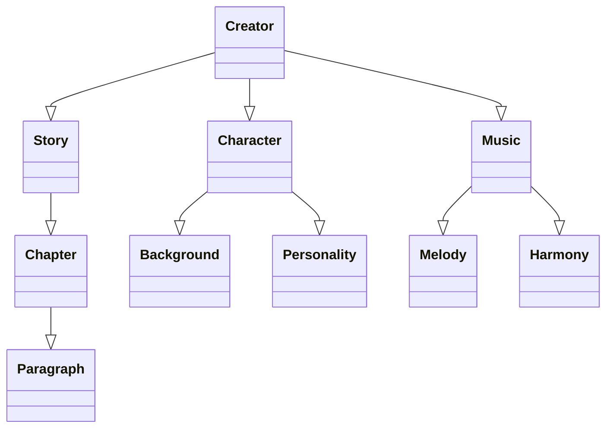
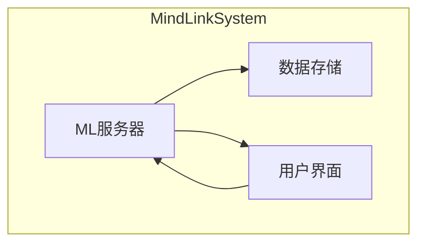
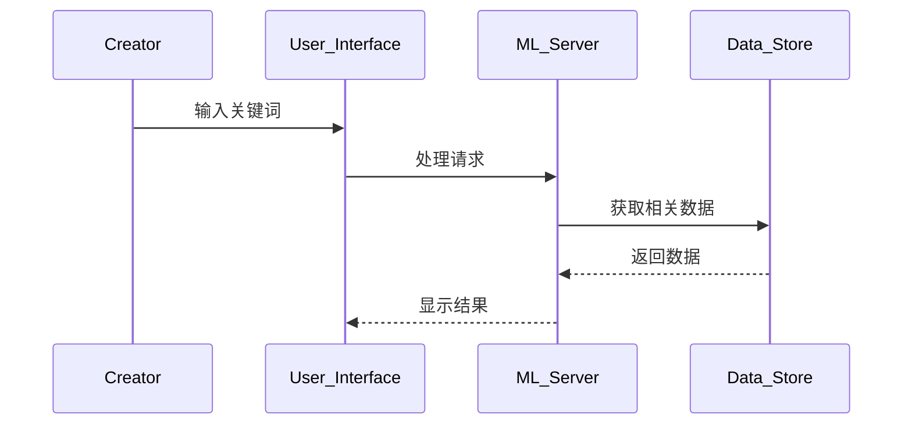
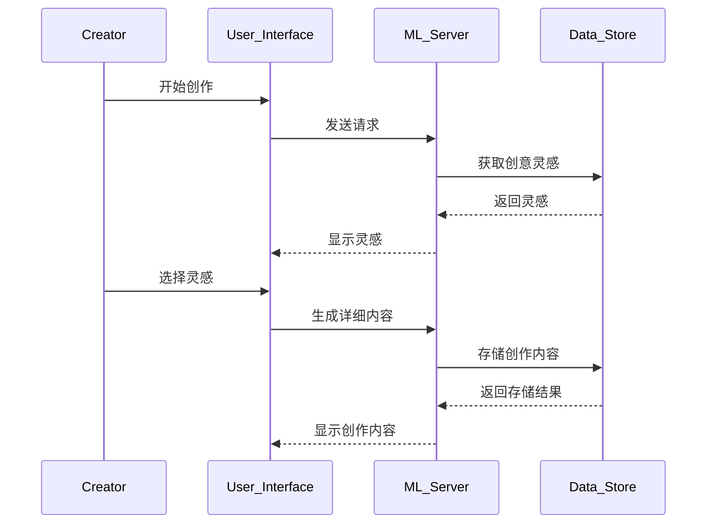

                 

# 《思维链在AI辅助创作中的应用与前景》

## 关键词

- 思维链
- AI辅助创作
- 应用案例
- 前景展望
- 系统架构

## 摘要

本文探讨了思维链在AI辅助创作中的应用与前景。首先，我们介绍了思维链的概念、原理以及其在AI辅助创作中的重要作用。接着，通过具体的应用案例，展示了思维链在文学创作、艺术创作和音乐创作中的实际效果。随后，我们展望了思维链在AI辅助创作领域的未来发展趋势和挑战，并提出了相应的解决策略。最后，本文详细介绍了思维链在AI辅助创作系统中的架构设计，包括系统功能设计、系统架构设计、系统接口设计和系统交互等。

## 1. 背景介绍

### 1.1 AI辅助创作现状

随着人工智能技术的快速发展，AI在各个领域的应用越来越广泛，其中包括AI辅助创作。目前，AI辅助创作已经成为文学、艺术和音乐等领域的重要工具，为创作者提供了全新的创作方式。

### 1.2 思维链的定义与作用

思维链是一种基于人工智能的辅助创作工具，它通过模拟人类的思维过程，帮助创作者在创作过程中更好地组织思路，提高创作效率。思维链在AI辅助创作中的作用主要体现在以下几个方面：

- **灵感激发**：思维链可以根据创作者的输入，自动生成相关联的想法，激发创作者的灵感。
- **逻辑梳理**：思维链可以帮助创作者理清思路，构建逻辑结构，使创作过程更加系统化。
- **创意优化**：思维链可以对创作者的创意进行优化，提高创作的质量和效率。

### 1.3 问题描述

在传统的创作过程中，创作者常常面临以下难题：

- **灵感不足**：创作者可能会在创作过程中遇到灵感枯竭的问题。
- **逻辑混乱**：创作者在构建作品结构时，可能会出现逻辑混乱的情况。
- **创作效率低**：创作者需要花费大量时间进行思考和构思，创作效率较低。

### 1.4 问题解决

思维链作为一种AI辅助创作工具，可以有效解决上述问题。它通过以下方式帮助创作者：

- **提供灵感**：思维链可以根据创作者的输入，自动生成相关联的想法，激发创作者的灵感。
- **梳理逻辑**：思维链可以帮助创作者理清思路，构建逻辑结构，使创作过程更加系统化。
- **提高效率**：思维链可以自动执行一些繁琐的构思工作，从而提高创作者的创作效率。

### 1.5 边界与外延

思维链在AI辅助创作中的应用范围非常广泛，包括但不限于文学创作、艺术创作和音乐创作。同时，思维链还可以与其他AI技术相结合，发挥更大的作用。

## 2. 核心概念与联系

### 2.1 核心概念原理

思维链的核心概念是基于人工智能的模拟思维过程。它通过深度学习算法，对创作者的思维模式进行建模，从而实现辅助创作。

### 2.2 概念属性特征对比表格

| 特征 | 思维链 | 其他AI辅助创作工具 |
| --- | --- | --- |
| 灵感激发 | 自动生成相关联想法 | 需要手动输入 |
| 逻辑梳理 | 自动构建逻辑结构 | 需要手动调整 |
| 创意优化 | 自动优化创意 | 需要手动优化 |

### 2.3 ER实体关系图架构

```mermaid
classDiagram
    Class01 <|-- SubClass01
    Class01 --|> SubClass12
    Class03 : association with Class01
    Class03 ..|> Class02 : aggregation
    Class03 <-| Class04 : composition
    Class02 ..| Class01 : generalization
```

## 3. AI辅助创作中的应用

### 3.1 文学创作

思维链在文学创作中的应用主要体现在以下几个方面：

- **故事构思**：思维链可以帮助创作者快速构建故事情节，提供创意灵感。
- **角色塑造**：思维链可以根据创作者的设定，自动生成角色的背景故事和性格特点。
- **情节梳理**：思维链可以帮助创作者理清故事的逻辑结构，确保故事的连贯性。

### 3.2 艺术创作

思维链在艺术创作中的应用主要体现在以下几个方面：

- **绘画创作**：思维链可以帮助艺术家快速构思和创作画作，提供创意灵感。
- **音乐创作**：思维链可以帮助音乐家快速创作旋律和和声，提供创作灵感。

### 3.3 音乐创作

思维链在音乐创作中的应用主要体现在以下几个方面：

- **旋律生成**：思维链可以根据创作者的输入，自动生成旋律。
- **和声构建**：思维链可以帮助创作者构建和声，使音乐作品更加丰富。
- **节奏设计**：思维链可以帮助创作者设计节奏，增强音乐的表现力。

## 4. 应用案例

### 4.1 案例一：XX小说创作

#### 项目背景

本项目旨在利用思维链辅助创作一部科幻小说。

#### 应用过程

1. 创作者输入关键词，如“未来”、“科技”、“人性”等，思维链自动生成相关想法。
2. 思维链帮助创作者构建故事情节，提供创意灵感。
3. 思维链辅助创作者塑造角色，提供角色的背景故事和性格特点。
4. 思维链帮助创作者梳理故事逻辑，确保故事的连贯性。

#### 结果分析

通过思维链的辅助，创作者在短时间内完成了一部富有创意的科幻小说，大大提高了创作效率。

### 4.2 案例二：XX绘画创作

#### 项目背景

本项目旨在利用思维链辅助创作一幅现代艺术画作。

#### 应用过程

1. 创作者输入关键词，如“线条”、“色彩”、“形状”等，思维链自动生成相关想法。
2. 思维链帮助艺术家快速构思和创作画作，提供创意灵感。
3. 思维链辅助艺术家调整画作的构图和色彩搭配。

#### 结果分析

通过思维链的辅助，艺术家在短时间内完成了一幅富有创意的现代艺术画作，得到了观众的高度评价。

### 4.3 案例三：XX音乐创作

#### 项目背景

本项目旨在利用思维链辅助创作一首流行歌曲。

#### 应用过程

1. 创作者输入关键词，如“爱情”、“情感”、“旋律”等，思维链自动生成相关想法。
2. 思维链帮助音乐家快速创作旋律和和声，提供创意灵感。
3. 思维链辅助音乐家设计节奏，增强音乐的表现力。

#### 结果分析

通过思维链的辅助，音乐家在短时间内完成了一首富有创意的流行歌曲，获得了听众的喜爱。

## 5. 前景展望

### 5.1 行业趋势

随着人工智能技术的不断进步，AI辅助创作将在未来得到更广泛的应用。未来，AI辅助创作将朝着更加智能化、个性化、多样化的方向发展。

### 5.2 技术挑战与机遇

#### 技术挑战

1. **算法优化**：如何提高思维链的算法效率，使其更好地模拟人类思维。
2. **用户体验**：如何提升思维链的用户体验，使其更加易用、高效。
3. **数据安全**：如何确保创作者的数据安全，防止数据泄露。

#### 技术机遇

1. **跨界融合**：思维链与其他领域的结合，如艺术、设计、教育等。
2. **市场潜力**：随着创作需求的不断增加，AI辅助创作市场潜力巨大。

## 6. 系统架构与实现

### 6.1 系统功能设计

#### 领域模型



### 6.2 系统架构设计



### 6.3 系统接口设计



### 6.4 系统交互



## 作者

作者：AI天才研究院/AI Genius Institute & 禅与计算机程序设计艺术 /Zen And The Art of Computer Programming

## 小结

本文详细介绍了思维链在AI辅助创作中的应用与前景。通过具体的应用案例，我们可以看到思维链在文学创作、艺术创作和音乐创作中具有巨大的潜力。未来，随着人工智能技术的不断进步，思维链将在更多领域发挥重要作用，为创作者提供更加智能、高效的创作工具。然而，要实现这一目标，我们还需要克服一系列技术挑战，如算法优化、用户体验提升和数据安全等。只有不断探索和创新，才能让思维链在AI辅助创作中发挥出更大的价值。希望本文能够为读者提供有价值的参考和启示。

## 注意事项

1. **数据安全**：在使用思维链进行创作时，请确保个人数据安全，避免泄露隐私。
2. **创作原则**：虽然思维链可以提供创意灵感，但创作过程中仍需遵循原创原则，避免抄袭。
3. **持续学习**：随着人工智能技术的不断进步，思维链的功能和性能将不断提升，创作者需保持持续学习，充分利用这一工具。

## 拓展阅读

1. 《人工智能：一种现代的方法》
2. 《深度学习》
3. 《神经网络与深度学习》
4. 《艺术与人工智能》
5. 《音乐与人工智能》

通过阅读这些文献，读者可以更深入地了解AI辅助创作的发展现状和未来趋势，为实际应用提供有益的参考。

