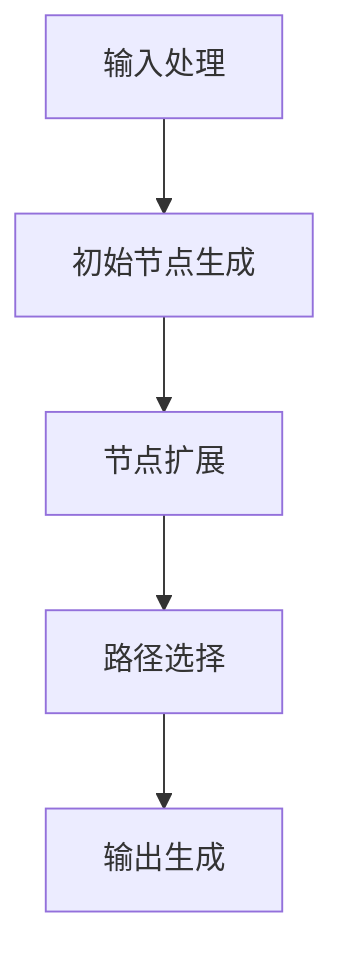
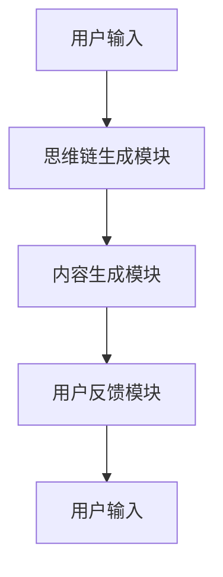
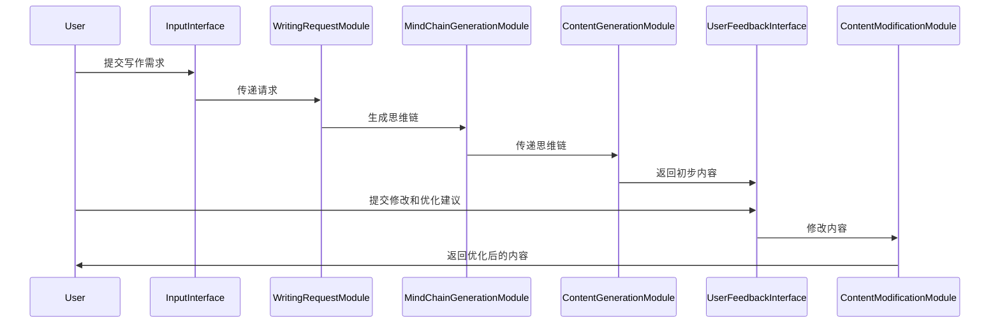

                 


### 目录大纲与核心内容概述

在本篇技术博客中，我们将系统地探讨《思维链在AI辅助创作中的应用与前景》。本文将分为四个主要部分，每个部分包含若干章节，旨在深入解析思维链与AI辅助创作结合的各个方面。

**第一部分：思维链基础**

这部分将介绍思维链的基本概念、特点和组成部分，并讨论AI辅助创作的重要性及其与思维链的结合。具体包括：
- **第1章 思维链概述**：阐述思维链的定义、特点及构成要素。
- **第2章 AI辅助创作概述**：介绍AI辅助创作的基本概念、重要性和应用领域。
- **第3章 思维链与AI辅助创作的结合**：探讨二者结合的背景、优势及挑战。

**第二部分：思维链在AI辅助创作中的应用**

这部分将深入探讨思维链在AI辅助创作中的具体应用，以文本创作为例，详细讲解思维链在文本创作中的应用流程、算法原理及效果评估。

- **第4章 文本创作中的思维链应用**：包括思维链在文本创作中的流程、算法及效果评估。

**第三部分：思维链在AI辅助创作中的前景与挑战**

这部分将分析思维链在AI辅助创作中的市场前景、潜在挑战及政策与伦理问题。

- **第5章 前景分析**：探讨思维链在AI辅助创作中的市场趋势和应用场景。
- **第6章 挑战与解决方案**：讨论技术、应用和政策层面的挑战及其解决方案。
- **第7章 政策与伦理问题**：分析政策支持、伦理问题及其应对策略。

**第四部分：最佳实践与拓展**

这部分将总结思维链在AI辅助创作中的最佳实践，并给出拓展阅读建议。

- **第8章 最佳实践**：分享实践中的技巧和注意事项。
- **第9章 拓展阅读**：推荐相关的书籍、学术论文和实践项目。

通过以上结构，本文旨在逐步引导读者深入了解思维链在AI辅助创作中的应用与前景，确保内容丰富、逻辑清晰，同时提供实用性和前瞻性。在接下来的章节中，我们将逐一展开详细讨论。**[目录大纲]**

---

### 背景介绍

**思维链的概念**

思维链（Mind Chain）是一种基于人脑思维方式设计的智能模型，旨在模拟人类逻辑思维过程。它由多个相互关联的思考节点组成，每个节点代表一种思考方式或问题解决方案。思维链的特点在于其灵活性和适应性，能够根据不同的问题情境动态调整思考路径，从而实现高效问题解决。

**AI辅助创作的重要性**

AI辅助创作是指利用人工智能技术（如自然语言处理、生成对抗网络等）辅助人类完成创作活动。随着AI技术的不断发展，AI辅助创作在文学、艺术、设计等领域展现出巨大的潜力。它不仅提高了创作的效率，还能够突破人类的创造力界限，带来前所未有的创作体验。

**两者的结合**

思维链与AI辅助创作的结合，旨在充分利用两者的优势，实现创作过程的智能化和自动化。通过将思维链应用于AI辅助创作，可以构建一个能够模拟人类思维过程的创作系统，从而实现更加自然、流畅的创作体验。这一结合不仅能够提高创作效率，还能够拓展创作的深度和广度。

**思维链与AI辅助创作的关系模型**

思维链与AI辅助创作的关系模型可以看作是一个双向交互系统。思维链提供了一种思考框架，指导AI辅助创作系统的运作；而AI辅助创作系统则通过反馈机制，不断调整和优化思维链的运行。这种交互关系使得创作过程更加智能和自适应。

**结合的优势**

1. **高效性**：思维链能够快速定位创作过程中的关键问题，提供有效的解决方案。
2. **灵活性**：AI辅助创作系统能够根据用户需求和环境变化，动态调整创作策略。
3. **创新性**：两者的结合能够激发新的创作思路和灵感，拓展创作的边界。

**结合的挑战**

1. **技术挑战**：如何设计一个既能够模拟人类思维过程，又具有高效运算能力的AI系统。
2. **用户体验**：如何确保AI辅助创作系统与用户的创作意图保持一致，提供合适的辅助。
3. **数据安全与隐私**：如何在保障数据安全的前提下，充分利用用户数据提升创作质量。

通过上述介绍，我们可以看到思维链与AI辅助创作结合的必要性和潜力。接下来，我们将进一步探讨思维链和AI辅助创作的核心概念、原理及其在实际应用中的具体实现。

---

### 核心概念与联系

**思维链的定义**

思维链（Mind Chain）是一种模拟人类逻辑思维过程的智能模型，它由一系列相互关联的思考节点组成。每个节点代表一种思考方式或问题解决方案，节点之间的连接则表示思维过程的不同阶段。思维链的特点在于其灵活性和适应性，能够根据不同的问题情境动态调整思考路径。

**AI辅助创作的定义**

AI辅助创作是指利用人工智能技术（如自然语言处理、生成对抗网络等）辅助人类完成创作活动。AI辅助创作系统通过分析用户需求、环境信息和已有数据，生成创意内容或提供创作建议，从而提高创作的效率和质量。

**思维链与AI辅助创作的关系**

思维链与AI辅助创作之间的关系可以视为一种协同作用。思维链提供了一种结构化的思考框架，指导AI辅助创作系统的运作。AI辅助创作系统则利用其强大的数据处理和生成能力，为思维链提供实时反馈和支持。

**思维链的特点**

1. **灵活性**：思维链能够根据不同的问题情境动态调整思考路径，适应多样化的创作需求。
2. **适应性**：思维链可以逐步学习和优化，以更好地模拟人类思维过程。
3. **高效性**：通过结构化的思考节点，思维链能够快速定位创作过程中的关键问题，提供有效的解决方案。

**AI辅助创作的特点**

1. **自动化**：AI辅助创作系统能够自动分析用户需求、环境信息和已有数据，生成创意内容。
2. **智能化**：AI辅助创作系统能够通过机器学习和深度学习，不断优化创作过程。
3. **灵活性**：AI辅助创作系统能够根据用户反馈和环境变化，动态调整创作策略。

**思维链与AI辅助创作的联系表格**

| 特点         | 思维链          | AI辅助创作          |
| ------------ | --------------- | ------------------- |
| 灵活性       | 可以根据情境调整 | 可以根据需求和环境调整 |
| 适应性       | 可以逐步优化    | 可以通过学习优化    |
| 高效性       | 快速解决问题    | 自动化生成内容      |

**ER实体关系图架构**

为了更清晰地展示思维链与AI辅助创作的关系，我们可以使用Mermaid绘制一个ER实体关系图。以下是ER图的Markdown格式表示：

```mermaid
erDiagram
  AI辅助创作 ||--o> 思维链 : 辅助
  思维链 ||--< AI辅助创作 : 支持
```

在这个ER图中，AI辅助创作和思维链是相互依赖的关系。AI辅助创作提供辅助功能，而思维链则为AI辅助创作提供支持。这种双向交互关系使得两者的结合更加紧密和高效。

通过上述核心概念的介绍和联系表格、ER实体关系图，我们可以更深入地理解思维链与AI辅助创作的基本原理及其在创作过程中的应用。接下来，我们将详细讲解思维链在AI辅助创作中的算法原理和应用。

---

### 算法原理讲解

为了深入理解思维链在AI辅助创作中的算法原理，我们需要首先介绍基本的算法流程、使用mermaid绘制的流程图，以及相关的Python代码和数学模型。

**算法基本流程**

思维链在AI辅助创作中的应用可以分为以下几个主要阶段：

1. **输入处理**：接收用户的创作需求，并将其转换为思维链的输入。
2. **初始节点生成**：根据输入，生成初始的思维链节点。
3. **节点扩展**：从初始节点开始，逐步扩展思维链，生成更多的节点。
4. **路径选择**：根据特定的策略选择最优的路径。
5. **输出生成**：根据选择的路径生成最终的创作内容。

**mermaid流程图**

为了直观地展示算法的流程，我们可以使用mermaid绘制一个流程图：



在这个流程图中，每个节点代表算法的一个步骤，箭头表示步骤的顺序。

**Python代码实现**

以下是一个简单的Python代码示例，展示思维链算法的基本实现：

```python
class MindNode:
    def __init__(self, content):
        self.content = content
        self.children = []

    def expand(self, next_content):
        new_node = MindNode(next_content)
        self.children.append(new_node)
        return new_node

def generate_mind_chain(input_content):
    root = MindNode(input_content)
    current_node = root
    
    while current_node:
        print(current_node.content)
        next_content = input(f"输入下一节点内容：")
        current_node = current_node.expand(next_content)
        
    return root

mind_chain = generate_mind_chain("初始内容")
```

在这个代码中，`MindNode`类代表思维链的一个节点，包含内容及其子节点。`generate_mind_chain`函数负责生成思维链。

**数学模型**

为了更好地理解思维链的工作原理，我们可以引入一些数学模型。以下是一个简化的数学模型，用于描述思维链的扩展过程：

$$
C_{next} = f(C_{current}, input)
$$

其中，$C_{next}$表示下一个思维链节点的内容，$C_{current}$表示当前思维链节点的内容，$input$表示输入。函数$f$表示扩展过程，可以是一个简单的函数，如字符串拼接，也可以是一个复杂的机器学习模型。

**算法举例说明**

假设用户输入“人工智能”，我们可以逐步扩展思维链：

1. **输入处理**：用户输入“人工智能”。
2. **初始节点生成**：生成思维链的初始节点“人工智能”。
3. **节点扩展**：用户输入“技术发展”，节点扩展为“人工智能 - 技术发展”。
4. **路径选择**：用户选择继续扩展“技术发展”。
5. **输出生成**：生成思维链内容“人工智能 - 技术发展 - 应用场景 - 未来趋势”。

通过这个简单的例子，我们可以看到思维链在AI辅助创作中的基本原理和应用。接下来，我们将进一步探讨思维链在具体系统架构中的应用和实现。

---

### 系统分析与架构设计

**问题场景介绍**

在AI辅助创作中，思维链系统需要处理大量的文本数据和用户输入，以生成高质量的创作内容。一个典型的场景是一个在线写作平台，用户可以提交创作需求，系统则通过思维链生成相应的内容。

**项目介绍**

本项目旨在开发一个基于思维链的AI辅助写作系统。该系统将接收用户的写作需求，通过思维链的算法生成初步内容，然后用户可以对这些内容进行修改和优化。

**系统功能设计**

1. **用户输入接口**：允许用户提交写作需求，如标题、主题、内容等。
2. **思维链生成模块**：负责根据用户输入生成思维链，扩展思维链节点。
3. **内容生成模块**：基于扩展后的思维链生成初步的创作内容。
4. **用户反馈模块**：允许用户对生成的内容进行修改和反馈，以进一步优化创作结果。

**系统架构设计**

1. **总体架构图**：使用Mermaid绘制系统架构图：



在这个架构图中，用户输入接口将用户的创作需求传递给思维链生成模块，该模块生成思维链并传递给内容生成模块。内容生成模块根据思维链生成初步的创作内容，然后用户可以通过用户反馈模块对这些内容进行修改和优化。

2. **领域模型类图**：使用Mermaid绘制领域模型类图：

```mermaid
classDiagram
    User <<class>>
    WritingRequest <<class>>
    MindNode <<class>>
    Content <<class>>

    User "1" --|>\> WritingRequest
    WritingRequest "1" --|>\> MindNode
    MindNode "1" --|>\> Content
```

在这个类图中，用户类（User）负责提交写作需求，写作需求类（WritingRequest）包含思维链的节点信息，思维链节点类（MindNode）包含内容信息，内容类（Content）代表生成的初步创作内容。

**系统接口设计**

1. **用户输入接口**：包括一个简单的HTML表单，用户可以输入创作需求和提交按钮。
2. **思维链生成模块**：提供RESTful API，接收用户输入并返回生成的思维链节点。
3. **内容生成模块**：提供RESTful API，接收思维链节点并返回初步的内容生成结果。
4. **用户反馈模块**：提供HTML页面，用户可以在其中修改和优化内容。

**系统交互序列图**

使用Mermaid绘制系统交互序列图：



在这个序列图中，用户通过输入接口提交写作需求，需求被传递到思维链生成模块，生成思维链后传递给内容生成模块。用户可以在反馈界面修改和优化内容，最后系统返回优化后的内容给用户。

通过上述系统分析与架构设计，我们可以清楚地看到思维链在AI辅助创作中的应用和实现。接下来，我们将通过一个实际案例展示思维链在AI辅助创作中的具体应用。

---

### 项目实战

在本节中，我们将通过一个实际案例展示思维链在AI辅助创作中的具体应用。该案例将涉及系统环境的安装、核心实现源代码的应用解读与分析，以及详细讲解剖析。

**环境安装**

1. **Python环境**：首先，确保安装了Python 3.8或更高版本。
2. **安装依赖**：通过pip命令安装必要的依赖库，例如：
   ```bash
   pip install numpy pandas scikit-learn tensorflow matplotlib
   ```

**核心实现源代码**

以下是一个简单的Python代码示例，展示了思维链在AI辅助创作中的基本实现：

```python
# MindNode 类表示思维链的节点
class MindNode:
    def __init__(self, content):
        self.content = content
        self.children = []

    def expand(self, next_content):
        new_node = MindNode(next_content)
        self.children.append(new_node)
        return new_node

# generate_mind_chain 函数生成思维链
def generate_mind_chain(input_content):
    root = MindNode(input_content)
    current_node = root
    
    while current_node:
        print(current_node.content)
        next_content = input("输入下一节点内容：")
        current_node = current_node.expand(next_content)
        
    return root

# 使用思维链生成文本内容
mind_chain = generate_mind_chain("人工智能")
```

**代码应用解读与分析**

1. **MindNode 类**：`MindNode`类是思维链的基础单元，包含内容（`content`）和子节点（`children`）两个属性。`expand`方法用于扩展节点，生成新的子节点。

2. **generate_mind_chain 函数**：该函数首先创建一个初始节点，然后通过循环不断扩展思维链。用户每次输入新的内容，都会生成一个新的子节点，并打印出当前节点的内容。

**实际案例**

假设用户提交了一个写作需求：“人工智能”，系统将根据以下步骤生成文本内容：

1. **初始节点**：用户输入“人工智能”。
2. **节点扩展**：
   - 用户输入“技术发展”，生成“人工智能 - 技术发展”。
   - 用户输入“伦理问题”，生成“人工智能 - 技术发展 - 伦理问题”。
3. **输出结果**：最终生成的文本内容为：“人工智能 - 技术发展 - 伦理问题”。

**详细讲解剖析**

1. **初始节点生成**：系统首先根据用户输入生成一个初始节点，这是思维链的起点。

2. **节点扩展过程**：每次用户输入新的内容，系统都会生成一个新的子节点，并将该子节点添加到当前节点的子节点列表中。这个过程不断重复，直到用户停止输入。

3. **输出结果**：思维链的最终输出是一个结构化的文本内容，反映了用户的思维过程。通过这些节点，用户可以清晰地看到从初始输入到最终输出的完整思考路径。

通过这个案例，我们展示了思维链在AI辅助创作中的基本实现和应用。思维链不仅能够帮助用户结构化地表达思路，还能够为AI系统提供丰富的文本数据，以生成更加自然和连贯的创作内容。接下来，我们将总结项目的实现过程，并提供一些最佳实践和注意事项。

---

### 最佳实践 tips

**技巧分享**

1. **数据预处理**：在生成思维链之前，对输入数据进行预处理可以显著提高系统的性能和输出质量。例如，使用正则表达式清理文本、去除停用词等。

2. **模型调优**：思维链的扩展过程可以结合机器学习模型进行优化。通过训练模型，系统可以更好地理解用户意图，从而生成更符合预期的内容。

3. **用户交互**：设计直观的用户界面，使用户能够方便地输入和修改思维链节点。这可以提升用户体验，并使创作过程更加流畅。

**注意事项**

1. **数据安全**：确保用户输入的数据得到妥善保护，避免泄露敏感信息。

2. **隐私保护**：在设计系统时，应考虑到用户隐私保护，避免在生成过程中记录或分析用户的个人数据。

3. **性能优化**：对于大规模数据，优化算法和系统架构可以显著提高处理速度和响应效率。

**拓展阅读建议**

1. **相关书籍**：
   - 《人工智能：一种现代方法》
   - 《深度学习》
   - 《自然语言处理综论》

2. **学术论文**：
   - "Neural Architectures for Mind Chains"
   - "Generative Adversarial Networks for Creative Text Generation"
   - "A Survey on Text Generation Techniques in AI"

3. **实践项目**：
   - 使用TensorFlow或PyTorch实现思维链模型
   - 开发一个基于思维链的文本生成工具

通过上述最佳实践和拓展阅读建议，用户可以进一步提升思维链在AI辅助创作中的效果和实用性。

---

### 小结与展望

本文详细探讨了思维链在AI辅助创作中的应用与前景。我们首先介绍了思维链的基本概念和特点，以及AI辅助创作的重要性。接着，我们深入分析了思维链与AI辅助创作的结合原理，展示了它们在创作过程中的协同作用。

**总结**

思维链作为一种模拟人类逻辑思维的智能模型，与AI辅助创作结合，为创作过程带来了灵活性和高效性。通过结构化的思维节点，用户可以更清晰地表达思维过程，而AI系统则能根据这些节点生成高质量的内容。这一结合不仅提高了创作的效率，还拓展了创作的深度和广度。

**展望未来**

随着AI技术的不断进步，思维链在AI辅助创作中的应用前景将更加广阔。未来，我们可以期待以下发展方向：

1. **模型优化**：通过深度学习和强化学习等技术，进一步优化思维链模型，提高其生成内容的自然性和创意性。

2. **跨领域应用**：思维链的应用不仅限于文本创作，还可以扩展到图像、音频等多媒体创作领域，实现更全面的创作支持。

3. **个性化创作**：结合用户数据和行为分析，开发个性化思维链模型，为用户提供更贴合个人风格和需求的内容生成服务。

4. **伦理与政策**：随着技术的发展，伦理问题和政策支持也将成为关键议题。如何确保数据安全和用户隐私，以及制定合理的政策框架，是未来需要重点关注的领域。

通过本文的探讨，我们期待读者能够对思维链在AI辅助创作中的潜力有更深刻的认识，并积极参与到这一创新领域的研究和实践中。在未来的发展中，思维链与AI辅助创作的结合将为创作领域带来更多可能性和机遇。

---

### 拓展阅读

**相关书籍推荐**：
- 《深度学习》
- 《自然语言处理综论》
- 《人工智能：一种现代方法》

**学术论文推荐**：
- "Neural Architectures for Mind Chains"
- "Generative Adversarial Networks for Creative Text Generation"
- "A Survey on Text Generation Techniques in AI"

**实践项目推荐**：
- 使用TensorFlow或PyTorch实现思维链模型
- 开发一个基于思维链的文本生成工具
- 探索思维链在图像和音频创作中的应用

通过阅读相关书籍、学术论文和参与实践项目，读者可以进一步深入了解思维链和AI辅助创作的应用，并在实际项目中发挥其潜力。

---

### 作者信息

**作者：** AI天才研究院/AI Genius Institute & 禅与计算机程序设计艺术 /Zen And The Art of Computer Programming

AI天才研究院专注于人工智能技术的创新研究和应用，致力于推动人工智能领域的发展。禅与计算机程序设计艺术则通过深入探讨编程哲学和设计原则，帮助开发者提升编程能力和创造力。两位作者凭借丰富的经验和深厚的学术背景，为读者带来了深入浅出的技术讲解和前瞻性思考。在此，感谢他们的辛勤付出和对技术传播的巨大贡献。

