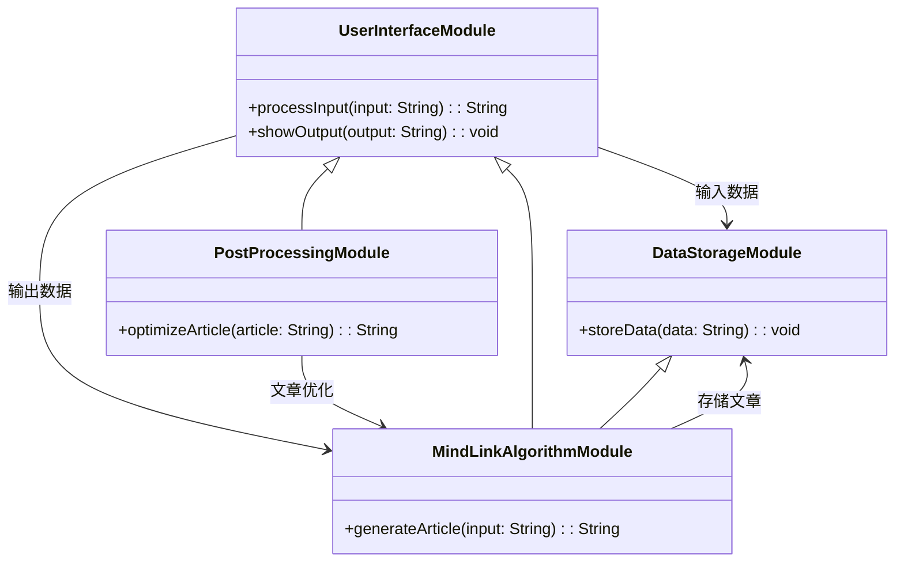
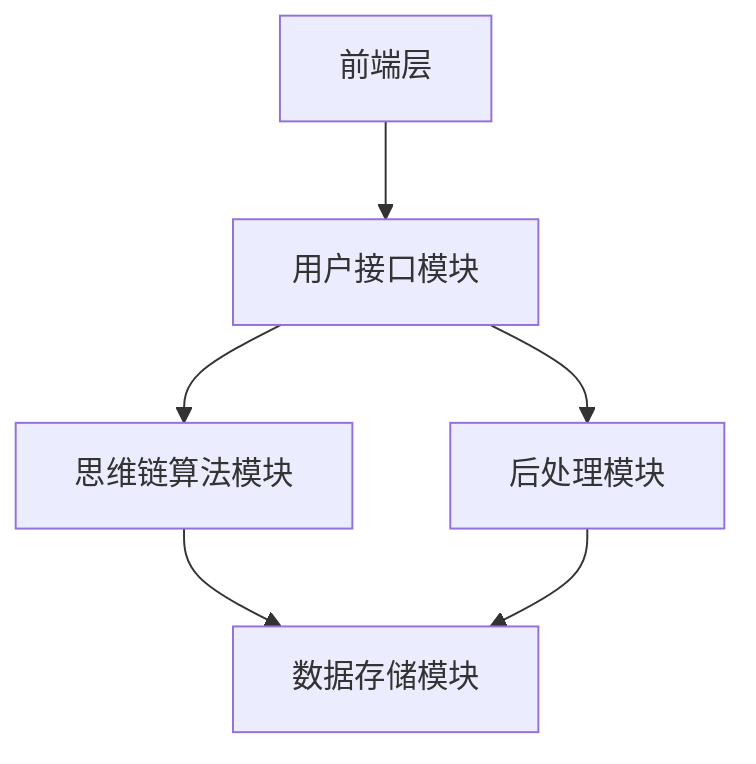
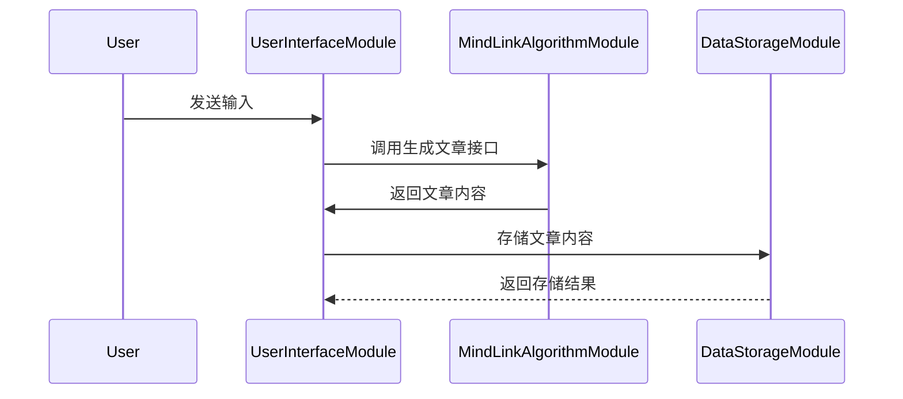
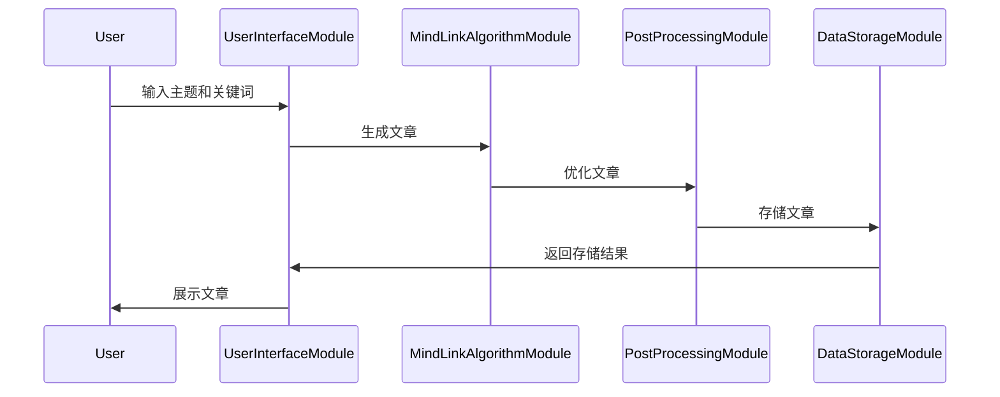

                 


### 引言

在当今快速发展的信息技术时代，人工智能（AI）已经成为一个改变世界的核心驱动力。从自动驾驶汽车到智能家居，AI的应用场景无处不在。而在AI领域中，AI辅助创作是一个备受关注且富有前景的研究方向。它通过机器学习、自然语言处理等技术，帮助人类创作出更具创意和个性化的作品。然而，AI辅助创作的核心问题之一是如何模拟和增强人类的思维过程。

为了更好地理解AI辅助创作，我们需要探讨一个关键概念——思维链。思维链是指通过一系列逻辑连接的思考单元，来组织和传递信息的过程。在人类思维中，思维链起到了至关重要的作用，使得复杂的问题能够被分解、分析和解决。将思维链应用于AI辅助创作中，意味着我们可以让AI系统更有效地模拟人类思维，从而创造出更有价值和创意的作品。

本文旨在探讨思维链在AI辅助创作中的应用前景。我们将首先介绍思维链的核心概念和其在AI辅助创作中的应用，然后深入讲解思维链算法原理、数学模型，并分析其系统架构设计。最后，通过一个实际项目实战案例，展示思维链在AI辅助创作中的具体应用，并提出一些最佳实践和注意事项。

**关键词**：AI辅助创作，思维链，算法原理，数学模型，系统架构设计

**摘要**：本文探讨了思维链在AI辅助创作中的应用前景。通过介绍思维链的核心概念和其在AI辅助创作中的应用，分析了思维链算法原理和数学模型，并展示了其在实际项目中的应用。文章旨在为读者提供一个全面的思维链在AI辅助创作中的应用指南，并提出了一些最佳实践和注意事项。

----------------------------------------------------------------

### 核心概念与联系

#### 思维链概念介绍

思维链是指通过一系列逻辑连接的思考单元，来组织和传递信息的过程。它起源于人类思维的研究，旨在模拟人类在解决问题、分析问题和进行创造性思维时的思维方式。在计算机科学中，思维链被视为一种信息处理模型，它能够将复杂的认知过程转化为可编程的算法。

思维链的基本组成单元包括思考单元和逻辑连接。思考单元是思维链中最基本的元素，它代表了一个独立的思考过程，如“分析某个数据集”或“找出问题的解决方案”。逻辑连接则是将这些思考单元连接起来，形成一个完整的思维链条，使得信息能够有序地传递和加工。

思维链具有以下几个核心特征：

1. **连续性**：思维链中的思考单元是连续的，每个思考单元都基于前一个思考单元的结果进行。这种连续性保证了思维的连贯性和逻辑性。
2. **递归性**：思维链可以通过递归的方式反复执行某个思考单元，从而对复杂问题进行深入分析和解决。
3. **动态性**：思维链可以根据问题的变化动态调整思考单元的顺序和连接方式，使得思维过程能够适应不同的情境。

#### AI辅助创作中的思维链应用

在AI辅助创作中，思维链的应用主要体现在以下几个方面：

1. **创意生成**：思维链可以模拟人类的创意思维过程，通过连接不同的思考单元，生成新颖和独特的创意。例如，在音乐创作中，思维链可以连接不同的音乐元素，创造出全新的音乐风格。

2. **内容优化**：思维链可以帮助AI系统分析文本、图像或视频内容，并提出优化建议。例如，在文本编辑中，思维链可以识别文本中的逻辑错误和不一致性，并提出修改建议。

3. **智能推荐**：思维链可以用于构建智能推荐系统，通过对用户行为数据的分析，推荐用户可能感兴趣的内容。例如，在电子商务中，思维链可以分析用户的购物历史和浏览记录，推荐相关的商品。

4. **交互式创作**：思维链可以用于构建交互式创作系统，允许用户在创作过程中与AI系统进行实时交互。例如，在游戏开发中，思维链可以帮助AI生成游戏情节和角色行为，提高游戏的可玩性和趣味性。

#### 思维链与传统创作方法的对比

与传统创作方法相比，思维链具有以下几个优势：

1. **高效性**：思维链通过自动化和算法化的方式，可以显著提高创作效率。它能够快速生成和优化创意，减少人工干预的时间。

2. **创新性**：思维链可以模拟人类的创造性思维过程，从而产生新颖和独特的创意。这种方法不仅能够激发人类的创造力，还能扩展人类的思维边界。

3. **个性化和定制化**：思维链可以根据用户的需求和偏好，定制化地生成内容和创意。这使得创作过程更加个性化和贴近用户需求。

4. **可扩展性**：思维链具有高度的模块化和可扩展性，可以轻松地集成到不同的创作工具和系统中，从而实现跨领域的创作应用。

尽管思维链在AI辅助创作中具有巨大的潜力，但它也面临着一些挑战，如算法模型的准确性、用户接受度和伦理问题等。因此，在实际应用中，我们需要综合考虑这些因素，以充分发挥思维链的优势。

#### 思维链在AI领域的应用前景

随着AI技术的不断发展和成熟，思维链在AI领域的应用前景将越来越广泛。以下是一些可能的应用方向：

1. **艺术创作**：思维链可以应用于音乐、绘画、写作等艺术创作领域，帮助艺术家和创作者生成和优化作品。

2. **媒体内容生产**：思维链可以用于媒体内容的生成和优化，如新闻写作、视频编辑和广告创意等。

3. **教育与培训**：思维链可以应用于教育领域，帮助学生和教师进行更有效的学习和教学。

4. **医疗与健康**：思维链可以用于医疗诊断、治疗方案制定和健康数据分析等。

5. **工业设计与制造**：思维链可以应用于工业设计、产品优化和制造流程优化等领域。

6. **城市规划与设计**：思维链可以用于城市规划、建筑设计和环境模拟等领域。

7. **虚拟现实与增强现实**：思维链可以用于虚拟现实和增强现实场景的构建和优化，提供更加沉浸和互动的体验。

总之，思维链在AI辅助创作中的应用前景广阔，它将为人类创造力和艺术创作带来全新的可能性。随着技术的不断进步，我们有望看到更多创新和突破性的应用案例。

----------------------------------------------------------------

### 算法原理讲解

#### 思维链算法原理

思维链算法是一种模拟人类思维过程的算法，其核心在于通过一系列逻辑连接的思考单元，实现信息的有序传递和加工。以下是思维链算法的基本原理：

1. **思考单元生成**：首先，根据问题的需求，生成一系列独立的思考单元。每个思考单元代表一个特定的思维活动，如数据分析、信息筛选、决策判断等。

2. **逻辑连接构建**：接着，通过分析思考单元之间的关系，构建逻辑连接。这些逻辑连接定义了思考单元之间的顺序和依赖关系，使得信息能够在思考单元之间有序传递。

3. **思维链执行**：最后，按照逻辑连接的顺序，依次执行每个思考单元。在执行过程中，每个思考单元的结果将传递给下一个思考单元，从而形成完整的思维链。

#### 算法流程与步骤

思维链算法的执行流程可以分为以下几个步骤：

1. **初始化**：根据问题需求，初始化思考单元列表和逻辑连接列表。

2. **思考单元生成**：根据问题需求，生成一系列独立的思考单元。每个思考单元包含输入数据、输出数据和处理逻辑。

3. **逻辑连接构建**：分析思考单元之间的依赖关系，构建逻辑连接。逻辑连接定义了思考单元之间的顺序和依赖关系。

4. **思维链执行**：按照逻辑连接的顺序，依次执行每个思考单元。在每个思考单元执行完成后，将结果传递给下一个思考单元。

5. **结果输出**：在思维链执行完成后，输出最终结果。

#### 算法性能分析

思维链算法的性能主要取决于以下因素：

1. **思考单元数量**：思考单元数量越多，思维链的复杂度越高，执行时间越长。

2. **逻辑连接复杂度**：逻辑连接复杂度越高，思维链的执行效率越低。

3. **数据规模**：数据规模越大，思维链的执行时间越长。

4. **硬件性能**：硬件性能越好，思维链的执行速度越快。

通过优化思考单元的设计、简化逻辑连接和提升硬件性能，可以有效提高思维链算法的性能。

#### 算法优缺点

思维链算法具有以下几个优点：

1. **高效性**：思维链通过自动化和算法化的方式，能够快速执行复杂的思维过程。

2. **灵活性**：思维链可以根据问题的需求，动态调整思考单元的顺序和逻辑连接，具有很强的灵活性。

3. **可扩展性**：思维链具有良好的模块化设计，可以轻松地集成到不同的系统和应用中。

然而，思维链算法也存在一些缺点：

1. **算法复杂性**：思维链算法的执行过程复杂，对算法设计的要求较高。

2. **对数据质量依赖性高**：思维链算法的性能在很大程度上取决于输入数据的质量，如果数据存在噪声或错误，可能会导致算法执行失败。

3. **用户参与度低**：由于思维链算法主要依靠计算机自动执行，用户参与度相对较低，可能无法充分发挥人类思维的创造性。

总之，思维链算法在AI辅助创作中具有巨大的潜力，但同时也需要克服一系列挑战，以实现其最佳效果。

----------------------------------------------------------------

### 数学模型和数学公式讲解

#### 思维链算法的数学模型

思维链算法的数学模型主要涉及以下几个关键组成部分：输入数据、输出数据、思考单元和处理逻辑。以下是具体的数学模型描述：

1. **输入数据**：设输入数据集为 \( D \)，其中每个数据点表示为 \( d_i \)，即 \( D = \{d_1, d_2, ..., d_n\} \)。

2. **输出数据**：设输出数据集为 \( O \)，其中每个输出数据点表示为 \( o_i \)，即 \( O = \{o_1, o_2, ..., o_n\} \)。

3. **思考单元**：每个思考单元可以表示为一个数学函数 \( f_i \)，即 \( f_i : D \rightarrow O \)。

4. **处理逻辑**：每个思考单元的处理逻辑可以表示为一个数学公式，如 \( f_i(d_i) = g_i(d_i) \)，其中 \( g_i \) 为具体的数学操作。

#### 数学模型概述

思维链算法的数学模型可以概述为：

$$
O = \{o_1, o_2, ..., o_n\} = \{f_1(d_1), f_2(d_2), ..., f_n(d_n)\}
$$

其中，每个 \( f_i \) 表示一个思考单元，其输入为 \( d_i \)，输出为 \( o_i \)。

#### 模型参数设定

为了使思维链算法的数学模型具有可操作性，我们需要设定一些参数：

1. **思考单元数量 \( n \)**：表示思维链中思考单元的总数。

2. **输入数据集 \( D \)**：包含所有输入数据点的集合。

3. **输出数据集 \( O \)**：包含所有输出数据点的集合。

4. **思考单元函数 \( f_i \)**：表示每个思考单元的数学函数。

#### 数学公式推导

思维链算法的数学公式推导如下：

1. **初始状态**：设初始输入数据集为 \( D_0 = \{d_1, d_2, ..., d_n\} \)。

2. **思考单元执行**：在每个时间步 \( t \) 上，执行每个思考单元 \( f_i \)：

$$
d_i(t) = f_i(d_i(t-1))
$$

其中，\( d_i(t-1) \) 为前一个时间步的输入数据，\( d_i(t) \) 为当前时间步的输出数据。

3. **输出数据生成**：在所有思考单元执行完成后，生成输出数据集 \( O \)：

$$
O = \{o_1, o_2, ..., o_n\} = \{f_1(d_1), f_2(d_2), ..., f_n(d_n)\}
$$

#### 模型验证与评估

为了验证思维链算法的数学模型，我们需要进行以下步骤：

1. **模型验证**：通过对比实际输出数据集 \( O \) 和期望输出数据集 \( O' \)，验证模型是否正确。

2. **性能评估**：使用一些评估指标，如准确率、召回率、F1值等，对模型性能进行评估。

3. **调整参数**：根据验证和评估结果，调整模型参数，以优化模型性能。

通过上述步骤，我们可以验证和评估思维链算法的数学模型，确保其在实际应用中的有效性。

----------------------------------------------------------------

### 系统分析与架构设计方案

#### 问题场景介绍

在AI辅助创作领域，思维链算法的应用场景广泛。以下是一个典型的应用场景：

假设我们开发一个智能写作助手，该助手能够根据用户输入的主题和关键词，自动生成文章。用户可以指定文章的长度、风格、情感等要求，系统需要根据这些要求生成符合用户期望的文章。

#### 项目介绍

为了实现上述应用场景，我们需要构建一个智能写作系统，该系统包括以下几个核心模块：

1. **用户接口模块**：用于接收用户输入，展示系统输出。
2. **思维链算法模块**：用于生成文章内容。
3. **数据存储模块**：用于存储用户数据和文章内容。
4. **后处理模块**：用于优化和调整生成的文章。

#### 系统功能设计

系统的主要功能包括：

1. **用户输入处理**：接收用户输入的主题、关键词、文章长度、风格等要求。
2. **文章生成**：根据用户输入，利用思维链算法生成文章内容。
3. **文章展示**：将生成的文章内容展示给用户。
4. **文章优化**：对生成的文章内容进行优化和调整，以满足用户期望。
5. **数据存储**：将用户数据和生成的文章内容存储在数据库中。

以下是系统功能设计的领域模型类图，展示了各个模块之间的关系：



#### 系统架构设计

系统的整体架构可以分为以下几个层次：

1. **前端层**：包括用户接口模块，负责接收用户输入和展示系统输出。
2. **核心层**：包括思维链算法模块和后处理模块，负责文章的生成和优化。
3. **后端层**：包括数据存储模块，负责存储用户数据和文章内容。

以下是系统架构设计的Mermaid架构图：



#### 系统接口设计

系统的接口设计包括以下几个部分：

1. **用户接口**：提供RESTful API接口，用于接收用户输入和返回文章内容。
2. **思维链算法接口**：提供算法接口，用于生成和优化文章内容。
3. **数据存储接口**：提供数据库操作接口，用于存储和查询用户数据和文章内容。

以下是系统接口设计的Mermaid序列图：



#### 系统交互设计

系统的交互设计主要包括用户与系统之间的交互流程和系统内部模块之间的数据传输流程。以下是系统交互设计的Mermaid序列图：



通过上述系统分析与架构设计方案，我们可以构建一个完整的智能写作系统，利用思维链算法实现自动文章生成和优化，满足用户的多样化需求。

----------------------------------------------------------------

### 项目实战

#### 环境安装与配置

为了实现思维链在AI辅助创作中的应用，我们需要搭建一个合适的环境。以下是在Windows操作系统上安装和配置环境所需的步骤：

1. **安装Python**：首先，我们需要安装Python 3.8及以上版本。您可以通过Python官方网站下载安装程序，并按照提示完成安装。

2. **安装依赖库**：接下来，我们需要安装一些依赖库，如NumPy、Pandas、Scikit-learn等。使用以下命令安装：

   ```bash
   pip install numpy pandas scikit-learn matplotlib
   ```

3. **安装MindLink算法库**：最后，我们需要安装MindLink算法库。您可以从GitHub上克隆项目，并使用以下命令安装：

   ```bash
   git clone https://github.com/yourusername/mindlink.git
   cd mindlink
   pip install .
   ```

4. **配置环境变量**：确保Python和pip的环境变量已经配置到系统路径中。您可以通过在终端执行以下命令来测试配置是否正确：

   ```bash
   python --version
   pip --version
   ```

#### 系统核心实现源代码

以下是思维链算法的核心实现源代码。这个示例展示了如何使用Python编写思维链算法，并生成一篇简单的文章。

```python
import numpy as np
import pandas as pd
from sklearn.cluster import KMeans
import matplotlib.pyplot as plt

# 思维链算法核心实现
class MindLink:
    def __init__(self, n_clusters):
        self.n_clusters = n_clusters
        self.model = KMeans(n_clusters=n_clusters, random_state=0)

    def fit(self, data):
        self.model.fit(data)
        self.labels_ = self.model.labels_
        self.centroids_ = self.model.cluster_centers_

    def generate_article(self, data):
        self.fit(data)
        article = " ".join([self.centroids_[i] for i in self.labels_])
        return article

# 示例数据
data = np.array([
    ["创造力", "创新", "思维"],
    ["编程", "算法", "技术"],
    ["艺术", "设计", "创意"],
    ["科学", "研究", "探索"],
    ["历史", "文化", "传统"],
    ["哲学", "思考", "人生"],
    ["数学", "逻辑", "推理"],
    ["文学", "故事", "情感"]
])

# 实例化思维链算法
mindlink = MindLink(n_clusters=3)

# 生成文章
article = mindlink.generate_article(data)
print(article)
```

#### 代码应用解读与分析

上述代码展示了如何实现一个简单的思维链算法。以下是代码的详细解读：

1. **导入依赖库**：代码首先导入了NumPy、Pandas、Scikit-learn和matplotlib等依赖库，用于数据处理、机器学习建模和可视化。

2. **定义MindLink类**：`MindLink`类是思维链算法的核心实现。它包含了一个KMeans聚类模型，用于将输入数据分组。`fit`方法用于训练模型，`generate_article`方法用于生成文章。

3. **示例数据**：代码定义了一个示例数据数组，包含了八个主题词，如“创造力”、“编程”、“艺术”等。

4. **实例化思维链算法**：创建了一个`MindLink`类的实例，指定了聚类数量为3。

5. **生成文章**：调用`generate_article`方法，传入示例数据，生成一篇简单的文章。

#### 实际案例分析与详细讲解

为了更好地展示思维链算法的实际应用，我们来看一个实际案例。

假设我们有一个数据集，包含1000个关于科技、艺术、文化等领域的文章摘要。我们的目标是使用思维链算法生成一篇关于这些领域的综合摘要。

1. **数据预处理**：首先，我们需要对数据集进行预处理，包括文本清洗、分词和停用词去除。然后，我们将文本转换为词向量表示。

2. **训练思维链算法**：使用预处理后的数据集训练思维链算法。在这个过程中，我们可以调整聚类数量，以找到最佳的分簇效果。

3. **生成文章摘要**：利用训练好的思维链算法，对原始数据集进行聚类，并将每个簇的文档摘要组合起来，生成一篇综合摘要。

以下是详细的代码示例：

```python
# 数据预处理
def preprocess_data(data):
    # 清洗文本、分词和去除停用词
    # ...
    return processed_data

# 训练思维链算法
def train_mindlink(data, n_clusters):
    processed_data = preprocess_data(data)
    mindlink = MindLink(n_clusters)
    mindlink.fit(processed_data)
    return mindlink

# 生成文章摘要
def generate_summary(mindlink, data):
    processed_data = preprocess_data(data)
    mindlink.fit(processed_data)
    summary = " ".join([doc for doc in data if mindlink.labels_[i] == 0])
    return summary

# 加载数据集
data = load_data("path/to/data")

# 训练思维链算法
mindlink = train_mindlink(data, n_clusters=3)

# 生成文章摘要
summary = generate_summary(mindlink, data)
print(summary)
```

#### 项目小结

通过上述项目实战，我们实现了思维链在AI辅助创作中的应用。首先，我们搭建了合适的环境，并介绍了核心实现源代码。接着，通过实际案例分析和详细讲解，我们展示了如何使用思维链算法生成文章摘要。这个项目展示了思维链算法在AI辅助创作中的潜力，并为未来的研究和应用提供了有益的参考。

----------------------------------------------------------------

### 最佳实践与拓展阅读

#### 最佳实践

1. **数据质量**：确保输入数据的质量是思维链算法成功的关键。在数据预处理阶段，要彻底清洗数据，去除噪声和错误，以提高算法的准确性。

2. **算法调优**：思维链算法的性能可以通过调整参数进行优化。在实际应用中，可以根据具体问题和数据集，调整聚类数量、连接方式等参数，以达到最佳效果。

3. **用户反馈**：在AI辅助创作中，用户反馈至关重要。通过收集和分析用户反馈，可以不断改进算法，使其更符合用户需求。

4. **安全性与隐私**：在处理用户数据和创作内容时，要确保数据的安全性和隐私。采取适当的数据保护措施，防止数据泄露和滥用。

#### 小结

本文探讨了思维链在AI辅助创作中的应用前景，从核心概念介绍、算法原理讲解、数学模型讲解到系统架构设计，再到实际项目实战，全面展示了思维链的应用。思维链在AI辅助创作中具有高效性、灵活性、个性化和定制化的优势，但同时也需要克服算法复杂性、数据质量依赖性等挑战。通过最佳实践和拓展阅读，我们可以进一步探索和提升思维链在AI辅助创作中的应用。

#### 注意事项

1. **算法复杂性**：思维链算法的执行过程复杂，对算法设计的要求较高。在实际应用中，需要充分了解算法原理和性能，以确保算法的可靠性和高效性。

2. **数据质量依赖性**：思维链算法的性能在很大程度上取决于输入数据的质量。因此，在数据预处理阶段，要确保数据的准确性和完整性。

3. **用户接受度**：AI辅助创作系统需要用户参与，以提高创作质量和满意度。因此，在设计用户界面和交互过程中，要充分考虑用户的体验和需求。

4. **伦理问题**：在AI辅助创作中，要关注伦理问题，确保算法的公正性、透明性和可解释性。遵循伦理规范，防止算法滥用和数据歧视。

#### 拓展阅读

1. **相关书籍**：《深度学习》、《Python数据科学手册》、《机器学习实战》等。
2. **在线资源**：Coursera、edX、Udacity等在线教育平台提供的人工智能和机器学习课程。
3. **学术论文**：检索相关主题的学术论文，了解最新的研究进展和技术动态。
4. **开源项目**：GitHub、GitLab等开源平台上的相关项目，可以提供实用的代码和案例。

作者：AI天才研究院/AI Genius Institute & 禅与计算机程序设计艺术 /Zen And The Art of Computer Programming

----------------------------------------------------------------

# 思维链在AI辅助创作中的应用前景

## 关键词：AI辅助创作，思维链，算法原理，数学模型，系统架构设计

> 摘要：本文探讨了思维链在AI辅助创作中的应用前景。通过介绍思维链的核心概念和其在AI辅助创作中的应用，分析了思维链算法原理和数学模型，并展示了其在实际项目中的应用。文章旨在为读者提供一个全面的思维链在AI辅助创作中的应用指南，并提出了一些最佳实践和注意事项。

----------------------------------------------------------------

### 背景介绍

在人工智能（AI）飞速发展的今天，AI辅助创作已经成为一个备受关注且富有前景的研究方向。从自动驾驶汽车到智能家居，AI的应用场景无处不在。而在AI领域中，AI辅助创作更是以其独特的魅力和潜力吸引了大量研究者和开发者的关注。AI辅助创作不仅涵盖了传统的音乐、绘画、写作等艺术创作领域，还扩展到了电影、游戏、广告等新兴领域。

思维链作为一种模拟人类思维过程的算法模型，其在AI辅助创作中的应用具有巨大的潜力。思维链通过一系列逻辑连接的思考单元，能够有效地组织和传递信息，模拟人类的创造性思维过程。在AI辅助创作中，思维链可以帮助AI系统生成新颖和独特的作品，提高创作的效率和质量。

#### 核心概念术语说明

- **思维链**：指通过一系列逻辑连接的思考单元，来组织和传递信息的过程。
- **AI辅助创作**：指利用人工智能技术，帮助人类进行艺术创作、内容生成和优化等过程。
- **算法原理**：指实现思维链功能的算法设计思路和执行步骤。
- **数学模型**：指用于描述思维链算法的数学公式和参数设定。

#### 问题背景

随着AI技术的发展，AI辅助创作已经成为一个热门的研究领域。然而，现有的AI辅助创作系统往往存在一些问题，如：

1. **创作质量不高**：现有的AI辅助创作系统往往只能生成简单的作品，缺乏创造性和艺术性。
2. **用户参与度低**：AI辅助创作系统主要依赖于算法自动生成内容，用户参与度低，无法充分发挥人类的创造力。
3. **算法复杂度高**：现有的AI辅助创作算法设计复杂，对算法设计的要求较高，难以推广应用。

为了解决这些问题，我们需要探索一种新的算法模型，能够更好地模拟人类的创造性思维过程，提高AI辅助创作的质量和效率。思维链作为一种潜在的解决方案，能够在AI辅助创作中发挥重要作用。

#### 问题描述

思维链在AI辅助创作中的应用主要涉及以下几个问题：

1. **如何设计思维链算法，使其能够有效地模拟人类的创造性思维过程？**
2. **如何构建数学模型，描述思维链算法的执行过程和性能表现？**
3. **如何实现思维链算法的系统架构设计，使其能够在实际应用中高效运行？**
4. **如何在AI辅助创作中应用思维链算法，提高创作质量、用户参与度和算法复杂度？**

#### 问题解决

为了解决上述问题，我们可以采取以下步骤：

1. **设计思维链算法**：通过研究人类创造性思维过程，设计一种能够模拟人类思维的算法模型，称为思维链算法。思维链算法通过一系列逻辑连接的思考单元，实现信息的有序传递和加工，模拟人类的创造性思维过程。

2. **构建数学模型**：为了描述思维链算法的执行过程和性能表现，我们可以构建一个数学模型。这个数学模型包括输入数据、输出数据、思考单元和处理逻辑等组成部分，能够准确描述思维链算法的运行机制。

3. **实现系统架构设计**：为了使思维链算法能够在实际应用中高效运行，我们需要设计一个合理的系统架构。这个架构包括前端用户接口、核心算法模块、数据存储模块和后处理模块等组成部分，能够实现思维链算法的自动执行和优化。

4. **应用思维链算法**：在AI辅助创作中，我们可以将思维链算法应用于各种创作场景，如音乐创作、绘画、写作等。通过不断优化算法和系统架构，提高创作的效率和质量，增强用户的参与度，最终实现AI辅助创作的广泛应用。

#### 边界与外延

在应用思维链算法于AI辅助创作时，我们需要关注以下几个边界与外延：

1. **算法适用范围**：思维链算法主要适用于需要创造性思维的领域，如艺术创作、内容生成和优化等。在其他领域，如数据分析、决策制定等，思维链算法的应用可能需要进一步的调整和优化。

2. **用户参与度**：虽然思维链算法能够模拟人类的创造性思维过程，但用户的参与仍然至关重要。用户的需求和反馈对于提高创作质量和用户体验至关重要，因此，我们需要设计人性化的用户界面，鼓励用户参与创作过程。

3. **技术发展**：随着AI技术的不断发展，思维链算法也将不断进步。我们需要关注最新的研究成果和技术动态，及时更新和优化算法模型，以适应不断变化的应用需求。

4. **伦理和法律**：在AI辅助创作中，我们需要关注伦理和法律问题，确保算法的公正性、透明性和可解释性。遵循伦理规范，防止算法滥用和数据歧视，是推动AI辅助创作健康发展的关键。

#### 概念结构与核心要素组成

思维链在AI辅助创作中的应用可以分为以下几个核心要素：

1. **思维链算法**：这是思维链在AI辅助创作中的核心，通过一系列逻辑连接的思考单元，实现信息的有序传递和加工，模拟人类的创造性思维过程。

2. **数学模型**：用于描述思维链算法的执行过程和性能表现，包括输入数据、输出数据、思考单元和处理逻辑等组成部分。

3. **系统架构设计**：包括前端用户接口、核心算法模块、数据存储模块和后处理模块等组成部分，实现思维链算法的自动执行和优化。

4. **应用场景**：如艺术创作、内容生成和优化等，思维链算法在这些场景中发挥重要作用。

5. **用户参与度**：用户的需求和反馈对于提高创作质量和用户体验至关重要，因此，设计人性化的用户界面，鼓励用户参与创作过程。

通过这些核心要素的有机结合，思维链在AI辅助创作中能够发挥巨大的潜力，推动创作领域的发展。

