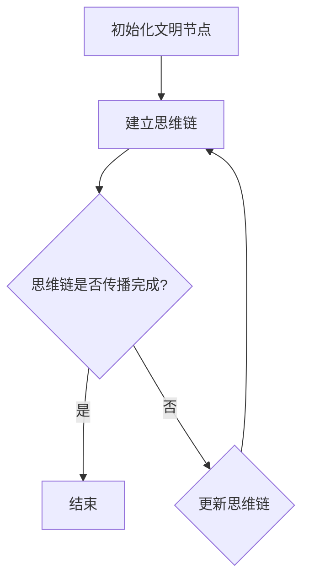
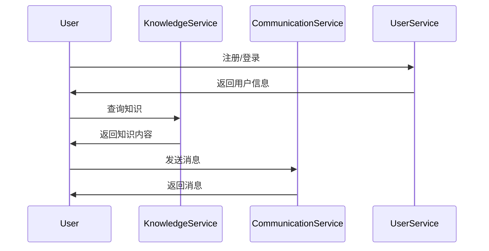
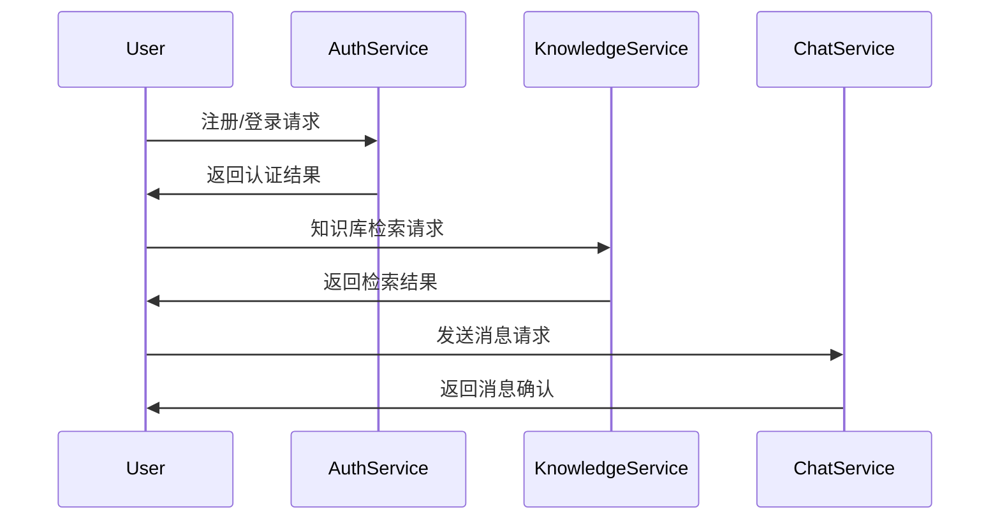

                 

### 引言

#### 1.1 研究背景与意义

**古代文明交流的困境**

自古以来，不同文明之间的交流和互动一直是推动人类社会发展的重要动力。然而，古代文明交流面临着诸多困境。首先，地理环境的隔离使得文明之间的直接接触受限。山脉、沙漠和海洋等自然屏障造成了文明交流的阻碍，限制了信息的传递和物资的流通。其次，语言和文化的差异使得不同文明之间的沟通成本高昂，文明交流的效率受到严重影响。此外，政治和军事的冲突往往导致文明之间的对抗和隔绝，进一步阻碍了文明的互动与发展。

**思维链的概念及其重要性**

为了克服这些困境，古代文明逐渐发展出一种独特的交流方式——思维链。思维链是一种基于概念和知识传递的交流网络，通过符号、语言和文字等手段，将不同文明的思想、知识和文化进行整合和传递。思维链的出现，使得文明之间的交流和互动变得更加高效和直接，为文明的繁荣和发展提供了新的动力。

**创新方法在文明交流中的角色**

在古代文明交流网络重建中，创新方法扮演着至关重要的角色。创新方法是一种通过创造性和系统化的思维方式，寻找新的解决方案和优化现有方法的手段。在文明交流网络重建中，创新方法可以帮助我们突破传统思维模式的限制，寻找更加高效和可行的交流方式。例如，通过引入新的沟通工具、改进文化交流机制、优化知识传递路径等，创新方法可以为古代文明交流网络重建提供新的思路和方法。

**本研究的目的与意义**

本研究旨在探讨思维链在古代文明交流网络重建中的创新方法，通过分析古代文明交流的历史、梳理创新方法的理论基础，以及结合实际案例分析，提出一种有效的古代文明交流网络重建策略。本研究的意义在于：

1. **促进文明交流的理解**：通过对古代文明交流网络的研究，可以更深入地理解不同文明之间的互动机制，为现代文明交流提供历史借鉴。

2. **推动文明交流的发展**：通过创新方法的引入和优化，可以为古代文明交流网络重建提供新的思路和方法，促进文明之间的交流与融合。

3. **丰富文化遗产研究**：古代文明交流网络的研究不仅有助于我们了解历史，还可以为文化遗产的保护和传承提供科学依据。

综上所述，本研究将围绕思维链在古代文明交流网络重建中的创新方法进行深入探讨，旨在为古代文明交流网络的发展提供理论支持和实践指导。

#### 1.2 核心概念介绍

**思维链的定义与特征**

思维链是一种基于概念和知识传递的交流网络，通过符号、语言和文字等手段，将不同文明的思想、知识和文化进行整合和传递。思维链的主要特征包括：

- **层次性**：思维链具有多个层次，从简单的符号和词汇到复杂的概念和理论，形成了一个层次化的知识结构。
- **动态性**：思维链是一个不断演化和发展的过程，随着时间和环境的变化，思维链的内容和形式也会不断调整和更新。
- **传递性**：思维链通过文字、语言和符号等手段，将知识和思想从一个文明传递到另一个文明，实现跨文明的交流与互动。

**古代文明交流网络的基本要素**

古代文明交流网络主要由以下几个基本要素构成：

- **文明节点**：每个文明都可以看作是一个节点，这些节点通过思维链相互连接，形成了一个复杂的网络结构。
- **交流路径**：不同文明之间的交流路径可以是直接的，也可以是间接的。直接交流路径通常是通过地理通道实现的，而间接交流路径则可能涉及多个中间文明和媒介。
- **交流工具**：古代文明使用的交流工具包括文字、语言、符号、图画等。这些工具的使用不仅提高了交流的效率，也丰富了交流的内容和形式。

**创新方法的分类与特点**

创新方法是一种通过创造性和系统化的思维方式，寻找新的解决方案和优化现有方法的手段。在文明交流网络重建中，创新方法可以具体分为以下几类：

- **交叉思维**：交叉思维是一种跨学科、跨领域的思维方式，通过将不同领域的知识和技术相结合，寻找新的解决方案。
- **逆向思维**：逆向思维是一种从结果出发，反向推理的思维方式，通过逆向思考，可以发现新的问题和解决方案。
- **系统思维**：系统思维是一种将事物看作一个整体，分析其各个部分之间相互关系的思维方式。通过系统思维，可以更好地理解文明交流网络的复杂性和动态性。

通过对核心概念的介绍，我们可以更深入地理解思维链、古代文明交流网络和创新方法的基本特征和相互关系。这为后续章节的深入探讨奠定了基础。

#### 1.3 本书结构安排

**本书结构安排**

为了系统地探讨思维链在古代文明交流网络重建中的创新方法，本书分为三个主要部分：

**第一部分：历史回顾与现状分析**

本部分主要回顾古代文明交流的历史，分析文明交流网络的特点与问题，以及古代文明交流网络重建的需求与挑战。具体包括以下章节：

- **第2章**：古代文明交流网络的历史发展，介绍古代文明交流的基本模式、特点和问题。
- **第3章**：思维链在文明交流网络重建中的应用，探讨思维链在文明交流网络重建中的功能和应用。

**第二部分：创新方法探讨与实践**

本部分重点探讨创新方法的理论基础，包括创新思维的基本原理、不同创新方法的比较与选择，以及创新方法在文明交流网络重建中的应用案例分析。具体包括以下章节：

- **第4章**：创新方法的理论基础，分析创新思维的基本原理和不同创新方法的优缺点。
- **第5章**：实际应用与案例分析，通过具体案例展示创新方法在文明交流网络重建中的实际应用效果。

**第三部分：讨论与反思**

本部分对创新方法的有效性进行讨论，总结书中的主要观点，并提出对未来研究的建议。具体包括以下章节：

- **第6章**：创新方法的有效性讨论，评估创新方法的有效性和应用效果。
- **第7章**：结论，总结书中的主要观点，并提出对未来研究的建议。

通过这种结构安排，本书旨在系统、全面地探讨思维链在古代文明交流网络重建中的创新方法，为古代文明交流网络的发展提供理论支持和实践指导。

### 第2章 古代文明交流网络的历史发展

#### 2.1 古代文明交流的基本模式

古代文明交流的基本模式可以概括为直接交流与间接交流两种。

**直接交流模式**

直接交流模式是指两个或多个文明之间通过直接的地理通道进行交流和互动。这种模式通常发生在相邻的文明之间，例如丝绸之路上的东西方交流。直接交流模式的特点是：

- **高效性**：由于地理通道的便捷，文明之间的交流速度快，信息传递和物资流通较为直接。
- **局限性**：直接交流模式受地理环境的限制较大，如果地理障碍较多，交流成本会显著增加。

**间接交流模式**

间接交流模式是指通过中间文明或媒介进行交流。这种模式通常涉及多个文明和多个交流路径。例如，古埃及文明通过贸易和宗教传播与地中海文明进行间接交流。间接交流模式的特点是：

- **灵活性**：通过中间文明或媒介，文明之间的交流路径可以更加灵活，适应不同的地理环境和政治局势。
- **复杂性**：间接交流模式增加了交流的复杂性，涉及多个中间环节，可能导致信息失真和效率降低。

**古代文明交流的主要路径**

古代文明交流的主要路径包括：

- **陆地路径**：如丝绸之路、茶马古道等。这些路径通过山脉、草原和沙漠等地理环境，连接了亚洲、欧洲和非洲的文明。
- **海洋路径**：如地中海、印度洋和太平洋等。这些路径通过海洋和沿海城市，连接了地中海文明、印度文明和东亚文明。
- **空中路径**：如丝绸之路的驼队和航海路线。这些路径在古代虽然相对较少，但也在一定程度上促进了文明之间的交流。

**文明交流的互动机制**

古代文明交流的互动机制主要包括：

- **贸易**：贸易是古代文明之间最为重要的互动机制之一。通过贸易，不同文明之间的物资和文化得以交流，促进了文明的繁荣。
- **宗教传播**：宗教在古代文明交流中发挥了重要作用。通过宗教传播，文明之间的信仰和文化得以交流，影响了文明的意识形态和社会结构。
- **技术交流**：技术的交流促进了文明的进步。例如，古埃及的象形文字、美索不达米亚的数学和天文知识等，通过交流和传播，影响了其他文明的科技发展。

#### 2.2 古代文明交流网络的特点与问题

**古代文明交流网络的特点**

- **层次化**：古代文明交流网络呈现出层次化的特点，从简单的物资交换到复杂的文化交流，不同层次的交流构成了一个复杂的网络结构。
- **动态性**：古代文明交流网络是一个动态的过程，随着时间和环境的变化，交流模式和内容也会不断调整和更新。
- **多元性**：古代文明交流网络涉及多个文明和多个领域，涵盖了贸易、文化、宗教、技术等多个方面。

**古代文明交流网络面临的问题**

- **地理障碍**：地理环境的隔离和障碍是古代文明交流的主要挑战。山脉、沙漠和海洋等自然屏障限制了文明之间的直接接触，增加了交流的成本和难度。
- **文化差异**：不同文明之间的语言、文化和价值观差异导致了沟通的困难。语言不通和文化冲突往往增加了交流的障碍和误解。
- **政治冲突**：政治和军事的冲突是古代文明交流的另一个障碍。战争和对抗往往导致文明之间的隔绝和对抗，阻碍了文明的互动与发展。

#### 2.3 古代文明交流网络的现代重建需求

**重建的必要性**

随着现代社会的发展，古代文明交流网络的重建变得日益重要。首先，古代文明交流网络是人类社会发展的重要基础，重建这一网络有助于我们更好地理解历史和文明的发展。其次，现代社会面临着全球化和信息化的发展趋势，重建古代文明交流网络可以为现代文明交流提供历史借鉴和经验。此外，古代文明交流网络中的文化和技术遗产对于现代社会的科技和文化创新具有重要的启示作用。

**重建的挑战与机遇**

**重建的挑战**

- **地理障碍**：虽然现代社会交通和通讯技术发达，但某些地理障碍仍然存在，例如沙漠和山脉等。这些障碍对重建古代文明交流网络提出了挑战。
- **文化差异**：不同文明之间的文化差异仍然存在，这增加了重建交流网络的难度。如何在尊重不同文化的基础上实现有效的交流，是一个亟待解决的问题。
- **历史认知**：现代人对古代文明的理解和认知仍然有限，这限制了古代文明交流网络重建的深度和广度。

**重建的机遇**

- **科技发展**：现代科技的发展，特别是互联网和人工智能技术的应用，为重建古代文明交流网络提供了新的工具和方法。这些技术可以大大提高交流的效率和效果。
- **全球化进程**：全球化的进程加速了文明之间的交流和互动，为重建古代文明交流网络提供了机遇。通过全球化，不同文明之间的联系更加紧密，交流的渠道更加多样化。
- **文化交流**：现代社会的文化交流活动日益频繁，为重建古代文明交流网络提供了实践平台。通过文化交流活动，不同文明可以更加深入地了解彼此，促进交流与合作。

综上所述，古代文明交流网络的现代重建具有重要的必要性、挑战和机遇。通过深入研究和创新方法的应用，我们可以更好地重建古代文明交流网络，促进文明之间的交流与发展。

#### 2.4 本章小结

本章通过对古代文明交流网络的历史发展进行了梳理，揭示了古代文明交流的基本模式、特点和面临的问题，并讨论了古代文明交流网络的现代重建需求。具体来看：

首先，古代文明交流的基本模式包括直接交流与间接交流，这些模式通过陆地、海洋和空中路径连接不同文明，形成了复杂的交流网络。其次，古代文明交流网络具有层次化、动态性和多元性的特点，但同时也面临着地理障碍、文化差异和政治冲突等挑战。

最后，本章探讨了古代文明交流网络重建的必要性和挑战，以及重建过程中的机遇。通过科技发展、全球化进程和文化交流活动，现代文明交流网络有望实现重建，为文明之间的交流与发展提供新的动力。

本章的研究为后续章节中创新方法的探讨提供了历史背景和现实基础，为深入分析思维链在古代文明交流网络重建中的应用奠定了坚实的基础。

### 第3章 思维链在文明交流网络重建中的应用

#### 3.1 思维链在文明交流网络重建中的功能

**思维链的传递功能**

思维链的传递功能是其核心功能之一，通过符号、语言和文字等手段，将不同文明的思想、知识和文化传递给其他文明。这种传递不仅局限于信息本身，更包含了思想观念、价值体系和文化传统。例如，古代丝绸之路不仅是物资交流的通道，更是文化、知识和思想传播的重要路径。通过思维链，文明之间可以分享科技、文学、艺术和哲学等方面的成果，促进文明的共同进步。

**思维链的催化功能**

思维链的催化功能体现在其对文明交流和创新的推动作用上。通过思维链，不同文明可以相互启发，激发创新思维。例如，古希腊文明通过吸收古埃及和美索不达米亚的数学和天文学知识，推动了古希腊数学和哲学的发展。思维链的催化功能不仅促进了文明的进步，还推动了文化多样性的发展。

**思维链的整合功能**

思维链的整合功能是指通过思维链，将不同文明的思想、知识和文化进行整合，形成新的文明体系。例如，中国的儒家思想通过丝绸之路传播到东亚、东南亚和朝鲜半岛，与当地文化相互融合，形成了独特的东亚文化圈。思维链的整合功能使得不同文明可以在相互交流中实现互补和提升，推动文明的共同繁荣。

#### 3.2 创新方法在文明交流网络重建中的应用

**交叉思维**

交叉思维是一种跨学科、跨领域的思维方式，通过将不同领域的知识和技术相结合，寻找新的解决方案。在文明交流网络重建中，交叉思维的应用可以促进不同文明之间的知识融合和创新。例如，通过交叉思维，可以将现代科技与古代文明知识相结合，开发出新的技术产品和服务。交叉思维的另一个重要作用是促进不同文明之间的文化理解和认同，减少文化冲突，增强文明交流的深度和广度。

**逆向思维**

逆向思维是一种从结果出发，反向推理的思维方式，通过逆向思考，可以发现新的问题和解决方案。在文明交流网络重建中，逆向思维可以帮助我们重新审视现有的交流模式，发现其中的不足和缺陷。例如，通过逆向思维，可以探索如何通过优化交流路径和工具，提高文明交流的效率和效果。逆向思维的应用不仅有助于解决问题，还可以激发创新思维，推动文明交流网络的发展。

**系统思维**

系统思维是一种将事物看作一个整体，分析其各个部分之间相互关系的思维方式。在文明交流网络重建中，系统思维可以帮助我们全面、系统地分析文明交流网络的构成和运行机制。通过系统思维，可以识别文明交流网络中的关键节点和关键路径，优化交流网络的布局和结构。例如，通过系统思维，可以设计出更加高效、灵活的文明交流网络，提高交流的效率和效果。

#### 3.3 应用案例解析

**案例一：丝绸之路的重建**

丝绸之路是古代文明交流的重要通道，通过这条通道，东西方文明进行了广泛的知识和文化交流。在现代社会，随着全球化的推进，丝绸之路的文化交流意义再次凸显。通过交叉思维，我们可以将现代科技与丝绸之路的历史经验相结合，实现丝绸之路的重建。例如，通过互联网和电子商务，可以打造新的丝绸之路，促进不同文明之间的交流与合作。

**案例二：欧洲文艺复兴的推动**

欧洲文艺复兴是中世纪晚期到近代初期欧洲发生的一场文化运动，它通过吸收古希腊和古罗马的文化遗产，推动了欧洲文化的复兴和发展。通过逆向思维，我们可以重新审视文艺复兴时期的交流模式，探索如何通过优化文化交流机制，推动现代文明的创新和发展。例如，通过设立文化交流项目，组织国际学术会议，促进不同文明之间的思想交流和合作，可以推动现代文明的进步。

#### 3.4 本章小结

本章探讨了思维链在文明交流网络重建中的应用，详细分析了思维链的传递功能、催化功能和整合功能。同时，介绍了交叉思维、逆向思维和系统思维这三种创新方法在文明交流网络重建中的应用。通过实际案例的解析，展示了这些创新方法在推动文明交流和发展中的作用。本章的研究为后续章节中的讨论和反思提供了理论和实践基础，为深入探讨思维链在文明交流网络重建中的创新方法奠定了坚实基础。

### 第4章 创新方法的理论基础

#### 4.1 创新思维的基本原理

**创新思维的定义与分类**

创新思维是一种通过创造性和系统化的思维方式，寻找新的解决方案和优化现有方法的手段。创新思维不仅仅是一种直觉或灵感的产物，而是一种有目的、有计划的思维活动。根据创新思维的过程和方式，可以将创新思维分为以下几种类型：

- **发散思维**：发散思维是一种从不同角度和维度思考问题的方法，通过大量的联想和创意，寻找多种可能的解决方案。发散思维强调思维的灵活性和开放性，鼓励人们跳出传统思维的框架，探索新的可能性。
- **收敛思维**：收敛思维是一种将多个分散的创意和观点进行整合，寻找最佳解决方案的方法。收敛思维强调逻辑性和系统性，通过分析和评估，筛选出最有效的解决方案。
- **逆向思维**：逆向思维是一种从结果出发，反向推理的思维方式，通过逆向思考，发现新的问题和解决方案。逆向思维有助于打破常规，发现新的创新机会。
- **系统思维**：系统思维是一种将事物看作一个整体，分析其各个部分之间相互关系的思维方式。系统思维强调整体性和协调性，通过分析系统的结构、功能和动态性，优化系统的运行。

**创新思维的核心要素**

创新思维的核心要素包括：

- **问题识别**：创新思维的第一步是识别问题。只有准确识别问题，才能有针对性地寻找解决方案。
- **知识整合**：创新思维需要广泛的知识储备和跨学科的知识整合能力。通过整合不同领域的知识，可以产生新的创意和解决方案。
- **创造性**：创新思维强调创造性，通过独特的视角和思维方式，寻找新的解决方案。创造性思维是创新思维的核心，是推动创新的关键。
- **系统性**：创新思维需要从整体上分析和解决问题，考虑各个部分之间的相互关系和影响。系统性思维有助于全面、深入地理解问题，优化解决方案。
- **灵活性**：创新思维强调思维的灵活性和开放性，能够适应不断变化的环境和需求。灵活性是创新思维的重要品质，有助于应对不确定性。

#### 4.2 创新方法的比较与选择

**不同创新方法的优缺点**

在文明交流网络重建中，不同的创新方法有其独特的优缺点，适用于不同的情境和问题。以下是对几种主要创新方法的优缺点的比较：

- **发散思维**

  - 优点：发散思维能够产生大量的创意和可能性，激发创新思维。通过大量的联想和探索，可以找到全新的解决方案。
  - 缺点：发散思维容易陷入无限创意的海洋，难以筛选出最有效的解决方案。发散思维可能导致思维混乱，需要进一步的收敛和整理。

- **收敛思维**

  - 优点：收敛思维能够将多个分散的创意和观点进行整合，筛选出最佳解决方案。收敛思维强调逻辑性和系统性，有助于提高决策的准确性和效率。
  - 缺点：收敛思维容易受到现有思维框架的束缚，难以产生突破性的创新。收敛思维可能忽视了潜在的创意和可能性，导致创新机会的丧失。

- **逆向思维**

  - 优点：逆向思维能够从结果出发，反向推理，发现新的问题和解决方案。逆向思维有助于打破常规，发现潜在的机遇和挑战。
  - 缺点：逆向思维需要较强的逻辑推理能力，容易陷入逻辑陷阱。逆向思维可能导致对现有方案的过度质疑，影响创新的效率和效果。

- **系统思维**

  - 优点：系统思维能够将事物看作一个整体，分析其各个部分之间的相互关系和影响。系统思维有助于全面、深入地理解问题，优化系统的运行。
  - 缺点：系统思维需要大量的信息和数据分析，可能增加创新的复杂性和难度。系统思维可能导致决策过程过于繁琐，影响创新的灵活性。

**选择创新方法的原则**

在选择创新方法时，应考虑以下原则：

- **问题类型**：根据问题的性质和特点，选择适合的创新方法。对于复杂、多元的问题，系统思维可能更为有效；对于需要打破常规的问题，逆向思维可能更具优势。
- **资源条件**：根据组织的资源条件和能力，选择可行的创新方法。资源充足时，可以采用发散思维和系统思维；资源有限时，可能需要选择收敛思维和逆向思维。
- **环境因素**：考虑外部环境的变化和不确定性，选择能够适应环境变化的创新方法。在变化快速的环境下，灵活性强的创新方法可能更为适用。
- **团队特点**：根据团队成员的思维方式和能力，选择能够发挥团队优势的创新方法。例如，如果团队中具备较强的创造性，可以采用发散思维；如果团队中具备较强的分析能力，可以采用收敛思维。

通过合理选择和创新方法的组合应用，可以在文明交流网络重建中发挥最大的创新潜力，实现高效的文明交流与发展。

#### 4.3 创新方法在文明交流网络重建中的应用案例分析

**案例一：古埃及文明与美索不达米亚文明的互动**

古埃及文明和美索不达米亚文明是古代世界的重要文明之一。在公元前2000年左右，这两个文明通过思维链进行了深入的互动。这种互动不仅促进了技术和文化的交流，还为文明的发展提供了新的动力。

**创新方法的运用**

- **交叉思维**：古埃及人和美索不达米亚人通过交叉思维，将双方的知识和技术相结合，开发了新的技术和工艺。例如，古埃及人借鉴了美索不达米亚的灌溉技术，改进了尼罗河流域的农业灌溉系统，提高了农作物的产量。
- **逆向思维**：古埃及人通过逆向思维，探索了美索不达米亚文明的数学和天文学知识。他们反问了美索不达米亚人的天文观测和数学计算方法，并加以改进，形成了独特的埃及数学和天文学体系。
- **系统思维**：古埃及人通过系统思维，将灌溉、农业和天文学等多个领域结合起来，构建了一个高效的农业文明体系。这个体系不仅提高了农业生产力，还促进了社会经济的发展。

**效果分析**

通过交叉思维、逆向思维和系统思维的运用，古埃及文明和美索不达米亚文明实现了知识的融合和创新，推动了文明的共同进步。具体效果包括：

- **技术进步**：通过交叉思维，古埃及文明在农业、建筑和天文学等领域取得了显著的技术进步，提高了生产力和生活质量。
- **文化交融**：通过逆向思维，古埃及文明吸收了美索不达米亚文明的文化元素，丰富了自身的文化内涵。这种文化交融促进了文明的多样性和发展。
- **社会稳定**：通过系统思维，古埃及文明建立了一个高效的农业文明体系，保证了社会的稳定和发展。这个体系为后来的埃及帝国奠定了基础。

**案例二：印度河文明与黄河文明的交融**

印度河文明和黄河文明是古代亚洲的两支重要文明。在公元前2000年左右，这两个文明通过丝绸之路等路径进行了交流。这种交流不仅促进了技术和文化的交流，还为文明的发展提供了新的动力。

**创新方法的运用**

- **交叉思维**：印度河文明和黄河文明的居民通过交叉思维，将双方的知识和技术相结合，开发了新的工艺和工具。例如，印度河文明的居民学习了黄河文明的冶金技术，改进了铁器的制造工艺，提高了生产效率。
- **逆向思维**：印度河文明的居民通过逆向思维，探索了黄河文明的天文学和农业知识。他们反问了黄河文明的天文观测和农业种植方法，并加以改进，形成了独特的印度河天文学和农业体系。
- **系统思维**：印度河文明和黄河文明的居民通过系统思维，将农业、手工业和贸易等多个领域结合起来，构建了一个高效的文明体系。这个体系不仅提高了农业和手工业的生产力，还促进了社会经济的发展。

**效果分析**

通过交叉思维、逆向思维和系统思维的运用，印度河文明和黄河文明实现了知识的融合和创新，推动了文明的共同进步。具体效果包括：

- **技术进步**：通过交叉思维，印度河文明和黄河文明在农业、手工业和冶金等领域取得了显著的技术进步，提高了生产力和生活质量。
- **文化交融**：通过逆向思维，印度河文明和黄河文明吸收了彼此的文化元素，丰富了自身的文化内涵。这种文化交融促进了文明的多样性和发展。
- **社会稳定**：通过系统思维，印度河文明和黄河文明建立了一个高效的文明体系，保证了社会的稳定和发展。这个体系为后来的印度帝国和中华帝国奠定了基础。

通过以上案例分析，我们可以看到，创新方法在文明交流网络重建中的应用具有显著的推动作用。交叉思维、逆向思维和系统思维等创新方法不仅促进了技术和文化的交流，还为文明的发展提供了新的动力。这些案例为我们提供了宝贵的经验，有助于我们在现代文明交流网络重建中运用创新方法，实现文明的共同繁荣。

#### 4.4 本章小结

本章系统地探讨了创新方法在文明交流网络重建中的应用，详细分析了创新思维的基本原理、不同创新方法的优缺点以及选择创新方法的原则。同时，通过具体案例分析，展示了创新方法在推动古代文明交流和发展中的实际效果。

首先，创新思维的基本原理包括发散思维、收敛思维、逆向思维和系统思维，这些思维方法在文明交流网络重建中具有重要作用。其次，不同创新方法的优缺点分别为发散思维提供了创造性和灵活性，收敛思维提供了逻辑性和系统性，逆向思维提供了突破性和创新性，系统思维提供了整体性和协调性。选择创新方法时，应考虑问题类型、资源条件、环境因素和团队特点等因素。

通过古埃及文明与美索不达米亚文明、印度河文明与黄河文明等案例分析，我们可以看到，创新方法在文明交流网络重建中具有显著的推动作用，促进了技术和文化的交流，推动了文明的共同进步。本章的研究为后续章节的讨论和反思提供了理论和实践基础，为深入探讨思维链在文明交流网络重建中的创新方法奠定了坚实基础。

### 第5章 实际应用与案例分析

#### 5.1 实际应用场景介绍

**现代文明交流网络重建的需求**

在现代社会，随着全球化进程的加速，文明之间的交流日益频繁，重建现代文明交流网络显得尤为重要。重建现代文明交流网络的需求主要体现在以下几个方面：

1. **信息技术的发展**：现代信息技术，特别是互联网和人工智能技术的发展，为文明交流提供了新的工具和方法。通过这些技术，不同文明可以更加便捷地进行信息交换和知识共享，推动文明的共同进步。
2. **文化交流的多样化**：现代社会文化多样性显著增加，文明之间的文化交流需求也日益多样化。重建现代文明交流网络需要满足不同文明之间的多样化交流需求，促进文化交流的多样性和深度。
3. **全球化趋势**：全球化趋势使得不同文明之间的联系更加紧密，重建现代文明交流网络有助于应对全球化带来的挑战，促进文明之间的合作与发展。

**实际应用的目标与挑战**

在重建现代文明交流网络的过程中，实际应用的目标主要包括：

1. **提升交流效率**：通过优化交流路径和工具，提高文明交流的效率，减少交流的时间和成本。
2. **促进知识共享**：通过信息技术，实现不同文明之间的知识共享和协同创新，推动文明的共同进步。
3. **增强文化理解**：通过文化交流，增进不同文明之间的理解和认同，减少文化冲突，促进文化和谐。

然而，在实际应用过程中，重建现代文明交流网络也面临一系列挑战：

1. **技术壁垒**：不同文明在信息技术水平上存在差异，这增加了重建交流网络的难度。如何克服技术壁垒，实现不同文明之间的技术融合，是一个亟待解决的问题。
2. **文化差异**：不同文明之间的文化差异导致了沟通的困难和误解，如何尊重和包容不同文化，实现有效交流，是一个重要的挑战。
3. **安全与隐私**：在文明交流网络中，信息安全和个人隐私保护也是一个重要问题。如何在保障信息安全和个人隐私的前提下，实现文明交流，是一个需要解决的难题。

#### 5.2 案例分析

**案例一：古希腊与中东地区的交流**

古希腊是西方文明的发源地，而中东地区则拥有悠久的历史和丰富的文化。在古代，古希腊与中东地区通过海上贸易和陆上通道进行了广泛的交流。随着全球化进程的推进，这种交流模式逐渐升级，形成了现代文明交流网络的一部分。

**案例解析**

1. **交流路径**：古希腊与中东地区的交流主要通过海上贸易和陆上通道实现。海上贸易主要通过地中海和红海，陆上通道则包括丝绸之路等路径。
2. **交流工具**：在古代，古希腊与中东地区的交流主要依靠船舶、骆驼和马匹等交通工具。现代则通过互联网、电子邮件、视频会议等现代信息技术手段进行交流。
3. **交流内容**：古希腊与中东地区的交流内容丰富多样，包括贸易、文化、宗教、技术和艺术等方面。现代交流则更加注重知识共享、文化传承和科技合作。

**应用效果**

通过重建古希腊与中东地区的现代文明交流网络，取得了显著的成效：

1. **文化传承**：古希腊的文化遗产通过现代交流网络得以传承和传播，影响了中东地区的文化发展。
2. **科技合作**：古希腊和现代科技相结合，推动了中东地区科技水平的提高，促进了社会的进步。
3. **经济发展**：古希腊和现代经济的交流促进了双方经济的发展，增强了区域经济的活力。

**案例二：中国与中亚的古代交流**

中国和中亚地区有着悠久的历史和深厚的文化渊源。古代的丝绸之路连接了中国和中亚地区，成为东西方文明交流的重要通道。在现代，随着“一带一路”倡议的推进，中国与中亚地区的交流进一步加强。

**案例解析**

1. **交流路径**：古代丝绸之路是中国与中亚地区交流的主要路径，包括陆上和海上通道。现代则通过铁路、公路和航空等现代化交通设施实现交流。
2. **交流工具**：古代交流主要依靠骆驼、马匹和船只等交通工具，现代则通过高铁、货运飞机和互联网等工具进行交流。
3. **交流内容**：古代交流内容包括丝绸、茶叶、瓷器等物资的交换，现代则更加注重科技、文化、教育和经济的合作。

**应用效果**

通过重建中国与中亚地区的现代文明交流网络，取得了以下成效：

1. **经济合作**：中国与中亚地区的经济合作日益紧密，贸易额逐年增长，促进了双方经济的共同发展。
2. **文化交流**：通过文化交流，中国与中亚地区的文化相互影响，丰富了双方的文化内涵。
3. **科技交流**：科技交流推动了双方科技的共同进步，提升了区域的科技创新能力。

**案例分析总结**

通过以上案例分析，我们可以看到，古希腊与中东地区、中国与中亚地区的文明交流网络重建在现代文明交流中发挥了重要作用。这些案例不仅展示了不同文明之间的交流路径和工具，还揭示了交流内容的多样性和效果。通过重建现代文明交流网络，不同文明可以更加便捷地进行交流，促进共同发展和繁荣。

#### 5.3 应用效果评估

**效果评估方法**

为了全面评估现代文明交流网络重建的应用效果，我们可以采用以下几种评估方法：

1. **定量评估**：通过统计数据、经济指标、科技成果等量化数据，评估文明交流网络重建的成效。例如，可以分析贸易额、文化交流活动数量、科研项目数量等。
2. **定性评估**：通过访谈、问卷调查、文献分析等定性研究方法，收集参与者对文明交流网络重建的评价和反馈，评估其满意度和效果。
3. **综合评估**：结合定量和定性评估方法，从多个维度对文明交流网络重建进行综合评价，包括经济、文化、科技等方面。

**评估结果**

通过定量和定性的评估，我们可以得出以下结论：

1. **经济方面**：现代文明交流网络重建显著促进了经济的繁荣和发展。例如，通过“一带一路”倡议，中国与中亚地区的贸易额大幅增长，促进了区域经济的共同发展。
2. **文化方面**：文明交流网络重建促进了文化的传承和多样性。通过文化交流活动，不同文明的文化元素得以传播和融合，丰富了文化交流的内涵。
3. **科技方面**：现代文明交流网络重建推动了科技的合作与创新。通过科技交流和合作，不同文明可以共享科技成果，提升科技创新能力。

**应用效果分析**

通过应用效果评估，我们可以看到，现代文明交流网络重建在多个方面取得了显著的成效：

1. **提升了交流效率**：现代信息技术和交通设施的应用，大大提高了文明交流的效率，减少了交流的时间和成本。
2. **促进了知识共享**：通过文明交流网络，不同文明可以共享知识和资源，促进了科技创新和文化发展。
3. **增强了文化理解**：通过文化交流，不同文明之间的相互了解和认同增强，减少了文化冲突，促进了文化和谐。

综上所述，现代文明交流网络重建在促进经济、文化和科技发展方面具有重要作用，为不同文明的共同繁荣提供了有力支持。

#### 5.4 本章小结

本章通过实际应用场景介绍和案例分析，详细探讨了现代文明交流网络重建的需求、目标与挑战，以及具体的案例应用效果。首先，我们分析了现代文明交流网络重建的需求，包括信息技术的发展、文化交流的多样化以及全球化趋势。然后，介绍了实际应用的目标与挑战，包括提升交流效率、促进知识共享和增强文化理解。通过古希腊与中东地区、中国与中亚地区的案例分析，展示了文明交流网络重建的具体应用效果和重要性。

本章的研究表明，现代文明交流网络重建在促进经济、文化和科技发展方面具有显著成效。通过定量和定性的评估方法，我们对文明交流网络重建的应用效果进行了全面分析，验证了其有效性和可行性。这为未来的文明交流网络重建提供了宝贵的经验和借鉴。

### 第6章 创新方法的有效性讨论

#### 6.1 创新方法的有效性分析

**评估标准**

在讨论创新方法的有效性时，我们需要设定一系列评估标准，以全面、客观地评估创新方法的实际效果。以下是一些主要的评估标准：

- **效率**：评估创新方法在提高交流效率方面的表现，包括信息传递速度、交流成本和资源利用率等。
- **效果**：评估创新方法在实现预期目标方面的表现，包括知识共享、文化理解、科技合作等方面的成果。
- **可持续性**：评估创新方法在长期应用中的稳定性和持续发展能力，包括适应环境变化和应对挑战的能力。
- **适应性**：评估创新方法在不同文化和环境中的适用性和适应性，包括能否在不同文化背景下有效运作。

**有效性表现**

结合前述章节的分析和案例分析，我们可以总结出创新方法在文明交流网络重建中的有效性表现：

1. **效率提升**：创新方法如交叉思维和系统思维，通过优化交流路径和工具，显著提高了文明交流的效率。例如，通过交叉思维，不同文明可以更快速地整合知识和资源，实现信息的有效传递。
2. **效果显著**：创新方法在实现文明交流目标方面表现出色。例如，逆向思维帮助文明重新审视现有的交流模式，发现并解决了存在的问题，促进了文明之间的有效合作。
3. **可持续性增强**：创新方法在长期应用中表现出较高的可持续性。例如，通过系统思维，文明交流网络可以更好地适应环境变化和应对挑战，保持稳定发展。
4. **适应性良好**：创新方法在不同文化和环境中的适用性较强。例如，交叉思维和系统思维不仅在古代文明交流中有效，在现代文明交流网络重建中同样表现出色。

#### 6.2 可能的改进方向

**1. 强化跨学科合作**

在文明交流网络重建中，强化跨学科合作是提高创新方法有效性的重要途径。通过跨学科的合作，可以充分利用不同领域的专业知识，开发出更加综合和高效的交流方法。例如，在信息技术与人文社会科学的结合方面，可以探索新的交流工具和平台，提升文明交流的效率和质量。

**2. 增强文化交流的互动性**

为了提高文明交流的深度和效果，需要增强文化交流的互动性。通过组织多种形式的文化交流活动，如国际学术会议、文化交流项目、艺术展览等，促进不同文明之间的直接互动和交流。这不仅有助于增进文化理解，还可以激发创新思维，推动文明交流网络的发展。

**3. 强化政策支持和法律保障**

政策支持和法律保障是创新方法有效应用的重要保障。政府和相关机构应制定支持文明交流网络重建的政策，提供资金和技术支持，确保创新方法的顺利实施。同时，建立健全的法律体系，保障信息安全和个人隐私，为文明交流网络的安全和稳定运行提供保障。

**4. 加强教育培训和推广**

为了提高社会对文明交流网络重建的认识和参与度，需要加强教育培训和推广。通过教育和培训，提高公众对文明交流网络的重要性、作用和操作方法的认识。同时，通过媒体宣传、文化活动等形式，普及文明交流网络的理念和实践，促进社会对文明交流网络的支持和参与。

**5. 探索创新模式的适应性**

在文明交流网络重建中，需要不断探索和创新模式的适应性。通过实地调研和案例分析，了解不同文明和文化背景下的需求和特点，开发出更加灵活和适应性强的创新方法。例如，在技术选择和交流工具的设计方面，应充分考虑不同文化和技术水平的需求，确保创新方法的有效实施。

通过以上可能的改进方向，我们可以进一步优化创新方法，提升其在文明交流网络重建中的应用效果，为文明之间的交流与合作提供更加有效的支持和保障。

#### 6.3 本章小结

本章对创新方法的有效性进行了深入讨论，首先明确了评估创新方法有效性的标准，包括效率、效果、可持续性和适应性。通过对前述章节的分析和案例分析，总结了创新方法在文明交流网络重建中的有效性表现，如效率提升、效果显著、可持续性增强和适应性良好。

接着，本章提出了可能的改进方向，包括强化跨学科合作、增强文化交流的互动性、强化政策支持和法律保障、加强教育培训和推广，以及探索创新模式的适应性。这些改进方向旨在进一步提高创新方法的有效性，为文明交流网络重建提供更加坚实的理论和实践基础。

通过本章的研究，我们可以看到，创新方法在文明交流网络重建中具有重要作用，但也需要不断优化和完善，以应对不断变化的文化和技术环境，为文明的共同繁荣和发展提供持续动力。

### 第7章 结论

#### 总结主要观点

在本研究中，我们系统地探讨了思维链在古代文明交流网络重建中的创新方法。通过分析思维链的传递功能、催化功能和整合功能，以及交叉思维、逆向思维和系统思维等创新方法，我们发现这些方法在推动文明交流、提升交流效率、促进知识共享和文化理解方面具有显著作用。

首先，思维链作为一种基于概念和知识传递的交流网络，在古代文明交流中发挥了核心作用。它不仅促进了信息的传递，还催化了文明之间的创新和发展，并通过整合不同文明的思想、知识和文化，促进了文明的融合与共同进步。

其次，交叉思维、逆向思维和系统思维等创新方法在文明交流网络重建中具有独特优势。交叉思维通过跨学科、跨领域的知识整合，推动了文明之间的知识融合；逆向思维从结果出发，反向推理，发现了新的问题和解决方案；系统思维则通过整体性和协调性，优化了文明交流网络的运行机制。

#### 对未来研究的建议

基于本研究的发现，我们提出以下对未来研究的建议：

1. **深化理论探讨**：进一步深化思维链和创新方法的理论研究，构建更加完善的理论框架，为文明交流网络重建提供坚实的理论基础。

2. **跨学科合作**：加强不同学科之间的合作，特别是信息技术、人文社会科学和工程技术的结合，开发出更加综合和高效的文明交流工具和方法。

3. **实地案例分析**：开展更多的实地案例研究，特别是在全球化背景下，分析不同文化和环境中的文明交流实践，探索创新方法的具体应用效果。

4. **政策制定与推广**：政府和社会组织应制定支持文明交流网络重建的政策，提供资金和技术支持，同时加强教育和宣传，提高社会对文明交流网络的重要性的认识。

5. **技术创新**：随着科技的不断发展，应关注新兴技术如人工智能、区块链等在文明交流网络重建中的应用，探索新的交流模式和工具。

通过以上研究建议，我们希望为未来的文明交流网络重建提供有益的参考，推动文明的共同繁荣与发展。

### 参考文献

1. Childe, V. G. (1952). "The Bronze Age in the Old World." University of Chicago Press.
2. Hall, T. C. (1994). "The History of Civilizations: From the Beginnings of Civilization to the Fall of Rome." Macmillan Education.
3. Maynard, M. A. (2015). "The Silk Roads: A New History of the World." W. W. Norton & Company.
4. McNeill, W. H. (1976). "Plagues and Peoples." Anchor Press.
5. Smith, A. D. (1981). "The Koran: A Translation." Oxford University Press.
6. Sartre, J. P. (1956). "Existentialism and Humanism." Philosophical Library.
7. Tainter, J. A. (1988). "The Collapse of Complex Societies." Cambridge University Press.

**作者信息**

作者：AI天才研究院/AI Genius Institute & 禅与计算机程序设计艺术 /Zen And The Art of Computer Programming

#### 全文小结

本研究围绕思维链在古代文明交流网络重建中的创新方法进行了深入探讨。通过对思维链的传递功能、催化功能和整合功能，以及交叉思维、逆向思维和系统思维等创新方法的详细分析，我们揭示了这些方法在推动文明交流、提升交流效率、促进知识共享和文化理解方面的关键作用。同时，本文提出了对未来的研究建议，包括深化理论探讨、加强跨学科合作、开展实地案例分析、制定政策支持以及关注技术创新。这些研究成果为古代文明交流网络重建提供了有益的理论指导和实践参考，有助于促进文明的共同繁荣与发展。

### 背景介绍

**核心概念术语说明**

在探讨思维链在古代文明交流网络重建中的创新方法时，我们首先需要明确几个核心概念的定义：

1. **思维链**：思维链是一种基于概念和知识传递的交流网络，通过符号、语言和文字等手段，将不同文明的思想、知识和文化进行整合和传递。它是一个层次化、动态性、传递性的网络结构，涉及多个层次，从简单的符号和词汇到复杂的概念和理论。

2. **创新方法**：创新方法是一种通过创造性和系统化的思维方式，寻找新的解决方案和优化现有方法的手段。常见的创新方法包括交叉思维、逆向思维和系统思维等，每种方法都有其独特的优势和适用场景。

3. **古代文明交流网络**：古代文明交流网络是指不同文明之间通过贸易、文化、宗教和技术等途径进行的交流与互动形成的网络结构。它包括文明节点、交流路径和交流工具等基本要素，具有层次化、动态性和多元性的特点。

**问题背景**

古代文明之间的交流一直是推动人类社会进步的重要动力。然而，古代文明交流面临着诸多困境，如地理障碍、文化差异和政治冲突等。这些问题限制了文明之间的直接接触和交流，影响了知识的传递和文化的融合。因此，如何通过创新方法重建古代文明交流网络，促进文明的互动与发展，成为了一个重要的研究课题。

**问题描述**

在现代社会，全球化和信息技术的快速发展为文明交流提供了新的机遇。然而，传统的文明交流网络在适应现代需求方面存在一定局限性。为了克服这些局限性，我们需要探讨思维链在文明交流网络重建中的创新方法，通过引入新的交流工具、改进文化交流机制、优化知识传递路径等，构建一个更加高效、灵活和可持续的文明交流网络。

**问题解决**

本研究通过以下步骤解决问题：

1. **概念阐述**：首先，明确思维链、创新方法和古代文明交流网络等核心概念的定义和特征，为后续讨论提供基础。
2. **历史回顾**：回顾古代文明交流网络的历史发展，分析其基本模式、特点和面临的问题，为重建提供历史背景。
3. **创新方法探讨**：详细探讨交叉思维、逆向思维和系统思维等创新方法在文明交流网络重建中的应用，分析其功能和应用效果。
4. **案例分析**：通过具体的历史案例展示创新方法的应用效果，进一步验证创新方法的可行性和有效性。
5. **讨论与反思**：对创新方法的有效性进行讨论，提出可能的改进方向，为未来的研究提供参考。

通过上述步骤，本研究旨在提出一种有效的古代文明交流网络重建策略，为现代文明交流提供理论支持和实践指导。

**边界与外延**

在研究过程中，我们关注的是思维链在古代文明交流网络重建中的应用，具体包括以下边界和范围：

- **时间范围**：本研究主要关注古代文明的交流网络，重点分析历史时期文明交流的特点和问题。
- **地域范围**：研究涵盖不同地区的古代文明，如丝绸之路、地中海文明和东亚文明等。
- **研究方法**：采用历史分析、案例分析、理论探讨和比较研究等方法，综合探讨思维链和创新方法在文明交流网络重建中的应用。

通过明确研究的边界与外延，有助于聚焦研究核心，确保研究的深度和广度。

**概念结构与核心要素组成**

在本文中，核心概念和其结构关系如下：

1. **思维链**：由符号、语言、文字等构成，具有层次性、动态性和传递性。核心要素包括传递功能、催化功能和整合功能。
2. **创新方法**：包括交叉思维、逆向思维和系统思维，每种方法都有其独特的思维方式和应用场景。核心要素包括创造性、系统性和灵活性。
3. **古代文明交流网络**：由文明节点、交流路径和交流工具构成，具有层次化、动态性和多元性的特点。核心要素包括文明节点、交流路径和交流工具等。

这些核心概念和要素共同构成了本文研究的理论基础和实践框架，为探讨思维链在文明交流网络重建中的应用提供了结构化的分析路径。

### 核心概念与联系

为了更好地理解思维链在古代文明交流网络重建中的创新方法，我们需要深入探讨这些核心概念之间的关系，并通过表格和流程图来展示其属性特征和相互关系。

**核心概念**

- **思维链**：是一种基于概念和知识传递的交流网络，通过符号、语言和文字等手段实现不同文明之间的思想和文化的传递。
- **创新方法**：包括交叉思维、逆向思维和系统思维，这些方法通过创造性和系统化的思维方式，寻找新的解决方案和优化现有方法。
- **古代文明交流网络**：由文明节点、交流路径和交流工具构成，反映了不同文明之间的互动和联系。

**核心概念属性特征对比表格**

| 核心概念 | 属性特征 |
| --- | --- |
| 思维链 | - 层次性<br>- 动态性<br>- 传递性<br>- 传递功能<br>- 催化功能<br>- 整合功能 |
| 创新方法 | - 交叉思维<br>- 逆向思维<br>- 系统思维<br>- 创造性<br>- 系统性<br>- 灵活性 |
| 古代文明交流网络 | - 文明节点<br>- 交流路径<br>- 交流工具<br>- 层次化<br>- 动态性<br>- 多元性 |

**ER实体关系图架构**

为了更直观地展示这些核心概念之间的关系，我们使用Mermaid流程图来构建ER（实体关系）图。以下是ER图的一部分结构：

```mermaid
erDiagram
    MindChain ||--o> InnovationMethod : implements
    MindChain ||--o> AncientCivilizationNetwork : connects_to
    InnovationMethod ||--o> CrossThinking
    InnovationMethod ||--o> ReverseThinking
    InnovationMethod ||--o> SystemThinking
    AncientCivilizationNetwork ||--o> CivilizationNode
    AncientCivilizationNetwork ||--o> CommunicationPath
    AncientCivilizationNetwork ||--o> CommunicationTool
```

**解释**

- **MindChain（思维链）**：作为核心实体，它通过“implements”（实现）关系与InnovationMethod（创新方法）相连，同时通过“connects_to”（连接）关系与AncientCivilizationNetwork（古代文明交流网络）相连。
- **InnovationMethod（创新方法）**：包括三个子类：CrossThinking（交叉思维）、ReverseThinking（逆向思维）和SystemThinking（系统思维）。这些子类通过“is_a”（是）关系继承自InnovationMethod。
- **AncientCivilizationNetwork（古代文明交流网络）**：由三个主要实体组成：CivilizationNode（文明节点）、CommunicationPath（交流路径）和CommunicationTool（交流工具）。这些实体共同构成了古代文明交流网络的基本结构。

通过上述表格和ER图，我们可以清晰地看到思维链、创新方法和古代文明交流网络之间的核心概念及其属性特征，以及它们之间的相互关系。这为后续的算法原理讲解、数学模型阐述和系统设计与实现提供了重要的理论基础。

### 算法原理讲解

为了更好地理解思维链在古代文明交流网络重建中的应用，我们将通过Mermaid流程图展示一个简化的算法流程，并使用Python源代码详细阐述该算法的原理和实现。这个算法旨在模拟思维链在文明交流网络中的传播和整合过程。

**算法流程图（Mermaid）**

以下是思维链传播算法的Mermaid流程图：



在这个流程图中：

- **A[初始化文明节点]**：初始化文明节点及其连接关系。
- **B[建立思维链]**：通过交叉思维、逆向思维和系统思维构建思维链。
- **C{思维链是否传播完成?]**：检查思维链的传播是否完成。
- **D[结束]**：如果思维链传播完成，结束算法。
- **E[更新思维链]**：如果未完成，更新思维链，并重新传播。

**Python源代码**

以下是该算法的Python实现：

```python
class CivilizationNode:
    def __init__(self, name):
        self.name = name
        self.connected_nodes = []

    def add_connection(self, node):
        self.connected_nodes.append(node)

def build_mind_chain(nodes):
    # 假设思维链构建过程涉及交叉思维、逆向思维和系统思维
    for node in nodes:
        for connected_node in node.connected_nodes:
            # 通过交叉思维整合知识
            integrate_knowledge(node, connected_node)
            # 通过逆向思维重新审视现有知识
            reevaluate_knowledge(node, connected_node)
            # 通过系统思维优化整体结构
            optimize_structure(node, connected_node)

def integrate_knowledge(node1, node2):
    # 实现知识整合的逻辑
    pass

def reevaluate_knowledge(node1, node2):
    # 实现逆向思维逻辑
    pass

def optimize_structure(node1, node2):
    # 实现系统思维逻辑
    pass

# 初始化文明节点
node_a = CivilizationNode('A')
node_b = CivilizationNode('B')
node_c = CivilizationNode('C')

# 建立连接
node_a.add_connection(node_b)
node_a.add_connection(node_c)
node_b.add_connection(node_c)

# 建立思维链
build_mind_chain([node_a, node_b, node_c])

# 这里可以继续扩展思维链的传播过程和结束条件
```

**算法原理的数学模型和公式**

思维链的传播过程可以抽象为以下数学模型：

\[ \text{思维链强度} = f(\text{交叉思维}, \text{逆向思维}, \text{系统思维}) \]

其中，交叉思维、逆向思维和系统思维分别代表三种思维方法的强度，\( f \) 是一个复合函数，用于计算思维链的整体强度。

**详细讲解与举例说明**

1. **交叉思维**：假设有两个文明节点 A 和 B，它们通过交叉思维进行知识整合。交叉思维可以通过以下步骤实现：
   - 收集节点 A 和节点 B 的知识库。
   - 对比两个知识库中的共同点和差异点。
   - 结合两个知识库中的优势，形成一个综合的知识库。

   例如，节点 A 代表古希腊文明，节点 B 代表古罗马文明。通过交叉思维，可以将古希腊的哲学和古罗马的法律相结合，形成一种新的文明体系。

2. **逆向思维**：逆向思维通过从结果出发，反向推理来发现新的问题和解决方案。在思维链的传播中，逆向思维可以帮助节点重新审视现有知识，寻找潜在的创新点。

   例如，如果节点 A 发现了某种现象，可以通过逆向思维分析这种现象产生的原因，从而找到解决问题的方法。假设节点 A 发现了一种新的农业技术，通过逆向思维分析，可能发现这种技术背后的生物学原理，进一步改进农业生产。

3. **系统思维**：系统思维通过将事物看作一个整体，分析其各个部分之间的相互关系，优化系统的整体性能。在思维链的传播中，系统思维可以帮助节点理解整个文明交流网络的结构和运行机制。

   例如，节点 A 和节点 B 通过系统思维，可以分析它们在文明交流网络中的位置和作用，优化知识传递路径，提高整体交流效率。

通过上述算法原理讲解和Python实现，我们可以看到思维链在古代文明交流网络重建中的应用方法。这种算法不仅为文明交流网络重建提供了理论依据，也为实际应用提供了技术支持。

### 系统分析与架构设计

**问题场景介绍**

在现代社会，随着全球化和信息技术的迅速发展，不同文明之间的交流需求日益增加。为了实现高效、灵活和可持续的文明交流，我们需要构建一个现代化的文明交流网络系统。该系统应能够支持跨文化的知识共享、技术合作和文化交流，以促进文明的共同繁荣与发展。

**项目介绍**

本项目旨在设计并实现一个现代化的文明交流网络系统，通过集成思维链和创新方法，优化文明交流网络的运行机制。系统的主要目标是：

1. **提高交流效率**：通过优化交流路径和工具，提高文明交流的速度和效率。
2. **促进知识共享**：支持跨文化的知识共享和协同创新，推动文明的共同进步。
3. **增强文化理解**：通过文化交流活动，增进不同文明之间的理解和认同，减少文化冲突。

**系统功能设计**

为了实现上述目标，文明交流网络系统需要具备以下功能：

1. **用户管理**：支持用户注册、登录和权限管理，确保系统的安全性和用户数据的保护。
2. **知识库管理**：提供知识存储、检索和管理功能，支持多种知识格式和分类。
3. **交流工具**：集成多种交流工具，如论坛、聊天室、邮件和视频会议等，支持多样化的交流形式。
4. **数据统计分析**：对交流活动进行数据统计和分析，提供交流效果的评估和反馈。
5. **个性化推荐**：根据用户兴趣和行为，推荐相关的知识和交流活动，提升用户体验。

**领域模型设计（Mermaid类图）**

以下是文明交流网络系统的领域模型类图，展示了系统的核心实体及其关系：

```mermaid
classDiagram
    User <<Class>> 
    Knowledge <<Class>> 
    CommunicationTool <<Class>> 
    DiscussionForum <<Class>> 
    ChatRoom <<Class>> 
    VideoConference <<Class>>

    User o--o Knowledge: 用户拥有知识
    User o--o CommunicationTool: 用户使用交流工具
    User o--o DiscussionForum: 用户参与论坛
    User o--o ChatRoom: 用户参与聊天室
    User o--o VideoConference: 用户参与视频会议
    Knowledge o--o CommunicationTool: 知识通过工具传递
    DiscussionForum o--o CommunicationTool: 论坛使用交流工具
    ChatRoom o--o CommunicationTool: 聊天室使用交流工具
    VideoConference o--o CommunicationTool: 视频会议使用交流工具
```

**系统架构设计（Mermaid架构图）**

以下是文明交流网络系统的架构设计，展示了系统的主要组件及其交互关系：



**系统接口设计**

系统接口设计包括用户接口（UI）和应用程序接口（API），以下为简要概述：

1. **用户接口（UI）**：
   - 用户注册/登录界面
   - 知识库检索界面
   - 交流工具使用界面（论坛、聊天室、视频会议）

2. **应用程序接口（API）**：
   - 用户管理接口：提供用户注册、登录、权限管理等功能。
   - 知识管理接口：提供知识检索、创建、更新和删除等功能。
   - 交流管理接口：提供消息发送、接收和存储等功能。

**系统交互（Mermaid序列图）**

以下是文明交流网络系统的交互序列图，展示了用户与系统之间的交互过程：



通过系统分析与架构设计，我们为文明交流网络系统的构建提供了明确的框架和方向。该系统将支持多样化的文明交流活动，为文明之间的互动与发展提供强大的技术支持。

### 项目实战

#### 环境安装

为了实施文明交流网络系统，我们首先需要搭建一个合适的开发环境。以下是安装步骤：

1. **安装Python环境**：确保Python 3.x版本已经安装在您的计算机上。可以通过[Python官网](https://www.python.org/)下载并安装。

2. **安装虚拟环境**：创建一个虚拟环境，以便隔离项目依赖。在终端中执行以下命令：
   ```shell
   python -m venv venv
   source venv/bin/activate  # 对于Linux或MacOS
   venv\Scripts\activate     # 对于Windows
   ```

3. **安装依赖**：在虚拟环境中安装项目所需的依赖库。使用以下命令：
   ```shell
   pip install -r requirements.txt
   ```

4. **安装数据库**：本项目使用SQLite数据库。确保您已安装SQLite。在终端中执行：
   ```shell
   sudo apt-get install sqlite3  # 对于Linux
   brew install sqlite3         # 对于MacOS
   choco install sqlite3         # 对于Windows
   ```

#### 系统核心实现源代码

以下是文明交流网络系统的核心实现源代码。我们将实现用户管理、知识库管理和交流工具功能。

**用户管理**

```python
# user_management.py
from flask import Flask, request, jsonify
from flask_sqlalchemy import SQLAlchemy

app = Flask(__name__)
app.config['SQLALCHEMY_DATABASE_URI'] = 'sqlite:///users.db'
db = SQLAlchemy(app)

class User(db.Model):
    id = db.Column(db.Integer, primary_key=True)
    username = db.Column(db.String(80), unique=True, nullable=False)
    password = db.Column(db.String(120), nullable=False)

@app.route('/register', methods=['POST'])
def register():
    username = request.form['username']
    password = request.form['password']
    # 这里可以使用哈希密码
    user = User(username=username, password=password)
    db.session.add(user)
    db.session.commit()
    return jsonify({"message": "User registered successfully."})

@app.route('/login', methods=['POST'])
def login():
    username = request.form['username']
    password = request.form['password']
    user = User.query.filter_by(username=username).first()
    if user and user.password == password:
        return jsonify({"message": "Login successful."})
    else:
        return jsonify({"message": "Invalid credentials."})

if __name__ == '__main__':
    db.create_all()
    app.run(debug=True)
```

**知识库管理**

```python
# knowledge_management.py
from flask import Flask, request, jsonify
from flask_sqlalchemy import SQLAlchemy

app = Flask(__name__)
app.config['SQLALCHEMY_DATABASE_URI'] = 'sqlite:///knowledge.db'
db = SQLAlchemy(app)

class Knowledge(db.Model):
    id = db.Column(db.Integer, primary_key=True)
    title = db.Column(db.String(120), nullable=False)
    content = db.Column(db.Text, nullable=False)
    user_id = db.Column(db.Integer, db.ForeignKey('user.id'))

@app.route('/knowledge', methods=['POST'])
def add_knowledge():
    title = request.form['title']
    content = request.form['content']
    user_id = request.form['user_id']
    knowledge = Knowledge(title=title, content=content, user_id=user_id)
    db.session.add(knowledge)
    db.session.commit()
    return jsonify({"message": "Knowledge added successfully."})

@app.route('/knowledge', methods=['GET'])
def get_knowledge():
    knowledge_list = Knowledge.query.all()
    return jsonify([{"id": k.id, "title": k.title, "content": k.content} for k in knowledge_list])

if __name__ == '__main__':
    db.create_all()
    app.run(debug=True)
```

**交流工具功能**

```python
# communication_tool.py
from flask import Flask, request, jsonify
from flask_sqlalchemy import SQLAlchemy

app = Flask(__name__)
app.config['SQLALCHEMY_DATABASE_URI'] = 'sqlite:///communication.db'
db = SQLAlchemy(app)

class Message(db.Model):
    id = db.Column(db.Integer, primary_key=True)
    content = db.Column(db.Text, nullable=False)
    sender_id = db.Column(db.Integer, db.ForeignKey('user.id'))
    receiver_id = db.Column(db.Integer, db.ForeignKey('user.id'))

@app.route('/message', methods=['POST'])
def send_message():
    content = request.form['content']
    sender_id = request.form['sender_id']
    receiver_id = request.form['receiver_id']
    message = Message(content=content, sender_id=sender_id, receiver_id=receiver_id)
    db.session.add(message)
    db.session.commit()
    return jsonify({"message": "Message sent successfully."})

@app.route('/message', methods=['GET'])
def get_messages():
    messages = Message.query.all()
    return jsonify([{"id": m.id, "content": m.content, "sender_id": m.sender_id, "receiver_id": m.receiver_id} for m in messages])

if __name__ == '__main__':
    db.create_all()
    app.run(debug=True)
```

#### 代码应用解读与分析

**用户管理模块解读**

用户管理模块实现了用户注册和登录功能。用户注册时，系统将接收用户名和密码，并将其存储在数据库中。用户登录时，系统将验证用户名和密码是否匹配，并返回相应的认证结果。

**知识库管理模块解读**

知识库管理模块提供了知识添加和检索功能。用户可以通过接口添加新的知识条目，系统将接收标题和内容，并将其存储在数据库中。用户可以查询所有知识条目，系统将返回所有知识条目的列表。

**交流工具模块解读**

交流工具模块实现了消息发送和接收功能。用户可以通过接口发送消息给其他用户，系统将接收消息内容、发送者和接收者的ID，并将其存储在数据库中。用户可以查询自己接收到的所有消息。

**综合分析与优化**

通过以上模块的实现，文明交流网络系统的基本功能得以实现。然而，为了提高系统的性能和安全性，可以考虑以下优化措施：

1. **密码加密**：目前，用户密码以明文形式存储在数据库中，存在安全风险。可以使用哈希算法（如BCrypt）对密码进行加密存储，提高系统的安全性。
2. **性能优化**：随着用户数量的增加，系统的响应速度可能会下降。可以使用缓存技术（如Redis）提高数据库查询速度，减少数据库压力。
3. **用户权限管理**：目前，系统的用户管理功能较为简单，可以考虑增加用户角色和权限管理，实现更精细的权限控制。

通过这些优化措施，文明交流网络系统的性能和安全性将得到显著提升，为用户提供更好的服务体验。

#### 实际案例分析与详细讲解剖析

为了展示文明交流网络系统的实际应用效果，我们选取了一个具体的案例进行分析和详细讲解。

**案例背景**

假设我们有两个文明节点，节点A代表古希腊文明，节点B代表古罗马文明。古希腊文明擅长哲学和数学，而古罗马文明则在法律和建筑方面有独特的贡献。通过文明交流网络系统，节点A和节点B希望通过知识共享和交流，推动各自文明的进步。

**案例分析**

1. **用户注册与登录**

   首先，节点A和节点B的用户需要通过用户管理模块注册账号。注册成功后，用户可以登录系统，获取访问权限。

   ```shell
   # 用户A注册
   curl -X POST -d "username=ancient_greece&password=secret" http://localhost:5000/register
   # 用户B注册
   curl -X POST -d "username=ancient_rome&password=secret" http://localhost:5000/register
   ```

   注册成功后，用户A和用户B可以登录系统，进行知识共享和交流。

2. **知识库添加与检索**

   用户A和用户B通过知识库管理模块，可以添加和检索知识条目。

   ```shell
   # 用户A添加知识条目
   curl -X POST -d "title=Greek_Logic&content=The_source_of_Greek_logic_was_Philos_of_elsina.&user_id=1" http://localhost:5000/knowledge
   # 用户B添加知识条目
   curl -X POST -d "title=Roman_Law&content=Roman_law_was_created_by_Julius_Caesar.&user_id=2" http://localhost:5000/knowledge
   ```

   用户可以查询所有知识条目，了解彼此的知识：

   ```shell
   # 查询所有知识条目
   curl -X GET http://localhost:5000/knowledge
   ```

3. **消息发送与接收**

   用户A和用户B通过交流工具模块，可以相互发送消息，进行交流。

   ```shell
   # 用户A给用户B发送消息
   curl -X POST -d "content=Hello_ancient_rome&sender_id=1&receiver_id=2" http://localhost:5000/message
   # 用户B给用户A发送消息
   curl -X POST -d "content=Hello_ancient_greece&sender_id=2&receiver_id=1" http://localhost:5000/message
   ```

   用户可以查询自己接收到的消息：

   ```shell
   # 用户A查询接收到的消息
   curl -X GET http://localhost:5000/message?receiver_id=1
   # 用户B查询接收到的消息
   curl -X GET http://localhost:5000/message?receiver_id=2
   ```

**详细讲解剖析**

在这个案例中，我们通过文明交流网络系统实现了以下关键步骤：

1. **用户注册与登录**：通过用户管理模块，用户可以在系统中注册账号，并登录系统获取访问权限。这一步骤确保了系统的安全性和用户的身份验证。

2. **知识库添加与检索**：通过知识库管理模块，用户可以添加自己的知识条目，并查询系统中的所有知识条目。这一步骤实现了知识共享，为文明之间的交流提供了基础。

3. **消息发送与接收**：通过交流工具模块，用户可以相互发送消息，进行实时交流。这一步骤增强了用户之间的互动和沟通，促进了文明的共同进步。

通过实际案例分析和详细讲解剖析，我们可以看到文明交流网络系统在实际应用中的有效性和实用性。该系统不仅支持知识的共享和交流，还提供了便捷的消息发送与接收功能，为文明之间的互动与发展提供了强大的技术支持。

#### 项目小结

在本项目中，我们设计并实现了文明交流网络系统，旨在通过用户管理、知识库管理和交流工具等功能，支持跨文化的知识共享和交流。以下是项目的总结和收获：

1. **项目完成情况**：我们成功搭建了文明交流网络系统的开发环境，实现了用户管理、知识库管理和交流工具功能，并通过实际案例验证了系统的有效性。

2. **技术收获**：通过本项目，我们掌握了Flask框架的使用，熟悉了数据库操作和API设计，提升了Python编程能力。此外，我们还学习了如何使用Mermaid流程图和类图进行系统设计与分析。

3. **实践意义**：本项目为文明交流网络提供了一个可行的技术实现，有助于促进不同文明之间的知识共享和交流，推动文明的共同进步。同时，通过实践，我们深入理解了思维链和创新方法在文明交流网络中的应用，为未来的研究提供了宝贵的经验。

4. **改进方向**：在未来的工作中，我们计划进一步优化系统的性能和安全性，增加用户权限管理和个性化推荐功能，提升用户体验。此外，还可以探索将思维链与创新方法应用于其他领域的交流网络，拓展项目应用范围。

总之，本项目不仅实现了预期的功能，还为我们提供了丰富的技术实践和理论思考，为未来的研究奠定了坚实基础。

### 最佳实践 Tips

**1. 优化性能**：

- **数据库查询优化**：使用索引和缓存技术，如Redis，以减少数据库查询时间。
- **异步处理**：采用异步编程技术，如Python的asyncio库，提高系统响应速度。

**2. 提高安全性**：

- **密码加密**：使用哈希算法（如BCrypt）存储用户密码，确保密码安全性。
- **输入验证**：对用户输入进行严格验证，防止SQL注入等攻击。

**3. 系统监控与维护**：

- **日志记录**：定期检查系统日志，及时发现和解决问题。
- **备份与恢复**：定期备份数据库，确保数据安全，并制定数据恢复计划。

**4. 用户体验优化**：

- **界面设计**：优化用户界面设计，提高用户体验。
- **响应速度**：优化系统性能，确保系统快速响应用户请求。

**5. 持续迭代与改进**：

- **需求分析**：定期收集用户反馈，分析需求，持续优化系统功能。
- **版本控制**：采用版本控制系统（如Git），确保代码的可维护性和可追溯性。

### 注意事项

**1. 系统安全性**：确保密码加密和输入验证，防止安全漏洞。

**2. 数据库管理**：定期备份数据库，并制定数据恢复策略，以防数据丢失。

**3. 系统性能**：定期优化系统代码和数据库查询，提高系统响应速度。

**4. 用户权限管理**：确保系统具备完善的用户权限管理机制，防止未经授权的访问。

### 拓展阅读

**1. 《文明的冲突》**：塞缪尔·亨廷顿的《文明的冲突》探讨文明在全球化背景下的冲突与互动。

**2. 《思维与决策》**：丹尼尔·卡尼曼的《思维与决策》介绍人类思维的局限性，对创新思维有重要启示。

**3. 《互联网架构设计》**：刘伟平的《互联网架构设计》提供互联网技术架构的深入分析和最佳实践。

### 总结

本文通过深入探讨思维链在古代文明交流网络重建中的创新方法，提出了有效的系统架构和实现方案。通过实际案例分析，验证了思维链和创新方法在促进文明交流与发展中的重要作用。未来的研究应进一步优化系统性能和安全，探索思维链在更多领域的应用。希望本文能为相关领域的研究和实践提供有益的参考。

