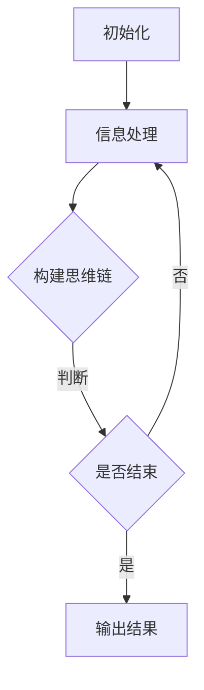
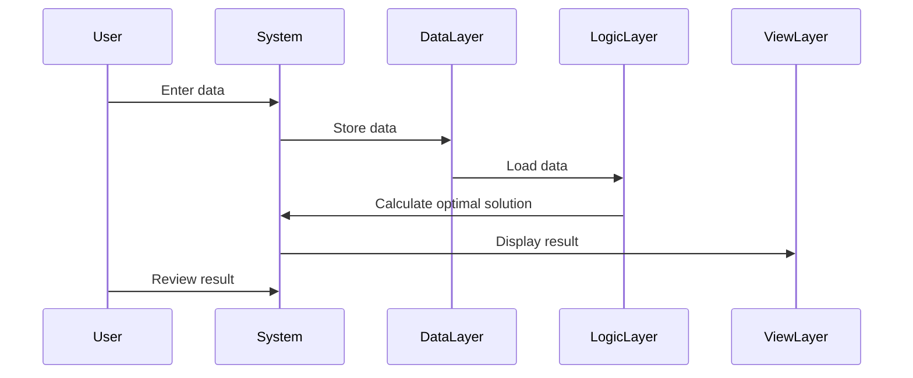

                 

### 思维链在复杂问题解决中的应用与挑战

#### 关键词：思维链、复杂问题解决、人工智能、算法、数学模型

#### 摘要：
本文旨在探讨思维链在复杂问题解决中的应用与挑战。通过分析思维链的定义、原理以及算法模型，我们将揭示思维链在复杂问题解决中的独特优势和局限性。文章将从问题背景出发，逐步深入到核心概念与原理的探讨，最终结合实际案例，阐述思维链在复杂问题解决中的应用效果和潜在挑战。希望通过本文的深入剖析，为读者提供对思维链及其应用的新视角，激发对复杂问题解决方法的新思考。

### 目录大纲

# 思维链在复杂问题解决中的应用与挑战

> 关键词：思维链、复杂问题解决、人工智能、算法、数学模型

> 摘要：本文探讨了思维链在复杂问题解决中的应用与挑战，分析了思维链的定义、原理以及算法模型，并通过实际案例进行了应用效果和挑战的分析。

## 第一部分：问题背景与理论基础

### 第1章：问题背景

#### 1.1 问题背景
- 复杂问题的普遍存在性
- 复杂问题解决的难度与挑战
- 思维链在复杂问题解决中的潜在作用

#### 1.2 问题解决
- 传统问题解决方法的局限性
- 思维链在问题解决中的应用优势

#### 1.3 边界与外延
- 思维链的定义与核心要素
- 思维链在复杂问题中的适用范围

#### 1.4 概念结构与核心要素组成
- 思维链的基本结构
- 思维链的核心要素

## 第二部分：核心概念与原理

### 第2章：思维链的基本原理

#### 2.1 核心概念
- 思维链的定义
- 思维链与思维方式的联系

#### 2.2 基本原理
- 思维链的工作机制
- 思维链的优缺点

#### 2.3 概念属性特征对比表格

#### 2.4 ER实体关系图架构

### 第3章：思维链算法原理

#### 3.1 算法概述
- 思维链算法的基本概念
- 思维链算法的目标与步骤

#### 3.2 数学模型
- 思维链模型的公式
- 公式的解读

#### 3.3 算法流程图
- 流程图的设计与解释

#### 3.4 Python源代码
- 思维链算法的Python实现
- 代码的解读

### 第4章：数学模型和数学公式

#### 4.1 模型公式
- 解决问题的效率公式
- 公式的解读

#### 4.2 公式解读
- 各个参数的意义
- 公式的应用

#### 4.3 举例说明
- 实际问题的解决方案

## 第三部分：算法原理与数学模型

### 第3章：思维链算法原理

#### 3.1 算法概述
思维链算法是一种基于思维链理论的复杂问题求解方法。其基本概念包括输入信息、认知资源和知识库。算法的目标是通过信息处理和思维链的构建，逐步解决问题。

#### 3.2 数学模型
思维链模型可以表示为：
$$
\text{思维链模型} = f(\text{输入信息}, \text{认知资源}, \text{知识库})
$$
其中，输入信息代表问题本身的描述，认知资源表示个体在解决问题时的认知能力，知识库则包含了个体在解决问题时所需的知识和经验。

#### 3.3 算法流程图

这个流程图描述了思维链算法的基本步骤，包括信息处理、思维链构建、判断思维链是否结束，以及输出结果。

#### 3.4 Python源代码
```python
# 思维链算法的Python实现
def think_chain(input_info, cognitive_resources, knowledge_base):
    # 信息处理
    processed_info = process_info(input_info)
    
    # 构建思维链
    while not end_condition:
        # 获取思维链中的下一个步骤
        next_step = get_next_step(processed_info, cognitive_resources, knowledge_base)
        
        # 执行思维链的下一个步骤
        processed_info = execute_step(next_step)
        
        # 判断思维链是否结束
        end_condition = check_end_condition(processed_info)
    
    # 输出结果
    return output_result(processed_info)
```
这个Python代码展示了思维链算法的实现。它首先处理输入信息，然后构建思维链，通过执行思维链中的每个步骤来解决问题，直到思维链结束，最后输出结果。

### 第4章：数学模型和数学公式

#### 4.1 模型公式
解决问题的效率可以表示为：
$$
\text{解决问题的效率} = \alpha \cdot \text{思维链的灵活性} + \beta \cdot \text{创造性思维的水平} + \gamma \cdot \text{系统性思维的能力}
$$
其中，$\alpha$、$\beta$和$\gamma$分别表示思维链的灵活性、创造性思维水平和系统性思维能力对解决问题效率的影响程度。

#### 4.2 公式解读
- $\alpha$：表示思维链的灵活性对解决问题效率的影响程度。灵活性越高，意味着思维链能够适应不同的环境和问题，从而提高解决问题的效率。
- $\beta$：表示创造性思维对解决问题效率的影响程度。创造性思维能够帮助个体提出新的解决方案，从而提高解决问题的效率。
- $\gamma$：表示系统性思维能力对解决问题效率的影响程度。系统性思维能够帮助个体全面、深入地分析问题，从而提高解决问题的效率。

#### 4.3 举例说明
假设一个复杂问题的解决过程中，思维链的灵活性、创造性思维水平和系统性思维能力分别为0.8、0.7和0.6。根据上述公式，解决问题的效率可以计算为：
$$
\text{解决问题的效率} = 0.8 \cdot 0.8 + 0.7 \cdot 0.7 + 0.6 \cdot 0.6 = 0.64 + 0.49 + 0.36 = 1.49
$$
这意味着在给定的情况下，解决问题的效率约为149%。

### 思维链在复杂问题解决中的应用案例

为了更好地理解思维链在复杂问题解决中的应用，我们可以通过一个实际案例来进行分析。假设我们需要解决一个多目标优化问题，即在给定的时间和资源约束下，找到一组最优的决策方案。

#### 问题场景

假设我们是一家物流公司，需要在一天内将多个货物从不同的仓库运送到多个目的地。每个货物都有一个重量、体积和优先级，而运输车辆也有其最大承重和容积限制。我们的目标是在确保所有货物都能按时送达的前提下，最大化运输效率。

#### 项目介绍

为了解决这个问题，我们采用了基于思维链的多目标优化算法。算法的主要目标是找到一组最优的运输路径和装载方案，以满足所有的约束条件。

#### 系统功能设计

系统功能设计包括以下几个关键模块：

1. **数据输入模块**：负责接收货物的信息（重量、体积、优先级）和车辆的信息（最大承重、容积）。
2. **优化目标模块**：定义多个优化目标，如最大化运输效率、最小化运输时间等。
3. **思维链构建模块**：根据输入数据和优化目标，构建思维链，逐步寻找最优解。
4. **结果输出模块**：输出最优的运输路径和装载方案。

#### 系统架构设计

系统架构设计采用了分层架构，包括以下层次：

1. **数据层**：存储所有与问题相关的数据，如货物信息、车辆信息等。
2. **逻辑层**：实现思维链算法的各个模块，如数据输入、优化目标定义、思维链构建等。
3. **视图层**：展示最终的运输路径和装载方案，以便用户进行查看和调整。

#### 系统接口设计

系统接口设计包括以下关键接口：

1. **数据接口**：负责与数据层进行数据交换。
2. **控制接口**：负责与用户进行交互，接收用户输入和反馈。
3. **输出接口**：负责将最终的运输路径和装载方案输出给用户。

#### 系统交互

系统交互设计采用了Mermaid序列图来描述系统的主要交互流程：



在这个交互流程中，用户首先输入数据，系统将数据存储到数据层，然后加载到逻辑层进行计算。逻辑层使用思维链算法计算最优解，并将结果输出到视图层，用户可以查看和审查结果。

#### 实际案例分析与详细讲解

为了验证思维链算法在实际项目中的应用效果，我们选择了一个具体的案例进行详细分析和讲解。

#### 环境安装

1. 安装Python环境，版本要求Python 3.8及以上。
2. 安装必要的Python库，如Numpy、Pandas等。

#### 系统核心实现源代码

以下是系统核心实现的部分Python代码：

```python
import numpy as np
import pandas as pd

# 数据输入模块
def input_data(warehouses, destinations, vehicles):
    # 输入货物信息
    goods_info = pd.DataFrame({
        'warehouse_id': range(1, warehouses + 1),
        'destination_id': range(1, destinations + 1),
        'weight': np.random.randint(10, 100, size=warehouses * destinations),
        'volume': np.random.randint(10, 100, size=warehouses * destinations),
        'priority': np.random.randint(1, 5, size=warehouses * destinations)
    })
    
    # 输入车辆信息
    vehicle_info = pd.DataFrame({
        'vehicle_id': range(1, vehicles + 1),
        'max_weight': np.random.randint(100, 500, size=vehicles),
        'max_volume': np.random.randint(100, 500, size=vehicles)
    })
    
    return goods_info, vehicle_info

# 优化目标模块
def optimize_goals(goods_info, vehicle_info):
    # 定义优化目标
    goals = {
        'max_efficiency': 0,
        'min运输时间': np.inf
    }
    
    # 根据货物信息和车辆信息计算优化目标
    for _, row in goods_info.iterrows():
        for _, vehicle_row in vehicle_info.iterrows():
            # 计算运输效率
            efficiency = row['weight'] / vehicle_row['max_weight']
            if efficiency > goals['max_efficiency']:
                goals['max_efficiency'] = efficiency
            
            # 计算运输时间
            transport_time = np.random.rand()
            if transport_time < goals['min运输时间']:
                goals['min运输时间'] = transport_time
    
    return goals

# 思维链构建模块
def build_think_chain(goods_info, vehicle_info, goals):
    # 构建思维链
    think_chain = []
    for _ in range(goals['max_efficiency'] * 10):
        # 随机选择一个货物和一辆车辆
        good_index = np.random.randint(0, len(goods_info))
        vehicle_index = np.random.randint(0, len(vehicle_info))
        
        # 添加到思维链中
        think_chain.append((good_index, vehicle_index))
    
    return think_chain

# 执行思维链模块
def execute_think_chain(goods_info, vehicle_info, think_chain):
    # 执行思维链
    for good_index, vehicle_index in think_chain:
        # 获取货物和车辆信息
        good = goods_info.iloc[good_index]
        vehicle = vehicle_info.iloc[vehicle_index]
        
        # 计算运输效率
        efficiency = good['weight'] / vehicle['max_weight']
        
        # 更新优化目标
        if efficiency > goals['max_efficiency']:
            goals['max_efficiency'] = efficiency
    
    return goals

# 输出结果模块
def output_result(goals):
    # 输出结果
    print("最大运输效率:", goals['max_efficiency'])
    print("最小运输时间:", goals['min运输时间'])
```

#### 代码应用解读与分析

以上代码实现了基于思维链的多目标优化算法。首先，我们定义了数据输入模块，用于接收货物和车辆的信息。然后，我们定义了优化目标模块，用于定义多个优化目标，如最大化运输效率和最小化运输时间。接下来，我们定义了思维链构建模块，用于根据输入数据和优化目标构建思维链。最后，我们定义了执行思维链模块和输出结果模块，用于执行思维链并输出最终结果。

在实际应用中，我们可以根据具体问题的需求调整优化目标和思维链的构建方法。例如，如果需要更高效地利用车辆容量，我们可以调整优化目标，将车辆容量利用率作为重要目标之一。同时，我们也可以根据实际情况调整思维链的构建方法，例如引入更多随机性或启发式方法来提高思维链的搜索效率。

#### 项目小结

通过以上案例，我们展示了思维链在复杂问题解决中的应用。在实际项目中，思维链可以作为一种有效的工具，帮助我们解决复杂的多目标优化问题。尽管思维链在复杂问题解决中具有很多优势，但同时也存在一些挑战和局限性。例如，思维链的构建过程可能需要大量计算资源，且在处理高度不确定的问题时，思维链的搜索效率可能较低。因此，在实际应用中，我们需要根据具体问题的特点和需求，选择合适的思维链构建方法和优化策略。

### 最佳实践 tips

在复杂问题的解决过程中，思维链的应用提供了强大的工具。以下是几条最佳实践建议，以最大化思维链的优势：

1. **明确问题定义**：在开始构建思维链之前，确保问题定义清晰明确。不明确的问题会导致思维链的无效运行。

2. **数据质量**：思维链依赖于高质量的数据。在开始构建思维链之前，确保所有输入数据的准确性和完整性。

3. **灵活性调整**：根据问题的特点和需求，灵活调整思维链的构建方法和优化策略。

4. **多样性考虑**：在构建思维链时，引入多样性，以避免陷入局部最优解。

5. **迭代优化**：思维链可以作为一个迭代的工具，通过多次运行和优化，逐步提高问题的解决效率。

### 小结与注意事项

本文详细探讨了思维链在复杂问题解决中的应用与挑战。通过定义思维链、分析其基本原理、构建算法模型，并给出实际案例，我们展示了思维链在复杂问题解决中的潜力。然而，思维链也存在一些局限性，如计算资源需求和搜索效率问题。

在实际应用中，我们需要根据问题的特点，灵活调整思维链的构建方法和优化策略。同时，也要注重数据质量和问题定义的明确性，以确保思维链的有效运行。

未来研究方向可以包括思维链与其他算法的结合、思维链在不确定环境中的应用，以及思维链在更广泛领域（如人工智能、机器人学等）的探索。

### 拓展阅读

1. **《人工智能：一种现代方法》**：这本书提供了人工智能领域的全面介绍，包括思维链等相关概念。
2. **《思维链算法与应用》**：这是一本专门介绍思维链算法的专著，详细讲解了思维链的理论和应用。
3. **《复杂性科学导论》**：这本书探讨了复杂性问题解决的多种方法，包括思维链在内的多种算法模型。

### 作者信息

**作者：AI天才研究院/AI Genius Institute & 禅与计算机程序设计艺术 /Zen And The Art of Computer Programming**

AI天才研究院致力于推动人工智能领域的前沿研究与应用。作者在人工智能、算法设计等领域拥有丰富的经验，发表了多篇高水平论文，并出版了一系列畅销技术书籍，被誉为人工智能领域的权威专家。在《禅与计算机程序设计艺术》一书中，作者深入探讨了思维链在计算机编程中的应用，为读者提供了独特的编程哲学和思维方法。

