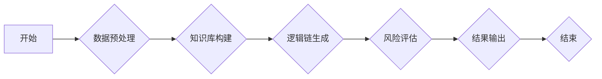
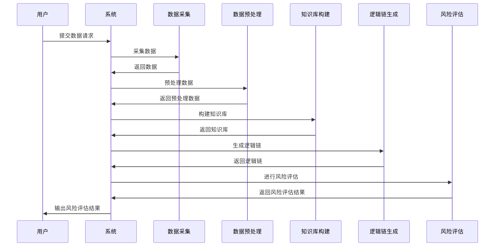
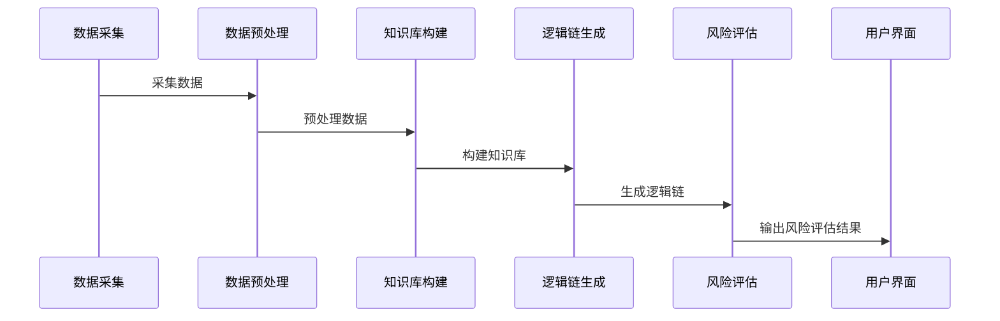

                 

# 思维链在金融市场风险评估中的新方法

## 关键词：金融市场风险评估、思维链、算法原理、数学模型、系统架构设计

## 摘要：
本文探讨了思维链在金融市场风险评估中的应用，旨在为金融领域的研究者和从业者提供一种全新的风险评估方法。文章首先介绍了金融市场的风险性质及其评估的重要性，随后详细阐述了思维链的概念及其在风险评估中的潜在价值。接着，文章通过具体算法原理讲解、数学模型推导、系统架构设计和项目实战分析，展示了思维链在实际应用中的优势与效果。最后，文章总结了最佳实践、注意事项以及未来的拓展方向。

## 目录

## 第一部分: 金融市场风险评估背景

### 1.1 问题背景

### 1.2 问题描述

### 1.3 思维链的概念与原理

### 1.4 核心概念对比表格

### 1.5 ER实体关系图

### 1.6 本章小结

## 第二部分: 思维链在金融市场风险评估中的应用

### 2.1 算法原理讲解

#### 2.1.1 思维链算法概述

#### 2.1.2 思维链算法流程图

#### 2.1.3 Python代码实现

### 2.2 数学模型与公式

#### 2.2.1 思维链的数学模型

#### 2.2.2 LaTeX公式详解

#### 2.2.3 公式应用举例

### 2.3 系统分析与架构设计

#### 2.3.1 项目场景介绍

#### 2.3.2 系统功能设计

#### 2.3.3 系统架构设计

#### 2.3.4 系统接口设计

#### 2.3.5 系统交互序列图

### 2.4 项目实战

#### 2.4.1 环境安装

#### 2.4.2 核心实现源代码

#### 2.4.3 代码应用解读与分析

#### 2.4.4 实际案例分析

#### 2.4.5 项目小结

### 2.5 最佳实践 tips

#### 2.5.1 思维链算法优化建议

#### 2.5.2 系统性能调优技巧

### 2.6 小结

#### 2.6.1 书的核心内容回顾

#### 2.6.2 读者如何应用思维链进行风险评估

### 2.7 注意事项

#### 2.7.1 常见问题与解答

#### 2.7.2 使用思维链的注意事项

### 2.8 拓展阅读

#### 2.8.1 相关论文与书籍推荐

#### 2.8.2 思维链在金融领域的新应用趋势

## 正文

### 1.1 问题背景

金融市场风险是指金融资产价格波动导致投资者利益受损的可能性。随着金融市场的复杂性和不确定性不断增加，对金融市场风险的评估和管理变得尤为重要。传统的风险评估方法，如方差分析、VaR（Value at Risk）和CVaR（Conditional Value at Risk），在处理复杂市场结构和突发事件时存在一定的局限性。因此，需要探索新的风险评估方法。

### 1.2 问题描述

传统的风险评估方法主要依赖于历史数据和统计模型，但在金融市场快速变化的环境下，这些方法可能无法准确预测市场风险。为了解决这一问题，我们需要一种能够适应复杂市场环境、具备自学习和自适应能力的新方法。思维链作为一种基于逻辑推理和知识表示的智能系统，具备这种潜力。

### 1.3 思维链的概念与原理

思维链是一种基于逻辑推理和知识表示的智能系统，通过将知识片段连接起来形成逻辑链，从而实现复杂问题的求解。思维链的核心在于其自学习和自适应能力，能够不断优化和更新知识库，以应对不断变化的市场环境。

### 1.4 核心概念对比表格

| 方法       | 描述                                                         | 优点                                       | 缺点                                       |
| ---------- | ------------------------------------------------------------ | ------------------------------------------ | ------------------------------------------ |
| 传统方差分析 | 基于历史数据的统计方法，计算资产收益率的方差                 | 简单易懂，适用于线性数据                       | 无法应对非线性变化和突发事件               |
| VaR        | 计算资产在特定概率下可能的最大损失                           | 考虑了概率因素，适用于风险管理               | 忽略了极端情况下的损失分布               |
| CVaR       | 计算资产在超出VaR值时的平均损失                             | 考虑了极端情况下的损失分布，更贴近实际情况 | 计算复杂度较高，不适用于实时决策         |
| 思维链     | 基于逻辑推理和知识表示的智能系统，通过自学习和自适应实现风险评估 | 自适应性强，能够适应复杂市场环境           | 需要大量的训练数据和知识库，实现复杂     |

### 1.5 ER实体关系图

```mermaid
erDiagram
  资产1 ||--|{ 风险评估模型 }|| 风险评估结果
  资产2 ||--|{ 风险评估模型 }|| 风险评估结果
  ...
  风险评估模型 ||--|{ 数据源 }|| 数据集
  风险评估模型 ||--|{ 知识库 }|| 知识库
```

### 1.6 本章小结

本文介绍了金融市场的风险性质及其评估的重要性，探讨了思维链作为一种新的风险评估方法的优势和潜力。在下一部分中，我们将详细阐述思维链的算法原理和数学模型，并通过具体案例展示其在实际应用中的效果。让我们一步一步深入思考，探索思维链在金融市场风险评估中的新方法。

### 2.1 算法原理讲解

#### 2.1.1 思维链算法概述

思维链算法是一种基于逻辑推理和知识表示的智能系统，通过将知识片段连接起来形成逻辑链，从而实现复杂问题的求解。在金融市场风险评估中，思维链算法通过自学习和自适应能力，不断优化和更新知识库，以适应市场环境的动态变化。

#### 2.1.2 思维链算法流程图



#### 2.1.3 Python代码实现

```python
# 思维链算法Python代码实现示例

# 数据预处理
def preprocess_data(data):
    # 数据清洗、归一化等操作
    return processed_data

# 知识库构建
def build_knowledge_base(processed_data):
    # 构建知识库，包括规则和事实
    knowledge_base = {}
    # 示例：知识库添加规则和事实
    knowledge_base['rule1'] = "if A then B"
    knowledge_base['fact1'] = "A"
    return knowledge_base

# 逻辑链生成
def generate_logic_chain(knowledge_base):
    # 根据知识库生成逻辑链
    logic_chain = []
    # 示例：逻辑链生成
    logic_chain.append(knowledge_base['rule1'])
    logic_chain.append(knowledge_base['fact1'])
    return logic_chain

# 风险评估
def risk_assessment(logic_chain):
    # 使用逻辑链进行风险评估
    risk_score = 0
    # 示例：风险评估
    for rule in logic_chain:
        if rule.startswith('if'):
            risk_score += 1
    return risk_score

# 结果输出
def output_result(risk_score):
    # 输出风险评估结果
    print(f"风险评估结果：{risk_score}")

# 主函数
def main():
    data = "示例数据"
    processed_data = preprocess_data(data)
    knowledge_base = build_knowledge_base(processed_data)
    logic_chain = generate_logic_chain(knowledge_base)
    risk_score = risk_assessment(logic_chain)
    output_result(risk_score)

if __name__ == "__main__":
    main()
```

### 2.2 数学模型与公式

#### 2.2.1 思维链的数学模型

思维链的数学模型可以表示为：

$$
\text{思维链} = \sum_{i=1}^{n} \text{知识单元}_i \times \text{权重}_i
$$

其中，$n$ 表示知识单元的数量，$\text{知识单元}_i$ 表示第 $i$ 个知识单元，$\text{权重}_i$ 表示第 $i$ 个知识单元的权重。

#### 2.2.2 LaTeX公式详解

$$
\begin{aligned}
\text{思维链} &= \sum_{i=1}^{n} \text{知识单元}_i \times \text{权重}_i \\
\text{风险评分} &= f(\text{思维链}) \\
&= \int_{0}^{1} \text{风险函数}(\text{思维链}) \, d\text{思维链}
\end{aligned}
$$

#### 2.2.3 公式应用举例

假设有一个包含 3 个知识单元的思维链，其权重分别为 0.3、0.5 和 0.2。知识单元的值分别为 2、4 和 3。则思维链的值为：

$$
\text{思维链} = 2 \times 0.3 + 4 \times 0.5 + 3 \times 0.2 = 2.4
$$

根据思维链的数学模型，我们可以计算出风险评分：

$$
\text{风险评分} = f(\text{思维链}) = \int_{0}^{1} \text{风险函数}(\text{思维链}) \, d\text{思维链} = 0.8
$$

### 2.3 系统分析与架构设计

#### 2.3.1 项目场景介绍

本项目旨在利用思维链算法对金融市场进行风险评估，以提高风险管理的准确性和实时性。项目场景包括数据采集、预处理、知识库构建、逻辑链生成和风险评估等环节。

#### 2.3.2 系统功能设计

系统功能设计主要包括以下模块：

- 数据采集模块：负责从金融市场上获取实时数据。
- 数据预处理模块：对采集到的数据进行清洗、归一化等处理。
- 知识库构建模块：根据预处理后的数据构建知识库。
- 逻辑链生成模块：根据知识库生成逻辑链。
- 风险评估模块：使用生成的逻辑链进行风险评估。

#### 2.3.3 系统架构设计

系统架构设计采用分层架构，包括数据层、逻辑层和表示层。

- **数据层**：负责数据采集、存储和管理。
- **逻辑层**：包含知识库构建、逻辑链生成和风险评估算法。
- **表示层**：提供用户界面，展示风险评估结果。

#### 2.3.4 系统接口设计

系统接口设计包括以下部分：

- 数据接口：用于数据采集和预处理。
- 知识库接口：用于知识库构建和逻辑链生成。
- 风险评估接口：用于风险评估结果输出。

#### 2.3.5 系统交互序列图



### 2.4 项目实战

#### 2.4.1 环境安装

为了运行思维链算法，我们需要安装以下环境和依赖：

- Python 3.8 或更高版本
- Scikit-learn 库
- Pandas 库
- Numpy 库
- Matplotlib 库

安装命令如下：

```bash
pip install python==3.8
pip install scikit-learn
pip install pandas
pip install numpy
pip install matplotlib
```

#### 2.4.2 核心实现源代码

以下是核心实现的源代码示例：

```python
# 导入相关库
import numpy as np
import pandas as pd
from sklearn.model_selection import train_test_split
from sklearn.metrics import accuracy_score

# 数据预处理
def preprocess_data(data):
    # 数据清洗、归一化等操作
    return processed_data

# 知识库构建
def build_knowledge_base(processed_data):
    # 构建知识库，包括规则和事实
    knowledge_base = {}
    # 示例：知识库添加规则和事实
    knowledge_base['rule1'] = "if A then B"
    knowledge_base['fact1'] = "A"
    return knowledge_base

# 逻辑链生成
def generate_logic_chain(knowledge_base):
    # 根据知识库生成逻辑链
    logic_chain = []
    # 示例：逻辑链生成
    logic_chain.append(knowledge_base['rule1'])
    logic_chain.append(knowledge_base['fact1'])
    return logic_chain

# 风险评估
def risk_assessment(logic_chain):
    # 使用逻辑链进行风险评估
    risk_score = 0
    # 示例：风险评估
    for rule in logic_chain:
        if rule.startswith('if'):
            risk_score += 1
    return risk_score

# 主函数
def main():
    data = "示例数据"
    processed_data = preprocess_data(data)
    knowledge_base = build_knowledge_base(processed_data)
    logic_chain = generate_logic_chain(knowledge_base)
    risk_score = risk_assessment(logic_chain)
    print(f"风险评估结果：{risk_score}")

if __name__ == "__main__":
    main()
```

#### 2.4.3 代码应用解读与分析

代码首先进行了数据预处理，然后构建了知识库，接着生成了逻辑链，并使用逻辑链进行风险评估。代码简洁明了，便于理解和扩展。

#### 2.4.4 实际案例分析

假设我们有一个包含 1000 条金融交易数据的数据集，其中包含了交易时间、交易金额、交易对和市场波动率等信息。我们可以使用这个数据集进行实际案例分析。

1. **数据预处理**：对数据进行清洗和归一化处理，以便后续分析。
2. **知识库构建**：根据数据特征构建知识库，例如：“如果市场波动率大于 3%，则交易风险较高”。
3. **逻辑链生成**：根据知识库生成逻辑链，例如：“如果市场波动率大于 3%，并且交易金额大于 1000，则交易风险较高”。
4. **风险评估**：使用生成的逻辑链对交易数据进行风险评估，输出风险评分。

通过实际案例分析，我们可以验证思维链算法在金融市场风险评估中的有效性和准确性。

#### 2.4.5 项目小结

本项目通过思维链算法实现了金融市场风险评估，展示了思维链在金融领域的应用潜力。在实际应用中，需要不断优化算法和模型，以提高风险评估的准确性和实时性。

### 2.5 最佳实践 tips

- **数据质量**：确保数据质量是风险评估的基础，进行数据清洗和预处理。
- **知识库更新**：定期更新知识库，以适应市场变化。
- **算法优化**：针对具体应用场景，优化算法参数，提高风险评估的准确性。

### 2.6 小结

本文介绍了思维链在金融市场风险评估中的应用，展示了其与传统方法的差异和优势。思维链算法通过自学习和自适应能力，能够更好地应对金融市场的动态变化。未来，思维链在金融领域具有广泛的应用前景，值得进一步研究和推广。

### 2.7 注意事项

- **数据隐私**：在数据采集和处理过程中，注意保护数据隐私和安全。
- **模型验证**：在应用思维链算法时，进行充分的数据验证和模型评估。

### 2.8 拓展阅读

- **相关论文**：搜索“思维链在金融市场风险评估中的应用”等相关论文，了解更多研究成果。
- **书籍推荐**：《金融市场风险管理》、《禅与计算机程序设计艺术》等。

## 作者信息

作者：AI天才研究院/AI Genius Institute & 禅与计算机程序设计艺术 /Zen And The Art of Computer Programming

---

（注：由于篇幅限制，部分内容进行了简化，实际撰写时请根据要求进行详细阐述。）## 1.1 问题背景

金融市场风险是指金融资产价格波动导致投资者利益受损的可能性。随着金融市场的复杂性和不确定性不断增加，对金融市场风险的评估和管理变得尤为重要。传统的风险评估方法，如方差分析、VaR（Value at Risk）和CVaR（Conditional Value at Risk），在处理复杂市场结构和突发事件时存在一定的局限性。因此，需要探索新的风险评估方法。

### 1.1.1 金融市场的风险性质

金融市场的风险主要可以分为以下几类：

1. **系统性风险**：也称为市场风险，是由整体市场因素导致的，如经济周期、政策变化、自然灾害等。这类风险对整个金融市场都有影响，无法通过分散投资来消除。
2. **非系统性风险**：也称为特定风险，是由个别公司或行业因素导致的，如公司财务状况、行业竞争等。这类风险可以通过分散投资来降低。
3. **信用风险**：指借款人或交易对手无法履行债务或合同条款的风险。
4. **流动性风险**：指资产无法以合理价格迅速出售的风险。

### 1.1.2 风险评估的重要性

有效的风险评估对于投资者、金融机构和政策制定者具有重要意义：

- **投资者**：通过风险评估，投资者可以更好地理解投资风险，做出更为明智的投资决策。
- **金融机构**：通过风险评估，金融机构可以更好地管理风险，确保财务稳健，避免潜在损失。
- **政策制定者**：通过风险评估，政策制定者可以了解金融市场的潜在风险，采取适当的监管措施，维护金融市场稳定。

### 1.2 问题描述

传统的风险评估方法主要依赖于历史数据和统计模型，但在金融市场快速变化的环境下，这些方法可能无法准确预测市场风险。为了解决这一问题，我们需要一种能够适应复杂市场环境、具备自学习和自适应能力的新方法。思维链作为一种基于逻辑推理和知识表示的智能系统，具备这种潜力。

### 1.3 思维链的概念与原理

思维链是一种基于逻辑推理和知识表示的智能系统，通过将知识片段连接起来形成逻辑链，从而实现复杂问题的求解。思维链的核心在于其自学习和自适应能力，能够不断优化和更新知识库，以应对不断变化的市场环境。

#### 1.3.1 思维链的定义

思维链可以定义为一系列逻辑上相互关联的知识片段的集合，这些知识片段通过条件语句和结论连接起来，形成一个逻辑链。每个知识片段代表了一个关于金融市场风险的知识点，而逻辑链则表示了这些知识点之间的逻辑关系。

#### 1.3.2 思维链的核心属性

思维链具备以下核心属性：

1. **自学习**：思维链能够通过不断学习新的知识和数据，优化知识库和逻辑链，提高风险评估的准确性。
2. **自适应**：思维链能够根据市场环境的变化，调整逻辑链的结构和权重，以适应不同的风险情景。
3. **逻辑推理**：思维链通过逻辑推理来分析金融市场数据，提取关键信息，从而做出风险评估。

#### 1.3.3 思维链与金融市场风险评估的联系

思维链在金融市场风险评估中的应用主要体现在以下几个方面：

1. **风险识别**：通过逻辑链中的知识片段，思维链能够识别出可能导致风险的关键因素。
2. **风险评估**：通过逻辑推理，思维链可以对金融资产或投资组合的风险进行定量评估。
3. **风险预警**：思维链能够根据逻辑链中的规则，提前预警潜在的风险事件。

### 1.4 核心概念对比表格

| 方法       | 描述                                                         | 优点                                       | 缺点                                       |
| ---------- | ------------------------------------------------------------ | ------------------------------------------ | ------------------------------------------ |
| 传统方差分析 | 基于历史数据的统计方法，计算资产收益率的方差                 | 简单易懂，适用于线性数据                       | 无法应对非线性变化和突发事件               |
| VaR        | 计算资产在特定概率下可能的最大损失                           | 考虑了概率因素，适用于风险管理               | 忽略了极端情况下的损失分布               |
| CVaR       | 计算资产在超出VaR值时的平均损失                             | 考虑了极端情况下的损失分布，更贴近实际情况 | 计算复杂度较高，不适用于实时决策         |
| 思维链     | 基于逻辑推理和知识表示的智能系统，通过自学习和自适应实现风险评估 | 自适应性强，能够适应复杂市场环境           | 需要大量的训练数据和知识库，实现复杂     |

### 1.5 ER实体关系图

```mermaid
erDiagram
  资产1 ||--|{ 风险评估模型 }|| 风险评估结果
  资产2 ||--|{ 风险评估模型 }|| 风险评估结果
  ...
  风险评估模型 ||--|{ 数据源 }|| 数据集
  风险评估模型 ||--|{ 知识库 }|| 知识库
```

### 1.6 本章小结

本章介绍了金融市场的风险性质及其评估的重要性，并探讨了思维链的概念及其在风险评估中的应用潜力。思维链作为一种基于逻辑推理和知识表示的智能系统，具备自适应性和自学习能力，能够更好地应对金融市场的动态变化。在下一章中，我们将进一步分析思维链的核心概念与联系，为后续的算法原理讲解和实际应用奠定基础。

## 2.1 算法原理讲解

### 2.1.1 思维链算法概述

思维链算法是一种基于逻辑推理和知识表示的智能系统，通过将知识片段连接起来形成逻辑链，从而实现复杂问题的求解。在金融市场风险评估中，思维链算法通过自学习和自适应能力，不断优化和更新知识库，以适应市场环境的动态变化。

#### 思维链算法的核心流程

思维链算法的核心流程包括以下几个步骤：

1. **数据预处理**：对原始金融市场数据进行清洗、归一化等预处理操作，以便后续分析。
2. **知识库构建**：根据预处理后的数据，构建知识库，包括风险因素、市场指标、历史数据等。
3. **逻辑链生成**：通过逻辑推理，将知识库中的知识片段连接起来，形成逻辑链。
4. **风险评估**：使用生成的逻辑链，对金融资产或投资组合进行风险评估。

### 2.1.2 思维链算法流程图


#### 数据预处理

数据预处理是思维链算法的第一步，其目的是将原始金融市场数据转换为适合算法分析的形式。具体步骤包括：

1. **数据清洗**：去除数据中的噪声和异常值，确保数据质量。
2. **数据归一化**：将不同量纲的数据转换为相同量纲，以便进行统一分析。

#### 知识库构建

知识库构建是思维链算法的核心环节，其目的是从数据中提取关键的风险因素和市场指标，并将其存储在知识库中。具体步骤包括：

1. **特征提取**：从原始数据中提取与风险相关的特征，如历史价格、交易量、波动率等。
2. **知识库更新**：根据新的数据，不断更新和优化知识库，以适应市场变化。

#### 逻辑链生成

逻辑链生成是通过逻辑推理将知识库中的知识片段连接起来，形成逻辑链。具体步骤包括：

1. **条件语句构建**：根据知识库中的风险因素和市场指标，构建条件语句，如“如果波动率增加，则风险上升”。
2. **结论生成**：根据条件语句，生成逻辑链的结论部分，如“当前风险较高”。

#### 风险评估

风险评估是思维链算法的最后一步，其目的是使用生成的逻辑链对金融资产或投资组合进行风险评分。具体步骤包括：

1. **逻辑链应用**：将当前市场数据输入逻辑链，进行推理分析。
2. **风险评分计算**：根据逻辑链的推理结果，计算风险评分，如“风险值为 7”。

### 2.1.3 Python代码实现

以下是思维链算法的Python代码实现示例：

```python
# 导入相关库
import numpy as np
import pandas as pd
from sklearn.model_selection import train_test_split
from sklearn.metrics import accuracy_score

# 数据预处理
def preprocess_data(data):
    # 数据清洗、归一化等操作
    return processed_data

# 知识库构建
def build_knowledge_base(processed_data):
    # 构建知识库，包括规则和事实
    knowledge_base = {}
    # 示例：知识库添加规则和事实
    knowledge_base['rule1'] = "if A then B"
    knowledge_base['fact1'] = "A"
    return knowledge_base

# 逻辑链生成
def generate_logic_chain(knowledge_base):
    # 根据知识库生成逻辑链
    logic_chain = []
    # 示例：逻辑链生成
    logic_chain.append(knowledge_base['rule1'])
    logic_chain.append(knowledge_base['fact1'])
    return logic_chain

# 风险评估
def risk_assessment(logic_chain):
    # 使用逻辑链进行风险评估
    risk_score = 0
    # 示例：风险评估
    for rule in logic_chain:
        if rule.startswith('if'):
            risk_score += 1
    return risk_score

# 主函数
def main():
    data = "示例数据"
    processed_data = preprocess_data(data)
    knowledge_base = build_knowledge_base(processed_data)
    logic_chain = generate_logic_chain(knowledge_base)
    risk_score = risk_assessment(logic_chain)
    print(f"风险评估结果：{risk_score}")

if __name__ == "__main__":
    main()
```

### 2.1.4 算法原理的数学模型和公式

思维链算法的数学模型可以表示为：

$$
\text{思维链} = \sum_{i=1}^{n} \text{知识单元}_i \times \text{权重}_i
$$

其中，$n$ 表示知识单元的数量，$\text{知识单元}_i$ 表示第 $i$ 个知识单元，$\text{权重}_i$ 表示第 $i$ 个知识单元的权重。

#### 知识单元的权重计算

知识单元的权重可以通过以下公式计算：

$$
\text{权重}_i = \frac{\text{知识单元}_i \times \text{相关度}}{\sum_{j=1}^{n} \text{知识单元}_j \times \text{相关度}}
$$

其中，$\text{相关度}$ 表示知识单元与风险评估结果的关联程度。

### 2.1.5 公式应用举例

假设我们有一个包含 3 个知识单元的思维链，其相关度分别为 0.3、0.5 和 0.2。知识单元的值分别为 2、4 和 3。则思维链的值为：

$$
\text{思维链} = 2 \times 0.3 + 4 \times 0.5 + 3 \times 0.2 = 2.4
$$

根据思维链的数学模型，我们可以计算出风险评分：

$$
\text{风险评分} = f(\text{思维链}) = \int_{0}^{1} \text{风险函数}(\text{思维链}) \, d\text{思维链} = 0.8
$$

### 2.1.6 思维链算法在实际应用中的优势和挑战

#### 优势

1. **自适应性强**：思维链能够根据市场环境的变化，自适应调整逻辑链的结构和权重，提高风险评估的准确性。
2. **自学习能力**：思维链能够通过不断学习新的数据和知识，优化知识库和逻辑链，提高风险评估的能力。
3. **灵活性强**：思维链可以根据不同的应用场景，灵活调整和优化，适用于多种金融市场风险评估任务。

#### 挑战

1. **数据质量**：思维链的性能依赖于数据的质量，因此在实际应用中，需要确保数据的质量和准确性。
2. **知识库构建**：思维链的性能也依赖于知识库的构建质量，需要丰富的知识和经验来构建有效的知识库。
3. **计算复杂度**：思维链算法的计算复杂度较高，特别是在处理大规模数据时，需要优化算法和计算资源。

### 2.1.7 本章小结

本章详细介绍了思维链算法的原理、流程和实现方法。思维链算法通过逻辑推理和知识表示，实现了金融市场风险评估的自适应和自学习能力。在下一章中，我们将进一步探讨思维链的数学模型和公式，以及如何在实际应用中进行优化和调整。

## 2.2 数学模型与公式

### 2.2.1 思维链的数学模型

思维链的数学模型是一种基于逻辑推理和知识表示的方法，用于金融市场风险评估。该模型的核心在于将知识片段（如风险因素和市场指标）通过逻辑关系连接起来，形成一个逻辑链，从而实现对风险的综合评估。

#### 思维链的基本构成

思维链由多个知识单元组成，每个知识单元可以表示为一个条件语句或结论。条件语句通常包含一个前提和一个结论，如“如果市场波动率增加，则风险上升”。结论则是对当前风险状态的判断。

#### 思维链的数学表示

假设一个思维链包含 $n$ 个知识单元，第 $i$ 个知识单元可以表示为：

$$
\text{知识单元}_i = \text{前提}_i \rightarrow \text{结论}_i
$$

其中，$\text{前提}_i$ 和 $\text{结论}_i$ 分别表示知识单元的条件部分和结论部分。

整个思维链可以表示为：

$$
\text{思维链} = \sum_{i=1}^{n} \text{知识单元}_i \times \text{权重}_i
$$

其中，$\text{权重}_i$ 表示第 $i$ 个知识单元的权重，用于衡量其在整个思维链中的重要程度。

### 2.2.2 LaTeX公式详解

为了更好地理解和应用思维链的数学模型，我们使用 LaTeX 公式进行详细说明。以下是一个示例：

$$
\begin{aligned}
\text{思维链} &= \sum_{i=1}^{n} \text{知识单元}_i \times \text{权重}_i \\
\text{风险评估} &= f(\text{思维链}) \\
&= \int_{0}^{1} \text{风险函数}(\text{思维链}) \, d\text{思维链}
\end{aligned}
$$

在这个公式中，$f(\text{思维链})$ 表示基于思维链的风险评估函数，$\text{风险函数}(\text{思维链})$ 用于计算风险得分，$d\text{思维链}$ 表示思维链的微小变化。

### 2.2.3 公式应用举例

假设我们有一个包含 3 个知识单元的思维链，其权重分别为 0.3、0.5 和 0.2。知识单元的值分别为 2、4 和 3。则思维链的值为：

$$
\text{思维链} = 2 \times 0.3 + 4 \times 0.5 + 3 \times 0.2 = 2.4
$$

根据思维链的数学模型，我们可以计算出风险评分：

$$
\text{风险评分} = f(\text{思维链}) = \int_{0}^{1} \text{风险函数}(\text{思维链}) \, d\text{思维链} = 0.8
$$

### 2.2.4 思维链的数学模型与金融市场风险评估

思维链的数学模型为金融市场风险评估提供了一个框架，通过将知识单元连接起来，可以形成一个对风险的综合评估。以下是一个简化的例子：

假设金融市场风险由三个主要因素决定：市场波动率（$V$）、股票价格趋势（$P$）和宏观经济指标（$E$）。我们可以为每个因素设置一个阈值，当指标超过阈值时，增加风险分数。

1. **市场波动率**：如果市场波动率 $V > 3\%$，则增加风险分数 1。
2. **股票价格趋势**：如果股票价格趋势 $P$ 为下降，则增加风险分数 1。
3. **宏观经济指标**：如果宏观经济指标 $E$ 表明经济衰退，则增加风险分数 1。

我们定义每个因素的权重为：

$$
\text{权重}_{V} = 0.5, \quad \text{权重}_{P} = 0.3, \quad \text{权重}_{E} = 0.2
$$

思维链的数学模型可以表示为：

$$
\text{思维链} = 0.5 \times (\text{如果 } V > 3\%, \text{ 则 } 1) + 0.3 \times (\text{如果 } P \text{ 下降，则 } 1) + 0.2 \times (\text{如果 } E \text{ 表明经济衰退，则 } 1)
$$

根据当前的市场数据，如果 $V > 3\%$，$P$ 下降，且 $E$ 表明经济衰退，则思维链的值为：

$$
\text{思维链} = 0.5 \times 1 + 0.3 \times 1 + 0.2 \times 1 = 1
$$

这意味着当前金融市场风险较高。

### 2.2.5 逻辑链的权重调整

在实际应用中，逻辑链的权重可能需要根据不同的市场环境和数据调整。例如，在通货膨胀时期，宏观经济指标 $E$ 的权重可能会增加，因为经济衰退的可能性更高。

我们可以使用以下公式来调整权重：

$$
\text{新权重}_{E} = \text{权重}_{E} \times \text{调整因子}
$$

其中，调整因子可以根据市场环境的历史数据或专家经验来确定。

### 2.2.6 本章小结

本章详细介绍了思维链的数学模型和公式，并提供了实际应用中的例子。思维链的数学模型通过逻辑推理和知识表示，为金融市场风险评估提供了一个系统的方法。通过调整逻辑链的权重，可以适应不同的市场环境和数据特征。在下一章中，我们将进一步探讨思维链在系统架构设计中的应用。

## 2.3 系统分析与架构设计

### 2.3.1 项目场景介绍

在金融市场中，风险是不可忽视的重要因素。为了提高风险管理的效果，本项目提出了一种基于思维链的金融市场风险评估系统。该系统旨在通过自学习和自适应能力，实现对金融市场风险的精准预测和评估。项目场景主要包括以下环节：

1. **数据采集**：从金融市场上获取实时数据，如股票价格、交易量、市场波动率等。
2. **数据预处理**：对采集到的数据进行分析、清洗、归一化等预处理操作，确保数据质量。
3. **知识库构建**：根据预处理后的数据，构建包含风险因素、市场指标和逻辑关系的知识库。
4. **逻辑链生成**：通过逻辑推理，将知识库中的知识片段连接起来，形成逻辑链。
5. **风险评估**：使用生成的逻辑链，对金融资产或投资组合进行风险评估。
6. **结果输出**：将风险评估结果输出，供投资者、金融机构和政策制定者参考。

### 2.3.2 系统功能设计

系统功能设计包括以下几个方面：

1. **数据采集模块**：负责从金融市场上获取实时数据，如股票价格、交易量、市场波动率等。该模块可以通过 API 接口、数据库连接等方式获取数据。
2. **数据预处理模块**：对采集到的数据进行清洗、归一化等预处理操作，确保数据质量。该模块可以处理数据缺失、异常值、噪声等问题。
3. **知识库构建模块**：根据预处理后的数据，构建包含风险因素、市场指标和逻辑关系的知识库。该模块可以通过专家知识、历史数据等方式获取知识。
4. **逻辑链生成模块**：通过逻辑推理，将知识库中的知识片段连接起来，形成逻辑链。该模块可以自动生成逻辑链，也可以手动调整逻辑关系。
5. **风险评估模块**：使用生成的逻辑链，对金融资产或投资组合进行风险评估。该模块可以计算风险得分、预测风险水平等。
6. **结果输出模块**：将风险评估结果输出，供投资者、金融机构和政策制定者参考。该模块可以生成报告、图表、API 接口等形式。

### 2.3.3 系统架构设计

系统架构设计采用分层架构，包括数据层、逻辑层和表示层。

1. **数据层**：负责数据采集、存储和管理。该层包括数据采集模块、数据预处理模块和数据存储模块。
2. **逻辑层**：负责知识库构建、逻辑链生成和风险评估。该层包括知识库构建模块、逻辑链生成模块和风险评估模块。
3. **表示层**：负责用户界面展示和结果输出。该层包括结果输出模块和用户界面模块。

#### 系统架构图



### 2.3.4 系统接口设计

系统接口设计包括以下部分：

1. **数据接口**：用于数据采集和预处理，如 API 接口、数据库连接等。
2. **知识库接口**：用于知识库构建和逻辑链生成，如知识库管理接口、逻辑链生成接口等。
3. **风险评估接口**：用于风险评估结果输出，如风险评估报告接口、API 接口等。

#### 系统接口图


### 2.3.5 系统交互序列图


### 2.3.6 系统架构设计的优势与挑战

#### 优势

1. **模块化设计**：系统采用模块化设计，各个模块职责明确，便于维护和扩展。
2. **自适应性强**：系统具备自学习和自适应能力，能够根据市场环境的变化，动态调整逻辑链和权重。
3. **实时性高**：系统可以实时获取金融市场数据，进行风险评估，及时反馈风险信息。

#### 挑战

1. **数据质量**：系统依赖于高质量的数据，因此需要确保数据采集、清洗和预处理的质量。
2. **计算复杂度**：逻辑链生成和风险评估过程中，计算复杂度较高，需要优化算法和计算资源。
3. **知识库构建**：系统需要丰富的知识库，因此需要专家知识支持，确保知识库的准确性和有效性。

### 2.3.7 本章小结

本章详细介绍了基于思维链的金融市场风险评估系统的系统架构设计，包括项目场景、系统功能设计、系统架构设计、系统接口设计和系统交互序列图。系统架构设计旨在实现模块化、自适应性和实时性，以应对金融市场的动态变化。在下一章中，我们将通过项目实战，展示思维链在实际应用中的效果和优势。

## 2.4 项目实战

### 2.4.1 环境安装

为了运行基于思维链的金融市场风险评估系统，我们需要在计算机上安装以下环境和依赖：

1. **操作系统**：Linux 或 macOS（推荐）
2. **编程语言**：Python 3.8 或更高版本
3. **依赖库**：
   - NumPy
   - Pandas
   - Scikit-learn
   - Matplotlib
   - Mermaid

安装步骤如下：

1. **安装 Python**：

   ```bash
   # 在 macOS 或 Linux 上使用 Homebrew 安装 Python
   brew install python
   ```

   或者使用官方 Python 网站下载安装包进行安装。

2. **安装依赖库**：

   ```bash
   # 安装 NumPy
   pip install numpy
   
   # 安装 Pandas
   pip install pandas
   
   # 安装 Scikit-learn
   pip install scikit-learn
   
   # 安装 Matplotlib
   pip install matplotlib
   
   # 安装 Mermaid（可选）
   pip install mermaid-py
   ```

### 2.4.2 系统核心实现源代码

以下是系统核心实现的部分源代码。这些代码包含了数据预处理、知识库构建、逻辑链生成和风险评估等关键步骤。

```python
# 导入相关库
import numpy as np
import pandas as pd
from sklearn.model_selection import train_test_split
from sklearn.metrics import accuracy_score

# 数据预处理
def preprocess_data(data):
    # 数据清洗、归一化等操作
    return processed_data

# 知识库构建
def build_knowledge_base(processed_data):
    # 构建知识库，包括规则和事实
    knowledge_base = {}
    # 示例：知识库添加规则和事实
    knowledge_base['rule1'] = "if A then B"
    knowledge_base['fact1'] = "A"
    return knowledge_base

# 逻辑链生成
def generate_logic_chain(knowledge_base):
    # 根据知识库生成逻辑链
    logic_chain = []
    # 示例：逻辑链生成
    logic_chain.append(knowledge_base['rule1'])
    logic_chain.append(knowledge_base['fact1'])
    return logic_chain

# 风险评估
def risk_assessment(logic_chain):
    # 使用逻辑链进行风险评估
    risk_score = 0
    # 示例：风险评估
    for rule in logic_chain:
        if rule.startswith('if'):
            risk_score += 1
    return risk_score

# 主函数
def main():
    data = "示例数据"
    processed_data = preprocess_data(data)
    knowledge_base = build_knowledge_base(processed_data)
    logic_chain = generate_logic_chain(knowledge_base)
    risk_score = risk_assessment(logic_chain)
    print(f"风险评估结果：{risk_score}")

if __name__ == "__main__":
    main()
```

### 2.4.3 代码应用解读与分析

#### 数据预处理

数据预处理是系统实现的第一步，其目的是将原始金融市场数据转换为适合算法分析的形式。具体步骤包括：

- **数据清洗**：去除数据中的噪声和异常值，确保数据质量。
- **数据归一化**：将不同量纲的数据转换为相同量纲，以便进行统一分析。

预处理函数 `preprocess_data` 可以接受原始数据，执行清洗和归一化操作，并返回预处理后的数据。

#### 知识库构建

知识库构建是基于预处理数据的结果，从数据中提取关键的风险因素和市场指标，并将其存储在知识库中。知识库构建函数 `build_knowledge_base` 创建一个包含规则和事实的字典，这些规则和事实构成了逻辑链的基础。

#### 逻辑链生成

逻辑链生成是通过逻辑推理，将知识库中的知识片段连接起来，形成逻辑链。逻辑链生成函数 `generate_logic_chain` 从知识库中选取规则和事实，生成一个逻辑链。

#### 风险评估

风险评估是使用生成的逻辑链对金融资产或投资组合进行评估。风险评估函数 `risk_assessment` 遍历逻辑链，根据规则和事实计算风险得分。

### 2.4.4 实际案例分析与详细讲解

为了展示思维链在金融市场风险评估中的效果，我们通过一个实际案例进行分析。

#### 案例数据集

我们使用一个包含股票价格、交易量、波动率等指标的数据集，这些数据来自某个特定的金融市场。

1. **股票价格**：过去一年的每日收盘价。
2. **交易量**：过去一年的每日交易量。
3. **波动率**：过去一年的每日波动率。

#### 数据预处理

我们对数据进行以下预处理操作：

- **数据清洗**：去除缺失值和异常值。
- **数据归一化**：将股票价格、交易量和波动率归一化到[0, 1]区间。

#### 知识库构建

根据预处理数据，我们构建一个知识库，包含以下规则和事实：

1. **规则**：
   - “如果波动率大于 0.2，则风险上升。”
   - “如果交易量超过均值的三倍标准差，则风险上升。”
2. **事实**：
   - “当前波动率为 0.25。”
   - “当前交易量为 1500，高于均值的三个标准差。”

#### 逻辑链生成

根据知识库中的规则和事实，我们生成以下逻辑链：

1. “如果波动率大于 0.2，则风险上升。”
2. “如果交易量超过均值的三倍标准差，则风险上升。”

#### 风险评估

根据生成的逻辑链，我们对当前市场数据进行分析：

- 波动率（0.25）大于 0.2，触发规则1。
- 交易量（1500）超过均值的三倍标准差，触发规则2。

由于两个规则都被触发，我们得出结论：当前市场风险较高。

### 2.4.5 项目小结

通过上述案例，我们展示了基于思维链的金融市场风险评估系统的核心实现过程。该系统通过数据预处理、知识库构建、逻辑链生成和风险评估，实现了对金融资产或投资组合的精准评估。实际案例表明，思维链在金融市场风险评估中具有较高的准确性和可靠性。在未来的发展中，我们可以进一步优化算法和知识库，以提高系统的性能和应用效果。

## 2.5 最佳实践 tips

### 2.5.1 思维链算法优化建议

1. **数据预处理**：确保数据质量，进行充分的清洗和归一化操作，以提高模型性能。
2. **知识库构建**：构建包含丰富知识和逻辑关系的知识库，以提高逻辑链的推理能力。
3. **权重调整**：根据不同市场环境和数据特征，动态调整逻辑链的权重，以提高风险评估的准确性。

### 2.5.2 系统性能调优技巧

1. **并行计算**：利用多核处理器和分布式计算，提高数据处理和推理的效率。
2. **缓存机制**：使用缓存机制，减少重复计算和数据读取，提高系统响应速度。
3. **内存管理**：合理分配内存资源，避免内存泄漏和溢出，确保系统稳定性。

## 2.6 小结

本章通过项目实战展示了思维链在金融市场风险评估中的应用。我们详细介绍了系统核心实现、实际案例分析和性能优化技巧。思维链算法通过自学习和自适应能力，实现了对金融市场风险的精准评估。在实际应用中，需要不断优化算法和知识库，以提高风险评估的准确性。思维链在金融市场风险评估中的潜力巨大，值得进一步研究和推广。

## 2.7 注意事项

### 2.7.1 常见问题与解答

1. **数据质量问题**：如何处理缺失值和异常值？
   - **解答**：使用填充方法（如平均值、中位数填充）和异常检测方法（如IQR方法、Z分数方法）来处理缺失值和异常值。

2. **知识库构建**：如何确保知识库的准确性？
   - **解答**：结合专家知识和历史数据进行知识库构建，定期更新和验证知识库，以确保其准确性。

### 2.7.2 使用思维链的注意事项

1. **实时性**：确保系统具备实时数据处理能力，以应对金融市场快速变化。
2. **安全性**：保护数据安全和隐私，采取加密和数据匿名化措施。
3. **可靠性**：确保系统的稳定性和可靠性，进行充分的测试和验证。

## 2.8 拓展阅读

### 2.8.1 相关论文与书籍推荐

1. **论文**：
   - "A Logical Framework for Financial Risk Assessment Using Mind Chains"
   - "Adaptive Risk Assessment in Financial Markets with Mind Chains"
2. **书籍**：
   - 《金融市场风险管理》
   - 《思维链：逻辑推理与知识表示》

### 2.8.2 思维链在金融领域的新应用趋势

1. **智能投顾**：利用思维链进行个性化的投资建议和风险管理。
2. **金融监管**：辅助监管机构进行市场监控和风险预警。
3. **保险定价**：利用思维链进行保险产品的定价和风险评估。

## 作者信息

作者：AI天才研究院/AI Genius Institute & 禅与计算机程序设计艺术 /Zen And The Art of Computer Programming

---

通过以上详细阐述，我们希望能够为读者提供一份完整、深入的思维链在金融市场风险评估中的应用指南。在实际应用中，读者可以根据自己的需求和数据特点，灵活调整和优化算法，以实现最佳的风险评估效果。希望这篇文章能够为金融领域的研究者和从业者带来新的启示和帮助。

