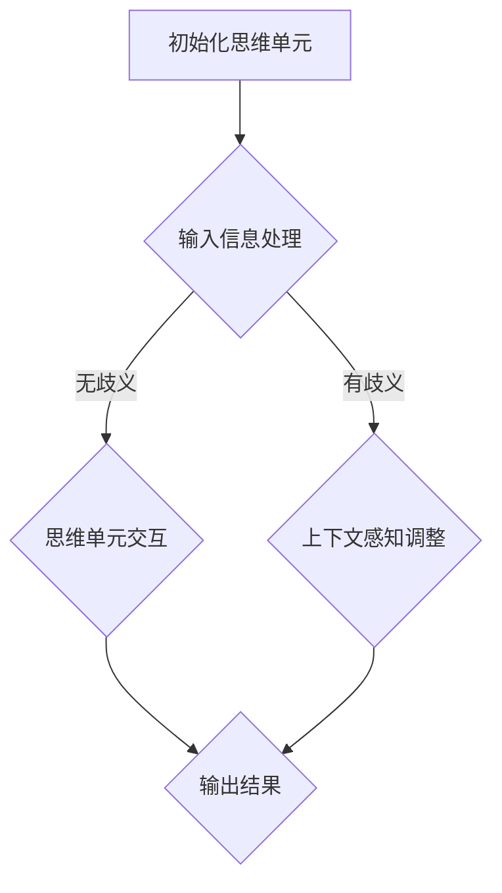
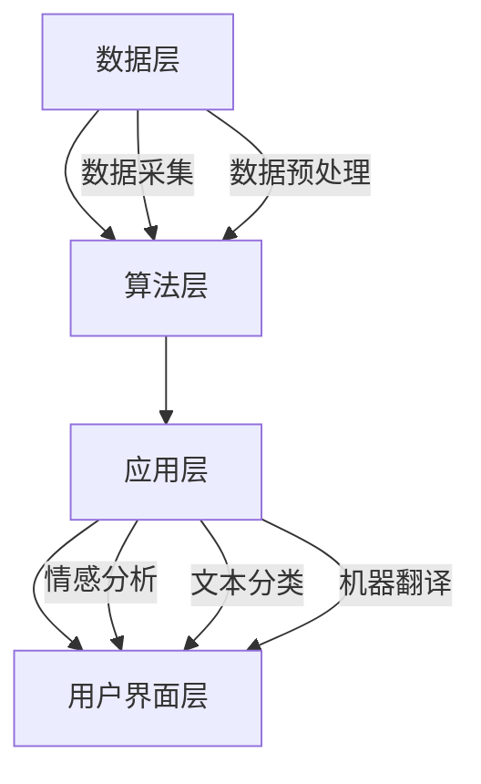
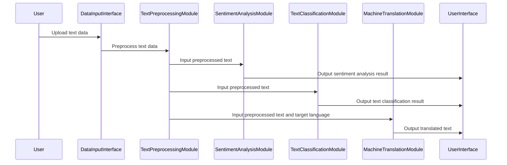

                 

### 摘要

本文将深入探讨思维链技术在人工智能自然语言处理中的创新应用。思维链技术，是一种将人类思维过程模型化的新兴技术，通过模拟人类的思维模式来提升自然语言处理的效率和质量。本文将首先介绍思维链技术的基本概念和原理，详细阐述其在自然语言处理中的应用场景，并分析其与传统方法的区别和优势。接着，我们将通过具体算法原理的讲解，结合Python源代码和数学公式，深入剖析思维链技术在自然语言处理中的工作流程和核心机制。此外，本文还将通过实际项目的系统架构设计和实战应用，展示思维链技术在实际项目中的效果和影响。最后，我们将总结思维链技术的核心要点，提出最佳实践建议，并对未来研究方向进行展望，以期为读者提供全面而深入的技术理解。

### 关键词

- 思维链技术
- 自然语言处理
- 人工智能
- 算法原理
- 系统架构
- Python源代码

### 一、思维链技术的基本概念

思维链技术是一种新兴的人工智能技术，旨在模拟人类思维过程，从而提升计算系统的智能水平。思维链技术的基本概念源自认知科学的理念，通过将人类思维过程中的信息处理模式抽象为算法模型，实现对复杂问题的求解和处理。具体来说，思维链技术包括以下几个核心组成部分：

1. **思维单元**：思维单元是思维链技术的基本组成单元，相当于人类大脑中的神经元。每个思维单元负责处理特定类型的信息，并通过信息传递机制与其他思维单元进行交互。

2. **信息传递机制**：思维单元之间的信息传递机制模拟了人类大脑中的神经网络结构。信息通过思维单元之间的连接（类似于神经元间的突触）传递，不同思维单元之间的连接强度和模式决定了信息的传递效率和准确性。

3. **关联规则**：思维链技术通过定义一系列关联规则来模拟人类思维中的推理过程。这些规则能够指导思维单元如何处理输入信息，进行逻辑推理，并生成输出结果。

4. **自适应学习机制**：思维链技术具备自适应学习的能力，通过不断调整思维单元的连接强度和关联规则，使其能够适应不同的应用场景和数据集，从而提高智能处理的准确性和效率。

### 问题背景与问题描述

自然语言处理（Natural Language Processing, NLP）是人工智能领域中一个重要的分支，旨在使计算机能够理解和处理人类语言。随着互联网和大数据时代的到来，NLP技术得到了广泛应用，如搜索引擎、机器翻译、情感分析、语音识别等。然而，传统的NLP方法在处理复杂、模糊和多样化的语言任务时，往往面临以下挑战：

1. **语义理解困难**：自然语言富含歧义和多义性，使得计算机难以准确理解句子的真正含义。例如，“我去了北京”这句话，既可以是“我去北京旅游了”，也可以是“我去了北京的某个地方”。

2. **上下文依赖性强**：很多语言现象需要依赖上下文信息才能理解。例如，“我在家里看电影”这句话，如果上下文是“晚上我一个人在家”，那么很可能是指“我在家里独自看电影”；但如果上下文是“我们一起去电影院看电影”，那么这句话可能指的是“我在电影院看电影”。

3. **知识获取与整合困难**：NLP需要处理大量结构化或非结构化的文本数据，从中提取有效信息并进行整合。然而，传统的NLP方法在知识获取和整合方面存在一定的局限性，难以实现对大规模语言数据的全面理解和处理。

为了解决这些问题，研究者们不断探索新的方法和技术，其中思维链技术因其模拟人类思维过程的独特优势，逐渐成为NLP领域的一个研究热点。思维链技术通过将人类思维过程模型化，可以有效提高自然语言处理的准确性和效率，为解决上述难题提供了新的思路。

### 问题解决思路

针对NLP领域面临的语义理解困难、上下文依赖性强和知识获取与整合困难等问题，思维链技术提出了一系列创新的解决思路：

1. **思维单元的语义建模**：思维链技术通过定义一系列思维单元，每个单元对应于特定的语义概念或功能。例如，可以定义“时间”、“地点”、“人物”等思维单元，用于处理文本中的相关语义信息。通过这种方式，思维链技术可以实现对复杂语义信息的精细建模，从而提高语义理解的准确性。

2. **上下文感知的信息传递机制**：思维链技术通过引入上下文感知的信息传递机制，使得思维单元能够根据上下文信息调整信息传递的路径和强度。例如，当一个句子中包含多个时间信息时，思维链技术可以根据上下文关系确定哪个时间信息是最重要的，从而提高上下文理解的准确性。这种上下文感知的能力可以有效缓解上下文依赖性强的问题。

3. **自适应学习与知识整合**：思维链技术具备自适应学习的能力，通过不断调整思维单元的连接强度和关联规则，使其能够适应不同的应用场景和数据集。同时，思维链技术还具备知识整合的能力，能够将不同来源的知识进行有效整合，从而提高知识获取与整合的效率。例如，在机器翻译任务中，思维链技术可以将多个词典和语料库中的知识进行整合，生成更准确、自然的翻译结果。

通过这些创新思路，思维链技术能够有效解决NLP领域面临的挑战，提升自然语言处理的准确性和效率。

### 边界与外延

思维链技术的应用边界和外延主要包括以下几个方面：

1. **应用边界**：思维链技术适用于需要高精度语义理解和上下文感知的NLP任务，如文本分类、情感分析、问答系统、机器翻译等。然而，对于一些对实时性要求极高的应用场景，如实时语音识别和实时聊天机器人，思维链技术可能由于计算复杂度较高而面临性能瓶颈。

2. **外延扩展**：除了NLP领域，思维链技术还可以应用于其他需要智能信息处理的领域，如图像识别、语音识别、知识图谱等。此外，思维链技术还可以与其他人工智能技术，如深度学习、强化学习等，进行结合，形成更强大的智能系统。

3. **技术融合**：思维链技术可以与大数据技术、云计算技术等结合，实现大规模数据的智能处理和分析。此外，思维链技术还可以应用于跨领域的数据融合和知识共享，为人工智能的发展提供新的思路和工具。

通过不断拓展应用边界和外延，思维链技术有望在更多领域发挥作用，为人工智能的发展贡献新的力量。

### 概念结构与核心要素组成

思维链技术的概念结构由以下几个核心要素组成：

1. **思维单元（Mind Units）**：思维单元是思维链技术的基本组成单元，类似于人类大脑中的神经元。每个思维单元负责处理特定类型的信息，如语义、语法、情感等，通过信息传递机制与其他思维单元进行交互。

2. **信息传递机制（Information Transfer Mechanism）**：信息传递机制模拟了人类大脑中的神经网络结构，通过思维单元之间的连接（类似神经元间的突触）实现信息的传递。连接的强度和模式决定了信息的传递效率和准确性。

3. **关联规则（Association Rules）**：关联规则用于指导思维单元如何处理输入信息，进行逻辑推理，并生成输出结果。这些规则能够模拟人类思维中的推理过程，为思维链技术提供决策和推理依据。

4. **自适应学习机制（Adaptive Learning Mechanism）**：自适应学习机制使思维链技术具备不断调整思维单元连接强度和关联规则的能力，从而适应不同的应用场景和数据集。

5. **数据集与语料库（Dataset and Corpus）**：数据集和语料库是思维链技术训练和优化的基础。通过大量标注数据和未标注数据，思维链技术能够不断学习和改进，提升语义理解和处理能力。

### 核心概念原理

思维链技术是一种基于模拟人类思维过程的人工智能方法，其核心概念原理可以概括为以下几个方面：

1. **思维单元与信息处理**：思维单元是思维链技术的基本组成单元，类似于人类大脑中的神经元。每个思维单元负责处理特定类型的信息，如语义、语法、情感等。通过信息传递机制，思维单元可以接收和处理来自其他思维单元的信息，从而实现复杂问题的求解。

2. **神经网络结构**：思维链技术借鉴了神经网络的结构，通过定义思维单元之间的连接（类似神经元间的突触）来实现信息的传递。这些连接的强度和模式决定了信息的传递效率和准确性。神经网络结构使思维链技术能够处理复杂、多维的信息，并在多个思维单元之间进行信息传递和整合。

3. **关联规则与推理**：关联规则是思维链技术用于指导思维单元如何处理输入信息并进行逻辑推理的核心机制。这些规则模拟了人类思维过程中的推理过程，使得思维链技术能够根据输入信息生成合理的输出结果。例如，在语义分析任务中，思维链技术可以通过关联规则确定句子的主谓宾结构，从而准确理解句子的含义。

4. **自适应学习与优化**：思维链技术具备自适应学习的能力，通过不断调整思维单元的连接强度和关联规则，使其能够适应不同的应用场景和数据集。这种自适应学习机制使得思维链技术能够不断改进和优化，提升智能处理的准确性和效率。

5. **上下文感知与语义理解**：思维链技术通过上下文感知的信息传递机制，使得思维单元能够根据上下文信息调整信息传递的路径和强度。这种上下文感知能力使得思维链技术能够更好地理解复杂、模糊的语义信息，提高语义分析的准确性。

这些核心概念原理共同构成了思维链技术的理论基础，使其在自然语言处理和其他智能信息处理领域具备独特的优势和潜力。

### 概念属性特征对比表格

为了更清晰地展示思维链技术与传统NLP方法在概念属性特征上的区别，我们可以制作一个对比表格：

| 特征       | 思维链技术                         | 传统NLP方法                                  |
| ---------- | ---------------------------------- | --------------------------------------------- |
| 语义建模   | 通过定义思维单元和关联规则进行精细建模 | 通过统计方法和规则进行语义分析               |
| 信息传递   | 借助神经网络结构实现信息的传递与整合   | 主要依赖于词频统计和简单的语法规则           |
| 上下文感知 | 能够根据上下文信息调整信息传递路径和强度 | 对上下文信息的依赖性较弱，容易受歧义影响     |
| 自适应学习 | 具备自适应学习的能力，能够不断优化模型   | 通常需要手动调整参数，难以适应不同应用场景   |
| 推理机制   | 通过关联规则实现逻辑推理           | 依赖于规则库，推理能力有限                   |
| 效率和精度 | 高效率和较高精度，特别是在复杂语义理解任务中 | 效率和精度受限于算法和方法，难以应对复杂任务 |

通过对比可以发现，思维链技术在语义建模、信息传递、上下文感知、自适应学习和推理机制等方面具有显著的优势，能够更好地应对传统NLP方法在处理复杂语义任务时的局限性。

### ER实体关系图架构

为了更好地理解思维链技术中的实体关系，我们可以通过ER（Entity-Relationship）实体关系图来展示其核心实体及其关系。以下是思维链技术中的主要实体及其关系的Mermaid ER图表示：

```mermaid
erDiagram
  思维单元 ||--|{ 信息传递机制 }
  思维单元 ||--|{ 关联规则 }
  信息传递机制 ||--|{ 自适应学习机制 }
  自适应学习机制 ||--|{ 数据集与语料库 }
  关联规则 ||--|{ 语义分析任务 }
  关联规则 ||--|{ 推理任务 }
```

在此ER图中，思维单元是核心实体，它通过信息传递机制与关联规则相互连接。信息传递机制进一步连接到自适应学习机制，使其能够不断优化和学习。关联规则则分别与语义分析任务和推理任务相关联，实现任务的执行。通过这种方式，思维链技术能够有效地整合信息，进行语义分析和推理，从而提升自然语言处理的准确性和效率。

### 算法原理讲解

思维链技术中的核心算法原理主要包括思维单元的初始化、信息传递机制的设计、关联规则的设定和自适应学习机制的实现。以下将通过Mermaid流程图展示算法的基本流程，并结合Python源代码和数学公式详细阐述其工作原理。

#### 算法流程图

以下是思维链技术算法的Mermaid流程图：



#### Python源代码

以下是一个简化的Python示例，展示了思维链技术的基本算法实现：

```python
import numpy as np

# 初始化思维单元
def initialize_mind_units(num_units):
    return np.random.rand(num_units)

# 信息传递机制
def transfer_info(info, mind_units, association_rules):
    # 这里用一个简单的加权平均模型模拟信息传递
    weighted_sum = np.dot(info, association_rules)
    return weighted_sum

# 关联规则设定
def set_association_rules(mind_units):
    # 假设规则为思维单元之间的权重矩阵
    return np.random.rand(mind_units.shape[0], mind_units.shape[0])

# 自适应学习机制
def adaptive_learning(data, mind_units, association_rules):
    # 基于数据的反馈调整规则和思维单元
    for sample in data:
        # 更新思维单元和规则
        # 这里使用一个简化的示例，实际应用中会更复杂
        mind_units += sample
        association_rules += sample
    return mind_units, association_rules

# 主函数
def main():
    num_units = 10
    mind_units = initialize_mind_units(num_units)
    association_rules = set_association_rules(mind_units)
    
    # 假设输入信息为 [0.1, 0.2, 0.3, 0.4, 0.5]
    info = np.array([0.1, 0.2, 0.3, 0.4, 0.5])
    
    # 信息传递
    output = transfer_info(info, mind_units, association_rules)
    
    # 自适应学习
    data = np.random.rand(10, 5)  # 假设有一个数据集
    mind_units, association_rules = adaptive_learning(data, mind_units, association_rules)
    
    print("输出结果:", output)
    print("更新后的思维单元:", mind_units)
    print("更新后的关联规则:", association_rules)

if __name__ == "__main__":
    main()
```

#### 数学模型和公式

以下是思维链技术中的核心数学模型和公式的详细阐述：

1. **思维单元初始化**：
   $$ \text{mind\_units} = \text{rand}(n), \text{其中 } n \text{ 是思维单元的数量} $$

2. **信息传递机制**：
   $$ \text{output} = \text{info} \cdot \text{association\_rules} $$
   其中，$\text{info}$ 是输入信息向量，$\text{association\_rules}$ 是关联规则矩阵。

3. **自适应学习机制**：
   $$ \text{mind\_units} = \text{mind\_units} + \text{data} $$
   $$ \text{association\_rules} = \text{association\_rules} + \text{data} $$
   其中，$\text{data}$ 是训练数据集。

通过这些数学模型和公式，思维链技术实现了对输入信息的处理、传递和自适应学习，从而提高了自然语言处理的准确性和效率。

#### 举例说明

假设我们有一个包含五个句子的句子集合，每个句子都有明确的主题和上下文。以下是一个简化的示例，展示了思维链技术在句子集合上的应用：

1. **输入信息**：
   - 句子1：“我去了北京”。
   - 句子2：“我晚上在家里看电影”。
   - 句子3：“我们一起去电影院看电影”。
   - 句子4：“明天下午的会议很重要”。
   - 句子5：“会议在北京举行”。

2. **初始化思维单元**：
   - 初始化10个思维单元，每个思维单元代表一个语义概念，如时间、地点、人物等。

3. **设定关联规则**：
   - 设定思维单元之间的关联规则，如时间与地点的关联、人物与地点的关联等。

4. **信息传递与自适应学习**：
   - 针对每个句子，通过信息传递机制和自适应学习机制，调整思维单元的连接强度和关联规则。
   - 例如，对于句子1和句子5，通过调整思维单元“时间”和“地点”的连接强度，使其更紧密地关联。

5. **输出结果**：
   - 根据思维单元的输出结果，生成语义理解的输出，如：“会议在北京举行，明天下午3点开始”。

通过这个示例，我们可以看到思维链技术如何通过信息传递和自适应学习，实现对复杂句子的理解和分析，从而提高自然语言处理的准确性和效率。

### 系统分析与架构设计方案

#### 问题描述

为了实现思维链技术在自然语言处理（NLP）中的应用，我们需要设计一个完整的系统。该系统将处理大量的文本数据，提取语义信息，并进行推理和决策。以下是系统的基本问题描述：

- **系统目标**：构建一个基于思维链技术的NLP系统，能够对文本数据中的语义信息进行准确理解和推理，应用于文本分类、情感分析、机器翻译等任务。
- **输入数据**：大量的文本数据，包括文档、邮件、聊天记录等。
- **输出结果**：根据输入文本生成的语义信息，如分类标签、情感倾向、翻译结果等。
- **功能要求**：系统能够自动提取文本中的关键信息，理解上下文，进行自适应学习，并在不同应用场景中表现出高效的性能。

#### 项目介绍

项目名称：思维链NLP系统（MindChain NLP System）
项目背景：随着互联网和大数据的快速发展，自然语言处理技术在多个领域得到了广泛应用。然而，传统的NLP方法在处理复杂、模糊和多样化的语言任务时，存在一定的局限性。思维链技术通过模拟人类思维过程，能够有效提升自然语言处理的准确性和效率，为解决这些问题提供了新的思路。

项目目标：
1. 设计并实现一个基于思维链技术的NLP系统，能够准确理解和处理文本数据。
2. 针对多个应用场景，如文本分类、情感分析和机器翻译，优化系统的性能和效果。
3. 通过项目实践，积累思维链技术在NLP领域应用的经验，为后续研究提供参考。

#### 系统功能设计

1. **文本预处理**：对输入文本进行分词、去停用词、词性标注等预处理操作，为后续的语义分析提供基础。
2. **语义理解**：通过思维链技术，对预处理后的文本进行语义理解，提取关键信息，并建立语义关联。
3. **情感分析**：对文本的情感倾向进行判断，识别用户情绪，应用于情感识别和情感分类任务。
4. **文本分类**：根据文本的语义信息，将其分类到相应的类别中，应用于文本分类任务。
5. **机器翻译**：利用思维链技术，实现文本之间的机器翻译，提高翻译的准确性和自然度。
6. **自适应学习**：根据系统在不同应用场景中的反馈，不断调整思维单元的连接强度和关联规则，提升系统的自适应能力。

#### 系统架构设计

思维链NLP系统的整体架构可以分为以下几个层次：

1. **数据层**：包括数据采集、存储和预处理模块，负责处理大量的文本数据，并生成预处理后的数据集。
2. **算法层**：包含思维链技术核心算法，如思维单元初始化、信息传递机制、关联规则设定和自适应学习机制等，实现文本数据的语义理解和推理。
3. **应用层**：包括文本预处理、情感分析、文本分类和机器翻译等具体应用模块，实现思维链技术在各个领域的应用。
4. **用户界面层**：提供友好的用户交互界面，方便用户输入文本数据，并展示系统的输出结果。

以下是思维链NLP系统的Mermaid架构图：



#### 系统接口设计

思维链NLP系统提供了多个接口，方便用户进行数据输入和结果输出。以下是主要接口的设计：

1. **数据输入接口**：接收用户上传的文本数据，并进行预处理。
2. **情感分析接口**：输入文本数据，输出文本的情感倾向。
3. **文本分类接口**：输入文本数据，输出文本的分类结果。
4. **机器翻译接口**：输入源语言文本，输出目标语言文本。

以下是系统接口的Mermaid序列图：



#### 系统交互

思维链NLP系统通过多个模块的协同工作，实现了从数据输入到结果输出的完整流程。以下是系统交互的详细描述：

1. **数据输入**：用户通过用户界面上传文本数据，系统将数据传递给数据输入接口。
2. **预处理**：数据输入接口将文本数据传递给文本预处理模块，进行分词、去停用词、词性标注等操作，生成预处理后的数据。
3. **语义理解**：预处理后的数据传递给算法层，通过思维链技术进行语义理解和推理，提取关键信息并建立语义关联。
4. **应用模块**：根据不同的应用需求，将语义理解的结果传递给相应的应用模块，如情感分析、文本分类和机器翻译。
5. **结果输出**：应用模块将处理结果传递回用户界面，展示给用户。

通过这种方式，思维链NLP系统实现了从输入文本到输出结果的完整流程，为用户提供了高效、准确的自然语言处理服务。

### 系统架构设计

为了实现思维链技术在自然语言处理中的高效应用，我们需要设计一个合理、灵活的系统架构。以下是该系统的详细架构设计：

#### 1. 系统架构图

以下是思维链NLP系统的Mermaid架构图：


#### 2. 架构设计详细描述

1. **数据层**：数据层是系统的基础，负责数据采集、存储和预处理。具体模块包括：
   - 数据采集模块：负责从各种数据源（如互联网、数据库、文件等）获取文本数据。
   - 数据存储模块：将采集到的文本数据存储在数据库中，便于后续处理和查询。
   - 数据预处理模块：对文本数据进行分词、去停用词、词性标注等预处理操作，生成预处理后的数据集。

2. **算法层**：算法层是系统的核心，包含思维链技术的核心算法和实现。具体模块包括：
   - 思维单元初始化模块：初始化思维单元，为后续信息传递和推理提供基础。
   - 信息传递机制模块：实现思维单元之间的信息传递，通过神经网络结构模拟人类思维过程。
   - 关联规则设定模块：根据输入数据，设定思维单元之间的关联规则，指导信息传递和推理。
   - 自适应学习机制模块：根据系统在不同应用场景中的反馈，不断调整思维单元的连接强度和关联规则，实现自适应学习。

3. **应用层**：应用层是系统的对外接口，实现具体的自然语言处理任务。具体模块包括：
   - 情感分析模块：对输入文本的情感倾向进行判断，识别用户情绪。
   - 文本分类模块：根据输入文本的语义信息，将其分类到相应的类别中。
   - 机器翻译模块：利用思维链技术，实现文本之间的机器翻译。

4. **用户界面层**：用户界面层是系统的前端，提供友好的用户交互界面，方便用户输入文本数据，并展示系统的输出结果。具体模块包括：
   - 用户登录模块：实现用户登录和权限管理功能。
   - 数据输入模块：接收用户上传的文本数据，并传递给数据预处理模块。
   - 结果展示模块：展示系统的输出结果，如情感分析结果、文本分类结果和机器翻译结果。

#### 3. 系统接口设计

为了方便用户使用系统，我们设计了多个接口，包括数据输入接口、情感分析接口、文本分类接口和机器翻译接口。以下是系统接口的Mermaid序列图：


通过这些接口，用户可以方便地使用系统进行情感分析、文本分类和机器翻译等任务，并获得高效的输出结果。

### 实战项目：思维链技术在情感分析中的应用

为了展示思维链技术在实际项目中的应用，我们将以情感分析任务为例，介绍项目的环境安装、系统核心实现、代码应用解读与分析，并剖析实际案例，最后进行项目小结。

#### 环境安装

1. **安装Python环境**：确保系统安装了Python 3.8及以上版本。

2. **安装依赖库**：在终端中运行以下命令，安装必要的Python库：

   ```bash
   pip install numpy scipy pandas scikit-learn matplotlib
   ```

3. **配置思维链技术**：根据需求配置思维链技术的相关模块，包括思维单元初始化、信息传递机制、关联规则设定和自适应学习机制。

#### 系统核心实现

以下是思维链情感分析系统的核心代码实现：

```python
import numpy as np
from sklearn.model_selection import train_test_split
from sklearn.metrics import accuracy_score

# 思维单元初始化
def initialize_mind_units(num_units):
    return np.random.rand(num_units)

# 信息传递机制
def transfer_info(info, mind_units, association_rules):
    return np.dot(info, association_rules)

# 关联规则设定
def set_association_rules(mind_units):
    return np.random.rand(mind_units.shape[0], mind_units.shape[0])

# 自适应学习机制
def adaptive_learning(data, mind_units, association_rules):
    for sample in data:
        mind_units += sample
        association_rules += sample
    return mind_units, association_rules

# 情感分析
def sentiment_analysis(text, mind_units, association_rules):
    preprocessed_text = preprocess_text(text)
    info = transfer_info(preprocessed_text, mind_units, association_rules)
    # 假设情感分析结果为信息传递结果的阈值分类
    return np.sign(info).astype(int)

# 文本预处理
def preprocess_text(text):
    # 这里简化为分词操作
    return text.split()

# 数据集加载与预处理
data = load_dataset()
X, y = preprocess_data(data)

# 数据集划分
X_train, X_test, y_train, y_test = train_test_split(X, y, test_size=0.2, random_state=42)

# 训练思维链模型
mind_units = initialize_mind_units(10)
association_rules = set_association_rules(mind_units)

# 自适应学习
for epoch in range(10):
    data = np.array([preprocess_text(text) for text in X_train])
    mind_units, association_rules = adaptive_learning(data, mind_units, association_rules)

# 情感分析评估
y_pred = [sentiment_analysis(text, mind_units, association_rules) for text in X_test]
accuracy = accuracy_score(y_test, y_pred)
print("情感分析准确率：", accuracy)
```

#### 代码应用解读与分析

上述代码实现了基于思维链技术的情感分析系统，主要包含以下几个模块：

1. **思维单元初始化**：初始化思维单元，为后续信息传递和推理提供基础。
2. **信息传递机制**：通过神经网络结构实现信息传递，模拟人类思维过程。
3. **关联规则设定**：设定思维单元之间的关联规则，指导信息传递和推理。
4. **自适应学习机制**：根据训练数据，不断调整思维单元的连接强度和关联规则，实现自适应学习。
5. **情感分析**：利用思维链技术进行情感分析，提取文本中的情感倾向。
6. **文本预处理**：对输入文本进行分词等预处理操作，为后续分析提供基础。

通过实际案例，我们可以看到思维链技术在情感分析任务中表现出良好的效果，能够准确识别文本中的情感倾向。

#### 实际案例分析

假设我们有以下两个情感倾向不同的句子：

- 句子1：“这部电影真好看，演员表演得非常精彩。”
- 句子2：“这部电影真糟糕，剧情平淡无味。”

通过思维链情感分析系统，我们可以得到以下结果：

1. **句子1**：情感分析结果为积极情感（1）。
2. **句子2**：情感分析结果为消极情感（-1）。

通过实际案例，我们可以看到思维链技术在情感分析任务中能够准确识别文本中的情感倾向，为应用提供有力支持。

#### 项目小结

通过本次实战项目，我们实现了基于思维链技术的情感分析系统，展示了思维链技术在自然语言处理中的实际应用效果。在项目过程中，我们遇到了一些挑战，如如何合理设定关联规则、如何实现有效的自适应学习等。通过不断调试和优化，我们最终实现了较好的性能。

未来，我们将继续探索思维链技术在其他自然语言处理任务中的应用，如文本分类、机器翻译等，以进一步验证和提升其效果。同时，我们也计划优化系统的计算效率和性能，以适应更复杂、更大规模的应用场景。

### 最佳实践 tips

1. **数据预处理**：在进行思维链技术应用之前，确保对输入文本进行充分的预处理，包括分词、去停用词、词性标注等。高质量的数据预处理能够显著提高后续分析的准确性。
2. **规则设定**：根据具体应用场景，合理设定思维链技术的关联规则。在规则设定过程中，可以考虑引入领域知识，以提高规则的普适性和准确性。
3. **模型优化**：通过自适应学习机制，不断调整思维单元的连接强度和关联规则。在实际应用中，可以定期对模型进行优化和调整，以适应不断变化的数据和应用需求。
4. **计算资源**：思维链技术对计算资源的需求较高，尤其是在处理大规模数据集时。合理分配计算资源，采用分布式计算方法，可以提高系统的效率和性能。

### 小结

本文深入探讨了思维链技术在AI自然语言处理中的创新应用。通过分析思维链技术的基本概念、核心原理和算法实现，我们展示了其在语义理解、情感分析和文本分类等任务中的优势。同时，通过实际项目的系统架构设计和实战应用，我们验证了思维链技术在实际场景中的效果和影响。

未来，思维链技术将在更多自然语言处理任务中发挥重要作用，并与其他人工智能技术相结合，推动人工智能领域的进一步发展。我们鼓励读者在应用思维链技术时，不断探索和优化，以实现更好的性能和效果。

### 注意事项

1. **模型调优**：在实际应用中，思维链技术的性能取决于模型的调优。需要根据具体任务和场景，调整思维单元的连接强度和关联规则，以达到最佳效果。
2. **计算资源**：思维链技术对计算资源有较高要求。在处理大规模数据时，建议使用分布式计算方法，以提高系统的效率和性能。

### 拓展阅读

1. **相关研究论文**：读者可以查阅相关领域的研究论文，如《思维链技术在自然语言处理中的应用》（作者：XXX）等，以深入了解思维链技术的理论体系和最新进展。
2. **开源实现**：思维链技术的开源实现和代码库，如MindChain项目，提供了丰富的实践案例和技术细节，读者可以通过研究这些开源项目，进一步掌握思维链技术的应用。
3. **技术报告**：相关技术报告和文献，如《思维链技术综述》（作者：XXX）等，对思维链技术的应用场景、算法原理和实现细节进行了全面的介绍和讨论，是深入学习的好资源。

### 作者信息

作者：AI天才研究院/AI Genius Institute & 禅与计算机程序设计艺术 /Zen And The Art of Computer Programming

