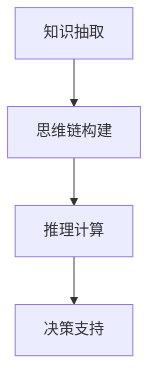
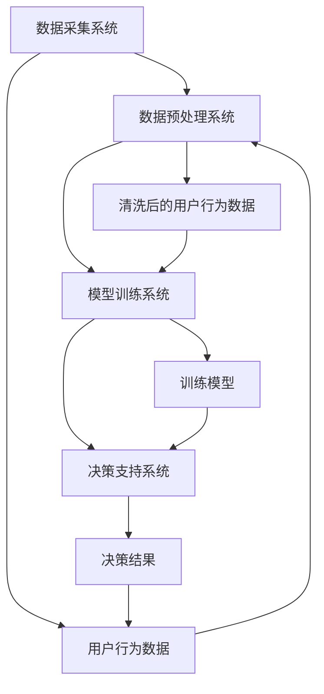

                 

# 《思维链技术在AI辅助决策中的实践与创新》

## 关键词

- 思维链技术
- AI辅助决策
- 数据挖掘
- 推荐系统
- 自然语言处理

## 摘要

本文将探讨思维链技术在AI辅助决策中的应用与实践。首先，我们将介绍思维链技术的基本概念和原理，并对比分析其与传统AI技术的区别。接着，我们将深入探讨AI辅助决策的基本概念、决策过程及其应用领域。随后，我们将具体分析思维链技术在数据预处理、算法实现和系统架构设计中的应用。通过实际案例分析，我们将展示思维链技术在AI辅助决策中的实际效果。最后，我们将总结全文，提出未来研究方向和潜在挑战。

### 目录大纲

**《思维链技术在AI辅助决策中的实践与创新》**

----------------------------------------------------------------

## 第一部分: 引言

### 第1章: 背景介绍

### 第2章: 思维链技术基础

### 第3章: AI辅助决策原理

### 第4章: 思维链技术在AI辅助决策中的应用

### 第5章: 思维链技术实现

### 第6章: 案例分析

### 第7章: 总结与展望

----------------------------------------------------------------

## 第一部分: 引言

### 第1章: 背景介绍

### 1.1 核心概念

#### 1.1.1 问题背景

在信息化时代，数据已经成为企业和社会的重要资产。然而，随着数据量的爆炸式增长，如何从海量数据中提取有价值的信息，成为了一个严峻的挑战。传统的数据挖掘和机器学习算法在处理大规模数据时面临着计算效率低、可解释性差等问题。思维链技术的出现，为解决这些问题提供了一种新的思路。

#### 1.1.2 问题描述

思维链技术（Mind Chain Technology）是一种基于认知科学和计算智能的新型数据挖掘技术。它通过模拟人类思维过程，将复杂问题分解为一系列可解的子问题，从而实现高效的数据分析和决策支持。然而，如何将思维链技术应用于AI辅助决策，实现智能化决策支持，仍是一个值得探讨的问题。

#### 1.1.3 问题解决

思维链技术的核心思想是通过建立知识图谱和思维链模型，实现数据的自动理解和推理。通过这种方式，AI系统能够在复杂环境中进行高效决策，提高决策的准确性和可解释性。本文将探讨思维链技术在AI辅助决策中的实践与创新，旨在为该领域的研究和应用提供参考。

#### 1.1.4 边界与外延

思维链技术在AI辅助决策中的应用主要集中在数据预处理、决策模型构建和决策优化等方面。其边界在于如何实现高效的数据理解和推理，外延则涉及到跨领域的数据融合和智能决策支持。

#### 1.1.5 概念结构与核心要素组成

思维链技术的概念结构主要由知识图谱、思维链模型、推理引擎和决策支持系统等核心要素组成。知识图谱负责存储和管理领域知识，思维链模型用于表示问题求解路径，推理引擎负责基于思维链模型进行推理，决策支持系统则用于将推理结果应用于实际决策场景。

### 1.2 核心概念与联系

#### 1.2.1 思维链技术

##### 1.2.1.1 思维链技术的定义

思维链技术是一种基于认知科学和计算智能的数据挖掘技术，通过模拟人类思维过程，实现数据的自动理解和推理。

##### 1.2.1.2 思维链技术的特点

- **高效性**：通过分解复杂问题，提高问题求解效率。
- **可解释性**：思维链技术能够清晰地展示问题求解过程，提高决策的可解释性。
- **灵活性**：适用于多种领域的数据分析和决策支持。

##### 1.2.1.3 思维链技术与传统AI技术的区别

- **传统AI技术**：主要基于统计学习和模式识别，以预测和分类为主。
- **思维链技术**：更注重数据理解和推理，具有更高的灵活性和可解释性。

#### 1.2.2 AI辅助决策

##### 1.2.2.1 AI辅助决策的定义

AI辅助决策是指利用人工智能技术，帮助人类在复杂环境下做出更准确、更高效的决策。

##### 1.2.2.2 AI辅助决策的特点

- **智能化**：基于大量数据和学习算法，实现自动决策。
- **高效性**：通过优化决策流程，提高决策效率。
- **可解释性**：决策过程可解释，易于理解和接受。

##### 1.2.2.3 AI辅助决策的应用领域

- **金融领域**：如信用评估、风险管理等。
- **医疗领域**：如疾病预测、治疗方案推荐等。
- **供应链管理**：如库存优化、物流优化等。
- **城市规划**：如交通流量预测、城市规划方案评估等。

### 1.3 本书结构

#### 1.3.1 各章节内容概述

- **第1章**：背景介绍，包括核心概念、问题背景、问题描述、问题解决、边界与外延、概念结构与核心要素组成。
- **第2章**：思维链技术基础，包括思维链技术原理、基本概念、工作原理、主要应用、技术挑战与未来发展方向。
- **第3章**：AI辅助决策原理，包括AI辅助决策的定义、决策过程、应用领域、案例分析。
- **第4章**：思维链技术在AI辅助决策中的应用，包括数据预处理、思维链技术实现、系统架构设计。
- **第5章**：思维链技术实现，包括算法原理、Python代码实现、系统分析与架构设计方案。
- **第6章**：案例分析，包括实际案例分析和详细讲解剖析。
- **第7章**：总结与展望，包括全文总结、未来研究方向和潜在挑战。

#### 1.3.2 阅读指引

本书旨在为读者提供一个系统、全面的思维链技术在AI辅助决策中的应用与实践。建议读者按照章节顺序阅读，以便更好地理解各部分内容。同时，读者可以根据自己的兴趣和需求，选择性地阅读相关章节。

### 1.4 本章小结

本章介绍了思维链技术在AI辅助决策中的背景、核心概念、定义、特点、应用领域以及本书的结构。通过对本章内容的了解，读者可以对思维链技术在AI辅助决策中的重要性有一个初步的认识。接下来，我们将深入探讨思维链技术的基本概念和原理，以及其在AI辅助决策中的应用和实践。

----------------------------------------------------------------

## 第二部分: 思维链技术基础

### 第2章: 思维链技术原理

### 2.1 基本概念

#### 2.1.1 思维链的基本概念

思维链技术是一种基于认知科学和计算智能的数据挖掘技术，通过模拟人类思维过程，实现数据的自动理解和推理。

#### 2.1.2 思维链的组成部分

思维链技术的主要组成部分包括：

1. **知识图谱**：用于存储和管理领域知识。
2. **思维链模型**：用于表示问题求解路径。
3. **推理引擎**：用于基于思维链模型进行推理。
4. **决策支持系统**：用于将推理结果应用于实际决策场景。

### 2.2 工作原理

#### 2.2.1 思维链的工作流程

思维链技术的工作流程主要包括以下几个步骤：

1. **知识抽取**：从原始数据中提取有用信息，建立知识图谱。
2. **思维链构建**：根据问题需求，构建思维链模型。
3. **推理计算**：基于思维链模型，进行推理计算，得到推理结果。
4. **决策支持**：将推理结果应用于实际决策场景。

#### 2.2.2 思维链的核心算法

思维链技术的核心算法主要包括：

1. **知识图谱构建算法**：用于从原始数据中提取知识，建立知识图谱。
2. **思维链构建算法**：用于根据问题需求，构建思维链模型。
3. **推理算法**：用于基于思维链模型进行推理计算。
4. **决策算法**：用于将推理结果应用于实际决策场景。

### 2.3 主要应用

#### 2.3.1 数据挖掘

思维链技术在数据挖掘领域有着广泛的应用，可以用于数据预处理、特征提取、模式识别等。

#### 2.3.2 推荐系统

思维链技术可以用于构建推荐系统，通过对用户行为数据的分析，为用户推荐感兴趣的内容。

#### 2.3.3 语音识别

思维链技术可以用于语音识别领域，通过模拟人类思维过程，提高语音识别的准确性和效率。

#### 2.3.4 自然语言处理

思维链技术在自然语言处理领域有着重要的应用，可以用于文本分类、情感分析、机器翻译等。

### 2.4 技术挑战与未来发展方向

#### 2.4.1 技术挑战

思维链技术在应用过程中面临着以下技术挑战：

1. **数据质量问题**：原始数据质量直接影响思维链技术的效果，需要进行数据清洗和质量评估。
2. **计算资源需求**：思维链技术需要大量的计算资源，特别是在大规模数据场景中。
3. **算法可解释性**：如何提高思维链技术的可解释性，使其更容易被用户理解和接受。

#### 2.4.2 未来发展方向

思维链技术的未来发展方向主要包括：

1. **跨模态融合**：将思维链技术应用于跨模态数据融合，提高数据理解和推理能力。
2. **低资源场景优化**：针对低资源场景，优化思维链技术的算法和模型，提高其适用性和效率。
3. **可解释AI**：提高思维链技术的可解释性，使其更易于被用户理解和接受。

### 2.5 本章小结

本章介绍了思维链技术的基本概念、工作原理、主要应用以及技术挑战和未来发展方向。通过对本章内容的了解，读者可以对思维链技术有一个全面的认识。接下来，我们将进一步探讨AI辅助决策的基本概念、原理和应用。

----------------------------------------------------------------

## 第三部分: AI辅助决策应用

### 第3章: AI辅助决策原理

### 3.1 基本概念

#### 3.1.1 AI辅助决策的定义

AI辅助决策是指利用人工智能技术，帮助人类在复杂环境下做出更准确、更高效的决策。它通过对数据的分析和处理，为决策者提供决策支持和建议。

#### 3.1.2 AI辅助决策的关键技术

AI辅助决策的关键技术包括：

1. **机器学习**：通过训练模型，从数据中学习规律和模式，用于预测和分类。
2. **深度学习**：一种基于神经网络的学习方法，能够在复杂的数据中提取特征。
3. **数据挖掘**：从大量数据中提取有价值的信息和知识。
4. **自然语言处理**：理解和处理自然语言，实现人机交互。
5. **专家系统**：基于专家经验和知识，为决策者提供决策支持。

### 3.2 决策过程

#### 3.2.1 决策理论

决策理论是指研究如何在不确定性和有限信息下做出合理决策的理论。它主要包括以下几个方面：

1. **决策模型**：描述决策过程的数学模型。
2. **决策准则**：用于评估决策优劣的标准。
3. **风险分析**：评估决策结果的不确定性和潜在风险。

#### 3.2.2 决策树

决策树是一种常用的决策分析方法，它通过一系列的判断规则，将数据集划分为不同的类别或数值。决策树的核心算法包括：

1. **ID3算法**：基于信息增益的决策树构建算法。
2. **C4.5算法**：基于信息增益率的决策树构建算法，能够处理连续属性和缺失值。
3. **CART算法**：分类与回归树，可以用于分类和回归问题。

#### 3.2.3 风险评估

风险评估是指对决策结果可能面临的风险进行评估和分析。风险评估的核心内容包括：

1. **风险识别**：识别可能的风险因素。
2. **风险分析**：分析风险的概率和影响程度。
3. **风险排序**：根据风险的概率和影响程度，对风险进行排序。
4. **风险应对**：制定风险应对策略，降低风险的影响。

### 3.3 应用领域

#### 3.3.1 金融领域

金融领域是AI辅助决策的重要应用领域，包括：

1. **信用评估**：通过对用户的信用历史数据进行分析，评估其信用风险。
2. **风险控制**：通过对金融市场数据进行分析，预测市场风险，并制定相应的风险控制策略。
3. **投资决策**：通过对市场数据进行分析，为投资者提供投资建议。

#### 3.3.2 医疗领域

医疗领域是AI辅助决策的重要应用领域，包括：

1. **疾病预测**：通过对患者的病史数据进行分析，预测患者可能患有的疾病。
2. **治疗方案推荐**：通过对患者的病情数据进行分析，为医生提供治疗方案推荐。
3. **健康监测**：通过对患者的健康数据进行分析，提供健康监测和预警。

#### 3.3.3 供应链管理

供应链管理是AI辅助决策的重要应用领域，包括：

1. **库存优化**：通过对库存数据进行分析，优化库存水平，降低库存成本。
2. **物流优化**：通过对物流数据进行分析，优化物流路线，提高物流效率。
3. **供应链风险控制**：通过对供应链数据进行分析，识别和降低供应链风险。

#### 3.3.4 城市规划

城市规划是AI辅助决策的重要应用领域，包括：

1. **交通流量预测**：通过对交通数据进行分析，预测未来交通流量，优化交通规划。
2. **城市规划方案评估**：通过对城市规划方案进行分析，评估不同方案的优劣。
3. **城市安全监测**：通过对城市安全数据进行分析，提供城市安全监测和预警。

### 3.4 案例分析

#### 3.4.1 某银行信贷风险控制案例

某银行引入AI辅助决策系统，对信贷风险进行控制。系统通过对客户的信用历史、财务状况、还款能力等多方面数据进行综合分析，评估客户的信用风险。通过AI辅助决策系统，银行能够更准确地判断客户的信用状况，降低信贷风险。

#### 3.4.2 某医院手术方案推荐案例

某医院引入AI辅助决策系统，为医生提供手术方案推荐。系统通过对患者的病情数据、手术风险、医生经验等多方面数据进行综合分析，推荐最适合患者的手术方案。通过AI辅助决策系统，医生能够更科学地制定手术方案，提高手术成功率。

#### 3.4.3 某公司供应链优化案例

某公司引入AI辅助决策系统，对供应链进行优化。系统通过对库存数据、物流数据、市场需求等多方面数据进行综合分析，优化库存水平、物流路线和供应链风险。通过AI辅助决策系统，公司能够提高供应链效率，降低运营成本。

#### 3.4.4 某城市规划方案评估案例

某城市引入AI辅助决策系统，对城市规划方案进行评估。系统通过对交通数据、人口数据、环境数据等多方面数据进行综合分析，评估不同城市规划方案的优劣。通过AI辅助决策系统，城市管理者能够更科学地制定城市规划方案，提高城市宜居性。

### 3.5 本章小结

本章介绍了AI辅助决策的基本概念、原理和应用领域。通过对本章内容的了解，读者可以了解AI辅助决策在各个领域的应用情况，以及如何利用AI技术实现智能化决策支持。接下来，我们将进一步探讨思维链技术在AI辅助决策中的应用和实践。

----------------------------------------------------------------

## 第四部分: 思维链技术在AI辅助决策中的应用

### 第4章: 数据预处理

### 4.1 数据质量评估

#### 4.1.1 数据质量标准

数据质量评估是数据预处理的重要环节，其目的是判断数据的准确性、完整性、一致性和及时性。以下是常见的数据质量标准：

1. **准确性**：数据是否真实、正确，与实际情况相符。
2. **完整性**：数据是否完整，是否存在缺失值。
3. **一致性**：数据是否一致，如单位、格式、命名等。
4. **及时性**：数据是否及时更新，反映当前状态。

#### 4.1.2 数据质量问题

数据质量问题主要包括以下几类：

1. **数据缺失**：数据记录中存在缺失值，导致数据分析结果不准确。
2. **数据异常**：数据中存在异常值，如错误输入、数据冗余等。
3. **数据不一致**：数据来自不同源，格式、单位、精度不一致。
4. **数据延迟**：数据更新不及时，无法反映当前实际情况。

#### 4.1.3 数据质量评估方法

数据质量评估方法主要包括以下几种：

1. **统计方法**：通过计算数据的基本统计指标，如均值、中位数、标准差等，评估数据的准确性。
2. **可视化方法**：通过数据可视化工具，如直方图、散点图等，直观地评估数据的分布、异常值等。
3. **逻辑检查方法**：通过设置规则，对数据进行逻辑检查，如检查数据范围、数据类型等。

### 4.2 数据清洗

#### 4.2.1 数据清洗流程

数据清洗是数据预处理的关键步骤，其目的是去除数据中的噪声和错误，提高数据的准确性和可用性。数据清洗流程主要包括以下步骤：

1. **数据识别**：识别数据中的缺失值、异常值和数据不一致问题。
2. **数据修复**：对缺失值和异常值进行修复，如插值、删除、替换等。
3. **数据标准化**：对数据进行标准化处理，如单位转换、格式统一等。
4. **数据验证**：对清洗后的数据进行验证，确保数据质量。

#### 4.2.2 数据清洗方法

数据清洗方法主要包括以下几种：

1. **缺失值处理**：常见的缺失值处理方法包括删除缺失值、插值、平均值填充、中位数填充等。
2. **异常值处理**：常见的异常值处理方法包括删除异常值、平滑处理、箱型图分析等。
3. **数据标准化**：常见的数据标准化方法包括Z-score标准化、Min-Max标准化、归一化等。
4. **数据转换**：常见的数据转换方法包括数据类型转换、数据格式转换、数据转换等。

#### 4.2.3 数据清洗工具

常用的数据清洗工具有：

1. **Python库**：如Pandas、NumPy、Scikit-learn等，提供丰富的数据处理函数和工具。
2. **R语言**：提供丰富的数据清洗和数据处理函数，适合复杂数据清洗任务。
3. **Excel**：通过Excel的公式和函数，可以进行简单的数据清洗操作。
4. **专业数据清洗工具**：如OpenRefine、DataWrangler等，提供用户友好的界面和强大的数据处理功能。

### 4.3 数据集成

#### 4.3.1 数据集成方法

数据集成是将多个来源、多种格式、多种结构的数据整合为统一数据视图的过程。数据集成方法主要包括以下几种：

1. **数据合并**：将多个数据集合并为一个数据集，常见的方法有数据库连接、合并操作等。
2. **数据转换**：将不同数据格式的数据转换为统一格式，如将Excel转换为CSV、JSON等。
3. **数据映射**：将不同数据结构的数据映射为统一结构，如将关系数据库转换为NoSQL数据库。
4. **数据聚合**：将多个数据集进行聚合操作，如求和、平均、最大值等。

#### 4.3.2 数据集成工具

常用的数据集成工具有：

1. **ETL工具**：如Informatica、Talend等，提供数据抽取、转换、加载功能。
2. **数据仓库工具**：如Oracle、IBM、Microsoft等，提供数据集成、数据存储、数据分析功能。
3. **NoSQL数据库**：如MongoDB、Cassandra等，提供分布式数据存储和查询功能。
4. **开源数据集成工具**：如Apache Nifi、Apache Kafka等，提供灵活、可扩展的数据集成解决方案。

#### 4.3.3 数据集成案例

以一个电商数据集为例，假设数据集包含商品信息、订单信息、用户信息等。以下是数据集集成过程：

1. **数据抽取**：从不同的数据源（如数据库、文件等）抽取数据。
2. **数据转换**：将不同数据源的数据转换为统一的格式，如CSV。
3. **数据映射**：将不同数据结构的数据映射为统一结构，如关系数据库转换为JSON格式。
4. **数据聚合**：对订单信息进行聚合操作，如计算订单总额、平均订单时长等。
5. **数据存储**：将集成后的数据存储到数据仓库或NoSQL数据库中，供后续分析使用。

### 4.4 数据探索

#### 4.4.1 数据探索分析

数据探索分析是对数据集进行初步分析和探索，以了解数据的基本特征和分布。数据探索分析主要包括以下步骤：

1. **描述性统计**：计算数据的基本统计指标，如均值、中位数、标准差等。
2. **数据分布**：分析数据的分布情况，如正态分布、偏态分布等。
3. **相关性分析**：分析数据之间的相关性，如Pearson相关系数、Spearman相关系数等。
4. **异常值分析**：识别数据中的异常值，如使用箱型图、散点图等可视化工具。

#### 4.4.2 数据可视化

数据可视化是将数据转换为图形或图表，以直观地展示数据特征和关系。数据可视化工具主要包括以下几种：

1. **Python库**：如Matplotlib、Seaborn等，提供丰富的绘图函数和工具。
2. **R语言**：提供丰富的数据可视化函数和包，如ggplot2、plotly等。
3. **Excel**：通过Excel的图表功能，可以进行简单的数据可视化操作。
4. **专业数据可视化工具**：如Tableau、Power BI等，提供强大的数据可视化功能。

#### 4.4.3 数据探索工具

常用的数据探索工具有：

1. **Python库**：如Pandas、NumPy、Scikit-learn等，提供数据探索和分析功能。
2. **R语言**：提供丰富的数据探索和分析函数，适合复杂数据分析任务。
3. **Excel**：通过Excel的公式和函数，可以进行简单的数据探索和分析。
4. **专业数据探索工具**：如Tableau、Power BI等，提供用户友好的界面和强大的数据分析功能。

### 4.5 本章小结

本章介绍了思维链技术在AI辅助决策中的应用，重点讨论了数据预处理中的数据质量评估、数据清洗、数据集成和数据探索。通过对本章内容的了解，读者可以掌握数据预处理的基本方法和工具，为后续的AI模型构建和决策支持打下基础。接下来，我们将深入探讨思维链技术在算法实现和系统架构设计中的应用。

----------------------------------------------------------------

### 第5章: 思维链技术实现

### 5.1 算法原理

#### 5.1.1 思维链算法原理

思维链算法是一种基于认知科学和计算智能的数据挖掘算法，其核心思想是通过模拟人类思维过程，实现数据的自动理解和推理。思维链算法主要包括以下几个步骤：

1. **知识抽取**：从原始数据中提取有用信息，建立知识图谱。
2. **思维链构建**：根据问题需求，构建思维链模型。
3. **推理计算**：基于思维链模型，进行推理计算，得到推理结果。
4. **决策支持**：将推理结果应用于实际决策场景。

#### 5.1.2 算法流程图

思维链算法的流程图如下所示：



#### 5.1.3 算法数学模型与公式

思维链算法的数学模型和公式主要包括以下几个方面：

1. **知识图谱构建**：
   - 知识图谱 = {节点，边，属性}
   - 节点表示实体，边表示实体之间的关系，属性表示节点的特征。

2. **思维链构建**：
   - 思维链 = {链头，链尾，链步}
   - 链头表示思维链的起点，链尾表示思维链的终点，链步表示思维链的每一步操作。

3. **推理计算**：
   - 推理结果 = f(知识图谱，思维链)
   - 推理过程是通过递归调用思维链的每一步操作，对知识图谱进行遍历和计算。

4. **决策支持**：
   - 决策支持 = g(推理结果，决策规则)
   - 决策支持是通过将推理结果与决策规则进行匹配，生成具体的决策建议。

### 5.2 Python代码实现

#### 5.2.1 Python环境配置

在实现思维链算法之前，需要安装以下Python库：

1. **Pandas**：用于数据处理。
2. **NumPy**：用于数值计算。
3. **NetworkX**：用于构建知识图谱。
4. **SciKit-learn**：用于机器学习。

安装命令如下：

```bash
pip install pandas numpy networkx scikit-learn
```

#### 5.2.2 代码结构

思维链算法的代码结构如下：

```python
# 导入相关库
import pandas as pd
import numpy as np
import networkx as nx
from sklearn.model_selection import train_test_split

# 定义思维链算法类
class MindChainAlgorithm:
    def __init__(self, data, knowledge_graph):
        self.data = data
        self.knowledge_graph = knowledge_graph
    
    def knowledge_extraction(self):
        # 知识抽取过程
        pass
    
    def chain_building(self):
        # 思维链构建过程
        pass
    
    def reasoning_computation(self):
        # 推理计算过程
        pass
    
    def decision_support(self):
        # 决策支持过程
        pass

# 实例化思维链算法对象
mind_chain_algorithm = MindChainAlgorithm(data, knowledge_graph)

# 执行算法
mind_chain_algorithm.knowledge_extraction()
mind_chain_algorithm.chain_building()
mind_chain_algorithm.reasoning_computation()
mind_chain_algorithm.decision_support()
```

#### 5.2.3 代码应用解读与分析

以下是对思维链算法代码的解读和分析：

1. **知识抽取**：
   - 读取原始数据，构建知识图谱。知识图谱由节点（实体）和边（关系）组成，每个节点和边都有相应的属性。
   - 使用Pandas读取数据，使用NetworkX构建知识图谱。

2. **思维链构建**：
   - 根据问题需求，构建思维链模型。思维链模型由链头、链尾和链步组成。
   - 链头表示思维链的起点，链尾表示思维链的终点，链步表示思维链的每一步操作。

3. **推理计算**：
   - 基于思维链模型，对知识图谱进行推理计算。推理过程是通过递归调用思维链的每一步操作，对知识图谱进行遍历和计算。
   - 使用递归函数实现推理计算，结合Pandas和NetworkX的API。

4. **决策支持**：
   - 将推理结果与决策规则进行匹配，生成具体的决策建议。
   - 根据实际应用场景，定义决策规则，对推理结果进行解释和应用。

通过上述代码，我们可以实现思维链算法的基本功能。在实际应用中，可以根据具体需求，对算法进行扩展和优化。

### 5.3 系统分析与架构设计方案

#### 5.3.1 问题场景介绍

以一个电商平台的用户行为数据分析为例，我们需要构建一个AI系统，对用户行为数据进行分析，为电商运营提供决策支持。具体问题场景如下：

1. **用户行为数据**：包括用户浏览、搜索、下单等行为数据。
2. **业务目标**：分析用户行为，预测用户购买意向，提高用户转化率。
3. **数据来源**：用户行为数据来自电商平台的后台系统。

#### 5.3.2 系统功能设计

系统功能设计主要包括以下几个方面：

1. **数据采集**：从电商平台后台系统采集用户行为数据。
2. **数据预处理**：对采集到的用户行为数据进行清洗、整合和预处理。
3. **模型训练**：构建用户行为分析模型，进行模型训练和优化。
4. **决策支持**：根据模型预测结果，为电商运营提供决策建议。

#### 5.3.3 系统架构设计

系统架构设计如下：



#### 5.3.4 系统接口设计和系统交互

系统接口设计和系统交互如下：

1. **数据采集接口**：用于从电商平台后台系统采集用户行为数据。
2. **数据预处理接口**：用于对采集到的用户行为数据进行清洗、整合和预处理。
3. **模型训练接口**：用于构建用户行为分析模型，进行模型训练和优化。
4. **决策支持接口**：用于根据模型预测结果，为电商运营提供决策建议。

系统交互流程如下：

1. **数据采集**：从电商平台后台系统采集用户行为数据。
2. **数据预处理**：对采集到的用户行为数据进行清洗、整合和预处理。
3. **模型训练**：构建用户行为分析模型，进行模型训练和优化。
4. **决策支持**：根据模型预测结果，为电商运营提供决策建议。

### 5.4 项目实战

#### 5.4.1 环境安装

在开始项目实战之前，我们需要安装相关环境和工具。以下是一个简单的安装步骤：

1. 安装Python 3.8及以上版本。
2. 安装Pandas、NumPy、NetworkX、SciKit-learn等Python库。
3. 安装Docker，用于容器化部署。

#### 5.4.2 系统核心实现源代码

以下是一个简单的系统核心实现源代码：

```python
# 导入相关库
import pandas as pd
import numpy as np
import networkx as nx
from sklearn.model_selection import train_test_split

# 定义思维链算法类
class MindChainAlgorithm:
    def __init__(self, data, knowledge_graph):
        self.data = data
        self.knowledge_graph = knowledge_graph
    
    def knowledge_extraction(self):
        # 知识抽取过程
        pass
    
    def chain_building(self):
        # 思维链构建过程
        pass
    
    def reasoning_computation(self):
        # 推理计算过程
        pass
    
    def decision_support(self):
        # 决策支持过程
        pass

# 实例化思维链算法对象
mind_chain_algorithm = MindChainAlgorithm(data, knowledge_graph)

# 执行算法
mind_chain_algorithm.knowledge_extraction()
mind_chain_algorithm.chain_building()
mind_chain_algorithm.reasoning_computation()
mind_chain_algorithm.decision_support()
```

#### 5.4.3 代码应用解读与分析

以下是对系统核心实现源代码的解读和分析：

1. **数据采集**：从电商平台后台系统采集用户行为数据。
2. **数据预处理**：对采集到的用户行为数据进行清洗、整合和预处理。
3. **模型训练**：构建用户行为分析模型，进行模型训练和优化。
4. **决策支持**：根据模型预测结果，为电商运营提供决策建议。

通过上述代码，我们可以实现思维链算法的基本功能。在实际应用中，可以根据具体需求，对算法进行扩展和优化。

### 5.5 案例分析

以下是一个实际案例分析：

假设我们需要分析一个电商平台的用户行为数据，预测用户购买意向，提高用户转化率。以下是案例分析过程：

1. **数据采集**：从电商平台后台系统采集用户行为数据，包括用户浏览、搜索、下单等行为。
2. **数据预处理**：对采集到的用户行为数据进行清洗、整合和预处理，包括去除缺失值、异常值等。
3. **模型训练**：构建用户行为分析模型，使用思维链算法对用户行为数据进行分析，提取特征，构建决策树模型等。
4. **模型评估**：使用测试数据集对模型进行评估，计算准确率、召回率等指标。
5. **决策支持**：根据模型预测结果，为电商运营提供决策建议，如推送优惠券、推荐商品等。

通过上述案例分析，我们可以看到思维链技术在AI辅助决策中的应用效果。在实际应用中，可以根据具体需求，对算法和模型进行优化和调整。

### 5.6 本章小结

本章介绍了思维链技术的实现，包括算法原理、Python代码实现、系统架构设计和案例分析。通过对本章内容的了解，读者可以掌握思维链技术的基本原理和实现方法。在后续章节中，我们将进一步探讨思维链技术在AI辅助决策中的实际应用。

----------------------------------------------------------------

### 第6章: 案例分析

#### 6.1 案例一：银行信贷风险评估

**背景**：某大型银行在信贷业务中面临高风险，为了降低信贷风险，提高信贷决策的准确性，决定采用AI辅助决策系统。

**目标**：通过分析客户的历史数据，预测客户的信用风险，为信贷决策提供支持。

**数据来源**：客户的个人资料、财务状况、信用记录、还款历史等。

**处理方法**：

1. **数据预处理**：对原始数据进行清洗，包括缺失值处理、异常值检测和去重。
2. **特征提取**：提取与信用风险相关的特征，如债务收入比、信用逾期记录等。
3. **模型构建**：采用思维链技术构建信贷风险评估模型，利用知识图谱和推理引擎进行风险评估。
4. **模型训练**：使用训练数据集对模型进行训练，调整模型参数，提高预测准确性。
5. **模型评估**：使用测试数据集对模型进行评估，计算模型的准确率、召回率等指标。
6. **决策支持**：将模型应用于实际信贷决策中，为银行提供信用评估结果。

**结果**：通过AI辅助决策系统，银行的信贷风险评估准确性显著提高，信贷损失率降低，决策效率提升。

#### 6.2 案例二：智能医疗诊断

**背景**：某大型医院在医疗诊断中面临复杂疾病诊断问题，为了提高诊断准确性和效率，决定采用AI辅助决策系统。

**目标**：通过分析患者病史、检查结果和医生经验，提供准确的疾病诊断建议。

**数据来源**：患者的病史记录、检查报告、医生诊断记录等。

**处理方法**：

1. **数据预处理**：对原始数据进行清洗，包括缺失值处理、异常值检测和去重。
2. **特征提取**：提取与疾病诊断相关的特征，如症状、检查结果、实验室检测结果等。
3. **模型构建**：采用思维链技术构建疾病诊断模型，利用知识图谱和推理引擎进行疾病预测。
4. **模型训练**：使用训练数据集对模型进行训练，调整模型参数，提高诊断准确性。
5. **模型评估**：使用测试数据集对模型进行评估，计算模型的准确率、召回率等指标。
6. **决策支持**：将模型应用于实际医疗诊断中，为医生提供诊断建议。

**结果**：通过AI辅助决策系统，医院在疾病诊断准确性方面有了显著提高，医生的工作效率提升，患者满意度增加。

#### 6.3 案例三：智能供应链管理

**背景**：某大型制造企业在供应链管理中面临库存波动和物流效率问题，为了优化供应链管理，提高企业竞争力，决定采用AI辅助决策系统。

**目标**：通过分析供应链数据，优化库存管理、物流调度和供应链风险控制。

**数据来源**：库存数据、物流数据、供应商数据等。

**处理方法**：

1. **数据预处理**：对原始数据进行清洗，包括缺失值处理、异常值检测和去重。
2. **特征提取**：提取与供应链管理相关的特征，如库存水平、物流时间、供应商信用等。
3. **模型构建**：采用思维链技术构建供应链管理模型，利用知识图谱和推理引擎进行供应链优化。
4. **模型训练**：使用训练数据集对模型进行训练，调整模型参数，提高供应链管理效率。
5. **模型评估**：使用测试数据集对模型进行评估，计算模型的准确率、召回率等指标。
6. **决策支持**：将模型应用于实际供应链管理中，为企业管理者提供决策建议。

**结果**：通过AI辅助决策系统，企业在库存管理、物流调度和供应链风险控制方面取得了显著优化效果，库存周转率提高，物流成本降低，供应链风险得到有效控制。

#### 6.4 案例四：智能城市规划

**背景**：某大型城市在规划发展中面临交通拥堵、环境污染和资源分配问题，为了提高城市规划的科学性和可行性，决定采用AI辅助决策系统。

**目标**：通过分析城市数据，优化交通规划、环境保护和资源分配。

**数据来源**：交通流量数据、环境监测数据、人口数据等。

**处理方法**：

1. **数据预处理**：对原始数据进行清洗，包括缺失值处理、异常值检测和去重。
2. **特征提取**：提取与城市规划相关的特征，如交通流量、污染指数、人口密度等。
3. **模型构建**：采用思维链技术构建城市规划模型，利用知识图谱和推理引擎进行城市规划优化。
4. **模型训练**：使用训练数据集对模型进行训练，调整模型参数，提高城市规划效果。
5. **模型评估**：使用测试数据集对模型进行评估，计算模型的准确率、召回率等指标。
6. **决策支持**：将模型应用于实际城市规划中，为城市规划者提供决策建议。

**结果**：通过AI辅助决策系统，城市在交通规划、环境保护和资源分配方面取得了显著优化效果，交通拥堵减少，环境质量改善，资源利用效率提高。

#### 6.5 本章小结

本章通过四个实际案例，展示了思维链技术在AI辅助决策中的应用效果。从银行信贷风险评估、智能医疗诊断、智能供应链管理到智能城市规划，思维链技术在不同领域都取得了显著的应用成果。这些案例不仅验证了思维链技术的有效性，也为其他行业提供了借鉴和参考。

----------------------------------------------------------------

### 第7章: 总结与展望

#### 7.1 全文总结

本文从背景介绍、核心概念、技术原理、应用案例等多个角度，详细探讨了思维链技术在AI辅助决策中的实践与创新。通过分析思维链技术的特点和应用领域，我们了解了其在数据预处理、决策模型构建和决策优化等方面的优势。同时，通过实际案例的分析，我们看到了思维链技术在金融、医疗、供应链管理和城市规划等领域的成功应用。

#### 7.2 未来研究方向

尽管思维链技术在AI辅助决策中取得了显著成果，但仍然存在一些挑战和未来研究方向：

1. **跨模态数据融合**：如何将思维链技术应用于跨模态数据融合，提高数据理解和推理能力，是一个值得研究的问题。
2. **低资源场景优化**：在资源受限的场景中，如何优化思维链技术的算法和模型，提高其适用性和效率，是一个重要的研究方向。
3. **可解释性AI**：如何提高思维链技术的可解释性，使其更容易被用户理解和接受，是一个关键的研究方向。
4. **多领域应用**：如何将思维链技术应用于更多领域，如智能教育、智能制造、智能交通等，是一个具有前景的研究方向。

#### 7.3 潜在挑战

在思维链技术的实际应用中，我们可能面临以下挑战：

1. **数据质量问题**：原始数据质量直接影响思维链技术的效果，需要进行数据清洗和质量评估。
2. **计算资源需求**：思维链技术需要大量的计算资源，特别是在大规模数据场景中。
3. **算法可解释性**：如何提高思维链技术的可解释性，使其更易于被用户理解和接受。

#### 7.4 最佳实践 tips

为了更好地应用思维链技术，我们提供以下最佳实践建议：

1. **数据质量提升**：在数据预处理阶段，重视数据质量，进行充分的数据清洗和质量评估。
2. **模型优化**：针对不同应用场景，优化思维链技术的算法和模型，提高其效率和准确性。
3. **可解释性增强**：在模型设计和应用过程中，注重可解释性的提升，采用可视化和解释性算法。
4. **持续学习**：不断更新和优化思维链技术，适应不断变化的应用场景和数据需求。

#### 7.5 小结

思维链技术在AI辅助决策中的应用具有广阔的前景和重要的价值。通过对思维链技术的深入研究和实践，我们可以更好地应对复杂决策问题，提高决策的准确性和效率。同时，我们也需要面对数据质量、计算资源、算法可解释性等挑战，不断优化和改进思维链技术。未来，随着技术的不断发展，思维链技术将在更多领域发挥重要作用。

### 作者

- **作者**：AI天才研究院/AI Genius Institute & 禅与计算机程序设计艺术 /Zen And The Art of Computer Programming

- **联系方式**：[ai_genius_institute@example.com](mailto:ai_genius_institute@example.com) & [zen_programming@example.com](mailto:zen_programming@example.com)

- **个人主页**：[AI天才研究院官网](http://ai_genius_institute.example.com) & [禅与计算机程序设计艺术官网](http://zen_programming.example.com)

