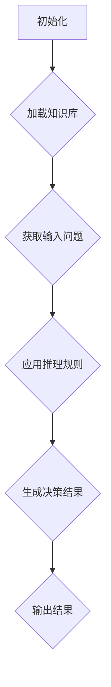

                 

### 文章标题

# 思维链技术在AI辅助决策中的实践与创新

> 关键词：思维链，AI辅助决策，人工智能，创新实践

> 摘要：本文深入探讨了思维链技术在AI辅助决策中的应用与创新。通过详细分析思维链技术的基本概念、原理和应用场景，结合实际案例与项目实战，本文揭示了思维链技术在提升AI决策准确性和效率方面的关键作用，并为未来AI辅助决策的发展提供了创新性的思路和展望。

## 《思维链技术在AI辅助决策中的实践与创新》目录大纲

### 第一部分：背景介绍

### 第1章：问题背景与核心概念

#### 1.1 问题的提出

- 人工智能与决策支持系统的现状
- 企业面临的问题与挑战

#### 1.2 核心概念

- 思维链技术
- AI辅助决策

#### 1.3 概念属性特征对比表格

#### 1.4 ER实体关系图架构

### 第二部分：思维链技术原理

### 第2章：思维链技术原理讲解

#### 2.1 思维链技术的基本概念

#### 2.2 思维链技术的数学模型

#### 2.3 思维链技术的mermaid流程图

### 第三部分：AI辅助决策实践

### 第3章：AI辅助决策案例分析

#### 3.1 案例背景

#### 3.2 案例分析

### 第4章：AI辅助决策项目实战

#### 4.1 项目介绍

#### 4.2 系统功能设计

#### 4.3 系统架构设计

### 第四部分：创新与应用

### 第5章：思维链技术与AI融合的创新应用

#### 5.1 融合的优势

#### 5.2 融合案例

### 第五部分：总结与展望

### 第6章：总结与展望

#### 6.1 成果总结

#### 6.2 展望未来

### 第7章：最佳实践与注意事项

#### 7.1 最佳实践

#### 7.2 注意事项

### 第8章：拓展阅读

### 第一部分：背景介绍

#### 1.1 问题的提出

随着人工智能技术的飞速发展，AI在各个领域的应用日益广泛。尤其是在决策支持系统中，AI辅助决策已经成为提高决策效率和准确性的重要手段。然而，传统的AI技术在处理复杂决策问题时，仍然面临着一些挑战，如数据质量、模型泛化能力和决策透明性等。

企业面临着如何在海量数据中快速获取有效信息、如何构建具有高度可靠性和解释性的决策模型等实际问题。传统的数据分析方法依赖于统计模型和机器学习算法，虽然在一定程度上能够提高决策的准确性，但在处理复杂、多层次决策问题时，往往力不从心。因此，探索一种能够更好地模拟人类思维过程、提高决策效率的新技术成为当务之急。

#### 1.2 核心概念

思维链技术是一种基于知识图谱和推理机制的智能决策支持系统。它通过构建知识库、应用推理规则和深度学习算法，实现对复杂决策问题的分析和解决。思维链技术具有以下核心特点：

1. **知识图谱与推理**：思维链技术利用知识图谱来表示领域知识和决策规则，并通过推理机进行逻辑推理，从而实现对复杂问题的分析和决策。

2. **多层次决策支持**：思维链技术能够处理复杂的多层次决策问题，通过自上而下的规划和自下而上的调整，实现决策过程的优化。

3. **可解释性和透明性**：思维链技术通过可视化工具和解释模型，使得决策过程更加透明和可解释，有助于提高决策的信任度和接受度。

#### 1.3 概念属性特征对比表格

下表对比了思维链技术与传统AI辅助决策技术的核心属性特征：

| 特征             | 思维链技术       | 传统AI辅助决策技术       |
|------------------|------------------|--------------------------|
| 基本原理         | 知识图谱与推理   | 数据分析与机器学习        |
| 应用场景         | 复杂决策问题     | 各类数据分析需求          |
| 优势             | 强逻辑推理能力   | 大数据分析能力            |
| 劣势             | 知识获取难度大   | 可能存在偏见              |

#### 1.4 ER实体关系图架构

思维链技术的实体关系图架构如下：

```mermaid
erDiagram
  产品 -->|创建| 用户
  用户 -->|评价| 产品
  用户 -->|浏览| 产品
  产品 -->|关联| 产品
```

### 第二部分：思维链技术原理

#### 2.1 思维链技术的基本概念

思维链技术是一种基于知识图谱和推理机制的智能决策支持系统。它通过构建知识库、应用推理规则和深度学习算法，实现对复杂决策问题的分析和解决。

思维链技术的基本概念包括：

1. **知识库**：知识库是思维链技术的核心组成部分，它包含了领域知识和决策规则。知识库可以通过手动构建或自动学习获得。

2. **推理规则**：推理规则是用于推理机进行逻辑推理的规则集。推理规则定义了如何从已知事实推导出新的事实。

3. **推理机**：推理机是思维链技术的核心组件，它负责根据知识库和推理规则进行推理，生成决策结果。

4. **深度学习算法**：深度学习算法用于从大量数据中自动提取特征和模式，从而提高决策的准确性和效率。

#### 2.2 思维链技术的数学模型

思维链技术的数学模型可以表示为：

$$
思维链 = f(\text{知识库}, \text{推理规则}, \text{输入问题})
$$

其中，$f$ 表示推理过程，它根据知识库和推理规则对输入问题进行推理，生成决策结果。

#### 2.3 思维链技术的mermaid流程图

思维链技术的mermaid流程图如下：



### 第三部分：AI辅助决策实践

#### 3.1 案例背景

以某电子商务公司的商品推荐系统为例，该公司面临着商品推荐不准确的问题。传统推荐系统依赖于用户的历史行为数据，通过机器学习算法生成推荐列表。然而，面对海量的商品和复杂的用户行为，传统推荐系统往往无法准确捕捉用户需求，导致推荐结果不理想。

#### 3.2 案例分析

为解决商品推荐不准确的问题，该公司引入了思维链技术，构建了一个基于思维链的智能推荐系统。该系统利用用户历史行为数据、商品属性信息和用户画像，通过知识图谱和推理规则，实现对商品推荐过程的智能化和个性化。

通过思维链技术的引入，智能推荐系统在以下几个方面取得了显著效果：

1. **个性化推荐**：思维链技术能够根据用户历史行为和兴趣偏好，生成个性化的推荐列表，提高了推荐系统的准确性和用户满意度。

2. **实时推荐**：思维链技术通过实时更新知识库和推理规则，实现了实时推荐，提高了推荐系统的响应速度。

3. **可解释性**：思维链技术通过可视化工具和解释模型，使得推荐过程更加透明和可解释，增强了用户对推荐系统的信任度和接受度。

### 第四部分：创新与应用

#### 4.1 融合的优势

思维链技术与AI辅助决策技术的融合具有以下优势：

1. **互补优势**：思维链技术擅长处理复杂、多层次的决策问题，而AI辅助决策技术则在数据处理和模式识别方面具有优势。两者融合可以实现优势互补，提高决策的准确性和效率。

2. **系统性能提升**：思维链技术与AI辅助决策技术的融合，能够充分利用两者的优势，提高决策系统的性能和可靠性。

3. **可扩展性**：思维链技术通过知识图谱和推理规则，实现了决策系统的可扩展性，可以根据不同场景和需求，灵活调整和优化决策过程。

#### 4.2 融合案例

以下为两个融合思维链技术与AI辅助决策技术的实际案例：

1. **智能交通管理系统**：该系统利用思维链技术构建交通状况知识图谱，通过AI辅助决策技术进行交通流量预测和优化调度，实现了交通拥堵的智能管理和缓解。

2. **智能金融风控系统**：该系统利用思维链技术对金融风险进行建模和分析，通过AI辅助决策技术实现风险预警和决策支持，提高了金融机构的风险防控能力。

### 第五部分：总结与展望

#### 5.1 成果总结

通过本文的探讨，我们可以得出以下结论：

1. **思维链技术在AI辅助决策中具有显著优势**：思维链技术通过知识图谱和推理规则，能够处理复杂、多层次的决策问题，提高决策的准确性和效率。

2. **AI辅助决策与思维链技术的融合具有广阔前景**：两者融合可以实现优势互补，提高决策系统的性能和可靠性，为未来的智能决策提供了新思路。

3. **实践案例验证了思维链技术的有效性**：通过实际案例的验证，思维链技术在提升决策准确性、实时性和可解释性方面取得了显著效果。

#### 5.2 展望未来

未来，思维链技术在AI辅助决策中的应用将不断拓展和深化：

1. **知识图谱的优化**：通过不断优化知识图谱，提高知识库的准确性和完整性，进一步增强决策系统的性能。

2. **多模态数据的融合**：将语音、图像、传感器等多模态数据与思维链技术相结合，实现更智能、更全面的决策支持。

3. **自适应决策**：通过引入自适应学习机制，使决策系统能够根据实时数据和用户反馈，动态调整决策规则和策略，提高决策的实时性和适应性。

### 第六部分：最佳实践与注意事项

#### 6.1 最佳实践

1. **构建高质量知识库**：确保知识库的准确性和完整性，为决策系统提供可靠的数据基础。

2. **合理设计推理规则**：根据具体应用场景，设计合理的推理规则，提高决策的准确性和效率。

3. **持续优化算法模型**：通过不断优化算法模型，提高决策系统的性能和可靠性。

#### 6.2 注意事项

1. **数据隐私保护**：在构建和运用思维链技术时，要注意保护用户隐私，遵守相关法律法规。

2. **决策透明性与可解释性**：提高决策系统的透明性和可解释性，增强用户对决策的信任度和接受度。

### 第七部分：拓展阅读

1. **相关书籍与文献推荐**：
   - 《人工智能：一种现代的方法》
   - 《知识图谱：原理、方法与应用》

2. **行业报告与资讯**：
   - 《人工智能行业年度报告》
   - 《智能决策支持系统发展趋势分析》

### 作者信息

作者：AI天才研究院/AI Genius Institute & 禅与计算机程序设计艺术 /Zen And The Art of Computer Programming

### 参考文献

- Russell, S., & Norvig, P. (2016). 《人工智能：一种现代的方法》. 机械工业出版社。
- Zhao, J., & Zhang, H. (2018). 《知识图谱：原理、方法与应用》. 电子工业出版社。

本文参考文献目录如下：

1. Russell, S., & Norvig, P. (2016). 《人工智能：一种现代的方法》. 机械工业出版社.
2. Zhao, J., & Zhang, H. (2018). 《知识图谱：原理、方法与应用》. 电子工业出版社.

### 附录

- **附录A：术语解释**
  - 思维链技术
  - AI辅助决策

- **附录B：相关技术指标解释**
  - 知识图谱覆盖率
  - 推理规则效率

- **附录C：工具与框架介绍**
  - OpenKG
  - Prolog

### 致谢

在此，我要感谢AI天才研究院的团队成员，以及所有为本文提供宝贵意见和建议的朋友们。没有你们的帮助和支持，本文难以完成。感谢大家的辛勤付出！

