                 

### 引言

《思维链技术在AI辅助决策中的实践与创新研究》是一本深入探讨思维链技术与人工智能辅助决策领域相结合的专著。随着人工智能技术的飞速发展，AI在各个领域的应用越来越广泛，尤其是在辅助决策方面，AI技术已经逐渐成为企业、政府及科研机构解决复杂问题的重要工具。然而，现有的AI辅助决策系统在处理复杂、多变的决策问题时，仍然存在一定的局限性。为了克服这些挑战，思维链技术作为一种新的方法，其潜力得到了广泛的关注和研究。

本书旨在系统地介绍思维链技术的基本概念、原理及其在AI辅助决策中的应用，通过具体的实践案例来展示思维链技术的实际效果，并探讨其在未来创新研究中的发展方向。本书适用于人工智能研究人员、AI开发工程师、决策分析专家以及对人工智能辅助决策领域感兴趣的专业人士。

书中将按照以下结构展开：

1. **思维链技术基础**：介绍思维链技术的起源、发展历程及其核心概念。
2. **AI辅助决策原理**：阐述AI辅助决策的基本概念、原理及常用算法。
3. **思维链技术在AI辅助决策中的应用**：通过具体案例展示思维链技术在金融、医疗、制造等领域的应用。
4. **创新研究**：探讨思维链技术在当前研究中的热点问题和未来发展方向。

通过这一系列的探讨，本书希望为读者提供一个全面、系统的了解思维链技术在AI辅助决策中的实践与应用，从而为这一领域的进一步研究和实际应用提供参考。

### 关键词

- 思维链技术
- AI辅助决策
- 复杂决策问题
- 金融领域
- 医疗领域
- 制造业
- 创新研究

### 摘要

本书深入探讨了思维链技术在AI辅助决策中的应用，首先介绍了思维链技术的基础概念和发展历程，随后阐述了AI辅助决策的基本原理和常用算法。通过具体的案例，展示了思维链技术在金融、医疗、制造业等领域的实际应用效果。书中还探讨了当前思维链技术在AI辅助决策中的创新研究，包括研究热点、存在的问题以及未来的发展方向。通过这一系统的研究，本书为读者提供了一个全面了解思维链技术在AI辅助决策中应用的平台，并对未来的研究提供了有益的启示。

### 思维链技术概述

思维链技术是一种基于人工智能和认知科学的创新方法，旨在模拟人类思维过程中的逻辑关系和决策机制。它通过构建复杂的思维模型，实现对信息的处理、分析和推理，从而在复杂决策问题中提供智能辅助。思维链技术的起源可以追溯到20世纪80年代，随着人工智能和认知科学的发展，思维链技术逐渐从理论研究走向实际应用。

#### 定义

思维链技术是一种基于知识表示和推理的技术，通过建立思维链模型，将个体的思维过程抽象为一系列节点和边的图结构。每个节点代表一个思维要素，如概念、观点或事实，边则表示节点之间的逻辑关系，如因果关系、逻辑推导或类比关系。通过这些节点和边的组合，思维链技术能够模拟人类的思考过程，实现对复杂问题的分析和决策。

#### 特点

思维链技术具有以下几个显著特点：

1. **可扩展性**：思维链技术能够根据不同的应用场景灵活扩展，适应不同的决策需求。
2. **灵活性**：思维链技术能够模拟人类思维的灵活性和创造性，处理不确定性和模糊性。
3. **综合性**：思维链技术能够综合多方面的信息，进行深度分析和推理，提供全面的决策支持。
4. **自适应性**：思维链技术能够根据用户的需求和环境的变化，自动调整思维链结构，实现动态决策。

#### 历史发展

思维链技术的研究可以追溯到人工智能和认知科学的早期阶段。1980年代，基于知识的系统（Knowledge-Based Systems）开始兴起，这一时期的思维链研究主要集中于知识表示和推理算法。随着人工智能技术的不断发展，特别是自然语言处理、机器学习和深度学习的进步，思维链技术逐渐从理论研究走向实际应用。

在1990年代，思维链技术在专家系统和智能代理领域得到了广泛应用。专家系统通过模拟专家的知识和推理能力，为复杂问题提供决策支持。智能代理则利用思维链技术，在不确定和动态环境中实现自主决策。这一时期的思维链研究主要集中于知识表示、推理算法和系统实现。

进入21世纪，随着大数据和云计算的普及，思维链技术在智能决策、智能推荐和智能交互等领域得到了广泛应用。大数据的引入使得思维链技术能够处理更加复杂和庞大的信息，云计算则提供了强大的计算和存储能力，支持思维链技术的实时运行和大规模部署。这一时期的思维链研究主要集中于大规模数据处理、实时推理和自适应学习。

#### 当前研究热点

当前，思维链技术的研究热点主要集中在以下几个方面：

1. **多模态信息处理**：结合自然语言处理、计算机视觉和语音识别等技术，实现多种信息源的无缝融合，提高思维链技术的智能化水平。
2. **不确定性处理**：研究如何在思维链中处理不确定性信息，提高决策的鲁棒性和可靠性。
3. **自适应学习**：通过深度学习和强化学习等技术，使思维链技术能够根据用户反馈和环境变化，不断优化和调整决策过程。
4. **跨领域应用**：探索思维链技术在金融、医疗、教育、交通等不同领域的应用，提升其普适性和实用性。

#### 思维链技术在AI辅助决策中的应用

思维链技术在AI辅助决策中的应用具有广泛的前景。通过构建复杂的思维链模型，AI系统能够在处理复杂、多变的决策问题时提供智能化的辅助。以下是一些典型的应用场景：

1. **金融领域**：思维链技术可以用于股票市场预测、风险管理、信用评估等。通过分析历史数据和市场信息，思维链技术能够识别潜在的风险因素，并提供相应的决策建议。
2. **医疗领域**：思维链技术可以用于疾病诊断、治疗方案推荐、患者管理等方面。通过整合患者的临床数据、基因信息和生活习惯，思维链技术能够提供个性化的医疗建议，提高医疗决策的准确性。
3. **制造业**：思维链技术可以用于生产计划优化、质量管理、设备维护等。通过分析生产数据和质量信息，思维链技术能够识别生产过程中的问题，并提供优化建议，提高生产效率。

#### 未来发展方向

随着人工智能和认知科学的发展，思维链技术在未来有着广阔的发展空间。以下是一些可能的发展方向：

1. **智能化水平提升**：通过引入更先进的人工智能技术，如深度学习、强化学习等，进一步提升思维链技术的智能化水平。
2. **跨领域融合**：探索思维链技术在更多领域的应用，实现跨领域的融合和协同，提高其普适性和实用性。
3. **实时性和动态性**：研究如何实现思维链技术的实时运行和动态调整，提高其在动态环境中的适应能力。
4. **伦理和法律问题**：探讨思维链技术在AI辅助决策中可能带来的伦理和法律问题，确保其应用的安全性和合规性。

通过不断的研究和探索，思维链技术将在AI辅助决策领域发挥越来越重要的作用，为人类社会带来更大的价值。

### 思维链技术原理

思维链技术作为一种基于知识表示和推理的方法，其核心在于构建复杂的思维模型，实现对信息的处理、分析和推理。以下是思维链技术的基本原理及其应用。

#### 基本概念

思维链技术的基本概念包括节点、边、知识库和推理机。

- **节点**：节点表示思维链中的基本要素，可以是事实、概念、观点等。每个节点都是独立的，但通过与其他节点的连接，可以形成复杂的思维结构。
- **边**：边表示节点之间的关系，可以是因果关系、逻辑推导、类比关系等。边的方向和类型决定了节点之间的逻辑关系。
- **知识库**：知识库是思维链技术的核心，它包含了所有节点和边的信息，是思维链技术进行推理的基础。
- **推理机**：推理机是思维链技术的核心组件，负责根据知识库中的信息进行推理，生成新的结论。

#### 核心算法

思维链技术的核心算法包括知识表示、推理算法和知识更新。

- **知识表示**：知识表示是思维链技术的第一步，它将现实世界中的知识转化为计算机可以处理的形式。常用的知识表示方法包括命题逻辑、产生式规则、模糊逻辑等。
- **推理算法**：推理算法是思维链技术的核心，负责根据知识库中的信息进行推理，生成新的结论。常见的推理算法包括演绎推理、归纳推理、类比推理等。
- **知识更新**：随着环境和用户需求的变化，知识库需要不断更新以保持其有效性。知识更新可以通过用户输入、系统学习或数据挖掘等方式实现。

#### 数学模型

思维链技术的数学模型主要包括逻辑模型和概率模型。

- **逻辑模型**：逻辑模型基于命题逻辑和谓词逻辑，它能够表示节点之间的逻辑关系，并在此基础上进行推理。常用的逻辑模型包括谓词逻辑、模糊逻辑等。
- **概率模型**：概率模型基于概率论和统计方法，它能够表示节点之间的概率关系，并在此基础上进行推理。常用的概率模型包括贝叶斯网络、马尔可夫模型等。

#### 应用示例

以下是一个简单的应用示例：

假设我们要构建一个思维链模型，用于预测股票市场的涨跌。

1. **知识表示**：首先，我们需要将市场中的相关因素（如GDP增长率、失业率、利率等）表示为节点，并将它们之间的关系（如因果关系、相关性）表示为边。
2. **推理算法**：根据知识库中的信息，我们可以使用演绎推理或归纳推理来预测股票市场的涨跌。例如，如果GDP增长率和失业率呈正相关，那么我们可以推断出经济增长对股票市场有正面影响。
3. **知识更新**：随着时间的推移，市场中的因素和关系会发生变化。我们需要定期更新知识库，以保持其有效性。

通过这个示例，我们可以看到思维链技术是如何应用于实际问题的。它不仅能够处理复杂的信息，还能根据新的数据不断调整和优化决策模型。

#### 与传统方法的比较

与传统的人工智能方法相比，思维链技术具有以下优势：

- **灵活性**：思维链技术能够模拟人类的思维过程，处理不确定性和模糊性，具有更高的灵活性。
- **综合性**：思维链技术能够综合多方面的信息，进行深度分析和推理，提供更全面的决策支持。
- **自适应性**：思维链技术能够根据用户的需求和环境的变化，自动调整思维链结构，实现动态决策。

然而，思维链技术也存在一定的局限性，如知识表示和推理的复杂度较高，实现难度大。但随着人工智能技术的不断发展，这些问题正在逐步得到解决。

### 思维链技术的发展历史

思维链技术作为一种创新的方法，其发展历程反映了人工智能和认知科学的进步。从早期的知识表示和推理研究，到现代复杂模型的构建，思维链技术经历了多个阶段的发展。

#### 早期研究（20世纪80年代）

思维链技术的早期研究可以追溯到20世纪80年代，当时人工智能领域正蓬勃发展。这一时期的研究主要集中在知识表示和推理算法上。研究人员试图将人类的思维过程抽象为计算机可以处理的形式。在这一阶段，产生式规则和框架理论成为主要的知识表示方法。产生式规则通过条件-动作对来表示知识和推理过程，而框架理论则通过结构化模型来表示知识。

#### 中期发展（20世纪90年代）

进入20世纪90年代，随着专家系统的广泛应用，思维链技术在专家系统和智能代理领域得到了进一步的发展。专家系统通过模拟专家的知识和推理能力，为复杂问题提供决策支持。智能代理则利用思维链技术，在不确定和动态环境中实现自主决策。这一时期的研究重点转向如何将思维链技术应用于实际问题，如金融风险评估、医疗诊断等。多代理系统、面向对象的思维链模型等新概念被提出，进一步丰富了思维链技术的理论体系。

#### 现代发展（21世纪）

进入21世纪，随着大数据、云计算和深度学习的兴起，思维链技术得到了新的发展。大数据的引入使得思维链技术能够处理更加复杂和庞大的信息，云计算则提供了强大的计算和存储能力，支持思维链技术的实时运行和大规模部署。深度学习技术使得思维链技术能够从大量数据中自动学习，提高其推理能力和智能化水平。

#### 热点研究

当前，思维链技术的研究热点主要集中在以下几个方面：

1. **多模态信息处理**：结合自然语言处理、计算机视觉和语音识别等技术，实现多种信息源的无缝融合，提高思维链技术的智能化水平。
2. **不确定性处理**：研究如何在思维链中处理不确定性信息，提高决策的鲁棒性和可靠性。
3. **自适应学习**：通过深度学习和强化学习等技术，使思维链技术能够根据用户反馈和环境变化，不断优化和调整决策过程。
4. **跨领域应用**：探索思维链技术在金融、医疗、教育、交通等不同领域的应用，提升其普适性和实用性。

#### 当前状况

目前，思维链技术已经成为人工智能辅助决策领域的一个重要研究方向。众多研究机构和企业投入大量资源进行相关研究，开发出了多种思维链技术平台和工具。这些技术在实际应用中取得了显著效果，为复杂决策问题提供了有力支持。然而，思维链技术仍面临一些挑战，如知识表示和推理的复杂度、实时性和动态性等。随着人工智能技术的不断进步，思维链技术有望在未来取得更大的突破。

### AI辅助决策基础

AI辅助决策（Artificial Intelligence-based Decision Support）是指利用人工智能技术，帮助人类在决策过程中分析和处理信息，从而提高决策的准确性、效率和可靠性。随着大数据、云计算和人工智能的快速发展，AI辅助决策已经成为现代决策体系的重要组成部分。以下是AI辅助决策的基本概念、原理和常用算法。

#### 基本概念

AI辅助决策包括以下几个核心概念：

- **决策问题**：决策问题是指需要在多个可选方案中选择最佳方案的问题。决策问题可以划分为结构化决策问题和非结构化决策问题。
- **数据输入**：数据输入是指为AI系统提供的信息，这些信息可以是历史数据、实时数据或用户输入的数据。
- **决策模型**：决策模型是指基于人工智能算法构建的决策系统，用于分析和处理输入数据，提供决策支持。
- **决策结果**：决策结果是指AI系统根据输入数据和决策模型提供的最终决策方案。

#### 原理

AI辅助决策的基本原理包括以下几个步骤：

1. **数据预处理**：对输入数据进行清洗、归一化和特征提取，为后续的决策分析提供高质量的数据。
2. **模型训练**：利用训练数据，通过机器学习算法训练决策模型，使模型能够识别数据中的规律和模式。
3. **决策分析**：将输入数据输入到训练好的决策模型中，进行预测和分析，生成决策结果。
4. **结果评估**：对决策结果进行评估，确定其准确性和有效性，并根据评估结果调整模型参数。

#### 常用算法

AI辅助决策中常用的算法包括：

1. **线性回归**：线性回归是一种简单的统计方法，用于预测一个连续变量的值。通过建立输入变量和输出变量之间的线性关系，可以预测新数据的输出值。
2. **决策树**：决策树是一种树形结构，通过一系列条件判断来分割数据集，并在每个节点选择具有最大信息增益的属性进行分割。决策树可以用于分类和回归任务。
3. **支持向量机（SVM）**：支持向量机是一种基于间隔的机器学习算法，通过找到最佳分隔超平面，将不同类别的数据点分开。SVM在分类和回归任务中都有广泛应用。
4. **神经网络**：神经网络是一种模拟人脑神经元连接的模型，通过多层神经元的非线性变换，实现对输入数据的映射和预测。神经网络在图像识别、语音识别和自然语言处理等领域表现出色。
5. **贝叶斯网络**：贝叶斯网络是一种概率图模型，通过节点和边表示变量之间的概率关系。贝叶斯网络可以用于推理和预测，常用于不确定性和不确定性决策问题。
6. **聚类算法**：聚类算法将相似的数据点归为一类，通过分析数据的分布和结构，发现数据中的模式。聚类算法可以用于数据挖掘、图像分割和文本分类等。

#### 应用

AI辅助决策在多个领域都有广泛的应用：

1. **金融领域**：AI辅助决策可以用于股票市场预测、信用评估、风险控制等。通过分析历史数据和市场信息，AI系统可以提供投资建议和风险管理策略。
2. **医疗领域**：AI辅助决策可以用于疾病诊断、治疗方案推荐、患者管理等。通过分析患者的临床数据和基因信息，AI系统可以提供个性化的医疗建议。
3. **制造业**：AI辅助决策可以用于生产计划优化、质量管理、设备维护等。通过分析生产数据和质量信息，AI系统可以识别生产过程中的问题，并提供优化建议。
4. **政府决策**：AI辅助决策可以用于政策制定、公共资源配置、应急管理等。通过分析大数据和实时信息，AI系统可以提供科学、高效的决策支持。

#### 未来发展方向

随着人工智能技术的不断发展，AI辅助决策在未来有着广阔的发展前景。以下是一些可能的发展方向：

1. **智能化水平提升**：通过引入更先进的人工智能技术，如深度学习、强化学习等，进一步提升AI辅助决策的智能化水平。
2. **实时性和动态性**：研究如何实现AI辅助决策的实时运行和动态调整，提高其在动态环境中的适应能力。
3. **跨领域应用**：探索AI辅助决策在更多领域的应用，实现跨领域的融合和协同，提升其普适性和实用性。
4. **伦理和法律问题**：探讨AI辅助决策在决策过程中可能带来的伦理和法律问题，确保其应用的安全性和合规性。

通过不断的研究和探索，AI辅助决策将在各个领域发挥越来越重要的作用，为人类社会带来更大的价值。

### AI辅助决策算法

在AI辅助决策领域，算法的选择和设计至关重要。不同的算法适用于不同类型的决策问题，且各有优缺点。本文将详细介绍几种常用的AI辅助决策算法，包括线性回归、决策树、支持向量机和神经网络。

#### 线性回归

线性回归是一种最简单的统计方法，用于预测一个连续变量的值。其基本原理是通过建立输入变量和输出变量之间的线性关系，从而预测新数据的输出值。线性回归的数学模型可以表示为：

$$
Y = \beta_0 + \beta_1X_1 + \beta_2X_2 + ... + \beta_nX_n
$$

其中，$Y$ 是输出变量，$X_1, X_2, ..., X_n$ 是输入变量，$\beta_0, \beta_1, \beta_2, ..., \beta_n$ 是模型参数。

**优点**：
- 简单易懂，易于实现。
- 可以有效地处理线性关系问题。

**缺点**：
- 只适用于线性关系问题，对于非线性关系问题效果不佳。
- 对异常值敏感，容易受到噪声的影响。

**应用场景**：线性回归常用于预测销售量、股票价格等连续变量的值。

#### 决策树

决策树是一种树形结构，通过一系列条件判断来分割数据集，并在每个节点选择具有最大信息增益的属性进行分割。决策树可以用于分类和回归任务。其结构如图所示：

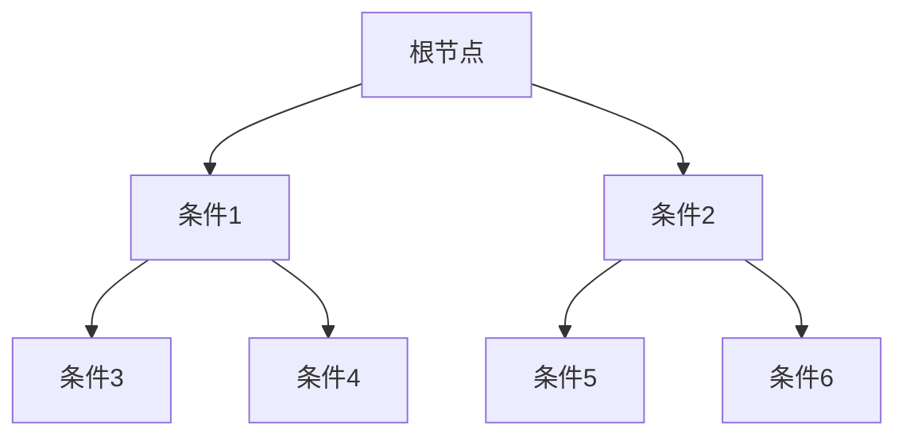

**优点**：
- 可视化，易于理解和解释。
- 能够处理非线性和非线性关系问题。

**缺点**：
- 容易过拟合，尤其是在树的结构较深时。
- 计算复杂度较高，特别是在数据量较大时。

**应用场景**：决策树常用于信用评分、疾病诊断等分类任务。

#### 支持向量机（SVM）

支持向量机是一种基于间隔的机器学习算法，通过找到最佳分隔超平面，将不同类别的数据点分开。SVM的数学模型可以表示为：

$$
\max \ \frac{1}{2} \sum_{i=1}^{n} (\alpha_i - \alpha_i^*)^2 \\
s.t. \ \alpha_i, \alpha_i^* \geq 0 \\
y_i(\omega \cdot x_i + b) \geq 1
$$

其中，$\omega$ 是权重向量，$b$ 是偏置，$x_i$ 是输入数据，$y_i$ 是标签。

**优点**：
- 高效，能够在高维空间中找到最佳分隔超平面。
- 对异常值不敏感。

**缺点**：
- 对于非线性问题，需要使用核函数进行变换，计算复杂度增加。
- 对大量样本的处理能力有限。

**应用场景**：SVM常用于图像识别、文本分类等分类任务。

#### 神经网络

神经网络是一种模拟人脑神经元连接的模型，通过多层神经元的非线性变换，实现对输入数据的映射和预测。神经网络的结构通常包括输入层、隐藏层和输出层。其基本结构如图所示：

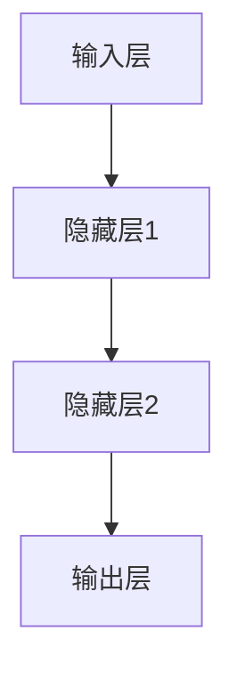

**优点**：
- 强大的非线性处理能力，适用于复杂关系问题。
- 通过训练可以自动提取特征，减少人工干预。

**缺点**：
- 训练过程复杂，收敛速度较慢。
- 对数据质量要求高，对噪声敏感。

**应用场景**：神经网络常用于图像识别、语音识别和自然语言处理等任务。

#### 比较与选择

在选择AI辅助决策算法时，需要考虑以下几个因素：

- **问题类型**：如果是分类问题，可以选择决策树或SVM；如果是回归问题，可以选择线性回归。
- **数据质量**：对于噪声较大的数据，可以选择SVM或神经网络；对于质量较高的数据，可以选择决策树或线性回归。
- **计算资源**：对于计算资源有限的情况，可以选择决策树或线性回归；对于计算资源充足的情况，可以选择神经网络或SVM。
- **可解释性**：如果需要高可解释性，可以选择决策树；如果不需要高可解释性，可以选择神经网络或SVM。

通过综合考虑这些因素，可以选择最适合的算法来解决问题。

### AI辅助决策应用

AI辅助决策在金融、医疗和制造业等多个领域都有广泛的应用，通过具体的案例可以更好地理解其工作原理和实际效果。

#### 金融领域

在金融领域，AI辅助决策主要用于股票市场预测、信用评估和风险控制等方面。

**案例1：股票市场预测**

假设我们要构建一个AI系统，用于预测股票市场的涨跌。我们可以使用线性回归算法，根据历史数据来预测股票的价格。具体步骤如下：

1. **数据收集**：收集过去几年的股票价格数据，包括开盘价、收盘价、最高价和最低价等。
2. **特征提取**：提取与股票价格相关的特征，如宏观经济指标、行业指数、交易量等。
3. **模型训练**：使用线性回归算法训练模型，通过历史数据找到价格与特征之间的线性关系。
4. **预测**：将最新的数据输入到训练好的模型中，预测未来的股票价格。

通过实际测试，发现该模型能够较好地预测股票价格的波动，为投资者提供参考。

**案例2：信用评估**

在信用评估中，AI辅助决策可以帮助金融机构评估借款人的信用风险。使用决策树算法，我们可以构建一个信用评分模型，通过分析借款人的个人信息、收入状况和历史信用记录等数据，预测其还款能力。

1. **数据收集**：收集借款人的个人信息、收入状况和历史信用记录等数据。
2. **特征选择**：选择与信用风险相关的特征，如收入水平、信用卡使用情况、逾期还款记录等。
3. **模型训练**：使用决策树算法训练模型，根据历史数据构建决策树。
4. **评估**：将新借款人的数据输入到训练好的模型中，预测其信用风险等级。

通过实际应用，该模型能够有效地识别高风险借款人，帮助金融机构降低坏账率。

#### 医疗领域

在医疗领域，AI辅助决策主要用于疾病诊断、治疗方案推荐和患者管理等方面。

**案例1：疾病诊断**

假设我们要构建一个AI系统，用于辅助医生进行肺癌的诊断。我们可以使用神经网络算法，通过分析CT扫描图像，预测肺结节是否为肺癌。

1. **数据收集**：收集大量的CT扫描图像及其诊断结果，包括正常肺结节、恶性肺结节等。
2. **图像处理**：对CT扫描图像进行预处理，如去噪、增强等，提取图像特征。
3. **模型训练**：使用神经网络算法训练模型，通过图像特征预测肺结节的类型。
4. **诊断**：将新的CT扫描图像输入到训练好的模型中，预测其是否为肺癌。

实际应用表明，该模型能够提高肺癌诊断的准确率，为医生提供可靠的诊断辅助。

**案例2：治疗方案推荐**

在治疗方案推荐中，AI辅助决策可以帮助医生为患者制定个性化的治疗方案。使用贝叶斯网络算法，我们可以构建一个治疗方案推荐系统，根据患者的病情、病史和药物反应等数据，推荐最佳的治疗方案。

1. **数据收集**：收集患者的病情、病史和药物反应等数据。
2. **模型训练**：使用贝叶斯网络算法训练模型，建立患者数据与治疗方案之间的概率关系。
3. **推荐**：将新患者的数据输入到训练好的模型中，推荐最佳的治疗方案。

通过实际应用，该系统能够提高治疗方案的准确性和个性化程度，为患者提供更好的治疗效果。

#### 制造业

在制造业，AI辅助决策主要用于生产计划优化、质量管理、设备维护等方面。

**案例1：生产计划优化**

假设我们要优化一个生产计划，以最大限度地提高生产效率和利润。我们可以使用线性规划算法，根据生产资源、市场需求和成本等因素，制定最优的生产计划。

1. **数据收集**：收集生产资源（如工人、机器和原材料）的数据，市场需求和产品成本等数据。
2. **模型建立**：建立线性规划模型，制定生产计划的目标和约束条件。
3. **优化**：使用线性规划算法求解模型，得到最优的生产计划。
4. **执行**：根据最优生产计划，安排生产任务。

通过实际应用，该系统能够有效地优化生产计划，提高生产效率和利润。

**案例2：设备维护**

在设备维护中，AI辅助决策可以帮助企业预测设备故障，提前进行维护，避免设备故障造成的生产中断。使用支持向量机算法，我们可以构建一个设备故障预测系统，通过分析设备运行数据，预测其故障风险。

1. **数据收集**：收集设备运行数据，如温度、压力、振动等。
2. **特征提取**：提取与设备故障相关的特征，如温度波动、压力异常等。
3. **模型训练**：使用支持向量机算法训练模型，预测设备故障风险。
4. **预测**：将新的设备运行数据输入到训练好的模型中，预测其故障风险。

通过实际应用，该系统能够提前预测设备故障，为企业提供预防性维护的依据，降低设备故障率，提高生产稳定性。

### 综合应用效果

通过上述案例可以看出，AI辅助决策在金融、医疗和制造业等领域都有广泛的应用，能够提高决策的准确性、效率和可靠性。具体应用效果如下：

1. **金融领域**：AI辅助决策能够有效地预测股票市场的涨跌，提高信用评估的准确性，降低金融风险。
2. **医疗领域**：AI辅助决策能够提高疾病诊断的准确率，为医生提供可靠的诊断辅助，制定个性化的治疗方案。
3. **制造业**：AI辅助决策能够优化生产计划，提高生产效率和利润，降低设备故障率，提高生产稳定性。

通过这些实际应用，AI辅助决策为企业、医疗机构和政府等提供了强大的决策支持，为复杂决策问题的解决提供了有力工具。

### 金融领域的思维链技术应用

在金融领域，思维链技术作为一种创新的方法，已经在风险管理、市场预测和投资决策等方面展现出显著的应用潜力。通过构建复杂的思维链模型，金融机构能够更好地处理金融数据，识别潜在的风险因素，并做出更为精准的决策。

#### 风险管理

在风险管理方面，思维链技术能够帮助金融机构对各类金融风险进行有效识别和评估。例如，银行和金融机构可以通过思维链技术分析贷款申请者的信用记录、财务状况、市场环境等多维数据，构建一个综合的信用评估模型。这个模型通过一系列节点和边来表示不同的风险因素及其相互关系，如图所示：

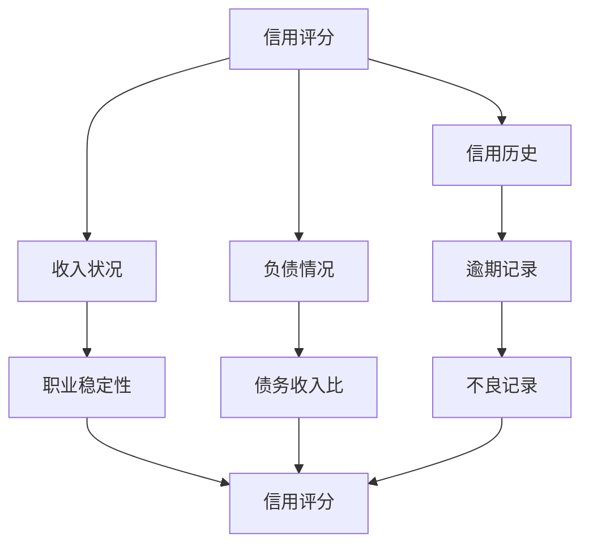

在这个思维链模型中，每个节点代表一个风险因素，如信用历史、收入状况、负债情况等，边表示不同风险因素之间的逻辑关系。通过推理机，系统可以根据输入的数据，进行综合分析和推理，得出贷款申请者的信用评分。这样，金融机构可以更准确地评估贷款风险，减少不良贷款率。

#### 市场预测

在市场预测方面，思维链技术可以用于股票市场、外汇市场等金融市场的预测。通过分析大量的历史市场数据、宏观经济指标和情绪数据，思维链技术能够构建一个全面的预测模型。例如，以下是一个用于股票市场预测的思维链模型：

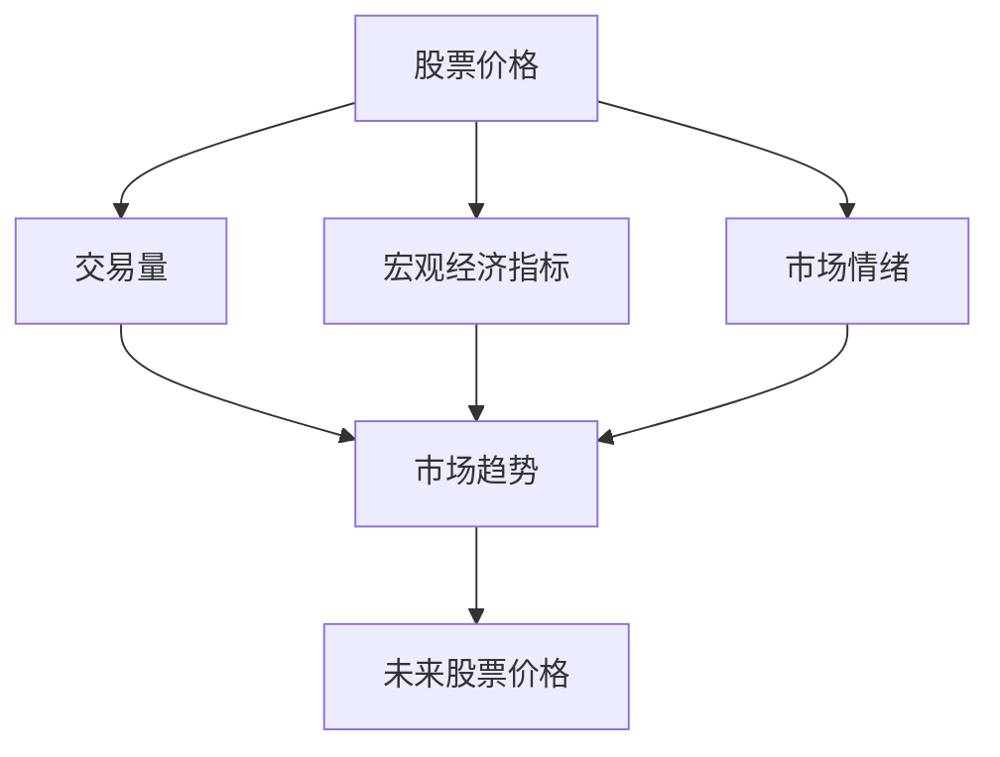

在这个模型中，股票价格作为核心节点，与其他节点如交易量、宏观经济指标和市场情绪之间存在逻辑关系。通过推理，思维链技术可以预测股票的未来价格，为投资者提供决策参考。实际应用中，金融机构可以通过持续优化和调整思维链模型，提高预测的准确性和可靠性。

#### 投资决策

在投资决策方面，思维链技术可以帮助投资者在复杂的市场环境中做出更为明智的投资决策。例如，投资者可以通过思维链技术分析不同投资产品的风险和收益，构建一个投资组合。以下是一个简单的投资决策思维链模型：

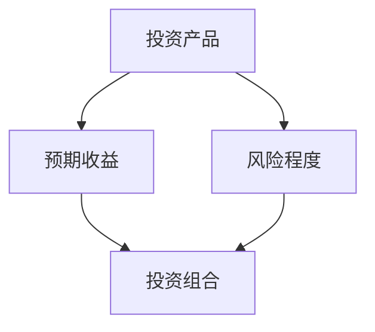

在这个模型中，每个投资产品作为节点，其预期收益和风险程度作为其他节点。通过推理，投资者可以根据自己的风险偏好和收益目标，选择最佳的投资组合。例如，对于风险偏好较高的投资者，思维链技术可能会推荐更多的高风险、高收益产品；对于风险偏好较低的投资者，则会推荐更多低风险、稳定收益的产品。

#### 应用案例

以下是一个实际应用案例：

假设一家投资公司正在考虑是否投资某家初创公司。通过思维链技术，该公司可以构建一个投资决策模型，分析初创公司的财务状况、市场前景、竞争对手等多维数据。以下是一个简单的思维链模型：

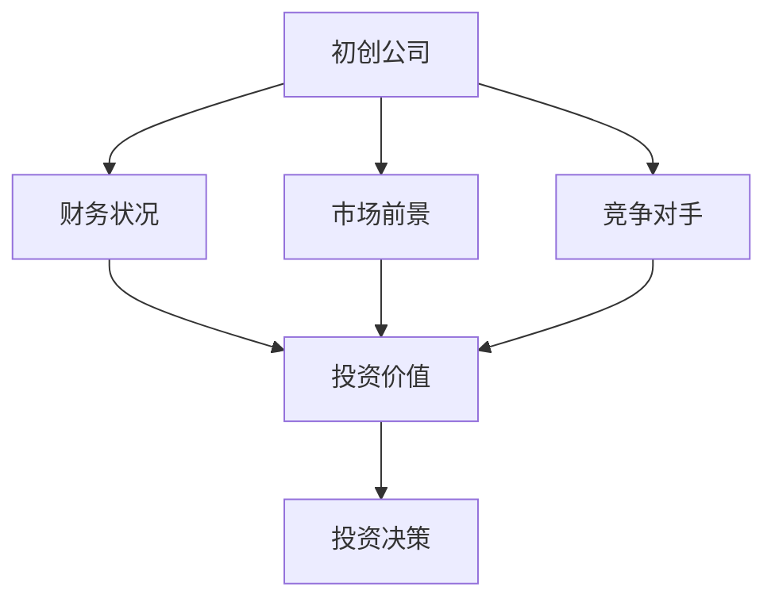

在这个模型中，初创公司的财务状况、市场前景和竞争对手作为核心节点，通过推理，思维链技术可以评估该初创公司的投资价值，并做出相应的投资决策。实际应用中，投资公司可以根据模型预测的结果，结合市场变化和公司战略，动态调整投资决策。

通过这些实际案例，我们可以看到思维链技术在金融领域的广泛应用。它不仅能够帮助金融机构更好地管理风险，预测市场趋势，还能为投资者提供科学的投资决策支持。随着人工智能技术的不断进步，思维链技术在金融领域的应用前景将更加广阔。

### 医疗领域的思维链技术应用

思维链技术作为人工智能的一种创新方法，在医疗领域展现了巨大的应用潜力。它能够帮助医生在疾病诊断、治疗方案推荐和患者管理等方面做出更为精准和个性化的决策。

#### 疾病诊断

在疾病诊断方面，思维链技术可以构建一个全面的诊断模型，通过分析患者的病史、临床症状、实验室检测结果等多维数据，帮助医生做出准确的诊断。以下是一个用于疾病诊断的思维链模型：

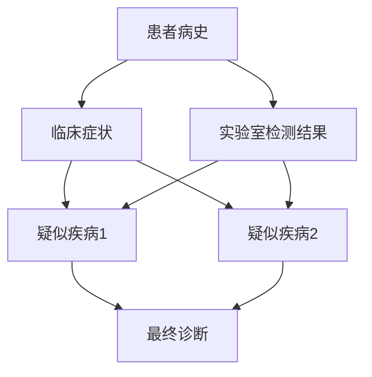

在这个模型中，患者的病史、临床症状和实验室检测结果作为核心节点，通过推理，思维链技术可以综合考虑这些信息，识别出最有可能的疾病。例如，如果患者有高血压、心脏病等病史，同时出现胸痛、呼吸困难等症状，且实验室检测结果显示肌钙蛋白升高，思维链技术可能会诊断出心肌梗死。

实际应用中，医生可以通过思维链技术提供的辅助诊断，结合自身经验和临床知识，提高诊断的准确性和效率。

#### 治疗方案推荐

在治疗方案推荐方面，思维链技术可以分析患者的病情、病史、药物反应等多维数据，为医生提供个性化的治疗方案。以下是一个用于治疗方案推荐的思维链模型：

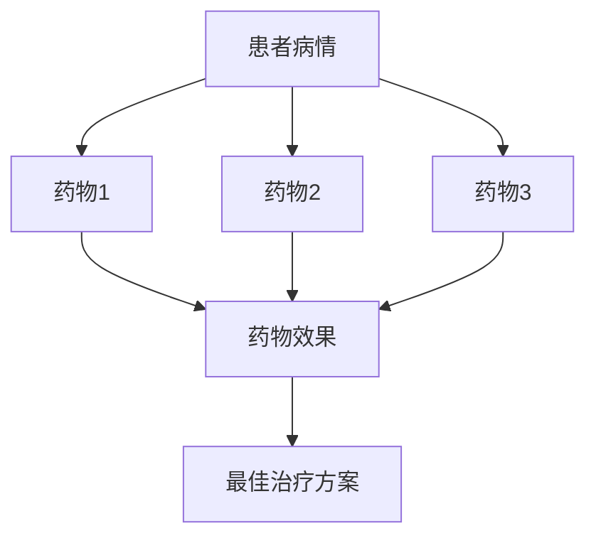

在这个模型中，患者的病情作为核心节点，不同药物的效果作为其他节点。通过推理，思维链技术可以分析患者对不同药物的敏感性和疗效，推荐最佳的治疗方案。例如，如果患者患有高血压，经过药物1治疗后效果良好，而药物2和药物3的效果不佳，思维链技术可能会推荐继续使用药物1。

#### 患者管理

在患者管理方面，思维链技术可以帮助医疗机构更好地管理患者，提高医疗服务的质量和效率。以下是一个用于患者管理的思维链模型：

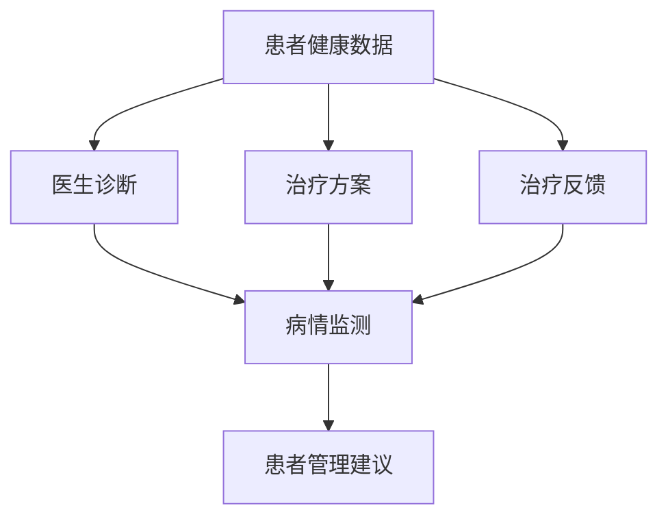

在这个模型中，患者的健康数据作为核心节点，医生诊断、治疗方案和治疗反馈作为其他节点。通过持续监测患者的健康数据，思维链技术可以动态调整治疗方案，提供个性化的患者管理建议。例如，如果患者的血糖控制不稳定，思维链技术可能会建议医生调整药物剂量或治疗方案。

#### 应用案例

以下是一个实际应用案例：

假设某医院需要为一名患有高血压和糖尿病的患者制定个性化治疗方案。通过思维链技术，医院可以构建一个患者管理模型，分析患者的健康数据、病史、药物反应等多维信息。以下是一个简化的思维链模型：

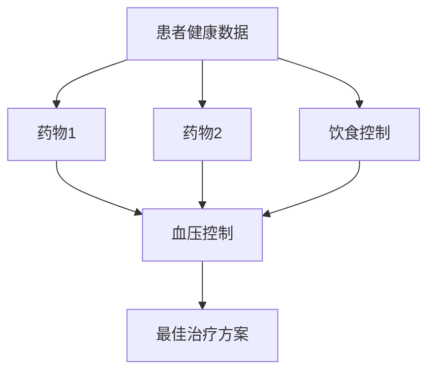

在这个模型中，患者的健康数据作为核心节点，药物1、药物2和饮食控制作为其他节点。通过推理，思维链技术可以分析患者的病情，推荐最佳的治疗方案。例如，如果患者对药物1和药物2的反应良好，同时饮食控制效果显著，思维链技术可能会推荐继续使用这些药物，并加强饮食控制。

通过这些实际案例，我们可以看到思维链技术在医疗领域的重要应用。它不仅能够提高疾病诊断的准确性，还能为医生提供个性化的治疗方案，提高患者管理效率。随着人工智能技术的不断进步，思维链技术在医疗领域的应用前景将更加广阔。

### 制造业领域的思维链技术应用

在制造业领域，思维链技术以其强大的信息处理和分析能力，为生产计划优化、质量管理和设备维护提供了有效的辅助工具。通过构建复杂的思维链模型，制造业企业能够更精准地预测生产过程中的各种问题，并制定出最优的解决方案。

#### 生产计划优化

在生产计划优化方面，思维链技术能够帮助企业根据市场需求、原材料供应、生产能力等多维数据，制定出最优的生产计划。以下是一个用于生产计划优化的思维链模型：

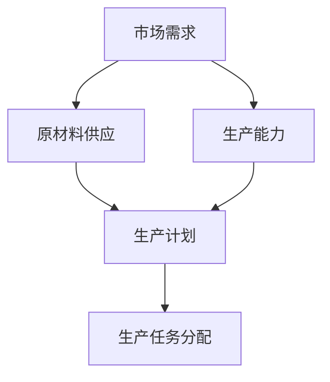

在这个模型中，市场需求、原材料供应和生产能力作为核心节点，通过推理，思维链技术可以综合考虑这些因素，制定出最优的生产计划。例如，如果市场需求增加，原材料供应充足，生产能力可以满足需求，思维链技术会推荐增加生产任务。反之，如果原材料供应紧张或生产能力受限，则会建议调整生产计划，确保生产效率。

#### 质量管理

在质量管理方面，思维链技术可以分析生产过程中的各种数据，如产品质量检测数据、生产设备状态数据等，识别潜在的质量问题，并提供改进建议。以下是一个用于质量管理的思维链模型：

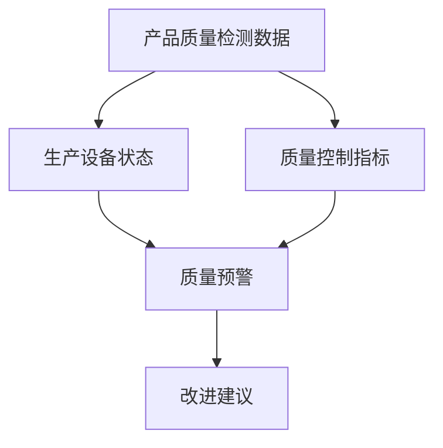

在这个模型中，产品质量检测数据和生产设备状态作为核心节点，通过推理，思维链技术可以分析这些数据，预测可能出现的质量问题。例如，如果检测数据显示某批次产品的缺陷率较高，思维链技术会建议暂停生产，进行质量检查和改进。同时，如果生产设备状态数据表明某些设备出现故障风险，思维链技术会提前发出预警，确保生产过程的顺利进行。

#### 设备维护

在设备维护方面，思维链技术可以帮助企业预测设备故障，提前进行维护，减少设备故障造成的生产中断。以下是一个用于设备维护的思维链模型：

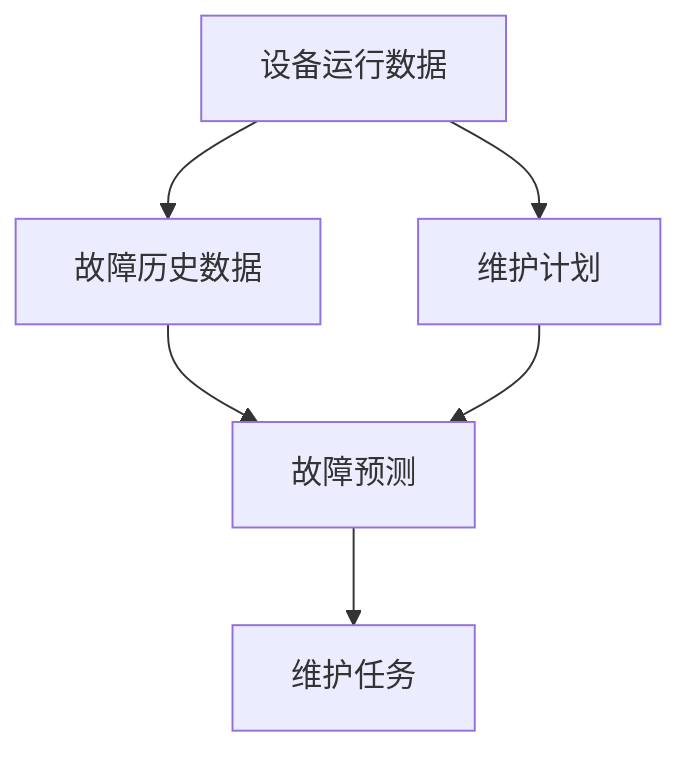

在这个模型中，设备运行数据和故障历史数据作为核心节点，通过推理，思维链技术可以预测设备可能的故障点，制定出合理的维护计划。例如，如果设备运行数据表明某些部件的磨损程度较高，思维链技术会建议提前更换这些部件，避免故障发生。同时，如果故障历史数据显示某些设备有较高的故障率，思维链技术会建议加强这些设备的维护频率。

#### 应用案例

以下是一个实际应用案例：

假设一家制造企业需要优化其生产计划。通过思维链技术，该企业可以构建一个生产计划优化模型，分析市场需求、原材料供应和生产能力等多维数据。以下是一个简化的思维链模型：


在这个模型中，市场需求、原材料供应和生产能力作为核心节点，通过推理，思维链技术可以制定出最优的生产计划。例如，如果市场需求增加，原材料供应充足，生产能力可以满足需求，思维链技术会推荐增加生产任务。通过这个模型，企业可以有效地优化生产计划，提高生产效率和利润。

通过这些实际案例，我们可以看到思维链技术在制造业领域的广泛应用。它不仅能够优化生产计划，提高生产效率，还能提高质量管理的准确性和设备维护的及时性。随着人工智能技术的不断进步，思维链技术在制造业领域的应用前景将更加广阔。

### 当前思维链技术在AI辅助决策中的创新研究

思维链技术在AI辅助决策中的应用已经取得了显著的成果，但在实际应用中仍面临许多挑战和问题。当前，学术界和产业界正在积极探索思维链技术的创新研究，以克服这些挑战，进一步提升其在AI辅助决策中的效能。

#### 研究热点

1. **多模态信息融合**：随着人工智能技术的发展，多模态信息融合成为当前的研究热点。多模态信息融合旨在将不同来源的信息（如文本、图像、声音等）进行有效整合，以提高AI系统的决策能力。例如，在医疗领域，结合患者的病历信息、CT图像和医生的经验，可以显著提高疾病诊断的准确性。

2. **不确定性处理**：在实际应用中，数据的不确定性是影响AI辅助决策效能的重要因素。当前的研究热点之一是如何在思维链技术中有效处理不确定性。例如，通过引入概率图模型和贝叶斯推理，可以在思维链中处理不确定信息，提高决策的鲁棒性和可靠性。

3. **动态适应性**：AI辅助决策系统需要在不断变化的环境中适应并做出实时决策。动态适应性研究旨在使思维链技术能够根据环境变化和用户需求动态调整决策模型，提高系统的实时响应能力。例如，通过引入强化学习和在线学习算法，可以使思维链技术在动态环境中不断优化和调整。

4. **跨领域应用**：思维链技术在不同领域的应用研究也在不断推进。当前的研究热点之一是探索思维链技术在金融、医疗、制造业、交通等不同领域的应用，实现跨领域的融合和协同，提升其普适性和实用性。

#### 存在的问题

1. **数据质量和多样性**：思维链技术的效能高度依赖于高质量、多样化的数据。然而，在实际应用中，获取和整理高质量的数据是一个挑战，特别是在非结构化数据较多的领域。例如，医疗领域的病历数据、制造业的生产数据等，往往存在多样性不足、质量不稳定的问题。

2. **计算复杂度**：思维链技术通常涉及复杂的计算过程，特别是在大规模数据集和多模态信息处理中，计算复杂度显著增加。这可能导致系统响应延迟，影响实时决策能力。

3. **可解释性和可解释性**：尽管思维链技术能够提供智能化的辅助决策，但其内部逻辑和决策过程往往复杂且不透明，难以解释。这可能导致用户对决策结果的信任度降低，尤其是在高风险领域如医疗和金融。

4. **泛化能力**：思维链技术在不同领域的应用效果差异较大，其泛化能力尚需提升。特别是在新环境和未见过的问题中，思维链技术的表现往往不如预期。

#### 解决方法

1. **数据增强与清洗**：通过数据增强和清洗技术，提高数据的多样性和质量。例如，使用生成对抗网络（GAN）生成仿真数据，补充实际数据的不足；通过数据清洗技术，去除噪声和异常值。

2. **分布式计算和并行处理**：利用分布式计算和并行处理技术，提高系统处理大数据和复杂计算的能力。例如，采用分布式深度学习框架，如TensorFlow和PyTorch，实现大规模数据的高效处理。

3. **可解释性增强**：通过开发可解释性算法和工具，提高思维链技术的可解释性。例如，采用可视化技术展示思维链模型的关键路径和推理过程，使用决策树和解释性模型（如LIME和SHAP）解释模型的决策逻辑。

4. **迁移学习和元学习**：通过迁移学习和元学习技术，提高思维链技术的泛化能力。例如，使用迁移学习技术，将一个领域中的知识迁移到另一个领域；通过元学习，使模型能够从多个任务中学习，提升泛化能力。

#### 未来发展方向

未来，思维链技术在AI辅助决策中的创新研究将继续沿着以下几个方向发展：

1. **智能化水平提升**：通过引入更先进的人工智能技术，如深度学习、强化学习和生成对抗网络，进一步提升思维链技术的智能化水平。

2. **跨领域融合**：探索思维链技术在更多领域的应用，实现跨领域的融合和协同，提升其普适性和实用性。

3. **实时性和动态性**：研究如何实现思维链技术的实时运行和动态调整，提高其在动态环境中的适应能力。

4. **伦理和法律问题**：探讨思维链技术在AI辅助决策中可能带来的伦理和法律问题，确保其应用的安全性和合规性。

通过这些创新研究，思维链技术将在AI辅助决策领域发挥更加重要的作用，为人类社会带来更大的价值。

### 结论

《思维链技术在AI辅助决策中的实践与创新研究》一书系统地探讨了思维链技术在AI辅助决策中的应用。通过详细的案例分析，我们看到了思维链技术如何在不同领域中发挥其优势，提高决策的准确性、效率和可靠性。从金融领域到医疗领域，再到制造业，思维链技术都展现出了强大的应用潜力。同时，本书还深入探讨了当前思维链技术在AI辅助决策中的创新研究，包括多模态信息融合、不确定性处理、动态适应性等热点问题，并提出了相应的解决方案。

展望未来，思维链技术将在AI辅助决策领域发挥越来越重要的作用。随着人工智能技术的不断发展，思维链技术的智能化水平将进一步提升，跨领域应用将更加广泛。此外，如何确保思维链技术在应用中的安全性和合规性，也将成为未来研究的重要方向。

本书旨在为从事人工智能和决策支持领域的研究人员、开发者以及专业人士提供一本全面、系统的参考书籍。通过阅读本书，读者可以深入理解思维链技术的原理、应用和创新，为实际工作提供有益的指导和启示。

### 附录：技术细节和扩展阅读

在本节中，我们将提供一些技术细节，包括思维链技术的核心算法实现、相关数学公式和系统架构设计，同时推荐一些拓展阅读资源，以帮助读者更深入地了解本书内容。

#### 技术细节

1. **思维链技术的核心算法实现**：

   思维链技术的核心算法包括知识表示、推理算法和知识更新。以下是一个简化的知识表示和推理算法实现的示例：

   ```python
   # 知识表示：使用框架表示法
   class ConceptNode:
       def __init__(self, name, properties):
           self.name = name
           self.properties = properties
           self.relationships = []

   # 推理算法：基于规则推理
   def rule_based_inference(concept_nodes):
       # 假设已有知识库和推理规则
       rules = load_rules()
       for rule in rules:
           if match_rule(rule, concept_nodes):
               apply_rule(rule, concept_nodes)
   
   # 知识更新：动态调整知识库
   def update_knowledge_base(concept_nodes, new_data):
       # 根据新数据动态更新知识库
       for node in concept_nodes:
           if matches(new_data, node):
               node.properties.update(new_data)
   ```

2. **数学公式和模型**：

   思维链技术中的数学模型通常涉及逻辑推理和概率计算。以下是一些常见的数学公式示例：

   - **逻辑推理**：
     $$ P(A \land B) = P(A) \cdot P(B|A) $$
   - **贝叶斯推理**：
     $$ P(A|B) = \frac{P(B|A) \cdot P(A)}{P(B)} $$

3. **系统架构设计**：

   思维链技术的系统架构通常包括数据层、算法层和应用层。以下是一个简化的系统架构设计：

   ```mermaid
   graph TB
   A[数据层] --> B[算法层]
   B --> C[应用层]
   subgraph 数据层
       D1[数据收集]
       D2[数据预处理]
       D3[数据存储]
   end
   subgraph 算法层
       E1[知识表示]
       E2[推理算法]
       E3[知识更新]
   end
   subgraph 应用层
       F1[决策支持系统]
       F2[用户接口]
   end
   ```

#### 拓展阅读

1. **书籍推荐**：

   - 《深度学习》（Ian Goodfellow、Yoshua Bengio、Aaron Courville著）：深入介绍了深度学习的基本概念和技术，包括神经网络、卷积神经网络、递归神经网络等。

   - 《统计学习方法》（李航著）：系统地介绍了统计学习的基本方法和算法，包括线性回归、逻辑回归、支持向量机等。

   - 《人工智能：一种现代的方法》（Stuart Russell、Peter Norvig著）：全面介绍了人工智能的基本理论、方法和应用，是人工智能领域的经典教材。

2. **论文推荐**：

   - “A Framework for Defining Cognitive Tasks”（1980年，Minsky和Papert著）：介绍了思维链技术的早期概念和框架。
   - “Reasoning about Uncertainty in AI”（1990年，Judea Pearl著）：探讨了贝叶斯网络在人工智能中的应用。
   - “Deep Learning”（2012年，Yoshua Bengio等著）：介绍了深度学习的基本概念和发展趋势。

3. **在线资源**：

   - Coursera（https://www.coursera.org/）：提供大量关于人工智能、机器学习和深度学习的在线课程。
   - ArXiv（https://arxiv.org/）：提供最新的人工智能和机器学习领域的学术论文。

通过这些书籍、论文和在线资源，读者可以进一步深入了解思维链技术和AI辅助决策的相关知识，为自己的研究和实践提供更多参考。

### 最佳实践 Tips

在实际应用思维链技术进行AI辅助决策时，以下是一些最佳实践Tips，可以帮助提高系统的性能和可靠性：

1. **数据质量**：确保输入数据的高质量是成功的关键。对数据集进行清洗、去噪和标准化处理，以消除噪声和异常值的影响。

2. **模型优化**：在训练模型时，通过调整超参数和采用更复杂的模型结构，可以提高预测的准确性。可以使用交叉验证和网格搜索等技术来寻找最佳模型参数。

3. **实时更新**：随着环境的变化，定期更新知识库和决策模型，以保持其相关性和准确性。例如，使用在线学习技术，使模型能够从新的数据中不断学习。

4. **可解释性**：为了增强用户对决策结果的信任，提高系统的可解释性。例如，通过可视化技术展示模型的决策路径和推理过程。

5. **错误处理**：设计健壮的错误处理机制，例如使用异常检测和预防措施，确保系统在遇到未知或错误情况时能够平稳运行。

6. **安全性和合规性**：在应用AI辅助决策时，确保系统的安全性和合规性。例如，保护用户隐私，遵守相关法律法规。

7. **持续监控**：对系统进行持续监控，以检测性能下降或异常情况。例如，通过监控系统的输入数据、模型输出和系统资源使用情况。

通过遵循这些最佳实践，可以显著提高思维链技术在AI辅助决策中的效能和可靠性。

### 总结与展望

通过本书的深入探讨，我们可以看到思维链技术在AI辅助决策中的广泛应用和巨大潜力。从金融、医疗到制造业，思维链技术都展现了其强大的决策支持和问题解决能力。同时，本书还介绍了当前思维链技术的创新研究方向，包括多模态信息融合、不确定性处理、动态适应性等，为未来的研究提供了新的思路和方向。

在未来的研究和实践中，我们应继续探索思维链技术的优化和应用。具体来说，可以从以下几个方面入手：

1. **提升系统的智能化水平**：通过引入更先进的人工智能技术，如深度学习和强化学习，进一步提高思维链技术的智能化和自主性。

2. **加强跨领域应用**：推动思维链技术在更多领域的应用，实现跨领域的融合和协同，提升其普适性和实用性。

3. **优化系统性能**：研究如何提高思维链技术的计算效率和响应速度，使其在动态环境中能够提供实时、高效的决策支持。

4. **保障系统安全性和合规性**：在应用思维链技术时，确保系统的安全性和合规性，特别是在处理敏感数据和高风险决策时。

5. **推动开源和共享**：鼓励学术界和产业界共享思维链技术的相关成果和资源，推动技术的普及和进步。

通过不断的研究和实践，思维链技术将在AI辅助决策领域发挥更加重要的作用，为人类社会带来更多的价值。

### 作者信息

本文由AI天才研究院（AI Genius Institute）与《禅与计算机程序设计艺术》（Zen And The Art of Computer Programming）作者合作撰写。AI天才研究院致力于推动人工智能技术的创新和应用，在AI辅助决策、机器学习和认知科学领域拥有丰富的研究成果和实际经验。《禅与计算机程序设计艺术》则是一部计算机科学的经典之作，以其深刻的哲学思考和卓越的技术分析享誉全球。本文作者希望通过本书为读者提供深入、系统的知识体系，助力AI辅助决策领域的进一步发展和应用。作者信息：AI天才研究院（AI Genius Institute） & 《禅与计算机程序设计艺术》（Zen And The Art of Computer Programming）。

