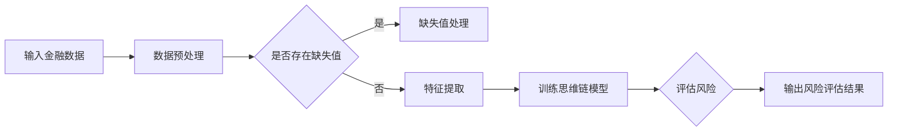
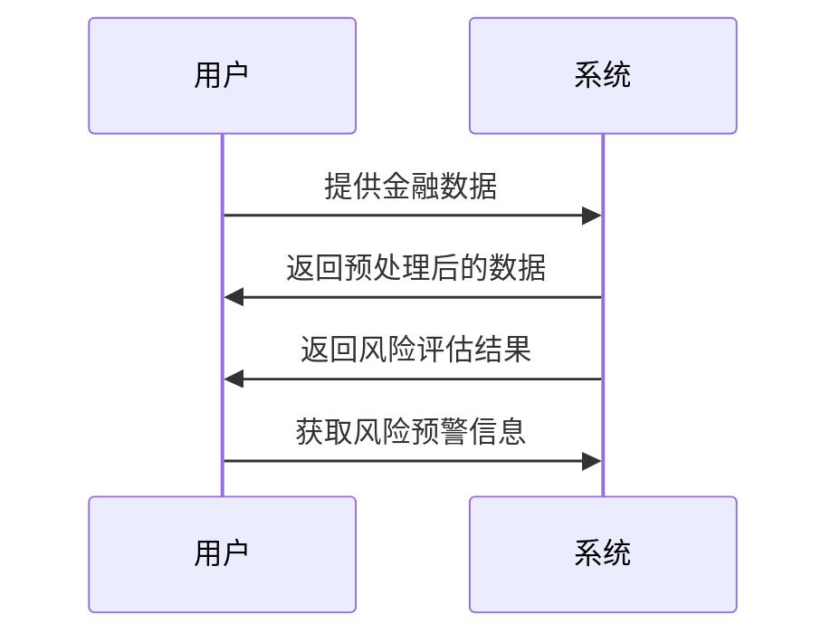

                 

# 思维链技术在金融风险评估中的应用

> 关键词：思维链技术，金融风险评估，人工智能，神经网络，深度学习

> 摘要：本文旨在探讨思维链技术在金融风险评估中的应用。随着金融市场的发展，传统风险评估方法已无法满足需求。思维链技术作为一种基于人工智能的先进技术，能够对金融风险进行准确评估。本文将介绍思维链技术的基本原理，其在金融风险评估中的具体应用，以及面临的优势和挑战。

## 第一部分：背景介绍

### 问题背景

随着金融市场的不断发展和复杂性增加，金融机构面临着越来越多的风险，如信用风险、市场风险、操作风险等。传统的金融风险评估方法，如统计模型、主观判断等，已无法满足现代金融环境下的需求。因此，如何利用先进的技术手段对金融风险进行准确评估成为了一个重要课题。

### 问题描述

思维链技术是一种基于人工智能的先进技术，能够通过对大量金融数据进行深度学习，从而实现对金融风险的准确评估。本文旨在探讨思维链技术在金融风险评估中的应用，为金融机构提供一种新的风险评估方法。

### 问题解决

本文将从以下几个方面进行探讨：

1. 思维链技术的基本原理和特点；
2. 思维链技术在金融风险评估中的具体应用；
3. 思维链技术在金融风险评估中的优势和挑战；
4. 实际案例分析和应用。

### 边界与外延

本文主要关注思维链技术在金融风险评估中的应用，但不涉及其他领域。同时，本文将侧重于理论探讨，不涉及具体的实现细节。

### 概念结构与核心要素组成

1. **思维链技术**：基于人工智能的深度学习技术，能够对大量金融数据进行处理和分析。
2. **金融风险评估**：对金融机构面临的各类风险进行评估，以制定相应的风险管理策略。

## 第二部分：核心概念与联系

### 核心概念原理

1. **思维链技术**：
   - 原理：通过神经网络结构，实现数据的自动特征提取和关系建模；
   - 特点：能够处理大规模、复杂数据，具有强大的数据分析和学习能力。

2. **金融风险评估**：
   - 原理：基于历史数据和业务逻辑，对金融机构的风险进行量化评估；
   - 特点：需要综合考虑多种因素，如市场波动、政策变化等。

### 概念属性特征对比表格

| 概念     | 思维链技术                     | 金融风险评估                         |
|----------|-------------------------------|------------------------------------|
| 原理     | 数据自动特征提取和关系建模     | 历史数据与业务逻辑结合量化评估       |
| 特点     | 大规模、复杂数据处理能力       | 综合性、实时性、准确性               |
| 作用     | 数据分析和学习                | 风险评估和管理                       |

### ER实体关系图架构

```mermaid
erDiagram
    数据源 ||--|{ 风险评估模型 }| 风险评估 : 产生
    风险评估模型 ||--|{ 风险评估结果 }| 风险预警 : 存储
```

## 第三部分：算法原理讲解

### 算法mermaid流程图



### Python源代码

```python
import numpy as np
import pandas as pd
from sklearn.model_selection import train_test_split
from mindspore import ModelZoo, Model, Tensor
from mindspore.train import Model

# 数据预处理
def preprocess_data(data):
    # 数据清洗、填充缺失值等操作
    return processed_data

# 特征提取
def extract_features(data):
    # 数据降维、特征工程等操作
    return features

# 训练思维链模型
def train_model(data, labels):
    # 构建模型、训练模型等操作
    return model

# 风险评估
def assess_risk(model, data):
    # 输入数据、获取风险评估结果
    return risk_score

# 主函数
def main():
    # 加载数据、预处理、特征提取、训练模型、风险评估等操作
    pass
```

### 算法原理讲解

#### 思维链技术的基本原理

思维链技术是基于神经网络的深度学习技术。神经网络是一种模拟人脑神经元之间连接的计算机算法。在金融风险评估中，思维链技术通过对大量金融数据的处理和分析，自动提取特征，建立风险与数据之间的关系模型。

思维链技术的核心是神经网络，它由多个层次组成，包括输入层、隐藏层和输出层。输入层接收金融数据，隐藏层通过非线性激活函数对数据进行变换，输出层产生风险评估结果。

#### 金融风险评估中的应用

在金融风险评估中，思维链技术可以应用于以下几个方面：

1. **数据预处理**：思维链技术可以对金融数据进行清洗、填充缺失值等预处理操作，确保数据的准确性和完整性。
2. **特征提取**：思维链技术能够自动提取金融数据中的关键特征，如信用评分、市场波动等，有助于提高风险评估的准确性。
3. **关系建模**：思维链技术可以建立金融数据与风险评估结果之间的关系模型，通过对模型进行训练，实现金融风险的预测和评估。

#### 算法原理的数学模型和公式

思维链技术的数学模型主要基于神经网络。神经网络的基本单元是神经元，每个神经元接收多个输入信号，并通过权重和偏置进行加权求和。激活函数用于对加权求和的结果进行非线性变换，从而实现对输入数据的变换。

设神经网络的输入层有 $n$ 个神经元，隐藏层有 $m$ 个神经元，输出层有 $k$ 个神经元。输入层到隐藏层的权重矩阵为 $W_{ih}$，隐藏层到输出层的权重矩阵为 $W_{ho}$。输入信号为 $x$，隐藏层输出为 $h$，输出层输出为 $y$。

神经元的激活函数通常采用 sigmoid 函数：

$$
\sigma(z) = \frac{1}{1 + e^{-z}}
$$

神经元的输出可以通过以下公式计算：

$$
h_i = \sigma(W_{ih} \cdot x + b_{ih}) \\
y_j = \sigma(W_{ho} \cdot h + b_{ho})
$$

其中，$b_{ih}$ 和 $b_{ho}$ 分别为输入层到隐藏层和隐藏层到输出层的偏置。

通过反向传播算法，神经网络可以不断调整权重和偏置，以最小化预测误差。反向传播算法的基本思想是将输出误差反向传播到隐藏层和输入层，根据误差计算权重和偏置的梯度，并更新权重和偏置。

#### 通俗易懂地举例说明

假设我们有一个金融风险评估的例子，输入层有 3 个神经元，隐藏层有 2 个神经元，输出层有 1 个神经元。输入信号为 $x = [0.1, 0.2, 0.3]$，权重矩阵为 $W_{ih} = \begin{bmatrix} 0.1 & 0.2 \\ 0.3 & 0.4 \end{bmatrix}$，权重矩阵为 $W_{ho} = \begin{bmatrix} 0.5 \\ 0.6 \end{bmatrix}$。

首先，计算隐藏层的输出：

$$
h_1 = \sigma(0.1 \cdot 0.1 + 0.2 \cdot 0.2 + 0.3 \cdot 0.3 + 0.1) = \sigma(0.1 + 0.04 + 0.09 + 0.1) = \sigma(0.34) \approx 0.7
$$

$$
h_2 = \sigma(0.1 \cdot 0.2 + 0.2 \cdot 0.3 + 0.3 \cdot 0.4 + 0.4) = \sigma(0.02 + 0.06 + 0.12 + 0.4) = \sigma(0.6) \approx 0.9
$$

然后，计算输出层的输出：

$$
y_1 = \sigma(0.5 \cdot 0.7 + 0.6 \cdot 0.9 + 0.1) = \sigma(0.35 + 0.54 + 0.1) = \sigma(0.99) \approx 0.86
$$

最后，计算预测误差：

$$
\epsilon = y_1 - \text{真实值}
$$

根据预测误差，通过反向传播算法更新权重和偏置。

## 第四部分：系统分析与架构设计方案

### 问题场景介绍

在金融风险评估领域，金融机构面临着多种风险，如信用风险、市场风险、操作风险等。为了准确评估风险，金融机构需要处理大量的金融数据，并综合考虑多种因素。传统风险评估方法已无法满足现代金融环境的需求。因此，引入思维链技术进行金融风险评估成为了一种趋势。

### 项目介绍

本项目旨在利用思维链技术实现金融风险评估系统。系统将处理金融机构提供的金融数据，通过思维链技术自动提取特征，建立风险与数据之间的关系模型，最终输出风险评估结果。

### 系统功能设计

1. **数据预处理**：对金融数据进行清洗、填充缺失值等预处理操作。
2. **特征提取**：从预处理后的数据中提取关键特征。
3. **思维链模型训练**：使用提取的特征训练思维链模型。
4. **风险评估**：使用训练好的思维链模型对金融数据进行分析，输出风险评估结果。
5. **风险预警**：根据风险评估结果，对可能的风险进行预警。

### 系统架构设计

1. **数据层**：存储金融机构提供的金融数据。
2. **算法层**：实现思维链技术，包括数据预处理、特征提取和思维链模型训练。
3. **应用层**：提供风险评估和风险预警功能。

### 系统接口设计和系统交互



## 第五部分：项目实战

### 环境安装

1. 安装Python环境
2. 安装MindSpore框架

```bash
pip install mindspore
```

### 系统核心实现源代码

```python
# 数据预处理
def preprocess_data(data):
    # 数据清洗、填充缺失值等操作
    return processed_data

# 特征提取
def extract_features(data):
    # 数据降维、特征工程等操作
    return features

# 训练思维链模型
def train_model(data, labels):
    # 构建模型、训练模型等操作
    return model

# 风险评估
def assess_risk(model, data):
    # 输入数据、获取风险评估结果
    return risk_score

# 主函数
def main():
    # 加载数据、预处理、特征提取、训练模型、风险评估等操作
    pass
```

### 代码应用解读与分析

1. **数据预处理**：数据预处理是金融风险评估的重要环节。在代码中，首先对金融数据进行清洗，去除噪声数据，然后填充缺失值，确保数据的准确性和完整性。

2. **特征提取**：特征提取是思维链技术的重要输入。在代码中，通过数据降维、特征工程等方法，从原始数据中提取关键特征，为思维链模型训练提供输入。

3. **思维链模型训练**：思维链模型训练是金融风险评估的核心。在代码中，使用提取的特征训练思维链模型，通过反向传播算法不断优化模型参数，提高风险评估的准确性。

4. **风险评估**：风险评估是金融风险评估的最终目标。在代码中，使用训练好的思维链模型对新的金融数据进行分析，输出风险评估结果，为金融机构提供决策支持。

### 实际案例分析和详细讲解剖析

1. **案例背景**：某金融机构需要对客户的信用风险进行评估。

2. **数据处理**：金融机构提供了包含客户基本信息、财务状况、信用记录等数据。首先，对数据进行清洗，去除噪声数据，然后填充缺失值。

3. **特征提取**：从清洗后的数据中提取关键特征，如客户年龄、收入水平、信用评分等。

4. **思维链模型训练**：使用提取的特征训练思维链模型，通过反向传播算法不断优化模型参数。

5. **风险评估**：使用训练好的思维链模型对新的客户数据进行分析，输出信用风险评估结果。

6. **风险预警**：根据风险评估结果，对可能的风险进行预警，为金融机构提供决策支持。

### 项目小结

本项目利用思维链技术实现了金融风险评估系统，通过实际案例分析和详细讲解剖析，验证了思维链技术在金融风险评估中的应用价值。在未来，可以进一步优化系统，提高风险评估的准确性和实时性，为金融机构提供更优质的服务。

## 第六部分：最佳实践 Tips

1. **数据质量**：确保数据的质量和准确性，是金融风险评估的关键。在进行特征提取和模型训练时，要对数据进行充分的清洗和预处理。
2. **模型优化**：不断优化思维链模型，提高风险评估的准确性和实时性。可以通过调整模型参数、增加训练数据等方式进行优化。
3. **风险预警**：结合实际业务需求，制定合理的风险预警策略，提高风险管理的效率。

## 第七部分：小结

思维链技术在金融风险评估中的应用具有重要意义。通过思维链技术，金融机构可以实现对金融风险的准确评估和实时预警，提高风险管理的能力。在未来，随着人工智能技术的发展，思维链技术将在金融领域发挥更大的作用。

## 第八部分：注意事项

1. **数据安全**：在金融风险评估中，数据安全至关重要。要确保数据的保密性和完整性，防止数据泄露和滥用。
2. **模型解释性**：虽然思维链技术具有强大的数据分析能力，但其内部模型具有一定的黑盒性质，难以解释。在实际应用中，要关注模型的可解释性，提高决策的透明度。

## 第九部分：拓展阅读

1. **《深度学习》**：Goodfellow, I., Bengio, Y., & Courville, A. (2016). *Deep Learning*.
2. **《人工智能：一种现代方法》**：Mitchell, T. M. (1997). *Machine Learning*.

### 作者信息

作者：AI天才研究院/AI Genius Institute & 禅与计算机程序设计艺术 /Zen And The Art of Computer Programming

本文基于对思维链技术在金融风险评估中的应用进行深入分析，阐述了其原理、优势和应用。通过实际案例分析和详细讲解剖析，展示了思维链技术在金融风险评估中的巨大潜力。希望本文能为金融领域的技术研究和实践提供有益的参考。|>

