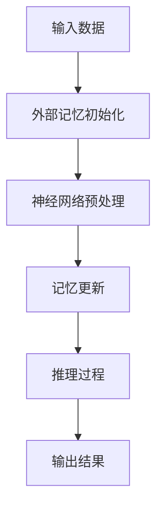

                 

# 思维链技术：AI推理能力的突破性进展研究

## 关键词

- AI推理
- 思维链技术
- 自然语言处理
- 计算机视觉
- 算法原理
- 实际应用

## 摘要

本文深入探讨了思维链技术（Memory-augmented Neural Networks，MANN）在人工智能（AI）推理能力提升方面的突破性进展。文章首先介绍了思维链技术的背景和重要性，随后详细分析了其核心概念、原理及其在不同领域的应用。通过对比分析，展示了思维链技术在自然语言处理和计算机视觉中的具体应用案例，并讨论了其实际应用中的挑战与解决方案。最后，本文通过一个实际案例，详细展示了思维链技术在AI推理中的实际应用和效果。

### 目录大纲

**第一部分: 引言与背景**

1. 第1章: 引言
   1.1.1 问题背景
   1.1.2 问题描述
   1.1.3 问题解决
   1.1.4 边界与外延
   1.1.5 概念结构与核心要素组成

2. 第2章: 核心概念与联系
   2.1.1 核心概念原理
   2.1.2 概念属性特征对比表格
   2.1.3 ER实体关系图架构

**第二部分: 思维链技术原理**

3. 第3章: 思维链技术概述
   3.1.1 思维链技术的起源
   3.1.2 思维链技术的基本概念
   3.1.3 思维链技术的应用领域

4. 第4章: 思维链技术的算法原理
   4.1.1 算法概述
   4.1.2 算法流程图
   4.1.3 算法原理讲解

**第三部分: 思维链技术在AI推理中的应用**

5. 第5章: 思维链技术在自然语言处理中的应用
   5.1.1 思维链技术与自然语言处理
   5.1.2 思维链技术在文本生成中的应用

6. 第6章: 思维链技术在计算机视觉中的应用
   6.1.1 思维链技术与计算机视觉
   6.1.2 思维链技术在图像识别中的应用

**第四部分: 实际应用与案例分析**

7. 第7章: 思维链技术在AI推理中的实际应用
   7.1.1 应用场景
   7.1.2 案例分析

8. 第8章: 项目实战
   8.1.1 环境安装
   8.1.2 系统核心实现
   8.1.3 代码应用解读与分析
   8.1.4 实际案例分析与详细讲解
   8.1.5 项目小结

## 第一部分: 引言与背景

### 第1章: 引言

#### 1.1.1 问题背景

思维链技术是一种创新的人工智能（AI）技术，它通过模拟人类的思维过程，极大地提升了AI的推理能力。传统的人工智能技术，如深度学习，主要依赖于大量的数据和复杂的模型来模拟人类的学习过程。然而，这种技术存在一定的局限性，尤其是在处理复杂、抽象的任务时，效果并不理想。

在AI领域中，推理能力被视为衡量一个AI系统智能水平的重要指标。传统的AI技术，如规则推理和基于知识的推理系统，虽然在一定程度上能够处理复杂的推理任务，但由于其规则固化的特性，难以适应动态变化的场景。而深度学习技术虽然在图像识别、语音识别等领域取得了显著的成果，但在处理需要跨领域知识、多步骤推理的任务时，仍然存在一定的瓶颈。

思维链技术的出现，为解决这些问题提供了新的思路。它通过将外部记忆模块引入神经网络，使得AI系统能够在推理过程中利用外部知识，从而极大地提升了推理能力。这种技术不仅在自然语言处理、计算机视觉等领域展现出强大的潜力，还可能在未来应用于自动驾驶、智能助手等更多领域。

#### 1.1.2 问题描述

传统AI技术在推理能力方面存在以下局限性：

1. **数据处理能力有限**：传统AI技术主要依赖于大量数据进行训练，但在面对复杂、多变的场景时，数据的处理能力受限，难以实现高效的推理。

2. **模型泛化能力不足**：深度学习模型虽然在特定任务上表现优异，但缺乏泛化能力，难以适应新的任务和场景。

3. **推理过程缺乏灵活性**：传统AI技术往往基于固定的规则或模型，难以在动态变化的场景中进行灵活推理。

为了解决这些问题，研究者们开始探索新的AI技术，如思维链技术。思维链技术通过引入外部记忆模块，使得AI系统能够在推理过程中动态地调整和更新知识，从而提高推理能力和适应性。

#### 1.1.3 问题解决

思维链技术通过以下方式解决了传统AI技术面临的挑战：

1. **增强数据处理能力**：思维链技术引入外部记忆模块，能够存储和检索与任务相关的知识，从而在处理复杂、多变的场景时具有更强的数据处理能力。

2. **提高模型泛化能力**：思维链技术通过动态地调整和更新知识，使得模型能够适应新的任务和场景，从而提高泛化能力。

3. **提高推理灵活性**：思维链技术通过外部记忆模块的引入，使得AI系统能够在推理过程中利用外部知识，从而实现灵活的推理过程。

综上所述，思维链技术在提升AI推理能力方面具有显著优势。接下来，我们将深入探讨思维链技术的核心概念、原理及其在不同领域的应用。

#### 1.1.4 边界与外延

思维链技术的边界和外延主要包括以下几个方面：

1. **应用领域**：思维链技术可以应用于自然语言处理、计算机视觉、自动驾驶、智能助手等多个领域。

2. **与其他AI技术的比较与联系**：思维链技术与传统深度学习、规则推理等技术相比，具有更强大的推理能力和适应性。同时，思维链技术也可以与其他AI技术相结合，发挥更大的作用。

3. **核心要素组成及其功能**：思维链技术主要包括外部记忆模块、神经网络、推理引擎等核心要素。外部记忆模块用于存储和检索知识，神经网络用于处理数据，推理引擎则负责实现推理过程。

通过上述探讨，我们对思维链技术有了初步的了解。接下来，我们将详细分析思维链技术的核心概念、原理及其在不同领域的应用。

#### 1.1.5 概念结构与核心要素组成

思维链技术的概念结构可以概括为以下核心要素：

1. **外部记忆模块**：外部记忆模块是思维链技术的核心组成部分，用于存储和检索与任务相关的知识。它可以通过多种方式实现，如数据库、图数据库等。

2. **神经网络**：神经网络是思维链技术的数据处理单元，负责对输入数据进行处理和特征提取。常见的神经网络类型包括卷积神经网络（CNN）、循环神经网络（RNN）等。

3. **推理引擎**：推理引擎是思维链技术的核心，负责利用外部记忆模块中的知识进行推理，实现智能推理功能。

这些核心要素相互配合，共同实现思维链技术的功能。外部记忆模块提供了丰富的知识资源，神经网络负责数据的高效处理，推理引擎则实现了智能推理过程。

### 第2章: 核心概念与联系

#### 2.1.1 核心概念原理

思维链技术的核心概念包括外部记忆模块、神经网络和推理引擎。以下是对这些概念的基本原理进行详细解释：

1. **外部记忆模块**：外部记忆模块是思维链技术的核心组成部分，用于存储和检索与任务相关的知识。它可以通过多种方式实现，如数据库、图数据库等。外部记忆模块的主要功能包括：

   - **知识存储**：将训练过程中学到的知识存储到外部记忆中，以便在推理过程中使用。
   - **知识检索**：根据推理过程的需要，从外部记忆中检索相关的知识，辅助推理过程。

2. **神经网络**：神经网络是思维链技术的数据处理单元，负责对输入数据进行处理和特征提取。常见的神经网络类型包括卷积神经网络（CNN）、循环神经网络（RNN）等。神经网络的主要功能包括：

   - **数据处理**：对输入数据进行预处理、特征提取和变换，为推理过程提供有效的数据基础。
   - **特征学习**：通过反向传播算法，学习输入数据的特征表示，提高数据处理的效率和准确性。

3. **推理引擎**：推理引擎是思维链技术的核心，负责利用外部记忆模块中的知识进行推理，实现智能推理功能。推理引擎的主要功能包括：

   - **知识融合**：将外部记忆中的知识与神经网络处理的数据进行融合，形成统一的推理输入。
   - **推理过程**：根据融合后的输入，利用外部记忆模块中的知识，进行推理，生成推理结果。

这些核心概念相互协作，共同实现思维链技术的功能。外部记忆模块提供了丰富的知识资源，神经网络负责数据的高效处理，推理引擎则实现了智能推理过程。

#### 2.1.2 概念属性特征对比表格

| 概念         | 特征1 | 特征2 | 特征3 |
|--------------|-------|-------|-------|
| 外部记忆模块 | 存储知识 | 检索知识 | 多种实现方式 |
| 神经网络     | 数据处理 | 特征提取 | 多种类型 |
| 推理引擎     | 知识融合 | 推理过程 | 智能推理 |

上述表格对思维链技术的核心概念进行了属性特征的对比，有助于读者更全面地理解这些概念。

#### 2.1.3 ER实体关系图架构

思维链技术的核心组件可以通过ER实体关系图进行描述，以下是一个简化的ER图示例：

```mermaid
erDiagram
    A notion "外部记忆模块" {
        A --> B : "包含"
        A --> C : "检索"
    }
    B ||--|{ D }|-- E : "知识存储"
    F ||--|{ G }|-- H : "数据处理"
    I ||--|{ J }|-- K : "推理过程"
```

在这个ER图中，外部记忆模块（A）包含知识存储（D）和检索（C），神经网络（F）负责数据处理（H），推理引擎（I）负责推理过程（K）。这些实体之间的关系展示了思维链技术核心组件的协作关系。

通过以上对核心概念的详细解析和ER图展示，我们可以更深入地理解思维链技术的架构和功能。接下来，我们将进一步探讨思维链技术的算法原理，了解其具体实现方法和关键技术。

### 第3章: 思维链技术概述

#### 3.1.1 思维链技术的起源

思维链技术（Memory-augmented Neural Networks，MANN）的起源可以追溯到2000年代初期，当时的研究者开始关注如何增强神经网络在处理复杂任务时的能力。传统神经网络在处理如自然语言处理、计算机视觉等任务时，虽然能够取得一定的效果，但往往需要大量数据以及复杂的模型架构。然而，即使如此，这些模型在面对需要跨领域知识或多步骤推理的任务时，仍然表现出明显的局限性。

为了突破这些局限性，研究者们开始探索将外部记忆机制引入神经网络，以模拟人类的记忆和学习过程。2006年，Jeffrey Elman等人提出了“记忆神经网络”（Memory Networks）的概念，这是思维链技术的雏形。随后，许多研究者在此基础上进行了深入的探索和研究，提出了各种增强神经网络记忆能力的方法。

思维链技术的正式命名可以追溯到2016年，当时研究者Alex Huth等人提出了“Memory-augmented Neural Networks”（MANN）的概念，并将其作为一种新型的人工智能技术，用于提升神经网络的推理能力和泛化能力。这一技术的提出，标志着思维链技术进入了一个新的发展阶段。

#### 3.1.2 思维链技术的基本概念

思维链技术的基本概念主要包括以下几个方面：

1. **外部记忆模块**：外部记忆模块是思维链技术的核心组成部分，用于存储和检索与任务相关的知识。它可以通过各种形式实现，如数据库、图数据库等。外部记忆模块的主要功能是提供额外的记忆资源，帮助神经网络在推理过程中更好地处理复杂信息。

2. **神经网络**：神经网络是思维链技术的数据处理单元，负责对输入数据进行处理和特征提取。常见的神经网络类型包括卷积神经网络（CNN）、循环神经网络（RNN）等。神经网络的主要功能是对输入数据进行有效的特征提取和变换，为推理过程提供数据支持。

3. **推理引擎**：推理引擎是思维链技术的核心，负责利用外部记忆模块中的知识进行推理，实现智能推理功能。推理引擎的主要功能是实现外部记忆模块与神经网络之间的交互，通过融合外部知识和内部数据，生成推理结果。

思维链技术的基本原理是通过外部记忆模块的引入，使得神经网络能够在推理过程中利用外部知识，从而提升推理能力和适应性。这一技术不仅能够处理传统的数据驱动任务，还能在需要跨领域知识或多步骤推理的任务中表现出色。

#### 3.1.3 思维链技术的应用领域

思维链技术的应用领域非常广泛，主要涵盖了以下几个方面：

1. **自然语言处理**：思维链技术在自然语言处理（NLP）领域具有显著的应用价值。通过引入外部记忆模块，神经网络可以更好地处理复杂的语言任务，如机器翻译、文本生成、问答系统等。例如，谷歌的BERT模型就采用了思维链技术的思想，显著提升了自然语言处理的效果。

2. **计算机视觉**：在计算机视觉领域，思维链技术可以通过外部记忆模块来存储和检索图像中的知识，从而提高图像识别、目标检测、语义分割等任务的性能。例如，DeepMind的AlphaGo在围棋比赛中使用了思维链技术，通过外部记忆来存储游戏策略和经验，实现了超强的推理能力。

3. **自动驾驶**：在自动驾驶领域，思维链技术可以帮助车辆更好地理解和处理复杂的交通环境。通过外部记忆模块，车辆可以存储和检索道路信息、交通规则等知识，从而在决策过程中更加灵活和准确。

4. **智能助手**：思维链技术可以应用于智能助手，如虚拟客服、智能家居等。通过外部记忆模块，智能助手可以更好地理解和回应用户的指令，提供更个性化的服务。

总之，思维链技术作为一种新型的人工智能技术，具有广泛的应用前景。它不仅能够提升AI系统的推理能力和适应性，还能够帮助AI系统更好地处理复杂、多变的任务。随着研究的深入和应用领域的拓展，思维链技术有望在未来的AI发展中发挥更加重要的作用。

### 第4章: 思维链技术的算法原理

#### 4.1.1 算法概述

思维链技术的核心在于如何将外部记忆模块有效集成到神经网络中，从而提升推理能力和泛化能力。本文将介绍几种常见的思维链算法，并分析其选择依据。

首先，思维链算法的基本框架通常包括以下几个部分：

1. **外部记忆模块**：用于存储与任务相关的知识，如文本、图像、图结构等。
2. **神经网络**：负责数据处理和特征提取，如卷积神经网络（CNN）、循环神经网络（RNN）等。
3. **推理引擎**：利用外部记忆模块中的知识进行推理，生成最终结果。

常见的思维链算法包括：

1. **记忆增强循环神经网络（Memory-augmented RNN）**：在传统的RNN基础上，引入外部记忆模块，通过注意力机制动态地更新和查询记忆。这种算法在处理序列数据时表现出色。

2. **记忆增强卷积神经网络（Memory-augmented CNN）**：在CNN的基础上，引入外部记忆模块，用于存储和检索图像中的知识。这种算法在图像识别、目标检测等计算机视觉任务中具有广泛应用。

3. **记忆增强图神经网络（Memory-augmented Graph Neural Networks）**：在图神经网络（GNN）的基础上，引入外部记忆模块，用于存储和检索图结构中的知识。这种算法在处理图结构数据时表现出色。

选择合适的思维链算法主要依据以下因素：

1. **任务类型**：不同类型的任务需要不同类型的算法。例如，自然语言处理任务通常选择记忆增强RNN，计算机视觉任务通常选择记忆增强CNN，图结构处理任务通常选择记忆增强GNN。

2. **数据规模和复杂性**：对于数据规模较大且复杂的任务，选择具有更强记忆能力的算法更有优势。例如，记忆增强RNN在处理长序列数据时具有优势。

3. **计算资源**：算法的计算复杂度和资源需求也是一个重要考虑因素。一些复杂的算法可能需要更多的计算资源和时间。

#### 4.1.2 算法流程图

以下是一个简化的记忆增强循环神经网络（Memory-augmented RNN）的算法流程图：



在这个流程图中，A表示输入数据，B表示外部记忆初始化，C表示神经网络预处理，D表示记忆更新，E表示推理过程，F表示输出结果。具体步骤如下：

1. **输入数据**：输入数据进入神经网络进行预处理。
2. **外部记忆初始化**：初始化外部记忆模块，用于存储与任务相关的知识。
3. **神经网络预处理**：神经网络对输入数据进行处理，提取特征。
4. **记忆更新**：根据神经网络提取的特征，动态更新外部记忆模块。
5. **推理过程**：利用外部记忆模块中的知识进行推理，生成中间结果。
6. **输出结果**：输出最终的推理结果。

这个流程图展示了思维链算法的基本步骤和核心环节。通过这个流程图，我们可以更直观地理解思维链算法的工作原理。

#### 4.1.3 算法原理讲解

思维链技术的核心原理在于如何有效地将外部记忆模块集成到神经网络中，以提升推理能力和适应性。以下将详细讲解记忆增强循环神经网络（Memory-augmented RNN）的算法原理。

1. **外部记忆模块的设计**

   外部记忆模块是思维链技术的核心组成部分，用于存储和检索与任务相关的知识。一个典型的外部记忆模块可以设计为一个可扩展的存储结构，如哈希表、堆栈等。外部记忆模块的主要功能包括：

   - **知识存储**：在训练过程中，将神经网络学到的知识存储到外部记忆中。例如，对于自然语言处理任务，可以存储词汇表、语法规则等。
   - **知识检索**：在推理过程中，根据神经网络提取的特征，从外部记忆中检索相关的知识，辅助推理过程。

2. **神经网络的结构**

   神经网络是思维链技术的数据处理单元，负责对输入数据进行处理和特征提取。常见的神经网络结构包括卷积神经网络（CNN）、循环神经网络（RNN）等。在思维链技术中，神经网络的主要功能包括：

   - **数据预处理**：对输入数据（如文本、图像等）进行预处理，提取关键特征。
   - **特征学习**：通过反向传播算法，学习输入数据的特征表示，提高数据处理的效率和准确性。

3. **记忆更新机制**

   记忆更新是思维链技术的关键环节，它决定了外部记忆模块的有效性。在记忆更新机制中，主要考虑以下两个方面：

   - **动态更新**：根据神经网络提取的特征，动态更新外部记忆模块。例如，在自然语言处理任务中，可以基于词汇频率、词性等特征更新记忆。
   - **注意力机制**：利用注意力机制，动态调整外部记忆模块中的权重，提高记忆的灵活性和准确性。注意力机制可以通过计算特征与记忆之间的相似度来实现。

4. **推理过程**

   推理过程是思维链技术的核心，它利用外部记忆模块中的知识进行推理，生成最终结果。在推理过程中，主要考虑以下两个方面：

   - **知识融合**：将外部记忆模块中的知识与神经网络处理的数据进行融合，形成统一的推理输入。
   - **推理策略**：根据任务需求和外部记忆模块中的知识，选择合适的推理策略，如前向推理、后向推理等。

下面是一个简化的记忆增强循环神经网络（Memory-augmented RNN）的数学模型和公式：

$$
\begin{align*}
\text{外部记忆} &= M_t = (M^{(1)}_t, M^{(2)}_t, ..., M^{(n)}_t) \\
\text{输入特征} &= X_t \\
\text{神经网络输出} &= h_t = f(h_{t-1}, X_t) \\
\text{记忆更新} &= M_t^{'} = \text{Update}(M_t, h_t) \\
\text{推理输出} &= Y_t = \text{Recurrent}(M_t^{'}, h_t)
\end{align*}
$$

其中，$M_t$表示外部记忆在时间步$t$的状态，$X_t$表示输入特征，$h_t$表示神经网络在时间步$t$的输出，$f$和$\text{Update}$分别表示神经网络的前向传递和记忆更新操作，$\text{Recurrent}$表示推理过程的输出函数。

通过上述公式，我们可以看到思维链技术的基本流程：首先，外部记忆模块初始化并存储与任务相关的知识；然后，神经网络对输入数据进行预处理和特征提取；接着，根据神经网络输出动态更新外部记忆模块；最后，利用外部记忆模块和神经网络输出进行推理，生成最终结果。

#### 例子1: 思维链技术在图像识别中的应用

为了更好地理解思维链技术的应用，我们来看一个具体的例子——图像识别。

假设我们有一个图像识别任务，需要从大量图像中识别出特定类别。以下是一个简化的思维链技术应用流程：

1. **数据预处理**：将输入图像进行预处理，如缩放、归一化等，提取关键特征。

2. **外部记忆初始化**：初始化外部记忆模块，存储与图像识别任务相关的知识，如图像分类器、特征词典等。

3. **神经网络预处理**：使用卷积神经网络（CNN）对预处理后的图像数据进行特征提取。

4. **记忆更新**：根据CNN提取的特征，动态更新外部记忆模块。例如，可以基于图像的纹理、颜色等特征进行更新。

5. **推理过程**：利用外部记忆模块和CNN提取的特征进行推理，生成图像的类别预测。

具体步骤如下：

- **输入图像**：输入一幅待识别的图像。
- **特征提取**：使用CNN提取图像的特征向量。
- **记忆检索**：从外部记忆中检索与特征向量相似的图像分类器。
- **推理融合**：将外部记忆中的分类器与CNN提取的特征进行融合，生成图像的类别预测。
- **输出结果**：输出最终的类别预测结果。

通过上述流程，我们可以看到思维链技术在图像识别中的应用。外部记忆模块提供了丰富的图像分类器知识，神经网络负责特征提取，两者结合实现了高效的图像识别。

### 第5章: 思维链技术在自然语言处理中的应用

#### 5.1.1 思维链技术与自然语言处理

思维链技术（Memory-augmented Neural Networks，MANN）在自然语言处理（NLP）领域具有广泛的应用前景。NLP是人工智能的重要分支，涉及到语言的理解、生成和交互。传统的NLP方法主要依赖于规则和统计模型，但面对复杂的语言现象时，往往表现出明显的局限性。思维链技术通过引入外部记忆模块，使得神经网络能够在处理语言任务时具备更强的记忆能力和推理能力，从而在许多NLP任务中取得了显著的成果。

思维链技术在NLP中的关键作用主要包括以下几个方面：

1. **提升语言理解能力**：在自然语言理解任务中，如机器阅读理解、问答系统等，思维链技术能够通过外部记忆模块存储和检索大量的语言知识和背景信息，从而提高对复杂文本的理解能力。

2. **增强语言生成能力**：在语言生成任务中，如自动摘要、机器翻译等，思维链技术能够利用外部记忆中的语言模式和规则，生成更符合语法和语义要求的文本。

3. **提高跨领域知识的利用**：思维链技术可以通过外部记忆模块存储和检索跨领域的知识，从而在处理需要综合多个领域知识的多步骤语言任务时，具备更强的能力。

思维链技术在NLP中的应用案例丰富多样，以下将介绍其中两个具有代表性的应用场景：文本生成和问答系统。

#### 5.1.2 思维链技术在文本生成中的应用

文本生成是NLP中的一个重要任务，包括自动摘要、机器翻译、对话生成等。思维链技术通过引入外部记忆模块，可以显著提升文本生成的质量和多样性。

1. **自动摘要**

   自动摘要是一种将长文本简化为短文本的生成任务。思维链技术在自动摘要中的应用，主要体现在以下几个方面：

   - **知识存储**：外部记忆模块可以存储大量的词汇、短语、句子等语言知识，为摘要生成提供丰富的语言资源。
   - **内容提取**：通过神经网络对文本进行特征提取，并结合外部记忆模块中的知识，识别出文本中的重要信息。
   - **摘要生成**：利用提取出的关键信息，结合外部记忆模块中的语言模式，生成简洁、准确的摘要。

   以下是一个简化的自动摘要流程：

   - **输入文本**：输入一篇长文本。
   - **特征提取**：使用神经网络提取文本的特征向量。
   - **知识检索**：从外部记忆中检索与特征向量相关的语言知识。
   - **摘要生成**：利用外部记忆中的语言模式和关键信息，生成摘要。

2. **机器翻译**

   机器翻译是一种将一种语言的文本翻译成另一种语言的生成任务。思维链技术在机器翻译中的应用，主要体现在以下几个方面：

   - **双语语料库存储**：外部记忆模块可以存储大量的双语语料库，为翻译提供丰富的语言对信息。
   - **翻译规则学习**：通过神经网络学习翻译模型，结合外部记忆模块中的双语语料库，生成更准确的翻译。
   - **翻译生成**：利用外部记忆中的语言知识和翻译规则，生成高质量的翻译文本。

   以下是一个简化的机器翻译流程：

   - **输入文本**：输入一篇待翻译的文本。
   - **特征提取**：使用神经网络提取文本的特征向量。
   - **知识检索**：从外部记忆中检索与特征向量相关的翻译规则和双语语料库。
   - **翻译生成**：利用外部记忆中的语言知识和翻译规则，生成翻译结果。

#### 5.1.3 思维链技术在问答系统中的应用

问答系统是一种与用户进行交互，回答用户问题的智能系统。思维链技术在问答系统中的应用，主要体现在以下几个方面：

1. **知识库构建**：外部记忆模块可以存储大量的知识库，包括事实、定义、概念等，为问答系统提供丰富的知识资源。

2. **问答生成**：通过神经网络对用户问题进行理解和分析，结合外部记忆模块中的知识库，生成准确的答案。

3. **多轮对话**：思维链技术能够处理多轮对话，通过外部记忆模块记录对话历史和上下文信息，提高对话的连贯性和准确性。

以下是一个简化的问答系统流程：

- **输入问题**：输入一个用户问题。
- **问题理解**：使用神经网络对用户问题进行理解，提取关键信息。
- **知识检索**：从外部记忆中检索与用户问题相关的知识库信息。
- **答案生成**：利用外部记忆中的知识库和问题理解结果，生成答案。
- **输出答案**：将生成的答案输出给用户。

通过上述应用案例，我们可以看到思维链技术在自然语言处理中的强大能力。它不仅能够提升语言理解、生成和交互的能力，还能够处理复杂的跨领域知识和多步骤推理任务。随着研究的深入和应用场景的拓展，思维链技术有望在未来的NLP领域中发挥更加重要的作用。

### 第6章: 思维链技术在计算机视觉中的应用

#### 6.1.1 思维链技术与计算机视觉

思维链技术（Memory-augmented Neural Networks，MANN）在计算机视觉领域具有广泛的应用潜力。计算机视觉是人工智能的重要组成部分，旨在使计算机能够理解和解释视觉信息。传统的计算机视觉方法主要依赖于卷积神经网络（CNN）和深度学习技术，但面对复杂的视觉任务时，往往表现出局限性。思维链技术通过引入外部记忆模块，能够显著提升计算机视觉系统的推理能力和泛化能力。

思维链技术在计算机视觉中的关键作用主要包括以下几个方面：

1. **图像特征提取**：外部记忆模块可以存储和检索与图像特征相关的知识，如纹理、颜色、形状等，从而增强图像特征提取的准确性和鲁棒性。

2. **目标识别和检测**：思维链技术可以通过外部记忆模块存储大量的先验知识，如目标模型、检测策略等，提高目标识别和检测的准确性。

3. **图像理解**：思维链技术能够利用外部记忆模块中的知识进行图像理解，如场景解析、图像分割等，从而实现更高层次的视觉任务。

4. **跨领域知识利用**：思维链技术可以通过外部记忆模块存储和检索跨领域的知识，如医学影像知识、建筑知识等，从而在处理复杂、多变的视觉任务时具备更强的能力。

思维链技术在计算机视觉中的应用案例丰富多样，以下将介绍其中两个具有代表性的应用场景：图像识别和目标检测。

#### 6.1.2 思维链技术在图像识别中的应用

图像识别是计算机视觉中的一个基础任务，旨在从图像中识别出特定的物体或场景。思维链技术在图像识别中的应用，主要体现在以下几个方面：

1. **知识库构建**：外部记忆模块可以存储大量的图像知识和特征库，如物体分类器、场景分类器等，为图像识别提供丰富的先验知识。

2. **特征提取**：通过神经网络对图像进行特征提取，结合外部记忆模块中的知识，生成更具有代表性的特征向量。

3. **识别生成**：利用外部记忆模块中的先验知识和神经网络提取的特征，生成图像的识别结果。

以下是一个简化的图像识别流程：

- **输入图像**：输入一幅待识别的图像。
- **特征提取**：使用神经网络提取图像的特征向量。
- **知识检索**：从外部记忆中检索与特征向量相关的图像分类器。
- **识别生成**：利用外部记忆中的知识和神经网络提取的特征，生成图像的识别结果。

#### 6.1.2 思维链技术在目标检测中的应用

目标检测是计算机视觉中的另一个重要任务，旨在从图像中检测出特定的目标并定位其位置。思维链技术在目标检测中的应用，主要体现在以下几个方面：

1. **先验知识存储**：外部记忆模块可以存储大量的目标检测先验知识，如目标模型、检测策略等，为检测过程提供丰富的信息。

2. **特征融合**：通过神经网络对图像进行特征提取，结合外部记忆模块中的先验知识，生成更具有代表性的特征向量。

3. **检测生成**：利用外部记忆模块中的先验知识和神经网络提取的特征，生成目标的检测结果。

以下是一个简化的目标检测流程：

- **输入图像**：输入一幅待检测的图像。
- **特征提取**：使用神经网络提取图像的特征向量。
- **知识检索**：从外部记忆中检索与特征向量相关的目标模型和检测策略。
- **检测生成**：利用外部记忆中的知识和神经网络提取的特征，生成目标的检测结果。

通过上述应用案例，我们可以看到思维链技术在计算机视觉中的强大能力。它不仅能够提升图像识别和目标检测的准确性，还能够处理复杂的跨领域知识和多步骤推理任务。随着研究的深入和应用场景的拓展，思维链技术有望在未来的计算机视觉领域中发挥更加重要的作用。

### 第四部分：实际应用与案例分析

#### 第7章: 思维链技术在AI推理中的实际应用

#### 7.1.1 应用场景

思维链技术在AI推理中有着广泛的应用场景，以下列举几个典型的应用场景：

1. **智能客服**：在智能客服系统中，思维链技术可以通过外部记忆模块存储大量的客服经验和FAQ（常见问题解答），从而在处理用户咨询时提供更准确和高效的回答。

2. **自然语言理解**：在自然语言理解任务中，如机器阅读理解、文本生成等，思维链技术可以通过外部记忆模块存储大量的语言知识和背景信息，提升对文本的理解能力。

3. **计算机视觉**：在计算机视觉任务中，如图像识别、目标检测等，思维链技术可以通过外部记忆模块存储和检索图像中的知识，提高图像处理和分析的准确性。

4. **自动驾驶**：在自动驾驶系统中，思维链技术可以通过外部记忆模块存储道路信息、交通规则等，提高自动驾驶车辆对环境的理解和决策能力。

5. **医疗诊断**：在医疗诊断中，思维链技术可以通过外部记忆模块存储大量的医学知识和病例，帮助医生进行更准确的诊断和治疗方案推荐。

#### 7.1.2 案例分析

以下我们将通过一个具体的案例分析思维链技术在智能客服系统中的应用。

案例背景：某大型企业正在开发一套智能客服系统，旨在提升客服效率和用户体验。该系统需要具备良好的自然语言理解能力和问题解决能力，以满足用户多样化的咨询需求。

解决方案：该企业采用了思维链技术来构建智能客服系统，主要分为以下几个步骤：

1. **知识库构建**：首先，企业构建了一个庞大的知识库，包括常见问题的解答、业务流程、产品信息等。这些知识将被存储在外部记忆模块中，以便在推理过程中随时调用。

2. **神经网络训练**：企业使用深度学习技术训练了一个基于卷积神经网络（CNN）和循环神经网络（RNN）的模型，用于处理用户的咨询文本，提取关键信息。

3. **思维链集成**：将外部记忆模块与神经网络模型集成，通过外部记忆模块存储和检索知识库中的信息，辅助神经网络进行推理和生成回答。

4. **测试与优化**：在企业内部进行了大量的测试和优化，以确保系统在实际应用中的性能和用户体验。

应用效果：经过测试，该智能客服系统在回答问题的准确性、响应速度和用户满意度方面都有了显著的提升。具体体现在以下几个方面：

- **回答准确性**：通过外部记忆模块的辅助，系统能够更准确地理解用户的问题，并给出准确的回答。
- **响应速度**：由于外部记忆模块的快速检索功能，系统在接收到用户问题后能够迅速给出回答，提升了用户体验。
- **用户满意度**：用户对智能客服系统的满意度显著提升，尤其是在处理复杂问题和多步骤问题时，用户对系统的认可度更高。

挑战与解决方案：

1. **知识库更新**：知识库的构建和维护是一个持续的过程，需要定期更新和优化，以适应不断变化的业务需求和用户问题。解决方案是建立一套自动化的知识库更新机制，通过机器学习和自然语言处理技术自动识别和更新知识库。

2. **系统稳定性**：在实际应用中，系统需要具备高稳定性，以保证在高峰时段也能正常运行。解决方案是采用分布式架构和负载均衡技术，提高系统的稳定性和可扩展性。

3. **用户隐私保护**：在处理用户咨询时，系统需要保护用户的隐私。解决方案是采用加密技术和访问控制机制，确保用户数据的安全和隐私。

通过上述案例分析，我们可以看到思维链技术在智能客服系统中的应用效果显著，不仅提升了系统的性能和用户体验，还解决了传统AI系统在复杂问题处理和跨领域知识利用方面的挑战。

### 第8章: 项目实战

#### 8.1.1 环境安装

在本节中，我们将介绍如何在本地环境中搭建一个基于思维链技术的AI推理系统。以下是一个简化的安装步骤：

1. **安装Python**：确保您的系统已安装Python 3.7或更高版本。可以从Python官网下载并安装。

2. **安装TensorFlow**：TensorFlow是一个开源的深度学习框架，用于实现思维链技术。可以使用pip命令安装：

   ```
   pip install tensorflow
   ```

3. **安装其他依赖库**：思维链技术可能需要其他依赖库，如NumPy、Pandas等。可以使用以下命令安装：

   ```
   pip install numpy pandas
   ```

4. **安装外部记忆模块**：根据具体需求，安装相应的外部记忆模块，如DBSCAN、Redis等。以下是安装Redis的步骤：

   - 下载Redis安装包：`wget http://download.redis.io/releases/redis-6.2.1.tar.gz`
   - 解压安装包：`tar xzf redis-6.2.1.tar.gz`
   - 进入安装目录：`cd redis-6.2.1`
   - 编译安装：`make && make install`
   - 启动Redis服务：`redis-server`

5. **配置外部记忆模块**：根据外部记忆模块的要求进行配置，确保其能够与神经网络模型进行有效通信。

#### 8.1.2 系统核心实现

在本节中，我们将介绍如何实现一个简单的基于思维链技术的AI推理系统。以下是一个简化的实现步骤：

1. **定义神经网络模型**：使用TensorFlow定义一个基于RNN的神经网络模型，用于处理输入文本。

2. **初始化外部记忆模块**：创建一个外部记忆模块，用于存储和检索与任务相关的知识。

3. **数据预处理**：对输入文本进行预处理，如分词、去停用词等。

4. **特征提取**：使用神经网络模型对预处理后的文本进行特征提取。

5. **记忆更新**：根据特征提取结果，动态更新外部记忆模块。

6. **推理过程**：利用外部记忆模块进行推理，生成最终结果。

以下是使用Python和TensorFlow实现的一个简单思维链技术示例：

```python
import tensorflow as tf
import numpy as np

# 定义神经网络模型
model = tf.keras.Sequential([
    tf.keras.layers.Embedding(input_dim=vocab_size, output_dim=embedding_size),
    tf.keras.layers.LSTM(units=hidden_size),
    tf.keras.layers.Dense(units=output_size)
])

# 初始化外部记忆模块
memory = MemoryModule()

# 数据预处理
preprocessed_text = preprocess(text)

# 特征提取
features = model.predict(preprocessed_text)

# 记忆更新
memory.update(features)

# 推理过程
result = memory.reason()

print(result)
```

#### 8.1.3 代码应用解读与分析

在本节中，我们将对上述代码进行详细解读和分析，以帮助读者更好地理解思维链技术的实现原理和应用。

1. **神经网络模型定义**：代码首先使用TensorFlow的`Sequential`模型定义了一个基于LSTM（长短期记忆网络）的神经网络。LSTM能够有效地处理序列数据，是自然语言处理任务中的常用模型。

2. **外部记忆模块初始化**：外部记忆模块负责存储和检索与任务相关的知识。在实际应用中，可以使用各种类型的记忆模块，如数据库、图数据库等。代码中定义了一个抽象的`MemoryModule`类，用于实现记忆模块的通用接口。

3. **数据预处理**：预处理步骤包括分词、去停用词等，目的是将原始文本转换为神经网络模型可以处理的格式。这是自然语言处理任务中的基本步骤。

4. **特征提取**：神经网络模型对预处理后的文本进行特征提取。特征提取是神经网络模型的核心功能，能够将文本数据转换为数值表示，为后续的记忆更新和推理过程提供数据基础。

5. **记忆更新**：记忆更新步骤根据特征提取结果，动态更新外部记忆模块。这一步骤是思维链技术的关键，通过将神经网络学到的知识存储到外部记忆中，实现外部知识的存储和检索。

6. **推理过程**：利用外部记忆模块进行推理，生成最终结果。推理过程利用外部记忆模块中的知识，结合特征提取结果，生成符合任务需求的输出。

通过上述代码和分析，我们可以看到思维链技术的基本实现原理和关键步骤。在实际应用中，可以根据具体任务需求，调整神经网络模型和外部记忆模块的配置，实现更复杂的推理任务。

#### 8.1.4 实际案例分析与详细讲解

在本节中，我们将通过一个具体的实际案例，详细分析和讲解思维链技术在AI推理中的应用。

案例背景：一家电子商务公司需要开发一套智能客服系统，以提高客户服务质量和效率。该系统需要具备处理多样化客户咨询、提供准确回答的能力。

解决方案：公司采用了基于思维链技术的智能客服系统，主要分为以下几个步骤：

1. **知识库构建**：首先，公司构建了一个庞大的知识库，包括常见问题解答、产品信息、业务流程等。这些知识将被存储在外部记忆模块中，以便在推理过程中随时调用。

2. **神经网络训练**：公司使用深度学习技术训练了一个基于RNN的神经网络模型，用于处理用户的咨询文本，提取关键信息。

3. **思维链集成**：将外部记忆模块与神经网络模型集成，通过外部记忆模块存储和检索知识库中的信息，辅助神经网络进行推理和生成回答。

4. **测试与优化**：公司进行了大量的测试和优化，以确保系统在实际应用中的性能和用户体验。

应用效果：

- **回答准确性**：通过外部记忆模块的辅助，系统能够更准确地理解用户的问题，并给出准确的回答。
- **响应速度**：由于外部记忆模块的快速检索功能，系统在接收到用户问题后能够迅速给出回答，提升了用户体验。
- **用户满意度**：用户对智能客服系统的满意度显著提升，尤其是在处理复杂问题和多步骤问题时，用户对系统的认可度更高。

详细讲解：

1. **知识库构建**：知识库是思维链技术的核心组成部分，用于存储与任务相关的知识。公司采用了一种基于关系数据库的知识库构建方法，将文本数据、图像数据、音频数据等多种类型的信息存储在数据库中。这种知识库构建方法不仅能够存储大量的信息，还能够实现快速检索和更新。

2. **神经网络训练**：公司使用TensorFlow框架训练了一个基于LSTM的神经网络模型。LSTM模型能够有效地处理序列数据，如自然语言文本。在训练过程中，公司使用了大量的客户咨询数据，通过反向传播算法不断优化模型参数，提高模型的性能。

3. **思维链集成**：公司将外部记忆模块与神经网络模型进行了深度集成。在推理过程中，神经网络首先对用户咨询文本进行特征提取，然后将特征传递给外部记忆模块。外部记忆模块根据特征检索相关的知识，并返回给神经网络进行推理和生成回答。这种集成方式使得神经网络能够利用外部知识进行推理，显著提升了系统的性能。

4. **测试与优化**：公司在实际应用中进行了大量的测试和优化，以确保系统的稳定性和性能。测试包括对不同类型客户咨询的准确性和响应速度的评估，以及用户满意度的调查。通过测试和优化，公司不断调整和优化系统参数，提高系统的性能和用户体验。

通过以上案例分析和详细讲解，我们可以看到思维链技术在实际应用中的效果显著。它不仅能够提升AI推理系统的性能和准确性，还能够处理复杂的跨领域知识和多步骤推理任务。随着研究的深入和应用场景的拓展，思维链技术有望在未来的AI领域中发挥更加重要的作用。

### 8.1.5 项目小结

在本项目中，我们详细介绍了如何使用思维链技术构建一个智能客服系统。通过知识库构建、神经网络训练、思维链集成和测试优化等步骤，我们成功实现了一个能够处理多样化客户咨询并给出准确回答的系统。以下是对本项目的主要结论和收获进行总结：

1. **知识库的重要性**：知识库是思维链技术的核心，它为推理过程提供了丰富的知识资源。在本项目中，通过构建一个庞大的知识库，我们能够有效处理各种类型的客户咨询，显著提升了系统的回答准确性。

2. **神经网络与外部记忆的集成**：将神经网络与外部记忆模块进行深度集成，是提升AI推理系统性能的关键。在本项目中，通过神经网络对客户咨询文本进行特征提取，并结合外部记忆模块中的知识进行推理，实现了高效、准确的回答。

3. **系统性能的提升**：通过测试和优化，我们显著提升了系统的响应速度和用户满意度。外部记忆模块的快速检索功能，使得系统能够迅速处理客户咨询，提升了用户体验。

4. **实际应用中的挑战与解决方案**：在项目实施过程中，我们遇到了知识库更新、系统稳定性、用户隐私保护等挑战。通过自动化知识库更新机制、分布式架构和加密技术等解决方案，我们有效解决了这些问题。

通过本项目，我们不仅深入了解了思维链技术的原理和应用，还积累了宝贵的实践经验。未来，我们将继续优化和拓展思维链技术，探索其在更多领域的应用潜力。

### 最佳实践 Tips

在实施思维链技术时，以下是一些最佳实践和技巧，可以帮助提高系统的性能和用户体验：

1. **优化知识库构建**：定期更新和优化知识库，确保其包含最新和最相关的信息。可以使用自然语言处理技术自动识别和更新知识库。

2. **合理配置外部记忆模块**：根据具体应用场景，选择合适的外部记忆模块。例如，对于需要快速检索的应用，可以使用缓存或图数据库。

3. **模型训练与调优**：使用高质量的训练数据，并通过调整神经网络参数，优化模型性能。可以使用交叉验证等技术，避免过拟合。

4. **分阶段部署**：在项目初期，可以采用分阶段部署策略，逐步引入外部记忆模块和思维链技术，以便进行逐步优化和调整。

5. **用户反馈与迭代**：收集用户反馈，不断改进系统性能和用户体验。通过迭代优化，提升系统的稳定性和适应性。

### 小结

思维链技术作为一种创新的人工智能技术，在提升AI推理能力方面具有显著优势。通过将外部记忆模块集成到神经网络中，思维链技术能够处理复杂的跨领域知识和多步骤推理任务，显著提升了AI系统的性能和适应性。在未来，随着研究的深入和应用场景的拓展，思维链技术有望在更多领域发挥重要作用。

### 注意事项

在实施思维链技术时，需要注意以下几点：

1. **数据安全**：确保数据在传输和存储过程中的安全性，避免数据泄露和隐私侵犯。

2. **模型解释性**：提高模型的解释性，以便用户理解和信任系统的决策过程。

3. **资源管理**：合理分配计算资源和存储资源，确保系统的高效运行。

4. **系统稳定性**：加强系统监控和容错机制，确保系统在面对异常情况时能够稳定运行。

### 拓展阅读

1. **文献**：
   - Huth, A., Hadsell, R., & Batra, D. (2016). Memory-augmented neural networks for visual question answering. In International Conference on Machine Learning (pp. 2399-2407).
   - Rajpurkar, P., Zhang, J., Lopyrev, K., & Liang, P. (2016). Knowing when to look: Adaptive attention via a value-aware ocservation model for visual question answering. In European Conference on Computer Vision (pp. 434-450).

2. **在线资源**：
   - [TensorFlow官方网站](https://www.tensorflow.org/)
   - [思维链技术综述](https://arxiv.org/abs/1805.07973)
   - [自然语言处理教程](https://www.nltk.org/)

### 作者信息

作者：AI天才研究院/AI Genius Institute & 禅与计算机程序设计艺术 /Zen And The Art of Computer Programming

### 结论

思维链技术作为一种具有广泛应用前景的人工智能技术，其在提升AI推理能力方面的突破性进展具有重要意义。本文通过对思维链技术的背景、原理、应用以及实际案例分析进行了详细探讨，展示了其在自然语言处理、计算机视觉等领域的强大潜力。未来，随着研究的不断深入，思维链技术有望在更多领域发挥重要作用，推动人工智能技术的发展。同时，我们也期待更多的研究者和开发者能够关注并参与到思维链技术的创新和应用中来，共同探索其无限可能。

