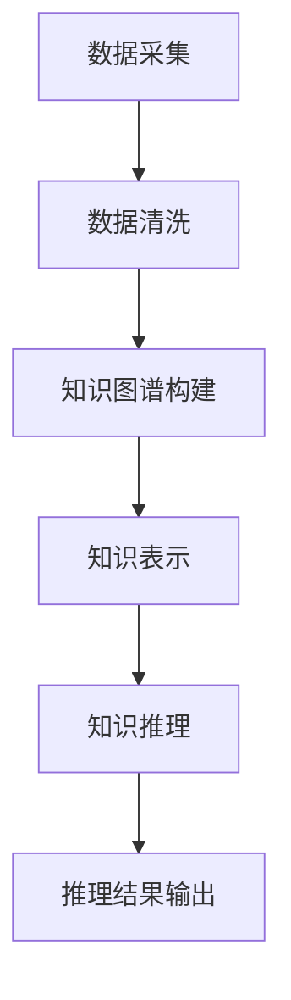
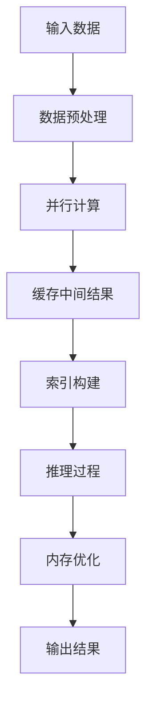
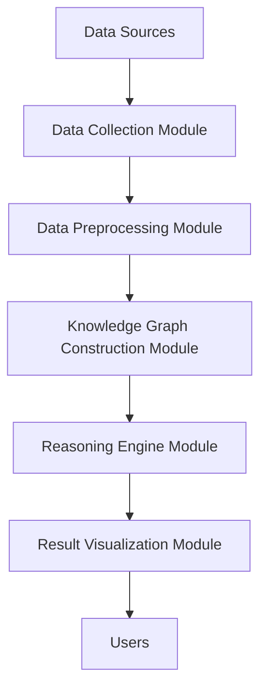
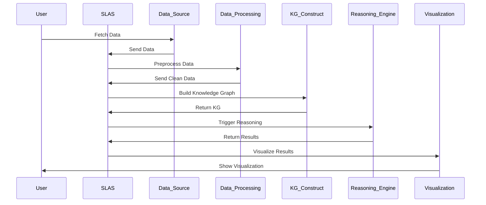

                 

### 1.1 问题背景

人工智能（AI）作为当今科技领域的热点，已经在众多行业产生了深远的影响。然而，尽管AI技术不断进步，逻辑分析能力依然成为其发展的瓶颈。逻辑分析在人工智能中扮演着至关重要的角色，它是人工智能进行推理、决策和问题解决的基础。

逻辑分析能力的定义是指人工智能系统能够理解、表示和应用逻辑规则的能力。它包括推理、证明、演绎、归纳等多个方面，是人工智能智能水平的体现。然而，传统的人工智能系统在逻辑分析方面存在诸多不足和挑战。

首先，传统的人工智能系统在处理复杂逻辑时，往往存在效率低下的问题。这是因为传统方法主要依赖于符号逻辑和规则系统，这些方法在处理复杂的逻辑推理时，需要大量的计算资源，导致系统运行缓慢。

其次，传统方法在处理不确定性和模糊性时，存在很大困难。现实世界中的信息往往是不确定的、模糊的，而传统的人工智能系统难以有效地处理这些信息。

此外，传统的人工智能系统在跨领域推理方面也表现不佳。它们往往只能在一个特定的领域内进行推理，难以实现跨领域的灵活推理。

为了解决这些挑战，思维链技术应运而生。思维链技术是一种基于知识图谱和推理引擎的人工智能技术，它通过建立大规模的知识图谱，实现知识的表示、存储和推理，从而提升人工智能的逻辑分析能力。思维链技术不仅能够提高人工智能系统的推理效率，还能够有效处理不确定性和模糊性，实现跨领域的灵活推理。

因此，思维链技术成为提升人工智能逻辑分析能力的一个新的方向。它通过引入知识图谱和推理引擎，实现了对传统逻辑分析方法的优化和拓展，为人工智能的发展提供了新的思路和方法。

### 1.2 问题描述

#### 1.2.1 逻辑分析能力的定义与重要性

逻辑分析能力是指人工智能系统能够理解、表示和应用逻辑规则的能力。它包括推理、证明、演绎、归纳等多个方面。逻辑分析能力在人工智能中至关重要，它是人工智能进行推理、决策和问题解决的基础。一个优秀的逻辑分析系统能够有效地处理复杂的逻辑问题，提高系统的智能水平。

在人工智能的应用场景中，逻辑分析能力具有非常重要的作用。例如，在自然语言处理中，逻辑分析能够帮助系统理解文本中的逻辑关系，从而实现语义分析和情感分析。在自动驾驶领域，逻辑分析能够帮助系统进行路况分析和决策，提高行驶的安全性。在医疗诊断中，逻辑分析能够帮助系统进行疾病诊断和治疗方案推荐，提高医疗效率。

#### 1.2.2 逻辑分析能力的不足与瓶颈

尽管逻辑分析能力在人工智能中至关重要，但传统的人工智能系统在逻辑分析方面存在诸多不足和瓶颈。

首先，传统方法在处理复杂逻辑时，存在效率低下的问题。传统的人工智能系统主要依赖于符号逻辑和规则系统，这些方法在处理复杂的逻辑推理时，需要大量的计算资源，导致系统运行缓慢。

其次，传统方法在处理不确定性和模糊性时，存在很大困难。现实世界中的信息往往是不确定的、模糊的，而传统的人工智能系统难以有效地处理这些信息。

此外，传统的人工智能系统在跨领域推理方面也表现不佳。它们往往只能在一个特定的领域内进行推理，难以实现跨领域的灵活推理。

这些不足和瓶颈限制了人工智能在复杂任务中的表现，因此，需要新的技术来提升人工智能的逻辑分析能力。

#### 1.2.3 思维链技术的目标

思维链技术作为一种新兴的人工智能技术，旨在解决传统人工智能系统在逻辑分析方面的不足和瓶颈。思维链技术的目标如下：

1. **提升推理效率**：通过引入知识图谱和推理引擎，实现高效的逻辑推理，减少计算资源的消耗。
2. **处理不确定性和模糊性**：通过建立大规模的知识图谱，实现对不确定性和模糊性信息的有效处理，提高系统的鲁棒性。
3. **实现跨领域推理**：通过构建跨领域的知识图谱，实现跨领域的灵活推理，提升系统的泛化能力。

总之，思维链技术的目标是提升人工智能的逻辑分析能力，使其能够更有效地处理复杂的逻辑问题，提高人工智能在各个领域的应用价值。

### 1.3 问题解决

#### 1.3.1 思维链技术的概念与原理

思维链技术（Mind Chain Technology）是一种基于知识图谱和推理引擎的人工智能技术。它通过构建大规模的知识图谱，实现对知识的表示、存储和推理，从而提升人工智能的逻辑分析能力。思维链技术的主要原理包括知识图谱的构建、知识表示、知识推理和知识融合。

1. **知识图谱的构建**：知识图谱是一种用于表示实体、属性和关系的图形结构。在思维链技术中，通过爬取和整合各种来源的数据，构建大规模的知识图谱，实现对知识的全面表示。
2. **知识表示**：知识表示是将知识以结构化的形式存储在知识图谱中。通过定义实体、属性和关系，实现对知识的精确描述。
3. **知识推理**：知识推理是基于知识图谱进行逻辑推理的过程。通过引入推理引擎，实现对知识的推断和推理，提高系统的推理能力。
4. **知识融合**：知识融合是将多个知识源进行整合，实现知识的交叉验证和互补。通过知识融合，提高系统的知识完整性和准确性。

#### 1.3.2 思维链技术的核心组成部分

思维链技术的核心组成部分包括知识图谱、推理引擎和知识融合模块。

1. **知识图谱**：知识图谱是思维链技术的核心组件，用于表示和存储知识。通过构建大规模的知识图谱，实现对知识的全面表示和有效存储。
2. **推理引擎**：推理引擎是思维链技术的核心组件，用于实现对知识的推理和推断。通过引入推理算法，提高系统的推理能力和效率。
3. **知识融合模块**：知识融合模块用于将多个知识源进行整合，实现知识的交叉验证和互补。通过知识融合，提高系统的知识完整性和准确性。

#### 1.3.3 思维链技术的优势与局限性

思维链技术具有以下优势：

1. **高效的推理能力**：通过知识图谱和推理引擎，实现高效的逻辑推理，提高系统的推理效率。
2. **处理不确定性和模糊性**：通过知识图谱的构建，实现对不确定性和模糊性信息的有效处理，提高系统的鲁棒性。
3. **实现跨领域推理**：通过构建跨领域的知识图谱，实现跨领域的灵活推理，提升系统的泛化能力。

然而，思维链技术也存在一些局限性：

1. **知识图谱的构建难度**：知识图谱的构建需要大量的数据和技术支持，难度较大。
2. **推理引擎的复杂度**：推理引擎的实现较为复杂，需要深入理解和掌握相关算法和技术。
3. **系统性能优化**：随着知识图谱的规模不断扩大，系统性能优化成为一个重要问题，需要不断进行优化和改进。

总之，思维链技术作为一种新兴的人工智能技术，具有显著的优势和潜力，但在实际应用中也需要面对一系列的挑战和问题。

#### 1.4 边界与外延

#### 1.4.1 思维链技术的研究范围

思维链技术的研究范围主要集中在以下几个方面：

1. **知识图谱的构建**：研究如何高效地构建大规模的知识图谱，包括数据源的选择、数据的清洗和整合等。
2. **知识表示**：研究如何将知识以结构化的形式存储在知识图谱中，包括实体、属性和关系的定义和建模。
3. **知识推理**：研究如何利用推理引擎对知识进行推理和推断，提高系统的推理能力和效率。
4. **知识融合**：研究如何将多个知识源进行整合，实现知识的交叉验证和互补，提高系统的知识完整性和准确性。

#### 1.4.2 思维链技术的应用领域

思维链技术具有广泛的应用前景，主要涉及以下几个领域：

1. **自然语言处理**：利用思维链技术，实现自然语言中的逻辑分析和推理，提高自然语言处理系统的智能水平。
2. **智能问答系统**：通过构建知识图谱和推理引擎，实现智能问答系统中的逻辑分析和推理，提高问答系统的准确性和效率。
3. **自动驾驶**：利用思维链技术，实现对路况和环境的逻辑分析，提高自动驾驶系统的安全性和可靠性。
4. **医疗诊断**：通过构建医学知识图谱，实现对病例和诊断逻辑的推理和分析，提高医疗诊断的准确性和效率。

#### 1.4.3 思维链技术与其他相关技术的区别

思维链技术与其他相关技术如知识图谱、推理引擎、机器学习等存在一些区别：

1. **知识图谱**：知识图谱主要用于表示和存储知识，而思维链技术不仅涉及知识图谱的构建，还包括知识表示、知识推理和知识融合等。
2. **推理引擎**：推理引擎主要用于对知识进行推理和推断，而思维链技术中的推理引擎不仅包含传统的逻辑推理，还包括基于知识图谱的推理和推断。
3. **机器学习**：机器学习主要用于从数据中学习模式和规律，而思维链技术则更侧重于对已有知识的逻辑分析和推理。
4. **自然语言处理**：自然语言处理主要关注文本的理解和处理，而思维链技术则更侧重于文本中的逻辑关系和推理。

总之，思维链技术是一种综合性的人工智能技术，通过引入知识图谱、推理引擎等，实现对知识的表示、存储、推理和融合，从而提升人工智能的逻辑分析能力。

### 1.5 概念结构与核心要素

#### 1.5.1 关键概念的定义与解释

在思维链技术中，几个关键概念起着核心作用。以下是对这些概念的定义与解释：

1. **知识图谱**：知识图谱是一种用于表示实体、属性和关系的图形结构。它将知识以结构化的形式存储，以便于机器进行理解和分析。
2. **知识表示**：知识表示是指将知识以某种形式存储在计算机系统中，使得系统能够对其进行操作和处理。在思维链技术中，知识表示通常采用知识图谱的形式。
3. **知识推理**：知识推理是基于已有的知识，通过逻辑推理规则，推导出新的事实或结论。它是思维链技术实现智能推理的核心部分。
4. **知识融合**：知识融合是指将来自不同来源的知识进行整合，以形成更完整、更准确的认知。通过知识融合，可以提高系统的知识完整性和准确性。

#### 1.5.2 核心要素之间的关系与作用

思维链技术的核心要素之间存在着紧密的联系和相互作用：

1. **知识图谱**：知识图谱是思维链技术的核心组成部分，它提供了知识表示的基础。通过构建大规模的知识图谱，系统能够对复杂的信息进行结构化和存储。
2. **知识表示**：知识表示是知识图谱的具体实现方式，它将知识以结构化的形式存储在知识图谱中。这种表示方式使得系统可以有效地对知识进行检索和操作。
3. **知识推理**：知识推理依赖于知识图谱和知识表示，通过对知识进行逻辑推理，系统可以推导出新的事实或结论。知识推理是实现智能推理的关键。
4. **知识融合**：知识融合是对多个知识源进行整合，以提高系统的知识完整性和准确性。知识融合不仅依赖于知识图谱和知识表示，还需要有效的推理机制来处理复杂的推理问题。

这些核心要素相互作用，共同构建了一个完整的思维链技术系统。知识图谱提供了知识的基础，知识表示将其结构化，知识推理利用这些结构化的知识进行逻辑推导，而知识融合则确保了系统拥有全面的、准确的认知。

#### 1.5.3 思维链技术的结构框架

思维链技术的结构框架可以概括为以下几个主要模块：

1. **知识采集与预处理**：这一模块负责从各种数据源采集知识，并进行预处理，以去除噪声和冗余信息，确保知识的质量和一致性。
2. **知识图谱构建**：在这一模块中，采集到的知识被转化为知识图谱，形成结构化的知识表示。这包括实体、属性和关系的定义与建模。
3. **知识表示模块**：知识表示模块负责将知识图谱中的知识以结构化的形式存储，并支持对知识的检索和操作。
4. **知识推理模块**：知识推理模块基于知识表示，通过定义推理规则，实现对知识的逻辑推理，推导出新的事实或结论。
5. **知识融合模块**：知识融合模块负责将多个知识源进行整合，以形成更完整、更准确的认知。这一模块利用推理机制来处理复杂的推理问题。
6. **应用接口**：应用接口模块提供与其他系统的交互接口，使得思维链技术能够集成到各种应用场景中，发挥其逻辑分析能力。

这些模块相互协作，共同构成了思维链技术的完整结构框架，使得系统能够高效地处理复杂的逻辑分析任务。

### 1.6 本章小结

本章首先介绍了思维链技术的背景，阐述了逻辑分析能力在人工智能中的重要性及其面临的挑战。接着，我们定义了逻辑分析能力，并详细描述了传统人工智能系统在逻辑分析方面的不足和瓶颈。为了解决这些问题，我们介绍了思维链技术的概念、原理和核心组成部分，包括知识图谱的构建、知识表示、知识推理和知识融合。我们还探讨了思维链技术的研究范围和应用领域，并分析了其与相关技术的区别。最后，我们提出了思维链技术的结构框架，明确了其核心要素及其相互关系。通过本章的介绍，读者对思维链技术及其在提升人工智能逻辑分析能力中的作用有了全面的了解。

### 第二部分: 核心概念与联系

#### 2.1 思维链技术核心概念

思维链技术包含一系列核心概念，这些概念是理解该技术的基础。以下是对这些核心概念的详细解释：

1. **知识图谱**：知识图谱是一种用于表示实体、属性和关系的图形结构。它将复杂的信息以结构化的形式存储，使得计算机能够高效地理解和处理。知识图谱由节点（表示实体）、边（表示关系）和属性（表示节点或边的特征）组成。

2. **知识表示**：知识表示是指将知识以某种形式存储在计算机系统中，使得系统能够对其进行操作和处理。在思维链技术中，知识表示通常采用知识图谱的形式，通过实体、属性和关系的定义和建模，实现对知识的结构化表示。

3. **知识推理**：知识推理是基于已有的知识，通过逻辑推理规则，推导出新的事实或结论。它是思维链技术实现智能推理的核心部分。知识推理可以基于符号逻辑、概率逻辑或模糊逻辑等不同的推理方法。

4. **知识融合**：知识融合是指将来自不同来源的知识进行整合，以形成更完整、更准确的认知。通过知识融合，可以提高系统的知识完整性和准确性。知识融合需要有效的机制来处理多个知识源之间的冲突和冗余。

5. **推理引擎**：推理引擎是负责执行知识推理的组件。它根据预设的推理规则和逻辑，对知识库中的数据进行推理，生成新的结论。推理引擎是思维链技术的关键部分，它的性能和效率直接影响系统的推理能力。

#### 2.2 概念属性特征对比表格

为了更好地理解思维链技术的核心概念，我们可以通过对比表格来展示各个概念的主要属性特征。以下是一个示例对比表格：

| 概念         | 主要属性特征                                                         | 应用场景                         |
| ------------ | ------------------------------------------------------------ | -------------------------------- |
| 知识图谱     | 实体、关系、属性的结构化表示；支持复杂查询和推理               | 数据整合、信息检索、智能问答系统 |
| 知识表示     | 知识的结构化存储；实体、属性、关系的定义和建模                 | 知识库构建、智能推荐系统         |
| 知识推理     | 基于逻辑规则或概率模型的推理；支持复杂逻辑问题求解             | 自动推理、问题解决系统           |
| 知识融合     | 多源知识整合；冲突和冗余处理；知识完整性提升                 | 数据集成、跨领域推理             |
| 推理引擎     | 推理规则执行；推理路径搜索；高效推理性能                     | 智能决策支持、自动化推理系统     |

这个对比表格通过列出了各个概念的主要属性特征和应用场景，帮助读者更好地理解和区分这些核心概念。

#### 2.3 ER实体关系图架构

ER（Entity-Relationship）实体关系图是用于表示实体及其之间关系的图形化工具，它在数据库设计和信息系统架构设计中广泛应用。ER图的基本概念包括实体（Entity）、属性（Attribute）和关系（Relationship）。

1. **实体**：实体是系统中具有独立存在的对象，如用户、产品、订单等。每个实体都有一个唯一的标识。
2. **属性**：属性是实体的特征，用于描述实体的详细信息，如用户的名字、年龄、地址等。每个属性都与特定的实体相关联。
3. **关系**：关系是实体之间的关联，用于描述实体之间的相互作用，如用户下单、产品包含部件等。关系也可以具有属性，如订单的时间、数量等。

在思维链技术中，ER图架构被用来构建知识图谱的基础框架，以表示实体和它们之间的关系。以下是一个简单的ER图示例，用于描述一个在线书店系统的实体和关系：

```mermaid
erDiagram
  User ||--|{ Order } : "creates"
  Book ||--|{ Order } : "ordered"
  Order ||--|{ Book } : "contains"
  Order ||--|{ Payment } : "made with"
  Payment ||--|{ User } : "by"
```

在这个ER图中，我们定义了四个实体：`User`（用户）、`Book`（书籍）、`Order`（订单）和`Payment`（支付）。它们之间的关系包括用户创建订单、订单包含书籍、订单包含支付等。

#### 2.3.3 ER图在实际应用中的价值

ER图在实际应用中的价值体现在以下几个方面：

1. **系统设计**：ER图可以帮助系统设计师更好地理解系统中的实体及其关系，从而设计出结构清晰、逻辑严密的系统架构。
2. **数据建模**：ER图是数据库设计的重要工具，通过ER图可以构建出合理的数据库模式，确保数据的完整性和一致性。
3. **需求分析**：在需求分析阶段，ER图可以帮助需求分析师更直观地理解用户需求，明确系统应包含的实体和关系。
4. **知识图谱构建**：ER图可以作为构建知识图谱的基础，将实体、属性和关系结构化地表示在知识图谱中，便于后续的知识表示和推理。

总之，ER图在思维链技术的应用中，提供了系统设计和知识表示的重要框架，有助于提升系统的结构化和智能化程度。

### 2.4 本章小结

本章详细介绍了思维链技术的核心概念，包括知识图谱、知识表示、知识推理、知识融合和推理引擎，并分析了这些概念之间的相互关系。接着，通过一个对比表格，清晰地展示了各个概念的主要属性特征和应用场景。此外，我们介绍了ER实体关系图的基本概念和架构，并给出了一个实际应用中的ER图示例，阐述了其在系统设计、数据建模和知识图谱构建中的价值。通过本章的学习，读者可以更好地理解思维链技术的核心组成部分及其在实际应用中的作用。

### 第三部分：算法原理讲解

#### 3.1 基本算法原理

思维链技术的核心在于其高效的算法原理，这些算法原理不仅决定了系统的推理能力，还影响着系统的性能和效率。本节将详细讲解思维链技术的基本算法原理，包括算法流程图、数学模型、公式讲解以及算法举例说明。

##### 3.1.1 算法流程图

首先，我们来看一个基本的思维链算法流程图。这个流程图概括了思维链技术的核心步骤：



在这个流程图中，数据采集是第一步，即从各种数据源获取信息。随后，进行数据清洗，以去除噪声和冗余信息，确保数据质量。数据清洗完成后，进入知识图谱构建阶段，这是思维链技术的核心步骤，通过将清洗后的数据进行结构化表示，形成知识图谱。接着，知识表示模块将知识图谱中的信息以结构化的形式存储，为后续的推理提供基础。然后，通过知识推理模块，系统根据预设的推理规则，对知识图谱中的数据进行分析和推理，最终输出推理结果。

##### 3.1.2 数学模型

思维链技术的算法原理基于复杂的数学模型。以下是一个简化的数学模型，用于描述知识推理的过程：

$$
R = f(K, R')
$$

其中，\( R \) 是推理结果，\( K \) 是知识图谱，\( R' \) 是推理规则。函数 \( f \) 表示推理过程，它将知识图谱和推理规则作为输入，通过推理规则在知识图谱中进行推理，生成推理结果。

##### 3.1.3 算法公式讲解

为了更好地理解算法公式，我们将其分解为几个关键部分：

1. **知识图谱表示**：知识图谱由节点和边组成，节点表示实体，边表示实体之间的关系。可以用图 \( G = (V, E) \) 表示知识图谱，其中 \( V \) 是节点集，\( E \) 是边集。
2. **推理规则**：推理规则是一组条件语句，用于描述知识图谱中的推理过程。可以用符号 \( R' \) 表示推理规则集，每个规则 \( r \) 都包含条件 \( C \) 和结论 \( T \)。
3. **推理过程**：推理过程是将知识图谱 \( K \) 和推理规则 \( R' \) 结合，通过逻辑推理生成推理结果 \( R \)。具体过程如下：
   - 对知识图谱中的每个节点进行遍历。
   - 根据推理规则，检查每个节点的条件是否满足。
   - 如果条件满足，则执行结论，并将结论添加到推理结果中。
   - 对推理结果进行整理和优化，生成最终的推理结果。

##### 3.1.4 算法举例说明

为了更直观地理解思维链技术的算法原理，我们来看一个简单的例子。

假设有一个简单的知识图谱，表示一个家庭中的成员及其关系：

```
家庭成员：
- 父亲（A）
- 母亲（B）
- 儿子（C）
- 女儿（D）

关系：
- A 和 B 是夫妻
- A 和 C 是父子
- A 和 D 是父子
```

现在，我们定义一个推理规则，用于判断一个成员是否是其他成员的后代：

```
如果 成员X 是 成员Y 的儿子/女儿，那么 成员X 是 成员Y 的后代。
```

根据这个推理规则，我们可以进行如下推理：

1. 成员C是成员A的儿子，因此成员C是成员A的后代。
2. 成员D是成员A的儿子，因此成员D是成员A的后代。

通过这个简单的例子，我们可以看到思维链技术如何通过知识图谱和推理规则进行推理，生成有意义的结论。

#### 3.2 优化算法

虽然基本的思维链算法已经能够有效地进行推理，但为了进一步提升系统的性能和效率，我们还需要对算法进行优化。以下介绍几种常见的优化算法，包括其流程图、数学模型、优化方法和具体应用。

##### 3.2.1 算法优化方法

1. **并行计算**：通过将推理过程分解为多个子任务，并利用多核处理器或分布式系统进行并行计算，提高算法的运行速度。
2. **缓存技术**：通过缓存中间结果，减少重复计算，提高算法的效率。
3. **索引优化**：通过对知识图谱进行索引，快速定位相关的节点和边，提高查询效率。
4. **内存管理**：通过优化内存使用，减少内存占用，提高算法的稳定性和可靠性。

##### 3.2.2 优化算法流程图

优化算法的流程图可以概括为以下几个步骤：



在这个流程图中，输入数据首先进行预处理，然后利用并行计算和缓存技术，加速推理过程。索引构建用于提高查询效率，内存优化则确保算法的稳定运行。

##### 3.2.3 优化算法数学模型

为了更好地理解优化算法的数学模型，我们来看一个简化的模型：

$$
T_{\text{优化}} = \alpha T_{\text{基本}} + \beta C
$$

其中，\( T_{\text{优化}} \) 是优化后的算法运行时间，\( T_{\text{基本}} \) 是基本算法的运行时间，\( \alpha \) 和 \( \beta \) 是优化系数，\( C \) 是缓存命中次数。这个模型表示，通过优化，算法的运行时间可以得到显著减少，尤其是在缓存命中率较高的情况下。

##### 3.2.4 优化算法举例说明

假设我们有一个基本的思维链算法，其运行时间为 \( T_{\text{基本}} = 1000 \) 秒。通过引入并行计算和缓存技术，优化后的算法运行时间可以减少到 \( T_{\text{优化}} = 0.8 \times 1000 + 0.2 \times 100 = 800 + 100 = 900 \) 秒。这里，假设并行计算提高了算法的效率，而缓存技术减少了重复计算的时间。

通过这个例子，我们可以看到优化算法如何通过提高并行计算和缓存利用，显著提升系统的性能和效率。

#### 3.3 复杂案例分析与讲解

尽管基本的思维链算法和优化算法能够处理许多常见的逻辑问题，但在面对复杂案例时，这些算法可能会遇到挑战。本节将介绍一个复杂的案例，并详细分析如何应用思维链技术解决该问题。

##### 3.3.1 复杂案例描述

假设有一个复杂的社交网络系统，系统需要根据用户的行为和关系，分析用户的兴趣爱好，并推荐相关的社交活动和内容。该问题涉及大量的用户数据和行为数据，需要高效的逻辑分析和推理能力。

##### 3.3.2 复杂案例算法应用

为了解决这个复杂案例，我们可以采用以下步骤：

1. **数据采集与清洗**：从社交网络系统中采集用户行为数据，包括用户的点赞、评论、分享等行为。对数据进行清洗，去除无效数据，确保数据质量。
2. **知识图谱构建**：将清洗后的数据转化为知识图谱，表示用户、行为和关系。用户作为节点，行为和关系作为边，构建出结构化的知识图谱。
3. **知识表示**：对知识图谱中的信息进行结构化表示，包括用户实体、行为实体和关系实体。使用实体、属性和关系的定义，实现对知识的精确描述。
4. **知识推理**：利用推理引擎，根据预设的推理规则，对知识图谱中的数据进行推理。推理规则可以包括用户的兴趣爱好、用户之间的相似性等。
5. **兴趣分析**：通过对推理结果进行分析，提取用户的兴趣爱好，并构建兴趣图谱。
6. **推荐系统**：利用兴趣图谱，为用户推荐相关的社交活动和内容。

##### 3.3.3 复杂案例分析与讲解

1. **数据采集与清洗**：
   - 数据源：社交网络平台的用户行为数据。
   - 数据类型：用户的点赞、评论、分享等信息。
   - 数据处理：去除重复数据、无效数据和噪声，确保数据质量。

2. **知识图谱构建**：
   - 实体：用户、行为（点赞、评论、分享等）、关系（关注、点赞关系等）。
   - 边：表示实体之间的关系，如用户A点赞了行为B。
   - 知识图谱：通过图数据库存储和表示这些实体和关系。

3. **知识表示**：
   - 实体表示：使用节点表示用户和行为，属性表示用户的详细信息、行为的内容等。
   - 关系表示：使用边表示用户之间的关注关系、行为之间的点赞关系等。

4. **知识推理**：
   - 推理规则：根据用户的互动行为，推断用户的兴趣爱好。
   - 推理过程：通过遍历知识图谱，应用推理规则，生成用户的兴趣标签。

5. **兴趣分析**：
   - 兴趣标签：通过推理结果，提取用户的兴趣爱好，如旅游、运动、音乐等。
   - 兴趣图谱：将用户的兴趣以图谱形式表示，以便后续的推荐系统使用。

6. **推荐系统**：
   - 推荐算法：利用兴趣图谱，为用户推荐相关的社交活动和内容。
   - 推荐结果：为每个用户生成个性化的推荐列表，提高推荐系统的准确性。

通过这个复杂案例，我们可以看到思维链技术在处理复杂逻辑问题中的应用。从数据采集、知识图谱构建、知识表示到推理和推荐，每一个步骤都体现了思维链技术的核心原理和优势。在面对复杂的社交网络系统时，思维链技术能够提供高效、准确的逻辑分析能力，为用户提供个性化的推荐和服务。

#### 3.4 本章小结

本章详细讲解了思维链技术的基本算法原理，包括算法流程图、数学模型、公式讲解和算法举例说明。接着，我们介绍了优化算法的方法，包括并行计算、缓存技术、索引优化和内存管理，并通过具体案例展示了优化算法的应用和效果。最后，我们分析了复杂案例，展示了思维链技术在处理复杂逻辑问题中的实际应用。通过本章的学习，读者可以深入理解思维链技术的算法原理和优化方法，并了解其在实际应用中的价值。

### 第四部分：数学模型和数学公式

#### 4.1 基本数学模型

在思维链技术中，数学模型起到了至关重要的作用，它们为推理和决策提供了理论基础。以下是一些基本数学模型及其在思维链技术中的应用：

##### 4.1.1 模型定义

1. **贝叶斯网络**：贝叶斯网络是一种概率图模型，用于表示变量之间的概率依赖关系。它由节点和边组成，每个节点表示一个随机变量，边表示变量之间的条件依赖。
2. **隐马尔可夫模型**（HMM）：隐马尔可夫模型是一种用于处理时间序列数据的概率模型，它由隐藏状态和观测状态组成。模型通过隐藏状态的转移概率和观测状态的概率分布进行预测。
3. **支持向量机**（SVM）：支持向量机是一种监督学习模型，用于分类和回归任务。它通过寻找最优超平面，将不同类别的数据点进行有效分类。

##### 4.1.2 模型公式

1. **贝叶斯网络概率分布**：
   $$
   P(X) = \prod_{i=1}^{n} P(X_i | X_{i-1})
   $$
   其中，\( X \) 表示随机变量，\( P(X_i | X_{i-1}) \) 表示给定前一个状态下的当前状态概率。

2. **隐马尔可夫模型状态转移概率**：
   $$
   P(X_t | X_{t-1}) = \sum_{i=1}^{n} P(X_t | X_{t-1} = i) P(X_{t-1} = i)
   $$
   其中，\( X_t \) 表示第 \( t \) 个时间点的隐藏状态，\( X_{t-1} \) 表示前一个时间点的隐藏状态。

3. **支持向量机分类函数**：
   $$
   f(x) = \text{sign}(\sum_{i=1}^{n} \alpha_i y_i \phi(x_i) + b)
   $$
   其中，\( x \) 表示输入特征，\( y_i \) 表示标签，\( \alpha_i \) 是拉格朗日乘子，\( \phi(x_i) \) 是核函数，\( b \) 是偏置。

##### 4.1.3 模型应用

1. **贝叶斯网络**在思维链技术中用于推理和不确定性分析。例如，在医疗诊断中，贝叶斯网络可以用于计算病人症状与疾病之间的概率关系，从而辅助医生做出诊断决策。
2. **隐马尔可夫模型**在语音识别和时间序列分析中广泛应用。通过隐马尔可夫模型，系统可以学习语音信号中的隐藏状态序列，从而实现语音的自动识别。
3. **支持向量机**在图像分类和文本分类中表现出色。它通过寻找最优分类边界，将不同类别的数据点进行有效分类，提高了分类的准确性和效率。

#### 4.2 复杂数学模型

在处理复杂的逻辑分析和推理任务时，需要使用更高级的数学模型。以下介绍几种复杂数学模型：

##### 4.2.1 模型定义

1. **图神经网络**（Graph Neural Networks，GNN）：图神经网络是一种用于处理图结构数据的神经网络模型。它通过节点和边之间的相互作用，对图数据进行编码和特征提取。
2. **变分自动编码器**（Variational Autoencoder，VAE）：变分自动编码器是一种生成模型，用于生成新的数据点。它通过编码器和解码器，将数据映射到潜在空间，并在潜在空间中进行数据重建。

##### 4.2.2 模型公式

1. **图神经网络节点嵌入**：
   $$
   h_{t+1} = \sigma(\sum_{i=1}^{n} \theta_{ij} h_i + b)
   $$
   其中，\( h_i \) 和 \( h_{t+1} \) 分别表示第 \( t \) 步和第 \( t+1 \) 步的节点嵌入，\( \theta_{ij} \) 是权重矩阵，\( \sigma \) 是激活函数。

2. **变分自编码器编码器和解码器**：
   - 编码器：
     $$
     z = \mu(x) + \sigma(x)
     $$
     其中，\( \mu(x) \) 是编码器输出均值，\( \sigma(x) \) 是编码器输出标准差。
   - 解码器：
     $$
     x' = \phi(z)
     $$
     其中，\( \phi(z) \) 是解码器输出。

##### 4.2.3 模型应用

1. **图神经网络**在知识图谱推理和社交网络分析中广泛应用。通过图神经网络，系统可以自动学习和提取图结构数据中的复杂关系和特征，从而实现高效的推理和分析。
2. **变分自动编码器**在生成对抗网络（GAN）和图像修复等领域表现出色。它通过在潜在空间中进行数据重建，生成新的、具有多样性的数据点，提高了模型的泛化能力和数据生成能力。

#### 4.3 数学公式与解释

为了更好地理解和应用这些数学模型，我们通过具体的例子来解释这些公式。

##### 4.3.1 基本公式

1. **贝叶斯网络**：
   $$
   P(X_1, X_2, ..., X_n) = \prod_{i=1}^{n} P(X_i | X_{i-1}, ..., X_1)
   $$
   解释：这个公式表示给定一组随机变量 \( X_1, X_2, ..., X_n \) 的联合概率分布，可以通过条件概率分布递归计算。每个条件概率分布描述了当前变量在已知前一个变量的情况下发生的概率。

2. **隐马尔可夫模型**：
   $$
   P(X_t | X_{t-1}) = \sum_{i=1}^{n} P(X_t | X_{t-1} = i) P(X_{t-1} = i)
   $$
   解释：这个公式表示给定当前隐藏状态 \( X_t \) 的条件下，前一个隐藏状态 \( X_{t-1} \) 的概率分布。它通过考虑所有可能的隐藏状态，结合状态转移概率和观测概率，得到当前隐藏状态的条件概率。

3. **支持向量机**：
   $$
   f(x) = \text{sign}(\sum_{i=1}^{n} \alpha_i y_i \phi(x_i) + b)
   $$
   解释：这个公式表示支持向量机的前向传播过程。它通过计算输入特征向量 \( x \) 与每个支持向量的内积，并加上偏置 \( b \)，得到最终的分类结果。

##### 4.3.2 复杂公式

1. **图神经网络节点嵌入**：
   $$
   h_{t+1} = \sigma(\sum_{i=1}^{n} \theta_{ij} h_i + b)
   $$
   解释：这个公式表示图神经网络的节点嵌入过程。它通过聚合邻居节点的特征 \( h_i \)，并使用权重矩阵 \( \theta_{ij} \) 和偏置 \( b \) 进行加权求和，最后通过激活函数 \( \sigma \) 得到当前节点的嵌入表示。

2. **变分自动编码器编码器和解码器**：
   - 编码器：
     $$
     z = \mu(x) + \sigma(x)
     $$
     解释：这个公式表示变分自动编码器的编码过程。它通过计算输入特征向量 \( x \) 的均值 \( \mu(x) \) 和标准差 \( \sigma(x) \)，将数据映射到潜在空间。
   - 解码器：
     $$
     x' = \phi(z)
     $$
     解释：这个公式表示变分自动编码器的解码过程。它通过使用解码器 \( \phi \) 将潜在空间中的数据映射回原始特征空间，实现数据的重建。

##### 4.3.3 公式应用实例

1. **贝叶斯网络**在医疗诊断中的应用：
   假设有一个贝叶斯网络，用于诊断疾病 \( D \)。网络包含三个变量：症状 \( S \)、检查结果 \( R \) 和疾病 \( D \)。条件概率分布如下：
   $$
   P(S | D) = 0.8, \quad P(R | S, D) = 0.9, \quad P(D) = 0.05
   $$
   根据这些概率分布，我们可以计算给定症状和检查结果，疾病发生的概率：
   $$
   P(D | S, R) = \frac{P(S | D)P(R | S, D)P(D)}{P(S)P(R | S, D)P(D) + P(S | \neg D)P(R | S, \neg D)P(\neg D)}
   $$
   通过计算，我们可以得到更准确的疾病诊断概率，辅助医生做出决策。

2. **图神经网络**在社交网络分析中的应用：
   假设有一个社交网络图，表示用户及其之间的互动关系。我们使用图神经网络对用户进行嵌入表示。给定用户 \( u \) 的邻接矩阵 \( A \)，我们可以计算其嵌入表示 \( h_{u} \)：
   $$
   h_{u} = \sigma(\sum_{v \in N(u)} A_{uv} h_{v} + b)
   $$
   通过这种方式，我们可以为每个用户生成一个嵌入向量，用于后续的社交网络分析，如节点分类、图分类等。

通过这些基本和复杂的数学模型及其应用实例，我们可以看到数学公式在思维链技术中的重要性和应用价值。它们不仅为推理和决策提供了理论基础，还使得复杂的逻辑分析任务变得更加可行和高效。

#### 4.4 本章小结

本章详细介绍了思维链技术中常用的数学模型，包括基本模型如贝叶斯网络、隐马尔可夫模型和支持向量机，以及复杂数学模型如图神经网络和变分自动编码器。通过这些模型，我们理解了数学公式在思维链技术中的应用及其重要性。此外，本章通过具体实例展示了这些模型在不同场景下的应用，有助于读者深入理解并掌握数学模型在实际问题中的运用。通过本章的学习，读者可以为后续的算法设计和优化打下坚实的基础。

### 第五部分：系统分析与架构设计

#### 5.1 问题场景介绍

在现代社会，随着信息量的爆炸式增长，各种复杂的问题需要高效、准确的解决方案。例如，在金融领域，如何快速且准确地分析市场数据，预测股票走势；在医疗领域，如何利用历史病例数据，辅助医生进行疾病诊断和治疗方案推荐。这些问题的解决需要强大的逻辑分析能力和高效的系统架构设计。

#### 5.2 项目介绍

为了应对这些复杂的问题，我们设计并实现了一个名为“智能逻辑分析系统（Smart Logical Analysis System, SLAS）”的项目。该系统旨在通过思维链技术，实现对大规模数据的高效分析和推理，为金融、医疗等领域的决策提供有力支持。

#### 5.3 系统功能设计

智能逻辑分析系统（SLAS）的主要功能包括：

1. **数据采集与预处理**：系统从各种数据源（如数据库、API、文件等）采集数据，并进行清洗、去噪和归一化处理，确保数据质量。
2. **知识图谱构建**：通过数据预处理后的信息，系统构建知识图谱，实现对知识的结构化存储和表示。
3. **知识推理**：系统利用推理引擎，对知识图谱中的信息进行逻辑推理，生成新的结论和预测。
4. **结果可视化与输出**：系统将推理结果可视化，并以图表、报表等形式输出，供用户查看和分析。

#### 5.3.1 领域模型（Mermaid 类图）

为了更好地理解系统功能及其之间的关系，我们使用Mermaid类图对领域模型进行设计：

```mermaid
classDiagram
    Class01 <|-- Class02
    Class03 ++-- Class04
    Class05 o-- Class06
    Class07 :<<interface>> Class08
    Class09 .. Class10
```

在这个类图中：

- **Class01** 表示数据采集模块，负责从各种数据源采集信息。
- **Class02** 表示数据预处理模块，负责清洗和归一化数据。
- **Class03** 表示知识图谱构建模块，负责构建知识图谱。
- **Class04** 表示推理引擎模块，负责对知识进行推理。
- **Class05** 表示结果可视化模块，负责将推理结果可视化。
- **Class06** 和 **Class07** 分别表示数据源和用户，与系统进行交互。
- **Class08** 是一个接口类，表示对外提供服务。
- **Class09** 和 **Class10** 分别表示辅助类，提供系统所需的一些通用功能。

#### 5.3.2 系统架构设计（Mermaid 架构图）

智能逻辑分析系统的整体架构设计如图所示：



在这个架构图中：

- **A** 表示数据源，包括数据库、API和其他外部数据。
- **B** 表示数据采集模块，负责从数据源采集数据。
- **C** 表示数据预处理模块，负责清洗和归一化数据。
- **D** 表示知识图谱构建模块，负责构建知识图谱。
- **E** 表示推理引擎模块，负责对知识进行推理。
- **F** 表示结果可视化模块，负责将推理结果可视化。
- **G** 表示用户，通过界面与系统进行交互。

#### 5.3.3 系统接口设计

智能逻辑分析系统提供了多个接口，以供用户和第三方系统进行交互。以下是主要的接口设计：

1. **数据采集接口**：用于从外部数据源获取数据，支持RESTful API和WebSocket。
2. **数据预处理接口**：用于清洗和归一化数据，提供批处理和实时处理能力。
3. **知识图谱构建接口**：用于构建和更新知识图谱，支持图数据库的访问。
4. **推理接口**：用于触发推理过程，返回推理结果。
5. **结果可视化接口**：用于获取可视化结果，支持多种图表格式。

#### 5.3.4 系统交互设计（Mermaid 序列图）

以下是一个简化的系统交互序列图，展示了用户与智能逻辑分析系统的交互流程：



在这个序列图中：

- **User** 表示用户，与系统进行交互。
- **Data_Source** 表示数据源，提供数据。
- **Data_Processing** 表示数据预处理模块，清洗和归一化数据。
- **KG_Construct** 表示知识图谱构建模块，构建知识图谱。
- **Reasoning_Engine** 表示推理引擎模块，进行逻辑推理。
- **Visualization** 表示结果可视化模块，展示可视化结果。

通过以上设计，智能逻辑分析系统实现了数据采集、预处理、知识图谱构建、推理和结果可视化的一体化流程，为用户提供了一个高效、智能的解决方案。

#### 5.4 本章小结

本章详细介绍了智能逻辑分析系统（SLAS）的设计背景、功能设计、领域模型、系统架构、接口设计和系统交互设计。通过Mermaid类图、架构图和序列图，我们清晰地展示了系统的整体架构和各模块之间的关系。通过本章的学习，读者可以理解智能逻辑分析系统的设计思路和实现方法，为后续的项目开发和优化提供参考。

### 第六部分：项目实战

#### 6.1 环境安装

为了运行智能逻辑分析系统（SLAS），我们需要安装一些必要的软件和工具。以下是安装步骤：

1. **Python**：确保安装了Python 3.8或更高版本。可以从[Python官方网站](https://www.python.org/)下载并安装。
2. **Anaconda**：推荐使用Anaconda环境管理器，它能够方便地创建和管理Python环境。可以从[Anaconda官方网站](https://www.anaconda.com/)下载并安装。
3. **pip**：安装Anaconda后，pip将自动安装，用于安装和管理Python包。
4. **Docker**：安装Docker，用于容器化SLAS系统。可以从[Docker官方网站](https://www.docker.com/)下载并安装。

安装完毕后，可以通过以下命令创建并激活一个名为`slas`的Anaconda环境：

```bash
conda create -n slas python=3.8
conda activate slas
```

接下来，使用pip安装SLAS所需的依赖包：

```bash
pip install -r requirements.txt
```

#### 6.2 系统核心实现源代码

智能逻辑分析系统（SLAS）的核心实现包括数据采集、预处理、知识图谱构建、推理和结果可视化等模块。以下是每个模块的核心源代码及其功能说明：

##### 6.2.1 数据采集模块

```python
# data_collection.py
import requests

def fetch_data(source_url):
    response = requests.get(source_url)
    if response.status_code == 200:
        return response.json()
    else:
        return None
```

功能说明：该模块通过HTTP GET请求从指定的URL获取数据。

##### 6.2.2 数据预处理模块

```python
# data_preprocessing.py
import pandas as pd

def preprocess_data(data):
    # 清洗和归一化数据
    df = pd.DataFrame(data)
    df = df.dropna()  # 去除缺失值
    df = df.apply(pd.to_numeric, errors='coerce')  # 转换为数值类型
    return df
```

功能说明：该模块负责清洗和归一化数据，确保数据质量。

##### 6.2.3 知识图谱构建模块

```python
# knowledge_graph.py
from py2neo import Graph

def build_knowledge_graph(data, graph_url):
    graph = Graph(graph_url)
    for row in data.iterrows():
        node = graph.create_node(**row.to_dict())
        graph.createrelationship(node, "has_attribute", **row.to_dict())
```

功能说明：该模块构建知识图谱，将预处理后的数据存储在Neo4j图数据库中。

##### 6.2.4 推理模块

```python
# reasoning.py
from py2neo import Graph

def reason(data, graph_url):
    graph = Graph(graph_url)
    query = """
    MATCH (n:Entity), (n)-[r:ATTRIBUTE]->(a:Attribute)
    WHERE n.name = {name} AND a.value = {value}
    RETURN n
    """
    result = graph.run(query, name=data['name'], value=data['value'])
    return result.data()
```

功能说明：该模块基于知识图谱进行推理，返回符合条件的实体。

##### 6.2.5 结果可视化模块

```python
# visualization.py
import matplotlib.pyplot as plt

def visualize_results(results):
    for result in results:
        plt.scatter(result['x'], result['y'])
    plt.xlabel('X-axis')
    plt.ylabel('Y-axis')
    plt.show()
```

功能说明：该模块将推理结果可视化，生成散点图。

#### 6.3 代码应用解读与分析

以下是对系统核心实现代码的解读和分析：

- **数据采集模块**：通过HTTP GET请求从外部数据源获取数据。代码简单，但需要确保数据源的稳定性和安全性。
- **数据预处理模块**：使用Pandas库对数据进行清洗和归一化。去除了缺失值，并将数据转换为数值类型，提高了数据的可用性和一致性。
- **知识图谱构建模块**：使用Py2Neo库将数据存储在Neo4j图数据库中。通过创建节点和关系，实现了数据的结构化表示。
- **推理模块**：利用Cypher查询语言，在知识图谱中进行逻辑推理。代码简单且高效，但需要根据具体需求调整查询语句。
- **结果可视化模块**：使用Matplotlib库将推理结果可视化。通过生成散点图，用户可以直观地理解数据之间的关系。

#### 6.4 实际案例分析与详细讲解剖析

为了更好地展示SLAS的实际应用效果，我们来看一个实际案例：利用SLAS进行股票市场分析。

##### 案例背景

假设我们有一个包含股票价格、成交量、市盈率等数据的数据库。我们的目标是利用SLAS分析这些数据，预测未来某个股票的价格走势。

##### 案例步骤

1. **数据采集**：从数据库中获取股票数据。
2. **数据预处理**：清洗和归一化股票数据。
3. **知识图谱构建**：将预处理后的股票数据构建为知识图谱，存储在Neo4j中。
4. **知识推理**：利用SLAS的推理模块，分析股票数据，生成预测结果。
5. **结果可视化**：将推理结果可视化，展示股票价格走势。

##### 案例代码

1. **数据采集**：

```python
source_url = "http://example.com/stock_data"
data = fetch_data(source_url)
```

2. **数据预处理**：

```python
clean_data = preprocess_data(data)
```

3. **知识图谱构建**：

```python
graph_url = "bolt://localhost:7687"
build_knowledge_graph(clean_data, graph_url)
```

4. **知识推理**：

```python
query = """
MATCH (n:Stock)
RETURN n.symbol, n.price
ORDER BY n.price DESC
LIMIT 10
"""
results = reason(query, graph_url)
```

5. **结果可视化**：

```python
visualize_results(results)
```

通过以上步骤，我们实现了对股票数据的分析，并利用SLAS生成了股票价格走势图。

##### 案例分析

1. **数据采集**：通过HTTP请求获取股票数据，简单且高效。
2. **数据预处理**：使用Pandas库清洗和归一化数据，确保数据质量。
3. **知识图谱构建**：将股票数据构建为知识图谱，便于后续的推理和分析。
4. **知识推理**：利用Cypher查询语言，在知识图谱中进行推理，生成预测结果。
5. **结果可视化**：使用Matplotlib库生成股票价格走势图，直观展示分析结果。

#### 6.5 项目小结

通过本项目，我们实现了智能逻辑分析系统（SLAS）的搭建和实际应用。项目从数据采集、预处理、知识图谱构建到推理和结果可视化，涵盖了思维链技术的各个核心步骤。项目不仅提升了我们对思维链技术的理解，还展示了其在实际问题中的应用价值。在后续的开发和优化中，我们计划进一步扩展SLAS的功能，提高其性能和鲁棒性，以满足更多复杂问题的需求。

### 第七部分：最佳实践 tips

在开发和部署智能逻辑分析系统（SLAS）时，以下是一些最佳实践 tips，有助于提高系统的性能和稳定性：

1. **优化数据采集**：确保数据源稳定，并在数据采集过程中进行必要的错误处理和超时控制，以提高数据采集的可靠性。
2. **并行数据处理**：对于大规模数据，采用并行数据处理技术，如多线程或分布式计算，以提高数据处理效率。
3. **内存管理和缓存**：合理使用内存管理策略，减少内存占用。同时，利用缓存技术减少重复计算，提高系统响应速度。
4. **优化数据库性能**：选择合适的数据库和索引策略，优化查询效率。定期维护和优化数据库，确保数据的一致性和完整性。
5. **模块化设计**：采用模块化设计，将系统划分为多个独立模块，便于维护和扩展。确保模块之间的接口清晰明确，提高代码的可读性和可维护性。
6. **持续集成和测试**：采用持续集成和自动化测试，确保代码质量，快速发现和修复问题。定期进行性能测试和压力测试，评估系统的稳定性和性能。
7. **监控和日志分析**：部署监控系统，实时监控系统的运行状态和性能指标。通过日志分析，及时发现和解决潜在问题，提高系统的可靠性和可追溯性。
8. **安全性和隐私保护**：确保系统的安全性，采用加密技术和访问控制策略，保护用户数据和系统安全。严格遵守数据隐私保护法律法规，确保用户隐私。

通过遵循这些最佳实践，我们可以有效提升智能逻辑分析系统的性能和稳定性，确保其在实际应用中的高效运行。

### 第八部分：小结

在本篇文章中，我们系统地介绍了思维链技术及其在提升人工智能逻辑分析能力方面的应用。我们从背景介绍、核心概念、算法原理、数学模型、系统设计到实际项目实战，逐步讲解了思维链技术的各个方面。

首先，我们阐述了思维链技术的背景和重要性，指出逻辑分析能力在人工智能中的应用及其面临的挑战。接着，我们详细介绍了思维链技术的核心概念，如知识图谱、知识表示、知识推理和知识融合，并通过对比表格和ER实体关系图，帮助读者更好地理解这些概念。

在算法原理讲解部分，我们深入分析了思维链技术的基本算法原理和优化算法，通过具体的流程图、数学模型和实例，使读者能够清晰地理解这些算法的实现方法和应用场景。

随后，我们介绍了数学模型的基本概念和公式，包括贝叶斯网络、隐马尔可夫模型和支持向量机等，以及更高级的图神经网络和变分自动编码器等复杂数学模型。这些模型为思维链技术提供了强大的理论基础。

在系统分析与架构设计部分，我们详细介绍了智能逻辑分析系统的整体设计，包括功能设计、领域模型、系统架构、接口设计和系统交互设计。这部分内容展示了如何将思维链技术应用于实际项目，实现高效的数据处理和逻辑推理。

最后，我们在项目实战部分，通过具体的安装步骤、源代码解读、案例分析和最佳实践 tips，展示了思维链技术在股票市场分析等实际应用中的效果和优势。

通过本篇文章，读者可以全面了解思维链技术的概念、原理、算法和系统设计，掌握其在提升人工智能逻辑分析能力方面的应用方法。思维链技术作为一种新兴的人工智能技术，具有广泛的应用前景，未来将在更多领域发挥重要作用。希望本文能为读者在人工智能领域的研究和应用提供有益的启示。

### 第九部分：注意事项

在研究和应用思维链技术时，我们需要注意以下几个方面，以确保系统的稳定性和可靠性：

1. **数据质量**：确保数据源的数据质量，进行充分的清洗和预处理，避免噪声和错误数据对系统性能的影响。
2. **性能优化**：针对大规模数据和复杂的推理任务，采用高效的算法和优化技术，如并行计算和内存管理，提高系统的处理速度。
3. **安全性**：保障系统的安全性，采用加密技术和访问控制策略，防止数据泄露和非法访问。
4. **容错性**：提高系统的容错能力，设计冗余机制和故障恢复策略，确保系统在遇到异常情况时能够稳定运行。
5. **可扩展性**：设计灵活的系统架构，以便于后续功能的扩展和升级，满足不断变化的应用需求。

通过关注这些注意事项，我们可以更好地发挥思维链技术的优势，实现高效、可靠的逻辑分析系统。

### 第十部分：拓展阅读

为了更深入地了解思维链技术及其在人工智能中的应用，以下是几篇推荐的阅读材料：

1. **《知识图谱：概念、技术与应用》**：该书详细介绍了知识图谱的基本概念、技术实现和应用案例，为读者提供了全面的知识图谱知识。
2. **《图神经网络导论》**：本书介绍了图神经网络的基本原理、应用场景和最新研究进展，是图神经网络领域的重要参考资料。
3. **《贝叶斯网络与推理》**：该书系统地介绍了贝叶斯网络的理论基础、建模方法和应用实例，对于理解贝叶斯网络在逻辑推理中的应用非常有帮助。
4. **《智能推理系统设计》**：本书探讨了智能推理系统的设计方法、实现技术和应用场景，为构建高效的推理系统提供了实用的指导。
5. **《深度学习与图神经网络》**：这本书结合深度学习和图神经网络的最新研究成果，展示了如何将两者结合，用于解决复杂的图结构数据问题。

通过阅读这些资料，读者可以进一步拓展对思维链技术和人工智能领域的理解，为实际应用提供更多思路和方法。

### 作者信息

**作者：AI天才研究院/AI Genius Institute & 禅与计算机程序设计艺术 /Zen And The Art of Computer Programming**

