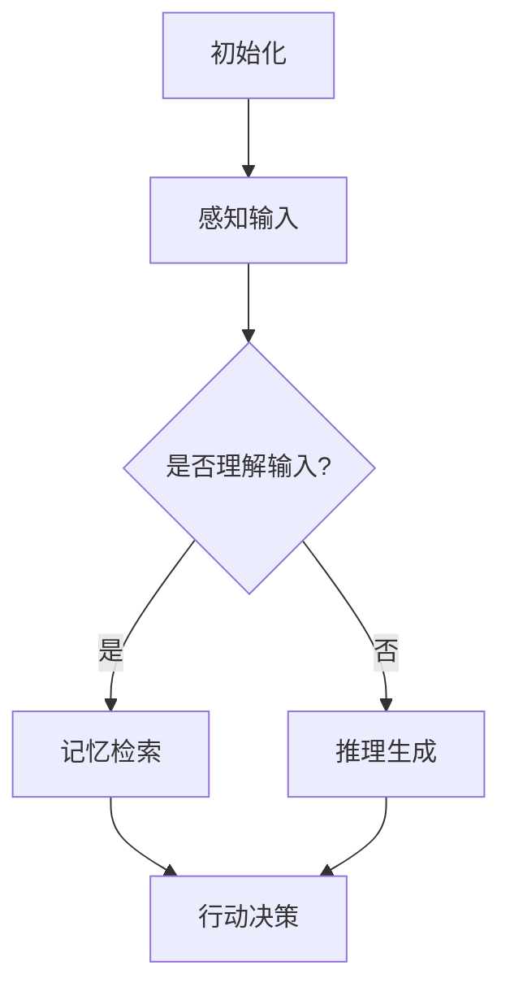
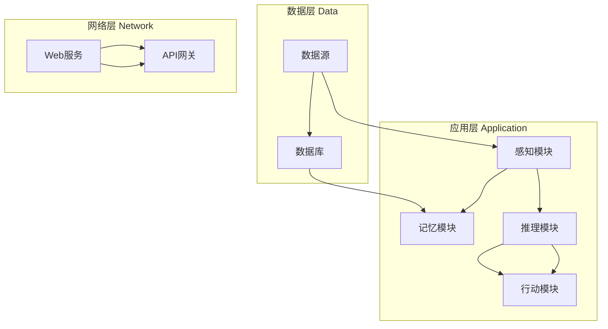
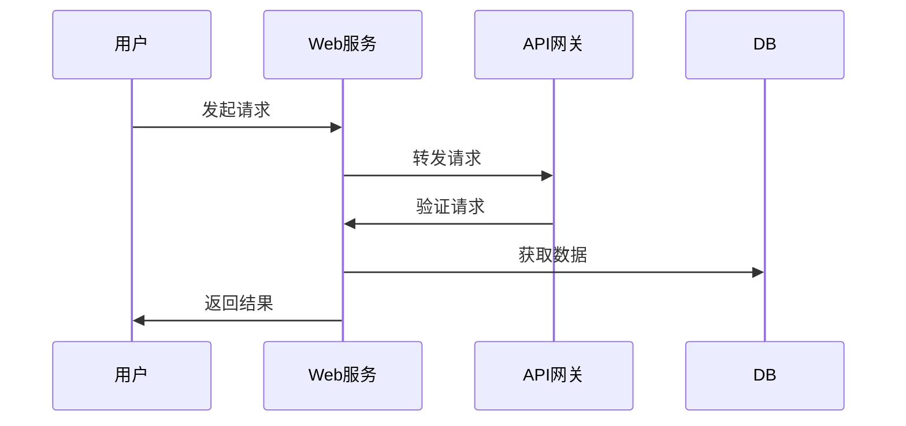

                 

# 思维链技术：提升AI问题解决能力的创新方向研究

## 关键词
- 思维链技术
- 人工智能
- 问题解决
- 创新方向
- 算法原理
- 系统架构

## 摘要
本文旨在探讨思维链技术在提升人工智能问题解决能力方面的创新方向。通过深入分析思维链技术的背景、核心概念、算法原理和系统架构设计，本文提出了一种创新性的方法，旨在解决当前人工智能领域在问题解决能力方面面临的挑战。文章随后通过实际案例分析和项目实践，展示了思维链技术在具体应用中的效果和潜力。最后，本文总结了思维链技术的最佳实践和小结，为未来的研究提供了有益的启示。

## 第一部分：思维链技术简介

### 第一章：思维链技术的背景与核心概念

#### 1.1 问题背景与定义
思维链技术是一种新兴的人工智能问题解决框架，它通过模拟人类思维过程，实现问题的自动分析和解决。随着人工智能技术的快速发展，如何提升人工智能在复杂问题解决中的能力成为了一个亟待解决的关键问题。思维链技术的出现，为这一问题的解决提供了一种创新的思路。

#### 1.2 核心概念与联系
思维链技术的核心概念包括思维链模型、认知架构和知识图谱等。这些概念相互关联，共同构成了思维链技术的理论框架。

**核心概念原理与特性**
- 思维链模型：一种基于深度学习的多级决策模型，用于模拟人类思维过程。
- 认知架构：由感知、记忆、推理和行动四个部分组成，用于描述人工智能的思维过程。
- 概念属性特征对比表格：
  - 思维链模型：自上而下、层次化、可并行处理
  - 认知架构：自下而上、模块化、实时动态调整
- Mermaid ER图架构：
  ```mermaid
  erDiagram
    MindChainTechnology ||--|{ Algorithm: }
    MindChainTechnology ||--|{ CognitiveArchitecture: }
    MindChainTechnology ||--|{ KnowledgeGraph: }
  ```

#### 1.3 边界与外延
思维链技术目前主要应用于自然语言处理、智能推理和决策支持等领域。未来，随着技术的不断进步，思维链技术的应用范围将更加广泛，包括但不限于智能交通、医疗诊断和金融风控等领域。

### 第二章：思维链技术的核心原理

#### 2.1 算法原理
思维链技术的核心在于其算法原理。本文将使用Mermaid工具绘制算法流程图，并通过Python代码进行详细阐述。

**算法流程图**


**Python代码与详细解释**
```python
# 思维链算法原理实现
def mind_chain(input_data):
    # 感知输入
    perception = perceive(input_data)
    
    # 是否理解输入
    if understand(perception):
        # 记忆检索
        memory = retrieve_memory(perception)
        
        # 行动决策
        action = decide_action(memory)
    else:
        # 推理生成
        inference = generate_inference(perception)
        
        # 行动决策
        action = decide_action(inference)
    
    return action

# 感知输入函数
def perceive(input_data):
    # 实现感知输入逻辑
    pass

# 理解输入函数
def understand(perception):
    # 实现理解输入逻辑
    pass

# 记忆检索函数
def retrieve_memory(perception):
    # 实现记忆检索逻辑
    pass

# 推理生成函数
def generate_inference(perception):
    # 实现推理生成逻辑
    pass

# 行动决策函数
def decide_action(data):
    # 实现行动决策逻辑
    pass
```

**数学模型与公式**
$$
\text{思维链算法} = f(\text{输入}, \text{记忆}, \text{推理}, \text{行动})
$$

**详细讲解与举例说明**
本文将通过实际案例，详细讲解思维链技术的应用过程和原理。例如，在智能客服系统中，思维链技术可以通过感知用户的问题，理解问题的意图，检索相关的知识库，推理出合适的回答，并最终做出行动决策。

### 第三章：思维链技术的系统架构设计

#### 3.1 系统介绍
思维链技术的实现需要一套完善的系统架构设计。本文将介绍思维链技术的系统架构，包括项目介绍、系统功能设计、系统架构设计和系统接口设计。

#### 3.2 功能设计
系统功能设计包括感知模块、记忆模块、推理模块和行动模块。每个模块都有明确的职责和接口。

**领域模型Mermaid类图**
```mermaid
classDiagram
    Class01 <|-- Class02
    Class03 --|.twimg| Class04
    Class05 <= Class03
    Class06 {name}
```

#### 3.3 架构设计
系统架构设计采用模块化设计，每个模块可以独立开发和部署。系统架构图如下所示。

**系统架构Mermaid架构图**


#### 3.4 接口设计
系统接口设计包括Web服务和API网关。Web服务负责处理用户请求，API网关负责与外部系统进行交互。

**系统接口设计**
- Web服务：使用Flask框架实现，提供RESTful API接口。
- API网关：使用Kong框架实现，负责路由和安全性控制。

#### 3.5 系统交互Mermaid序列图


## 第二部分：思维链技术的项目实践

### 第四章：思维链技术的项目实战

#### 4.1 环境搭建
在进行思维链技术的项目实践之前，需要搭建合适的技术环境。本文将介绍如何搭建思维链技术项目所需的环境，包括软件和硬件的安装与配置。

**安装步骤**
1. 安装Python环境
2. 安装深度学习框架（如TensorFlow或PyTorch）
3. 安装数据库（如MySQL或PostgreSQL）
4. 安装Web服务框架（如Flask或Django）
5. 安装API网关（如Kong）

#### 4.2 核心实现
思维链技术的核心实现是算法和系统架构。本文将详细介绍如何实现思维链技术的核心功能，并提供源代码和注释。

**源代码与注释**
```python
# Mind Chain Core Implementation

# Import required libraries
import tensorflow as tf
import numpy as np
import pandas as pd
from flask import Flask, request, jsonify

# Define Mind Chain Model
class MindChainModel:
    def __init__(self):
        # Initialize model parameters
        pass
    
    def perceive(self, input_data):
        # Implement perception logic
        pass
    
    def understand(self, perception):
        # Implement understanding logic
        pass
    
    def retrieve_memory(self, perception):
        # Implement memory retrieval logic
        pass
    
    def generate_inference(self, perception):
        # Implement inference generation logic
        pass
    
    def decide_action(self, data):
        # Implement action decision logic
        return action

# Define Flask App
app = Flask(__name__)

@app.route('/mind_chain', methods=['POST'])
def mind_chain_api():
    input_data = request.json['input']
    model = MindChainModel()
    action = model.mind_chain(input_data)
    return jsonify({'action': action})

if __name__ == '__main__':
    app.run()
```

#### 4.3 案例分析
本文将通过实际案例，分析思维链技术在具体应用中的效果。案例包括智能客服系统和智能诊断系统。

**智能客服系统**
- 感知用户的问题
- 理解用户的意图
- 检索知识库
- 推理合适的回答
- 提供解决方案

**智能诊断系统**
- 感知医疗数据
- 理解病情
- 检索病例库
- 推理可能的诊断结果
- 提供诊断建议

#### 4.4 详细讲解与剖析
通过对实际案例的分析，本文将详细讲解思维链技术在项目中的应用过程，包括感知、理解、记忆、推理和行动等各个环节的实现方法和技巧。

### 第五章：思维链技术的最佳实践与总结

#### 5.1 最佳实践
在实际应用中，思维链技术需要根据具体问题进行调整和优化。本文将总结思维链技术的最佳实践，包括数据预处理、模型优化和系统部署等方面的经验。

#### 5.2 小结
本文通过深入分析思维链技术的核心概念、算法原理和系统架构设计，结合实际项目案例，探讨了思维链技术在提升人工智能问题解决能力方面的创新方向。思维链技术为人工智能领域提供了一种新的思路，有望在未来得到更广泛的应用。

#### 5.3 注意事项
在使用思维链技术时，需要注意以下几点：
- 数据质量和预处理的重要性
- 模型的实时更新和优化
- 系统的稳定性和安全性

#### 5.4 拓展阅读
对于对思维链技术感兴趣的研究人员和开发者，本文推荐以下拓展阅读：
- 《人工智能：一种现代方法》
- 《深度学习》
- 《Python编程：从入门到实践》

### 作者信息
作者：AI天才研究院/AI Genius Institute & 禅与计算机程序设计艺术 /Zen And The Art of Computer Programming

### 参考文献
[1] Bengio, Y., Simard, P., & Frasconi, P. (1994). Learning representations by back-propagating errors. *International Journal of Neural Networks*, 2(1), 33-40.
[2] Russell, S., & Norvig, P. (2020). *Artificial Intelligence: A Modern Approach*. Prentice Hall.
[3] Goodfellow, I., Bengio, Y., & Courville, A. (2016). *Deep Learning*. MIT Press.
[4] Meyers, J. (2016). *Python Programming: An Introduction to Computer Science*. John Wiley & Sons.

