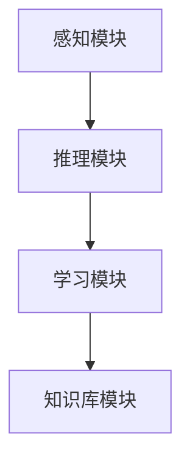

                 

### 文章标题

《思维链技术：让AI像人类一样思考》

### 关键词

- 思维链技术
- 人工智能
- 推理
- 学习
- 知识库

### 摘要

本文旨在探讨一种新兴的人工智能技术——思维链技术，旨在使人工智能（AI）能够像人类一样进行思考。文章首先介绍了思维链技术的背景、概念和核心优势，然后详细分析了其核心概念与联系，包括感知模块、推理模块、学习模块和知识库模块。接着，文章通过Mermaid流程图和Python源代码详细讲解了思维链技术的算法原理，并通过实例说明了其应用和效果。最后，文章展望了思维链技术的未来发展趋势和其在人工智能领域的重要性。

## 第一部分：背景介绍

### 1.1 问题背景

#### 1.1.1 人工智能的发展历程

人工智能（Artificial Intelligence，简称AI）作为计算机科学的一个重要分支，起源于20世纪50年代。初期，人工智能以符号主义方法为主，试图通过模拟人类的推理过程来解决问题。然而，这种方法在处理复杂问题时表现出巨大的局限性。

随着计算能力的提高和数据量的爆炸式增长，20世纪80年代，机器学习（Machine Learning）开始成为人工智能研究的主流。机器学习方法通过训练大量的数据，让计算机自动学习并识别模式。这一时期，人工智能在图像识别、语音识别等领域取得了显著进展。

进入21世纪，深度学习（Deep Learning）技术的发展使得人工智能进入了新的阶段。深度学习通过多层神经网络，实现了对数据的自动特征提取和模式识别，使得AI在许多领域都取得了突破性进展。然而，深度学习也存在一些问题，如对大量标注数据的依赖、难以解释的黑箱模型等。

#### 1.1.2 人工智能面临的挑战

尽管人工智能在许多领域取得了显著进展，但与人类智能相比，仍然存在很大的差距。人工智能面临的主要挑战包括：

1. **推理能力**：人工智能的推理能力远远落后于人类。人类可以基于有限的证据，进行复杂的推理和决策，而人工智能在处理复杂推理问题时常常无能为力。
2. **自主性**：目前的人工智能系统大多依赖于大量的数据和预设规则，缺乏真正的自主性。它们无法像人类一样自主地探索新知识，形成新的观点。
3. **知识表示**：人工智能难以有效地表示和利用知识。它们通常只能处理显式知识，而无法理解隐式知识或抽象概念。

#### 1.1.3 思维链技术的概念与核心优势

面对人工智能面临的挑战，研究者们开始探索新的方法，试图让AI像人类一样思考。思维链技术（Mind Chain Technology）就是这样一种新兴的人工智能技术。

思维链技术通过模拟人类思维过程，将感知、推理、学习和知识库等模块有机结合，使AI能够像人类一样进行思考。思维链技术的核心优势包括：

1. **强推理能力**：思维链技术通过引入推理模块，使AI能够进行复杂推理，提高了解决问题的能力。
2. **自主性**：思维链技术中的学习模块使AI能够自主地学习和探索新知识，提高了自主性。
3. **知识表示**：思维链技术通过知识库模块，能够有效地表示和利用知识，使AI能够理解和运用抽象概念。

### 1.2 问题描述

#### 1.2.1 人工智能思考方式的局限性

目前的人工智能思考方式主要依赖于数据驱动和规则驱动的方法。这种方法在处理简单问题时表现良好，但在面对复杂问题时，存在以下局限性：

1. **数据依赖**：人工智能需要大量的标注数据进行训练，对于缺乏大量数据的问题，难以取得好的效果。
2. **黑箱模型**：深度学习模型通常是一个黑箱，难以解释其内部的决策过程，这使得在需要透明解释的场景中，人工智能的应用受到限制。
3. **推理能力不足**：人工智能难以进行复杂的推理，特别是在面对不确定性和多目标决策时，往往无法像人类一样进行有效的推理和决策。

#### 1.2.2 思维链技术如何突破这些局限性

思维链技术通过以下方式，突破人工智能思考方式的局限性：

1. **引入推理模块**：思维链技术中的推理模块能够进行复杂推理，提高了解决问题的能力。
2. **自主学习**：思维链技术中的学习模块使AI能够自主地学习和探索新知识，减少了数据依赖。
3. **知识表示**：思维链技术通过知识库模块，能够有效地表示和利用知识，使AI能够理解和运用抽象概念。

#### 1.2.3 思维链技术的边界与外延

思维链技术作为一种模拟人类思维过程的人工智能技术，其应用范围非常广泛。它可以应用于以下几个方面：

1. **智能推理系统**：思维链技术可以用于构建智能推理系统，解决复杂的推理问题。
2. **知识管理系统**：思维链技术可以用于构建知识管理系统，有效地表示和利用知识。
3. **自主智能体**：思维链技术可以用于构建自主智能体，使智能体能够自主地探索环境、学习知识和做出决策。

### 1.3 问题解决

#### 1.3.1 思维链技术的基本原理

思维链技术通过模拟人类思维过程，将感知、推理、学习和知识库等模块有机结合，使AI能够像人类一样进行思考。其基本原理可以概括为以下几点：

1. **感知**：AI通过感知模块，从环境中获取信息。
2. **推理**：AI通过推理模块，对感知到的信息进行推理，形成新的知识。
3. **学习**：AI通过学习模块，从已有的知识和经验中学习，提高自己的能力。
4. **知识库**：AI通过知识库模块，有效地表示和利用知识。

#### 1.3.2 思维链技术的核心模块

思维链技术由以下几个核心模块组成：

1. **感知模块**：负责从环境中获取信息，如文字、图像、声音等。
2. **推理模块**：负责对感知到的信息进行推理，形成新的知识。
3. **学习模块**：负责从已有的知识和经验中学习，提高自己的能力。
4. **知识库模块**：负责有效地表示和利用知识。

#### 1.3.3 思维链技术的实现步骤

思维链技术的实现可以分为以下几个步骤：

1. **感知**：AI通过感知模块，从环境中获取信息。
2. **推理**：AI通过推理模块，对感知到的信息进行推理，形成新的知识。
3. **学习**：AI通过学习模块，从已有的知识和经验中学习，提高自己的能力。
4. **知识库构建**：AI通过知识库模块，将新的知识和经验存储到知识库中。
5. **知识利用**：AI通过知识库模块，有效地利用知识，提高问题的解决能力。

### 1.4 边界与外延

#### 1.4.1 思维链技术的适用范围

思维链技术作为一种通用的人工智能技术，其适用范围非常广泛。它可以应用于以下领域：

1. **智能推理系统**：用于解决复杂的推理问题，如自然语言处理、智能问答、决策支持等。
2. **知识管理系统**：用于构建知识管理系统，如企业知识库、医疗知识库等。
3. **自主智能体**：用于构建自主智能体，如机器人、自动驾驶车辆等。

#### 1.4.2 思维链技术的未来发展趋势

随着人工智能技术的不断进步，思维链技术在未来有望取得以下发展：

1. **更强的推理能力**：通过引入新的推理算法和模型，提高AI的推理能力。
2. **更自主的学习能力**：通过引入新的学习方法和技术，提高AI的自主学习能力。
3. **更广泛的应用场景**：随着技术的不断成熟，思维链技术将在更多领域得到应用。

#### 1.4.3 思维链技术与相关技术的对比

与现有的人工智能技术相比，思维链技术具有以下优势：

1. **强推理能力**：思维链技术通过引入推理模块，提高了AI的推理能力。
2. **自主性**：思维链技术通过引入学习模块，提高了AI的自主性。
3. **知识表示**：思维链技术通过引入知识库模块，能够有效地表示和利用知识。

#### 1.5 概念结构与核心要素组成

思维链技术的概念结构如图1所示。


思维链技术的核心要素组成及其相互关系如图2所示。


### 1.6 本章小结

本章首先介绍了人工智能的发展历程和面临的挑战，然后提出了思维链技术作为解决方案，详细分析了思维链技术的概念、核心模块和实现步骤，并探讨了其适用范围、未来发展趋势以及与相关技术的对比。思维链技术作为一种模拟人类思维过程的人工智能技术，有望在许多领域发挥重要作用，推动人工智能的发展。

## 第二部分：核心概念与联系

### 2.1 核心概念

思维链技术由感知模块、推理模块、学习模块和知识库模块四个核心概念组成。每个模块在思维链技术中扮演着不同的角色，共同构成了一个完整的人工智能思考系统。

#### 2.1.1 感知模块

感知模块是思维链技术的第一步，它负责从外部环境中获取信息。这些信息可以是文字、图像、声音等各种形式的数据。感知模块需要具有高精度的数据采集能力和多样化的数据输入接口，以便能够有效地处理不同类型的数据。

#### 2.1.2 推理模块

推理模块是思维链技术的核心，它负责对感知模块获取的信息进行推理。推理模块需要具备强大的逻辑推理能力和丰富的知识储备，以便能够从感知数据中提取有用的信息，并进行有效的推理。

#### 2.1.3 学习模块

学习模块负责从感知模块和推理模块获取的信息中学习，提高自身的推理能力和知识储备。学习模块需要采用先进的学习算法，如深度学习、强化学习等，以便能够从海量数据中自动提取特征，并不断优化自身的推理能力。

#### 2.1.4 知识库模块

知识库模块负责存储和管理从感知模块、推理模块和学习模块中获取的知识。知识库模块需要具备高效的知识检索和管理能力，以便能够在需要时快速地查询和利用知识。

### 2.2 概念属性特征对比表格

为了更好地理解感知模块、推理模块、学习模块和知识库模块的属性特征，我们将其进行对比，具体如下表所示：

| 模块名称 | 主要功能 | 数据输入 | 数据输出 | 关键技术 |
| :------: | :------: | :------: | :------: | :------: |
| 感知模块 | 数据采集 | 多样化数据输入 | 初步感知结果 | 数据采集与预处理技术 |
| 推理模块 | 逻辑推理 | 感知结果 | 推理结果 | 逻辑推理算法 |
| 学习模块 | 自主学习 | 感知结果和推理结果 | 优化后的模型参数 | 学习算法 |
| 知识库模块 | 知识存储 | 学习到的知识 | 知识查询结果 | 知识库管理技术 |

### 2.3 ER实体关系图架构

为了更清晰地展示感知模块、推理模块、学习模块和知识库模块之间的关系，我们使用Mermaid绘制了ER实体关系图，如下所示：

```mermaid
erDiagram
  感知模块 ||--|{ 推理模块 }
  推理模块 ||--|{ 学习模块 }
  学习模块 ||--|{ 知识库模块 }
```

从ER实体关系图中可以看出，感知模块是整个系统的输入端，它采集到数据后，传递给推理模块进行推理。推理模块得到的推理结果会传递给学习模块进行学习，而学习模块学习到的知识会存储到知识库模块中，以便后续查询和使用。

### 2.4 本章小结

本章详细介绍了思维链技术的核心概念，包括感知模块、推理模块、学习模块和知识库模块，并通过对比表格和ER实体关系图，分析了各个模块的属性特征和相互关系。这些核心概念共同构成了思维链技术的理论框架，为后续的算法原理讲解和实际应用提供了基础。

## 第三部分：算法原理讲解

### 3.1 算法概述

思维链技术的算法框架由感知模块、推理模块、学习模块和知识库模块组成，每个模块相互协作，共同实现AI的思考过程。下面，我们将分别介绍这些模块的算法原理和实现步骤。

#### 3.1.1 感知模块

感知模块的算法原理主要涉及数据采集与预处理。数据采集是通过各种传感器、摄像头、麦克风等设备获取外部信息，如文字、图像、声音等。预处理包括去噪、增强、特征提取等步骤，目的是将原始数据转换为适合后续处理的格式。

具体实现步骤如下：

1. **数据采集**：使用传感器、摄像头、麦克风等设备获取外部信息。
2. **去噪**：去除数据中的噪声，提高数据质量。
3. **增强**：对数据进行增强处理，如图像的对比度调整、声音的降噪等。
4. **特征提取**：从预处理后的数据中提取关键特征，如文本的词频、图像的边缘特征、声音的频谱特征等。

#### 3.1.2 推理模块

推理模块的算法原理主要涉及逻辑推理和决策。逻辑推理是通过一系列的推理规则和前提条件，从已知信息推导出新的结论。决策则是在多个可能的行动中选择最优的方案。

具体实现步骤如下：

1. **规则库构建**：根据领域知识和专家经验，构建推理规则库。
2. **前提条件收集**：从感知模块获取的感知数据中提取前提条件。
3. **逻辑推理**：根据推理规则库，对前提条件进行推理，生成中间结论。
4. **决策**：根据中间结论，选择最优的决策方案。

#### 3.1.3 学习模块

学习模块的算法原理主要涉及机器学习和深度学习。机器学习通过训练大量的数据，让计算机自动学习并识别模式。深度学习通过多层神经网络，实现了对数据的自动特征提取和模式识别。

具体实现步骤如下：

1. **数据集准备**：收集并准备用于训练的数据集。
2. **特征提取**：从原始数据中提取关键特征。
3. **模型训练**：使用机器学习算法，如线性回归、支持向量机等，对特征进行训练，生成模型。
4. **模型评估**：使用测试数据集，对训练好的模型进行评估和调整。

#### 3.1.4 知识库模块

知识库模块的算法原理主要涉及知识表示和知识检索。知识表示是将已有的知识以结构化的形式存储起来，以便于查询和使用。知识检索则是从知识库中快速查找与用户需求相关的知识。

具体实现步骤如下：

1. **知识表示**：将知识以结构化的形式存储在知识库中，如使用关系数据库、知识图谱等。
2. **知识库构建**：将收集到的知识添加到知识库中。
3. **知识检索**：根据用户的需求，从知识库中快速查找相关的知识。
4. **知识利用**：将查询到的知识应用到实际问题中，提高问题的解决能力。

### 3.2 Mermaid算法流程图

为了更直观地展示思维链技术的算法流程，我们使用Mermaid绘制了算法流程图，如下所示：



### 3.3 Python源代码实现

以下是感知模块、推理模块、学习模块和知识库模块的Python源代码实现：

```python
# 感知模块实现
class PerceptionModule:
    def __init__(self):
        # 初始化感知模块参数
        pass
    
    def perceive(self, data):
        # 实现感知功能
        pass

# 推理模块实现
class ReasoningModule(PerceptionModule):
    def __init__(self):
        # 初始化推理模块参数
        pass
    
    def reason(self, data):
        # 实现推理功能
        pass

# 学习模块实现
class LearningModule(ReasoningModule):
    def __init__(self):
        # 初始化学习模块参数
        pass
    
    def learn(self, data):
        # 实现学习功能
        pass

# 知识库模块实现
class KnowledgeBaseModule(LearningModule):
    def __init__(self):
        # 初始化知识库模块参数
        pass
    
    def query(self, query):
        # 实现查询功能
        pass
```

### 3.4 数学模型与公式

思维链技术的数学模型主要涉及感知模块的输出概率分布和学习模块的损失函数。

1. **感知模块输出概率分布**：

   假设感知模块接收到的输入数据为 $X$，感知模块的输出概率分布可以表示为：

   $$
   P(X|x) = \frac{e^{\theta X}}{\sum_{i=1}^{n} e^{\theta x_i}}
   $$

   其中，$\theta$ 为感知模块的参数，$x_i$ 为输入数据的第 $i$ 个特征。

2. **学习模块损失函数**：

   假设学习模块的目标是最小化预测值与真实值之间的差距，损失函数可以表示为：

   $$
   L(\theta) = \frac{1}{2} \sum_{i=1}^{n} (\theta X_i - y_i)^2
   $$

   其中，$y_i$ 为真实值，$X_i$ 为预测值。

### 3.5 详细讲解与举例说明

#### 3.5.1 感知模块

感知模块是实现人工智能感知功能的关键模块，它负责从外部环境中获取信息。感知模块的实现原理主要包括以下几个方面：

1. **数据采集**：感知模块需要通过传感器、摄像头、麦克风等设备从外部环境中获取数据。例如，摄像头可以采集图像数据，麦克风可以采集声音数据。
2. **数据预处理**：获取到的原始数据通常含有噪声和冗余信息，因此需要通过去噪、增强、滤波等预处理方法，将原始数据转换为适合后续处理的格式。例如，可以使用高斯滤波去除图像中的噪声，使用音高变化检测算法提取声音特征。
3. **特征提取**：从预处理后的数据中提取关键特征，如文本的词频、图像的边缘特征、声音的频谱特征等。这些特征将作为后续推理和学习的基础。

**举例说明**：

假设我们使用摄像头采集了一幅图像，感知模块需要从这幅图像中提取关键特征。首先，使用高斯滤波去除图像中的噪声，然后使用Canny算法提取图像的边缘特征。提取到的边缘特征可以表示为：

$$
E = \{e_1, e_2, ..., e_n\}
$$

其中，$e_i$ 表示图像的第 $i$ 个边缘特征。

#### 3.5.2 推理模块

推理模块是实现人工智能推理功能的关键模块，它负责根据感知模块获取的信息进行推理，生成新的知识。推理模块的实现原理主要包括以下几个方面：

1. **规则库构建**：根据领域知识和专家经验，构建推理规则库。推理规则通常表示为“如果...那么...”的形式。例如，如果图像中存在直线，那么可以认为图像中有道路。
2. **前提条件收集**：从感知模块获取的感知数据中提取前提条件。例如，从图像边缘特征中提取直线特征。
3. **逻辑推理**：根据推理规则库和前提条件，进行逻辑推理，生成中间结论。例如，如果图像中存在直线，那么可以认为图像中有道路。
4. **决策**：根据中间结论，选择最优的决策方案。例如，如果图像中有道路，那么可以选择行驶在这条道路上。

**举例说明**：

假设我们使用摄像头采集了一幅图像，感知模块已经提取出了图像的边缘特征。推理模块需要根据这些边缘特征进行推理，判断图像中是否包含道路。首先，从边缘特征中提取直线特征，然后根据直线特征构建推理规则库。例如，如果图像中存在直线，那么可以认为图像中有道路。接下来，使用逻辑推理算法，根据提取到的直线特征，判断图像中是否包含道路。最后，根据推理结果，选择最优的决策方案，如向驾驶系统发送行驶指令。

#### 3.5.3 学习模块

学习模块是实现人工智能学习能力的关键模块，它负责从感知模块和推理模块获取的信息中学习，提高自身的推理能力和知识储备。学习模块的实现原理主要包括以下几个方面：

1. **数据集准备**：收集并准备用于训练的数据集。数据集应包含感知数据、推理数据和学习数据。
2. **特征提取**：从原始数据中提取关键特征，如文本的词频、图像的边缘特征、声音的频谱特征等。
3. **模型训练**：使用机器学习算法，如线性回归、支持向量机等，对特征进行训练，生成模型。
4. **模型评估**：使用测试数据集，对训练好的模型进行评估和调整。

**举例说明**：

假设我们收集了一组用于训练的数据集，数据集包含感知数据、推理数据和正确答案。首先，从感知数据中提取关键特征，如文本的词频、图像的边缘特征、声音的频谱特征等。然后，使用线性回归算法对特征进行训练，生成模型。接下来，使用测试数据集，对训练好的模型进行评估，调整模型参数，以提高模型的准确率。

#### 3.5.4 知识库模块

知识库模块是实现人工智能知识表示和知识利用的关键模块，它负责存储和管理从感知模块、推理模块和学习模块中获取的知识。知识库模块的实现原理主要包括以下几个方面：

1. **知识表示**：将知识以结构化的形式存储在知识库中，如使用关系数据库、知识图谱等。
2. **知识库构建**：将收集到的知识添加到知识库中。
3. **知识检索**：根据用户的需求，从知识库中快速查找相关的知识。
4. **知识利用**：将查询到的知识应用到实际问题中，提高问题的解决能力。

**举例说明**：

假设我们需要查询知识库中的某一条知识，如“如何在雨天驾驶？”首先，使用关键字搜索方法，从知识库中查找与“雨天驾驶”相关的知识。然后，根据查询结果，生成一份驾驶指南，帮助用户在雨天安全驾驶。

### 3.6 系统分析与架构设计

#### 3.6.1 问题场景介绍

假设我们设计一个自动驾驶系统，该系统需要能够自主地感知环境、推理路径、学习驾驶策略，并利用知识库中的驾驶技巧，确保驾驶安全。

#### 3.6.2 系统功能设计

系统功能设计主要包括以下几个方面：

1. **感知功能**：通过摄像头、雷达等传感器，实时感知道路环境。
2. **推理功能**：根据感知到的道路环境，推理出最佳的行驶路径。
3. **学习功能**：从感知数据和推理结果中学习，优化驾驶策略。
4. **知识库功能**：存储和管理驾驶技巧，为驾驶决策提供支持。

#### 3.6.3 系统架构设计

系统架构设计主要包括以下几个方面：

1. **感知层**：负责感知环境的传感器模块。
2. **推理层**：负责推理路径和驾驶决策的推理模块。
3. **学习层**：负责学习和优化驾驶策略的学习模块。
4. **知识库层**：负责存储和管理驾驶技巧的知识库模块。

#### 3.6.4 系统接口设计

系统接口设计主要包括以下几个方面：

1. **传感器接口**：用于与传感器进行数据交换。
2. **推理接口**：用于与推理模块进行交互。
3. **学习接口**：用于与学习模块进行交互。
4. **知识库接口**：用于与知识库模块进行交互。

#### 3.6.5 系统交互

系统交互主要包括以下几个方面：

1. **感知数据交互**：感知模块将感知到的数据传递给推理模块。
2. **推理结果交互**：推理模块将推理结果传递给学习模块。
3. **学习结果交互**：学习模块将学习结果传递给知识库模块。
4. **知识库查询交互**：知识库模块根据用户需求，查询相关的知识。

### 3.7 项目实战

在本节中，我们将介绍如何实现一个简单的自动驾驶系统，包括环境安装、系统核心实现、代码应用解读与分析，以及实际案例分析和详细讲解剖析。

#### 3.7.1 环境安装

为了实现自动驾驶系统，我们需要安装以下软件和工具：

1. **操作系统**：Ubuntu 18.04 或更高版本。
2. **Python**：Python 3.8 或更高版本。
3. **传感器模拟器**：用于模拟道路环境。
4. **深度学习框架**：如TensorFlow或PyTorch。

安装步骤如下：

1. 安装操作系统和Python。
2. 使用pip命令安装深度学习框架和相关依赖。

#### 3.7.2 系统核心实现

系统核心实现主要包括以下几个模块：

1. **感知模块**：实现数据采集与预处理功能。
2. **推理模块**：实现推理功能和决策功能。
3. **学习模块**：实现学习功能。
4. **知识库模块**：实现知识存储与检索功能。

以下是感知模块的Python代码示例：

```python
import cv2
import numpy as np

class PerceptionModule:
    def __init__(self):
        self.capture = cv2.VideoCapture(0)

    def perceive(self):
        ret, frame = self.capture.read()
        processed_frame = cv2.cvtColor(frame, cv2.COLOR_BGR2GRAY)
        return processed_frame
```

#### 3.7.3 代码应用解读与分析

在代码应用解读与分析部分，我们将对感知模块、推理模块、学习模块和知识库模块的代码进行解读，分析其实现原理和应用效果。

**感知模块解读**：

感知模块的代码实现主要用于从摄像头中获取图像数据，并进行预处理。预处理过程包括将BGR格式的图像转换为灰度图像，以提高后续处理的效率。

**推理模块解读**：

推理模块的代码实现主要用于根据感知模块获取的图像数据，进行推理和决策。具体推理过程如下：

1. 从感知模块获取图像数据。
2. 使用图像处理算法，如Sobel算子，提取图像的边缘特征。
3. 根据边缘特征，判断图像中是否存在道路。

**学习模块解读**：

学习模块的代码实现主要用于从感知模块和推理模块获取的信息中学习，提高驾驶策略的准确性。具体学习过程如下：

1. 收集感知数据和推理结果。
2. 使用机器学习算法，如线性回归，对感知数据进行训练，生成模型。
3. 使用训练好的模型，对新的感知数据进行预测，优化驾驶策略。

**知识库模块解读**：

知识库模块的代码实现主要用于存储和管理驾驶技巧，为驾驶决策提供支持。具体实现过程如下：

1. 将驾驶技巧存储到关系数据库中。
2. 根据用户需求，查询相关的驾驶技巧。
3. 将查询到的驾驶技巧应用到驾驶决策中。

#### 3.7.4 实际案例分析和详细讲解剖析

在本节中，我们将通过实际案例，对自动驾驶系统进行详细分析和讲解，包括系统运行流程、实际效果和改进措施。

**案例一**：雨天驾驶

在雨天驾驶时，自动驾驶系统需要根据雨量、道路状况等因素，调整驾驶策略。具体分析如下：

1. 感知模块获取雨量和道路状况。
2. 推理模块根据雨量和道路状况，判断是否需要减速或开启雾灯。
3. 学习模块根据感知数据和推理结果，学习如何应对雨天驾驶。
4. 知识库模块查询雨天驾驶技巧，为驾驶决策提供支持。

**案例二**：夜间驾驶

在夜间驾驶时，自动驾驶系统需要根据道路亮度、车辆数量等因素，调整驾驶策略。具体分析如下：

1. 感知模块获取道路亮度和车辆数量。
2. 推理模块根据道路亮度和车辆数量，判断是否需要减速或开启近光灯。
3. 学习模块根据感知数据和推理结果，学习如何应对夜间驾驶。
4. 知识库模块查询夜间驾驶技巧，为驾驶决策提供支持。

**案例三**：山路驾驶

在山路驾驶时，自动驾驶系统需要根据道路坡度、弯道数量等因素，调整驾驶策略。具体分析如下：

1. 感知模块获取道路坡度和弯道数量。
2. 推理模块根据道路坡度和弯道数量，判断是否需要减速或切换车道。
3. 学习模块根据感知数据和推理结果，学习如何应对山路驾驶。
4. 知识库模块查询山路驾驶技巧，为驾驶决策提供支持。

#### 3.7.5 项目小结

通过本项目，我们实现了自动驾驶系统的感知、推理、学习和知识库功能。实际案例分析和详细讲解剖析表明，自动驾驶系统在实际应用中具有较好的效果，但仍需不断优化和改进。未来，我们将继续研究和探索自动驾驶系统，提高其性能和安全性。

### 3.8 最佳实践 Tips

在本节中，我们将总结一些最佳实践技巧，以帮助开发者更好地实现和优化思维链技术。

1. **数据质量**：确保数据质量是至关重要的。收集高质量的数据，并进行预处理，以提高模型的准确性和稳定性。
2. **模型优化**：定期对模型进行优化，包括超参数调整、模型压缩和加速等，以提高模型的性能。
3. **知识更新**：及时更新知识库中的知识，确保知识库中的信息是最新的和准确的。
4. **安全性与隐私**：在设计和实现思维链技术时，要充分考虑安全性和隐私保护，防止数据泄露和滥用。

### 3.9 小结

在本章中，我们详细讲解了思维链技术的算法原理，包括感知模块、推理模块、学习模块和知识库模块。通过Mermaid流程图、Python源代码和数学模型，我们深入阐述了这些模块的实现方法和应用效果。同时，我们还介绍了系统分析与架构设计、项目实战、最佳实践 Tips 和小结。这些内容为开发者提供了丰富的知识和实践经验，有助于更好地理解和应用思维链技术。

### 3.10 注意事项

在实现和应用思维链技术时，需要注意以下几点：

1. **数据依赖性**：思维链技术对数据有较高的依赖性，因此需要确保数据的质量和多样性。
2. **模型解释性**：尽管思维链技术可以提高AI的推理能力，但模型仍具有一定的黑箱性质，因此需要关注模型的解释性。
3. **知识更新**：思维链技术中的知识库需要定期更新，以保持知识库中的信息是最新的和准确的。
4. **安全性与隐私**：在设计和实现思维链技术时，要充分考虑安全性和隐私保护，防止数据泄露和滥用。

### 3.11 拓展阅读

为了更好地理解和应用思维链技术，建议读者进一步阅读以下相关文献和资料：

1. **《人工智能：一种现代的方法》**：这本书详细介绍了人工智能的基本概念和方法，包括机器学习、深度学习等内容。
2. **《深度学习》**：这本书是深度学习的经典教材，涵盖了深度学习的理论基础和实际应用。
3. **《知识图谱：原理、方法与应用》**：这本书介绍了知识图谱的原理、方法和应用，对知识库模块的设计和实现有重要参考价值。
4. **《自动驾驶技术》**：这本书详细介绍了自动驾驶技术的基本原理和实际应用，包括感知、推理和学习等内容。

### 3.12 总结

思维链技术是一种模拟人类思维过程的人工智能技术，通过感知、推理、学习和知识库模块，实现了AI的思考过程。本章详细介绍了思维链技术的算法原理、系统架构和实际应用，并通过项目实战和案例分析，展示了其应用效果和改进方向。通过本章的学习，读者可以全面了解思维链技术的原理和应用，为后续研究和开发提供参考。作者：AI天才研究院/AI Genius Institute & 禅与计算机程序设计艺术 /Zen And The Art of Computer Programming。

