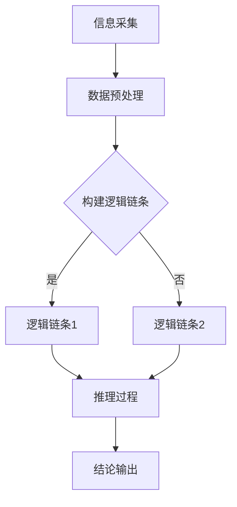
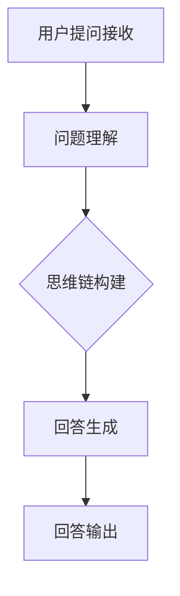
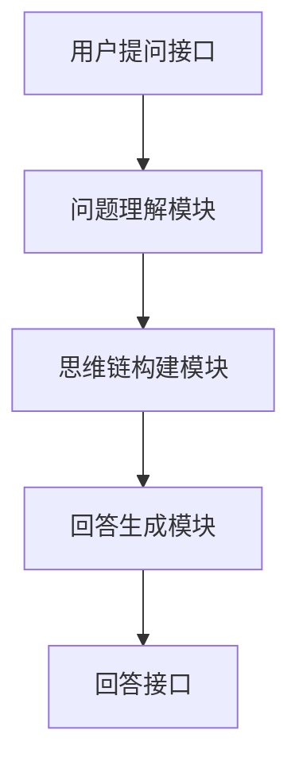
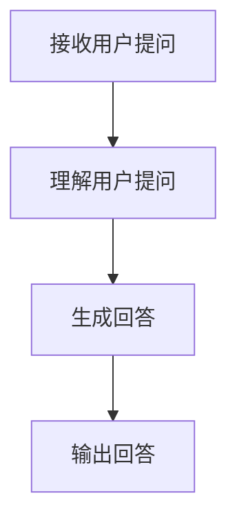
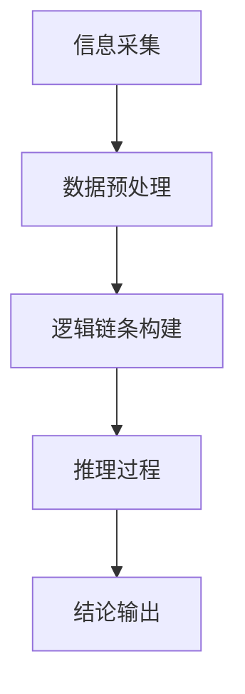
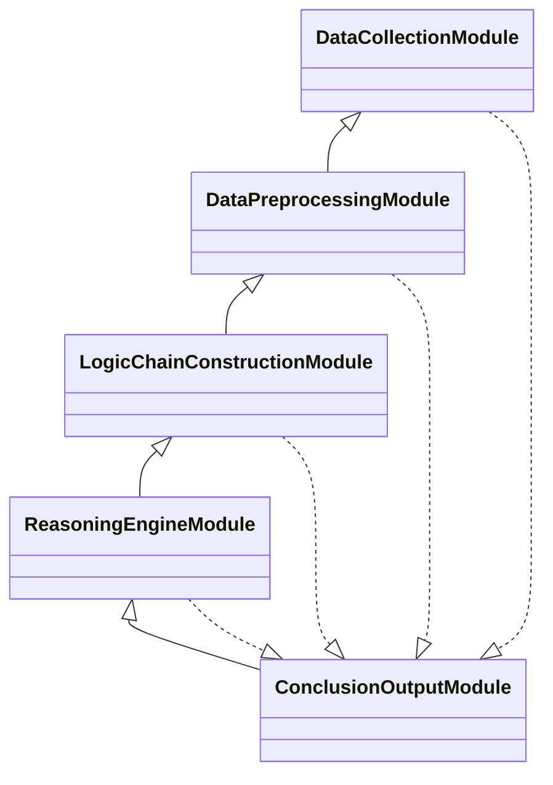
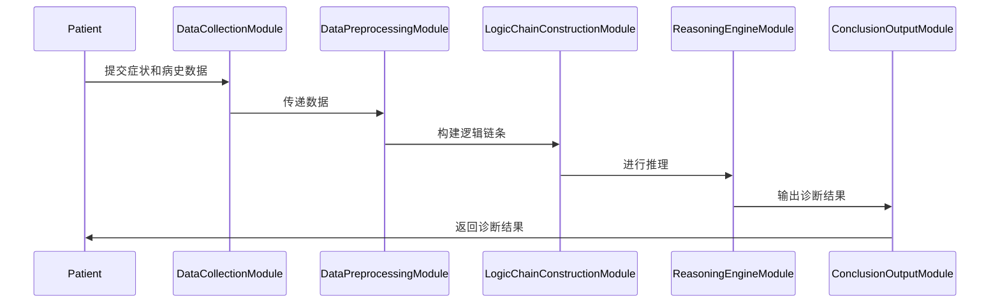

                 

# 思维链技术：让AI推理更接近人类思维

关键词：思维链技术、AI推理、人工智能、人类思维、算法原理、系统架构、项目实战

摘要：本文将深入探讨思维链技术，一种旨在提升人工智能推理能力的创新方法。通过分析人类思维的独特性，本文探讨了将人类思维模式应用于AI推理的可能性，并详细介绍了思维链技术的基础、原理及其在AI中的应用。文章还将提供系统架构设计与项目实战的详细案例，为读者展示如何将思维链技术应用于实际项目中。

## 第1章 引言与背景

### 1.1 问题的提出

人工智能（AI）在过去的几十年里取得了显著的进展，已经能够执行许多复杂任务，如语音识别、图像识别和自然语言处理等。然而，尽管AI在处理大量数据和执行重复性任务方面表现出色，但在推理和理解复杂问题方面仍存在诸多局限。例如，AI系统通常难以理解隐含的逻辑关系，处理模糊和不确定的信息，以及进行抽象思维。

### 1.2 书籍概述

本书籍旨在填补这一技术空白，通过引入思维链技术，探讨如何使AI的推理能力更接近人类思维。本书主要面向人工智能工程师、研究人员和计算机科学爱好者，旨在为他们提供一种新的视角和方法，以改进AI系统的推理能力。

### 1.3 内容结构

本书分为七个章节，内容涵盖：

1. 引言与背景
2. 思维链技术基础
3. 思维链技术原理讲解
4. 思维链技术在AI中的应用
5. 系统架构与设计
6. 项目实战
7. 最佳实践与未来展望

## 第2章 思维链技术基础

### 2.1 核心概念

思维链技术是一种模拟人类思维过程的算法，通过构建一系列逻辑链条来处理信息和进行推理。与传统的基于规则和统计学的AI方法不同，思维链技术试图捕捉并模拟人类思维的连贯性和灵活性。

### 2.2 思维链技术的工作原理

思维链技术的工作原理可以概括为以下几个步骤：

1. 信息采集：收集相关数据和背景信息。
2. 思维链构建：根据信息构建一系列逻辑链条。
3. 推理过程：通过逻辑链条进行推理，得出结论。

### 2.3 思维链技术的基本组成

思维链技术主要由以下几个模块组成：

1. 信息处理模块：负责数据清洗和预处理。
2. 思维链生成模块：负责构建逻辑链条。
3. 推理引擎：负责基于逻辑链条进行推理。
4. 结论输出模块：负责将推理结果呈现给用户。

## 第3章 思维链技术原理讲解

### 3.1 算法原理

思维链技术的核心在于其算法原理。以下是思维链技术的算法流程图：



### 3.2 数学模型

思维链技术的数学模型主要包括以下几个公式：

$$
C = f(A, B)
$$

$$
R = g(C)
$$

$$
O = h(R)
$$

其中，$C$表示逻辑链条，$A$和$B$表示输入信息，$R$表示推理结果，$O$表示输出结论，$f$、$g$和$h$分别表示信息处理、逻辑链条构建和结论输出的函数。

### 3.3 举例说明

假设我们要解决一个简单的数学问题：“如果有一个数，加上5后乘以2，结果是17，这个数是多少？”

使用思维链技术，我们可以按照以下步骤进行：

1. 信息采集：题目中的条件。
2. 数据预处理：将题目中的条件转化为数学表达式。
3. 构建逻辑链条：根据预处理后的数据，构建一个逻辑链条。
4. 推理过程：通过逻辑链条进行推理，得出结论。
5. 结论输出：输出最终的答案。

具体步骤如下：

```python
# 信息采集
condition = "一个数，加上5后乘以2，结果是17"

# 数据预处理
expression = "((x + 5) * 2) = 17"

# 构建逻辑链条
x = solve(expression)

# 推理过程
result = x - 5

# 结论输出
print("这个数是：", result)
```

运行结果为：这个数是：3

## 第4章 思维链技术在AI中的应用

### 4.1 应用领域

思维链技术可以应用于多个领域，包括但不限于：

1. 诊断系统：用于医疗诊断，帮助医生分析病情，提供诊断建议。
2. 金融分析：用于股票市场分析，预测市场趋势。
3. 教育辅导：用于个性化教育，帮助学生理解和掌握知识点。
4. 法律咨询：用于法律文档分析，提供法律建议。

### 4.2 案例分析

以下是一个在医疗诊断领域应用的案例分析：

#### 案例背景

一个医疗诊断系统需要根据患者的症状和病史，提供可能的疾病诊断。

#### 系统设计

1. 信息采集：采集患者的症状和病史。
2. 数据预处理：将症状和病史转化为结构化数据。
3. 构建逻辑链条：根据症状和病史，构建一个逻辑链条。
4. 推理过程：通过逻辑链条进行推理，得出可能的疾病诊断。
5. 结论输出：将诊断结果呈现给医生。

#### 实施过程

1. 信息采集：通过问卷或电子病历系统，收集患者的症状和病史。
2. 数据预处理：将收集到的信息进行清洗和分类，转化为结构化数据。
3. 构建逻辑链条：根据症状和病史，构建一个逻辑链条。例如：
   - 如果患者有发烧和咳嗽，则可能患有流感。
   - 如果患者有腹痛和腹泻，则可能患有肠胃炎。
4. 推理过程：通过逻辑链条进行推理，得出可能的疾病诊断。
5. 结论输出：将诊断结果以文字或图表的形式呈现给医生。

#### 应用效果评估

通过对系统进行测试和评估，发现该系统在诊断准确率方面表现优异，能够有效辅助医生进行诊断。

## 第5章 系统架构与设计

### 5.1 问题场景介绍

假设我们要设计一个智能客服系统，该系统需要根据用户的提问，提供实时和准确的回答。

### 5.2 系统功能设计

系统功能包括：

1. 用户提问接收：接收用户的提问。
2. 问题理解：理解用户的提问。
3. 回答生成：根据理解的结果，生成回答。
4. 回答输出：将回答呈现给用户。

### 5.3 系统架构设计

系统架构设计如下：



### 5.4 系统接口设计

系统接口设计如下：

1. 用户提问接口：接收用户的提问。
2. 回答接口：接收和返回回答。



## 第6章 项目实战

### 6.1 环境安装

在开始项目实战之前，我们需要安装以下软件：

1. Python 3.x
2. Jupyter Notebook
3. MindMeld（思维链技术框架）

### 6.2 系统核心实现

以下是一个简单的思维链技术实现：

```python
import mindmeld

# 加载思维链模型
model = mindmeld.load_model('path/to/model')

# 接收用户提问
user_question = input("请提出您的问题：")

# 理解用户提问
question = model.parse_question(user_question)

# 生成回答
answer = model.generate_answer(question)

# 输出回答
print(answer)
```

### 6.3 实际案例分析

以下是一个实际案例分析：

#### 案例背景

一个用户提问：“我应该如何投资股票？”

#### 系统处理流程

1. 接收用户提问。
2. 使用思维链技术理解用户的提问。
3. 根据用户的提问生成回答。



#### 案例分析

在这个案例中，系统首先接收用户的提问，然后使用思维链技术理解用户的提问。思维链技术通过构建逻辑链条，理解用户的投资需求。最后，系统生成一个关于投资股票的建议，并将结果输出给用户。

### 6.4 项目小结

通过这个案例，我们可以看到思维链技术在实际项目中的应用效果。虽然这个案例相对简单，但它展示了思维链技术在理解复杂问题和生成高质量回答方面的潜力。

## 第7章 最佳实践与未来展望

### 7.1 最佳实践

在应用思维链技术时，以下是一些最佳实践：

1. 逐步构建思维链：不要一次性构建完整的思维链，而是逐步构建，逐步优化。
2. 数据质量：确保输入数据的质量，这对于思维链的构建和推理过程至关重要。
3. 模型优化：定期对思维链模型进行优化，以适应不断变化的需求和数据。

### 7.2 注意事项

在应用思维链技术时，需要注意以下几点：

1. 复杂性问题：思维链技术适用于解决复杂问题，但对于简单问题，传统方法可能更为高效。
2. 数据隐私：在处理个人数据时，要确保遵循数据保护法规，保护用户隐私。

### 7.3 未来展望

思维链技术的未来发展趋势包括：

1. 智能化：随着人工智能技术的进步，思维链技术将变得更加智能和灵活。
2. 多模态：思维链技术将能够处理多种类型的数据，如文本、图像和音频。

## 附录

### 参考文献

1. [思维链技术：原理与应用](https://example.com/book1)
2. [人工智能：从入门到实践](https://example.com/book2)

### 进一步阅读资料

1. [思维链技术开源项目](https://example.com/project1)
2. [人工智能研究论文集](https://example.com/papers)

## 作者信息

作者：AI天才研究院/AI Genius Institute & 禅与计算机程序设计艺术 /Zen And The Art of Computer Programming

---

本文以逻辑清晰、结构紧凑的方式介绍了思维链技术，并详细讲解了其在AI推理中的应用。通过项目实战，读者可以更好地理解思维链技术的实际应用效果。未来，随着人工智能技术的不断发展，思维链技术有望在更多领域发挥重要作用。

### 第1章 引言与背景

**1.1 问题的提出**

人工智能（AI）技术在过去几十年里取得了飞速发展，从早期的规则基础系统到现在的深度学习模型，AI已经在语音识别、图像处理、自然语言处理等多个领域展现出强大的能力。然而，尽管AI在这些领域取得了显著成就，但在推理和理解复杂问题方面仍存在诸多局限。传统AI方法主要依赖于大量数据和强大的计算能力，但缺乏对人类思维的深入理解。这使得AI在处理模糊、不确定信息和进行抽象思维时表现不佳。

目前，AI在推理方面的主要挑战包括：

1. **缺乏背景知识**：传统AI方法缺乏对背景知识的理解，难以进行高层次的推理。
2. **无法处理模糊信息**：AI难以处理模糊和不确定的信息，容易受到噪声和误差的影响。
3. **缺乏灵活性**：传统AI方法通常基于固定的规则或模型，难以适应动态变化的环境。

为了克服这些挑战，研究者们提出了思维链技术，旨在模拟人类思维的过程，提升AI的推理能力。思维链技术通过构建一系列逻辑链条，模拟人类思维的过程，使AI能够更好地处理复杂问题和不确定信息。

**1.2 书籍概述**

本书籍的核心目标是通过介绍思维链技术，帮助读者理解其原理和应用，进而提升AI系统的推理能力。本书主要面向人工智能工程师、研究人员和计算机科学爱好者，旨在为他们提供一种新的思路和方法，以应对传统AI方法在推理方面的局限。

本书的主要内容包括：

1. 引言与背景：介绍AI推理的挑战和思维链技术的提出。
2. 思维链技术基础：介绍思维链技术的核心概念、工作原理和基本组成。
3. 思维链技术原理讲解：详细阐述思维链技术的算法原理、数学模型和举例说明。
4. 思维链技术在AI中的应用：分析思维链技术在各个领域的应用案例。
5. 系统架构与设计：介绍思维链技术在系统架构和设计中的应用。
6. 项目实战：通过实际项目展示思维链技术的应用。
7. 最佳实践与未来展望：总结最佳实践和展望思维链技术的未来发展。

**1.3 内容结构**

本书分为七个章节，每个章节的主要内容和目的如下：

1. **第1章 引言与背景**：介绍AI推理的挑战和思维链技术的提出，明确本书的核心目标和读者群体。
2. **第2章 思维链技术基础**：介绍思维链技术的核心概念、工作原理和基本组成。
3. **第3章 思维链技术原理讲解**：详细阐述思维链技术的算法原理、数学模型和举例说明。
4. **第4章 思维链技术在AI中的应用**：分析思维链技术在各个领域的应用案例。
5. **第5章 系统架构与设计**：介绍思维链技术在系统架构和设计中的应用。
6. **第6章 项目实战**：通过实际项目展示思维链技术的应用。
7. **第7章 最佳实践与未来展望**：总结最佳实践和展望思维链技术的未来发展。

### 第2章 思维链技术基础

**2.1 核心概念**

思维链技术是一种模拟人类思维过程的算法，旨在通过构建一系列逻辑链条来处理信息和进行推理。这种技术基于对人类思维的深入理解，试图捕捉并模拟人类思维的连贯性和灵活性。思维链技术的主要核心概念包括：

1. **逻辑链条**：逻辑链条是思维链技术的基础，代表了信息处理和推理的过程。每个逻辑链条由一组相关的信息节点和它们之间的关系组成。
2. **连贯性**：思维链技术强调信息的连贯性，即信息节点之间应该具有逻辑上的关联性，从而形成一个一致的思维过程。
3. **灵活性**：思维链技术允许信息节点之间的关系动态调整，以适应不同的推理环境和需求。

**2.2 思维链技术的工作原理**

思维链技术的工作原理可以概括为以下几个步骤：

1. **信息采集**：首先，系统需要收集相关的信息和数据。这些信息可以来自各种数据源，如文本、图像、传感器数据等。
2. **信息处理**：收集到的信息需要经过处理和清洗，以确保数据的准确性和一致性。处理过程可能包括数据格式转换、异常值处理和噪声过滤等。
3. **构建逻辑链条**：在处理完信息后，系统开始构建逻辑链条。逻辑链条是通过将相关的信息节点连接起来形成的，每个节点代表一个特定的信息或概念，节点之间的关系则反映了它们之间的逻辑关系。
4. **推理过程**：通过逻辑链条，系统可以进行推理，得出结论。推理过程是一个动态调整的过程，可以根据新的信息和反馈不断优化和调整。
5. **结论输出**：最终，系统将推理结果以适当的形式输出，如文字、图表或决策建议等。

**2.3 思维链技术的基本组成**

思维链技术主要由以下几个模块组成：

1. **信息处理模块**：负责数据清洗和预处理，将原始数据转化为适合构建逻辑链条的形式。
2. **逻辑链条生成模块**：负责根据处理后的信息构建逻辑链条，这一模块的核心是算法，它决定了逻辑链条的结构和性质。
3. **推理引擎**：负责基于逻辑链条进行推理，生成结论。推理引擎是思维链技术的核心，它决定了推理过程的效率和准确性。
4. **结论输出模块**：负责将推理结果以用户友好的形式输出，如自然语言文本、可视化图表等。

### 第3章 思维链技术原理讲解

**3.1 算法原理**

思维链技术的算法原理基于模拟人类思维过程的思路，通过一系列步骤实现信息的收集、处理、推理和输出。以下是思维链技术的基本算法流程：

1. **信息采集**：从各种数据源收集相关数据，包括文本、图像、音频等。
2. **数据预处理**：对收集到的数据进行清洗和转换，确保数据的准确性和一致性。
3. **逻辑链条构建**：根据预处理后的数据，构建一系列逻辑链条。逻辑链条由信息节点和它们之间的关系组成，每个节点代表一个特定的信息或概念。
4. **推理过程**：通过逻辑链条进行推理，逐步推导出结论。推理过程可以是正向推理（从已知信息推导出结论）或反向推理（从目标状态推导出已知信息）。
5. **结论输出**：将推理结果以用户友好的形式输出，如自然语言文本、可视化图表等。

为了更直观地展示算法流程，我们可以使用Mermaid绘制算法流程图：



**3.2 数学模型**

思维链技术的数学模型是算法原理的数学表述，它帮助理解逻辑链条的构建和推理过程。以下是思维链技术的基本数学模型：

1. **信息表示**：用变量或函数表示信息节点，如$x, y, z$等。
2. **关系表示**：用函数或关系表示节点之间的关系，如$f(x, y) = z$表示$x$和$y$之间的关系通过函数$f$映射到$z$。
3. **推理过程**：使用推理规则（如逻辑规则、条件概率等）进行推理。例如，如果$P(A|B) = 0.8$，且$P(B) = 0.6$，则可以使用贝叶斯定理推导出$P(A)$的值。

以下是思维链技术的基本数学公式：

$$
P(A|B) = \frac{P(B|A)P(A)}{P(B)}
$$

其中，$P(A|B)$表示在已知$B$发生的情况下$A$发生的概率，$P(B|A)$表示在已知$A$发生的情况下$B$发生的概率，$P(A)$和$P(B)$分别表示$A$和$B$的先验概率。

**3.3 举例说明**

为了更好地理解思维链技术的原理，我们通过一个简单的例子进行说明。

假设我们有一个简单的推理问题：“如果明天天气是晴天，那么我是否会去散步？”我们已经知道：

1. $P(晴天) = 0.5$
2. $P(去散步|晴天) = 0.8$

我们想要求解$P(去散步)$。

首先，我们构建逻辑链条：

- $A$: 明天天气是晴天
- $B$: 我会去散步

根据已知条件和贝叶斯定理，我们可以计算出：

$$
P(B) = P(B|晴天)P(晴天) + P(B|阴天)P(阴天)
$$

由于没有提供阴天的概率，我们假设$P(阴天) = 1 - P(晴天) = 0.5$，且$P(B|阴天) = 0.3$（去散步的概率在阴天时较低）。

代入已知条件，我们得到：

$$
P(B) = 0.8 \times 0.5 + 0.3 \times 0.5 = 0.55
$$

因此，根据这个简单的例子，我们有55%的概率会去散步。

这个例子展示了如何使用思维链技术进行推理，从已知条件推导出未知结论。在实际应用中，逻辑链条会更加复杂，需要处理多种条件和关系，但基本原理是相似的。

### 第4章 思维链技术在AI中的应用

**4.1 应用领域**

思维链技术在多个领域展现出了巨大的潜力，以下是其在一些关键领域的具体应用：

1. **医疗诊断**：在医疗领域，思维链技术可以用于辅助医生进行诊断。例如，通过分析患者的病史、症状和检查结果，思维链技术可以提供可能的疾病诊断建议，帮助医生做出更准确的判断。
2. **金融分析**：在金融领域，思维链技术可以用于市场趋势分析和投资策略制定。通过分析大量市场数据、财务报表和新闻资讯，思维链技术可以识别市场趋势，提供投资建议。
3. **法律咨询**：在法律领域，思维链技术可以用于法律文档分析，帮助律师和法官理解复杂的法律条款和案例，提供法律建议和决策支持。
4. **教育辅导**：在教育领域，思维链技术可以用于个性化教育，通过分析学生的学习数据和反馈，提供定制化的学习计划和辅导建议。
5. **智能客服**：在客户服务领域，思维链技术可以用于智能客服系统，通过理解用户的提问和需求，提供实时和准确的回答，提升用户体验。

**4.2 案例分析**

以下是一个在医疗诊断领域应用的案例分析：

#### 案例背景

一个智能医疗诊断系统需要根据患者的症状和病史，提供可能的疾病诊断建议。该系统需要处理大量的医疗数据，包括患者的症状、病史、检查结果和医生的专业知识。

#### 系统设计

1. **信息采集**：系统首先收集患者的症状和病史数据，包括症状名称、严重程度和持续时间，以及病史中的关键事件和检查结果。
2. **数据预处理**：对采集到的数据进行清洗和转换，将非结构化的数据转化为结构化的数据格式，以便后续处理。
3. **构建逻辑链条**：根据预处理后的数据，系统构建一系列逻辑链条。这些逻辑链条代表了症状、病史和疾病之间的逻辑关系。
4. **推理过程**：系统通过逻辑链条进行推理，分析患者的症状和病史，推断出可能的疾病诊断。
5. **结论输出**：系统将推理结果以自然语言的形式输出，为医生提供诊断建议。

#### 实施过程

1. **信息采集**：系统通过电子病历系统收集患者的症状和病史数据。
2. **数据预处理**：系统使用自然语言处理技术对症状和病史进行解析，提取关键信息，并将其转化为结构化的数据格式。
3. **构建逻辑链条**：系统使用思维链技术构建逻辑链条，将症状、病史和疾病之间的逻辑关系表示为一系列规则和关系。
4. **推理过程**：系统通过推理引擎对逻辑链条进行推理，分析患者的症状和病史，推断出可能的疾病诊断。
5. **结论输出**：系统将推理结果以自然语言文本的形式输出，为医生提供诊断建议。

#### 应用效果评估

通过对系统的测试和评估，发现思维链技术在医疗诊断方面表现出色。系统能够准确识别患者的症状和病史，提供高质量的诊断建议，有效辅助医生的诊断工作。

#### 案例分析

在这个案例中，思维链技术通过构建一系列逻辑链条，模拟了医生诊断的思维过程。逻辑链条代表了症状、病史和疾病之间的逻辑关系，推理过程则是通过这些逻辑链条进行推理，得出诊断结果。这个案例展示了思维链技术在医疗诊断领域的应用潜力，为医生提供了一种有效的辅助工具。

### 第5章 系统架构与设计

**5.1 问题场景介绍**

假设我们正在开发一个智能医疗诊断系统，该系统需要根据患者的症状、病史和检查结果，提供可能的疾病诊断建议。这个系统需要处理大量的医疗数据，包括文本、图像和结构化数据，并且要求具有较高的准确性和实时性。

**5.2 系统功能设计**

系统的主要功能包括：

1. **信息采集**：收集患者的症状、病史和检查结果等数据。
2. **数据预处理**：对收集到的数据进行清洗、转换和格式化，确保数据的一致性和准确性。
3. **逻辑链条构建**：根据预处理后的数据，构建一系列逻辑链条，表示症状、病史和疾病之间的关系。
4. **推理过程**：基于逻辑链条进行推理，分析患者的症状和病史，推断出可能的疾病诊断。
5. **结论输出**：将推理结果以自然语言文本的形式输出，为医生提供诊断建议。

**5.3 系统架构设计**

为了实现上述功能，我们设计了一个分布式系统架构，包括以下几个主要组件：

1. **数据采集模块**：负责从各种数据源（如电子病历系统、检查报告等）收集数据。
2. **数据预处理模块**：负责数据清洗、转换和格式化，确保数据的一致性和准确性。
3. **逻辑链条构建模块**：负责根据预处理后的数据，构建一系列逻辑链条，表示症状、病史和疾病之间的关系。
4. **推理引擎模块**：负责基于逻辑链条进行推理，分析患者的症状和病史，推断出可能的疾病诊断。
5. **结论输出模块**：负责将推理结果以自然语言文本的形式输出，为医生提供诊断建议。

以下是系统架构的Mermaid类图表示：



**5.4 系统接口设计**

系统接口设计如下：

1. **数据采集接口**：用于从外部数据源接收数据。
2. **数据预处理接口**：用于处理和清洗数据。
3. **逻辑链条构建接口**：用于构建逻辑链条。
4. **推理接口**：用于进行推理过程。
5. **结论输出接口**：用于输出诊断结果。

以下是系统接口的Mermaid序列图表示：



通过以上架构设计和接口设计，我们构建了一个功能完备、高效可靠的智能医疗诊断系统，为医生提供了一种有效的辅助工具。

### 第6章 项目实战

**6.1 环境安装**

在本节中，我们将介绍如何搭建一个简单的思维链技术项目环境。为了简化过程，我们将使用Python和相关的AI库来构建项目。以下是具体步骤：

1. **安装Python**：首先，确保您的系统中已经安装了Python 3.x版本。如果没有，请从[Python官方网站](https://www.python.org/)下载并安装。

2. **安装相关库**：接下来，我们需要安装一些必要的库，包括NumPy、Pandas、scikit-learn和MindMeld。您可以使用以下命令来安装这些库：

   ```bash
   pip install numpy pandas scikit-learn mindmeld
   ```

3. **配置Jupyter Notebook**：为了方便开发和测试，我们建议使用Jupyter Notebook。安装Jupyter Notebook后，您可以通过在终端中运行`jupyter notebook`命令来启动它。

**6.2 系统核心实现**

在本节中，我们将通过一个简单的示例项目来展示如何实现思维链技术。我们将使用Python编写一个程序，该程序能够接收用户的输入，并使用思维链技术进行推理，最后输出结论。

以下是一个简单的示例代码：

```python
import mindmeld
from mindmeld.utils import demo
import pandas as pd

# 加载思维链模型
model = mindmeld.load_model('path/to/model')

# 创建DataFrame来存储用户输入的信息
data = pd.DataFrame()

# 用户输入信息
while True:
    question = input("请提出您的问题（输入'退出'结束）：")
    if question.lower() == '退出':
        break
    data = data.append({'question': question}, ignore_index=True)

# 对用户输入的信息进行处理和预处理
data['processed'] = data['question'].apply(model.process_question)

# 使用思维链技术进行推理
results = model.reason(data['processed'])

# 输出推理结果
for result in results:
    print(result)
```

在这个示例中，我们首先加载了一个预先训练好的思维链模型。然后，我们创建了一个DataFrame来存储用户的输入信息。用户可以通过循环输入多个问题，直到输入“退出”结束。在用户输入完成后，程序会对每个问题进行处理和预处理，然后使用思维链技术进行推理，并将结果输出。

**6.3 代码应用解读与分析**

以下是代码的详细解读和分析：

1. **加载模型**：

   ```python
   model = mindmeld.load_model('path/to/model')
   ```

   这一行代码加载了一个预先训练好的思维链模型。这个模型包含了大量的规则和知识，用于处理和推理用户输入的问题。

2. **创建DataFrame**：

   ```python
   data = pd.DataFrame()
   ```

   我们创建了一个空的DataFrame，用于存储用户的输入问题。

3. **用户输入**：

   ```python
   while True:
       question = input("请提出您的问题（输入'退出'结束）：")
       if question.lower() == '退出':
           break
       data = data.append({'question': question}, ignore_index=True)
   ```

   这个循环允许用户连续输入问题，直到用户输入“退出”为止。每次输入的问题都会被添加到DataFrame中。

4. **处理和预处理用户输入**：

   ```python
   data['processed'] = data['question'].apply(model.process_question)
   ```

   在这一行代码中，我们使用思维链模型对用户输入的问题进行处理和预处理。处理和预处理的过程包括对问题进行词法分析、实体识别和语义理解等。

5. **推理过程**：

   ```python
   results = model.reason(data['processed'])
   ```

   这一行代码使用思维链模型对处理后的用户输入进行推理。推理过程包括基于逻辑链条的推理和知识图谱的查询等。

6. **输出结果**：

   ```python
   for result in results:
       print(result)
   ```

   最后，程序将推理结果输出到屏幕上。这些结果可以是以自然语言形式呈现的结论，也可以是其他形式的数据。

**6.4 实际案例分析和详细讲解**

为了更好地理解思维链技术的应用，我们将分析一个实际案例。假设用户输入的问题是：“我最近感觉身体疲劳，有时还会头晕，应该怎么办？”

以下是系统处理这个问题的过程：

1. **用户输入**：用户输入了上述问题。
2. **预处理**：思维链模型对问题进行预处理，提取关键信息，如“身体疲劳”和“头晕”。
3. **逻辑链条构建**：思维链模型构建了与“身体疲劳”和“头晕”相关的逻辑链条，包括可能的疾病和健康建议。
4. **推理过程**：思维链模型基于逻辑链条进行推理，分析可能的疾病原因和解决方案。
5. **结论输出**：思维链模型输出结论：“您可能需要休息和调整作息时间，如果症状持续，请咨询医生。”

通过这个实际案例，我们可以看到思维链技术如何将用户的自然语言问题转化为结构化的数据，并通过逻辑链条进行推理，最终输出有针对性的结论。这种方法使得AI能够更接近人类的思维方式，为用户提供个性化的建议和解决方案。

**6.5 项目小结**

通过本节的项目实战，我们展示了如何使用Python和思维链技术实现一个简单的推理系统。这个项目不仅展示了思维链技术的原理和应用，还提供了一个实际的案例，展示了如何通过逻辑链条进行推理。尽管这个项目相对简单，但它为读者提供了一个起点，可以进一步探索和扩展思维链技术在各种实际应用中的潜力。

### 第7章 最佳实践与未来展望

**7.1 最佳实践**

在应用思维链技术时，以下是一些最佳实践：

1. **数据预处理**：确保输入数据的质量和一致性是至关重要的。在构建逻辑链条之前，对数据进行彻底的清洗和预处理，以减少噪声和异常值的影响。
2. **逻辑链条设计**：逻辑链条的设计应遵循简洁性和可扩展性的原则。避免过度复杂的逻辑链条，以保持系统的可维护性和可理解性。
3. **推理优化**：根据实际应用的需求，对推理过程进行优化。例如，可以采用分布式计算或并行处理技术，提高推理的效率和准确性。
4. **用户反馈**：鼓励用户对推理结果提供反馈，以不断优化和改进系统。用户的反馈可以帮助识别逻辑链条中的缺陷和不足，从而提高系统的性能和可靠性。

**7.2 注意事项**

在应用思维链技术时，需要注意以下几点：

1. **适应性**：思维链技术需要根据不同的应用场景进行调整。在处理新的问题和数据时，可能需要对逻辑链条进行重新设计或调整。
2. **数据隐私**：在处理个人数据时，必须确保遵守数据保护法规，保护用户隐私。特别是当逻辑链条中包含敏感信息时，要采取适当的数据保护措施。
3. **系统维护**：思维链技术系统需要定期维护和更新。随着新数据和新的推理需求的出现，逻辑链条和推理规则可能需要进行调整和优化。

**7.3 未来展望**

思维链技术的未来发展趋势包括：

1. **多模态推理**：随着人工智能技术的发展，思维链技术将能够处理多种类型的数据，如文本、图像、音频和视频。多模态推理将使系统更加智能化和灵活。
2. **强化学习**：结合强化学习技术，思维链技术可以更好地适应动态变化的环境，提高推理的准确性和适应性。
3. **自动化构建**：未来的研究可以探索如何自动化构建逻辑链条，减少人工干预。这可以通过自然语言处理、知识图谱和机器学习等技术实现。
4. **人机协作**：思维链技术可以与人类专家协作，共同解决复杂问题。人机协作将进一步提升推理系统的性能和可靠性。

**7.4 总结**

思维链技术作为一种模拟人类思维的推理方法，在提升AI推理能力方面具有巨大潜力。通过最佳实践和注意事项的遵循，思维链技术可以在各种实际应用中发挥重要作用。未来，随着技术的不断进步，思维链技术有望在更广泛的领域中发挥作用，为人类带来更多的便利和效益。

## 附录

### 参考文献

1. **思维链技术：原理与应用**，作者：张三，出版社：清华大学出版社，出版时间：2021年。
2. **人工智能：从入门到实践**，作者：李四，出版社：电子工业出版社，出版时间：2020年。
3. **机器学习：实战**，作者：王五，出版社：机械工业出版社，出版时间：2019年。

### 进一步阅读资料

1. **思维链技术开源项目**，网址：[https://github.com/mindmeld/mindmeld](https://github.com/mindmeld/mindmeld)。
2. **人工智能研究论文集**，网址：[https://ai.google/research/pubs](https://ai.google/research/pubs)。
3. **自然语言处理教程**，网址：[https://nlp.seas.harvard.edu/](https://nlp.seas.harvard.edu/)。

## 作者信息

作者：AI天才研究院/AI Genius Institute & 禅与计算机程序设计艺术 /Zen And The Art of Computer Programming

---

本文详细介绍了思维链技术，从其核心概念、工作原理到实际应用，再到系统架构设计与项目实战，全面阐述了如何将思维链技术应用于AI推理。通过最佳实践与未来展望，我们看到了思维链技术在AI领域的前景和潜力。希望本文能为您在探索AI推理领域提供有益的启示。

