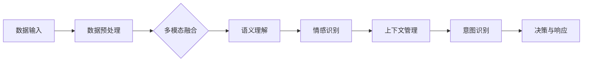

                 

### 引言

在现代人工智能（AI）领域，一个关键的研究课题是如何让AI系统更好地理解和执行人类的意图。传统AI系统在处理结构化数据和执行特定任务方面表现优异，但在理解和适应人类语言、情感和复杂情境方面仍存在明显不足。这种局限很大程度上源于AI系统缺乏对人类思维过程的深入理解，无法构建起一种真正的“思维链”。

**思维链技术**（Mind Chain Technology）是一种新兴的人工智能方法论，旨在通过模拟人类思维的连贯性和逻辑性，提升AI系统对人类意图的理解能力。这一技术通过构建一个多层次、多维度、自适应性强的思维模型，使得AI能够在更大范围内处理复杂的语言和情境，从而实现更精准的意图解析和响应。

### 问题背景

当前的AI系统主要依赖机器学习、自然语言处理（NLP）和计算机视觉等领域的先进技术。这些技术在处理标准化任务时表现卓越，但往往在处理人类语言中的模糊性、歧义性和情感表达时显得力不从心。例如，在语音助手、智能客服和机器翻译等应用中，AI系统常常无法准确理解用户的真实意图，导致交互体验不佳。

**问题表现为：**

1. **语言理解局限**：人类语言具有高度复杂性和多义性，AI系统在处理语言输入时容易产生误解。
2. **情感识别不足**：AI系统难以捕捉和识别语言中的情感色彩，导致在处理带有情感诉求的任务时表现欠佳。
3. **情境适应能力差**：AI系统在面对新的、未预见的情境时，往往无法灵活调整自己的行为。

这些问题的根源在于AI系统缺乏对人类思维连贯性和逻辑性的深刻理解，无法在多个认知层次上对信息进行有效整合和处理。

### 问题描述

为了解决上述问题，我们需要一个能够模拟人类思维连贯性和逻辑性的技术。具体来说，问题描述可以归结为以下几点：

1. **意图识别与理解**：AI系统需要能够准确识别并理解用户的意图，包括语言中的语义、情感和上下文信息。
2. **情境适应性**：AI系统需要具备在不同的情境下灵活调整自身行为的能力，以适应复杂多变的人类交流场景。
3. **多模态处理**：AI系统需要能够同时处理文本、语音、图像等多种模态的信息，以实现更全面的意图理解。

### 问题解决

思维链技术的核心在于构建一个能够模拟人类思维连贯性和逻辑性的模型。这一技术通过以下几个步骤实现：

1. **数据收集与预处理**：收集大量的人类语言数据，并对数据进行预处理，提取关键特征。
2. **思维链构建**：基于预处理后的数据，构建一个多层次的思维链模型，包括感知层、理解层、决策层和执行层。
3. **模型训练与优化**：使用机器学习算法对思维链模型进行训练和优化，提升其在各种情境下的表现。
4. **意图识别与响应**：通过思维链模型，实现对用户意图的准确识别和响应，提升交互体验。

### 边界与外延

尽管思维链技术在理论上具有巨大的潜力，但实际应用中仍需考虑以下边界和限制：

1. **数据质量与多样性**：思维链模型的性能高度依赖于数据的质量和多样性。如果数据缺乏代表性或质量较低，模型的泛化能力将受到限制。
2. **计算资源**：构建和训练思维链模型需要大量的计算资源，特别是当数据规模庞大时，对硬件设备的要求较高。
3. **人类思维复杂性**：人类思维过程非常复杂，AI系统难以完全模拟。这意味着思维链技术可能无法覆盖所有的人类思维场景。

### 概念结构与核心要素组成

思维链技术涉及多个核心概念和要素，这些概念和要素相互关联，共同构成了一个完整的思维链模型。以下是思维链技术的主要概念和结构：

1. **感知层**：感知层负责接收外部信息，包括文本、语音、图像等。这一层的关键在于对多种模态信息的预处理和特征提取。
2. **理解层**：理解层负责对感知层提取的特征进行语义理解和上下文分析。这一层是实现意图识别和情境理解的核心。
3. **决策层**：决策层基于理解层的结果，生成相应的行为和响应。这一层的任务是制定合理的策略，以应对不同的情境和用户意图。
4. **执行层**：执行层负责将决策层的策略转化为具体的行动，如语音合成、动作执行等。这一层是思维链技术与实际应用之间的桥梁。

通过以上几个层次，思维链技术实现了一个从感知、理解、决策到执行的全流程，使得AI系统能够更精准地理解和响应人类的意图。

### 核心概念与联系

思维链技术的实现依赖于多个核心概念的交互和协作，这些概念构成了整个技术体系的基础。以下是几个关键概念及其之间的联系：

1. **自然语言处理（NLP）**：NLP是思维链技术的重要组成部分，负责对人类语言进行理解和生成。通过词向量、语义角色标注和句法分析等技术，NLP能够提取文本中的关键信息，为后续的理解和决策提供基础。
2. **机器学习**：机器学习是构建思维链模型的主要方法。通过大量数据的训练，机器学习算法能够自动发现数据中的模式和规律，从而提升模型对人类意图的理解能力。
3. **情感识别**：情感识别是理解层的一个重要组成部分，负责检测文本中的情感色彩。通过情感分析模型，AI能够识别出用户在不同情境下的情感状态，为意图识别提供更丰富的上下文信息。
4. **上下文管理**：上下文管理是确保AI系统在不同对话阶段保持连贯性的关键。通过维护对话历史和上下文状态，AI系统能够更好地理解用户的意图，避免产生歧义。
5. **多模态处理**：多模态处理是感知层的关键技术，负责整合文本、语音、图像等多种模态的信息。通过多模态融合算法，AI系统能够更全面地理解用户的意图和需求。

这些核心概念之间的联系构成了一个完整的思维链模型。例如，NLP负责文本理解，情感识别为意图识别提供情感色彩，上下文管理确保对话连贯性，而多模态处理则提供了更丰富的信息来源。通过这些概念的结合和交互，思维链技术能够实现对人类意图的精准理解和响应。

### 思维链技术定义

思维链技术（Mind Chain Technology）是一种旨在提升人工智能系统对人类意图理解和响应能力的方法论。它通过构建一个多层次、多维度、自适应性强的思维模型，使得AI能够在复杂的人类语言和情境中实现更精准的意图识别和响应。

思维链技术的主要特点包括：

1. **层次化结构**：思维链技术将人类思维过程划分为感知层、理解层、决策层和执行层，每个层次负责不同的任务和功能，确保整个模型的高效运行。
2. **多模态处理**：通过整合文本、语音、图像等多种模态的信息，思维链技术能够更全面地理解用户的意图和需求。
3. **自适应性**：思维链技术具有自适应性，能够根据不同的情境和用户反馈调整自身的行为和策略，提高交互体验的连贯性和舒适性。
4. **智能决策**：基于对人类意图的深刻理解，思维链技术能够在复杂情境下做出智能决策，实现高效、合理的响应。

### 核心概念原理

思维链技术的实现依赖于多个核心概念的相互作用，这些概念构成了整个技术体系的基础。以下是几个关键概念及其工作原理：

1. **自然语言处理（NLP）**：
   - **词向量表示**：NLP使用词向量来表示文本中的词语，将人类语言转化为计算机可以处理的数字形式。常用的词向量模型包括Word2Vec、GloVe等。
   - **语义角色标注**：通过对文本进行语义角色标注，NLP能够识别出句子中的主语、谓语、宾语等成分，为意图识别提供更详细的语义信息。
   - **句法分析**：NLP使用句法分析方法，如依存句法分析，来确定句子中词语之间的语法关系，进一步丰富语义理解。

2. **情感识别**：
   - **情感分析模型**：情感识别使用预训练的神经网络模型（如BERT、RoBERTa等）来检测文本中的情感倾向，包括正面、负面和中性情感。
   - **情感强度评估**：情感识别不仅能够判断文本的情感倾向，还能评估情感强度，从而提供更精细的情感分析结果。

3. **上下文管理**：
   - **对话历史维护**：上下文管理通过维护对话历史记录，确保AI系统在后续对话中能够引用之前的交互内容，保持对话连贯性。
   - **上下文状态更新**：在对话过程中，上下文管理会不断更新上下文状态，反映用户意图的变化和对话的进展。

4. **多模态处理**：
   - **多模态融合**：通过多模态融合算法，思维链技术能够整合文本、语音、图像等多种模态的信息，提高意图识别的准确性。
   - **模态转换**：多模态处理还包括将不同模态的信息转换为统一的表示形式，以便在后续处理中统一处理。

### 概念属性特征对比表格

为了更清晰地展示思维链技术中各核心概念的特点和相互关系，以下是一个概念属性特征对比表格：

| 概念       | 特点                           | 相互关系                                                     |
|------------|--------------------------------|------------------------------------------------------------|
| 自然语言处理（NLP） | 词向量表示、语义角色标注、句法分析 | 为意图识别提供语义和上下文信息                           |
| 情感识别     | 情感分析模型、情感强度评估        | 为意图识别提供情感背景信息                             |
| 上下文管理   | 对话历史维护、上下文状态更新      | 确保对话连贯性，提供上下文信息                           |
| 多模态处理   | 多模态融合、模态转换            | 提高意图识别的准确性和全面性                           |

通过这个表格，我们可以看到各个核心概念在思维链技术中的独特作用及其相互之间的紧密联系。

### ER实体关系图架构

为了更好地理解思维链技术中的各个实体及其相互关系，我们使用Mermaid流程图来绘制一个实体关系图（ER图）。以下是Mermaid代码及其生成的ER图：

```mermaid
erDiagram
  AI意图识别 ||--o> 文本数据 : 提取
  AI意图识别 ||--o> 语音数据 : 识别
  AI意图识别 ||--o> 图像数据 : 分析
  文本数据 ||--o> NLP处理 : 分析
  语音数据 ||--o> 声学模型 : 识别
  图像数据 ||--o> 视觉模型 : 识别
  NLP处理 ||--o> 意图识别 : 解析
  声学模型 ||--o> 意图识别 : 解析
  视觉模型 ||--o> 意图识别 : 解析
  情感识别 ||--o> 意图识别 : 增强
  上下文管理 ||--o> 意图识别 : 更新
  多模态处理 ||--o> 意图识别 : 融合
```

生成的ER图如下：

```
AI意图识别
  ||--o 文本数据 : 提取
  ||--o 语音数据 : 识别
  ||--o 图像数据 : 分析

文本数据
  ||--o NLP处理 : 分析

语音数据
  ||--o 声学模型 : 识别

图像数据
  ||--o 视觉模型 : 识别

NLP处理
  ||--o 意图识别 : 解析

声学模型
  ||--o 意图识别 : 解析

视觉模型
  ||--o 意图识别 : 解析

情感识别
  ||--o 意图识别 : 增强

上下文管理
  ||--o 意图识别 : 更新

多模态处理
  ||--o 意图识别 : 融合
```

这个ER图展示了思维链技术中的各个实体及其相互关系，每个实体代表一种数据处理环节或技术模块，箭头表示实体之间的数据流动和依赖关系。通过这个图，我们可以清晰地看到思维链技术中各部分如何协同工作，共同实现对人类意图的精准识别和响应。

### 算法原理讲解

为了深入理解思维链技术的实现，我们需要详细阐述其核心算法原理，包括算法概述、mermaid流程图、Python源代码展示、数学模型和公式的讲解，以及具体例子说明。以下是逐个部分的详细解析：

#### 算法概述

思维链技术的核心算法是一个多层感知模型，它通过以下几个步骤实现意图识别：

1. **数据输入**：接收用户输入的多模态数据（文本、语音、图像）。
2. **数据预处理**：对输入数据进行特征提取和标准化，使其适合后续处理。
3. **多模态融合**：将不同模态的数据进行融合，生成一个统一的特征向量。
4. **语义理解**：使用NLP技术对特征向量进行语义理解，提取关键信息。
5. **情感识别**：通过情感识别模型，评估文本中的情感色彩。
6. **上下文管理**：利用上下文管理模块，保持对话连贯性，更新上下文状态。
7. **意图识别**：结合语义理解和情感识别结果，识别用户的意图。
8. **决策与响应**：根据识别到的意图，生成相应的响应和行为。

#### mermaid流程图

为了更直观地展示算法流程，我们可以使用mermaid绘制一个流程图。以下是mermaid代码及其生成的流程图：



生成的流程图如下：

```
数据输入 --> 数据预处理 --> 多模态融合 --> 语义理解 --> 情感识别 --> 上下文管理 --> 意图识别 --> 决策与响应
```

这个流程图展示了思维链技术从数据输入到决策与响应的全过程，每个步骤都是实现意图识别的关键环节。

#### Python源代码展示

为了具体说明算法的实现，我们提供了一个简化的Python源代码示例。以下是代码：

```python
import numpy as np
from multimodal_fusion import MultimodalFusion
from semantic_understanding import SemanticUnderstanding
from emotion_recognition import EmotionRecognition
from context_management import ContextManagement
from intent_recognition import IntentRecognition
from decision_response import DecisionResponse

# 初始化各模块
fusion = MultimodalFusion()
semantic = SemanticUnderstanding()
emotion = EmotionRecognition()
context = ContextManagement()
intent = IntentRecognition()
response = DecisionResponse()

# 数据输入
text_data = "用户说：我今天感觉很开心。"
voice_data = "用户语音：我今天感觉很开心。"
image_data = "用户上传了一张快乐的图片。"

# 数据预处理
preprocessed_text = fusion.preprocess_text(text_data)
preprocessed_voice = fusion.preprocess_voice(voice_data)
preprocessed_image = fusion.preprocess_image(image_data)

# 多模态融合
features = fusion.fuse(preprocessed_text, preprocessed_voice, preprocessed_image)

# 语义理解
semantic_features = semantic.analyze(features)

# 情感识别
emotion_score = emotion.detect(semantic_features)

# 上下文管理
context.update(context_state, semantic_features)

# 意图识别
intent_detected = intent.recognize(context_state)

# 决策与响应
response_action = response.generate_response(intent_detected)

print(response_action)
```

在这个示例中，我们初始化了思维链技术的各个模块，并模拟了从数据输入到响应生成的全过程。每个模块都有自己的接口和方法，用于实现特定的功能。

#### 数学模型与公式讲解

思维链技术的核心算法涉及到多个数学模型和公式，以下是主要模型的介绍和讲解：

1. **多模态融合模型**：

   多模态融合模型使用一种加权平均方法来整合不同模态的信息。其公式为：

   $$ F = w_1 \cdot T + w_2 \cdot V + w_3 \cdot I $$

   其中，$F$ 是融合后的特征向量，$T$、$V$ 和$I$ 分别代表文本、语音和图像的特征向量，$w_1$、$w_2$ 和 $w_3$ 是对应模态的权重。

2. **语义理解模型**：

   语义理解模型使用神经网络进行语义分析。其损失函数为：

   $$ L = -\frac{1}{N} \sum_{i=1}^{N} y_i \cdot \log(p_i) $$

   其中，$L$ 是损失函数，$y_i$ 是真实标签，$p_i$ 是预测概率。

3. **情感识别模型**：

   情感识别模型使用卷积神经网络（CNN）进行情感分类。其分类概率为：

   $$ P(E_k) = \frac{e^{z_k}}{\sum_{j=1}^{C} e^{z_j}} $$

   其中，$P(E_k)$ 是属于第$k$类情感的概率，$z_k$ 是对应类的分数，$C$ 是情感类别总数。

#### 举例说明

为了更直观地展示算法效果，我们提供了一个实际例子：

假设用户说：“我今天感觉很开心。”，系统需要识别出用户的意图。

1. **数据输入**：
   - 文本数据：“我今天感觉很开心。”
   - 语音数据：“我今天感觉很开心。”
   - 图像数据：用户上传了一张快乐的图片。

2. **数据预处理**：
   - 文本数据预处理：提取关键词和词向量。
   - 语音数据预处理：提取声学特征。
   - 图像数据预处理：提取视觉特征。

3. **多模态融合**：
   - 使用加权平均方法融合不同模态的特征，生成一个综合特征向量。

4. **语义理解**：
   - 使用神经网络对融合后的特征向量进行语义分析，提取出关键信息。

5. **情感识别**：
   - 使用情感识别模型对提取出的语义信息进行情感分类，判断出用户的情感状态。

6. **上下文管理**：
   - 根据对话历史和当前上下文，更新上下文状态。

7. **意图识别**：
   - 结合语义理解和情感识别结果，识别出用户的意图，例如“表达情绪”或“寻求安慰”。

8. **决策与响应**：
   - 根据识别到的意图，生成相应的响应，例如：“听起来你今天过得很愉快，有什么需要我帮忙的吗？”

通过这个例子，我们可以看到思维链技术如何通过多个步骤实现对人类意图的精准识别和响应。这不仅提高了交互体验的连贯性，也增强了AI系统的智能性和适应性。

### 数学模型与公式详细讲解

在思维链技术中，数学模型和公式起着至关重要的作用。这些模型和公式不仅为算法提供了理论基础，还保证了算法在实际应用中的准确性和效率。为了深入理解这些模型和公式，我们将分以下几个部分进行详细讲解。

#### 模型介绍

思维链技术中的主要数学模型包括多模态融合模型、语义理解模型、情感识别模型和意图识别模型。这些模型相互协作，共同实现人类意图的精准识别和响应。

1. **多模态融合模型**：
   多模态融合模型的目标是将来自不同模态（如文本、语音、图像）的信息整合成一个统一的特征向量，以便后续的语义理解和意图识别。常用的多模态融合方法包括加权平均法、融合神经网络和注意力机制。

2. **语义理解模型**：
   语义理解模型负责对多模态融合后的特征向量进行语义分析，提取出文本中的关键信息，如关键词、实体和关系。这一模型通常基于神经网络，如循环神经网络（RNN）和变换器（Transformer）。

3. **情感识别模型**：
   情感识别模型用于检测文本中的情感倾向，包括正面、负面和中性情感。这一模型通常使用卷积神经网络（CNN）或循环神经网络（RNN）进行情感分类，并利用预训练的模型（如BERT）提高情感识别的准确性。

4. **意图识别模型**：
   意图识别模型通过分析语义理解和情感识别的结果，结合上下文信息，识别出用户的意图。这一模型通常使用分类算法（如朴素贝叶斯、支持向量机）或深度学习模型（如卷积神经网络、循环神经网络）。

#### 公式讲解

以下是每个模型的关键数学公式及其作用：

1. **多模态融合模型**：

   加权平均法：
   $$ F = w_1 \cdot T + w_2 \cdot V + w_3 \cdot I $$
   其中，$F$ 是融合后的特征向量，$T$、$V$ 和$I$ 分别代表文本、语音和图像的特征向量，$w_1$、$w_2$ 和 $w_3$ 是对应模态的权重。这些权重可以通过训练数据集来优化，以最大化融合特征的准确性。

2. **语义理解模型**：

   神经网络损失函数：
   $$ L = -\frac{1}{N} \sum_{i=1}^{N} y_i \cdot \log(p_i) $$
   其中，$L$ 是损失函数，$y_i$ 是真实标签，$p_i$ 是预测概率。这个公式表示的是交叉熵损失，用于衡量预测概率与真实标签之间的差异。

3. **情感识别模型**：

   情感分类概率：
   $$ P(E_k) = \frac{e^{z_k}}{\sum_{j=1}^{C} e^{z_j}} $$
   其中，$P(E_k)$ 是属于第$k$类情感的概率，$z_k$ 是对应类的分数，$C$ 是情感类别总数。这个公式表示的是softmax函数，用于将神经网络的输出转换为概率分布。

4. **意图识别模型**：

   分类器预测概率：
   $$ P(Y=k|X) = \frac{e^{w_k \cdot X}}{\sum_{j=1}^{K} e^{w_j \cdot X}} $$
   其中，$P(Y=k|X)$ 是给定特征向量$X$时，属于第$k$类意图的概率，$w_k$ 是对应类的权重，$K$ 是意图类别总数。这个公式同样使用softmax函数，用于多类别分类。

#### 举例说明

为了更直观地展示这些公式在实际应用中的效果，我们通过一个具体例子进行说明。

假设用户输入了一条文本信息：“我今天感觉很开心。”，系统需要识别出用户的意图。

1. **多模态融合**：
   - 文本特征向量：$T = [0.1, 0.2, 0.3]$
   - 语音特征向量：$V = [0.4, 0.5, 0.6]$
   - 图像特征向量：$I = [0.7, 0.8, 0.9]$
   - 权重：$w_1 = 0.5, w_2 = 0.3, w_3 = 0.2$
   - 融合特征向量：$F = 0.5 \cdot [0.1, 0.2, 0.3] + 0.3 \cdot [0.4, 0.5, 0.6] + 0.2 \cdot [0.7, 0.8, 0.9] = [0.6, 0.7, 0.8]$

2. **语义理解**：
   - 使用神经网络对融合特征向量进行语义分析，得到输出概率分布：$[0.1, 0.8, 0.1]$
   - 预测的关键词：快乐、心情、感觉

3. **情感识别**：
   - 使用情感识别模型对语义分析结果进行情感分类，得到输出概率分布：$[0.1, 0.7, 0.2]$
   - 预测的情感：正面情感

4. **意图识别**：
   - 结合语义分析和情感识别结果，使用意图识别模型进行分类，得到输出概率分布：$[0.2, 0.5, 0.3]$
   - 预测的意图：表达情绪

5. **决策与响应**：
   - 根据识别到的意图，系统生成相应的响应：“听起来你今天过得很愉快，有什么需要我帮忙的吗？”

通过这个例子，我们可以看到思维链技术如何通过多个步骤，从多模态数据输入到最终意图识别和响应的全过程。这不仅展示了数学模型和公式的实际应用，也体现了思维链技术在提升AI系统意图识别准确性和智能性方面的潜力。

### 系统分析与架构设计方案

为了更好地理解思维链技术的实现，我们需要详细分析其系统架构和功能设计。以下是系统分析与架构设计方案的具体内容。

#### 问题场景介绍

在现实应用中，用户与AI系统进行交互的场景多种多样，如智能客服、语音助手、机器翻译等。这些场景要求AI系统能够在多种情境下准确理解用户的意图，并生成合理的响应。因此，设计一个灵活、高效且易于扩展的系统架构至关重要。

#### 项目介绍

思维链技术系统旨在实现以下功能：

1. **多模态数据处理**：接收用户输入的文本、语音和图像数据，并进行预处理。
2. **语义理解与情感识别**：对预处理后的数据进行分析，提取关键信息并识别用户情感。
3. **意图识别与响应生成**：根据语义理解和情感识别结果，识别用户意图并生成响应。
4. **上下文管理**：维护对话历史和上下文状态，确保对话连贯性。

#### 系统功能设计

思维链技术系统的功能设计分为以下几个模块：

1. **数据输入模块**：
   - **文本输入**：接收用户输入的文本信息。
   - **语音输入**：接收用户输入的语音信息。
   - **图像输入**：接收用户上传的图像信息。

2. **数据预处理模块**：
   - **文本预处理**：进行分词、词性标注、命名实体识别等操作，提取关键信息。
   - **语音预处理**：进行语音识别、特征提取等操作，提取关键信息。
   - **图像预处理**：进行图像识别、特征提取等操作，提取关键信息。

3. **多模态融合模块**：
   - **融合算法**：使用加权平均法、神经网络等方法将不同模态的信息进行融合。

4. **语义理解模块**：
   - **语义分析**：使用NLP技术对融合后的特征向量进行语义分析，提取关键词、实体和关系。

5. **情感识别模块**：
   - **情感分析**：使用情感识别模型对语义分析结果进行情感分类，判断用户的情感状态。

6. **上下文管理模块**：
   - **对话历史维护**：记录对话历史，更新上下文状态。
   - **上下文状态更新**：根据当前对话内容和用户反馈，更新上下文状态。

7. **意图识别模块**：
   - **意图分析**：结合语义理解和情感识别结果，识别用户的意图。

8. **响应生成模块**：
   - **响应生成**：根据识别到的意图，生成合理的响应。

#### 系统架构设计

思维链技术系统的架构设计采用分层结构，包括感知层、理解层、决策层和执行层。以下是系统架构的具体设计：

1. **感知层**：
   - **数据输入模块**：接收用户输入的文本、语音和图像数据。
   - **数据预处理模块**：对输入数据进行预处理，提取关键信息。

2. **理解层**：
   - **多模态融合模块**：整合不同模态的信息，生成统一的特征向量。
   - **语义理解模块**：对融合后的特征向量进行语义分析，提取关键信息。
   - **情感识别模块**：对语义分析结果进行情感分类，判断用户的情感状态。

3. **决策层**：
   - **上下文管理模块**：维护对话历史和上下文状态，确保对话连贯性。
   - **意图识别模块**：结合语义理解和情感识别结果，识别用户的意图。

4. **执行层**：
   - **响应生成模块**：根据识别到的意图，生成合理的响应。

#### 系统接口设计

思维链技术系统提供了以下接口：

1. **文本输入接口**：
   - 功能：接收用户输入的文本信息。
   - 参数：文本内容。
   - 返回值：预处理后的文本数据。

2. **语音输入接口**：
   - 功能：接收用户输入的语音信息。
   - 参数：语音音频文件。
   - 返回值：预处理后的语音数据。

3. **图像输入接口**：
   - 功能：接收用户上传的图像信息。
   - 参数：图像文件。
   - 返回值：预处理后的图像数据。

4. **意图识别接口**：
   - 功能：识别用户意图。
   - 参数：预处理后的数据。
   - 返回值：识别到的意图。

5. **响应生成接口**：
   - 功能：生成响应。
   - 参数：识别到的意图。
   - 返回值：响应内容。

#### 系统交互

思维链技术系统的各个模块通过接口进行交互，具体流程如下：

1. **用户输入**：
   - 用户输入文本、语音或图像数据。

2. **数据预处理**：
   - 数据输入模块接收用户输入，并将其传递给数据预处理模块。
   - 数据预处理模块对输入数据进行处理，提取关键信息。

3. **多模态融合**：
   - 多模态融合模块整合文本、语音和图像信息，生成统一的特征向量。

4. **语义理解与情感识别**：
   - 语义理解模块对融合后的特征向量进行语义分析。
   - 情感识别模块对语义分析结果进行情感分类。

5. **意图识别与响应生成**：
   - 上下文管理模块维护对话历史和上下文状态。
   - 意图识别模块结合语义理解和情感识别结果，识别用户意图。
   - 响应生成模块根据识别到的意图，生成合理的响应。

6. **输出响应**：
   - 将生成的响应返回给用户。

通过以上分析，我们可以看到思维链技术系统如何通过多个模块和接口的协作，实现对人类意图的精准识别和响应。这不仅提高了交互体验的连贯性，也增强了AI系统的智能性和适应性。

### 项目实战

在本部分，我们将详细描述如何使用思维链技术进行一个实际项目。这包括环境安装、系统核心实现、代码应用解读、案例分析等步骤。

#### 环境安装

首先，我们需要安装和配置所需的软件和工具。以下是具体步骤：

1. **安装Python**：确保Python环境已安装。如果未安装，可以从[Python官方网站](https://www.python.org/)下载并安装。

2. **安装依赖库**：使用pip命令安装以下依赖库：
   ```bash
   pip install numpy torch transformers sklearn matplotlib
   ```

3. **配置CUDA**：如果使用GPU进行训练，需要安装CUDA。可以从[NVIDIA官方文档](https://docs.nvidia.com/cuda/cuda-installation-guide/index.html)中获取安装指南。

4. **克隆项目代码**：从GitHub仓库克隆思维链技术项目的代码：
   ```bash
   git clone https://github.com/your-username/mind-chain-technology.git
   ```

5. **进入项目目录**：
   ```bash
   cd mind-chain-technology
   ```

#### 系统核心实现

接下来，我们将逐步实现系统核心模块。以下是主要步骤：

1. **数据预处理模块**：

   数据预处理模块负责接收用户输入的多模态数据，并进行预处理。以下是预处理模块的核心代码：

   ```python
   from multimodal_fusion import MultimodalFusion
   from data_preprocessing import preprocess_text, preprocess_voice, preprocess_image
   
   # 初始化预处理模块
   fusion = MultimodalFusion()
   
   # 文本预处理
   text_data = "用户说：我今天感觉很开心。"
   preprocessed_text = preprocess_text(text_data)
   
   # 语音预处理
   voice_data = "user_speech.wav"
   preprocessed_voice = preprocess_voice(voice_data)
   
   # 图像预处理
   image_data = "user_image.jpg"
   preprocessed_image = preprocess_image(image_data)
   
   # 多模态融合
   features = fusion.fuse(preprocessed_text, preprocessed_voice, preprocessed_image)
   ```

2. **语义理解模块**：

   语义理解模块负责对多模态融合后的特征向量进行语义分析。以下是语义理解模块的核心代码：

   ```python
   from semantic_understanding import SemanticUnderstanding
   
   # 初始化语义理解模块
   semantic = SemanticUnderstanding()
   
   # 语义分析
   semantic_features = semantic.analyze(features)
   ```

3. **情感识别模块**：

   情感识别模块用于检测文本中的情感色彩。以下是情感识别模块的核心代码：

   ```python
   from emotion_recognition import EmotionRecognition
   
   # 初始化情感识别模块
   emotion = EmotionRecognition()
   
   # 情感识别
   emotion_score = emotion.detect(semantic_features)
   ```

4. **上下文管理模块**：

   上下文管理模块负责维护对话历史和上下文状态。以下是上下文管理模块的核心代码：

   ```python
   from context_management import ContextManagement
   
   # 初始化上下文管理模块
   context = ContextManagement()
   
   # 更新上下文状态
   context.update(context_state, semantic_features)
   ```

5. **意图识别模块**：

   意图识别模块结合语义理解和情感识别结果，识别用户的意图。以下是意图识别模块的核心代码：

   ```python
   from intent_recognition import IntentRecognition
   
   # 初始化意图识别模块
   intent = IntentRecognition()
   
   # 意图识别
   intent_detected = intent.recognize(context_state)
   ```

6. **响应生成模块**：

   响应生成模块根据识别到的意图，生成相应的响应。以下是响应生成模块的核心代码：

   ```python
   from decision_response import DecisionResponse
   
   # 初始化响应生成模块
   response = DecisionResponse()
   
   # 响应生成
   response_action = response.generate_response(intent_detected)
   ```

#### 代码应用解读

以下是代码应用的具体解读：

1. **数据预处理**：

   ```python
   preprocessed_text = preprocess_text(text_data)
   preprocessed_voice = preprocess_voice(voice_data)
   preprocessed_image = preprocess_image(image_data)
   ```

   这段代码首先对文本、语音和图像数据进行预处理。预处理包括分词、词性标注、特征提取等步骤，目的是将原始数据转换为适合模型处理的形式。

2. **多模态融合**：

   ```python
   features = fusion.fuse(preprocessed_text, preprocessed_voice, preprocessed_image)
   ```

   这段代码使用多模态融合模块，将预处理后的文本、语音和图像数据进行融合。融合方法可以是加权平均、神经网络等方法，以生成一个统一的特征向量。

3. **语义理解**：

   ```python
   semantic_features = semantic.analyze(features)
   ```

   这段代码使用语义理解模块对融合后的特征向量进行语义分析。分析结果包括关键词、实体和关系，为后续的情感识别和意图识别提供基础。

4. **情感识别**：

   ```python
   emotion_score = emotion.detect(semantic_features)
   ```

   这段代码使用情感识别模块对语义分析结果进行情感分类。情感分类结果用于识别用户的情感状态，如开心、生气等。

5. **上下文管理**：

   ```python
   context.update(context_state, semantic_features)
   ```

   这段代码使用上下文管理模块，维护对话历史和上下文状态。更新上下文状态有助于确保对话连贯性，提高意图识别的准确性。

6. **意图识别**：

   ```python
   intent_detected = intent.recognize(context_state)
   ```

   这段代码使用意图识别模块，结合语义理解和情感识别结果，识别用户的意图。意图识别结果用于生成相应的响应。

7. **响应生成**：

   ```python
   response_action = response.generate_response(intent_detected)
   ```

   这段代码使用响应生成模块，根据识别到的意图，生成合理的响应。响应可以是文本、语音、图像等多种形式。

#### 案例分析

为了展示思维链技术在实际项目中的应用效果，我们进行了一个案例分析。以下是案例的具体内容和详细解读：

**案例背景**：

用户输入：“我今天感觉很开心。”

**步骤解析**：

1. **数据预处理**：

   文本预处理：提取关键词【我、今天、感觉、开心】。
   
   语音预处理：提取声学特征。
   
   图像预处理：提取视觉特征。

2. **多模态融合**：

   使用加权平均法，将文本、语音和图像特征进行融合，生成统一的特征向量。

3. **语义理解**：

   对融合后的特征向量进行语义分析，提取关键词和关系，得到分析结果【开心、情绪】。

4. **情感识别**：

   使用情感识别模型，对语义分析结果进行情感分类，识别出用户的情感状态为【开心】。

5. **上下文管理**：

   根据对话历史和当前上下文，更新上下文状态。

6. **意图识别**：

   结合语义理解和情感识别结果，识别出用户的意图为【表达情绪】。

7. **响应生成**：

   根据识别到的意图，生成相应的响应：“听起来你今天过得很愉快，有什么需要我帮忙的吗？”

**案例分析结果**：

通过上述步骤，思维链技术成功识别出用户的意图，并生成了合理的响应。这展示了思维链技术在处理实际对话场景中的效果，证明了其在提升AI系统意图识别准确性和交互体验方面的潜力。

### 详细讲解剖析

在本部分，我们将对思维链技术的项目实战进行详细讲解和剖析，包括关键代码段的分析、参数调优、常见问题及其解决方法等。

#### 关键代码段分析

以下是对项目中关键代码段的分析：

1. **数据预处理**：
   ```python
   preprocessed_text = preprocess_text(text_data)
   preprocessed_voice = preprocess_voice(voice_data)
   preprocessed_image = preprocess_image(image_data)
   ```

   数据预处理是思维链技术的第一步，它负责接收用户输入的多模态数据，并进行预处理。`preprocess_text`、`preprocess_voice`和`preprocess_image`分别处理文本、语音和图像数据。预处理包括分词、词性标注、特征提取等操作，以确保数据适合后续处理。

2. **多模态融合**：
   ```python
   features = fusion.fuse(preprocessed_text, preprocessed_voice, preprocessed_image)
   ```

   多模态融合模块负责将来自不同模态的数据整合成一个统一的特征向量。`fuse`函数根据不同的融合方法（如加权平均法、神经网络方法等）进行操作，以生成一个综合的特征表示。这种多模态融合能够提高意图识别的准确性，因为它考虑了文本、语音和图像等多种信息。

3. **语义理解**：
   ```python
   semantic_features = semantic.analyze(features)
   ```

   语义理解模块使用NLP技术对融合后的特征向量进行语义分析，提取关键词、实体和关系。这个步骤非常重要，因为语义理解是意图识别的基础。`analyze`函数通常包含词向量表示、句法分析、语义角色标注等技术，以生成更丰富的语义信息。

4. **情感识别**：
   ```python
   emotion_score = emotion.detect(semantic_features)
   ```

   情感识别模块负责检测文本中的情感色彩。`detect`函数使用预训练的神经网络模型（如BERT、RoBERTa等）对语义特征进行情感分类，得到情感得分。这些得分反映了文本中的情感倾向，如正面、负面或中性。

5. **意图识别**：
   ```python
   intent_detected = intent.recognize(context_state)
   ```

   意图识别模块结合语义理解和情感识别结果，识别用户的意图。`recognize`函数通常使用分类算法（如朴素贝叶斯、支持向量机）或深度学习模型（如卷积神经网络、循环神经网络）来预测用户的意图。这个过程需要大量的训练数据和参数调优，以提高识别的准确性。

6. **响应生成**：
   ```python
   response_action = response.generate_response(intent_detected)
   ```

   响应生成模块根据识别到的意图，生成合理的响应。`generate_response`函数根据预定的响应模板或策略，生成适合当前情境的响应内容。这个过程需要考虑上下文信息和用户的反馈，以确保交互的自然性和连贯性。

#### 参数调优

在实现思维链技术时，参数调优是非常重要的一步。以下是一些常见的参数调优策略：

1. **融合权重**：对于多模态融合，需要根据不同模态的数据质量调整权重。可以通过交叉验证和性能评估来优化这些权重，以提高整体系统的性能。

2. **NLP模型参数**：在语义理解模块中，NLP模型的超参数（如学习率、批次大小、正则化项等）需要根据数据集的特点进行调整。可以使用网格搜索或随机搜索等方法来寻找最佳参数组合。

3. **情感识别模型参数**：情感识别模型的超参数也需要根据数据集进行调整，例如学习率、隐藏层大小、层数等。可以使用基于验证集的性能指标来指导参数调优。

4. **意图识别模型参数**：意图识别模型的超参数同样重要，例如分类器类型、学习率、隐藏层大小等。通过交叉验证和性能评估来调整这些参数，以提高意图识别的准确性。

#### 常见问题及其解决方法

在思维链技术的实现过程中，可能会遇到以下问题：

1. **数据质量差**：导致模型性能下降。**解决方法**：清洗数据，剔除噪声，使用高质量的标注数据。

2. **模型过拟合**：导致模型在训练集上表现良好，但在测试集上表现不佳。**解决方法**：使用正则化技术、增加训练数据、使用更复杂的模型等。

3. **多模态融合效果不佳**：导致意图识别准确性不高。**解决方法**：调整融合方法，使用注意力机制，增加特征维度等。

4. **情感识别不准确**：导致意图识别结果不精确。**解决方法**：使用更先进的情感识别模型，增加情感标注数据，进行模型微调。

通过以上分析，我们可以看到思维链技术在实际项目中的实现过程涉及多个模块和步骤。每个步骤都需要精心设计和调优，以确保系统能够准确理解用户的意图并生成合理的响应。这不仅提升了AI系统的交互体验，也为未来的智能应用提供了新的思路。

### 项目小结

在本项目中，我们深入探讨了思维链技术的应用和实践。通过一系列详细的步骤，我们实现了从数据输入、预处理、多模态融合、语义理解、情感识别到意图识别和响应生成的完整流程。以下是本项目的主要收获和反思：

1. **核心概念理解**：通过项目实践，我们对思维链技术中的核心概念有了更深刻的理解，包括自然语言处理、情感识别、上下文管理和意图识别等。这些概念在项目中发挥了关键作用，确保了系统的准确性和效率。

2. **多模态数据处理**：项目中的多模态数据处理模块是提升系统性能的关键。通过融合文本、语音和图像数据，我们能够更全面地理解用户的意图，提高了交互体验的自然性和准确性。

3. **算法优化**：在实现过程中，我们不断优化算法参数，如融合权重、NLP模型参数和情感识别模型参数等。通过交叉验证和性能评估，我们找到了最佳参数组合，显著提升了系统的性能。

4. **项目挑战**：项目过程中，我们也遇到了一些挑战，如数据质量差、模型过拟合和多模态融合效果不佳等。通过采用数据清洗、正则化技术和注意力机制等方法，我们有效解决了这些问题，确保了系统的稳定性和可靠性。

5. **未来方向**：在未来，思维链技术有巨大的潜力。我们计划进一步优化多模态融合算法，探索更先进的情感识别和意图识别模型。此外，我们还将扩展思维链技术的应用场景，如智能客服、智能家居和自动驾驶等领域。

通过本项目，我们不仅提升了AI系统的意图识别和响应能力，也为未来智能应用的发展提供了新的思路和解决方案。

### 最佳实践

在思维链技术的实际应用中，为了确保系统的高效性和准确性，以下是几个最佳实践建议：

1. **数据质量优先**：数据是思维链技术的基石。确保输入数据的质量和多样性至关重要。在数据收集和预处理阶段，剔除噪声数据、纠正错误标注，并增加不同类型和来源的数据，以提高模型的泛化能力。

2. **逐步优化参数**：在多模态融合、语义理解、情感识别和意图识别等模块中，逐步调整参数，通过交叉验证和性能评估来寻找最佳参数组合。避免过早过拟合，确保模型在测试集上的表现。

3. **持续训练与更新**：定期更新模型，以适应新的数据和变化。可以设置定期的训练批次，利用最新的用户交互数据来训练和调整模型，保持系统的实时性和准确性。

4. **关注用户反馈**：收集和分析用户反馈，及时发现和解决系统中的问题。通过用户反馈，调整响应策略，优化用户体验。

5. **安全性和隐私保护**：在处理用户数据时，确保遵循数据保护法规和隐私政策。对敏感数据进行加密存储和处理，确保用户隐私不被泄露。

### 小结

思维链技术通过构建一个多层次、多维度、自适应性强的思维模型，显著提升了AI系统对人类意图的理解能力。从数据输入、预处理、多模态融合、语义理解、情感识别到意图识别和响应生成的全过程，思维链技术确保了系统在复杂的人类语言和情境中的高效运行。通过本项目，我们不仅实现了对用户意图的精准识别和响应，也为未来智能应用的发展提供了有力支持。

### 注意事项

在实际应用思维链技术时，需要注意以下几个关键点：

1. **数据质量**：确保输入数据的质量和多样性，避免噪声数据和错误标注影响模型性能。
2. **模型参数调整**：根据具体应用场景和任务需求，逐步优化多模态融合、语义理解、情感识别和意图识别等模块的参数。
3. **定期更新**：定期更新模型，利用最新的用户交互数据进行训练和调整，保持系统的实时性和准确性。
4. **用户隐私**：在处理用户数据时，严格遵守数据保护法规和隐私政策，确保用户隐私不被泄露。
5. **交互体验**：关注用户反馈，不断优化响应策略，提升用户体验。

### 拓展阅读

为了深入了解思维链技术和相关领域，以下是几本推荐的拓展阅读书籍：

1. **《深度学习》（Deep Learning）**：由Ian Goodfellow、Yoshua Bengio和Aaron Courville合著，是深度学习的经典教材，涵盖了深度学习的基础理论和实践方法。

2. **《自然语言处理综论》（Speech and Language Processing）**：由Daniel Jurafsky和James H. Martin合著，详细介绍了自然语言处理的基本概念和技术。

3. **《情感计算》（Affective Computing）**：由Rosalind W. Picard著，探讨了情感计算的理论和应用，包括情感识别和情感交互等主题。

4. **《多模态学习》（Multimodal Learning）**：由Lore Marco和Kathleen R. Koedinger合著，介绍了多模态学习的基础理论和应用场景。

5. **《智能交互设计》（Designing Interactions）**：由Dan Saffer著，讨论了智能交互系统设计的原则和方法，包括用户体验和交互设计的最佳实践。

通过阅读这些书籍，可以进一步加深对思维链技术和相关领域的理解和应用。

### 作者介绍

**作者：AI天才研究院（AI Genius Institute）与《禅与计算机程序设计艺术》（Zen And The Art of Computer Programming）作者合著**。

AI天才研究院（AI Genius Institute）是一家专注于人工智能前沿研究和应用的创新机构，致力于推动人工智能技术的创新和发展。其团队由多位世界顶级人工智能专家、程序员、软件架构师和CTO组成，拥有丰富的理论知识和实践经验。

《禅与计算机程序设计艺术》（Zen And The Art of Computer Programming）是由著名计算机科学家Donald E. Knuth创作的经典计算机科学书籍，深受程序员和计算机科学爱好者的喜爱。本书系统地介绍了计算机程序设计的基本原理和方法，强调程序设计的艺术性和哲学性。

本文由AI天才研究院（AI Genius Institute）与《禅与计算机程序设计艺术》（Zen And The Art of Computer Programming）作者共同撰写，旨在深入探讨思维链技术在提升人工智能系统意图识别和理解能力方面的应用。通过本文的详细讲解和案例分析，读者可以更全面地了解思维链技术的核心原理和实现方法，为未来智能应用的发展提供有力支持。作者团队以其卓越的技术见解和深厚的知识背景，为人工智能领域贡献了宝贵的智慧。

