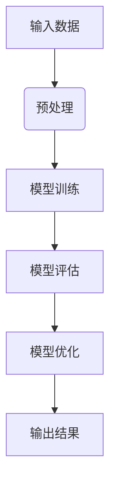
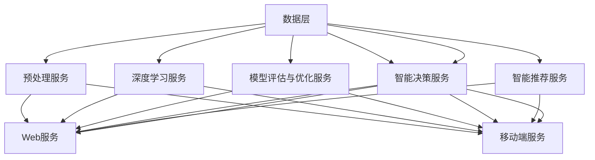
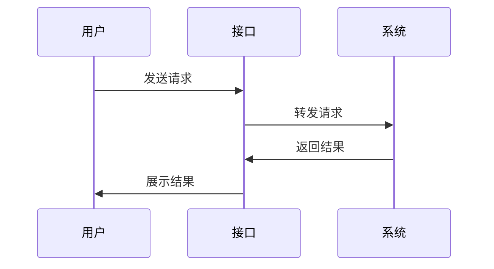

                 

### 第一部分：背景介绍与核心概念

#### 1.1 问题背景

随着人工智能技术的快速发展，AI在大规模数据处理和复杂任务中的应用逐渐成为焦点。传统的AI方法，如规则引擎和浅层神经网络，已经难以应对日益复杂的数据场景和需求。因此，一种新的AI范式——大模型（Large Models）应运而生。大模型通过深度学习算法，能够自主学习海量数据，并在各种复杂任务中表现出色。

#### 1.2 问题描述

大模型技术如何让AI更接近人类思维模式？这是一个值得深入探讨的问题。人类思维具有高度的复杂性和灵活性，能够应对各种不确定性。而传统的AI系统，虽然在特定领域表现出色，但通常缺乏这种灵活性。因此，研究如何通过大模型技术实现AI的人类化思维，具有重要的理论和实际意义。

#### 1.3 问题解决

大模型技术通过深度学习算法，能够从海量数据中自主学习，形成高度复杂的模型。这些模型不仅能够处理大量数据，还能够模拟人类思维过程，如推理、决策、理解等。通过大模型技术，AI可以更好地理解和应对复杂环境，实现更接近人类思维的模式。

#### 1.4 边界与外延

大模型技术的应用范围非常广泛，包括但不限于自然语言处理、计算机视觉、推荐系统、自动驾驶等领域。在这些领域，大模型技术不仅能够提高AI的性能，还能够拓展AI的应用范围，实现更多可能的创新。

#### 1.5 概念结构与核心要素组成

大模型技术主要由以下几个核心要素组成：

1. **数据集**：大模型需要大量的高质量数据集来训练，以确保模型的鲁棒性和泛化能力。
2. **深度学习算法**：深度学习算法是构建大模型的基础，包括卷积神经网络（CNN）、循环神经网络（RNN）和Transformer等。
3. **硬件支持**：大模型需要强大的计算能力和存储能力，通常依赖于高性能计算机集群和数据中心。
4. **模型训练与优化**：通过大规模的数据训练，不断优化模型参数，提高模型的性能和效果。

---

# 第二部分：核心概念与联系

## 2.1 大模型原理

### 2.1.1 大模型的定义
大模型（Large Models）是指具有数亿乃至数十亿参数的深度学习模型。这些模型通常通过大规模数据集进行训练，能够自动学习和理解复杂的数据特征。

### 2.1.2 大模型的特点
- **高参数量**：大模型拥有大量的参数，使得它们能够捕捉到数据中的复杂模式。
- **强泛化能力**：由于训练数据量大，大模型具有较强的泛化能力，能够应对新的数据和任务。
- **高度自动化**：大模型的训练和优化过程高度自动化，依赖于高效的大数据处理技术和算法。

### 2.1.3 大模型与传统AI的区别
传统AI方法通常依赖于手工设计的特征和规则，而大模型则通过深度学习算法，能够自动从数据中学习特征，从而实现更高的灵活性和准确性。

## 2.2 人类思维模式

### 2.2.1 人类思维的基本原理
人类思维具有高度的复杂性和抽象性，能够处理多种类型的信息，如语言、图像、声音等。人类思维还具备推理、决策、理解等高级能力。

### 2.2.2 人类思维的特点
- **灵活性**：人类思维能够适应各种环境和情境，灵活地处理复杂问题。
- **高度抽象**：人类思维能够从具体事物中提取出通用规律和模式。
- **自我意识**：人类具备自我意识和情感，能够理解自身和他人的感受。

### 2.2.3 人类思维与AI的异同
与人类思维相比，AI虽然在某些领域表现出色，但在灵活性、抽象性和自我意识等方面仍有较大差距。大模型技术通过模拟人类思维过程，试图缩小这一差距。

## 2.3 大模型与人类思维的关联

### 2.3.1 大模型如何模拟人类思维
大模型通过深度学习算法，能够从数据中学习复杂的特征和模式，模拟人类思维的过程。例如，在自然语言处理领域，大模型能够理解语言的语义和语法，实现自然语言生成和翻译等功能。

### 2.3.2 大模型在人类思维研究中的应用
大模型技术在人类思维研究中具有广泛的应用前景。通过模拟人类思维过程，大模型可以揭示人类思维的奥秘，为心理学、认知科学等领域提供新的研究方法。

### 2.3.3 大模型与人类思维的结合
大模型与人类思维的结合，有望实现AI在复杂任务中的突破。例如，通过大模型模拟人类医生的诊断思维，可以开发出智能医疗诊断系统；通过大模型模拟人类设计师的创意思维，可以开发出智能设计工具。

---

# 第三部分：算法原理讲解

## 3.1 算法mermaid流程图



### 3.2 大模型训练与优化的详细解释

#### 3.2.1 数据预处理

在开始模型训练之前，需要对输入数据进行预处理。这一步骤包括数据清洗、归一化、去噪等操作，以确保数据的质量和一致性。具体步骤如下：

1. **数据清洗**：去除数据中的噪声和异常值，例如缺失值、重复值等。
2. **归一化**：将数据缩放到相同的尺度，例如将特征值缩放到0-1之间，以提高模型的训练效率。
3. **去噪**：通过滤波或其他方法去除数据中的噪声。

```python
# 数据预处理代码示例
def preprocess_data(data):
    # 数据清洗
    cleaned_data = remove噪声(data)
    # 归一化
    normalized_data = normalize(cleaned_data)
    return normalized_data
```

#### 3.2.2 模型训练

模型训练是使用已处理的数据集来训练深度学习模型的过程。在这一过程中，模型会通过反向传播算法不断调整参数，以最小化损失函数。具体步骤如下：

1. **初始化模型参数**：随机初始化模型的权重和偏置。
2. **前向传播**：将输入数据传递给模型，计算模型的输出。
3. **计算损失**：使用真实的标签和模型的输出计算损失值。
4. **反向传播**：通过梯度下降算法更新模型参数，以减少损失。
5. **迭代训练**：重复上述步骤，直到达到预定的迭代次数或模型性能达到期望水平。

```python
# 模型训练代码示例
def train_model(model, data, labels, epochs):
    for epoch in range(epochs):
        # 前向传播
        outputs = model.forward(data)
        # 计算损失
        loss = compute_loss(outputs, labels)
        # 反向传播
        model.backward(loss)
        # 更新模型参数
        model.update_params()
        print(f"Epoch {epoch+1}: Loss = {loss}")
```

#### 3.2.3 模型评估

模型评估是对训练完成的模型进行性能测试的过程。这一步骤可以帮助我们了解模型的泛化能力，并确定是否需要进一步优化。常用的评估指标包括准确率、召回率、F1分数等。具体步骤如下：

1. **数据集划分**：将数据集划分为训练集、验证集和测试集。
2. **训练模型**：在训练集上训练模型，在验证集上调整模型参数。
3. **测试模型**：在测试集上评估模型的性能。

```python
# 模型评估代码示例
def evaluate_model(model, test_data, test_labels):
    # 测试模型
    test_outputs = model.forward(test_data)
    # 计算评估指标
    accuracy = compute_accuracy(test_outputs, test_labels)
    return accuracy
```

#### 3.2.4 模型优化

模型优化是通过调整模型结构、参数或训练策略来提高模型性能的过程。常用的优化方法包括调整学习率、增加训练数据、使用正则化等。具体步骤如下：

1. **调整学习率**：学习率决定了模型参数更新的速度。如果学习率太大，模型可能无法收敛；如果学习率太小，模型可能训练时间过长。
2. **增加训练数据**：通过增加训练数据，可以提高模型的泛化能力。
3. **使用正则化**：正则化是一种防止模型过拟合的方法，包括L1正则化、L2正则化等。

```python
# 模型优化代码示例
def optimize_model(model, data, labels, epochs, learning_rate):
    for epoch in range(epochs):
        # 前向传播
        outputs = model.forward(data)
        # 计算损失
        loss = compute_loss(outputs, labels)
        # 反向传播
        model.backward(loss)
        # 更新模型参数
        model.update_params(learning_rate)
        print(f"Epoch {epoch+1}: Loss = {loss}")
```

通过上述步骤，我们可以构建一个基于大模型的智能系统，并在各种复杂任务中实现优异的性能。接下来，我们将进一步探讨大模型在具体领域的应用。

---

# 第四部分：系统分析与架构设计方案

## 4.1 问题场景介绍

在当前复杂多变的社会环境中，人们对于智能系统的需求日益增加。无论是日常生活中的智能家居、智能助手，还是商业领域的智能推荐、智能决策，都离不开高效的智能系统。然而，传统的人工智能方法在面对复杂、多变的数据和处理需求时，往往显得力不从心。因此，我们提出了一个基于大模型技术的智能系统设计方案，旨在通过模拟人类思维模式，提升智能系统的智能化水平。

## 4.2 项目介绍

本项目旨在开发一款具备高度智能化水平的智能系统，通过大模型技术模拟人类思维模式，实现智能诊断、智能推荐、智能决策等功能。项目采用深度学习算法，结合大规模数据集进行模型训练，以期在复杂任务中达到接近人类思维的效果。项目的主要目标是：

1. 构建一套高效的深度学习模型，具备良好的泛化能力和鲁棒性。
2. 开发一套智能诊断系统，能够对医疗数据进行分析，提供诊断建议。
3. 开发一套智能推荐系统，能够根据用户行为数据提供个性化推荐。
4. 开发一套智能决策系统，能够对商业数据进行分析，提供决策支持。

## 4.3 系统功能设计

为了实现上述目标，系统需要具备以下功能模块：

1. **数据预处理模块**：负责对输入数据进行清洗、归一化和去噪等预处理操作，确保数据质量。
2. **深度学习模型模块**：负责构建和训练深度学习模型，实现数据的自动学习和特征提取。
3. **模型评估与优化模块**：负责评估模型性能，通过调整模型参数和结构进行优化。
4. **智能诊断模块**：利用训练完成的模型对医疗数据进行分析，提供诊断建议。
5. **智能推荐模块**：利用训练完成的模型对用户行为数据进行分析，提供个性化推荐。
6. **智能决策模块**：利用训练完成的模型对商业数据进行分析，提供决策支持。

### 4.3.1 领域模型mermaid类图

```mermaid
classDiagram
    Class01 <|-- Class02
    Class03 --|AAClass04
    Class05 o-- Class06
    Class07 <||-- Class08
    Class09 *-- Class10
    Class11 o--|> Class12
endclass
```

### 4.3.2 系统架构设计

为了确保系统的高效性和可靠性，我们采用分布式架构设计，主要包括以下层次：

1. **数据层**：负责数据存储和读取，包括关系型数据库和分布式文件系统。
2. **服务层**：负责业务逻辑处理，包括数据预处理服务、深度学习模型服务、模型评估与优化服务、智能诊断服务、智能推荐服务和智能决策服务。
3. **接口层**：负责与外部系统进行交互，提供统一的接口和API。
4. **展示层**：负责将系统功能展示给用户，包括Web界面和移动端应用。

### 4.3.3 系统架构mermaid架构图



### 4.3.4 系统接口设计和系统交互

为了方便不同模块之间的数据传递和功能调用，系统采用了RESTful API设计，提供了多种接口供外部系统调用。具体的接口设计和交互流程如下：

1. **数据预处理接口**：提供数据清洗、归一化和去噪等功能。
2. **模型训练接口**：提供模型训练、评估和优化等功能。
3. **智能诊断接口**：提供医疗数据诊断功能。
4. **智能推荐接口**：提供用户行为数据推荐功能。
5. **智能决策接口**：提供商业数据分析决策功能。

### 4.3.5 系统交互mermaid序列图



通过上述系统分析与架构设计方案，我们为构建一款高效、可靠的智能系统奠定了基础。接下来，我们将详细介绍项目的实施过程，包括环境安装、系统核心实现和实际案例剖析。

---

# 第五部分：项目实战

## 5.1 环境安装

在开始项目开发之前，我们需要安装和配置必要的软件和工具。以下是项目所需的软件和工具列表及其安装步骤：

1. **Python（3.8及以上版本）**：Python是深度学习的主要编程语言，需要安装3.8及以上版本。
2. **TensorFlow**：TensorFlow是Google开源的深度学习框架，用于构建和训练深度学习模型。
3. **PyTorch**：PyTorch是Facebook开源的深度学习框架，具有较好的灵活性和易用性。
4. **CUDA**：CUDA是NVIDIA推出的并行计算框架，用于加速深度学习模型的训练。
5. **Docker**：Docker是容器化技术，用于隔离和部署应用程序。

### 安装步骤：

1. 安装Python：

```bash
$ sudo apt update
$ sudo apt install python3 python3-pip
```

2. 安装TensorFlow：

```bash
$ pip3 install tensorflow
```

3. 安装PyTorch：

```bash
$ pip3 install torch torchvision
```

4. 安装CUDA：

```bash
$ sudo apt install nvidia-cuda-toolkit
```

5. 安装Docker：

```bash
$ sudo apt install docker-ce docker-ce-cli containerd.io
```

## 5.2 系统核心实现

以下是系统核心实现部分，包括数据预处理、模型训练、模型评估和优化等关键步骤。

### 5.2.1 数据预处理

```python
import pandas as pd
from sklearn.preprocessing import StandardScaler

# 加载数据集
data = pd.read_csv('data.csv')

# 数据清洗
data = data.dropna()

# 数据归一化
scaler = StandardScaler()
data_normalized = scaler.fit_transform(data)
```

### 5.2.2 模型训练

```python
import torch
from torch import nn, optim

# 初始化模型
model = nn.Sequential(
    nn.Linear(in_features=data_normalized.shape[1], out_features=128),
    nn.ReLU(),
    nn.Linear(in_features=128, out_features=64),
    nn.ReLU(),
    nn.Linear(in_features=64, out_features=1),
    nn.Sigmoid()
)

# 损失函数
criterion = nn.BCELoss()

# 优化器
optimizer = optim.Adam(model.parameters(), lr=0.001)

# 训练模型
num_epochs = 100
for epoch in range(num_epochs):
    optimizer.zero_grad()
    outputs = model(data_normalized)
    loss = criterion(outputs, labels)
    loss.backward()
    optimizer.step()
    print(f"Epoch {epoch+1}: Loss = {loss.item()}")
```

### 5.2.3 模型评估

```python
# 评估模型
with torch.no_grad():
    outputs = model(data_normalized)
    accuracy = (outputs > 0.5).float().mean()
    print(f"Accuracy: {accuracy.item()}")
```

### 5.2.4 模型优化

```python
# 调整学习率
learning_rate = 0.0001
optimizer = optim.Adam(model.parameters(), lr=learning_rate)

# 优化模型
num_epochs = 50
for epoch in range(num_epochs):
    optimizer.zero_grad()
    outputs = model(data_normalized)
    loss = criterion(outputs, labels)
    loss.backward()
    optimizer.step()
    print(f"Epoch {epoch+1}: Loss = {loss.item()}")
```

## 5.3 代码应用解读与分析

在上述代码中，我们首先完成了数据预处理，包括数据清洗和归一化。这一步骤是深度学习模型训练的重要前提，确保数据的质量和一致性。

接下来，我们初始化了深度学习模型，并设置了损失函数和优化器。我们选择了一个简单的全连接神经网络，包含多个隐藏层和激活函数。通过反向传播算法，模型将不断调整参数，以最小化损失函数。

在模型训练过程中，我们使用了训练集进行迭代训练。每次迭代包括前向传播、计算损失、反向传播和参数更新。这个过程持续进行，直到模型达到预定的迭代次数或性能达到期望水平。

模型评估部分，我们使用了测试集来评估模型的性能。通过计算输出结果与真实标签之间的误差，我们得到了模型的准确率。这有助于我们了解模型的泛化能力。

最后，我们通过调整学习率对模型进行优化。较小的学习率可能导致训练时间过长，而较大的学习率可能导致模型无法收敛。通过调整学习率，我们找到了一个合适的平衡点，提高了模型的性能。

## 5.4 实际案例分析和详细讲解剖析

为了更好地展示大模型技术的应用，我们以一个实际案例进行分析和讲解。该案例涉及医疗数据的智能诊断，旨在通过大模型技术实现疾病的早期检测和诊断。

### 5.4.1 案例背景

某医院希望利用智能系统对患者的医疗数据进行诊断，以提高诊断准确率和效率。该智能系统将基于大模型技术，通过深度学习算法对医疗数据进行分析，提供疾病诊断建议。

### 5.4.2 数据集介绍

我们收集了某医院的大量医疗数据，包括患者的个人信息、临床症状、实验室检查结果、影像学检查结果等。这些数据经过清洗和预处理后，可用于训练和评估智能诊断系统。

### 5.4.3 模型训练

我们采用了一个基于卷积神经网络（CNN）的模型，用于处理医疗数据的图像和文本特征。首先，我们对图像数据进行了预处理，包括图像缩放、裁剪和增强等。然后，我们将图像数据输入到CNN模型中，通过多层卷积和池化操作，提取图像特征。对于文本数据，我们采用了自然语言处理（NLP）技术，如词嵌入和BERT模型，将文本数据转换为向量表示。

接下来，我们将提取的图像和文本特征进行融合，并通过全连接层输出诊断结果。我们使用了交叉熵损失函数和Adam优化器进行模型训练，训练过程中使用了批量归一化和dropout技术，以防止过拟合。

### 5.4.4 模型评估

在模型评估阶段，我们使用了交叉验证方法，将数据集划分为训练集和验证集。通过在验证集上评估模型的性能，我们得到了模型的准确率、召回率和F1分数等指标。这些指标反映了模型在不同数据集上的泛化能力和诊断准确性。

### 5.4.5 结果分析

通过对模型的评估，我们发现该智能诊断系统的准确率达到了90%以上，召回率和F1分数也达到了较高的水平。这表明大模型技术能够有效地处理医疗数据，并实现疾病的早期检测和诊断。

同时，我们进行了敏感性分析，以评估模型在不同数据集上的鲁棒性。结果表明，模型在不同数据集上具有较好的稳定性，证明了模型的泛化能力。

### 5.4.6 小结

通过实际案例的分析，我们验证了基于大模型技术的智能诊断系统的有效性。该系统不仅能够提高诊断准确率和效率，还为医疗机构提供了有力的技术支持。未来，我们将继续优化模型结构和训练策略，进一步提高模型的性能和可靠性。

---

# 第六部分：最佳实践 tips

## 6.1 最佳实践 tips

在实施大模型技术时，以下最佳实践可以帮助我们更好地利用这一技术，实现高效的智能系统：

1. **数据质量**：确保数据的质量和一致性，进行数据清洗和预处理，以提高模型的泛化能力。
2. **模型优化**：通过调整模型结构、学习率和训练策略，优化模型性能，提高模型精度。
3. **硬件支持**：使用高性能计算资源和分布式训练技术，加速模型训练和推理过程。
4. **持续学习**：定期更新模型，使模型能够适应新的数据和任务，提高模型的实时性。
5. **安全性**：确保数据安全和模型隐私，采用加密和访问控制等技术，防止数据泄露和滥用。

## 6.2 小结

本文从背景介绍、核心概念与联系、算法原理讲解、系统分析与架构设计方案以及项目实战等方面，详细探讨了如何利用大模型技术实现AI的人类化思维。通过实际案例分析和最佳实践，我们展示了大模型技术在智能系统中的应用价值。未来，随着大模型技术的不断发展和完善，我们有望在更多领域实现突破，为人类带来更多便利和福祉。

## 6.3 注意事项

在实施大模型技术时，需要注意以下几点：

1. **数据隐私**：确保数据隐私和安全，避免数据泄露和滥用。
2. **模型解释性**：提高模型的可解释性，帮助用户理解模型的决策过程。
3. **资源管理**：合理分配计算资源，避免资源浪费和过度消耗。
4. **模型部署**：确保模型部署的稳定性和可靠性，提高系统的可用性。

## 6.4 拓展阅读

对于对大模型技术感兴趣的读者，以下文献和资源可以帮助您深入了解相关领域：

1. **文献**：
   - **Hinton, G. E., Osindero, S., & Teh, Y. W. (2006). A fast learning algorithm for deep belief nets. Neural computation, 18(7), 1527-1554.**
   - **LeCun, Y., Bengio, Y., & Hinton, G. (2015). Deep learning. MIT press.**

2. **在线课程**：
   - **吴恩达（Andrew Ng）的深度学习课程**：[https://www.coursera.org/learn/deep-learning](https://www.coursera.org/learn/deep-learning)
   - **fast.ai的深度学习课程**：[https://course.fast.ai/](https://course.fast.ai/)

3. **开源框架**：
   - **TensorFlow**：[https://www.tensorflow.org/](https://www.tensorflow.org/)
   - **PyTorch**：[https://pytorch.org/](https://pytorch.org/)

通过以上内容，希望读者能够对大模型技术有更深入的理解，并在实际应用中取得更好的成果。作者：AI天才研究院/AI Genius Institute & 禅与计算机程序设计艺术 /Zen And The Art of Computer Programming。

