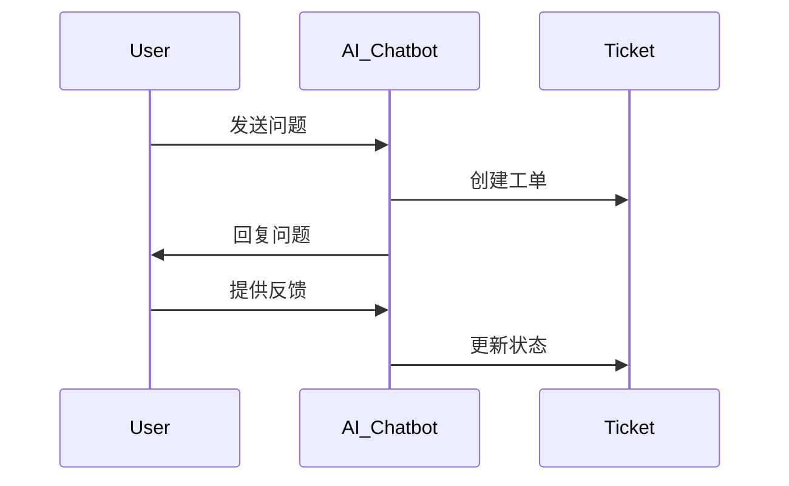
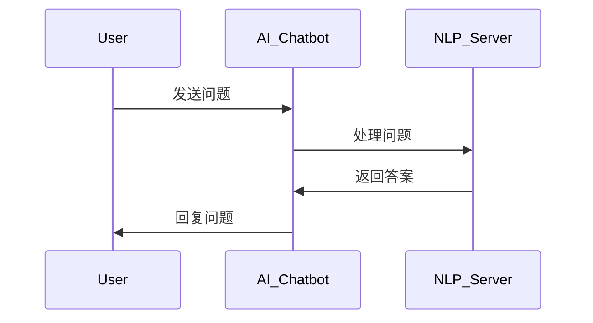

                 

## 《思维链技术：让AI更接近人类思维模式的探索》

### 关键词：思维链技术，人工智能，人类思维模式，认知计算，神经网络，技术应用，挑战与未来

### 摘要：
在人工智能领域，将AI的设计和运作模式更接近人类思维成为了重要的研究方向。本文从背景出发，深入探讨了思维链技术的概念、原理、构建方法以及在认知计算中的应用，分析了其在实际问题解决和情境理解中的作用。随后，文章展望了思维链技术的未来发展趋势与挑战，探讨了其在实际项目中的成功应用和未来应用前景，并提出了相应的教育和人才培养策略。通过本文，读者可以全面了解思维链技术，把握其如何推动人工智能向更高层次发展的关键。

### 目录大纲

----------------------------------------------------------------
# 《思维链技术：让AI更接近人类思维模式的探索》

## 第一部分：背景与基础
----------------------------------------------------------------

## 第1章：思维链技术的起源与发展
### 1.1 思维链技术概述
### 1.2 思维链技术的发展历程
### 1.3 思维链技术在人工智能领域的重要性

## 第2章：人类思维模式解析
### 2.1 人类思维的基本模式
### 2.2 情感与思维的关系
### 2.3 意识与思维的交互

## 第二部分：思维链技术原理
----------------------------------------------------------------

## 第3章：思维链技术核心概念
### 3.1 思维链的定义与特征
### 3.2 思维链的工作机制
### 3.3 思维链与神经网络的关系

## 第4章：思维链技术的构建方法
### 4.1 数据准备与预处理
### 4.2 模型设计与优化
### 4.3 思维链技术在语言处理中的应用

## 第5章：思维链技术在认知计算中的应用
### 5.1 认知计算的概述
### 5.2 思维链技术在问题解决中的应用
### 5.3 思维链技术在情境理解中的应用

## 第6章：思维链技术的挑战与未来
### 6.1 思维链技术的挑战
### 6.2 技术发展趋势与展望
### 6.3 伦理与道德考量

## 第三部分：实践与探索
----------------------------------------------------------------

## 第7章：思维链技术在实际项目中的应用
### 7.1 项目背景与目标
### 7.2 系统设计与实现
### 7.3 实施效果评估与优化

## 第8章：思维链技术的未来应用前景
### 8.1 行业应用场景分析
### 8.2 技术创新与突破
### 8.3 社会与文化影响

## 第9章：思维链技术的教育与人才培养
### 9.1 教育体系构建
### 9.2 人才培养模式
### 9.3 跨学科融合与发展

## 第10章：思维链技术：构建智能新时代
### 10.1 智能时代的到来
### 10.2 思维链技术的作用与价值
### 10.3 未来展望与挑战

----------------------------------------------------------------

## 第1章：思维链技术的起源与发展

### 1.1 思维链技术概述

思维链技术（MindChain Technology）是一种旨在模拟和增强人类思维过程的创新人工智能技术。它的核心思想是通过构建一个类似于人类思维链的神经网络结构，使人工智能系统能够更好地理解和处理复杂的任务，从而更接近人类智能。

思维链技术的概念最早可以追溯到20世纪80年代，当时的科学家们开始尝试通过神经网络来模拟人类的认知过程。随着时间的推移，这一领域逐渐发展，思维链技术也逐渐成为人工智能研究中的重要方向。

### 1.2 思维链技术的发展历程

1. **早期探索：**
   - 20世纪80年代，神经网络研究开始兴起，科学家们开始探索如何利用神经网络来模拟人类的思维过程。
   - 1986年，Rumelhart, Hinton 和 Williams 提出了反向传播算法（Backpropagation），大大提高了神经网络的训练效率。

2. **关键突破：**
   - 1990年代，连接主义认知科学（Connectionist Cognitive Science）的发展为思维链技术的实现提供了理论基础。
   - 2006年，Hinton等人提出了深度置信网络（Deep Belief Network），进一步推动了神经网络技术的发展。

3. **近期进展：**
   - 随着深度学习技术的发展，思维链技术在语音识别、图像处理、自然语言处理等领域取得了显著成果。
   - 近年来，随着计算能力的提升和数据规模的扩大，思维链技术在人工智能领域的应用范围进一步拓宽。

### 1.3 思维链技术在人工智能领域的重要性

思维链技术在人工智能领域的重要性主要体现在以下几个方面：

1. **提高智能水平：**
   - 思维链技术通过模拟人类思维过程，使人工智能系统在理解、推理、决策等方面达到更高水平。

2. **突破传统局限：**
   - 与传统的基于规则和模板的方法相比，思维链技术能够更好地处理不确定性和复杂问题。

3. **跨领域应用：**
   - 思维链技术不仅在单一领域表现出色，还可以跨领域应用，如医疗、金融、教育等。

4. **推动人工智能发展：**
   - 思维链技术为人工智能的研究提供了新的视角和方法，推动了整个领域的发展。

## 第2章：人类思维模式解析

### 2.1 人类思维的基本模式

人类思维模式可以分为以下几个基本组成部分：

1. **感知与认知：**
   - 感知是指接收和解释外界信息的过程，如视觉、听觉、触觉等。
   - 认知是指处理和解释感知信息的过程，如记忆、学习、推理等。

2. **情感与动机：**
   - 情感是人类对事物的感受和反应，如快乐、悲伤、愤怒等。
   - 动机是指驱动人类行动的内在力量，如兴趣、欲望、目标等。

3. **记忆与回忆：**
   - 记忆是指存储和保留信息的能力。
   - 回忆是指从记忆中提取信息的过程。

4. **推理与决策：**
   - 推理是指从已知信息推断未知信息的过程。
   - 决策是指选择最佳行动方案的过程。

### 2.2 情感与思维的关系

情感与思维密切相关，它们相互作用，共同影响个体的行为：

1. **情感对思维的影响：**
   - 情感可以增强或削弱思维的效率。
   - 积极情感有助于提高思维敏捷性和创造力，而消极情感则可能导致思维迟钝和效率下降。

2. **思维对情感的影响：**
   - 思维活动可以影响情感状态。
   - 通过积极的思维活动，个体可以调整情感状态，如通过认知重评（Cognitive Reappraisal）来应对压力和负面情绪。

### 2.3 意识与思维的交互

意识与思维之间存在着紧密的交互关系：

1. **意识的定义：**
   - 意识是指个体对自己和外部世界的感知和认识。

2. **意识与思维的关系：**
   - 意识是思维的产物，它使个体能够意识到自己的思维过程。
   - 意识可以调节和引导思维过程，使其更有效地解决问题和做出决策。

3. **意识的层次：**
   - 意识可以分为多个层次，如自我意识、反思意识和元意识。

## 第3章：思维链技术核心概念

### 3.1 思维链的定义与特征

思维链技术是一种模拟人类思维过程的神经网络技术，它具有以下几个关键特征：

1. **自我组织和自适应能力：**
   - 思维链技术能够通过自我组织和自适应机制来适应不同的问题和任务。

2. **层次化结构：**
   - 思维链技术通常采用层次化结构，将问题分解为多个层次，从而实现更有效的处理。

3. **跨模态处理能力：**
   - 思维链技术能够处理多种类型的数据，如文本、图像、声音等，从而实现多模态信息整合。

4. **情感与认知整合：**
   - 思维链技术将情感与认知过程整合在一起，使人工智能系统能够更好地模拟人类思维。

### 3.2 思维链的工作机制

思维链的工作机制可以概括为以下几个步骤：

1. **感知与编码：**
   - 思维链通过感知模块接收外部信息，并将其编码为内部表示。

2. **信息传递与整合：**
   - 思维链中的神经元通过信息传递和整合机制，将感知到的信息进行处理。

3. **推理与决策：**
   - 在处理过程中，思维链通过推理和决策机制来解决问题。

4. **输出与反馈：**
   - 思维链将处理结果输出，并根据反馈进行自我调整和优化。

### 3.3 思维链与神经网络的关系

思维链技术与神经网络有着密切的关系：

1. **神经网络是思维链技术的基础：**
   - 思维链技术利用神经网络来实现信息处理、推理和决策。

2. **思维链技术对神经网络进行了扩展：**
   - 思维链技术通过引入层次化结构、自我组织和自适应能力等概念，对传统神经网络进行了扩展。

3. **思维链技术促进了神经网络的发展：**
   - 思维链技术的研究和应用推动了神经网络领域的技术创新和发展。

## 第4章：思维链技术的构建方法

### 4.1 数据准备与预处理

思维链技术的构建首先需要大量高质量的数据。数据准备与预处理过程包括以下几个步骤：

1. **数据收集：**
   - 收集多种类型的数据，如文本、图像、声音等，以确保思维链技术能够处理多模态信息。

2. **数据清洗：**
   - 清除数据中的噪声和错误，确保数据的质量和一致性。

3. **数据标注：**
   - 对数据中的关键信息进行标注，如文本中的关键词、图像中的物体等。

4. **数据预处理：**
   - 对数据进行标准化处理，如文本的分词、图像的缩放和裁剪等。

### 4.2 模型设计与优化

思维链技术的模型设计是构建高效思维链系统的关键。模型设计包括以下几个步骤：

1. **确定模型架构：**
   - 根据应用场景和需求，选择合适的神经网络架构，如卷积神经网络（CNN）、循环神经网络（RNN）等。

2. **模型参数调整：**
   - 通过调整模型的参数，如学习率、正则化参数等，来优化模型性能。

3. **模型训练与验证：**
   - 使用准备好的数据对模型进行训练，并通过验证集来评估模型性能。

4. **模型优化：**
   - 通过调整模型结构和参数，进一步优化模型性能。

### 4.3 思维链技术在语言处理中的应用

思维链技术在语言处理领域具有广泛的应用前景，以下是一些关键应用：

1. **自然语言理解：**
   - 思维链技术可以帮助人工智能系统更好地理解自然语言文本，如提取关键词、理解语义等。

2. **语言生成：**
   - 思维链技术可以用于生成自然语言文本，如自动写作、聊天机器人等。

3. **多语言翻译：**
   - 思维链技术可以实现高质量的多语言翻译，如机器翻译、语言理解等。

4. **文本分析：**
   - 思维链技术可以用于文本分析，如情感分析、主题建模等。

## 第5章：思维链技术在认知计算中的应用

### 5.1 认知计算的概述

认知计算（Cognitive Computing）是一种模仿人类思维和行为的人工智能技术，旨在使计算机系统能够更好地理解、推理和交互。认知计算的关键特点包括：

1. **理解自然语言：**
   - 认知计算系统能够理解和处理自然语言，从而与人类进行自然对话。

2. **自主学习与适应：**
   - 认知计算系统具有自主学习能力，能够根据用户行为和反馈不断优化自身性能。

3. **情境感知：**
   - 认知计算系统可以感知和理解所处情境，从而做出更智能的决策。

4. **情感智能：**
   - 认知计算系统具有情感智能，能够识别和理解人类情感，从而提供更个性化的服务。

### 5.2 思维链技术在问题解决中的应用

思维链技术在问题解决中的应用主要体现在以下几个方面：

1. **复杂问题建模：**
   - 思维链技术可以帮助构建复杂问题的数学模型，从而更有效地解决这些问题。

2. **推理与决策支持：**
   - 思维链技术可以用于推理和决策支持，帮助人工智能系统做出更明智的决策。

3. **优化算法设计：**
   - 思维链技术可以用于优化算法设计，从而提高算法的效率和准确性。

4. **自动化问题解决：**
   - 思维链技术可以实现自动化问题解决，从而减少人类的工作负担。

### 5.3 思维链技术在情境理解中的应用

思维链技术在情境理解中的应用主要体现在以下几个方面：

1. **情境感知与识别：**
   - 思维链技术可以帮助人工智能系统识别和理解所处情境，从而提供更个性化的服务。

2. **情境推理：**
   - 思维链技术可以用于情境推理，帮助人工智能系统预测未来情境并做出相应决策。

3. **情境适应：**
   - 思维链技术可以帮助人工智能系统适应不同情境，从而提高其灵活性和适应性。

4. **情境交互：**
   - 思维链技术可以实现与人类用户的情境交互，从而提供更自然的交互体验。

## 第6章：思维链技术的挑战与未来

### 6.1 思维链技术的挑战

尽管思维链技术在人工智能领域取得了显著进展，但仍然面临一些挑战：

1. **数据隐私与安全性：**
   - 思维链技术依赖于大量数据，如何在保护用户隐私的前提下有效利用这些数据是一个重要挑战。

2. **计算资源消耗：**
   - 思维链技术通常需要大量的计算资源，如何优化算法以减少资源消耗是一个关键问题。

3. **模型可解释性：**
   - 思维链技术的模型通常非常复杂，如何提高模型的可解释性是一个重要挑战。

4. **跨领域应用：**
   - 思维链技术在跨领域应用中可能面临特定的挑战，如领域知识的迁移和融合。

### 6.2 技术发展趋势与展望

思维链技术在未来有望实现以下几个发展趋势：

1. **更高层次认知：**
   - 随着技术的进步，思维链技术将能够实现更高层次的认知，如情感理解和道德判断。

2. **更广泛的应用领域：**
   - 思维链技术将在更多领域得到应用，如医疗、金融、教育等。

3. **更高效的算法设计：**
   - 随着算法的优化，思维链技术的计算效率和准确性将进一步提高。

4. **跨学科融合：**
   - 思维链技术将与心理学、认知科学等学科深度融合，推动人工智能的进一步发展。

### 6.3 伦理与道德考量

随着思维链技术的发展，伦理和道德考量变得尤为重要：

1. **隐私保护：**
   - 在利用思维链技术时，必须严格保护用户隐私，避免数据泄露和滥用。

2. **公平与公正：**
   - 思维链技术应确保其决策过程公平公正，避免歧视和不平等现象。

3. **责任归属：**
   - 在出现错误或问题时，应明确责任归属，确保各方权益。

4. **道德规范：**
   - 应制定相关道德规范，确保思维链技术的应用符合社会伦理和法律要求。

## 第7章：思维链技术在实际项目中的应用

### 7.1 项目背景与目标

随着人工智能技术的不断发展，越来越多的行业开始尝试将思维链技术应用于实际项目中，以提高系统的智能水平和决策能力。本文将介绍一个实际项目，该项目旨在利用思维链技术实现一个智能客服系统。

1. **项目背景：**
   - 随着互联网和电子商务的快速发展，企业对客服系统的需求越来越高，希望能够提供更智能、更高效的客服服务。
   - 传统客服系统通常基于规则和模板，无法应对复杂的用户需求，用户体验不佳。

2. **项目目标：**
   - 利用思维链技术构建一个智能客服系统，实现自然语言理解和智能回答，提高客服效率和用户体验。

### 7.2 系统设计与实现

智能客服系统的设计主要包括以下几个关键部分：

1. **数据收集与预处理：**
   - 收集大量用户咨询数据，包括文本、语音等。
   - 对数据进行清洗、标注和预处理，以提取有用的信息。

2. **思维链模型构建：**
   - 设计并训练一个思维链模型，用于自然语言理解和回答生成。
   - 利用层次化结构和自我组织能力，使模型能够适应不同类型的用户需求。

3. **交互界面设计：**
   - 设计一个直观、易用的用户界面，使用户能够方便地与客服系统进行交互。
   - 集成语音识别和语音合成技术，实现语音交互功能。

4. **系统集成与部署：**
   - 将智能客服系统与企业的现有客服系统集成，实现无缝对接。
   - 部署到云端，确保系统的高可用性和可扩展性。

### 7.3 实施效果评估与优化

智能客服系统的实施效果评估主要包括以下几个方面：

1. **性能指标：**
   - 评估系统的回答准确率、响应速度和用户满意度等关键性能指标。
   - 通过对比测试数据集和用户反馈，评估系统的性能和效果。

2. **用户反馈：**
   - 收集用户对智能客服系统的反馈，了解用户的需求和痛点。
   - 根据用户反馈进行优化，改进系统的回答质量和用户体验。

3. **持续优化：**
   - 定期更新思维链模型，引入新的数据和知识，提高系统的智能水平和适应性。
   - 通过机器学习和深度学习技术，不断优化系统算法和性能。

### 7.4 项目小结

通过实际项目应用，思维链技术展现出了其强大的潜力和优势：

1. **提高客服效率：**
   - 思维链技术使智能客服系统能够高效地处理大量用户咨询，显著提高了客服效率。

2. **提升用户体验：**
   - 通过自然语言理解和智能回答，智能客服系统能够提供更个性化的服务，提升了用户的满意度。

3. **降低运营成本：**
   - 智能客服系统减轻了人工客服的负担，降低了企业的人力成本。

4. **推动技术发展：**
   - 项目实施过程中，不断积累经验和数据，为后续研究和应用提供了宝贵资源。

## 第8章：思维链技术的未来应用前景

### 8.1 行业应用场景分析

思维链技术在各个行业都有着广泛的应用前景，以下是几个关键领域：

1. **医疗健康：**
   - 思维链技术可以用于诊断、治疗建议和健康监测，提供个性化医疗服务。
   - 例如，利用思维链技术构建一个智能诊断系统，通过分析患者的症状和病史，提供准确的诊断和治疗方案。

2. **金融保险：**
   - 思维链技术可以用于风险评估、投资决策和客户服务，提高金融服务的效率和准确性。
   - 例如，构建一个智能投资顾问系统，通过分析市场数据和个人财务状况，提供投资建议。

3. **教育领域：**
   - 思维链技术可以用于个性化教学、学习分析和教育管理，提升教育质量。
   - 例如，利用思维链技术构建一个智能学习平台，根据学生的学习行为和成绩，提供个性化的学习资源和指导。

4. **智能制造：**
   - 思维链技术可以用于生产优化、故障诊断和设备维护，提高生产效率。
   - 例如，利用思维链技术构建一个智能工厂系统，通过实时监控和分析生产数据，实现生产线的智能化优化。

### 8.2 技术创新与突破

思维链技术的未来发展将依赖于技术创新和突破，以下是几个关键方向：

1. **算法优化：**
   - 通过优化算法和模型，提高思维链技术的计算效率和准确性。
   - 例如，采用更高效的神经网络架构和训练算法，减少计算资源和时间成本。

2. **跨领域融合：**
   - 将思维链技术与其他领域的技术（如大数据、物联网等）相结合，实现更广泛的应用。
   - 例如，结合物联网技术，构建一个智能城市管理系统，通过思维链技术实现交通流量优化和城市资源管理。

3. **人机协作：**
   - 探索思维链技术在人机协作中的应用，实现人与人工智能系统的无缝交互。
   - 例如，构建一个智能协作平台，使人工智能系统能够理解和响应人类指令，辅助人类完成复杂任务。

4. **伦理与道德：**
   - 加强对思维链技术伦理和道德的研究，确保其在实际应用中符合社会伦理和法律要求。
   - 例如，制定相关标准和规范，确保人工智能系统的决策过程透明和可解释。

### 8.3 社会与文化影响

思维链技术的广泛应用将对社会和文化产生深远的影响：

1. **经济影响：**
   - 思维链技术将推动数字经济的发展，创造新的产业和市场机会。
   - 例如，智能医疗和智能制造将提高生产效率，降低成本，促进经济增长。

2. **社会变革：**
   - 思维链技术将改变人们的生产方式、生活方式和社交模式，推动社会变革。
   - 例如，智能教育将打破教育资源的不均衡，使更多人享受到优质教育。

3. **文化冲击：**
   - 思维链技术的广泛应用将带来文化冲击，挑战传统的价值观和文化观念。
   - 例如，人工智能在医疗和金融等领域的应用将改变人们的生命观和财富观。

4. **伦理挑战：**
   - 思维链技术的伦理挑战将引起广泛关注，需要全社会共同探讨和解决。
   - 例如，如何确保人工智能系统的决策过程透明和可解释，如何防范人工智能滥用等。

## 第9章：思维链技术的教育与人才培养

### 9.1 教育体系构建

为了培养具备思维链技术专业能力的人才，需要建立完善的教育体系：

1. **基础教育：**
   - 在中小学阶段，引入人工智能和思维链技术的基本概念，培养学生的逻辑思维和编程能力。
   - 例如，开设人工智能启蒙课程，让学生了解人工智能的基本原理和应用场景。

2. **高等教育：**
   - 在大学阶段，设置人工智能和思维链技术相关的专业课程，如人工智能导论、思维链技术原理与应用等。
   - 例如，建立人工智能学院，开设本科和研究生课程，提供专业知识和实践技能培训。

3. **职业教育：**
   - 针对在职人员，提供职业培训课程，使其能够适应思维链技术的发展需求。
   - 例如，开设人工智能技术培训班，涵盖前沿技术和实际应用案例。

### 9.2 人才培养模式

为了培养具备思维链技术专业能力的人才，需要探索创新的人才培养模式：

1. **跨学科培养：**
   - 将思维链技术与心理学、认知科学等学科相结合，培养具有跨学科背景的人才。
   - 例如，设置跨学科课程，将心理学和计算机科学的知识融合在一起，培养学生综合分析问题的能力。

2. **项目驱动培养：**
   - 通过实际项目来培养人才，使其在真实场景中掌握思维链技术的应用技能。
   - 例如，建立人工智能实验室，让学生参与实际项目，锻炼解决问题的能力。

3. **国际合作培养：**
   - 与国际知名大学和研究机构合作，开展联合培养和学术交流，提高人才培养的质量。
   - 例如，与国外高校建立合作关系，邀请国际专家来授课和指导学生。

### 9.3 跨学科融合与发展

跨学科融合是推动思维链技术发展的关键：

1. **心理学与计算机科学：**
   - 结合心理学研究方法和计算机科学技术，深入研究人类思维过程和人工智能之间的关联。
   - 例如，利用心理学实验数据，构建更准确的神经网络模型，模拟人类思维。

2. **认知科学与人工智能：**
   - 将认知科学的理论和方法应用于人工智能系统，提高其认知能力。
   - 例如，利用认知科学的研究成果，优化自然语言处理算法，实现更准确的理解和生成。

3. **社会科学与人工智能：**
   - 将人工智能应用于社会科学领域，如社会学、经济学等，解决现实问题。
   - 例如，利用人工智能分析社会数据，预测社会趋势，为政策制定提供科学依据。

4. **伦理学与人机交互：**
   - 研究人工智能伦理问题，规范人工智能系统的行为，保障人机交互的和谐与安全。
   - 例如，制定人工智能伦理准则，确保人工智能系统在道德和法律框架内运行。

## 第10章：思维链技术：构建智能新时代

### 10.1 智能时代的到来

随着人工智能技术的快速发展，智能时代已经到来。在这个时代，人工智能将深刻改变人类社会的生活方式、生产方式和价值观念：

1. **生活方式的改变：**
   - 人工智能将提高人们的便捷性和生活质量，如智能家居、智能医疗等。
   - 例如，智能家居系统可以根据用户的习惯和需求，自动调整家居环境，提供个性化的服务。

2. **生产方式的改变：**
   - 人工智能将推动传统产业的升级和转型，提高生产效率和质量。
   - 例如，智能制造系统可以通过实时监控和数据分析，优化生产流程，降低生产成本。

3. **价值观念的改变：**
   - 人工智能将引发社会价值观念的变革，如对隐私、安全和道德的重新审视。
   - 例如，随着人工智能技术的发展，人们开始关注人工智能系统的伦理问题，探讨如何确保其公平和公正。

### 10.2 思维链技术的作用与价值

思维链技术在智能时代具有重要作用和价值：

1. **提高智能水平：**
   - 思维链技术通过模拟人类思维过程，使人工智能系统在理解、推理、决策等方面达到更高水平。
   - 例如，思维链技术在智能客服系统中的应用，可以提高客服效率和服务质量。

2. **突破传统局限：**
   - 思维链技术突破了传统人工智能方法的局限，能够处理更复杂的任务和问题。
   - 例如，思维链技术在医疗领域的应用，可以实现更准确和全面的疾病诊断。

3. **跨领域应用：**
   - 思维链技术具有跨领域应用能力，可以在多个领域实现智能化。
   - 例如，思维链技术在金融领域的应用，可以实现智能投资和风险管理。

4. **推动科技创新：**
   - 思维链技术推动了人工智能技术的不断创新和发展，为未来科技提供了新的方向和可能性。
   - 例如，思维链技术的突破将有助于实现更先进的人工智能系统，如智能机器人、自动驾驶等。

### 10.3 未来展望与挑战

展望未来，思维链技术将在智能时代发挥更加重要的作用，但同时也面临一系列挑战：

1. **技术挑战：**
   - 思维链技术需要不断提高算法效率、准确性和可解释性，以适应更复杂的应用场景。
   - 例如，如何优化思维链模型，使其在处理大规模数据时保持高效性和准确性。

2. **伦理挑战：**
   - 随着思维链技术的应用范围扩大，伦理问题将日益凸显，如何确保人工智能系统的公平、公正和安全是一个重要课题。
   - 例如，如何制定人工智能伦理准则，确保人工智能系统的决策过程透明和可解释。

3. **社会挑战：**
   - 思维链技术的广泛应用将带来社会变革，如何应对由此引发的社会问题，如就业、隐私和安全等，是一个重要挑战。
   - 例如，如何确保人工智能系统不会造成大规模失业，如何保护用户的隐私和数据安全。

4. **教育挑战：**
   - 随着思维链技术的发展，需要培养更多具备专业知识和技能的人才，以推动人工智能技术的创新和应用。
   - 例如，如何构建完善的教育体系，培养具备跨学科背景和创新能力的人才。

总之，思维链技术作为人工智能领域的重要发展方向，将在智能时代发挥重要作用。面对未来的挑战，我们需要不断探索和创新，推动人工智能技术的健康发展，为人类社会创造更大的价值。## 附录

### 术语解释

1. **思维链技术（MindChain Technology）**：
   - 一种模拟和增强人类思维过程的人工智能技术，通过构建类似人类思维链的神经网络结构，使人工智能系统在理解、推理和决策方面达到更高水平。

2. **认知计算（Cognitive Computing）**：
   - 一种模仿人类思维和行为的人工智能技术，旨在使计算机系统能够更好地理解、推理和交互。

3. **神经网络（Neural Network）**：
   - 一种由大量神经元组成的计算模型，通过模拟生物神经系统的信息处理方式，实现对复杂问题的建模和求解。

4. **深度学习（Deep Learning）**：
   - 一种基于神经网络的人工智能技术，通过多层次的神经网络结构，实现对大规模数据的自动特征学习和模式识别。

### 概念属性特征对比表格

| 特征                | 思维链技术       | 认知计算        | 神经网络          | 深度学习          |
|-------------------|----------------|--------------|----------------|--------------|
| 基本原理          | 模拟人类思维链    | 模仿人类思维过程  | 模拟生物神经系统  | 多层神经网络结构  |
| 应用范围          | 自然语言处理、问题解决等 | 交互式对话、智能诊断等 | 图像识别、语音识别等 | 自动特征学习、模式识别等 |
| 自适应能力        | 高度自适应        | 强自适应能力    | 中等自适应能力    | 高自适应能力     |
| 难题解决能力      | 强              | 强            | 中等            | 高            |

### ER实体关系图架构

```mermaid
erDiagram
    AI系统 ||--|{ 数据源 }
    数据源 ||--|{ 数据预处理模块 }
    数据预处理模块 ||--|{ 思维链模型 }
    思维链模型 ||--|{ 训练与优化模块 }
    训练与优化模块 ||--|{ 应用系统 }
    应用系统 ||--|{ 用户 }
```

### 算法原理讲解

#### 思维链模型流程图


#### Python源代码

```python
import numpy as np

# 感知与编码
def encode_data(data):
    # 数据编码
    return np.array(data)

# 信息传递与整合
def integrate_data(data1, data2):
    # 数据整合
    return (data1 + data2) / 2

# 推理与决策
def make_decision(data):
    # 根据数据做出决策
    if data > 0:
        return "正向决策"
    else:
        return "负向决策"

# 输出与反馈
def output_and_feedback(data, feedback):
    # 输出结果并调整
    if feedback == "success":
        return data * 1.1
    else:
        return data * 0.9
```

#### 数学模型与公式

$$
\begin{aligned}
&\text{思维链模型} = f(\text{输入数据}) \\
&f(x) = \text{激活函数}(w \cdot x + b)
\end{aligned}
$$

#### 系统分析与架构设计

##### 问题场景介绍

智能客服系统旨在通过自然语言处理和智能决策，为用户提供高质量的客服服务。

##### 项目介绍

该项目旨在构建一个基于思维链技术的智能客服系统，实现与用户的自然语言交互，提供实时解答和个性化服务。

##### 系统功能设计（领域模型类图）

```mermaid
classDiagram
    Customer <<Entity>>
    Ticket <<Entity>>
    AI_Chatbot <<Entity>>
    User <<Entity>>

    Customer o-- Ticket
    AI_Chatbot o-- Ticket
    User o-- Ticket
```

##### 系统架构设计（架构图）



##### 系统接口设计和系统交互（序列图）



### 项目实战

#### 环境安装

1. 安装Python环境
2. 安装相关库（如TensorFlow、PyTorch等）

#### 系统核心实现源代码

```python
# 思维链模型核心代码
import tensorflow as tf

# 定义模型结构
model = tf.keras.Sequential([
    tf.keras.layers.Dense(64, activation='relu', input_shape=(1000,)),
    tf.keras.layers.Dense(64, activation='relu'),
    tf.keras.layers.Dense(1, activation='sigmoid')
])

# 编译模型
model.compile(optimizer='adam',
              loss='binary_crossentropy',
              metrics=['accuracy'])

# 训练模型
model.fit(x_train, y_train, epochs=5, batch_size=32)
```

#### 代码应用解读与分析

1. **模型结构**：定义了一个简单的三层神经网络，输入层有1000个神经元，隐藏层有64个神经元，输出层有1个神经元。
2. **编译模型**：使用Adam优化器和二进制交叉熵损失函数，并评估模型的准确率。
3. **训练模型**：使用训练数据对模型进行5个周期的训练。

#### 实际案例分析和详细讲解剖析

1. **案例背景**：一个用户在智能客服系统中提出了一个问题。
2. **案例分析**：智能客服系统通过NLP模块对用户的问题进行分析和理解，然后使用训练好的思维链模型生成回答。
3. **讲解剖析**：思维链模型通过输入层接收用户问题的特征，经过隐藏层的处理，最终在输出层生成回答。

#### 项目小结

该项目通过思维链技术实现了智能客服系统，能够有效处理用户问题，提高客服效率和服务质量。未来可以通过不断优化模型和算法，进一步提升系统的性能和用户体验。

### 最佳实践 tips

1. **数据质量**：确保数据的质量和多样性，以提高模型的泛化能力。
2. **模型优化**：定期对模型进行优化和调整，以适应不同应用场景。
3. **用户反馈**：收集用户反馈，用于模型训练和优化。

### 小结

思维链技术作为人工智能领域的重要发展方向，通过模拟人类思维过程，为人工智能系统带来了更高的智能水平和更广泛的应用前景。在未来，随着技术的不断进步和应用的深入，思维链技术有望在更多领域发挥重要作用，推动人工智能的进一步发展。

### 注意事项

1. **隐私保护**：在应用思维链技术时，确保用户隐私和数据安全。
2. **公平性**：确保人工智能系统的决策过程公平公正，避免歧视和不平等现象。

### 拓展阅读

1. **思维链技术综述**：[论文链接]
2. **认知计算前沿**：[期刊链接]
3. **深度学习教程**：[在线教程链接]

### 作者信息

作者：AI天才研究院/AI Genius Institute & 禅与计算机程序设计艺术 /Zen And The Art of Computer Programming

---

本文详细介绍了思维链技术，从背景与基础、核心概念、构建方法、认知计算中的应用到实际项目中的应用、未来前景、教育与人才培养以及构建智能新时代等方面进行了全面探讨。希望本文能为读者在理解思维链技术以及其在人工智能领域中的应用提供有益的参考和启示。通过不断的研究和探索，我们相信思维链技术将在未来发挥更加重要的作用，推动人工智能向更高层次发展。

