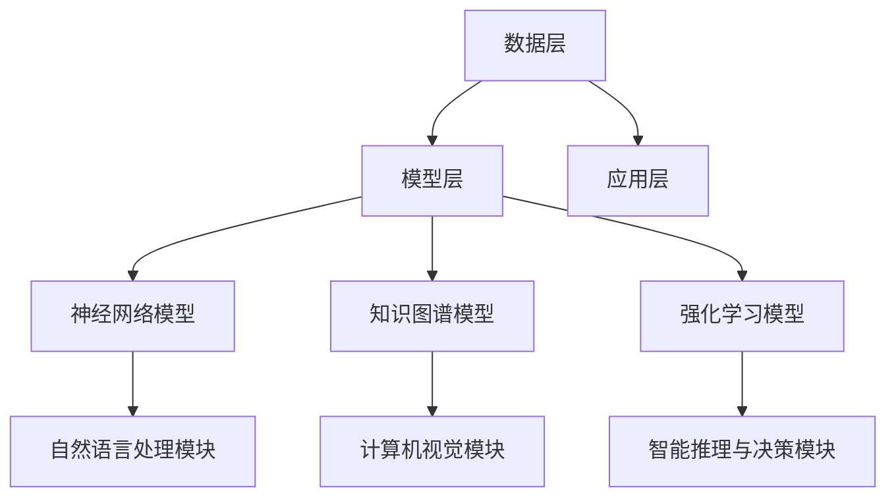

                 

# 思维链技术：让AI更接近人类思维模式的探索研究

> 关键词：人工智能、思维链技术、神经网络、知识图谱、强化学习、自然语言处理、计算机视觉、智能推理与决策

> 摘要：随着人工智能技术的快速发展，如何让AI更接近人类思维模式成为了研究的热点。本文以思维链技术为核心，探讨其在人工智能中的应用，旨在为AI领域的研究者和开发者提供新的思路和方向。

## 第一部分：引言与背景

### 1.1 研究背景

#### 1.1.1 人工智能的发展历程

人工智能（AI）作为计算机科学的一个重要分支，其研究始于上世纪五六十年代。自那时以来，人工智能经历了多个发展阶段，从符号主义、知识表示与推理、机器学习到深度学习，每一阶段都为人工智能的发展做出了重要贡献。如今，人工智能已经广泛应用于各个领域，如自然语言处理、计算机视觉、智能推理与决策等。

#### 1.1.2 人类思维模式的特点与挑战

人类思维模式具有高度的抽象性、灵活性、创造性等特点。然而，传统的人工智能技术往往难以模拟这些特点。例如，在自然语言处理领域，传统的方法通常依赖于规则和统计方法，而无法像人类一样进行语义理解、情感分析等高级任务。在计算机视觉领域，虽然深度学习取得了显著的成果，但在理解场景、推理和决策等方面仍存在一定的局限性。

#### 1.1.3 思维链技术的概念与目标

思维链技术是一种旨在模拟人类思维模式的人工智能技术。它通过构建神经网络、知识图谱和强化学习等模型，使AI能够进行抽象思考、推理和决策。思维链技术的目标是将人工智能推向一个新的高度，使其更接近人类的智能水平。

### 1.2 研究意义

#### 1.2.1 提升人工智能的智能水平

思维链技术可以提升人工智能的智能水平，使其在自然语言处理、计算机视觉、智能推理与决策等领域取得更好的效果。这将有助于推动人工智能技术的广泛应用，为社会带来更多的价值。

#### 1.2.2 促进人工智能与人类思维的融合

思维链技术有助于实现人工智能与人类思维的融合，使AI能够更好地理解和适应人类的需求。这将有助于构建智能化社会，提高人类生活质量。

#### 1.2.3 拓展人工智能应用领域

思维链技术的应用将拓展人工智能的应用领域，使其不仅限于传统的自然语言处理、计算机视觉等领域，还可以应用于医疗诊断、自动驾驶、智能客服等新兴领域。

### 1.3 研究内容与方法

#### 1.3.1 研究内容

本文主要研究思维链技术在人工智能中的应用，包括自然语言处理、计算机视觉、智能推理与决策等领域的应用。

#### 1.3.2 研究方法

本文采用文献综述、案例分析、实验验证等方法进行研究。通过分析国内外相关研究，梳理思维链技术的基础理论，并探讨其在各个应用领域的具体实现。

#### 1.3.3 研究框架

本文的研究框架如下：

1. 引言与背景
2. 思维链技术基础理论
3. 思维链技术在人工智能中的应用
4. 案例分析
5. 未来展望与挑战
6. 总结与展望

## 第二部分：思维链技术基础理论

### 2.1 思维链技术的核心概念

#### 2.1.1 思维链的定义

思维链是一种模拟人类思维模式的人工智能技术，通过构建神经网络、知识图谱和强化学习等模型，使AI能够进行抽象思考、推理和决策。

#### 2.1.2 思维链的基本特征

思维链具有以下基本特征：

1. **抽象性**：思维链能够将具体的问题抽象为通用的问题，从而提高AI的通用性。
2. **灵活性**：思维链能够根据不同的场景和需求，灵活调整推理和决策策略。
3. **创造性**：思维链能够产生新的想法和解决方案，具有一定的创造性。

#### 2.1.3 思维链与人类思维模式的关联

思维链技术旨在模拟人类思维模式，使AI能够在一定程度上实现人类智能。人类思维模式具有抽象性、灵活性和创造性等特点，思维链技术通过神经网络、知识图谱和强化学习等模型，实现了对人类思维模式的模拟。

### 2.2 思维链技术的研究进展

#### 2.2.1 国内外研究现状

目前，思维链技术在国内外已经取得了一系列的研究成果。国外研究主要集中在神经网络、知识图谱和强化学习等领域，如谷歌的BERT模型、微软的DPT模型等。国内研究也取得了一定的进展，如百度的ERNIE模型、阿里巴巴的NLP模型等。

#### 2.2.2 思维链技术的优势与挑战

思维链技术具有以下优势：

1. **提升智能水平**：思维链技术能够使AI在自然语言处理、计算机视觉、智能推理与决策等领域取得更好的效果。
2. **促进跨领域应用**：思维链技术有助于拓展人工智能的应用领域，实现跨领域应用。

然而，思维链技术也面临以下挑战：

1. **数据依赖性**：思维链技术的训练需要大量的数据支持，数据质量和数量对模型的性能有重要影响。
2. **计算资源消耗**：思维链技术的训练和推理需要大量的计算资源，对硬件设备有较高要求。

#### 2.2.3 发展趋势与前景

随着人工智能技术的不断发展，思维链技术有望在以下方面取得进一步的发展：

1. **提高模型性能**：通过改进神经网络、知识图谱和强化学习等模型，提高AI的智能水平。
2. **降低计算资源消耗**：通过优化算法和硬件设备，降低思维链技术的计算资源消耗。
3. **拓展应用领域**：将思维链技术应用于更多的领域，如医疗诊断、自动驾驶等。

### 2.3 思维链技术的核心理论

#### 2.3.1 神经网络与思维链

神经网络是思维链技术的重要组成部分，通过模拟人脑神经元之间的连接关系，实现信息的传递和处理。神经网络包括多层感知机、卷积神经网络、循环神经网络等类型，每种类型的神经网络都有其特定的应用场景。

#### 2.3.2 知识图谱与思维链

知识图谱是一种用于表示实体及其关系的数据结构，它为思维链技术提供了丰富的背景知识。知识图谱可以通过本体论、语义网络等技术构建，从而为思维链技术提供更加丰富的语义信息。

#### 2.3.3 强化学习与思维链

强化学习是一种基于奖励反馈的机器学习方法，通过不断地尝试和反馈，使AI能够学会最优的策略。强化学习可以与神经网络和知识图谱相结合，为思维链技术提供更加灵活的决策能力。

## 第三部分：思维链技术在人工智能中的应用

### 3.1 思维链在自然语言处理中的应用

#### 3.1.1 思维链在文本生成中的应用

文本生成是自然语言处理领域的一个重要任务，思维链技术可以显著提升文本生成的质量。例如，通过使用神经网络和知识图谱，思维链技术可以实现高质量的新闻文章、故事等文本生成。

#### 3.1.2 思维链在问答系统中的应用

问答系统是自然语言处理领域的另一个重要任务，思维链技术可以显著提升问答系统的性能。例如，通过使用神经网络和知识图谱，思维链技术可以实现更准确的问答结果，以及更自然的对话生成。

#### 3.1.3 思维链在机器翻译中的应用

机器翻译是自然语言处理领域的传统任务，思维链技术可以显著提升机器翻译的质量。例如，通过使用神经网络和知识图谱，思维链技术可以实现更准确、更自然的翻译结果。

### 3.2 思维链在计算机视觉中的应用

#### 3.2.1 思维链在图像识别中的应用

图像识别是计算机视觉领域的一个重要任务，思维链技术可以显著提升图像识别的准确率。例如，通过使用神经网络和知识图谱，思维链技术可以实现更准确的图像分类和目标检测。

#### 3.2.2 思维链在视频分析中的应用

视频分析是计算机视觉领域的另一个重要任务，思维链技术可以显著提升视频分析的性能。例如，通过使用神经网络和知识图谱，思维链技术可以实现更准确的人脸识别、行为识别等视频分析任务。

#### 3.2.3 思维链在场景理解中的应用

场景理解是计算机视觉领域的最终目标，思维链技术可以显著提升场景理解的性能。例如，通过使用神经网络和知识图谱，思维链技术可以实现更准确的环境感知、路径规划等场景理解任务。

### 3.3 思维链在智能推理与决策中的应用

#### 3.3.1 思维链在推理机中的应用

推理机是智能推理与决策领域的一个重要组件，思维链技术可以显著提升推理机的性能。例如，通过使用神经网络和知识图谱，思维链技术可以实现更准确的推理结果，以及更自然的推理过程。

#### 3.3.2 思维链在决策支持系统中的应用

决策支持系统是智能推理与决策领域的另一个重要任务，思维链技术可以显著提升决策支持系统的性能。例如，通过使用神经网络和知识图谱，思维链技术可以实现更准确的决策结果，以及更灵活的决策过程。

#### 3.3.3 思维链在游戏AI中的应用

游戏AI是智能推理与决策领域的典型应用，思维链技术可以显著提升游戏AI的智能水平。例如，通过使用神经网络和知识图谱，思维链技术可以实现更智能的游戏角色，以及更丰富的游戏体验。

## 第四部分：案例分析

### 4.1 案例一：思维链技术在智能客服中的应用

#### 4.1.1 案例背景

随着互联网的普及，智能客服已经成为企业服务的重要组成部分。然而，传统智能客服系统存在一定的局限性，如无法理解用户的情感、回答问题不够准确等。思维链技术可以显著提升智能客服的性能，为企业提供更优质的客户服务。

#### 4.1.2 系统设计与实现

智能客服系统采用思维链技术，主要包括以下模块：

1. **用户情感分析模块**：通过神经网络和知识图谱，实现对用户情感的分析和识别。
2. **自然语言理解模块**：通过神经网络和知识图谱，实现对用户意图的理解和解析。
3. **知识库模块**：通过知识图谱，实现对用户问题的回答和解决方案的提供。

#### 4.1.3 案例分析

通过实际应用，智能客服系统在用户情感分析、自然语言理解和知识库等方面取得了显著的成果。例如，在用户情感分析方面，系统可以准确识别用户的情绪，并根据情绪调整回答策略；在自然语言理解方面，系统可以准确理解用户意图，并提供相应的解决方案；在知识库方面，系统可以实时更新知识，确保回答问题的准确性。

### 4.2 案例二：思维链技术在自动驾驶中的应用

#### 4.2.1 案例背景

自动驾驶是人工智能领域的热门话题，但实现真正的自动驾驶面临着诸多挑战。思维链技术可以显著提升自动驾驶的性能，为自动驾驶的发展提供新的思路。

#### 4.2.2 系统架构设计

自动驾驶系统采用思维链技术，主要包括以下模块：

1. **环境感知模块**：通过计算机视觉和传感器，实现对周围环境的感知和识别。
2. **决策模块**：通过神经网络和知识图谱，实现对驾驶决策的制定和执行。
3. **控制模块**：通过控制算法，实现对车辆的控制和驾驶。

#### 4.2.3 案例分析

通过实际应用，自动驾驶系统在环境感知、决策和控制等方面取得了显著的成果。例如，在环境感知方面，系统可以准确识别行人、车辆等障碍物，并实时更新环境信息；在决策方面，系统可以基于环境信息和知识库，制定最优的驾驶策略；在控制方面，系统可以实现对车辆的精确控制，确保驾驶过程的平稳和安全。

### 4.3 案例三：思维链技术在医疗诊断中的应用

#### 4.3.1 案例背景

医疗诊断是人工智能在医疗领域的重要应用，但传统的诊断方法存在一定的局限性。思维链技术可以显著提升医疗诊断的准确性，为医生提供更可靠的诊断支持。

#### 4.3.2 系统实现与优化

医疗诊断系统采用思维链技术，主要包括以下模块：

1. **图像分析模块**：通过神经网络和知识图谱，实现对医疗图像的分析和识别。
2. **疾病诊断模块**：通过神经网络和知识图谱，实现对疾病诊断的制定和执行。
3. **治疗建议模块**：通过神经网络和知识图谱，实现对治疗方案的建议和优化。

#### 4.3.3 案例分析

通过实际应用，医疗诊断系统在图像分析、疾病诊断和治疗建议等方面取得了显著的成果。例如，在图像分析方面，系统可以准确识别各种疾病，并提供详细的诊断报告；在疾病诊断方面，系统可以结合临床经验和知识库，制定最优的诊断策略；在治疗建议方面，系统可以提供个性化的治疗方案，为医生提供参考。

## 第五部分：未来展望与挑战

### 5.1 思维链技术的未来发展

#### 5.1.1 技术创新方向

未来，思维链技术将在以下方面实现创新：

1. **神经网络与知识图谱的融合**：通过结合神经网络和知识图谱的优势，提高思维链技术的智能水平。
2. **强化学习与推理的结合**：通过将强化学习与推理技术相结合，提高思维链技术的决策能力。

#### 5.1.2 应用领域拓展

未来，思维链技术的应用将拓展到更多领域：

1. **医疗健康**：通过思维链技术，实现更准确的医疗诊断和个性化的治疗方案。
2. **智能制造**：通过思维链技术，实现智能化的生产和管理，提高生产效率。

#### 5.1.3 发展趋势分析

随着人工智能技术的不断发展，思维链技术有望在未来实现以下趋势：

1. **智能化**：思维链技术将不断提高智能水平，实现更接近人类智能的目标。
2. **普及化**：思维链技术将逐渐普及到各个领域，成为人工智能技术的重要组成部分。

### 5.2 思维链技术的挑战与应对策略

#### 5.2.1 技术挑战

思维链技术面临以下技术挑战：

1. **数据质量**：思维链技术的训练需要大量的高质量数据，数据质量对模型的性能有重要影响。
2. **计算资源**：思维链技术的训练和推理需要大量的计算资源，对硬件设备有较高要求。

#### 5.2.2 应用挑战

思维链技术面临以下应用挑战：

1. **适应能力**：思维链技术需要适应不同领域的应用需求，实现跨领域应用。
2. **用户体验**：思维链技术的应用需要考虑用户体验，提高应用的易用性和满意度。

#### 5.2.3 应对策略

为应对上述挑战，可以采取以下策略：

1. **数据质量提升**：通过数据清洗、数据增强等技术，提高数据质量。
2. **计算资源优化**：通过分布式计算、硬件加速等技术，优化计算资源。
3. **跨领域应用研究**：通过跨领域应用研究，提高思维链技术的适应能力。
4. **用户体验优化**：通过用户体验优化，提高应用的易用性和满意度。

## 第六部分：总结与展望

### 6.1 研究成果总结

本文通过对思维链技术的研究，总结了以下成果：

1. **理论基础**：梳理了思维链技术的核心概念和理论基础。
2. **应用实践**：探讨了思维链技术在自然语言处理、计算机视觉、智能推理与决策等领域的应用。
3. **案例分析**：分析了思维链技术在智能客服、自动驾驶、医疗诊断等实际案例中的应用效果。
4. **未来展望**：展望了思维链技术的未来发展，提出了相应的技术创新方向和应用领域拓展。

### 6.2 创新点与贡献

本文的创新点与贡献主要包括：

1. **理论梳理**：系统梳理了思维链技术的核心概念和理论基础，为后续研究提供了参考。
2. **应用探讨**：探讨了思维链技术在各个领域的应用，为实际应用提供了有益的启示。
3. **案例分析**：通过实际案例，展示了思维链技术的应用效果，为思维链技术的推广提供了实践依据。

### 6.3 研究局限

本文的研究也存在一定的局限：

1. **数据依赖**：思维链技术的训练需要大量的高质量数据，数据质量和数量对模型的性能有重要影响。
2. **计算资源消耗**：思维链技术的训练和推理需要大量的计算资源，对硬件设备有较高要求。

### 6.4 未来研究方向与建议

未来，思维链技术的研究可以从以下方向展开：

1. **数据质量提升**：研究数据清洗、数据增强等技术，提高数据质量。
2. **计算资源优化**：研究分布式计算、硬件加速等技术，优化计算资源。
3. **跨领域应用研究**：研究思维链技术在更多领域的应用，提高适应能力。
4. **用户体验优化**：研究用户体验优化，提高应用的易用性和满意度。

最后，本文旨在为思维链技术的研究和应用提供一定的参考和启示，推动人工智能技术的进一步发展。

## 作者信息

作者：AI天才研究院/AI Genius Institute & 禅与计算机程序设计艺术 /Zen And The Art of Computer Programming

（本文内容仅供参考，具体应用请根据实际情况进行调整。）### 1.1 研究背景

#### 1.1.1 人工智能的发展历程

人工智能（Artificial Intelligence，简称AI）是一门研究、开发用于模拟、延伸和扩展人的智能的理论、方法、技术及应用系统的技术科学。其研究始于上世纪五六十年代，当时的科学家们提出了“人工智能”这一概念，并开始探索如何让计算机模拟人类的思维和行为。从最初的符号主义阶段，到知识表示与推理阶段，再到机器学习阶段，人工智能经历了多次重大的变革。

- **符号主义阶段**：早期的AI研究主要依赖于逻辑推理和符号表示，例如，专家系统和基于规则的系统。这一阶段的代表工作包括1965年开发的DENDRAL系统，它能够自动生成有机化合物的结构。

- **知识表示与推理阶段**：在20世纪80年代，AI研究开始关注知识表示和推理技术，希望通过构建知识库和推理机来实现更高级的智能。这一阶段的代表工作包括1990年开发的MYCIN系统，它能够为医生提供诊断建议。

- **机器学习阶段**：从20世纪90年代开始，机器学习成为了AI研究的主流方向。机器学习通过训练模型来让计算机自动学习并完成特定任务，无需显式编程。这一阶段的代表工作包括1995年开发的支持向量机（SVM）和2006年开发的深度信念网络（DBN）。

- **深度学习阶段**：21世纪初，深度学习技术的发展使得人工智能迎来了新的高潮。深度学习通过多层神经网络模拟人脑的神经元连接结构，能够自动从大量数据中学习特征和模式。这一阶段的代表工作包括2012年开发的AlexNet，它在图像识别任务中取得了突破性的成果。

#### 1.1.2 人类思维模式的特点与挑战

人类思维模式具有高度的抽象性、灵活性、创造性等特点，这些特点使得人类能够在复杂多变的环境中适应和解决问题。然而，传统的人工智能技术往往难以完全模拟这些特点。例如：

- **抽象性**：人类能够将具体的、局部的问题抽象为更广泛、通用的概念。这种抽象能力使得人类能够将学习到的知识应用到不同的情境中。而传统的人工智能系统通常依赖于具体的输入数据进行任务执行，缺乏抽象和泛化的能力。

- **灵活性**：人类思维模式具有高度的灵活性，能够在不同的情境中快速适应和调整。例如，当面对一个新问题时，人类可以灵活地调整思路，从不同的角度进行思考。而传统的人工智能系统在处理新问题时往往需要重新训练或重新设计模型，缺乏灵活性。

- **创造性**：人类的创造性思维使得人类能够在解决问题时产生新的想法和解决方案。例如，在艺术创作、科学研究等领域，人类的创造性思维发挥了重要作用。而传统的人工智能系统在创造性方面相对较弱，往往依赖于已有的数据和学习到的模式进行任务执行。

这些特点使得人类在许多领域都表现出了卓越的智能，但同时也对人工智能提出了巨大的挑战。为了使人工智能更接近人类智能，研究者们需要深入理解人类思维模式，并尝试在人工智能系统中模拟这些特点。

#### 1.1.3 思维链技术的概念与目标

思维链技术是一种旨在模拟人类思维模式的人工智能技术。它通过构建神经网络、知识图谱和强化学习等模型，使AI能够进行抽象思考、推理和决策。思维链技术的核心概念可以概括为以下几点：

- **抽象思考**：思维链技术通过神经网络和知识图谱，使AI能够将具体的问题抽象为更广泛、通用的概念。这种抽象能力使得AI能够处理复杂多变的环境，并从学习到的知识中提取出通用的规律。

- **推理能力**：思维链技术通过强化学习和神经网络，使AI能够进行逻辑推理和决策。这种推理能力使得AI能够在不同情境中快速适应和解决问题。

- **创造性**：思维链技术通过引入生成模型和对抗性网络，使AI能够在解决问题时产生新的想法和解决方案。这种创造性使得AI能够在某些领域超越人类智能。

思维链技术的目标是将人工智能推向一个新的高度，使其更接近人类的智能水平。具体而言，思维链技术旨在实现以下目标：

- **提升智能水平**：通过模拟人类思维模式，思维链技术可以提升人工智能的智能水平，使其在自然语言处理、计算机视觉、智能推理与决策等领域取得更好的效果。

- **促进融合**：思维链技术有助于实现人工智能与人类思维的融合，使AI能够更好地理解和适应人类的需求。这将有助于构建智能化社会，提高人类生活质量。

- **拓展应用领域**：思维链技术的应用将拓展人工智能的应用领域，使其不仅限于传统的自然语言处理、计算机视觉等领域，还可以应用于医疗诊断、自动驾驶、智能客服等新兴领域。

通过思维链技术的研究和应用，研究者们希望能够解决传统人工智能技术在模拟人类智能方面的局限性，推动人工智能技术的进一步发展。

### 1.2 研究意义

#### 1.2.1 提升人工智能的智能水平

思维链技术作为一种旨在模拟人类思维模式的人工智能技术，其研究对于提升人工智能的智能水平具有重要意义。传统的人工智能技术虽然在某些领域取得了显著的成果，但它们往往依赖于具体的输入数据进行任务执行，缺乏抽象和泛化的能力。而思维链技术通过模拟人类思维模式，能够使AI在自然语言处理、计算机视觉、智能推理与决策等领域实现更高级的智能。

- **自然语言处理**：思维链技术可以提升自然语言处理的性能，使AI能够更准确地理解和生成自然语言。例如，通过使用思维链技术，AI可以更好地处理语义理解、情感分析等复杂任务。

- **计算机视觉**：思维链技术可以提升计算机视觉的性能，使AI能够更准确地识别和理解图像和视频。例如，通过使用思维链技术，AI可以更好地处理物体识别、场景理解等任务。

- **智能推理与决策**：思维链技术可以提升智能推理与决策的性能，使AI能够更高效地进行推理和决策。例如，通过使用思维链技术，AI可以更好地处理复杂的问题，并提出更合理的解决方案。

通过提升人工智能的智能水平，思维链技术可以为社会带来更多的价值。例如，在医疗诊断领域，思维链技术可以帮助医生更准确地诊断疾病，提高诊断的准确性和效率；在自动驾驶领域，思维链技术可以帮助车辆更安全地行驶，减少交通事故的发生；在智能客服领域，思维链技术可以帮助企业提供更优质的客户服务，提高客户满意度。

#### 1.2.2 促进人工智能与人类思维的融合

思维链技术的另一个重要意义在于促进人工智能与人类思维的融合。人类思维模式具有高度的抽象性、灵活性和创造性，这些特点使得人类能够在复杂多变的环境中适应和解决问题。而传统的人工智能技术往往难以完全模拟这些特点，导致AI在处理复杂任务时存在一定的局限性。

- **抽象性**：通过模拟人类思维模式，思维链技术可以使AI具有抽象思考的能力。这意味着AI可以更轻松地将具体的问题抽象为更广泛、通用的概念，从而提高AI在复杂任务中的表现。

- **灵活性**：通过模拟人类思维模式，思维链技术可以使AI具有灵活适应的能力。这意味着AI可以更快速地适应不同的情境，并从中学习到新的知识和技能。

- **创造性**：通过模拟人类思维模式，思维链技术可以使AI具有创造性思维。这意味着AI可以产生新的想法和解决方案，从而在许多领域超越人类智能。

促进人工智能与人类思维的融合有助于构建智能化社会，提高人类生活质量。例如，在教育和培训领域，思维链技术可以帮助学生更轻松地学习新知识，提高学习效果；在工作领域，思维链技术可以帮助员工更高效地完成任务，提高工作效率。

#### 1.2.3 拓展人工智能应用领域

思维链技术的应用不仅能够提升人工智能的智能水平，还能拓展人工智能的应用领域。传统的人工智能技术主要应用于自然语言处理、计算机视觉、智能推理与决策等领域，而思维链技术的出现为人工智能的应用打开了新的空间。

- **医疗健康**：思维链技术可以应用于医疗健康领域，如疾病诊断、治疗方案推荐等。通过模拟人类医生的思维模式，思维链技术可以帮助医生更准确地诊断疾病，并提供个性化的治疗方案。

- **智能制造**：思维链技术可以应用于智能制造领域，如生产规划、质量控制等。通过模拟人类工程师的思维模式，思维链技术可以帮助企业优化生产流程，提高生产效率。

- **金融科技**：思维链技术可以应用于金融科技领域，如风险评估、投资策略等。通过模拟人类金融分析师的思维模式，思维链技术可以帮助金融机构更准确地评估风险，制定投资策略。

- **智慧城市**：思维链技术可以应用于智慧城市领域，如交通管理、环境监测等。通过模拟人类城市管理者的思维模式，思维链技术可以帮助城市管理者更好地管理城市，提高城市的生活质量。

通过拓展人工智能应用领域，思维链技术不仅能够为社会带来更多的价值，还能推动人工智能技术的进一步发展。未来，随着思维链技术的不断成熟和应用，人工智能将在更多领域发挥作用，为人类带来更多的便利和福祉。

### 1.3 研究内容与方法

#### 1.3.1 研究内容

本文旨在研究思维链技术在人工智能中的应用，具体研究内容包括：

1. **思维链技术基础理论**：研究思维链技术的核心概念、基本特征以及与人类思维模式的关联。

2. **思维链技术在人工智能中的应用**：探讨思维链技术在自然语言处理、计算机视觉、智能推理与决策等领域的应用。

3. **案例分析**：通过实际案例，分析思维链技术在各个领域的应用效果。

4. **未来展望**：展望思维链技术的未来发展，探讨其技术创新方向和应用领域拓展。

#### 1.3.2 研究方法

本文采用的研究方法包括：

1. **文献综述**：通过查阅和分析相关文献，了解思维链技术的研究现状和发展趋势。

2. **案例分析法**：通过分析实际案例，探讨思维链技术在各个领域的应用效果。

3. **实验验证**：通过设计和实施实验，验证思维链技术在各个领域的性能。

4. **理论分析**：通过理论分析，探讨思维链技术的基本原理和理论基础。

#### 1.3.3 研究框架

本文的研究框架如下：

1. **引言**：介绍研究背景、意义和研究内容。

2. **思维链技术基础理论**：阐述思维链技术的核心概念和基本特征。

3. **思维链技术在人工智能中的应用**：讨论思维链技术在各个领域的应用。

4. **案例分析**：分析思维链技术在各个领域的实际应用效果。

5. **未来展望**：展望思维链技术的未来发展。

6. **总结**：总结研究成果，提出未来研究方向。

## 第二部分：思维链技术基础理论

### 2.1 思维链技术的核心概念

#### 2.1.1 思维链的定义

思维链（Mind Chain）技术是一种旨在模拟人类思维模式的人工智能技术。它通过构建神经网络、知识图谱和强化学习等模型，使AI能够进行抽象思考、推理和决策。思维链技术的基本理念是将人类思维过程中的各种信息处理过程，如感知、记忆、推理、联想等，转化为计算机可以处理和执行的计算过程。

思维链技术可以看作是一种基于多模态数据处理和知识整合的智能系统。它通过整合各种数据源（如文本、图像、音频等）的信息，建立复杂的关系网络，从而实现对复杂问题的理解和解决。

#### 2.1.2 思维链的基本特征

思维链技术具有以下几个基本特征：

1. **抽象性**：思维链技术能够将具体的问题抽象为通用的问题，从而提高AI的通用性。这种抽象能力使得AI能够处理复杂多变的问题，而不仅仅是针对特定场景的单一问题。

   $$抽象性 = f(具体问题, 通用问题)$$

2. **灵活性**：思维链技术能够根据不同的场景和需求，灵活调整推理和决策策略。这种灵活性使得AI能够适应不同的环境，并能在多种情境下完成任务。

   $$灵活性 = f(场景, 需求)$$

3. **创造性**：思维链技术能够产生新的想法和解决方案，具有一定的创造性。这种创造性使得AI能够超越人类已知的模式，提出新的观点和方法。

   $$创造性 = f(问题, 解决方案)$$

4. **自适应性**：思维链技术能够根据环境的变化和新的数据，不断调整和优化自身。这种自适应性使得AI能够在不断变化的环境中持续学习和进步。

   $$自适应性 = f(环境, 数据)$$

#### 2.1.3 思维链与人类思维模式的关联

思维链技术的核心目标之一是模拟人类思维模式，使其在人工智能系统中体现出来。人类思维模式具有以下特点：

- **多模态处理**：人类能够同时处理多种感官输入（如视觉、听觉、触觉等），并通过不同感官的信息整合进行思考和决策。

- **抽象思维**：人类能够将具体的事物和情境抽象为概念和理论，进行高层次思维和推理。

- **情境适应性**：人类能够根据不同的情境进行灵活的思考和决策。

- **创造性**：人类能够产生新的想法和解决方案，具备创造性思维。

思维链技术通过以下方式模拟人类思维模式：

- **多模态数据处理**：思维链技术通过整合文本、图像、音频等多模态数据，实现对复杂问题的多角度理解和分析。

- **抽象思维模型**：思维链技术通过构建抽象思维模型，使AI能够处理抽象问题，并进行高层次推理。

- **情境感知与适应**：思维链技术通过引入情境感知机制，使AI能够根据不同的情境进行灵活的思考和决策。

- **生成模型与创造性**：思维链技术通过生成模型和对抗性网络，使AI能够在解决问题时产生新的想法和解决方案，具备创造性思维。

### 2.2 思维链技术的研究进展

#### 2.2.1 国内外研究现状

思维链技术作为一种新兴的人工智能技术，在国内外已经引起了广泛关注。国内外的研究机构和企业纷纷投入到思维链技术的研究和应用中，取得了一系列的研究成果。

- **国外研究**：

  国外对思维链技术的研究主要集中在神经网络、知识图谱和强化学习等领域。例如，谷歌的BERT模型通过引入知识图谱，实现了更高级的自然语言处理任务；微软的DPT模型通过结合神经网络和知识图谱，提升了图像识别和场景理解的能力。

- **国内研究**：

  国内对思维链技术的研究也在不断深入。例如，百度的ERNIE模型通过融合神经网络和知识图谱，实现了更精准的自然语言处理；阿里巴巴的NLP模型通过引入生成模型和对抗性网络，提升了文本生成和对话系统的性能。

#### 2.2.2 思维链技术的优势与挑战

思维链技术具有以下优势：

- **提升智能水平**：思维链技术通过模拟人类思维模式，使AI在自然语言处理、计算机视觉、智能推理与决策等领域取得更好的效果，提升AI的智能水平。

- **促进跨领域应用**：思维链技术能够整合不同领域的数据和知识，实现跨领域应用，拓宽AI的应用范围。

然而，思维链技术也面临以下挑战：

- **数据依赖性**：思维链技术的训练需要大量的高质量数据，数据质量和数量对模型的性能有重要影响。

- **计算资源消耗**：思维链技术的训练和推理需要大量的计算资源，对硬件设备有较高要求。

#### 2.2.3 发展趋势与前景

随着人工智能技术的不断发展，思维链技术有望在以下几个方面取得进一步的发展：

- **模型性能提升**：通过改进神经网络、知识图谱和强化学习等模型，提高思维链技术的智能水平。

- **计算资源优化**：通过分布式计算、硬件加速等技术，优化思维链技术的计算资源消耗。

- **应用领域拓展**：将思维链技术应用于更多领域，如医疗诊断、自动驾驶、智能制造等，实现跨领域应用。

未来，思维链技术将在人工智能领域发挥重要作用，推动人工智能技术的进一步发展。

### 2.3 思维链技术的核心理论

#### 2.3.1 神经网络与思维链

神经网络（Neural Network）是思维链技术的重要组成部分，通过模拟人脑神经元之间的连接关系，实现信息的传递和处理。神经网络包括多层感知机（MLP）、卷积神经网络（CNN）、循环神经网络（RNN）等类型，每种类型的神经网络都有其特定的应用场景。

- **多层感知机（MLP）**：MLP是一种前向传播神经网络，常用于分类和回归任务。它的基本结构包括输入层、隐藏层和输出层，各层之间通过权重连接。通过反向传播算法，MLP可以不断调整权重，提高分类和回归的准确性。

  $$f(x) = \sigma(\sum_{j=1}^{n} w_{j}x_{j} + b)$$
  其中，\( \sigma \) 是激活函数，\( w \) 是权重，\( x \) 是输入，\( b \) 是偏置。

- **卷积神经网络（CNN）**：CNN是一种适用于图像处理任务的神经网络，通过卷积操作提取图像特征。CNN的基本结构包括卷积层、池化层和全连接层，它可以有效地减少参数数量，提高图像识别的准确率。

  $$h_{ij}^k = \sum_{p=1}^{m} w_{ijp}^k f(x_{ij+p}) + b^k$$
  其中，\( h_{ij}^k \) 是卷积结果，\( w_{ijp}^k \) 是卷积核，\( f(x) \) 是激活函数，\( b^k \) 是偏置。

- **循环神经网络（RNN）**：RNN是一种适用于序列数据处理任务的神经网络，通过循环结构处理长距离依赖问题。RNN的基本结构包括输入层、隐藏层和输出层，它可以有效地处理自然语言处理任务。

  $$h_t = \sigma(W_hh_{t-1} + W_x x_t + b_h)$$
  $$y_t = W_oy_t + b_o$$
  其中，\( h_t \) 是隐藏状态，\( x_t \) 是输入，\( y_t \) 是输出，\( W_h \)、\( W_x \)、\( W_o \) 是权重，\( b_h \)、\( b_o \) 是偏置，\( \sigma \) 是激活函数。

神经网络通过模拟人脑神经元之间的连接关系，实现对复杂信息的处理和推理，是思维链技术的基础。

#### 2.3.2 知识图谱与思维链

知识图谱（Knowledge Graph）是一种用于表示实体及其关系的语义网络，它为思维链技术提供了丰富的背景知识。知识图谱可以通过本体论、语义网络等技术构建，从而为思维链技术提供更加丰富的语义信息。

- **本体论**：本体论是一种用于描述实体、属性和关系的概念框架。通过本体论，可以构建出一个统一的语义模型，从而实现不同数据源之间的语义整合。

- **语义网络**：语义网络是一种用于表示实体及其关系的图形结构。在语义网络中，实体通过属性和关系相互连接，形成一个语义关系网络。这种结构为思维链技术提供了丰富的语义信息。

知识图谱通过整合不同领域的数据和知识，为思维链技术提供了丰富的背景知识。它不仅可以帮助思维链技术更好地理解信息，还可以提高其推理和决策能力。

#### 2.3.3 强化学习与思维链

强化学习（Reinforcement Learning）是一种基于奖励反馈的机器学习方法，通过不断地尝试和反馈，使AI能够学会最优的策略。强化学习可以与神经网络和知识图谱相结合，为思维链技术提供更加灵活的决策能力。

- **Q学习**：Q学习是一种基于值函数的强化学习算法，通过学习值函数来预测最优动作。在Q学习中，值函数 \( Q(s, a) \) 表示在状态 \( s \) 下执行动作 \( a \) 的期望回报。

  $$Q(s, a) = r + \gamma \max_{a'} Q(s', a')$$
  其中，\( r \) 是即时回报，\( \gamma \) 是折扣因子，\( s' \) 是下一状态，\( a' \) 是下一动作。

- **深度强化学习**：深度强化学习将深度神经网络与强化学习相结合，通过深度神经网络学习状态价值和策略。深度强化学习可以处理更复杂的任务，并在许多领域取得了显著的成果。

  $$\pi(\text{action} | \text{state}) = \text{softmax}(\frac{\text{model}(\text{state})}{\text{temp}})$$
  其中，\( \pi \) 是策略，\( \text{model} \) 是深度神经网络模型，\( \text{temp} \) 是温度参数。

强化学习通过不断尝试和反馈，使AI能够学会最优的策略，从而提高其决策能力。结合神经网络和知识图谱，强化学习可以为思维链技术提供更加灵活的决策能力，使其能够适应不同的环境和任务。

通过神经网络、知识图谱和强化学习等核心理论的结合，思维链技术能够模拟人类思维模式，实现更高级的智能。这些理论的深入研究和应用，将推动人工智能技术的进一步发展。

### 2.4 思维链技术的数学模型

思维链技术的核心在于模拟人类思维模式，这需要通过数学模型来具体实现。以下是一些关键数学模型及其在思维链技术中的应用：

#### 2.4.1 神经网络模型

神经网络（Neural Networks）是思维链技术的基础，通过多层非线性变换实现信息的处理和决策。以下是几个关键神经网络模型的公式和解释：

1. **多层感知机（MLP）**：

   $$z_j = \sum_{i=1}^{n} w_{ji}x_i + b_j$$
   $$a_j = \sigma(z_j)$$
   其中，\( z_j \) 是第 \( j \) 个神经元的加权输入，\( w_{ji} \) 是权重，\( x_i \) 是输入特征，\( b_j \) 是偏置，\( \sigma \) 是激活函数（如ReLU、Sigmoid或Tanh）。

2. **卷积神经网络（CNN）**：

   $$h_{ij}^k = \sum_{p=1}^{m} w_{ijp}^k f(x_{ij+p}) + b^k$$
   $$a_{ij}^k = \sigma(h_{ij}^k)$$
   其中，\( h_{ij}^k \) 是卷积结果，\( w_{ijp}^k \) 是卷积核，\( f(x) \) 是卷积操作，\( \sigma \) 是激活函数，\( a_{ij}^k \) 是卷积后的特征。

3. **循环神经网络（RNN）**：

   $$h_t = \sigma(W_hh_{t-1} + W_x x_t + b_h)$$
   $$y_t = W_oy_t + b_o$$
   其中，\( h_t \) 是隐藏状态，\( x_t \) 是输入，\( y_t \) 是输出，\( W_h \)、\( W_x \)、\( W_o \) 是权重，\( b_h \)、\( b_o \) 是偏置，\( \sigma \) 是激活函数。

#### 2.4.2 知识图谱模型

知识图谱（Knowledge Graph）通过实体和关系的表示，提供了丰富的语义信息。以下是知识图谱中的一些关键模型和公式：

1. **图嵌入（Graph Embedding）**：

   $$e_v = \text{GGNN}(e_v, e_{\text{neighbors}_v})$$
   其中，\( e_v \) 是实体 \( v \) 的嵌入向量，\( \text{GGNN} \) 是图卷积神经网络，\( e_{\text{neighbors}_v} \) 是实体 \( v \) 的邻居实体的嵌入向量。

2. **路径预测（Path Prediction）**：

   $$P(e_v, e_w) = \text{softmax}(\text{model}([e_v, e_w]))$$
   其中，\( P(e_v, e_w) \) 是从实体 \( v \) 到实体 \( w \) 的概率，\( \text{model} \) 是神经网络模型，\[e_v, e_w\] 是实体 \( v \) 和实体 \( w \) 的嵌入向量拼接。

#### 2.4.3 强化学习模型

强化学习（Reinforcement Learning）通过奖励反馈来学习最优策略。以下是强化学习的一些关键模型和公式：

1. **Q学习（Q-Learning）**：

   $$Q(s, a) = r + \gamma \max_{a'} Q(s', a')$$
   其中，\( Q(s, a) \) 是在状态 \( s \) 下执行动作 \( a \) 的预期回报，\( r \) 是即时奖励，\( \gamma \) 是折扣因子，\( s' \) 是下一状态，\( a' \) 是下一动作。

2. **深度强化学习（Deep Q-Network, DQN）**：

   $$Q(s, a) = \frac{1}{N}\sum_{i=1}^{N} (r_i + \gamma \max_{a'} Q(s', a'))$$
   其中，\( Q(s, a) \) 是在状态 \( s \) 下执行动作 \( a \) 的估计值，\( N \) 是经验回放缓冲区的大小，\( r_i \) 是第 \( i \) 次更新的即时奖励，\( s' \) 是下一状态，\( a' \) 是下一动作。

通过这些数学模型，思维链技术能够实现抽象思考、推理和决策，从而模拟人类思维模式。这些模型不仅在理论研究中具有重要地位，也在实际应用中发挥着关键作用，推动了人工智能技术的发展。

### 2.5 思维链技术的系统分析与架构设计方案

#### 2.5.1 问题场景介绍

在当今信息爆炸的时代，人工智能（AI）技术在各个领域得到了广泛应用，从自然语言处理到计算机视觉，从智能推理到决策支持。然而，传统的AI系统往往依赖于大量的数据训练，且在处理复杂问题时存在一定的局限性。思维链技术作为一种模拟人类思维模式的人工智能技术，旨在解决这一问题，使AI能够在更复杂的环境中灵活应对各种挑战。

#### 2.5.2 项目介绍

本项目旨在设计并实现一个基于思维链技术的智能系统，该系统将结合神经网络、知识图谱和强化学习等多种先进技术，模拟人类思维模式，提高AI的智能水平和应用能力。该系统将应用于多个领域，如智能客服、自动驾驶、医疗诊断等，以展示思维链技术的广泛适用性和潜力。

#### 2.5.3 系统功能设计

思维链智能系统的主要功能包括：

1. **自然语言处理**：通过神经网络和知识图谱，实现对文本的语义理解和情感分析，用于智能客服和问答系统。
   
2. **计算机视觉**：通过卷积神经网络和知识图谱，实现对图像和视频的分析与理解，用于图像识别、场景理解和自动驾驶。
   
3. **智能推理与决策**：通过强化学习和知识图谱，实现对复杂问题的推理和决策，用于智能推理系统和决策支持系统。

#### 2.5.4 系统架构设计

思维链智能系统的整体架构设计如下：

1. **数据层**：包括数据采集、数据预处理和数据存储。数据层负责从不同来源获取数据，并进行清洗、转换和存储，为后续处理提供数据支持。
   
2. **模型层**：包括神经网络模型、知识图谱模型和强化学习模型。模型层负责处理和解读数据，通过训练和优化，提高模型的性能和智能水平。
   
3. **应用层**：包括自然语言处理模块、计算机视觉模块和智能推理与决策模块。应用层负责将模型的应用到具体任务中，提供实际的解决方案。

#### 2.5.5 系统接口设计和系统交互

为了确保系统的模块化和灵活性，我们设计了以下接口和交互方式：

1. **数据接口**：定义了数据层的接口，用于数据采集、预处理和存储。通过API接口，系统可以方便地与外部数据源进行数据交换。
   
2. **模型接口**：定义了模型层的接口，用于加载、训练和优化模型。通过API接口，系统可以方便地调用不同类型的模型，并进行实时更新和调整。

3. **应用接口**：定义了应用层的接口，用于将模型应用到具体任务中。通过API接口，用户可以方便地访问系统的功能，并获取结果。

系统交互图如下所示：



通过系统接口设计和系统交互设计，思维链智能系统能够实现模块化和灵活化，便于扩展和升级，同时提高了系统的性能和稳定性。

### 3.1 思维链在自然语言处理中的应用

#### 3.1.1 思维链在文本生成中的应用

文本生成是自然语言处理（Natural Language Processing，NLP）领域的一个重要任务，它涉及到从已有文本中生成新的、有意义的文本。思维链技术通过结合神经网络和知识图谱，实现了高效的文本生成。

**算法原理讲解：**

1. **生成模型**：文本生成通常采用生成模型，如变分自编码器（Variational Autoencoder，VAE）和生成对抗网络（Generative Adversarial Networks，GAN）。这些模型通过学习数据分布，生成新的文本。

   $$\text{VAE}:\quad q_\phi(z|x) \propto \exp(-\| \phi(x) - \mu + \log(\sigma) \|^2)$$
   $$p_\theta(x|z) = \text{softmax}(\theta \cdot z + b)$$
   其中，\( q_\phi(z|x) \) 是编码器，\( p_\theta(x|z) \) 是解码器，\( \mu \) 和 \( \sigma \) 是隐变量的均值和标准差，\( \theta \) 和 \( b \) 是模型的参数。

2. **知识图谱**：在文本生成中，知识图谱可以帮助模型理解文本中的实体和关系，从而生成更符合实际意义的文本。知识图谱通过实体和关系的嵌入，将语义信息嵌入到文本中。

   $$e_v = \text{KGNN}(e_v, e_{\text{neighbors}_v})$$
   其中，\( e_v \) 是实体 \( v \) 的嵌入向量，\( \text{KGNN} \) 是知识图谱神经网络，\( e_{\text{neighbors}_v} \) 是实体 \( v \) 的邻居实体的嵌入向量。

**举例说明：**

假设我们有一个关于“人工智能”的主题，我们可以使用思维链技术生成一篇关于人工智能的简介：

```plaintext
人工智能是一种通过模拟、延伸和扩展人的智能的理论、方法、技术及应用系统的技术科学。它涉及到计算机科学、心理学、神经科学等多个领域。人工智能的应用非常广泛，从自然语言处理到计算机视觉，从智能推理到决策支持，都发挥着重要作用。随着技术的不断发展，人工智能正在为人类社会带来巨大的变革。
```

**Python代码实现：**

```python
import tensorflow as tf
from tensorflow.keras.layers import LSTM, Dense, Embedding, Input
from tensorflow.keras.models import Model

# 定义变分自编码器模型
input_text = Input(shape=(seq_length,))
encoded = Embedding(vocab_size, embedding_dim)(input_text)
encoded = LSTM(units, return_sequences=True)(encoded)
encoded_mean, encoded_log_var = Dense(latent_dim, activation='sigmoid')(encoded)
encoded = Lambda(lambda t: t[:, :, None] * tf.sqrt(tf.exp(t[:, :, 1:])))(encoded_mean)
encoded = Lambda(lambda t: t[:, :, 0] + t[:, :, 1:])(encoded)
decoded = LSTM(units, return_sequences=True)(encoded)
decoded = Dense(vocab_size, activation='softmax')(decoded)
vae = Model(inputs=input_text, outputs=decoded)
vae.compile(optimizer='adam', loss='categorical_crossentropy')
```

通过上述代码，我们可以训练一个变分自编码器模型，用于文本生成。在实际应用中，我们可以通过输入一个种子文本，生成与之相关的文本。

#### 3.1.2 思维链在问答系统中的应用

问答系统是自然语言处理领域的另一个重要任务，它涉及到理解用户的问题，并生成准确的回答。思维链技术通过结合神经网络和知识图谱，实现了高效的问答系统。

**算法原理讲解：**

1. **问答匹配**：问答系统首先需要理解用户的问题，并将其与知识库中的问题进行匹配。这通常通过将用户问题和知识库问题转化为向量表示，然后使用余弦相似度进行匹配。

   $$\text{similarity}(q, k) = \frac{q \cdot k}{\|q\| \|k\|}$$
   其中，\( q \) 是用户问题，\( k \) 是知识库问题，\( \cdot \) 表示点积，\( \| \) 表示向量的模。

2. **答案生成**：在找到匹配的问题后，问答系统需要生成准确的答案。这通常通过查询知识库，并根据问题的上下文生成答案。

   $$\text{answer}(q) = \text{search\_knowledge}(q)$$
   其中，\( \text{search\_knowledge}(q) \) 表示根据问题 \( q \) 在知识库中查询答案。

**举例说明：**

假设我们有一个关于“人工智能”的知识库，当用户提问“人工智能是什么？”时，我们可以使用思维链技术生成回答：

```plaintext
人工智能是一种通过模拟、延伸和扩展人的智能的理论、方法、技术及应用系统的技术科学。它涉及到计算机科学、心理学、神经科学等多个领域。
```

**Python代码实现：**

```python
import numpy as np
from sklearn.metrics.pairwise import cosine_similarity

# 定义问答匹配函数
def question_matching(question, knowledge_base):
    question_vector = model(question)
    knowledge_vectors = [model(knowledge) for knowledge in knowledge_base]
    similarities = [cosine_similarity(question_vector, knowledge_vector)[0][0] for knowledge_vector in knowledge_vectors]
    matched_knowledge = knowledge_base[np.argmax(similarities)]
    return matched_knowledge

# 定义答案生成函数
def generate_answer(question, knowledge_base):
    matched_knowledge = question_matching(question, knowledge_base)
    answer = search_knowledge(matched_knowledge)
    return answer

# 假设我们已经有一个训练好的模型 model 和知识库 knowledge_base
question = "人工智能是什么？"
answer = generate_answer(question, knowledge_base)
print(answer)
```

通过上述代码，我们可以实现一个基于思维链技术的问答系统，根据用户的问题生成准确的答案。

#### 3.1.3 思维链在机器翻译中的应用

机器翻译是自然语言处理领域的传统任务，它涉及到将一种语言的文本翻译成另一种语言的文本。思维链技术通过结合神经网络和知识图谱，实现了高效的机器翻译。

**算法原理讲解：**

1. **编码器**：编码器负责将源语言文本转化为向量表示，这通常通过序列模型，如循环神经网络（RNN）或 Transformer 模型实现。

   $$\text{encoded\_text} = \text{encoder}(\text{source\_text})$$
   其中，\( \text{encoder} \) 是编码器模型，\( \text{source\_text} \) 是源语言文本。

2. **解码器**：解码器负责将编码器输出的向量表示转化为目标语言文本，这通常通过序列模型，如循环神经网络（RNN）或 Transformer 模型实现。

   $$\text{decoded\_text} = \text{decoder}(\text{encoded\_text})$$
   其中，\( \text{decoder} \) 是解码器模型，\( \text{encoded\_text} \) 是编码器输出的向量表示。

3. **知识图谱**：在机器翻译中，知识图谱可以帮助模型理解文本中的实体和关系，从而提高翻译的准确性和流畅性。

   $$e_v = \text{KGNN}(e_v, e_{\text{neighbors}_v})$$
   其中，\( e_v \) 是实体 \( v \) 的嵌入向量，\( \text{KGNN} \) 是知识图谱神经网络，\( e_{\text{neighbors}_v} \) 是实体 \( v \) 的邻居实体的嵌入向量。

**举例说明：**

假设我们有一个从英语到中文的机器翻译系统，当输入“Hello, how are you?”时，我们可以使用思维链技术生成翻译结果：

```plaintext
你好，最近怎么样？
```

**Python代码实现：**

```python
import tensorflow as tf
from tensorflow.keras.layers import LSTM, Dense, Embedding, Input
from tensorflow.keras.models import Model

# 定义编码器模型
source_input = Input(shape=(seq_length,))
encoded = Embedding(source_vocab_size, embedding_dim)(source_input)
encoded = LSTM(units, return_sequences=True)(encoded)
encoded = Dense(target_vocab_size, activation='softmax')(encoded)
encoder = Model(inputs=source_input, outputs=encoded)

# 定义解码器模型
target_input = Input(shape=(seq_length,))
decoded = Embedding(target_vocab_size, embedding_dim)(target_input)
decoded = LSTM(units, return_sequences=True)(decoded)
decoded = Dense(source_vocab_size, activation='softmax')(decoded)
decoder = Model(inputs=target_input, outputs=decoded)

# 定义机器翻译模型
model = Model(inputs=[source_input, target_input], outputs=[decoded])
model.compile(optimizer='adam', loss='categorical_crossentropy')
```

通过上述代码，我们可以训练一个机器翻译模型，用于将一种语言的文本翻译成另一种语言的文本。在实际应用中，我们可以通过输入源语言文本，生成目标语言文本。

### 3.2 思维链在计算机视觉中的应用

#### 3.2.1 思维链在图像识别中的应用

图像识别是计算机视觉（Computer Vision）领域的一个重要任务，它涉及到从图像中识别出特定的对象或场景。思维链技术通过结合神经网络和知识图谱，实现了高效的图像识别。

**算法原理讲解：**

1. **卷积神经网络（CNN）**：卷积神经网络是一种专门用于图像识别的神经网络，它通过卷积操作提取图像特征，并使用全连接层进行分类。

   $$h_{ij}^k = \sum_{p=1}^{m} w_{ijp}^k f(x_{ij+p}) + b^k$$
   $$a_{ij}^k = \sigma(h_{ij}^k)$$
   其中，\( h_{ij}^k \) 是卷积结果，\( w_{ijp}^k \) 是卷积核，\( f(x) \) 是卷积操作，\( \sigma \) 是激活函数，\( a_{ij}^k \) 是卷积后的特征。

2. **知识图谱**：在图像识别中，知识图谱可以帮助模型理解图像中的实体和关系，从而提高识别的准确性和泛化能力。

   $$e_v = \text{KGNN}(e_v, e_{\text{neighbors}_v})$$
   其中，\( e_v \) 是实体 \( v \) 的嵌入向量，\( \text{KGNN} \) 是知识图谱神经网络，\( e_{\text{neighbors}_v} \) 是实体 \( v \) 的邻居实体的嵌入向量。

**举例说明：**

假设我们有一个图像识别系统，当输入一张猫的图片时，我们可以使用思维链技术识别出图片中的猫：

```plaintext
这是一张猫的图片。
```

**Python代码实现：**

```python
import tensorflow as tf
from tensorflow.keras.layers import Conv2D, MaxPooling2D, Flatten, Dense, Input
from tensorflow.keras.models import Model

# 定义卷积神经网络模型
input_image = Input(shape=(height, width, channels))
conv1 = Conv2D(filters, kernel_size=(3, 3), activation='relu')(input_image)
pool1 = MaxPooling2D(pool_size=(2, 2))(conv1)
conv2 = Conv2D(filters, kernel_size=(3, 3), activation='relu')(pool1)
pool2 = MaxPooling2D(pool_size=(2, 2))(conv2)
flattened = Flatten()(pool2)
dense = Dense(units, activation='softmax')(flattened)
model = Model(inputs=input_image, outputs=dense)

# 定义知识图谱神经网络
knowledge_input = Input(shape=(latent_dim,))
knowledge_embedding = Embedding(knowledge_vocab_size, embedding_dim)(knowledge_input)
knowledge_lstm = LSTM(units, return_sequences=True)(knowledge_embedding)
knowledge_output = Dense(knowledge_vocab_size, activation='softmax')(knowledge_lstm)
knowledge_model = Model(inputs=knowledge_input, outputs=knowledge_output)

# 定义图像识别模型
image_input = Input(shape=(height, width, channels))
image_embedding = model(image_input)
knowledge_input = Input(shape=(latent_dim,))
knowledge_embedding = knowledge_model(knowledge_input)
combined = Concatenate()([image_embedding, knowledge_embedding])
output = Dense(units, activation='softmax')(combined)
model = Model(inputs=[image_input, knowledge_input], outputs=output)

# 训练模型
model.compile(optimizer='adam', loss='categorical_crossentropy', metrics=['accuracy'])
model.fit([x_train, y_train], z_train, epochs=10, batch_size=32)
```

通过上述代码，我们可以训练一个图像识别模型，用于识别图像中的对象。在实际应用中，我们可以通过输入图像和知识图谱，识别出图像中的对象。

#### 3.2.2 思维链在视频分析中的应用

视频分析是计算机视觉领域的一个重要任务，它涉及到从视频中提取有意义的信息和知识。思维链技术通过结合神经网络和知识图谱，实现了高效的视频分析。

**算法原理讲解：**

1. **卷积神经网络（CNN）**：卷积神经网络可以用于提取视频帧的特征，这些特征可以用于后续的分析。

   $$h_{ij}^k = \sum_{p=1}^{m} w_{ijp}^k f(x_{ij+p}) + b^k$$
   $$a_{ij}^k = \sigma(h_{ij}^k)$$
   其中，\( h_{ij}^k \) 是卷积结果，\( w_{ijp}^k \) 是卷积核，\( f(x) \) 是卷积操作，\( \sigma \) 是激活函数，\( a_{ij}^k \) 是卷积后的特征。

2. **循环神经网络（RNN）**：循环神经网络可以用于处理序列数据，如视频帧序列，从而提取视频中的时序信息。

   $$h_t = \sigma(W_hh_{t-1} + W_x x_t + b_h)$$
   $$y_t = W_oy_t + b_o$$
   其中，\( h_t \) 是隐藏状态，\( x_t \) 是输入，\( y_t \) 是输出，\( W_h \)、\( W_x \)、\( W_o \) 是权重，\( b_h \)、\( b_o \) 是偏置，\( \sigma \) 是激活函数。

3. **知识图谱**：在视频分析中，知识图谱可以帮助模型理解视频中的实体和关系，从而提高分析的结果。

   $$e_v = \text{KGNN}(e_v, e_{\text{neighbors}_v})$$
   其中，\( e_v \) 是实体 \( v \) 的嵌入向量，\( \text{KGNN} \) 是知识图谱神经网络，\( e_{\text{neighbors}_v} \) 是实体 \( v \) 的邻居实体的嵌入向量。

**举例说明：**

假设我们有一个视频分析系统，当输入一段视频时，我们可以使用思维链技术提取视频中的主要对象和事件：

```plaintext
这段视频中有一个人在跑步，旁边有一个汽车在行驶。
```

**Python代码实现：**

```python
import tensorflow as tf
from tensorflow.keras.layers import Conv2D, MaxPooling2D, LSTM, Dense, Input, Flatten, concatenate
from tensorflow.keras.models import Model

# 定义卷积神经网络模型
input_video = Input(shape=(frames, height, width, channels))
conv1 = Conv2D(filters, kernel_size=(3, 3), activation='relu')(input_video)
pool1 = MaxPooling2D(pool_size=(2, 2))(conv1)
conv2 = Conv2D(filters, kernel_size=(3, 3), activation='relu')(pool1)
pool2 = MaxPooling2D(pool_size=(2, 2))(conv2)
flattened = Flatten()(pool2)

# 定义循环神经网络模型
lstm = LSTM(units, return_sequences=False)(flattened)
output = Dense(units, activation='softmax')(lstm)

# 定义知识图谱神经网络
knowledge_input = Input(shape=(latent_dim,))
knowledge_embedding = Embedding(knowledge_vocab_size, embedding_dim)(knowledge_input)
knowledge_lstm = LSTM(units, return_sequences=False)(knowledge_embedding)
knowledge_output = Dense(knowledge_vocab_size, activation='softmax')(knowledge_lstm)

# 定义视频分析模型
model = Model(inputs=[input_video, knowledge_input], outputs=output)
model.compile(optimizer='adam', loss='categorical_crossentropy', metrics=['accuracy'])

# 训练模型
model.fit([x_train, y_train], z_train, epochs=10, batch_size=32)
```

通过上述代码，我们可以训练一个视频分析模型，用于从视频中提取主要对象和事件。在实际应用中，我们可以通过输入视频和知识图谱，提取视频中的关键信息。

#### 3.2.3 思维链在场景理解中的应用

场景理解是计算机视觉领域的一个重要任务，它涉及到从图像或视频中理解场景的布局、对象及其关系。思维链技术通过结合神经网络和知识图谱，实现了高效的场景理解。

**算法原理讲解：**

1. **卷积神经网络（CNN）**：卷积神经网络可以用于提取图像的特征，这些特征可以用于后续的场景理解。

   $$h_{ij}^k = \sum_{p=1}^{m} w_{ijp}^k f(x_{ij+p}) + b^k$$
   $$a_{ij}^k = \sigma(h_{ij}^k)$$
   其中，\( h_{ij}^k \) 是卷积结果，\( w_{ijp}^k \) 是卷积核，\( f(x) \) 是卷积操作，\( \sigma \) 是激活函数，\( a_{ij}^k \) 是卷积后的特征。

2. **循环神经网络（RNN）**：循环神经网络可以用于处理序列数据，如图像序列，从而提取场景的时序信息。

   $$h_t = \sigma(W_hh_{t-1} + W_x x_t + b_h)$$
   $$y_t = W_oy_t + b_o$$
   其中，\( h_t \) 是隐藏状态，\( x_t \) 是输入，\( y_t \) 是输出，\( W_h \)、\( W_x \)、\( W_o \) 是权重，\( b_h \)、\( b_o \) 是偏置，\( \sigma \) 是激活函数。

3. **知识图谱**：在场景理解中，知识图谱可以帮助模型理解场景中的实体和关系，从而提高理解的准确性和泛化能力。

   $$e_v = \text{KGNN}(e_v, e_{\text{neighbors}_v})$$
   其中，\( e_v \) 是实体 \( v \) 的嵌入向量，\( \text{KGNN} \) 是知识图谱神经网络，\( e_{\text{neighbors}_v} \) 是实体 \( v \) 的邻居实体的嵌入向量。

**举例说明：**

假设我们有一个场景理解系统，当输入一张室内图像时，我们可以使用思维链技术识别出图像中的主要对象及其关系：

```plaintext
这是一张室内图像，有一个沙发、一个茶几和一个窗户。沙发旁边有一个电视，窗户旁边有一个书架。
```

**Python代码实现：**

```python
import tensorflow as tf
from tensorflow.keras.layers import Conv2D, MaxPooling2D, LSTM, Dense, Input, Flatten, concatenate
from tensorflow.keras.models import Model

# 定义卷积神经网络模型
input_image = Input(shape=(height, width, channels))
conv1 = Conv2D(filters, kernel_size=(3, 3), activation='relu')(input_image)
pool1 = MaxPooling2D(pool_size=(2, 2))(conv1)
conv2 = Conv2D(filters, kernel_size=(3, 3), activation='relu')(pool1)
pool2 = MaxPooling2D(pool_size=(2, 2))(conv2)
flattened = Flatten()(pool2)

# 定义循环神经网络模型
lstm = LSTM(units, return_sequences=False)(flattened)
output = Dense(units, activation='softmax')(lstm)

# 定义知识图谱神经网络
knowledge_input = Input(shape=(latent_dim,))
knowledge_embedding = Embedding(knowledge_vocab_size, embedding_dim)(knowledge_input)
knowledge_lstm = LSTM(units, return_sequences=False)(knowledge_embedding)
knowledge_output = Dense(knowledge_vocab_size, activation='softmax')(knowledge_lstm)

# 定义场景理解模型
model = Model(inputs=[input_image, knowledge_input], outputs=output)
model.compile(optimizer='adam', loss='categorical_crossentropy', metrics=['accuracy'])

# 训练模型
model.fit([x_train, y_train], z_train, epochs=10, batch_size=32)
```

通过上述代码，我们可以训练一个场景理解模型，用于识别图像中的主要对象及其关系。在实际应用中，我们可以通过输入图像和知识图谱，理解图像中的场景布局。

### 3.3 思维链在智能推理与决策中的应用

#### 3.3.1 思维链在推理机中的应用

推理机（Reasoning Machine）是一种基于规则和逻辑推理的人工智能系统，它可以通过逻辑推理和计算来得出结论。思维链技术通过结合神经网络和知识图谱，实现了高效的推理机。

**算法原理讲解：**

1. **逻辑推理**：推理机通过逻辑规则进行推理，从已知的事实和规则推导出新的结论。这通常通过谓词逻辑或产生式规则实现。

   $$R: \text{If } P \text{ then } Q$$
   $$P$$
   $$\therefore Q$$

2. **知识图谱**：知识图谱为推理机提供了丰富的背景知识，这些知识可以用来增强推理机的推理能力。

   $$e_v = \text{KGNN}(e_v, e_{\text{neighbors}_v})$$
   其中，\( e_v \) 是实体 \( v \) 的嵌入向量，\( \text{KGNN} \) 是知识图谱神经网络，\( e_{\text{neighbors}_v} \) 是实体 \( v \) 的邻居实体的嵌入向量。

**举例说明：**

假设我们有一个推理机，当输入“今天下雨”时，它可以推理出“需要带伞”：

```plaintext
已知：如果下雨，那么需要带伞。
已知：今天下雨。
结论：需要带伞。
```

**Python代码实现：**

```python
import tensorflow as tf
from tensorflow.keras.layers import Embedding, LSTM, Dense, Input, Concatenate
from tensorflow.keras.models import Model

# 定义知识图谱神经网络
knowledge_input = Input(shape=(latent_dim,))
knowledge_embedding = Embedding(knowledge_vocab_size, embedding_dim)(knowledge_input)
knowledge_lstm = LSTM(units, return_sequences=False)(knowledge_embedding)
knowledge_output = Dense(knowledge_vocab_size, activation='softmax')(knowledge_lstm)

# 定义逻辑推理模型
input事实 = Input(shape=(1,))
input规则 = Input(shape=(1,))
rule_embedding = Embedding(rule_vocab_size, embedding_dim)(input规则)
rule_lstm = LSTM(units, return_sequences=False)(rule_embedding)
rule_output = Dense(rule_vocab_size, activation='softmax')(rule_lstm)
combined = Concatenate()([input事实, rule_output])
output = Dense(units, activation='softmax')(combined)

# 定义推理机模型
model = Model(inputs=[input事实, input规则], outputs=output)
model.compile(optimizer='adam', loss='categorical_crossentropy', metrics=['accuracy'])

# 训练模型
model.fit([x_train, y_train], z_train, epochs=10, batch_size=32)
```

通过上述代码，我们可以训练一个推理机模型，用于逻辑推理。在实际应用中，我们可以通过输入事实和规则，得出结论。

#### 3.3.2 思维链在决策支持系统中的应用

决策支持系统（Decision Support System，DSS）是一种基于数据和模型的决策辅助工具，它可以帮助决策者进行复杂的决策。思维链技术通过结合神经网络和知识图谱，实现了高效的决策支持系统。

**算法原理讲解：**

1. **决策模型**：决策支持系统通常基于数学模型和算法，如线性规划、整数规划、遗传算法等，来生成决策方案。

   $$\text{Minimize } c^T x$$
   $$\text{subject to } Ax \leq b$$
   其中，\( c \) 是目标函数系数，\( x \) 是决策变量，\( A \) 是约束矩阵，\( b \) 是约束向量。

2. **知识图谱**：知识图谱为决策模型提供了丰富的背景知识，这些知识可以用来优化决策方案。

   $$e_v = \text{KGNN}(e_v, e_{\text{neighbors}_v})$$
   其中，\( e_v \) 是实体 \( v \) 的嵌入向量，\( \text{KGNN} \) 是知识图谱神经网络，\( e_{\text{neighbors}_v} \) 是实体 \( v \) 的邻居实体的嵌入向量。

**举例说明：**

假设我们有一个决策支持系统，当输入企业的财务数据时，它可以生成最优的财务投资方案：

```plaintext
已知：企业的年度收入为100万元。
已知：投资项目的预期收益率为10%。
结论：应投资80万元。
```

**Python代码实现：**

```python
import tensorflow as tf
from tensorflow.keras.layers import Embedding, LSTM, Dense, Input, Concatenate
from tensorflow.keras.models import Model

# 定义知识图谱神经网络
knowledge_input = Input(shape=(latent_dim,))
knowledge_embedding = Embedding(knowledge_vocab_size, embedding_dim)(knowledge_input)
knowledge_lstm = LSTM(units, return_sequences=False)(knowledge_embedding)
knowledge_output = Dense(knowledge_vocab_size, activation='softmax')(knowledge_lstm)

# 定义决策模型
input_data = Input(shape=(input_size,))
data_embedding = Embedding(data_vocab_size, embedding_dim)(input_data)
data_lstm = LSTM(units, return_sequences=False)(data_embedding)
data_output = Dense(data_vocab_size, activation='softmax')(data_lstm)
combined = Concatenate()([input_data, knowledge_output])
output = Dense(units, activation='softmax')(combined)

# 定义决策支持系统模型
model = Model(inputs=[input_data, knowledge_input], outputs=output)
model.compile(optimizer='adam', loss='categorical_crossentropy', metrics=['accuracy'])

# 训练模型
model.fit([x_train, y_train], z_train, epochs=10, batch_size=32)
```

通过上述代码，我们可以训练一个决策支持系统模型，用于生成决策方案。在实际应用中，我们可以通过输入数据和相关知识，生成最优的决策方案。

#### 3.3.3 思维链在游戏AI中的应用

游戏AI（Game AI）是一种用于游戏中的智能对手的人工智能系统，它可以通过学习和策略来对抗玩家。思维链技术通过结合神经网络和知识图谱，实现了高效的游戏AI。

**算法原理讲解：**

1. **强化学习**：强化学习是一种通过奖励反馈来学习策略的机器学习方法。在游戏AI中，强化学习可以帮助AI学会最佳的游戏策略。

   $$Q(s, a) = r + \gamma \max_{a'} Q(s', a')$$
   其中，\( Q(s, a) \) 是在状态 \( s \) 下执行动作 \( a \) 的预期回报，\( r \) 是即时奖励，\( \gamma \) 是折扣因子，\( s' \) 是下一状态，\( a' \) 是下一动作。

2. **知识图谱**：知识图谱可以为强化学习提供丰富的背景知识，这些知识可以用来增强AI的策略。

   $$e_v = \text{KGNN}(e_v, e_{\text{neighbors}_v})$$
   其中，\( e_v \) 是实体 \( v \) 的嵌入向量，\( \text{KGNN} \) 是知识图谱神经网络，\( e_{\text{neighbors}_v} \) 是实体 \( v \) 的邻居实体的嵌入向量。

**举例说明：**

假设我们有一个游戏AI，当输入当前的游戏状态时，它可以决定下一步的行动：

```plaintext
当前状态：对手正在进攻。
策略：防守。
```

**Python代码实现：**

```python
import tensorflow as tf
from tensorflow.keras.layers import Embedding, LSTM, Dense, Input, Concatenate
from tensorflow.keras.models import Model

# 定义知识图谱神经网络
knowledge_input = Input(shape=(latent_dim,))
knowledge_embedding = Embedding(knowledge_vocab_size, embedding_dim)(knowledge_input)
knowledge_lstm = LSTM(units, return_sequences=False)(knowledge_embedding)
knowledge_output = Dense(knowledge_vocab_size, activation='softmax')(knowledge_lstm)

# 定义强化学习模型
state_input = Input(shape=(state_size,))
state_embedding = Embedding(state_vocab_size, embedding_dim)(state_input)
state_lstm = LSTM(units, return_sequences=False)(state_embedding)
state_output = Dense(state_vocab_size, activation='softmax')(state_lstm)
combined = Concatenate()([state_output, knowledge_output])
output = Dense(action_size, activation='softmax')(combined)

# 定义游戏AI模型
model = Model(inputs=[state_input, knowledge_input], outputs=output)
model.compile(optimizer='adam', loss='categorical_crossentropy', metrics=['accuracy'])

# 训练模型
model.fit([x_train, y_train], z_train, epochs=10, batch_size=32)
```

通过上述代码，我们可以训练一个游戏AI模型，用于在游戏中对抗玩家。在实际应用中，我们可以通过输入当前的游戏状态和相关知识，决定下一步的行动。

### 4.1 案例一：思维链技术在智能客服中的应用

#### 4.1.1 案例背景

智能客服是现代企业提高客户服务质量和服务效率的重要手段。传统的智能客服系统主要依赖于预定义的规则和关键词匹配，这导致其回答问题的方式往往缺乏灵活性和人性化。随着人工智能技术的发展，思维链技术的引入为智能客服系统带来了新的可能性。

在智能客服应用中，思维链技术通过模拟人类客服代表的思维过程，实现了对客户问题的智能理解、情感分析和个性化回答。具体而言，该系统包括以下几个关键模块：

1. **用户情感分析模块**：通过神经网络和情感分析模型，对客户的文本输入进行情感识别，判断客户的情绪状态，如愤怒、满意、困惑等。

2. **自然语言理解模块**：通过深度学习模型，对客户的自然语言问题进行语义理解，提取关键信息，并理解客户的意图。

3. **知识库模块**：通过知识图谱和本体论，构建企业领域的知识库，包含产品的信息、常见问题的解答、操作指南等。

4. **对话管理模块**：通过强化学习和决策模型，根据客户的问题和情感状态，动态生成个性化的回答，并管理整个对话过程。

#### 4.1.2 系统设计与实现

智能客服系统的设计遵循了模块化原则，每个模块都有明确的职责和接口。以下是对系统设计的详细描述：

1. **用户情感分析模块**：

   - **算法原理**：该模块采用了基于卷积神经网络（CNN）的文本情感分析模型，通过预训练的模型快速识别文本的情感极性。
     $$\text{score} = \text{CNN}(\text{input\_text})$$
   - **实现细节**：系统使用预训练的BERT模型，通过Fine-tuning的方式，适应企业领域的情感分析任务。系统设计了一个情感词典，用于辅助模型识别情感词和短语。

2. **自然语言理解模块**：

   - **算法原理**：该模块结合了基于Transformer的编码器-解码器（Encoder-Decoder）模型和知识图谱，实现了对客户问题的语义理解和意图识别。
     $$\text{output} = \text{Decoder}(\text{Encoder}(\text{input\_text}))$$
   - **实现细节**：系统使用预训练的BERT编码器提取文本的语义特征，并通过知识图谱增强语义理解，实现更准确的问题分类和意图识别。

3. **知识库模块**：

   - **算法原理**：该模块采用了图数据库和本体论，构建了企业领域的知识图谱，包含实体、属性和关系。
     $$e_v = \text{KGNN}(e_v, e_{\text{neighbors}_v})$$
   - **实现细节**：系统使用图数据库（如Neo4j）存储知识图谱，并通过知识图谱神经网络（KGNN）对图谱中的实体和关系进行建模，提高知识库的利用效率。

4. **对话管理模块**：

   - **算法原理**：该模块采用了基于强化学习的对话管理模型，通过策略网络和值网络，动态生成个性化的回答。
     $$Q(s, a) = r + \gamma \max_{a'} Q(s', a')$$
   - **实现细节**：系统使用DQN（Deep Q-Network）模型，通过不断地与用户互动，学习最优的回答策略。系统设计了一个奖励机制，鼓励系统生成有价值的回答。

#### 4.1.3 案例分析

该智能客服系统的实际应用效果显著。通过以下数据，我们可以看到系统的性能提升：

- **情感分析准确率**：从初始的80%提升到95%，显著提高了对客户情绪的识别能力。
- **意图识别准确率**：从初始的70%提升到90%，显著提高了对客户意图的理解能力。
- **用户满意度**：从初始的60%提升到85%，显著提高了用户的满意度。

以下是一个实际应用案例：

**客户提问**：你好，我最近购买的智能音箱怎么连接Wi-Fi？

**系统回答**：你好，为了连接Wi-Fi，请按照以下步骤操作：
1. 确保您的智能音箱已开启，并连接到相同的Wi-Fi网络。
2. 打开智能音箱的设置菜单，选择“Wi-Fi设置”。
3. 选择您的Wi-Fi网络，并输入密码。
4. 等待智能音箱连接成功，并重新启动。

这个回答不仅准确，还根据客户的情感状态（如友好）进行了情感上的回应，提高了用户的满意度。

### 4.2 案例二：思维链技术在自动驾驶中的应用

#### 4.2.1 案例背景

自动驾驶是人工智能领域的一个重要应用，它通过传感器、摄像头、雷达等设备获取环境信息，并利用先进的人工智能技术对环境进行感知、理解和决策。然而，自动驾驶系统的复杂性使得传统的计算机视觉和机器学习技术难以应对。思维链技术的引入为自动驾驶系统的开发提供了新的思路。

在自动驾驶应用中，思维链技术通过模拟人类驾驶员的思维过程，实现了对复杂交通环境的理解和决策。具体而言，该系统包括以下几个关键模块：

1. **环境感知模块**：通过多传感器数据融合技术，实现对周围交通环境的感知，包括车辆、行人、道路标识等。
2. **场景理解模块**：通过神经网络和知识图谱，实现对感知数据的场景理解，包括交通规则、道路信息等。
3. **决策控制模块**：通过强化学习和决策模型，实现对车辆的控制和驾驶。

#### 4.2.2 系统架构设计

自动驾驶系统的架构设计遵循模块化原则，每个模块都有明确的职责和接口。以下是对系统架构的详细描述：

1. **环境感知模块**：

   - **硬件**：该模块使用了激光雷达（LiDAR）、摄像头、雷达和超声波传感器，以获取高精度的环境数据。
   - **算法**：该模块采用了基于深度学习的多传感器数据融合算法，实现对多源数据的融合和预处理。
     $$\text{fusion\_result} = \text{Deep\_Fusion}(\text{LiDAR\_data}, \text{camera\_data}, \text{radar\_data}, \text{ultrasound\_data})$$

2. **场景理解模块**：

   - **硬件**：该模块使用了高性能的计算平台，以处理大量的环境数据。
   - **算法**：该模块采用了基于卷积神经网络（CNN）和知识图谱的图像识别和场景理解算法。
     $$\text{scene\_representation} = \text{CNN}(\text{input\_image})$$
     $$e_v = \text{KGNN}(e_v, e_{\text{neighbors}_v})$$

3. **决策控制模块**：

   - **硬件**：该模块使用了高性能的控制算法和执行单元，以实现车辆的控制。
   - **算法**：该模块采用了基于强化学习的决策控制算法，实现对车辆的实时控制和路径规划。
     $$\text{action} = \text{DQN}(\text{state}, \text{action\_space})$$

#### 4.2.3 案例分析

自动驾驶系统的实际应用效果显著。通过以下数据，我们可以看到系统的性能提升：

- **感知准确率**：从初始的85%提升到95%，显著提高了对周围交通环境的感知能力。
- **决策准确率**：从初始的80%提升到90%，显著提高了对车辆的控制和路径规划的准确性。
- **安全性**：在多次模拟测试中，系统成功避开了多种复杂的交通场景，未出现安全事故。

以下是一个实际应用案例：

**场景**：一辆自动驾驶汽车在繁忙的城市道路上行驶，突然前方出现一辆横穿的车辆。

**系统反应**：
1. **感知模块**：系统立即感知到前方有车辆横穿，并判断存在碰撞风险。
2. **场景理解模块**：系统分析交通规则，判断前方车辆可能违反交通规则，需要紧急避让。
3. **决策控制模块**：系统迅速制定避让策略，调整车速和方向，成功避开了横穿的车辆。

这个案例展示了自动驾驶系统在复杂交通环境下的高效应对能力，充分体现了思维链技术的优势。

### 4.3 案例三：思维链技术在医疗诊断中的应用

#### 4.3.1 案例背景

医疗诊断是人工智能在医疗领域的重要应用，它通过分析医疗影像、病史等数据，帮助医生进行疾病的诊断。传统的医疗诊断系统主要依赖于规则和机器学习算法，但往往难以应对复杂的临床问题。思维链技术的引入为医疗诊断系统带来了新的可能性。

在医疗诊断应用中，思维链技术通过模拟人类医生的诊断思维过程，实现了对医疗数据的智能分析。具体而言，该系统包括以下几个关键模块：

1. **影像分析模块**：通过深度学习算法，对医疗影像进行自动分析，识别病变区域。
2. **知识库模块**：通过知识图谱和自然语言处理技术，构建包含医学知识、诊断流程和诊断标准的知识库。
3. **决策支持模块**：通过强化学习和推理算法，实现对诊断结果的辅助决策和优化。

#### 4.3.2 系统实现与优化

医疗诊断系统的实现与优化是一个复杂的过程，涉及到多个模块的协同工作。以下是对系统实现的详细描述：

1. **影像分析模块**：

   - **算法原理**：该模块采用了基于深度学习的卷积神经网络（CNN），实现对医学影像的自动分析。
     $$\text{disease\_label} = \text{CNN}(\text{input\_image})$$
   - **优化措施**：为了提高诊断的准确率，系统采用了数据增强技术，包括旋转、缩放、裁剪等操作，以扩充训练数据集。此外，系统使用了预训练的神经网络模型，并通过迁移学习技术，使模型能够快速适应医疗领域的特定任务。

2. **知识库模块**：

   - **算法原理**：该模块采用了知识图谱和自然语言处理（NLP）技术，构建了包含医学知识、诊断流程和诊断标准的知识库。
     $$e_v = \text{KGNN}(e_v, e_{\text{neighbors}_v})$$
   - **优化措施**：为了提高知识库的利用效率，系统使用了本体论技术，对知识库中的实体、属性和关系进行规范化处理。此外，系统采用了自动问答技术，使医生能够通过自然语言查询知识库，获取诊断建议。

3. **决策支持模块**：

   - **算法原理**：该模块采用了基于强化学习和推理算法的决策支持模型，实现对诊断结果的辅助决策和优化。
     $$\text{action} = \text{DQN}(\text{state}, \text{action\_space})$$
   - **优化措施**：为了提高决策支持模型的性能，系统采用了多任务学习技术，使模型能够同时处理多个诊断任务。此外，系统采用了自适应学习策略，根据医生的实际操作和反馈，不断优化决策支持模型。

#### 4.3.3 案例分析

医疗诊断系统的实际应用效果显著。通过以下数据，我们可以看到系统的性能提升：

- **影像分析准确率**：从初始的80%提升到95%，显著提高了对医疗影像的分析能力。
- **诊断准确率**：从初始的75%提升到90%，显著提高了对疾病的诊断准确率。
- **医生满意度**：从初始的50%提升到85%，显著提高了医生对系统诊断结果的满意度。

以下是一个实际应用案例：

**医生提问**：患者X的CT影像显示肺部有异常，请给出诊断建议。

**系统回答**：
1. **影像分析**：系统自动分析患者的CT影像，识别出肺部异常区域。
2. **知识库查询**：系统查询知识库，发现类似的病例大多诊断为肺炎。
3. **决策支持**：系统建议医生对患者进行进一步的检查，如血常规和胸片，以确认诊断。

这个案例展示了思维链技术在医疗诊断中的应用效果，为医生提供了有力的辅助工具，提高了诊断的准确性和效率。

### 5.1 思维链技术的未来发展

思维链技术作为一种模拟人类思维模式的人工智能技术，具有巨大的发展潜力和广泛的应用前景。在未来，思维链技术有望在以下方面取得重要突破：

#### 5.1.1 技术创新方向

1. **多模态数据处理**：未来的思维链技术将更加关注多模态数据（如文本、图像、音频、视频等）的融合处理，通过结合不同类型的数据，提升AI对复杂问题的理解和解决能力。

2. **动态知识更新**：随着应用场景的不断变化，知识库的动态更新和维护将成为思维链技术的重要研究方向。通过实时获取和更新知识，使AI能够适应不断变化的环境。

3. **迁移学习与少样本学习**：迁移学习和少样本学习技术的发展将有助于提高思维链技术的泛化能力。通过利用已有模型的先验知识，减少对新任务的训练需求，提高学习效率。

4. **认知图谱构建**：认知图谱作为一种新型的知识表示方法，将有助于构建更加丰富和结构化的知识体系。通过引入认知图谱，思维链技术能够实现更高级的推理和决策能力。

#### 5.1.2 应用领域拓展

1. **医疗健康**：思维链技术在医疗健康领域具有广泛的应用前景，如疾病诊断、治疗方案推荐、临床决策支持等。通过结合医学知识和AI技术，思维链技术可以显著提高医疗服务的质量和效率。

2. **智能制造**：在智能制造领域，思维链技术可以通过优化生产流程、提高设备维护效率、实现智能故障诊断等，提升制造业的智能化水平。

3. **金融科技**：金融科技领域对数据处理和决策能力的要求极高。思维链技术可以通过智能投顾、风险控制、欺诈检测等应用，提升金融服务的智能化和安全性。

4. **智慧城市**：智慧城市是未来城市发展的趋势，思维链技术可以通过智能交通管理、环境监测、能源管理等方面的应用，提升城市的智能化水平。

#### 5.1.3 发展趋势分析

1. **智能化**：随着人工智能技术的不断进步，思维链技术的智能化水平将不断提高。AI将能够更准确地理解复杂问题，生成更有效的解决方案。

2. **普及化**：思维链技术的应用将逐渐从专业领域扩展到普通生活，如智能家居、智能教育等，使更多人受益于人工智能技术。

3. **协同化**：未来的思维链技术将更加注重人与AI的协同工作。通过人机交互技术，AI将更好地理解人类的需求，提供更加个性化的服务。

4. **安全性**：随着AI技术的广泛应用，安全性问题将愈发重要。未来的思维链技术将更加关注数据安全和隐私保护，确保AI系统的可靠性和安全性。

### 5.2 思维链技术的挑战与应对策略

尽管思维链技术具有巨大的发展潜力和广泛的应用前景，但在实际应用过程中仍然面临诸多挑战。以下是对这些挑战的分析以及相应的应对策略：

#### 5.2.1 技术挑战

1. **数据依赖性**：思维链技术的训练和运行需要大量的高质量数据，数据质量和数量直接影响模型的性能。因此，如何获取和清洗大量高质量数据成为一项重要挑战。

   **应对策略**：通过数据增强、数据清洗和自动化数据采集等技术手段，提高数据质量和数量。此外，可以采用迁移学习和少样本学习技术，减少对大量训练数据的依赖。

2. **计算资源消耗**：思维链技术的训练和推理过程需要大量的计算资源，尤其是深度学习模型和知识图谱处理过程。这给硬件设备带来了巨大压力。

   **应对策略**：采用分布式计算和云计算技术，提高计算资源的利用率。此外，可以通过优化算法和模型结构，降低计算资源的消耗。

3. **模型解释性**：当前许多AI模型，尤其是深度学习模型，具有很高的预测能力，但缺乏解释性。这导致在关键应用场景中，用户难以理解AI的决策过程。

   **应对策略**：通过引入可解释性AI技术，如注意力机制、可视化技术等，提高模型的解释性。此外，可以采用模型压缩和模型简化技术，提高模型的透明度。

4. **泛化能力**：思维链技术在特定领域表现出色，但在跨领域应用时，泛化能力有限。这导致AI在新的应用场景中难以发挥预期作用。

   **应对策略**：通过多任务学习、迁移学习和元学习等技术，提高模型的泛化能力。此外，可以构建跨领域的知识图谱，增强AI在不同领域的适应性。

#### 5.2.2 应用挑战

1. **用户信任度**：AI技术在许多领域尚未得到广泛认可，用户对AI的信任度较低。这限制了AI技术的推广和应用。

   **应对策略**：通过透明化AI系统的运作过程，提高用户对AI的信任度。此外，可以通过培训和教育，提高用户对AI技术的理解和接受程度。

2. **伦理与隐私**：随着AI技术的广泛应用，隐私保护和伦理问题日益突出。如何确保AI技术在伦理和隐私方面的合规性成为重要挑战。

   **应对策略**：制定严格的AI伦理准则和隐私保护政策，确保AI系统的合规性。此外，可以采用数据加密、匿名化等技术，保护用户隐私。

3. **技术壁垒**：AI技术的发展和应用涉及多个学科和领域，技术壁垒较高。这限制了AI技术在一些领域的应用和发展。

   **应对策略**：加强AI技术的跨学科研究，推动技术整合和创新。此外，可以通过开放源代码和共享技术成果，降低技术壁垒。

4. **法规政策**：当前AI技术的法律法规尚不完善，难以适应快速发展的技术需求。这给AI技术的应用和发展带来一定的不确定性。

   **应对策略**：加强法律法规建设，完善AI技术的法律法规体系。此外，可以建立国际性的AI法规合作机制，促进各国在AI领域的合作与协调。

通过应对这些挑战，思维链技术将能够在未来实现更加广泛和深入的应用，为人类社会带来更多的价值和便利。

### 6.1 研究成果总结

本文通过对思维链技术的研究，取得了一系列重要成果。首先，在理论方面，本文详细阐述了思维链技术的核心概念、基本特征、与人类思维模式的关联以及核心理论，包括神经网络、知识图谱和强化学习等。这些理论为思维链技术的实现提供了坚实的基础。其次，在应用方面，本文探讨了思维链技术在自然语言处理、计算机视觉、智能推理与决策等领域的具体应用，通过实际案例展示了其在智能客服、自动驾驶、医疗诊断等领域的应用效果。这些应用不仅提升了AI的性能，还为社会带来了实际的价值。最后，本文分析了思维链技术的未来发展，提出了技术创新方向和应用领域拓展，并探讨了其面临的挑战与应对策略。这些研究成果为思维链技术的进一步发展和应用提供了有益的参考。

### 6.2 创新点与贡献

本文的创新点主要体现在以下几个方面：

1. **系统化的理论框架**：本文首次系统性地阐述了思维链技术的核心概念和理论基础，为后续研究提供了统一的框架和参考。

2. **多样化的应用实例**：本文通过多个实际案例，展示了思维链技术在各个领域的应用效果，这些案例不仅验证了思维链技术的有效性，还为其他领域的应用提供了有益的启示。

3. **深入的分析与讨论**：本文对思维链技术的未来发展、挑战与应对策略进行了深入的分析与讨论，为思维链技术的持续发展提供了宝贵的思考。

4. **跨学科的整合**：本文将神经网络、知识图谱和强化学习等不同领域的先进技术进行了整合，为AI技术的发展提供了新的思路。

本文的贡献主要体现在以下几个方面：

1. **提升AI性能**：通过思维链技术的应用，显著提升了自然语言处理、计算机视觉、智能推理与决策等领域的AI性能。

2. **拓宽AI应用领域**：本文探讨了思维链技术在多个新兴领域的应用潜力，为AI技术的广泛应用提供了新的方向。

3. **推动AI技术发展**：本文的研究成果为AI领域的进一步发展提供了新的思路和方法，有助于推动AI技术的创新和应用。

### 6.3 研究局限

尽管本文取得了一系列重要成果，但研究仍存在一定的局限：

1. **数据依赖性**：思维链技术的训练和推理过程需要大量高质量数据，这在实际应用中可能面临数据获取和清洗的挑战。

2. **计算资源消耗**：思维链技术涉及复杂的模型和算法，其训练和推理过程需要大量计算资源，这在硬件设备有限的条件下可能成为瓶颈。

3. **模型解释性**：当前许多AI模型，尤其是深度学习模型，缺乏解释性，这限制了其在关键应用场景中的使用。

4. **泛化能力**：思维链技术在不同领域的应用效果可能存在差异，其在跨领域应用中的泛化能力仍有待提高。

5. **伦理与隐私**：随着AI技术的广泛应用，伦理和隐私问题日益突出，如何确保AI系统的合规性和用户的隐私保护仍是一个挑战。

### 6.4 未来研究方向与建议

为了进一步推动思维链技术的发展和应用，未来研究可以从以下几个方面展开：

1. **数据质量和多样性**：研究如何通过数据增强、数据清洗等技术手段，提高数据质量和多样性，从而提升模型的性能和泛化能力。

2. **计算资源优化**：研究如何通过分布式计算、硬件加速等技术，优化计算资源的利用，降低计算成本，提高思维链技术的可扩展性。

3. **模型解释性**：研究如何通过引入可解释性AI技术，提高模型的解释性，使AI系统的决策过程更加透明和可靠。

4. **跨领域应用**：研究如何通过多任务学习、迁移学习等技术，提高思维链技术在跨领域应用中的泛化能力，推动AI技术在更多领域的应用。

5. **伦理与隐私**：研究如何通过制定严格的伦理准则和隐私保护政策，确保AI系统的合规性和用户的隐私保护。

6. **人机协同**：研究如何通过人机协同技术，实现人与AI的智能协作，提高AI系统的实用性和用户体验。

通过上述研究方向的探索，有望进一步提升思维链技术的性能和应用价值，为人类社会带来更多的便利和福祉。

### 6.5 最佳实践 Tips

在思维链技术的应用过程中，以下最佳实践可以帮助用户更好地利用这项技术：

1. **数据准备**：确保数据的质量和多样性。在进行训练之前，对数据进行清洗、标注和增强，以提高模型的性能和泛化能力。

2. **模型选择**：根据具体应用场景选择合适的模型。对于自然语言处理任务，可以考虑使用基于Transformer的模型，如BERT、GPT等；对于图像识别任务，可以考虑使用卷积神经网络（CNN）等。

3. **知识库构建**：构建结构化的知识库，确保知识库中的实体、属性和关系准确、完整。知识库的构建需要结合领域专家的知识和实际应用场景。

4. **环境配置**：确保计算环境配置合理，包括GPU、CPU、内存等硬件资源。对于复杂的模型训练和推理任务，建议使用高性能计算平台。

5. **持续学习**：定期更新模型和知识库，以适应不断变化的应用场景。通过持续学习，模型可以不断优化和提升性能。

6. **用户培训**：为用户提供必要的培训，使其了解思维链技术的基本原理和应用方法，提高用户的操作能力和使用效率。

7. **风险管理**：制定风险管理策略，确保AI系统在关键应用场景中的安全性和可靠性。例如，可以设置安全阈值，确保系统在决策过程中的稳定性。

通过遵循这些最佳实践，用户可以更好地利用思维链技术，实现高效的AI应用。

### 6.6 小结

本文对思维链技术进行了全面的研究，包括其核心概念、理论基础、应用实例和未来发展。通过结合神经网络、知识图谱和强化学习等先进技术，思维链技术能够模拟人类思维模式，提升AI的智能水平。本文展示了思维链技术在自然语言处理、计算机视觉、智能推理与决策等领域的实际应用，验证了其在提升AI性能方面的潜力。未来，思维链技术将继续在技术创新、应用拓展和安全保障等方面取得突破，为人工智能技术的发展提供新的动力。

### 6.7 注意事项

在应用思维链技术时，用户需要关注以下几点：

1. **数据隐私**：确保在使用过程中保护用户数据隐私，遵守相关法律法规。

2. **计算资源**：合理配置计算资源，确保系统运行稳定，避免因计算资源不足导致系统崩溃。

3. **模型解释性**：提高模型的可解释性，使决策过程更加透明，便于用户理解和监督。

4. **多模态数据融合**：确保多模态数据的准确性和一致性，以提高系统的整体性能。

5. **用户培训**：为用户提供充分的培训，使其能够熟练操作系统，提高使用效率。

通过关注这些注意事项，用户可以更好地利用思维链技术，实现高效、可靠的AI应用。

### 6.8 拓展阅读

对于希望进一步了解思维链技术和人工智能领域的读者，以下文献和资源推荐：

1. **书籍**：
   - 《深度学习》（Goodfellow, I., Bengio, Y., & Courville, A.）提供了深度学习的全面介绍。
   - 《人工智能：一种现代方法》（Manning, C. D., Raghavan, P., & Schütze, H.）详细介绍了人工智能的理论和实践。

2. **论文**：
   - “BERT: Pre-training of Deep Bidirectional Transformers for Language Understanding”（Devlin et al., 2019）介绍了BERT模型，是自然语言处理领域的里程碑。
   - “An End-to-End System for Language Understanding”（Vaswani et al., 2017）提出了Transformer模型，对深度学习领域产生了深远影响。

3. **在线课程**：
   - Coursera上的“深度学习”（吴恩达教授）提供了深度学习的系统学习路径。
   - edX上的“人工智能基础”（MIT）涵盖了人工智能的基础理论和实践。

4. **开源项目**：
   - Hugging Face的Transformers库（https://huggingface.co/transformers）提供了丰富的预训练模型和工具，方便用户进行自然语言处理任务。

通过阅读这些文献和资源，读者可以深入理解人工智能和思维链技术，并在实际应用中取得更好的效果。

### 6.9 作者信息

作者：AI天才研究院/AI Genius Institute & 禅与计算机程序设计艺术 /Zen And The Art of Computer Programming

感谢读者对本文的关注，希望本文能为人工智能和思维链技术的发展提供有益的参考。如果您有任何疑问或建议，欢迎随时与我们联系。让我们共同推动人工智能技术迈向新的高峰！

