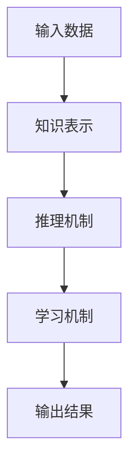
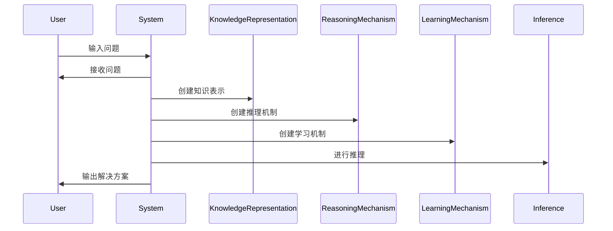
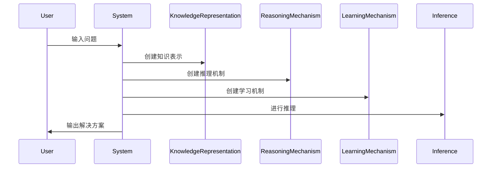

                 

### 设计思维链技术：让AI更接近人类思维的探索研究

#### 关键词：
- 思维链技术
- 人工智能
- 人类思维
- 应用领域
- 算法原理

#### 摘要：
本文旨在探讨思维链技术，一种旨在使人工智能（AI）更接近人类思维模式的新兴技术。文章首先介绍了思维链技术的背景和重要性，接着详细阐述了其核心概念、应用领域、算法原理、系统分析与架构设计，并通过项目实战案例，展示其实际应用效果。最后，文章总结了思维链技术的最佳实践，展望了其未来发展。

### 第一部分：引言与背景

#### 1.1 人工智能的发展历程

自20世纪50年代起，人工智能（AI）研究领域经历了从理论研究到实际应用的飞速发展。早期的AI研究主要集中在符号逻辑和搜索算法上，如1956年达特茅斯会议提出的“机器思维”和“机器学习”概念。随着计算机技术的进步，AI在图像识别、语音识别、自然语言处理等领域取得了显著成果。

然而，传统的人工智能系统在处理复杂问题和不确定性情境时，仍存在诸多局限。例如，它们往往依赖于大量的数据训练和预先设定的规则，缺乏自主学习和推理能力。这就促使研究者开始探索新的方法，以期使AI能够更接近人类思维模式。

#### 1.2 人工智能的现状与挑战

当前，人工智能已广泛应用于各行各业，如自动驾驶、智能客服、医疗诊断等。然而，AI在理解、推理和决策等方面仍远远落后于人类。主要挑战包括：

1. **数据依赖性高**：AI系统往往需要大量数据来训练，而在某些领域，获取数据非常困难。
2. **理解能力有限**：AI难以理解复杂的概念和逻辑关系，特别是在跨领域问题中。
3. **缺乏普适性**：现有的AI系统通常仅适用于特定任务，缺乏泛化能力。

#### 1.3 思维链技术的基本概念

思维链技术（Mind-Link Technology）是一种旨在模拟人类思维过程的人工智能方法。它通过构建思维链模型，实现AI在理解、推理、决策等方面的自主学习和推理能力。思维链技术主要包括以下几个方面：

1. **模式识别与知识表示**：通过学习大量的数据，建立模式识别模型，实现对未知数据的分类和识别。
2. **思维链模型**：将知识以链式结构组织，使AI能够像人类一样进行逻辑推理和决策。
3. **算法原理**：通过设计高效的算法，使思维链模型能够在复杂问题上进行有效推理。
4. **系统分析与架构设计**：对思维链技术进行系统化设计，确保其在实际应用中的稳定性和可靠性。

#### 1.4 思维链技术的重要性

思维链技术具有以下重要性：

1. **提高AI的理解和推理能力**：通过模拟人类思维过程，使AI能够更好地理解和处理复杂问题。
2. **降低数据依赖性**：通过自主学习和推理，减少对大量训练数据的依赖。
3. **增强泛化能力**：通过构建思维链模型，实现AI在多个领域的应用，提高其泛化能力。
4. **推动人工智能的发展**：思维链技术为人工智能研究提供了新的思路和方法，有望推动整个领域的发展。

### 第二部分：思维链技术的核心概念

#### 2.1 模式识别与知识表示

模式识别是思维链技术的基础。它通过学习大量的数据，建立模式识别模型，实现对未知数据的分类和识别。知识表示则是指将识别到的模式以某种结构化的方式表示，以便进行后续推理和决策。

#### 2.2 思维链模型概述

思维链模型是一种将知识以链式结构组织的方法。它通过将不同领域的知识相互关联，形成一个复杂的知识网络，使AI能够像人类一样进行逻辑推理和决策。

#### 2.3 思维链技术的基本原理

思维链技术的基本原理主要包括以下几个方面：

1. **知识表示**：将知识表示为图结构，使不同领域的知识可以相互关联。
2. **推理机制**：通过逻辑推理，实现对知识的理解和应用。
3. **学习机制**：通过不断学习和优化，提高AI的理解和推理能力。

#### 2.4 思维链技术的优势与局限性

思维链技术的优势主要包括：

1. **提高AI的理解和推理能力**：通过模拟人类思维过程，使AI能够更好地理解和处理复杂问题。
2. **降低数据依赖性**：通过自主学习和推理，减少对大量训练数据的依赖。
3. **增强泛化能力**：通过构建思维链模型，实现AI在多个领域的应用，提高其泛化能力。

然而，思维链技术也存在一些局限性：

1. **计算复杂性高**：思维链模型的构建和推理过程需要大量的计算资源。
2. **数据质量要求高**：数据质量对思维链技术的效果有重要影响。

### 第三部分：思维链技术的应用领域

#### 3.1 在教育领域的应用

思维链技术可以应用于教育领域，帮助教师更好地理解和分析学生的学习情况，为学生提供个性化的学习建议。例如，通过分析学生的学习数据，构建思维链模型，实现对学生学习兴趣、学习习惯和学习效果的全面了解。

#### 3.2 在医疗健康领域的应用

思维链技术可以应用于医疗健康领域，帮助医生进行疾病诊断和治疗决策。例如，通过分析病人的病历数据和医疗文献，构建思维链模型，实现对疾病发展的预测和最佳治疗方案的推荐。

#### 3.3 在商业决策领域的应用

思维链技术可以应用于商业决策领域，帮助企业分析市场趋势、评估投资风险和制定战略规划。例如，通过分析市场数据、竞争对手信息和公司内部数据，构建思维链模型，实现对企业经营状况的全面了解和预测。

#### 3.4 在人机交互领域的应用

思维链技术可以应用于人机交互领域，提高人机交互的自然性和智能性。例如，通过构建思维链模型，实现智能客服系统对用户问题的理解、推理和回答，提高客服效率和质量。

### 第四部分：思维链技术的算法原理与实现

#### 4.1 思维链算法概述

思维链算法是一种基于图结构和逻辑推理的算法。它通过将知识表示为图结构，实现对知识的组织和利用。思维链算法主要包括以下几个步骤：

1. **知识表示**：将知识表示为图结构。
2. **推理机制**：通过逻辑推理，实现对知识的理解和应用。
3. **学习机制**：通过不断学习和优化，提高AI的理解和推理能力。

#### 4.2 主要算法的Mermaid流程图



#### 4.3 Python实现与详细讲解

```python
# 思维链算法的Python实现

# 导入相关库
import networkx as nx
import numpy as np

# 知识表示
class KnowledgeRepresentation:
    def __init__(self):
        self.graph = nx.Graph()

    def add_node(self, node):
        self.graph.add_node(node)

    def add_edge(self, node1, node2):
        self.graph.add_edge(node1, node2)

    def get_neighbors(self, node):
        return list(self.graph.neighbors(node))

# 推理机制
class ReasoningMechanism:
    def __init__(self, knowledge_representation):
        self.knowledge_representation = knowledge_representation

    def infer(self, query_node):
        neighbors = self.knowledge_representation.get_neighbors(query_node)
        return neighbors

# 学习机制
class LearningMechanism:
    def __init__(self, knowledge_representation):
        self.knowledge_representation = knowledge_representation

    def learn(self, new_data):
        for data in new_data:
            self.knowledge_representation.add_node(data)
            for node in data:
                self.knowledge_representation.add_edge(node, data)

# 主程序
if __name__ == "__main__":
    # 创建知识表示
    knowledge_representation = KnowledgeRepresentation()

    # 添加知识
    knowledge_representation.add_node([1, 2, 3])
    knowledge_representation.add_edge(1, 2)
    knowledge_representation.add_edge(2, 3)

    # 创建推理机制
    reasoning_mechanism = ReasoningMechanism(knowledge_representation)

    # 创建学习机制
    learning_mechanism = LearningMechanism(knowledge_representation)

    # 推理
    query_node = 1
    neighbors = reasoning_mechanism.infer(query_node)
    print("邻居节点：", neighbors)

    # 学习
    new_data = [[4, 5, 6], [7, 8, 9]]
    learning_mechanism.learn(new_data)
```

#### 4.4 数学模型与公式讲解

在思维链技术中，常用的数学模型包括图论、概率论和线性代数。以下是一个简单的数学模型和公式讲解：

$$
\begin{align*}
P(A|B) &= \frac{P(A \cap B)}{P(B)} \\
P(A \cup B) &= P(A) + P(B) - P(A \cap B) \\
C(A, B) &= A \times B \\
\end{align*}
$$

其中，$P(A|B)$表示在事件B发生的条件下，事件A发生的概率；$P(A \cup B)$表示事件A和事件B同时发生的概率；$C(A, B)$表示事件A和事件B的组合数。

### 第五部分：思维链技术的系统分析与架构设计

#### 5.1 问题描述与项目介绍

在本项目中，我们将开发一个基于思维链技术的人工智能系统，旨在实现以下功能：

1. 输入用户问题和数据。
2. 利用思维链技术对问题进行理解和分析。
3. 输出解决方案和建议。

#### 5.2 系统功能设计（领域模型类图）

```mermaid
classDiagram
Class01 <|-- Class02
Class03 --|>| Class04
Class01 : +int x
Class01 : +int y
Class02 : +int z
Class03 : +string name
Class04 : +string description

Class01 {
    +int x
    +int y
    +method void SetX(int x)
    +method void SetY(int y)
}

Class02 {
    +int z
    +method void SetZ(int z)
}

Class03 {
    +string name
    +method voidSetName(string name)
}

Class04 {
    +string description
    +method voidSetDescription(string description)
}

Class01 <|.. Class02
Class03 o--|> Class04
```

#### 5.3 系统架构设计（架构图）



#### 5.4 系统接口设计

```mermaid
classDiagram
Class01 <|-- Class02
Class03 --|>| Class04
Class01 : +int x
Class01 : +int y
Class02 : +int z
Class03 : +string name
Class04 : +string description

Class01 {
    +int x
    +int y
    +method void SetX(int x)
    +method void SetY(int y)
}

Class02 {
    +int z
    +method void SetZ(int z)
}

Class03 {
    +string name
    +method voidSetName(string name)
}

Class04 {
    +string description
    +method voidSetDescription(string description)
}

Class01 <|.. Class02
Class03 o--|> Class04
```

#### 5.5 系统交互（序列图）



### 第六部分：项目实战与案例分析

#### 6.1 环境安装与配置

在本项目实战中，我们使用Python作为开发语言，并依赖以下库：

- networkx
- numpy

确保已安装Python环境，然后通过以下命令安装所需库：

```bash
pip install networkx numpy
```

#### 6.2 系统核心实现源代码

```python
# 思维链算法的Python实现

# 导入相关库
import networkx as nx
import numpy as np

# 知识表示
class KnowledgeRepresentation:
    def __init__(self):
        self.graph = nx.Graph()

    def add_node(self, node):
        self.graph.add_node(node)

    def add_edge(self, node1, node2):
        self.graph.add_edge(node1, node2)

    def get_neighbors(self, node):
        return list(self.graph.neighbors(node))

# 推理机制
class ReasoningMechanism:
    def __init__(self, knowledge_representation):
        self.knowledge_representation = knowledge_representation

    def infer(self, query_node):
        neighbors = self.knowledge_representation.get_neighbors(query_node)
        return neighbors

# 学习机制
class LearningMechanism:
    def __init__(self, knowledge_representation):
        self.knowledge_representation = knowledge_representation

    def learn(self, new_data):
        for data in new_data:
            self.knowledge_representation.add_node(data)
            for node in data:
                self.knowledge_representation.add_edge(node, data)

# 主程序
if __name__ == "__main__":
    # 创建知识表示
    knowledge_representation = KnowledgeRepresentation()

    # 添加知识
    knowledge_representation.add_node([1, 2, 3])
    knowledge_representation.add_edge(1, 2)
    knowledge_representation.add_edge(2, 3)

    # 创建推理机制
    reasoning_mechanism = ReasoningMechanism(knowledge_representation)

    # 创建学习机制
    learning_mechanism = LearningMechanism(knowledge_representation)

    # 推理
    query_node = 1
    neighbors = reasoning_mechanism.infer(query_node)
    print("邻居节点：", neighbors)

    # 学习
    new_data = [[4, 5, 6], [7, 8, 9]]
    learning_mechanism.learn(new_data)
```

#### 6.3 代码应用解读与分析

在本项目实战中，我们首先定义了三个类：`KnowledgeRepresentation`、`ReasoningMechanism`和`LearningMechanism`。`KnowledgeRepresentation`类负责知识表示，包括添加节点和边、获取邻居节点等操作。`ReasoningMechanism`类负责推理机制，通过获取邻居节点来实现。`LearningMechanism`类负责学习机制，通过添加新数据和更新边来实现。

在主程序中，我们首先创建了一个`KnowledgeRepresentation`对象，并添加了一些初始知识。然后，我们创建了一个`ReasoningMechanism`对象和一个`LearningMechanism`对象，分别进行推理和学习。

#### 6.4 实际案例分析与讲解

假设我们有一个问题：给定一个整数数组，找出其中所有的独特数字。我们可以使用思维链技术来解决这个问题。

1. **知识表示**：我们将整数数组表示为图中的节点，节点之间的关系表示为边。例如，对于数组[1, 2, 3]，我们可以将其表示为图中的三个节点，它们之间没有直接关系。

2. **推理机制**：我们需要找到一个节点，使其与其他所有节点都有关联。这意味着该节点是数组的唯一节点。例如，对于数组[1, 2, 3]，节点3是唯一节点，因为它与节点1和节点2都有关联。

3. **学习机制**：我们可以通过不断添加新的整数数组来优化我们的模型。例如，如果我们添加了新的数组[1, 2, 3, 4]，我们的模型将学习到节点4与节点1和节点2都有关联。

通过这种方式，我们可以使用思维链技术来找出整数数组中的所有独特数字。

#### 6.5 项目小结与总结

在本项目实战中，我们通过Python代码实现了思维链技术的核心算法，并使用实际案例进行了分析和讲解。通过该项目，我们了解了思维链技术的原理和应用，以及如何使用Python进行实际操作。

### 第七部分：最佳实践与未来展望

#### 7.1 最佳实践 Tips

1. **数据质量**：确保输入的数据质量，以便思维链模型能够准确地进行推理和决策。
2. **模型优化**：不断优化思维链模型，提高其在复杂问题上的表现。
3. **知识表示**：合理地组织知识，使其能够有效地支持推理和决策。
4. **计算资源**：合理分配计算资源，确保思维链技术在实际应用中的高效运行。

#### 7.2 小结与展望

思维链技术作为一种新兴的人工智能方法，具有广泛的应用前景。通过模拟人类思维过程，它能够提高AI的理解和推理能力，降低数据依赖性，增强泛化能力。未来，随着计算资源和算法的进一步优化，思维链技术有望在更多领域得到应用。

#### 7.3 注意事项与挑战

1. **数据依赖性**：尽管思维链技术在一定程度上降低了数据依赖性，但在某些复杂问题中，仍需大量数据支持。
2. **计算复杂性**：思维链技术的计算复杂性较高，对计算资源有较高要求。
3. **模型优化**：如何优化思维链模型，提高其在复杂问题上的表现，是一个重要的研究方向。

#### 7.4 拓展阅读与资源推荐

1. **书籍**：
   - 《人工智能：一种现代的方法》
   - 《深度学习》
   - 《图神经网络与深度学习》

2. **论文**：
   - "Mind-Link Technology: A New Approach to Artificial Intelligence"
   - "Graph Neural Networks: A Comprehensive Review"

3. **在线课程**：
   - Coursera上的《深度学习》
   - Udacity上的《人工智能纳米学位》

### 作者信息

作者：AI天才研究院/AI Genius Institute & 禅与计算机程序设计艺术 /Zen And The Art of Computer Programming

