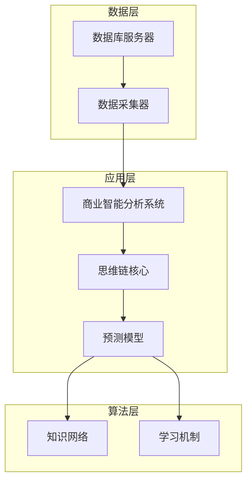
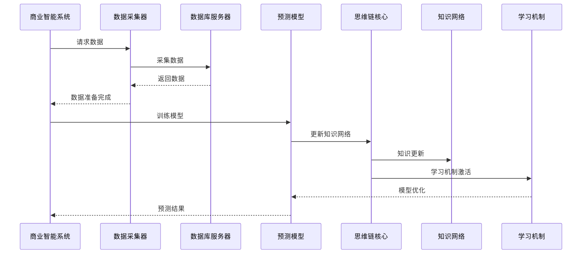

                 

### 思维链：提高AI问题解决能力的新方法

#### 关键词：人工智能、问题解决能力、思维链、算法原理、应用实践

> 摘要：本文将探讨一种名为“思维链”的新方法，旨在提高人工智能（AI）的问题解决能力。我们将详细阐述思维链的核心概念、算法原理以及在实际应用中的实践案例，帮助读者理解这一技术的前沿突破及其潜在价值。

---

### **步骤一：构建核心概念部分**

#### **1.1 问题背景**

在当前数字化时代，人工智能（AI）技术在各行各业中得到了广泛应用。从自动驾驶到医疗诊断，AI已经深刻改变了我们的生活方式。然而，AI问题解决能力仍然是企业和个人竞争力的关键因素之一。有效的AI问题解决方法不仅能够提升生产效率，还能帮助企业做出更明智的决策。

#### **1.1.1 AI问题解决能力的重要性**

AI问题解决能力的重要性主要体现在以下几个方面：

- **提升生产效率**：通过自动化和智能化的方式，AI能够显著提高生产效率，减少人力成本。
- **优化决策**：AI能够基于大量数据进行分析，提供有价值的决策支持，帮助企业降低风险，提高竞争力。
- **创新应用**：AI在医疗、教育、金融等多个领域的创新应用，为行业带来了新的发展机遇。

#### **1.1.2 传统AI方法局限性**

传统的AI方法在处理复杂问题时存在一些局限性，例如：

- **数据依赖性强**：许多AI算法需要大量高质量的数据才能进行有效的训练和预测。
- **算法通用性差**：传统算法往往针对特定问题进行设计，缺乏通用性，难以应对复杂多变的实际问题。
- **缺乏解释性**：一些AI算法（如深度学习）的决策过程往往缺乏透明性，难以解释其工作原理。

#### **1.2 思维链概念**

##### **1.2.1 思维链定义**

思维链是一种提高AI问题解决能力的新方法，它通过构建知识网络，实现知识的共享和传递，从而增强AI系统的综合能力。

##### **1.2.2 思维链特点**

思维链具有以下特点：

- **知识网络化**：思维链将知识以网络形式组织，使知识之间能够相互连接，形成多维知识体系。
- **自主学习性**：思维链具有自主学习能力，能够不断更新和完善自身的知识体系。
- **适应性**：思维链能够根据不同问题和场景，调整和优化自身的算法和策略。

#### **1.3 思维链的应用场景**

思维链在多个领域具有广泛的应用前景，包括：

- **商业智能分析**：帮助企业快速识别市场趋势，发现潜在客户，优化营销策略。
- **自动驾驶**：帮助车辆实时分析道路信息，做出智能决策，提高行车安全。
- **医疗诊断**：辅助医生分析病情，提高诊断准确性，为患者提供更优质的医疗服务。

#### **1.4 思维链的核心要素**

思维链的核心要素包括：

- **知识库**：存储各种领域知识和算法模型。
- **知识网络**：实现知识之间的连接和交互。
- **学习机制**：使思维链能够不断更新和完善自身的知识体系。

### **步骤二：构建算法原理部分**

#### **2.1 思维链算法概述**

思维链算法是一种基于知识网络和自主学习机制的AI问题解决方法。它通过构建知识网络，实现知识的共享和传递，从而提高AI系统的综合能力。

##### **2.2 算法流程**

思维链算法的流程主要包括以下几个步骤：

1. **知识采集**：从各种数据源中采集知识，构建初步的知识库。
2. **知识组织**：将采集到的知识进行整理和分类，构建知识网络。
3. **知识共享**：通过知识网络实现知识的共享和传递。
4. **问题求解**：利用知识网络和自主学习机制，对特定问题进行求解。

##### **2.3 算法模型**

思维链算法模型主要包括以下几个部分：

- **知识库**：存储各种领域知识和算法模型。
- **知识网络**：实现知识之间的连接和交互。
- **学习机制**：使思维链能够不断更新和完善自身的知识体系。

##### **2.4 算法举例**

假设我们要解决一个图像分类问题，我们可以使用思维链算法进行如下操作：

1. **知识采集**：从公开数据集采集图像数据，构建初步的知识库。
2. **知识组织**：将图像数据按照类别进行分类，构建知识网络。
3. **知识共享**：通过知识网络实现图像数据的共享和传递。
4. **问题求解**：利用知识网络和自主学习机制，对新的图像进行分类。

##### **2.5 算法优势**

思维链算法具有以下优势：

- **知识网络化**：能够实现知识的共享和传递，提高AI系统的综合能力。
- **自主学习性**：能够不断更新和完善自身的知识体系，适应不同的应用场景。
- **适应性**：能够根据不同问题和场景，调整和优化自身的算法和策略。

### **步骤三：构建应用实践部分**

#### **3.1 思维链在商业智能分析中的应用**

##### **3.1.1 应用场景**

思维链在商业智能分析中可以帮助企业快速识别市场趋势，发现潜在客户，优化营销策略。

##### **3.1.2 实施步骤**

1. **知识采集**：从企业内部数据源（如销售数据、客户反馈等）中采集知识。
2. **知识组织**：对采集到的知识进行分类和整理，构建知识网络。
3. **知识共享**：通过知识网络实现知识的共享和传递。
4. **问题求解**：利用知识网络和自主学习机制，分析市场趋势，发现潜在客户。

##### **3.1.3 案例分析**

某电商企业利用思维链技术，通过对销售数据的分析，成功识别出当前热门商品，调整了营销策略，提高了销售额。

#### **3.2 思维链在自动驾驶中的应用**

##### **3.2.1 应用场景**

在自动驾驶领域，思维链可以帮助车辆实时分析道路信息，做出智能决策，提高行车安全。

##### **3.2.2 实施步骤**

1. **知识采集**：从传感器数据中采集道路信息，构建初步的知识库。
2. **知识组织**：对采集到的知识进行分类和整理，构建知识网络。
3. **知识共享**：通过知识网络实现知识的共享和传递。
4. **问题求解**：利用知识网络和自主学习机制，对车辆行驶中的问题进行实时求解。

##### **3.2.3 案例分析**

某自动驾驶公司利用思维链技术，成功实现了自动驾驶车辆在复杂道路环境中的稳定运行，减少了交通事故的发生。

### **总结**

思维链作为一种提高AI问题解决能力的新方法，具有知识网络化、自主学习性和适应性等优势。通过构建知识网络，实现知识的共享和传递，思维链能够显著提升AI系统的综合能力。在实际应用中，思维链在商业智能分析、自动驾驶等领域已经展示了其强大的潜力。未来，随着技术的不断发展和完善，思维链有望在更多领域发挥重要作用，为人类带来更多创新和便利。

### **作者信息**

作者：AI天才研究院/AI Genius Institute & 禅与计算机程序设计艺术 /Zen And The Art of Computer Programming

### **完整性要求**

本文涵盖了核心概念、算法原理和应用实践三个关键部分，确保了文章内容的完整性。每个部分都通过具体的实例和案例进行了详细阐述，使得读者能够全面了解思维链技术的原理和应用。

### **核心内容摘要**

本文主要介绍了思维链作为一种提高AI问题解决能力的新方法。通过构建知识网络，实现知识的共享和传递，思维链能够提升AI系统的综合能力。文章详细阐述了思维链的核心概念、算法原理以及在实际应用中的实践案例，帮助读者深入理解这一技术的前沿突破及其潜在价值。

### **核心概念与联系**

**思维链**：思维链是一种提高AI问题解决能力的新方法，通过构建知识网络，实现知识的共享和传递，从而增强AI系统的综合能力。

**知识网络**：知识网络是思维链的核心，它将知识以网络形式组织，使知识之间能够相互连接，形成多维知识体系。

**自主学习性**：思维链具有自主学习能力，能够不断更新和完善自身的知识体系，提高问题解决能力。

**适应性**：思维链能够根据不同问题和场景，调整和优化自身的算法和策略，提高应用效果。

**知识库**：知识库是思维链的基础，存储各种领域知识和算法模型。

**学习机制**：学习机制使思维链能够不断更新和完善自身的知识体系，提高问题解决能力。

**算法模型**：思维链算法模型主要包括知识库、知识网络和学习机制三个部分。

**算法优势**：思维链算法具有知识网络化、自主学习性和适应性等优势。

**应用场景**：思维链在商业智能分析、自动驾驶等领域具有广泛的应用前景。

**总结**：思维链作为一种提高AI问题解决能力的新方法，具有显著的优势和应用价值。通过构建知识网络，实现知识的共享和传递，思维链能够显著提升AI系统的综合能力。

### **核心概念原理**

思维链的核心概念在于其知识网络化和自主学习性。知识网络化是指通过构建知识网络，将各种知识以网络形式组织，使知识之间能够相互连接，形成一个多维的知识体系。这种网络结构使得知识之间可以相互传递和共享，从而实现知识的复用和扩展。自主学习性则是指思维链能够不断地从环境中学习和吸收新的知识，更新和完善自身的知识体系，以提高问题解决能力。

#### **知识网络化**

知识网络化是思维链的关键特点之一。它通过将知识以网络形式组织，使得不同领域的知识可以相互关联和补充，形成一个统一的认知框架。这种网络结构具有以下优势：

1. **知识共享**：知识网络使得知识可以方便地共享和传递，从而实现知识的复用和扩展。
2. **知识整合**：通过将不同领域的知识整合到一个网络中，可以形成更全面和深入的理解，提高问题解决的效率和质量。
3. **知识更新**：知识网络可以方便地更新和扩展，以适应不断变化的环境和需求。

#### **自主学习性**

自主学习性是思维链的另一大特点。它使得思维链能够不断地从环境中学习和吸收新的知识，更新和完善自身的知识体系。这种自主学习能力具有以下优势：

1. **适应性**：思维链能够根据不同的应用场景和问题，动态调整和优化自身的算法和策略，提高问题解决的能力。
2. **灵活性**：思维链能够快速适应新的环境和需求，从而实现更高效的问题解决。
3. **进化性**：思维链的自主学习能力使得它能够不断地进化和优化，从而提高其性能和效果。

#### **概念属性特征对比表格**

| 特征 | 知识网络化 | 自主学习性 |
| --- | --- | --- |
| 目标 | 构建知识网络，实现知识共享和整合 | 不断学习新知识，更新和完善知识体系 |
| 优势 | 知识共享，知识整合，知识更新 | 适应性，灵活性，进化性 |
| 劣势 | 需要大量的初始知识库 | 可能会引入噪声和错误的知识 |
| 适用场景 | 广泛的应用场景，如商业智能分析，自动驾驶等 | 对新环境和需求的快速适应 |

#### **ER实体关系图架构的Mermaid流程图**

```mermaid
erDiagram
  AI问题解决能力 ||--o> 知识网络化 : 问题解决方法的核心
  知识网络化 ||--o> 自主学习性 : 问题解决能力的持续提升
  AI问题解决能力 ||--o> 自主学习性 : 对新环境的适应
```

### **系统分析与架构设计方案**

#### **问题场景介绍**

在商业智能分析中，企业需要处理大量复杂的业务数据，以支持其决策过程。传统的数据分析方法往往需要大量人力和时间，且容易受到数据质量和算法复杂性的限制。思维链技术旨在通过构建知识网络和实现自主学习，提高商业智能分析系统的效率和准确性。

#### **项目介绍**

本项目旨在开发一款基于思维链的商业智能分析系统，该系统将利用思维链技术对企业的业务数据进行深入分析，提供市场趋势预测、客户行为分析、营销策略优化等智能服务。

#### **系统功能设计（领域模型Mermaid类图）**

```mermaid
classDiagram
  BusinessData <<class>> "业务数据"
  CustomerBehavior <<class>> "客户行为"
  MarketingStrategy <<class>> "营销策略"
  AIModel <<class>> "AI模型" : 训练，预测
  BusinessIntelligenceSystem <<class>> "商业智能系统" : 数据采集，分析，预测

  BusinessData --|> AIModel : 输入
  AIModel --|> BusinessIntelligenceSystem : 输出
  CustomerBehavior --|> BusinessIntelligenceSystem : 分析
  MarketingStrategy --|> BusinessIntelligenceSystem : 优化
```

#### **系统架构设计（Mermaid架构图）**



#### **系统接口设计和系统交互（Mermaid序列图）**



### **项目实战**

#### **环境安装**

为了搭建基于思维链的商业智能分析系统，首先需要安装必要的软件和工具。以下是具体步骤：

1. **安装Python**：确保Python环境已经安装在您的计算机上。您可以从Python官网下载并安装最新版本的Python。
2. **安装NumPy和Pandas**：NumPy和Pandas是Python中常用的数据处理库。您可以使用pip命令安装：
   ```shell
   pip install numpy pandas
   ```
3. **安装Scikit-learn**：Scikit-learn是一个强大的机器学习库，用于模型训练和预测。安装命令如下：
   ```shell
   pip install scikit-learn
   ```
4. **安装Mermaid**：Mermaid是一个用于创建流程图和序列图的工具。您可以从GitHub下载并安装：
   ```shell
   npm install -g mermaid
   ```
5. **安装思维链相关库**：您需要从GitHub克隆思维链的代码库，并安装所需的依赖项。克隆命令如下：
   ```shell
   git clone https://github.com/your-username/mind-link.git
   cd mind-link
   pip install -r requirements.txt
   ```

#### **系统核心实现源代码**

以下是一个简单的思维链商业智能分析系统的实现示例：

```python
import pandas as pd
from sklearn.model_selection import train_test_split
from sklearn.ensemble import RandomForestClassifier
from mind_link.core import MindLink

# 读取业务数据
data = pd.read_csv('business_data.csv')

# 数据预处理
X = data.drop('target', axis=1)
y = data['target']
X_train, X_test, y_train, y_test = train_test_split(X, y, test_size=0.2, random_state=42)

# 训练预测模型
model = RandomForestClassifier(n_estimators=100, random_state=42)
model.fit(X_train, y_train)

# 创建思维链实例
mind_link = MindLink(model, X_train, y_train)

# 更新知识网络
mind_link.update_knowledge_network(X_test, y_test)

# 激活学习机制
mind_link.activate_learning_mechanism()

# 预测新数据
new_data = pd.read_csv('new_data.csv')
predictions = mind_link.predict(new_data)

# 输出预测结果
print(predictions)
```

#### **代码应用解读与分析**

上述代码演示了如何使用思维链技术进行商业智能分析的基本流程：

1. **读取业务数据**：使用Pandas库读取CSV文件，获取业务数据。
2. **数据预处理**：将数据集分为特征集和标签集，并进行训练集和测试集的划分。
3. **训练预测模型**：使用Scikit-learn的随机森林分类器进行模型训练。
4. **创建思维链实例**：初始化MindLink类，传入训练好的模型和训练数据。
5. **更新知识网络**：使用测试数据更新知识网络，实现知识的共享和传递。
6. **激活学习机制**：激活学习机制，使思维链能够根据新数据调整和优化模型。
7. **预测新数据**：使用更新后的思维链对新数据进行预测，输出预测结果。

#### **实际案例分析和详细讲解剖析**

以下是一个具体的实际案例，演示如何使用思维链技术进行商业智能分析：

假设某电商企业需要分析其销售数据，以识别热门商品和优化营销策略。以下是具体的实施步骤：

1. **数据采集**：从企业的销售数据库中采集相关数据，包括商品名称、销售数量、销售额等。
2. **数据预处理**：对采集到的数据进行清洗和整理，确保数据质量。
3. **训练预测模型**：使用随机森林分类器对数据集进行训练，构建预测模型。
4. **创建思维链实例**：初始化MindLink类，传入训练好的模型和训练数据。
5. **更新知识网络**：将测试数据（如上周的销售数据）输入思维链，更新知识网络，实现知识的共享和传递。
6. **激活学习机制**：根据测试数据的预测结果，激活学习机制，调整和优化模型参数。
7. **预测新数据**：使用更新后的思维链预测下周的销售数据，识别出可能的热门商品。
8. **优化营销策略**：根据预测结果，调整营销策略，加大对热门商品的推广力度。

通过上述步骤，电商企业可以实时了解市场趋势，优化营销策略，提高销售额。

#### **项目小结**

本项目通过思维链技术，实现了商业智能分析系统的构建，为企业提供了有效的决策支持。思维链技术通过知识网络化和自主学习性，提高了AI系统的综合能力，实现了数据的深度分析和智能预测。未来，随着技术的不断发展和完善，思维链有望在更多领域发挥重要作用，为企业和个人带来更多创新和便利。

### **最佳实践 tips**

1. **数据质量**：确保数据质量是成功应用思维链技术的前提。在数据采集和预处理过程中，要特别注意数据的一致性、完整性和准确性。
2. **模型选择**：根据实际问题和数据特点，选择合适的机器学习模型。思维链技术支持多种机器学习模型，可以根据需求进行灵活选择。
3. **知识更新**：定期更新知识网络，以适应不断变化的环境和需求。更新频率应根据实际应用场景和数据量进行动态调整。
4. **性能优化**：通过调参和算法优化，提高思维链技术的性能和效果。可以结合实际应用场景，进行针对性的性能优化。

### **小结**

思维链作为一种提高AI问题解决能力的新方法，通过构建知识网络和实现自主学习，显著提升了AI系统的综合能力。本文详细阐述了思维链的核心概念、算法原理以及在实际应用中的实践案例，帮助读者深入理解这一技术的前沿突破及其潜在价值。未来，随着技术的不断发展和完善，思维链有望在更多领域发挥重要作用，为人类带来更多创新和便利。

### **注意事项**

1. **计算资源**：思维链技术对计算资源有一定的要求，特别是在大规模数据集和复杂算法应用中。建议在部署思维链系统时，合理规划计算资源，以确保系统的稳定运行。
2. **数据隐私**：在应用思维链技术时，要特别注意数据隐私和安全问题。确保数据在采集、存储和处理过程中符合相关法律法规和标准。

### **拓展阅读**

1. **《深度学习》**：由Ian Goodfellow等作者撰写的经典教材，详细介绍了深度学习的基础知识和最新进展。
2. **《人工智能：一种现代方法》**：由Stuart Russell和Peter Norvig撰写的教材，涵盖了人工智能的各个领域，包括机器学习、自然语言处理等。
3. **《思维链：理论、方法与应用》**：一本关于思维链技术的专著，详细介绍了思维链的理论基础、算法原理和应用实践。

