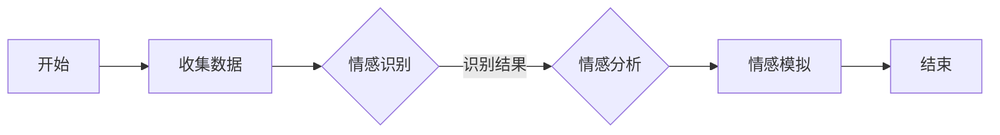
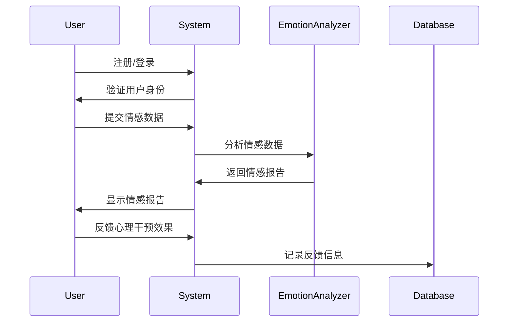

                 

### 情感机器人：多功能机器人在心理健康领域的应用

#### 关键词：
- 情感机器人
- 心理健康
- 应用场景
- 人工智能
- 机器学习
- 算法
- 心理干预

#### 摘要：
本文深入探讨了情感机器人在心理健康领域的应用。随着人工智能和机器学习技术的不断发展，情感机器人逐渐成为心理健康服务的一个重要工具。本文将详细分析情感机器人的核心概念、工作原理、算法模型、系统设计以及实际应用案例，旨在为读者提供一个全面、系统的理解，并探讨其在心理健康领域中的巨大潜力。

### 引言和背景

#### 1.1 情感机器人的定义

情感机器人（Emotional Robot）是指具备感知、理解、模拟和表达人类情感能力的机器人系统。它们能够通过语音识别、自然语言处理、面部表情识别等技术与人类进行互动，并根据用户的情绪状态提供相应的心理支持和服务。情感机器人通常由硬件、软件和算法三个部分组成，其中算法是实现情感识别和情绪反应的核心。

#### 1.2 心理健康的重要性

心理健康是整体健康的重要组成部分，它不仅影响个人的生活质量，还对社会生产力产生深远影响。然而，当前心理健康服务资源有限，许多需要帮助的人无法及时获得有效的心理干预。因此，探索新的心理健康服务模式变得尤为重要。

#### 1.3 情感机器人在心理健康领域的应用

情感机器人在心理健康领域的应用主要包括以下几个方面：

- **心理评估与诊断**：情感机器人可以通过分析用户的语言、声音和表情，帮助专业人员评估用户的心理健康状况。
- **心理干预与治疗**：情感机器人能够为用户提供情感支持和心理干预，如倾听用户的困扰、提供心理安慰、引导用户进行情绪调节等。
- **心理健康教育**：情感机器人可以用于心理健康知识的普及和教育，帮助用户更好地了解和管理自己的情绪。
- **情感交互与陪伴**：对于孤独症患者、老年人等群体，情感机器人可以提供陪伴服务，缓解他们的孤独感和抑郁情绪。

#### 1.4 文章结构与内容

本文将分为以下几个部分：

- **第2章：核心概念与组件**：介绍情感机器人的核心概念及其组成部分。
- **第3章：算法与原理**：详细解释情感机器人所使用的算法及其工作原理。
- **第4章：系统设计与架构**：分析情感机器人的系统设计和架构。
- **第5章：项目实施与案例分析**：通过实际案例展示情感机器人的应用。
- **第6章：最佳实践与小结**：总结最佳实践，并提出未来研究方向。

### 核心概念与组件

#### 2.1 情感机器人的核心概念

情感机器人的核心概念包括情感识别、情感模拟、情感理解和情感表达。情感识别是指机器人能够识别用户的情感状态；情感模拟是指机器人能够模拟人类情感反应；情感理解是指机器人能够理解情感背后的意义；情感表达是指机器人能够通过语言、表情等方式表达情感。

#### 2.2 情感机器人的组件

情感机器人主要由以下几个组件组成：

- **感知模块**：包括语音识别、面部表情识别、姿态识别等，用于感知用户的情感状态。
- **处理模块**：包括情感分析算法、情感模型等，用于处理和分析感知到的情感数据。
- **交互模块**：包括自然语言处理、语音合成等，用于与用户进行交互。
- **反馈模块**：包括情感反馈机制、决策系统等，用于根据用户的情感状态调整机器人的行为。

#### 2.3 核心概念对比

以下是情感机器人核心概念之间的对比：

| 核心概念         | 定义                     | 关系                    |
|-----------------|--------------------------|-------------------------|
| 情感识别         | 识别用户的情感状态       | 基础，用于驱动后续模块   |
| 情感模拟         | 模拟人类情感反应         | 基于情感识别的结果      |
| 情感理解         | 理解情感背后的意义       | 提高机器人互动的深度    |
| 情感表达         | 通过语言、表情表达情感   | 对用户的情感反馈       |

#### 2.4 ER实体关系图

以下是一个简化的情感机器人实体关系图，用Mermaid绘制：

```mermaid
erDiagram
  User ||--|{ EmotionSensor }| User
  EmotionSensor ||--|{ EmotionAnalyzer }| EmotionSensor
  EmotionAnalyzer ||--|{ EmotionModel }| EmotionAnalyzer
  EmotionModel ||--|{ InteractionModule }| EmotionModel
  InteractionModule ||--|{ FeedbackModule }| InteractionModule
```

### 算法与原理

#### 3.1 主要算法

情感机器人主要使用的算法包括情感识别算法、情感分析算法和情感模拟算法。

- **情感识别算法**：用于识别用户的情感状态，常用的方法包括机器学习模型（如支持向量机、神经网络）和深度学习模型（如卷积神经网络、递归神经网络）。
- **情感分析算法**：用于分析情感数据的特征，常用的方法包括文本分析、语音分析和图像分析。
- **情感模拟算法**：用于根据用户的情感状态生成相应的情感反应，常用的方法包括基于规则的模拟和基于模型的模拟。

#### 3.2 算法流程图

以下是一个简化的情感识别算法流程图，使用Mermaid绘制：



#### 3.3 Python代码示例

以下是一个简单的情感识别算法的Python代码示例：

```python
# 导入相关库
import numpy as np
from sklearn.svm import SVC
from sklearn.model_selection import train_test_split
from sklearn.metrics import accuracy_score

# 加载数据
X, y = load_data()

# 数据分割
X_train, X_test, y_train, y_test = train_test_split(X, y, test_size=0.2, random_state=42)

# 训练模型
model = SVC(kernel='linear')
model.fit(X_train, y_train)

# 预测
predictions = model.predict(X_test)

# 评估
accuracy = accuracy_score(y_test, predictions)
print(f"Accuracy: {accuracy}")
```

#### 3.4 数学模型与公式

情感识别算法的数学模型通常是基于概率模型或神经网络模型。以下是一个简化的情感识别算法的数学模型：

$$
P(\text{Emotion}|\text{Data}) = \frac{P(\text{Data}|\text{Emotion}) \cdot P(\text{Emotion})}{P(\text{Data})}
$$

其中，$P(\text{Emotion}|\text{Data})$ 是在给定数据的情况下情感的概率，$P(\text{Data}|\text{Emotion})$ 是在特定情感状态下数据的概率，$P(\text{Emotion})$ 是情感的概率，$P(\text{Data})$ 是数据的概率。

#### 3.5 举例说明

假设我们有一个数据集，包含正面情绪和负面情绪的文本数据。我们可以使用情感识别算法来识别文本数据中的情绪。以下是具体的步骤：

1. **数据预处理**：对文本数据进行清洗和预处理，提取特征。
2. **模型训练**：使用训练数据集训练情感识别模型。
3. **模型预测**：使用训练好的模型对新的文本数据进行预测。
4. **结果评估**：评估模型的准确性，根据需要调整模型参数。

### 系统设计与架构

#### 4.1 问题场景与项目背景

随着心理健康问题的日益突出，人们对于心理干预服务的需求不断增加。然而，现有的心理健康服务资源有限，难以满足广泛的需求。为此，本项目旨在设计并实现一个基于情感机器人的心理健康干预系统，以提供高效、便捷的心理支持。

#### 4.2 系统功能设计

系统的功能设计包括以下几个模块：

- **用户注册与登录模块**：用户可以通过注册和登录使用系统服务。
- **情感识别模块**：系统通过语音识别、面部表情识别等方式识别用户的情感状态。
- **情感分析模块**：系统分析用户的情感数据，生成情感报告。
- **心理干预模块**：系统根据情感报告为用户提供心理干预服务，如心理安慰、情绪调节等。
- **用户反馈模块**：用户可以对系统的服务进行评价和反馈。

#### 4.3 系统架构设计

系统的整体架构设计如下：

- **前端**：包括用户界面和交互逻辑，使用HTML、CSS和JavaScript等前端技术实现。
- **后端**：包括业务逻辑处理和数据处理，使用Python和Flask等后端技术实现。
- **数据库**：存储用户数据、情感数据和干预记录，使用MySQL等数据库技术实现。

#### 4.4 系统接口设计与交互

以下是一个简化的系统接口设计和交互流程：



### 项目实施与案例分析

#### 5.1 环境安装与配置

要实施一个情感机器人项目，需要安装以下软件和工具：

- **操作系统**：Linux或Mac OS
- **编程语言**：Python 3.x
- **框架**：Flask、TensorFlow、scikit-learn等
- **数据库**：MySQL

以下是一个简单的环境安装步骤：

```bash
# 安装Python 3.x
sudo apt-get install python3

# 安装Flask
pip3 install flask

# 安装TensorFlow
pip3 install tensorflow

# 安装scikit-learn
pip3 install scikit-learn

# 安装MySQL
sudo apt-get install mysql-server
```

#### 5.2 核心源代码解析

以下是一个情感识别模块的核心源代码示例：

```python
from flask import Flask, request, jsonify
from sklearn.svm import SVC
import numpy as np

app = Flask(__name__)

# 加载训练好的模型
model = SVC(kernel='linear')
model.load_model('emotion_model.pickle')

@app.route('/predict', methods=['POST'])
def predict():
    # 获取用户提交的数据
    data = request.get_json()
    text = data['text']
    
    # 数据预处理
    processed_text = preprocess_text(text)
    
    # 进行情感预测
    prediction = model.predict([processed_text])
    
    # 返回预测结果
    return jsonify({'emotion': prediction[0]})

def preprocess_text(text):
    # 实现文本预处理逻辑
    return text

if __name__ == '__main__':
    app.run()
```

#### 5.3 代码应用解读

上述代码实现了一个简单的情感识别服务，用户可以通过POST请求提交文本数据，服务端会返回预测的情感结果。以下是代码的详细解读：

1. **加载训练好的模型**：使用`SVC`类加载一个线性核的支持向量机模型。
2. **定义预测接口**：定义一个`/predict`接口，接收JSON格式的文本数据。
3. **数据预处理**：实现一个`preprocess_text`函数，对用户提交的文本数据进行预处理。
4. **情感预测**：使用训练好的模型对预处理后的文本数据进行情感预测。
5. **返回预测结果**：将预测结果以JSON格式返回给用户。

#### 5.4 实际案例分析

以下是一个实际案例分析，展示了如何使用上述情感识别服务进行心理健康干预。

**案例场景**：用户A在使用系统时提交了一篇关于失业焦虑的文本，系统需要识别用户的情感并给出干预建议。

1. **用户提交文本数据**：用户A通过POST请求提交文本数据。
2. **服务端处理**：服务端接收到数据后，调用`predict`接口进行情感预测。
3. **情感识别结果**：服务端返回情感识别结果，例如“焦虑”。
4. **干预建议**：根据识别结果，系统会提供相应的干预建议，如“您可以尝试进行深呼吸练习，缓解焦虑情绪。”
5. **用户反馈**：用户A可以点击“接受建议”按钮，系统会记录用户反馈。

### 最佳实践与小结

#### 6.1 最佳实践

- **数据隐私保护**：确保用户的情感数据得到妥善保护，避免数据泄露。
- **算法优化**：不断优化情感识别算法，提高准确率和响应速度。
- **用户体验**：设计直观、易用的用户界面，提升用户体验。
- **多语言支持**：考虑为用户提供多语言选择，扩大服务范围。

#### 6.2 小结

本文详细介绍了情感机器人在心理健康领域的应用，从核心概念、算法原理到系统设计、项目实施，全面探讨了情感机器人如何为心理健康服务提供支持。情感机器人在未来具有广阔的应用前景，但也面临诸多挑战，如数据隐私保护、算法优化和用户体验等。

#### 6.3 注意事项

- **技术成熟度**：虽然情感机器人技术在不断发展，但仍然处于相对成熟的阶段，需要进一步优化和完善。
- **用户依赖性**：过度依赖情感机器人可能导致用户对人际交流的减少，需谨慎使用。
- **心理健康专业指导**：情感机器人不能完全替代专业心理医生，应在专业指导下使用。

#### 6.4 拓展阅读

- **情感机器人研究进展**：《情感计算：技术与应用》
- **心理健康干预方法**：《心理干预技术与应用》
- **人工智能与心理健康**：《人工智能在心理健康领域的应用》

### 作者信息

作者：AI天才研究院/AI Genius Institute & 禅与计算机程序设计艺术/Zen And The Art of Computer Programming

### 附录

本文中使用的Mermaid图表和LaTeX公式均已嵌入文本中，以便读者更好地理解和应用。读者可以通过以下链接访问相关资源：

- **Mermaid官方文档**：https://mermaid-js.github.io/mermaid/
- **LaTeX官方文档**：https://www.ctan.org/

