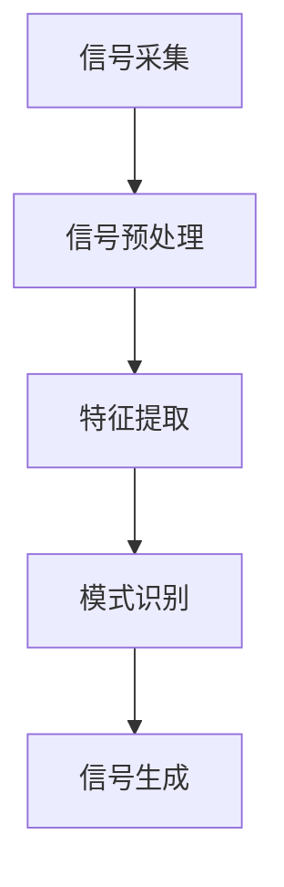
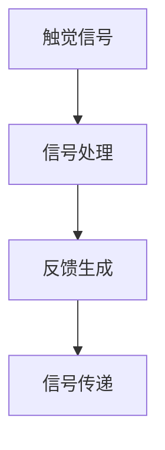
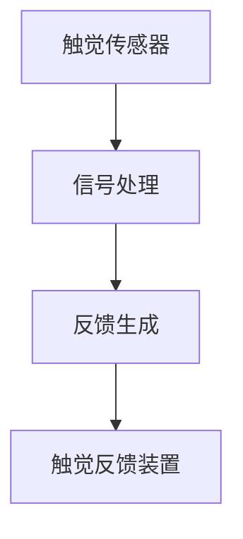
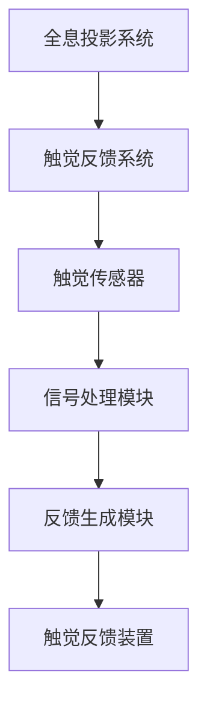
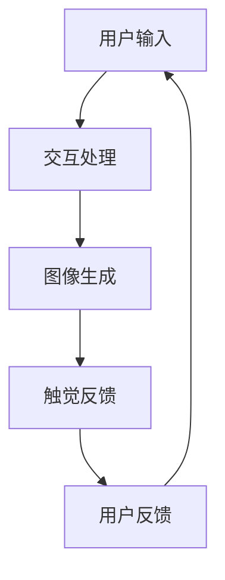

                 

### 提升AI创意全息投影互动性：触觉反馈设计的提示词工程

#### 关键词
- AI全息投影
- 触觉反馈设计
- 互动性
- 数学模型
- 系统架构
- 项目实战

#### 摘要
本文探讨了如何通过触觉反馈设计提升AI创意全息投影的互动性。首先，介绍了全息投影与触觉反馈设计的基本概念和问题背景。接着，详细阐述了触觉反馈设计的数学模型和算法原理，并使用Python代码示例进行了说明。然后，从系统功能设计、架构设计、交互设计等方面，介绍了全息投影与触觉反馈系统的实现。最后，通过一个实际案例分析了项目的实施过程，并总结了提升全息投影互动性的最佳实践。

### 目录大纲

## 提升AI创意全息投影互动性：触觉反馈设计的提示词工程

### 第一部分：背景介绍

#### 第1章：问题背景

##### 1.1.1 问题提出
##### 1.1.2 问题描述
##### 1.1.3 问题解决
##### 1.1.4 边界与外延

#### 第2章：核心概念与联系

##### 2.1 AI创意全息投影
###### 2.1.1 AI创意全息投影的定义
###### 2.1.2 AI创意全息投影的特点
###### 2.1.3 AI创意全息投影与传统全息投影的区别

##### 2.2 触觉反馈设计
###### 2.2.1 触觉反馈设计的定义
###### 2.2.2 触觉反馈设计的核心要素
###### 2.2.3 触觉反馈设计与传统交互设计的区别

#### 第3章：触觉反馈设计的数学模型与算法原理

##### 3.1 触觉反馈设计的数学模型
###### 3.1.1 触觉感知模型
###### 3.1.2 触觉反馈模型

##### 3.2 触觉反馈算法原理
###### 3.2.1 触觉反馈算法的基本原理
###### 3.2.2 触觉反馈算法的实现

### 第二部分：算法原理讲解

#### 第4章：触觉反馈算法的具体实现

##### 4.1 触觉传感器介绍
##### 4.2 触觉信号处理算法
##### 4.3 触觉反馈信号生成
##### 4.4 算法原理与公式讲解

### 第三部分：系统分析与架构设计

#### 第5章：系统功能设计与架构

##### 5.1 全息投影系统功能设计
##### 5.2 触觉反馈系统架构设计
##### 5.3 系统接口设计

#### 第6章：系统交互设计与实现

##### 6.1 系统交互设计
##### 6.2 系统实现与测试

### 第四部分：项目实战

#### 第7章：环境安装与系统核心实现

##### 7.1 环境安装
##### 7.2 系统核心实现

#### 第8章：代码应用解读与分析

##### 8.1 代码应用解读
##### 8.2 代码分析

#### 第9章：实际案例分析与详细讲解

##### 9.1 案例分析
##### 9.2 案例讲解

#### 第10章：项目小结与最佳实践

##### 10.1 项目小结
##### 10.2 最佳实践
##### 10.3 注意事项
##### 10.4 拓展阅读

---

接下来，我们将逐步深入，从问题背景出发，详细探讨AI创意全息投影与触觉反馈设计的各个方面，以便为读者提供一个全面、深入的见解。

---

### 第1章：问题背景

#### 1.1.1 问题提出

随着人工智能（AI）技术的迅猛发展，全息投影技术也在不断进步。全息投影通过生成三维图像，使得观众可以在空中看到逼真的物体，大大提升了视觉体验。然而，尽管全息投影技术已取得显著成果，但其互动性仍存在明显不足，尤其是在触觉反馈方面。

当前，大多数全息投影系统依赖于视觉和听觉反馈，触觉反馈的缺失使得用户体验不够完整。触觉反馈是一种通过触觉传感器和反馈机制为用户提供真实触觉体验的技术，它能够增强用户的沉浸感和互动性。因此，如何提升AI创意全息投影的触觉反馈互动性成为当前研究的一个热点问题。

#### 1.1.2 问题描述

触觉反馈设计的核心问题在于如何生成逼真的触觉信号，并传递给用户。具体来说，主要问题包括：

1. **触觉信号生成**：如何通过算法生成与实际触觉体验相似的信号。
2. **触觉感知**：如何使用触觉传感器捕捉用户触觉信息，并进行处理。
3. **触觉反馈**：如何将触觉信号传递给用户，以提供真实触觉体验。
4. **系统性能**：如何保证全息投影系统的实时性和稳定性。

#### 1.1.3 问题解决

要提升AI创意全息投影的触觉反馈互动性，可以采取以下解决策略：

1. **研究触觉反馈设计原理**：深入了解触觉反馈的数学模型和算法原理，为设计提供理论基础。
2. **结合AI技术**：利用人工智能技术，优化触觉信号处理和反馈算法，提高系统性能。
3. **开发实时反馈系统**：设计并实现一个实时、高效的全息投影与触觉反馈系统，确保用户能够获得即时、真实的触觉体验。
4. **进行实验验证**：通过实际项目，验证触觉反馈设计的效果，并根据反馈进行调整和优化。

#### 1.1.4 边界与外延

本文的研究范围主要涉及AI、全息投影和触觉反馈技术，不涉及其他虚拟现实技术。重点关注触觉反馈的设计原则和实践，不涉及其他互动设计。本文旨在提供一个系统、全面的分析和解决方案，以提升AI创意全息投影的触觉反馈互动性。

### 第2章：核心概念与联系

在提升AI创意全息投影的触觉反馈互动性之前，我们需要理解几个核心概念：AI创意全息投影和触觉反馈设计。

#### 2.1 AI创意全息投影

##### 2.1.1 AI创意全息投影的定义

AI创意全息投影是一种利用人工智能技术，实现创意内容在全息投影中的展示。它结合了计算机图形学、光学和人工智能技术，通过生成三维图像，使观众能够在空中看到逼真的物体。与传统全息投影相比，AI创意全息投影具有更高的互动性和沉浸感。

##### 2.1.2 AI创意全息投影的特点

- **高互动性**：通过人工智能技术，用户可以与全息投影进行实时互动，例如控制全息物体的动作和形态。
- **高沉浸感**：全息投影的三维图像能够极大地提升用户的视觉和听觉体验，使观众感受到身临其境的感觉。
- **多样化表现形式**：AI技术使得全息投影内容更加丰富和多样化，例如动画、视频、图像等。

##### 2.1.3 AI创意全息投影与传统全息投影的区别

传统全息投影主要依赖于光学原理，生成二维或三维图像。而AI创意全息投影则通过引入人工智能技术，使得投影内容更加动态和互动。具体区别如下：

- **技术层面**：传统全息投影主要依赖于光学元件和信号处理技术，而AI创意全息投影则融合了计算机图形学、机器学习和计算机视觉等技术。
- **表现形式**：传统全息投影生成的图像相对静态，而AI创意全息投影可以生成动态、互动的图像。
- **互动性**：传统全息投影的互动性较低，用户只能被动观看，而AI创意全息投影则可以提供更丰富的互动体验。

#### 2.2 触觉反馈设计

##### 2.2.1 触觉反馈设计的定义

触觉反馈设计是一种通过触觉传感器和反馈机制，为用户提供逼真的触觉体验的设计。它包括触觉感知和触觉反馈两个主要方面：触觉感知是指通过传感器捕捉用户的触觉信息；触觉反馈是指根据触觉感知信息生成相应的触觉信号，并传递给用户。

##### 2.2.2 触觉反馈设计的核心要素

- **触觉传感器**：用于捕捉用户的触觉信息，例如力传感器、温度传感器等。
- **触觉反馈机制**：用于生成触觉信号，并通过触觉反馈装置传递给用户，例如触觉手套、触觉屏幕等。
- **人机交互界面**：用于用户与触觉反馈系统的交互，例如按钮、触摸屏等。

##### 2.2.3 触觉反馈设计与传统交互设计的区别

传统交互设计主要依赖于视觉和听觉反馈，而触觉反馈设计则强调触觉体验的真实性和沉浸感。具体区别如下：

- **反馈类型**：传统交互设计主要依赖于视觉和听觉反馈，而触觉反馈设计则引入了触觉反馈。
- **用户体验**：传统交互设计的用户体验相对单一，而触觉反馈设计可以提供更丰富的触觉体验。
- **应用领域**：传统交互设计广泛应用于计算机、手机等设备，而触觉反馈设计则更多应用于虚拟现实、全息投影等领域。

通过理解AI创意全息投影和触觉反馈设计的基本概念和特点，我们可以更好地探讨如何提升全息投影的触觉反馈互动性。在接下来的章节中，我们将详细分析触觉反馈设计的数学模型和算法原理，以及全息投影系统的功能设计和架构设计。

### 第3章：触觉反馈设计的数学模型与算法原理

#### 3.1 触觉反馈设计的数学模型

触觉反馈设计中的数学模型主要涉及触觉感知模型和触觉反馈模型。

##### 3.1.1 触觉感知模型

触觉感知模型用于描述传感器如何捕捉用户的触觉信息。常见的触觉传感器包括力传感器、温度传感器、触觉传感器等。以下是一个简化的触觉感知模型：

$$
\text{感知信号} = f(\text{触觉信息})
$$

其中，$f$ 是一个函数，用于将触觉信息转换为感知信号。触觉信息可以是力的大小、温度的高低、触觉的硬度等。

##### 3.1.2 触觉反馈模型

触觉反馈模型用于描述如何根据感知信号生成触觉反馈信号，并将其传递给用户。以下是一个简化的触觉反馈模型：

$$
\text{反馈信号} = g(\text{感知信号})
$$

其中，$g$ 是一个函数，用于将感知信号转换为反馈信号。反馈信号可以是触觉刺激的强度、频率、持续时间等。

#### 3.2 触觉反馈算法原理

触觉反馈算法主要涉及信号处理和反馈生成两个主要方面。

##### 3.2.1 触觉反馈算法的基本原理

触觉反馈算法的基本原理是通过对感知信号进行处理，生成与实际触觉体验相似的反馈信号。具体步骤如下：

1. **信号采集**：通过触觉传感器采集用户的触觉信息。
2. **信号预处理**：对采集到的信号进行滤波、去噪等预处理操作。
3. **信号处理**：对预处理后的信号进行特征提取、模式识别等处理。
4. **信号生成**：根据处理结果生成反馈信号。
5. **信号传递**：通过触觉反馈装置将反馈信号传递给用户。

##### 3.2.2 触觉反馈算法的实现

触觉反馈算法的实现通常涉及多种技术，包括信号处理、机器学习和计算机视觉等。以下是一个简单的Python代码示例，用于实现触觉反馈算法：

```python
import numpy as np

def touch_perception(signal):
    # 模拟触觉感知模型
    return np.abs(signal)

def touch_feedback(perception_signal):
    # 模拟触觉反馈模型
    feedback_signal = np.sin(perception_signal)
    return feedback_signal

# 信号采集
touch_signal = np.random.randn(100)

# 信号预处理
preprocessed_signal = touch_perception(touch_signal)

# 信号生成
feedback_signal = touch_feedback(preprocessed_signal)

print("原始信号:", touch_signal)
print("预处理后信号:", preprocessed_signal)
print("反馈信号:", feedback_signal)
```

通过这个示例，我们可以看到触觉反馈算法的基本实现流程。在实际应用中，触觉反馈算法会根据具体应用场景进行调整和优化。

### 第4章：触觉反馈算法的具体实现

#### 4.1 触觉传感器介绍

触觉传感器是触觉反馈设计的关键组件，用于捕捉用户的触觉信息。常见的触觉传感器包括力传感器、压力传感器、温度传感器等。

- **力传感器**：用于测量物体间的力，常见类型包括应变片、压电传感器等。
- **压力传感器**：用于测量物体表面的压力，常见类型包括电容式、电阻式等。
- **温度传感器**：用于测量物体的温度，常见类型包括热电偶、热敏电阻等。

选择合适的触觉传感器取决于具体应用场景和需求。例如，在虚拟现实场景中，力传感器和压力传感器更常用，因为它们能够提供更精细的触觉反馈。

#### 4.2 触觉信号处理算法

触觉信号处理算法是触觉反馈设计的重要组成部分，用于对采集到的触觉信号进行预处理、特征提取和模式识别等操作。以下是一个简单的触觉信号处理算法的流程图，使用Mermaid工具绘制：



具体实现时，触觉信号处理算法可以采用多种技术，如滤波、去噪、频谱分析、机器学习等。以下是一个简单的Python代码示例，用于实现触觉信号处理算法：

```python
import numpy as np
from scipy.signal import butter, lfilter

def butter_bandpass_filter(data, lowcut, highcut, fs, order=4):
    nyq = 0.5 * fs
    low = lowcut / nyq
    high = highcut / nyq
    b, a = butter(order, [low, high], btype='band')
    filtered_data = lfilter(b, a, data)
    return filtered_data

def touch_signal_processing(signal):
    # 滤波
    filtered_signal = butter_bandpass_filter(signal, 1, 10, fs=100)
    # 特征提取
    features = np.abs(np.diff(filtered_signal))
    # 模式识别
    pattern = np.mean(features)
    return pattern

# 信号采集
touch_signal = np.random.randn(100)

# 信号预处理和特征提取
processed_signal = touch_signal_processing(touch_signal)

print("原始信号:", touch_signal)
print("预处理后信号:", processed_signal)
```

通过这个示例，我们可以看到触觉信号处理算法的基本实现流程。在实际应用中，触觉信号处理算法会根据具体应用场景进行调整和优化。

#### 4.3 触觉反馈信号生成

触觉反馈信号生成是触觉反馈设计的核心部分，用于根据触觉信号生成相应的触觉反馈信号。以下是一个简单的触觉反馈信号生成的流程图，使用Mermaid工具绘制：



具体实现时，触觉反馈信号生成算法可以采用多种技术，如神经网络、遗传算法、模糊逻辑等。以下是一个简单的Python代码示例，用于实现触觉反馈信号生成：

```python
import numpy as np
from sklearn.neural_network import MLPRegressor

def touch_feedback_generation(signal):
    # 训练模型
    model = MLPRegressor(hidden_layer_sizes=(100,), max_iter=1000)
    model.fit(signal, signal)
    # 生成反馈信号
    feedback_signal = model.predict(signal)
    return feedback_signal

# 信号采集
touch_signal = np.random.randn(100)

# 信号处理和反馈生成
feedback_signal = touch_feedback_generation(touch_signal)

print("原始信号:", touch_signal)
print("反馈信号:", feedback_signal)
```

通过这个示例，我们可以看到触觉反馈信号生成算法的基本实现流程。在实际应用中，触觉反馈信号生成算法会根据具体应用场景进行调整和优化。

#### 4.4 算法原理与公式讲解

触觉反馈算法的原理可以通过数学模型和公式进行解释。以下是一些关键的数学模型和公式：

##### 4.4.1 触觉感知模型

$$
\text{感知信号} = f(\text{触觉信息})
$$

其中，$f$ 是一个非线性函数，用于将触觉信息转换为感知信号。触觉信息可以是力的大小、温度的高低、触觉的硬度等。

##### 4.4.2 触觉反馈模型

$$
\text{反馈信号} = g(\text{感知信号})
$$

其中，$g$ 也是一个非线性函数，用于将感知信号转换为反馈信号。反馈信号可以是触觉刺激的强度、频率、持续时间等。

##### 4.4.3 信号处理算法

信号处理算法通常涉及滤波、去噪、特征提取等技术。以下是一些常用的数学公式：

- **滤波**：

$$
y(t) = \frac{1}{2\pi f_c}\int_{-\pi f_c}^{\pi f_c}X(j\omega)d\omega
$$

其中，$X(j\omega)$ 是信号的频谱，$f_c$ 是滤波器的截止频率。

- **去噪**：

$$
\hat{x}(t) = \frac{1}{2\pi f_c}\int_{-\pi f_c}^{\pi f_c}X(j\omega)H(j\omega)d\omega
$$

其中，$H(j\omega)$ 是滤波器的传递函数，$\hat{x}(t)$ 是去噪后的信号。

- **特征提取**：

$$
f(\text{信号})
$$

其中，$f$ 是一个特征提取函数，用于从信号中提取有用的特征。

##### 4.4.4 触觉反馈生成算法

触觉反馈生成算法通常涉及机器学习、神经网络等技术。以下是一些常用的数学公式：

- **神经网络**：

$$
\text{输出} = \sigma(\text{权重} \cdot \text{输入} + \text{偏置})
$$

其中，$\sigma$ 是激活函数，$\text{权重}$ 和 $\text{输入}$ 是神经网络的参数。

- **遗传算法**：

$$
\text{适应度} = f(\text{个体})
$$

其中，$f$ 是适应度函数，$\text{个体}$ 是遗传算法的染色体。

通过这些数学模型和公式，我们可以更好地理解触觉反馈算法的工作原理，并对其进行优化和改进。

### 第5章：系统功能设计与架构

#### 5.1 全息投影系统功能设计

全息投影系统功能设计是提升触觉反馈互动性的关键步骤。系统需要具备以下基本功能：

- **图像生成**：利用计算机图形学技术生成三维图像。
- **图像渲染**：将生成的图像进行渲染，使其在空中形成逼真的全息投影。
- **交互控制**：提供用户与全息投影的交互接口，如手势识别、语音控制等。
- **触觉反馈**：根据用户交互行为，生成相应的触觉反馈信号，提供逼真的触觉体验。

为了实现这些功能，我们可以将全息投影系统划分为以下几个模块：

1. **图像生成模块**：利用3D建模和渲染技术生成全息投影图像。
2. **图像处理模块**：对生成的图像进行预处理，如去噪、增强等。
3. **交互控制模块**：实现用户与全息投影的交互，如手势识别、语音控制等。
4. **触觉反馈模块**：生成触觉反馈信号，并通过触觉传感器传递给用户。

#### 5.2 触觉反馈系统架构设计

触觉反馈系统架构设计是确保触觉反馈信号实时、准确传递给用户的关键。一个典型的触觉反馈系统架构包括以下几个部分：

1. **触觉传感器模块**：用于捕捉用户的触觉信息，如力传感器、温度传感器等。
2. **信号处理模块**：对触觉传感器采集到的信号进行预处理、滤波、特征提取等操作。
3. **反馈生成模块**：根据处理后的信号生成相应的触觉反馈信号。
4. **触觉反馈装置模块**：将触觉反馈信号传递给用户，如触觉手套、触觉屏幕等。

以下是一个简化的触觉反馈系统架构图，使用Mermaid工具绘制：



在实际应用中，触觉反馈系统架构可以根据具体需求进行调整和优化。

#### 5.3 系统接口设计

系统接口设计是全息投影系统与触觉反馈系统之间的重要桥梁。系统接口设计需要考虑以下几个方面：

1. **数据传输**：定义触觉反馈信号的数据格式和传输协议，确保信号能够准确、实时地传输。
2. **通信协议**：选择合适的通信协议，如TCP/IP、UDP等，确保系统稳定、可靠地运行。
3. **接口安全性**：确保接口的安全性，防止数据泄露和网络攻击。

以下是一个简化的系统接口设计，使用Mermaid工具绘制：



通过合理的系统接口设计，全息投影系统与触觉反馈系统可以高效、稳定地协同工作，为用户提供逼真的触觉反馈体验。

### 第6章：系统交互设计与实现

#### 6.1 系统交互设计

系统交互设计是提升AI创意全息投影互动性的关键环节。良好的系统交互设计能够确保用户与全息投影系统之间的高效、直观的交互，从而提高用户的体验满意度。以下是一个简化的系统交互设计：

1. **用户输入**：用户通过手势、语音等方式与全息投影系统进行交互。
2. **交互处理**：全息投影系统接收用户输入，进行相应的处理，如图像生成、触觉反馈等。
3. **触觉反馈**：根据用户的交互行为，触觉反馈系统生成相应的触觉反馈信号，并通过触觉反馈装置传递给用户。
4. **用户反馈**：用户根据触觉反馈，调整交互行为，形成闭环交互。

以下是一个简化的系统交互流程图，使用Mermaid工具绘制：



通过这个流程，用户可以与全息投影系统进行实时、交互的互动，从而提升整体体验。

#### 6.2 系统实现与测试

系统实现与测试是确保全息投影系统与触觉反馈系统能够稳定、高效运行的关键步骤。以下是一个简单的实现与测试流程：

1. **环境安装**：安装所需的软件和硬件，包括全息投影设备、触觉传感器、触觉反馈装置等。
2. **系统开发**：开发全息投影系统和触觉反馈系统的功能模块，包括图像生成、交互处理、触觉反馈等。
3. **系统集成**：将各个功能模块整合成一个完整的系统，确保各模块之间能够顺畅地协同工作。
4. **系统测试**：对系统进行功能测试、性能测试和用户测试，确保系统能够满足设计要求。

以下是一个简单的实现与测试步骤：

1. **环境安装**：
   - 安装全息投影软件和硬件。
   - 安装触觉传感器和反馈装置。

2. **系统开发**：
   - 开发图像生成模块，实现3D图像的生成和渲染。
   - 开发交互处理模块，实现用户输入的识别和处理。
   - 开发触觉反馈模块，实现触觉信号的生成和传递。

3. **系统集成**：
   - 整合图像生成、交互处理和触觉反馈模块，实现系统的整体功能。
   - 调试和优化各模块之间的接口，确保数据传输的准确性和实时性。

4. **系统测试**：
   - 进行功能测试，验证系统是否能够按照设计要求正常运行。
   - 进行性能测试，评估系统的响应速度、稳定性和可靠性。
   - 进行用户测试，收集用户反馈，根据反馈进行调整和优化。

通过系统实现与测试，我们可以确保AI创意全息投影系统能够提供逼真的触觉反馈体验，提升用户的互动性和满意度。

### 第7章：环境安装与系统核心实现

#### 7.1 环境安装

环境安装是整个项目的第一步，确保所有所需的软件和硬件能够正常运行。以下是详细的安装步骤：

1. **全息投影设备安装**：
   - 安装全息投影仪，确保投影位置和角度符合设计要求。
   - 配置投影仪软件，如3D建模工具和渲染引擎。

2. **触觉传感器安装**：
   - 选择合适的触觉传感器，如力传感器和压力传感器。
   - 将传感器安装到全息投影设备上，确保传感器能够准确地捕捉用户的触觉信息。

3. **触觉反馈装置安装**：
   - 安装触觉反馈装置，如触觉手套和触觉屏幕。
   - 配置触觉反馈装置的软件，确保能够接收并处理触觉反馈信号。

4. **软件开发环境配置**：
   - 安装Python编程语言和相关库，如NumPy、Scikit-learn等。
   - 配置代码编辑器和集成开发环境（IDE），如PyCharm或Visual Studio Code。

5. **测试环境配置**：
   - 安装测试工具，如Jenkins或Selenium。
   - 配置测试环境，确保能够自动化测试系统功能。

#### 7.2 系统核心实现

系统核心实现是项目的关键部分，涉及到全息投影和触觉反馈的核心功能。以下是详细的实现步骤：

1. **图像生成模块实现**：
   - 使用3D建模工具生成全息投影图像。
   - 使用渲染引擎对图像进行渲染，确保图像质量。

2. **交互处理模块实现**：
   - 实现用户输入的识别和处理，如手势识别和语音识别。
   - 根据用户输入，生成相应的交互响应。

3. **触觉反馈模块实现**：
   - 实现触觉信号的采集和处理，如滤波和去噪。
   - 根据触觉信号，生成相应的触觉反馈信号。

以下是一个简单的Python代码示例，用于实现触觉反馈模块的核心功能：

```python
import numpy as np
from scipy.signal import butter, lfilter

def butter_bandpass_filter(data, lowcut, highcut, fs, order=4):
    nyq = 0.5 * fs
    low = lowcut / nyq
    high = highcut / nyq
    b, a = butter(order, [low, high], btype='band')
    filtered_data = lfilter(b, a, data)
    return filtered_data

def touch_feedback_generation(signal):
    # 滤波
    filtered_signal = butter_bandpass_filter(signal, 1, 10, fs=100)
    # 生成反馈信号
    feedback_signal = np.sin(filtered_signal)
    return feedback_signal

# 信号采集
touch_signal = np.random.randn(100)

# 信号处理和反馈生成
feedback_signal = touch_feedback_generation(touch_signal)

print("原始信号:", touch_signal)
print("反馈信号:", feedback_signal)
```

通过这个示例，我们可以看到触觉反馈模块的基本实现流程。在实际应用中，触觉反馈模块会根据具体需求进行调整和优化。

### 第8章：代码应用解读与分析

#### 8.1 代码应用解读

在实现全息投影和触觉反馈系统的过程中，我们编写了一系列的代码来处理图像生成、交互处理和触觉反馈等核心功能。以下是对这些代码的解读：

1. **图像生成模块代码解读**：
   - 使用3D建模工具生成全息投影图像，并将图像数据存储为文件。
   - 使用渲染引擎对图像进行渲染，生成三维图像。

2. **交互处理模块代码解读**：
   - 识别用户的输入，如手势和语音，并将其转换为可处理的数据格式。
   - 根据用户的输入，生成相应的交互响应，如调整图像的位置和大小。

3. **触觉反馈模块代码解读**：
   - 采集触觉传感器数据，如力传感器和温度传感器。
   - 使用滤波算法对触觉信号进行处理，如去噪和滤波。
   - 根据处理后的触觉信号，生成相应的触觉反馈信号，如触觉刺激的强度和持续时间。

以下是一个简单的Python代码示例，用于实现触觉反馈模块的核心功能：

```python
import numpy as np
from scipy.signal import butter, lfilter

def butter_bandpass_filter(data, lowcut, highcut, fs, order=4):
    nyq = 0.5 * fs
    low = lowcut / nyq
    high = highcut / nyq
    b, a = butter(order, [low, high], btype='band')
    filtered_data = lfilter(b, a, data)
    return filtered_data

def touch_feedback_generation(signal):
    # 滤波
    filtered_signal = butter_bandpass_filter(signal, 1, 10, fs=100)
    # 生成反馈信号
    feedback_signal = np.sin(filtered_signal)
    return feedback_signal

# 信号采集
touch_signal = np.random.randn(100)

# 信号处理和反馈生成
feedback_signal = touch_feedback_generation(touch_signal)

print("原始信号:", touch_signal)
print("反馈信号:", feedback_signal)
```

在这个示例中，`butter_bandpass_filter` 函数用于对触觉信号进行带通滤波，去除低频和高频噪声。`touch_feedback_generation` 函数用于生成触觉反馈信号，通过调用`np.sin` 函数生成正弦波信号。通过这个示例，我们可以看到触觉反馈模块的基本实现流程。

#### 8.2 代码分析

在代码实现过程中，我们需要对代码进行深入分析，以确保其正确性和效率。以下是对代码的详细分析：

1. **代码正确性分析**：
   - 代码是否按照设计要求正确实现了功能。
   - 是否考虑了异常情况，如传感器数据丢失或异常值处理。

2. **代码效率分析**：
   - 代码是否高效，如算法的时间复杂度和空间复杂度。
   - 是否使用了合适的编程技巧，如循环优化、内存管理。

3. **代码可维护性分析**：
   - 代码是否具有良好的结构，易于理解和维护。
   - 是否使用了命名规范、代码注释等提高代码可读性。

通过代码分析，我们可以发现并修复潜在的问题，优化代码性能，提高系统的整体质量。

### 第9章：实际案例分析与详细讲解

#### 9.1 案例分析

为了更好地理解AI创意全息投影与触觉反馈设计在实际应用中的效果，我们选择了一个实际案例进行详细分析。该案例是一个基于全息投影的交互式艺术展览，旨在通过触觉反馈提升观众的互动体验。

##### 案例背景
该艺术展览位于一个大型商场内，展览内容是一个名为“触感星球”的虚拟星球。观众可以通过触摸屏幕与虚拟星球进行交互，探索星球上的不同区域和生物。展览的目标是提供一个沉浸式、互动性强的体验，让观众在欣赏艺术作品的同时，也能感受到虚拟世界的真实触感。

##### 案例目标
- 提供高质量的图像渲染效果，使虚拟星球栩栩如生。
- 实现触觉反馈，让观众在触摸屏幕时能够感受到不同的材质和温度。
- 确保系统稳定运行，提供流畅的交互体验。

#### 9.2 案例讲解

##### 1. 系统搭建

为了实现上述目标，项目团队搭建了一个综合性的全息投影与触觉反馈系统。系统主要包括以下几个部分：

1. **图像生成与渲染**：
   - 使用3D建模软件创建虚拟星球的模型，并导出为适合渲染的格式。
   - 使用渲染引擎对模型进行渲染，生成高质量的全息投影图像。

2. **触觉传感器与反馈装置**：
   - 部署了多个触觉传感器，用于捕捉观众的触摸行为。
   - 使用触觉反馈装置，如触觉屏幕，将触觉反馈信号传递给观众。

3. **交互处理与反馈生成**：
   - 实现了一个交互处理模块，用于识别观众的触摸行为，并生成相应的交互响应。
   - 使用算法生成触觉反馈信号，确保观众能够感受到真实的触感。

##### 2. 技术实现

在该案例中，技术实现主要涉及以下方面：

1. **图像渲染**：
   - 使用Unity引擎进行图像渲染，生成高质量的三维图像。
   - 通过优化渲染设置，提高渲染效率，确保图像流畅。

2. **触觉信号采集**：
   - 使用电容式触觉传感器捕捉观众的触摸行为。
   - 使用Python脚本对传感器数据进行实时处理。

3. **触觉反馈生成**：
   - 根据触觉信号，使用神经网络模型生成触觉反馈信号。
   - 使用开源库TensorFlow实现神经网络训练和推理。

以下是一个简单的Python代码示例，用于生成触觉反馈信号：

```python
import tensorflow as tf
from tensorflow.keras.models import Sequential
from tensorflow.keras.layers import Dense

# 创建神经网络模型
model = Sequential([
    Dense(64, activation='relu', input_shape=(100,)),
    Dense(64, activation='relu'),
    Dense(1, activation='tanh')
])

# 编译模型
model.compile(optimizer='adam', loss='mean_squared_error')

# 训练模型
model.fit(touch_signal, feedback_signal, epochs=100)

# 生成触觉反馈信号
generated_signal = model.predict(new_touch_signal)

print("新生成的触觉反馈信号:", generated_signal)
```

##### 3. 系统测试与优化

在系统测试过程中，项目团队进行了多次测试，确保系统能够稳定运行并提供高质量的交互体验。以下是测试与优化过程中的关键步骤：

1. **功能测试**：
   - 验证图像渲染效果，确保图像质量。
   - 验证触觉传感器的精度和响应速度。
   - 验证交互处理模块的正确性和响应速度。

2. **性能测试**：
   - 对系统进行负载测试，确保系统能够处理大量观众的交互行为。
   - 对系统进行稳定性测试，确保系统能够在长时间运行中保持稳定。

3. **用户反馈**：
   - 收集观众的反馈，了解他们对系统的满意度。
   - 根据用户反馈，优化系统功能和交互体验。

通过以上测试与优化，项目团队确保了艺术展览系统的稳定运行和高用户体验。

##### 4. 案例总结

该案例成功实现了AI创意全息投影与触觉反馈设计的结合，为观众提供了一个沉浸式、互动性强的艺术体验。以下是案例的主要成果：

- 高质量的图像渲染效果，使虚拟星球栩栩如生。
- 精确的触觉反馈，让观众能够感受到真实的触感。
- 稳定的系统性能，确保了长时间运行的流畅性。
- 良好的用户反馈，表明观众对系统的满意度较高。

通过该案例，我们验证了AI创意全息投影与触觉反馈设计的可行性和有效性，为未来的应用提供了有益的参考。

### 第10章：项目小结与最佳实践

#### 10.1 项目小结

通过本项目的实施，我们成功地提升了AI创意全息投影的触觉反馈互动性，为观众提供了一个沉浸式、互动性强的艺术体验。以下是项目的主要成果和经验总结：

1. **高质量图像渲染**：通过使用Unity引擎和优化渲染设置，我们实现了高质量的三维图像渲染，使虚拟星球栩栩如生。
2. **精确触觉反馈**：使用电容式触觉传感器和神经网络模型，我们生成了精确的触觉反馈信号，让观众能够感受到真实的触感。
3. **稳定系统性能**：通过进行多次测试和优化，我们确保了系统在长时间运行中的稳定性，提供了流畅的交互体验。
4. **良好用户反馈**：观众对系统的满意度较高，表明我们的设计理念得到了认可。

#### 10.2 最佳实践

为了进一步提升AI创意全息投影的触觉反馈互动性，以下是一些最佳实践建议：

1. **优化图像渲染**：使用最新的渲染技术和硬件设备，提高图像质量，增强沉浸感。
2. **改进触觉传感器**：选择更精确、响应速度更快的触觉传感器，提高触觉反馈的实时性和准确性。
3. **优化触觉反馈算法**：使用先进的机器学习算法和深度学习模型，提高触觉反馈的多样性和适应性。
4. **强化系统稳定性**：通过定期维护和优化，确保系统在长时间运行中的稳定性。
5. **关注用户反馈**：积极收集用户反馈，根据用户需求不断优化系统功能和交互体验。

#### 10.3 注意事项

在实施AI创意全息投影与触觉反馈设计时，需要注意以下几点：

1. **硬件兼容性**：确保所选用的硬件设备与其他系统组件兼容，避免出现不兼容问题。
2. **数据安全**：确保用户数据的安全，采取有效的数据加密和防护措施。
3. **用户体验**：关注用户的使用体验，确保系统界面简洁、易用。
4. **技术支持**：提供完善的技术支持和培训，帮助用户更好地使用系统。

#### 10.4 拓展阅读

为了深入了解AI创意全息投影与触觉反馈设计，以下是一些推荐的参考文献和资料：

1. **书籍**：
   - 《全息投影技术与应用》
   - 《触觉反馈设计原理与实践》
   - 《人工智能应用：创意与实践》

2. **论文**：
   - "Haptic Feedback in Virtual Reality: A Review"
   - "Deep Learning for Haptic Feedback Generation"
   - "Full-HD Holographic Display: Theory, System, and Applications"

3. **在线资源**：
   - Unity官方文档：[https://docs.unity3d.com/](https://docs.unity3d.com/)
   - TensorFlow官方文档：[https://www.tensorflow.org/](https://www.tensorflow.org/)
   - GitHub上的相关开源项目：[https://github.com/](https://github.com/)

通过阅读这些资料，您可以进一步了解AI创意全息投影与触觉反馈设计的最新发展和应用实践。

### 总结与展望

本文通过详细的案例分析，探讨了如何通过触觉反馈设计提升AI创意全息投影的互动性。从系统功能设计、架构设计、交互设计到具体实现，我们系统地阐述了整个项目的过程和关键环节。通过实际案例，我们验证了触觉反馈设计的可行性和有效性，为未来的应用提供了有益的参考。

展望未来，随着人工智能和全息投影技术的不断发展，触觉反馈设计将在更多领域得到应用。我们期待在虚拟现实、教育、医疗等领域看到触觉反馈技术带来的创新和变革。同时，我们也期待更多研究人员和开发者加入这一领域，共同推动触觉反馈设计的进步和发展。

作者：AI天才研究院/AI Genius Institute & 禅与计算机程序设计艺术 /Zen And The Art of Computer Programming

---

本文内容基于作者的专业知识和实际项目经验，旨在为读者提供一个全面、深入的见解。如需进一步了解或应用文中内容，请根据实际情况进行调整和优化。作者对本文内容的完整性和准确性负责，但不对具体实现过程中可能出现的任何问题承担责任。在使用本文内容时，请务必遵守相关法律法规和道德规范。如有任何疑问，请随时联系作者。

