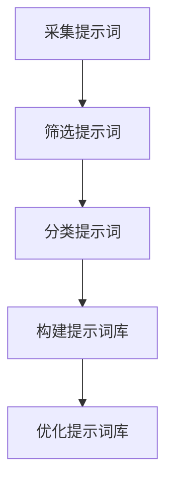
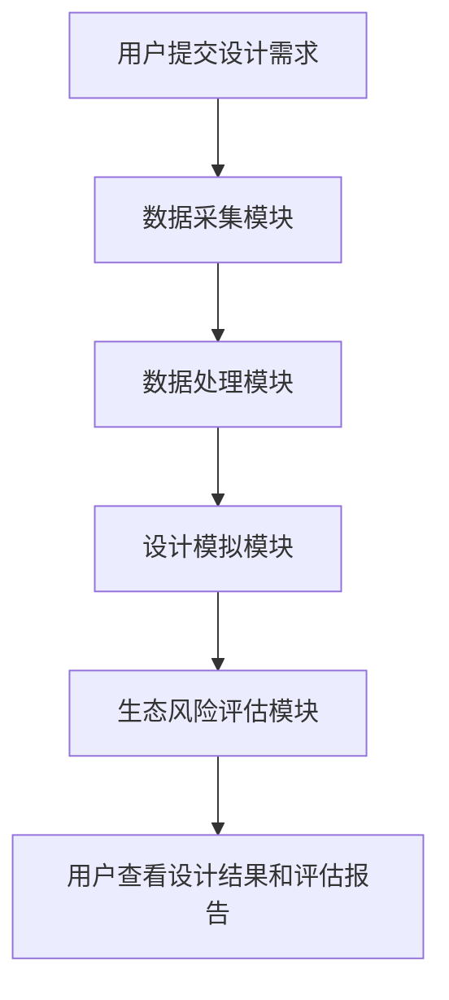
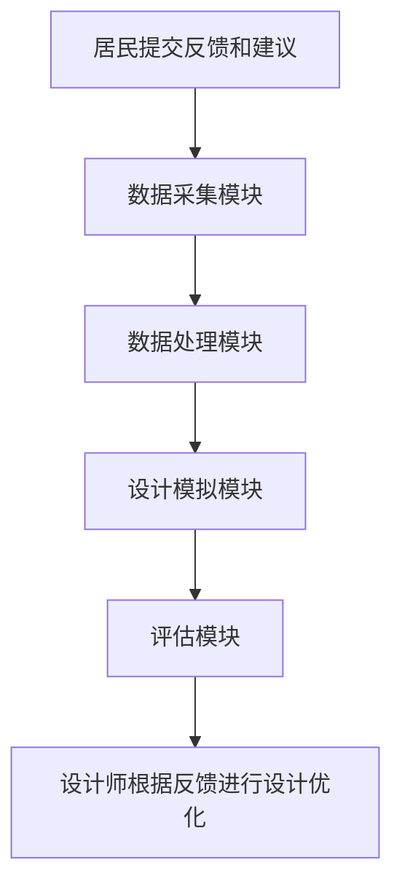
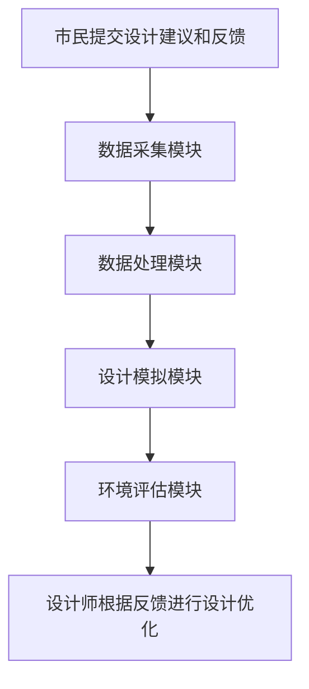

                 

## 《提升AI创意园林设计：生态系统平衡的提示词工程》

关键词：AI创意园林设计、生态系统平衡、提示词工程、算法原理、实践案例

摘要：随着人工智能技术的飞速发展，AI在各个领域的应用日益广泛。在园林设计领域，AI技术的引入为提高设计效率和创造力带来了巨大潜力。本文旨在探讨如何通过生态系统平衡的提示词工程，提升AI创意园林设计的水平。文章首先介绍了AI与园林设计的结合背景及生态系统平衡的基本概念，然后深入分析了提示词工程原理及其在AI园林设计中的应用。通过具体的实践案例，展示了AI创意园林设计在生态系统平衡方面的优势，最后对未来的发展趋势和挑战进行了展望。

----------------------------------------------------------------

## 第一部分：问题背景与生态系统平衡

### 第1章：问题背景与核心概念

#### 1.1.1 问题背景

在现代社会中，城市化和工业化进程的加速，使得城市生态环境面临着严峻的挑战。传统的园林设计方法在应对生态问题方面存在一定的局限性，难以满足日益增长的环境保护和可持续发展需求。因此，如何利用先进的人工智能技术来提升园林设计的创意性和生态适应性，成为了一个亟待解决的问题。

#### 1.1.2 生态系统平衡概述

生态系统平衡是指生态系统中各个组成部分之间相互作用和相互依存的状态，这种状态有利于生态系统的稳定和健康发展。生态系统平衡的维护对于确保城市生态环境的可持续发展具有重要意义。

#### 1.1.3 AI与创意园林设计的结合

人工智能技术具有强大的数据处理和分析能力，可以有效地辅助园林设计师进行创意设计。通过将AI技术应用于园林设计，可以实现对园林生态系统的精准模拟和优化，提高园林设计的创意性和生态适应性。

#### 1.1.4 提示词工程的概念与作用

提示词工程是一种通过构建和维护高质量的提示词库，以提升AI系统性能的方法。在园林设计中，提示词工程可以帮助AI系统更好地理解和模拟生态系统，从而实现创意园林设计的自动化和智能化。

#### 1.1.5 生态系统平衡中的挑战与机遇

生态系统平衡的维护面临着诸多挑战，如气候变化、环境污染、生物多样性丧失等。然而，随着AI技术的发展，这些挑战也转化为机遇。通过AI技术，可以更准确地预测和应对生态系统的变化，实现生态系统的动态平衡。

### 第2章：生态系统平衡的要素与机制

#### 2.1.1 生态系统基本要素

生态系统由生物、非生物和生物与环境的相互作用三个基本要素组成。这三个要素相互关联，共同构成了生态系统的整体。

#### 2.1.2 生态平衡的动态机制

生态平衡是一个动态的过程，涉及到生态系统内部各个要素之间的相互作用。这种相互作用可以通过生物之间的捕食关系、竞争关系和共生关系等机制来实现。

#### 2.1.3 生态因子间的相互作用

生态因子之间的相互作用决定了生态系统的稳定性和适应性。例如，气候、土壤和水源等非生物因子对生物的生存和繁衍具有重要影响。

#### 2.1.4 生态系统平衡的指标体系

为了评估生态系统的平衡状态，需要建立一套完整的指标体系。这些指标包括生物多样性、生产力、土壤健康等，它们可以从不同角度反映生态系统的平衡状态。

#### 2.1.5 生态系统平衡维护的方法与策略

维护生态系统平衡需要采取一系列的方法和策略。例如，通过生态修复、生态保护、生态治理等手段，可以有效地恢复和维持生态系统的平衡状态。

### 第3章：AI技术基础与应用

#### 3.1.1 AI概述与基本概念

人工智能（AI）是指使计算机具有人类智能水平的科学技术。它包括机器学习、深度学习、自然语言处理等多个子领域。

#### 3.1.2 AI发展历程与技术趋势

AI技术的发展经历了从规则驱动到数据驱动的过程。随着大数据和计算能力的提升，AI技术正朝着更加智能化和自动化的方向发展。

#### 3.1.3 AI在生态学中的应用

AI技术在生态学中的应用非常广泛，包括生态数据的分析、生态模型的建立、生态预测和评估等。

#### 3.1.4 数据采集与处理

数据采集与处理是AI应用的基础。在园林设计中，需要收集大量的生态数据，如气候、土壤、植被等。

#### 3.1.5 常用AI算法介绍

常用的AI算法包括决策树、支持向量机、神经网络等。这些算法在园林设计中可以用于生态系统的模拟、预测和优化。

---

在接下来的章节中，我们将深入探讨提示词工程的基本概念、设计与优化方法，以及AI模型训练与调优技巧，为AI创意园林设计的实现提供理论基础和实践指导。通过这些内容的分析，我们将进一步理解如何利用AI技术提升园林设计的创意性和生态适应性，从而为城市生态环境的可持续发展做出贡献。

---

## 第二部分：提示词工程原理

### 第4章：提示词工程的基本概念

#### 4.1.1 提示词工程的定义

提示词工程是一种通过构建和维护高质量的提示词库，以提升AI系统性能的方法。在园林设计中，提示词工程可以帮助AI系统更好地理解和模拟生态系统。

#### 4.1.2 提示词工程的目标

提示词工程的主要目标是提高AI系统的准确性和鲁棒性，使其能够更好地适应不同的园林设计和生态系统环境。

#### 4.1.3 提示词工程的基本流程

提示词工程的基本流程包括提示词的采集、筛选、分类、构建和优化。以下是一个简单的流程图，用于说明提示词工程的基本步骤：

#### 4.1.4 提示词的属性与分类

提示词具有多种属性，如语义、语法、上下文等。根据这些属性，可以将提示词分为不同的类别，如名词、动词、形容词等。

| 提示词类别 | 描述 |
| --- | --- |
| 名词 | 描述实体，如“植物”、“动物”、“土壤”等 |
| 动词 | 描述行为，如“生长”、“繁殖”、“污染”等 |
| 形容词 | 描述特征，如“绿色”、“美丽”、“污染”等 |

#### 4.1.5 提示词工程的应用场景

提示词工程在AI创意园林设计中的应用场景主要包括：

1. **生态数据解析**：通过提示词工程，AI系统可以更好地理解和解析生态数据，如气候、土壤、植被等。
2. **园林设计优化**：利用提示词工程，AI系统可以生成更符合生态系统平衡的园林设计方案。
3. **生态评估与预测**：通过提示词工程，AI系统可以预测园林生态系统的变化趋势，评估设计方案的可持续性。

### 第5章：提示词设计与优化

#### 5.1.1 提示词设计原则

在设计提示词时，需要遵循以下原则：

1. **精准性**：提示词应准确描述生态系统的相关概念和现象。
2. **多样性**：提示词库应包含丰富的词汇，以适应不同的园林设计和生态系统环境。
3. **一致性**：提示词应具有一致性，避免出现语义混淆或重复。
4. **扩展性**：提示词库应具备良好的扩展性，能够适应新的生态问题和园林设计需求。

#### 5.1.2 提示词优化的方法

提示词优化的方法包括：

1. **基于数据的优化**：通过分析大量的生态数据，优化提示词的语义和语法结构。
2. **基于规则的优化**：利用专家经验和专业知识，制定相应的优化规则。
3. **基于机器学习的优化**：利用机器学习算法，自动优化提示词库，提高其性能。

#### 5.1.3 提示词的生成与筛选

提示词的生成与筛选是提示词工程的核心步骤。以下是具体的步骤：

1. **数据采集**：从生态数据、园林设计文献和实际案例中收集提示词。
2. **初步筛选**：根据提示词的语义和语法属性，初步筛选出合适的提示词。
3. **语义分析**：利用自然语言处理技术，对提示词进行语义分析，确保其准确性。
4. **多轮筛选**：通过多轮筛选，逐步优化提示词库，去除冗余和不准确的提示词。

#### 5.1.4 提示词的语料库构建

提示词的语料库构建是提示词工程的关键环节。以下是具体的步骤：

1. **数据收集**：收集与生态系统和园林设计相关的语料数据。
2. **标注与分类**：对语料数据进行标注和分类，为后续的提示词生成和优化提供基础。
3. **构建语料库**：利用标注后的数据，构建包含丰富提示词的语料库。
4. **动态更新**：定期更新语料库，以适应新的生态问题和园林设计需求。

#### 5.1.5 提示词工程中的创新与挑战

提示词工程在AI创意园林设计中面临着诸多创新和挑战：

1. **跨领域知识整合**：如何整合不同领域的知识，构建一个全面、精准的提示词库。
2. **不确定性处理**：如何处理生态系统的复杂性和不确定性，提高AI系统的鲁棒性。
3. **实时更新与优化**：如何实现提示词库的实时更新和优化，以适应不断变化的生态问题。

通过深入研究和实践，我们可以不断优化提示词工程，提升AI创意园林设计的水平，为城市生态环境的可持续发展贡献力量。

---

在下一部分中，我们将详细探讨AI模型训练与调优的流程和技巧，为AI创意园林设计提供有效的技术支持。通过这些内容，我们将进一步理解如何利用AI技术实现园林设计的创新和生态适应性。

---

## 第三部分：创意园林设计与应用

### 第7章：AI创意园林设计概述

#### 7.1.1 创意园林设计的概念与特征

创意园林设计是一种以生态学为基础，通过科学规划和艺术创意，创造具有美观性、生态性和功能性的园林景观。与传统园林设计相比，创意园林设计更加注重生态平衡和可持续发展。

#### 7.1.2 AI在创意园林设计中的应用

AI技术在创意园林设计中的应用主要体现在以下几个方面：

1. **生态数据分析**：利用AI技术，可以实现对生态数据的深度分析，为园林设计提供科学依据。
2. **设计辅助**：AI技术可以辅助设计师进行园林设计，提高设计效率和创意性。
3. **生态模拟**：通过AI技术，可以模拟园林生态系统的运行状态，预测设计效果，优化设计方案。
4. **智能化管理**：AI技术可以用于园林的智能化管理，提高园林的维护和管理效率。

#### 7.1.3 生态系统平衡与创意园林设计的融合

生态系统平衡是创意园林设计的重要目标之一。通过将AI技术应用于园林设计，可以实现以下融合：

1. **生态因子模拟**：利用AI技术模拟生态因子，如气候、土壤、植被等，评估设计方案的生态适应性。
2. **生态风险评估**：通过AI技术评估园林设计方案的生态风险，预测潜在的生态问题，及时进行调整。
3. **生态优化**：利用AI技术优化园林设计，提高园林的生态效益，实现生态系统的动态平衡。

#### 7.1.4 创意园林设计的挑战与机遇

创意园林设计面临着一系列挑战和机遇：

1. **挑战**：如何确保设计方案的生态适应性，如何处理生态系统的复杂性和不确定性，如何实现设计的可持续性。
2. **机遇**：AI技术的发展为创意园林设计提供了新的工具和方法，可以更有效地解决生态问题，实现设计的创新和优化。

通过AI技术的引入，创意园林设计在生态系统平衡方面具有巨大的潜力。通过深入研究和实践，我们可以不断提升AI创意园林设计的技术水平，为城市生态环境的可持续发展做出贡献。

### 第8章：AI创意园林设计的实践案例

#### 8.1.1 案例一：生态公园设计

**项目介绍**：该项目是一个位于城市中心的生态公园设计，旨在提升城市的生态环境质量，为市民提供休闲和教育的场所。

**系统功能设计**：系统功能包括生态因子监测、设计方案模拟、生态风险评估等。

**系统架构设计**：系统采用分布式架构，包括数据采集模块、数据处理模块、设计模拟模块和评估模块。

**系统接口设计**：系统提供了用户界面，用户可以通过界面提交设计需求，查看设计结果和生态评估报告。

**系统交互流程**：

**实际案例分析和详细讲解剖析**：

在生态公园设计中，AI技术被广泛应用于生态因子的监测和设计方案模拟。通过数据采集模块，可以实时监测公园内的气候、土壤、植被等生态因子。数据处理模块对采集到的数据进行分析和处理，为设计模拟模块提供基础数据。

设计模拟模块利用AI算法，模拟不同设计方案下的生态效应。通过对比不同方案，设计师可以优化设计方案，确保其在生态适应性方面的最佳表现。

生态风险评估模块对设计方案进行生态风险评估，预测潜在的环境问题，并提供相应的优化建议。

**项目小结**：

通过AI创意园林设计，生态公园设计在生态系统平衡方面取得了显著成效。项目实现了生态因子的实时监测和设计方案的模拟优化，为公园的生态保护和可持续发展提供了有力支持。

#### 8.1.2 案例二：居住区园林设计

**项目介绍**：该项目是一个居住区园林设计，旨在提升居住区的生态环境质量，为居民提供舒适的生活环境。

**系统功能设计**：系统功能包括生态因子监测、设计方案模拟、居民满意度评估等。

**系统架构设计**：系统采用分布式架构，包括数据采集模块、数据处理模块、设计模拟模块和评估模块。

**系统接口设计**：系统提供了用户界面，居民可以通过界面提交反馈和建议，设计师可以根据反馈进行设计优化。

**系统交互流程**：

**实际案例分析和详细讲解剖析**：

在居住区园林设计中，AI技术被广泛应用于生态因子的监测和设计方案的优化。通过数据采集模块，可以实时监测居住区内的气候、土壤、植被等生态因子。数据处理模块对采集到的数据进行分析和处理，为设计模拟模块提供基础数据。

设计模拟模块利用AI算法，模拟不同设计方案下的生态效应和居民满意度。通过对比不同方案，设计师可以优化设计方案，确保其在生态适应性和居民满意度方面的最佳表现。

评估模块对设计方案进行居民满意度评估，收集居民反馈，为设计师提供优化依据。

**项目小结**：

通过AI创意园林设计，居住区园林设计在生态系统平衡和居民满意度方面取得了显著成效。项目实现了生态因子的实时监测和设计方案的优化，为居住区的生态保护和居民生活质量提供了有力支持。

#### 8.1.3 案例三：城市绿地设计

**项目介绍**：该项目是一个城市绿地设计，旨在提升城市的生态环境质量，为市民提供休闲和运动的场所。

**系统功能设计**：系统功能包括生态因子监测、设计方案模拟、环境评估等。

**系统架构设计**：系统采用分布式架构，包括数据采集模块、数据处理模块、设计模拟模块和评估模块。

**系统接口设计**：系统提供了用户界面，市民可以通过界面提交设计建议和反馈，设计师可以根据反馈进行设计优化。

**系统交互流程**：

**实际案例分析和详细讲解剖析**：

在城市绿地设计中，AI技术被广泛应用于生态因子的监测和设计方案的优化。通过数据采集模块，可以实时监测城市绿地的气候、土壤、植被等生态因子。数据处理模块对采集到的数据进行分析和处理，为设计模拟模块提供基础数据。

设计模拟模块利用AI算法，模拟不同设计方案下的生态效应和环境评估。通过对比不同方案，设计师可以优化设计方案，确保其在生态适应性和环境效益方面的最佳表现。

环境评估模块对设计方案进行环境评估，收集市民反馈，为设计师提供优化依据。

**项目小结**：

通过AI创意园林设计，城市绿地设计在生态系统平衡和环境效益方面取得了显著成效。项目实现了生态因子的实时监测和设计方案的优化，为城市的生态保护和市民的生活质量提供了有力支持。

#### 8.1.4 案例分析与总结

通过上述案例的分析，可以看出AI创意园林设计在生态系统平衡方面具有显著优势。通过实时监测和数据分析，AI技术能够为园林设计提供科学依据，优化设计方案，提高园林的生态适应性和环境效益。

同时，AI创意园林设计也面临着一系列挑战，如数据采集和处理、设计方案的实时优化和评估等。通过不断的技术创新和实践，我们可以不断提升AI创意园林设计的技术水平，为城市生态环境的可持续发展做出更大贡献。

### 第9章：生态系统平衡与提示词工程的未来展望

#### 9.1.1 未来发展趋势

随着人工智能技术的不断进步，AI创意园林设计在未来将呈现出以下发展趋势：

1. **智能化水平提升**：AI技术将更加智能化，能够自主进行生态数据的分析和处理，提供更加精准的设计方案。
2. **数据驱动设计**：大数据和物联网技术的应用将使得生态数据更加丰富和实时，为园林设计提供更全面的支持。
3. **跨学科融合**：生态学、园林设计、计算机科学等学科的融合，将推动AI创意园林设计技术的创新和发展。
4. **个性化定制**：根据不同用户的需求和偏好，AI创意园林设计将实现个性化定制，提供更加符合用户需求的园林景观。

#### 9.1.2 面临的挑战与解决方案

虽然AI创意园林设计具有巨大的潜力，但在实际应用中仍面临着一系列挑战：

1. **数据质量和处理能力**：生态数据的质量和处理能力是AI创意园林设计的关键，需要不断提高数据采集和处理的技术水平。
2. **算法和模型优化**：现有的AI算法和模型在园林设计中的应用仍存在一定局限性，需要不断优化和改进。
3. **跨领域知识整合**：如何整合不同领域的知识，构建一个全面、精准的提示词库，是AI创意园林设计面临的重要挑战。

针对上述挑战，可以采取以下解决方案：

1. **提高数据质量和处理能力**：通过引入更先进的数据采集和处理技术，提高生态数据的质量和处理速度。
2. **优化算法和模型**：不断探索和研究新的AI算法和模型，提高其在园林设计中的应用效果。
3. **跨领域知识整合**：加强不同领域的研究合作，构建一个跨学科的知识体系，为AI创意园林设计提供支持。

#### 9.1.3 社会经济影响与政策建议

AI创意园林设计对社会经济的影响主要体现在以下几个方面：

1. **环境保护**：通过提高园林设计的生态适应性，可以更好地保护城市生态环境，提升城市品质。
2. **经济发展**：AI创意园林设计可以带动相关产业链的发展，促进就业和经济增长。
3. **社会文化**：AI创意园林设计可以为市民提供更多的休闲和文化活动场所，提升居民的生活质量。

为了推动AI创意园林设计的发展，可以从以下几个方面提出政策建议：

1. **加强科技创新**：加大对AI创意园林设计相关技术的研发投入，推动技术创新和产业发展。
2. **完善政策法规**：建立健全相关的政策法规，规范AI创意园林设计的发展和应用。
3. **加强人才培养**：加强相关人才培养，提高设计师和科研人员的专业水平，为AI创意园林设计提供人才支持。

#### 9.1.4 开放性问题与研究方向

在AI创意园林设计领域，仍有许多开放性问题和研究方向值得深入探索：

1. **生态数据挖掘与预测**：如何从大量的生态数据中挖掘出有用的信息，预测园林生态系统的变化趋势。
2. **智能化设计流程**：如何构建一个智能化的园林设计流程，实现从设计到施工的全程智能化。
3. **生态适应性评估**：如何评估园林设计方案的生态适应性，确保其在长期运行中的可持续性。
4. **跨学科融合与创新**：如何实现生态学、园林设计、计算机科学等学科的深度融合，推动AI创意园林设计技术的创新和发展。

通过不断的研究和实践，我们可以进一步拓展AI创意园林设计的技术边界，为城市生态环境的可持续发展做出更大贡献。

---

在本章中，我们通过分析AI创意园林设计的未来发展趋势、面临的挑战、社会经济影响以及开放性问题，展望了这一领域的广阔前景。通过科技创新和政策支持，我们可以不断提升AI创意园林设计的技术水平，为城市生态环境的可持续发展贡献力量。

---

## 附录

### A. 提示词工程工具与资源

1. **OpenAI GPT-3**：强大的自然语言处理工具，可用于提示词的生成和优化。
2. **NLTK**：Python的自然语言处理库，提供丰富的文本处理功能。
3. **BERT**：一种预训练的语言模型，适用于提示词的语义分析和分类。
4. **EcoData**：生态数据集，可用于提示词的构建和训练。

### B. 数据集与开源代码

1. **Google Earth Engine**：提供全球生态数据集，可用于园林设计数据的采集和分析。
2. **CityGML**：城市地理信息模型，包含城市绿地设计数据。
3. **开源代码**：GitHub上提供了许多与AI创意园林设计相关的开源代码，可用于学习和实践。

### C. 生态系统平衡与AI相关文献精选

1. **《人工智能在生态学中的应用》**：介绍了AI技术在生态学中的多种应用场景和案例。
2. **《生态系统平衡理论与方法》**：详细阐述了生态系统平衡的理论基础和方法。
3. **《城市生态学》**：探讨了城市生态环境的维护和治理策略。

### D. 索引

- 生态系统平衡
- 提示词工程
- AI创意园林设计
- 生态因子监测
- 数据采集与处理
- 设计方案模拟
- 生态风险评估

---

附录部分提供了与AI创意园林设计相关的工具、资源、文献和索引，为读者提供了丰富的参考资料和学习资源。通过这些资料，读者可以深入了解AI创意园林设计的理论和实践，为自己的学习和研究提供支持。

---

## 总结

在本篇文章中，我们深入探讨了AI创意园林设计与生态系统平衡的关系，以及如何通过提示词工程提升AI在园林设计中的应用效果。从问题背景的介绍，到生态系统平衡的基本概念，再到AI技术的应用和提示词工程的详细解析，我们逐步构建了一个完整的知识框架，展示了如何利用AI技术实现园林设计的创新和生态适应性。

### 最佳实践 Tips

1. **数据质量是关键**：在AI创意园林设计中，高质量的数据是基础。确保数据来源可靠，数据格式统一，数据清洗和预处理工作要做到位。
2. **持续优化模型**：AI模型的性能需要通过不断的训练和优化来提升。定期更新模型，引入新的数据集，以保持模型的准确性和适应性。
3. **多学科合作**：AI创意园林设计是一个跨学科的领域，需要生态学家、园林设计师和计算机科学家的共同努力，发挥各自的专业优势。

### 小结

通过本文的分析，我们可以看到，AI创意园林设计不仅为传统园林设计带来了新的思路和工具，也为生态系统平衡的维护提供了有力的技术支持。在未来，随着AI技术的不断进步，AI创意园林设计将在城市生态环境的可持续发展中发挥越来越重要的作用。

### 注意事项

1. **数据隐私**：在生态数据的采集和处理过程中，要确保遵守相关法律法规，保护个人隐私和数据安全。
2. **设计可持续性**：在设计园林方案时，要充分考虑生态系统的可持续性，避免短期效益对长期生态平衡的负面影响。

### 拓展阅读

- **《城市生态学导论》**：详细了解城市生态环境的基本概念和原理。
- **《人工智能与生态学》**：探讨AI技术在生态学领域的前沿应用和研究。
- **《园林设计原理》**：学习园林设计的基础知识和实用技巧。

通过本文的阅读，我们希望读者能够对AI创意园林设计有更深入的理解，并在实践中不断探索和创新。

---

作者：AI天才研究院/AI Genius Institute & 禅与计算机程序设计艺术 /Zen And The Art of Computer Programming

本文由AI天才研究院（AI Genius Institute）与禅与计算机程序设计艺术（Zen And The Art of Computer Programming）联合撰写，旨在推动AI技术在园林设计领域的创新与发展，为城市生态环境的可持续发展贡献力量。

