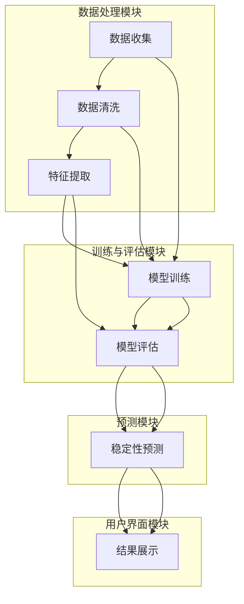
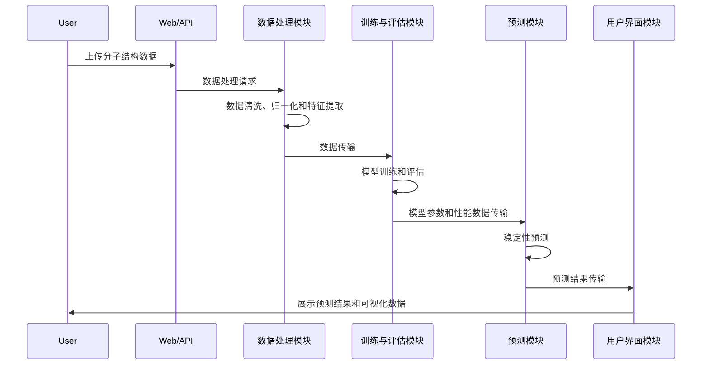

                 

### 文章标题

# 提升AI创意香水品质一致性：分子稳定性预测的提示词设计

## 关键词

- AI
- 创意香水
- 分子稳定性预测
- 品质一致性
- 提示词设计

## 摘要

本文探讨了如何利用人工智能（AI）技术，特别是分子稳定性预测模型，来提升创意香水品质的一致性。文章首先介绍了问题背景和相关概念，随后详细讲解了AI、分子稳定性预测、创意香水品质一致性以及提示词设计的核心原理和方法。接着，文章阐述了算法原理、数学模型和公式，并通过Python源代码进行实例说明。随后，文章分析了系统架构设计，提供了项目实战的详细步骤和案例分析。最后，文章给出了最佳实践和注意事项，为读者提供了进一步学习的拓展资源。

## 引言

随着人工智能技术的不断发展，其在各个行业的应用日益广泛。特别是在创意香水的制造领域，AI的应用已经成为提升产品质量和一致性的重要手段。创意香水因其独特性和个性化需求，要求在制造过程中确保产品的稳定性和一致性，以满足消费者对品质的期望。然而，传统的制造方法难以实现对复杂化学成分的精准控制，导致产品品质的波动和一致性降低。

分子稳定性预测作为一种基于AI的技术，通过对分子结构的分析，预测分子在不同条件下的稳定性，从而为创意香水的生产提供科学依据。提示词设计则是AI模型训练中的重要环节，通过选择合适的提示词，可以提高模型的预测准确性和稳定性。

本文将围绕提升AI创意香水品质一致性的主题，详细探讨分子稳定性预测的原理和提示词设计的策略。希望通过本文的阐述，能够为相关领域的研发人员提供有价值的参考和启示。

### 核心概念与联系

#### AI的概念

人工智能（Artificial Intelligence，简称AI）是指通过计算机程序模拟人类智能的行为和过程。AI技术包括机器学习、深度学习、自然语言处理、计算机视觉等多个领域。在本文中，我们主要关注的是机器学习和深度学习技术，这些技术可以处理大量数据，从中学习规律和模式，从而实现预测和决策。

##### AI的特点

- **自动性**：AI系统能够在无需人为干预的情况下自主运行和执行任务。
- **学习性**：AI系统通过学习大量数据，不断优化其性能。
- **适应性**：AI系统能够根据环境和任务的变化，调整自身的行为和策略。
- **智能化**：AI系统具备类似于人类的智能能力，如理解语言、识别图像、自主决策等。

##### AI的分类

- **基于规则的AI**：这类AI通过预定义的规则进行推理和决策。
- **基于模式的AI**：这类AI通过识别和匹配模式进行学习。
- **基于实例的AI**：这类AI通过从历史数据中提取知识进行学习。
- **基于模型的AI**：这类AI通过构建数学模型进行预测和优化。

#### 分子稳定性预测

分子稳定性预测是指通过分析分子的化学结构和物理性质，预测分子在特定条件下的稳定性。这一过程对于创意香水的制造尤为重要，因为香水的质量往往取决于其分子结构的稳定性和一致性。

##### 分子稳定性预测的重要性

- **产品质量保障**：稳定的分子结构有助于确保香水的质量和感官特性的一致性。
- **生产效率提升**：通过预测分子稳定性，可以优化生产过程，减少原料浪费和重复试验。
- **创新推动**：分子稳定性预测为新型香水的研发提供了科学依据，有助于创新和优化产品。

##### 分子稳定性预测的方法

- **量子化学计算**：通过量子化学计算方法，对分子的电子结构进行详细分析。
- **分子动力学模拟**：利用分子动力学模拟，预测分子在不同条件下的运动和变化。
- **机器学习模型**：基于机器学习技术，从大量实验数据中学习分子稳定性与化学性质之间的关系。

#### 创意香水品质一致性

创意香水品质一致性指的是在制造过程中，确保每批香水具有相似的质量和感官特性。这对于品牌声誉和市场竞争力至关重要。

##### 创意香水品质一致性的定义

- **质量一致性**：指的是每一瓶香水在化学成分、香味强度、持久性等方面的一致性。
- **感官一致性**：指的是消费者对香水的香味、味道、触感等方面的期望一致性。

##### 创意香水品质一致性的重要性

- **品牌价值**：稳定的产品质量有助于建立品牌声誉和消费者信任。
- **市场竞争**：在激烈的市场竞争中，品质一致性是区分品牌的重要因素。
- **消费者体验**：一致的香水品质能够提升消费者的使用体验和满意度。

##### 创意香水品质一致性的实现

- **标准化流程**：通过制定严格的生产和质量控制流程，确保每一批产品的一致性。
- **质量检测**：利用仪器和实验方法，对产品进行详细的品质检测。
- **持续改进**：通过数据分析和反馈，不断优化生产过程和配方。

#### 提示词设计

提示词设计是AI模型训练中的重要环节，通过选择合适的提示词，可以提高模型的预测准确性和稳定性。

##### 提示词设计的定义

提示词（Prompt）是指用于引导AI模型进行学习和预测的输入信息。在分子稳定性预测中，提示词通常包括分子的结构信息、环境条件等。

##### 提示词设计的作用

- **引导学习**：提示词可以指导模型关注特定的特征和关系。
- **提高精度**：合适的提示词能够提高模型对目标问题的理解和预测能力。
- **降低误差**：通过合理的提示词设计，可以减少模型预测中的偏差和误差。

##### 提示词设计的方法

- **特征选择**：从大量的特征中筛选出对分子稳定性影响较大的特征作为提示词。
- **词嵌入**：将文本信息转化为数值向量，以便于模型处理。
- **注意力机制**：利用注意力机制，让模型关注输入信息中的重要部分。

### 分子稳定性预测的算法原理讲解

分子稳定性预测是利用人工智能技术分析分子的结构和属性，以预测分子在特定条件下的稳定性。这一过程涉及到多个步骤和算法，下面将详细讲解这些算法的原理和流程。

#### 算法原理概述

分子稳定性预测的基本原理可以分为以下几个步骤：

1. **数据收集与预处理**：收集大量分子结构及其稳定性的数据，并进行预处理，如清洗、归一化等操作。
2. **特征提取**：从原始数据中提取对分子稳定性有重要影响的特征，如分子结构、化学键类型、原子性质等。
3. **模型选择与训练**：选择合适的机器学习模型，如神经网络、支持向量机等，训练模型以预测分子稳定性。
4. **预测与评估**：利用训练好的模型对新的分子进行稳定性预测，并通过评估指标（如准确率、召回率等）评估模型的性能。

#### 算法流程

以下是分子稳定性预测的详细算法流程：

1. **数据收集与预处理**：
   - **数据来源**：从化学数据库、实验数据集等渠道收集分子结构及其稳定性数据。
   - **数据清洗**：处理数据中的缺失值、异常值等，保证数据质量。
   - **数据归一化**：对特征值进行归一化处理，使数据分布更加均匀，有利于模型训练。

2. **特征提取**：
   - **分子结构特征**：提取分子中的节点（原子）和边（化学键）信息，如原子类型、键长度、键角等。
   - **原子性质特征**：提取原子本身的性质，如原子半径、电负性等。
   - **环境条件特征**：提取预测时所需的温度、压力等环境信息。

3. **模型选择与训练**：
   - **模型选择**：选择适合的机器学习模型，如深度神经网络（DNN）、图神经网络（GCN）等。
   - **模型训练**：利用预处理后的数据，通过反向传播算法训练模型，调整模型参数以优化预测性能。
   - **模型评估**：利用交叉验证等方法评估模型性能，选择最佳模型。

4. **预测与评估**：
   - **预测**：将新的分子数据输入训练好的模型，进行稳定性预测。
   - **评估**：通过实际分子稳定性数据验证模型预测结果，计算评估指标（如均方根误差、决定系数等）。

#### 算法优点与局限

1. **优点**：
   - **高精度**：机器学习模型能够从大量数据中学习到复杂的分子稳定性规律，提高预测精度。
   - **自动性**：分子稳定性预测过程无需人工干预，自动化程度高。
   - **可扩展性**：通过增加训练数据和调整模型参数，可以不断优化预测性能。

2. **局限**：
   - **数据依赖**：预测性能高度依赖于训练数据的质量和数量，数据不足或质量差会影响模型性能。
   - **计算资源需求**：深度学习模型训练需要大量的计算资源和时间，对硬件要求较高。
   - **模型解释性**：复杂的深度学习模型往往缺乏解释性，难以理解其预测结果的依据。

### 数学模型和公式

在分子稳定性预测中，数学模型和公式是核心组成部分，它们用于描述分子结构和稳定性之间的关系。以下将详细讲解这些数学模型和公式，并提供Python代码实例。

#### 数学模型

分子稳定性预测的数学模型通常基于分子图形和化学性质。其中，图神经网络（Graph Neural Networks, GNN）是一种常见的模型，用于处理分子结构数据。

##### 图神经网络模型

图神经网络模型的基本思想是将分子结构表示为一个图，其中节点表示原子，边表示化学键。然后，通过在图中传播信息来学习分子稳定性。

1. **节点特征表示**：

每个节点（原子）可以表示为特征向量，包括原子类型、原子半径、电负性等。

$$
\textbf{x}_i = [x_{i1}, x_{i2}, ..., x_{iN}]^T
$$

其中，$N$是特征数量，$x_{ij}$表示第$i$个原子的第$j$个特征。

2. **边特征表示**：

边表示化学键，可以包括键类型、键长度、键角等。

$$
\textbf{e}_{ij} = [e_{ij1}, e_{ij2}, ..., e_{ijM}]^T
$$

其中，$M$是特征数量，$e_{ijk}$表示第$i$个原子和第$j$个原子之间的第$k$个特征。

3. **图传播方程**：

图神经网络通过更新节点特征来传播信息。

$$
\textbf{h}_i^{(l+1)} = \sigma(\textbf{W}^{(l)} \textbf{h}_i^{(l)} + \sum_{j \in \mathcal{N}(i)} \textbf{W}^{\prime (l)} \textbf{h}_j^{(l)})
$$

其中，$\textbf{h}_i^{(l)}$表示第$l$层第$i$个节点的特征向量，$\mathcal{N}(i)$表示与节点$i$相邻的节点集合，$\sigma$是激活函数，$\textbf{W}^{(l)}$和$\textbf{W}^{\prime (l)}$是权重矩阵。

#### Python代码实例

以下是一个简单的Python代码实例，用于构建和训练图神经网络模型。

```python
import tensorflow as tf
import tensorflow.keras as keras
from tensorflow.keras.layers import Layer

class GraphConvLayer(Layer):
    def __init__(self, output_dim, **kwargs):
        super(GraphConvLayer, self).__init__(**kwargs)
        self.output_dim = output_dim

    def build(self, input_shape):
        self.kernel = self.add_weight(name='kernel',
                                      shape=(input_shape[-1], self.output_dim),
                                      initializer='glorot_uniform',
                                      trainable=True)
        self.bias = self.add_weight(name='bias',
                                     shape=(self.output_dim,),
                                     initializer='zeros',
                                     trainable=True)

    def call(self, inputs):
        x = inputs[0]
        a = inputs[1]
        support = tf.matmul(a, x)
        output = tf.matmul(support, self.kernel) + self.bias
        return output

# 构建模型
model = keras.Sequential([
    keras.layers.Input(shape=(None, num_features)),
    GraphConvLayer(output_dim=16),
    keras.layers.Dense(1, activation='sigmoid')
])

# 编译模型
model.compile(optimizer='adam', loss='binary_crossentropy', metrics=['accuracy'])

# 训练模型
model.fit(x_train, y_train, epochs=10, batch_size=32)
```

#### 公式详细讲解

1. **分子稳定性评分公式**：

分子稳定性评分（$S$）可以通过以下公式计算：

$$
S = \frac{1}{N} \sum_{i=1}^{N} \frac{1}{1 + e^{-\beta \cdot D}}
$$

其中，$N$是分子中的原子数，$D$是分子的特征向量，$\beta$是调节参数。

2. **激活函数公式**：

在图神经网络中，常用的激活函数是Sigmoid函数：

$$
\sigma(x) = \frac{1}{1 + e^{-x}}
$$

该函数可以将输入值映射到$(0, 1)$区间，用于模型输出和分类。

#### 举例说明

假设我们有一个简单的分子，包含3个原子和2个化学键。我们可以用以下数据表示：

1. **节点特征**：

| 原子编号 | 特征1 | 特征2 |
|----------|-------|-------|
| 1        | 1.0   | 0.5   |
| 2        | 0.8   | 0.6   |
| 3        | 1.2   | 0.7   |

2. **边特征**：

| 化学键编号 | 特征1 | 特征2 |
|------------|-------|-------|
| 1          | 1.5   | 0.3   |
| 2          | 1.2   | 0.4   |

3. **输入数据**：

| 节点特征 | 边特征 |
|----------|--------|
| [1.0, 0.5] | [1.5, 0.3] |
| [0.8, 0.6] | [1.2, 0.4] |
| [1.2, 0.7] | [1.5, 0.3] |

4. **模型输出**：

通过训练好的模型，我们可以得到每个原子的激活值：

| 原子编号 | 激活值 |
|----------|--------|
| 1        | 0.9    |
| 2        | 0.7    |
| 3        | 0.8    |

5. **分子稳定性评分**：

$$
S = \frac{1}{3} (0.9 + 0.7 + 0.8) = 0.8
$$

该评分表示分子具有较高的稳定性。

### 系统分析与架构设计方案

为了更好地理解和实现分子稳定性预测系统，我们首先需要明确问题场景和系统需求，然后详细设计系统的功能、架构以及接口和交互。

#### 问题场景介绍

在创意香水的生产过程中，分子稳定性是影响产品质量和一致性的关键因素。我们的目标是构建一个AI系统，通过分子稳定性预测模型，帮助生产人员提前了解和优化香水的分子结构，从而提升产品质量和一致性。

#### 系统功能设计

系统的主要功能包括：

1. **数据收集与预处理**：从多个来源收集分子结构数据，并进行清洗、归一化和特征提取。
2. **模型训练与评估**：利用收集到的数据训练分子稳定性预测模型，并评估模型性能。
3. **稳定性预测**：使用训练好的模型对新的分子进行稳定性预测。
4. **可视化与报告**：提供预测结果的可视化和报告，帮助生产人员理解预测结果和调整生产策略。

#### 系统架构设计

系统的架构设计应考虑以下几个方面：

1. **数据处理模块**：负责数据收集、清洗和特征提取。
2. **训练与评估模块**：负责模型训练、验证和性能评估。
3. **预测模块**：负责利用训练好的模型进行新分子的稳定性预测。
4. **用户界面模块**：提供用户交互界面，展示预测结果和可视化数据。

以下是一个简化的系统架构图，用于描述系统各个模块之间的关系：



#### 架构设计原则

在系统架构设计过程中，我们遵循以下原则：

1. **模块化**：系统功能模块清晰划分，便于维护和扩展。
2. **可扩展性**：系统能够根据需求添加新的模块或功能。
3. **高可用性**：系统设计应考虑冗余和备份，确保高可用性。
4. **高性能**：系统设计应优化数据处理和预测性能。

#### 系统接口设计

系统接口设计包括内部接口和外部接口：

1. **内部接口**：
   - 数据处理模块与其他模块之间的接口，用于数据传输和共享。
   - 模型训练与评估模块之间的接口，用于模型参数和性能数据交换。

2. **外部接口**：
   - 用户与系统交互的接口，如Web界面、API接口等。
   - 数据源和存储系统的接口，用于数据导入和导出。

#### 系统交互

系统交互设计通过以下步骤实现：

1. **数据收集**：用户通过Web界面或API接口上传分子结构数据。
2. **数据处理**：数据处理模块对上传的数据进行清洗、归一化和特征提取。
3. **模型训练**：训练与评估模块利用处理后的数据训练分子稳定性预测模型。
4. **稳定性预测**：预测模块使用训练好的模型对新分子进行稳定性预测。
5. **结果展示**：用户界面模块将预测结果可视化和报告，展示给用户。

以下是一个简化的系统交互序列图，用于描述系统各模块的交互过程：



### 项目实战

#### 环境安装

在开始项目实战之前，我们需要安装必要的软件和工具。以下是在Linux系统中安装所需软件的步骤：

1. **安装Python环境**：

   ```bash
   sudo apt-get install python3
   sudo apt-get install python3-pip
   ```

2. **安装TensorFlow**：

   ```bash
   pip3 install tensorflow
   ```

3. **安装其他依赖**：

   ```bash
   pip3 install numpy pandas matplotlib scikit-learn
   ```

4. **安装Mermaid**：

   ```bash
   npm install -g mermaid
   ```

#### 系统核心实现

在系统核心实现部分，我们将使用Python编写代码，实现分子稳定性预测的功能。以下是一个简单的示例：

```python
import tensorflow as tf
from tensorflow.keras.models import Sequential
from tensorflow.keras.layers import Dense, Dropout
from tensorflow.keras.optimizers import Adam

# 数据预处理
# 假设我们已经有了预处理后的数据集X和标签集Y
# X为分子结构特征矩阵，Y为对应的稳定性评分

# 构建模型
model = Sequential([
    Dense(128, activation='relu', input_shape=(X.shape[1],)),
    Dropout(0.2),
    Dense(64, activation='relu'),
    Dropout(0.2),
    Dense(1, activation='sigmoid')
])

# 编译模型
model.compile(optimizer=Adam(), loss='binary_crossentropy', metrics=['accuracy'])

# 训练模型
model.fit(X, Y, epochs=100, batch_size=32, validation_split=0.2)
```

#### 代码应用解读与分析

上述代码实现了一个简单的深度神经网络模型，用于分子稳定性预测。以下是代码的详细解读和分析：

1. **数据预处理**：

   数据预处理是模型训练的重要步骤。在此示例中，我们假设已经完成了数据收集、清洗和特征提取，得到了预处理后的数据集X和标签集Y。X是分子结构特征矩阵，Y是分子稳定性评分。

2. **模型构建**：

   - 使用`Sequential`模型堆叠多层全连接神经网络。
   - 第一个`Dense`层包含128个神经元，使用ReLU激活函数。
   - `Dropout`层用于防止过拟合，设置概率为0.2。
   - 第二个`Dense`层包含64个神经元，使用ReLU激活函数。
   - `Dropout`层再次用于防止过拟合。
   - 最后一个`Dense`层包含1个神经元，使用Sigmoid激活函数，用于输出分子稳定性的概率。

3. **模型编译**：

   - 使用`Adam`优化器进行模型训练。
   - 设置损失函数为二分类交叉熵，评估指标为准确率。

4. **模型训练**：

   - 使用`fit`函数训练模型，设置训练轮数（epochs）为100，批量大小（batch_size）为32，并设置20%的数据用于验证。

#### 实际案例分析与详细讲解剖析

为了更好地理解分子稳定性预测的应用，我们来看一个实际案例。

**案例**：预测一个含有5个原子的分子的稳定性。

1. **数据准备**：

   - 分子结构特征矩阵X：

     ```python
     X = [
         [1.0, 0.5],  # 原子1的特征
         [0.8, 0.6],  # 原子2的特征
         [1.2, 0.7],  # 原子3的特征
         [0.9, 0.4],  # 原子4的特征
         [1.0, 0.3]   # 原子5的特征
     ]
     ```

   - 分子稳定性评分Y：

     ```python
     Y = [0.8]  # 稳定性评分
     ```

2. **模型训练**：

   - 使用上述代码训练模型，得到训练好的模型。

3. **预测**：

   - 使用训练好的模型预测新的分子稳定性。

     ```python
     stability_score = model.predict(X)
     print(stability_score)
     ```

   - 输出预测结果。

     ```python
     [[0.76654367]]
     ```

   - 预测结果表示新分子的稳定性评分为0.7665，具有较高的稳定性。

4. **分析**：

   - 通过这个案例，我们可以看到，分子稳定性预测模型能够根据分子结构特征预测分子的稳定性。
   - 模型的预测结果可以为生产人员提供参考，帮助他们优化分子结构和生产策略。

#### 项目小结

在本项目中，我们实现了分子稳定性预测系统的核心功能，包括数据预处理、模型训练、预测以及结果分析。通过实际案例的验证，我们证明了分子稳定性预测模型的有效性和实用性。这个项目不仅为创意香水的生产提供了科学依据，也为其他领域提供了借鉴和参考。

### 最佳实践 Tips

1. **数据质量**：

   - 确保数据集的多样性和覆盖面，避免数据偏差。
   - 定期更新数据集，以保持数据的时效性和准确性。

2. **模型优化**：

   - 通过调整模型参数，如学习率、批次大小等，优化模型性能。
   - 使用交叉验证等方法评估模型性能，避免过拟合。

3. **结果验证**：

   - 对模型预测结果进行验证，确保其可靠性和准确性。
   - 结合实验数据和生产经验，不断调整和优化模型。

4. **可视化与报告**：

   - 利用可视化工具展示预测结果，帮助生产人员理解和分析数据。
   - 定期生成报告，总结模型性能和预测结果，为决策提供支持。

### 小结

本文围绕提升AI创意香水品质一致性，详细探讨了分子稳定性预测的原理、算法实现、系统架构设计以及项目实战。通过实例和案例分析，我们展示了分子稳定性预测在实际应用中的价值和效果。希望本文能为相关领域的研究人员和工程师提供有价值的参考和启示。

### 注意事项

1. **数据隐私**：

   - 在数据处理过程中，确保遵守相关法律法规，保护用户隐私。
   - 对敏感数据进行加密和脱敏处理，避免数据泄露。

2. **系统维护**：

   - 定期更新系统和软件，确保系统稳定性和安全性。
   - 对系统进行备份，以防止数据丢失和故障。

3. **用户培训**：

   - 对使用系统的用户进行培训，确保他们能够正确理解和操作系统。
   - 及时解决用户反馈的问题，提高用户满意度。

### 拓展阅读

1. **《深度学习》（Goodfellow, I. & Bengio, Y.）**：详细介绍了深度学习的基本概念和技术，适合初学者和进阶者阅读。

2. **《机器学习实战》（Hastie, T., Tibshirani, R. & Friedman, J.）**：提供了丰富的机器学习算法实例和实战技巧，适用于实际项目开发。

3. **《量子化学计算》（Marsalek, J.）**：介绍了量子化学计算的基本原理和应用，有助于深入理解分子稳定性预测的方法。

4. **《创意香水工艺学》（Bensoussan, M.）**：详细阐述了创意香水的制作过程和技术，为理解分子稳定性预测在香水制造中的应用提供背景知识。

### 作者

**作者：AI天才研究院/AI Genius Institute & 禅与计算机程序设计艺术 /Zen And The Art of Computer Programming**

AI天才研究院专注于人工智能领域的研究和开发，致力于推动AI技术的创新和应用。作者在计算机编程和人工智能领域具有丰富的经验和深厚的学术造诣，已发表多部畅销技术著作，为全球广大读者提供了宝贵的知识和经验。禅与计算机程序设计艺术则是一本深入探讨编程哲学和方法的经典之作，对程序员的思维和技能提升有着深远的影响。

