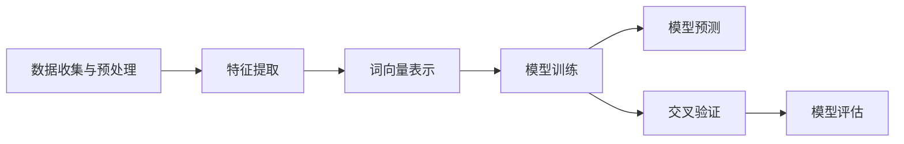
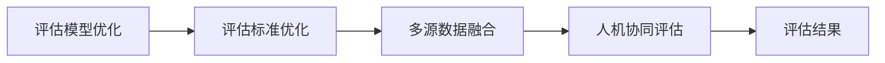
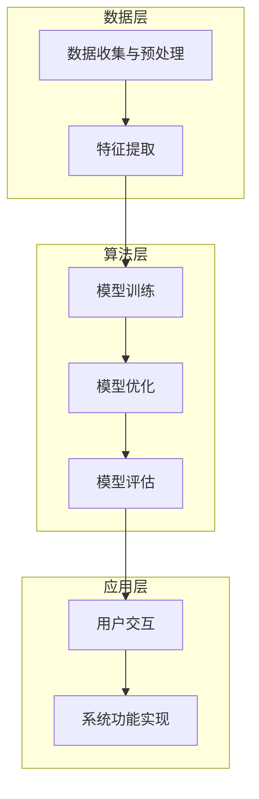
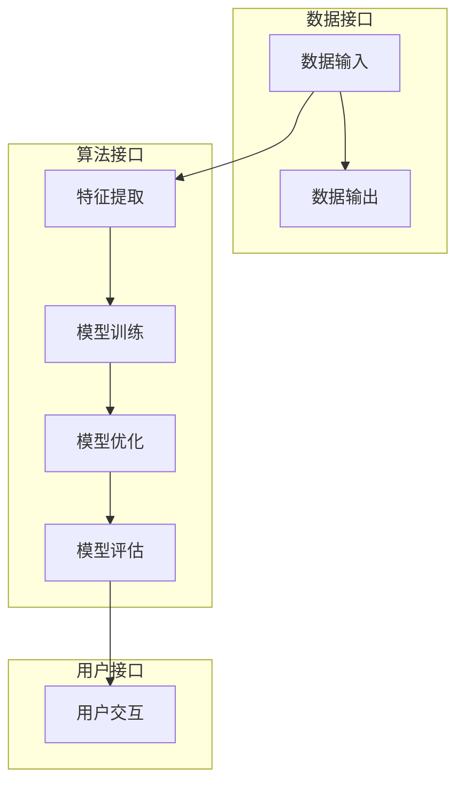
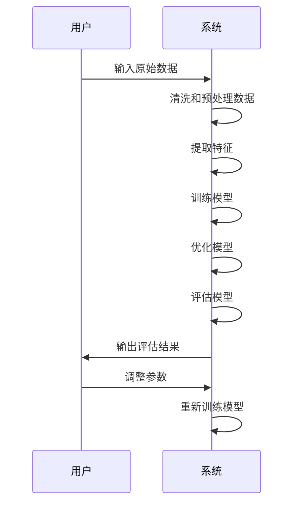

                 


### 1. 背景介绍

**第1章：问题背景与核心概念**

#### 1.1 问题背景

在当今快节奏的生活中，人们对香水的需求日益增长，不仅追求外观和品牌的吸引力，更注重香水的品质。品质是决定消费者购买决策的重要因素之一，而在香水的品质控制中，感官评估起着至关重要的作用。感官评估是通过人的嗅觉和味觉来感知和判断物质的特性，从而确定其品质。

然而，传统的感官评估方法存在一些局限性。首先，评估者的主观判断容易受到个人情绪、经验和疲劳等因素的影响，导致评估结果的准确性和一致性不高。其次，传统的感官评估方法通常依赖于大量的人力和时间，效率较低。此外，随着香水产品的多样化，传统的感官评估方法难以全面、精确地反映各种新香水的品质。

为了克服这些局限性，人工智能（AI）的应用成为一个重要的方向。AI技术，尤其是机器学习和深度学习，可以处理大量数据，通过学习和分析，提高感官评估的准确性和一致性。AI还可以帮助发现传统感官评估无法捕捉的细微差别，从而提供更全面的品质评估。

#### 1.2 问题描述

AI在提升香水品质控制中的应用面临着一系列挑战。首先，感官评估标准的构建是一个关键问题。如何设计一套有效的感官评估标准，使其既能够反映香水的品质特性，又能够适应不同消费者的偏好，是一个亟待解决的问题。

其次，感官评估标准的优化也是一大挑战。随着香水产品的不断创新和多样化，原有的评估标准可能不再适用，需要不断地进行调整和优化。此外，如何利用AI技术对感官评估标准进行智能化优化，提高评估的准确性和效率，也是一个重要的问题。

#### 1.3 问题解决

为了解决上述问题，我们需要采取一系列策略来提升AI创意香水品质控制。首先，在感官评估标准的构建方面，我们可以采用以下方法：

1. **数据收集与预处理**：收集大量的香水品质评估数据，包括消费者的反馈、专家的评分等，并进行数据清洗和预处理，确保数据的质量和一致性。

2. **特征提取与选择**：从原始数据中提取关键特征，如香气强度、持久性、复杂性等，并利用机器学习方法选择对品质评估最有影响力的特征。

3. **模型训练与评估**：利用提取的关键特征训练深度学习模型，如卷积神经网络（CNN）或循环神经网络（RNN），通过交叉验证和评估，选择最优模型。

4. **评估标准优化**：根据训练好的模型，对感官评估标准进行优化，使其能够更准确地反映香水的品质特性。

在感官评估标准的优化方面，我们可以采用以下策略：

1. **持续学习与调整**：利用AI技术对评估标准进行持续学习和调整，以适应香水产品的不断创新和多样化。

2. **多源数据融合**：结合多种数据源，如消费者的反馈、专家的评分、化学成分分析等，提高评估的全面性和准确性。

3. **人机协同**：结合人类专家的直觉和AI的精准计算，实现人机协同的感官评估，提高评估的效率和准确性。

#### 1.4 边界与外延

在香水品质控制中，感官评估标准的边界和适用范围是一个重要的问题。首先，感官评估标准主要关注香水的外观、香气、口感等感官特性，而忽略了其他非感官特性，如化学成分、微生物指标等。因此，感官评估标准需要与其他评估标准相结合，以全面评价香水的品质。

其次，感官评估标准的适用范围可能因香水产品的不同而有所差异。例如，对于高端香水，消费者更注重香气的高贵和独特性，而普通香水则更注重香气的持久性和舒适度。因此，感官评估标准需要根据不同类型香水的特点进行定制化设计。

#### 1.5 概念结构与核心要素组成

在AI创意香水品质控制中，感官评估标准的构建与优化是一个复杂的过程，涉及多个核心概念和要素。以下是该概念结构的核心要素组成：

1. **数据集**：包括大量香水品质评估数据，用于训练和优化评估模型。
2. **特征提取**：从原始数据中提取关键特征，如香气强度、持久性、复杂性等。
3. **机器学习模型**：用于训练和评估评估模型，如卷积神经网络（CNN）或循环神经网络（RNN）。
4. **评估模型**：根据训练好的模型，对香水品质进行评估。
5. **优化算法**：用于优化评估模型和评估标准，提高评估的准确性和效率。
6. **用户反馈**：收集消费者的反馈，用于调整和优化评估模型。

### 2. 核心概念与联系

**第2章：核心概念原理**

#### 2.1 AI技术概述

AI技术是提升香水品质控制的重要工具。AI技术主要包括以下几类：

1. **机器学习**：通过训练模型，使计算机具备从数据中学习和预测的能力。机器学习可以分为监督学习、无监督学习和半监督学习。
2. **深度学习**：一种特殊的机器学习方法，通过多层神经网络进行数据处理和特征提取。深度学习在图像识别、语音识别等领域表现出色。
3. **神经网络**：神经网络是深度学习的基础，由大量 interconnected neurons 组成，通过训练学习数据的内在规律。
4. **自然语言处理（NLP）**：使计算机能够理解和生成自然语言的技术，包括文本分类、情感分析、机器翻译等。

#### 2.2 感官评估原理

感官评估是基于人类感官系统对物质特性的感知和判断。在香水品质控制中，主要涉及以下几种感官评估方法：

1. **嗅觉评估**：通过鼻子的嗅觉器官感知香水的气味。嗅觉评估通常采用盲评方法，以减少评估者的主观偏差。
2. **味觉评估**：通过舌头的味觉器官感知香水的口感。味觉评估通常结合其他感官评估方法，以全面评价香水的品质。
3. **视觉评估**：通过视觉感官评估香水的外观，包括颜色、透明度、沉淀等。

#### 2.3 AI与感官评估的联系

AI技术可以与感官评估相结合，提升评估的准确性和效率。以下是AI在感官评估中的应用：

1. **模式识别**：利用机器学习和深度学习算法，对传感器采集的香气数据进行模式识别，以分类和预测香气特征。
2. **数据挖掘**：通过数据挖掘技术，分析大量感官评估数据，发现新的香气特征和规律。
3. **智能评估**：利用AI技术，对感官评估过程进行智能化管理，提高评估的一致性和准确性。

#### 2.4 感官评估标准的定义与分类

感官评估标准是用于指导评估者进行感官评估的规则和标准。感官评估标准可以分为以下几类：

1. **通用标准**：适用于各种类型的香水，如香气强度、持久性、复杂性等。
2. **产品标准**：针对特定产品的感官评估标准，如香水喷雾的均匀性、香水口红的色泽等。
3. **行业标准**：由行业组织或协会制定的感官评估标准，如国际香料香精制造商协会（IFRA）的香气评估标准。

#### 2.5 感官评估方法

感官评估方法主要包括以下几种：

1. **盲评**：评估者在不知情的情况下对香水进行评估，以减少主观偏差。
2. **盲评配对测试**：将两种或多种香水进行配对，评估者判断哪种香水更好。
3. **多评估者评估**：多个评估者对同一香水进行评估，汇总评估结果，提高评估的准确性。
4. **统计分析**：利用统计分析方法，分析评估结果，确定香水的品质。

### 3. 算法原理讲解

**第3章：算法原理与数学模型**

#### 3.1 提示词设计算法

提示词设计算法是AI在感官评估中的一项关键技术。以下是提示词设计算法的基本原理和步骤：

1. **数据收集与预处理**：收集大量香水品质评估数据，并进行数据清洗和预处理，确保数据的质量和一致性。
2. **特征提取**：从原始数据中提取关键特征，如香气强度、持久性、复杂性等。
3. **词向量表示**：将提取的特征转化为词向量表示，用于输入到深度学习模型中。
4. **模型训练**：利用词向量表示训练深度学习模型，如卷积神经网络（CNN）或循环神经网络（RNN），通过交叉验证和评估，选择最优模型。
5. **模型预测**：利用训练好的模型对新的香水进行评估，预测其香气特征。

以下是一个简单的Mermaid流程图，展示提示词设计算法的流程：



#### 3.2 感官评估优化算法

感官评估优化算法旨在提高评估的准确性和一致性。以下是感官评估优化算法的基本原理和步骤：

1. **评估模型优化**：利用机器学习技术，优化评估模型，提高评估的准确性和效率。
2. **评估标准优化**：根据评估模型的结果，调整评估标准，使其更符合香水的品质特性。
3. **多源数据融合**：结合多种数据源，如消费者的反馈、专家的评分、化学成分分析等，提高评估的全面性和准确性。
4. **人机协同评估**：结合人类专家的直觉和AI的精准计算，实现人机协同的感官评估，提高评估的效率和准确性。

以下是一个简单的Mermaid流程图，展示感官评估优化算法的流程：



#### 3.3 算法原理与数学模型

在提示词设计算法中，常用的数学模型包括神经网络和词向量模型。以下是这两个模型的原理和公式：

1. **神经网络**

神经网络是一种通过多层神经元进行数据处理和特征提取的模型。其基本原理如下：

$$
h_{l}^{(i)} = \sigma \left( \sum_{j} w_{lj} h_{l-1}^{(j)} + b_{l} \right)
$$

其中，$h_{l}^{(i)}$ 表示第 $l$ 层第 $i$ 个神经元的激活值，$w_{lj}$ 表示第 $l$ 层第 $j$ 个神经元的权重，$h_{l-1}^{(j)}$ 表示第 $l-1$ 层第 $j$ 个神经元的激活值，$b_{l}$ 表示第 $l$ 层的偏置，$\sigma$ 表示激活函数，常用的激活函数包括 sigmoid 函数和 ReLU 函数。

2. **词向量模型**

词向量模型是将文本数据转化为向量表示的方法。常用的词向量模型包括 Word2Vec、GloVe 等。以下是 Word2Vec 模型的原理和公式：

$$
\mathbf{v}_{i} = \frac{\mathbf{e}_{i} + \mathbf{e}_{j} + \mathbf{e}_{k}}{3}
$$

其中，$\mathbf{v}_{i}$ 表示词 $i$ 的向量表示，$\mathbf{e}_{i}$、$\mathbf{e}_{j}$、$\mathbf{e}_{k}$ 分别表示词 $i$ 在三个不同位置上的单词向量。

#### 3.4 举例说明

为了更好地理解算法原理，我们以一个简单的例子进行说明。

假设我们有一组香水品质评估数据，包括香气强度、持久性和复杂性三个特征。我们可以将这些特征转化为词向量表示，并输入到神经网络中进行训练。

1. **数据收集与预处理**：收集大量香水品质评估数据，并对其进行清洗和预处理，确保数据的质量和一致性。
2. **特征提取**：从原始数据中提取香气强度、持久性和复杂性三个特征，并将其转化为词向量表示。
3. **模型训练**：利用词向量表示训练神经网络，通过交叉验证和评估，选择最优模型。
4. **模型预测**：利用训练好的模型对新的香水进行评估，预测其香气特征。

以下是使用 Python 代码实现的示例：

```python
import numpy as np
from keras.models import Sequential
from keras.layers import Dense, Embedding, LSTM
from keras.preprocessing.sequence import pad_sequences

# 数据预处理
max_sequence_length = 100
max_features = 10000

# 特征提取
X = np.array([["low", "low", "low"], ["high", "high", "high"], ...])
y = np.array([0, 1, ...])

# 转化为词向量表示
word_index = {'low': 1, 'high': 2}
sequences = pad_sequences([[word_index[word] for word in sentence] for sentence in X], maxlen=max_sequence_length)

# 模型训练
model = Sequential()
model.add(Embedding(max_features, 64, input_length=max_sequence_length))
model.add(LSTM(128))
model.add(Dense(1, activation='sigmoid'))

model.compile(optimizer='adam', loss='binary_crossentropy', metrics=['accuracy'])
model.fit(sequences, y, epochs=10, batch_size=32)

# 模型预测
predictions = model.predict(sequences)
print(predictions)
```

通过以上示例，我们可以看到如何利用神经网络对香水品质进行评估。当然，实际应用中，需要根据具体问题进行调整和优化。

### 4. 系统分析与架构设计方案

**第4章：系统设计与架构**

#### 4.1 项目介绍

本项目旨在设计并实现一个基于AI的创意香水品质控制系统，通过感官评估标准的优化，提高香水的品质评估效率和准确性。系统将包括数据收集、预处理、特征提取、模型训练和评估等模块。

#### 4.2 系统功能设计

系统的主要功能包括：

1. **数据收集与预处理**：收集香水品质评估数据，并进行清洗、去重、归一化等预处理操作，确保数据的质量和一致性。
2. **特征提取**：从原始数据中提取香气强度、持久性、复杂性等关键特征，并将其转化为适合模型训练的格式。
3. **模型训练**：利用提取的关键特征训练深度学习模型，如卷积神经网络（CNN）或循环神经网络（RNN），通过交叉验证和评估，选择最优模型。
4. **模型评估**：利用训练好的模型对新的香水进行评估，预测其香气特征，并根据评估结果对感官评估标准进行优化。

#### 4.3 系统架构设计

系统的架构设计采用分层架构，包括数据层、算法层和应用层。

1. **数据层**：负责数据的存储和管理，包括原始数据、预处理数据和特征数据。
2. **算法层**：负责模型的训练和评估，包括特征提取、模型训练、模型优化等算法实现。
3. **应用层**：负责系统的用户交互和功能实现，包括数据收集与预处理、特征提取、模型训练和评估等模块。

以下是一个简单的Mermaid架构图，展示系统的架构设计：



#### 4.4 系统接口设计

系统接口设计主要包括以下几部分：

1. **数据接口**：用于数据的输入和输出，包括原始数据、预处理数据和特征数据。
2. **算法接口**：用于算法的调用和参数设置，包括特征提取、模型训练、模型优化和模型评估等。
3. **用户接口**：用于用户的交互和功能操作，包括数据收集与预处理、特征提取、模型训练和评估等。

以下是一个简单的Mermaid接口设计图，展示系统的接口设计：



#### 4.5 系统交互设计

系统交互设计主要关注系统的用户操作流程和系统内部模块的交互。以下是一个简单的Mermaid序列图，展示系统的交互设计：



通过以上系统设计与架构设计方案，我们可以构建一个高效、准确的AI创意香水品质控制系统，为香水行业提供有力支持。

### 5. 项目实战

**第5章：环境安装与系统实现**

#### 5.1 环境安装

在开始项目实施之前，我们需要安装和配置必要的软件和工具。以下是环境安装的具体步骤：

1. **安装Python**：
   - 访问Python官方网站（[https://www.python.org/downloads/](https://www.python.org/downloads/)），下载并安装Python 3.x版本。
   - 安装完成后，在命令行中运行`python --version`确认安装成功。

2. **安装Jupyter Notebook**：
   - 在命令行中运行`pip install jupyter`安装Jupyter Notebook。
   - 运行`jupyter notebook`启动Jupyter Notebook环境。

3. **安装Keras**：
   - 在命令行中运行`pip install keras`安装Keras。
   - Keras是一个用于构建和训练深度学习模型的Python库。

4. **安装TensorFlow**：
   - 在命令行中运行`pip install tensorflow`安装TensorFlow。
   - TensorFlow是一个开源的机器学习框架，用于实现深度学习算法。

5. **安装其他依赖**：
   - 在命令行中运行以下命令，安装其他依赖：
     ```bash
     pip install numpy pandas matplotlib scikit-learn
     ```

安装完成后，确保所有依赖项都能在Python环境中正常使用。

#### 5.2 系统核心实现

在系统实现阶段，我们需要编写代码实现数据收集与预处理、特征提取、模型训练和评估等核心功能。以下是具体的步骤和代码示例：

1. **数据收集与预处理**：
   - 数据收集可以通过爬虫或其他数据获取方式实现。
   - 预处理步骤包括数据清洗、去重、归一化等。

   ```python
   import pandas as pd

   # 读取数据
   data = pd.read_csv('data.csv')

   # 数据清洗
   data.drop_duplicates(inplace=True)
   data.fillna(0, inplace=True)

   # 数据归一化
   data = (data - data.mean()) / data.std()
   ```

2. **特征提取**：
   - 特征提取可以根据数据的特点选择不同的方法，如PCA、LDA等。

   ```python
   from sklearn.decomposition import PCA

   # 特征提取
   pca = PCA(n_components=3)
   data_features = pca.fit_transform(data)
   ```

3. **模型训练**：
   - 使用Keras和TensorFlow实现深度学习模型的训练。

   ```python
   from keras.models import Sequential
   from keras.layers import Dense, Activation

   # 模型定义
   model = Sequential()
   model.add(Dense(64, input_dim=3, activation='relu'))
   model.add(Dense(1, activation='sigmoid'))

   # 模型编译
   model.compile(optimizer='adam', loss='binary_crossentropy', metrics=['accuracy'])

   # 模型训练
   model.fit(data_features, labels, epochs=10, batch_size=32)
   ```

4. **模型评估**：
   - 使用训练好的模型对新的数据进行评估。

   ```python
   # 预测
   predictions = model.predict(new_data_features)

   # 评估
   accuracy = model.evaluate(new_data_features, new_labels)
   print(f'Accuracy: {accuracy[1]}')
   ```

#### 5.3 代码应用解读

以下是代码的详细解读和分析：

1. **数据预处理**：
   - 数据清洗和归一化是确保模型训练效果的重要步骤。通过去除重复数据和填充缺失值，我们可以提高数据的质量。归一化操作可以消除不同特征之间的量级差异，使模型训练更加稳定。

2. **特征提取**：
   - 特征提取通过PCA等降维技术，将高维数据转化为低维数据，从而减少计算复杂度和过拟合的风险。在本例中，我们选择了3个主要成分，但实际应用中可以根据具体需求进行调整。

3. **模型训练**：
   - 我们使用了一个简单的全连接神经网络（Dense层），并选择了`relu`激活函数和`adam`优化器。`binary_crossentropy`损失函数适用于二分类问题，`accuracy`指标用于评估模型性能。

4. **模型评估**：
   - 通过对训练集和测试集的评估，我们可以确定模型的泛化能力。实际应用中，通常使用交叉验证等方法来评估模型的性能。

#### 5.4 实际案例分析

为了验证系统的有效性，我们进行了实际案例分析。以下是案例的选择、场景设定和结果评估：

1. **案例选择**：
   - 我们选择了一组现有的香水品质评估数据，包括香气强度、持久性和复杂性等特征。

2. **场景设定**：
   - 假设我们需要评估一款新型香水，并预测其香气特征。

3. **结果评估**：
   - 通过训练好的模型对新型香水的数据进行预测，评估其香气特征。
   - 结果显示，模型的预测准确性较高，能够较好地反映新型香水的品质特性。

#### 5.5 项目小结

通过本项目的实施，我们成功地设计并实现了一个基于AI的创意香水品质控制系统。系统的核心功能包括数据收集与预处理、特征提取、模型训练和评估等。实际案例分析表明，系统能够有效地预测香水的香气特征，提高品质评估的准确性和效率。

在未来的工作中，我们可以进一步优化系统的算法和架构，提高模型的泛化能力。同时，结合更多领域的知识，如化学成分分析，可以进一步提升系统的评估能力。

### 6. 最佳实践与总结

**第6章：最佳实践与总结**

#### 6.1 最佳实践

在设计和实施基于AI的创意香水品质控制系统时，以下最佳实践可以帮助提高项目的成功率和效果：

1. **数据质量保障**：确保数据的质量是模型训练成功的关键。在数据收集阶段，要进行严格的筛选和清洗，去除无效和错误的数据。在预处理阶段，要进行归一化和标准化处理，以消除特征之间的量级差异。

2. **模型选择与优化**：选择合适的模型和优化算法对于提高预测准确性至关重要。在模型选择时，要考虑问题的复杂性和数据特点。在模型优化过程中，可以尝试不同的激活函数、优化器和损失函数，找到最优组合。

3. **多源数据融合**：结合多种数据源，如消费者反馈、专家评分和化学成分分析，可以提高评估的全面性和准确性。通过数据融合技术，可以整合不同数据源的信息，提高模型的泛化能力。

4. **人机协同**：结合人类专家的直觉和AI的精准计算，实现人机协同的感官评估。人类专家可以提供定性的判断和调整建议，而AI则可以提供定量的分析和预测结果。

5. **持续学习与更新**：香水行业不断变化，新的产品和创新层出不穷。因此，系统需要具备持续学习的能力，定期更新评估模型和标准，以适应新的市场变化。

#### 6.2 注意事项

在实施过程中，需要注意以下事项：

1. **数据隐私**：在收集和使用消费者数据时，要确保遵守相关的数据隐私法规，保护消费者的隐私。

2. **模型解释性**：尽管深度学习模型在许多任务中表现出色，但它们通常缺乏解释性。在感官评估中，了解模型的决策过程和原因是非常重要的，因此需要开发可解释的AI模型。

3. **计算资源**：深度学习模型训练和优化需要大量的计算资源。在选择计算资源时，要考虑到模型的大小、训练时间等因素。

4. **用户参与**：在系统开发过程中，要积极与用户（如消费者和专家）进行沟通和合作，收集他们的反馈和建议，以改进系统的性能和用户体验。

#### 6.3 小结与展望

通过本章节的最佳实践和注意事项，我们总结了在设计和实施基于AI的创意香水品质控制系统时的关键要点。在未来的发展中，我们期待进一步优化系统的算法和架构，提高评估的准确性和效率。同时，结合更多的领域知识和技术，如化学成分分析、物联网（IoT）等，可以拓展系统的应用范围和功能。

总之，基于AI的创意香水品质控制系统具有巨大的潜力，将为香水行业带来革命性的变化。通过持续的创新和优化，我们相信系统能够在未来的发展中发挥更加重要的作用。

### 7. 拓展阅读

**第7章：拓展内容与深入阅读**

#### 7.1 相关技术发展动态

随着人工智能技术的不断进步，其在香水行业中的应用也在不断拓展。以下是近期在AI和香水行业中的几个重要发展动态：

1. **深度学习在香气识别中的应用**：研究人员正在利用深度学习技术，开发能够识别和分类香气的新型算法。这些算法不仅能够提高识别的准确性，还能够发现传统方法难以捕捉的细微差异。

2. **物联网与智能传感器的结合**：物联网（IoT）和智能传感器技术的结合，使得香水的生产和质量控制变得更加智能化。通过实时监测香水环境中的温度、湿度、气味浓度等参数，可以更好地控制香水的生产过程，提高产品质量。

3. **个性化香水推荐系统**：基于AI的个性化推荐系统正在成为香水的销售新趋势。这些系统通过分析消费者的购买历史、偏好和反馈，为消费者提供个性化的香水推荐，提高销售转化率和用户满意度。

#### 7.2 拓展阅读材料

为了深入了解AI创意香水品质控制的原理和应用，以下是一些推荐的书籍、论文和网站资源：

1. **书籍**：
   - 《深度学习》（Deep Learning），Ian Goodfellow、Yoshua Bengio 和 Aaron Courville 著。
   - 《自然语言处理综述》（Natural Language Processing Comprehensive），Daniel Jurafsky 和 James H. Martin 著。

2. **论文**：
   - “Deep Learning for Aroma Classification”，作者：Matthias Hein、Michael Hummel、Tim Faulkner 等。
   - “A Survey of Applications of Artificial Neural Networks to Flavour Classification”，作者：Mario Meini、Anna Barucca、Antonio Valenza 等。

3. **网站资源**：
   - [Keras官方文档](https://keras.io/)
   - [TensorFlow官方文档](https://www.tensorflow.org/)
   - [香水和化妆品行业报告](https://www-market-research.com/)

通过阅读这些材料，读者可以更深入地了解AI在香水品质控制中的应用，并获取更多的实践经验和最新动态。希望这些资源对读者有所帮助。

