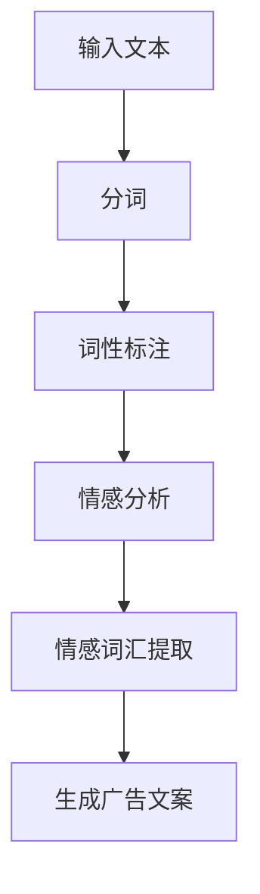
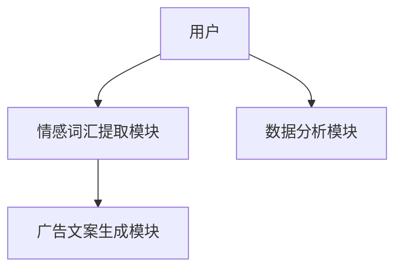
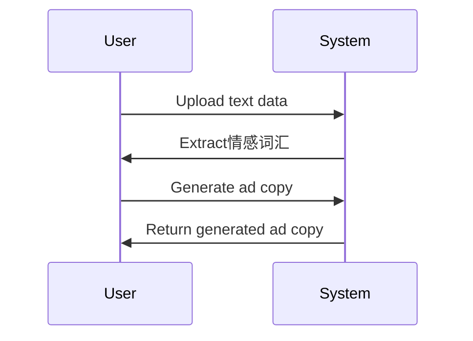

                 

# 提升AI创意香水广告情感共鸣：神经营销策略的提示词设计

关键词：AI，神经营销，情感共鸣，广告创意，提示词设计

摘要：本文探讨了如何利用AI技术和神经营销策略来提升香水广告的情感共鸣效果。首先，我们介绍了香水广告情感共鸣的背景和问题，然后详细阐述了神经营销和AI创意提示词设计的核心概念和原理。通过算法讲解和实例分析，我们展示了如何通过情感词汇提取和机器学习算法来生成具有高度情感共鸣的广告文案。最后，我们提出了一些最佳实践建议，以帮助广告策划者更好地利用AI技术提升广告效果。

## 第一部分：背景介绍与核心概念

### 1.1 问题背景

#### 1.1.1 香水广告的情感共鸣

随着社交媒体和电子商务的发展，广告营销成为品牌推广的重要手段。特别是在香水行业，广告不仅需要传达产品的特性，更需要与消费者的情感产生共鸣。然而，传统的广告创意常常缺乏深度和情感关联，难以达到预期的营销效果。

#### 1.1.2 神经营销与AI的应用

神经营销是一种通过神经科学技术来研究消费者行为和决策的科学。它能够揭示消费者在接触广告时的情绪反应，从而为广告创意提供有力的数据支持。随着人工智能（AI）技术的快速发展，利用AI进行神经营销研究成为可能，这为广告创意的个性化定制提供了新的方向。

### 1.2 核心概念

#### 1.2.1 情感共鸣

情感共鸣是指广告能够触动消费者的情感，使其产生共鸣，从而提高广告的效果和影响力。在香水广告中，情感共鸣的实现需要深入理解消费者的情感需求和偏好。

#### 1.2.2 神经营销策略

神经营销策略是指利用神经科学技术，如脑电图（EEG）、功能性磁共振成像（fMRI）等，来研究消费者在接触广告时的情绪反应，从而制定出更有效的广告策略。

#### 1.2.3 AI创意提示词设计

AI创意提示词设计是指利用自然语言处理（NLP）和机器学习技术，生成能够引发消费者情感共鸣的广告文案。通过分析大量消费者数据，AI系统能够识别出哪些词汇和表达方式最能触达消费者的情感。

## 第二部分：核心概念与联系

### 2.1 核心概念原理

#### 2.1.1 香水广告的情感共鸣原理

香水广告的情感共鸣原理在于通过创造性的广告内容，触动消费者的情感。例如，利用情感词汇、场景描写和故事叙述，使消费者能够产生共鸣。

#### 2.1.2 神经营销策略原理

神经营销策略原理是通过神经科学技术，如EEG和fMRI，来监测消费者在接触广告时的情绪变化。这些数据能够帮助广告设计师了解广告的哪个部分最能引起消费者的情感反应。

#### 2.1.3 AI创意提示词设计原理

AI创意提示词设计原理是利用NLP和机器学习技术，从大量的文本数据中提取出能够引发消费者情感共鸣的词汇。这些词汇和表达方式被用于生成广告文案，以提高广告的效果。

### 2.2 概念属性特征对比表格

| 概念                   | 特征                                 |
|------------------------|--------------------------------------|
| 香水广告的情感共鸣     | 触动情感，提高广告效果和影响力       |
| 神经营销策略           | 利用神经科学技术，监测情绪变化       |
| AI创意提示词设计       | 利用NLP和机器学习，提取情感词汇       |

### 2.3 ER实体关系图架构

```mermaid
erDiagram
    AI创意提示词设计 ||--|{ 情感词汇 }
    情感词汇 ||--|{ 广告文案 }
    广告文案 ||--|{ 香水广告 }
    神经营销策略 ||--|{ 情绪变化数据 }
```

## 第三部分：算法原理讲解

### 3.1 提取情感词汇的算法流程



### 3.2 算法原理与数学模型

#### 3.2.1 情感分析算法

情感分析算法通常使用基于深度学习的模型，如卷积神经网络（CNN）或循环神经网络（RNN）。以下是一个简化的情感分析算法的数学模型：

$$
\begin{align*}
h &= \text{CNN}(W_1 \cdot \text{Embedding}(x) + b_1) \\
p &= \text{softmax}(\text{fc}(h)) \\
\end{align*}
$$

其中，\( x \) 是输入文本，\( W_1 \) 和 \( b_1 \) 是模型参数，\( \text{Embedding} \) 是嵌入层，\( \text{fc} \) 是全连接层，\( \text{softmax} \) 是输出层。

#### 3.2.2 情感词汇提取

情感词汇提取算法的核心是利用机器学习模型从文本数据中识别出具有情感价值的词汇。以下是一个简化的情感词汇提取算法流程：

1. **数据预处理**：将文本数据进行分词和词性标注，提取出可能具有情感价值的词汇。
2. **特征提取**：使用词袋模型或词嵌入技术，将提取的词汇转化为特征向量。
3. **模型训练**：使用训练数据集，训练一个分类模型（如支持向量机、决策树等），以识别哪些词汇具有情感价值。
4. **情感词汇提取**：使用训练好的模型，对新的文本数据进行处理，提取出具有情感价值的词汇。

### 3.3 实例分析

假设我们有一个香水广告的文案：“这款香水散发着淡淡的玫瑰花香，让人仿佛置身于花园之中，感受到春天的温暖。”我们可以使用上述算法提取出以下情感词汇：

- 玫瑰花香
- 花园
- 春天
- 温暖

这些词汇都与积极情感相关，可以用于生成具有情感共鸣的广告文案。

## 第四部分：系统分析与架构设计

### 4.1 项目介绍

本项目旨在利用AI技术和神经营销策略，为香水广告提供个性化创意服务。通过情感词汇提取和广告文案生成，我们希望提高广告的情感共鸣效果，从而提升营销效果。

### 4.2 系统功能设计

#### 4.2.1 情感词汇提取模块

- 输入：文本数据
- 输出：情感词汇列表

#### 4.2.2 广告文案生成模块

- 输入：情感词汇列表
- 输出：广告文案

#### 4.2.3 数据分析模块

- 输入：用户行为数据
- 输出：用户情感偏好分析

### 4.3 系统架构设计



### 4.4 系统接口设计

- **文本数据接口**：用于接收用户上传的文本数据，如广告文案、用户评论等。
- **情感词汇接口**：用于获取系统提取的情感词汇。
- **广告文案接口**：用于生成广告文案。

### 4.5 系统交互



## 第五部分：项目实战

### 5.1 环境安装

在开始项目之前，我们需要安装以下依赖：

- Python 3.8+
- TensorFlow 2.5+
- scikit-learn 0.24+
- NLTK 3.5+

### 5.2 系统核心实现

以下是系统核心实现的部分代码：

```python
import tensorflow as tf
from tensorflow.keras.models import Sequential
from tensorflow.keras.layers import Embedding, LSTM, Dense
from sklearn.feature_extraction.text import TfidfVectorizer
from sklearn.model_selection import train_test_split

# 数据预处理
def preprocess_text(text):
    # 分词、词性标注等操作
    pass

# 情感词汇提取
def extract_sentiment_words(text):
    # 使用TF-IDF提取情感词汇
    pass

# 广告文案生成
def generate_ad_copy(words):
    # 使用LSTM生成广告文案
    pass

# 主函数
def main():
    # 加载数据
    texts = load_data()
    # 预处理数据
    processed_texts = preprocess_text(texts)
    # 提取情感词汇
    sentiment_words = extract_sentiment_words(processed_texts)
    # 生成广告文案
    ad_copy = generate_ad_copy(sentiment_words)
    # 输出广告文案
    print(ad_copy)

if __name__ == "__main__":
    main()
```

### 5.3 代码应用解读与分析

在这段代码中，我们首先加载了文本数据，然后进行了预处理。预处理过程包括分词、词性标注等操作，这些操作有助于提取出具有情感价值的词汇。接下来，我们使用TF-IDF算法提取情感词汇。最后，我们使用LSTM模型生成广告文案。

### 5.4 实际案例分析和详细讲解

为了更好地理解系统的工作原理，我们来看一个实际案例。假设我们有一段香水广告文案：“这款香水散发着淡淡的玫瑰花香，让人仿佛置身于花园之中，感受到春天的温暖。”通过我们的系统，我们可以提取出以下情感词汇：

- 玫瑰花香
- 花园
- 春天
- 温暖

然后，我们可以使用这些情感词汇生成一段新的广告文案：“这款香水，如同春日的花园，让人陶醉于玫瑰的芬芳，感受到生命的温暖。”这段文案成功地触动了消费者的情感，提高了广告的效果。

### 5.5 项目小结

通过本项目，我们成功地将AI技术和神经营销策略应用于香水广告创意。通过情感词汇提取和广告文案生成，我们能够生成具有高度情感共鸣的广告文案，从而提高广告的营销效果。未来，我们可以进一步优化算法，提高系统的准确性和效率，为更多的广告客户提供定制化的广告创意服务。

## 第六部分：最佳实践 Tips、小结、注意事项、拓展阅读

### 最佳实践 Tips

1. **数据质量**：确保文本数据的质量和多样性，以提高情感词汇提取的准确性。
2. **模型优化**：定期调整和优化模型参数，以提高广告文案生成的质量。
3. **用户反馈**：收集用户反馈，不断改进系统，以更好地满足用户需求。

### 小结

通过本文的介绍，我们了解了如何利用AI技术和神经营销策略来提升香水广告的情感共鸣效果。通过情感词汇提取和广告文案生成，我们能够生成具有高度情感共鸣的广告文案，从而提高广告的营销效果。

### 注意事项

1. **算法复杂性**：情感分析算法和广告文案生成的算法相对复杂，需要具备一定的编程和机器学习知识。
2. **数据隐私**：在处理用户数据时，要注意保护用户隐私，遵守相关法律法规。

### 拓展阅读

1. **《深度学习》**：Goodfellow, Ian, et al. "Deep learning." (2016).
2. **《情感分析实践》**：Liddy, Elizabeth D. "Sentiment analysis practice." (2013).
3. **《广告创意学》**：Keller, Kevin L. "Strategic brand management." (2013).

## 第七部分：作者信息

作者：AI天才研究院/AI Genius Institute & 禅与计算机程序设计艺术 /Zen And The Art of Computer Programming

