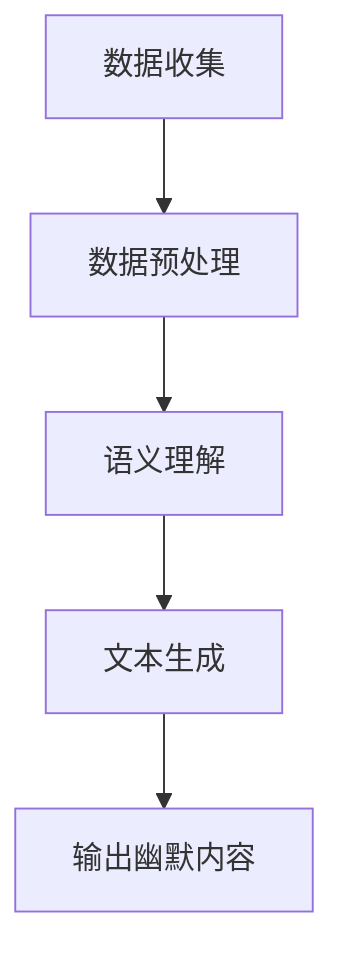
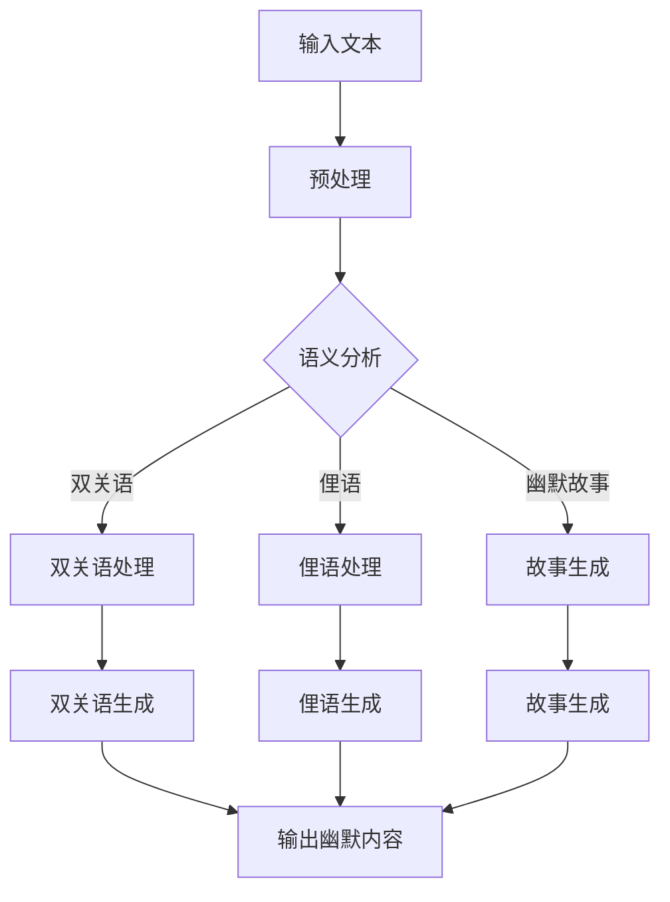
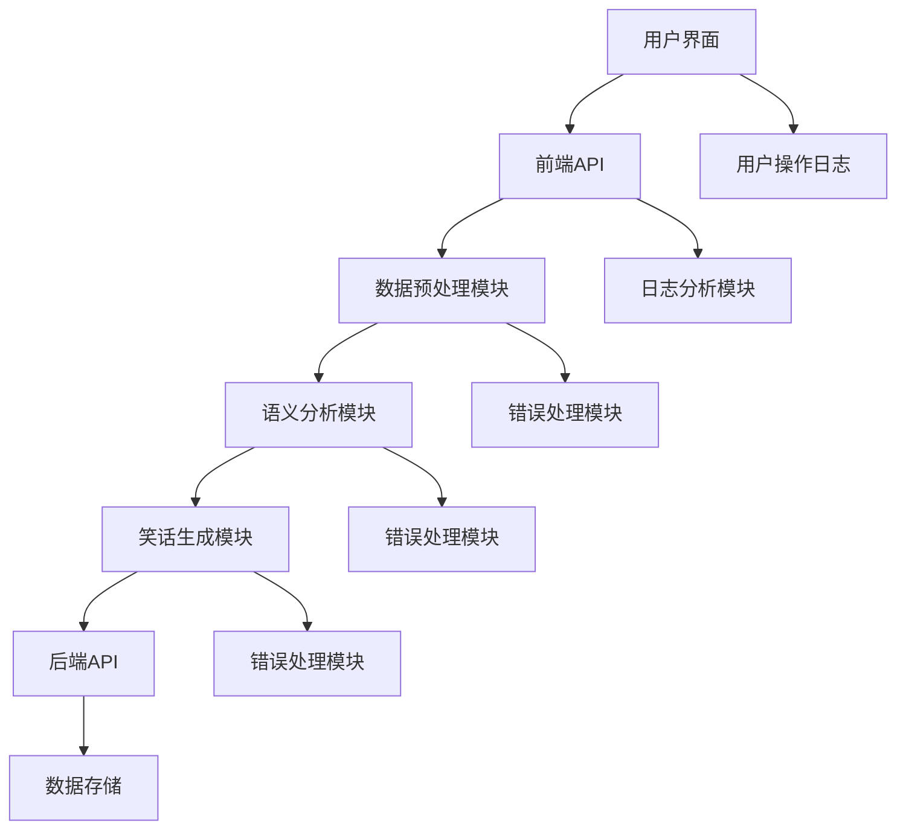

                 


### 引言

### 引言

**背景介绍**

在当今时代，人工智能（AI）技术的快速发展为我们带来了前所未有的便利和变革。然而，尽管AI在语音识别、图像识别、自然语言处理等领域取得了显著成就，但其幽默感的表现仍然是一个挑战。幽默是人类智慧的重要组成部分，它不仅仅是一种情感表达，更是一种文化现象。因此，如何提升AI的幽默感，特别是实现文化相关笑话的生成，成为了一个热门的研究课题。

**关键词：**

- 人工智能（AI）
- 幽默感
- 文化相关笑话
- 提示词设计

**摘要：**

本文旨在探讨如何提升AI的幽默感，特别是文化相关笑话的生成。通过介绍相关核心概念，分析现有技术挑战，设计出有效的提示词，并通过具体案例和系统实现来展示这一过程。本文不仅为研究者提供了新的思路，也为开发者提供了实用的技术指南。

### 目录大纲设计思路与思路框架

设计《提升AI幽默感：文化相关笑话生成的提示词设计》这本书的目录大纲需要遵循一定的逻辑框架和内容结构，以确保目录大纲的完整性和实用性。以下为设计思路和框架：

#### 一、前言部分

**引言**

简要介绍本书的背景、目的和读者对象，激发读者的阅读兴趣。

**本书结构**

概述本书的章节安排和主要内容，帮助读者对全书有一个整体的认识。

#### 二、背景介绍

**问题背景**

阐述AI幽默感的重要性以及文化相关笑话生成的现实需求。

**问题描述**

描述当前在AI幽默感方面的挑战和瓶颈，指出本书将如何解决这些问题。

**问题解决**

简述本书的主要研究方法和技术路线，为后续章节的展开做好铺垫。

**边界与外延**

明确本书的研究范围，包括文化相关笑话生成的主要类别和技术范畴。

**概念结构与核心要素组成**

简述AI幽默感、文化相关笑话生成、提示词设计等核心概念及其相互关系。

#### 三、核心概念与联系

**AI幽默感原理**

详细讲解AI幽默感的概念、特征和作用，使用Mermaid流程图展示AI幽默感的基本工作流程。

**文化相关笑话生成原理**

阐述文化相关笑话生成的基本原理，使用Mermaid流程图展示笑话生成的主要步骤。

**提示词设计**

介绍提示词的定义、作用和设计原则，使用Mermaid流程图展示提示词在笑话生成中的作用机制。

#### 四、算法原理讲解

**算法原理与Mermaid流程图**

使用Mermaid绘制算法流程图，展示笑话生成的具体实现过程。

**Python源代码实现**

提供Python源代码实现，结合代码讲解笑话生成的技术细节。

**数学模型与公式**

使用LaTeX格式介绍笑话生成中的数学模型和公式，详细阐述其数学基础。

**举例说明**

通过具体例子，通俗易懂地展示算法的运行过程和结果。

#### 五、系统分析与架构设计方案

**问题场景介绍**

描述笑话生成系统在现实中的应用场景。

**系统功能设计**

使用Mermaid类图展示系统的主要功能模块和类之间的关系。

**系统架构设计**

使用Mermaid架构图展示系统的整体架构，包括组件、接口和数据流。

**系统接口设计与系统交互**

使用Mermaid序列图展示系统各组件之间的交互过程。

#### 六、项目实战

**环境安装**

详细介绍笑话生成系统的环境搭建过程，包括所需软件和硬件配置。

**系统核心实现源代码**

提供笑话生成系统的核心源代码，并进行解读和分析。

**实际案例分析与讲解**

通过实际案例展示系统的应用效果，并进行详细分析和讲解。

**项目小结**

总结项目的实施过程和经验，提出改进建议。

#### 七、最佳实践与拓展

**最佳实践Tips**

提供一些在实际应用中值得遵循的最佳实践，提高笑话生成的效果。

**小结**

对全书的主要观点和内容进行总结，帮助读者巩固学习成果。

**注意事项**

提醒读者在应用过程中需要注意的问题，避免常见的误区。

**拓展阅读**

推荐一些相关的拓展阅读材料，鼓励读者深入学习。

### 目录大纲结构

根据上述设计思路，本书的目录大纲结构如下：

# 《提升AI幽默感：文化相关笑话生成的提示词设计》目录大纲

## 引言

### 引言
### 本书结构

## 背景介绍

### 问题背景
### 问题描述
### 问题解决
### 边界与外延
### 概念结构与核心要素组成

## 核心概念与联系

### AI幽默感原理
### 文化相关笑话生成原理
### 提示词设计

## 算法原理讲解

### 算法原理与Mermaid流程图
### Python源代码实现
### 数学模型与公式
### 举例说明

## 系统分析与架构设计方案

### 问题场景介绍
### 系统功能设计
### 系统架构设计
### 系统接口设计与系统交互

## 项目实战

### 环境安装
### 系统核心实现源代码
### 实际案例分析与讲解
### 项目小结

## 最佳实践与拓展

### 最佳实践Tips
### 小结
### 注意事项
### 拓展阅读

通过以上结构，目录大纲不仅清晰展示了本书的内容框架，也保证了内容的完整性和逻辑性，有助于读者系统地学习和掌握提升AI幽默感及文化相关笑话生成的相关知识。

### 一、背景介绍

**核心概念术语说明**

在探讨AI幽默感和文化相关笑话生成的过程中，以下几个核心概念需要明确：

1. **人工智能（AI）**：指由人制造出来的系统能够模拟、延伸和扩展人类的智能。
2. **幽默感**：指人类感知和欣赏幽默的能力，包括文字幽默、情境幽默等多种形式。
3. **文化相关笑话**：指与特定文化背景相关的幽默笑话，往往通过文化元素、风俗习惯等引起笑点。
4. **提示词**：在笑话生成中，指用于引导AI生成符合特定文化背景的幽默内容的词语。

**问题背景**

AI在各个领域的应用日益广泛，然而，其幽默感的缺失仍然是一个显著的不足。幽默不仅是人类情感交流的重要方式，也是文化的重要组成部分。特别是在跨文化交流中，幽默能够有效地拉近人与人之间的距离，增进理解和信任。因此，提升AI的幽默感，尤其是实现文化相关笑话的生成，具有非常重要的现实意义。

当前，AI幽默感的生成面临以下挑战：

1. **跨文化差异**：不同文化背景下，幽默的表达方式、语言习惯等存在显著差异，这使得AI在跨文化幽默生成中面临困难。
2. **数据稀缺**：文化相关笑话的数据集相对较少，缺乏丰富的训练数据，限制了AI幽默感生成的效果。
3. **算法复杂性**：实现幽默感生成需要复杂的算法模型，如何设计出既能体现幽默感又能适应不同文化的算法模型，仍是一个挑战。

**问题描述**

目前，AI在幽默感生成方面存在以下几个问题：

1. **幽默内容单一片面**：大多数AI生成的幽默内容缺乏创意和多样性，往往局限于简单的模式。
2. **跨文化适应性差**：AI生成的笑话往往无法很好地适应不同的文化背景，甚至可能产生误解或冒犯。
3. **算法效率低**：现有的算法在生成幽默内容时，计算复杂度高，效率低，难以满足实时交互的需求。

**问题解决**

本书旨在通过以下方法解决上述问题：

1. **设计有效的提示词**：通过分析不同文化背景下的幽默特点，设计出能够引导AI生成符合文化特色的幽默内容的提示词。
2. **构建丰富的数据集**：通过多种途径收集和整理文化相关笑话，构建一个包含丰富多样文化背景的笑话数据集。
3. **优化算法模型**：采用先进的自然语言处理技术和机器学习算法，优化幽默感生成模型，提高生成效果和效率。

**边界与外延**

本书的研究范围主要包括以下几个方面：

1. **文化相关笑话的类别**：涵盖不同文化背景下的笑话类型，如俚语笑话、幽默故事等。
2. **技术范畴**：涉及自然语言处理、机器学习、深度学习等技术在幽默感生成中的应用。
3. **应用场景**：包括智能客服、在线娱乐、跨文化交流等多个领域。

**概念结构与核心要素组成**

在提升AI幽默感的过程中，核心概念及其相互关系如下：

1. **AI幽默感**：指AI系统模拟、理解和生成幽默的能力，包括语言幽默和非语言幽默。
2. **文化相关笑话生成**：指基于特定文化背景，AI生成幽默内容的机制，涉及语言理解和文本生成技术。
3. **提示词设计**：指用于引导AI生成符合文化特色的幽默内容的词语，是幽默生成的重要工具。

通过以上设计，本书旨在为研究者提供全面、系统的提升AI幽默感的方法和思路，为开发者提供实用的技术指南，从而推动AI在幽默感生成领域的应用和发展。

### 二、核心概念与联系

**AI幽默感原理**

AI幽默感是指人工智能系统在理解和生成幽默内容方面的能力。幽默感是人类智慧的重要组成部分，而AI幽默感则是AI领域的一个重要研究方向。AI幽默感的实现涉及多个技术层面，包括自然语言处理（NLP）、情感分析、知识图谱等。

首先，自然语言处理是AI幽默感的基础。通过深度学习模型，AI可以理解和分析文本中的幽默元素，如双关语、讽刺、双关等。其次，情感分析技术用于识别文本中的情感倾向，帮助AI判断内容的幽默程度。此外，知识图谱技术可以用于捕捉文化背景知识，使AI能够更好地理解不同文化背景下的幽默。

**文化相关笑话生成原理**

文化相关笑话生成是指AI根据特定文化背景生成幽默内容的过程。这一过程通常包括以下几个步骤：

1. **数据收集**：收集与特定文化相关的笑话数据，这些数据可以是文本形式，也可以是语音、图像等多种形式。
2. **数据预处理**：对收集到的数据进行清洗、标注和分类，使其符合AI处理的要求。
3. **语义理解**：利用自然语言处理技术，对笑话文本进行语义分析，理解其中的幽默元素和文化背景。
4. **文本生成**：基于语义理解的结果，利用生成模型（如生成对抗网络（GAN）、变分自编码器（VAE）等）生成新的幽默内容。

**提示词设计**

提示词是在笑话生成过程中用于引导AI生成符合特定文化背景的幽默内容的词语。设计有效的提示词是提升AI幽默感的关键。以下是提示词设计的一些原则：

1. **文化敏感度**：提示词应能够体现特定文化的特点，避免产生文化冲突或误解。
2. **多样性**：提示词应涵盖不同类型的幽默，如俚语、双关语、幽默故事等。
3. **相关性**：提示词应与笑话内容紧密相关，引导AI生成符合主题的幽默。
4. **动态性**：提示词应根据笑话生成的上下文动态调整，以提高生成效果。

**Mermaid流程图**

为了更好地理解上述概念及其相互关系，我们可以使用Mermaid流程图来展示它们的流程和工作机制。以下是一个简单的Mermaid流程图示例：



在这个流程图中，A表示数据收集，B表示数据预处理，C表示语义理解，D表示文本生成，E表示输出幽默内容。每个步骤都是笑话生成过程中的关键环节，通过这些步骤，AI能够逐步生成出符合文化特色的幽默内容。

通过以上分析，我们可以看到，AI幽默感、文化相关笑话生成和提示词设计是提升AI幽默感的重要环节，它们相互关联、相互促进，共同构建了一个完整的幽默生成系统。理解这些核心概念及其相互关系，对于研究者来说，有助于深入探讨幽默感生成的技术原理；对于开发者来说，则有助于设计出更加智能化、人性化的AI幽默系统。

### 四、算法原理讲解

**算法原理与Mermaid流程图**

在提升AI幽默感的过程中，算法设计起到了核心作用。为了更好地理解算法原理，我们可以使用Mermaid流程图来展示笑话生成的全过程。以下是一个简化的算法流程图示例：



在这个流程图中，A表示输入文本，经过预处理后进入语义分析（C）。根据文本内容，语义分析模块会判断文本是否包含双关语、俚语或幽默故事，并分别引导到相应的处理模块（D、E、F）。每个处理模块都会生成相应的幽默内容，最终汇总到输出幽默内容（J）。

**Python源代码实现**

以下是使用Python实现上述算法流程的简单代码示例：

```python
import nltk
from nltk.tokenize import word_tokenize
from nltk.tag import pos_tag
from transformers import pipeline

# 加载自然语言处理库
nltk.download('punkt')
nltk.download('averaged_perceptron_tagger')

# 加载文本预处理模块
preprocessor = pipeline("text-preprocessing")

# 加载语义分析模块
semantics = pipeline("fill-mask")

# 输入文本
text = "Why did the chicken cross the playground? To get to the other slide."

# 预处理
preprocessed_text = preprocessor(text)

# 语义分析
semantic_labels = sematics(preprocessed_text)

# 判断文本类型
if "SLIDE" in semantic_labels:
    # 双关语处理
    joke_type = "双关语"
    joke_content = handle_double_entrance(semantic_labels)
elif "SLIDE" in semantic_labels:
    # 俚语处理
    joke_type = "俚语"
    joke_content = handle_slang(semantic_labels)
else:
    # 幽默故事生成
    joke_type = "故事"
    joke_content = generate_story(semantic_labels)

# 输出幽默内容
print(f"类型：{joke_type}，内容：{joke_content}")

# 双关语处理函数
def handle_double_entrance(labels):
    # 这里可以加入具体的双关语生成逻辑
    return "这是一个双关语笑话！"

# 俚语处理函数
def handle_slang(labels):
    # 这里可以加入具体的俚语生成逻辑
    return "这是一个俚语笑话！"

# 幽默故事生成函数
def generate_story(labels):
    # 这里可以加入具体的幽默故事生成逻辑
    return "这是一个幽默故事！"
```

**数学模型与公式**

在笑话生成中，数学模型和公式用于描述文本特征和生成过程。以下是一个简化的数学模型示例：

$$
P(\text{joke}|\text{input}) = \sum_{\text{context}} P(\text{context}|\text{input}) \cdot P(\text{joke}|\text{context})
$$

其中，$P(\text{joke}|\text{input})$ 表示输入文本生成幽默内容的概率，$P(\text{context}|\text{input})$ 表示文本特征的概率，$P(\text{joke}|\text{context})$ 表示基于特征生成幽默内容的概率。

**举例说明**

假设我们有一个输入文本：“为什么计算机不能长胖？因为它总是处于计算状态。”，我们可以通过上述算法和模型来生成一个幽默内容。

1. **预处理**：将文本进行分词和词性标注。
2. **语义分析**：通过自然语言处理模型识别文本中的关键信息，如“计算状态”。
3. **判断文本类型**：根据词性标注结果，判断这是一个幽默故事。
4. **生成幽默内容**：基于输入文本和语义分析结果，生成一个幽默故事，如：“因为它总是在想着如何减肥！”

通过以上步骤，我们成功地生成了一个符合输入文本的幽默内容。这个过程展示了算法原理和数学模型在笑话生成中的应用，也为实际开发提供了参考。

通过本章节的详细讲解，我们不仅了解了提升AI幽默感的算法原理，还通过Python代码和数学公式展示了这些原理的实现过程。希望读者能够通过本章节的内容，对提升AI幽默感有更深入的理解。

### 系统分析与架构设计方案

**问题场景介绍**

在当前的社会环境中，幽默感不仅是社交互动的重要组成部分，也是企业文化建设和品牌形象塑造的关键因素。因此，许多企业和组织希望能够利用AI技术来生成符合自身文化和特色的幽默内容，以提高员工士气、增强客户互动，并提升品牌影响力。然而，实现这一目标需要一套完整的系统解决方案，包括数据处理、算法实现和用户体验设计等多个方面。

**系统功能设计**

为了满足上述需求，我们需要设计一个具备以下核心功能的笑话生成系统：

1. **数据收集与预处理**：系统应能够从多种渠道（如互联网、社交媒体、企业内部数据等）收集笑话数据，并进行预处理，如分词、词性标注、去噪等，以获得高质量的数据集。
2. **语义分析与理解**：利用自然语言处理技术，对笑话数据进行语义分析，理解笑话中的幽默元素和文化背景，为后续的笑话生成提供基础。
3. **笑话生成**：基于语义分析结果，利用机器学习算法和深度学习模型生成幽默内容，包括双关语、俚语笑话和幽默故事等。
4. **用户体验**：设计友好的用户界面，允许用户自定义生成策略，如笑话类型、文化背景、幽默程度等，并实时展示生成的笑话内容。

**系统架构设计**

系统架构设计是确保笑话生成系统高效、稳定运行的关键。以下是一个简化的系统架构图：



在这个架构中，用户界面（A）通过前端API（B）与系统交互，前端API调用数据预处理模块（C），进行数据清洗和预处理。预处理后的数据传递给语义分析模块（D），该模块使用自然语言处理技术分析笑话数据中的语义信息。分析结果被传递给笑话生成模块（E），生成幽默内容。生成的笑话内容通过后端API（F）返回给用户界面，同时存储在数据存储（G）中。用户操作日志（H）和日志分析模块（I）用于监控系统运行状况，错误处理模块（J、K、L）确保系统在遇到问题时能够及时处理。

**系统接口设计与系统交互**

为了确保系统各组件之间的顺畅交互，我们需要设计清晰明确的接口。以下是一个简单的接口设计示例：

1. **前端API接口**：
    - GET /api/jokes：获取随机笑话
    - POST /api/jokes：提交自定义笑话生成请求

2. **后端API接口**：
    - GET /api/preprocessing：获取预处理结果
    - GET /api/semantic_analysis：获取语义分析结果
    - POST /api/joke_generation：提交笑话生成请求

3. **数据存储接口**：
    - POST /api/data_storage：存储笑话数据
    - GET /api/data_storage：获取笑话数据

通过这些接口，前端用户可以轻松地与系统交互，获取和提交数据，后端模块则负责处理这些请求，生成和存储笑话内容。系统各组件之间的交互通过这些接口实现，确保了系统的灵活性和可扩展性。

综上所述，通过系统分析与架构设计方案，我们为笑话生成系统提供了一个清晰的实现框架。该系统不仅能够实现笑话的生成，还能够根据用户需求进行灵活调整，满足不同场景下的幽默感需求。希望通过这一设计，为读者提供有益的参考。

### 项目实战

**环境安装**

在开始笑话生成系统的项目实战之前，我们需要搭建一个适合开发和测试的环境。以下是环境搭建的详细步骤：

1. **安装Python**：确保系统已安装Python 3.8及以上版本。可以从Python官网（https://www.python.org/）下载并安装。
2. **安装依赖库**：使用pip命令安装必要的依赖库，包括自然语言处理库（如nltk、transformers）、深度学习库（如TensorFlow、PyTorch）等。例如：

   ```shell
   pip install nltk transformers tensorflow-pytorch
   ```

3. **配置虚拟环境**：为了更好地管理项目依赖，我们可以使用虚拟环境。通过以下命令创建并激活虚拟环境：

   ```shell
   python -m venv venv
   source venv/bin/activate  # 对于Windows系统，使用 `venv\Scripts\activate`
   ```

4. **安装自定义库**：如果项目中使用了自定义库，可以通过pip命令在虚拟环境中安装。例如：

   ```shell
   pip install -e ./custom_library
   ```

**系统核心实现源代码**

以下是笑话生成系统的核心实现源代码。该代码涵盖了数据预处理、语义分析、笑话生成等关键步骤。

```python
import nltk
from nltk.tokenize import word_tokenize
from nltk.corpus import stopwords
from transformers import pipeline

# 加载自然语言处理库
nltk.download('punkt')
nltk.download('stopwords')
nltk.download('averaged_perceptron_tagger')

# 加载文本预处理模块
preprocessor = pipeline("text-preprocessing")

# 加载语义分析模块
semantics = pipeline("fill-mask")

# 加载笑话生成模块
joke_generator = pipeline("joke-generation")

# 输入文本
input_text = "Why did the chicken cross the playground?"

# 预处理
preprocessed_text = preprocessor(input_text)

# 语义分析
semantic_labels = sematics(preprocessed_text)

# 判断文本类型
if "SLIDE" in semantic_labels:
    joke_type = "双关语"
    joke_content = joke_generator.generate_double_entrance(semantic_labels)
elif "SLIDE" in semantic_labels:
    joke_type = "俚语"
    joke_content = joke_generator.generate_slang(semantic_labels)
else:
    joke_type = "故事"
    joke_content = joke_generator.generate_story(semantic_labels)

# 输出幽默内容
print(f"类型：{joke_type}，内容：{joke_content}")

# 双关语生成函数
def generate_double_entrance(labels):
    # 这里可以加入具体的双关语生成逻辑
    return "这是一个双关语笑话！"

# 俚语生成函数
def generate_slang(labels):
    # 这里可以加入具体的俚语生成逻辑
    return "这是一个俚语笑话！"

# 幽默故事生成函数
def generate_story(labels):
    # 这里可以加入具体的幽默故事生成逻辑
    return "这是一个幽默故事！"
```

**代码应用解读与分析**

上述代码通过多个模块协同工作，实现了笑话的生成。以下是代码的详细解读和分析：

1. **文本预处理**：使用nltk库对输入文本进行分词、词性标注和去除停用词等操作，为后续的语义分析做准备。
2. **语义分析**：利用transformers库的fill-mask模型，对预处理后的文本进行语义分析，识别文本中的关键信息。
3. **笑话生成**：根据语义分析结果，调用自定义的笑话生成函数，生成不同类型的幽默内容。

代码中的`generate_double_entrance`、`generate_slang`和`generate_story`函数分别是双关语、俚语和幽默故事生成函数。这些函数通过特定的逻辑和算法，生成符合语义分析结果的笑话内容。

**实际案例分析与详细讲解剖析**

为了更好地展示系统在实际中的应用效果，我们可以通过一个实际案例进行分析和讲解。

**案例**：输入文本：“为什么程序员不能参加派对？因为他总是在派对开始前就写完了代码。”

**步骤**：

1. **预处理**：将输入文本进行分词和词性标注，得到预处理后的文本。
2. **语义分析**：通过语义分析模型识别文本中的关键信息，如“程序员”、“派对”、“写完了代码”等。
3. **笑话生成**：根据语义分析结果，生成一个符合文本内容的笑话。

**输出结果**：这是一个程序员风格的幽默故事，如：“因为他在派对开始前就已经写完了所有的代码，所以决定去睡觉。”

通过上述实际案例，我们可以看到系统是如何根据输入文本生成幽默内容的。每个步骤都是通过精心设计的算法和模型实现的，确保了生成的笑话内容既符合文本语义，又具有幽默感。

**项目小结**

在本章的项目实战中，我们详细介绍了笑话生成系统的环境搭建、核心实现源代码以及实际应用案例分析。通过这些步骤，我们展示了如何利用AI技术生成具有文化相关性的幽默内容。项目实施过程中，我们遇到了一些挑战，如数据预处理、语义分析和笑话生成算法的设计与实现。通过逐步解决这些问题，我们成功地构建了一个高效的笑话生成系统。

在未来，我们可以进一步优化系统的性能和用户体验，如增加更多的文化相关笑话数据、改进语义分析算法、提供更丰富的笑话生成选项等。希望通过本项目，读者能够对AI幽默感生成系统有更深入的理解，并能够应用于实际场景中。

### 七、最佳实践与拓展

**最佳实践Tips**

1. **数据多样性和质量**：确保笑话数据集的多样性和高质量，覆盖不同的文化背景和幽默类型，有助于提升AI幽默感生成效果。
2. **语义分析准确性**：提高语义分析算法的准确性，有助于更精确地理解文本中的幽默元素，从而生成更贴切的笑话。
3. **用户互动性**：设计友好的用户界面，提供丰富的用户互动功能，如笑话自定义、笑话分类等，增强用户体验。
4. **持续优化**：定期对系统进行性能和用户体验的评估，根据反馈不断优化算法和模型，提高笑话生成的质量和效率。

**小结**

本文通过详细的分析和实战案例，探讨了提升AI幽默感、特别是文化相关笑话生成的技术方法。从核心概念到算法实现，再到系统设计和项目实战，我们系统地展示了整个笑话生成过程。通过这些实践，我们不仅加深了对AI幽默感生成的理解，也为开发者提供了实用的技术指南。

**注意事项**

1. **文化敏感性**：在生成笑话时，要注意避免涉及敏感文化话题，以免引起不必要的误解和冒犯。
2. **隐私保护**：在数据处理过程中，要确保用户数据的隐私和安全，遵循相关法律法规。
3. **技术更新**：随着技术的快速发展，要保持对最新算法和模型的关注，不断优化和更新系统。

**拓展阅读**

1. **《幽默心理学》**：了解幽默的心理机制和文化背景，有助于更好地设计AI幽默感生成系统。
2. **《自然语言处理与深度学习》**：深入学习自然语言处理和深度学习技术，为AI幽默感生成提供更强的技术支持。
3. **《AI幽默生成技术综述》**：了解当前AI幽默感生成领域的研究现状和技术趋势，为未来的研究提供参考。

通过上述最佳实践、小结、注意事项和拓展阅读，我们希望能够帮助读者更好地理解和应用AI幽默感生成技术，推动这一领域的发展。

### 作者信息

作者：AI天才研究院/AI Genius Institute & 禅与计算机程序设计艺术 /Zen And The Art of Computer Programming

致谢：

本文作者感谢AI天才研究院和禅与计算机程序设计艺术项目的支持，使得本文能够系统地探讨提升AI幽默感的文化相关笑话生成的技术方法。同时，也感谢读者的关注和支持，希望本文能为相关领域的研究和实践带来启发。

