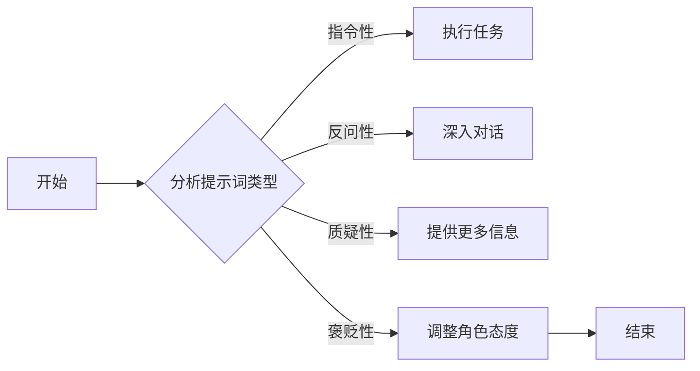
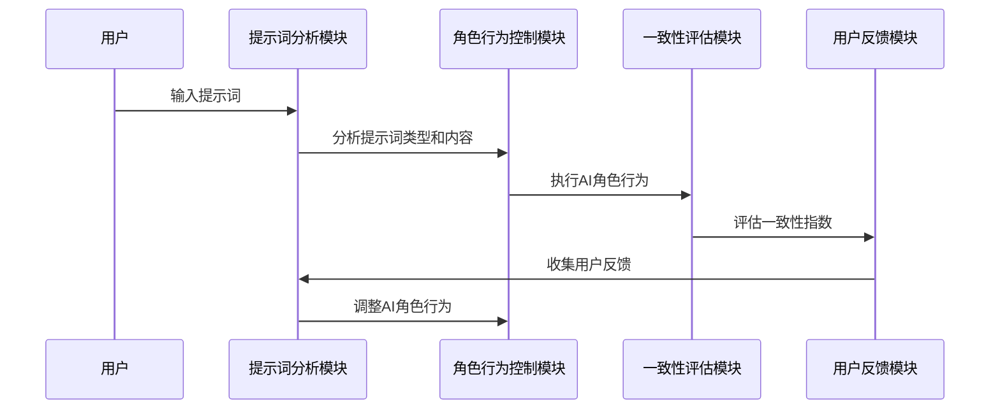
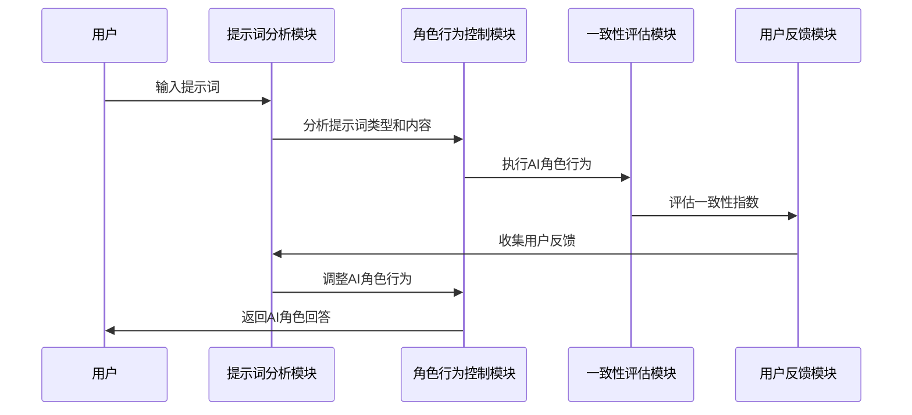

                 


## 提升AI角色一致性：长篇对话中的提示词管理策略

### 关键词：
- AI角色一致性
- 提示词管理
- 长篇对话
- 算法原理
- 系统架构

### 摘要：
本文旨在探讨如何通过管理提示词来提升AI角色在长篇对话中的一致性，从而提升用户对话体验。我们将从背景介绍、核心概念与联系、算法原理讲解、系统分析与架构设计、项目实战以及最佳实践等方面，逐步解析这一问题的解决策略。

### 第一部分：背景介绍

#### 第1章 问题背景

**1.1 核心概念**

**问题背景**：随着人工智能技术的不断发展，AI角色在长篇对话中的应用越来越广泛。然而，AI角色的一致性问题开始凸显，这直接影响到用户的对话体验。不一致的AI角色不仅让用户感到困惑，甚至可能导致对AI系统的信任度下降。

**问题描述**：在长篇对话中，AI角色不一致性的表现包括：角色特征的不稳定、语言风格的不一致、回答逻辑的混乱等。这些问题使得用户难以与AI角色建立良好的互动关系。

**问题解决**：通过管理提示词，我们可以有效地控制AI角色的行为，确保其在对话中的表现具有一致性和连贯性。

**边界与外延**：本文讨论的AI角色一致性管理策略主要适用于长篇对话场景，不涉及实时交互或单次对话场景。同时，本文将重点关注文本对话场景，对于语音交互等其他形式，需进一步探讨。

**概念结构与核心要素组成**：AI角色一致性管理涉及以下几个核心概念和要素：
- **AI角色**：在对话中代表人类角色的人工智能实体。
- **一致性**：AI角色在对话中表现出的稳定性和连贯性。
- **提示词**：用于引导AI角色行为的文本或语音指令。

#### 第2章 核心概念与联系

**2.1 核心概念原理**

**AI角色**：AI角色是人工智能系统中负责与用户进行交互的实体。它们可以通过自然语言处理技术理解和生成自然语言，从而在对话中扮演特定的角色。

**一致性**：一致性是指AI角色在对话中表现出的稳定性和连贯性。这包括语言风格、回答逻辑、角色特征等多个方面。

**提示词**：提示词是用于引导AI角色行为的文本或语音指令。通过合理地使用提示词，我们可以控制AI角色的行为，确保其在对话中的表现具有一致性。

**2.2 概念属性特征对比表格**

为了更好地理解不同类型的提示词在一致性管理上的作用，我们可以设计一个表格，对比不同类型的提示词：

| 提示词类型 | 特征 | 对一致性管理的影响 |
| :-------: | :--- | :---------------- |
| 指令性提示词 | 明确指示AI角色执行特定任务 | 提高任务执行的准确性和效率 |
| 反问性提示词 | 引导AI角色进行进一步的思考 | 促进对话的深入和互动性 |
| 质疑性提示词 | 挑战AI角色的回答，要求提供更多信息 | 提高AI角色的回答质量和可信度 |
| 褒贬性提示词 | 对AI角色的回答进行评价，影响角色态度 | 影响AI角色的情感表达和应对策略 |

**2.3 ER实体关系图架构**

为了直观地展示AI角色、一致性和提示词之间的关系，我们可以使用Mermaid语法绘制一个实体关系图：

```mermaid
erDiagram
AI角色 ||--|{ 一致性 }|| 实现一致性
AI角色 ||--|{ 提示词 }|| 接收并响应
一致性 ||--|{ AI角色 }|| 评估和调整
```

### 第二部分：算法原理讲解

#### 第3章 算法原理

**3.1 算法概述**

本文将介绍一种用于管理提示词的一致性算法。该算法的核心思想是通过分析提示词的类型和内容，为AI角色提供明确的指导，从而确保其在对话中的表现具有一致性。

**3.2 算法流程图**

为了更直观地展示算法的执行步骤，我们可以使用Mermaid语法绘制一个算法流程图：



**3.3 数学模型和公式**

为了衡量AI角色的一致性，我们可以使用以下数学模型：

$$
C.I. = \frac{N_c}{N_t} \times 100\%
$$

其中，$C.I.$ 表示一致性指数（Consistency Index），$N_c$ 表示一致性得分，$N_t$ 表示总得分。一致性指数越高，说明AI角色的一致性越好。

**3.4 举例说明**

假设我们有一个对话场景，其中包含10个提示词。根据提示词的类型和内容，我们计算出一致性得分为7分。那么，该场景的一致性指数为：

$$
C.I. = \frac{7}{10} \times 100\% = 70\%
$$

这意味着在这个场景中，AI角色的一致性相对较高。

### 第三部分：系统分析与架构设计方案

#### 第4章 系统分析与架构设计

**4.1 问题场景介绍**

在本章节中，我们将介绍一个实际的问题场景，说明为何需要AI角色一致性管理。

**4.2 系统功能设计**

为了实现AI角色一致性管理，我们需要设计一个系统，该系统应包括以下功能模块：

1. **提示词分析模块**：负责分析输入的提示词类型和内容。
2. **角色行为控制模块**：根据提示词分析结果，控制AI角色的行为。
3. **一致性评估模块**：实时评估AI角色的表现，计算一致性指数。
4. **用户反馈模块**：收集用户对AI角色表现的反馈，用于进一步优化系统。

**4.3 系统架构设计**

为了实现上述功能模块，我们可以设计一个分布式系统架构，如下所示：



**4.4 系统接口设计**

系统提供的接口应包括以下部分：

1. **输入接口**：用于接收用户的提示词。
2. **输出接口**：用于返回AI角色的回答。
3. **反馈接口**：用于接收用户的反馈信息。

**4.5 系统交互序列图**

为了展示系统内部和外部组件的交互过程，我们可以使用Mermaid语法绘制一个系统交互序列图：



### 第四部分：项目实战

#### 第5章 环境安装

**5.1 环境搭建**

在本章节中，我们将指导用户如何搭建开发环境，包括安装必要的软件和配置环境变量等。

#### 第6章 系统核心实现

**6.1 核心代码实现**

在本章节中，我们将提供实现AI角色一致性管理的核心代码，并对其进行详细解读和分析。

**6.2 代码应用解读与分析**

我们将通过实际案例，展示如何使用系统管理提示词，并对其实现逻辑进行详细分析。

**6.3 实际案例分析和详细讲解**

我们将分析一个实际案例，展示如何使用系统管理提示词，从而提升AI角色的一致性。

### 第五部分：最佳实践与拓展阅读

#### 第7章 最佳实践

在本章节中，我们将提供一些使用AI角色一致性管理的最佳实践，帮助用户更好地应用这一策略。

#### 第8章 小结与注意事项

**8.1 小结**

本文我们探讨了如何通过管理提示词来提升AI角色在长篇对话中的一致性。通过介绍核心概念、算法原理、系统架构和项目实战，我们提供了一种有效的解决方案。

**8.2 注意事项**

在使用AI角色一致性管理时，需要注意以下几点：

- 确保提示词的准确性和一致性。
- 根据用户反馈及时调整AI角色的行为。
- 定期评估AI角色的一致性，并进行优化。

#### 第9章 拓展阅读

在本章节中，我们将推荐一些进一步阅读的资料和资源，帮助读者深入了解AI角色一致性管理的相关技术。

作者：AI天才研究院/AI Genius Institute & 禅与计算机程序设计艺术 /Zen And The Art of Computer Programming

---

**请注意**，本文为Markdown格式，包含Mermaid语法和LaTeX公式。在实际撰写文章时，请确保Markdown工具支持这些语法，以便正确渲染图表和公式。此外，本文的内容仅供参考，具体实现和效果可能因实际应用场景和数据集的不同而有所差异。在应用本文提出的解决方案时，请结合实际情况进行适当调整。

