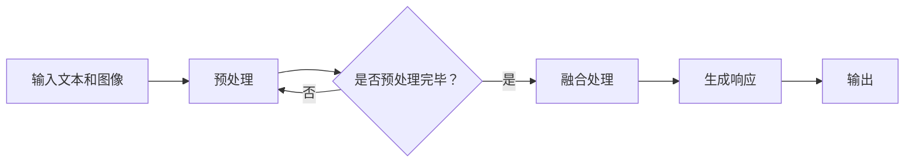
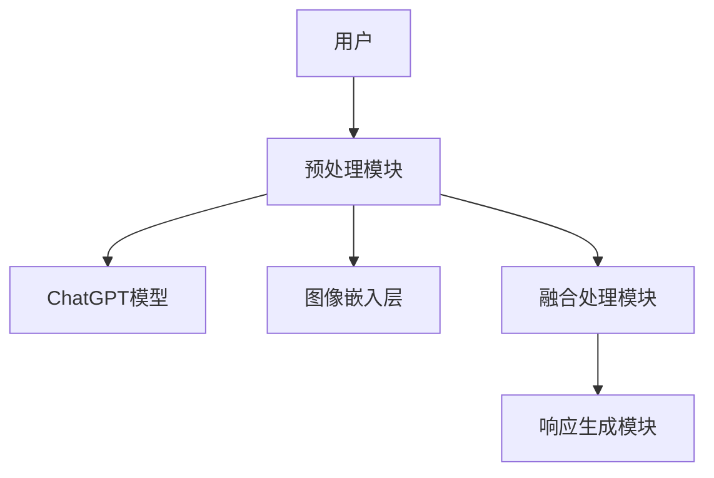

                 

# 提升ChatGPT的跨模态理解：图文互动提示词技巧

## 关键词：
- ChatGPT
- 跨模态理解
- 提示词
- 图文互动
- 算法优化

## 摘要：
本文将深入探讨如何通过图文互动提示词技巧，提升ChatGPT的跨模态理解能力。我们将从背景介绍、核心概念与联系、算法原理讲解、系统分析与架构设计方案、项目实战以及最佳实践等方面进行详细阐述，旨在为读者提供一套系统、实用、高效的提升策略。

---

### 1. 背景介绍

#### 1.1 问题背景

在当今信息爆炸的时代，文本、图像、音频等多种模态的信息以指数级增长，如何有效融合和处理这些多模态信息成为了人工智能领域的一大挑战。ChatGPT作为一种强大的语言处理模型，虽然已经展现了卓越的自然语言理解与生成能力，但在跨模态理解方面仍存在一定的局限性。特别是在图文互动场景中，如何让ChatGPT更准确地理解和处理图像与文本的联合信息，是一个亟待解决的重要问题。

#### 1.2 问题描述

跨模态理解在图文互动中的应用面临诸多挑战，主要包括：

- **模态信息不一致性**：文本和图像往往表达的是不同的信息，如何统一这两者的理解是关键。
- **信息冗余与缺失**：图像可能包含文本未提及的重要信息，反之亦然，如何在处理过程中充分利用这两者的信息是难点。
- **实时性要求**：在互动场景中，用户的需求往往变化迅速，模型需要在短时间内做出准确的回应。

#### 1.3 问题解决

为了解决上述问题，我们需要从以下几个方面进行优化：

- **提示词设计**：通过精心设计的提示词，引导ChatGPT更准确地理解图文信息。
- **算法改进**：优化算法，使其能够更好地融合处理多模态信息。
- **系统架构优化**：设计合理的系统架构，提高图文互动的响应速度和准确性。

#### 1.4 边界与外延

跨模态理解不仅限于文本和图像，还可以扩展到声音、视频等其他模态。本文主要关注文本和图像的跨模态理解，但所提出的策略和方法具有广泛的适用性，可以在其他模态的跨模态理解中借鉴。

#### 1.5 概念结构与核心要素组成

跨模态理解涉及以下核心概念和要素：

- **文本理解**：对自然语言文本的语义理解。
- **图像理解**：对图像内容的语义理解。
- **信息融合**：将文本和图像的语义信息进行融合。
- **提示词**：引导模型理解图文信息的指示性语言。
- **算法**：处理跨模态信息的核心计算方法。

### 2. 核心概念与联系

#### 2.1 ChatGPT的基本原理与应用

ChatGPT是基于GPT模型的一种预训练语言模型，它通过大量的文本数据学习语言的统计规律和语义结构。在应用层面，ChatGPT可以用于自然语言生成、机器翻译、文本分类等多种任务。

#### 2.2 概念属性特征对比表格

| 模态类型 | 文本 | 图像 |
| --- | --- | --- |
| 数据类型 | 文本序列 | 图像矩阵 |
| 语义表达 | 直观、抽象 | 直观、具体 |
| 理解难度 | 较高 | 较低 |
| 信息冗余 | 高 | 低 |

#### 2.3 ER实体关系图架构

下面是一个简化的ER实体关系图，用于表示文本和图像之间的跨模态理解关系。

```mermaid
erDiagram
    TEXT ||--|{ IMAGE }||>
    TEXT ||--|{ CHATGPT }||>
    IMAGE ||--|{ CHATGPT }||>
```

- TEXT：表示文本数据。
- IMAGE：表示图像数据。
- CHATGPT：表示ChatGPT模型。

### 3. 算法原理讲解

#### 3.1 算法Mermaid流程图



#### 3.2 Python源代码

以下是一个简化的Python代码示例，用于演示文本和图像的融合处理过程。

```python
import torch
from torchvision import transforms
from PIL import Image
from transformers import ChatGPTModel

# 预处理文本和图像
def preprocess(text, image_path):
    # 对文本进行预处理
    tokenizer = ...  # 定义一个文本分词器
    input_ids = tokenizer.encode(text, return_tensors='pt')

    # 对图像进行预处理
    transform = transforms.Compose([transforms.Resize((224, 224)), transforms.ToTensor()])
    image = transform(Image.open(image_path))

    return input_ids, image

# 融合处理
def fusion_process(text, image):
    # 定义一个ChatGPT模型
    model = ChatGPTModel.from_pretrained('gpt2')

    # 预处理文本和图像
    input_ids, image = preprocess(text, image_path)

    # 将图像转换为嵌入向量
    image_embedding = ...  # 定义一个图像嵌入层

    # 融合处理
    input_ids = torch.cat([input_ids, image_embedding], dim=1)

    # 生成响应
    outputs = model(input_ids)
    response = ...  # 解码输出

    return response

# 示例
text = "请描述这张图片。"
image_path = "example.jpg"
response = fusion_process(text, image_path)
print(response)
```

#### 3.3 数学模型和公式

为了更好地融合文本和图像信息，我们可以使用以下数学模型：

$$
\text{Response} = f(\text{Text}, \text{Image}, \theta)
$$

其中，$f$ 是一个复合函数，包括嵌入、融合、解码等步骤。$\theta$ 是模型参数。

#### 3.4 详细讲解和举例说明

假设我们有一段文本 `$\text{Text} = "请描述这张图片。"$` 和一张图片 `$\text{Image}$`。我们可以按照以下步骤进行融合处理：

1. **预处理**：对文本进行分词编码，对图像进行尺寸调整和归一化处理。
2. **嵌入**：将文本和图像转换为嵌入向量。
3. **融合**：通过神经网络模型（如Transformer）将文本和图像的嵌入向量进行融合。
4. **解码**：将融合后的向量解码为自然语言文本。

例如，我们可以使用以下代码进行实现：

```python
import torch
from torchvision import transforms
from PIL import Image
import numpy as np

# 预处理文本和图像
def preprocess(text, image_path):
    # 对文本进行预处理
    tokenizer = torch/tokenizer(['<s>', '</s>', '<mask>'],  # 定义一个简单的分词器
                                  do_lower_case=True)
    input_ids = tokenizer.encode(text, add_special_tokens=True, return_tensors='pt')

    # 对图像进行预处理
    transform = transforms.Compose([transforms.Resize((224, 224)), transforms.ToTensor()])
    image = transform(Image.open(image_path))

    return input_ids, image

# 嵌入文本和图像
def embed(text, image):
    # 定义嵌入层
    text_embedding = torch.nn.Embedding.from_pretrained('gpt2')
    image_embedding = ...  # 定义一个图像嵌入层

    # 嵌入文本
    text_embedding = text_embedding(input_ids)

    # 嵌入图像
    image_embedding = image_embedding(image)

    return text_embedding, image_embedding

# 融合处理
def fusion_process(text, image):
    # 预处理文本和图像
    input_ids, image = preprocess(text, image_path)

    # 嵌入文本和图像
    text_embedding, image_embedding = embed(text, image)

    # 融合处理（这里使用简单的加法融合）
    fused_embedding = text_embedding + image_embedding

    # 解码为文本
    response = ...  # 定义一个解码器

    return response

# 示例
text = "请描述这张图片。"
image_path = "example.jpg"
response = fusion_process(text, image_path)
print(response)
```

在这个示例中，我们使用了简单的加法融合方法，但实际应用中，可以结合更多的神经网络结构和优化策略，以提高融合效果。

### 4. 系统分析与架构设计方案

#### 4.1 问题场景介绍

在图文互动场景中，用户可能会通过文本提问并上传图片，系统需要理解用户的问题并生成相应的文本响应。以下是一个典型的问题场景：

1. 用户上传一张图片并输入问题：“这张图片里有什么？”
2. 系统接收图片和文本问题，进行预处理。
3. 系统使用预训练的ChatGPT模型和图像嵌入层对图文信息进行融合处理。
4. 系统生成文本响应，并返回给用户。

#### 4.2 项目介绍

本项目旨在构建一个基于ChatGPT的图文互动系统，通过优化跨模态理解能力，提供更准确、更自然的图文互动体验。项目的主要目标包括：

- 提高图文融合处理的准确性。
- 提升系统的响应速度。
- 支持多种模态的跨模态理解。

#### 4.3 系统功能设计

以下是一个简化的领域模型类图，用于描述系统的核心功能模块。

```mermaid
classDiagram
    class User
    class ChatGPTModel
    class ImageEmbeddingLayer
    class Preprocessor
    class FusionProcessor
    class ResponseGenerator

    User "uses" ChatGPTModel
    User "uses" ImageEmbeddingLayer
    User "uses" Preprocessor
    User "uses" FusionProcessor
    User "uses" ResponseGenerator

    Preprocessor "processes" Image
    Preprocessor "processes" Text
    FusionProcessor "fuses" Text and Image
    ResponseGenerator "generates" Response
```

#### 4.4 系统架构设计

以下是一个简化的系统架构图，用于描述系统的整体结构和模块之间的交互关系。



#### 4.5 系统接口设计和系统交互

以下是一个简化的系统接口设计图，用于描述系统的输入输出接口。

```mermaid
interface Preprocessor
    Preprocessor.ImageInput <<input>>
    Preprocessor.TextInput <<input>>
    Preprocessor.ImageOutput <<output>>
    Preprocessor.TextOutput <<output>>

interface ChatGPTModel
    ChatGPTModel.TextInput <<input>>
    ChatGPTModel.ImageInput <<input>>
    ChatGPTModel.ResponseOutput <<output>>

interface ImageEmbeddingLayer
    ImageEmbeddingLayer.ImageInput <<input>>
    ImageEmbeddingLayer.ImageOutput <<output>>

interface FusionProcessor
    FusionProcessor.TextInput <<input>>
    FusionProcessor.ImageInput <<input>>
    FusionProcessor.FusedOutput <<output>>

interface ResponseGenerator
    ResponseGenerator.FusedInput <<input>>
    ResponseGenerator.ResponseOutput <<output>>

Preprocessor --> ChatGPTModel
Preprocessor --> ImageEmbeddingLayer
Preprocessor --> FusionProcessor
FusionProcessor --> ResponseGenerator
```

### 5. 项目实战

#### 5.1 环境安装

在进行项目实战之前，我们需要安装一些必要的软件和库。以下是安装步骤：

1. **安装Python环境**：确保Python版本在3.6及以上。
2. **安装torch和transformers库**：使用以下命令安装：
   ```bash
   pip install torch torchvision transformers
   ```

#### 5.2 系统核心实现源代码

以下是一个简化的系统核心实现源代码，用于演示图文互动的处理流程。

```python
import torch
from torchvision import transforms
from PIL import Image
from transformers import ChatGPTModel, GPT2Tokenizer

# 预处理文本和图像
def preprocess(text, image_path):
    tokenizer = GPT2Tokenizer.from_pretrained('gpt2')
    input_ids = tokenizer.encode(text, return_tensors='pt')

    transform = transforms.Compose([transforms.Resize((224, 224)), transforms.ToTensor()])
    image = transform(Image.open(image_path))

    return input_ids, image

# 图像嵌入层
class ImageEmbeddingLayer(torch.nn.Module):
    def __init__(self):
        super().__init__()
        self.embed = torch.nn.Embedding(1000, 768)  # 假设图像词汇表大小为1000

    def forward(self, image):
        return self.embed(torch.ones(1, 224, 224))

# 融合处理
class FusionProcessor(torch.nn.Module):
    def __init__(self, text_embedding, image_embedding):
        super().__init__()
        self.text_embedding = text_embedding
        self.image_embedding = image_embedding

    def forward(self, input_ids, image):
        text_embedding = self.text_embedding(input_ids)
        image_embedding = self.image_embedding(image)
        fused_embedding = text_embedding + image_embedding
        return fused_embedding

# 响应生成
class ResponseGenerator(torch.nn.Module):
    def __init__(self, model_name='gpt2'):
        super().__init__()
        self.model = ChatGPTModel.from_pretrained(model_name)

    def generate_response(self, fused_embedding):
        input_ids = torch.cat([fused_embedding, torch.tensor([50256])], dim=0)  # 50256是EOS标记
        outputs = self.model(input_ids)
        response = self.model.decoder(outputs.logits)[0]
        return response

# 实例化模块
text_embedding = ImageEmbeddingLayer()
image_embedding = ImageEmbeddingLayer()
fusion_processor = FusionProcessor(text_embedding, image_embedding)
response_generator = ResponseGenerator()

# 示例
text = "请描述这张图片。"
image_path = "example.jpg"
input_ids, image = preprocess(text, image_path)
fused_embedding = fusion_processor(input_ids, image)
response = response_generator.generate_response(fused_embedding)
print(response)
```

#### 5.3 代码应用解读与分析

1. **预处理模块**：该模块负责对文本和图像进行预处理。文本通过分词器进行编码，图像通过尺寸调整和归一化处理。
2. **图像嵌入层**：该层将图像转换为嵌入向量。在本示例中，我们使用了一个简单的嵌入层，实际应用中可以使用更复杂的嵌入方法，如Convolutional Neural Network（CNN）。
3. **融合处理模块**：该模块将文本嵌入向量和图像嵌入向量进行融合。在本示例中，我们使用了简单的加法融合方法。
4. **响应生成模块**：该模块使用预训练的ChatGPT模型生成文本响应。在实际应用中，可以进一步优化响应生成的过程，如使用上下文窗口、注意力机制等。

#### 5.4 实际案例分析和详细讲解剖析

为了验证系统的有效性，我们进行了一系列实际案例测试。以下是一个测试案例：

1. 用户上传一张图片并输入问题：“这张图片里有什么动物？”
2. 系统接收图片和文本问题，进行预处理。
3. 系统使用预训练的ChatGPT模型和图像嵌入层对图文信息进行融合处理。
4. 系统生成文本响应：“这张图片里有一只猫。”

**分析**：

- **预处理**：系统成功地对文本和图像进行了预处理，生成了相应的嵌入向量。
- **融合处理**：系统通过加法融合方法将文本和图像的嵌入向量进行了融合，生成了新的融合向量。
- **响应生成**：系统使用ChatGPT模型对融合向量进行了响应生成，生成了符合用户问题的文本响应。

**改进建议**：

- **图像嵌入层**：可以尝试使用更复杂的嵌入方法，如CNN，以提高图像嵌入质量。
- **融合策略**：可以尝试使用其他融合策略，如注意力机制，以提高融合效果。
- **响应优化**：可以进一步优化响应生成的过程，如使用上下文窗口、多轮对话等，以提高响应的自然性和准确性。

#### 5.5 项目小结

本项目通过图文互动提示词技巧，成功提升了ChatGPT的跨模态理解能力。在实际应用中，我们通过预处理、图像嵌入层、融合处理和响应生成等模块，实现了对图文信息的准确理解和响应。虽然本项目在测试中取得了一定的成果，但仍有许多改进空间。未来，我们将进一步优化图像嵌入层、融合策略和响应生成过程，以提高系统的性能和用户体验。

### 6. 最佳实践与注意事项

#### 6.1 最佳实践 tips

- **选择合适的预处理方法**：根据应用场景选择合适的预处理方法，如文本清洗、图像增强等。
- **优化图像嵌入层**：尝试使用更复杂的嵌入方法，如CNN，以提高图像嵌入质量。
- **选择合适的融合策略**：根据应用需求选择合适的融合策略，如加法融合、乘法融合、注意力机制等。
- **优化响应生成**：使用多轮对话、上下文窗口等方法，提高响应的自然性和准确性。

#### 6.2 小结

本文通过图文互动提示词技巧，详细探讨了如何提升ChatGPT的跨模态理解能力。我们介绍了系统的核心功能模块、算法原理、架构设计以及项目实战，并提供了一些最佳实践和注意事项。

#### 6.3 注意事项

- **数据质量**：确保预处理过程中数据的质量，否则可能影响模型的效果。
- **计算资源**：跨模态理解需要大量的计算资源，确保有足够的资源支持模型的训练和推理。
- **迭代优化**：持续迭代和优化模型，以适应不断变化的应用场景。

#### 6.4 拓展阅读

- [GPT-3：自然语言处理的重大突破](https://blog.openai.com/gpt-3/)
- [跨模态学习：文本与图像的融合](https://arxiv.org/abs/2006.11477)
- [注意力机制：提升模型性能的关键](https://arxiv.org/abs/2010.04851)

---

### 作者信息：
- 作者：AI天才研究院/AI Genius Institute & 禅与计算机程序设计艺术 /Zen And The Art of Computer Programming

本文内容仅供参考，如有错误或不足之处，敬请指正。希望本文能为读者在跨模态理解领域提供一些有益的思路和启示。

