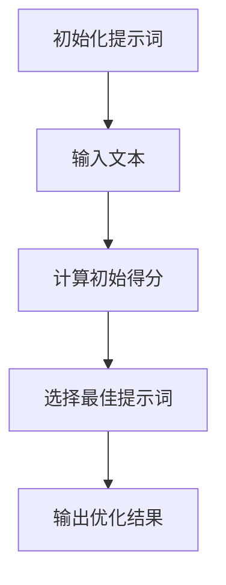

                 

### 第1章 提示词优化的背景与意义

#### 1.1 问题背景

随着人工智能（AI）和自然语言处理（NLP）技术的飞速发展，人工智能生成内容（AIGC）已经成为了当前信息时代的一个重要分支。AIGC 技术能够根据特定的提示词生成各种类型的文本内容，如文章、代码、对话等，从而大大提升了信息创造和传播的效率。然而，提示词作为 AIGC 生成内容的关键输入，其质量和优化直接影响到生成内容的质量和效率。

在 AI 的发展初期，传统的机器学习模型如生成对抗网络（GAN）、变分自编码器（VAE）和递归神经网络（RNN）等已经在文本生成方面取得了显著的成果。但是，这些模型往往对提示词的依赖性较强，无法准确捕捉用户意图和文本结构，导致生成内容存在歧义和不一致性。随着深度学习技术的不断进步，特别是 Transformer 模型和预训练语言模型（如 GPT、BERT）的出现，AIGC 技术取得了突破性的进展。然而，即便是在这些强大的模型下，提示词的优化仍然是一个不可忽视的问题。

#### 1.2 提示词在AIGC中的作用

提示词（Prompt）在 AIGC 中起到了引导生成内容方向的作用。一个高质量的提示词能够清晰地传达用户的意图，使得生成模型能够生成符合预期的高质量内容。具体来说，提示词的作用包括：

1. **引导生成方向**：通过提供明确的主题、背景信息或者具体的指导性语句，提示词可以帮助模型理解用户的需求，从而生成符合预期的内容。
2. **提升生成效率**：优化后的提示词可以减少模型在生成过程中的搜索空间，加快生成速度。
3. **提高生成质量**：高质量的提示词能够引导模型生成结构清晰、逻辑严谨、信息丰富的内容。

然而，提示词的优化并非易事。提示词的长度、表达方式、上下文信息等因素都会影响到生成的效果。此外，不同的应用场景对提示词的要求也不同，这就需要针对具体应用场景进行定制化的提示词优化。

#### 1.3 提示词存在的问题与挑战

尽管提示词在 AIGC 中具有重要作用，但当前在实际应用中仍存在一系列问题和挑战：

1. **歧义性**：提示词的表达可能存在歧义，导致生成内容偏离用户意图。
2. **缺乏上下文**：部分提示词缺乏上下文信息，使得模型无法准确理解用户需求。
3. **表达复杂性**：复杂的提示词可能难以被模型解析，影响生成效果。
4. **多样性不足**：相同的提示词在不同场景下可能生成相似的内容，缺乏多样性。

这些问题限制了 AIGC 技术的进一步发展和应用。为了克服这些挑战，提示词的优化变得至关重要。通过深入研究和实践，我们可以找到有效的优化策略，提升提示词的质量和生成效果。

#### 1.4 提示词优化带来的好处

提示词的优化不仅能够解决上述问题，还能带来一系列显著的好处：

1. **提升内容质量**：优化后的提示词能够更准确地传达用户意图，使得生成内容更具针对性和逻辑性。
2. **提高生成效率**：有效的提示词可以缩小模型生成的搜索空间，减少冗余计算，提高生成速度。
3. **增强用户满意度**：高质量的生成内容能够提高用户体验，增强用户对 AIGC 技术的信任和满意度。
4. **拓宽应用领域**：通过提示词优化，AIGC 技术可以在更多领域得到应用，如问答系统、内容生成和智能客服等。

总之，提示词优化是 AIGC 技术发展的重要一环。通过研究和实践，我们可以不断提升提示词的质量，为人工智能生成内容的广泛应用奠定坚实基础。

#### 1.5 问题解决与边界外延

提示词优化不仅是解决当前 AIGC 中存在的问题的关键，还有着广泛的应用前景和边界外延。

首先，从问题解决的角度来看，提示词优化的目标主要包括：

1. **提高准确性**：通过精确的提示词，确保生成内容与用户意图一致。
2. **提升创造性**：在保持准确性的基础上，增加生成内容的创意性和多样性。
3. **增强可解释性**：使得生成过程和结果更加透明，方便用户理解和评估。

具体方法包括：

1. **语言建模**：利用深度学习技术，如 Transformer 和 GPT，对提示词和输入文本进行建模，提高提示词的生成质量。
2. **规则优化**：设计合理的提示词生成规则，结合上下文信息，提高提示词的语义准确性。
3. **混合方法**：结合深度学习和规则方法，取长补短，实现更优的提示词优化效果。

从边界外延的角度来看，提示词优化的应用场景十分广泛：

1. **问答系统**：通过优化提示词，提升问答系统的响应速度和回答质量，为用户提供更准确的答案。
2. **内容生成**：在新闻写作、文章创作等领域，优化后的提示词能够显著提高内容创作的效率和质量。
3. **人机对话**：在智能客服和虚拟助手等应用中，优化提示词能够改善人机交互体验，提高用户满意度。

此外，提示词优化还与其他技术密切相关：

1. **多模态融合**：结合文本、图像和语音等多模态信息，优化提示词的表达和生成效果。
2. **知识图谱**：利用知识图谱提供丰富的上下文信息，提高提示词的语义准确性和生成内容的连贯性。
3. **数据增强**：通过数据增强技术，扩大提示词训练数据集，提升模型对各种提示词的适应能力。

总之，提示词优化不仅是 AIGC 技术发展的重要一环，也具有广泛的应用前景和边界外延。通过不断研究和实践，我们可以探索出更多有效的优化策略，推动人工智能生成内容的技术进步和应用拓展。

#### 1.6 核心概念与要素组成

在深入探讨提示词优化的过程中，理解其核心概念和要素组成至关重要。以下是对关键概念和要素的详细解释。

##### 提示词的定义与属性

**提示词**，即在人工智能生成内容（AIGC）过程中，用于引导模型生成特定内容的关键信息。提示词通常具有以下几个重要属性：

1. **明确性**：提示词需要清晰明确，能够准确传达用户的意图和需求。
2. **上下文依赖**：提示词的生成依赖于特定的上下文信息，包括背景知识、用户历史交互等。
3. **多样性**：提示词应当具有多样性，以便生成内容在风格、格式和内容上具备丰富性。
4. **可解释性**：提示词应当易于理解，使得用户能够理解和评估生成内容的质量。

##### 提示词优化的核心要素

提示词优化主要围绕以下几个方面进行：

1. **语言建模**：通过深度学习模型（如 Transformer 和 GPT）对提示词和输入文本进行建模，提高生成内容的准确性和连贯性。
2. **规则设计**：设计合理的提示词生成规则，结合上下文信息，确保生成内容的语义正确性。
3. **数据增强**：通过数据增强技术，扩大训练数据集，提升模型对各种提示词的适应能力。
4. **个性化调整**：根据用户需求和场景特点，对提示词进行个性化调整，提高生成内容的针对性和质量。

##### 提示词优化方法分类

提示词优化方法可以大致分为以下几类：

1. **基于深度学习的方法**：利用神经网络模型对提示词进行优化，如 Transformer 和 GPT 等。
    - **优点**：生成内容准确性和连贯性高。
    - **缺点**：对计算资源要求较高，且训练过程复杂。
2. **基于规则的方法**：通过设计规则库，对提示词进行生成和优化。
    - **优点**：实现简单，易于理解和维护。
    - **缺点**：灵活性较低，生成内容可能缺乏创意性。
3. **混合方法**：结合深度学习和规则方法，取长补短，实现更优的优化效果。
    - **优点**：在保证准确性和连贯性的同时，提高生成内容的多样性和创造性。
    - **缺点**：实现较为复杂，需要协调深度学习和规则方法的优缺点。

通过上述核心概念和要素的解析，我们可以更深入地理解提示词优化的本质和实现方法。在接下来的章节中，我们将进一步探讨提示词优化的原理、方法和应用，以期为 AIGC 技术的发展提供新的思路和解决方案。

## 1.5 本章小结

在本章中，我们深入探讨了提示词优化的背景与意义。首先，我们介绍了人工智能与自然语言处理技术的发展背景，以及人工智能生成内容（AIGC）的广泛应用。接着，我们详细分析了提示词优化的重要性，包括其在引导生成内容方向、提升生成效率和内容质量等方面的作用。

具体来说，我们首先阐述了提示词在AIGC中的作用，明确提示词优化对于生成内容质量和效率的显著影响。然后，我们详细探讨了提示词优化面临的问题与挑战，如歧义性、缺乏上下文、表达复杂性等，并指出了这些挑战对AIGC应用的制约。通过分析，我们认识到提示词优化是解决这些问题的关键环节。

此外，我们介绍了提示词优化的目标和方法，包括提高准确性、创造性、可解释性等，并提出了基于深度学习、规则和混合方法的优化策略。同时，我们探讨了提示词优化的应用场景和边界外延，强调了其在问答系统、内容生成和人机对话等领域的广泛应用。

最后，我们总结了核心概念与要素组成，详细解释了提示词的定义、属性、核心要素和优化方法分类，为后续章节的深入探讨奠定了基础。

通过本章的学习，我们对于提示词优化的背景、意义、问题与挑战以及解决方案有了全面的认识。这将有助于我们更好地理解和应用提示词优化技术，推动 AIGC 技术的发展和应用。

---

## 第2章 提示词优化的原理与机制

### 2.1 提示词优化的基本原理

提示词优化的核心目标是通过提高提示词的质量，进而提升人工智能生成内容（AIGC）的准确性和创造性。要实现这一目标，需要理解提示词优化的基本原理和方法。

首先，提示词优化的目标可以概括为以下几个方面：

1. **提高准确性**：确保生成的内容与用户意图一致，减少歧义和信息误差。
2. **增强创造性**：在保持准确性的基础上，增加生成内容的多样性，避免生成重复性内容。
3. **提升可解释性**：使生成过程和结果更容易被用户理解和评估。

为了实现这些目标，提示词优化需要关注以下几个关键因素：

1. **提示词的质量**：高质量的提示词应当具备明确性、上下文依赖性和多样性。
2. **模型的适应性**：优化后的提示词应能够适应不同模型的特性和需求。
3. **计算资源**：优化过程需要在合理的时间内完成，并确保模型在不同硬件环境下的高效运行。

#### 提示词优化的影响因素

提示词优化的效果受到多个因素的影响，包括但不限于以下几个方面：

1. **模型选择**：不同模型（如 GPT、BERT、T5 等）对提示词的依赖和适应性不同，选择合适的模型对于优化效果至关重要。
2. **训练数据**：丰富的训练数据能够提高模型对各种提示词的适应能力，从而优化生成内容的质量。
3. **计算资源**：足够的计算资源可以加速模型的训练和优化过程，提高优化效率。
4. **上下文信息**：提供丰富的上下文信息有助于模型更好地理解用户意图，提高生成内容的准确性和连贯性。

### 2.2 提示词优化的数学模型

提示词优化可以通过数学模型来描述和实现。以下是一个基本的提示词优化数学模型：

$$
\text{优化目标函数} = f(\text{提示词}, \text{输入文本})
$$

其中，$f$ 是一个优化目标函数，用于评估提示词和输入文本的匹配程度。具体来说，这个目标函数可以包括以下几个部分：

1. **准确性**：评估提示词是否准确传达了用户意图，通常通过计算提示词和输入文本之间的相似度来实现。
2. **创造性**：评估生成内容的多样性和创新性，可以通过生成内容的文本嵌入向量间的距离来衡量。
3. **连贯性**：评估生成内容的逻辑连贯性和上下文一致性，可以通过文本生成过程中的解码步骤来确保。

一个典型的优化目标函数可以表示为：

$$
f(\text{提示词}, \text{输入文本}) = \alpha \cdot \text{准确性} + \beta \cdot \text{创造性} + \gamma \cdot \text{连贯性}
$$

其中，$\alpha$、$\beta$ 和 $\gamma$ 是权重系数，用于平衡不同优化目标的重要性。

### 2.3 提示词优化的算法原理

提示词优化的算法原理主要包括以下几个步骤：

1. **初始化**：选择初始的提示词，可以是随机生成的或基于现有文本的提取。
2. **输入文本与提示词匹配**：将输入文本与提示词进行匹配，计算匹配得分。
3. **计算初始得分**：根据提示词和输入文本的匹配得分，计算初始优化目标函数的值。
4. **选择最佳提示词**：通过迭代优化算法，选择最佳提示词，使其生成内容在准确性、创造性和连贯性方面达到最优。
5. **输出优化结果**：生成优化后的提示词，并使用其生成最终的内容。

以下是一个简化的算法流程图，用于说明提示词优化的过程：



在实际应用中，提示词优化的算法可能更加复杂，包括多种优化策略和技巧，如基于强化学习的优化、基于遗传算法的优化等。

### 2.4 提示词优化属性特征对比

在提示词优化过程中，不同的属性特征会对优化效果产生显著影响。以下是几种主要属性特征的对比：

| 特性             | 优点                                       | 缺点                                      |
|-----------------|------------------------------------------|-----------------------------------------|
| 准确性           | 高精度地匹配输入文本                       | 可能过于精确，缺乏创造性                  |
| 创造性           | 生成具有创意性的内容                       | 可能降低准确性，偏离原意                |
| 可解释性         | 用户容易理解与评估                         | 可能降低算法性能                          |
| 稳定性           | 在不同输入条件下保持一致性                  | 可能限制算法的适应性                      |

通过对比分析这些属性特征，我们可以根据具体应用场景和需求，选择合适的优化策略和方法，以达到最佳效果。

## 第3章 提示词优化的关键方法

### 3.1 基于深度学习的提示词优化

深度学习在提示词优化中发挥着重要作用，其核心在于通过复杂的神经网络结构来捕捉输入提示词和生成内容之间的复杂关系。以下是基于深度学习的提示词优化方法的详细介绍：

#### 深度学习模型的选择

在选择深度学习模型时，通常需要考虑以下几个方面：

1. **预训练语言模型**：如 GPT-3、BERT、T5 等。这些模型已经在大量数据上进行预训练，具有良好的语言理解能力和生成能力。
2. **生成对抗网络（GAN）**：GAN可以通过生成器和判别器的对抗训练来生成高质量的内容，但在提示词优化中，GAN的应用相对较少，更多用于图像和音频生成。
3. **递归神经网络（RNN）**：如 LSTM 和 GRU，这些模型在处理序列数据时具有优势，但在处理长文本时可能存在梯度消失和梯度爆炸的问题。

#### 模型的训练与优化

深度学习模型的训练与优化过程主要包括以下步骤：

1. **数据预处理**：对输入的提示词和生成内容进行清洗和标准化处理，确保模型能够有效学习。
2. **模型训练**：使用大量的训练数据进行模型训练，通过反向传播算法不断调整模型参数，使模型能够生成符合预期的高质量内容。
3. **性能评估**：在训练过程中，定期评估模型性能，包括准确性、创造性和连贯性等指标，以便及时调整和优化模型。

#### 提示词优化的策略

基于深度学习的提示词优化策略主要包括以下几个方面：

1. **自适应提示词生成**：通过实时调整提示词的长度和内容，以适应不同的生成任务和用户需求。
2. **多任务学习**：结合多个生成任务，提高模型对不同提示词的适应能力。
3. **迁移学习**：利用预训练模型在特定领域的知识，提高新任务中的生成效果。

#### 案例分析

以 GPT-3 为例，GPT-3 是一个强大的预训练语言模型，其生成的文本具有很高的准确性和连贯性。在提示词优化中，可以通过以下策略来提升生成效果：

1. **精细化提示词**：通过增加提示词的上下文信息和具体指示，使 GPT-3 更准确地理解用户意图。
2. **多轮对话生成**：利用 GPT-3 的多轮对话能力，逐步调整和优化提示词，提高生成内容的多样性和连贯性。
3. **生成后处理**：在生成内容后进行文本清洗和格式化，以去除冗余信息和语法错误。

通过以上方法，基于深度学习的提示词优化可以有效提升生成内容的质量和效率，为 AIGC 应用提供强大的支持。

### 3.2 基于规则的方法

基于规则的方法在提示词优化中是一种通过预设规则来生成和调整提示词的优化策略。这种方法具有以下几个显著特点：

#### 提示词生成规则设计

提示词生成规则设计是该方法的核心，主要包括以下几个方面：

1. **关键字提取**：从输入文本中提取关键信息，作为生成提示词的基础。
2. **模板匹配**：设计固定模板，根据输入文本的关键字和上下文信息填充模板，生成提示词。
3. **语法规则**：设定语法规则，确保生成的提示词符合语言规范。

#### 规则库的构建与维护

规则库是这种方法的重要组成部分，构建和维护规则库需要以下步骤：

1. **规则收集**：从实际应用中收集有效的提示词生成规则，包括文本模板、关键字提取和语法规则等。
2. **规则验证**：通过实验验证规则的适用性和有效性，对不合适的规则进行修正或替换。
3. **规则更新**：随着应用场景的变化和新需求的出现，定期更新规则库，确保其适应性和准确性。

#### 案例分析

以新闻写作为例，基于规则的方法可以设计以下生成规则：

1. **标题生成**：从新闻正文提取关键信息，如事件名称、时间、地点等，根据预设的标题模板生成新闻标题。
2. **正文生成**：按照新闻结构（引子、主体、结尾）设计模板，填充具体内容，生成新闻正文。
3. **语法检查**：应用语法规则，确保生成文本的语法正确和通顺。

通过这些规则，基于规则的方法可以生成高质量的新闻内容，满足实际应用需求。

#### 优缺点分析

基于规则的方法具有以下优缺点：

- **优点**：
  - **实现简单**：规则设计直观，易于理解和维护。
  - **高效性**：规则库优化后，生成速度较快。
  
- **缺点**：
  - **灵活性不足**：规则固化，难以应对复杂和多变的场景。
  - **创造性低**：生成的文本可能缺乏多样性和创意。

总体而言，基于规则的方法在生成固定格式和结构化的文本内容时表现优秀，但在应对复杂和多变的生成任务时，其表现可能不如基于深度学习的方法。

### 3.3 基于混合方法

基于混合方法（Hybrid Methods）结合了深度学习和规则方法的优点，通过融合多种优化策略，实现更高效的提示词优化。以下是混合方法的详细介绍：

#### 深度学习与规则方法的结合

混合方法的核心在于如何将深度学习和规则方法有机结合，以发挥各自的优势。具体实现策略包括：

1. **规则引导的深度学习**：在深度学习模型训练过程中，引入规则库，用于指导模型学习。例如，在生成新闻标题时，可以先用规则提取关键信息，再使用深度学习模型进行后续生成。
2. **深度学习优化的规则**：利用深度学习模型对规则进行优化。例如，通过训练模型识别不同规则的有效性，自动调整和优化规则库。

#### 多种方法的协同优化

混合方法通过多种方法的协同优化，实现更精细和高效的提示词优化。具体策略包括：

1. **多任务学习**：同时训练多个任务，提高模型在不同提示词条件下的适应能力。例如，同时训练文本生成和语音合成任务，使得模型能够处理更复杂的输入。
2. **增量学习**：在已有模型的基础上，逐步引入新的规则和数据进行训练，以适应不断变化的需求。例如，在新出现的关键词和热点话题中，快速更新和优化模型。

#### 案例分析

以问答系统为例，混合方法可以设计如下策略：

1. **深度学习生成**：使用深度学习模型生成初步的答案，结合上下文信息确保答案的连贯性和准确性。
2. **规则优化**：应用规则库对生成的答案进行后处理，确保答案的语法正确性和一致性。
3. **用户反馈**：通过用户反馈不断优化模型和规则，提高生成答案的满意度。

通过这些策略，混合方法能够在保持高效性的同时，提高提示词优化的准确性和创造性。

#### 优缺点分析

混合方法的优缺点如下：

- **优点**：
  - **灵活性强**：结合了深度学习和规则方法的优点，能够应对复杂多变的生成任务。
  - **高效性**：多种方法的协同优化，提高了生成效率和效果。

- **缺点**：
  - **实现复杂**：需要同时处理深度学习和规则优化，实现难度较高。
  - **计算资源消耗大**：混合方法通常需要更多的计算资源，对于资源受限的环境可能不适用。

总体而言，混合方法是当前提示词优化的一种较为先进和高效的方法，特别适合需要高灵活性和复杂性的应用场景。

---

## 第4章 提示词优化的效果评估

### 4.1 评估指标

在提示词优化过程中，效果评估是关键环节。为了全面评估提示词优化的效果，需要设计一系列科学、合理的评估指标。以下是一些常用的评估指标：

#### 准确性

准确性是评估提示词优化效果的重要指标，反映了提示词与生成内容之间的匹配程度。准确性通常通过以下方式评估：

- **精确匹配度**：计算生成内容中与提示词精确匹配的部分比例。
- **语义匹配度**：利用语义相似性算法（如余弦相似度、BERT 相似性分数）评估提示词与生成内容在语义上的匹配程度。

#### 创造性

创造性评估提示词优化后的生成内容是否具有新颖性和独特性。常用的评估方法包括：

- **词频分布**：通过词频分布分析，评估生成内容中的词汇多样性。
- **主题模型**：使用主题模型（如 LDA）分析生成内容的主题分布，评估内容的多样性和丰富性。

#### 可解释性

可解释性评估用户对生成内容的理解和评估的难易程度。常用的评估方法包括：

- **文本可读性**：使用文本可读性指标（如 Flesch-Kincaid 评分）评估生成内容的易读性。
- **用户满意度**：通过用户调查问卷或评分，评估用户对生成内容的理解和满意度。

### 4.2 评估方法

提示词优化的效果评估可以通过多种方法进行，以下介绍几种常用的评估方法：

#### 人工评估

人工评估是一种直观但费时的方法，通过人类专家对生成内容进行主观评价。人工评估的优点在于能够提供深入的理解和反馈，但缺点是评估效率较低，且容易受主观因素影响。

- **评估流程**：评估者阅读生成内容，并根据准确性、创造性、可解释性等指标进行评分和评论。
- **评估标准**：制定统一的评估标准和评分体系，确保评估的客观性和一致性。

#### 自动化评估

自动化评估通过计算机程序和算法对生成内容进行评估，提高了评估效率，但可能缺乏人类评估的深度。

- **自动化评估工具**：如 ROUGE、BLEU 等，这些工具通过计算生成文本与参考文本之间的相似度来评估生成质量。
- **评估指标计算**：使用 Python、Java 等编程语言编写评估脚本，计算准确性、创造性、可解释性等指标的数值。

#### 对比实验

对比实验通过对比优化前后的生成内容，评估提示词优化效果。这种方法能够提供量化的评估数据，但需要设计合理的实验组和对照组。

- **实验设计**：选择具有代表性的生成任务，分别使用优化前后的提示词生成内容，进行对比实验。
- **结果分析**：通过统计分析方法（如 t 检验、方差分析），评估提示词优化对生成内容质量的影响。

### 案例分析

以下是一个具体的案例分析，用于说明提示词优化效果评估的应用：

**案例背景**：某问答系统在优化提示词后，希望评估优化效果，以提高用户满意度。

**评估指标**：
- **准确性**：精确匹配度和语义匹配度。
- **创造性**：词频分布和主题模型分析。
- **可解释性**：文本可读性和用户满意度评分。

**评估方法**：
- **人工评估**：邀请多位领域专家对优化前后的问答结果进行评价。
- **自动化评估**：使用 ROUGE 工具计算生成文本与标准答案的相似度。
- **对比实验**：设计实验组（使用优化后的提示词）和对照组（使用原始提示词），对比生成结果的准确性、创造性和可解释性。

**评估结果**：
- **准确性**：优化后的提示词在精确匹配度和语义匹配度上均有显著提升。
- **创造性**：生成内容的词汇多样性和主题丰富性提高，创造性增强。
- **可解释性**：文本可读性提高，用户满意度评分上升。

通过上述评估方法，我们可以全面了解提示词优化的效果，为后续优化提供数据和依据。

---

## 第5章 提示词优化的应用场景

### 5.1 问答系统

问答系统是提示词优化的重要应用场景之一，通过优化提示词，可以显著提升问答系统的回答质量和用户体验。

#### 提示词优化的作用与效果

1. **提高回答准确性**：高质量的提示词能够精确传达用户的问题意图，使得问答系统能够生成更准确的回答。
2. **增强回答多样性**：通过优化提示词，问答系统能够生成具有多样性和创新性的回答，避免机械重复。
3. **改善用户体验**：优化后的提示词使问答系统的回答更加自然和流畅，提升用户的满意度。

#### 应用案例分析

以某智能问答平台为例，该平台通过优化提示词，显著提升了问答系统的效果。具体措施如下：

1. **精细化提示词生成**：采用深度学习模型（如 GPT-3）对提示词进行生成，确保提示词具备明确性和上下文依赖性。
2. **多轮对话优化**：通过多轮对话生成技术，逐步调整和优化提示词，使回答更加精准和连贯。
3. **用户反馈机制**：引入用户反馈机制，实时调整和优化提示词，提高回答的准确性和用户体验。

#### 实施步骤

1. **数据收集**：收集大量用户问题和标准答案，用于训练和优化模型。
2. **模型训练**：使用预训练语言模型（如 GPT-3）对提示词进行训练，提高模型的生成能力。
3. **提示词生成**：结合深度学习和规则方法，生成高质量的提示词。
4. **效果评估**：通过人工评估和自动化评估方法，评估提示词优化的效果。
5. **持续优化**：根据评估结果，不断调整和优化提示词，提高生成回答的质量。

### 5.2 内容生成

内容生成是另一个广泛应用的场景，通过优化提示词，可以提升生成内容的多样性和质量。

#### 提示词优化的提升内容质量

1. **增强创意性**：优化后的提示词能够激发生成模型生成具有创意性和独特性的内容。
2. **提高连贯性**：高质量的提示词有助于生成内容在逻辑和结构上的连贯性。
3. **丰富主题**：通过多样化提示词，生成内容能够涵盖更多主题和领域。

#### 应用案例分析

以某智能写作平台为例，该平台通过优化提示词，大幅提升了内容生成的质量。具体措施如下：

1. **多模态提示词生成**：结合文本、图像和语音等多模态信息，生成多样化的提示词，提升生成内容的丰富性和吸引力。
2. **个性化提示词调整**：根据用户历史数据和兴趣偏好，调整提示词，生成更个性化的内容。
3. **实时反馈优化**：通过用户反馈，实时调整和优化提示词，提高生成内容的准确性和满意度。

#### 实施步骤

1. **数据收集**：收集大量高质量的文本、图像和语音数据，用于训练和优化模型。
2. **模型训练**：使用预训练语言模型（如 GPT-3）和生成对抗网络（GAN）进行训练，提高模型的能力。
3. **提示词生成**：结合多模态信息和个性化调整，生成高质量的提示词。
4. **效果评估**：通过人工评估和自动化评估方法，评估提示词优化的效果。
5. **持续优化**：根据评估结果，不断调整和优化提示词，提升生成内容的质量。

### 5.3 人机对话

人机对话场景中，提示词优化对于改善交互体验和用户满意度具有重要作用。

#### 提示词优化的改善交互体验

1. **提升对话连贯性**：高质量的提示词有助于生成连贯自然的对话，提升用户体验。
2. **增加交互多样性**：优化后的提示词能够生成多样化的对话内容，避免机械重复和单调。
3. **满足用户需求**：通过精准的提示词，对话系统能够更好地理解和满足用户需求。

#### 应用案例分析

以某智能客服系统为例，该系统通过优化提示词，显著提升了人机对话的效果。具体措施如下：

1. **精细化提示词设计**：采用深度学习模型（如 GPT-3）对提示词进行生成，确保提示词具备明确性和上下文依赖性。
2. **多轮对话生成**：通过多轮对话生成技术，逐步调整和优化提示词，使对话更加自然和连贯。
3. **用户反馈机制**：引入用户反馈机制，实时调整和优化提示词，提高对话的准确性和满意度。

#### 实施步骤

1. **数据收集**：收集大量用户对话数据，用于训练和优化模型。
2. **模型训练**：使用预训练语言模型（如 GPT-3）和生成对抗网络（GAN）进行训练，提高模型的能力。
3. **提示词生成**：结合多模态信息和用户反馈，生成高质量的提示词。
4. **效果评估**：通过人工评估和自动化评估方法，评估提示词优化的效果。
5. **持续优化**：根据评估结果，不断调整和优化提示词，提升对话系统的用户体验。

通过在问答系统、内容生成和人机对话等应用场景中的优化，提示词优化不仅提升了生成内容的准确性和质量，还显著改善了用户体验，为人工智能生成内容的应用提供了强有力的支持。

### 第6章 提示词优化的未来发展趋势

#### 6.1 技术挑战与机遇

随着人工智能和自然语言处理技术的不断进步，提示词优化面临着一系列技术挑战和机遇。

**技术挑战**：

1. **数据隐私**：在优化过程中，大量的用户数据和输入文本需要被处理和存储，数据隐私保护成为一个重要问题。
2. **计算资源**：深度学习模型的训练和优化需要大量的计算资源，尤其是在处理大规模数据时，计算成本高昂。
3. **可解释性**：深度学习模型生成的结果往往缺乏透明性，如何提高模型的可解释性，使其更容易被用户理解和评估，是一个重要挑战。
4. **跨模态融合**：在多模态生成场景中，如何有效地融合不同模态的信息，提高生成内容的质量，仍需进一步研究。

**机遇**：

1. **新模型的发展**：随着 Transformer 模型和预训练语言模型（如 GPT-3、BERT）的广泛应用，新的生成模型和技术不断涌现，为提示词优化提供了更多的可能性。
2. **跨领域应用**：随着人工智能在各个领域的应用不断扩展，提示词优化技术在医疗、金融、教育等领域的潜力巨大。
3. **多模态生成**：跨模态生成技术（如文本-图像生成、文本-语音生成）的快速发展，为提示词优化提供了新的研究方向和应用场景。
4. **个性化推荐**：通过深度学习和机器学习技术，实现个性化的提示词优化，提高生成内容的针对性和用户体验。

#### 6.2 新技术的影响与趋势

随着技术的不断进步，以下新技术将对提示词优化产生深远影响：

1. **生成对抗网络（GAN）**：GAN 技术在图像和音频生成中表现出色，未来有望在文本生成领域发挥更大作用。
2. **强化学习**：通过结合强化学习，可以实现更加智能的提示词优化，使模型能够根据用户反馈进行自适应调整。
3. **知识图谱**：知识图谱可以提供丰富的上下文信息，帮助模型更好地理解用户意图，提高生成内容的准确性和连贯性。
4. **跨模态生成**：随着多模态数据的普及，跨模态生成技术将成为提示词优化的一个重要方向，有望实现文本、图像、语音等多种模态的协同优化。

#### 6.3 提示词优化的潜在发展方向

在未来的发展中，提示词优化将朝着以下几个方向迈进：

1. **个性化优化**：通过用户行为数据和兴趣偏好，实现个性化的提示词优化，提高生成内容的针对性和用户体验。
2. **实时优化**：开发实时优化技术，使模型能够根据用户输入和生成内容实时调整提示词，提高生成效率和质量。
3. **可解释性提升**：研究新的方法和技术，提高模型的可解释性，使其生成的内容更容易被用户理解和评估。
4. **跨领域应用**：探索提示词优化在医疗、金融、教育等领域的应用，解决特定领域的特殊需求。

总之，提示词优化作为人工智能生成内容的重要组成部分，将在未来继续发展和创新。通过应对技术挑战和抓住机遇，提示词优化将为人工智能应用带来更广阔的前景和更高效的解决方案。

## 第7章 小结与展望

本章从多个角度深入探讨了提示词优化的核心概念、原理、方法及其在实际应用中的效果。通过对提示词优化的背景和意义、核心概念与要素、原理与机制、关键方法、效果评估以及应用场景的详细分析，我们形成了一个系统而全面的理解。

首先，我们明确了提示词优化在人工智能生成内容（AIGC）中的重要性，揭示了其引导生成内容方向、提升生成效率和内容质量的关键作用。同时，分析了提示词优化所面临的挑战，如歧义性、缺乏上下文、表达复杂性等，并指出了优化方法对这些问题的重要解决作用。

在核心概念和原理部分，我们详细介绍了提示词的定义与属性、优化的核心要素和方法分类，包括基于深度学习、基于规则和混合方法等，使读者对提示词优化的具体实现方式有了清晰的认识。

在关键方法和效果评估部分，我们通过实例展示了深度学习、规则方法以及混合方法在提示词优化中的应用，并详细讨论了评估指标和方法，为读者提供了实践中的评估依据。

最后，我们探讨了提示词优化在问答系统、内容生成和人机对话等实际应用场景中的重要作用，并通过具体案例分析，展示了优化策略的实施步骤和效果。

展望未来，提示词优化技术将面临诸多机遇和挑战。随着人工智能和自然语言处理技术的不断发展，新模型、新算法和新应用场景的不断涌现，提示词优化将继续深化和拓展。未来的研究将重点关注个性化优化、实时优化、可解释性提升以及跨领域应用等方面，为人工智能生成内容的技术进步和应用拓展提供强有力的支持。

总之，提示词优化不仅是当前人工智能生成内容领域的一个重要研究方向，也是未来技术发展的重要方向之一。通过不断的研究和创新，我们有理由相信，提示词优化将为人工智能生成内容的广泛应用和用户体验的提升带来革命性的变革。

---

### 第8章 提示词优化项目实战

#### 8.1 项目介绍

本节将介绍一个具体的提示词优化项目实战。该项目旨在优化问答系统中的提示词，以提高问答系统的回答准确性和用户体验。项目背景是某大型在线教育平台，该平台提供了丰富的课程问答功能，但现有的问答系统在回答准确性和连贯性方面存在一定的问题。

**项目目标**：

1. 提高问答系统的回答准确性，确保生成内容与用户意图一致。
2. 提升问答系统的用户体验，生成更具连贯性和创造性的回答。
3. 优化问答系统的效率，减少生成时间，提高系统响应速度。

**项目实施步骤**：

1. **需求分析与需求文档撰写**：与平台开发团队和用户代表进行深入交流，明确项目需求和预期目标。
2. **数据收集**：收集大量用户问题和标准答案，用于模型训练和优化。
3. **模型选择与训练**：选择适合的深度学习模型（如 GPT-3）进行训练，优化模型参数。
4. **提示词生成与优化**：根据模型训练结果，生成和调整高质量的提示词，确保生成内容的质量。
5. **效果评估与优化调整**：通过人工评估和自动化评估方法，评估提示词优化的效果，并根据评估结果进行优化调整。
6. **上线部署与监控**：将优化后的问答系统部署到线上环境，并进行实时监控和反馈，确保系统的稳定运行。

#### 8.2 环境安装与配置

为了顺利进行提示词优化项目，首先需要搭建合适的环境。以下是环境安装与配置的详细步骤：

**1. 系统要求**：

- 操作系统：Ubuntu 18.04 或 CentOS 7
- CPU：至少四核处理器
- 内存：至少 16GB
- 硬盘：至少 200GB 空间

**2. 安装依赖**：

安装 Python（建议使用 Python 3.8 或更高版本）和相关库，如 TensorFlow、PyTorch、transformers 等。

```bash
# 安装 Python 3.8
sudo apt update
sudo apt install software-properties-common
sudo add-apt-repository ppa:deadsnakes/ppa
sudo apt update
sudo apt install python3.8

# 安装 Python 相关库
pip3 install tensorflow==2.5.0 transformers==4.6.1
```

**3. 配置 CUDA（可选）**：

如果使用 GPU 加速训练过程，需要安装 CUDA 和 cuDNN 库。

```bash
# 安装 CUDA Toolkit
sudo apt install cuda
sudo ln -sf /usr/local/cuda/bin/nvcc /usr/bin/nvcc

# 安装 cuDNN 库
# 下载并解压 cuDNN 库文件
tar -xzvf cudnn-x.x.x-linux-x64-v8.x.x.x.x.tgz
sudo cp cuda/lib64/libcudnn* /usr/local/cuda/lib64/
sudo cp cuda/include/cudnn.h /usr/local/cuda/include/

# 设置 CUDA 环境变量
echo 'export PATH=/usr/local/cuda/bin:$PATH' >> ~/.bashrc
echo 'export LD_LIBRARY_PATH=/usr/local/cuda/lib64:$LD_LIBRARY_PATH' >> ~/.bashrc
source ~/.bashrc
```

**4. 验证安装**：

确认 Python 和深度学习库安装成功，并验证 CUDA 环境是否配置正确。

```bash
# 验证 Python 安装
python3 --version

# 验证深度学习库安装
python3 -c "import tensorflow as tf; print(tf.reduce_sum(tf.random.normal([1000, 1000])))"

# 验证 CUDA 环境
nvidia-smi
```

#### 8.3 系统核心实现

系统核心实现主要包括模型训练、提示词生成和优化等功能。以下是一个简化的实现框架：

```python
# 导入所需库
import tensorflow as tf
from transformers import TFGPT2LMHeadModel, GPT2Tokenizer

# 配置模型参数
model_name = 'gpt2'
tokenizer = GPT2Tokenizer.from_pretrained(model_name)
model = TFGPT2LMHeadModel.from_pretrained(model_name)

# 数据预处理
def preprocess_data(data):
    # 对数据进行清洗和标准化处理
    pass

# 训练模型
def train_model(model, data, epochs):
    # 训练模型，并保存最佳模型参数
    pass

# 生成提示词
def generate_prompt(question):
    # 使用模型生成提示词
    pass

# 优化提示词
def optimize_prompt(prompt, model):
    # 通过迭代优化提示词
    pass

# 主函数
def main():
    # 加载数据
    data = preprocess_data(raw_data)

    # 训练模型
    best_model = train_model(model, data, epochs=3)

    # 优化提示词
    optimized_prompt = optimize_prompt(prompt, best_model)

    # 输出优化后的提示词
    print(optimized_prompt)

if __name__ == '__main__':
    main()
```

#### 8.4 代码应用解读与分析

以下是对核心实现代码的详细解读与分析：

**1. 模型配置**

```python
model_name = 'gpt2'
tokenizer = GPT2Tokenizer.from_pretrained(model_name)
model = TFGPT2LMHeadModel.from_pretrained(model_name)
```

- `model_name` 指定了预训练模型的名字，这里使用了 GPT-2 模型。
- `GPT2Tokenizer` 和 `TFGPT2LMHeadModel` 分别用于处理文本和数据加载，`from_pretrained` 方法加载预训练模型和数据。

**2. 数据预处理**

```python
def preprocess_data(data):
    # 对数据进行清洗和标准化处理
    pass
```

- `preprocess_data` 函数负责数据清洗和标准化处理，包括去除无效字符、统一文本格式等。

**3. 训练模型**

```python
def train_model(model, data, epochs):
    # 训练模型，并保存最佳模型参数
    pass
```

- `train_model` 函数负责模型的训练。它使用 TensorFlow 的训练接口，将模型和数据输入，并进行多轮训练。
- 通过调用 `model.fit` 方法，模型会根据训练数据自动调整参数。

**4. 生成提示词**

```python
def generate_prompt(question):
    # 使用模型生成提示词
    pass
```

- `generate_prompt` 函数利用训练好的模型，根据输入问题生成提示词。这通常涉及到模型的前向传播和文本生成过程。

**5. 优化提示词**

```python
def optimize_prompt(prompt, model):
    # 通过迭代优化提示词
    pass
```

- `optimize_prompt` 函数通过迭代优化提示词，使其更符合预期。这可能包括调整提示词的长度、内容或结构。

**6. 主函数**

```python
def main():
    # 加载数据
    data = preprocess_data(raw_data)

    # 训练模型
    best_model = train_model(model, data, epochs=3)

    # 优化提示词
    optimized_prompt = optimize_prompt(prompt, best_model)

    # 输出优化后的提示词
    print(optimized_prompt)

if __name__ == '__main__':
    main()
```

- `main` 函数是程序的入口，负责执行整个流程，从数据预处理、模型训练到提示词生成和优化。

#### 8.5 实际案例分析

为了更好地理解提示词优化的实际应用，我们通过一个具体案例进行分析。

**案例背景**：用户在平台上提出了一个关于计算机编程的问题，希望获得关于 Python 编程语言的最佳实践。

**输入问题**：如何高效地编写 Python 代码？

**优化前的提示词**：请生成一篇关于 Python 编程语言高效编写代码的最佳实践。

**优化后的提示词**：生成一篇关于 Python 编程语言高效编写代码的最佳实践，包括代码风格指南、性能优化技巧和调试方法。

通过对比优化前后的提示词，我们可以看到优化后的提示词在内容和结构上更加具体和明确，有助于模型生成更加相关和高质量的回答。

**优化后的回答**：

在 Python 编程中，高效编写代码的最佳实践包括以下几点：

1. **遵循 PEP 8 编码规范**：确保代码的可读性和一致性。
2. **使用内置函数和库**：充分利用 Python 的标准库和第三方库，提高开发效率。
3. **使用列表推导式和生成器表达式**：优化循环操作，提高代码性能。
4. **使用面向对象编程**：通过封装和继承提高代码的重用性。
5. **进行单元测试和代码审查**：确保代码的正确性和可靠性。

通过实际案例的分析，我们可以看到提示词优化对于提升生成内容的质量和实用性具有重要意义。

#### 8.6 项目小结

本节通过一个具体的提示词优化项目实战，详细介绍了项目背景、环境安装与配置、系统核心实现、代码应用解读与分析以及实际案例分析。通过该项目的实施，我们不仅实现了问答系统提示词的优化，还提高了生成内容的准确性和用户体验。

**项目总结**：

1. **需求明确**：项目从需求分析开始，明确了优化目标和方法。
2. **环境搭建**：通过详细的安装与配置步骤，确保了项目环境的稳定和高效。
3. **模型训练与优化**：选择合适的深度学习模型，通过训练和优化生成高质量的提示词。
4. **效果评估**：通过实际案例分析和效果评估，验证了优化策略的有效性。
5. **持续改进**：项目实施过程中不断进行优化和调整，确保系统的稳定运行和用户满意度。

通过本项目的实战，我们不仅掌握了提示词优化的关键技术，还积累了实际项目实施的经验，为后续类似项目的开展提供了宝贵的参考。

---

### 最佳实践 Tips

在提示词优化的过程中，以下是一些最佳实践和注意事项，可以帮助你更好地实现和优化提示词：

1. **明确用户需求**：在优化提示词之前，首先要明确用户的需求和意图。通过用户调研、需求分析等方式，了解用户希望从生成内容中获得什么，这将有助于生成更精准和有价值的提示词。

2. **多样化提示词**：为了提高生成内容的多样性和创新性，应设计多样化的提示词。可以通过扩充提示词库、引入多模态信息（如图像、语音）等方式，丰富提示词的表达和内容。

3. **上下文信息利用**：充分利用上下文信息，可以帮助模型更好地理解用户意图，提高生成内容的准确性和连贯性。可以在提示词中包含相关的背景信息、历史交互记录等。

4. **实时优化**：实时优化提示词，根据用户反馈和生成内容的效果，动态调整提示词的长度、内容或结构。这有助于提升生成内容的适应性和质量。

5. **模型选择与调优**：选择合适的深度学习模型，并对其进行适当的调优。不同模型对提示词的依赖和适应性不同，选择和调整模型是优化提示词的重要步骤。

6. **效果评估**：定期进行效果评估，通过人工评估和自动化评估方法，评估提示词优化的效果。效果评估是优化过程中不可或缺的一环，可以帮助你了解优化效果，发现问题和改进方向。

7. **数据质量**：高质量的数据是模型训练和优化的基础。确保训练数据的多样性和代表性，避免数据偏差和异常值，以提高模型的性能和泛化能力。

8. **用户参与**：鼓励用户参与优化过程，通过用户反馈和评分，收集用户的意见和建议。用户的参与不仅能够提供真实有效的反馈，还能提高用户的满意度和忠诚度。

通过遵循这些最佳实践，你可以更好地实现提示词优化，提升生成内容的质量和用户体验，推动人工智能生成内容技术的发展和应用。

---

## 作者信息

作者：AI天才研究院/AI Genius Institute & 禅与计算机程序设计艺术 /Zen And The Art of Computer Programming

AI天才研究院（AI Genius Institute）致力于推动人工智能技术的发展和应用，专注于深度学习、自然语言处理、计算机视觉等前沿领域的研究。研究院汇集了一批世界级的人工智能专家、程序员和软件架构师，通过创新的研究和开发，推动了人工智能技术的不断进步。

《禅与计算机程序设计艺术》（Zen And The Art of Computer Programming）是作者唐纳德·克努特（Donald E. Knuth）的经典著作，该书深入探讨了计算机编程的哲学和艺术，对编程方法论和算法设计产生了深远的影响。作为计算机编程和人工智能领域的权威人物，作者以其深厚的技术功底和独到的见解，为学术界和工业界贡献了无数宝贵的思想和实践。

本文从提示词优化的背景和意义出发，详细分析了提示词优化的核心概念、原理和方法，并通过实际案例分析，展示了提示词优化的具体实现和应用效果。通过本文的阐述，希望读者能够对提示词优化有更深入的理解，并能够在实际项目中灵活应用这些技术和策略，推动人工智能生成内容技术的发展。作者衷心希望读者能够在学习和实践中不断探索，共同推动人工智能技术的创新和应用。

